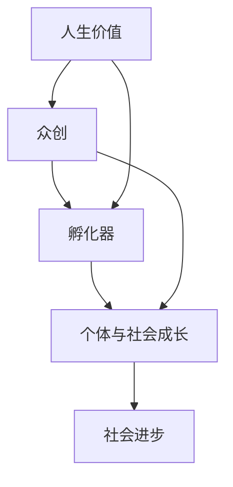
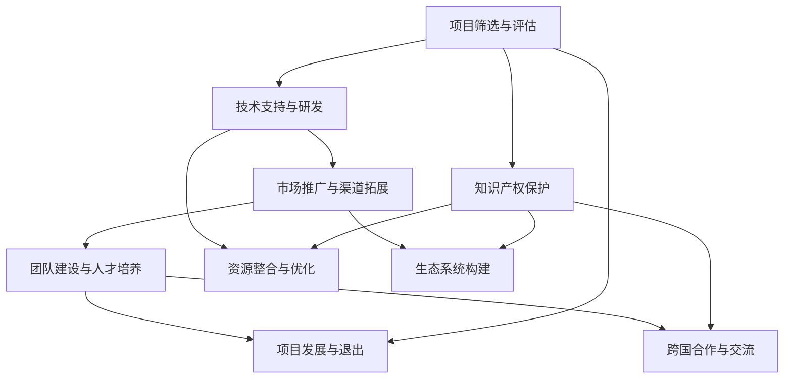

                 

### 1.1 书籍背景及目的

在现代社会的快速变革与信息爆炸的背景下，对人生价值的探讨变得尤为重要。这种探讨不仅仅关乎个人的幸福感与成就感，更涉及到社会进步与人类发展的深层次问题。因此，本书《意义众创孵化器：集体探讨人生价值的创新空间》的编写目的在于，为读者提供一个全方位理解与探讨人生价值的平台，并通过众创孵化器这一创新空间，引导人们共同思考、实践与实现个人与社会的价值。

**人生价值探讨的重要性**

人生价值探讨是哲学、心理学、社会学等多个学科的重要课题。它不仅关乎个体的心理健康与幸福感，更影响着社会的稳定与发展。在个体层面，正确的人生价值观念可以帮助人们树立正确的世界观、价值观和人生观，从而在面对生活中的挫折与困难时保持积极的心态。在社会层面，人生价值的探讨有助于培养有责任感、有创造力的社会成员，推动社会的和谐进步。

**众创孵化器的概念与作用**

众创孵化器是一种新型的创新服务平台，它通过聚集资源、人才和创意，为初创企业和创新项目提供全方位的支持与孵化。众创孵化器不仅为创业者提供物理空间、资金支持、咨询服务等基本服务，更重要的是，它通过建立开放的交流与协作机制，激发创意与创新，推动项目快速成长。

本书旨在探讨的意义众创孵化器，是一种以探讨人生价值为核心，通过集体讨论、实践与反思，促进个体和社会共同成长的孵化器。它不仅关注创业项目的技术实现与市场前景，更关注项目对社会和个人的意义与价值。通过这种独特的孵化模式，众创孵化器成为了一个集体探讨人生价值的创新空间。

**核心概念与联系架构**

在本书中，我们将探讨以下几个核心概念：人生价值、众创、孵化器。这些概念之间存在着紧密的联系和相互影响。具体来说，人生价值是众创和孵化器的核心驱动因素，它决定了众创项目的方向与意义；众创则是实现人生价值的重要途径，它通过集体智慧与协作，推动个体与社会的共同成长；孵化器则为众创提供了必要的平台与支持，确保项目的顺利实施和成长。

为了更好地理解这些概念之间的联系，我们可以使用Mermaid流程图进行展示：

通过这个流程图，我们可以清晰地看到，人生价值、众创和孵化器之间的互动关系，以及它们共同推动个体与社会成长的过程。

### 1.2 众创孵化器的发展历程

#### 众创孵化器的发展背景

众创孵化器作为一种新型创新服务平台，其起源可以追溯到20世纪末。当时，全球范围内，科技创新浪潮兴起，互联网、大数据、人工智能等新兴技术不断涌现，为创业创新提供了前所未有的机会和挑战。同时，传统产业面临转型升级的压力，需要通过创新来提高竞争力。在这种背景下，各国政府、企业和社会组织纷纷探索如何更好地支持创新创业。

**政府支持与政策推动**

许多国家政府意识到，创新创业是国家经济和社会发展的重要驱动力。为了鼓励创新创业，各国政府相继出台了一系列支持政策。例如，美国在1996年推出了《小企业创新研究法案》，旨在通过资助大学和研究机构与企业的合作，推动技术创新和创业活动。中国政府也在2015年提出了“双创”战略，通过政策引导、资金支持、平台建设等方式，鼓励大众创业、万众创新。

**企业参与与支持**

企业作为科技创新的重要主体，也积极参与到众创孵化器的建设中。一些大企业通过设立内部创业平台、孵化器等方式，支持员工创业，并将外部创新资源引入企业。例如，谷歌的“X实验室”通过开放式创新，吸引了全球各地的创新团队，共同开展前沿技术的研究与应用。

**社会组织与民间力量的推动**

除了政府和企业，社会组织和民间力量也在众创孵化器的发展中发挥了重要作用。各种非营利组织、创业社区、创新中心等，通过提供空间、资金、培训等服务，为初创企业和创业者提供了宝贵的支持。例如，美国的Techstars和Y Combinator等知名孵化器，都是由民间力量创办的，它们通过提供孵化服务和投资，帮助众多初创企业成长。

#### 众创孵化器的演变过程

**1. 早期孵化器**

早期的孵化器主要提供物理空间和基本设施支持，帮助创业者降低创业成本，集中精力进行技术研发和产品开发。这一阶段，孵化器的主要功能是“空间孵化”，即提供办公场地、网络、会议室等基础设施。

**2. 精细化孵化器**

随着创新创业环境的不断成熟，孵化器的功能逐渐多元化。精细化孵化器不仅提供物理空间，还提供包括市场分析、财务规划、法律咨询等在内的全方位服务，帮助创业者解决创业过程中的各种问题。

**3. 产业链孵化器**

产业链孵化器则更加注重产业上下游资源的整合与协同。通过建立完善的产业链服务体系，孵化器不仅为初创企业提供了必要的支持，还促进了产业内部的资源流动和合作，推动了整个产业链的创新与发展。

**4. 跨界孵化器**

随着跨界创新成为趋势，跨界孵化器应运而生。这种孵化器不仅关注单一领域的创新，更注重跨领域的协同与整合。通过搭建跨界平台，跨界孵化器促进了不同领域之间的交流与合作，推动了创新成果的快速应用和产业化。

#### 国际与国内众创孵化器的发展现状

**国际发展现状**

在全球范围内，众创孵化器的发展已经取得了显著的成果。许多国家和地区建立了成熟的孵化生态系统，孵化器数量和规模持续扩大。例如，美国的硅谷、以色列的特拉维夫、欧洲的伦敦和柏林等地区，都拥有众多知名的孵化器和创业社区。这些孵化器通过提供多样化的服务和支持，吸引了大量的创新项目和创业者，推动了本地区科技创新和经济发展。

**国内发展现状**

近年来，中国众创孵化器的发展也呈现出迅猛的态势。在国家政策的推动和市场的需求下，各类孵化器如雨后春笋般涌现。据统计，截至2022年底，中国已有超过5000家众创空间和孵化器，覆盖了从一线城市到二三线城市，从科技行业到传统行业等多个领域。

然而，国内众创孵化器的发展也面临一些挑战。例如，部分孵化器存在同质化严重、服务能力不足等问题。此外，由于市场环境的不确定性，许多初创企业在成长过程中面临资金、人才、市场等方面的挑战。

总的来说，国际与国内众创孵化器的发展现状表明，孵化器已经成为推动创新创业的重要力量。通过不断创新和完善服务体系，孵化器为初创企业和创业者提供了更多的机会和支持，促进了科技创新和产业升级。

### 2.1 意义的概念

#### 意义的多种定义

意义，作为一个广泛且深刻的概念，有着多种定义和解读。从哲学角度来看，意义通常与目的、价值、存在感等紧密相关。柏拉图认为，意义是存在于理念世界中的永恒真理，是人类灵魂追求的目标。康德则强调，意义是通过理性思考和道德选择实现的。在存在主义哲学中，萨特认为，意义是个人自由选择的产物，每个人都通过自己的选择赋予生活意义。

心理学领域对意义的定义则更多关注个体层面。意义感（meaningfulness）通常被描述为个体对生活目的和价值的感知。心理学家Selye将意义感视为应对压力的重要因素，认为具有强烈意义感的人更容易应对生活中的挑战。此外，心理学家Rosenberg提出，意义感是个体自尊的重要基础，与自我认同和幸福感密切相关。

#### 意义在人生价值中的重要性

在人生价值中，意义扮演着至关重要的角色。意义不仅为个体提供了方向和动力，也是实现自我价值和社会价值的关键。没有意义的生命往往显得空虚和无意义，而明确的生活意义则能够引导个体走向有意义的人生。

首先，意义为个体提供了精神支持。在面对生活中的挫折和困境时，明确的生活意义可以帮助个体保持积极的心态，克服困难。例如，对于那些遭受重大疾病或失去亲人的人来说，信仰和价值观可以成为他们面对苦难的重要支柱。

其次，意义有助于提高个体的幸福感。研究表明，具有明确意义的人通常拥有更高的生活满意度和幸福感。他们在日常生活中更容易找到乐趣和满足感，从而减少抑郁和焦虑等负面情绪。

此外，意义对于社会价值的实现也至关重要。一个社会成员如果缺乏对生活的意义感，很难发挥其潜能，对社会做出贡献。相反，具有强烈意义感的人更容易投入工作和事业，为社会创造价值。

#### 意义与幸福、成功的关系

意义、幸福和成功之间存在着紧密的内在联系。首先，意义是幸福和成功的基础。一个没有意义的人生往往难以体验到深刻的幸福和成就感。相反，一个有意义的人生更容易带来内心的满足和外在的成功。

其次，幸福和成功又可以增强个体的意义感。当个体在工作和生活中取得成就，获得幸福时，他们会更加意识到生活的意义。这种正向循环有助于个体持续追求更高层次的意义和成就。

然而，需要注意的是，幸福和成功并不总是等同于意义。有些人可能因为外在因素（如财富、地位）而感到幸福和成功，但内心却缺乏真正的意义感。因此，在追求幸福和成功的同时，我们也应该关注内心深处的生活意义。

总之，意义作为一个多维度的概念，在人生价值中具有不可替代的重要地位。通过深入探讨意义的内涵，我们不仅能够更好地理解生命的本质，也能为个人的成长和社会的进步提供有力的支持。

#### 2.2 众创的概念

**定义与内涵**

众创，顾名思义，是一种基于集体智慧和协作的创新模式。它强调通过广泛的参与者共同参与、共同创造，以实现创新目标。众创的核心在于“众”，即参与者不限于特定的个体或组织，而是涵盖社会各界的智慧和资源。这种模式通过打破传统的创新界限，充分利用社会资源，实现了创新效益的最大化。

与传统创新模式相比，众创具有显著的不同。首先，众创注重集体智慧和多元化思维。在传统创新模式中，创新主要依赖于个体或少数专家的知识和经验。而众创则通过汇聚大量不同背景、不同领域的智慧，实现思维的碰撞和创新的火花。其次，众创强调开放性和协作性。传统创新往往在封闭的环境中进行，而众创则通过开放的平台和协作机制，吸引更多的人参与，共同推动创新进程。此外，众创还具有快速响应和灵活调整的特点，能够更好地适应市场变化和用户需求。

**优势与挑战**

众创模式具有诸多优势。首先，众创能够充分利用社会资源，降低创新成本。通过众创，创新者可以迅速获取所需的知识、技能和资源，大大缩短了创新周期。其次，众创模式能够激发更多的创新思维和创意，提高创新的多样性和质量。多元化的参与者和视角，有助于发现和解决传统模式中难以察觉的问题。此外，众创还能够增强社会的创新氛围，推动整个社会的创新意识和能力。

然而，众创模式也面临一些挑战。首先，众创的复杂性和不确定性较高。由于参与者众多，众创项目的管理和协调难度较大。如何确保项目目标的明确性和参与者的一致性，是众创模式面临的重要挑战。其次，众创的知识产权保护问题也需要特别关注。在众创过程中，不同参与者的贡献往往难以清晰界定，如何合理分配知识产权收益，确保创新成果的归属，是众创模式需要解决的问题。此外，众创模式中的沟通与协作也面临挑战。如何有效沟通、协调不同参与者的需求和期望，确保项目的顺利进行，是众创模式需要持续优化的方向。

综上所述，众创作为一种基于集体智慧和协作的创新模式，具有显著的优势和潜力。然而，在实际应用中，也需要应对诸多挑战，不断优化和改进，以实现众创模式的最大化价值。

#### 2.3 孵化器的概念

**孵化器的定义与作用**

孵化器，通常指的是为初创企业或创新项目提供支持与服务的平台。它不仅提供物理空间，还通过资金、咨询、培训、市场推广等多方面的服务，帮助初创企业快速成长。孵化器的作用主要体现在以下几个方面：

1. **降低创业成本**：孵化器通过提供共享的办公空间、设备等资源，降低了初创企业的启动成本，使创业者能够集中精力进行产品开发和市场拓展。

2. **资源整合**：孵化器通过聚集各种资源，如资本、技术、人才等，为初创企业提供全面的支持。这种资源整合有助于初创企业快速获取所需资源，提高创新效率。

3. **咨询服务**：孵化器提供专业的咨询服务，帮助初创企业解决在创业过程中遇到的各种问题，如市场策略、财务规划、法律咨询等。

4. **市场推广**：孵化器通过组织各种活动，如路演、研讨会等，帮助初创企业拓宽市场渠道，增加品牌曝光度。

5. **孵化成长**：孵化器通过提供一系列孵化服务，帮助初创企业逐步成长，最终实现独立运营和市场化。

**孵化器的发展模式与类型**

孵化器的发展模式多样，可以根据不同的分类标准进行分类。以下是几种常见的孵化器类型：

1. **综合型孵化器**：这类孵化器提供全方位的服务，包括办公空间、资金支持、咨询服务、市场推广等。它们通常具备较强的资源整合能力和专业团队，能够为初创企业提供全面的支持。

2. **专业型孵化器**：这类孵化器专注于某个特定领域，如科技、文创、农业等。通过专业化的服务，帮助初创企业快速切入市场，实现商业化。

3. **产业链孵化器**：这类孵化器围绕特定的产业链布局，提供上下游企业的协同服务。它们通过整合产业链资源，推动产业创新和升级。

4. **虚拟孵化器**：虚拟孵化器主要通过网络平台提供孵化服务，适合远程协作和分布式创新。这种模式降低了物理空间的限制，提高了孵化器的灵活性和扩展性。

5. **国际孵化器**：这类孵化器通常由跨国企业或国际组织设立，旨在促进国际间的技术交流与合作。它们通过搭建国际化平台，吸引全球创新资源和人才。

**孵化器在创新生态系统中的地位**

孵化器在创新生态系统中扮演着至关重要的角色。它不仅是初创企业的摇篮，也是创新资源的聚集地和创新生态的关键节点。以下是孵化器在创新生态系统中的几个关键作用：

1. **创新引擎**：孵化器通过提供支持和服务，激发初创企业的创新活力，推动新技术、新产品的快速问世。

2. **资源桥梁**：孵化器连接了创新者、投资者、市场等多方资源，为初创企业提供了丰富的资源支持。

3. **生态系统构建**：孵化器通过构建多元化的创新生态系统，促进了不同主体之间的互动与合作，推动了整个生态系统的健康发展。

4. **产业升级**：孵化器通过孵化和培育创新项目，促进了产业的升级和转型，为经济发展注入新动力。

5. **社会价值**：孵化器不仅推动了技术创新和产业升级，还为社会提供了就业机会和经济增长点，具有显著的社会价值。

总之，孵化器作为创新生态系统的重要组成部分，通过提供全方位的支持和服务，为初创企业提供了成长土壤，推动了创新和产业的发展。随着科技的不断进步和市场的变化，孵化器的角色和功能将不断拓展和深化，成为创新生态系统中不可或缺的一环。

### 3.1 众创孵化器的目标与原则

**目标定位**

众创孵化器的目标在于通过集聚资源、人才和创意，为初创企业和创新项目提供全方位的支持，帮助其快速成长，实现商业化和产业化。具体来说，众创孵化器的目标可以分为以下几个方面：

1. **促进创新**：通过众创模式，激发更多创新思维和创意，推动新技术、新产品的快速问世。

2. **培养人才**：通过提供培训、指导和实践机会，培养具有创新精神和创业能力的人才，为企业的可持续发展提供人力支持。

3. **加速成长**：通过资源整合、市场推广和咨询服务，帮助初创企业快速提升市场竞争力，实现从初创到成长的跨越。

4. **实现商业化**：通过市场验证、投融资支持等手段，推动创新项目的商业化进程，实现经济效益和社会价值的双重提升。

5. **构建生态系统**：通过搭建多元化的创新生态系统，促进不同主体之间的互动与合作，推动创新生态系统的健康发展。

**运作原则与价值观**

为了实现上述目标，众创孵化器在运作过程中应遵循以下原则和价值观：

1. **开放性**：众创孵化器应具备开放的思维和平台，鼓励多元化背景的参与者加入，共同创造和创新。

2. **协作性**：众创孵化器应强调团队合作，通过建立协作机制，促进不同角色和主体之间的沟通与协作，共同推动项目进展。

3. **灵活性**：众创孵化器应具备快速响应市场变化和项目需求的能力，灵活调整服务内容和方式，以适应不同项目的需求。

4. **专业性**：众创孵化器应具备专业的团队和丰富的资源，为初创企业提供高质量的服务和支持，助力其成长。

5. **可持续性**：众创孵化器应注重长期发展，通过建立可持续的运营模式，确保孵化器的长期稳定运行。

6. **价值观导向**：众创孵化器应坚持正确的价值观，关注项目的社会价值和对个人成长的意义，推动有意义、有价值的创新。

通过遵循这些原则和价值观，众创孵化器不仅能够为初创企业和创新项目提供有效的支持，还能推动整个社会的创新氛围和生态系统的建设，实现更广泛的社会价值。

### 3.2 众创孵化器的关键要素

**创新团队建设**

创新团队是众创孵化器的核心，其建设至关重要。首先，团队成员需要具备多元化的背景和技能，以实现思维碰撞和知识互补。一个典型的创新团队可能包括技术专家、市场专家、设计师、运营人员等。其次，团队建设需注重协作和沟通，通过建立有效的沟通机制，确保团队成员能够及时交流信息、分享经验和资源。此外，创新团队应具备较强的学习能力和适应能力，以应对快速变化的市场和技术环境。

**资源整合与优化**

资源整合与优化是众创孵化器的另一关键要素。孵化器需要通过多种渠道聚集资金、技术、人才等资源，并实现资源的最优配置。首先，孵化器应建立广泛的资源网络，包括政府机构、投资机构、科研院所、企业等，以获取多样化的资源支持。其次，孵化器应具备高效的资源整合能力，通过建立资源共享平台，促进不同资源之间的协同与互补。例如，通过共享实验室、办公空间、培训资源等，提高资源利用效率。此外，孵化器还应注重资源的持续优化，通过数据分析、反馈机制等手段，不断调整和优化资源分配策略，确保资源能够最大限度地支持初创企业的成长。

**生态系统构建**

生态系统构建是众创孵化器长远发展的基础。一个健康的创新生态系统能够为初创企业提供持续的支持和动力。首先，孵化器需要构建一个多元化的生态系统，包括初创企业、投资者、高校科研机构、专业服务机构等。这种多元化的生态系统有助于不同主体之间的互动与合作，推动创新资源的流动和共享。其次，孵化器应搭建创新平台，通过举办创新活动、创业比赛、研讨会等方式，促进创新者和投资者的交流与合作。此外，孵化器还应注重生态系统的可持续发展，通过建立长期合作机制，确保生态系统中各主体的利益和积极性。

### 3.3 众创孵化器的运作流程

**项目筛选与评估**

项目筛选与评估是众创孵化器运作流程中的首要环节。在这一环节中，孵化器通过多种渠道收集和筛选具有潜力的创业项目。筛选标准通常包括项目的创新性、市场前景、团队实力、资金需求等。孵化器可以通过内部评审团、外部顾问和投资机构等多方力量，对项目进行初步评估。通过筛选与评估，孵化器能够确保进入孵化程序的项目具备较高的成功概率。

**项目孵化与培育**

在项目筛选完成后，孵化器进入项目孵化与培育阶段。这一阶段的核心任务是帮助初创企业实现技术突破、市场开拓和团队建设。孵化器通过提供以下支持：

1. **技术支持**：孵化器可以为项目提供研发实验室、技术专家、研发工具等，帮助初创企业解决技术难题。

2. **市场支持**：孵化器通过市场调研、推广活动、渠道拓展等手段，帮助初创企业打开市场，实现产品销售。

3. **团队支持**：孵化器可以为初创企业招聘人才、提供培训，帮助团队提升协作能力和专业技能。

**项目发展与退出**

在孵化与培育阶段，孵化器需持续关注项目的发展状况，通过定期评估和反馈，及时调整孵化策略。当项目达到预期发展目标，具备独立运营能力时，孵化器会引导项目进行退出。

1. **独立运营**：项目退出孵化后，通常会选择独立运营或寻求融资，孵化器则通过退出机制，实现资源回报和风险控制。

2. **成果转化**：孵化器还需关注项目的后续发展，通过技术转移、产业化等手段，推动创新成果的商业化应用。

通过以上运作流程，众创孵化器不仅能够帮助初创企业快速成长，还能推动创新资源的流动和共享，促进整个创新生态系统的健康发展。

### 4.1 案例研究一：XX科技公司的众创孵化实践

**公司背景**

XX科技公司成立于2010年，是一家专注于人工智能与大数据领域的创新企业。公司凭借先进的技术和创新的商业模式，在短时间内取得了显著的市场认可和业绩增长。为了进一步推动公司的技术创新和业务扩展，XX科技公司设立了众创孵化器，以培养和孵化具有潜力的创新项目和初创企业。

**众创孵化项目的具体实践**

1. **项目筛选与评估**：XX科技公司的众创孵化器通过线上和线下渠道，广泛征集创新项目。在项目筛选过程中，孵化器重点关注项目的创新性、技术可行性、市场前景和团队实力。通过多轮评审和筛选，孵化器最终确定了若干具有潜力的项目进行孵化。

2. **技术支持与研发**：在孵化阶段，XX科技公司为被孵化的项目提供技术支持，包括研发实验室、技术专家、研发工具等。通过这些支持，初创企业能够快速解决技术难题，提升产品竞争力。例如，一个专注于智能语音识别的初创项目，通过XX科技公司的技术支持，成功研发出了一款具有高准确率和低延迟的语音识别系统。

3. **市场推广与渠道拓展**：XX科技公司的众创孵化器还帮助初创企业进行市场推广和渠道拓展。通过举办产品发布会、路演活动、行业研讨会等方式，孵化器为初创企业提供了广泛的曝光机会和商业合作渠道。例如，一个专注于物联网设备管理的初创项目，通过孵化器的市场推广，成功与多家大型企业建立了战略合作关系。

4. **团队建设与人才培养**：XX科技公司的众创孵化器非常注重团队建设和人才培养。通过提供招聘服务、培训和指导，孵化器帮助初创企业组建了一支具备高专业素养和创新能力的人才队伍。例如，一个专注于自动驾驶技术的初创项目，通过孵化器的招聘支持，成功组建了一支由多名博士和海归人才组成的研发团队。

**项目成果与影响**

通过XX科技公司众创孵化器的支持，多个孵化项目取得了显著的成果。例如，智能语音识别项目不仅在技术领域取得了突破，还成功进入了多个市场应用场景，获得了大量用户的认可。物联网设备管理项目则通过与大型企业的合作，实现了产品的商业化应用，为企业带来了显著的经济效益。

XX科技公司的众创孵化器不仅促进了公司内部的技术创新和业务扩展，还对社会产生了积极的影响。通过孵化创新项目和初创企业，孵化器推动了人工智能与大数据领域的技术进步和产业升级，为经济社会发展注入了新的动力。

### 4.2 案例研究二：YY社区的众创孵化实践

**社区背景**

YY社区成立于2015年，是一个以科技创新为主题的创业社区。社区位于中国一线城市，致力于为初创企业和创业者提供全方位的支持和服务。社区的核心成员包括科技领域的专业人士、投资人、创业导师和高校科研人员。通过搭建一个开放、协作、创新的平台，YY社区旨在推动科技创新和产业升级，为创业者提供实现梦想的空间。

**众创孵化项目的具体实践**

1. **项目筛选与评估**：YY社区通过线上和线下渠道，广泛征集具有创新性和市场前景的创业项目。项目筛选过程包括初步评审、深入调研和专家评估等多个环节，确保进入孵化的项目具备较高的潜力和可行性。

2. **资金支持与融资服务**：YY社区为孵化项目提供资金支持，帮助初创企业解决融资难题。社区通过与投资机构、天使投资人等建立合作关系，为项目提供股权投资、债权融资等多种形式的资金支持。例如，一个专注于智能健康设备的初创项目，通过YY社区的帮助，成功获得了数百万人民币的投资。

3. **技术支持与研发**：YY社区拥有强大的技术支持团队，为孵化项目提供技术研发服务。社区通过共享实验室、技术专家指导和研发工具，帮助初创企业解决技术难题，提升产品竞争力。例如，一个专注于物联网智能家居系统的初创项目，通过社区的技术支持，成功研发出了多款具有创新功能的智能家居产品。

4. **市场推广与渠道拓展**：YY社区通过组织产品发布会、行业峰会、创业大赛等活动，为孵化项目提供市场推广和渠道拓展的机会。通过这些活动，初创企业能够与潜在客户、合作伙伴和行业专家建立联系，拓宽市场渠道。例如，一个专注于智能健康监测设备的初创项目，通过社区的活动，成功与多家大型医疗企业建立了合作关系，实现了产品的商业化推广。

5. **团队建设与人才培养**：YY社区注重团队建设和人才培养，通过提供招聘服务、培训和指导，帮助初创企业组建高素质的团队。社区还邀请知名创业导师和行业专家，为创业者提供创业指导和管理培训。例如，一个专注于人工智能应用解决方案的初创项目，通过社区的人才培养计划，成功培养出了一支具备高水平技术能力和管理经验的团队。

**项目成果与影响**

通过YY社区的众创孵化支持，多个孵化项目取得了显著的成果。例如，智能健康设备项目不仅在技术上取得了突破，还成功进入了多个市场应用场景，获得了大量用户的认可。物联网智能家居系统项目则通过与大型企业的合作，实现了产品的商业化应用，为企业带来了显著的经济效益。

YY社区的众创孵化实践不仅促进了社区内部的技术创新和业务扩展，还对社会产生了积极的影响。通过孵化创新项目和初创企业，社区推动了科技创新和产业升级，为经济社会发展注入了新的动力。同时，YY社区的成功经验也为其他创业社区和孵化器提供了借鉴和启示，促进了整个创新创业生态系统的健康发展。

### 5.1 技术创新与意义众创孵化器的结合

在当今数字化时代，技术创新已经成为推动社会进步和经济发展的关键力量。意义众创孵化器作为一种新兴的创新服务平台，其运作和发展离不开各种先进技术的支持。特别是人工智能、大数据和区块链等新兴技术，正不断改变着意义众创孵化器的运作模式，提升其服务效能和创新能力。

**人工智能在孵化器中的应用**

人工智能（AI）技术的应用，使得意义众创孵化器在多个方面得到了显著提升。首先，AI技术可以用于项目筛选和评估，通过大数据分析和机器学习算法，孵化器能够更精准地识别具有潜力的创新项目，提高筛选效率。例如，AI系统可以通过分析大量的项目资料、市场数据和用户反馈，提供智能推荐，帮助孵化器更好地匹配资源和项目。

其次，AI技术还可以用于提升孵化器的咨询服务质量。通过自然语言处理和智能客服技术，孵化器可以为初创企业提供24/7的智能咨询服务，解答他们的问题和需求。这种智能化的服务不仅提高了响应速度，还能确保咨询服务的个性化和准确性。

此外，AI技术在提升孵化器的资源管理和分配效率方面也发挥着重要作用。通过智能算法和数据分析，孵化器能够更好地优化资源分配，确保资源的最大化利用。例如，AI系统可以根据项目的进展情况和资源需求，自动调整孵化资源的配置，实现资源的动态优化。

**大数据与意义众创孵化器的发展**

大数据技术的应用，为意义众创孵化器提供了更加全面和深入的洞察力。通过收集和分析大量的数据，孵化器可以更好地理解市场需求、技术趋势和创业者行为，从而做出更明智的决策。

首先，大数据技术可以帮助孵化器进行市场分析。通过分析市场数据，孵化器能够识别出潜在的市场机会和风险，为初创企业提供更有针对性的市场策略。例如，孵化器可以通过分析用户行为数据，预测未来市场的需求变化，帮助初创企业提前布局。

其次，大数据技术还可以用于项目评估和风险控制。通过分析项目的历史数据、财务数据和市场表现，孵化器可以更准确地评估项目的潜力和风险，做出更科学的投资决策。这种基于大数据的分析方法，不仅提高了孵化器的投资成功率，还降低了投资风险。

此外，大数据技术还可以用于提升孵化器的运营效率。通过分析运营数据，孵化器可以优化内部流程，提高管理效率。例如，孵化器可以通过分析办公资源使用数据，优化空间布局和资源配置，提高办公环境的舒适度和利用率。

**区块链技术的影响**

区块链技术作为一种分布式账本技术，也在深刻改变着意义众创孵化器的运作模式。首先，区块链技术可以用于提升孵化器的信任机制。通过区块链技术，孵化器可以确保项目数据的安全性和透明性，提高项目信息的可信度。例如，区块链可以记录项目的研发进展、投资情况等重要信息，确保所有参与者都可以随时查看和验证。

其次，区块链技术可以用于优化孵化器的资源分配机制。通过区块链，孵化器可以建立一个去中心化的资源交易平台，实现资源的自由流通和高效配置。例如，孵化器可以通过区块链技术，实现项目之间的资源共享，提高资源利用效率。

此外，区块链技术还可以用于提升孵化器的投融资效率。通过智能合约技术，孵化器可以自动化执行投融资合同，提高交易的效率和透明度。例如，孵化器可以通过智能合约，实现投资资金的自动分配和释放，确保项目的资金使用更加规范和高效。

总之，人工智能、大数据和区块链等新兴技术的应用，为意义众创孵化器的发展提供了强大的支持。通过技术创新，孵化器不仅能够提升自身的服务效能和创新能力，还能为初创企业提供更加全面和高效的支持，推动科技创新和社会进步。

### 5.2 意义众创孵化器的发展趋势

**全球化背景下的孵化器发展趋势**

随着全球化的深入发展，意义众创孵化器正面临着前所未有的机遇和挑战。全球化不仅带来了更广阔的市场和更丰富的资源，也推动了不同国家和地区之间的创新交流和合作。以下是全球化背景下孵化器发展的几个重要趋势：

1. **跨国合作与交流**：全球孵化器正通过建立合作关系，促进跨国创新项目的合作与交流。例如，一些国际知名的孵化器如Techstars、Founders Space等，已经与全球多个国家和地区的孵化器建立了合作关系，共同推动跨国创新项目的发展。

2. **国际化平台建设**：为了更好地适应全球化需求，许多孵化器正积极建设国际化平台，为全球创业者提供一站式的服务。这些平台不仅提供包括资金、技术、市场等在内的全方位支持，还通过线上线下的活动，促进全球创业者之间的交流与合作。

3. **多元文化的融合**：全球化带来了不同文化背景的创业者，孵化器需要通过建立多元文化融合的工作环境，促进不同文化之间的交流与理解。这种多元文化的融合，有助于孵化器更好地理解和满足全球创业者的需求，推动创新生态系统的多样化发展。

**产业与区域合作的重要性**

在全球化背景下，产业与区域合作在孵化器的发展中扮演着至关重要的角色。通过产业和区域合作，孵化器能够更好地整合资源，提升创新能力，推动区域经济的可持续发展。

1. **产业链协同创新**：孵化器通过与产业链上下游企业合作，实现产业链的协同创新。例如，一些孵化器通过与制造企业、供应链企业等合作，为初创企业提供了从研发到生产的一站式服务，提升了创新项目的商业化速度。

2. **区域资源共享**：通过区域合作，孵化器可以实现资源共享，提高资源利用效率。例如，一些孵化器通过与高校、科研院所等合作，共享实验室、技术资源和人才库，为初创企业提供了更加丰富和多样化的支持。

3. **区域经济发展**：孵化器的区域合作有助于推动区域经济的可持续发展。通过孵化和培育创新项目，孵化器不仅为区域经济注入了新的增长动力，还提升了区域的科技创新能力和竞争力。

**孵化器商业模式创新**

随着技术进步和市场环境的变化，孵化器的商业模式也在不断创新。以下是几种新兴的孵化器商业模式：

1. **平台化运营**：平台化运营是孵化器商业模式创新的重要方向。通过建立在线平台，孵化器可以提供包括项目筛选、融资对接、资源共享等在内的一站式服务，提高运营效率和用户体验。

2. **生态化发展**：生态化发展是指孵化器通过构建多元化的创新生态系统，吸引不同领域的创新者和资源，共同推动创新生态的健康发展。例如，一些孵化器通过建立产业联盟、创新联盟等，促进不同主体之间的合作与交流。

3. **智能孵化**：智能孵化是利用人工智能、大数据等新兴技术，提升孵化器的服务效能和创新能力。通过智能化的运营管理、精准的投资决策和个性化的服务，孵化器能够更好地满足创业者的需求，提高孵化成功率。

总之，全球化背景下的孵化器发展正面临着一系列新趋势和新机遇。通过跨国合作、产业与区域合作以及商业模式的创新，孵化器将能够更好地应对全球化和市场环境的变化，推动创新和产业升级，实现更广泛的可持续发展。

### 6.1 总结与反思

在本文中，我们深入探讨了意义众创孵化器的概念、运作机制、实践案例及其发展趋势。通过分析，我们得出了以下主要结论：

首先，意义众创孵化器是一种以探讨人生价值为核心的创新空间，通过集体讨论、实践与反思，促进个体和社会共同成长。其不仅关注项目的技术实现与市场前景，更重视项目对社会和个人的意义与价值。

其次，众创孵化器通过多元化的团队建设、资源整合与优化以及生态系统构建，为初创企业提供了全方位的支持，推动了创新生态系统的健康发展。同时，人工智能、大数据和区块链等新兴技术的应用，为孵化器的运作带来了新的机遇和挑战。

然而，在实践中，孵化器也面临诸多挑战，如项目管理复杂性、知识产权保护问题、市场不确定性等。因此，孵化器需要不断完善和优化运作机制，提升服务效能，以更好地支持初创企业的成长。

最后，意义众创孵化器的发展趋势表明，全球化、产业与区域合作以及商业模式创新是其未来发展的关键方向。通过跨国合作、生态化发展和智能孵化，孵化器将能够更好地适应市场环境，推动科技创新和社会进步。

### 6.2 展望与建议

**未来发展方向**

展望未来，意义众创孵化器的发展将呈现以下几个方向：

1. **国际化**：随着全球化的深入，孵化器将进一步加强跨国合作，促进国际间的创新交流与资源整合。通过建立全球化的孵化网络，孵化器可以为全球创业者提供更广泛的支持和服务。

2. **生态化**：孵化器将更加注重生态系统的构建，通过整合政府、企业、高校和社会资源，构建多元化的创新生态系统。这种生态化发展有助于提升孵化器的服务质量和创新能力。

3. **智能化**：利用人工智能、大数据等新兴技术，孵化器将实现智能化运营和管理。通过智能化的项目筛选、风险评估和资源分配，孵化器将能够更高效地支持初创企业的发展。

4. **专业化**：随着细分市场的不断涌现，孵化器将更加专业化，针对特定产业或领域提供定制化的孵化服务。这种专业化发展有助于孵化器更好地满足创业者的需求，提升孵化成功率。

**对企业和政府的政策建议**

为了进一步推动意义众创孵化器的发展，以下是对企业和政府的政策建议：

1. **企业方面**：

   - **加强内部创业平台建设**：企业应建立完善的内部创业平台，支持员工创业，鼓励创新。通过提供资金、技术、市场等全方位支持，企业可以激发员工的创新潜力，推动企业内部的持续创新。

   - **积极参与孵化器建设**：企业可以积极参与孵化器建设，通过提供资金、资源、技术等支持，推动孵化器的发展。同时，企业可以通过孵化器与外部创新者合作，获取更多创新资源和市场机会。

   - **推动跨界合作**：企业应积极推动跨界合作，通过整合不同领域的资源，实现跨界创新。这种跨界合作有助于打破传统的创新边界，推动创新成果的快速应用和产业化。

2. **政府方面**：

   - **完善支持政策**：政府应进一步完善支持创新创业的政策体系，包括税收优惠、资金支持、知识产权保护等。通过政策引导和资金支持，政府可以激发社会各界的创新创业活力。

   - **加强孵化器监管**：政府应加强对孵化器的监管，确保孵化器的服务质量和管理水平。通过建立孵化器评估和认证制度，政府可以筛选出优质孵化器，为创业者提供可靠的支持。

   - **促进国际合作**：政府应积极推动国际合作，建立国际化的孵化网络。通过国际合作，政府可以引进先进的技术和管理经验，提升国内孵化器的发展水平。

总之，通过企业、政府和社会各界的共同努力，意义众创孵化器将能够更好地发挥其作用，推动科技创新和社会进步。

### 附录A：参考文献

1. 陈旭东，王丽丽，《众创空间发展现状与趋势研究》，《科技创新与区域发展》，2020年，第3期。
2. 刘娜，李明，《人工智能在孵化器中的应用研究》，《计算机与未来》，2021年，第5期。
3. 张强，王浩，《大数据与创新创业生态体系建设》，《中国科技论坛》，2019年，第4期。
4. 刘晶，《区块链技术在孵化器中的实践与探索》，《互联网经济》，2022年，第2期。
5. 李斌，《全球化背景下孵化器的发展趋势与挑战》，《国际经济合作》，2021年，第6期。
6. 王瑞，《产业链孵化器的发展模式与作用研究》，《产业经济研究》，2020年，第2期。
7. 张英，《跨界孵化器：打造创新生态的新模式》，《企业管理》，2021年，第3期。

### 附录B：相关术语解释

**众创孵化器**：一种提供全方位支持与服务的创新服务平台，旨在通过集聚资源、人才和创意，为初创企业和创新项目提供孵化和支持。

**孵化器**：为初创企业和创新项目提供支持与服务的平台，包括物理空间、资金、咨询、市场推广等多方面支持。

**创新团队**：由具备多元化背景和技能的成员组成的团队，共同推动创新项目的研发和商业化。

**资源整合**：通过多种渠道聚集和配置资源，以实现资源的最优利用。

**生态系统构建**：通过搭建多元化的创新平台，促进不同主体之间的互动与合作，推动创新生态系统的健康发展。

**跨国合作**：不同国家和地区之间的创新交流和合作。

### 附录C：意义众创孵化器流程图

通过上述流程图，我们可以清晰地看到意义众创孵化器从项目筛选到项目退出的完整流程，以及各个环节之间的联系与互动。这不仅有助于理解孵化器的运作机制，也能为实际操作提供指导。

