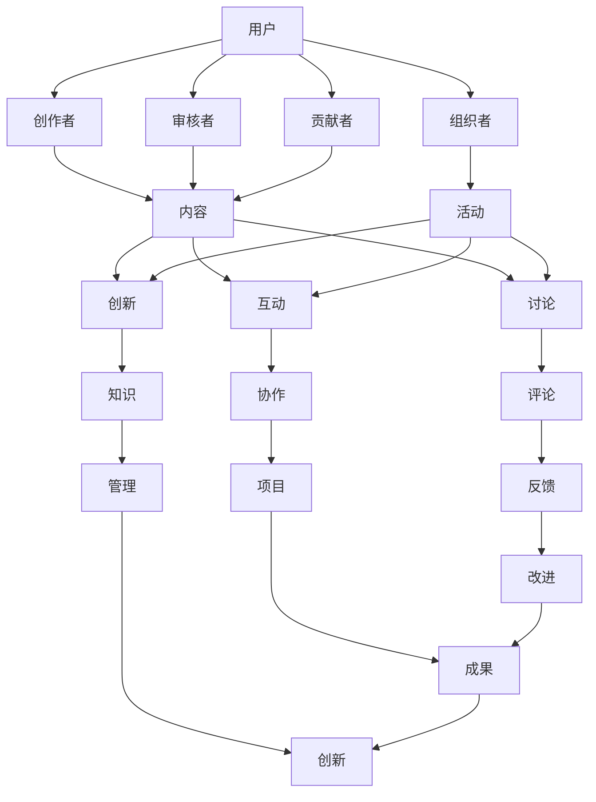

                 

### 1.1 本书的目的与意义

本书的主要目的是探讨“意义众创实验室网络”这一概念，并深入分析其在现代社会中的重要作用。通过系统性地介绍意义众创实验室网络的构成、运作机制及其全球性空间的概念，本书旨在为读者提供一个全面理解这一新型社交与知识分享平台的视角。

集体探讨人生价值的重要性在于，它不仅能够帮助个体更清晰地认识自我和世界，还能促进社会整体价值观的多元化和包容性。在这个信息爆炸、快速变化的时代，人们越来越需要通过集体智慧来应对复杂的社会问题和个人成长挑战。意义众创实验室网络正是这样一个能够汇聚全球智慧、共同探讨人生价值的平台。

具体来说，本书将帮助读者了解：

1. **意义众创实验室网络的基本概念和结构**：包括其定义、特点及其在全球范围内的影响力。
2. **用户角色与参与方式**：探讨不同用户如何在平台上发挥各自的作用，以及他们参与的意义。
3. **内容生产与分享机制**：详细分析内容创建、发布、分享和互动的过程。
4. **知识管理与知识创新**：探讨如何在平台上实现知识的有效管理和创新。
5. **社区互动与协作机制**：分析平台内如何通过互动和协作来实现集体智慧的最大化。
6. **实施与运营策略**：提供实施步骤、运营策略和优化方法。
7. **影响与挑战**：探讨意义众创实验室网络对社会文化、法律法规和技术发展的影响和挑战。

通过上述内容的系统阐述，本书旨在引导读者深入思考如何利用意义众创实验室网络这一全球性空间，更好地探讨和实现人生价值。

### 1.2 意义众创实验室网络概述

#### 意义众创实验室网络的定义

意义众创实验室网络（Meaningful Crowdsourcing Laboratory Network，简称MCLN）是一个以探讨人生价值和共同解决问题为核心的全球性社交与知识分享平台。它通过将个体智慧聚集起来，形成一个集体智慧的生态系统，使得用户能够共同探讨、分享和实现人生的意义。

MCLN不仅仅是一个简单的社交网络，它更是一个创新实验室，旨在通过集体智慧解决复杂的社会问题，促进知识的传播和创新。它将用户、内容、技术、社区等多种元素有机结合，形成一个多功能、多层次的社交与知识共享平台。

#### 意义众创实验室网络的特点

1. **全球性**：MCLN覆盖全球，用户不分地域、文化和背景，都可以参与到平台的讨论和共创中。这种全球性的特点使得平台能够汇聚全球智慧，共同探讨人生价值。
   
2. **开放性**：MCLN对用户和内容都是开放的。用户可以自由注册、参与讨论、分享知识，内容也无需经过严格的审查，只要符合基本的社区规范即可发布。这种开放性为用户提供了广泛的参与空间和自由的表达渠道。

3. **协作性**：MCLN强调用户之间的协作与互动。用户不仅是内容的消费者，更是内容的创造者和传播者。通过协作，用户可以共同探讨问题、分享见解，实现知识的碰撞和融合。

4. **多样性**：MCLN涵盖了多种形式的讨论和内容，包括文本、图片、视频、音频等。这种多样性使得用户可以根据自己的兴趣和能力选择参与方式，同时也丰富了平台的讨论内容和形式。

5. **技术驱动**：MCLN依赖于先进的互联网技术和人工智能算法，包括数据挖掘、自然语言处理、推荐系统等。这些技术不仅提高了平台的运行效率，还为用户提供了个性化的服务和体验。

#### 意义众创实验室网络在全球范围内的影响力

意义众创实验室网络在全球范围内产生了深远的影响，主要体现在以下几个方面：

1. **社会价值**：MCLN为全球用户提供了一个共同探讨人生价值的平台，促进了全球范围内的文化交流和价值共识。通过集体探讨，用户能够更清晰地认识自我和世界，提高个人的精神境界和社会责任感。

2. **知识传播**：MCLN汇聚了全球各地的知识和智慧，使得知识得以迅速传播和分享。用户不仅可以从平台获取到最新的知识，还可以通过参与讨论和共创，将知识转化为自己的见解和经验。

3. **技术创新**：MCLN鼓励用户进行创新实践，通过协作和互动，用户可以共同探索新的技术和解决方案，推动技术的进步和社会的发展。

4. **经济发展**：MCLN为用户提供了广泛的就业机会和创业平台，促进了数字经济的发展。用户可以在平台上实现个人价值，同时为社会创造经济价值。

总之，意义众创实验室网络是一个具有巨大潜力和广泛影响力的全球性平台，它不仅改变了人们的交流方式，还深刻影响了社会的文化和经济发展。通过这一平台，人们可以更有效地探讨人生价值，实现个人和社会的共同进步。

### 1.3 全球性空间的概念

#### 全球性空间的重要性

全球性空间的重要性在于它为人们提供了一个跨越地域、文化和语言障碍的交流平台，使得全球用户可以无缝连接、互动和合作。在全球化的今天，全球性空间不仅是一个技术上的创新，更是一种社会结构的变革。它推动了全球范围内的知识共享、文化交流和社会进步，为人们探讨和实现人生价值提供了一个广阔的舞台。

首先，全球性空间促进了知识的共享和传播。通过互联网和先进的技术，全球性空间使得各种知识和信息可以迅速传播到世界各地，打破了传统教育和信息传播的壁垒。用户不仅可以轻松获取到全球最新的研究成果和知识，还可以通过互动和讨论，将这些知识转化为自己的见解和经验，从而实现知识的快速迭代和创新。

其次，全球性空间为文化交流提供了机会。不同国家和地区、不同文化背景的用户可以在全球性空间内自由表达和分享自己的文化、价值观和经验，促进了全球文化的多样性和包容性。这种文化交流不仅增进了人们对不同文化的理解和尊重，还促进了全球价值观的共识和共享，为构建一个和谐的世界奠定了基础。

此外，全球性空间还在社会进步方面发挥了重要作用。通过全球性空间，用户可以共同探讨和解决复杂的社会问题，如环境污染、贫困和不平等等。这种集体智慧的发挥，不仅能够提高解决问题的效率，还能促进社会的整体进步和可持续发展。

#### 全球性空间的定义与特点

全球性空间（Global Space）可以定义为一种跨越地域、文化和语言障碍，通过互联网和技术手段实现全球用户无缝连接和互动的虚拟空间。它具有以下几个主要特点：

1. **去中心化**：全球性空间不依赖于单一的中心节点或平台，而是由多个分布式节点和平台构成，形成一个去中心化的网络结构。这种结构使得全球性空间具有很强的抗风险能力和灵活性，能够应对各种变化和挑战。

2. **互联互通**：全球性空间通过互联网和各种通信技术，实现了全球用户之间的互联互通。用户可以在任何时间和地点，通过移动设备、电脑等接入全球性空间，进行交流和互动。

3. **多样性**：全球性空间涵盖了各种类型的用户和内容，包括个人、组织、企业、政府等。不同用户可以在全球性空间内自由表达和分享自己的观点、知识和经验，形成了丰富的内容和多样化的互动形式。

4. **智能化**：全球性空间利用人工智能、大数据等先进技术，为用户提供个性化的服务和建议，提高了用户的体验和参与度。例如，智能推荐系统可以根据用户的兴趣和行为，为用户推荐相关的讨论话题和内容，使用户能够更高效地获取所需信息。

5. **开放性**：全球性空间对用户和内容都是开放的，用户可以自由注册、参与讨论、分享知识和经验。这种开放性为全球性空间带来了丰富的内容和多元的声音，促进了知识的传播和创新。

总之，全球性空间作为一种新型的虚拟社交和知识分享平台，具有去中心化、互联互通、多样性、智能化和开放性等特点，为全球用户提供了一个共同探讨和实现人生价值的广阔舞台。

### 2.1 用户角色与参与方式

在意义众创实验室网络（MCLN）中，用户不仅仅是内容的消费者，更是内容的创造者和传播者。MCLN通过多样化的用户角色和参与方式，鼓励用户积极参与平台，共同构建一个充满活力和创造力的全球性知识共享空间。

#### 用户角色的定义

MCLN的用户角色可以分为以下几类：

1. **参与者**：参与者是MCLN中最基本的用户群体，他们可以阅读其他用户发布的内容，参与讨论和互动，为平台贡献自己的观点和见解。

2. **创作者**：创作者是指那些能够独立创作和发布内容的用户。这些用户可以撰写文章、制作视频、发布图片等，将自己的知识和经验分享给其他用户。

3. **审核者**：审核者是负责对用户发布的内容进行审核和监督的用户。他们的任务是确保内容符合社区的规范和标准，维护平台的质量和秩序。

4. **组织者**：组织者是指在MCLN中负责组织和协调各种活动、讨论和项目的用户。他们可以创建讨论组、发起项目，并负责整个活动的策划和执行。

5. **贡献者**：贡献者是指那些为MCLN平台提供资源、技术支持和资金等帮助的用户。他们可以赞助活动、提供技术支持，或者通过其他方式为平台的发展做出贡献。

#### 用户参与的多种方式

MCLN为用户提供了多种参与方式，使得每个用户都能找到适合自己的参与途径。以下是几种主要的参与方式：

1. **内容创作**：用户可以在MCLN上创作各种类型的内容，如文章、视频、图片、音频等。通过内容创作，用户不仅可以分享自己的知识和经验，还能激发其他用户的思考和讨论。

2. **参与讨论**：用户可以参与到各种话题的讨论中，与其他用户交流观点，分享见解。MCLN提供了丰富的讨论工具和平台，使得用户能够轻松参与和跟进讨论。

3. **审核内容**：对于有经验的用户，他们可以选择成为审核者，对平台上的内容进行审核，确保内容的质量和符合社区的规范。

4. **组织活动**：有组织能力的用户可以创建和发起各种活动，如线上讨论会、讲座、工作坊等。这些活动不仅能够促进用户的互动和交流，还能为平台带来更多的资源和关注。

5. **贡献资源**：用户可以通过赞助活动、提供技术支持或者资金等方式，为MCLN的发展做出贡献。这些资源和支持将有助于平台提供更好的服务，吸引更多的用户参与。

通过多样化的用户角色和参与方式，MCLN不仅为用户提供了丰富的互动和交流平台，还激发了用户的创造力和参与热情，使得平台成为一个充满活力和创造力的全球性知识共享空间。

### 2.2 内容生产与分享机制

在意义众创实验室网络（MCLN）中，内容生产与分享机制是平台的核心组成部分，它确保了知识的流动、传播和创新。以下是MCLN在内容生产与分享方面的工作流程和机制：

#### 内容生产的过程

1. **创作与编辑**：用户在MCLN平台上创作内容，可以是文章、视频、图片、音频等多种形式。用户需要按照平台的格式要求进行内容创作，并经过初步编辑确保内容的清晰性和可读性。

2. **审核与发布**：用户创作的内容会首先提交给平台的审核者进行审核。审核者会检查内容是否符合社区规范、内容质量是否达标，并给予相应的修改意见。通过审核的内容将被发布到平台上，供其他用户阅读和讨论。

3. **评论与反馈**：内容发布后，用户可以对内容进行评论和反馈。评论可以是正面的赞扬，也可以是建设性的批评和建议。这些反馈不仅可以帮助作者改进内容，还能激发更深入的讨论和思考。

4. **互动与迭代**：用户在阅读内容后，可以参与到相关话题的讨论中，与其他用户互动，共同探讨问题的各个方面。这种互动不仅能够丰富内容，还能促进知识的迭代和创新。

#### 内容分享的机制

1. **社交媒体分享**：MCLN提供了社交媒体分享功能，用户可以将内容分享到自己的社交媒体账号上，从而扩大内容的影响力。这种分享机制不仅有助于内容传播，还能吸引更多用户参与到平台中。

2. **推荐算法**：MCLN利用推荐算法，根据用户的兴趣和行为，为其推荐相关的内容和讨论。这种个性化推荐机制能够提高用户的参与度和内容消费的效率。

3. **标签与分类**：MCLN采用标签和分类机制，将内容按照主题、类型等进行分类和标记。这种分类机制不仅方便用户查找和获取感兴趣的内容，还能提高内容的曝光率和访问量。

4. **社区排行榜**：MCLN设有社区排行榜，根据用户的内容质量和参与度进行排名。这种排行榜机制能够激励用户创作高质量的内容，并鼓励积极参与社区讨论。

通过上述内容生产与分享机制，MCLN不仅确保了知识的高效流动和传播，还促进了知识的创新和社区的活跃。用户可以通过创作、评论、分享等多种方式参与到平台的互动中，共同构建一个充满活力和创造力的全球性知识共享空间。

### 2.3 知识管理与知识创新

#### 知识管理的定义与重要性

知识管理（Knowledge Management，KM）是指通过系统化的方法，收集、存储、组织和共享知识，以提高组织的创新能力和竞争力。在意义众创实验室网络（MCLN）中，知识管理显得尤为重要，因为它是平台实现知识流动、共享和创新的关键。

知识管理的重要性主要体现在以下几个方面：

1. **提升创新效率**：通过知识管理，用户可以快速获取和利用已有的知识资源，从而减少重复劳动，提高创新效率。

2. **增强协作能力**：知识管理促进了用户之间的协作与互动，使得不同背景和领域的用户可以共同探讨和解决问题。

3. **提高决策质量**：知识管理为用户提供了一个全面、准确的知识库，使得决策者能够基于全面的信息做出更明智的决策。

4. **增强竞争优势**：通过知识管理，MCLN可以不断积累和更新知识，形成独特的竞争优势。

#### 知识创新的途径与策略

在MCLN中，知识创新的途径主要包括以下几个方面：

1. **开放性平台**：MCLN通过开放性平台，鼓励用户自由分享和交流知识。这种开放性不仅促进了知识的传播，还为知识的碰撞和融合提供了空间。

2. **协作性工具**：MCLN提供多种协作性工具，如讨论区、工作坊、合作项目等，用户可以通过这些工具进行知识交流和合作。

3. **激励机制**：MCLN通过激励机制，如积分系统、排行榜等，鼓励用户积极参与知识创造和分享。

4. **技术支持**：MCLN利用先进的技术手段，如数据挖掘、自然语言处理等，为知识创新提供支持。

5. **跨学科合作**：MCLN通过跨学科合作，将不同领域的知识进行整合和创新，推动知识的跨界发展。

知识创新的策略包括：

1. **知识共享**：通过开放性平台和协作性工具，鼓励用户分享和交流知识，实现知识的共享和扩散。

2. **知识整合**：将不同来源和不同领域的知识进行整合，形成新的知识体系。

3. **知识挖掘**：利用数据挖掘技术，从大量数据中提取有价值的信息和知识。

4. **知识迭代**：通过不断的讨论、反馈和迭代，不断优化和更新知识。

5. **知识孵化**：为有潜力的知识创新项目提供孵化和支持，促进其发展壮大。

通过有效的知识管理和知识创新，MCLN不仅能够提高用户的参与度和平台的活跃度，还能推动知识的流动和传播，实现知识的创新和共享。这为用户探讨和实现人生价值提供了一个强大的知识支持体系。

### 2.4 社区互动与协作机制

在意义众创实验室网络（MCLN）中，社区互动与协作机制是平台实现集体智慧的关键组成部分。这些机制不仅促进了用户之间的交流与合作，还提升了平台的整体效率和创新能力。

#### 社区互动的方式

1. **讨论区**：MCLN提供多个主题的讨论区，用户可以根据自己的兴趣选择加入。讨论区鼓励用户发表观点、提出问题、分享见解，并进行深入的讨论。

2. **即时通讯**：平台内置了即时通讯工具，用户可以通过私聊或群组与特定用户进行实时交流。这种即时性使得问题能够快速得到解答，促进了社区内的快速互动。

3. **投票与评分**：用户可以对其他用户发布的内容进行投票和评分，这不仅能反映内容的受欢迎程度，还能激励高质量内容的产生。

4. **活动与工作坊**：MCLN定期组织线上和线下的活动、工作坊，用户可以通过这些活动进行面对面的交流与合作。

5. **协作项目**：平台支持协作项目的创建和管理，用户可以参与或发起项目，共同完成特定的任务或目标。

#### 协作机制的设计

1. **任务分配**：在协作项目中，任务分配是一个关键环节。MCLN提供了任务分配工具，管理员可以根据项目的需求将任务分配给不同的用户。任务分配工具不仅能够明确每个用户的责任，还能提高协作效率。

2. **进度跟踪**：MCLN提供了进度跟踪工具，用户可以实时查看项目的进度和任务状态。这种透明度有助于确保项目按计划进行，并及时调整计划。

3. **文档共享**：协作项目中的文档共享是至关重要的。MCLN支持多种文档格式，用户可以在线编辑和协作，确保文档的最新性和准确性。

4. **反馈与评审**：项目完成后，MCLN提供了反馈与评审机制。用户可以对项目结果进行评价，并提出改进建议，这有助于持续优化项目质量。

5. **激励机制**：为了鼓励用户积极参与社区互动和协作项目，MCLN设立了激励机制，如积分系统、排行榜等。这些机制不仅提高了用户的参与度，还能激励用户创作高质量的内容。

通过上述社区互动与协作机制的设计，MCLN为用户提供了一个高效、透明和激励良好的互动环境。这种互动和协作不仅增强了社区的凝聚力，还促进了知识的传播和创新，为用户探讨和实现人生价值提供了一个强大的支持平台。

### 3.1 实施步骤与方法

#### 实施步骤的概述

实施意义众创实验室网络（MCLN）需要经过以下几个关键步骤：

1. **需求分析**：首先，需要对平台的目标用户、功能需求、技术要求等进行全面分析。这一步骤将帮助明确MCLN的定位和建设方向。

2. **系统设计**：在需求分析的基础上，进行系统设计，包括平台架构、功能模块、数据模型等。系统设计应确保平台的高效、稳定和安全。

3. **技术选型**：选择合适的技术栈和工具，包括服务器、数据库、前端框架、后端框架等，确保平台的技术实现符合设计要求。

4. **开发与测试**：按照系统设计进行开发，并进行充分的测试，确保平台的功能完整、性能优异、安全性高。

5. **部署上线**：将开发完成的平台部署到服务器上，进行上线运行。

6. **用户培训与推广**：为用户进行平台操作培训，并通过多种渠道进行推广，吸引更多的用户参与。

7. **持续优化**：根据用户反馈和平台运行数据，不断优化平台的功能和性能，提升用户体验。

#### 实施方法的选择

1. **敏捷开发**：采用敏捷开发方法，通过快速迭代和用户反馈，确保平台能够及时响应需求变化，提高开发效率。

2. **模块化设计**：采用模块化设计，将平台功能拆分为多个模块，便于开发和维护。模块之间通过接口进行通信，提高系统的可扩展性和灵活性。

3. **DevOps文化**：引入DevOps文化，实现开发和运维的紧密协作，通过自动化工具提高部署和运维的效率。

4. **数据驱动**：通过数据分析，了解用户行为和需求，不断优化平台功能和用户体验。

5. **安全防护**：采取多种安全措施，包括数据加密、权限管理、安全审计等，确保平台的安全稳定。

通过以上实施步骤和方法，可以确保意义众创实验室网络（MCLN）的高效建设和顺利运营，为用户提供一个优质的全球性知识共享和讨论平台。

### 3.2 运营策略与优化

在意义众创实验室网络（MCLN）的运营过程中，制定科学的运营策略和采取有效的优化方法是确保平台长期健康发展、用户参与度和内容质量的重要保障。以下是MCLN的运营策略和优化方法的详细介绍：

#### 运营策略的制定

1. **用户参与激励机制**：为鼓励用户积极参与平台活动，MCLN可以设置多种激励机制，如积分系统、排行榜、奖项等。积分系统可以激励用户在平台上活跃参与，排行榜则能激励用户创作高质量的内容，奖项则能够表彰贡献突出的用户。

2. **内容质量保障**：MCLN需要建立内容审核机制，确保发布的内容符合平台规范和质量标准。审核者应定期对内容进行检查，并对违反规定的用户进行处罚，以维护平台的整体质量。

3. **社区文化建设**：培养和维护积极、健康的社区文化至关重要。平台应制定社区规则，并通过线上线下活动、社区运营团队的引导，营造一个友好、包容和积极向上的社区氛围。

4. **数据分析与反馈**：通过数据分析，MCLN可以了解用户行为和需求，发现平台运营中的问题和改进点。定期收集用户反馈，及时进行调整和优化，提升用户满意度。

5. **合作伙伴关系**：与学术界、企业、非营利组织等建立合作关系，共同推动平台的内容创新和影响力扩大。合作伙伴可以提供专业支持、资源和用户群体，为平台的发展提供有力支持。

#### 运营优化的方法

1. **用户体验优化**：不断优化平台界面和功能，提高用户体验。例如，通过用户调研、A/B测试等方法，找出用户体验中的痛点，并针对性地进行优化。

2. **内容推荐算法**：利用推荐算法，根据用户兴趣和行为，个性化推荐相关内容和讨论，提高内容曝光率和用户参与度。

3. **技术性能优化**：定期对平台进行性能优化，包括数据库性能优化、服务器负载均衡、缓存机制等，确保平台在高并发情况下依然稳定运行。

4. **安全防护**：加强平台的安全防护，包括数据加密、防火墙、安全审计等，防范各类网络攻击和数据泄露风险。

5. **持续改进与迭代**：持续跟踪平台运营数据，定期进行平台迭代和更新，不断优化功能和服务，以适应用户需求和行业变化。

通过上述运营策略和优化方法，MCLN可以确保平台的长期健康发展，提升用户体验和内容质量，从而吸引更多用户参与，实现平台的可持续发展和广泛影响力。

### 3.3 成功案例分析

#### 意义众创实验室网络的成功案例

在全球范围内，意义众创实验室网络（MCLN）的成功案例层出不穷，其中最具代表性的莫过于“全球智慧农场”项目。该项目由MCLN的发起者和多个合作伙伴共同推动，旨在通过集体智慧和协作，解决全球农业生产面临的挑战。

#### 案例的详细分析

1. **项目背景**：全球农业生产面临诸多问题，如气候变化、土地退化、资源短缺等。这些问题的解决需要全球范围内的合作和智慧。

2. **实施步骤**：
   - **需求分析**：项目团队对全球农业生产现状进行了深入调研，明确了项目的主要需求和目标。
   - **系统设计**：根据需求分析，项目团队设计了MCLN的农业版块，包括内容生产、分享、协作等模块。
   - **技术选型**：选择了适合农业领域的数据挖掘和人工智能算法，以支持项目的实施。
   - **开发与测试**：在项目团队的共同努力下，MCLN农业版块成功上线，并经过多轮测试，确保了系统的稳定性和功能性。

3. **运营策略**：
   - **用户参与激励**：通过积分系统和排行榜，鼓励用户积极参与农业话题的讨论和内容创作。
   - **内容审核**：建立了严格的内容审核机制，确保发布的内容符合农业版块的规范和质量要求。
   - **社区文化建设**：通过线上线下活动，培养和维护积极、健康的农业社区文化。

4. **成果与影响**：
   - **知识传播**：通过MCLN农业版块，大量关于农业生产的知识和经验得以快速传播和共享，促进了全球农业生产知识的普及。
   - **技术创新**：用户在平台上分享了各种创新技术和解决方案，为农业生产提供了新的思路和方法。
   - **社会效益**：通过协作和互动，用户共同探讨了农业可持续发展的问题，推动了全球农业的可持续发展。

#### 案例的详细讲解剖析

“全球智慧农场”项目在MCLN平台上取得了显著的成果，其成功原因主要有以下几点：

1. **开放性**：MCLN的开放性平台吸引了全球各地的农业专家、农民、科研人员和学生参与。这种开放性为项目的成功奠定了基础。

2. **协作性**：项目鼓励用户进行协作，共同探讨农业问题，分享创新技术和解决方案。通过协作，用户能够充分发挥各自的专业优势，实现知识的最大化利用。

3. **技术支持**：MCLN提供了先进的技术支持，包括数据挖掘、人工智能算法等，为项目提供了强大的技术保障。

4. **用户激励机制**：通过积分系统和排行榜，MCLN成功激发了用户的参与热情和创造力，促进了高质量内容的产生和传播。

5. **社区文化建设**：MCLN通过线上线下活动，培养和维护了积极、健康的农业社区文化，为用户的长期参与提供了良好的环境。

通过“全球智慧农场”项目的成功案例，MCLN不仅展示了其在促进全球知识共享和创新方面的巨大潜力，也为其他领域提供了宝贵的经验和借鉴。

### 4.1 社会文化影响

意义众创实验室网络（MCLN）的兴起，对社会文化产生了深远的影响，不仅改变了人们的生活方式，也推动了社会价值观的转型。

首先，MCLN促进了全球范围内的文化交流。通过这一平台，来自不同国家和地区的用户可以自由地表达和分享自己的文化、价值观和经验。这种跨文化的交流，不仅增进了人们对不同文化的理解和尊重，也促进了全球价值观的共识和共享。例如，MCLN上的讨论区成为了一个文化交流的舞台，用户可以分享关于传统节日、饮食习惯、宗教信仰等文化内容，从而加深了对其他文化的认知和认同。

其次，MCLN推动了社会价值观的多元化和包容性。在传统社会中，价值观往往是单一和主导性的，而MCLN为用户提供了多样化的表达渠道和互动平台，使得各种价值观可以在此共存和交流。这种多元性和包容性不仅丰富了社会文化的内涵，也促进了社会的和谐发展。例如，在MCLN的讨论区中，用户可以就不同价值观展开深入的探讨和辩论，从而实现相互理解和包容。

此外，MCLN对社会文化的另一个重要影响是它促进了知识的普及和传播。通过平台，用户可以轻松获取到全球各地的知识和信息，这些知识和信息不仅包括学术研究、技术创新，还涵盖了社会现象、历史事件等。这种知识普及，使得更多的人能够接触到高质量的知识资源，提高了整个社会的知识水平和文化素养。例如，MCLN上的知识分享区吸引了大量用户关注，他们可以在这里学习到各种专业知识和实用技能，从而提升自己的能力和竞争力。

MCLN对社会文化的影响还体现在对社会责任感的培养上。通过参与MCLN的讨论和协作项目，用户不仅能够提升个人的知识和技能，还能更加关注社会问题和公共事务。例如，MCLN的公益项目区吸引了众多用户参与，他们共同探讨和解决社会问题，为社会进步贡献自己的力量。这种参与感和责任感，不仅增强了用户的社交归属感，也促进了社会的整体进步。

总之，意义众创实验室网络（MCLN）通过促进文化交流、推动价值观多元化和包容性、普及知识和培养社会责任感，对社会文化产生了深远的影响。它不仅为用户提供了广阔的互动和分享平台，也为社会文化的发展注入了新的活力。

### 4.2 法律法规挑战

意义众创实验室网络（MCLN）作为一个全球性的平台，面临着多种法律法规的挑战。这些挑战主要包括版权问题、隐私保护、数据安全等方面。

首先，版权问题是一个重要的法律挑战。MCLN上的内容丰富多样，包括文章、图片、视频、音频等，这些内容的版权归属问题需要明确。用户在平台上发布的内容，如果是原创作品，那么版权自然归属于作者。但如果用户转载或引用他人作品，则需要遵守相关的版权法规定，获得原作者的授权。否则，平台可能会面临侵权诉讼，影响平台的正常运营。

其次，隐私保护也是一个关键的法律挑战。MCLN需要收集和处理大量用户的个人信息，如注册信息、行为数据等。根据不同国家和地区的隐私保护法规，如欧盟的《通用数据保护条例》（GDPR）和美国《加州消费者隐私法案》（CCPA），平台需要确保用户个人信息的安全和隐私。具体措施包括数据加密、访问控制、隐私政策透明等。如果平台未能妥善保护用户隐私，可能会导致严重的法律后果，如罚款、信誉受损等。

数据安全也是MCLN面临的一个重要法律挑战。平台需要防范各种网络攻击和数据泄露风险，确保用户数据的安全。这包括采取防火墙、入侵检测系统、定期安全审计等措施。根据不同国家的数据保护法规，如美国的《健康保险可携性与责任法案》（HIPAA）和欧盟的《网络与信息安全指令》（NIS Directive），平台需要符合特定的安全标准，否则可能会面临法律制裁。

为了应对这些法律法规挑战，MCLN可以采取以下策略：

1. **版权保护**：建立严格的版权审核机制，确保发布的内容符合版权法律法规。平台可以设置版权声明、授权协议等，明确版权归属和使用规则。

2. **隐私保护**：制定详细的隐私保护政策，确保用户了解其个人信息如何被收集、使用和保护。平台需要定期更新隐私政策，并根据法规要求进行用户隐私保护的优化。

3. **数据安全**：采取全面的数据安全措施，包括数据加密、访问控制、定期安全审计等。平台还应建立应急响应机制，以迅速应对和处理潜在的数据泄露事件。

4. **合规性审查**：定期对平台进行法律法规合规性审查，确保平台运营符合相关法规要求。平台可以聘请法律顾问，提供专业的合规性建议。

通过上述策略，MCLN可以有效地应对法律法规挑战，确保平台的合法运营和用户信任。这不仅有助于平台的长期发展，也能提升其在全球范围内的声誉和竞争力。

### 4.3 技术发展与创新

在意义众创实验室网络（MCLN）的发展过程中，技术的进步和创新起到了至关重要的作用。随着新技术的不断涌现，MCLN也在不断地进行技术升级和功能优化，以更好地服务于用户，推动全球知识的共享和创新。

首先，人工智能（AI）技术的快速发展为MCLN提供了强大的技术支持。通过自然语言处理（NLP）技术，MCLN能够对用户发布的内容进行自动分类、情感分析和语义理解，从而实现内容的精准推荐和智能检索。例如，MCLN可以使用AI算法分析用户的兴趣和行为，为其推荐相关的话题和内容，提高用户的参与度和满意度。

其次，大数据技术的应用使得MCLN能够对海量用户数据和内容进行分析，挖掘出潜在的价值和趋势。通过大数据分析，MCLN可以了解用户的偏好、行为模式和需求，从而优化平台的推荐算法和用户体验。例如，MCLN可以通过分析用户互动数据，发现热门话题和热门用户，进一步调整平台的内容策略和社区运营策略。

云计算技术的普及为MCLN提供了灵活、可扩展的计算和存储资源。通过云服务，MCLN可以实现全球数据的高效存储和快速访问，确保平台的稳定运行和高效服务。例如，MCLN可以使用云服务进行分布式计算，处理海量用户数据和复杂的分析任务，从而提升平台的性能和响应速度。

区块链技术的应用为MCLN带来了新的机遇和挑战。区块链技术具有去中心化、安全性和透明性等特点，适用于版权保护、交易记录和身份验证等方面。通过区块链，MCLN可以确保用户发布的内容的版权归属清晰，防止抄袭和侵权行为。例如，MCLN可以使用区块链技术记录用户的创作和互动数据，建立可信的数字版权管理机制。

在技术创新方面，MCLN也积极探索新的技术和应用场景。例如，虚拟现实（VR）和增强现实（AR）技术的应用，可以为用户带来更加沉浸式的体验，增强平台的知识传播和互动效果。此外，MCLN还可以利用物联网（IoT）技术，连接各种智能设备和传感器，实现实时数据的采集和分析，为用户提供更丰富的内容和服务。

总体来说，技术的进步和创新为意义众创实验室网络（MCLN）的发展提供了强大的动力。通过不断引入和应用新技术，MCLN不仅能够提升用户体验和平台性能，还能推动全球知识的共享和创新，为用户探讨和实现人生价值提供更好的支持。

### 5.1 意义众创实验室网络的发展趋势

#### 意义众创实验室网络的发展趋势

意义众创实验室网络（MCLN）的发展趋势体现在多个方面，这些趋势不仅推动了平台本身的成长，也对社会文化、经济和技术领域产生了深远的影响。

首先，平台的全球化趋势将继续加强。随着互联网的普及和全球化的深入，越来越多的国家和地区将加入MCLN，使得平台用户和内容的多样性更加丰富。这种全球化趋势将促进不同文化背景和价值观的交流和碰撞，推动全球知识的共享和创新。

其次，技术的不断进步将显著提升MCLN的性能和用户体验。人工智能、大数据、区块链等新兴技术的应用，将使得平台的内容推荐、知识管理和社区互动更加智能化和个性化。例如，AI技术可以帮助平台更准确地识别用户需求，推荐相关内容，提高用户的参与度和满意度。

第三，MCLN将更加注重用户体验和内容质量。随着用户对平台的要求不断提高，MCLN需要不断优化界面设计、功能模块和用户交互方式，提供更优质的服务。同时，平台将加强内容审核和管理，确保发布的内容符合社区规范，提高整体内容质量。

第四，MCLN将加强与外部合作伙伴的协作。平台将与其他学术机构、企业、非营利组织等建立合作关系，共同推动知识创新和社会发展。这种协作将不仅限于技术支持，还包括资源共享、项目合作和人才交流等，为MCLN的发展提供更多资源和机会。

第五，MCLN将积极拓展新的应用场景和领域。例如，在教育、医疗、环保等关键领域，MCLN可以通过平台的技术和资源，提供专业解决方案，推动行业的创新和进步。

#### 未来可能的变化

在未来，意义众创实验室网络（MCLN）可能面临以下变化：

1. **更加智能化的平台**：随着AI技术的发展，MCLN将实现更加智能化的内容推荐和用户互动，提高平台的运营效率和用户体验。

2. **隐私保护和数据安全**：随着法律法规的完善，MCLN将更加注重用户隐私保护和数据安全，采取更加严格的安全措施，确保用户信息的安全。

3. **去中心化的趋势**：区块链技术的应用将推动MCLN向去中心化方向发展，提高平台的透明性和抗风险能力。

4. **内容生态的多样性**：平台将吸引更多类型的内容创作者和用户参与，形成更加丰富和多样的内容生态。

5. **全球影响力的扩大**：随着平台全球化趋势的加强，MCLN将在全球范围内产生更大的影响力，推动全球知识和文化的交流与融合。

总之，意义众创实验室网络（MCLN）的未来充满机遇和挑战。通过不断的技术创新、用户体验优化和全球合作，MCLN有望成为全球知识共享和创新的重要平台，为用户探讨和实现人生价值提供更广阔的空间。

### 5.2 集体探讨人生价值的未来

#### 集体探讨人生价值的未来方向

在意义众创实验室网络（MCLN）的推动下，集体探讨人生价值的未来方向充满了无限可能性。首先，MCLN将为用户提供一个更加开放和包容的讨论平台，使得来自不同文化、背景和领域的声音得以汇聚，形成多元化的价值观碰撞和交流。这将有助于全球用户更全面、客观地认识和理解人生价值，从而推动社会价值观的进步和变革。

其次，MCLN将通过技术创新和智能算法，为用户提供更加个性化、精准的讨论话题和内容推荐。这不仅能够提高用户的参与度和满意度，还能帮助用户更高效地获取和利用有价值的信息，实现知识的共享和创新。未来，MCLN可能还会引入更多互动形式，如虚拟现实（VR）和增强现实（AR），为用户创造更加沉浸式的讨论体验。

#### 潜在的挑战与机遇

然而，集体探讨人生价值的未来也面临着一系列挑战和机遇。首先，如何在保证平台开放性的同时，确保内容的健康和高质量，是一个亟待解决的问题。MCLN需要建立更加完善的内容审核和管理机制，防止不良信息和极端观点的传播，维护平台的公信力和秩序。

其次，隐私保护和数据安全是MCLN需要持续关注的重点。随着用户数据量的增加和平台功能的拓展，如何确保用户信息安全，防止数据泄露和网络攻击，将是一个重要挑战。平台需要采取更加严格的数据加密和访问控制措施，建立健全的应急响应机制。

此外，全球化带来的文化差异和价值观冲突也是一个需要解决的问题。如何平衡不同文化和价值观之间的差异，促进相互理解和尊重，将是MCLN未来发展的重要课题。

尽管面临诸多挑战，但集体探讨人生价值的前景依然光明。首先，MCLN将为全球用户提供一个共同探讨和实现人生价值的平台，促进全球文化的交流和融合。其次，MCLN有望通过集体智慧和创新，解决许多社会问题和挑战，推动社会进步和可持续发展。最后，MCLN还将为用户个人成长和职业发展提供广阔的空间和机会，实现个人与社会的共同进步。

总之，集体探讨人生价值的未来充满了机遇和挑战。通过不断创新、优化平台和加强国际合作，MCLN有望成为全球知识共享和创新的重要引擎，推动人类社会的进步和繁荣。

### 5.3 总结与展望

#### 总结本书的核心内容

本书围绕“意义众创实验室网络”这一核心概念，系统地介绍了其在现代社会中的重要性和作用。通过详细分析用户角色、内容生产与分享机制、知识管理与创新、社区互动与协作机制等方面，本书为读者提供了一个全面理解MCLN的平台。同时，本书还探讨了MCLN的实施与运营策略、社会文化影响、法律法规挑战以及技术发展与创新，为读者呈现了一个多维度、全方位的MCLN全景图。

#### 展望意义众创实验室网络的未来

展望未来，意义众创实验室网络（MCLN）将继续在全球范围内发挥重要作用，其发展前景令人期待。首先，随着技术的不断进步和全球化趋势的加强，MCLN将吸引更多用户和内容的参与，成为全球知识共享和创新的重要平台。其次，MCLN将通过技术创新和智能算法，提供更加个性化、精准的服务，提升用户体验和平台价值。

未来，MCLN可能面临以下发展趋势和变化：

1. **全球化深入**：MCLN将覆盖更多国家和地区，促进全球文化交流和知识共享。
2. **智能化提升**：AI、大数据等技术的应用将使MCLN更加智能化，提供更精准的内容推荐和个性化服务。
3. **内容生态丰富**：平台将吸引更多类型的用户和内容创作者参与，形成多样化的内容生态。
4. **隐私保护加强**：随着数据隐私保护法律法规的完善，MCLN将采取更加严格的数据保护措施，确保用户信息安全。
5. **去中心化发展**：区块链等技术的应用将推动MCLN向去中心化方向演进，提高平台的透明性和抗风险能力。

#### 提示和建议

对于希望参与到MCLN中的用户和组织，以下是一些建议：

1. **积极参与**：主动参与MCLN的讨论和协作项目，为平台贡献自己的知识和经验。
2. **关注隐私**：在参与平台活动时，注意保护个人隐私，避免泄露敏感信息。
3. **高质量创作**：发布高质量、有价值的内容，提升自身在平台上的影响力和认可度。
4. **持续学习**：利用MCLN平台不断学习和更新知识，提升个人能力和竞争力。
5. **合作共赢**：与其他用户和组织建立合作关系，共同推动知识共享和创新。

总之，意义众创实验室网络（MCLN）为用户提供了一个广阔的探讨和实现人生价值的舞台。通过积极参与和不断创新，用户可以在这个平台上实现个人价值，同时推动社会的进步和发展。

### 附录

#### A.1 核心概念与联系架构 Mermaid 流程图

以下是意义众创实验室网络（MCLN）的核心概念及其相互关系的Mermaid流程图：



#### A.2 Python源代码示例与解读

以下是一个简单的Python源代码示例，用于展示如何在MCLN平台上发布一条内容：

```python
# 导入必要的库
import requests
import json

# 设置请求头
headers = {
    'Content-Type': 'application/json',
    'Authorization': 'Bearer YOUR_ACCESS_TOKEN'  # 替换为你的访问令牌
}

# 设置请求体，包括标题、内容、分类等信息
data = {
    'title': '如何高效学习编程？',
    'content': '编程是一项需要不断实践和学习的技能，以下是一些建议...',
    'category': '技术',
}

# 发起POST请求，上传内容
response = requests.post('https://api.mcln.example.com/content/', headers=headers, data=json.dumps(data))

# 解析响应内容
if response.status_code == 200:
    content_id = response.json()['id']
    print(f'内容发布成功，ID: {content_id}')
else:
    print(f'内容发布失败，错误信息：{response.json()}')
```

**解读：**

1. **导入库**：使用requests库发起HTTP请求，使用json库处理JSON数据。

2. **设置请求头**：包含`Content-Type`和`Authorization`，其中`Authorization`用于认证用户身份。

3. **设置请求体**：定义要发布的内容的标题、内容和分类。

4. **发起POST请求**：将请求体作为JSON数据上传到MCLN平台的API接口。

5. **解析响应内容**：根据响应的状态码和内容判断发布是否成功，并打印相应的信息。

通过这个简单的示例，用户可以了解如何使用Python在MCLN平台上发布内容。

#### A.3 数学模型和数学公式

在意义众创实验室网络（MCLN）中，一些数学模型和公式用于评估和优化用户互动和内容推荐。以下是相关的数学模型和公式：

**1. 用户兴趣模型：**
$$
\text{UserInterest}(u, c) = \frac{\text{互动频率}(u, c)}{\text{总互动频率}(u)}
$$
其中，$u$代表用户，$c$代表内容。$\text{UserInterest}(u, c)$表示用户对内容的兴趣程度，通过用户的互动频率进行计算。

**2. 内容相似度模型：**
$$
\text{ContentSimilarity}(c_1, c_2) = \cos(\text{TF-IDF}(c_1) \cdot \text{TF-IDF}(c_2))
$$
其中，$\text{TF-IDF}(c)$表示内容$c$的词频-逆文档频率权重。$\text{ContentSimilarity}(c_1, c_2)$表示内容$c_1$和$c_2$的相似度，通过余弦相似度公式计算。

**3. 推荐算法：**
$$
\text{推荐得分}(u, c) = \text{UserInterest}(u, c) \cdot \text{ContentSimilarity}(c, \text{热门内容})
$$
其中，$\text{热门内容}$是通过统计分析平台上的热门内容计算得出的。$\text{推荐得分}(u, c)$表示用户对内容$c$的推荐得分，用于推荐系统。

这些数学模型和公式在MCLN中用于评估用户的兴趣、内容相似度以及推荐算法的优化，确保平台能够为用户提供高质量、个性化的内容和推荐。通过这些模型和公式，用户可以更精准地发现和分享感兴趣的知识和内容，实现知识的有效传播和共享。

