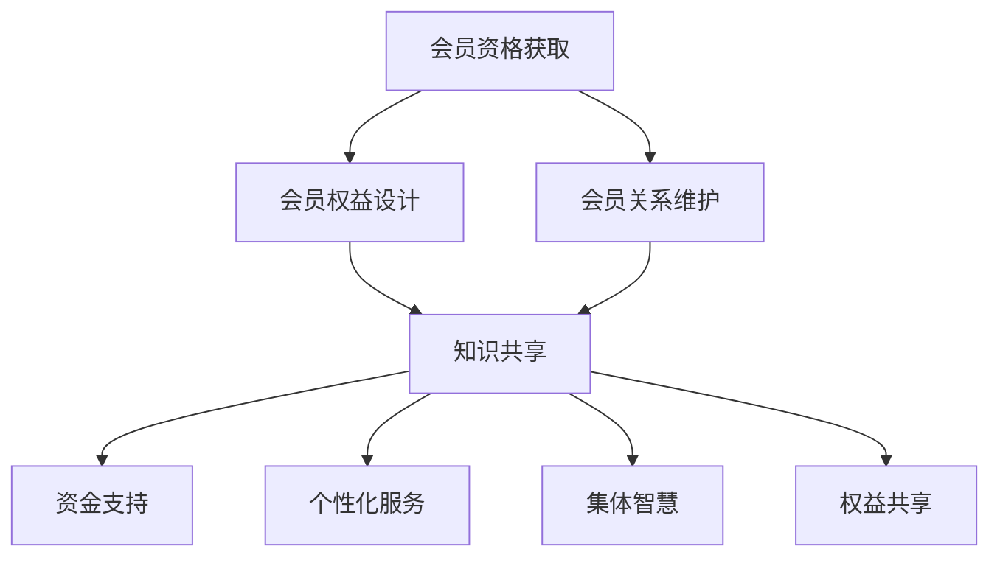

                 

### 引言

#### 1.1 众筹与智库会员制的背景

众筹，这一概念起源于传统的筹集资金方式，最早可追溯到古希腊时期。当时的众筹主要用于支持公共项目或大型工程，如古罗马的角斗场建造。然而，现代众筹的发展可以追溯到20世纪90年代末，特别是在互联网技术迅速发展的推动下，众筹平台如Kickstarter、Indiegogo等应运而生。这些平台使得项目发起人能够直接与潜在投资者连接，以小额资金汇聚成大额资金，实现了从创意到项目的顺利转化。

智库会员制则起源于知识共享和集体智慧的思路。智库作为一种知识机构，旨在提供专业的分析和建议，服务于政府、企业和社会。随着时代的发展，智库开始意识到个体智慧的重要性，并逐渐形成了会员制，通过吸纳会员的方式，实现知识共享和资源整合。会员制为会员提供了专属服务和权益，如参与内部会议、获取研究报告等。

#### 1.2 书籍目的与结构

本书旨在深入探讨意义众筹智库会员制的概念、原理、实施策略、运营模式和未来发展趋势，以期为相关从业人员提供理论与实践相结合的指导。本书的结构如下：

- **第1章 引言**：介绍众筹与智库会员制的背景，并明确书籍的目的与结构。
- **第2章 意义众筹与智库会员制概述**：详细解释意义众筹与智库会员制的概念、原理及二者融合的意义与实现路径。
- **第3章 意义众筹智库会员制的实施策略**：讨论市场调研与定位、内容规划与创作、会员权益设计等方面的具体策略。
- **第4章 意义众筹智库会员制的运营模式**：分析融资模式、运营流程、成本控制与收益分配等运营关键要素。
- **第5章 意义众筹智库会员制的案例分析**：通过具体案例展示意义众筹智库会员制的实践过程和成果。
- **第6章 意义众筹智库会员制的发展趋势**：探讨市场趋势和技术趋势对意义众筹智库会员制的影响。
- **第7章 意义众筹智库会员制的挑战与对策**：分析面临的法律法规、市场竞争和技术挑战，并提出相应的对策。

通过本书的系统性分析，我们希望能够为意义众筹智库会员制的实施提供有价值的参考，助力相关领域的发展。

### 意义众筹的概念与原理

#### 2.1.1 众筹的历史与发展

众筹这一概念最早可以追溯到公元6世纪的中国，当时民间集资修建寺庙和桥涵的做法可以看作是众筹的雏形。然而，现代众筹的概念则起源于20世纪90年代末，随着互联网技术的迅猛发展，众筹开始以一种全新的形式出现。

2000年左右，互联网众筹平台开始涌现。其中，最具代表性的平台之一是1997年成立的Kickstarter。Kickstarter的成功为众筹模式奠定了基础，它允许创意者发起项目，并通过互联网向公众展示项目，吸引小额投资。Kickstarter的成功引发了全球范围内的众筹热潮，各国纷纷成立类似的众筹平台，如美国的Indiegogo、英国的空间hive、以及中国的众筹网等。

#### 2.1.2 众筹的类型与模式

众筹可以分为多种类型，每种类型都有其独特的特点和适用场景。以下是几种常见的众筹类型：

1. **项目众筹（Project-based Crowdfunding）**：这是最常见的众筹类型，通常用于支持创意项目、艺术作品、科技发明等。项目众筹的核心在于项目成功后，众筹者可以获得实物回报或项目权益，如限量版产品、签名作等。

2. **奖励众筹（Rewards-based Crowdfunding）**：奖励众筹是一种常见的众筹模式，众筹者在支持项目时，会得到项目发起者的回报，这些回报可以是产品、服务或纪念品等。Kickstarter平台大多采用这种模式。

3. **捐赠众筹（Donation-based Crowdfunding）**：捐赠众筹是基于慈善目的的众筹，支持者通常不期望获得任何回报。这种模式常见于公益活动、灾难救援和公益项目等。

4. **债务众筹（Debt-based Crowdfunding）**：债务众筹是一种投资模式，众筹者向项目发起者提供资金，并在项目成功后获得一定的利息回报。这种模式类似于传统借贷，但通过互联网平台进行。

5. **股权众筹（Equity-based Crowdfunding）**：股权众筹是近年来兴起的一种众筹模式，支持者通过提供资金获得项目发起者的股份。这种模式对于初创企业尤为重要，因为它可以为初创企业带来资金支持，同时吸引投资者共同分担风险。

6. **预售众筹（Pre-sales Crowdfunding）**：预售众筹是针对产品或服务的众筹，众筹者通过购买未来的产品或服务来支持项目。这种模式常见于新产品开发和创意项目。

每种众筹模式都有其独特的优势和适用场景。例如，奖励众筹适合创意项目，捐赠众筹适合公益活动，债务众筹适合有稳定收益预期的项目，股权众筹适合初创企业，预售众筹适合新产品开发。

#### 2.1.3 众筹的核心要素与工作流程

众筹的核心要素包括：项目发起、资金筹集、回报发放和项目交付等。

1. **项目发起**：项目发起者首先需要在众筹平台上创建项目页面，详细描述项目内容、目标金额、筹款期限、回报设置等。

2. **资金筹集**：项目上线后，通过互联网向公众展示项目，吸引潜在投资者支持。资金筹集的过程通常是公开透明的，投资者可以看到项目的进展情况。

3. **回报发放**：项目成功筹资后，项目发起者需要按照承诺向投资者发放回报。回报的发放可以是实物、服务或权益等。

4. **项目交付**：对于提供实物回报的项目，项目发起者需要在约定的时间内完成产品的制造和交付。

5. **风险管理**：众筹过程中，项目发起者和平台需要对潜在的风险进行评估和管理，确保项目的顺利进行。

通过众筹，项目发起者能够快速获取资金支持，降低融资成本，同时公众也能通过支持感兴趣的项目，实现资金的有效配置和价值的最大化。

### 智库会员制的定义与特点

#### 2.2.1 智库会员制的起源

智库会员制作为一种知识共享和资源整合的机制，其起源可以追溯到19世纪末20世纪初。当时，随着工业革命的推进，社会问题和复杂性问题日益增多，政府和企业开始意识到需要专业的分析和建议来应对这些挑战。为了满足这一需求，智库作为知识机构应运而生。

最初的智库主要依靠政府和企业资助，以提供独立的、专业的政策建议和研究报告。随着时间的推移，智库开始意识到会员制的重要性，通过吸纳会员来增强自身的资金来源和影响力。会员制为智库提供了稳定的资金支持，同时也为会员提供了专属的服务和权益。

#### 2.2.2 智库会员制的运作机制

智库会员制的运作机制主要包括会员资格的获取、会员权益的设计和会员关系的维护等方面。

1. **会员资格的获取**：智库通常设立一定的会员资格门槛，以筛选出具有较高专业背景、实际需求或对智库有贡献意愿的会员。会员资格的获取过程通常包括申请、审核和确认等环节。

2. **会员权益的设计**：智库会员制的核心在于为会员提供专属的服务和权益。这些权益可以包括参与内部会议、优先获取研究报告、定制咨询服务、参与项目合作等。智库需要根据会员的需求和智库的定位，设计多样化的会员权益。

3. **会员关系的维护**：智库通过定期举办活动、发布研究报告、提供个性化服务等方式，与会员建立并保持良好的关系。这种关系不仅有助于提升会员的满意度和忠诚度，也有助于智库获取更多的反馈和建议，从而优化自身服务。

#### 2.2.3 智库会员制的主要特点

1. **知识共享**：智库会员制通过会员之间的知识共享和资源整合，提升整体的知识水平和创新能力。

2. **资金支持**：会员制为智库提供了稳定的资金来源，有助于智库的可持续发展。

3. **个性化服务**：智库根据会员的需求提供个性化的服务，增强会员的归属感和满意度。

4. **集体智慧**：通过吸纳多元背景的会员，智库能够汇聚不同领域的智慧，形成集体智慧，为解决复杂问题提供有力支持。

5. **权益共享**：会员通过参与智库活动、获取研究报告和定制服务等方式，分享智库的知识和资源。

#### 智库会员制的架构图

为了更好地理解智库会员制的运作机制，我们可以通过一个Mermaid流程图来展示其架构。

通过这个流程图，我们可以看到智库会员制各个环节之间的紧密联系，以及它们对智库整体运作的重要性。

### 意义众筹与智库会员制的融合

#### 2.3.1 融合的意义与价值

意义众筹与智库会员制的融合，旨在通过众筹的方式为智库会员制提供资金支持，同时利用智库的资源和专业知识，为众筹项目提供深度分析和专业建议。这种融合具有多重意义和显著的价值。

1. **资金支持**：意义众筹可以为智库会员制提供额外的资金来源，减轻智库对传统资助来源的依赖，增强智库的财务稳定性和独立性。

2. **资源整合**：通过融合，智库可以充分利用众筹平台上的资源，如投资者、潜在合作伙伴等，为智库项目提供更广泛的支持和合作机会。

3. **知识传播**：智库的专业知识和研究成果可以通过众筹平台更广泛地传播，让更多公众受益，提高智库的社会影响力和知名度。

4. **风险管理**：意义众筹可以为智库项目提供风险分担机制，通过众筹的方式，将风险分散到更多的投资者中，降低单一投资者承担的风险。

5. **创新驱动**：融合模式可以激发智库的创新动力，通过众筹平台反馈的实时数据和市场需求，智库可以更加灵活地调整研究方向和服务内容，推动智库的创新发展。

#### 2.3.2 融合的实现路径

要实现意义众筹与智库会员制的有效融合，可以采取以下几种实现路径：

1. **平台建设**：建立专门的众筹平台或合作现有平台，为智库会员制提供众筹服务。平台需要具备高效的项目展示、资金筹集、回报发放等功能。

2. **项目筛选**：智库和众筹平台共同筛选具有潜力和社会影响力的项目，确保项目能够获得足够的关注和支持。

3. **资源共享**：智库和众筹平台可以共享资源和信息，如市场数据、投资者信息等，以提高项目的成功率和公信力。

4. **专业支持**：智库可以为众筹项目提供专业的研究报告、市场分析等支持，提高项目的可信度和吸引力。

5. **会员互动**：通过会员互动平台，让智库会员参与众筹项目，提供意见和建议，增强会员的参与感和归属感。

#### 融合模式的优势与挑战

融合模式的优势在于：

- **资金快速筹集**：通过众筹，项目可以快速获得大量资金支持，缩短融资周期。
- **风险分散**：众筹将风险分散到众多投资者中，降低单一投资者承担的风险。
- **增强公信力**：智库的专业支持可以提升众筹项目的可信度和吸引力。
- **推动创新**：众筹反馈的实时数据和市场需求，可以帮助智库及时调整研究方向和服务内容。

然而，融合模式也面临一些挑战：

- **监管合规**：众筹需要遵守相关法律法规，尤其是在资金筹集和回报发放方面。
- **风险管理**：众筹过程中需要有效管理风险，确保项目的顺利进行。
- **信息透明**：众筹平台和智库需要确保信息透明，防止信息不对称和欺诈行为。
- **资源整合**：智库和众筹平台需要高效整合资源和信息，确保项目的成功。

通过上述实现路径和策略，意义众筹与智库会员制的融合可以充分发挥两者的优势，实现双赢。

### 市场调研与定位

#### 3.1.1 目标市场的选择

在实施意义众筹智库会员制之前，首先需要进行详细的市场调研，以确定目标市场。目标市场的选择是成功实施会员制的关键步骤，直接影响到会员的招募和项目的推广。

1. **市场细分**：市场细分是将整个市场划分为若干具有相似需求和行为特征的子市场。通过市场细分，可以更准确地识别潜在会员群体，从而制定有针对性的营销策略。常见的市场细分方法包括地理细分、人口细分、心理细分和行为细分。

2. **会员需求分析**：了解会员的需求是选择目标市场的重要依据。可以通过问卷调查、访谈、焦点小组讨论等方式收集会员的需求信息。例如，对于智库会员，他们可能关注的内容包括政策研究、行业分析、市场趋势等。

3. **竞争分析**：在确定目标市场后，需要分析市场上的竞争对手，了解他们的市场定位、服务内容、会员权益等。通过竞争分析，可以找出自身的竞争优势和差异化策略。

4. **市场规模和增长潜力**：评估目标市场的规模和增长潜力，以确保有足够的会员基数和潜在增长空间。可以通过查阅行业报告、市场调研数据等方式进行评估。

5. **会员获取成本**：评估获取一个会员所需的成本，包括市场调研、营销推广、会员服务等方面的投入。只有当市场潜力和会员获取成本相匹配时，目标市场选择才是有效的。

#### 3.1.2 市场调研的方法与工具

市场调研的方法和工具多种多样，选择合适的方法和工具可以有效提升调研的准确性和效率。

1. **问卷调查**：问卷调查是一种常见的市场调研方法，可以通过在线问卷、纸质问卷等形式收集会员的反馈。问卷调查的优点包括覆盖面广、数据量大、成本低等。

2. **访谈**：访谈是一种深入了解会员需求和行为的方法，可以通过面对面访谈、电话访谈、视频访谈等方式进行。访谈的优点包括信息深度高、互动性强等。

3. **焦点小组讨论**：焦点小组讨论是将一组具有相似背景的会员集中在一起，进行讨论和交流，以获取他们的意见和建议。焦点小组讨论的优点包括信息丰富、互动性强等。

4. **市场分析报告**：市场分析报告是通过对行业数据、市场趋势、竞争对手等信息的综合分析，来评估目标市场的潜力。市场分析报告的优点包括数据详实、分析深入等。

5. **社交媒体分析**：通过分析社交媒体平台上的用户行为、话题讨论等，可以了解会员的兴趣和需求。社交媒体分析的优点包括实时性强、覆盖面广等。

#### 3.1.3 市场调研报告的撰写与反馈

市场调研完成后，需要撰写市场调研报告，并进行分析和反馈。

1. **调研报告的撰写**：调研报告应包括调研目的、调研方法、调研结果和结论等部分。报告的结构清晰、内容详细，便于决策者理解和应用。

2. **结果分析**：对市场调研结果进行详细分析，包括会员需求、市场规模、竞争态势等。分析结果应具有说服力，支持后续的决策和实施。

3. **反馈机制**：将市场调研结果和结论反馈给相关利益相关者，如智库管理层、会员代表等，以获取他们的意见和建议。通过反馈机制，可以进一步完善市场调研报告，确保决策的科学性和可行性。

通过详细的市场调研和定位，可以明确目标市场，制定有效的会员招募和项目推广策略，为意义众筹智库会员制的成功实施奠定坚实基础。

#### 3.2.1 内容需求的确定

在制定意义众筹智库会员制的内容规划时，内容需求的确定是关键步骤之一。内容需求的确定不仅决定了会员的实际需求和满意度，还直接影响到项目的成功与否。

1. **会员需求调研**：首先，通过问卷调查、访谈、焦点小组讨论等方式，收集会员对内容的需求信息。调研应涵盖不同领域、不同背景的会员，以确保信息的全面性和代表性。

2. **内容分类**：根据调研结果，将会员需求进行分类，如政策研究、行业分析、市场趋势、技术创新等。内容分类有助于明确各个领域的优先级，为后续的内容创作提供方向。

3. **专家咨询**：邀请智库领域的专家进行咨询，他们可以提供专业的见解和建议，帮助确定内容需求的优先级和深度。

4. **数据分析**：利用大数据分析技术，对会员的互动行为、阅读偏好等数据进行分析，以发现潜在的内容需求。数据分析可以为内容创作提供数据支持，确保内容的高质量和针对性。

5. **市场趋势研究**：研究市场趋势和热点话题，了解哪些内容在当前市场中具有吸引力和影响力。通过市场趋势研究，可以确保内容规划紧跟时代发展，满足会员的多元化需求。

通过上述步骤，可以全面了解会员的内容需求，为后续的内容创作提供明确的指导，确保内容规划的科学性和有效性。

#### 3.2.2 内容创作的团队与流程

内容创作的团队是意义众筹智库会员制成功的关键之一。一个高效的内容创作团队需要具备多元化背景和专业技能，以确保内容的丰富性和专业性。

1. **团队组建**：
   - **内容策划**：负责内容方向和主题的规划，确保内容符合会员需求和市场趋势。
   - **研究员**：负责进行市场调研、数据分析和专家咨询，为内容创作提供数据支持。
   - **撰稿人**：负责撰写高质量的文章和报告，确保内容的专业性和准确性。
   - **编辑**：负责内容编辑、校对和排版，保证内容的连贯性和可读性。
   - **设计师**：负责内容的视觉设计，包括图表、排版和图片等，提升内容的吸引力。

2. **创作流程**：
   - **需求分析**：团队根据会员需求和市场趋势，制定内容创作计划。
   - **资料收集**：研究员收集相关数据、文献和市场研究报告，为内容创作提供基础。
   - **内容撰写**：撰稿人根据需求分析和资料收集结果，撰写初稿。
   - **专家审核**：初稿提交给专家进行审核，确保内容的准确性和专业性。
   - **编辑修改**：编辑对内容进行校对和修改，确保内容的连贯性和可读性。
   - **设计排版**：设计师对内容进行视觉设计，提升内容的视觉效果。
   - **发布审核**：内容发布前，进行最终审核，确保内容的完整性、准确性和合规性。

通过上述流程，内容创作团队可以高效地完成内容创作任务，确保内容的高质量，满足会员的需求，提升智库会员制的吸引力。

#### 3.3.1 会员权益的分类

会员权益的设计是智库会员制的重要组成部分，直接关系到会员的满意度和参与度。合理的会员权益分类可以满足不同层次会员的需求，提升会员的忠诚度和活跃度。以下是几种常见的会员权益分类：

1. **免费权益**：
   - **会员专享内容**：为会员提供独家研究报告、分析报告、行业资讯等。
   - **在线学习资源**：提供在线课程、讲座、研讨会等学习资源，帮助会员提升专业能力。
   - **优先获取**：会员优先获取智库发布的新报告、新资讯，享受信息优势。

2. **付费权益**：
   - **定制咨询服务**：为会员提供一对一的定制咨询服务，解决他们在政策研究、市场分析等方面的具体问题。
   - **专属报告**：为会员定制专属的深度研究报告，提供个性化的市场分析和策略建议。
   - **项目合作机会**：为会员提供与智库合作的优先权，参与智库主导的项目，拓展业务领域。

3. **增值权益**：
   - **会员活动参与权**：会员有权参加智库举办的各类活动，如内部会议、研讨会、行业论坛等。
   - **行业交流机会**：会员可以与其他会员进行线上或线下的交流，分享经验和见解，拓宽人脉。
   - **专家推荐**：智库为会员提供专家推荐服务，帮助会员在行业内建立专业形象和信誉。

通过合理分类会员权益，智库可以满足不同层次会员的需求，提升会员的参与度和忠诚度，进一步巩固智库在行业中的地位和影响力。

#### 3.3.2 会员权益的量化与评估

会员权益的量化与评估是确保智库会员制高效运作的关键环节。通过量化会员权益，可以明确会员所能获得的具体利益，并通过评估来不断优化权益设计，提升会员满意度和参与度。

1. **权益量化方法**：
   - **内容数量**：为会员提供的免费和专属内容数量，如每月发布的研究报告数量、在线课程时长等。
   - **服务质量**：为会员提供的定制咨询服务的质量，如响应时间、解决方案的实用性等。
   - **参与机会**：会员参与智库活动和行业交流的机会，如会议次数、论坛发言机会等。
   - **增值服务**：会员获得的专家推荐次数、项目合作机会等。

2. **评估指标**：
   - **会员满意度**：通过会员反馈调查、满意度评分等指标，评估会员对权益的满意程度。
   - **活跃度**：通过会员的在线互动、参与活动次数等指标，评估会员的活跃度。
   - **留存率**：通过会员的续费率、流失率等指标，评估会员的长期参与意愿。
   - **投资回报率**：通过评估会员权益为其带来的实际收益，如项目合作成功案例、个人职业发展等，计算投资回报率。

3. **评估流程**：
   - **定期反馈**：定期收集会员的反馈意见，了解会员对权益的实际需求和满意度。
   - **数据分析**：利用数据分析工具，对会员权益的使用数据进行分析，识别权益设计中的问题。
   - **优化调整**：根据评估结果，对会员权益进行优化调整，提升会员的参与度和满意度。
   - **反馈闭环**：将优化调整后的结果反馈给会员，形成良性循环，持续提升会员权益的质量和吸引力。

通过科学的权益量化与评估，智库可以确保会员权益的设计合理、执行有效，从而提升会员的满意度和忠诚度，为智库会员制的持续发展提供有力保障。

### 融资模式

#### 4.1.1 众筹融资的基本流程

众筹融资作为一种新型融资模式，其基本流程主要包括项目筹备、项目上线、资金筹集、回报发放和项目交付等环节。

1. **项目筹备**：
   - **项目策划**：项目发起者需要策划众筹项目，明确项目目标、预算、回报方案等。
   - **项目申请**：项目发起者需要在众筹平台提交项目申请，包括项目介绍、资金需求、筹款期限等。
   - **审核通过**：平台对项目进行审核，确保项目符合平台规定和要求。

2. **项目上线**：
   - **项目展示**：审核通过后，项目在平台上正式上线，向公众展示。
   - **宣传推广**：项目发起者通过多种渠道宣传推广项目，吸引潜在投资者的关注。

3. **资金筹集**：
   - **资金募集**：项目上线后，投资者通过平台进行投资，资金直接进入项目发起者的账户。
   - **资金监控**：平台对资金筹集过程进行监控，确保资金安全。

4. **回报发放**：
   - **回报设置**：项目发起者根据承诺，为投资者提供相应的回报，如产品、服务或权益等。
   - **回报发放**：回报发放通常在项目成功完成后进行，项目发起者需要按时履行承诺。

5. **项目交付**：
   - **项目执行**：项目发起者按照项目计划执行项目，确保项目按期完成。
   - **项目验收**：投资者对项目进行验收，确认项目完成情况。

#### 4.1.2 众筹融资的优缺点分析

众筹融资作为一种创新的融资方式，具有其独特的优势和不足。

**优点**：

1. **快速筹集资金**：众筹融资可以快速聚集大量资金，缩短融资周期。
2. **降低融资成本**：通过众筹，项目发起者可以减少传统融资过程中的中介费用和融资成本。
3. **市场推广**：众筹过程中，项目的曝光度提升，有助于品牌宣传和市场推广。
4. **风险分散**：众筹将风险分散到众多投资者中，降低单一投资者承担的风险。

**缺点**：

1. **监管合规要求**：众筹需要遵守相关法律法规，特别是在资金筹集和回报发放方面，需要确保合规性。
2. **信息不对称**：众筹过程中，项目发起者和投资者之间存在信息不对称，可能导致项目风险和回报的不确定性。
3. **项目成功率波动**：众筹项目的成功率受多种因素影响，包括市场环境、项目质量、推广力度等，存在一定波动性。
4. **资金用途监管**：众筹融资的资金用途需要透明，项目发起者需要确保资金用于项目本身，避免资金挪用。

综上所述，众筹融资具有快速筹集资金、降低融资成本和市场推广等优势，但也面临监管合规、信息不对称和项目成功率波动等挑战。项目发起者和投资者在选择众筹融资时，需要全面评估其优缺点，确保融资决策的科学性和可行性。

#### 4.2.1 会员注册与激活

会员注册与激活是意义众筹智库会员制运营的关键环节，直接影响到会员的数量和活跃度。以下是会员注册与激活的详细流程：

1. **注册渠道**：
   - **官方网站**：会员可以在智库官方网站上进行注册，通过填写注册表单、验证邮箱等方式完成注册。
   - **移动应用**：智库可以开发移动应用，提供便捷的注册功能，会员可以通过应用快速注册并加入会员社区。
   - **社交媒体**：智库可以利用社交媒体平台（如微信、微博等）提供注册渠道，通过扫描二维码或点击链接快速注册。

2. **注册信息验证**：
   - **身份验证**：会员在注册时需要提供真实身份信息，如姓名、联系方式等，智库可以通过第三方平台进行身份验证，确保信息的真实性。
   - **邮箱验证**：会员在注册后，会收到一个验证邮件，需点击邮件中的验证链接完成邮箱验证，以确保邮箱地址的有效性。

3. **注册协议**：
   - **隐私政策**：智库需要向会员明确隐私政策，告知会员信息的使用和保护措施，获得会员的同意。
   - **会员条款**：智库应制定会员条款，明确会员的权利和义务，包括会员权益、费用支付、退订政策等。

4. **激活流程**：
   - **激活邮件**：注册完成后，会员会收到一封激活邮件，包含一个激活链接，点击链接即可完成注册激活。
   - **短信激活**：智库也可以通过短信发送激活码，会员输入激活码即可完成注册激活。

5. **激活后的操作**：
   - **会员引导**：激活后，智库应提供会员引导页面，帮助新会员了解会员权益和操作指南。
   - **互动邀请**：智库可以通过私信、邮件等方式邀请新会员参与社区互动，提升会员的活跃度。

6. **反馈机制**：
   - **注册反馈**：智库应收集会员注册过程中的反馈意见，不断优化注册流程和用户体验。
   - **激活反馈**：智库应收集会员激活后的反馈意见，了解会员的需求和满意度，以便进行改进。

通过详细的会员注册与激活流程，智库可以确保会员注册过程的顺利进行，提高会员的注册率和激活率，为后续的会员运营和互动奠定基础。

#### 4.2.2 会员互动与维系

会员互动与维系是意义众筹智库会员制成功运营的核心环节，直接影响会员的满意度和忠诚度。以下是会员互动与维系的具体策略：

1. **社区建设**：
   - **建立线上社区**：智库可以通过论坛、微信群、QQ群等方式建立线上社区，提供会员交流和互动的平台。
   - **社区内容管理**：智库应定期发布行业动态、研究分析、会员分享等内容，保持社区的热度和活跃度。

2. **活动组织**：
   - **线上活动**：智库可以组织线上研讨会、讲座、沙龙等活动，邀请会员参与，提升会员的参与感和归属感。
   - **线下活动**：智库可以组织线下聚会、行业交流会等活动，为会员提供面对面交流的机会。

3. **个性化服务**：
   - **会员定制内容**：智库可以根据会员的需求和兴趣，提供个性化的研究报告、定制咨询服务等。
   - **会员专属福利**：智库可以为会员提供专属优惠、免费试用等服务，增加会员的获得感。

4. **会员反馈机制**：
   - **定期调研**：智库应定期开展会员满意度调研，了解会员的需求和意见，及时调整服务策略。
   - **反馈渠道**：智库应提供多种反馈渠道，如在线问卷、电话、邮件等，方便会员表达意见和建议。

5. **会员奖励机制**：
   - **积分制度**：智库可以设立积分制度，会员通过参与活动、发表观点等可以累积积分，积分可以兑换礼品或特权。
   - **会员等级**：智库可以根据会员的活跃度和贡献度，设立不同等级的会员，提供相应的权益和奖励。

6. **持续沟通**：
   - **定期沟通**：智库应定期与会员进行沟通，通过私信、邮件、电话等方式，了解会员的最新需求和反馈。
   - **个性化沟通**：智库可以根据会员的偏好和需求，提供个性化的沟通和服务，提升会员的满意度。

通过上述策略，智库可以有效地提升会员的互动和满意度，增强会员的忠诚度，为智库会员制的长期发展奠定坚实基础。

#### 4.3.1 运营成本分析

在运营意义众筹智库会员制的过程中，成本控制是确保项目可持续发展的关键。以下是运营成本的详细分析：

1. **人力成本**：
   - **内容创作团队**：包括内容策划、研究员、撰稿人、编辑和设计师等岗位的薪资和福利费用。
   - **客服团队**：负责会员服务、反馈处理和客户支持等，确保会员权益得到及时响应。

2. **技术成本**：
   - **平台开发与维护**：包括网站、移动应用和后台系统的开发、升级和维护费用。
   - **技术支持**：包括服务器租赁、云计算服务、数据库维护等。

3. **内容成本**：
   - **内容采购**：包括购买专业研究报告、行业数据等，为会员提供高质量的内容资源。
   - **内容创作**：包括撰稿人、编辑和设计师的工资、奖金等。

4. **市场推广成本**：
   - **线上推广**：包括广告投放、SEO优化、社交媒体营销等。
   - **线下推广**：包括活动策划、场地租赁、宣传物料制作等。

5. **会员服务成本**：
   - **定制服务**：包括为会员提供定制咨询服务所需的专家费用、设备费用等。
   - **会员活动**：包括组织会员活动、研讨会、论坛等所需的费用。

6. **管理成本**：
   - **日常管理**：包括办公室租金、水电费、办公用品等日常运营费用。
   - **财务与法务**：包括财务管理和法律咨询等服务费用。

7. **其他成本**：
   - **潜在风险成本**：包括法律合规风险、运营风险等可能带来的额外费用。
   - **意外支出**：包括突发事件、设备故障等非计划性的支出。

通过详细分析运营成本，智库可以制定合理的预算和成本控制策略，确保项目的可持续性和盈利能力。

#### 4.3.2 收益分配的原则与策略

在意义众筹智库会员制的运营过程中，合理的收益分配是保障项目长期稳定发展的重要一环。以下是收益分配的原则与策略：

1. **收益来源**：
   - **会员费用**：会员支付的年费或月费是主要的收入来源。
   - **增值服务**：提供定制咨询、专属报告、项目合作等增值服务，根据服务内容和会员等级收取额外费用。
   - **市场推广**：通过广告、赞助等形式获取的市场收入。

2. **收益分配原则**：
   - **公平公正**：确保收益分配透明、公正，让会员感受到公平待遇。
   - **激励创新**：通过合理的收益分配激励智库团队和会员的创新活力。
   - **风险分担**：合理分配风险，使智库、会员和合作伙伴共同承担运营风险。
   - **可持续发展**：确保收益分配有利于智库的长期发展，保持财务健康。

3. **收益分配策略**：
   - **基础收益**：将会员费用作为基础收益，用于智库的日常运营和会员服务。
   - **增值收益**：根据增值服务的实际价值，合理分配收益，确保为会员提供优质服务。
   - **市场推广收益**：将市场推广收入用于扩大市场影响力，吸引更多会员。
   - **合作收益**：与合作伙伴共享收益，促进合作项目的顺利进行。

4. **分配方案设计**：
   - **固定比例**：按照固定比例分配收益，如80%用于日常运营和会员服务，10%用于增值服务，5%用于市场推广，5%作为储备金。
   - **动态调整**：根据实际情况和市场需求，动态调整收益分配比例，确保资源合理配置。

通过科学的收益分配原则与策略，智库可以确保收益的合理分配，激励创新，提升会员满意度，推动项目的可持续发展。

### 案例一：XX公司的意义众筹智库会员制实践

#### 5.1.1 案例背景

XX公司是一家专注于科技创新和产业升级的智库，致力于为政府和企业提供专业的政策建议和解决方案。随着市场环境的不断变化，XX公司意识到传统融资方式的局限性，决定尝试通过意义众筹智库会员制来筹集资金和资源，以实现项目的可持续发展。

#### 5.1.2 实施过程

1. **市场调研**：
   - XX公司首先进行了全面的市场调研，通过问卷调查和访谈等方式，收集了潜在会员的需求和反馈。
   - 市场调研结果显示，会员主要关注技术创新、行业趋势和政府政策等方面。

2. **内容规划**：
   - 根据市场调研结果，XX公司制定了详细的内容规划，包括政策研究、行业分析、市场趋势报告等。
   - 内容规划确保了会员的需求得到充分满足，提高了会员的参与度。

3. **会员权益设计**：
   - XX公司设计了多种会员权益，包括免费研究报告、定制咨询服务、专属报告、行业论坛参与等。
   - 会员权益的分类设计满足了不同层次会员的需求，提升了会员的满意度和忠诚度。

4. **平台建设**：
   - XX公司与专业的众筹平台合作，建立了专门的众筹平台，提供会员注册、项目展示、资金筹集等功能。
   - 平台建设确保了众筹过程的透明和高效，提升了会员的信任度。

5. **融资与运营**：
   - XX公司通过众筹平台成功筹集了资金，用于项目开发和会员服务。
   - 在运营过程中，XX公司定期发布研究成果和行业报告，与会员保持密切互动。
   - XX公司还定期举办线上和线下活动，增强会员的参与感和归属感。

#### 5.1.3 成果与启示

1. **成果**：
   - XX公司通过意义众筹智库会员制成功筹集了资金，降低了融资成本，提升了项目的可持续发展能力。
   - 会员的满意度和忠诚度显著提升，会员数量和活跃度不断提高。
   - XX公司的品牌影响力和市场竞争力得到了显著提升。

2. **启示**：
   - 市场调研是成功实施意义众筹智库会员制的基础，通过深入了解会员需求，可以提供更有针对性的服务。
   - 会员权益的设计需要多元化，满足不同层次会员的需求，提升会员的满意度和忠诚度。
   - 有效的平台建设和运营策略是成功的关键，通过透明、高效的众筹平台，可以增强会员的信任度。
   - 定期互动和活动是保持会员活跃度和参与感的重要手段，有助于提升会员的归属感和满意度。

通过XX公司的实践，我们可以看到意义众筹智库会员制的有效实施，不仅可以为智库提供稳定的资金支持，还可以提升会员的满意度和忠诚度，推动智库的可持续发展。

### 5.2 案例二：YY协会的意义众筹智库会员制探索

#### 5.2.1 案例背景

YY协会是一家专注于环境保护和可持续发展的非营利性智库，致力于为政府和企业提供专业的环保政策建议和解决方案。随着环境保护问题日益突出，YY协会意识到传统融资方式的局限性，决定尝试通过意义众筹智库会员制来筹集资金和资源，以实现项目的可持续发展。

#### 5.2.2 实施过程

1. **市场调研**：
   - YY协会首先进行了全面的市场调研，通过问卷调查和访谈等方式，收集了潜在会员的需求和反馈。
   - 市场调研结果显示，会员主要关注环保政策、技术创新和可持续发展等方面。

2. **内容规划**：
   - 根据市场调研结果，YY协会制定了详细的内容规划，包括环保政策分析、行业趋势报告、技术解决方案等。
   - 内容规划确保了会员的需求得到充分满足，提高了会员的参与度。

3. **会员权益设计**：
   - YY协会设计了多种会员权益，包括免费环保报告、定制咨询服务、专属报告、行业论坛参与等。
   - 会员权益的分类设计满足了不同层次会员的需求，提升了会员的满意度和忠诚度。

4. **平台建设**：
   - YY协会与专业的众筹平台合作，建立了专门的众筹平台，提供会员注册、项目展示、资金筹集等功能。
   - 平台建设确保了众筹过程的透明和高效，提升了会员的信任度。

5. **融资与运营**：
   - YY协会通过众筹平台成功筹集了资金，用于环保项目的开发和会员服务。
   - 在运营过程中，YY协会定期发布环保研究成果和行业报告，与会员保持密切互动。
   - YY协会还定期举办线上和线下活动，增强会员的参与感和归属感。

#### 5.2.3 成果与启示

1. **成果**：
   - YY协会通过意义众筹智库会员制成功筹集了资金，降低了融资成本，提升了项目的可持续发展能力。
   - 会员的满意度和忠诚度显著提升，会员数量和活跃度不断提高。
   - YY协会的品牌影响力和市场竞争力得到了显著提升。

2. **启示**：
   - 市场调研是成功实施意义众筹智库会员制的基础，通过深入了解会员需求，可以提供更有针对性的服务。
   - 会员权益的设计需要多元化，满足不同层次会员的需求，提升会员的满意度和忠诚度。
   - 有效的平台建设和运营策略是成功的关键，通过透明、高效的众筹平台，可以增强会员的信任度。
   - 定期互动和活动是保持会员活跃度和参与感的重要手段，有助于提升会员的归属感和满意度。

通过YY协会的实践，我们可以看到意义众筹智库会员制的有效实施，不仅可以为智库提供稳定的资金支持，还可以提升会员的满意度和忠诚度，推动智库的可持续发展。

### 市场趋势分析

#### 6.1.1 众筹市场的发展趋势

随着互联网技术的不断进步和金融市场的开放，众筹市场正呈现出快速增长的趋势。以下是众筹市场的一些主要发展趋势：

1. **市场规模扩大**：全球众筹市场的规模逐年增长，根据相关数据显示，2019年全球众筹市场规模已达到350亿美元，预计未来几年将继续保持高速增长。

2. **行业多样化**：众筹不再局限于初创企业或创意项目，逐渐扩展到房地产、农业、艺术品等多个领域，形成了多元化的市场格局。

3. **技术创新**：区块链、人工智能等技术的应用，使得众筹过程更加透明、高效，降低了项目融资的成本和风险。

4. **监管政策完善**：各国政府逐步完善众筹市场的监管政策，确保市场的合规性和稳定性，为众筹市场的健康发展提供保障。

5. **众筹模式的创新**：除了传统的项目众筹和奖励众筹，股权众筹、债务众筹等新型模式不断涌现，为项目发起者和投资者提供更多选择。

#### 6.1.2 智库会员制的发展趋势

智库会员制作为一种知识共享和资源整合的机制，也在随着时代的发展而不断演进。以下是智库会员制的一些主要发展趋势：

1. **会员多元化**：智库会员制逐渐从专业领域扩展到更多行业，吸引了更多普通公众的参与，会员背景和需求的多元化趋势日益明显。

2. **个性化服务**：随着会员需求的多样化，智库会员制越来越注重提供个性化服务，通过定制化的报告、咨询服务等满足会员的特定需求。

3. **数字化转型**：数字化技术正在改变智库会员制的服务模式，在线学习、虚拟会议、大数据分析等数字化工具的应用，提升了会员的参与体验和智库的服务效率。

4. **社区建设**：智库会员制越来越重视社区建设，通过线上和线下活动，增强会员的互动和归属感，提升会员的参与度和忠诚度。

5. **跨界合作**：智库会员制逐步与教育、科技、文化等领域进行跨界合作，通过资源共享和协同创新，拓展智库的影响力和服务范围。

6. **可持续发展**：随着社会对可持续发展的关注增加，智库会员制在服务内容和项目选择上，更加注重环保、公益等社会价值，推动社会的可持续发展。

#### 意义众筹与智库会员制的未来融合趋势

结合以上市场趋势，意义众筹与智库会员制的未来融合趋势可以总结为以下几点：

1. **深度融合**：意义众筹与智库会员制的深度融合将成为未来发展的主流，通过众筹平台为智库会员制提供资金支持，同时智库的专业知识和资源为众筹项目提供深度分析和支持。

2. **技术创新**：区块链、人工智能等技术的应用，将进一步推动意义众筹与智库会员制的融合发展，提升融资效率和会员服务体验。

3. **跨界合作**：智库会员制与教育、科技、文化等领域的跨界合作将更加紧密，通过资源共享和协同创新，推动知识的传播和应用。

4. **可持续发展**：意义众筹与智库会员制在项目选择和服务内容上，将更加注重环保、公益等社会价值，推动社会的可持续发展。

5. **会员参与**：会员的参与度和主动性将进一步提高，通过众筹平台和智库社区，会员将更加深入地参与到项目讨论和决策中，提升会员的满意度和忠诚度。

总之，意义众筹与智库会员制的融合发展，将有助于推动知识的传播和应用，为社会创造更多价值，同时也为智库和会员带来新的发展机遇。

#### 6.2.1 人工智能在众筹与智库会员制中的应用

人工智能（AI）作为一种颠覆性的技术，正在深刻改变众筹和智库会员制的运作模式。以下是人工智能在众筹与智库会员制中的一些关键应用：

1. **智能数据分析**：人工智能可以通过机器学习算法对海量的众筹数据和会员行为进行分析，识别出潜在的投资机会和会员需求。例如，AI可以分析会员的阅读偏好、互动行为等，为智库提供定制化的内容推荐，提高会员的满意度和参与度。

2. **智能推荐系统**：基于人工智能的推荐系统可以帮助众筹平台和智库更好地匹配项目和投资者，提高项目的成功率。通过分析历史数据和会员行为，推荐系统可以推荐合适的项目给潜在投资者，同时为智库推荐感兴趣的会员，提高会员的参与度。

3. **智能客服系统**：人工智能客服系统可以处理大量的会员咨询和投诉，提供24/7的服务，提高响应速度和效率。通过自然语言处理（NLP）技术，AI客服可以理解会员的问题，并提供准确的解决方案，减少人工客服的工作负担。

4. **风险评估与控制**：人工智能可以用于风险评估和欺诈控制，通过分析项目的财务数据、市场趋势和会员行为，识别潜在的风险和异常行为。AI算法可以实时监控众筹过程，自动识别和阻止欺诈行为，确保项目的安全和合规。

5. **个性化服务**：人工智能可以帮助智库为会员提供个性化的服务，根据会员的偏好和历史行为，推荐定制化的内容、活动和咨询。这种个性化的服务可以增强会员的参与感和忠诚度，提升智库的品牌价值。

6. **智能合约**：区块链与人工智能的结合，可以实现智能合约的自动化执行。智能合约可以根据预设的条件自动执行，确保资金筹集和回报发放的透明和高效，减少人工干预和风险。

#### 6.2.2 区块链技术在意义众筹智库会员制中的应用

区块链技术作为一种分布式账本技术，具有去中心化、透明性和不可篡改等特性，为众筹和智库会员制带来了新的机遇。以下是区块链技术在意义众筹智库会员制中的一些关键应用：

1. **透明资金管理**：区块链技术可以确保众筹过程中的资金流向透明，所有交易记录都存储在区块链上，不可篡改。会员和投资者可以随时查看资金使用情况，提高信任度和合规性。

2. **智能合约执行**：区块链与智能合约的结合，可以实现众筹项目的自动化执行。项目发起者可以在区块链上设定智能合约，资金筹集到一定额度后，自动启动项目执行流程，确保资金使用的透明和高效。

3. **身份认证**：区块链技术可以用于会员身份认证，通过分布式身份验证系统，确保会员信息的真实性和唯一性。这种身份认证方法可以减少欺诈行为，提高会员的安全性和隐私保护。

4. **数据安全与隐私保护**：区块链技术可以确保会员数据的安全和隐私。区块链上的数据加密存储，只有授权用户可以访问和查看，有效防止数据泄露和滥用。

5. **分布式信任机制**：区块链技术构建了一个分布式信任网络，通过去中心化的方式，降低了中介机构的依赖。在众筹和智库会员制中，分布式信任机制可以减少信息不对称和交易成本，提高整个系统的效率和透明度。

6. **智能投票与决策**：区块链技术可以用于会员投票和决策，确保投票过程公正透明。会员可以在区块链上进行投票，所有投票记录都会被永久保存，无法篡改，提高了决策的民主性和透明性。

总之，人工智能和区块链技术的应用，为意义众筹智库会员制带来了全新的发展机遇。通过智能数据分析、智能推荐系统、智能客服、风险评估与控制、个性化服务、智能合约、透明资金管理、身份认证、数据安全与隐私保护、分布式信任机制和智能投票与决策等应用，意义众筹智库会员制可以实现更加高效、透明和可信的运营，为会员和项目发起者提供更好的服务。

### 挑战与对策

#### 7.1 法律法规挑战

在意义众筹智库会员制的运营过程中，法律法规是一个不可忽视的重要挑战。以下是可能面临的主要法律挑战及应对策略：

1. **合规性问题**：
   - **众筹平台监管**：众筹平台需要遵守相关法律法规，确保项目发起和资金筹集过程的合规性。不同国家和地区对众筹的监管要求有所不同，需要了解并遵守当地的法律规定。
   - **资金监管**：众筹筹集的资金需要严格管理，确保资金用于项目本身，防止挪用和滥用。平台需要建立完善的资金监管机制，确保每一笔资金的使用透明可查。

2. **隐私保护**：
   - **会员信息保护**：会员的个人信息在注册、参与众筹和享受服务的过程中被收集和处理，需要严格遵守数据保护法规，确保会员信息的保密性和安全性。
   - **合规数据使用**：平台需要确保数据收集、存储、处理和共享的过程符合隐私保护法规，防止信息泄露和滥用。

3. **合同法律问题**：
   - **合同规范**：会员与平台之间的合同需要明确双方的权益和义务，避免因合同条款不明导致的法律纠纷。合同条款应包括项目描述、资金筹集方式、回报发放、违约责任等。
   - **纠纷解决**：平台应建立有效的纠纷解决机制，包括投诉处理、争议解决等，确保会员的权益得到保障。

#### 应对策略：

1. **法律法规培训**：
   - 对平台运营团队进行法律法规培训，提高法律意识，确保团队成员了解并遵守相关法律法规。
   - 定期更新法律法规知识，紧跟法律动态，及时调整运营策略。

2. **合规管理系统**：
   - 建立合规管理系统，对项目的每个环节进行合规性审查，确保项目发起和资金筹集过程的合规性。
   - 引入第三方审计，定期对平台运营进行审计，确保合规性。

3. **隐私保护措施**：
   - 采用先进的加密技术，保护会员的个人信息。
   - 建立完善的隐私政策，明确数据收集、使用和共享的规定，获得会员的明确同意。
   - 定期进行安全检查和风险评估，确保数据安全。

4. **合同规范化**：
   - 制定标准化的合同模板，明确双方的权益和义务。
   - 建立专业的法律团队，提供法律咨询和纠纷解决服务，确保合同的合法性和有效性。

通过上述策略，意义众筹智库会员制可以在法律法规的框架下，实现合规运营，保障会员的权益，提升平台的可信度和稳定性。

#### 7.2 市场竞争挑战

在意义众筹智库会员制的运营过程中，市场竞争是不可避免的挑战之一。以下是可能面临的主要市场竞争挑战及应对策略：

1. **竞争对手的威胁**：
   - **同质化竞争**：在市场中，可能存在多家提供类似服务的智库和众筹平台，导致激烈的市场竞争。
   - **品牌影响力**：大型竞争对手可能拥有更广泛的用户基础和更高的品牌知名度，对市场份额形成巨大压力。

2. **用户流失风险**：
   - **服务同质化**：由于服务内容和服务质量的差异较小，用户可能更容易流失到竞争对手。
   - **用户体验不佳**：如果平台的服务体验不佳，如响应速度慢、界面设计差等，用户可能会选择其他更优质的平台。

3. **市场扩张压力**：
   - **市场饱和**：随着市场竞争的加剧，新的市场和用户增长速度可能会放缓，平台需要不断寻找新的增长点。
   - **竞争对手的入侵**：新的竞争对手可能通过创新的产品和服务迅速抢占市场份额，对现有市场造成冲击。

#### 应对策略：

1. **差异化策略**：
   - **独特服务内容**：通过提供独特的内容和服务，如定制化的研究报告、个性化的会员权益等，形成差异化竞争优势。
   - **创新服务模式**：探索新的服务模式，如虚拟会议、在线互动等，提升用户的参与体验。

2. **品牌建设**：
   - **提升品牌知名度**：通过有效的市场推广和品牌宣传，提升平台的知名度和影响力。
   - **用户口碑**：积极鼓励用户进行评价和推荐，通过良好的用户口碑提升品牌形象。

3. **用户体验优化**：
   - **优化服务流程**：简化会员注册、资金筹集、回报发放等流程，提升用户体验。
   - **界面设计优化**：通过友好的用户界面设计和流畅的操作流程，提高用户的满意度。

4. **持续创新**：
   - **技术创新**：引入人工智能、大数据等新技术，提升服务的智能化和个性化水平。
   - **产品创新**：定期推出新的产品和服务，满足用户不断变化的需求。

5. **市场拓展**：
   - **多元化市场**：开拓新的市场，如新兴行业、海外市场等，扩大用户基础。
   - **合作伙伴关系**：建立与行业合作伙伴的关系，通过联合推广和资源共享，实现市场拓展。

通过上述策略，意义众筹智库会员制可以应对市场竞争的挑战，提升自身的竞争力，实现稳定的市场发展。

#### 7.3.1 技术发展对意义众筹智库会员制的影响

技术发展，特别是人工智能和区块链技术的进步，正在深刻改变意义众筹智库会员制的运作模式和生态系统。以下是技术发展对意义众筹智库会员制的影响：

1. **智能数据分析**：
   - **精准定位**：人工智能技术可以通过分析会员行为数据，精准定位会员的需求，提供个性化的内容和推荐，提高会员的满意度和参与度。
   - **风险控制**：智能数据分析可以帮助平台识别潜在的风险因素，如欺诈行为、资金流向异常等，提前采取预防措施，保障资金安全和项目合规。

2. **区块链技术**：
   - **透明性提升**：区块链技术可以实现众筹资金的透明管理，每一笔资金的筹集和使用都被记录在区块链上，不可篡改，增强了会员和投资者的信任。
   - **智能合约应用**：智能合约基于区块链技术，可以自动执行合同条款，确保资金筹集和回报发放的透明和高效，减少了人工干预和操作风险。

3. **数据安全和隐私保护**：
   - **加密技术**：通过先进的加密技术，可以保护会员的数据安全，防止信息泄露和滥用。
   - **隐私保护法规**：随着隐私保护法规的不断完善，平台需要确保数据的合法收集、存储和使用，遵守相关法律法规。

4. **个性化服务**：
   - **个性化推荐**：人工智能可以帮助平台实现个性化的服务，根据会员的历史行为和偏好，推荐定制化的内容和活动。
   - **个性化互动**：通过智能客服和虚拟助手，平台可以提供24/7的个性化服务，提高用户的参与感和满意度。

5. **跨界合作和生态构建**：
   - **技术创新合作**：平台可以与人工智能、区块链等技术的研发机构合作，共同推进技术创新，提升服务的智能化水平。
   - **生态构建**：通过构建跨界合作生态，平台可以吸引更多的会员、投资者和技术合作伙伴，共同推动意义众筹智库会员制的发展。

#### 7.3.2 技术创新的对策与建议

为了应对技术发展带来的机遇和挑战，意义众筹智库会员制可以采取以下创新对策和建议：

1. **技术投资**：
   - **人工智能投资**：平台应积极投资于人工智能技术，引入智能数据分析、智能推荐系统等，提升服务的智能化水平。
   - **区块链技术应用**：积极探索区块链技术在众筹和智库会员制中的应用，如智能合约、透明资金管理等，提升系统的透明性和安全性。

2. **人才培养**：
   - **技术人才引进**：吸引和培养具备人工智能、区块链等技术研发能力的专业人才，提升平台的技术实力。
   - **跨学科培养**：鼓励团队成员跨学科学习，提高对新兴技术的理解和应用能力。

3. **合作生态构建**：
   - **技术创新合作**：与人工智能、区块链等技术的研发机构建立合作关系，共同推进技术创新和应用。
   - **生态合作伙伴**：吸引更多的会员、投资者和技术合作伙伴，共同构建跨界合作生态。

4. **持续创新**：
   - **定期更新**：定期对现有技术和产品进行更新和优化，确保技术的前沿性和应用的实效性。
   - **创新文化**：建立创新文化，鼓励团队成员提出创新想法和解决方案，推动技术的持续创新。

5. **法律法规合规**：
   - **遵守法规**：确保平台的技术应用符合相关法律法规，特别是在数据安全和隐私保护方面。
   - **合规培训**：定期对团队成员进行法律法规培训，提高合规意识和能力。

通过上述对策和建议，意义众筹智库会员制可以充分利用技术发展带来的机遇，提升服务的智能化水平和用户体验，推动平台的可持续发展。

### 附录A：意义众筹与智库会员制相关法规与政策

#### A.1 国家层面对众筹的法规与政策

1. **《中华人民共和国证券法》**：明确了众筹融资的法律地位，规定了众筹融资的基本规则和监管要求。

2. **《关于促进互联网金融健康发展的指导意见》**：对众筹平台的设立、运营和管理提出了具体指导意见，明确了众筹平台的合规要求。

3. **《互联网金融指导意见》**：明确了互联网金融的监管框架，规定了众筹平台需要遵守的法律法规和监管要求。

4. **《私募投资基金监督管理暂行办法》**：规定了私募基金管理人和投资者的行为规范，对众筹融资的合规性提出了要求。

5. **《股权众筹管理办法》**：对股权众筹的发行、交易和信息披露等环节进行了详细规定，明确了股权众筹的法律适用范围。

#### A.2 地方政府的相关政策与支持

1. **上海市**：《上海市鼓励股权众筹融资试点指导意见》为股权众筹提供了政策支持，鼓励创新创业。

2. **北京市**：《北京市鼓励众筹融资试点工作方案》提出了一系列政策措施，支持众筹平台的发展。

3. **深圳市**：《深圳市鼓励众筹融资实施方案》为众筹平台提供了税收优惠、资金支持等政策支持。

4. **广州市**：《广州市股权众筹试点工作方案》明确了股权众筹的试点范围和监管措施，支持众筹平台发展。

5. **南京市**：《南京市鼓励众筹融资试行办法》为众筹平台提供了资金奖励、税收优惠等政策支持，鼓励创新创业。

通过上述法律法规和政策，国家和地方政府为意义众筹与智库会员制的健康发展提供了有力的法律保障和政策支持。

### 附录B：意义众筹与智库会员制常用工具与平台

#### B.1 众筹平台介绍

1. **Kickstarter**：Kickstarter是全球最知名的众筹平台之一，支持项目众筹、奖励众筹和捐赠众筹等多种模式。平台拥有庞大的用户基础，提供了丰富的项目展示和推广工具。

2. **Indiegogo**：Indiegogo是另一个国际知名的众筹平台，与Kickstarter类似，提供多种众筹模式，包括项目众筹、奖励众筹和债务众筹等。

3. **众筹网**：中国最大的众筹平台之一，提供项目众筹、奖励众筹和捐赠众筹等多种模式，覆盖多个行业，包括科技、文化、艺术等。

4. **聚募**：专注于股权众筹和项目众筹的平台，提供一站式众筹解决方案，包括项目策划、推广、资金筹集和后续运营等。

5. **米扑**：提供股权众筹、债权众筹和奖励众筹等多种模式，专注于科技创新和初创企业的融资需求。

#### B.2 智库会员制平台介绍

1. **智库百科**：国内领先的智库会员制平台，提供政策研究、行业分析、市场调研等服务，为会员提供定制化的智库产品。

2. **智谱智库**：专注于提供行业分析、市场研究和决策咨询服务的平台，会员可以享受专属研究报告、定制咨询服务等。

3. **中国智库网**：提供智库研究成果、政策建议、行业资讯等，会员可以参与智库活动、获取独家报告等。

4. **中国政策研究网**：提供政策研究、行业分析、市场趋势报告等，会员可以享受智库专家的咨询服务和行业交流机会。

5. **清科智库**：专注于创业投资和股权市场的智库会员制平台，提供创业投资研究报告、行业分析等，会员可以参与投资决策和项目合作。

#### B.3 其他相关工具与平台介绍

1. **人人都是产品经理**：一个专注于产品经理行业的社区平台，提供产品策划、设计、运营等方面的资源和交流。

2. **36氪**：一个关注创业、创新和投资的媒体平台，提供创业公司报道、项目众筹、行业分析等。

3. **刺猬公社**：专注于文化产业和数字媒体的智库平台，提供行业研究、案例分析、市场趋势报告等。

4. **数盟**：提供数据分析和大数据服务的平台，会员可以享受数据资源、数据分析工具和专家咨询服务。

5. **链得得**：专注于区块链技术和数字货币领域的媒体平台，提供行业资讯、市场分析和投资建议。

通过这些众筹平台和智库会员制平台，项目发起者可以找到合适的融资渠道，智库可以拓展会员服务和资源，共同推动意义众筹与智库会员制的发展。

