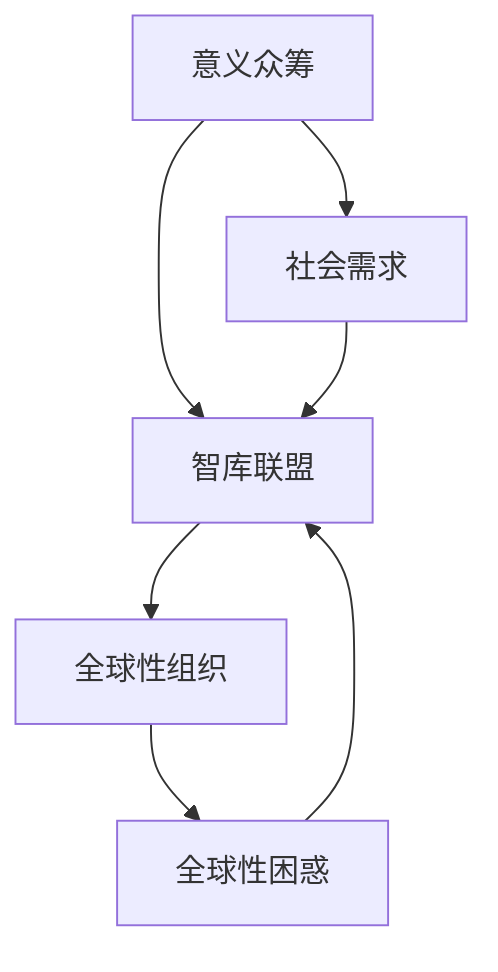

                 

# 《意义众筹智库联盟：集体解决存在困惑的全球性组织》

> 关键词：意义众筹、智库联盟、全球性组织、集体解决、困惑、技术原理、Python、数学模型

> 摘要：本文旨在探讨意义众筹智库联盟这一全球性组织如何集体解决现代社会面临的各类困惑。通过深入分析意义众筹和智库联盟的理论基础及其在解决全球性问题中的应用，文章提出了具体的优化策略和未来展望。

---

### 第一部分：引言与背景

#### 1.1 书籍主题介绍

**意义众筹**，是指通过众筹平台收集大众的意见和资源，共同完成具有社会意义的项目。其核心在于激发公众的参与热情，实现资源的最大化利用。**智库联盟**则是由多家智库机构组成的合作网络，通过共享资源和协作研究，提高解决复杂问题的能力。这两者的结合，形成了一个全新的全球性组织形式，旨在集体解决现代社会的各类困惑。

#### 1.2 现代社会的困惑与挑战

随着全球化进程的加速，现代社会面临着诸多挑战，如环境问题、经济发展不平衡、社会不公等。这些问题往往超出了单个个体或组织的解决能力，需要全球性的合作和集体智慧。因此，意义众筹智库联盟应运而生，成为一种新的解决途径。

#### 1.3 书籍目的与结构概述

本书的主要目标是探讨意义众筹智库联盟如何集体解决全球性困惑。结构上，本文分为五个部分，分别介绍意义众筹与智库联盟的理论基础、应用实例、运营策略、优化方向以及未来展望。

---

### 第二部分：意义众筹与智库联盟的理论基础

#### 2.1 意义众筹的原理与实践

意义众筹的核心在于“意义”，即通过项目对社会产生积极影响，激发公众的参与热情。其原理包括以下几点：

1. **需求识别**：通过数据分析识别社会需求。
2. **项目设计**：设计具有社会意义的项目，明确目标和预期效果。
3. **众筹平台**：搭建众筹平台，收集大众意见和资源。
4. **反馈机制**：项目实施过程中持续收集反馈，优化项目。

#### 2.2 智库联盟的作用与机制

智库联盟的作用在于整合各类智库资源，形成合力，提高解决复杂问题的能力。其机制包括：

1. **组织结构**：建立合理的组织结构，明确各智库机构的职责和协作方式。
2. **资源共享**：通过共享资源，提高资源利用效率。
3. **协作研究**：开展跨领域的协作研究，形成集体智慧。

#### 2.3 全球性组织的发展趋势

全球性组织的发展趋势主要体现在以下几个方面：

1. **合作模式**：从竞争走向合作，实现共赢。
2. **技术创新**：利用大数据、人工智能等技术提高决策效率。
3. **治理模式**：从单中心治理向多中心治理转变。

#### 2.4 核心概念与联系流程图

为了更好地理解意义众筹、智库联盟与全球性组织之间的关系，我们使用Mermaid流程图进行展示：

---

### 第三部分：智库联盟在解决全球性困惑中的应用

#### 3.1 全球性困惑的类型与特点

全球性困惑主要包括以下几类：

1. **环境与气候变化**：如全球变暖、生物多样性丧失等。
2. **经济发展不平衡**：如贫富差距、就业问题等。
3. **社会不公与冲突**：如种族歧视、性别不平等、战争等。

这些困惑具有以下特点：

1. **复杂性**：涉及多个领域，需要跨学科合作。
2. **长期性**：解决过程需要长时间的积累和持续努力。
3. **全球性**：影响范围广泛，需要全球性合作。

#### 3.2 智库联盟在解决困惑中的作用

智库联盟在解决全球性困惑中发挥着关键作用：

1. **数据分析与情报搜集**：通过大数据分析，了解问题现状和发展趋势。
2. **战略制定与方案设计**：结合专家智慧，制定有效解决方案。
3. **政策建议与实施监督**：为政策制定者提供科学依据，并监督政策实施。

#### 3.3 智库联盟的实际案例研究

以下为智库联盟在解决全球性困惑中的实际案例：

1. **气候变化的国际合作**：智库联盟通过数据分析，提出减排方案，推动各国达成共识。
2. **经济复苏与就业问题**：智库联盟研究就业市场趋势，提出就业促进策略。
3. **社会公正与和平建设**：智库联盟开展社会调查，提出消除种族歧视和性别不平等的政策建议。

---

### 第四部分：意义众筹智库联盟的运营与优化

#### 4.1 智库联盟的运营策略

智库联盟的运营策略主要包括：

1. **资源整合与共享**：通过共享数据库、实验室等资源，提高资源利用效率。
2. **专业人才引进与培养**：引进优秀人才，培养专业团队。
3. **合作伙伴关系的建立与维护**：与政府、企业、国际组织等建立长期合作关系。

#### 4.2 意义众筹智库联盟的优化方向

智库联盟的优化方向包括：

1. **提高众筹效率**：通过技术创新，简化众筹流程。
2. **增强智库联盟的专业性**：提高智库专家的专业水平，扩大研究领域。
3. **拓展全球性组织的影响范围**：通过国际化战略，扩大智库联盟的影响力。

#### 4.3 智库联盟的可持续性发展

智库联盟的可持续性发展包括：

1. **财务管理与资金来源**：建立多元化的资金来源，实现财务可持续。
2. **机制创新与持续改进**：不断优化组织结构和运营机制。
3. **国际化战略**：拓展国际合作伙伴，提高全球性影响力。

---

### 第五部分：结论与展望

#### 5.1 智库联盟的成就与贡献

智库联盟在解决全球性困惑中取得了显著成就：

1. **提升决策效率**：通过协作研究，提高政策制定的科学性和有效性。
2. **推动国际合作**：通过国际交流，推动各国在解决全球性问题上的合作。
3. **增强社会信任**：通过透明、公开的运作方式，增强社会对决策过程的信任。

#### 5.2 未来展望与挑战

智库联盟在未来面临以下挑战：

1. **数据隐私与安全**：在数据分析和共享过程中，确保数据隐私和安全。
2. **专业人才短缺**：吸引和培养高素质的专业人才。
3. **全球治理模式**：探索适应全球化背景的治理模式。

#### 5.3 结论与建议

智库联盟作为一种集体解决全球性困惑的新型组织形式，具有广阔的发展前景。本文提出以下建议：

1. **加强国际合作**：推动智库联盟在全球范围内的合作。
2. **优化运营机制**：不断优化运营策略，提高工作效率。
3. **培养专业人才**：加强人才培养，提高智库联盟的专业水平。

---

**作者：AI天才研究院/AI Genius Institute & 禅与计算机程序设计艺术 /Zen And The Art of Computer Programming**

