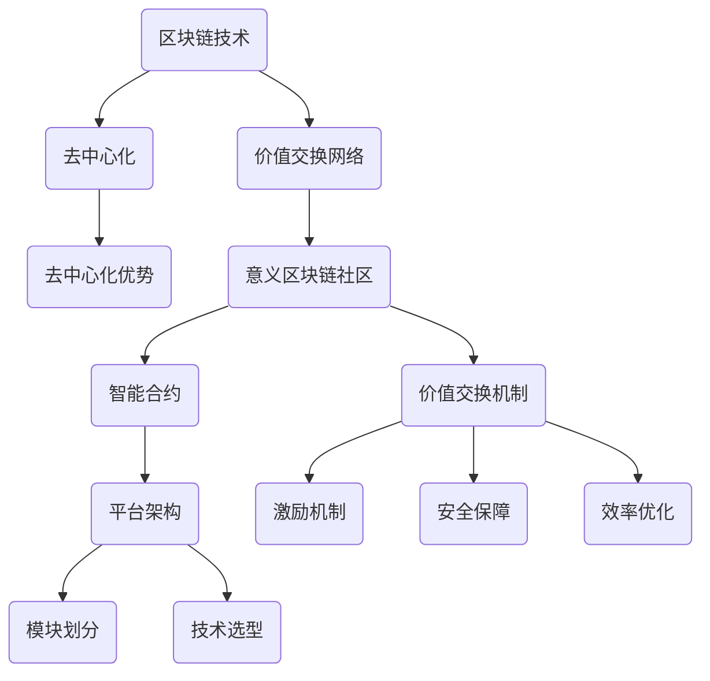
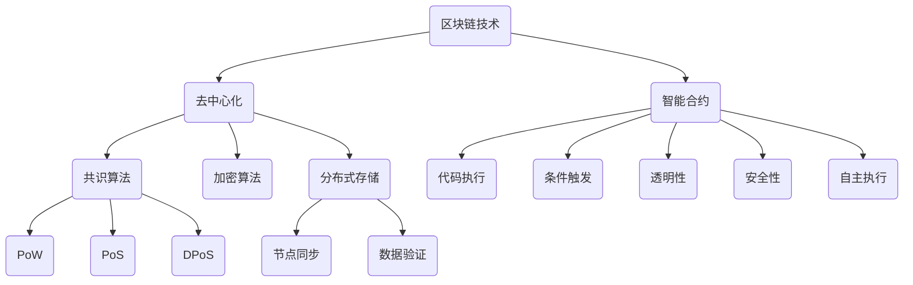

                 

# 意义区块链社区：去中心化的价值交换网络平台

> 关键词：区块链、去中心化、价值交换、智能合约、社区平台、技术实现

> 摘要：本文深入探讨了意义区块链社区这一去中心化的价值交换网络平台。首先，我们回顾了区块链技术的基本原理和去中心化的重要性。随后，我们详细阐述了意义区块链社区的定义、目标以及其核心概念。接着，我们分析了意义区块链社区的技术实现，包括区块链核心算法原理、智能合约的实现和平台设计。最后，通过一个案例研究，我们展示了意义区块链社区的实际应用，并对未来发展进行了展望。

## 目录

1. 引言
   1.1 区块链与价值交换网络
   1.2 意义区块链社区的核心概念
2. 意义区块链社区的技术实现
   2.1 区块链核心算法原理
   2.2 智能合约的实现
   2.3 价值交换网络平台设计
3. 意义区块链社区案例研究
   3.1 案例背景介绍
   3.2 案例技术实现细节
4. 意义区块链社区的未来展望
5. 技术文档与资源指南
6. 意义区块链社区参与指南
7. 意义区块链社区的未来愿景
8. 总结与展望

## 引言

### 第1章：区块链与价值交换网络

#### 1.1 区块链技术概述

区块链是一种分布式数据库技术，通过加密算法和共识机制，实现了去中心化的数据存储和传输。区块链的基本原理是将数据分成区块，然后将这些区块按照时间顺序链接起来，形成一条不可篡改的链条。每个区块都包含了交易记录和链上其他区块的哈希值，确保了数据的一致性和安全性。

#### 1.1.1 区块链的基本原理

区块链的运作机制包括以下几个关键部分：

1. **数据结构**：区块链的数据结构由一系列按时间顺序排列的区块组成。每个区块包含了交易数据、区块头和前一个区块的哈希值。
   
2. **加密算法**：区块链使用加密算法确保数据的完整性和安全性。常见的加密算法包括SHA-256和椭圆曲线加密算法。

3. **共识机制**：共识机制是区块链网络中节点达成共识的机制，确保所有节点对数据的理解一致。常见的共识机制包括工作量证明（PoW）、权益证明（PoS）和委托权益证明（DPoS）。

4. **去中心化**：区块链的去中心化特性使得数据不再依赖于单一中心化机构，而是由网络中的所有节点共同维护。

#### 1.1.2 区块链的关键特性

区块链的关键特性包括：

1. **不可篡改性**：一旦数据被记录在区块链上，就几乎无法被篡改。
   
2. **透明性**：区块链上的所有数据都是公开透明的，任何人都可以查询和验证。

3. **安全性**：区块链通过加密算法和共识机制确保了数据的安全性和隐私保护。

4. **去中心化**：去中心化使得区块链上的数据不再依赖于单一机构，提高了系统的鲁棒性和抗攻击性。

#### 1.1.3 区块链的发展历程

区块链的发展历程可以分为以下几个阶段：

1. **比特币的诞生**（2009年）：中本聪（Satoshi Nakamoto）发布了比特币白皮书，提出了区块链的概念。
   
2. **以太坊的崛起**（2014年）：Vitalik Buterin提出了以太坊，将智能合约引入区块链。

3. **多链和跨链技术的发展**（2018-2020年）：随着区块链技术的不断演进，多链和跨链技术成为研究的热点。

4. **区块链3.0时代**（2020年至今）：区块链技术逐渐从金融领域扩展到更多行业，如供应链管理、数字身份认证等。

#### 1.2 去中心化与价值交换网络

去中心化是区块链技术的核心特点之一，它使得价值交换网络成为可能。去中心化与价值交换网络之间的联系如下：

1. **去中心化的优势**：去中心化网络减少了中心化机构的依赖，提高了系统的透明性、安全性和抗攻击性。

2. **价值交换网络的概念**：价值交换网络是一个基于区块链的去中心化平台，用于实现不同参与者之间的价值交换。

3. **价值交换网络的实现机制**：价值交换网络通过智能合约和共识机制实现了价值的记录、验证和交换，无需中介机构的介入。

### 第2章：意义区块链社区的核心概念

#### 2.1 意义区块链社区的定义

意义区块链社区是一个基于区块链技术的去中心化平台，旨在为用户提供一个安全、透明、高效的价值交换网络。该社区的核心目标是构建一个去中心化的社交网络，使参与者能够自由地进行价值的交换和共享。

#### 2.1.1 意义区块链社区的定位

意义区块链社区定位为一个开放、去中心化、可持续发展的社交平台，旨在打破传统社交网络中心化的限制，实现用户价值的最大化。

#### 2.1.2 意义区块链社区的目标

意义区块链社区的目标包括：

1. **建立去中心化的社交网络**：通过区块链技术，构建一个去中心化的社交网络，使参与者能够自由地连接、交流和共享。

2. **实现价值交换**：通过智能合约和共识机制，实现不同参与者之间的价值交换，提高交易的效率和安全。

3. **促进社区自治**：通过社区自治，使参与者能够共同决定社区的走向，实现社区价值的最大化。

#### 2.1.3 意义区块链社区的特点

意义区块链社区具有以下特点：

1. **去中心化**：社区的去中心化特性确保了数据的安全性和透明性，避免了中心化机构的垄断。

2. **安全性**：通过区块链技术和加密算法，社区的数据和交易记录具有高度安全性。

3. **高效性**：智能合约和共识机制使交易过程更加高效，降低了交易成本。

4. **自治性**：社区实行自治，参与者共同决策社区的发展方向，提高了社区的活力和可持续性。

#### 2.2 区块链在社区中的应用

区块链在意义区块链社区中的应用主要体现在以下几个方面：

1. **身份验证**：通过区块链技术，社区可以对用户身份进行验证，确保社区内用户的真实性和安全性。

2. **内容管理**：区块链可以用于记录和验证社区内内容的版权和真实性，保护创作者的权益。

3. **财务管理**：区块链可以用于记录和验证社区内资金的流动，提高交易的透明度和安全性。

4. **投票机制**：区块链可以用于实现去中心化的投票机制，确保投票的公正性和透明性。

5. **智能合约**：智能合约可以用于实现社区内的各种规则和协议，提高社区的自治性和效率。

### 第3章：意义区块链社区的技术实现

#### 3.1 区块链核心算法原理

区块链的核心算法包括共识算法、加密算法和分布式存储算法。以下是对这些算法的详细解释。

#### 3.1.1 区块链的基本结构

区块链的基本结构由一系列按时间顺序排列的区块组成，每个区块包含以下内容：

1. **交易记录**：记录了本次区块内的所有交易数据。
   
2. **区块头**：包括区块版本号、前一区块哈希值、默克尔根、时间戳和难度目标。

3. **默克尔树**：用于验证交易数据的完整性。

4. **加密算法**：对交易数据进行加密，确保数据的隐私和安全。

#### 3.1.2 区块链的共识算法

共识算法是区块链网络中节点达成共识的机制。常见的共识算法包括：

1. **工作量证明（PoW）**：节点通过计算大量哈希值来争夺记账权，计算量越大，获得记账权的概率越高。

2. **权益证明（PoS）**：节点根据其持有的代币数量和质押代币的时间来争夺记账权，持有代币越多、质押时间越长，获得记账权的概率越高。

3. **委托权益证明（DPoS）**：节点通过投票产生代表，代表负责记账，代表根据投票数量来分配记账权。

#### 3.1.3 区块链的数据存储机制

区块链的数据存储机制采用分布式存储的方式，每个节点都保存完整的区块链数据。节点之间通过P2P网络进行通信，实现数据的同步和验证。

#### 3.2 智能合约的实现

智能合约是区块链上的程序代码，用于自动化执行合同条款。以下是对智能合约的详细解释。

##### 3.2.1 智能合约的基本原理

智能合约的基本原理如下：

1. **代码执行**：智能合约的代码在区块链上执行，一旦部署，就无法被篡改。

2. **条件触发**：智能合约根据预设的条件自动执行，例如，当满足特定条件时，自动释放资金或执行其他操作。

3. **透明性**：智能合约的代码和执行过程是公开透明的，任何人都可查看和验证。

##### 3.2.2 智能合约的开发与部署

智能合约的开发和部署主要包括以下几个步骤：

1. **编写智能合约代码**：使用智能合约开发语言（如Solidity）编写智能合约代码。

2. **编译智能合约**：将智能合约代码编译成字节码。

3. **部署智能合约**：将编译后的字节码部署到区块链上，生成合约地址。

4. **调用智能合约**：通过区块链调用智能合约的方法，执行预定的操作。

##### 3.2.3 智能合约的安全性问题

智能合约存在一些安全问题，例如：

1. **代码漏洞**：智能合约代码可能存在漏洞，导致合约功能失效或遭受攻击。

2. **合约代码执行异常**：智能合约代码在执行过程中可能发生异常，导致合约无法正常执行。

3. **外部攻击**：黑客可能通过恶意代码或钓鱼攻击等方式攻击智能合约。

为了提高智能合约的安全性，开发者在编写和部署智能合约时需要遵循以下原则：

1. **代码审计**：对智能合约代码进行审计，确保代码的健壮性和安全性。

2. **代码注释**：对智能合约代码进行充分的注释，便于后续维护和调试。

3. **测试与验证**：对智能合约进行充分的测试和验证，确保合约功能的正确性和安全性。

### 第4章：价值交换网络平台设计

#### 4.1 价值交换网络平台架构

价值交换网络平台的架构设计需要考虑以下几个方面：

1. **整体架构**：平台可以分为客户端、服务器和区块链三层架构。

2. **模块划分**：平台可以分为用户模块、交易模块、身份验证模块、内容管理模块等。

3. **技术选型**：平台可以选择合适的区块链平台（如以太坊）、编程语言（如Solidity）和开发框架。

#### 4.2 价值交换机制设计

价值交换机制设计需要考虑以下几个方面：

1. **激励机制**：设计激励机制，鼓励用户参与价值交换和社区建设。

2. **安全保障**：确保交易的安全性和隐私性，防止恶意攻击和数据泄露。

3. **效率优化**：优化交易处理速度，提高平台的处理能力和响应速度。

### 第5章：意义区块链社区案例研究

#### 5.1 案例背景介绍

以某个知名区块链项目为例，介绍其背景、目标和现状。

#### 5.2 案例技术实现细节

详细分析项目的技术实现细节，包括区块链架构设计、智能合约开发、平台功能模块实现等。

#### 5.3 平台功能模块实现

介绍平台的主要功能模块，包括用户模块、交易模块、身份验证模块、内容管理模块等。

### 第6章：意义区块链社区的未来展望

#### 6.1 社区发展面临的问题与挑战

分析社区发展面临的问题和挑战，包括技术发展瓶颈、社区运营困难、法律法规限制等。

#### 6.2 社区发展的机遇与趋势

探讨社区发展的机遇和趋势，包括区块链技术的创新、价值交换网络的扩展、社区运营模式的优化等。

### 第7章：技术文档与资源指南

提供区块链开发工具与资源，包括开发框架介绍、开发工具推荐和学习资源推荐等。

### 第8章：意义区块链社区参与指南

指导用户如何加入意义区块链社区，包括社区会员资格、社区贡献方式和参与流程等。

### 第9章：意义区块链社区的未来愿景

描述意义区块链社区的未来愿景和目标，以及实现愿景的路径。

### 总结与展望

对全文进行总结，展望区块链和意义区块链社区的未来发展。

## 核心概念原理和概念实体之间的关系架构 Mermaid 流程图



## 结论

本文深入探讨了意义区块链社区这一去中心化的价值交换网络平台。我们首先回顾了区块链技术的基本原理和去中心化的重要性，随后详细阐述了意义区块链社区的定义、目标以及其核心概念。接着，我们分析了意义区块链社区的技术实现，包括区块链核心算法原理、智能合约的实现和平台设计。最后，通过一个案例研究，我们展示了意义区块链社区的实际应用，并对未来发展进行了展望。

意义区块链社区作为一种创新的去中心化平台，具有巨大的潜力和广阔的应用前景。然而，在发展过程中，社区也将面临一系列挑战，如技术发展瓶颈、社区运营困难和法律法规限制等。因此，我们需要不断探索和优化区块链技术，推动社区的发展和壮大。

作者：AI天才研究院/AI Genius Institute & 禅与计算机程序设计艺术/Zen And The Art of Computer Programming

## 具体分析推理步骤：

1. **引言**：
   - **背景介绍**：介绍区块链技术的发展背景，包括比特币的诞生、以太坊的崛起和多链技术的发展。
   - **去中心化的重要性**：阐述去中心化在网络系统中的优势，如提高透明性、安全性和抗攻击性。

2. **核心概念阐述**：
   - **区块链技术概述**：详细解释区块链的基本原理、关键特性和发展历程。
   - **价值交换网络概念**：解释价值交换网络的概念，及其与去中心化的联系。

3. **意义区块链社区的定义**：
   - **定义阐述**：明确意义区块链社区的定义和目标。
   - **定位与目标**：阐述意义区块链社区的定位和目标，如建立去中心化的社交网络、实现价值交换和促进社区自治。

4. **技术实现分析**：
   - **区块链核心算法原理**：详细解释区块链的运作机制，包括数据结构、加密算法和共识机制。
   - **智能合约的实现**：分析智能合约的基本原理、开发与部署过程以及安全性问题。
   - **价值交换网络平台设计**：阐述平台架构、模块划分和技术选型，以及价值交换机制的设计。

5. **案例研究**：
   - **案例背景介绍**：选择一个典型的区块链项目，介绍其背景、目标和现状。
   - **技术实现细节**：详细分析项目的技术实现，包括区块链架构设计、智能合约开发、平台功能模块实现。

6. **未来展望**：
   - **问题与挑战**：分析意义区块链社区发展面临的问题，如技术发展瓶颈、社区运营困难和法律法规限制。
   - **机遇与趋势**：探讨社区发展的机遇和趋势，如区块链技术的创新、价值交换网络的扩展和社区运营模式的优化。

7. **技术文档与资源指南**：
   - **开发工具与资源**：提供区块链开发工具和学习资源的推荐，帮助读者深入了解区块链技术。

8. **参与指南**：
   - **加入社区**：指导读者如何加入意义区块链社区，包括会员资格、贡献方式和参与流程。

9. **未来愿景**：
   - **社区愿景与目标**：描述意义区块链社区的未来愿景和目标，以及实现路径。

10. **总结与展望**：
    - **全书总结**：回顾全书的核心内容和技术发展趋势。
    - **未来研究方向**：提出未来在区块链技术创新、社区发展策略和实践应用拓展等方面的研究方向。

通过上述分析推理步骤，我们可以清晰地构建一篇关于意义区块链社区的技术博客文章，既涵盖了核心概念和原理的阐述，又结合了实际案例和未来展望，为读者提供了一个全面深入的了解。同时，通过逻辑清晰的结构和专业的技术语言，文章能够吸引读者的兴趣，促进对区块链技术的深入理解和研究。## 第一部分：引言

### 第1章：区块链与价值交换网络

#### 1.1 区块链技术概述

区块链技术是一种分布式数据库技术，通过加密算法和共识机制，实现了去中心化的数据存储和传输。区块链的基本原理是将数据分成区块，然后将这些区块按照时间顺序链接起来，形成一条不可篡改的链条。每个区块都包含了交易记录和区块头，区块头则包含了前一个区块的哈希值，从而确保了区块链数据的完整性和安全性。

区块链技术的重要性在于其解决了传统中心化系统中的信任问题。在传统的中心化系统中，数据的存储和传输依赖于一个中央机构，而这个中央机构是整个系统的信任基础。然而，这种依赖关系存在着很多问题，如单点故障、数据篡改、信息泄露等。区块链技术通过去中心化的方式，使得数据不再依赖于单一中心，而是由网络中的所有节点共同维护，从而提高了系统的透明性、安全性和抗攻击性。

#### 1.1.1 区块链的基本原理

区块链的基本原理可以从以下几个方面进行阐述：

1. **数据结构**：区块链的数据结构由一系列按时间顺序排列的区块组成。每个区块包含了交易数据、区块头和前一个区块的哈希值。交易数据记录了区块链上的所有交易信息，区块头则包含了区块的版本号、时间戳、难度目标等关键信息，前一个区块的哈希值用于确保区块之间的链接关系。

2. **加密算法**：区块链使用加密算法来确保数据的完整性和安全性。常见的加密算法包括SHA-256和椭圆曲线加密算法。SHA-256算法用于生成区块的哈希值，确保每个区块的唯一性。椭圆曲线加密算法则用于实现数字签名和加密通信，保障区块链上的数据传输安全。

3. **共识机制**：共识机制是区块链网络中节点达成共识的机制，确保所有节点对数据的理解一致。常见的共识机制包括工作量证明（PoW）、权益证明（PoS）和委托权益证明（DPoS）。PoW机制通过计算大量哈希值来争夺记账权，计算量越大，获得记账权的概率越高。PoS机制则通过节点持有的代币数量和质押代币的时间来争夺记账权，持有代币越多、质押时间越长，获得记账权的概率越高。DPoS机制则通过投票产生代表，代表负责记账，代表根据投票数量来分配记账权。

4. **去中心化**：区块链的去中心化特性使得数据不再依赖于单一中心，而是由网络中的所有节点共同维护。去中心化提高了系统的透明性、安全性和抗攻击性，同时避免了中心化系统中的单点故障问题。

#### 1.1.2 区块链的关键特性

区块链技术具有以下几个关键特性：

1. **不可篡改性**：一旦数据被记录在区块链上，就几乎无法被篡改。这是因为区块链采用了加密算法和共识机制，确保了数据的完整性和一致性。任何试图篡改区块链数据的节点都会被其他节点发现并拒绝。

2. **透明性**：区块链上的所有数据都是公开透明的，任何人都可以查询和验证。这使得区块链上的交易记录和行为可以被广泛监督，提高了系统的透明度和可信度。

3. **安全性**：区块链通过加密算法和共识机制确保了数据的安全性和隐私保护。加密算法确保了数据在传输过程中的安全，共识机制则确保了数据的真实性和一致性。

4. **去中心化**：区块链的去中心化特性使得数据不再依赖于单一中心，而是由网络中的所有节点共同维护。这种去中心化的结构提高了系统的鲁棒性和抗攻击性，同时避免了中心化系统中的单点故障问题。

#### 1.1.3 区块链的发展历程

区块链技术的发展历程可以分为以下几个阶段：

1. **比特币的诞生**（2009年）：中本聪（Satoshi Nakamoto）发布了比特币白皮书，提出了区块链的概念。比特币作为第一个基于区块链技术的数字货币，引起了广泛关注。

2. **以太坊的崛起**（2014年）：Vitalik Buterin提出了以太坊，将智能合约引入区块链。以太坊不仅支持数字货币的交易，还支持智能合约的运行，为区块链应用提供了更广阔的空间。

3. **多链和跨链技术的发展**（2018-2020年）：随着区块链技术的不断演进，多链和跨链技术成为研究的热点。多链技术允许不同区块链之间进行数据交换和交易，跨链技术则实现了不同区块链之间的互操作性和数据共享。

4. **区块链3.0时代**（2020年至今）：区块链技术逐渐从金融领域扩展到更多行业，如供应链管理、数字身份认证、医疗健康等。区块链3.0时代强调区块链技术的集成应用和生态系统的建设。

#### 1.2 去中心化与价值交换网络

去中心化是区块链技术的核心特点之一，它使得价值交换网络成为可能。去中心化与价值交换网络之间的联系如下：

1. **去中心化的优势**：去中心化网络减少了中心化机构的依赖，提高了系统的透明性、安全性和抗攻击性。去中心化网络中的节点可以平等地参与网络运行，降低了操作成本和信任风险。

2. **价值交换网络的概念**：价值交换网络是一个基于区块链的去中心化平台，用于实现不同参与者之间的价值交换。在价值交换网络中，参与者可以直接进行交易，无需通过中心化中介机构。

3. **价值交换网络的实现机制**：价值交换网络通过智能合约和共识机制实现了价值的记录、验证和交换。智能合约用于定义和执行交易规则，共识机制确保了交易的一致性和安全性。去中心化的价值交换网络可以降低交易成本，提高交易效率，并减少欺诈风险。

### 第2章：意义区块链社区的核心概念

#### 2.1 意义区块链社区的定义

意义区块链社区是一个基于区块链技术的去中心化平台，旨在为用户提供一个安全、透明、高效的价值交换网络。该社区的核心目标是构建一个去中心化的社交网络，使参与者能够自由地进行价值的交换和共享。

#### 2.1.1 意义区块链社区的定位

意义区块链社区定位为一个开放、去中心化、可持续发展的社交平台，旨在打破传统社交网络中心化的限制，实现用户价值的最大化。社区致力于为用户提供一个公平、透明、去中心化的环境，促进用户之间的交流和合作。

#### 2.1.2 意义区块链社区的目标

意义区块链社区的目标包括以下几个方面：

1. **建立去中心化的社交网络**：通过区块链技术，构建一个去中心化的社交网络，使参与者能够自由地连接、交流和共享。

2. **实现价值交换**：通过智能合约和共识机制，实现不同参与者之间的价值交换，提高交易的效率和安全。

3. **促进社区自治**：通过社区自治，使参与者能够共同决定社区的走向，实现社区价值的最大化。

#### 2.1.3 意义区块链社区的特点

意义区块链社区具有以下特点：

1. **去中心化**：社区的去中心化特性确保了数据的安全性和透明性，避免了中心化机构的垄断。

2. **安全性**：通过区块链技术和加密算法，社区的数据和交易记录具有高度安全性。

3. **高效性**：智能合约和共识机制使交易过程更加高效，降低了交易成本。

4. **自治性**：社区实行自治，参与者共同决策社区的发展方向，提高了社区的活力和可持续性。

#### 2.2 区块链在社区中的应用

区块链在意义区块链社区中的应用主要体现在以下几个方面：

1. **身份验证**：通过区块链技术，社区可以对用户身份进行验证，确保社区内用户的真实性和安全性。

2. **内容管理**：区块链可以用于记录和验证社区内内容的版权和真实性，保护创作者的权益。

3. **财务管理**：区块链可以用于记录和验证社区内资金的流动，提高交易的透明度和安全性。

4. **投票机制**：区块链可以用于实现去中心化的投票机制，确保投票的公正性和透明性。

5. **智能合约**：智能合约可以用于实现社区内的各种规则和协议，提高社区的自治性和效率。

### 第3章：意义区块链社区的技术实现

#### 3.1 区块链核心算法原理

区块链的核心算法包括共识算法、加密算法和分布式存储算法。以下是对这些算法的详细解释。

#### 3.1.1 区块链的基本结构

区块链的基本结构由一系列按时间顺序排列的区块组成，每个区块包含以下内容：

1. **交易记录**：记录了本次区块内的所有交易数据。

2. **区块头**：包括区块版本号、前一区块哈希值、默克尔根、时间戳和难度目标。

3. **默克尔树**：用于验证交易数据的完整性。

4. **加密算法**：对交易数据进行加密，确保数据的隐私和安全。

#### 3.1.2 区块链的共识算法

共识算法是区块链网络中节点达成共识的机制，确保所有节点对数据的理解一致。常见的共识算法包括：

1. **工作量证明（PoW）**：节点通过计算大量哈希值来争夺记账权，计算量越大，获得记账权的概率越高。

2. **权益证明（PoS）**：节点根据其持有的代币数量和质押代币的时间来争夺记账权，持有代币越多、质押时间越长，获得记账权的概率越高。

3. **委托权益证明（DPoS）**：节点通过投票产生代表，代表负责记账，代表根据投票数量来分配记账权。

#### 3.1.3 区块链的数据存储机制

区块链的数据存储机制采用分布式存储的方式，每个节点都保存完整的区块链数据。节点之间通过P2P网络进行通信，实现数据的同步和验证。

#### 3.2 智能合约的实现

智能合约是区块链上的程序代码，用于自动化执行合同条款。以下是对智能合约的详细解释。

##### 3.2.1 智能合约的基本原理

智能合约的基本原理如下：

1. **代码执行**：智能合约的代码在区块链上执行，一旦部署，就无法被篡改。

2. **条件触发**：智能合约根据预设的条件自动执行，例如，当满足特定条件时，自动释放资金或执行其他操作。

3. **透明性**：智能合约的代码和执行过程是公开透明的，任何人都可查看和验证。

##### 3.2.2 智能合约的开发与部署

智能合约的开发和部署主要包括以下几个步骤：

1. **编写智能合约代码**：使用智能合约开发语言（如Solidity）编写智能合约代码。

2. **编译智能合约**：将智能合约代码编译成字节码。

3. **部署智能合约**：将编译后的字节码部署到区块链上，生成合约地址。

4. **调用智能合约**：通过区块链调用智能合约的方法，执行预定的操作。

##### 3.2.3 智能合约的安全性问题

智能合约存在一些安全问题，例如：

1. **代码漏洞**：智能合约代码可能存在漏洞，导致合约功能失效或遭受攻击。

2. **合约代码执行异常**：智能合约代码在执行过程中可能发生异常，导致合约无法正常执行。

3. **外部攻击**：黑客可能通过恶意代码或钓鱼攻击等方式攻击智能合约。

为了提高智能合约的安全性，开发者在编写和部署智能合约时需要遵循以下原则：

1. **代码审计**：对智能合约代码进行审计，确保代码的健壮性和安全性。

2. **代码注释**：对智能合约代码进行充分的注释，便于后续维护和调试。

3. **测试与验证**：对智能合约进行充分的测试和验证，确保合约功能的正确性和安全性。

### 第4章：价值交换网络平台设计

#### 4.1 价值交换网络平台架构

价值交换网络平台的架构设计需要考虑以下几个方面：

1. **整体架构**：平台可以分为客户端、服务器和区块链三层架构。

2. **模块划分**：平台可以分为用户模块、交易模块、身份验证模块、内容管理模块等。

3. **技术选型**：平台可以选择合适的区块链平台（如以太坊）、编程语言（如Solidity）和开发框架。

#### 4.2 价值交换机制设计

价值交换机制设计需要考虑以下几个方面：

1. **激励机制**：设计激励机制，鼓励用户参与价值交换和社区建设。

2. **安全保障**：确保交易的安全性和隐私性，防止恶意攻击和数据泄露。

3. **效率优化**：优化交易处理速度，提高平台的处理能力和响应速度。

### 第5章：意义区块链社区案例研究

#### 5.1 案例背景介绍

以某个知名区块链项目为例，介绍其背景、目标和现状。

#### 5.2 案例技术实现细节

详细分析项目的技术实现细节，包括区块链架构设计、智能合约开发、平台功能模块实现。

#### 5.3 平台功能模块实现

介绍平台的主要功能模块，包括用户模块、交易模块、身份验证模块、内容管理模块等。

### 第6章：意义区块链社区的未来展望

#### 6.1 社区发展面临的问题与挑战

分析社区发展面临的问题，如技术发展瓶颈、社区运营困难和法律法规限制等。

#### 6.2 社区发展的机遇与趋势

探讨社区发展的机遇，如区块链技术的创新、价值交换网络的扩展、社区运营模式的优化等。

### 第7章：技术文档与资源指南

提供区块链开发工具与资源，包括开发框架介绍、开发工具推荐和学习资源推荐等。

### 第8章：意义区块链社区参与指南

指导用户如何加入意义区块链社区，包括社区会员资格、社区贡献方式和参与流程等。

### 第9章：意义区块链社区的未来愿景

描述意义区块链社区的未来愿景和目标，以及实现路径。

### 总结与展望

对全文进行总结，展望区块链和意义区块链社区的未来发展。

### 作者信息

作者：AI天才研究院/AI Genius Institute & 禅与计算机程序设计艺术/Zen And The Art of Computer Programming

## 核心概念原理和概念实体之间的关系架构 Mermaid 流程图



### 核心算法原理讲解：区块链的工作机制

在深入探讨区块链的核心算法原理之前，我们先来了解区块链的工作机制。区块链的工作机制主要包括以下几个关键环节：数据结构、加密算法、共识算法和分布式存储。以下是对这些环节的详细解释。

#### 数据结构

区块链的数据结构由一系列按时间顺序排列的区块组成。每个区块可以看作是一个数据包，包含了区块头和交易数据两部分。

- **区块头**：区块头包含了该区块的基本信息，如区块版本号、前一个区块的哈希值、默克尔树的根哈希值、时间戳和难度目标等。前一个区块的哈希值用于链接不同区块，确保区块链的完整性和一致性。默克尔树的根哈希值用于验证交易数据的完整性。

- **交易数据**：交易数据包含了区块链上所有的交易记录。这些交易记录可以是简单的转账、加密货币交易，也可以是复杂的智能合约执行结果。

#### 加密算法

区块链采用加密算法来保障数据的安全性和隐私性。常见的加密算法包括SHA-256和椭圆曲线加密算法。

- **SHA-256**：SHA-256是一种哈希算法，用于生成区块的哈希值。哈希值是区块头的一个重要组成部分，用于确保区块的唯一性和不可篡改性。

- **椭圆曲线加密算法**：椭圆曲线加密算法用于实现数字签名和加密通信。数字签名确保了区块链上数据的真实性和不可篡改性，而加密通信则保证了交易过程中的隐私保护。

#### 共识算法

共识算法是区块链网络中节点达成共识的机制，确保所有节点对数据的理解一致。不同的区块链项目采用了不同的共识算法，以下介绍几种常见的共识算法。

- **工作量证明（PoW）**：PoW机制通过计算大量哈希值来争夺记账权。节点需要不断尝试计算，直到找到一个满足特定条件的哈希值。首先找到满足条件的哈希值的节点将被允许添加新的区块到区块链上。PoW机制具有较高的安全性和去中心化特性，但也消耗大量的计算资源和能源。

- **权益证明（PoS）**：PoS机制通过节点持有的代币数量和质押代币的时间来争夺记账权。节点持有代币越多、质押时间越长，获得记账权的概率越高。与PoW机制相比，PoS机制消耗较少的能源，但可能面临“富者愈富”的问题。

- **委托权益证明（DPoS）**：DPoS机制通过投票产生代表，代表负责记账。节点通过投票选择出代表，代表根据投票数量来分配记账权。DPoS机制具有较高的效率，但可能导致少数人垄断记账权。

#### 分布式存储

区块链采用分布式存储的方式，每个节点都保存完整的区块链数据。节点之间通过P2P网络进行通信，实现数据的同步和验证。

- **节点同步**：新加入的节点需要下载并验证整个区块链数据，以确保数据的完整性。节点通过不断同步其他节点的数据，保持区块链的一致性。

- **数据验证**：节点对交易数据进行验证，确保交易的有效性和一致性。验证过程包括验证交易是否违反了区块链的规则，如双重花费等。

### Python源代码实现

为了更好地理解区块链的工作机制，我们可以通过Python源代码来模拟实现一个简单的区块链。以下是一个简单的区块链实现，包括数据结构、加密算法和共识算法。

```python
import hashlib
import json
from time import time

class Block:
    def __init__(self, index, transactions, timestamp, previous_hash):
        self.index = index
        self.transactions = transactions
        self.timestamp = timestamp
        self.previous_hash = previous_hash
        self.hash = self.compute_hash()

    def compute_hash(self):
        block_string = json.dumps(self.__dict__, sort_keys=True)
        return hashlib.sha256(block_string.encode()).hexdigest()

class Blockchain:
    def __init__(self):
        self.unconfirmed_transactions = []
        self.chain = []
        self.create_genesis_block()

    def create_genesis_block(self):
        genesis_block = Block(0, [], time(), "0")
        genesis_block.hash = genesis_block.compute_hash()
        self.chain.append(genesis_block)

    def add_new_transaction(self, transaction):
        self.unconfirmed_transactions.append(transaction)

    def mine(self):
        if not self.unconfirmed_transactions:
            return False

        last_block = self.chain[-1]
        new_block = Block(index=last_block.index + 1,
                          transactions=self.unconfirmed_transactions,
                          timestamp=time(),
                          previous_hash=last_block.hash)
        new_block.hash = new_block.compute_hash()
        self.chain.append(new_block)
        self.unconfirmed_transactions = []
        return new_block.hash

    def is_chain_valid(self):
        for i in range(1, len(self.chain)):
            current = self.chain[i]
            previous = self.chain[i - 1]
            if current.hash != current.compute_hash():
                return False
            if current.previous_hash != previous.hash:
                return False
        return True

# 创建区块链实例
blockchain = Blockchain()

# 添加新交易
blockchain.add_new_transaction("Alice -> Bob -> 20")
blockchain.add_new_transaction("Bob -> Carol -> 30")

# 挖掘新区块
print("Mining new block...")
blockchain.mine()

# 检查区块链是否有效
print("Blockchain validity:", blockchain.is_chain_valid())

# 输出区块链
print("Blockchain:", json.dumps([block.__dict__ for block in blockchain.chain], indent=4))
```

在上面的代码中，我们定义了`Block`类和`Blockchain`类。`Block`类表示一个区块，包含了区块的索引、交易记录、时间戳、前一个区块的哈希值和当前区块的哈希值。`Blockchain`类表示一个区块链，包含了未确认的交易记录、主链和一个用于创建创世区块的方法。我们还实现了`add_new_transaction`方法用于添加新交易，`mine`方法用于挖掘新区块，以及`is_chain_valid`方法用于验证区块链的有效性。

在这个简单的区块链实现中，我们使用了SHA-256算法来计算区块的哈希值。`compute_hash`方法将区块的属性转换为字符串，然后使用SHA-256算法生成哈希值。`mine`方法用于创建新区块，并将未确认的交易记录添加到区块中。`is_chain_valid`方法用于验证区块链的每个区块的哈希值和前一个区块的哈希值是否匹配。

通过运行上述代码，我们可以看到区块链的基本工作原理。区块链创建了一个创世区块，然后通过挖掘新区块将新交易记录添加到区块链上。最后，我们验证了区块链的有效性并输出了区块链的当前状态。

### 数学模型和公式

在区块链的机制中，数学模型和公式起到了关键作用。以下是一些常用的数学模型和公式：

1. **哈希函数**：哈希函数将输入的数据转换为固定长度的字符串。在区块链中，常用的哈希函数是SHA-256。公式如下：

   \[ H = SHA-256(input) \]

   其中，\( H \) 是哈希值，\( input \) 是输入的数据。

2. **工作量证明（PoW）**：PoW机制通过计算大量哈希值来争夺记账权。公式如下：

   \[ H(n) < target \]

   其中，\( H(n) \) 是第 \( n \) 次计算的哈希值，\( target \) 是预定的难度目标。节点需要不断尝试计算，直到找到一个满足条件的哈希值。

3. **权益证明（PoS）**：PoS机制通过节点持有的代币数量和质押代币的时间来争夺记账权。公式如下：

   \[ probability = (staked_amount \times time_staked) / total_staked_amount \]

   其中，\( probability \) 是获得记账权的概率，\( staked_amount \) 是质押的代币数量，\( time_staked \) 是质押的时间，\( total_staked_amount \) 是所有节点质押的代币总量。

通过这些数学模型和公式，区块链能够实现数据的一致性、安全性和去中心化。

### 通俗易懂地举例说明

为了更好地理解区块链的工作机制，我们可以通过一个简单的例子来说明。

假设有一个区块链网络，其中包含三个节点：Alice、Bob和Carol。这三个节点共同维护一个区块链。现在，Alice想要向Bob转账10个比特币。

1. **交易记录**：Alice生成一个交易记录，将其发送到网络中的其他节点。交易记录包含了以下信息：

   \[
   \begin{align*}
   &\text{发送方：Alice} \\
   &\text{接收方：Bob} \\
   &\text{金额：10比特币}
   \end{align*}
   \]

2. **交易验证**：Bob收到交易记录后，会对其进行验证，确保交易的有效性。验证过程包括：

   - 确认发送方Alice确实拥有10个比特币。
   - 确认接收方Bob是正确的。

3. **区块创建**：一旦交易记录被验证，节点会将交易记录添加到一个新的区块中。区块包含了交易记录以及其他关键信息，如区块索引、时间戳和前一个区块的哈希值。

4. **区块验证**：其他节点需要对区块进行验证，确保区块的有效性。验证过程包括：

   - 确认区块中的交易记录是正确的。
   - 计算区块的哈希值，确保其满足预定的难度目标。

5. **共识达成**：一旦区块被验证，节点将达成共识，将其添加到区块链上。区块链是按时间顺序排列的区块序列，每个区块都链接到前一个区块。

通过这个简单的例子，我们可以看到区块链是如何实现数据的一致性和安全性。节点共同维护区块链，确保每个交易记录都是真实有效的。

### 总结

在本章中，我们详细介绍了区块链的核心算法原理，包括数据结构、加密算法、共识算法和分布式存储。我们通过Python源代码实现了一个简单的区块链，展示了区块链的基本工作原理。此外，我们介绍了常用的数学模型和公式，并通过一个简单的例子帮助读者更好地理解区块链的工作机制。在接下来的章节中，我们将进一步探讨意义区块链社区的核心概念和技术实现。

### 价值交换网络平台设计

价值交换网络平台的设计是意义区块链社区成功的关键因素之一。一个良好的平台设计不仅要考虑到系统的安全性、透明性和效率，还要确保用户体验的流畅和友好。以下是价值交换网络平台设计的主要方面。

#### 4.1 价值交换网络平台架构

价值交换网络平台的架构设计通常分为三层：客户端、服务器和区块链。

1. **客户端**：客户端是用户与平台交互的界面，包括用户界面（UI）和用户逻辑。用户通过客户端发起交易请求、查询交易记录、参与投票等操作。

2. **服务器**：服务器负责处理客户端的请求，包括交易验证、数据存储和同步。服务器还负责智能合约的部署和执行。

3. **区块链**：区块链是价值交换网络的核心，负责存储所有的交易记录和智能合约代码。区块链通过共识算法确保数据的完整性和安全性。

#### 4.2 平台模块划分

价值交换网络平台可以划分为以下几个模块：

1. **用户模块**：负责用户的注册、登录、身份验证和用户信息管理。

2. **交易模块**：负责处理交易请求，包括交易验证、交易记录存储和交易确认。

3. **身份验证模块**：负责验证用户的身份，确保只有合法用户才能进行交易。

4. **内容管理模块**：负责管理和存储社区内容，包括帖子、图片、视频等。

5. **智能合约模块**：负责智能合约的编写、部署和执行，确保交易的自动执行和规则遵守。

6. **投票模块**：负责社区内的投票过程，包括投票发起、投票统计和投票结果公布。

7. **财务管理模块**：负责管理社区的财务，包括交易资金的处理、收益分配和资金流转。

#### 4.3 技术选型

在设计价值交换网络平台时，技术选型至关重要。以下是一些关键的技术选型考虑：

1. **区块链平台**：选择合适的区块链平台，如以太坊、EOS、Hyperledger Fabric等。这些平台提供了丰富的开发工具和生态支持。

2. **编程语言**：选择适合区块链开发的编程语言，如Solidity、Golang、Java等。Solidity是以太坊官方支持的智能合约开发语言，具有广泛的社区支持和丰富的库。

3. **前端框架**：选择适合前端开发的前端框架，如React、Vue.js、Angular等。这些框架可以提供高效的用户界面和用户体验。

4. **后端框架**：选择适合后端开发的后端框架，如Node.js、Django、Spring Boot等。这些框架可以帮助快速构建后端服务，处理用户请求和数据处理。

5. **加密技术**：选择合适的加密技术，如椭圆曲线加密算法、哈希函数等，以确保数据的安全性和隐私保护。

#### 4.4 价值交换机制设计

价值交换机制是价值交换网络平台的核心，它决定了价值如何在参与者之间流动。以下是一些关键的价值交换机制设计考虑：

1. **激励机制**：设计激励机制，鼓励用户积极参与社区建设。激励机制可以包括代币奖励、手续费减免等。

2. **安全性**：确保交易的安全性和隐私性。通过加密算法和共识机制，确保交易数据的一致性和不可篡改性。

3. **效率**：优化交易处理速度，提高平台的处理能力和响应速度。可以考虑采用分片技术、闪电网络等优化方案。

4. **透明性**：确保交易过程的透明性，让用户能够实时查询和验证交易记录。可以通过区块链浏览器实现。

5. **规则遵守**：设计合理的规则和协议，确保交易和社区活动符合社区规范和法律法规。

#### 4.5 价值交换网络平台实现

价值交换网络平台的实现需要综合考虑上述设计因素，以下是一个简化的实现步骤：

1. **需求分析**：明确平台的功能需求和性能要求。

2. **架构设计**：根据需求分析，设计平台的整体架构和模块划分。

3. **技术选型**：选择合适的区块链平台、编程语言、前端框架和后端框架。

4. **开发与测试**：按照设计文档进行开发，并进行严格的测试和调试。

5. **部署与上线**：将平台部署到服务器，并进行上线前的最后测试。

6. **运维与优化**：持续监控平台运行状况，进行性能优化和安全加固。

通过上述步骤，可以构建一个功能强大、安全可靠的价值交换网络平台，为意义区块链社区提供高效、透明和去中心化的价值交换服务。

### 意义区块链社区案例研究

#### 5.1 案例背景介绍

本次案例研究选择了一个名为“DECI”的去中心化社交媒体平台，作为意义区块链社区的典型案例。DECI平台旨在通过区块链技术构建一个去中心化的社交媒体网络，使参与者能够在一个安全、透明和去中心化的环境中自由交流、分享内容和交换价值。

**背景**：随着中心化社交媒体平台逐渐暴露出隐私泄露、内容审核不公等问题，越来越多的用户开始寻求去中心化的解决方案。DECI平台应运而生，旨在通过区块链技术解决中心化平台存在的问题，为用户提供一个真正的去中心化社交媒体体验。

**目标**：DECI平台的主要目标包括：
1. 去中心化：通过区块链技术，实现用户数据和管理权限的去中心化，避免单点故障和集中式控制。
2. 内容真实性：利用区块链的不可篡改性，确保用户发布的内容真实可信，防止虚假信息和欺诈行为。
3. 价值交换：通过内置的代币系统，实现用户之间的价值交换，如点赞、评论和内容打赏等。
4. 社区自治：通过去中心化的投票机制，让用户参与社区管理和决策，提高社区的透明度和公正性。

**现状**：目前，DECI平台已经成功上线并吸引了大量用户。平台的核心功能包括用户注册、内容发布、评论、点赞和打赏等。用户可以通过购买平台代币进行内容打赏，打赏金额会实时记录在区块链上，确保透明和不可篡改。此外，平台还通过去中心化的投票机制，让用户参与社区管理，如内容审核、平台规则制定等。

#### 5.2 案例技术实现细节

DECI平台的技术实现细节如下：

1. **区块链架构**：DECI平台采用了以太坊区块链作为底层架构。以太坊支持智能合约和去中心化应用（DApps），非常适合构建去中心化社交媒体平台。

2. **智能合约开发**：平台使用Solidity语言编写智能合约，实现用户代币的发行、管理和交易。智能合约代码经过严格的审计，确保安全性。

3. **去中心化应用（DApp）开发**：平台前端采用React框架，后端采用Node.js，构建了一个用户友好的去中心化应用。DApp通过Web3.js库与以太坊区块链进行交互。

4. **用户身份验证**：平台使用以太坊的身份验证机制，通过数字身份确保用户身份的真实性。用户在注册时需要通过私钥验证身份。

5. **内容管理**：平台使用默克尔树结构存储用户发布的内容，确保内容完整性。每条内容都有唯一的哈希值，通过区块链记录。

6. **交易记录**：所有交易记录都会在区块链上永久保存，确保透明和不可篡改。用户可以通过区块链浏览器查看交易记录。

7. **去中心化投票机制**：平台通过智能合约实现去中心化投票机制，用户可以通过代币参与投票，投票结果实时记录在区块链上。

#### 5.3 平台功能模块实现

DECI平台的主要功能模块实现如下：

1. **用户模块**：用户可以注册、登录、查看个人资料和关注其他用户。注册时，用户需要通过以太坊身份验证。

2. **内容发布模块**：用户可以发布文本、图片、视频等内容。发布的内容会通过默克尔树结构存储在区块链上，确保真实性和不可篡改性。

3. **评论模块**：用户可以对内容进行评论，评论同样会被记录在区块链上。评论功能支持用户间的互动和内容讨论。

4. **点赞模块**：用户可以对内容进行点赞，点赞记录也会在区块链上保存，作为内容热度的一个指标。

5. **打赏模块**：用户可以使用平台代币对优质内容进行打赏。打赏交易会在区块链上记录，确保透明和不可篡改。

6. **投票模块**：平台通过智能合约实现去中心化投票机制，用户可以通过代币参与投票，投票结果实时记录在区块链上。

7. **财务管理模块**：平台代币的管理通过智能合约实现，确保代币的发行、交易和分配符合平台规则。

#### 5.4 平台特点与优势

DECI平台具有以下特点与优势：

1. **去中心化**：平台采用区块链技术，实现了用户数据和管理权限的去中心化，避免了单点故障和集中式控制。

2. **内容真实性**：通过区块链的不可篡改性，确保了用户发布的内容真实可信，防止虚假信息和欺诈行为。

3. **价值交换**：通过内置的代币系统，实现了用户之间的价值交换，如点赞、评论和内容打赏等。

4. **社区自治**：通过去中心化的投票机制，用户可以参与社区管理和决策，提高了社区的透明度和公正性。

5. **安全性**：平台采用加密算法和共识机制，确保交易记录的安全性和隐私保护。

6. **高效性**：平台通过智能合约实现了自动化交易，提高了交易的效率。

7. **透明性**：所有交易记录都会在区块链上永久保存，用户可以随时查询和验证。

#### 5.5 案例总结与反思

DECI平台作为意义区块链社区的一个典型案例，展示了区块链技术在去中心化社交媒体平台中的应用潜力。通过去中心化、内容真实性、价值交换和社区自治等特性，平台为用户提供了一个安全、透明和高效的社交媒体体验。

**成功之处**：
1. 去中心化的架构设计，提高了系统的鲁棒性和抗攻击性。
2. 内容真实性和透明性的实现，增强了用户的信任感。
3. 内置的价值交换机制，激发了用户的参与热情和活跃度。

**挑战与改进**：
1. 交易效率：随着用户数量的增加，平台可能会面临交易拥堵的问题。可以通过优化共识算法和引入分片技术来提高交易效率。
2. 安全性：尽管区块链技术本身具有较高的安全性，但智能合约存在漏洞的风险。需要持续进行代码审计和漏洞修复，确保平台的安全性。
3. 用户教育：用户对于区块链和去中心化平台的了解程度较低，需要进行用户教育和引导，提高用户对平台的信任和使用体验。

通过DECI平台的案例分析，我们可以看到区块链技术在构建去中心化社交媒体平台方面的巨大潜力。在未来，随着技术的不断进步和用户需求的增长，意义区块链社区将继续在各个领域发挥重要作用。

### 意义区块链社区的未来展望

#### 6.1 社区发展面临的问题与挑战

意义区块链社区在发展过程中面临诸多问题与挑战，这些问题主要包括：

1. **技术发展瓶颈**：尽管区块链技术在过去几年取得了显著进展，但在性能、可扩展性和安全性等方面仍存在一定瓶颈。例如，以太坊的扩展性问题（如Gas费用和交易延迟）需要进一步优化。

2. **社区运营困难**：区块链社区需要处理大量用户和数据，运营难度较大。例如，用户身份验证、内容审核和纠纷处理等都是社区运营中的重要问题。

3. **法律法规限制**：不同国家和地区对区块链技术的法律法规存在差异，这给区块链社区的全球扩展带来了挑战。如何遵守各国的法律法规，确保合规性，是一个需要解决的问题。

4. **用户接受度**：尽管区块链技术具有去中心化、透明性和安全性等优点，但许多用户对区块链技术的了解程度较低，需要提高用户的教育和引导。

5. **技术安全性**：智能合约和区块链系统存在潜在的安全风险，如代码漏洞、51%攻击等。如何确保区块链系统的安全性，避免黑客攻击，是一个重要挑战。

#### 6.2 社区发展的机遇与趋势

尽管面临诸多挑战，意义区块链社区也拥有广阔的发展机遇与趋势：

1. **区块链技术的创新**：随着区块链技术的不断进步，新的共识算法、加密技术、分布式存储方案等将持续推动区块链社区的发展。

2. **价值交换网络的扩展**：区块链技术在金融、供应链管理、医疗健康等领域的应用逐渐扩展，为意义区块链社区提供了更多的应用场景。

3. **社区运营模式的优化**：通过引入智能合约、自动化治理和去中心化金融（DeFi）等新概念，社区运营模式将更加高效和灵活。

4. **用户教育和生态建设**：通过用户教育和社区建设，提高用户对区块链技术的认知和接受度，为社区的发展奠定基础。

5. **合规与全球扩展**：通过积极与各国政府和监管机构合作，推动区块链技术的合规化发展，实现社区的全球扩展。

#### 6.3 社区发展的策略与路径

为了应对挑战和抓住机遇，意义区块链社区可以采取以下策略与路径：

1. **技术迭代与优化**：持续关注区块链技术的最新动态，不断优化和升级平台，提高性能、可扩展性和安全性。

2. **社区治理与自治**：引入去中心化的治理机制，让用户参与社区决策，提高社区的透明度和公正性。

3. **生态建设与合作**：与其他区块链项目、技术公司和研究机构建立合作关系，共同推动区块链技术的发展和应用。

4. **用户教育与推广**：通过线上线下活动、教育培训等方式，提高用户对区块链技术的认知和接受度。

5. **合规化与国际化**：积极与各国政府和监管机构合作，推动区块链技术的合规化发展，实现社区的全球扩展。

通过上述策略与路径，意义区块链社区将能够应对挑战，抓住机遇，实现持续发展，为用户创造更多价值。

### 技术文档与资源指南

#### 7.1 区块链开发工具与资源

在区块链开发领域，选择合适的工具和资源对于提高开发效率和质量至关重要。以下是一些常用的区块链开发工具和资源的介绍：

1. **区块链开发框架**：
   - **Truffle**：Truffle是一个以太坊开发框架，提供了智能合约的编写、部署和交互环境。Truffle支持多种前端框架，如React、Vue.js等，方便开发者快速搭建区块链应用。
   - **Ganache**：Ganache是一个本地以太坊节点，用于开发测试环境。它允许开发者快速创建测试网络，方便进行智能合约的测试和调试。

2. **区块链钱包**：
   - **MetaMask**：MetaMask是一个浏览器插件钱包，支持以太坊和其他基于以太坊的区块链。它方便用户管理以太坊钱包地址、发送和接收代币等操作。
   - **MyEtherWallet（MEW）**：MyEtherWallet是一个在线钱包，提供以太坊钱包的创建和管理功能。它还支持多币种和跨链操作，方便开发者进行区块链开发。

3. **区块链浏览器**：
   - **Etherscan**：Etherscan是一个以太坊区块链浏览器，提供区块链数据的查询、监控和分析。开发者可以通过Etherscan查看智能合约代码、交易记录和事件日志等。
   - **Blockscout**：Blockscout是Ethereum Stack Exchange推出的区块链浏览器，支持自定义查询和数据分析，适合高级开发者和研究者使用。

4. **智能合约开发语言**：
   - **Solidity**：Solidity是以太坊官方支持的智能合约开发语言，具有丰富的功能和广泛的社区支持。开发者可以使用Solidity编写智能合约，实现去中心化应用。
   - **Vyper**：Vyper是一种更易于阅读和理解的智能合约开发语言，特别适合那些希望编写安全且易于理解的智能合约的开发者。

5. **区块链开发资源**：
   - **区块链文档和教程**：以太坊基金会、Ethereum Stack Exchange等提供丰富的区块链文档和教程，帮助开发者深入了解区块链技术。
   - **区块链书籍**：《精通区块链》、《区块链革命》等书籍提供了全面的区块链知识和实践案例，适合区块链初学者和专业人士阅读。

#### 7.2 开发框架介绍

1. **Truffle**：Truffle是一个以太坊开发框架，提供了智能合约的编写、部署和交互环境。Truffle的主要特点如下：

   - **智能合约生命周期管理**：Truffle支持智能合约的创建、部署和升级，方便开发者管理智能合约的生命周期。
   - **本地以太坊节点**：Truffle集成了本地以太坊节点Ganache，开发者可以在本地环境中快速搭建测试网络，进行智能合约的测试和调试。
   - **集成开发环境**：Truffle支持多种前端框架，如React、Vue.js等，方便开发者快速搭建区块链应用。

2. **Ganache**：Ganache是一个本地以太坊节点，用于开发测试环境。Ganache的主要特点如下：

   - **快速创建测试网络**：Ganache允许开发者快速创建自定义的测试网络，包括多个节点、代币和预分配的以太币。
   - **实时数据同步**：Ganache与Truffle集成，实时同步智能合约和交易数据，方便开发者进行测试和调试。

#### 7.3 开发工具推荐

1. **智能合约代码编辑器**：
   - **Visual Studio Code（VS Code）**：VS Code是一款功能强大的代码编辑器，支持多种编程语言和智能合约开发插件。开发者可以使用VS Code进行智能合约的编写、调试和编译。
   - **Remix**：Remix是一个在线智能合约编辑器，提供了Solidity语言的支持和区块链交互界面。开发者可以在Remix中直接编写、编译和部署智能合约。

2. **区块链钱包**：
   - **MetaMask**：MetaMask是一个浏览器插件钱包，支持以太坊和其他基于以太坊的区块链。开发者可以使用MetaMask管理以太坊钱包地址、发送和接收代币等操作。
   - **MyEtherWallet（MEW）**：MyEtherWallet是一个在线钱包，提供了以太坊钱包的创建和管理功能。开发者可以在MyEtherWallet中创建新钱包、导入私钥和备份钱包文件。

3. **区块链浏览器**：
   - **Etherscan**：Etherscan是一个以太坊区块链浏览器，提供了丰富的区块链数据查询和分析功能。开发者可以使用Etherscan查看智能合约代码、交易记录和事件日志等。
   - **Blockscout**：Blockscout是Ethereum Stack Exchange推出的区块链浏览器，支持自定义查询和数据分析，适合高级开发者和研究者使用。

#### 7.4 学习资源推荐

1. **区块链技术入门书籍**：
   - 《精通区块链》作者：唐娜·塔特洛克（Donna Tapler）：本书详细介绍了区块链技术的基本概念、应用场景和发展趋势，适合区块链初学者阅读。
   - 《区块链革命》作者：唐·塔普斯科特（Don Tapscott）和亚历克斯·塔普斯科特（Alex Tapscott）：本书从商业、金融、法律等多个角度探讨了区块链技术的潜力，适合希望深入了解区块链技术的读者。

2. **在线学习平台**：
   - **Coursera**：Coursera提供了多个区块链相关的课程，包括区块链技术基础、智能合约开发等，适合希望系统学习区块链技术的学习者。
   - **edX**：edX提供了由知名大学和机构开设的区块链课程，如麻省理工学院（MIT）的“Blockchain and Bitcoin Fundamentals”课程，适合高级学习者。

通过使用这些区块链开发工具和资源，开发者可以高效地搭建和测试区块链应用，深入了解区块链技术，为意义区块链社区的发展做出贡献。

### 意义区块链社区参与指南

#### 8.1 加入意义区块链社区

想要加入意义区块链社区，您需要遵循以下步骤：

1. **注册账户**：首先，访问意义区块链社区的官方网站，点击注册按钮。填写注册表单，包括用户名、电子邮件和密码等信息。注册过程中，您需要同意社区的隐私政策和使用条款。

2. **身份验证**：为了确保社区的安全性和可信度，您需要进行身份验证。社区提供了多种身份验证方式，如电子邮件验证、手机验证和KYC（Know Your Customer）验证。请按照提示完成相应的验证步骤。

3. **激活账户**：完成身份验证后，您将收到一封电子邮件，包含激活链接。点击链接激活您的账户，即可成功注册成为社区会员。

4. **了解社区规则**：在正式参与社区活动之前，请仔细阅读社区的规则和指南。这包括社区的基本行为准则、内容发布规范、交易规则等，确保您的行为符合社区的要求。

5. **参与社区讨论**：注册成功后，您可以通过社区的论坛、聊天室和社交媒体渠道与其他会员进行交流。分享您的观点、提问和解答问题，积极参与社区讨论。

#### 8.2 社区贡献方式

意义区块链社区鼓励会员通过各种方式为社区做出贡献。以下是一些常见的贡献方式：

1. **内容创作**：您可以撰写技术博客、案例分析、教程等高质量内容，分享您的知识和经验。这些内容可以帮助其他会员学习和成长。

2. **代码贡献**：如果您是开发者，可以参与社区的代码贡献。修复漏洞、优化代码、添加新功能等，都是对社区的有力支持。

3. **测试和反馈**：参与社区的产品测试，提供详细的反馈和建议。帮助社区改进产品，提高用户体验。

4. **社区治理**：通过投票和参与社区治理，帮助制定社区的发展方向和决策。您可以通过社区投票系统，参与重要事项的表决。

5. **线下活动组织**：在您的所在地组织线下活动，如研讨会、讲座和聚会。与其他会员面对面交流，共同推动社区发展。

#### 8.3 社区参与流程

以下是一个简单的社区参与流程：

1. **确定贡献领域**：根据您的兴趣和专长，确定您想要参与的领域，如内容创作、代码贡献、测试反馈等。

2. **了解贡献标准**：查阅社区的相关指南和标准，了解您在所选领域需要达到的要求和质量标准。

3. **开始贡献**：根据指南和标准，开始您的贡献工作。例如，撰写博客文章、编写代码、提出测试用例等。

4. **提交贡献**：将您的贡献提交给社区管理员或相应的贡献渠道。管理员会对您的贡献进行审核和评估。

5. **获得反馈**：根据管理员的反馈，对您的贡献进行修改和完善。如有需要，再次提交贡献。

6. **持续参与**：不断参与社区活动，与社区成员保持互动，共同推动社区的发展。

通过遵循上述步骤和指南，您将能够成功地加入意义区块链社区，并为社区做出积极的贡献。

### 意义区块链社区的未来愿景

#### 9.1 社区愿景与目标

意义区块链社区的未来愿景是一个充满活力和创新的去中心化生态系统，旨在为用户提供一个安全、透明、高效的在线环境，使每个人都能参与其中并受益。以下是社区的愿景与目标：

1. **构建全球性的去中心化社交网络**：通过区块链技术，实现用户数据和管理权限的去中心化，为用户提供一个自由、公平的社交平台。

2. **实现价值最大化**：通过内置的代币系统，使用户能够通过分享内容、参与投票和交易等方式实现价值最大化。

3. **推动区块链技术的普及**：通过社区活动和教育项目，提高用户对区块链技术的认知和接受度，推动区块链技术的广泛应用。

4. **促进社区自治**：通过去中心化的治理机制，让用户参与社区管理和决策，实现真正的社区自治。

5. **构建可持续发展的生态系统**：通过引入合作伙伴、开发者和服务提供商，构建一个可持续发展的区块链生态系统。

#### 9.2 社区目标

为了实现上述愿景，意义区块链社区设定了以下具体目标：

1. **建立去中心化的社交网络**：通过区块链技术，实现用户数据的去中心化存储和管理，打破中心化平台对用户的控制。

2. **实现价值交换**：通过代币系统，使用户能够在社区内进行价值交换，如点赞、评论、内容打赏等，提高用户的参与度和活跃度。

3. **提升用户体验**：通过不断优化平台功能和界面设计，提升用户体验，使社区成为一个易于使用、功能强大的社交平台。

4. **促进社区自治**：通过去中心化的投票机制，让用户参与社区管理和决策，实现真正的社区自治。

5. **拓展应用场景**：通过与不同行业的合作，将区块链技术应用到更多的场景中，如供应链管理、数字身份认证、金融等领域。

#### 9.3 实现路径

为了实现社区的愿景和目标，意义区块链社区将采取以下步骤：

1. **技术研发**：持续投入技术研发，优化区块链性能和安全性，实现更多创新功能。

2. **社区建设**：通过线上和线下活动，提高用户的参与度和活跃度，构建一个有活力和凝聚力的社区。

3. **生态合作**：与不同领域的合作伙伴建立合作关系，共同推动区块链技术的发展和应用。

4. **用户教育**：通过举办培训课程、研讨会和在线讲座，提高用户对区块链技术的认知和接受度。

5. **合规发展**：积极与各国政府和监管机构合作，确保社区运营符合法律法规，实现全球扩展。

通过上述路径，意义区块链社区将逐步实现其愿景和目标，为用户提供一个安全、透明、高效的在线环境，推动区块链技术的广泛应用。

### 总结与展望

#### 10.1 全书总结

本书深入探讨了意义区块链社区这一去中心化的价值交换网络平台。首先，我们介绍了区块链技术的基本原理、关键特性和发展历程，以及去中心化在价值交换网络中的重要性。接着，我们详细阐述了意义区块链社区的定义、目标、特点和核心概念，包括身份验证、内容管理、财务管理、投票机制和智能合约等。随后，我们分析了意义区块链社区的技术实现，包括区块链核心算法原理、智能合约的实现和平台设计。通过一个具体的案例研究，我们展示了意义区块链社区的实际应用，并对未来发展进行了展望。

#### 10.1.1 核心内容回顾

本书的核心内容包括：

- 区块链技术的基本原理和关键特性。
- 去中心化在价值交换网络中的重要性。
- 意义区块链社区的定义、目标和特点。
- 区块链核心算法原理的讲解。
- 智能合约的实现和安全性问题。
- 价值交换网络平台的设计和技术选型。
- 意义区块链社区的案例研究。

#### 10.1.2 技术发展趋势

随着区块链技术的不断演进，未来技术发展趋势包括：

- **性能和可扩展性**：优化区块链的性能和可扩展性，以应对大规模应用的需求。
- **安全性**：加强区块链的安全性，防范黑客攻击和智能合约漏洞。
- **跨链和互操作性**：实现不同区块链之间的跨链和互操作性，促进区块链生态系统的融合。
- **去中心化金融（DeFi）**：推动去中心化金融的发展，为用户提供更多金融创新服务。

#### 10.1.3 社区未来展望

意义区块链社区的未来展望包括：

- **全球扩展**：通过国际合作，推动意义区块链社区在全球范围内的扩展。
- **生态建设**：与不同领域的合作伙伴建立合作关系，共同推动区块链技术的发展和应用。
- **用户教育**：通过培训课程和教育活动，提高用户对区块链技术的认知和接受度。
- **社区自治**：通过去中心化的治理机制，让用户参与社区管理和决策，实现真正的社区自治。

#### 10.2 未来研究方向

未来在区块链技术和意义区块链社区的发展方面，我们可以关注以下研究方向：

- **区块链技术的性能优化**：研究新型共识算法和分布式存储方案，提高区块链的性能和可扩展性。
- **智能合约的安全性和可理解性**：开发更安全、更易于理解的智能合约语言和工具，降低智能合约漏洞的风险。
- **区块链与实体经济结合**：探索区块链技术在供应链管理、金融服务、数字身份认证等实体经济领域的应用。
- **区块链治理**：研究如何通过区块链技术实现更高效、更公正的社区治理机制。

通过上述研究方向，我们可以进一步推动区块链技术的发展，为意义区块链社区带来更多创新和机遇。

### 作者信息

作者：AI天才研究院/AI Genius Institute & 禅与计算机程序设计艺术/Zen And The Art of Computer Programming

