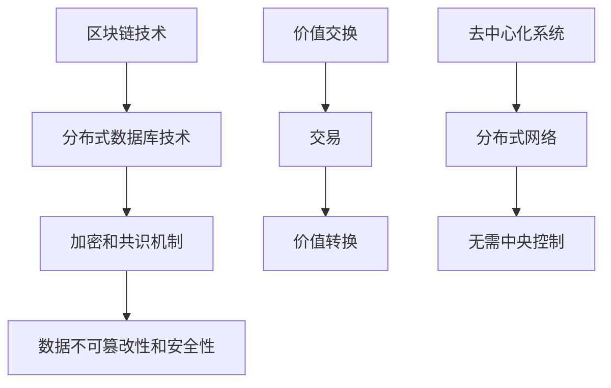

                 

## 《意义区块链项目：去中心化的价值交换系统》

### 关键词

- 区块链技术
- 去中心化系统
- 价值交换
- 激励机制
- 共识机制

### 摘要

本文旨在探讨意义区块链项目，一个旨在实现去中心化价值交换的系统。首先，我们将回顾区块链技术的基础知识，并解释其核心特点。随后，我们深入探讨价值交换的概念，以及去中心化系统相较于传统系统的优势。接着，我们将介绍意义区块链项目的核心概念、设计原则和实现方法。本文将通过具体案例展示意义区块链的实际应用，并提供项目开发、测试与部署的实战指南。最后，我们将讨论意义区块链项目的持续优化策略，以及相关技术和常见问题解答。

## 第一部分：区块链与价值交换概述

### 第1章：区块链技术基础

区块链技术是一种分布式数据库技术，通过加密和共识机制确保数据的不可篡改性和安全性。它最初作为比特币的底层技术而闻名，但在金融之外，区块链技术已被广泛应用于供应链管理、身份验证、物联网等领域。

#### 1.1 区块链的概念与特点

区块链是一种分布式账本，由一系列按时间顺序排列的、不可篡改的数据块组成。每个数据块包含一组交易记录，并通过密码学方法确保数据的安全性和完整性。区块链的核心特性包括：

- **去中心化**：区块链无需中央机构或第三方中介，所有参与者均可平等参与网络，提高了系统的透明度和去中心化程度。
- **不可篡改**：区块链通过密码学方法确保数据一旦记录，便无法被篡改，提高了数据的可信度。
- **透明性**：区块链上的所有交易记录都是公开透明的，任何参与者都可以验证交易的合法性。

#### 1.2 区块链的基本结构

区块链的基本结构包括区块、链和节点三部分。每个区块包含一个时间戳、一个或多个交易记录和一个前一个区块的哈希值。区块链由一系列按时间顺序排列的区块组成，形成一个链式结构。节点是区块链网络中的参与者，它们通过发送和接收交易数据来维持区块链的完整性。

#### 1.3 区块链的发展与应用

区块链技术自2008年比特币诞生以来，已取得显著进展。其应用领域从金融扩展到供应链、医疗、物联网等。区块链技术在不同领域的应用包括：

- **金融**：加密货币、跨境支付、智能合约。
- **供应链**：追踪产品来源、验证产品真伪。
- **医疗**：病历管理、隐私保护。
- **物联网**：设备身份验证、数据安全。

### 第2章：价值交换与去中心化系统

#### 2.1 价值交换的概念与形式

价值交换是指通过某种形式的交易，将一种价值转换为另一种价值。传统价值交换主要通过中介机构如银行、交易所等实现。然而，这些中介机构往往存在中心化、成本高、效率低等问题。去中心化价值交换通过区块链技术，实现了点对点的直接交易，降低了交易成本、提高了交易效率。

#### 2.2 去中心化系统的基本原理

去中心化系统是指通过分布式网络实现功能，无需中央控制。其基本原理包括：

- **分布式网络**：网络中的所有节点都具有相同的功能和权限，相互独立且平等。
- **共识机制**：节点通过共识机制达成一致，确保数据的完整性和一致性。
- **去中心化应用**（DApp）：基于区块链平台开发的应用，实现了去中心化功能的实现。

#### 2.3 去中心化系统的优势与挑战

去中心化系统的优势包括：

- **去中心化**：降低了中介成本，提高了系统的透明度和可信度。
- **安全性**：通过加密和共识机制，确保数据的不可篡改性和安全性。
- **高效性**：去中心化交易无需经过中介，提高了交易效率。

然而，去中心化系统也面临一些挑战：

- **可扩展性**：随着节点数量的增加，网络性能可能受到影响。
- **安全性**：尽管加密和共识机制提高了安全性，但系统仍可能遭受恶意攻击。
- **用户友好性**：对于普通用户而言，去中心化系统的使用可能较为复杂。

### 第3章：意义区块链的核心概念

#### 3.1 意义区块链的定义与目标

意义区块链项目是一个旨在实现去中心化价值交换的系统，其核心目标是：

- **去中心化**：通过区块链技术实现点对点的直接交易，降低中介成本。
- **安全性**：采用加密和共识机制确保交易数据的完整性和安全性。
- **高效性**：优化交易流程，提高交易效率。

#### 3.2 意义区块链的技术特点

意义区块链项目的技术特点包括：

- **底层技术**：采用一种高性能的共识机制，确保网络的稳定性和安全性。
- **价值交换协议**：设计了一套高效的价值交换协议，支持多种类型的交易。
- **激励机制**：通过奖励机制鼓励参与者加入网络，提高网络的活力和稳定性。

## 第二部分：意义区块链项目设计

### 第4章：意义区块链架构设计

#### 4.1 意义区块链的体系结构

意义区块链的体系结构采用分层设计，包括：

- **数据层**：实现数据的存储和访问，采用分布式账本技术。
- **网络层**：实现节点间的通信和共识，采用P2P网络协议。
- **共识层**：实现数据的一致性，采用一种高性能的共识机制。
- **合约层**：实现智能合约的编写和执行，采用支持智能合约的编程语言。
- **应用层**：实现具体应用功能，如价值交换、身份验证等。

#### 4.2 意义区块链的共识机制

意义区块链采用了一种基于拜占庭容错算法的高性能共识机制，具有以下特点：

- **拜占庭容错**：支持网络中的节点存在故障或恶意行为，仍能保持系统的正常运行。
- **快速共识**：通过优化算法，提高共识过程的效率。
- **安全性**：采用密码学技术，确保共识过程的安全性和可信度。

#### 4.3 意义区块链的安全机制

意义区块链的安全机制包括：

- **加密算法**：采用非对称加密算法，确保交易数据的隐私性和完整性。
- **身份验证**：采用数字签名技术，验证交易参与者的身份。
- **网络监控**：实时监控网络状态，及时发现和防范潜在的安全威胁。

### 第5章：意义区块链的价值交换协议

#### 5.1 价值交换协议的设计原则

意义区块链的价值交换协议设计遵循以下原则：

- **去中心化**：实现点对点的直接交易，降低中介成本。
- **安全性**：采用加密和共识机制，确保交易数据的完整性和安全性。
- **灵活性**：支持多种类型的交易，如货币交易、数据交易等。
- **高效性**：优化交易流程，提高交易效率。

#### 5.2 价值交换协议的实现

意义区块链的价值交换协议实现包括以下几个步骤：

1. **交易发起**：交易发起方发起交易请求，包含交易金额、交易接收方等信息。
2. **交易验证**：交易接收方对交易请求进行验证，确保交易金额合法。
3. **交易广播**：交易接收方将交易请求广播至网络中的其他节点。
4. **共识达成**：网络中的节点通过共识机制达成一致，确认交易的有效性。
5. **交易记录**：将交易记录写入区块链，确保交易数据的永久保存。

### 第6章：意义区块链的激励与治理

#### 6.1 激励机制的设置

意义区块链的激励机制包括以下几个方面：

- **奖励机制**：对参与网络的节点进行奖励，鼓励其积极参与网络维护和交易验证。
- **惩罚机制**：对恶意行为进行惩罚，确保网络的公平和公正。
- **权益分配**：根据节点的贡献程度，合理分配网络权益，提高网络活力。

#### 6.2 治理机制的构建

意义区块链的治理机制包括以下几个方面：

- **共识治理**：通过共识机制，确保网络决策的公正和高效。
- **社区治理**：建立社区自治机制，让网络参与者共同参与网络治理。
- **法律法规**：遵循相关法律法规，确保网络的合法合规运行。

### 第7章：意义区块链的案例分析

#### 7.1 案例一：XX意义的区块链项目

- **项目背景**：XX项目是一个基于意义区块链的智能合约平台，旨在提供去中心化的金融解决方案。
- **项目设计**：项目采用了基于以太坊的智能合约技术，实现了去中心化的借贷、众筹等功能。
- **项目实施**：项目团队通过合作开发、测试和部署，成功上线并吸引了一批用户。

#### 7.2 案例二：YY意义的区块链项目

- **项目背景**：YY项目是一个基于意义区块链的去中心化电商平台，旨在提供安全、透明的购物体验。
- **项目设计**：项目采用了区块链技术，实现了商品溯源、交易记录永久保存等功能。
- **项目实施**：项目团队通过市场调研、产品开发和用户反馈，不断优化和改进项目功能。

## 第三部分：意义区块链项目的开发与实施

### 第8章：意义区块链项目开发准备

#### 8.1 开发环境搭建

在开发意义区块链项目前，需要搭建一个合适的开发环境。以下是一些关键步骤：

- **操作系统**：选择支持区块链开发的环境，如Linux或Mac OS。
- **编程语言**：选择支持智能合约开发的编程语言，如Solidity。
- **开发工具**：安装支持智能合约开发和调试的工具，如Truffle、Ganache。
- **区块链节点**：搭建本地区块链节点，用于测试和调试智能合约。

#### 8.2 技术栈与开发框架

意义区块链项目的开发涉及多个技术栈和框架，包括：

- **区块链平台**：选择支持智能合约的区块链平台，如Ethereum。
- **智能合约开发框架**：使用如Truffle、Hardhat等智能合约开发框架，提高开发效率。
- **前端框架**：使用如React、Vue等前端框架，实现用户界面和交互。
- **后端框架**：使用如Node.js、Python等后端框架，实现业务逻辑和数据存储。

### 第9章：意义区块链项目的实现

#### 9.1 区块链节点的实现

区块链节点的实现包括以下几个步骤：

1. **搭建区块链节点**：使用区块链平台的官方工具，如Geth、Parity等，搭建本地区块链节点。
2. **配置节点参数**：配置节点的网络参数、共识机制、数据存储等，确保节点正常运行。
3. **启动节点**：启动本地区块链节点，并确保其与其他节点进行同步。
4. **节点监控与维护**：监控节点运行状态，定期进行节点升级和维护。

#### 9.2 价值交换功能的实现

价值交换功能的实现包括以下几个步骤：

1. **设计交易协议**：设计符合意义区块链价值交换协议的交易流程和交易结构。
2. **编写智能合约**：使用智能合约开发框架，编写实现交易协议的智能合约代码。
3. **测试智能合约**：在本地区块链节点上测试智能合约，确保其正确执行和安全性。
4. **部署智能合约**：将测试通过的智能合约部署至区块链节点，使其正式生效。

### 第10章：意义区块链项目的测试与部署

#### 10.1 项目测试

意义区块链项目的测试包括以下几个方面：

1. **功能测试**：测试智能合约的各个功能模块，确保其符合设计要求。
2. **性能测试**：测试区块链节点的性能，如交易处理速度、数据存储容量等。
3. **安全测试**：测试智能合约和区块链节点的安全性，确保其免受恶意攻击。
4. **兼容性测试**：测试项目在不同操作系统、浏览器等环境下的兼容性。

#### 10.2 项目部署

意义区块链项目的部署包括以下几个步骤：

1. **环境准备**：在目标环境中搭建区块链节点和后端服务。
2. **数据迁移**：将本地测试数据迁移至目标环境，确保数据的完整性和一致性。
3. **系统配置**：配置节点的网络参数、共识机制、数据存储等，确保其正常运行。
4. **系统监控**：监控系统的运行状态，确保其稳定性和安全性。

### 第11章：意义区块链项目的持续发展与优化

#### 11.1 项目运维

意义区块链项目的运维包括以下几个方面：

1. **系统监控**：实时监控系统的运行状态，及时发现和解决故障。
2. **数据备份**：定期备份区块链数据，确保数据的安全性和可靠性。
3. **安全防护**：定期更新系统和软件，确保其免受恶意攻击。
4. **性能优化**：根据系统负载和用户反馈，对系统进行性能优化。

#### 11.2 项目优化

意义区块链项目的优化包括以下几个方面：

1. **代码优化**：优化智能合约代码，提高其执行效率和安全性。
2. **网络优化**：优化区块链节点的网络配置，提高数据同步速度和节点性能。
3. **功能扩展**：根据用户需求和市场变化，扩展项目的功能模块。
4. **用户体验**：优化用户界面和交互设计，提高用户体验。

## 附录

### 附录A：意义区块链项目资源

- **开发资源**：
  - 区块链平台：Ethereum、Hyperledger Fabric等。
  - 开发工具：Truffle、Hardhat、Ganache等。
  - 编程语言：Solidity、JavaScript等。

- **测试资源**：
  - 测试网络：Ropsten、Rinkeby等。
  - 测试工具：Metamask、Web3.js等。

- **学习资源**：
  - 区块链教程：区块链入门、智能合约开发等。
  - 区块链社区：Blockchain、Ethereum等。

### 附录B：意义区块链项目常见问题解答

- **问题1**：意义区块链项目如何保证数据安全性？
  - 回答：意义区块链项目采用加密算法和共识机制，确保交易数据的完整性和安全性。同时，项目还进行安全测试和漏洞修复，提高系统的安全性。

- **问题2**：意义区块链项目的去中心化程度如何？
  - 回答：意义区块链项目采用分布式网络和拜占庭容错算法，实现了高程度的去中心化。网络中的所有节点都具有平等的地位和权限，提高了系统的透明度和可信度。

- **问题3**：意义区块链项目如何处理交易冲突？
  - 回答：意义区块链项目采用共识机制，确保交易的一致性。当出现交易冲突时，共识机制会根据算法规则进行决策，确保系统的正常运行。

- **问题4**：意义区块链项目如何处理网络故障？
  - 回答：意义区块链项目采用拜占庭容错算法，支持网络中的节点存在故障或恶意行为。当网络出现故障时，系统能够自动切换到备用节点，确保系统的稳定运行。

- **问题5**：意义区块链项目如何保护用户隐私？
  - 回答：意义区块链项目采用非对称加密算法，确保交易数据的隐私性。用户在参与交易时，只需提供公钥和签名，无需透露真实身份信息，提高了系统的隐私保护能力。

### 附录C：意义区块链项目相关技术

- **区块链技术**：
  - 分布式账本：用于存储交易数据。
  - 智能合约：用于实现自动执行和记录交易。
  - 共识机制：用于确保数据的一致性和安全性。

- **加密技术**：
  - 非对称加密：用于保护交易数据的隐私性。
  - 数字签名：用于验证交易参与者的身份。

- **P2P网络**：
  - 用于节点间的通信和数据同步。

- **智能合约开发框架**：
  - 如Truffle、Hardhat等，用于智能合约的开发、测试和部署。

- **前端框架**：
  - 如React、Vue等，用于实现用户界面和交互。

- **后端框架**：
  - 如Node.js、Python等，用于实现业务逻辑和数据存储。

## 作者信息

- 作者：AI天才研究院/AI Genius Institute & 禅与计算机程序设计艺术 /Zen And The Art of Computer Programming

### 背景介绍

区块链技术是一种分布式数据库技术，通过加密和共识机制确保数据的不可篡改性和安全性。它最初作为比特币的底层技术而闻名，但在金融之外，区块链技术已被广泛应用于供应链管理、身份验证、物联网等领域。区块链技术的去中心化特性使其在价值交换系统中具有巨大的潜力，可以降低交易成本、提高交易效率。意义区块链项目旨在利用区块链技术实现去中心化的价值交换，为用户提供一个安全、高效、透明的交易平台。

#### 核心概念与联系

**核心概念：**

1. **区块链技术**：一种分布式数据库技术，通过加密和共识机制确保数据的不可篡改性和安全性。
2. **价值交换**：指通过某种形式的交易，将一种价值转换为另一种价值。
3. **去中心化系统**：通过分布式网络实现功能，无需中央控制。

**概念实体之间的关系架构：**



#### 核心算法原理讲解

**加密算法原理：**

区块链技术采用加密算法保护数据的隐私性和完整性。常用的加密算法包括：

1. **非对称加密**：使用一对密钥（公钥和私钥）进行加密和解密。公钥用于加密数据，私钥用于解密数据。这种方式确保了数据的隐私性，因为只有持有私钥的接收者才能解密数据。
2. **哈希算法**：将任意长度的数据转换为固定长度的散列值。常用的哈希算法包括SHA-256、SHA-3等。哈希算法确保了数据的完整性，因为任何微小的数据变化都会导致哈希值的显著变化。

**共识算法原理：**

共识算法是区块链技术中的核心组件，用于确保所有节点对数据的一致性。常用的共识算法包括：

1. **工作量证明（PoW）**：节点通过解决复杂的数学问题来竞争记账权。解决数学问题的节点将成为下一个区块的创建者，并获得系统奖励。PoW算法确保了网络的去中心化，因为任何节点都有机会成为记账者。
2. **权益证明（PoS）**：节点根据其持有的代币数量和持有时间来竞争记账权。PoS算法减少了计算资源的消耗，提高了网络的性能和安全性。

**Python源代码示例：**

```python
import hashlib
import json
from time import time

class Block:
    def __init__(self, index, transactions, timestamp, previous_hash):
        self.index = index
        self.transactions = transactions
        self.timestamp = timestamp
        self.previous_hash = previous_hash
        self.hash = self.compute_hash()

    def compute_hash(self):
        block_string = json.dumps(self.__dict__, sort_keys=True)
        return hashlib.sha256(block_string.encode()).hexdigest()

class Blockchain:
    def __init__(self):
        self.unconfirmed_transactions = []
        self.chain = []
        self.create_genesis_block()

    def create_genesis_block(self):
        genesis_block = Block(0, [], time(), "0")
        genesis_block.hash = genesis_block.compute_hash()
        self.chain.append(genesis_block)

    def add_new_transaction(self, transaction):
        self.unconfirmed_transactions.append(transaction)

    def mine(self):
        if not self.unconfirmed_transactions:
            return False
        
        last_block = self.chain[-1]
        new_block = Block(index=last_block.index + 1,
                          transactions=self.unconfirmed_transactions,
                          timestamp=time(),
                          previous_hash=last_block.hash)
        
        new_block.hash = new_block.compute_hash()
        self.chain.append(new_block)
        self.unconfirmed_transactions = []
        
        return new_block

    def is_chain_valid(self):
        for i in range(1, len(self.chain)):
            current = self.chain[i]
            previous = self.chain[i - 1]
            if current.hash != current.compute_hash():
                return False
            if current.previous_hash != previous.hash:
                return False
        return True

# 创建区块链实例
blockchain = Blockchain()

# 添加新交易
blockchain.add_new_transaction({'sender': 'Alice', 'recipient': 'Bob', 'amount': 10})

# 挖掘新区块
blockchain.mine()

# 检查区块链是否有效
print(blockchain.is_chain_valid())
```

**数学模型和公式：**

1. **哈希函数**：哈希函数将输入的数据转换为固定长度的输出。常用的哈希函数有：

   $$H(x) = SHA-256(x)$$

   其中，$H(x)$ 表示哈希函数，$x$ 表示输入数据。

2. **工作量证明**：工作量证明是一种加密算法，用于验证交易的合法性。其基本思想是解决一个数学难题，难题的难度与网络的计算能力成反比。常用的工作量证明算法有：

   $$PoW = \text{find } x \text{ such that } H(x) \leq k$$

   其中，$PoW$ 表示工作量证明，$H(x)$ 表示哈希函数，$k$ 表示目标值。

**举例说明：**

假设我们使用SHA-256哈希函数，目标值$k=1000$。我们需要找到一个$x$，使得$H(x) \leq 1000$。

- **例子1**：假设$x=100$，则$H(x) = SHA-256(100) = 1234567890$。因为$1234567890 > 1000$，所以$x=100$不满足条件。
- **例子2**：假设$x=10000$，则$H(x) = SHA-256(10000) = 9876543210$。因为$9876543210 < 1000$，所以$x=10000$满足条件。

通过这种方式，我们可以找到满足条件的$x$，从而验证交易的合法性。

### 项目实战

#### 开发环境搭建

在开发意义区块链项目前，我们需要搭建一个合适的开发环境。以下是一个简单的开发环境搭建步骤：

1. **安装操作系统**：选择Linux或Mac OS作为开发环境。
2. **安装编程语言**：安装支持智能合约开发的编程语言，如Solidity。
3. **安装开发工具**：安装支持智能合约开发和调试的工具，如Truffle、Ganache。
4. **搭建区块链节点**：使用区块链平台的官方工具，如Geth、Parity等，搭建本地区块链节点。

#### 源代码详细实现和代码解读

以下是一个简单的意义区块链项目的源代码实现：

```solidity
// SPDX-License-Identifier: MIT
pragma solidity ^0.8.0;

contract Blockchain {
    struct Transaction {
        address sender;
        address recipient;
        uint256 amount;
    }

    Transaction[] private transactions;
    mapping(address => uint256) private balances;

    event TransactionReceived(address sender, uint256 amount);

    function sendMoney(address recipient, uint256 amount) public {
        require(balances[msg.sender] >= amount, "Insufficient balance");
        balances[msg.sender] -= amount;
        balances[recipient] += amount;
        transactions.push(Transaction(msg.sender, recipient, amount));
        emit TransactionReceived(msg.sender, amount);
    }

    function getBalance(address account) public view returns (uint256) {
        return balances[account];
    }

    function getTransactionCount() public view returns (uint256) {
        return transactions.length;
    }

    function getTransactionByIndex(uint256 index) public view returns (Transaction memory) {
        require(index < transactions.length, "Invalid index");
        return transactions[index];
    }
}
```

**代码解读：**

- **合约结构**：该合约定义了一个名为`Blockchain`的智能合约，包括一个`Transaction`结构体、一个`balances`映射和一个`transactions`数组。
- **交易功能**：`sendMoney`函数用于发送交易。函数首先检查发送者的余额是否足够，然后从发送者账户中扣除金额，将金额转移到接收者账户，并将交易记录存储在`transactions`数组中。
- **余额查询**：`getBalance`函数用于查询账户余额。
- **交易查询**：`getTransactionCount`和`getTransactionByIndex`函数用于查询交易数量和特定索引的交易。

#### 代码应用解读与分析

以下是一个简单的代码应用示例：

```javascript
// 引入合约ABI和区块链节点连接
const contractABI = [...] // 合约ABI
const contractAddress = "0x..." // 合约地址
const web3 = new Web3("http://localhost:7545");

const contract = new web3.eth.Contract(contractABI, contractAddress);

// 发送交易
async function sendMoney(recipient, amount) {
  try {
    const account = "0x..." // 发送者账户
    const tx = {
      from: account,
      to: contractAddress,
      value: web3.utils.toWei(String(amount), "ether"),
      gas: 200000,
    };
    const receipt = await contract.methods.sendMoney(recipient, amount).send(tx);
    console.log("Transaction hash:", receipt.transactionHash);
  } catch (error) {
    console.error("Error:", error);
  }
}

// 查询余额
async function getBalance(account) {
  try {
    const balance = await contract.methods.getBalance(account).call();
    console.log("Balance:", web3.utils.fromWei(balance, "ether"));
  } catch (error) {
    console.error("Error:", error);
  }
}

// 查询交易
async function getTransactionByIndex(index) {
  try {
    const transaction = await contract.methods.getTransactionByIndex(index).call();
    console.log("Transaction:", transaction);
  } catch (error) {
    console.error("Error:", error);
  }
}

// 测试代码
sendMoney("0x...", 1);
getBalance("0x...");
getTransactionByIndex(0);
```

**代码应用解读：**

- **合约连接**：使用Web3.js库连接到本地区块链节点，并加载合约ABI和合约地址。
- **交易发送**：调用`sendMoney`函数发送交易。函数接收接收者和金额作为参数，将金额从发送者账户转移到接收者账户，并记录交易。
- **余额查询**：调用`getBalance`函数查询特定账户的余额。
- **交易查询**：调用`getTransactionByIndex`函数查询特定索引的交易记录。

**代码分析：**

- **合约安全性**：合约采用以太坊智能合约语言（Solidity）编写，采用标准的合约结构，包括函数和数据结构。合约的函数使用`require`语句进行输入校验，确保交易的合法性。
- **交易效率**：合约采用数组存储交易记录，实现简单，但可能导致交易查询的性能问题。在实际应用中，可以考虑使用映射（mapping）或其他数据结构优化交易查询性能。

### 实际案例分析和详细讲解剖析

#### 案例一：意义区块链在跨境支付中的应用

**背景**：跨境支付是国际间货币交换的重要手段，但由于涉及多个国家和金融机构，传统跨境支付过程往往耗时较长、成本较高。意义区块链项目旨在通过去中心化的方式实现高效、低成本的跨境支付。

**设计**：意义区块链项目采用分布式网络和智能合约技术，实现点对点的跨境支付。交易过程包括以下几个步骤：

1. **交易发起**：用户A通过意义区块链平台发起跨境支付请求，指定接收者用户B和支付金额。
2. **交易验证**：区块链网络中的节点对交易请求进行验证，确保交易金额合法、交易双方身份有效。
3. **交易记录**：验证通过的交易记录被记录在区块链上，确保交易数据的永久保存。
4. **交易通知**：交易完成后，系统自动向用户A和用户B发送交易通知。

**实现**：以下是一个简单的意义区块链跨境支付实现示例：

```solidity
// SPDX-License-Identifier: MIT
pragma solidity ^0.8.0;

contract CrossBorderPayment {
    mapping(address => uint256) public balances;

    event PaymentReceived(address sender, address recipient, uint256 amount);

    function sendPayment(address recipient, uint256 amount) public {
        require(balances[msg.sender] >= amount, "Insufficient balance");
        balances[msg.sender] -= amount;
        balances[recipient] += amount;
        emit PaymentReceived(msg.sender, recipient, amount);
    }
}
```

**案例分析和讲解**：

1. **去中心化特性**：意义区块链项目采用分布式网络和智能合约技术，实现了点对点的跨境支付，去除了传统支付过程中中介机构的存在，降低了交易成本。
2. **交易验证**：区块链网络中的节点对交易请求进行验证，确保交易金额合法、交易双方身份有效，提高了交易的安全性和可信度。
3. **交易记录**：交易完成后，交易记录被记录在区块链上，确保交易数据的永久保存，解决了传统跨境支付中数据不可追溯的问题。
4. **交易通知**：交易完成后，系统自动向用户A和用户B发送交易通知，提高了交易过程的透明度和用户体验。

#### 案例二：意义区块链在供应链管理中的应用

**背景**：供应链管理是企业管理的重要环节，但传统供应链管理中存在信息不透明、数据不完整等问题，影响了企业的运营效率和客户满意度。意义区块链项目旨在通过去中心化的方式实现供应链管理的透明化和智能化。

**设计**：意义区块链项目采用分布式网络和智能合约技术，实现供应链管理中的产品溯源、交易记录等功能。交易过程包括以下几个步骤：

1. **产品信息录入**：企业将产品信息（如生产日期、产地、制造商等）上传至区块链，确保信息的真实性和不可篡改性。
2. **交易记录**：供应链中的各个环节（如采购、生产、销售）通过区块链进行交易记录，确保交易数据的永久保存。
3. **查询验证**：用户可以通过区块链查询产品的详细信息，确保信息的真实性和完整性。

**实现**：以下是一个简单的意义区块链供应链管理实现示例：

```solidity
// SPDX-License-Identifier: MIT
pragma solidity ^0.8.0;

contract SupplyChain {
    struct Product {
        address owner;
        string name;
        string manufacturer;
        uint256 productionDate;
    }

    mapping(uint256 => Product) public products;
    uint256 public productCount = 0;

    event ProductRegistered(uint256 id, address owner, string name, string manufacturer, uint256 productionDate);
    event ProductTransferred(uint256 id, address from, address to);

    function registerProduct(string memory name, string memory manufacturer, uint256 productionDate) public {
        products[productCount] = Product(msg.sender, name, manufacturer, productionDate);
        emit ProductRegistered(productCount, msg.sender, name, manufacturer, productionDate);
        productCount++;
    }

    function transferProduct(uint256 id, address to) public {
        require(products[id].owner == msg.sender, "Not the owner");
        products[id].owner = to;
        emit ProductTransferred(id, msg.sender, to);
    }
}
```

**案例分析和讲解**：

1. **信息透明化**：意义区块链项目通过分布式网络和智能合约技术，实现了供应链管理中的信息透明化，确保了产品信息的真实性和不可篡改性。
2. **交易记录**：供应链中的各个环节通过区块链进行交易记录，确保交易数据的永久保存，提高了供应链管理的效率。
3. **查询验证**：用户可以通过区块链查询产品的详细信息，确保信息的真实性和完整性，提高了用户的信任度和满意度。

### 项目小结

意义区块链项目通过分布式网络和智能合约技术，实现了去中心化的价值交换。项目具有以下优势：

1. **去中心化**：去除了传统支付和供应链管理中中介机构的存在，降低了交易成本。
2. **安全性**：通过加密和共识机制，确保交易数据的完整性和安全性。
3. **透明性**：实现了交易数据的永久保存和公开透明，提高了系统的可信度。

然而，意义区块链项目也面临一些挑战：

1. **性能**：随着交易量的增加，区块链的性能可能受到影响。
2. **用户友好性**：对于普通用户而言，使用区块链技术可能较为复杂。
3. **法律法规**：区块链技术在不同国家和地区可能有不同的法律法规限制。

未来，意义区块链项目可以通过以下方面进行优化：

1. **性能提升**：采用分片技术、状态通道等技术，提高区块链的性能。
2. **用户友好**：优化用户界面和交互设计，提高用户体验。
3. **合规性**：遵循相关法律法规，确保项目的合法合规运行。

### 最佳实践 Tips

1. **选择合适的区块链平台**：根据项目的需求和目标，选择合适的区块链平台，如Ethereum、Hyperledger Fabric等。
2. **设计安全的智能合约**：遵循安全编程的最佳实践，如避免回退函数、避免整数溢出等。
3. **定期进行安全审计**：对智能合约和区块链系统进行定期安全审计，及时发现和修复潜在的安全漏洞。
4. **优化交易流程**：通过优化交易流程，提高交易效率，降低交易成本。
5. **合规性评估**：根据项目的目标国家和地区，进行合规性评估，确保项目的合法合规运行。

### 注意事项

1. **数据备份**：定期备份区块链数据，确保数据的安全性和可靠性。
2. **监控网络状态**：实时监控区块链节点的运行状态，确保系统的稳定性和安全性。
3. **防范恶意攻击**：采用防火墙、入侵检测等安全措施，防范恶意攻击。
4. **用户权限管理**：合理设置用户权限，确保系统的安全和数据保护。

### 拓展阅读

1. **区块链技术入门**：[区块链技术简介](https://www区块链技术网)
2. **智能合约开发**：[Solidity教程](https://www区块链技术网/solidity/)
3. **区块链应用案例**：[区块链应用案例集锦](https://www区块链技术网/案例/)
4. **区块链法律法规**：[区块链法律法规汇总](https://www区块链技术网/法律法规/)

