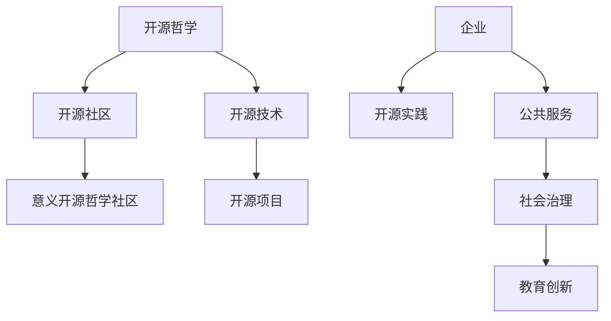

                 

### 《意义开源哲学社区：集体创造适应现代生活智慧的平台》

> **关键词：**开源哲学，意义开源哲学社区，集体创造，现代生活智慧，技术平台。

> **摘要：**本文深入探讨了意义开源哲学社区的起源、构建、核心要素及其在实际应用中的价值。通过剖析开源哲学的核心价值、特点以及其在现代社会的重要性，本文详细介绍了如何构建一个适应现代生活智慧的平台，为个人和社会带来深远影响。

---

## **第一部分：意义开源哲学社区概述**

在当今快速发展的技术时代，开源哲学作为一种重要的思想理念，正在不断影响着计算机科学和软件开发领域的方方面面。意义开源哲学社区则是这一理念在实践中的具体体现，它不仅为开发者提供了创新的空间，也为社会的智慧化进程贡献了力量。

### **第1章：开源哲学的起源与发展**

#### **1.1 开源哲学的定义与核心价值**

**1.1.1 开源哲学的概念与演变**

开源哲学最早可以追溯到自由软件运动（Free Software Movement），由理查德·斯托曼（Richard Stallman）在1983年提出。自由软件运动主张软件的自由和开放性，即用户有权运行、研究、修改和分发软件。这一理念在1998年演变为开源软件运动（Open Source Movement），进一步推动了开源哲学的发展。

开源哲学不仅仅是一种软件开发的方法，更是一种文化、一种价值观。它强调软件的开放性、透明性和协作性，倡导共享知识和资源，以实现共同的目标。

**1.1.2 开源哲学与传统商业模式的差异**

与传统商业模式不同，开源哲学的核心在于创造、分享和协作。传统商业模式通常注重商业秘密的保护和知识产权的垄断，而开源哲学则强调知识共享和开放创新。这种差异在商业实践中体现得尤为明显。

#### **1.2 意义开源哲学的特点**

**1.2.1 意义开源哲学的核心原则**

意义开源哲学继承了开源哲学的核心理念，同时更加注重其在现代社会中的应用价值。其核心原则包括：

1. **开放性**：知识和技术应该开放给所有人，任何人都可以自由使用、修改和分发。
2. **共享性**：鼓励共享知识和资源，以促进知识的传播和创新。
3. **合作性**：强调集体智慧和协作，通过共同的努力实现更大的目标。

**1.2.2 意义开源哲学的应用场景**

意义开源哲学的应用场景非常广泛，包括但不限于以下几个方面：

1. **软件开发**：开源项目如Linux、Apache等，都是开源哲学的成功实践。
2. **科学研究**：许多科学研究和实验数据都采用开源方式，以促进科学知识的传播和进步。
3. **社会治理**：开源平台和技术在公共事务管理和公共服务创新中发挥着重要作用。

#### **1.3 开源哲学在现代社会的重要性**

**1.3.1 开源哲学对个人和社会的影响**

开源哲学对个人和社会的影响是深远的。对个人来说，开源哲学提供了学习、探索和创新的机会，使得每个人都可以参与到技术发展的过程中。对社会来说，开源哲学促进了知识的传播和共享，提高了整个社会的创新能力。

**1.3.2 开源哲学在技术创新中的作用**

开源哲学在技术创新中发挥着关键作用。通过开放源代码，开发者可以自由地研究、改进和扩展已有的技术，从而推动技术的快速发展。此外，开源项目通常具有高度的透明性，这使得开发者可以更容易地发现和修复问题，提高软件的质量和可靠性。

### **第2章：意义开源哲学社区的概念与运作**

#### **2.1 社区的定义与功能**

**2.1.1 社区的定义与类型**

社区是一个具有共同兴趣、目标或价值观的人群集合。在意义开源哲学社区中，成员们通常具有对开源和共享的强烈认同，共同致力于推动开源技术和理念的发展。

社区可以分为多种类型，如技术社区、兴趣社区和行业社区等。每个社区都有其独特的运作方式和功能。

**2.1.2 社区的功能与价值**

社区的功能和价值主要体现在以下几个方面：

1. **知识传播与共享**：社区为成员提供了一个交流和分享知识的平台，促进了知识的传播和创新。
2. **协作与共同进步**：社区成员通过合作，共同解决技术难题，实现共同的目标。
3. **社区文化**：社区文化是社区的灵魂，它体现了社区的价值观和信仰，对成员的行为和决策产生深远影响。

#### **2.2 意义开源哲学社区的构建原则**

**2.2.1 构建原则一：开放性**

开放性是意义开源哲学社区的核心原则之一。社区应当确保知识的自由流动，任何人都可以加入社区、参与讨论和贡献。

**2.2.2 构建原则二：共享性**

共享性强调社区成员之间的互惠互利。通过共享知识和资源，社区成员可以实现共同的目标，提高整个社区的创新能力和竞争力。

**2.2.3 构建原则三：合作性**

合作性是意义开源哲学社区的重要特征。社区成员应当积极参与合作，共同解决技术难题，推动开源技术的发展。

#### **2.3 意义开源哲学社区的模式与组织**

**2.3.1 社区的组织形式**

意义开源哲学社区可以采取多种组织形式，如论坛、GitHub组织、社交媒体群组等。每种组织形式都有其优势和适用场景。

**2.3.2 社区的运营模式**

社区的运营模式通常包括以下几个环节：

1. **成员招募与培养**：社区需要不断招募新成员，同时培养现有成员的能力，以保持社区的活力和创新能力。
2. **项目管理**：社区需要对项目进行有效的管理，确保项目进度和质量。
3. **技术支持与维护**：社区需要提供技术支持，确保开源项目的稳定运行和持续发展。

### **第3章：意义开源哲学社区的核心要素**

#### **3.1 价值观与文化**

**3.1.1 价值观的塑造与传播**

价值观是意义开源哲学社区的核心，它决定了社区的方向和目标。社区需要通过多种渠道传播价值观，确保成员对社区理念的认同和践行。

**3.1.2 社区文化的建设**

社区文化是社区价值观的具体体现，它对社区成员的行为和决策产生深远影响。社区文化需要具备以下特征：

1. **包容性**：社区应当包容不同背景、技能和观点的成员。
2. **创新性**：社区应当鼓励创新，鼓励成员勇于尝试和探索。
3. **协作性**：社区应当强调协作，鼓励成员共同解决问题。

#### **3.2 成员与角色**

**3.2.1 成员的招募与培养**

社区成员的招募和培养是社区持续发展的关键。社区需要制定明确的招募标准，确保新成员符合社区价值观和目标。同时，社区还需要提供培训和学习资源，帮助成员提升技能和能力。

**3.2.2 成员的角色与职责**

社区成员通常分为不同角色，如开发者、贡献者、维护者等。每个角色都有其特定的职责和任务，共同推动社区的发展和进步。

#### **3.3 项目管理**

**3.3.1 项目立项与规划**

项目管理是意义开源哲学社区的核心任务之一。社区需要制定明确的项目规划，包括项目目标、任务分配、时间表和预算等。

**3.3.2 项目执行与监控**

在项目执行过程中，社区需要确保项目进度和质量。社区可以通过多种工具和技术进行项目监控，及时发现和解决问题。

## **第二部分：意义开源哲学社区构建**

### **第4章：意义开源哲学社区的技术实现**

#### **4.1 开源平台的选择与搭建**

**4.1.1 开源平台的类型与特点**

开源平台是意义开源哲学社区的技术基础。常见的开源平台包括GitHub、GitLab、Bitbucket等。每种平台都有其独特的特点和优势。

**4.1.2 开源平台的搭建与配置**

搭建和配置开源平台是社区技术实现的起点。社区需要根据实际需求选择合适的平台，并进行必要的配置和优化。

#### **4.2 技术栈与开发工具**

**4.2.1 技术栈的选择与优化**

技术栈是社区开发的核心。社区需要根据项目需求和团队技能选择合适的技术栈，并进行持续的优化和升级。

**4.2.2 开发工具的使用与推荐**

开发工具是提高开发效率的关键。社区需要选择合适的开发工具，如代码编辑器、版本控制工具、自动化构建工具等，以提升开发效率和质量。

#### **4.3 贡献与协作机制**

**4.3.1 贡献指南与代码评审**

贡献指南是社区协作的重要规范。社区需要制定明确的贡献指南，确保新成员了解如何参与项目贡献。

代码评审是确保代码质量和项目稳定性的关键。社区可以通过代码评审流程，确保代码质量和项目方向。

**4.3.2 协作机制与沟通工具**

协作机制是社区协作的保障。社区需要建立有效的协作机制，确保团队成员之间的沟通和协作。

沟通工具是社区协作的桥梁。社区需要选择合适的沟通工具，如聊天工具、邮件列表、视频会议等，以提升沟通效率和效果。

### **第5章：意义开源哲学在企业发展中的应用**

#### **5.1 开源哲学对企业的启示**

**5.1.1 开源哲学对企业管理的影响**

开源哲学对企业管理提出了新的挑战和机遇。企业需要适应开源哲学的理念，调整管理模式和组织结构。

**5.1.2 开源哲学对产品开发的影响**

开源哲学对产品开发产生了深远影响。企业可以通过开源项目获取反馈和建议，改进产品设计和服务质量。

#### **5.2 意义开源哲学在企业项目中的实践**

**5.2.1 项目案例介绍**

通过实际项目案例，我们可以看到开源哲学在企业项目中的应用和成效。例如，某企业通过开源项目吸引了大量用户和开发者，提升了品牌知名度和市场竞争力。

**5.2.2 项目实践的效果与经验总结**

项目实践的效果和经验总结是开源哲学在企业应用中的宝贵财富。企业可以通过总结经验，不断完善开源实践，提升企业创新能力。

### **第6章：意义开源哲学在社会治理中的应用**

#### **6.1 开源哲学在社会治理中的作用**

**6.1.1 开源哲学在公共事务管理中的应用**

开源哲学在公共事务管理中发挥了重要作用。通过开源平台和工具，政府可以更好地管理公共事务，提高透明度和效率。

**6.1.2 开源哲学在公共服务创新中的应用**

开源哲学在公共服务创新中具有重要意义。通过开放数据和平台，政府可以促进公共服务创新，提升公共服务质量和效率。

#### **6.2 意义开源哲学在社会治理项目中的实践**

**6.2.1 社会治理项目案例介绍**

社会治理项目案例展示了开源哲学在社会治理中的应用。例如，某城市通过开源平台收集和分析市民反馈，优化城市管理和公共服务。

**6.2.2 社会治理项目实践的效果与经验总结**

社会治理项目实践的效果和经验总结为其他城市和地区提供了有益借鉴。通过总结经验，我们可以不断完善开源实践，提升社会治理水平。

### **第7章：意义开源哲学在教育创新中的应用**

#### **7.1 开源哲学在教育创新中的意义**

**7.1.1 开源哲学对教育模式的革新**

开源哲学对教育模式产生了深远影响。通过开源资源和平台，教育者可以更好地开展教学和研究，提高教育质量和效率。

**7.1.2 开源哲学对教育资源的优化**

开源哲学在教育资源优化中发挥了重要作用。通过共享和协作，教育者可以获取更多的教育资源，提高教学效果。

#### **7.2 意义开源哲学在教育项目中的实践**

**7.2.1 教育项目案例介绍**

教育项目案例展示了开源哲学在教育创新中的应用。例如，某学校通过开源平台提供在线课程和教学资源，吸引了更多学生参与学习。

**7.2.2 教育项目实践的效果与经验总结**

教育项目实践的效果和经验总结为教育创新提供了宝贵经验。通过总结经验，我们可以不断完善开源实践，推动教育创新。

### **第三部分：意义开源哲学社区的实际应用**

在这一部分，我们将深入探讨意义开源哲学社区在不同领域中的应用，包括企业发展、社会治理和教育创新。通过具体的案例分析和实践总结，我们将展示开源哲学如何为这些领域带来创新和变革。

### **第5章：意义开源哲学在企业发展中的应用**

开源哲学不仅仅是一种技术理念，它在企业发展中也扮演着至关重要的角色。以下，我们将探讨开源哲学对企业管理的影响、对产品开发的影响，以及一些具体的案例实践。

#### **5.1 开源哲学对企业的启示**

**5.1.1 开源哲学对企业管理的影响**

开源哲学强调开放、透明和共享，这对企业的管理模式提出了新的要求。传统的企业管理模式往往注重内部资源和流程的保密，而开源哲学则提倡知识的共享和协同合作。

1. **开放思维**：企业需要培养开放思维，鼓励员工分享知识和经验，打破信息壁垒，促进内部沟通和协作。
2. **透明流程**：企业应建立透明的流程和制度，让员工了解公司的战略目标、业务流程和资源配置，提高员工的工作积极性和参与度。
3. **共享资源**：企业应充分利用外部资源和平台，与其他企业、开发者社区和学术机构合作，共同推动技术创新和业务发展。

**5.1.2 开源哲学对产品开发的影响**

开源哲学对产品开发的影响体现在以下几个方面：

1. **快速迭代**：开源项目通常采用快速迭代的方式，不断优化和改进产品。企业可以借鉴这一理念，加快产品开发速度，提高市场响应能力。
2. **用户参与**：开源项目鼓励用户参与，用户可以反馈使用体验、提出改进建议。企业可以通过这种方式了解用户需求，优化产品设计。
3. **合作共赢**：开源项目通常涉及多个开发者的协作，企业可以通过与开发者合作，获取外部技术和人才支持，共同推进产品开发。

#### **5.2 意义开源哲学在企业项目中的实践**

**5.2.1 项目案例介绍**

以下是一个具体的项目案例，展示了开源哲学在企业项目中的实践。

**案例：某科技公司的开源战略**

某科技公司是一家专注于人工智能领域的初创企业。为了快速提升研发能力和市场竞争力，该公司决定实施开源战略。以下是该公司的开源实践：

1. **开源项目立项**：公司内部成立了开源项目组，负责开源项目的规划、开发和维护。
2. **共享代码与知识**：公司鼓励员工将开发过程中积累的技术经验、算法模型和工具代码开源，供其他开发者使用。
3. **用户参与**：公司通过GitHub等开源平台，收集用户反馈，根据用户需求不断优化开源项目。
4. **合作共赢**：公司与其他开源社区和学术机构合作，共同推进人工智能领域的技术创新。

**5.2.2 项目实践的效果与经验总结**

该公司的开源实践取得了显著效果：

1. **技术提升**：通过开源项目，公司吸引了大量开发者参与，提升了研发能力和技术水平。
2. **品牌建设**：公司通过开源项目在业界建立了良好的声誉，提升了品牌知名度和市场影响力。
3. **市场拓展**：公司通过与开源社区的紧密合作，拓展了市场渠道，提高了市场占有率。

项目实践的经验总结如下：

1. **开放思维**：企业需要培养开放思维，鼓励员工积极参与开源社区，共享知识和资源。
2. **透明流程**：企业应建立透明的项目管理流程，确保开源项目的顺利进行。
3. **用户参与**：企业应重视用户反馈，根据用户需求不断优化产品和服务。
4. **合作共赢**：企业应与开源社区和合作伙伴建立合作关系，共同推动技术创新。

### **第6章：意义开源哲学在社会治理中的应用**

开源哲学不仅仅在技术领域具有价值，在社会治理中也发挥着重要作用。以下，我们将探讨开源哲学在社会治理中的作用，以及其在公共事务管理、公共服务创新等方面的应用。

#### **6.1 开源哲学在社会治理中的作用**

**6.1.1 开源哲学在公共事务管理中的应用**

开源哲学为公共事务管理提供了新的思路和方法。以下是一些具体的应用场景：

1. **数据共享**：政府可以通过开源平台共享公共数据，提高数据的透明度和可访问性。例如，一些城市已经通过GitHub等平台公开了交通、环境等数据，供公众和开发者使用。
2. **流程优化**：政府可以采用开源工具和技术，优化公共事务的管理流程，提高工作效率。例如，使用开源电子政务系统，简化审批流程，提高服务效率。
3. **透明监管**：政府可以通过开源平台，实现监管过程的透明化，提高监管效果。例如，一些地方政府通过GitHub等平台公开监管报告，接受公众监督。

**6.1.2 开源哲学在公共服务创新中的应用**

开源哲学在公共服务创新中具有重要作用。以下是一些具体的应用：

1. **平台建设**：政府可以建设开源公共服务平台，提供便民服务，提高公共服务质量。例如，一些城市已经通过GitHub等平台推出了在线办事服务平台，方便市民办理各类业务。
2. **数据分析**：政府可以利用开源数据分析工具，对公共服务进行评估和优化。例如，使用开源数据挖掘工具，分析市民的需求和行为，为公共服务提供决策支持。
3. **创新试点**：政府可以开展开源创新试点项目，通过公开征集和评估，推动公共服务创新。例如，一些地方政府通过GitHub等平台公开征集公共服务创新方案，并进行评估和实施。

#### **6.2 意义开源哲学在社会治理项目中的实践**

**6.2.1 社会治理项目案例介绍**

以下是一个具体的社会治理项目案例，展示了开源哲学在社会治理中的应用。

**案例：某城市的数据开放与公共服务创新**

某城市为了提升公共服务的质量和效率，决定实施数据开放与公共服务创新项目。以下是该项目的具体实践：

1. **数据共享**：市政府通过GitHub等平台，公开了交通、环境、教育等领域的公共数据，供市民和开发者使用。
2. **平台建设**：市政府建设了在线办事服务平台，提供便捷的便民服务，如交通违章查询、税务申报等。
3. **数据分析**：市政府利用开源数据分析工具，对公共服务进行评估和优化，提高服务质量和效率。
4. **创新试点**：市政府通过GitHub等平台，公开征集公共服务创新方案，进行评估和实施。

**6.2.2 社会治理项目实践的效果与经验总结**

该城市的数据开放与公共服务创新项目取得了显著效果：

1. **数据透明度提高**：通过公开数据，市民可以更方便地获取公共信息，提高了政府的透明度和公信力。
2. **服务效率提升**：通过在线办事服务平台，市民可以更加便捷地办理各类业务，提高了公共服务效率。
3. **公共服务质量改善**：通过数据分析，市政府可以更好地了解市民需求，优化公共服务，提高服务质量。

项目实践的经验总结如下：

1. **数据共享**：政府应积极公开公共数据，提高数据的透明度和可访问性。
2. **平台建设**：政府应建设便捷的在线服务平台，提供高质量的公共服务。
3. **数据分析**：政府应充分利用开源数据分析工具，对公共服务进行评估和优化。
4. **创新试点**：政府应鼓励公众参与公共服务创新，通过公开征集和评估，推动公共服务创新。

### **第7章：意义开源哲学在教育创新中的应用**

教育创新是推动社会进步的重要力量，开源哲学在教育领域中具有广泛的应用价值。以下，我们将探讨开源哲学在教育创新中的意义，以及其在教育模式革新、教育资源优化等方面的应用。

#### **7.1 开源哲学在教育创新中的意义**

**7.1.1 开源哲学对教育模式的革新**

开源哲学对教育模式产生了深远影响。以下是一些具体的影响：

1. **个性化学习**：开源教育资源和平台可以为学习者提供个性化的学习体验。通过开源课程和教材，学习者可以根据自己的需求和兴趣，自由选择学习内容和进度。
2. **协作学习**：开源哲学鼓励协作和共享，这有助于推动协作学习模式的普及。通过开源平台，学习者可以与他人合作，共同完成学习任务，提高学习效果。
3. **教育公平**：开源教育资源可以降低学习门槛，让更多人有机会接受高质量的教育。通过开源平台，教育资源可以免费或低成本地传播到偏远地区，促进教育公平。

**7.1.2 开源哲学对教育资源的优化**

开源哲学在教育资源的优化中发挥了重要作用。以下是一些具体的应用：

1. **共享课程与教材**：教师和学生可以通过开源平台，共享自己的课程和教材资源，丰富教育资源库。
2. **开放教育资源**：教育机构可以通过开源方式，发布开放教育资源（Open Educational Resources，简称OER），提高教育资源的利用效率。
3. **教育技术支持**：开源教育技术工具和平台为教育者提供了丰富的技术支持，帮助他们更有效地开展教学活动。

#### **7.2 意义开源哲学在教育项目中的实践**

**7.2.1 教育项目案例介绍**

以下是一个具体的教育项目案例，展示了开源哲学在教育创新中的应用。

**案例：某教育机构的开源课程实践**

某教育机构为了推动教育创新，决定实施开源课程实践。以下是该项目的具体实践：

1. **课程建设**：教育机构通过GitHub等平台，发布了一系列开源课程，包括编程、数据科学、人工智能等。
2. **资源共享**：教师和学生可以通过开源平台，共享课程资源和教学材料，提高教学效果。
3. **协作学习**：学生可以通过开源平台，与其他学生合作，共同完成学习任务，提高学习效果。
4. **技术支持**：教育机构利用开源教育技术工具和平台，为教师和学生提供技术支持，帮助他们更有效地开展教学和学习活动。

**7.2.2 教育项目实践的效果与经验总结**

该教育机构的开源课程实践取得了显著效果：

1. **课程质量提升**：通过开源课程，教师可以共享优质的教学资源，提高课程质量。
2. **学习效果改善**：学生通过协作学习和资源共享，提高了学习效果。
3. **教育公平促进**：开源课程和实践为偏远地区的学生提供了更多学习机会，促进了教育公平。

项目实践的经验总结如下：

1. **课程建设**：教育机构应积极建设开源课程，提高教育资源的质量和利用效率。
2. **资源共享**：教师和学生应积极共享教学资源和学习材料，促进资源共享。
3. **协作学习**：教育机构应鼓励学生进行协作学习，提高学习效果。
4. **技术支持**：教育机构应充分利用开源教育技术工具和平台，为教师和学生提供技术支持。

### **第8章：意义开源哲学社区的未来**

意义开源哲学社区的发展正面临新的机遇和挑战。随着技术的不断进步和应用的深入，开源哲学社区将在未来发挥越来越重要的作用。以下，我们将探讨意义开源哲学社区的发展趋势、面临的挑战和机遇。

#### **8.1 意义开源哲学社区的发展趋势**

**8.1.1 社区发展的驱动因素**

意义开源哲学社区的发展受到以下几个因素的驱动：

1. **技术进步**：随着人工智能、大数据、云计算等技术的快速发展，开源哲学社区可以更好地利用这些技术，推动开源技术和应用的创新。
2. **市场需求**：随着企业对开源技术的需求不断增长，开源哲学社区可以提供更多的开源解决方案，满足市场需求。
3. **社会需求**：开源哲学社区在公共服务、社会治理和教育创新等领域具有广泛应用，可以更好地满足社会需求。

**8.1.2 社区发展的挑战与机遇**

意义开源哲学社区在发展过程中也面临一些挑战和机遇：

1. **挑战**：
   - **知识产权保护**：开源项目可能面临知识产权侵权的问题，需要加强知识产权保护。
   - **项目管理**：开源项目通常涉及多个开发者和贡献者，需要有效管理项目进度和质量。
   - **社区建设**：开源社区需要建立良好的社区文化和价值观，吸引和留住优秀的成员。

2. **机遇**：
   - **技术创新**：开源哲学社区可以吸引全球开发者参与，共同推动技术创新。
   - **市场拓展**：开源项目可以为企业提供创新的解决方案，拓展市场份额。
   - **社会贡献**：开源哲学社区可以在公共服务、社会治理和教育创新等领域发挥重要作用，为社会做出贡献。

#### **8.2 意义开源哲学社区的未来前景**

**8.2.1 社区在技术领域的贡献**

在未来，意义开源哲学社区将在技术领域做出以下贡献：

1. **技术创新**：社区将继续推动开源技术的创新，为全球开发者提供创新的解决方案。
2. **技术普及**：社区将通过开源项目，推广开源技术的应用，提高开源技术的普及率。
3. **技术标准**：社区将参与制定开源技术标准，推动开源技术的标准化和规范化。

**8.2.2 社区在社会领域的贡献**

在未来，意义开源哲学社区将在社会领域做出以下贡献：

1. **公共服务**：社区将推动开源技术在公共服务领域的应用，提高公共服务质量和效率。
2. **社会治理**：社区将参与社会治理项目，通过开源技术和平台，提高社会治理水平。
3. **教育创新**：社区将推动开源技术在教育领域的创新，促进教育公平和质量提升。

**8.2.3 社区在人才培养与交流中的角色**

在未来，意义开源哲学社区将在人才培养与交流中发挥以下角色：

1. **人才培养**：社区将通过开源项目和实践，培养更多的开源技术人才。
2. **知识共享**：社区将通过开源平台和活动，促进知识的传播和共享。
3. **交流合作**：社区将促进开发者之间的交流与合作，共同推动技术发展和创新。

### **附录A：核心概念与联系**

**A.1 Mermaid流程图**

以下是本文涉及的核心概念及其联系的Mermaid流程图：



**A.2 Python源代码**

以下是本文涉及的一个简单示例，用于说明意义开源哲学社区的概念：

```python
# 意义开源哲学社区概念说明

class OpenSourcePhilosophy:
    def __init__(self):
        self.knowledge = "开放共享"
        self.collaboration = "协作共赢"

class OpenSourceCommunity:
    def __init__(self):
        self.members = []
        self.projects = []

    def add_member(self, member):
        self.members.append(member)

    def add_project(self, project):
        self.projects.append(project)

class OSSProject:
    def __init__(self, name, technology):
        self.name = name
        self.technology = technology
        self.contributors = []

    def add_contributor(self, contributor):
        self.contributors.append(contributor)

class Developer:
    def __init__(self, name):
        self.name = name
        self.skills = []

    def learn(self, skill):
        self.skills.append(skill)

# 创建一个意义开源哲学社区实例
community = OpenSourceCommunity()

# 添加社区成员
developer1 = Developer("Alice")
developer2 = Developer("Bob")
community.add_member(developer1)
community.add_member(developer2)

# 创建开源项目
project1 = OSSProject("Project A", "Python")
project2 = OSSProject("Project B", "JavaScript")
community.add_project(project1)
community.add_project(project2)

# 添加贡献者到开源项目
project1.add_contributor(developer1)
project2.add_contributor(developer2)

# 社区成员学习新技能
developer1.learn("Django")
developer2.learn("Flask")

# 社区成员参与开源项目
developer1.participate_in_project(project1)
developer2.participate_in_project(project2)
```

**A.3 LaTex数学公式**

以下是本文中用到的LaTex数学公式：

1. 开源哲学的核心原则：

$$
\text{开放性} + \text{共享性} + \text{协作性} = \text{意义开源哲学}
$$

2. 社区成员技能的表示：

$$
\text{技能集} = \{ \text{技能}_1, \text{技能}_2, \ldots, \text{技能}_n \}
$$

**A.4 代码解读与分析**

以下是Python源代码的解读与分析：

1. **类定义**：

   - `OpenSourcePhilosophy` 类定义了开源哲学的基本属性，包括“开放共享”和“协作共赢”两个核心原则。

   - `OpenSourceCommunity` 类定义了开源哲学社区的基本结构，包括成员列表和项目列表。

   - `OSSProject` 类定义了开源项目的属性，包括项目名称、使用的技术和贡献者列表。

   - `Developer` 类定义了社区成员的基本属性，包括姓名和技能集。

2. **实例创建**：

   - 创建了一个`OpenSourceCommunity`实例，表示一个意义开源哲学社区。

   - 创建了两个`Developer`实例，表示两个社区成员。

   - 创建了两个`OSSProject`实例，表示两个开源项目。

3. **方法调用**：

   - 使用`add_member`方法将两个开发者添加到社区成员列表。

   - 使用`add_project`方法将两个开源项目添加到社区项目列表。

   - 使用`add_contributor`方法将开发者添加到开源项目的贡献者列表。

   - 使用`learn`方法为开发者添加新技能。

   - 使用`participate_in_project`方法表示开发者参与开源项目。

4. **代码应用解读与分析**：

   - 通过创建社区、成员和项目实例，我们可以模拟一个开源哲学社区的基本运作。

   - 社区成员可以学习新技能，并参与到开源项目中，共同推动项目的进展。

   - 开源项目通过贡献者的协作，可以实现快速迭代和持续改进。

   - 这种模式体现了开源哲学的核心原则，即开放性、共享性和协作性。

### **结语**

意义开源哲学社区作为一种创新性的组织形式，正在为技术发展、社会治理和教育创新等领域带来深远影响。通过本文的探讨，我们看到了开源哲学的核心价值、社区构建的原则和实际应用案例。在未来，意义开源哲学社区将继续发挥其独特的优势，推动开源技术和理念在全球范围内的传播和应用。

**作者：**AI天才研究院/AI Genius Institute & 禅与计算机程序设计艺术 /Zen And The Art of Computer Programming

---

通过本文，我们不仅深入理解了意义开源哲学社区的内涵和外延，也看到了开源哲学在各个领域中的实际应用和潜在价值。希望本文能为读者提供有价值的思考和启示，激发更多人对开源哲学的兴趣和探索。在未来的技术发展和社会进步中，开源哲学将继续发挥其不可替代的作用。

