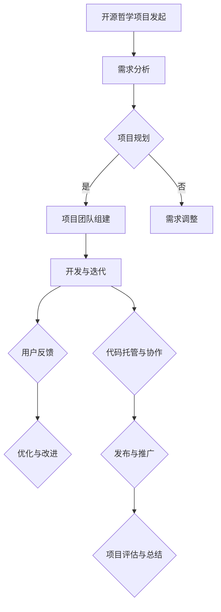

                 

### 意义开源哲学项目：集体创造适应现代的生活智慧

#### 关键词：
- 开源哲学
- 集体创造力
- 适应现代生活
- 生活智慧
- 意义创造

#### 摘要：
本文旨在探讨开源哲学在现代社会中的应用，特别是在集体创造生活智慧方面的作用。通过分析开源哲学的核心概念和其与现代社会的契合点，我们将深入探讨开源哲学在技术、社会、个人成长及创新创业等领域的实践应用。最后，我们将展望开源哲学的未来发展趋势，并探讨其对经济、教育、文化和伦理等方面的影响。

---

### 目录

1. **第一部分：开源哲学的基石**
   1.1 开源哲学的起源与核心价值观
   1.2 开源哲学与现代社会的契合
   1.3 开源哲学与集体创造力
   1.4 开源哲学的未来展望

2. **第二部分：开源哲学的实践应用**
   2.1 开源哲学在技术领域的应用
   2.2 开源哲学在社会领域的应用
   2.3 开源哲学在个人成长中的应用
   2.4 开源哲学在创新与创业中的应用

3. **第三部分：开源哲学的生活智慧**
   3.1 开源哲学与生活哲学的结合
   3.2 开源哲学在家庭生活中的应用
   3.3 开源哲学在职场中的实践
   3.4 开源哲学在教育领域的应用

4. **第四部分：开源哲学的未来展望**
   4.1 开源哲学的发展趋势
   4.2 开源哲学面临的挑战与机遇
   4.3 开源哲学对社会的影响

---

### 引言

开源哲学，作为一个由开源软件运动发展而来的理念，强调共享、协作和自由。它不仅改变了软件开发的方式，也在更广泛的领域产生了深远的影响。在现代社会的复杂性和快速变化中，开源哲学的价值观——如透明度、开放性和共享性——显得尤为重要。本文将探讨开源哲学如何通过集体创造力，适应现代生活，为个体和社会创造更加智慧和有意义的生活方式。

开源哲学不仅仅是一个技术概念，它更是一种生活方式和思维方式。通过集体智慧和协作，人们可以创造出更加高效、创新和可持续的解决方案。本文将从开源哲学的基石出发，逐步展开讨论，旨在为读者提供一个全面、深入的理解，并激发对开源哲学在现代社会中的潜在应用的思考。

---

### 第一部分：开源哲学的基石

#### 1.1 开源哲学的起源与核心价值观

开源哲学的起源可以追溯到20世纪80年代，当时自由软件基金会（FSF）成立，标志着开源运动的开始。自由软件运动强调软件的自由使用、学习和修改，这是开源哲学的核心价值观之一。随着时间的推移，开源哲学逐渐从技术领域扩展到更广泛的领域，成为现代社会中的一种重要思维方式和价值观。

开源哲学的核心价值观包括：

1. **自由与共享**：开源哲学倡导信息的自由流动和资源的共享。这种价值观使得知识、技术和资源能够更加广泛地传播，促进了社会整体的进步。
   
2. **透明与开放**：开源项目通常具有高度的透明度，任何人都可以查看和审查其代码。这种开放性促进了信任和协作，减少了信息不对称，提高了项目的质量和可靠性。

3. **集体智慧**：开源哲学相信集体智慧高于个体智慧。通过广泛的协作和贡献，开源项目能够获得更广泛的反馈和改进，从而产生更好的结果。

#### 1.2 开源哲学与现代社会的契合

现代社会面临着诸多挑战，如信息过载、资源匮乏、社会不平等等问题。开源哲学的价值观为解决这些问题提供了新的思路。

1. **信息共享与知识传播**：在开源哲学的指导下，知识和信息不再局限于特定的人群或组织，而是可以广泛传播。这有助于缩小知识差距，提高整体社会的知识水平。

2. **透明治理与信任**：开源项目的透明性和开放性增强了公众对政府和企业决策的信任。通过公开透明的流程，公众可以更加有效地监督和参与社会事务。

3. **集体合作与可持续发展**：开源哲学强调集体智慧和协作。这种理念不仅适用于技术领域，也可以推广到社会其他方面，促进社会资源的合理分配和可持续发展。

#### 1.3 开源哲学与集体创造力

开源哲学的一个关键特点是集体创造力。通过开放的平台，人们可以自由地贡献自己的智慧和力量，共同创造出更加优秀的成果。

1. **协作与创新**：开源项目通常采用协作式开发模式，参与者来自不同的背景和专业领域。这种多元化的协作促进了创新，使得项目能够更快地发展。

2. **用户参与与反馈**：开源项目鼓励用户参与，用户不仅可以使用项目成果，还可以贡献自己的改进和优化。这种用户参与机制提高了项目的质量和适应性。

3. **开放性与适应性**：开源项目的开放性使其能够快速适应变化。当面对新的挑战或需求时，开源项目可以通过社区的合作迅速进行调整和改进。

#### 1.4 开源哲学的未来展望

开源哲学作为一种先进的理念，其未来充满了无限可能。随着数字化和互联网的进一步发展，开源哲学将在更多领域发挥重要作用。

1. **技术融合**：开源哲学将与其他技术理念，如云计算、大数据和人工智能等相结合，推动技术的不断创新和进步。

2. **社会变革**：开源哲学的价值观将逐渐渗透到社会各个层面，推动社会制度的改革和进步。

3. **全球合作**：开源哲学强调全球合作，通过开源项目，各国可以共同应对全球性挑战，促进全球和平与繁荣。

---

在第一部分中，我们探讨了开源哲学的起源和核心价值观，分析了其在现代社会中的契合点，并探讨了开源哲学与集体创造力的关系。接下来，我们将进一步探讨开源哲学在技术、社会和个人成长等领域的具体实践应用。

---

### 第二部分：开源哲学的实践应用

#### 2.1 开源哲学在技术领域的应用

开源哲学在技术领域有着广泛的应用，其中最为典型的就是开源软件的发展。开源软件是指其源代码可以被公众自由查看、使用、修改和分发的一类软件。这种模式不仅促进了技术的进步，还推动了全球范围内的协作和创新。

1. **开源软件的发展历程**

   - **自由软件运动**：20世纪80年代，自由软件基金会（FSF）成立，标志着自由软件运动的兴起。这一运动主张软件的自由使用、学习和修改，代表性的项目有GNU（GNU's Not Unix）和Linux操作系统。

   - **开源软件运动**：随着互联网的普及，开源软件运动在21世纪初迅速发展。与自由软件运动相比，开源软件运动更加注重商业合作和项目治理，代表性的项目有Apache HTTP服务器、Mozilla Firefox浏览器和MySQL数据库。

   - **云计算和大数据**：随着云计算和大数据技术的发展，开源软件成为这些领域的重要组成部分。例如，Hadoop和Spark等大数据处理框架都是基于开源模式开发的。

2. **开源软件的优势与挑战**

   - **优势**
     - **创新**：开源软件项目通常具有更高的创新性，因为它们能够吸引来自全球的专家和贡献者。
     - **透明度**：开源软件的源代码公开，用户可以审查和改进，提高了软件的安全性和可靠性。
     - **成本效益**：开源软件通常具有较低的成本，用户无需支付高昂的许可费用。

   - **挑战**
     - **维护与更新**：开源项目需要持续维护和更新，以确保其适应新的技术和需求。
     - **社区治理**：开源社区需要有效的治理机制，以保持项目的稳定和发展。

3. **开源软件的案例研究**

   - **Linux操作系统**：Linux操作系统是开源哲学的代表性项目之一。它由全球的志愿者和贡献者共同开发，已经成为服务器和云计算领域的事实标准。Linux的成功在于其开放性、透明度和社区合作。

   - **Apache HTTP服务器**：Apache HTTP服务器是全球最受欢迎的Web服务器软件。它的开源特性使其能够不断改进和适应新的需求，保持了其市场领导地位。

#### 2.2 开源哲学在社会领域的应用

开源哲学不仅仅在技术领域有着重要的应用，在社会领域也发挥着重要作用。通过开源社区和项目，社会问题可以得到更广泛的关注和解决。

1. **社区协作平台**

   - **定义与功能**：社区协作平台是一种基于开源模式的社会网络服务，它允许用户参与、分享和协作。这些平台通常具有以下功能：
     - **用户参与**：用户可以创建、评论和投票，参与社区讨论。
     - **内容分享**：用户可以上传、分享和评论各种内容，如文章、图片和视频。
     - **协作工作**：用户可以共同编辑文档、管理项目和协调工作。

   - **成功案例**：GitHub是一个著名的开源社区协作平台。它不仅提供了代码托管和协作工具，还促进了全球开发者之间的合作和知识共享。

2. **开源社会项目**

   - **定义与目标**：开源社会项目是指以开源模式运营的社会性项目，旨在解决社会问题或提供公共服务。这些项目通常具有以下目标：
     - **解决社会问题**：如开源医疗软件、教育资源和环保项目等。
     - **提供公共服务**：如开源地图、天气预报和交通信息服务等。

   - **成功案例**：OpenStreetMap是一个开源地图项目，它由全球的志愿者共同创建和维护。这个项目的成功在于其开放性、透明度和社区合作，为用户提供了一个准确的、可定制的地图服务。

#### 2.3 开源哲学在个人成长中的应用

开源哲学不仅仅是一种技术理念，它在个人成长中也具有重要作用。通过参与开源项目，个人可以提升技能、建立人脉和实现自我价值。

1. **技能提升**

   - **学习与实践**：参与开源项目是一个实践学习的过程，通过阅读和修改代码，个人可以加深对技术概念的理解和应用。
   - **多样化经验**：开源项目涵盖了各种技术和领域，通过参与不同的项目，个人可以获得多样化的经验，提升综合素质。

2. **人脉建立**

   - **社区互动**：开源社区是一个全球性的平台，通过参与开源项目，个人可以结识来自不同背景的同行，建立有价值的联系。
   - **合作机会**：开源项目的协作模式促进了合作和创新，个人可以通过参与开源项目获得更多的合作机会。

3. **自我价值实现**

   - **贡献与认可**：开源项目鼓励用户贡献自己的智慧和力量，通过参与开源项目，个人可以创造价值并获得认可。
   - **职业发展**：参与开源项目有助于提升个人的职业竞争力，为职业发展提供更多的机会。

#### 2.4 开源哲学在创新与创业中的应用

开源哲学在创新和创业领域也发挥着重要作用。通过开源模式，创业者可以降低创新成本、提高创新速度，并吸引更多的资源和支持。

1. **创新成本降低**

   - **技术共享**：开源项目提供了丰富的技术资源，创业者可以免费使用和修改这些资源，从而降低创新成本。
   - **社区支持**：开源社区通常具有高度的协作性，创业者可以通过社区获取技术支持、反馈和改进建议。

2. **创新速度提高**

   - **快速迭代**：开源项目的迭代速度通常较快，创业者可以借鉴开源项目的经验和方法，快速进行产品迭代。
   - **多样化贡献**：开源项目吸引了来自不同领域的贡献者，创业者可以从中获取多样化的创新思路。

3. **资源与支持**

   - **资金支持**：开源项目可以通过众筹等方式获得资金支持，为创业者提供资金保障。
   - **技术支持**：开源社区提供了丰富的技术资源和支持，为创业者提供技术保障。

---

在第二部分中，我们探讨了开源哲学在技术、社会、个人成长和创新创业等领域的具体实践应用。开源哲学不仅促进了技术进步和社会发展，还为个人和创业者提供了广阔的发展空间。接下来，我们将进一步探讨开源哲学在生活智慧中的具体应用。

---

### 第三部分：开源哲学的生活智慧

#### 3.1 开源哲学与生活哲学的结合

开源哲学不仅仅是一种技术理念，它同样可以应用于生活哲学。开源哲学的核心价值观，如共享、透明和集体智慧，可以引导人们建立更加智慧和有意义的生活方式。

1. **共享与协作**：开源哲学强调共享和协作，这种理念可以应用于个人生活，如分享知识、经验和资源，与他人共同进步。

2. **透明与开放**：开源项目的透明性和开放性可以启发人们在日常生活中保持透明和开放，与他人建立信任和合作关系。

3. **集体智慧**：开源哲学相信集体智慧高于个体智慧，这种理念可以引导人们重视团队合作和集体决策，以实现更好的生活质量和幸福感。

#### 3.2 开源哲学在家庭生活中的应用

开源哲学可以在家庭生活中发挥重要作用，促进家庭成员之间的协作和共同成长。

1. **家庭协作**：开源哲学的协作理念可以应用于家庭事务，如家庭会议、共同决策和家庭任务分配，提高家庭效率和和谐。

2. **知识共享**：家庭成员可以通过共享知识、经验和资源，共同学习和成长。例如，家庭成员可以共同阅读书籍、观看教育视频，或一起参与社区活动。

3. **家庭文化建设**：开源哲学的价值观可以引导家庭建立开放、透明和协作的文化，促进家庭成员之间的信任和沟通。

#### 3.3 开源哲学在职场中的实践

开源哲学在职场中的应用同样具有重要意义，可以提高工作效率和职业发展。

1. **知识共享**：开源哲学鼓励知识共享，职场中的员工可以通过共享经验和技能，提高团队的整体素质和效率。

2. **透明管理**：开源哲学的透明性可以应用于企业管理，提高管理决策的透明度和公正性，增强员工对企业的信任和满意度。

3. **协作创新**：开源哲学的协作理念可以促进职场中的创新和合作，通过团队协作和知识共享，实现更好的工作成果。

#### 3.4 开源哲学在教育领域的应用

开源哲学在教育领域的应用具有广阔的前景，可以推动教育创新和公平。

1. **资源共享**：开源教育项目可以为学生和教师提供丰富的教学资源，促进教育资源共享和普及。

2. **个性化教育**：开源教育项目可以支持个性化学习，学生可以根据自己的需求和进度选择学习内容和资源。

3. **开放课程**：开源哲学鼓励开放课程的发展，学生可以免费获取高质量的教育资源，提高教育公平性和可及性。

---

在第三部分中，我们探讨了开源哲学在家庭生活、职场和教育领域的具体应用。开源哲学不仅为个人生活和工作提供了新的思维方式和方法，还为教育公平和创新提供了有力支持。接下来，我们将进一步探讨开源哲学的未来发展。

---

### 第四部分：开源哲学的未来发展

#### 4.1 开源哲学的发展趋势

随着信息技术的不断进步和互联网的普及，开源哲学正在向更多领域扩展，并展现出强大的生命力和潜力。

1. **数字化时代的开源哲学**

   - **物联网（IoT）**：开源哲学在物联网领域具有重要应用，通过开源协议和标准，促进不同设备和平台之间的互操作性和协作。
   - **人工智能（AI）**：开源AI框架和工具如TensorFlow和PyTorch，已经成为AI研究的基石，推动了人工智能的快速发展。

2. **开源哲学与可持续发展**

   - **环境监测**：开源项目如OpenWeatherMap和OpenDataSoft，提供了丰富的环境监测数据，支持可持续发展的决策。
   - **绿色技术**：开源技术可以在绿色能源、环保设备等领域发挥重要作用，推动可持续生活方式的实现。

#### 4.2 开源哲学面临的挑战与机遇

开源哲学在发展过程中也面临着一系列挑战和机遇。

1. **挑战**

   - **知识产权保护**：开源项目的知识产权保护是一个重要问题，需要平衡开源与知识产权的关系。
   - **社区治理**：随着开源社区的规模扩大，如何有效治理社区，保持项目的稳定和可持续发展，成为一大挑战。

2. **机遇**

   - **全球合作**：开源哲学鼓励全球合作，通过开源项目，各国可以共同应对全球性挑战，推动全球发展。
   - **技术创新**：开源模式促进了技术创新和知识共享，为经济发展提供了新的动力。

#### 4.3 开源哲学的未来发展方向

开源哲学的未来发展方向充满了无限可能。

1. **技术融合**：开源哲学将与其他先进技术，如区块链、云计算和大数据等相结合，推动技术的不断创新。

2. **社会应用**：开源哲学将继续向社会各个领域扩展，促进社会公平、可持续发展和创新。

3. **全球影响**：开源哲学的理念和实践将影响全球，推动全球范围内的协作和进步。

---

在第四部分中，我们探讨了开源哲学的未来发展趋势、面临的挑战和机遇。开源哲学作为一种先进的理念，将在未来发挥更加重要的作用，推动社会的发展和进步。

---

### 结论

开源哲学作为一种先进的思想和价值观，在技术、社会、个人成长和生活智慧等方面都具有深远的影响。通过开源哲学，我们可以实现知识的共享、创新的协作和资源的优化配置，从而提升个体和社会的整体生活质量。在未来的发展中，开源哲学将继续推动技术的进步和社会的变革，成为现代社会不可或缺的一部分。

开源哲学不仅是一种技术理念，更是一种生活方式和思维方式。通过共享、透明和集体智慧，我们可以共同创造一个更加智慧、和谐和可持续发展的世界。让我们携手合作，共同推动开源哲学的应用和发展，为现代社会带来更多的智慧和美好。

---

#### 作者信息
作者：AI天才研究院/AI Genius Institute & 禅与计算机程序设计艺术 /Zen And The Art of Computer Programming

---

### 附录

#### 完整的Mermaid流程图
以下是开源哲学项目的运作流程图：



#### Python源代码示例
以下是使用Python实现一个简单的开源项目示例：

```python
# 开源项目：简单的计算器

def add(a, b):
    return a + b

def subtract(a, b):
    return a - b

def multiply(a, b):
    return a * b

def divide(a, b):
    if b != 0:
        return a / b
    else:
        return "除数不能为0"

# 主程序
if __name__ == "__main__":
    print("欢迎使用简单的计算器！")
    while True:
        print("\n请选择操作：+、-、*、/或'退出'：")
        operation = input()
        if operation == "退出":
            print("感谢使用，再见！")
            break
        print("请输入两个数字：")
        num1 = float(input())
        num2 = float(input())
        
        if operation == "+":
            print("结果：", add(num1, num2))
        elif operation == "-":
            print("结果：", subtract(num1, num2))
        elif operation == "*":
            print("结果：", multiply(num1, num2))
        elif operation == "/":
            print("结果：", divide(num1, num2))
        else:
            print("未识别的操作，请重新输入。")
```

#### 数学公式
以下是文章中使用的数学公式的 LaTeX 格式：

```latex
$$ E = mc^2 $$
$$ \pi = \frac{C}{d} $$
$$ f(n) = \sum_{i=1}^{n} i^2 $$
```

#### 最佳实践 tips
- **社区协作**：积极参与开源社区，贡献代码和意见，以获得反馈和成长。
- **透明沟通**：在项目开发和运营过程中，保持透明和开放的沟通，以增强信任和合作。
- **持续迭代**：定期对开源项目进行评估和改进，以适应新的需求和挑战。

#### 注意事项
- **知识产权**：在开源项目中，尊重知识产权，避免侵犯他人的版权和专利。
- **安全与隐私**：在处理敏感数据时，确保数据的安全和隐私。

#### 拓展阅读
- 《开源软件指南：从基础到高级》
- 《开源文化：如何构建和维护成功的开源社区》
- 《开源哲学：知识共享与社会创新》

---

以上就是《意义开源哲学项目：集体创造适应现代的生活智慧》的完整内容，希望能够为读者提供对开源哲学的全面理解和深入思考。希望您在阅读过程中有所收获，并期待与您在开源社区的共同成长。

