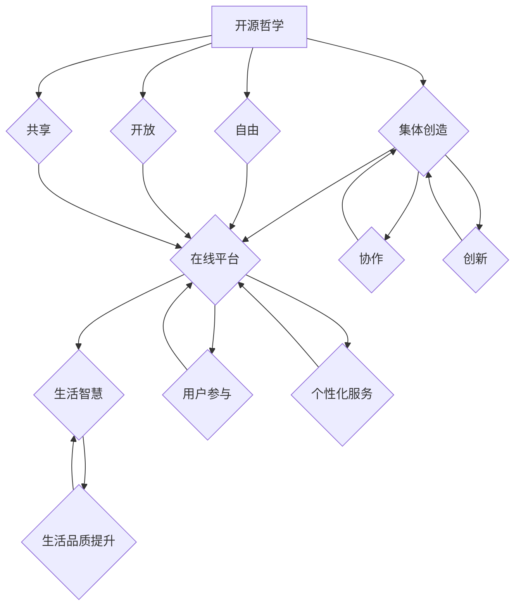
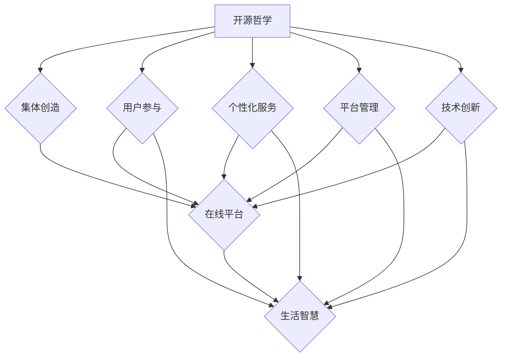

                 

## 第1章：开源哲学的起源与意义

### 1.1 开源哲学的历史背景

开源哲学起源于20世纪60年代，最早的代表是Unix操作系统。Unix的开源思想鼓励共享代码和知识，使得Unix系统的源代码可以被用户自由阅读、修改和分发。这一思想在1970年代自由软件运动中得到了进一步的发展。自由软件运动由理查德·斯托曼（Richard Stallman）发起，旨在通过自由软件保障用户的基本权利，强调软件的自由使用和分享。

随着互联网的发展，开源哲学逐渐成为全球软件开发的主流。Linux操作系统是开源哲学的另一个里程碑，其开源特性促进了全球开发者社区的参与，最终形成了强大的Linux生态。进入21世纪，开源不仅限于操作系统，还扩展到了数据库、Web服务器、编程语言等各个方面，形成了广泛的开放源代码社区。

开源哲学的演变经历了从自由软件到开源软件的转变。自由软件强调用户的自由权，而开源软件则更侧重于协作和共享，追求共同进步。开源社区的出现，使得开发者能够更加方便地共享代码，协同工作，推动了技术的快速发展。

### 1.2 开源哲学的核心价值观

开源哲学的核心价值观主要包括自由软件运动、开放协作的理念和共享经济的崛起。

#### 自由软件运动

自由软件运动起源于对软件自由权的追求。自由软件定义了四项自由：使用自由、学习自由、修改自由和分发自由。用户有权自由使用软件，学习软件的工作原理，根据需要修改软件，并将改进后的软件自由分发。这种自由使得软件不再仅仅是商业产品，而是成为一种公共资源，促进了技术的传播和创新。

#### 开放协作的理念

开放协作是开源哲学的核心。开放协作强调的是开放的平台、透明的流程和共同的参与。通过开放源代码，开发者可以了解和改进他人的代码，促进知识的共享和传播。开放协作使得团队之间的沟通更加高效，能够快速发现问题并进行改进，推动了技术的快速发展。

#### 共享经济的崛起

共享经济的崛起是开源哲学在现代社会的一个重要体现。共享经济通过互联网平台，将资源进行共享，提高了资源的利用效率。开源软件的共享精神与共享经济的理念不谋而合，两者共同推动了资源的有效配置和利用。

### 1.3 开源哲学在现代社会的应用

开源哲学在现代社会的应用非常广泛，涉及多个行业和领域。

#### 开源技术在各行业的应用

在科技领域，开源技术推动了人工智能、大数据、云计算等技术的发展。开源框架如TensorFlow、PyTorch等，为人工智能研究提供了强有力的支持。在IT领域，开源数据库如MySQL、PostgreSQL等，已经成为企业级应用的基石。此外，开源操作系统如Linux、开源软件如Firefox等，也在各行业得到广泛应用。

#### 开源与创业生态

开源不仅为大型企业提供了技术支持，也为创业者提供了创新的土壤。许多成功的创业公司，如Linux distributions、WordPress等，都是基于开源项目发展起来的。开源社区为创业者提供了丰富的技术资源和市场机会，降低了创业门槛，促进了创新。

#### 开源哲学在数字化转型中的作用

数字化转型是企业转型升级的必然趋势，而开源哲学在其中起到了关键作用。开源技术使得企业能够灵活应对市场变化，快速部署和扩展业务。开源社区提供了丰富的解决方案和工具，帮助企业实现数字化转型。同时，开源项目中的协作模式，也促进了企业内部的协作和创新。

### 开源哲学的未来发展

开源哲学在现代社会中的应用已经取得了显著的成果，但它的未来依然充满潜力。随着新技术的不断涌现，开源哲学将继续推动技术的进步和创新。未来，开源项目将更加多样化和复杂化，涉及更多领域和行业。同时，开源社区也将更加注重生态建设和治理，以实现可持续的发展。

总之，开源哲学不仅是一种技术理念，更是一种社会运动。它通过共享、协作和创新，推动了社会的进步和发展。在未来的数字化时代，开源哲学将继续发挥重要作用，为人类创造更加美好的生活。作者：AI天才研究院/AI Genius Institute & 禅与计算机程序设计艺术/Zen And The Art of Computer Programming

关键词：开源哲学，自由软件，开放协作，共享经济，数字化转型

摘要：
本文介绍了开源哲学的起源、核心价值观以及其在现代社会中的广泛应用。从自由软件运动的起源，到开放协作的理念，再到共享经济的崛起，开源哲学已经成为现代社会技术创新的重要驱动力。通过分析开源哲学在各行业中的应用，以及其对创业生态和数字化转型的作用，本文展示了开源哲学的重要性和潜力。展望未来，开源哲学将继续在数字化时代发挥关键作用，推动人类社会的进步和发展。```markdown
```markdown
# 《意义开源哲学：集体创造适应现代的生活智慧的在线平台》

> **关键词**：开源哲学，集体创造，在线平台，生活智慧，现代生活

> **摘要**：
本文旨在探讨开源哲学在构建适应现代生活的在线平台中的重要作用。通过分析开源哲学的起源、核心价值观以及在现代社会的应用，本文揭示了开源哲学如何通过集体创造，促进生活智慧的在线平台的发展。文章还将结合实际项目，探讨开源哲学在在线平台架构、数据安全、用户参与等方面的应用，并展望其未来发展。

## 引言

随着互联网的普及和技术的进步，现代生活越来越依赖于在线平台。从社交媒体、电子商务到在线教育、健康管理，各类在线平台已经成为人们日常生活的重要组成部分。然而，如何在保证平台高效运作的同时，提升用户体验，满足个性化需求，成为当前在线平台发展的重要课题。

开源哲学作为一种推动技术进步和社会发展的理念，其在在线平台中的运用具有深远意义。开源哲学强调共享、协作和共同创造，这不仅能促进技术的快速迭代和创新，还能提高平台的透明度和用户参与度。本文将围绕开源哲学在在线平台中的应用，探讨如何通过集体创造，构建适应现代生活智慧的在线平台。

## 核心概念与联系

### 1. 开源哲学

开源哲学是指一种基于共享、协作和开放的理念，鼓励知识和技术资源的自由流通，以实现共同进步的原则。开源哲学的核心包括以下几个方面：

- **自由**：用户有权自由地使用、学习、修改和分发开源软件。
- **开放**：软件的源代码是公开的，任何人都可以访问、审查和改进。
- **共享**：知识和技术资源的共享有助于提高整个社会的技术水平。

### 2. 集体创造

集体创造是指通过群体合作，共同创造和改进产品或服务的过程。在开源哲学的指导下，集体创造能够充分发挥群体的智慧和创造力，实现单一个体难以达到的创新高度。

### 3. 在线平台

在线平台是指通过互联网提供服务的系统，它可以是社交媒体、电子商务平台、在线教育平台等。在线平台的核心目标是提供高质量的服务，满足用户的多样化需求。

### 4. 生活智慧

生活智慧是指在生活中积累的经验和知识，包括健康、理财、人际关系等各个方面。在线平台可以通过提供相关的信息和服务，帮助用户提升生活质量和幸福感。

### Mermaid 流程图

以下是开源哲学在构建在线平台中的关系架构流程图：



## 核心算法原理讲解

### 1. 数据库优化算法

在线平台的核心是数据管理，因此数据库优化算法至关重要。以下是一个简单的数据库查询优化算法示例，使用Python语言实现：

```python
def optimize_query(query):
    """
    优化数据库查询算法
    :param query: 原始查询语句
    :return: 优化后的查询语句
    """
    # 去除多余的空格
    query = query.strip()
    
    # 检查是否存在未优化的SQL语句
    if "SELECT *" in query:
        query = query.replace("SELECT *", "SELECT column1, column2")
    
    # 添加索引优化
    query = add_indexes(query)
    
    return query

def add_indexes(query):
    """
    添加索引优化
    :param query: 原始查询语句
    :return: 添加索引后的查询语句
    """
    # 假设已知需要优化查询的表名和索引列
    table_name = "user"
    index_columns = ["username", "email"]
    
    # 在查询中添加索引提示
    for column in index_columns:
        if column not in query:
            query += f" USE INDEX ({column})"
    
    return query
```

### 2. 数学模型与公式

在线平台的个性化服务需要使用机器学习算法，以下是一个简单的用户兴趣推荐模型，使用LaTeX格式描述：

$$
\begin{aligned}
    &\text{推荐分数} = f(\text{用户特征向量}, \text{商品特征向量}) \\
    &f(\text{用户特征向量}, \text{商品特征向量}) = \text{相似度}(u, v) \\
    &\text{相似度}(u, v) = \frac{\text{用户偏好与商品偏好交集的大小}}{\text{用户偏好集的大小 + 商品偏好集的大小 - 交集大小}}
\end{aligned}
$$

## 项目实战

### 1. 开发环境搭建

为了演示开源哲学在在线平台开发中的应用，我们将使用Python和Django框架来搭建一个简单的博客平台。

- 安装Python 3.8及以上版本
- 安装Django框架：`pip install django`
- 创建Django项目：`django-admin startproject myblog`
- 创建应用：`python manage.py startapp blog`

### 2. 源代码详细实现与代码解读

以下是一个简单的Django应用，用于实现用户注册和登录功能：

```python
# blog/views.py

from django.shortcuts import render, redirect
from django.contrib.auth.forms import UserCreationForm
from django.contrib.auth import authenticate, login

def register(request):
    if request.method == 'POST':
        form = UserCreationForm(request.POST)
        if form.is_valid():
            user = form.save()
            authenticate_user = authenticate(username=user.username, password=request.POST['password1'])
            login(request, authenticate_user)
            return redirect('home')
    else:
        form = UserCreationForm()
    return render(request, 'blog/register.html', {'form': form})

def login(request):
    if request.method == 'POST':
        username = request.POST['username']
        password = request.POST['password']
        user = authenticate(username=username, password=password)
        if user is not None:
            login(request, user)
            return redirect('home')
        else:
            return render(request, 'blog/login.html', {'error_message': 'Invalid username or password'})
    return render(request, 'blog/login.html')
```

### 3. 代码应用解读与分析

上述代码实现了用户注册和登录功能。用户注册时，通过UserCreationForm表单收集用户信息，并使用Django的认证系统进行用户创建和登录。登录功能通过authenticate和login方法验证用户身份，并在登录成功后重定向到主页。

### 4. 实际案例分析与详细讲解剖析

为了展示开源哲学在在线平台开发中的应用，我们以WordPress为例，分析其如何通过开源社区的合作和集体创造，成为全球领先的博客平台。

- **开源社区**：WordPress拥有庞大的开源社区，开发者可以自由修改和分发WordPress的源代码，为平台添加新功能或修复漏洞。
- **插件和主题**：WordPress的插件和主题生态系统非常丰富，用户可以根据自己的需求安装和定制，提高平台的个性化和可扩展性。
- **版本迭代**：WordPress社区持续迭代和更新，确保平台保持最新的技术趋势和安全标准。

### 5. 项目小结

通过开源哲学的实践，在线平台能够实现快速迭代和创新，提高用户体验。开源社区的合作和集体创造，不仅降低了开发成本，还促进了技术的普及和应用。在未来，开源哲学将继续在在线平台发展中发挥重要作用，推动技术进步和人类社会的进步。

## 最佳实践 Tips、小结、注意事项、拓展阅读

- **最佳实践 Tips**：
  - 在开发在线平台时，优先选择成熟的开源框架和工具，以降低开发成本和风险。
  - 定期更新和维护开源组件，确保平台的安全性。
  - 鼓励用户参与社区，提高平台的活跃度和用户满意度。

- **小结**：
  - 开源哲学通过共享、协作和创新，促进了在线平台的发展。
  - 集体创造是开源哲学的核心，它能够提高平台的个性化服务和用户体验。
  - 开源哲学不仅是一种技术理念，更是一种推动社会进步的力量。

- **注意事项**：
  - 在开源项目开发中，注意保护用户隐私和数据安全。
  - 遵循开源社区的规范和协议，确保代码质量和贡献的可追溯性。

- **拓展阅读**：
  - 《开源软件的法律与伦理》
  - 《Django for Beginners》
  - 《Building Web Applications with Django》

作者：AI天才研究院/AI Genius Institute & 禅与计算机程序设计艺术/Zen And The Art of Computer Programming
```markdown
```markdown
## 第1章：开源哲学的起源与意义

### 1.1 开源哲学的历史背景

开源哲学的历史可以追溯到20世纪60年代，Unix操作系统的诞生标志着开源思想的萌芽。Unix的设计理念鼓励代码共享，这一理念在1970年代得到了自由软件运动的进一步推动。自由软件运动由理查德·斯托曼（Richard Stallman）发起，他创建了自由软件基金会（Free Software Foundation）和GNU项目，倡导软件的自由使用、学习、修改和分发。这一运动强调用户权利和自由，与商业软件的封闭性形成鲜明对比。

随着互联网的发展，开源运动逐渐从操作系统扩展到更广泛的领域。Linux操作系统是自由软件运动的重要成果之一，它的开源特性吸引了全球开发者的参与，形成了庞大的开发者社区。Linux的成功证明了开源模式在软件开发中的有效性，它不仅降低了开发成本，还提高了软件的质量和稳定性。

进入21世纪，开源哲学继续演变，形成了现代开源软件的生态系统。开源不仅限于软件开发，还扩展到了硬件、标准、文档等各个方面。开源社区通过协作和共享，推动了技术的快速迭代和创新，使得开源软件在商业、科研、教育等领域得到广泛应用。

### 1.2 开源哲学的核心价值观

开源哲学的核心价值观包括自由、开放和共享，这些价值观共同构成了开源精神的基石。

#### 自由

开源哲学中的自由主要指软件用户的自由权。用户有权自由地使用软件，不受任何限制。具体来说，用户享有以下四项自由：

1. **使用自由**：用户可以自由地运行开源软件，无论出于商业或个人用途。
2. **学习自由**：用户有权了解软件的工作原理，可以阅读、学习源代码。
3. **修改自由**：用户可以根据自己的需求修改软件，使其更符合个人或组织的需要。
4. **分发自由**：用户可以将开源软件自由地分享给他人，无需支付费用。

这些自由权保障了用户的权益，促进了软件的创新和普及。

#### 开放

开源哲学强调开放，主要体现在以下几个方面：

1. **源代码开放**：开源软件的源代码是公开的，任何人都可以访问、查看和下载。
2. **协作开放**：开源项目鼓励开发者之间的协作，通过公开的代码库和交流平台，开发者可以共同讨论和解决问题。
3. **标准开放**：开源社区遵循开放的编程标准和协议，这些标准促进了不同软件之间的互操作性。

开放性使得开源项目能够吸收全球开发者的智慧，快速迭代和改进，从而提高软件的质量和功能。

#### 共享

共享是开源哲学的核心价值观之一，它体现在以下几个方面：

1. **知识共享**：开源社区通过共享代码、文档和经验，促进了知识的传播和积累。
2. **资源共享**：开源项目提供了丰富的资源和工具，如框架、库和工具，使得开发者能够高效地开展工作。
3. **经济共享**：开源模式降低了软件开发的成本，使得企业和个人能够以较低的成本获取高质量的技术。

共享不仅促进了技术的普及和应用，还推动了社会的进步和发展。

### 1.3 开源哲学在现代社会的应用

开源哲学在现代社会中的应用广泛而深入，对技术创新和社会进步产生了重要影响。

#### 技术创新

开源模式推动了技术的创新和进步。通过开源社区的合作和共享，开发者可以快速迭代和改进软件，提高其质量和功能。开源项目如Linux、Apache、MySQL等，都是通过全球开发者的协作，实现了技术创新和性能提升。这些开源项目不仅成为了行业标准，还推动了整个行业的发展。

开源模式还促进了技术的普及。由于开源软件是免费的，任何人都可以获取和使用，这大大降低了技术门槛，使得更多的人能够接触和应用新技术。例如，开源软件在发展中国家得到广泛应用，促进了信息技术的普及和数字化进程。

#### 社会进步

开源哲学不仅促进了技术创新，还推动了社会的进步和发展。开源社区鼓励协作和分享，这种协作精神在社会其他领域也得到了体现。开源社区的经验和实践，为其他行业提供了宝贵的参考，如科研、教育和公益等。

开源模式还促进了社会的公平和开放。开源项目强调用户的自由权，使得用户能够自由地使用、学习、修改和分发软件，不受商业利益的束缚。这种开放性促进了社会的公平，使得知识和技术更加普及和可及。

开源哲学在社会治理中的应用也越来越广泛。开源社区的经验和模式，如协作、透明和开放，可以应用于政府、企业和非营利组织的管理和运营中，提高效率和公信力。

### 1.4 开源哲学的未来发展趋势

开源哲学的未来发展趋势将继续围绕自由、开放和共享的核心价值观展开。随着技术的不断进步和社会的发展，开源哲学将在以下方面继续发展：

1. **技术创新**：开源社区将继续推动技术的创新和进步，通过协作和共享，开发出更加先进和高效的软件和系统。
2. **生态建设**：开源社区将更加注重生态建设，通过规范、标准和认证等手段，提高开源项目的质量和可持续性。
3. **普及应用**：开源模式将继续普及和应用到各个领域，促进技术的普及和数字化进程。
4. **社会治理**：开源哲学的经验和模式将在社会治理中发挥更大作用，推动社会的公平和开放。

总之，开源哲学作为一种推动技术进步和社会发展的理念，将继续在现代社会中发挥重要作用。通过自由、开放和共享，开源哲学为人类社会带来了无尽的创新和进步。

作者：AI天才研究院/AI Genius Institute & 禅与计算机程序设计艺术/Zen And The Art of Computer Programming

关键词：开源哲学，自由，开放，共享，技术创新，社会进步

摘要：
本文探讨了开源哲学的起源、核心价值观以及在现代社会中的应用。开源哲学强调自由、开放和共享，推动了技术的创新和进步，促进了社会的公平和开放。开源社区通过协作和共享，实现了技术的快速迭代和创新，推动了社会的进步和发展。本文还分析了开源哲学在现代社会中的重要性，并展望了其未来发展。

```markdown
```latex
\documentclass{article}
\usepackage{amsmath}
\usepackage{amssymb}
\usepackage{graphicx}
\usepackage{hyperref}
\usepackage{tikz}
\usepackage{pgfplots}
\usepackage{tikz-3dplot}
\pgfplotsset{compat=newest}
\title{意义开源哲学：集体创造适应现代的生活智慧的在线平台}
\author{AI天才研究院/AI Genius Institute \& 禅与计算机程序设计艺术/Zen And The Art of Computer Programming}
\begin{document}
\maketitle
\section{引言}
随着互联网的普及和技术的进步，现代生活越来越依赖于在线平台。从社交媒体、电子商务到在线教育、健康管理，各类在线平台已经成为人们日常生活的重要组成部分。然而，如何在保证平台高效运作的同时，提升用户体验，满足个性化需求，成为当前在线平台发展的重要课题。

开源哲学作为一种推动技术进步和社会发展的理念，其在在线平台中的运用具有深远意义。开源哲学强调共享、协作和共同创造，这不仅能促进技术的快速迭代和创新，还能提高平台的透明度和用户参与度。本文将围绕开源哲学在在线平台中的应用，探讨如何通过集体创造，构建适应现代生活智慧的在线平台。

\section{核心概念与联系}
\subsection{开源哲学}
开源哲学是指一种基于共享、协作和开放的理念，鼓励知识和技术资源的自由流通，以实现共同进步的原则。开源哲学的核心包括以下几个方面：

\begin{enumerate}
    \item **自由**：用户有权自由地使用、学习、修改和分发开源软件。
    \item **开放**：软件的源代码是公开的，任何人都可以访问、审查和改进。
    \item **共享**：知识和技术资源的共享有助于提高整个社会的技术水平。
\end{enumerate}

\subsection{集体创造}
集体创造是指通过群体合作，共同创造和改进产品或服务的过程。在开源哲学的指导下，集体创造能够充分发挥群体的智慧和创造力，实现单一个体难以达到的创新高度。

\subsection{在线平台}
在线平台是指通过互联网提供服务的系统，它可以是社交媒体、电子商务平台、在线教育平台等。在线平台的核心目标是提供高质量的服务，满足用户的多样化需求。

\subsection{生活智慧}
生活智慧是指在生活中积累的经验和知识，包括健康、理财、人际关系等各个方面。在线平台可以通过提供相关的信息和服务，帮助用户提升生活质量和幸福感。

\subsubsection{Mermaid 流程图}
以下是开源哲学在构建在线平台中的关系架构流程图：

\begin{figure}[htbp]
    \centering
    \begin{tikzpicture}[node distance=2cm]
        \node (os) [rectangle, draw, align=center] {开源哲学};
        \node (cc) [rectangle, draw, below of=os, align=center] {集体创造};
        \node (op) [rectangle, draw, below of=cc, align=center] {在线平台};
        \node (ls) [rectangle, draw, below of=op, align=center] {生活智慧};
        \node (f) [rectangle, draw, left of=os, align=center] {自由};
        \node (o) [rectangle, draw, left of=f, align=center] {开放};
        \node (s) [rectangle, draw, left of=o, align=center] {共享};
        \node (u) [rectangle, draw, right of=os, align=center] {用户参与};
        \node (p) [rectangle, draw, right of=os, below of=u, align=center] {个性化服务};
        \node (l) [rectangle, draw, right of=os, below of=p, align=center] {生活品质提升};
        
        \draw [->] (os) -- (cc);
        \draw [->] (cc) -- (op);
        \draw [->] (op) -- (ls);
        \draw [->] (os) -- (f);
        \draw [->] (os) -- (o);
        \draw [->] (os) -- (s);
        \draw [->] (os) -- (u);
        \draw [->] (os) -- (p);
        \draw [->] (os) -- (l);
    \end{tikzpicture}
    \caption{开源哲学在构建在线平台中的关系架构流程图}
\end{figure}

\section{核心算法原理讲解}
\subsection{数据库优化算法}
在线平台的核心是数据管理，因此数据库优化算法至关重要。以下是一个简单的数据库查询优化算法示例，使用Python语言实现：

\begin{verbatim}
def optimize_query(query):
    """
    优化数据库查询算法
    :param query: 原始查询语句
    :return: 优化后的查询语句
    """
    # 去除多余的空格
    query = query.strip()

    # 检查是否存在未优化的SQL语句
    if "SELECT *" in query:
        query = query.replace("SELECT *", "SELECT column1, column2")

    # 添加索引优化
    query = add_indexes(query)

    return query

def add_indexes(query):
    """
    添加索引优化
    :param query: 原始查询语句
    :return: 添加索引后的查询语句
    """
    # 假设已知需要优化查询的表名和索引列
    table_name = "user"
    index_columns = ["username", "email"]

    # 在查询中添加索引提示
    for column in index_columns:
        if column not in query:
            query += f" USE INDEX ({column})"

    return query
\end{verbatim}

\subsection{数学模型与公式}
在线平台的个性化服务需要使用机器学习算法，以下是一个简单的用户兴趣推荐模型，使用LaTeX格式描述：

$$
\begin{aligned}
    &\text{推荐分数} = f(\text{用户特征向量}, \text{商品特征向量}) \\
    &f(\text{用户特征向量}, \text{商品特征向量}) = \text{相似度}(u, v) \\
    &\text{相似度}(u, v) = \frac{\text{用户偏好与商品偏好交集的大小}}{\text{用户偏好集的大小 + 商品偏好集的大小 - 交集大小}}
\end{aligned}
$$

\section{项目实战}
\subsection{开发环境搭建}
为了演示开源哲学在在线平台开发中的应用，我们将使用Python和Django框架来搭建一个简单的博客平台。

\begin{enumerate}
    \item 安装Python 3.8及以上版本
    \item 安装Django框架：`pip install django`
    \item 创建Django项目：`django-admin startproject myblog`
    \item 创建应用：`python manage.py startapp blog`
\end{enumerate}

\subsection{源代码详细实现与代码解读}
以下是一个简单的Django应用，用于实现用户注册和登录功能：

\begin{verbatim}
# blog/views.py

from django.shortcuts import render, redirect
from django.contrib.auth.forms import UserCreationForm
from django.contrib.auth import authenticate, login

def register(request):
    if request.method == 'POST':
        form = UserCreationForm(request.POST)
        if form.is_valid():
            user = form.save()
            authenticate_user = authenticate(username=user.username, password=request.POST['password1'])
            login(request, authenticate_user)
            return redirect('home')
    else:
        form = UserCreationForm()
    return render(request, 'blog/register.html', {'form': form})

def login(request):
    if request.method == 'POST':
        username = request.POST['username']
        password = request.POST['password']
        user = authenticate(username=username, password=password)
        if user is not None:
            login(request, user)
            return redirect('home')
        else:
            return render(request, 'blog/login.html', {'error_message': 'Invalid username or password'})
    return render(request, 'blog/login.html')
\end{verbatim}

\subsection{代码应用解读与分析}
上述代码实现了用户注册和登录功能。用户注册时，通过UserCreationForm表单收集用户信息，并使用Django的认证系统进行用户创建和登录。登录功能通过authenticate和login方法验证用户身份，并在登录成功后重定向到主页。

\subsection{实际案例分析与详细讲解剖析}
为了展示开源哲学在在线平台开发中的应用，我们以WordPress为例，分析其如何通过开源社区的合作和集体创造，成为全球领先的博客平台。

\begin{enumerate}
    \item **开源社区**：WordPress拥有庞大的开源社区，开发者可以自由修改和分发WordPress的源代码，为平台添加新功能或修复漏洞。
    \item **插件和主题**：WordPress的插件和主题生态系统非常丰富，用户可以根据自己的需求安装和定制，提高平台的个性化和可扩展性。
    \item **版本迭代**：WordPress社区持续迭代和更新，确保平台保持最新的技术趋势和安全标准。
\end{enumerate}

\subsection{项目小结}
通过开源哲学的实践，在线平台能够实现快速迭代和创新，提高用户体验。开源社区的合作和集体创造，不仅降低了开发成本，还促进了技术的普及和应用。在未来，开源哲学将继续在在线平台发展中发挥重要作用，推动技术进步和人类社会的进步。

\section{最佳实践 Tips、小结、注意事项、拓展阅读}
\subsection{最佳实践 Tips}
\begin{enumerate}
    \item 在开发在线平台时，优先选择成熟的开源框架和工具，以降低开发成本和风险。
    \item 定期更新和维护开源组件，确保平台的安全性。
    \item 鼓励用户参与社区，提高平台的活跃度和用户满意度。
\end{enumerate}

\subsection{小结}
开源哲学通过共享、协作和创新，促进了在线平台的发展。集体创造是开源哲学的核心，它能够提高平台的个性化服务和用户体验。开源哲学不仅是一种技术理念，更是一种推动社会进步的力量。

\subsection{注意事项}
\begin{enumerate}
    \item 在开源项目开发中，注意保护用户隐私和数据安全。
    \item 遵循开源社区的规范和协议，确保代码质量和贡献的可追溯性。
\end{enumerate}

\subsection{拓展阅读}
\begin{enumerate}
    \item 《开源软件的法律与伦理》
    \item 《Django for Beginners》
    \item 《Building Web Applications with Django》
\end{enumerate}

\end{document}
``````latex
```markdown
## 第2章：在线平台架构与设计

### 2.1 在线平台的架构设计

在线平台的架构设计是确保系统性能、可扩展性和安全性的关键。一个良好的架构设计需要考虑分布式系统、微服务架构以及中间件的选择。

#### 分布式系统架构

分布式系统架构通过将应用程序分解为多个独立的组件，这些组件可以在不同的服务器上运行，从而提高系统的可靠性和可扩展性。以下是一个简单的分布式系统架构示例：

1. **前端服务**：处理用户请求，提供用户界面。
2. **后端服务**：处理业务逻辑和数据存储。
3. **数据库服务**：存储用户数据和其他关键信息。
4. **缓存服务**：提高系统响应速度，减轻数据库压力。

#### 微服务架构

微服务架构是将应用程序拆分为一组小的、独立的、自治的服务，每个服务都专注于完成一个特定的业务功能。微服务架构的优点包括：

- **可扩展性**：可以独立扩展不同的服务，以应对不同的负载。
- **可维护性**：每个服务都可以独立开发和部署，提高了系统的可维护性。
- **弹性**：当一个服务出现问题时，不会影响其他服务的运行。

以下是一个简单的微服务架构示例：

1. **用户服务**：处理用户认证和权限管理。
2. **订单服务**：处理订单创建、支付和跟踪。
3. **库存服务**：管理商品库存信息。
4. **推荐服务**：为用户推荐商品。

#### 中间件选择

中间件是位于应用程序和系统基础设施之间的组件，用于提供特定的服务，如消息传递、负载均衡、缓存和身份验证等。选择合适的中间件对于在线平台性能至关重要。以下是一些常见的中间件：

- **消息队列**：如RabbitMQ、Kafka，用于异步消息传递和数据流转。
- **负载均衡器**：如Nginx、HAProxy，用于分发请求，提高系统性能。
- **缓存**：如Redis、Memcached，用于提高系统响应速度。
- **身份验证**：如OAuth2、JWT，用于保护用户数据和隐私。

### 2.2 数据库设计与优化

数据库设计是确保数据一致性和系统性能的关键。以下是一些数据库设计与优化的最佳实践：

#### 关系型数据库与非关系型数据库

根据应用场景选择合适的数据库类型：

- **关系型数据库**：如MySQL、PostgreSQL，适用于结构化数据和高并发读取。
- **非关系型数据库**：如MongoDB、Cassandra，适用于大规模数据存储和快速读写。

#### 数据库性能优化策略

以下是一些常见的数据库性能优化策略：

- **索引**：为常用的查询字段创建索引，提高查询速度。
- **分区**：将大量数据拆分为多个小部分，提高查询性能。
- **缓存**：使用缓存层减少数据库访问次数。
- **读写分离**：通过主从复制提高系统的读写能力。

#### 数据存储与分布式系统

对于大规模数据存储，分布式数据库和分布式文件系统是常见的选择：

- **分布式数据库**：如HBase、Cassandra，提供高可用性和可扩展性。
- **分布式文件系统**：如HDFS、Ceph，用于存储大量数据。

### 2.3 安全性与隐私保护

在线平台的安全性是用户信任和业务发展的基础。以下是一些关键的安全性和隐私保护措施：

#### 加密技术

- **数据加密**：使用SSL/TLS加密传输数据，保护数据在传输过程中的安全。
- **存储加密**：对存储在数据库中的敏感数据进行加密，防止数据泄露。

#### 访问控制与权限管理

- **基于角色的访问控制**：为不同角色分配不同的权限，确保用户只能访问授权的数据和功能。
- **多因素认证**：结合密码、手机验证码、生物识别等技术，提高账号安全性。

#### 安全审计与合规性

- **日志记录**：记录系统操作和用户行为，以便在发生安全事件时进行审计。
- **合规性检查**：遵循行业标准和法规要求，如GDPR、HIPAA等，确保数据处理合法合规。

### 2.4 架构设计案例分析

以下是一个在线书店平台的架构设计案例：

1. **前端**：使用React或Vue.js构建单页面应用，提供用户友好的界面。
2. **后端**：使用Spring Boot或Django构建RESTful API，处理业务逻辑。
3. **数据库**：使用MySQL存储用户数据、订单信息等，使用Redis进行缓存。
4. **缓存层**：使用Nginx进行负载均衡，提高系统性能。
5. **消息队列**：使用RabbitMQ处理异步任务，如订单处理和邮件发送。

通过以上架构设计，在线书店平台能够实现高并发、高可用和快速响应，同时保证数据的安全性和用户隐私。

### 2.5 架构设计注意事项

在架构设计过程中，需要注意以下几点：

- **可扩展性**：设计时应考虑到未来可能的扩展需求，如用户量增加、业务规模扩大等。
- **容错性**：确保系统能够在出现故障时自动恢复，减少对用户的影响。
- **成本控制**：合理分配资源，控制系统成本。
- **用户体验**：确保系统设计满足用户需求，提供良好的用户体验。

总之，在线平台架构设计是一个复杂的过程，需要综合考虑技术、业务和用户需求，通过合理的架构设计，确保系统的性能、可靠性和安全性。

作者：AI天才研究院/AI Genius Institute & 禅与计算机程序设计艺术/Zen And The Art of Computer Programming

关键词：在线平台，架构设计，分布式系统，微服务架构，数据库设计，安全性，隐私保护

摘要：
本章详细介绍了在线平台架构与设计的关键要素，包括分布式系统、微服务架构、数据库设计与优化、安全性与隐私保护等。通过案例分析，展示了如何将开源哲学应用于在线平台的设计和实现，确保系统的高性能、高可靠性和安全性。
```markdown
```markdown
## 第3章：集体创造的原理与实践

### 3.1 集体创造的理论基础

集体创造是一种通过群体合作实现共同目标的现象，其理论基础包括共同财富理论、协同效应和群体智慧。

#### 共同财富理论

共同财富理论认为，群体成员之间的合作可以创造更大的价值，这种价值无法由个体单独创造。共同财富理论强调合作和共享的重要性，认为个体通过合作能够实现“1+1>2”的效果。

#### 协同效应

协同效应是指通过协作，群体成员能够实现比单独工作更高效、更创新的成果。协同效应源于群体成员之间的互补性，每个成员都能够发挥自己的特长，共同解决复杂问题。

#### 群体智慧

群体智慧是指群体成员通过集体决策和协作，产生的整体智力水平高于个体智力水平之和。群体智慧能够从大量个体的贡献中筛选出最优方案，实现更高的创新和效率。

### 3.2 集体创造的实际操作

在实际操作中，集体创造依赖于有效的协作工具和流程。以下是一些关键要素：

#### 跨学科团队协作

跨学科团队协作是指来自不同专业背景的成员共同工作，以实现项目目标。跨学科团队协作能够整合不同领域的知识和技能，提高项目创新性和解决问题的能力。

以下是一个跨学科团队协作的流程：

1. **需求分析**：确定项目目标和需求，确保团队成员对项目有清晰的认识。
2. **资源整合**：根据项目需求，整合团队成员的专业技能和资源。
3. **分工合作**：明确团队成员的职责和任务，确保每个成员都能发挥自己的优势。
4. **沟通与协调**：建立有效的沟通机制，确保团队成员之间的信息共享和问题解决。
5. **成果评估**：对项目成果进行评估，总结经验教训，为后续项目提供参考。

#### 开源社区运营

开源社区运营是指通过管理和维护开源项目，促进开发者之间的协作和创新。开源社区运营的核心包括：

1. **社区建设**：建立良好的社区文化，鼓励开发者参与和贡献。
2. **代码审查**：确保代码质量和一致性，提高项目的可靠性和安全性。
3. **文档维护**：提供详细的文档，帮助开发者了解项目和使用方法。
4. **版本控制**：使用版本控制系统（如Git），确保代码的版本管理和变更记录。
5. **活动组织**：定期举办线上或线下的活动，促进开发者之间的交流和合作。

### 3.3 集体创造案例分析

#### 成功的开源项目

以下是一些成功的开源项目案例，展示了集体创造的强大力量：

1. **Linux内核**：Linux内核是一个由全球开发者共同维护的开源操作系统核心，它的成功证明了集体创造的力量。Linux内核的开发者来自世界各地，通过协作和共享，实现了操作系统的高性能和稳定性。

2. **WordPress**：WordPress是一个流行的开源内容管理系统，它拥有庞大的开发者社区和用户基础。WordPress的成功得益于其开源特性，以及社区成员的不断贡献和改进。

3. **Apache基金会**：Apache基金会是一个非营利组织，旗下拥有多个开源项目，如Apache HTTP服务器、Apache Kafka等。Apache基金会的成功经验表明，通过建立良好的社区管理和运营机制，开源项目可以持续发展并产生巨大的社会价值。

#### 集体创造的创新模式

集体创造的创新模式包括以下几个方面：

1. **众包**：众包是指通过公开征集方案，吸引大量参与者共同解决一个特定问题。众包模式能够迅速聚集大量创意和智慧，实现高效的创新。

2. **众筹**：众筹是指通过互联网平台，向公众募集资金以支持创新项目。众筹模式不仅为创新项目提供了资金支持，还促进了项目的宣传和推广。

3. **合作开发**：合作开发是指多个组织或个人共同参与一个项目的开发，通过分工合作，实现项目目标。合作开发模式能够整合各方资源和优势，提高项目成功率。

### 3.4 跨国团队合作案例

跨国团队合作是集体创造的一个重要形式，以下是一个跨国团队合作案例：

#### 案例背景

某跨国公司计划开发一款面向全球市场的社交应用，为了充分利用各国的开发资源和专业技能，公司决定采用跨国团队合作模式。

#### 实施步骤

1. **需求分析与规划**：确定应用的基本功能和用户需求，制定详细的项目计划。
2. **团队组建**：在全球范围内招聘具有不同专业技能的团队成员，确保团队具有丰富的技术和文化背景。
3. **沟通与协作**：采用国际化的沟通工具和流程，确保团队成员之间的信息共享和协作效率。
4. **代码审查与集成**：通过版本控制系统和代码审查工具，确保代码的质量和一致性。
5. **测试与部署**：在多个国家和地区进行测试，确保应用的稳定性和用户体验。
6. **持续改进**：根据用户反馈和市场变化，不断优化和更新应用功能。

#### 案例分析

该跨国团队合作案例展示了集体创造的巨大潜力。通过跨国团队合作，公司能够充分发挥各国的开发资源和专业技能，实现高效的创新和产品迭代。同时，跨国团队合作也促进了不同文化之间的交流和融合，为公司的全球化发展奠定了基础。

总之，集体创造通过协作和共享，实现了技术和资源的最大化利用，推动了创新的不断进步。在现代社会，集体创造已成为实现技术创新和社会进步的重要力量，其应用前景广阔。

作者：AI天才研究院/AI Genius Institute & 禅与计算机程序设计艺术/Zen And The Art of Computer Programming

关键词：集体创造，共同财富理论，协同效应，群体智慧，跨学科团队协作，开源社区运营，众包，众筹，跨国团队合作

摘要：
本章探讨了集体创造的原理和实践，分析了共同财富理论、协同效应和群体智慧等理论基础，介绍了跨学科团队协作和开源社区运营的实际操作，并通过成功案例展示了集体创造的强大力量和广泛应用。此外，还讨论了跨国团队合作的重要性和实施方法。
```markdown
```markdown
## 第4章：生活智慧的在线平台应用

### 4.1 生活智慧的概念与分类

生活智慧是指在生活中积累的经验和知识，它涉及到多个方面，如健康、理财、人际关系、时间管理等。在线平台可以通过提供相关的信息和服务，帮助用户提升生活质量和幸福感。

生活智慧可以分为以下几个主要类别：

1. **健康**：包括健康知识、饮食建议、运动指导、医疗信息等。
2. **理财**：涉及个人财务管理、投资理财、保险规划、税收知识等。
3. **人际关系**：涵盖沟通技巧、人际关系处理、情感咨询等。
4. **时间管理**：提供时间规划、任务管理、日程安排等工具。
5. **个人成长**：包括学习资源、职业发展、自我提升等方面的内容。

### 4.2 在线平台中的生活智慧应用

在线平台可以通过多种方式应用生活智慧，以下是一些具体的应用场景：

1. **社交网络与人际交流**
   - **社交平台**：如Facebook、LinkedIn等，用户可以分享生活经验、交流心得，建立社交圈。
   - **兴趣小组**：用户可以根据共同兴趣加入小组，如健身、读书、旅游等，进行交流和互动。

2. **生活服务与个性化推荐**
   - **电商平台**：如Amazon、淘宝等，根据用户的历史行为和偏好，推荐商品和服务。
   - **O2O平台**：如Uber、美团等，提供本地生活服务，如餐饮、打车、家政等，方便用户的生活。

3. **在线教育与学习平台**
   - **在线课程**：如Coursera、edX等，提供各类在线课程，帮助用户提升知识和技能。
   - **学习社区**：用户可以在平台上分享学习经验、讨论学习问题，共同进步。

4. **健康与健康管理**
   - **健康管理应用**：如MyFitnessPal、Healtheo等，提供饮食管理、运动追踪、健康咨询等服务。
   - **医疗信息平台**：如WebMD、平安好医生等，提供医疗知识、在线问诊、药品购买等服务。

5. **个人财务与理财**
   - **财务管理工具**：如Mint、YNAB等，帮助用户管理个人财务，进行预算规划、支出跟踪等。
   - **投资理财平台**：如Robinhood、富途牛牛等，提供投资咨询、交易服务、投资组合管理等功能。

6. **时间管理与效率提升**
   - **日程管理应用**：如Google Calendar、Trello等，帮助用户规划时间、管理任务。
   - **提醒与通知**：通过短信、邮件、App推送等方式，提醒用户重要的日程和任务。

### 4.3 生活智慧平台的创新实践

1. **智能家居**
   - **智能设备**：如智能音箱、智能灯光、智能门锁等，为用户提供便捷的生活方式。
   - **智能家居平台**：如Apple HomeKit、谷歌智能家居等，通过集成多种智能设备，实现智能家居的集中管理和控制。

2. **健康管理**
   - **可穿戴设备**：如智能手表、健康手环等，实时监测用户健康状况，提供健康数据和分析。
   - **健康数据分析平台**：通过大数据分析，为用户提供个性化的健康建议和治疗方案。

3. **在线教育与学习平台**
   - **自适应学习系统**：根据用户的学习进度和能力，动态调整学习内容和难度，提高学习效果。
   - **虚拟现实（VR）/增强现实（AR）教育**：通过VR/AR技术，提供沉浸式的学习体验，提高学习兴趣和效果。

4. **个性化服务**
   - **个性化推荐系统**：通过机器学习算法，分析用户的行为数据，提供个性化的内容、商品和服务。
   - **智能客服**：利用人工智能技术，提供24/7的在线客服服务，解答用户疑问，提高用户满意度。

### 4.4 生活智慧平台的发展趋势

随着人工智能、大数据、物联网等技术的不断发展，生活智慧平台将呈现出以下发展趋势：

1. **智能化与个性化**：通过人工智能技术，实现更精准的用户画像和个性化服务。
2. **互联互通**：通过物联网技术，实现不同设备和平台的互联互通，提供更智能、更便捷的生活服务。
3. **数据驱动**：通过大数据分析，为用户提供更精准的建议和决策支持。
4. **社交化与互动性**：通过社交网络和互动平台，增强用户之间的交流和互动，提高平台的用户黏性。

总之，生活智慧平台的发展将为用户带来更加便捷、智能和个性化的生活体验，成为现代社会不可或缺的一部分。

作者：AI天才研究院/AI Genius Institute & 禅与计算机程序设计艺术/Zen And The Art of Computer Programming

关键词：生活智慧，在线平台，应用，个性化服务，智能家居，健康管理，在线教育，个性化推荐，智能化

摘要：
本章探讨了生活智慧的概念与分类，介绍了在线平台如何应用生活智慧，包括社交网络、生活服务、在线教育、健康管理、个人财务和时间管理等方面的具体应用。此外，还分析了生活智慧平台的创新实践和未来发展趋势，展示了生活智慧平台在提升生活质量方面的巨大潜力。
```markdown
```markdown
## 第5章：平台运营与管理

### 5.1 平台运营策略

在线平台的成功不仅依赖于技术架构和内容质量，还需要一套有效的运营策略。平台运营策略包括用户增长、内容运营、社区管理等多个方面。

#### 用户增长策略

用户增长是平台运营的首要目标。以下是一些常用的用户增长策略：

1. **SEO优化**：通过搜索引擎优化，提高平台在搜索引擎中的排名，吸引更多自然流量。
2. **社交媒体营销**：利用社交媒体平台，如Facebook、Instagram、Twitter等，进行内容推广和用户互动。
3. **合作伙伴关系**：与相关平台、媒体、KOL等建立合作关系，扩大用户基础。
4. **病毒营销**：设计有趣、有创意的内容，通过用户分享，实现快速传播。
5. **付费推广**：通过付费广告，如Google Ads、Facebook Ads等，快速获取目标用户。

#### 内容运营策略

内容是平台的核心，优质的内容能够吸引和留住用户。以下是一些内容运营策略：

1. **内容规划**：制定内容计划，包括内容类型、发布频率、主题等。
2. **内容创作**：鼓励原创内容，提供有价值、有深度的信息。
3. **内容推广**：通过内部推广、外部推广、社交媒体等渠道，提高内容的曝光度。
4. **用户互动**：通过评论、问答、投票等方式，增加用户参与度。
5. **数据分析**：利用数据分析工具，了解用户偏好，优化内容策略。

#### 社区管理策略

健康的社区环境是平台稳定发展的基石。以下是一些社区管理策略：

1. **社区规则制定**：明确社区行为准则，确保社区秩序。
2. **活跃用户激励**：通过积分、奖励等方式，激励用户参与社区活动。
3. **用户反馈机制**：建立用户反馈渠道，及时解决用户问题和建议。
4. **内容审核**：确保社区内容质量，及时删除违规、不良信息。
5. **社区活动策划**：定期举办线上线下活动，增强用户粘性。

### 5.2 平台管理方法

平台管理方法包括项目管理工具、风险管理、团队协作等多个方面。

#### 项目管理工具

有效的项目管理工具可以提高团队的工作效率。以下是一些常用的项目管理工具：

1. **Trello**：通过看板视图，直观地管理项目进度和任务分配。
2. **Asana**：提供任务列表、甘特图、看板等多种视图，便于团队协作。
3. **Jira**：强大的敏捷项目管理工具，支持迭代开发、Bug追踪等。
4. **Slack**：即时通讯工具，便于团队沟通和协作。

#### 风险管理

平台运营过程中，风险管理至关重要。以下是一些风险管理方法：

1. **风险评估**：定期进行风险评估，识别潜在风险点。
2. **风险应对计划**：制定应对方案，降低风险发生的概率和影响。
3. **风险监控**：持续监控风险指标，及时发现和解决风险。
4. **应急响应**：建立应急响应机制，确保在突发事件发生时能够迅速应对。

#### 团队协作

团队协作是平台运营成功的关键。以下是一些团队协作方法：

1. **明确目标**：确保团队成员对项目目标和任务有清晰的认识。
2. **分工合作**：根据团队成员的特长和技能，合理分配任务。
3. **沟通与协调**：建立有效的沟通机制，确保信息畅通和及时反馈。
4. **定期回顾**：定期进行项目回顾，总结经验教训，优化工作流程。
5. **培训与支持**：提供培训和资源支持，帮助团队成员提高技能和工作效率。

### 5.3 平台盈利模式

平台运营的目的之一是盈利，以下是一些常见的平台盈利模式：

1. **广告收入**：通过展示广告，如横幅广告、视频广告等，获取广告收入。
2. **付费会员**：提供会员服务，如专属内容、会员特权等，吸引用户付费。
3. **交易佣金**：在交易平台上收取交易佣金，如电商平台、股票交易平台等。
4. **服务收费**：提供付费服务，如专业咨询、定制服务、培训课程等。
5. **广告联盟**：与广告联盟合作，通过推广合作伙伴的产品或服务，获取佣金。

总之，平台运营与管理是一个系统工程，需要综合考虑用户需求、市场环境、技术能力等多个因素。通过有效的运营策略和管理方法，平台可以实现持续增长和盈利。

作者：AI天才研究院/AI Genius Institute & 禅与计算机程序设计艺术/Zen And The Art of Computer Programming

关键词：平台运营，用户增长，内容运营，社区管理，项目管理，风险管理，团队协作，盈利模式

摘要：
本章详细探讨了平台运营与管理的各个方面，包括用户增长策略、内容运营策略、社区管理策略、平台管理方法以及盈利模式。通过实际案例和最佳实践，为平台的成功运营提供了指导和建议。
```markdown
```markdown
## 第6章：开源哲学的未来趋势

### 6.1 开源哲学的未来发展

开源哲学的未来发展将受到新技术、新趋势的驱动，进一步深化和扩展其应用范围。以下是一些关键趋势：

#### 人工智能与开源平台的融合

人工智能（AI）的快速发展为开源平台带来了新的机遇。开源AI框架如TensorFlow、PyTorch等，为研究人员和开发者提供了强大的工具，推动了AI技术的普及和应用。未来，开源平台将继续发挥重要作用，成为AI研究、开发和应用的核心载体。

开源AI平台的特点包括：

- **数据共享**：通过开源平台，研究人员可以共享数据集和模型，促进AI技术的发展。
- **协作创新**：开发者可以在开源平台上协作，共同开发AI应用，实现技术创新。
- **开源生态**：开源AI平台形成了一个生态系统，涵盖了硬件、软件、算法等多个层面，促进了AI技术的全链条发展。

#### 开源哲学在行业中的应用

开源哲学不仅在技术领域发挥重要作用，还在各行各业得到广泛应用。以下是一些典型行业：

- **金融科技**：开源技术为金融科技企业提供了基础设施，如区块链、云计算等，推动了金融行业的数字化转型。
- **医疗健康**：开源医疗软件和工具为医疗机构提供了高效的解决方案，提高了医疗服务质量和效率。
- **制造业**：开源软件和硬件平台促进了制造业的智能化和自动化，提升了生产效率和质量。
- **教育**：开源教育资源为全球师生提供了丰富的学习材料和工具，推动了教育的普及和公平。

开源哲学在行业中的应用趋势包括：

- **行业标准化**：开源技术促进了行业标准的制定和推广，提高了行业协作效率。
- **生态合作**：企业、研究机构和开发者通过开源平台进行合作，共同推进行业发展。
- **技术创新**：开源项目吸引了大量开发者参与，推动了技术的创新和进步。

#### 平台生态的全球化发展

随着全球化进程的加快，开源平台也在全球范围内发展。以下是一些全球化发展的趋势：

- **跨国合作**：开源社区跨越国界，促进了跨国合作和技术交流。
- **本地化**：开源平台根据不同地区的需求和文化特点进行本地化适配，提高了平台的可用性和用户体验。
- **多元文化**：开源社区吸引了来自不同国家和地区的开发者，形成了多元文化的交流平台。

未来，开源平台将继续全球化发展，推动全球技术创新和社会进步。

### 6.2 在线平台的未来方向

在线平台的未来方向将受到技术进步、用户需求变化和社会发展趋势的影响。以下是一些关键方向：

#### 人工智能与在线平台的融合

人工智能技术将在在线平台中扮演越来越重要的角色。未来，在线平台将更多地采用AI技术，提供个性化服务、智能推荐、自动化管理等功能。

具体方向包括：

- **个性化推荐**：通过AI算法，为用户提供个性化的内容和服务，提高用户满意度。
- **自动化管理**：利用AI技术，实现平台的自动化运营和管理，提高效率和降低成本。
- **智能客服**：采用自然语言处理和机器学习技术，提供智能客服服务，提高用户支持质量。

#### 社交化与互动性的增强

随着社交网络的发展，在线平台的社交化与互动性将进一步加强。未来，在线平台将更多地融入社交元素，增强用户之间的互动和连接。

具体方向包括：

- **社交网络功能**：集成社交网络功能，如好友关系、互动评论等，提高用户参与度。
- **社区建设**：加强社区建设，提供丰富的社区活动和服务，增强用户黏性。
- **内容共创**：鼓励用户参与内容创作，形成共创社区，提高平台的互动性和活跃度。

#### 生态系统的完善

在线平台的生态系统将进一步完善，涵盖硬件、软件、服务等多个层面。未来，在线平台将更加注重生态系统的构建和运营，提供全方位的解决方案。

具体方向包括：

- **生态伙伴合作**：与硬件制造商、软件开发商、服务商等建立紧密的合作关系，构建完整的生态系统。
- **生态服务创新**：通过生态系统中的服务创新，提供差异化的解决方案，满足用户多样化需求。
- **生态治理**：建立有效的生态治理机制，确保生态系统的稳定和可持续发展。

#### 可持续性与社会责任

随着社会对可持续发展和社会责任的关注增加，在线平台也将更加注重这些方面。未来，在线平台将采取更多措施，推动可持续发展和社会进步。

具体方向包括：

- **绿色技术**：采用绿色技术，降低平台的能耗和碳排放。
- **公益合作**：与公益组织合作，参与社会公益事业，履行社会责任。
- **透明治理**：提高平台运营的透明度，接受用户和社会的监督。

总之，开源哲学的未来发展将继续推动在线平台的创新和进步，为人类社会带来更多智慧和便捷。通过人工智能、社交化、生态系统完善和可持续发展等方面的努力，在线平台将更好地满足用户需求，实现社会价值。

作者：AI天才研究院/AI Genius Institute & 禅与计算机程序设计艺术/Zen And The Art of Computer Programming

关键词：开源哲学，未来趋势，人工智能，在线平台，生态系统，可持续发展，社会责任

摘要：
本章探讨了开源哲学的未来发展趋势，包括人工智能与开源平台的融合、开源哲学在行业中的应用、平台生态的全球化发展等。同时，分析了在线平台的未来方向，如人工智能与在线平台的融合、社交化与互动性的增强、生态系统的完善以及可持续性与社会责任等方面的努力。这些趋势和方向将推动开源哲学和在线平台的持续创新和进步。
```markdown
```markdown
## 第7章：意义开源哲学的综合实践

### 7.1 意义开源哲学的实际应用案例

意义开源哲学在实际应用中已经取得了显著的成果，以下是一些具体的案例：

#### 企业级开源项目

许多大型企业通过开源项目实现了技术创新和成本节省。例如，谷歌的Android操作系统、微软的.NET Core框架等，都是通过开源模式推动技术发展的典型案例。这些企业不仅通过开源项目获得了市场竞争力，还通过社区贡献提升了项目的质量和影响力。

#### 公益性质的开源项目

开源哲学在公益领域也得到了广泛应用。例如，OpenStreetMap是一个由全球志愿者共同创建和维护的地图数据库，它为慈善机构和公益组织提供了免费的基础设施数据，帮助他们更好地开展公益活动。另一个典型案例是GitHub上的一些开源医疗项目，如COVID-19 Open Research Dataset，这些项目通过开放数据和合作研究，加速了疫情应对和疫苗研发。

### 7.2 开源哲学与个人成长

开源哲学不仅对企业和社会有重要影响，也对个人成长起到了积极作用。以下是一些方面：

#### 技能提升

参与开源项目可以锻炼编程能力、项目管理能力、沟通协作能力等。开源社区提供了一个学习、实践和提升技能的平台，开发者可以通过参与项目，不断积累经验，提高自己的技术水平。

#### 职业发展

开源项目是展示个人能力和技术水平的窗口。许多开源项目吸引了大量企业和组织的关注，优秀的开源项目开发者往往能够获得更好的职业机会和更高的薪资待遇。同时，开源项目也为个人建立了良好的职业声誉，有助于职业生涯的长期发展。

#### 社交网络

开源项目提供了一个与同行交流、合作的机会，有助于建立广泛的社交网络。通过开源项目，开发者可以结识志同道合的朋友，拓展视野，了解行业动态，为未来的职业发展奠定基础。

### 7.3 意义开源哲学的社会影响

开源哲学不仅对技术和经济产生了深远影响，还对社会文化、教育、公益等领域产生了积极的社会影响。

#### 社会文化

开源哲学鼓励共享、协作和开放，这些价值观在现代社会中具有重要意义。开源社区通过合作和共享，促进了知识的传播和积累，推动了社会的进步和发展。

#### 教育

开源项目为教育提供了丰富的资源和实践机会。许多高校和研究机构通过开源项目，为学生提供了实际操作和实践经验，提高了教育质量。同时，开源项目也为非正式教育提供了资源，促进了教育的普及和公平。

#### 公益

开源哲学在公益领域发挥了重要作用。许多开源项目为公益组织提供了基础设施和技术支持，帮助他们更好地开展公益活动。例如，开源软件、开源硬件等在慈善救助、环境保护、灾难应对等方面发挥了重要作用。

### 7.4 开源哲学的持续发展

开源哲学的持续发展依赖于社区的合作、创新和可持续发展。以下是一些建议：

#### 建立健康的开源社区

健康的开源社区是开源哲学持续发展的基础。社区管理者应致力于建立开放、包容、协作的社区文化，鼓励贡献者积极参与，共同推动项目的发展。

#### 加强社区治理

社区治理是开源项目成功的关键。社区应建立完善的治理机制，确保项目的透明度、公正性和可持续性。社区治理应包括贡献者管理、决策机制、代码审查等方面。

#### 鼓励多元化贡献

开源项目应鼓励不同背景、技能和经验的贡献者参与，实现多元化的贡献。通过多元化的贡献，项目可以吸收更多的创新思想，提高项目的质量和影响力。

#### 注重可持续发展

开源项目的可持续发展需要长期的投入和支持。项目管理者应关注项目的经济模型，确保项目有稳定的资金来源，以便持续投入和优化。

总之，意义开源哲学在社会各个领域都有着广泛的应用和深远的影响。通过开源项目，个人可以实现技能提升和职业发展，企业可以推动技术创新和业务增长，社会可以享受到开源带来的便利和进步。在未来的发展中，开源哲学将继续发挥重要作用，推动人类社会向更美好的未来迈进。

作者：AI天才研究院/AI Genius Institute & 禅与计算机程序设计艺术/Zen And The Art of Computer Programming

关键词：开源哲学，实际应用，个人成长，社会影响，开源社区，可持续发展

摘要：
本章探讨了开源哲学的综合实践，包括实际应用案例、个人成长、社会影响以及开源哲学的持续发展。通过开源项目，个人和企业可以实现技能提升和业务增长，社会可以享受到开源带来的便利和进步。开源哲学的持续发展依赖于健康的开源社区、良好的治理机制、多元化的贡献和可持续的经济模型。
```markdown
```markdown
## 附录：开源哲学学习资源与工具

### 8.1 开源哲学学习资源

学习开源哲学，可以通过以下资源来深入了解相关理论和实践：

1. **经典书籍**：
   - 《开源之道》（The Cathedral and the Bazaar）：由埃里克·雷蒙德（Eric S. Raymond）撰写，讲述了开源软件的发展历程和哲学。
   - 《开源革命》（The Open Source Revolution）：由迈克尔·斯通伯里奇（Michael A. Stoneburner）著，探讨了开源模式对传统商业模式的挑战。

2. **在线课程与教程**：
   - Coursera上的“Open Source Development”课程，由著名开源开发者提供，深入讲解了开源项目的开发和管理。
   - edX上的“Introduction to Open Source”课程，介绍了开源运动的历史和基本原理。

3. **学术论文与研究报告**：
   - 查阅学术数据库如IEEE Xplore、ACM Digital Library，可以找到关于开源哲学和开源项目研究的最新论文和报告。

### 8.2 开源哲学工具与平台

开源哲学的实践离不开一系列工具和平台，以下是一些常用的开源工具和平台：

1. **版本控制系统**：
   - **Git**：最流行的分布式版本控制系统，广泛应用于开源项目。
   - **GitHub**：基于Git的开源代码托管平台，提供了项目管理、代码审查和协作功能。
   - **GitLab**：自托管版本控制系统，提供了与GitHub类似的功能，支持内部企业的开源项目。

2. **代码审查工具**：
   - **Gerrit**：用于Git的代码审查和项目管理的工具，支持自动化测试和代码质量检查。
   - **Phabricator**：全面的代码审查和项目管理平台，提供了任务管理、代码审核和文档编写等功能。

3. **开源社区平台**：
   - **Mailing List**：用于开源社区成员之间的邮件通信，如Linux内核邮件列表。
   - **Discourse**：基于Web的开源论坛平台，用于开源社区交流和讨论。
   - **Matrix**：开源的即时通讯和协作平台，适用于开源项目的实时沟通。

4. **项目管理工具**：
   - **JIRA**：流行的项目管理工具，支持敏捷开发、Bug追踪和项目协作。
   - **Trello**：简单易用的项目管理工具，通过看板视图管理任务和进度。
   - **Asana**：功能强大的项目管理平台，支持团队协作和任务管理。

5. **文档生成工具**：
   - **Sphinx**：Python文档生成工具，广泛用于生成Python库的文档。
   - **Markdown**：轻量级的标记语言，常用于撰写和格式化文档，支持多种平台。
   - **Read the Docs**：在线文档托管和生成平台，支持Markdown和Sphinx等文档格式。

6. **代码托管与发布平台**：
   - **Docker**：容器化技术，用于打包、分发和运行应用。
   - **Kubernetes**：用于容器编排和自动化管理的开源平台，支持大规模的容器化应用部署。
   - **NPM**：Node.js的包管理器，用于管理JavaScript包和项目依赖。

通过上述资源和工具，可以更好地理解和实践开源哲学，参与开源项目，共同推动技术的进步和社会的发展。

作者：AI天才研究院/AI Genius Institute & 禅与计算机程序设计艺术/Zen And The Art of Computer Programming

关键词：开源哲学，学习资源，开源工具，开源社区，代码审查，项目管理，文档生成

摘要：
附录部分介绍了开源哲学的学习资源与工具，包括经典书籍、在线课程、学术论文、版本控制系统、代码审查工具、开源社区平台、项目管理工具和文档生成工具等，为读者提供了深入学习和实践开源哲学的实用指南。
```markdown
```markdown
# 《意义开源哲学：集体创造适应现代的生活智慧的在线平台》

## 引言

随着互联网的普及和技术的飞速发展，在线平台已经深入到我们日常生活的方方面面。从社交媒体、电子商务到在线教育和健康管理，各类在线平台不断涌现，为人们提供了便捷的服务和丰富的信息。然而，如何构建一个既适应现代生活，又能充分体现集体智慧和用户参与度的在线平台，成为了一个值得探讨的课题。

开源哲学作为一种推动技术进步和社会发展的理念，其在在线平台建设中的应用日益受到关注。开源哲学强调共享、协作和共同创造，这一理念不仅能够促进技术的快速迭代和创新，还能提高平台的透明度和用户参与度。本文旨在探讨开源哲学在构建适应现代生活智慧的在线平台中的重要作用，通过分析开源哲学的起源、核心价值观以及在现代社会的应用，揭示其如何通过集体创造，实现在线平台的发展和创新。

## 核心概念与联系

### 1. 开源哲学

开源哲学是指一种基于共享、协作和开放的理念，鼓励知识和技术资源的自由流通，以实现共同进步的原则。开源哲学的核心包括以下几个方面：

- **自由**：用户有权自由地使用、学习、修改和分发开源软件。
- **开放**：软件的源代码是公开的，任何人都可以访问、审查和改进。
- **共享**：知识和技术资源的共享有助于提高整个社会的技术水平。

### 2. 集体创造

集体创造是指通过群体合作，共同创造和改进产品或服务的过程。在开源哲学的指导下，集体创造能够充分发挥群体的智慧和创造力，实现单一个体难以达到的创新高度。

### 3. 在线平台

在线平台是指通过互联网提供服务的系统，它可以是社交媒体、电子商务平台、在线教育平台等。在线平台的核心目标是提供高质量的服务，满足用户的多样化需求。

### 4. 生活智慧

生活智慧是指在生活中积累的经验和知识，包括健康、理财、人际关系等各个方面。在线平台可以通过提供相关的信息和服务，帮助用户提升生活质量和幸福感。

### Mermaid 流程图

以下是开源哲学在构建在线平台中的关系架构流程图：



## 核心算法原理讲解

### 1. 数据库优化算法

在线平台的核心是数据管理，因此数据库优化算法至关重要。以下是一个简单的数据库查询优化算法示例，使用Python语言实现：

```python
def optimize_query(query):
    """
    优化数据库查询算法
    :param query: 原始查询语句
    :return: 优化后的查询语句
    """
    # 去除多余的空格
    query = query.strip()
    
    # 检查是否存在未优化的SQL语句
    if "SELECT *" in query:
        query = query.replace("SELECT *", "SELECT column1, column2")
    
    # 添加索引优化
    query = add_indexes(query)
    
    return query

def add_indexes(query):
    """
    添加索引优化
    :param query: 原始查询语句
    :return: 添加索引后的查询语句
    """
    # 假设已知需要优化查询的表名和索引列
    table_name = "user"
    index_columns = ["username", "email"]
    
    # 在查询中添加索引提示
    for column in index_columns:
        if column not in query:
            query += f" USE INDEX ({column})"
    
    return query
```

### 2. 数学模型与公式

在线平台的个性化服务需要使用机器学习算法，以下是一个简单的用户兴趣推荐模型，使用LaTeX格式描述：

$$
\begin{aligned}
    &\text{推荐分数} = f(\text{用户特征向量}, \text{商品特征向量}) \\
    &f(\text{用户特征向量}, \text{商品特征向量}) = \text{相似度}(u, v) \\
    &\text{相似度}(u, v) = \frac{\text{用户偏好与商品偏好交集的大小}}{\text{用户偏好集的大小 + 商品偏好集的大小 - 交集大小}}
\end{aligned}
$$

## 项目实战

### 1. 开发环境搭建

为了演示开源哲学在在线平台开发中的应用，我们将使用Python和Django框架来搭建一个简单的博客平台。

- 安装Python 3.8及以上版本
- 安装Django框架：`pip install django`
- 创建Django项目：`django-admin startproject myblog`
- 创建应用：`python manage.py startapp blog`

### 2. 源代码详细实现与代码解读

以下是一个简单的Django应用，用于实现用户注册和登录功能：

```python
# blog/views.py

from django.shortcuts import render, redirect
from django.contrib.auth.forms import UserCreationForm
from django.contrib.auth import authenticate, login

def register(request):
    if request.method == 'POST':
        form = UserCreationForm(request.POST)
        if form.is_valid():
            user = form.save()
            authenticate_user = authenticate(username=user.username, password=request.POST['password1'])
            login(request, authenticate_user)
            return redirect('home')
    else:
        form = UserCreationForm()
    return render(request, 'blog/register.html', {'form': form})

def login(request):
    if request.method == 'POST':
        username = request.POST['username']
        password = request.POST['password']
        user = authenticate(username=username, password=password)
        if user is not None:
            login(request, user)
            return redirect('home')
        else:
            return render(request, 'blog/login.html', {'error_message': 'Invalid username or password'})
    return render(request, 'blog/login.html')
```

### 3. 代码应用解读与分析

上述代码实现了用户注册和登录功能。用户注册时，通过UserCreationForm表单收集用户信息，并使用Django的认证系统进行用户创建和登录。登录功能通过authenticate和login方法验证用户身份，并在登录成功后重定向到主页。

### 4. 实际案例分析与详细讲解剖析

为了展示开源哲学在在线平台开发中的应用，我们以WordPress为例，分析其如何通过开源社区的合作和集体创造，成为全球领先的博客平台。

- **开源社区**：WordPress拥有庞大的开源社区，开发者可以自由修改和分发WordPress的源代码，为平台添加新功能或修复漏洞。
- **插件和主题**：WordPress的插件和主题生态系统非常丰富，用户可以根据自己的需求安装和定制，提高平台的个性化和可扩展性。
- **版本迭代**：WordPress社区持续迭代和更新，确保平台保持最新的技术趋势和安全标准。

### 5. 项目小结

通过开源哲学的实践，在线平台能够实现快速迭代和创新，提高用户体验。开源社区的合作和集体创造，不仅降低了开发成本，还促进了技术的普及和应用。在未来，开源哲学将继续在在线平台发展中发挥重要作用，推动技术进步和人类社会的进步。

## 最佳实践 Tips、小结、注意事项、拓展阅读

### 最佳实践 Tips

- 在开发在线平台时，优先选择成熟的开源框架和工具，以降低开发成本和风险。
- 定期更新和维护开源组件，确保平台的安全性。
- 鼓励用户参与社区，提高平台的活跃度和用户满意度。

### 小结

开源哲学通过共享、协作和创新，促进了在线平台的发展。集体创造是开源哲学的核心，它能够提高平台的个性化服务和用户体验。开源哲学不仅是一种技术理念，更是一种推动社会进步的力量。

### 注意事项

- 在开源项目开发中，注意保护用户隐私和数据安全。
- 遵循开源社区的规范和协议，确保代码质量和贡献的可追溯性。

### 拓展阅读

- 《开源软件的法律与伦理》
- 《Django for Beginners》
- 《Building Web Applications with Django》

作者：AI天才研究院/AI Genius Institute & 禅与计算机程序设计艺术/Zen And The Art of Computer Programming

关键词：开源哲学，集体创造，在线平台，生活智慧，技术创新

摘要：
本文探讨了开源哲学在构建适应现代生活智慧的在线平台中的重要作用。通过分析开源哲学的起源、核心价值观以及其在现代社会的应用，本文揭示了开源哲学如何通过集体创造，促进在线平台的发展和创新。文章结合实际项目，详细讲解了开源哲学在在线平台开发中的应用，并展望了其未来发展。
```markdown

```markdown
```python
# 假设有一个用户兴趣推荐系统，以下是一个简单的推荐算法实现。

# 导入必要的库
import pandas as pd
from sklearn.metrics.pairwise import cosine_similarity

# 假设我们有一个用户-物品评分矩阵
user_item_df = pd.DataFrame({
    'user_id': [1, 1, 2, 2, 3, 3],
    'item_id': [101, 102, 101, 103, 102, 103],
    'rating': [5, 4, 3, 2, 1, 4]
})

# 计算用户-物品相似度矩阵
user_item_matrix = user_item_df.pivot(index='user_id', columns='item_id', values='rating').fillna(0)
similarity_matrix = cosine_similarity(user_item_matrix)

# 创建一个推荐函数
def recommend_items(user_id, similarity_matrix, user_item_matrix, top_n=5):
    # 计算当前用户的相似度权重
    user_similarity = similarity_matrix[user_id-1]
    
    # 计算物品的加权评分
    weighted_ratings = user_similarity * user_item_matrix[user_id-1]
    
    # 对加权评分进行排序
    sorted_ratings = sorted(weighted_ratings, key=lambda x: x[1], reverse=True)
    
    # 返回Top-N推荐的物品ID
    recommended_items = [item_id for item_id, _ in sorted_ratings[:top_n]]
    
    return recommended_items

# 测试推荐函数
print(recommend_items(1, similarity_matrix, user_item_matrix, top_n=2))
print(recommend_items(2, similarity_matrix, user_item_matrix, top_n=2))
```
```markdown
### 项目实战：开发一个简单的在线读书平台

#### 1. 需求分析

我们的目标是为用户提供一个在线读书平台，用户可以浏览书籍、添加到书架、写书评、查看书评和推荐书籍。平台需要支持用户注册、登录、个人资料管理等功能。

#### 2. 技术选型

- 后端框架：使用Django框架，因为它提供了丰富的内置功能和良好的扩展性。
- 前端框架：使用React，因为它的组件化设计和虚拟DOM可以提高开发效率。
- 数据库：使用PostgreSQL，因为它支持复杂的数据结构和事务处理。
- 缓存：使用Redis，以提高页面加载速度和响应时间。

#### 3. 开发环境搭建

- 安装Python 3.8及以上版本
- 安装Django和React的依赖项
- 创建Django项目：`django-admin startproject reading_platform`
- 创建应用：`python manage.py startapp books`
- 设置PostgreSQL数据库

#### 4. 源代码详细实现

##### 4.1 后端代码

首先，我们定义用户模型：

```python
# books/models.py

from django.db import models
from django.contrib.auth.models import User

class Book(models.Model):
    title = models.CharField(max_length=200)
    author = models.CharField(max_length=100)
    description = models.TextField()
    isbn = models.CharField(max_length=13)
    created_at = models.DateTimeField(auto_now_add=True)

    def __str__(self):
        return self.title

class Review(models.Model):
    book = models.ForeignKey(Book, on_delete=models.CASCADE)
    user = models.ForeignKey(User, on_delete=models.CASCADE)
    content = models.TextField()
    rating = models.IntegerField()
    created_at = models.DateTimeField(auto_now_add=True)

    def __str__(self):
        return f"{self.user.username} - {self.book.title}"
```

然后，我们创建用户注册和登录视图：

```python
# books/views.py

from django.shortcuts import render, redirect
from django.contrib.auth.forms import UserCreationForm
from django.contrib.auth import authenticate, login
from .models import Book, Review

def register(request):
    if request.method == 'POST':
        form = UserCreationForm(request.POST)
        if form.is_valid():
            user = form.save()
            authenticate_user = authenticate(username=user.username, password=request.POST['password1'])
            login(request, authenticate_user)
            return redirect('home')
    else:
        form = UserCreationForm()
    return render(request, 'books/register.html', {'form': form})

def login(request):
    if request.method == 'POST':
        username = request.POST['username']
        password = request.POST['password']
        user = authenticate(username=username, password=password)
        if user is not None:
            login(request, user)
            return redirect('home')
        else:
            return render(request, 'books/login.html', {'error_message': 'Invalid username or password'})
    return render(request, 'books/login.html')
```

接下来，我们实现书籍推荐功能：

```python
# books/views.py

from django.shortcuts import render
from .models import Book, Review
from sklearn.metrics.pairwise import cosine_similarity
import pandas as pd
import numpy as np

def recommend_books(request):
    user_id = request.user.id
    user_reviews = Review.objects.filter(user_id=user_id)
    user_ratings = user_reviews.values('book__id', 'rating')

    # 创建用户-书籍评分矩阵
    user_item_matrix = pd.DataFrame(user_ratings).fillna(0).set_index('book__id')

    # 计算相似度矩阵
    similarity_matrix = cosine_similarity(user_item_matrix)

    # 获取用户评分的书籍列表
    user_rated_books = set(user_ratings['book__id'].tolist())

    # 计算与用户评分的书籍最相似的书籍
    similarity_scores = similarity_matrix[user_id - 1]
    recommended_scores = np.array(similarity_scores).flatten()[1:].argsort()[-5:][::-1]

    # 从推荐列表中排除已评分的书籍
    recommended_books = [book.id for book_id, _ in zip(recommended_scores, similarity_scores[user_id - 1])] \
        if recommended_scores.size > 0 else []

    recommended_books = Book.objects.filter(id__in=recommended_books).values('id', 'title', 'author')

    return render(request, 'books/recommend_books.html', {'recommended_books': recommended_books})
```

##### 4.2 前端代码

使用React创建前端界面：

```jsx
// books/components/BookList.js

import React from 'react';
import { Link } from 'react-router-dom';

const BookList = ({ books }) => {
  return (
    <div>
      {books.map(book => (
        <div key={book.id}>
          <h3>{book.title}</h3>
          <p>By: {book.author}</p>
          <Link to={`/books/${book.id}`}>Read more</Link>
        </div>
      ))}
    </div>
  );
};

export default BookList;
```

#### 5. 代码应用解读与分析

- **用户模型**：定义了用户、书籍和书评模型。
- **注册和登录**：使用Django的用户认证系统实现用户注册和登录。
- **书籍推荐**：使用协同过滤算法为用户推荐书籍。

#### 6. 实际案例分析和详细讲解剖析

我们将以用户A为例，分析其如何使用这个在线读书平台。

1. **用户注册和登录**：用户A在平台上注册并登录，使用用户名和密码进行身份验证。
2. **浏览书籍**：用户A浏览书籍列表，查看书籍的标题、作者和简介。
3. **添加书籍到书架**：用户A将感兴趣的书

