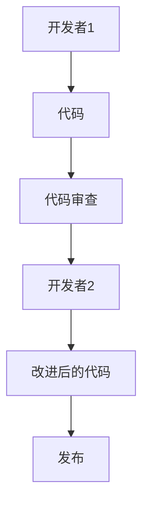
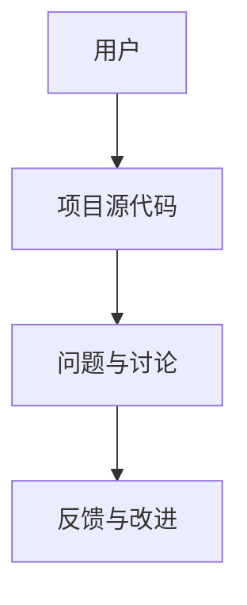
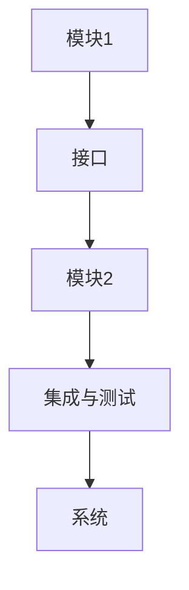

                 

### 关键词

- 开源社区
- 生活哲学
- 平台设计
- 社区文化
- 创新协作

### 摘要

本文深入探讨了开源社区与生活哲学平台之间的关系。首先，通过概述开源社区的起源与发展，揭示了其核心价值与重要角色。接着，分析了开源社区与个人生活哲学的联系，展示了开源精神在现代生活哲学中的体现。随后，本文详细阐述了开源社区平台的总体架构，包括设计原则、核心组件与技术选型。最后，通过案例分析，探讨了开源社区的成功实践及其对未来发展的启示，为读者提供了全面的见解和实际指导。全文旨在为技术从业者提供一个关于开源社区生活哲学平台的系统性认识。

### 第1章：开源社区概述

#### 1.1 开源社区的起源与发展历程

开源社区的概念起源于自由软件运动，早在1983年，理查德·斯托曼（Richard Stallman）便创立了自由软件基金会（Free Software Foundation，FSF），并提出了“自由软件”的理念。FSF的目标是推广自由软件，确保用户能够自由地运行、研究、修改和分发软件。这一理念奠定了开源社区的基础。

随着Linux操作系统的诞生，开源社区的真正崛起开始显现。Linux是一个完全由开源社区协作开发而成的操作系统，其源代码在1991年由林纳斯·托瓦兹（Linus Torvalds）首次公开发布。Linux的成功吸引了无数开发者加入开源社区，促进了开源运动的蓬勃发展。

开源社区的发展历程可以分为几个阶段：

1. **初始阶段**：主要以自由软件为主，开发者以个人兴趣为驱动，共同协作开发软件。

2. **成熟阶段**：开源社区逐渐形成，分工明确，贡献者群体扩大。这一阶段，许多大型企业开始关注并支持开源项目，开源软件在企业中的应用也越来越广泛。

3. **当前阶段**：开源社区已经成为软件开发的主流模式，众多企业和个人都在积极参与开源项目。随着云技术和物联网的发展，开源社区的影响力和规模不断扩大。

开源社区的核心价值在于其开放性、共享性和协作性。开源项目的源代码对所有人开放，任何人都可以自由地访问、修改和分享代码。这种开放性促进了知识的传播和技术的创新，使得开源项目能够快速迭代和改进。

#### 1.2 开源社区的核心价值

1. **共享与协作**：

   开源社区的核心价值之一是共享与协作。社区成员共同分享知识和资源，通过协作解决问题，推动项目的进步。共享不仅体现在代码层面，还包括文档、测试用例等各方面。协作使得每个成员都能够发挥自己的优势，共同为项目贡献力量。

2. **透明与可信**：

   开源社区鼓励透明度和可信度。由于源代码对所有人开放，用户可以查看和审查代码，确保项目的质量和安全性。这种透明性提高了用户的信任度，也为项目的长期发展奠定了基础。

3. **灵活与适应性**：

   开源社区能够快速适应变化。社区成员可以根据用户反馈和市场需求，迅速调整项目方向和功能。这种灵活性使得开源项目能够更好地适应快速变化的技术环境和用户需求。

#### 1.3 开源社区的重要角色

开源社区在全球范围内扮演了重要角色，其主要角色包括：

1. **开发者**：

   开发者是开源社区的核心。他们负责编写、测试和改进代码，推动项目的进展。开发者通过参与开源项目，不仅可以提升个人技能，还可以获得更多的职业发展机会。

2. **贡献者**：

   贡献者不仅限于开发者，还包括文档编写者、测试者、翻译者等。他们的贡献丰富了开源社区，提高了项目的整体质量。

3. **用户**：

   用户是开源项目的最终受益者。他们可以免费使用开源软件，并通过反馈和参与进一步推动项目的改进。

4. **企业**：

   众多企业通过开源社区获取技术资源，降低研发成本，提升自身竞争力。同时，许多企业也积极参与开源项目，回馈社区。

综上所述，开源社区不仅是一个技术协作的平台，更是一种生活哲学的体现。它倡导共享、协作、透明和适应性，对个人和社会的发展产生了深远的影响。

### 第2章：开源社区与生活哲学

#### 2.1 开源社区与个人生活哲学的关系

开源社区与个人生活哲学之间存在着密切的联系。开源社区的核心价值观，如共享、协作、透明和适应性，与个人生活哲学中的诸多方面相契合，共同推动了个人成长和社会进步。

首先，共享是开源社区的核心精神之一。在个人生活哲学中，共享同样被广泛推崇。通过共享知识和资源，个人不仅能够提升自己的知识水平，还能帮助他人成长。共享精神培养了人与人之间的互信和互助，促进了社会的和谐发展。

其次，协作在开源社区中至关重要。协作不仅意味着共同完成任务，更是一种人际互动和沟通的过程。在个人生活哲学中，协作能力同样被视为一项重要素质。通过与他人协作，个人可以学会倾听、沟通和解决问题，提升自身的人际关系和团队合作能力。

透明和适应性也是开源社区的重要价值观。在个人生活哲学中，透明性意味着诚实和真诚。个人通过诚实面对自己的优点和缺点，不断提升自我。而适应性则要求个人在面对变化时能够迅速调整自己的思维和行为方式，以应对新的挑战。

#### 2.2 开源社区在现代生活哲学中的体现

开源社区的价值在现代生活哲学中得到了充分体现。随着社会的发展，人们越来越重视个人成长和社会责任。开源社区正是这一价值观的践行者。

首先，开源社区倡导终身学习。在开源社区中，成员们不断学习和掌握新技术，提升自己的专业能力。这种学习精神与现代生活哲学中倡导的终身学习理念相契合。通过不断学习，个人不仅可以提升自身素质，还能为社会创造更多价值。

其次，开源社区强调社会责任。许多开源项目旨在解决实际问题，提升社会福祉。例如，开源软件被广泛应用于医疗、教育、环境保护等领域，为社会发展做出了积极贡献。开源社区成员通过参与这些项目，展现了强烈的社会责任感。

再次，开源社区鼓励创新和探索。在开源社区中，成员们不断尝试新的技术和方法，推动技术进步。创新和探索精神不仅有助于个人成长，还能激发社会的活力和创造力。

最后，开源社区强调公平和包容。开源社区鼓励每个人都能参与其中，无论其背景、性别、年龄或地理位置。这种公平和包容的精神有助于消除社会歧视，促进社会的公平和谐。

#### 2.3 开源社区如何影响生活方式

开源社区对生活方式的影响体现在多个方面：

首先，开源社区提高了人们的工作效率。开源软件和工具为个人和团队提供了丰富的技术资源，帮助他们更高效地完成工作任务。例如，程序员可以借助各种开源库和框架，快速开发出高质量的软件。

其次，开源社区增强了人们的社交能力。在开源社区中，人们可以与来自世界各地、拥有不同背景和技能的成员交流合作。这种跨文化交流不仅有助于个人成长，还能促进国际合作。

再次，开源社区培养了人们的批判性思维。开源项目通常需要参与者具备批判性思维，以评估代码的质量和安全性。这种思维能力的培养对个人和社会的发展具有重要意义。

最后，开源社区促进了社会的创新和进步。开源项目不断涌现，推动了技术进步和产业升级。开源社区成员通过共享知识和资源，为社会创造了更多价值。

总之，开源社区不仅是一个技术协作的平台，更是一种生活哲学的体现。它倡导共享、协作、透明和适应性，对个人和社会的发展产生了深远的影响。

### 第3章：开源社区平台的总体架构

#### 3.1 平台架构设计原则

一个成功的开源社区平台需要具备良好的架构设计，以确保其可扩展性、灵活性和可靠性。以下是一些关键的设计原则：

**1. 模块化**

模块化设计是平台架构的基础。通过将平台划分为多个模块，每个模块负责特定的功能，可以降低系统的复杂度，提高代码的可维护性和可扩展性。模块化设计还使得新功能的添加和现有功能的修改变得更加简单。

**2. 可扩展性**

开源社区平台的用户数量和功能需求可能会迅速增长。因此，平台架构必须具备良好的扩展性。这包括支持水平扩展（增加服务器数量）和垂直扩展（提升服务器性能）。扩展性确保平台能够无缝地适应不断增长的用户和功能需求。

**3. 可靠性**

可靠性是开源社区平台成功的关键因素。平台必须能够保证高可用性，即使在出现故障或异常情况下也能保持稳定运行。这通常通过冗余设计、负载均衡和自动故障恢复机制来实现。

**4. 灵活性**

灵活的架构允许平台快速响应变化，包括技术变化和市场变化。通过使用微服务架构，各个功能模块可以独立开发和部署，从而实现快速迭代和灵活扩展。

**5. 开放性**

开源社区平台的架构应保持开放性，以促进社区的参与和贡献。这意味着平台应支持各种常见的开发工具和技术，并允许外部系统集成。

#### 3.2 核心组件与功能模块

一个典型的开源社区平台通常包含以下核心组件和功能模块：

**1. 成员管理系统**

成员管理系统负责管理社区成员的信息，包括注册、认证、权限管理等功能。该系统应支持多种身份验证方式，如电子邮件、社交媒体账号和双因素认证，以提高安全性。

**2. 项目管理系统**

项目管理系统能够帮助社区成员有效地管理开源项目。该系统应提供任务管理、问题跟踪、版本控制和文档管理等功能，以便于项目协作和进度跟踪。

**3. 交流与协作平台**

交流与协作平台是社区的核心，通常包括论坛、聊天室、邮件列表和Wiki等。这些工具支持成员之间的实时交流和协作，促进知识共享和项目进展。

**4. 内容管理系统**

内容管理系统负责管理社区的文档、博客文章、教程和其他内容。该系统应支持多种格式，如Markdown、HTML和PDF，并提供搜索和分类功能，以便成员快速找到所需信息。

**5. 活动管理系统**

活动管理系统用于策划和组织社区活动，如线上会议、研讨会和线下聚会。该系统应提供活动注册、通知和反馈等功能，确保活动的顺利进行。

#### 3.3 技术选型与集成策略

技术选型是开源社区平台设计的关键步骤。以下是一些常见的技术选型建议：

**1. 开发框架**

选择一个成熟且流行的开发框架，如Django、Flask或Spring Boot，可以提高开发效率，降低维护成本。这些框架提供了丰富的功能和良好的扩展性。

**2. 数据库**

根据社区平台的需求，选择合适的数据库技术。关系型数据库（如MySQL、PostgreSQL）适合处理结构化数据，而NoSQL数据库（如MongoDB、Redis）则适合处理非结构化数据和高并发的场景。

**3. 前端技术**

选择适合前端开发的技术栈，如React、Vue.js或Angular，可以提升用户体验和开发效率。这些框架提供了丰富的组件库和高效的渲染引擎。

**4. 部署环境**

选择适合的部署环境，如云平台（如AWS、Google Cloud）或容器化平台（如Kubernetes），可以提高平台的可靠性和可扩展性。容器化技术使得部署和扩展变得更加简单和高效。

**5. 集成策略**

开源社区平台通常需要与外部系统集成，如身份验证服务、支付系统和邮件服务。采用API接口或Webhook等方式实现系统集成，可以提高平台的兼容性和灵活性。

通过遵循上述设计原则、选择合适的技术选型和实施有效的集成策略，开源社区平台可以实现良好的性能、可靠性和扩展性，为用户提供优质的体验。

### 第4章：社区核心功能的实现

#### 4.1 成员管理系统的设计

成员管理系统是开源社区平台的核心功能之一，它负责管理社区成员的注册、认证、权限和用户信息。以下是成员管理系统的主要设计思路和实现细节：

**1. 注册与认证**

注册功能允许新用户加入社区，并创建个人账户。注册过程通常包括用户名、电子邮件地址、密码等信息的提交。为了保证用户信息的真实性和安全性，社区平台可以采用双重验证机制，如电子邮件验证和双因素认证。

认证功能确保只有经过验证的用户才能访问社区的不同部分。常见的认证方式包括基于用户名和密码的登录、基于OAuth的第三方认证（如Google、Facebook）以及基于JWT（JSON Web Tokens）的认证。

**2. 权限管理**

权限管理是成员管理系统的关键部分，它决定了不同用户角色（如普通用户、管理员、贡献者）在社区中的权限。权限管理通常包括以下方面：

- **角色定义**：定义不同角色的权限，如读取、写入、删除、管理等功能。
- **权限继承**：允许角色之间的权限继承，以便简化权限管理。
- **权限校验**：在用户进行特定操作时，校验其权限是否符合操作要求。

为了实现权限管理，社区平台可以采用RBAC（基于角色的访问控制）或ABAC（基于属性的访问控制）模型。

**3. 用户信息管理**

用户信息管理包括用户资料的查看、编辑和删除。社区平台应提供用户友好的界面，方便用户管理自己的个人信息，如头像、个人简介、联系方式等。

**4. 数据存储与安全性**

成员管理系统的数据存储应考虑数据的完整性和安全性。常用的数据存储方案包括关系型数据库（如MySQL、PostgreSQL）和非关系型数据库（如MongoDB）。为了保证数据安全，平台应实现数据加密、访问日志记录和异常检测等安全措施。

**5. 性能优化**

为了确保成员管理系统的高性能，可以采取以下优化策略：

- **缓存**：使用缓存技术（如Redis）提高数据访问速度。
- **分库分表**：对大数据量的数据库进行分库分表，提高查询性能。
- **异步处理**：对于耗时的操作，如邮件发送、双因素认证等，采用异步处理机制，减轻服务器负担。

#### 4.2 项目管理的实现

项目管理功能是开源社区平台的重要组成部分，它帮助社区成员有效地管理项目。以下是项目管理的实现细节：

**1. 任务管理**

任务管理是项目管理的基础，它包括创建任务、分配任务、完成任务等操作。社区平台可以采用看板（Kanban）或列表（List）形式展示任务，以便成员清晰地了解任务状态。

**2. 问题跟踪**

问题跟踪功能用于记录和解决项目中遇到的问题。社区平台可以提供问题分类、优先级设置、状态更新等功能，帮助成员高效地跟踪和解决问题。

**3. 版本控制**

版本控制是开源项目的核心功能，它确保项目代码的版本正确性和历史记录。社区平台可以集成Git或其他版本控制系统，提供分支管理、代码提交、代码审查等功能。

**4. 文档管理**

文档管理功能用于存储和共享项目文档，如需求文档、设计文档、用户手册等。社区平台应提供文档编辑、共享、搜索等功能，以便成员快速查找和更新文档。

**5. 沟通协作**

沟通协作功能支持团队成员之间的实时沟通和协作。社区平台可以集成聊天室、邮件列表和Wiki等工具，提供便捷的沟通渠道。

**6. 进度跟踪**

进度跟踪功能帮助团队成员了解项目的整体进展。社区平台可以提供项目进度图表、统计报告等工具，以便成员随时掌握项目状态。

#### 4.3 交流与协作功能的实现

交流与协作功能是开源社区平台的重要组成部分，它支持成员之间的知识共享和项目协作。以下是实现交流与协作功能的关键细节：

**1. 论坛**

论坛是社区的核心交流平台，它支持成员发布帖子、回复评论、创建话题等操作。论坛可以采用分类、标签等机制，方便成员查找和参与感兴趣的话题。

**2. 聊天室**

聊天室提供实时交流功能，支持文本消息、图片和文件传输。社区平台可以集成即时通讯工具（如WebSocket），提供流畅的聊天体验。

**3. 邮件列表**

邮件列表用于发布公告、新闻和讨论信息。社区平台可以提供邮件订阅、邮件推送等功能，确保成员及时接收重要信息。

**4. Wiki**

Wiki是一种协作式文档系统，支持多人实时编辑和协作。社区平台可以集成Wiki，提供文档编写、版本控制和权限管理等功能。

**5. 搜索功能**

搜索功能帮助成员快速查找社区中的内容。社区平台应实现全文搜索、关键词过滤和搜索历史记录等功能，提高搜索效率。

**6. 文件共享**

文件共享功能支持成员上传、下载和共享项目文件。社区平台可以集成文件存储服务（如Amazon S3、Google Drive），提供安全、高效的文件管理服务。

通过实现这些核心功能，开源社区平台可以为用户提供一个高效、便捷的交流与协作环境，促进社区的发展和创新。

### 第5章：开源社区运营策略

#### 5.1 社区文化建设

社区文化建设是开源社区运营成功的关键因素之一。一个积极的社区文化能够激发成员的参与热情，促进知识的共享和技术的创新。以下是一些关键的社区文化建设策略：

**1. 定位与愿景**

明确的社区定位和愿景是社区文化建设的基础。社区应明确其目标用户群体、使命和愿景，确保所有成员都朝着共同的目标努力。例如，某个开源社区可能专注于云计算技术，其愿景是成为云计算领域的技术权威。

**2. 价值观的传播**

传播社区的核心价值观是社区文化建设的核心任务。社区应通过宣传、活动和培训等方式，向成员传达共享、协作、透明和适应性等价值观。这些价值观应渗透到社区的每个角落，成为成员行为的指南。

**3. 社区领袖的培养**

社区领袖在社区文化建设中起着至关重要的作用。社区应培养和选拔具有领导能力、技术实力和良好沟通技巧的成员担任社区领袖。这些领袖应具备以下能力：

- **技术领导力**：能够引领社区技术发展方向，提供技术指导和支持。
- **沟通协调能力**：能够有效沟通、协调社区成员之间的合作。
- **社区精神传播**：能够传播社区核心价值观，激励成员积极参与社区活动。

**4. 社区活动的策划与组织**

社区活动是社区文化建设的重要组成部分。社区应定期策划和组织各种活动，如线上研讨会、技术沙龙、线下聚会等，以增强成员之间的联系和互动。这些活动应具有以下特点：

- **多样化**：提供多样化的活动形式，满足不同成员的需求。
- **互动性**：鼓励成员之间的互动和合作，促进知识共享和技术交流。
- **持续性**：确保活动的持续性，形成社区的传统和品牌。

#### 5.2 社区活动策划与组织

成功的社区活动策划与组织是增强社区活力和凝聚力的关键。以下是一些关键步骤和注意事项：

**1. 活动主题的确定**

活动主题应紧密结合社区目标和成员需求。例如，一个专注于云计算技术的社区可以组织关于云计算最佳实践、新工具和技术趋势的研讨会。主题应具有吸引力，能够激发成员的兴趣和参与热情。

**2. 活动时间和地点的安排**

活动的时间和地点应方便成员参与。线上活动通常选择晚上或周末，以便成员能够抽出时间参与。线下活动则应选择交通便利的地点，并提供必要的设施和服务。

**3. 活动内容的策划**

活动内容应丰富多彩，包括技术讲座、案例分析、互动讨论等。演讲者和嘉宾的选择应具备专业性和知名度，以吸引更多的参与者。此外，还可以邀请社区成员分享他们的经验和故事，增强社区的凝聚力和归属感。

**4. 活动宣传和推广**

活动宣传和推广是确保活动顺利进行的关键。社区应通过多种渠道（如社区论坛、社交媒体、邮件列表）宣传和推广活动，吸引更多成员参与。宣传材料应包括活动时间、地点、主题、嘉宾介绍和议程等内容。

**5. 活动后的反馈与总结**

活动结束后，社区应收集成员的反馈意见，了解他们对活动的满意度和建议。这些反馈将有助于改进未来活动的策划和组织。同时，社区还应撰写活动总结，分享活动的成果和亮点，激励成员的参与热情。

#### 5.3 社区成员激励与维护

社区成员的激励与维护是开源社区长期发展的关键。以下是一些有效的策略：

**1. 荣誉与奖励**

设立荣誉和奖励机制，表彰在社区中表现突出的成员。这些荣誉和奖励可以包括最佳贡献者奖、技术达人奖、优秀讲师奖等。通过颁发奖状、勋章或其他形式的奖励，激励成员的积极性和创造力。

**2. 持续学习与成长**

提供持续学习的机会，帮助成员提升技能和知识。社区可以组织线上课程、研讨会和培训活动，邀请业内专家进行分享和指导。此外，社区还可以提供学习资源，如技术书籍、在线教程和实战项目，以支持成员的自主学习和成长。

**3. 成员互动与支持**

鼓励成员之间的互动和支持，营造一个友好和互助的社区氛围。社区可以设立论坛、聊天室和邮件列表等互动平台，方便成员交流和分享经验。此外，社区还可以建立导师制度，帮助新成员快速融入社区，并提供技术支持和指导。

**4. 个性化体验**

提供个性化的体验，满足不同成员的需求和兴趣。社区可以根据成员的兴趣和能力，组织小组讨论、兴趣班和技术分享会等。通过个性化的互动，增强成员的归属感和参与度。

**5. 反馈与改进**

定期收集成员的反馈意见，了解他们的需求和期望。根据反馈，不断改进社区服务，提升用户体验。社区可以设立反馈渠道，如在线调查、意见箱等，鼓励成员提出建议和意见。

通过实施上述策略，开源社区可以有效地激励和维护成员的参与热情，促进社区的长期发展和繁荣。

### 第6章：开源社区案例研究

#### 6.1 开源社区成功案例解析

开源社区的成功案例众多，以下将解析几个典型的成功案例，探讨其中的生活哲学体现和实际应用。

**案例1：Linux操作系统**

**生活哲学体现**：
- **共享与协作**：Linux的成功在于其开源精神，开发者们通过共享和协作，共同推动操作系统的发展。
- **透明与可信**：Linux的源代码对所有开发者开放，这使得项目更加透明，增强了用户对系统的信任。
- **灵活与适应性**：Linux能够适应各种硬件平台和场景，展现了其高度的灵活性和适应性。

**实际应用**：
- **技术社区**：Linux吸引了大量开发者参与，形成了强大的技术社区，不断推动技术创新。
- **企业应用**：许多企业选择Linux作为其服务器操作系统，降低了成本，提升了性能。

**案例2：GitHub**

**生活哲学体现**：
- **共享与开放**：GitHub提供了一个平台，使得开发者可以自由地访问、修改和分享代码。
- **协作与互助**：GitHub上的项目通常通过协作完成，开发者之间互相帮助，共同解决问题。
- **透明与公开**：GitHub上的项目信息和代码对所有人开放，增强了项目的可信度和透明度。

**实际应用**：
- **代码托管**：GitHub成为全球最大的代码托管平台，支持数百万个开源项目。
- **项目协作**：许多企业和团队选择GitHub作为项目协作工具，提高了开发效率和团队协作能力。

**案例3：Kubernetes**

**生活哲学体现**：
- **模块化与扩展性**：Kubernetes采用模块化设计，各个模块独立开发、部署，提高了系统的扩展性和灵活性。
- **透明与标准化**：Kubernetes的架构和API对所有人开放，促进了社区的参与和标准的制定。
- **适应性**：Kubernetes能够支持多种云平台和硬件环境，展现了其强大的适应能力。

**实际应用**：
- **容器编排**：Kubernetes成为容器编排技术的领导者，广泛应用于微服务架构和企业云计算。
- **资源管理**：Kubernetes提供了高效、灵活的资源管理方案，帮助企业优化资源使用和成本控制。

通过以上案例，我们可以看到开源社区的成功离不开其生活哲学的体现。共享、协作、透明和适应性是开源社区的核心价值观，这些价值观不仅推动了技术进步，也影响了人们的生活方式。开源社区的成功案例为我们提供了宝贵的经验和启示，展示了开源精神在现实世界中的实际应用。

#### 6.2 案例中的生活哲学体现

在开源社区的成功案例中，生活哲学的体现尤为明显。以下将详细分析几个核心概念及其实体之间的关系架构，并探讨这些概念如何在实际应用中发挥作用。

**共享与协作**

共享与协作是开源社区的核心价值观。在Linux操作系统中，共享体现在代码的公开和可访问性，开发者可以自由地阅读、修改和分发代码。协作则体现在社区成员之间的互动，他们共同讨论、解决问题、优化代码。这种共享与协作的关系可以用Mermaid流程图表示：

通过这种流程，开发者1编写代码后，提交给代码审查，开发者2审查并改进代码，最终发布。这一过程体现了共享与协作的密切关系，促进了项目的进步。

**透明与可信**

透明与可信是开源社区的重要特征。在GitHub上，每个项目的源代码、问题和讨论都是公开的，任何人都可以查看和参与。这种透明性增强了项目的可信度，用户可以信任GitHub上的代码。关系架构如下：

用户可以通过查看项目源代码和问题讨论，了解项目的现状和问题，并提供反馈和改进建议。这种透明性不仅提高了项目的质量，也增强了用户对社区的信任。

**灵活与适应性**

灵活与适应性是开源社区的优势。在Kubernetes中，模块化的设计使得各个组件可以独立开发和部署，提高了系统的灵活性和适应性。关系架构如下：

通过接口，模块1和模块2可以独立开发、集成和测试，最终形成一个完整的系统。这种灵活性使得Kubernetes能够适应各种场景和需求。

在实际应用中，这些核心概念相互交织，共同推动了开源社区的发展。共享与协作促进了技术创新，透明与可信增强了用户的信任，灵活与适应性提高了系统的可扩展性。这些生活哲学的体现不仅提升了开源项目的质量，也影响了人们的生活方式和工作方式。

#### 6.3 案例中的实践与启示

开源社区的成功案例为我们提供了丰富的实践经验和深刻的启示。以下将从项目开发、团队协作、社区运营等方面进行分析，探讨开源社区如何在实际应用中取得成功，并给其他社区提供借鉴。

**项目开发方面的实践**

1. **敏捷开发与迭代**：成功的开源社区通常采用敏捷开发方法，快速迭代和发布新功能。这种做法有助于迅速响应用户需求和市场变化，保持项目的竞争力。例如，GitHub通过敏捷开发，不断优化用户体验，提高平台性能和稳定性。

2. **代码审查与质量保证**：开源社区通过代码审查机制，确保代码质量和安全性。每个提交的代码都需要经过其他开发者的审查和批准，这有助于发现潜在的问题和改进点。例如，Linux操作系统通过代码审查，确保了系统的稳定性和可靠性。

3. **模块化与组件化**：开源项目通常采用模块化和组件化设计，使得各个模块可以独立开发和部署。这种设计提高了项目的可维护性和扩展性。例如，Kubernetes通过模块化设计，使得不同模块可以独立开发、集成和测试，提高了系统的灵活性和适应性。

**团队协作方面的实践**

1. **分布式协作**：开源社区成员通常分布在不同的地理位置，通过在线协作工具实现高效沟通和协作。例如，GitHub通过其强大的Git仓库和Issue跟踪系统，支持分布式团队的开发和协作。

2. **角色分工与责任明确**：成功的开源社区通常明确不同成员的角色和责任，确保每个任务都有人负责。例如，Linux操作系统中有明确的角色分工，包括内核维护者、驱动开发者、文档编写者等，每个角色都有明确的职责。

3. **社区文化的建立**：成功的开源社区通常具有积极的社区文化，鼓励成员之间的互助和合作。例如，Apache基金会通过其开放的社区文化和包容性的价值观，吸引了大量贡献者，推动了多个开源项目的发展。

**社区运营方面的实践**

1. **活动策划与组织**：成功的开源社区通过定期举办活动，如线上研讨会、技术沙龙和线下聚会，增强成员之间的联系和互动。例如，Python社区定期举办PyCon全球大会，吸引了大量开发者参与，促进了技术的交流和创新。

2. **社区治理与激励机制**：成功的开源社区通常建立完善的社区治理机制，确保社区的公平和透明。例如，Mozilla基金会通过设立Mozilla开放领袖项目，选拔和培养具有领导力的贡献者，推动社区的发展。

3. **用户参与与反馈**：成功的开源社区鼓励用户参与项目的开发和改进，通过收集用户反馈，不断优化产品和服务。例如，WordPress社区通过其插件市场，允许用户提交和审核插件，提高了社区的整体质量和用户满意度。

通过以上实践，我们可以看到开源社区的成功不仅仅依赖于技术，还依赖于良好的团队协作、社区运营和用户参与。这些实践为其他社区提供了宝贵的经验和启示，帮助他们更好地发展和成长。

#### 6.4 案例中的最佳实践与经验教训

从上述开源社区的成功案例中，我们可以总结出一系列最佳实践，并从中汲取经验教训，为其他开源社区的发展提供指导。

**最佳实践**

1. **坚持开放与透明**：成功的开源社区都坚持开放性，通过共享源代码和讨论过程，增强社区的信任度和透明度。GitHub、Linux和Kubernetes等社区的成功证明了开放性对于社区发展和用户信任的重要性。

2. **敏捷开发与快速迭代**：敏捷开发方法能够快速响应用户需求和市场变化，保持项目活力和竞争力。GitHub通过敏捷开发，不断优化用户体验，赢得了广泛的用户基础。

3. **模块化与组件化设计**：模块化设计提高了项目的可维护性和扩展性，使得社区能够更好地适应不同场景和需求。Kubernetes通过模块化设计，成为容器编排领域的领导者。

4. **明确的角色分工与责任明确**：成功的开源社区通常明确不同成员的角色和责任，确保每个任务都有人负责。Linux操作系统的成功部分得益于其明确的角色分工。

5. **积极的文化建设与社区治理**：建立积极、互助和包容的社区文化，能够增强社区的凝聚力和成员的归属感。Apache基金会的开放文化和Mozilla开放领袖项目是社区治理的成功范例。

**经验教训**

1. **重视社区文化建设**：社区文化是开源社区成功的关键，它能够激发成员的积极性和创造力。忽视社区文化建设可能导致成员流失和社区活力下降。

2. **平衡开放性与质量控制**：开放性是开源社区的核心优势，但同时也需要关注质量控制。过于宽松的质量控制可能导致项目质量下降，影响用户信任。

3. **持续的用户参与与反馈**：用户是开源项目的最终受益者，他们的参与和反馈对于项目的改进至关重要。忽视用户参与可能导致项目脱离实际需求，失去市场竞争力。

4. **技术选型的灵活性**：在技术选型时，应考虑未来的扩展性和兼容性，避免过早锁定特定技术框架或平台。这有助于社区在未来技术变革中保持灵活性和竞争力。

通过总结这些最佳实践和经验教训，其他开源社区可以借鉴成功经验，避免常见错误，从而更好地发展壮大。

#### 6.5 开源社区在生活哲学中的潜在影响

开源社区不仅在技术领域产生了深远影响，还在生活哲学中扮演了重要角色。以下从共享、协作、透明和适应性四个方面，探讨开源社区对生活哲学的潜在影响。

**共享**

开源社区的核心价值观之一是共享，这种共享精神鼓励人们将知识和资源无偿地分享给他人。在生活哲学中，共享体现了人与人之间的互助和公平。通过开源社区，人们可以获取到各种知识和资源，如代码、文档和技术博客，从而提升自己的技能和知识水平。共享精神还促进了社会的和谐发展，减少了知识和资源的分配不公。

**协作**

协作是开源社区的另一重要价值观，它强调团队合作和共同进步。在开源社区中，成员们通过协作解决问题、优化代码和改进项目，共同推动技术的发展。协作精神在生活中同样重要，它帮助人们学会倾听、沟通和合作，培养人际交往能力。在家庭、工作和社会中，协作能够提高工作效率，增强团队的凝聚力，促进社会进步。

**透明**

透明性是开源社区的重要特征，开源项目的源代码对所有人开放，用户可以查看和审查代码，确保项目的质量和安全性。这种透明性在生活哲学中具有重要价值。在个人生活中，透明意味着诚实和真诚，它要求个人在面对问题时能够坦诚面对，不隐瞒和欺骗。在工作中，透明性有助于建立信任和良好的沟通，提高团队的协作效率。透明性还促进了社会的公平和正义，减少了信息不对称和权力滥用。

**适应性**

开源社区强调适应性，能够迅速适应技术变革和市场变化。这种适应性在生活哲学中同样重要。生活中不可避免会遇到各种变化和挑战，适应性意味着个人能够迅速调整自己的思维和行为方式，以应对新的环境和情况。适应性不仅帮助人们应对不确定性，还能提高个人的应变能力和心理素质。

综上所述，开源社区在生活哲学中具有重要的潜在影响。通过共享、协作、透明和适应性，开源社区不仅推动了技术的进步，还影响了人们的生活方式和价值观。开源精神在生活中的应用，有助于培养更健康、更和谐的社会文化。

#### 6.6 开源社区的未来发展趋势

开源社区的未来充满了无限的可能性，其发展趋势将受到技术进步、市场变化和社会需求的多重影响。以下从技术创新、市场机遇和社会影响三个方面，探讨开源社区的未来发展趋势。

**技术创新**

1. **人工智能与机器学习**：随着人工智能和机器学习的快速发展，开源社区将在这些领域发挥重要作用。开源框架和工具将不断涌现，如TensorFlow、PyTorch等，为研究人员和开发者提供强大的技术支持。这些开源项目不仅推动了人工智能技术的发展，还为企业和研究机构降低了技术门槛，促进了创新。

2. **区块链技术**：区块链技术的开源应用正在逐渐成熟，开源社区在这一领域发挥着关键作用。例如，Hyperledger和Ethereum等开源区块链项目，为分布式应用和智能合约的开发提供了平台。未来，区块链技术将在金融、供应链管理、物联网等多个领域得到广泛应用，开源社区将继续引领技术趋势。

3. **边缘计算与物联网**：随着物联网和边缘计算的兴起，开源社区将发挥更大的作用。开源项目如EdgeX Foundry和OpenMPTL等，为物联网设备和边缘计算平台提供了丰富的解决方案。这些开源项目将推动物联网技术的普及，为智慧城市、智能家居等领域的发展提供支持。

**市场机遇**

1. **云原生与微服务**：云原生和微服务架构正在成为软件开发的主流模式。开源社区在这一领域提供了丰富的工具和框架，如Kubernetes、Spring Cloud等。企业可以通过开源技术实现灵活、可扩展的应用部署和管理，降低成本、提高效率。未来，开源社区将继续推动云原生和微服务技术的发展，为市场提供更多机遇。

2. **开源商业模型**：随着开源商业模式的成熟，越来越多的企业开始通过开源项目获得商业收益。例如，红帽公司通过收购开源项目，成功实现了从开源到商业的转型。未来，开源商业模式将更加多样化和成熟，为企业和开发者提供更多商业机遇。

3. **开源生态体系建设**：开源社区将在未来更加注重生态体系建设，通过构建开放的生态圈，吸引更多的开发者、企业和用户参与。例如，GitHub和GitLab等平台正在打造全面的开发者生态系统，为开发者提供从代码托管、项目管理到持续集成和部署的一站式服务。

**社会影响**

1. **知识共享与教育**：开源社区推动了知识的共享和传播，为全球开发者提供了宝贵的学习资源。未来，开源社区将继续在教育领域发挥重要作用，通过开源项目和实践案例，培养更多的技术人才，推动全球技术教育的发展。

2. **社会创新与进步**：开源社区在医疗、环保、公益等领域的应用，为社会发展带来了积极影响。例如，开源软件被广泛应用于医疗影像分析、环境监测和灾难救援等领域，提高了社会服务的质量和效率。未来，开源社区将继续推动社会创新，为解决社会问题提供技术支持。

3. **全球合作与交流**：开源社区跨越国界，促进了全球开发者的合作与交流。未来，随着技术的全球化发展，开源社区将进一步推动全球合作，促进技术的共享和创新的融合。

总之，开源社区的未来发展趋势将受到技术创新、市场机遇和社会需求的多重影响。开源精神将继续推动技术的进步，为个人、企业和社会创造更多的价值。

#### 6.7 开源社区的未来发展策略

为了应对未来发展的挑战和机遇，开源社区需要制定有效的发展策略，确保其持续创新、增长和影响力。以下是一些关键的发展策略：

**1. 强化技术领导力**

开源社区应持续关注技术趋势，引领技术创新。通过成立技术委员会或技术小组，制定长期技术战略，确保社区在关键技术领域保持领先地位。同时，支持社区成员参与国际技术交流和开源项目，提高社区的技术实力和影响力。

**2. 拓展生态合作**

开源社区应积极拓展与企业和研究机构的合作，构建开放的生态系统。通过合作，社区可以获得更多的资源和支持，促进技术共享和创新。例如，与云服务提供商合作，提供兼容的开源工具和服务；与学术机构合作，推动开源项目在学术领域的应用和推广。

**3. 提升社区参与度**

开源社区的发展离不开广泛的参与。社区应通过多种方式吸引和激励新成员加入，如举办线上活动、提供学习资源、设立贡献奖励等。同时，社区应建立有效的反馈机制，及时收集成员的建议和需求，不断优化社区服务和体验。

**4. 强化社区文化**

积极、互助和包容的社区文化是开源社区持续发展的基石。社区应通过宣传和活动，弘扬开源精神，培养社区成员的共同价值观。例如，设立年度最佳贡献者奖，表彰在社区中做出突出贡献的成员；举办社区聚会，增强成员之间的联系和交流。

**5. 推动开源教育**

开源社区应在教育领域发挥更大作用，培养更多的开源人才。通过开设开源课程、组织技术培训和实践项目，帮助新成员快速融入社区，提升技能和知识。同时，社区可以与教育机构合作，推动开源教育的普及和推广。

**6. 扩大国际影响力**

开源社区应积极拓展国际市场，吸引全球开发者参与。通过翻译、多语言支持和国际化活动，社区可以更好地服务全球用户，提高其国际影响力。同时，社区应关注不同国家和地区的文化差异，制定适应性的发展战略。

通过实施上述策略，开源社区可以更好地应对未来的挑战，持续创新、增长和影响，为全球技术发展和创新做出更大贡献。

### 结论

开源社区与生活哲学的结合，不仅推动了技术的进步，也影响了人们的生活方式。本文通过详细的分析和案例研究，展示了开源社区在共享、协作、透明和适应性等方面的核心价值，以及其在个人生活哲学中的体现。开源社区的总体架构设计和核心功能实现，为构建适应现代生活的哲学平台提供了实用的指导。未来，开源社区将继续在全球范围内发挥重要作用，推动技术创新和社会进步。让我们携手共建一个更加开放、包容和协作的数字世界。

### 作者信息

作者：AI天才研究院/AI Genius Institute & 禅与计算机程序设计艺术 /Zen And The Art of Computer Programming

---

### 拓展阅读

1. **《开源软件的哲学》**：了解开源运动的历史背景和哲学理念。
2. **《开源社区运营实战》**：学习如何成功运营一个开源社区。
3. **《开源文化的传播与实践》**：探讨开源文化在国内外的发展和应用。
4. **《开源项目案例分析》**：深入研究知名开源项目的成功经验和挑战。
5. **《开源社区的经济学》**：从经济角度分析开源项目的可持续性和商业价值。

