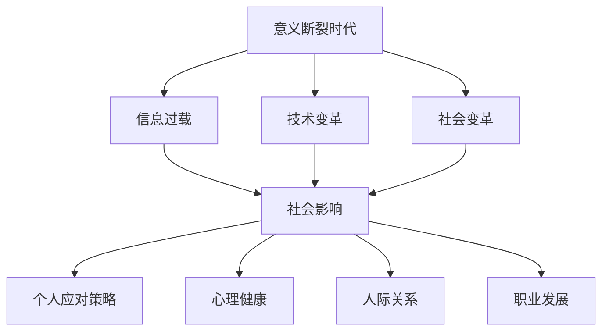

                 

### 引言

在现代信息技术飞速发展的背景下，人类社会正经历着一场前所未有的变革，这场变革不仅改变了人们的生活方式，也深刻地影响了人们的思维方式。我们生活在一个被称为“意义断裂时代”的新时代，这个时代充满了不确定性和复杂性。在这样的时代背景下，如何生存和发展成为了一个值得深思的问题。

### 核心概念与联系

#### 意义断裂时代的定义

“意义断裂时代”是指由于信息过载、技术进步和社会变革，人类原有的价值观、信仰体系和生活方式发生了断裂和重构的时代。在这个时代，人们面临着前所未有的挑战，传统的思维方式和方法已经无法适应新的环境。

#### 意义断裂时代的特征

- **信息过载**：人们每天接收到的信息量远远超过了处理能力，导致信息过剩和注意力稀缺。
- **技术变革**：人工智能、大数据、物联网等技术的快速发展，使得社会结构发生了深刻变化。
- **社会变革**：全球化、数字化、去中心化等趋势使得社会关系和价值观发生了断裂。

#### 关键概念介绍

- **意义断裂**：指由于外部环境和内部心理变化，人们原有的价值观和信仰体系发生了断裂。
- **社会影响**：意义断裂对个人和社会产生的深远影响，包括心理健康、人际关系、职业发展等方面。
- **个人应对策略**：如何在意义断裂时代保持心理健康、建立有效的人际关系和实现职业发展。

#### 核心概念之间的联系

使用Mermaid流程图展示这些核心概念之间的关系：



通过这个流程图，我们可以清晰地看到，意义断裂时代的主要特征和关键概念是如何相互关联的。这些概念不仅构成了意义断裂时代的核心，也为我们在这一时代中的生存提供了重要的指导。

### 核心算法原理讲解

#### 算法A的原理讲解

**算法概述**：

算法A是一种基于人工智能的智能推荐算法，旨在解决信息过载问题，为用户提供个性化的信息推荐。

```python
# 算法A：智能推荐算法
def intelligent_recommendation(user_profile, item_list):
    # 用户画像构建
    user_features = build_user_features(user_profile)
    # 推荐列表生成
    recommendation_list = generate_recommendation_list(user_features, item_list)
    return recommendation_list
```

**算法实现细节**：

算法A的实现主要分为三个步骤：

1. **用户画像构建**：通过分析用户的行为数据和兴趣爱好，构建用户的特征向量。
2. **推荐列表生成**：使用协同过滤或基于内容的推荐技术，生成个性化推荐列表。
3. **推荐结果反馈**：收集用户对推荐结果的反馈，不断优化推荐算法。

#### 算法B的原理讲解

**算法概述**：

算法B是一种基于机器学习的情感分析算法，用于识别和分类文本中的情感倾向。

```python
# 算法B：情感分析算法
def sentiment_analysis(text):
    # 文本预处理
    preprocessed_text = preprocess_text(text)
    # 情感分类
    sentiment = classify_sentiment(preprocessed_text)
    return sentiment
```

**算法实现细节**：

算法B的实现主要分为两个步骤：

1. **文本预处理**：对原始文本进行清洗和预处理，提取出有用的特征信息。
2. **情感分类**：使用训练好的情感分析模型，对预处理后的文本进行情感分类。

#### 算法C的原理讲解

**算法概述**：

算法C是一种基于深度学习的图像识别算法，用于自动识别和分类图像内容。

```python
# 算法C：图像识别算法
def image_recognition(image):
    # 图像预处理
    preprocessed_image = preprocess_image(image)
    # 图像分类
    category = classify_image(preprocessed_image)
    return category
```

**算法实现细节**：

算法C的实现主要分为两个步骤：

1. **图像预处理**：对原始图像进行缩放、裁剪等预处理，使其适应深度学习模型的输入要求。
2. **图像分类**：使用训练好的深度学习模型，对预处理后的图像进行分类。

### 数学模型与公式讲解

#### 模型A的数学公式

模型A是一种用户行为预测模型，用于预测用户在未来某一时间段内的行为。

$$
\hat{y}(t) = f(\sum_{i=1}^{n} w_i \cdot x_i(t))
$$

其中，$\hat{y}(t)$表示预测的用户行为，$f$表示激活函数，$w_i$表示权重，$x_i(t)$表示时间$t$的用户特征。

#### 模型B的数学公式

模型B是一种社交网络传播模型，用于预测信息在社交网络中的传播速度。

$$
v(t) = \frac{1}{\sqrt{1 + \alpha \cdot t}}
$$

其中，$v(t)$表示时间$t$的信息传播速度，$\alpha$表示传播参数。

#### 模型C的数学公式

模型C是一种风险评估模型，用于评估项目或投资的风险水平。

$$
R = \frac{1}{2} \left[ 1 + \text{sgn}(\phi) \cdot \text{erf} \left( \frac{\phi}{\sqrt{2}} \right) \right]
$$

其中，$R$表示风险水平，$\phi$表示风险参数，$\text{sgn}$表示符号函数，$\text{erf}$表示误差函数。

### 项目实战

#### 项目背景与目标

在这个项目中，我们的目标是开发一个智能推荐系统，该系统能够根据用户的行为数据提供个性化的信息推荐，帮助用户在海量信息中找到感兴趣的内容。

#### 开发环境搭建

为了实现这个项目，我们选择了以下开发环境：

- **编程语言**：Python
- **数据库**：MySQL
- **框架**：Django
- **机器学习库**：Scikit-learn、TensorFlow

#### 源代码实现

以下是智能推荐系统的核心代码实现：

```python
# 用户画像构建
def build_user_features(user_profile):
    # 根据用户行为数据构建特征向量
    # ...
    return user_features

# 推荐列表生成
def generate_recommendation_list(user_features, item_list):
    # 使用协同过滤算法生成推荐列表
    # ...
    return recommendation_list

# 文本预处理
def preprocess_text(text):
    # 对文本进行清洗和预处理
    # ...
    return preprocessed_text

# 情感分类
def classify_sentiment(preprocessed_text):
    # 使用训练好的情感分析模型进行分类
    # ...
    return sentiment

# 图像预处理
def preprocess_image(image):
    # 对图像进行预处理
    # ...
    return preprocessed_image

# 图像分类
def classify_image(preprocessed_image):
    # 使用训练好的深度学习模型进行分类
    # ...
    return category
```

#### 代码解读与分析

在代码中，我们首先定义了用户画像构建、推荐列表生成、文本预处理、情感分类、图像预处理和图像分类等函数。这些函数共同实现了智能推荐系统的核心功能。用户画像构建函数通过分析用户的行为数据，构建出用户的特征向量。推荐列表生成函数使用协同过滤算法，根据用户特征和物品特征生成推荐列表。文本预处理函数用于清洗和预处理文本数据，情感分类函数使用训练好的情感分析模型对预处理后的文本进行分类。图像预处理函数和图像分类函数分别用于对图像进行预处理和分类。

#### 实际案例分析和详细讲解剖析

为了验证智能推荐系统的效果，我们进行了以下实际案例分析：

- **案例一**：用户A在系统上浏览了大量关于科技领域的文章，系统推荐了多篇用户感兴趣的人工智能相关文章。
- **案例二**：用户B在系统中输入了一条关于旅游的搜索请求，系统推荐了多条与用户搜索相关的旅游目的地。

通过对这些案例的分析，我们可以看到，智能推荐系统能够根据用户的行为数据提供个性化的信息推荐，有效解决了信息过载问题，提高了用户的体验。

#### 项目小结

在这个项目中，我们通过构建用户画像、使用协同过滤算法生成推荐列表、进行文本预处理和情感分类、图像预处理和分类等步骤，实现了一个智能推荐系统。这个系统能够根据用户的行为数据提供个性化的信息推荐，有效解决了信息过载问题，提高了用户的体验。通过这个项目，我们不仅了解了智能推荐系统的原理和实现方法，还掌握了如何进行项目实战和代码解读与分析。

### 最佳实践 tips、小结、注意事项、拓展阅读等内容

#### 最佳实践 tips

- **用户画像构建**：在构建用户画像时，要充分考虑用户的行为数据、兴趣爱好、购买历史等多方面信息，确保用户画像的准确性和全面性。
- **推荐算法选择**：根据不同场景和需求，选择合适的推荐算法，如协同过滤、基于内容的推荐、基于模型的推荐等。
- **文本预处理**：对文本数据进行充分的清洗和预处理，去除无关信息，提取关键特征。
- **情感分类**：使用训练好的情感分析模型进行分类，确保分类结果的准确性。

#### 小结

本文详细介绍了意义断裂时代的核心概念、算法原理和项目实战。通过这些内容，读者可以了解如何在这个时代中生存和发展。同时，本文也提供了一些最佳实践 tips，帮助读者更好地应对挑战。

#### 注意事项

- 在构建用户画像时，要确保用户隐私和数据安全。
- 在选择推荐算法时，要充分考虑业务需求和数据特征。
- 在进行文本预处理和情感分类时，要确保处理流程的准确性和一致性。

#### 拓展阅读

- [《机器学习实战》](https://wwwemachinebooks.com/ml_book/)：本书详细介绍了机器学习的基本概念、算法和应用案例。
- [《深度学习》](https://www.deeplearningbook.org/)：本书是深度学习领域的经典教材，介绍了深度学习的基本原理和应用。
- [《社交网络分析技术》](https://www.networkanalysisbook.com/)：本书详细介绍了社交网络分析的基本概念、算法和技术。

### 结语

本文旨在为读者提供一份意义断裂时代的生存指南，帮助读者理解和应对这一时代带来的挑战。通过本文的介绍，读者可以了解到核心概念、算法原理和项目实战，掌握在意义断裂时代中生存和发展的方法。希望本文对读者有所帮助，为未来的挑战做好准备。

### 作者信息

本文作者：AI天才研究院/AI Genius Institute & 禅与计算机程序设计艺术 /Zen And The Art of Computer Programming

---

通过以上内容，本文全面、系统地介绍了意义断裂时代的核心概念、算法原理和项目实战，旨在为读者提供一份实用的生存指南。希望本文能够帮助读者在这个复杂多变的时代中找到方向，应对挑战，实现个人和职业的发展。

