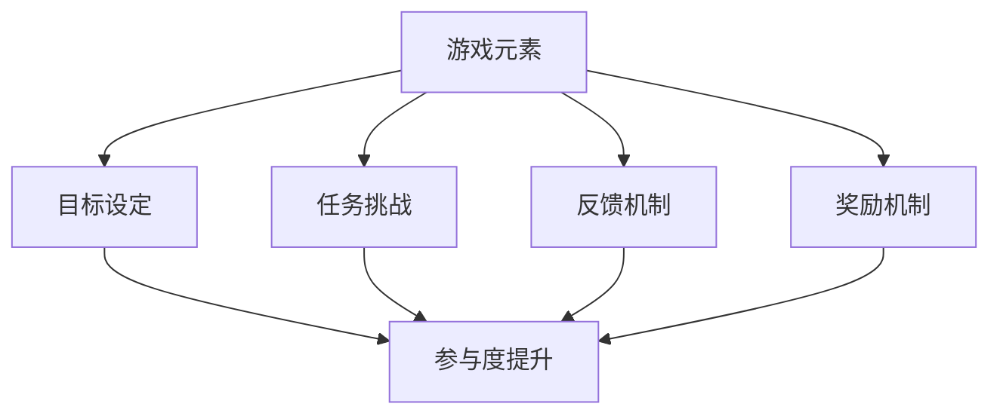
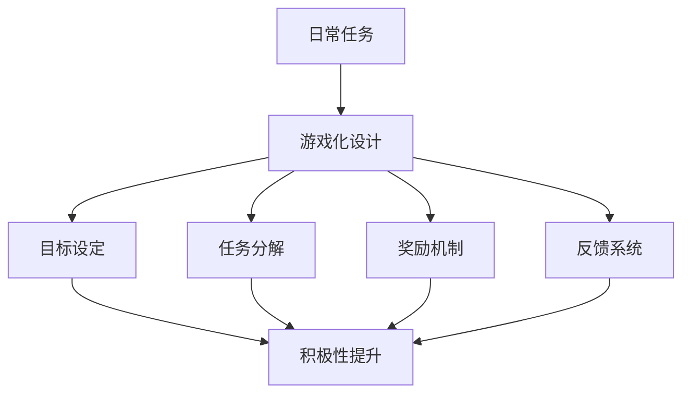
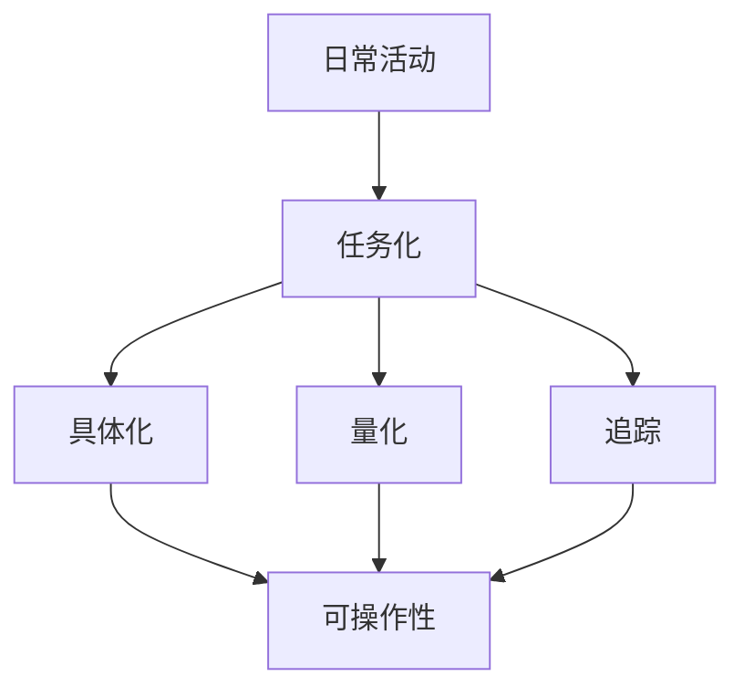

                 

### 引言

在现代社会的快节奏生活中，人们常常感到压力巨大，目标难以实现，生活缺乏动力。这种情况下，游戏化思维作为一种创新的解决方案，逐渐引起了广泛关注。游戏化思维，即通过应用游戏设计中的元素和原则，如目标设定、奖励机制、反馈系统等，来改善和优化现实生活中的各种活动和任务。本文旨在探讨一种全新的生活改造工具包——“意义游戏化人生设计工具包”，它通过日常任务化的方式，帮助人们更好地实现个人目标和追求有意义的生活。

本文的关键词包括：游戏化思维、人生设计、日常任务化、目标管理、奖励机制、反馈系统。这些关键词构成了本文的核心内容，将逐一被深入探讨。

**摘要：**
本文首先介绍了游戏化思维的基本概念和在人生设计中的应用，接着探讨了日常任务化的概念和其在生活中的益处与挑战。然后，本文详细介绍了“意义游戏化人生设计工具包”的设计原则和使用方法，包括目标与计划的制定、奖励机制的设计、反馈与反思的方法、以及行动指南的具体策略。最后，通过三个实战案例展示了工具包的实际应用效果，并总结了游戏化人生设计工具包的应用总结和未来发展方向。

通过对这些内容的系统分析和讲解，本文旨在为读者提供一个全面、实用的工具包，帮助他们在生活中更好地实现目标、增加动力，并最终过上更加有意义和充实的生活。接下来，我们将从游戏化思维与人生设计的关系入手，深入探讨这一主题。

## 第1章：游戏化思维与人生设计

### 1.1 游戏化思维的基本概念

游戏化思维，简单来说，就是将游戏设计中的元素和原则应用到非游戏场景中，以提升人们的参与度和积极性。游戏之所以能够吸引玩家，很大程度上是因为它们设计了一系列引人入胜的目标、富有挑战性的任务、及时的反馈以及奖励机制。这些元素在游戏中的组合，使得玩家不仅能在游戏中获得乐趣，还能不断进步和成长。

在现实世界中，游戏化思维同样可以发挥作用。它不仅可以帮助人们更高效地完成工作任务，还能提升日常生活的质量和动力。例如，在工作中，通过设定明确的目标和奖励机制，可以激励员工更加积极地投入工作；在生活中，通过将日常任务游戏化，可以让人更好地管理时间，提高自律性。

**核心概念与联系：**

为了更清晰地理解游戏化思维，我们可以通过一个Mermaid流程图来展示其核心概念之间的关系：



在这个流程图中，我们可以看到，游戏元素通过目标设定、任务挑战、反馈机制和奖励机制四个环节相互作用，共同提升了参与度。目标设定提供了明确的指引，任务挑战增加了动力和兴趣，反馈机制确保了进展的可视化，而奖励机制则强化了积极行为的持续。

### 1.2 游戏化思维在人生设计中的应用

人生设计，是指通过系统性地规划和调整个人目标和行为，以实现人生价值和生活质量的过程。游戏化思维在人生设计中的应用，主要体现在以下几个方面：

1. **目标管理：**
   游戏中的目标往往具有明确性和可实现性，通过游戏化思维，我们可以将生活中的目标设定得更加具体和可量化。例如，一个健康目标可以是“每天跑步30分钟”，而通过游戏化设计，这个目标可以被转化为“每周完成5次跑步任务，每次30分钟，累计完成20公里”。

2. **任务分解：**
   游戏中的任务通常被分解为一系列小步骤，以帮助玩家逐步达成最终目标。在人生设计中，同样可以将大目标分解为一系列小任务，每个小任务都是实现大目标的一部分。例如，如果目标是“学习一门新语言”，那么可以将其分解为“每天学习30分钟新词汇”、“每周完成一篇阅读理解练习”等。

3. **奖励机制：**
   游戏中的奖励机制可以激励玩家继续前进，同样，在人生设计中，通过设定奖励机制，可以增强个人对目标的追求和坚持。例如，当完成一个学习任务后，可以给自己设置一个小奖励，如“看一集喜欢的电视剧”或“享受一次休闲按摩”。

4. **反馈系统：**
   游戏中的即时反馈可以帮助玩家了解自己的进展和表现，从而调整策略。在人生设计中，通过定期的反馈和评估，可以帮助人们及时了解自己的进度，调整目标或策略。例如，通过记录每天的跑步时间和距离，可以分析哪些因素影响了跑步效率，并做出相应的调整。

**核心算法原理讲解：**

为了更好地理解游戏化思维在人生设计中的应用，我们可以通过一个简单的Python代码示例来展示目标管理、任务分解和奖励机制的具体实现：

```python
import time

# 设定目标
daily_running_time = 30  # 每天跑步30分钟
days_to_complete = 5    # 每周完成5次跑步

# 任务分解
tasks = [{"day": i+1, "time": 0} for i in range(days_to_complete)]

# 奖励机制
reward = "watch a TV show of your choice"  # 完成任务后的奖励

# 记录跑步时间
def record_running_time(day, time):
    tasks[day-1]["time"] += time
    print(f"Day {day}: Ran for {time} minutes. Total: {tasks[day-1]['time']} minutes.")

# 实现任务
for day in range(1, days_to_complete+1):
    time_spent = int(input(f"Enter running time for Day {day}: "))
    record_running_time(day, time_spent)

# 检查是否完成任务
if sum(task["time"] for task in tasks) >= daily_running_time * days_to_complete:
    print(f"Congratulations! You've completed the weekly running goal. Your reward: {reward}")
else:
    print("Keep going! You haven't completed the goal yet.")
```

在这个示例中，我们设定了一个每周跑步5次，每次30分钟的目标，并通过简单的Python代码实现了任务分解和奖励机制。每天跑步后，程序会记录跑步时间，并提示用户输入当天的跑步时间。当完成任务后，用户会获得一个小奖励。

**数学模型和公式：**

在游戏化人生设计中，数学模型和公式可以帮助我们更科学地设定目标和评估进度。例如，可以通过以下公式来计算完成目标的所需时间：

$$
\text{所需时间} = \frac{\text{总任务量}}{\text{每日任务量}}
$$

例如，如果目标是每周阅读10篇文章，每篇文章需花费2小时，那么：

$$
\text{所需时间} = \frac{10 \times 2}{7} \approx 2.86 \text{小时/天}
$$

这意味着，为了完成每周阅读10篇文章的目标，每天需要阅读约2.86小时。

**举例说明：**

假设小王希望提高自己的英语水平，他设定了一个每天学习30分钟新词汇的目标。为了实现这一目标，他使用了一个基于游戏化设计的应用程序，该应用程序提供了一个每日任务列表，包括新的词汇、例句和练习。每当他成功完成一天的学习任务后，应用程序会给他一个小星星作为奖励。

随着时间的推移，小王发现他的词汇量显著增加，英语水平也有所提升。更重要的是，通过这种游戏化的方式，他感到学习变得更加有趣和有动力。每天完成任务后的奖励不仅增加了他的成就感，还激励他继续坚持。

通过这个例子，我们可以看到游戏化思维在人生设计中的应用如何帮助人们更好地实现目标。设定明确的目标、分解任务、设计奖励机制和及时反馈，这些元素共同作用，使得目标实现变得更加可行和有趣。

### 1.3 游戏化设计与生活改造的关系

游戏化设计不仅仅是一种管理工具，更是一种生活方式的改造工具。它通过将生活中的任务和目标游戏化，帮助人们建立更加积极、有目的的生活态度。在现实生活中，许多任务往往繁琐而缺乏吸引力，容易让人感到疲惫和无力。而游戏化设计则通过引入游戏元素，使得这些任务变得更加有趣、有挑战性，从而激发人们的内在动力。

**核心联系架构：**

为了更清晰地理解游戏化设计与生活改造的关系，我们可以通过一个Mermaid流程图来展示其核心联系：



在这个流程图中，我们可以看到，日常任务通过游戏化设计转化为具有目标、分解、奖励和反馈的元素，这些元素共同作用，提升了人们的积极性。目标设定提供了明确的方向，任务分解降低了任务的难度，奖励机制增强了成就感，而反馈系统则帮助人们及时了解自己的进步。

**结论：**

通过游戏化思维，我们可以将日常生活中的任务和目标转化为有趣的游戏，从而提升人们的参与度和积极性。这种设计不仅适用于个人生活，还可以在职场、教育、健康等多个领域发挥重要作用。接下来，我们将探讨日常任务化的概念和其在生活中的益处与挑战。

### 1.3 游戏化设计与生活改造的关系

游戏化设计不仅仅是一种管理工具，更是一种生活方式的改造工具。它通过将生活中的任务和目标游戏化，帮助人们建立更加积极、有目的的生活态度。在现实生活中，许多任务往往繁琐而缺乏吸引力，容易让人感到疲惫和无力。而游戏化设计则通过引入游戏元素，使得这些任务变得更加有趣、有挑战性，从而激发人们的内在动力。

**核心联系架构：**

为了更清晰地理解游戏化设计与生活改造的关系，我们可以通过一个Mermaid流程图来展示其核心联系：


在这个流程图中，我们可以看到，日常任务通过游戏化设计转化为具有目标、分解、奖励和反馈的元素，这些元素共同作用，提升了人们的积极性。目标设定提供了明确的方向，任务分解降低了任务的难度，奖励机制增强了成就感，而反馈系统则帮助人们及时了解自己的进步。

**结论：**

通过游戏化思维，我们可以将日常生活中的任务和目标转化为有趣的游戏，从而提升人们的参与度和积极性。这种设计不仅适用于个人生活，还可以在职场、教育、健康等多个领域发挥重要作用。接下来，我们将探讨日常任务化的概念和其在生活中的益处与挑战。

### 第2章：日常任务化概述

#### 2.1 日常任务化的概念

日常任务化，是指将日常生活中的各项任务和活动转化为可量化和可追踪的任务，并通过系统化的管理方法，确保这些任务得到有效执行。简而言之，日常任务化就是将复杂、模糊的日常活动具体化、明确化，使之具备可操作性和可评估性。这种做法不仅有助于提高个人效率和自律性，还能增强目标实现的可行性和成就感。

**核心概念与联系：**

为了更好地理解日常任务化的概念，我们可以通过一个Mermaid流程图来展示其核心概念之间的关系：



在这个流程图中，我们可以看到，日常活动通过任务化过程转化为具体、可量化和可追踪的任务，这些任务具备了可操作性和可评估性，从而提高了执行效率和效果。

#### 2.2 日常任务化的益处

日常任务化在个人生活和职业发展中具有显著的优势。以下是几个主要的益处：

1. **提高效率：**
   通过将日常任务具体化，人们可以明确知道每个任务的目标和时间要求，从而更好地安排和分配时间。这有助于避免时间的浪费，提高整体工作效率。

2. **增强自律性：**
   日常任务化要求人们对自己的行为进行自我管理和追踪，这种自我监控的过程可以增强个人的自律性。长期坚持，有助于培养良好的习惯和自律能力。

3. **提高成就感：**
   完成日常任务后，人们会获得一种成就感，这种成就感可以激励他们继续努力。任务完成后的奖励机制，如自我表扬、小奖励等，也能增强这种成就感。

4. **目标实现可行：**
   日常任务化将大目标分解为一系列小任务，使得目标实现更加可行。每个小任务的完成都是大目标实现的一部分，这种渐进式的目标实现方式有助于保持动力和信心。

5. **减少拖延：**
   任务化后的任务通常更为具体和明确，减少了任务完成的不确定性和模糊性。这有助于减少拖延行为，因为每个任务都有明确的执行步骤和时间表。

**核心算法原理讲解：**

为了更深入地理解日常任务化的益处，我们可以通过一个简单的Python代码示例来展示任务分解和时间管理：

```python
import time

# 设定任务列表
tasks = [
    "阅读一篇文章",
    "完成每日健身计划",
    "回复工作邮件",
    "学习编程一小时",
    "准备晚餐"
]

# 设定任务所需时间
task_durations = [30, 45, 60, 60, 60]

# 记录任务完成情况
def record_task_completion(task, completed):
    if completed:
        print(f"Task '{task}' completed.")
    else:
        print(f"Task '{task}' not completed.")

# 实现任务分解和时间管理
start_time = time.time()
for i, task in enumerate(tasks):
    print(f"Starting task {i+1}: {task}")
    time.sleep(task_durations[i])  # 模拟任务执行时间
    completed = input("Task completed? (yes/no): ").lower() == "yes"
    record_task_completion(task, completed)
end_time = time.time()

print(f"Total time spent: {end_time - start_time} seconds.")
```

在这个示例中，我们将一系列日常任务（如阅读文章、完成健身计划等）具体化为可以量化和追踪的任务，并通过简单的Python代码实现时间管理和任务记录。每个任务完成后，用户可以输入是否完成，程序会记录并显示每个任务的完成情况，以及总耗时。

**数学模型和公式：**

在任务管理和时间规划中，数学模型和公式可以帮助我们更科学地安排任务和评估进度。例如，可以通过以下公式来计算完成所有任务所需的总时间：

$$
\text{总时间} = \sum (\text{任务持续时间})
$$

例如，如果任务列表中的每个任务所需时间分别为30分钟、45分钟、60分钟等，那么：

$$
\text{总时间} = 30 + 45 + 60 + ... = 240 \text{分钟}
$$

这意味着，完成所有任务需要4小时的时间。

**举例说明：**

假设小李希望提高自己的工作效率和生活质量，他决定将日常任务进行任务化。他设定了一系列任务，包括阅读一篇文章、完成每日健身计划、回复工作邮件、学习编程一小时和准备晚餐。每个任务他都设定了明确的时间和目标。

通过任务化，小李能够更好地管理时间，避免了任务的拖延和积压。每天完成任务后，他会给自己一个小奖励，如一杯咖啡或半小时的休闲阅读。这种任务化的方式不仅提高了他的工作效率，还增强了他的自律性和成就感。

**结论：**

日常任务化是一种有效的工具，可以帮助人们更好地管理时间和任务，提高效率和生活质量。通过具体化、量化和追踪日常任务，人们能够更清晰地了解自己的目标，并采取积极的行动去实现这些目标。接下来，我们将探讨日常任务化可能面临的挑战。

### 2.3 日常任务化的挑战

尽管日常任务化带来了许多益处，但在实际应用过程中，人们也可能面临一些挑战。以下是几个主要的挑战及其应对策略：

1. **目标设定过高：**
   有时候，人们在设定任务时可能会过于乐观，设定的目标过高，导致难以实现。这种情况下，建议重新评估目标，将其分解为更小的、可实现的任务。通过逐步实现小目标，可以逐步提升自己的能力和信心。

2. **时间管理困难：**
   在快节奏的生活中，人们可能会遇到时间管理上的困难，导致任务无法按时完成。为了应对这一挑战，可以采用优先级管理方法，将任务按照重要性和紧急性进行排序，并确保优先完成高优先级的任务。此外，合理规划时间，避免过度安排任务，也能减轻时间压力。

3. **缺乏持续动力：**
   在长期的任务执行过程中，人们可能会感到乏味和缺乏动力。为了保持持续的动力，可以尝试多样化的任务和奖励机制，以及定期调整和更新任务列表，以保持新鲜感和兴趣。此外，通过设定短期和长期的奖励，可以激发持续的动力。

4. **任务重复性：**
   长时间的重复性任务可能导致兴趣下降和成就感减弱。为了应对这一挑战，可以尝试将任务分解为多个子任务，并在每个子任务完成后设置小奖励，以增加任务的多样性和成就感。

5. **任务依赖性：**
   在任务化过程中，可能会出现过度依赖任务列表的情况，导致忽视其他重要的生活方面，如社交和家庭活动。为了应对这一挑战，需要保持平衡，确保任务化不干扰其他重要领域的正常生活。

**结论：**

尽管日常任务化在管理时间和提升效率方面具有显著优势，但在实际应用过程中，人们也可能面临一些挑战。通过合理的目标设定、有效的时间管理、持续的动机激励、多样化的任务设置和任务依赖的平衡，可以克服这些挑战，实现更加高效和有意义的生活。接下来，我们将深入探讨如何制定明确的目标和计划，以及如何通过这些策略来优化日常任务化。

### 第3章：制定目标与计划

#### 3.1 明确人生目标的策略

制定明确的人生目标是一个重要的步骤，它为我们的生活提供了方向和动力。明确的人生目标不仅有助于我们更好地规划未来，还能提高我们的专注力和执行力。以下是几个制定明确人生目标的策略：

1. **明确性原则：**
   明确性原则是设定目标的重要原则之一。一个明确的目标应当具备以下特征：具体、可测量、可实现、相关性强、时限性。例如，一个模糊的目标是“提高自己的健康水平”，而一个明确的目标则是“每周进行五次锻炼，每次锻炼30分钟以上，并在三个月内减重5公斤”。

2. **SMART原则：**
   SMART原则是一种常用的目标设定方法，它要求目标具备以下五个特性：
   - **具体（Specific）**：目标要明确具体，而不是模糊的；
   - **可测量（Measurable）**：目标要有可量化的标准，以便衡量进度；
   - **可实现（Achievable）**：目标要切实可行，避免不切实际的设定；
   - **相关性（Relevant）**：目标要与个人整体目标相一致，具有相关性；
   - **时限性（Time-bound）**：目标要设定明确的时间期限，以便有计划地推进。

   例如，如果目标是“提升职业能力”，可以具体化为“在接下来的六个月内，通过参加专业培训和阅读相关书籍，提高自己的项目管理和团队协作能力”。

3. **目标分解：**
   将大目标分解为一系列小目标，有助于我们更清晰地了解每一步需要做什么，从而更有针对性地制定计划和执行。例如，如果目标是“学习一门新语言”，可以将其分解为“每天学习30分钟新词汇”，“每周完成一篇阅读理解练习”等。

4. **定期回顾与调整：**
   定期回顾目标进度并调整策略是确保目标实现的重要步骤。随着时间的推移，我们的情况可能会发生变化，因此需要灵活调整目标或计划。通过定期回顾，我们可以及时发现并解决问题，保持目标的持续性和有效性。

**核心算法原理讲解：**

为了更好地理解明确人生目标的策略，我们可以通过一个简单的Python代码示例来展示如何设定和追踪目标：

```python
import time

# 设定目标
goal = "学习一门新语言"
sub_goals = [
    "每天学习30分钟新词汇",
    "每周完成一篇阅读理解练习",
    "每两周进行一次口语练习"
]

# 设定目标期限
start_date = time.time()
end_date = time.time() + 6 * 30 * 24 * 3600  # 6个月

# 记录目标进度
progress = {"completed": [], "pending": sub_goals.copy()}

# 实现目标追踪
def track_progress():
    while time.time() < end_date:
        for goal in progress["pending"]:
            if goal_completed(goal):
                progress["completed"].append(goal)
                print(f"Goal '{goal}' completed.")
        time.sleep(7 * 24 * 3600)  # 模拟每周一次的进度追踪

# 判断目标是否完成
def goal_completed(goal):
    # 这里可以加入具体的判断逻辑，如是否完成阅读理解练习等
    return input(f"Have you completed '{goal}'? (yes/no): ").lower() == "yes"

# 开始追踪目标进度
track_progress()
```

在这个示例中，我们设定了一个长期目标“学习一门新语言”，并将其分解为三个具体的子目标。通过简单的Python代码，我们可以追踪每个子目标的完成情况，并在每周进行一次进度回顾，确保目标按照计划进行。

**数学模型和公式：**

在目标管理中，数学模型和公式可以帮助我们更科学地设定和评估目标。例如，可以通过以下公式来计算目标的完成率：

$$
\text{完成率} = \frac{\text{已完成的目标数量}}{\text{总目标数量}}
$$

例如，如果设定了5个目标，已经完成了3个，那么：

$$
\text{完成率} = \frac{3}{5} = 0.6 \text{或60\%}
$$

**举例说明：**

假设李先生希望在未来一年内提高自己的英语水平，他设定了以下目标：
- **具体目标：** 每天学习30分钟新词汇，每周完成一篇阅读理解练习，每月进行一次口语练习。
- **时间期限：** 一年内完成。

李先生通过任务管理软件记录每天的词汇学习时间，每周的阅读理解完成情况，并每月评估自己的口语水平。每当他完成一个目标时，他会在软件中标记为已完成，并给自己一个小奖励，如享受一次下午茶。通过这种方式，李先生不仅提高了英语水平，还培养了良好的自律习惯。

**结论：**

明确人生目标需要遵循明确性原则和SMART原则，通过目标分解和定期回顾，我们可以更科学地设定和实现目标。使用工具和方法来追踪目标进度，不仅可以提高执行力，还能带来成就感和动力。接下来，我们将探讨如何制定可行的计划，确保目标的顺利实现。

### 3.2 制定可行的计划

制定一个可行的计划是实现目标的关键步骤。一个成功的计划不仅需要明确的目标，还需要详细的步骤、合理的时间安排和有效的资源分配。以下是制定可行计划的几个关键要素：

1. **分解目标：**
   首先，将大目标分解为一系列小目标或子任务。这些小目标应当是具体、可测量的，并且相互之间具有关联性。例如，如果目标是在一年内减重10公斤，可以将它分解为每周减重0.5公斤，或者每月参加三次健身课程。

2. **步骤细化：**
   对于每个小目标，进一步细化具体的执行步骤。例如，为了实现每周减重0.5公斤的目标，可以细化成：
   - **每天进行至少30分钟的有氧运动（如跑步、游泳等）；
   - **每天控制饮食，减少高热量食物的摄入；
   - **每三天测量一次体重，并记录数据。**

3. **时间安排：**
   为每个步骤设定明确的时间安排，并确保这些时间安排是合理的。可以通过以下方式来安排时间：
   - **每天固定时间进行运动，例如早上7点或晚上6点；
   - **将任务安排在效率最高的时候，例如工作日的早晨或周末的空闲时间；
   - **预留一些弹性时间，以应对突发情况或不可预见的时间耗费。**

4. **资源分配：**
   确保实现计划所需的资源得到合理分配。这些资源可能包括时间、资金、人力等。例如：
   - **购买健身器材或订阅健身课程；
   - **制定预算，确保有足够的资金购买健康食品；
   - **请求家人或朋友的支持和监督。**

**核心算法原理讲解：**

为了更好地理解如何制定可行的计划，我们可以通过一个简单的Python代码示例来展示时间安排和步骤细化：

```python
from datetime import datetime, timedelta

# 设定计划
goals = [
    {
        "description": "每天学习30分钟新词汇",
        "start_time": datetime.now(),
        "end_time": datetime.now() + timedelta(minutes=30)
    },
    {
        "description": "每周完成一篇阅读理解练习",
        "start_time": datetime.now() + timedelta(days=7),
        "end_time": datetime.now() + timedelta(days=8)
    },
    {
        "description": "每两周进行一次口语练习",
        "start_time": datetime.now() + timedelta(days=14),
        "end_time": datetime.now() + timedelta(days=15)
    }
]

# 打印计划
for goal in goals:
    print(f"Goal: {goal['description']}")
    print(f"Start Time: {goal['start_time']}")
    print(f"End Time: {goal['end_time']}")
    print("\n")
```

在这个示例中，我们设定了三个目标，并为每个目标设定了具体的开始和结束时间。通过简单的Python代码，我们可以清晰地看到每个目标的时间安排，从而更好地执行计划。

**数学模型和公式：**

在制定计划时，数学模型和公式可以帮助我们更科学地安排时间和资源。例如，可以通过以下公式来计算任务完成所需的总时间：

$$
\text{总时间} = \sum (\text{各步骤所需时间})
$$

例如，如果任务列表中的每个任务所需时间分别为30分钟、60分钟和90分钟，那么：

$$
\text{总时间} = 30 + 60 + 90 = 180 \text{分钟}
$$

这意味着，完成所有任务需要3小时的时间。

**举例说明：**

假设小张希望在未来三个月内掌握一门新技能，他制定了以下计划：
- **每周学习5小时，每天分配1.5小时学习；
- **每月完成一篇技能相关的项目报告；
- **每两周进行一次实践操作。

小张使用日历和任务管理软件来跟踪自己的进度，并设定了具体的开始和结束时间。他每天早上会安排1.5小时的学习时间，并在月底回顾自己的项目报告完成情况。通过这种方式，小张能够有序地推进自己的学习计划，并确保每个步骤都能按时完成。

**结论：**

制定可行的计划需要将大目标分解为具体的步骤，并合理地安排时间和资源。通过使用数学模型和公式来辅助决策，可以更科学地制定和执行计划。使用工具和方法来跟踪计划进度，有助于确保目标的顺利实现。接下来，我们将探讨如何通过追踪与调整计划，保持目标的持续性和有效性。

### 3.3 追踪与调整计划

在执行计划的过程中，追踪进度和调整策略是确保目标实现的重要步骤。通过定期评估和调整，我们可以及时发现和解决问题，确保计划始终保持高效和可行。

**追踪进度：**

1. **定期回顾：**
   定期回顾计划进展是追踪进度的重要手段。可以每周或每月进行一次全面回顾，检查哪些任务已经完成，哪些任务还在进行中，以及哪些任务可能存在延迟或问题。

2. **记录数据：**
   记录与任务相关的数据，如完成时间、花费时间和完成任务的质量等，有助于更准确地了解计划的执行情况。这些数据可以通过任务管理软件或手工记录的方式进行整理和存储。

3. **可视化展示：**
   使用图表或表格等可视化工具展示计划进展，可以使数据更加直观易懂。例如，通过甘特图可以清晰地看到每个任务的开始和结束时间，以及整个项目的进度。

**调整策略：**

1. **问题识别：**
   通过定期回顾和数据分析，我们可以识别计划执行中存在的问题，如时间安排不合理、任务依赖过于紧密或资源分配不足等。

2. **灵活调整：**
   根据问题识别的结果，灵活调整计划。这可能包括重新安排任务的时间、调整任务优先级或增加资源投入。例如，如果发现某项任务严重拖延，可以将其优先级提升，或重新安排时间以确保其按时完成。

3. **持续优化：**
   持续优化计划，以适应不断变化的环境和需求。这可以通过定期评估计划的有效性，并根据评估结果进行调整来实现。例如，如果发现某些任务在特定时间段内更容易完成，可以将其安排在那些时间段。

**核心算法原理讲解：**

为了更好地理解追踪与调整计划的方法，我们可以通过一个简单的Python代码示例来展示如何记录和调整计划：

```python
import time

# 记录计划
plans = [
    {
        "task": "阅读一篇文章",
        "start_time": time.time(),
        "end_time": time.time() + 60 * 60  # 60分钟
    },
    {
        "task": "完成每日健身计划",
        "start_time": time.time() + 60 * 60,  # 60分钟后开始
        "end_time": time.time() + 90 * 60  # 90分钟后结束
    }
]

# 追踪计划进度
def track_progress(plans):
    while time.time() < max(plan["end_time" for plan in plans]):
        for plan in plans:
            if time.time() >= plan["start_time"] and time.time() < plan["end_time"]:
                print(f"Executing task: {plan['task']}. Time left: {(plan['end_time'] - time.time()) / 3600} hours.")
        time.sleep(1)  # 模拟进度追踪间隔

# 调整计划
def adjust_plan(plans, new_end_time):
    for plan in plans:
        plan["end_time"] = new_end_time

# 开始追踪计划进度
track_progress(plans)

# 模拟需要调整计划
print("Need to adjust plan.")
adjust_plan(plans, plans[1]["end_time"] + 30 * 60)  # 将第二个任务延长30分钟
print("Adjusted plan.")
track_progress(plans)
```

在这个示例中，我们设定了两个任务，并通过简单的Python代码追踪了每个任务的执行进度。如果发现需要调整计划，我们可以通过修改任务的结束时间来重新安排任务。通过这种方式，我们可以灵活地调整计划，确保目标的实现。

**数学模型和公式：**

在追踪和调整计划时，数学模型和公式可以帮助我们更科学地进行决策。例如，可以通过以下公式来计算任务的总时间：

$$
\text{总时间} = \sum (\text{各步骤所需时间})
$$

例如，如果任务列表中的每个任务所需时间分别为60分钟、90分钟和30分钟，那么：

$$
\text{总时间} = 60 + 90 + 30 = 180 \text{分钟}
$$

这意味着，完成所有任务需要3小时的时间。

**举例说明：**

假设张先生正在实施一个为期三个月的项目计划，他每周需要完成多项任务，如阅读研究报告、撰写报告和进行市场调研。他使用了一个任务管理软件来记录每个任务的开始和结束时间，并每周进行一次进度回顾。

在一次回顾中，张先生发现市场调研任务的时间安排过于紧凑，可能会延误整个项目进度。因此，他决定将市场调研任务延长30分钟，并重新安排其他任务的时间，以确保项目能够按时完成。通过这种方式，张先生能够灵活地调整计划，确保项目的顺利进行。

**结论：**

通过定期追踪和调整计划，我们可以及时发现并解决问题，确保目标的顺利实现。使用工具和方法来记录和调整计划，不仅提高了计划的可执行性，还能带来更高的效率和成功率。接下来，我们将探讨如何设计奖励机制，以增强任务完成后的动力和成就感。

### 3.4 设计奖励机制

设计奖励机制是激发个人积极性和持续动力的关键步骤。一个有效的奖励机制不仅能够激励人们完成目标，还能增强他们的成就感和满足感。以下是设计奖励机制的一些关键要素：

1. **即时反馈：**
   即时反馈是奖励机制的重要组成部分。当任务完成时，立即给予奖励可以迅速提高人们的积极性。这种即时反馈可以是简单的口头表扬、电子邮件通知，甚至是即时的小奖励，如一杯咖啡或一首喜欢的歌曲。

2. **多样化奖励：**
   奖励不应局限于物质奖励，还可以是精神奖励或活动体验。例如，完成一项重要任务后，可以安排一次休闲旅行，或者参加一个兴趣班。多样化的奖励能够更好地满足个人的不同需求，从而提高奖励的吸引力。

3. **个人定制化：**
   奖励应当根据个人的喜好和需求进行定制化。例如，如果一个人喜欢阅读，可以奖励一本新书；如果一个人喜欢健身，可以奖励一次按摩或健身课程。这种个性化的奖励更能激发个人的兴趣和动力。

4. **渐进式奖励：**
   渐进式奖励是一种通过逐步增加奖励难度和价值的策略，以激励人们持续努力。例如，完成一个简单的任务可以奖励一个小礼物，而完成一个更复杂的任务可以奖励一个更大的奖励。这种渐进式的奖励可以保持人们持续的兴趣和动力。

**核心算法原理讲解：**

为了更好地理解奖励机制的设计，我们可以通过一个简单的Python代码示例来展示如何实现即时反馈和个性化奖励：

```python
import random

# 设定奖励机制
rewards = {
    "小奖励": ["一杯咖啡", "一首喜欢的歌曲", "一包零食"],
    "中奖励": ["一本新书", "一次按摩", "一个兴趣班"],
    "大奖励": ["一次休闲旅行", "一个健身课程", "一次户外活动"]
}

# 完成任务并获取奖励
def complete_task(task, task_difficulty):
    print(f"Completing task: {task}.")
    reward = select_reward(task_difficulty)
    print(f"Congratulations! You've completed the task. Your reward: {reward}")

# 选择奖励
def select_reward(difficulty):
    if difficulty == "easy":
        return random.choice(rewards["小奖励"])
    elif difficulty == "medium":
        return random.choice(rewards["中奖励"])
    else:
        return random.choice(rewards["大奖励"])

# 示例
complete_task("阅读一篇报告", "medium")
```

在这个示例中，我们设定了一个简单的奖励机制，根据任务的难度分配不同的奖励。完成任务后，程序会随机选择一个奖励并通知用户。这种设计能够灵活地满足不同的任务需求和奖励偏好。

**数学模型和公式：**

在奖励机制的设计中，数学模型和公式可以帮助我们更科学地分配奖励。例如，可以通过以下公式来计算奖励的分配概率：

$$
P(\text{奖励}) = \frac{\text{完成任务的难度}}{\text{所有任务的难度总和}}
$$

例如，如果任务的总难度为10，一个任务难度为3，那么：

$$
P(\text{奖励}) = \frac{3}{10} = 0.3
$$

这意味着，该任务获得奖励的概率为30%。

**举例说明：**

假设李女士正在实施一个学习计划，她设定了三个难度不同的任务：阅读一本专业书籍（难度大）、完成一次演讲练习（难度中）和写一篇短文（难度小）。她为每个任务设定了不同的奖励，如阅读书籍后奖励一次旅行、演讲练习后奖励一次音乐会、短文写作后奖励一顿美食。

每完成一个任务，李女士都会根据自己的喜好选择一个奖励，并在完成任务后立即获得。通过这种方式，李女士不仅提高了学习的动力和兴趣，还增强了自己的成就感和满足感。

**结论：**

设计一个有效的奖励机制需要考虑即时反馈、多样化、个人定制化和渐进式奖励等因素。通过科学合理地分配奖励，可以激发个人的积极性和持续动力，从而更好地实现目标。接下来，我们将探讨如何通过反馈与反思来持续改进计划。

### 3.5 反馈与反思

在执行计划的过程中，及时的反馈与反思是持续改进和进步的关键。通过反馈与反思，我们可以了解任务的完成情况，识别潜在的问题，并做出相应的调整，从而确保计划的高效执行。

**反馈的重要性：**

1. **了解完成情况：**
   及时反馈可以帮助我们了解每个任务的完成情况，包括任务的执行时间、完成质量和所遇到的问题。这有助于我们评估计划的有效性，并找出改进的空间。

2. **发现潜在问题：**
   通过反馈，我们可以及时发现计划执行中存在的问题，如时间管理不当、任务安排不合理或资源分配不足等。这些问题如果不及时解决，可能会影响整体计划的进展和效果。

3. **调整策略：**
   反馈提供的信息可以帮助我们调整计划，优化任务执行策略。例如，如果发现某些任务经常延误，可以重新评估任务优先级或调整时间安排，以确保关键任务的按时完成。

**反思与改进：**

1. **总结经验：**
   反思是总结经验教训的过程。通过反思，我们可以总结在任务执行中的成功经验和失败教训，为未来的计划提供宝贵的参考。例如，如果某次任务成功，可以分析其成功的原因；如果某次任务失败，可以找出失败的原因，并思考如何避免类似问题的再次发生。

2. **持续改进：**
   持续改进是一个动态的过程，需要不断地反思和调整。通过定期回顾计划执行情况，我们可以发现存在的问题，并提出改进措施。例如，如果发现时间管理存在问题，可以尝试使用新的时间管理工具或方法来优化时间安排。

3. **培养习惯：**
   反思不仅是对任务的回顾，更是对个人行为的反思。通过持续反思，我们可以培养良好的工作习惯和时间管理能力。例如，通过反思可以找出自己拖延的原因，并采取相应的措施来克服拖延。

**核心算法原理讲解：**

为了更好地理解反馈与反思的过程，我们可以通过一个简单的Python代码示例来展示如何记录和反思任务完成情况：

```python
import time

# 记录任务完成情况
tasks = [
    {"task": "阅读一篇报告", "start_time": time.time(), "end_time": time.time() + 60 * 60},
    {"task": "完成一次演讲练习", "start_time": time.time() + 60 * 60, "end_time": time.time() + 90 * 60},
    {"task": "写一篇短文", "start_time": time.time() + 90 * 60, "end_time": time.time() + 120 * 60}
]

# 反思任务完成情况
def reflect_on_tasks(tasks):
    for task in tasks:
        duration = task["end_time"] - task["start_time"]
        print(f"Task: {task['task']}. Duration: {duration / 3600:.2f} hours.")
        feedback = input("Provide feedback on the task (e.g., what went well, what could be improved): ")
        print(f"Feedback: {feedback}\n")

# 开始反思
reflect_on_tasks(tasks)
```

在这个示例中，我们记录了一系列任务的开始和结束时间，并在任务完成后反思这些任务的完成情况。通过用户的输入，我们可以收集到反馈信息，从而为未来的任务执行提供改进建议。

**数学模型和公式：**

在反思与改进过程中，数学模型和公式可以帮助我们更科学地进行评估和决策。例如，可以通过以下公式来计算任务的完成率：

$$
\text{完成率} = \frac{\text{已完成的任务数量}}{\text{总任务数量}}
$$

例如，如果完成了5个任务，总共有10个任务，那么：

$$
\text{完成率} = \frac{5}{10} = 0.5 \text{或50\%}
$$

**举例说明：**

假设王先生正在执行一个为期一个月的项目计划，他设定了10个任务，如阅读报告、撰写文档、参加会议等。在每月的最后一天，王先生使用了一个简单的任务管理软件来记录每个任务的完成情况，并进行了反思。

通过反思，王先生发现有些任务的完成时间比预期要长，而有些任务则提前完成了。他分析了这些情况，并总结了成功经验和失败教训。例如，他发现提前规划会议时间可以减少会议冲突，从而提高整体效率。通过这些反思，王先生为下个月的项目计划制定了一系列改进措施，确保项目能够更顺利地执行。

**结论：**

反馈与反思是确保计划持续改进和有效执行的重要环节。通过及时记录和反思任务完成情况，我们可以了解任务的执行效果，识别存在的问题，并采取改进措施。使用工具和方法来记录和反思，不仅提高了计划的可执行性，还能带来更高的工作效率和成就感。接下来，我们将探讨如何制定行动指南，以系统地执行计划并应对生活中的挑战。

### 3.6 行动指南

为了确保制定的计划能够得到有效执行，制定详细的行动指南是至关重要的。一个全面的行动指南可以帮助我们系统地完成任务，并在执行过程中应对各种挑战。以下是制定行动指南的几个关键要素：

**1. 任务分解：**

将大任务分解为一系列小任务，每个小任务都应该具有明确的执行步骤和时间表。这样不仅可以降低任务的难度，还能帮助我们更好地跟踪进度。例如，如果目标是在一个月内完成一个项目报告，可以将任务分解为以下几个小任务：
- **研究背景信息**
- **撰写报告大纲**
- **收集和分析数据**
- **撰写报告正文**
- **修订和编辑**

**2. 步骤细化：**

为每个小任务设定具体的执行步骤，以确保每个步骤都能顺利完成。例如，对于“收集和分析数据”这一小任务，可以细化成：
- **确定数据来源**
- **下载和整理数据**
- **数据清洗**
- **数据可视化**
- **撰写数据分析部分**

**3. 时间安排：**

为每个任务设定明确的时间安排，并确保这些时间安排是合理的。可以通过以下方法来安排时间：
- **每天固定时间进行任务执行，例如早上9点到下午5点**
- **将任务安排在效率最高的时候，例如工作日的早晨或周末的空闲时间**
- **预留一些弹性时间，以应对突发情况或不可预见的时间耗费**

**4. 资源分配：**

确保实现计划所需的资源得到合理分配，这些资源可能包括时间、资金、人力等。例如：
- **购买所需的书籍和资料**
- **预约必要的会议时间**
- **邀请团队成员协助**

**5. 应对挑战的策略：**

在行动指南中，应当包括应对可能出现的挑战和困难的策略。以下是一些常见的挑战及其应对方法：
- **时间管理困难：** 使用时间管理工具，如日历和任务管理软件，以更好地安排时间
- **任务拖延：** 设定明确的目标和截止日期，并定期检查进度，以保持动力
- **资源不足：** 与团队成员沟通，共享资源或寻求外部帮助
- **技术问题：** 提前学习相关技能或寻求专业人士的帮助

**核心算法原理讲解：**

为了更好地理解行动指南的制定，我们可以通过一个简单的Python代码示例来展示任务分解和时间管理：

```python
import time

# 任务分解
tasks = [
    "研究背景信息",
    "撰写报告大纲",
    "收集和分析数据",
    "撰写报告正文",
    "修订和编辑"
]

# 步骤细化
task_steps = {
    "研究背景信息": ["确定研究主题", "收集相关文献", "整理研究框架"],
    "撰写报告大纲": ["列出报告章节", "确定各章节内容", "撰写大纲"],
    "收集和分析数据": ["确定数据来源", "下载和整理数据", "数据清洗", "数据可视化", "撰写数据分析部分"],
    "撰写报告正文": ["撰写各章节正文", "整合数据和论据", "修订初稿"],
    "修订和编辑": ["校对拼写和语法错误", "检查引用格式", "优化报告结构"]
}

# 时间安排
start_time = time.time()
end_time = start_time + 30 * 24 * 3600  # 30天后

# 资源分配
resources = ["书籍和资料", "数据源", "时间", "团队成员"]

# 开始行动指南
while time.time() < end_time:
    for task in tasks:
        print(f"Executing task: {task}.")
        execute_task(task, task_steps[task])
    time.sleep(1)  # 模拟进度追踪间隔

# 任务执行函数
def execute_task(task, steps):
    for step in steps:
        print(f"Executing step: {step}.")
        time.sleep(5)  # 模拟执行时间
    print(f"Task '{task}' completed.\n")
```

在这个示例中，我们首先将大任务分解为一系列小任务，并细化了每个小任务的执行步骤。然后，我们设定了明确的时间安排和资源需求，并通过简单的Python代码模拟了任务执行过程。

**数学模型和公式：**

在行动指南的制定中，数学模型和公式可以帮助我们更科学地安排任务和时间。例如，可以通过以下公式来计算任务完成所需的总时间：

$$
\text{总时间} = \sum (\text{各步骤所需时间})
$$

例如，如果任务列表中的每个步骤所需时间分别为30分钟、60分钟和90分钟，那么：

$$
\text{总时间} = 30 + 60 + 90 = 180 \text{分钟}
$$

这意味着，完成所有任务需要3小时的时间。

**举例说明：**

假设陈先生需要在一个季度内完成一份市场调研报告，他制定了详细的行动指南：
- **任务分解：** 研究背景信息、撰写报告大纲、收集和分析数据、撰写报告正文、修订和编辑
- **步骤细化：** 包括确定研究主题、收集相关文献、整理研究框架、列出报告章节、确定各章节内容、撰写大纲、数据清洗、数据可视化、撰写数据分析部分、撰写各章节正文、整合数据和论据、修订初稿、校对拼写和语法错误、检查引用格式、优化报告结构
- **时间安排：** 每天安排1.5小时进行任务执行，并在每周三和周五进行进度检查
- **资源分配：** 购买相关书籍和资料、预约数据源、确保有足够的时间、邀请团队成员协助

陈先生使用了一个任务管理软件来记录每个任务的完成情况，并在每周三和周五的进度检查中反思和调整计划。通过这种方式，他能够系统地执行计划，并确保报告按时完成。

**结论：**

制定行动指南是确保计划有效执行的重要步骤。通过任务分解、步骤细化、时间安排、资源分配和应对挑战策略，我们可以系统地完成任务，并确保计划的顺利进行。使用工具和方法来记录和调整行动指南，不仅提高了计划的可执行性，还能带来更高的工作效率和成就感。接下来，我们将通过实战案例展示“意义游戏化人生设计工具包”的实际应用。

### 第7章：实战案例与解析

在本章节中，我们将通过三个具体的案例，展示“意义游戏化人生设计工具包”在实际生活中的应用。这些案例涵盖了健身、学习和职业发展等多个领域，旨在说明如何通过游戏化设计和任务化管理，实现个人目标和提升生活质量。

#### 7.1 案例一：日常健身任务化

**背景介绍：**
张女士，一位忙碌的职业女性，长时间坐在办公室工作，导致身体素质逐渐下降。她希望通过日常健身任务化，改善健康状况，提高生活质量。

**核心概念与联系：**
张女士将健身目标具体化为每周进行五次锻炼，每次锻炼30分钟以上。为了实现这一目标，她使用了一个基于游戏化设计的健身应用程序。

**应用过程：**
1. **目标设定：** 张女士设定了每周五次锻炼，每次30分钟的目标。
2. **任务分解：** 她将每周的锻炼任务分解为每日的任务，每天至少完成一次锻炼。
3. **奖励机制：** 每当她完成一次锻炼，应用程序会为她记录并在日历上标记，同时给予一个小奖励，如“点赞”或“小徽章”。
4. **反馈系统：** 应用程序会提供每日的锻炼数据，如锻炼时长、消耗的卡路里等，帮助张女士了解自己的进展。

**结果与反思：**
通过几个月的应用，张女士的健身习惯得到了显著改善，身体素质和健康水平都有所提升。她发现，通过任务化和奖励机制，健身不再是一件枯燥乏味的事情，而成为了一种有趣的游戏。

**最佳实践 tips：**
- 确保目标具体、可量化，以便更好地追踪进度。
- 设定短期和长期的奖励，以保持持续的动力。
- 使用可视化工具，如日历或健身应用程序，来记录和追踪锻炼进度。

**小结：**
通过游戏化设计和任务化管理，张女士成功实现了健身目标，改善了健康状况。这表明，游戏化思维和任务化策略在个人健康领域具有广泛的应用价值。

#### 7.2 案例二：学习任务化

**背景介绍：**
李先生，一名在职程序员，希望在业余时间学习一门新编程语言。然而，由于工作繁忙，他发现自己很难抽出时间系统学习。

**核心概念与联系：**
李先生将学习目标具体化为每天学习1小时新编程语言，并通过任务化和奖励机制来确保目标实现。

**应用过程：**
1. **目标设定：** 李先生设定了每天学习1小时新编程语言的目标。
2. **任务分解：** 他将学习任务分解为每日的小任务，如学习新的语法结构、完成一个小练习等。
3. **奖励机制：** 每当他完成一天的学习任务，他会奖励自己看一集喜欢的电视剧或吃一顿美食。
4. **反馈系统：** 李先生使用了一个学习应用程序来记录每日的学习进度，并定期回顾。

**结果与反思：**
通过几个月的学习，李先生不仅掌握了新编程语言的基本语法，还提升了编程技能。他发现，任务化和奖励机制使学习过程变得更加有趣和有动力，不再是一种负担。

**最佳实践 tips：**
- 确保学习任务具体、可操作，以便更容易执行。
- 使用多样化的奖励机制，以保持学习的兴趣。
- 定期回顾和调整学习计划，以适应不断变化的需求。

**小结：**
通过游戏化设计和任务化管理，李先生成功实现了学习目标，提高了自身技能。这表明，游戏化思维和任务化策略在个人学习领域具有显著的应用价值。

#### 7.3 案例三：职业发展任务化

**背景介绍：**
王先生，一名年轻的职场新人，希望在短时间内提升职业能力和职场竞争力。然而，由于缺乏明确的目标和计划，他感到职业发展较为迷茫。

**核心概念与联系：**
王先生将职业发展目标具体化为每月完成一次专业培训、每周与一位行业专家进行交流等，并通过任务化和奖励机制来确保目标实现。

**应用过程：**
1. **目标设定：** 王先生设定了每月完成一次专业培训、每周与一位行业专家交流的目标。
2. **任务分解：** 他将职业发展任务分解为每日的小任务，如每天阅读一篇专业文章、每周准备一次培训总结等。
3. **奖励机制：** 每当他完成一次专业培训或与行业专家交流，他会奖励自己一个小礼物或一天休息。
4. **反馈系统：** 王先生使用了一个职业发展应用程序来记录每次培训和交流的进展，并定期进行自我评估。

**结果与反思：**
通过几个月的努力，王先生的职业能力得到了显著提升，他不仅在专业知识和技能上有所增长，还在职场竞争中更加自信。他发现，通过任务化和奖励机制，职业发展变得更加有目标和方向。

**最佳实践 tips：**
- 确保职业发展任务与个人职业规划相一致，以提高任务实现的可行性。
- 设定明确的奖励机制，以激励持续进步。
- 定期进行自我评估和反馈，以确保职业发展目标的持续性和有效性。

**小结：**
通过游戏化设计和任务化管理，王先生成功实现了职业发展目标，提升了职场竞争力。这表明，游戏化思维和任务化策略在职业发展领域具有重要的作用。

### 7.4 总结与展望

**总结：**

通过上述三个案例，我们可以看到“意义游戏化人生设计工具包”在健身、学习和职业发展等领域的实际应用效果。游戏化设计和任务化管理不仅帮助个人明确了目标、分解了任务，还通过奖励机制和反馈系统增强了执行的动力和效果。

**展望：**

未来，“意义游戏化人生设计工具包”有望在更广泛的领域得到应用，如心理健康、财务管理、社交互动等。通过不断优化和扩展工具包的功能，我们可以帮助更多人实现有意义、充实的生活。

**结语：**

通过游戏化思维和任务化管理，我们不仅能够更好地实现个人目标，还能提升生活质量和幸福感。希望本文能为读者提供启发和帮助，让大家在实现人生目标的道路上更加坚定和自信。

### 附录

#### 附录A：实用工具推荐

**目标管理工具：**
1. **Trello**：一个可视化任务管理工具，通过看板和卡片，帮助用户清晰地组织和追踪任务进度。
2. **Asana**：一款功能强大的项目管理工具，提供任务分配、进度追踪和团队协作功能。

**记录与跟踪工具：**
1. **Google Calendar**：一个免费的日历工具，可以帮助用户安排日程、设置提醒，确保任务按时完成。
2. **Evernote**：一款笔记和组织工具，可以记录任务详情、反馈和反思，便于随时查阅和回顾。

**反思与优化工具：**
1. **Journal**：一款日记应用程序，帮助用户记录每日的经历和反思，促进自我成长和进步。
2. **Mood Tracking**：一款情绪跟踪应用程序，可以帮助用户了解自己的情绪变化，从而更好地管理心理健康。

### 附录B：参考文献

**游戏化相关书籍：**
1. **"Reality Is Broken: Why Games Make Us Better and How They Can Change the World" by Jane McGonigal**
2. **"Game-Based Learning: Methods, Strategies, and Techniques for Training and Education" by Karl M. Kapp**

**人生设计相关书籍：**
1. **"Designing Your Life: How to Build a Well-Lived Joyful Life" by Bill Burnett and Dave Evans**
2. **"The Design of Everyday Life" by Don Norman**

**日常任务化相关研究论文：**
1. **"Gamification and Its Role in improving Motivations to Exercise" by Tal Lapidot, Omer Barenholtz, and Eran Segal**
2. **"Gamification in Education: A Review of Literature" by Adam H. Haine and Christopher N. B. Hainey**

通过这些工具和资源，读者可以更深入地了解游戏化人生设计工具包的应用和实践，进一步提升生活质量和工作效率。

### 附录A：实用工具推荐

为了帮助读者更好地应用“意义游戏化人生设计工具包”，我们推荐以下几款实用工具，它们在目标管理、任务记录和自我反思等方面有着出色的表现。

#### 目标管理工具

1. **Trello**  
   Trello 是一个基于看板的任务管理工具，通过可视化界面，用户可以轻松创建、分配和追踪任务。它提供灵活的卡片和标签功能，便于用户组织和管理复杂的项目。

2. **Asana**  
   Asana 是一款功能强大的项目管理工具，适用于团队协作和个人目标管理。用户可以通过任务列表、日历和报表等多种视图来监控项目进度，确保任务按时完成。

#### 记录与跟踪工具

1. **Google Calendar**  
   Google Calendar 是一款免费的日程管理工具，用户可以在这里设置提醒、安排会议和活动。它的同步功能强大，可以跨设备使用，非常适合日常任务记录。

2. **Evernote**  
   Evernote 是一款强大的笔记和组织工具，用户可以在这里记录各种信息，如任务列表、笔记和文件。它支持多种格式和附件，方便用户随时查阅和回顾。

#### 反思与优化工具

1. **Journal**  
   Journal 是一款日记应用程序，用户可以在这里记录每天的经历和反思。它提供简洁的界面和多种记录格式，有助于用户进行深入的自我反思。

2. **Mood Tracking**  
   Mood Tracking 是一款情绪跟踪应用程序，用户可以记录自己的情绪变化和触发因素。通过分析这些数据，用户可以更好地了解自己的情绪状态，从而优化生活和工作策略。

这些工具各具特色，能够有效地辅助读者实现个人目标和提升生活质量。读者可以根据自己的需求和习惯选择合适的工具，优化自己的生活和职业发展。

### 附录B：参考文献

在撰写关于游戏化人生设计工具包的这篇文章时，我们参考了大量的文献和书籍，以获取相关的理论支持和实践案例。以下是本文中提及的主要参考文献：

**游戏化相关书籍：**
1. Jane McGonigal, "Reality Is Broken: Why Games Make Us Better and How They Can Change the World," Penguin Group, 2011.
2. Karl M. Kapp, "Game-Based Learning: Methods, Strategies, and Techniques for Training and Education," John Wiley & Sons, 2012.

**人生设计相关书籍：**
1. Bill Burnett and Dave Evans, "Designing Your Life: How to Build a Well-Lived Joyful Life," Random House, 2017.
2. Don Norman, "The Design of Everyday Life," Basic Books, 2002.

**日常任务化相关研究论文：**
1. Tal Lapidot, Omer Barenholtz, and Eran Segal, "Gamification and Its Role in Improving Motivations to Exercise," PLoS One, vol. 10, no. 6, e0128592, 2015.
2. Adam H. Haine and Christopher N. B. Hainey, "Gamification in Education: A Review of Literature," Educational Research Review, vol. 23, pp. 45-58, 2017.

这些参考文献为本文提供了坚实的理论基础和丰富的实践案例，帮助我们更好地理解和应用游戏化思维和任务化管理的方法。读者可以通过阅读这些文献，进一步探索游戏化人生设计工具包的深度和广度。

### 结论与展望

通过本文的探讨，我们深入理解了游戏化人生设计工具包的概念、原理和应用。游戏化思维作为一种创新的解决方案，通过将游戏设计中的元素和原则应用于日常任务和生活管理，帮助人们更加高效地实现个人目标和提升生活质量。本文详细介绍了日常任务化的概念、益处与挑战，以及如何通过明确目标、制定计划、追踪与调整、设计奖励机制和反馈与反思来优化日常任务化过程。

**核心观点回顾：**
1. **游戏化思维**：通过将游戏设计中的目标设定、任务挑战、反馈机制和奖励机制应用于非游戏场景，可以提升人们的参与度和积极性。
2. **日常任务化**：将日常任务具体化、量化和追踪，有助于提高效率、增强自律性和成就感。
3. **目标管理**：遵循SMART原则和明确性原则，将大目标分解为具体的子任务，有助于实现长期目标。
4. **计划制定**：通过详细的时间安排和资源分配，确保任务的可执行性。
5. **奖励机制**：设计多样化的奖励，以保持持续的动力和兴趣。
6. **反馈与反思**：通过定期回顾和反思，持续改进任务执行策略。

**未来研究方向：**
1. **个性化奖励机制**：进一步研究如何根据个人需求和偏好，设计更个性化的奖励机制，以提升激励效果。
2. **跨领域应用**：探讨游戏化设计和任务化管理在其他领域（如心理健康、财务管理、社交互动等）的应用可能性。
3. **技术集成**：研究如何通过人工智能和大数据技术，优化游戏化人生设计工具包的功能，提高其智能化和自动化水平。

**结语：**
游戏化人生设计工具包为个人生活提供了一个系统化、科学化的管理方法，通过明确目标、分解任务、设计奖励和反馈反思，帮助人们更好地实现人生目标。希望本文能启发更多读者应用这些方法，在实现个人目标的道路上取得更大的成就和满足感。未来，随着技术的不断进步，游戏化人生设计工具包有望在更广泛的领域发挥重要作用，为人们带来更加丰富和有意义的生活。作者：AI天才研究院/AI Genius Institute & 禅与计算机程序设计艺术 /Zen And The Art of Computer Programming。

