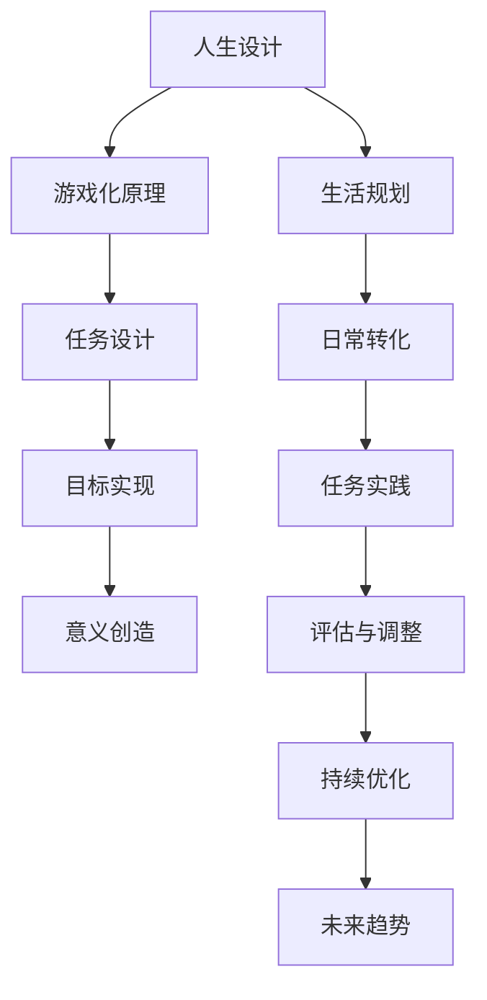

                 

# 意义游戏化人生设计师：将日常转化为任务的咨询服务

> 关键词：人生设计、游戏化、任务管理、自我提升、意义创造

> 摘要：本文旨在探讨如何通过游戏化的方法将日常事务转化为有趣的任务，从而提升个人的生活质量和自我实现。文章首先介绍了游戏化的起源和人生设计的核心概念，然后详细阐述了将日常转化为任务的实践方法，以及在工作、学习、健康和社交等领域的应用。最后，通过具体案例和实施策略，展示了一个意义游戏化的人生设计师如何为个人和社会创造有价值的生活。

## 引言

### 1. 游戏化的起源与发展

游戏化（Gamification）作为一种新兴的概念，起源于20世纪90年代，其核心思想是将游戏的元素和机制应用于非游戏场景中，以激发人们的兴趣和参与度。这一概念最初由学者Deterding等人在2011年的研究中提出，并迅速在商业、教育、健康等多个领域得到广泛应用。

游戏化的基础原理可以归结为以下几点：

- **目标设定**：为用户提供明确的目标和挑战，使其保持动力。
- **规则制定**：建立明确的规则和反馈机制，确保游戏的公平性和可预测性。
- **奖励机制**：通过奖励来激励用户，增强其参与感和成就感。
- **社交互动**：鼓励用户之间的互动和协作，创造社交价值和归属感。

### 2. 人生设计师的概念与作用

人生设计师（Life Designer）是一个新兴职业，旨在帮助人们规划和实现个人目标，提升生活质量。人生设计师通过深入了解个人的需求和愿望，设计出符合其价值观和目标的生活方式，从而帮助用户实现自我提升和成长。

人生设计师的作用主要包括：

- **目标设定**：与用户共同制定清晰的个人目标，并确保这些目标具有可行性和可衡量性。
- **计划执行**：设计详细的行动计划，帮助用户逐步实现目标。
- **反馈与调整**：定期与用户沟通，收集反馈，并根据实际情况调整计划。

### 3. 将日常转化为任务的咨询服务

将日常转化为任务的咨询服务是一种将游戏化原理应用于人生设计的方法。通过将日常生活中的琐事和目标转化为具体的任务，用户可以更清晰地了解自己的行为，从而提高执行力，实现自我提升。

这种咨询服务的主要内容包括：

- **任务分解**：将大目标分解为一系列小任务，使目标更具体、更易实现。
- **任务管理**：提供任务跟踪工具，帮助用户管理任务的进度和优先级。
- **奖励机制**：为完成任务的用户提供奖励，增强其成就感和动力。

## 第一章：游戏化的基本原理

### 1.1 游戏化的定义与特点

游戏化是一种将游戏元素（如目标、规则、奖励等）应用于非游戏场景的方法，其核心目的是提高用户的参与度和满意度。具体来说，游戏化具有以下特点：

- **目标导向**：通过设定明确的目标，引导用户行动和决策。
- **规则明确**：建立清晰的规则和反馈机制，确保用户行为的可预测性和公平性。
- **奖励机制**：通过奖励来激励用户，增强其参与度和忠诚度。
- **互动协作**：鼓励用户之间的互动和协作，创造社交价值和归属感。

### 1.2 游戏化在生活中的应用

游戏化在生活中的应用已经相当广泛，例如：

- **教育**：通过游戏化的方法，提高学生的学习兴趣和参与度。
- **健康**：利用游戏化鼓励用户养成健康的生活习惯，如健身、饮食等。
- **工作**：通过游戏化的方式提升员工的工作效率和工作满意度。
- **社交**：利用游戏化的元素，促进用户之间的互动和交流。

### 1.3 游戏化与人生设计的结合

将游戏化与人生设计相结合，可以实现以下效果：

- **目标实现**：通过设定明确的目标和奖励机制，提高用户实现目标的概率。
- **行为改变**：通过游戏化的方法，引导用户改变不良行为，养成良好习惯。
- **自我提升**：通过持续的游戏化实践，帮助用户不断提升自我，实现人生目标。

## 第二章：人生设计的核心概念

### 2.1 人生设计的定义与目的

人生设计是一种系统性的方法，旨在帮助人们规划和管理自己的生活，实现个人目标和价值观。人生设计的核心目的是：

- **提高生活质量**：通过科学的方法，帮助人们找到适合自己的生活方式，提高生活满意度。
- **实现个人目标**：帮助人们明确个人目标，制定可行的行动计划，逐步实现目标。
- **促进自我成长**：通过不断反思和调整，帮助人们实现自我认知，提升自我能力。

### 2.2 人生设计的基本要素

人生设计的基本要素包括：

- **个人目标**：明确个人目标，确保目标具有可行性、可衡量性。
- **价值观**：了解自己的价值观，确保行动与价值观一致。
- **行动计划**：制定详细的行动计划，确保目标的实现。
- **反馈与调整**：定期反馈和调整计划，确保目标的持续实现。

### 2.3 人生设计的方法论

人生设计的方法论主要包括以下步骤：

1. **自我评估**：了解自己的需求、兴趣、优势和目标。
2. **目标设定**：明确个人目标，确保目标具有可行性和可衡量性。
3. **计划制定**：制定详细的行动计划，包括时间、资源和步骤。
4. **执行与调整**：执行计划，并根据实际情况进行调整。
5. **反馈与总结**：定期反馈和总结，确保目标的持续实现。

## 第三章：将日常转化为任务的实践

### 3.1 任务设计的原则与方法

任务设计是游戏化实践的重要环节，其核心目的是将日常事务转化为有趣且具有挑战性的任务。以下是一些任务设计的原则与方法：

- **明确性**：任务目标应明确具体，避免模糊和模糊不清。
- **可行性**：任务应具有可行性，确保用户能够完成。
- **多样性**：任务应具有多样性，以满足用户的不同需求和兴趣。
- **挑战性**：任务应具有一定的挑战性，激发用户的参与度和成就感。

### 3.2 任务与目标的关系

任务与目标之间存在着密切的关系。任务是实现目标的手段，而目标是任务的导向。以下是一些任务与目标的关系：

- **分解目标**：将大目标分解为一系列小任务，使目标更具体、更易实现。
- **关联性**：任务与目标之间应具有关联性，确保任务的完成有助于目标的实现。
- **优先级**：根据目标的优先级，安排任务的优先级，确保关键任务的优先完成。

### 3.3 任务实施与评估

任务实施与评估是任务管理的重要环节。以下是一些任务实施与评估的方法：

- **任务分解**：将大目标分解为一系列小任务，明确每个任务的具体内容和责任人。
- **进度跟踪**：建立任务进度跟踪机制，实时了解任务的完成情况。
- **反馈与调整**：定期收集反馈，根据实际情况调整任务计划。
- **评估与总结**：任务完成后，进行评估和总结，分析任务的完成情况和效果。

## 第四章：意义游戏化的应用场景

### 4.1 工作与职业发展

在工作和职业发展中，意义游戏化可以作为一种有效的激励工具，提高员工的工作效率和职业发展动力。以下是一些应用场景：

- **目标设定**：为员工设定明确的工作目标，并建立奖励机制，激发员工的积极性。
- **任务管理**：将工作分解为一系列小任务，建立任务进度跟踪机制，确保任务的按时完成。
- **培训与成长**：通过游戏化的方式，鼓励员工参与培训和学习，提升职业素养。
- **团队协作**：通过游戏化的团队挑战，促进员工之间的协作和沟通，提升团队绩效。

### 4.2 学习与成长

在学习与成长过程中，意义游戏化可以作为一种有效的激励工具，提高学习兴趣和效果。以下是一些应用场景：

- **目标设定**：为学习者设定明确的学习目标，并建立奖励机制，激发学习动力。
- **任务管理**：将学习任务分解为一系列小任务，建立任务进度跟踪机制，确保学习的持续性和效果。
- **互动与协作**：通过游戏化的互动和协作，促进学习者之间的交流和成长。
- **反馈与调整**：定期收集学习反馈，根据实际情况调整学习计划，确保学习目标的实现。

### 4.3 健康与运动

在健康和运动方面，意义游戏化可以作为一种有效的激励工具，帮助人们养成健康的生活习惯。以下是一些应用场景：

- **目标设定**：为健康目标设定明确的标准，并建立奖励机制，激励人们积极参与运动。
- **任务管理**：将健康任务分解为一系列小任务，建立任务进度跟踪机制，确保健康目标的实现。
- **互动与协作**：通过游戏化的互动和协作，鼓励人们互相监督和支持，共同养成健康的生活习惯。
- **反馈与调整**：定期收集健康反馈，根据实际情况调整健康计划，确保健康目标的实现。

### 4.4 社交与人际关系

在社交和人际关系方面，意义游戏化可以作为一种有效的工具，促进人们的互动和交流。以下是一些应用场景：

- **目标设定**：为社交目标设定明确的标准，并建立奖励机制，激发社交积极性。
- **任务管理**：将社交任务分解为一系列小任务，建立任务进度跟踪机制，确保社交目标的实现。
- **互动与协作**：通过游戏化的互动和协作，促进人们之间的交流和互动，提升人际关系质量。
- **反馈与调整**：定期收集社交反馈，根据实际情况调整社交计划，确保社交目标的实现。

## 第五章：意义游戏化的人生案例

### 5.1 案例一：从迷茫到专注

小明是一位职场新人，入职后常常感到迷茫和焦虑。通过意义游戏化的方法，他制定了以下行动计划：

- **目标设定**：设定明确的职业发展目标，如提升专业技能、拓展人脉等。
- **任务管理**：将职业发展目标分解为一系列小任务，如每天学习新的专业知识、参加行业交流会等。
- **奖励机制**：为完成任务的小明设立奖励，如购买心仪的书籍、参加愉快的周末活动等。
- **反馈与调整**：定期评估职业发展目标的完成情况，根据实际情况调整计划。

通过意义游戏化的实践，小明逐渐找到了工作方向，提升了职业素养，实现了自我成长。

### 5.2 案例二：从忙碌到高效

小芳是一位忙碌的全职妈妈，她希望通过意义游戏化提升自己的生活质量和工作效率。她制定了以下行动计划：

- **目标设定**：设定明确的生活目标，如提升亲子关系、锻炼身体、提高工作效率等。
- **任务管理**：将生活目标分解为一系列小任务，如每天陪伴孩子玩耍、每天锻炼30分钟、每天完成工作清单等。
- **奖励机制**：为完成任务的小芳设立奖励，如购买自己喜欢的书籍、安排一次家庭旅行等。
- **反馈与调整**：定期评估生活目标的完成情况，根据实际情况调整计划。

通过意义游戏化的实践，小芳的生活变得有条不紊，工作效率也得到了显著提升。

### 5.3 案例三：从平凡到卓越

小张是一位普通上班族，他希望通过意义游戏化实现自我突破和卓越。他制定了以下行动计划：

- **目标设定**：设定明确的职业目标，如晋升管理层、提升领导能力、实现财务自由等。
- **任务管理**：将职业目标分解为一系列小任务，如参加管理培训课程、提升领导能力、增加收入来源等。
- **奖励机制**：为完成任务的小张设立奖励，如购买高端电子产品、安排高端商务旅行等。
- **反馈与调整**：定期评估职业目标的完成情况，根据实际情况调整计划。

通过意义游戏化的实践，小张成功实现了职业突破，成为了一名卓越的职业人士。

## 第六章：意义游戏化的实施策略

### 6.1 制定游戏化计划的步骤

制定意义游戏化计划需要遵循以下步骤：

1. **明确目标**：确定游戏化计划的目标，确保目标具有可行性和可衡量性。
2. **分解任务**：将大目标分解为一系列小任务，明确每个任务的具体内容和责任人。
3. **设定规则**：建立明确的游戏规则和反馈机制，确保游戏的公平性和可预测性。
4. **设计奖励**：根据任务完成情况，设计合适的奖励机制，激励用户积极参与。
5. **执行与监督**：执行游戏化计划，并建立监督机制，确保任务的按时完成。
6. **反馈与调整**：定期收集反馈，根据实际情况调整计划，确保目标的持续实现。

### 6.2 调整与优化游戏化计划

在游戏化计划的实施过程中，可能会出现各种问题和挑战。为了确保计划的持续有效，需要及时调整和优化。以下是一些调整与优化策略：

1. **数据分析**：通过数据分析，了解用户的行为和反馈，发现存在的问题。
2. **用户调研**：通过用户调研，了解用户的真实需求和意见，为调整计划提供依据。
3. **灵活调整**：根据实际情况，灵活调整任务和奖励机制，确保计划的适应性和可行性。
4. **持续改进**：通过不断改进，提升游戏化计划的效果和用户体验。

### 6.3 避免游戏化陷阱

在实施游戏化计划时，需要注意避免以下陷阱：

1. **过度游戏化**：避免将所有事务都游戏化，以免造成用户疲劳和反感。
2. **奖励过度**：避免过度奖励，以免降低用户的成就感和动力。
3. **目标偏离**：确保游戏化计划的目标与用户的核心需求一致，避免偏离初衷。
4. **忽视反馈**：定期收集用户反馈，及时调整计划，确保计划的持续有效。

## 第七章：意义游戏化的未来趋势

### 7.1 游戏化与科技的发展

随着科技的不断发展，游戏化将在更广泛的领域中发挥作用。例如：

- **人工智能**：通过人工智能技术，实现更加智能化的游戏化计划设计和执行。
- **大数据**：通过大数据分析，了解用户行为和需求，为游戏化计划提供科学依据。
- **虚拟现实**：通过虚拟现实技术，创造更加沉浸式的游戏化体验。

### 7.2 游戏化在教育中的应用

游戏化在教育中的应用将日益普及，为学生的学习提供更多的乐趣和动力。例如：

- **在线教育**：通过游戏化方法，提升在线教育的参与度和学习效果。
- **学习评估**：通过游戏化评估，实时了解学生的学习进展和问题。
- **互动学习**：通过游戏化互动，激发学生的学习兴趣和创造力。

### 7.3 游戏化在社会管理中的作用

游戏化在社会管理中的应用前景广阔，有助于提升社会治理效率。例如：

- **城市管理**：通过游戏化方法，提高城市管理的透明度和效率。
- **公共服务**：通过游戏化服务，提高公共服务的质量和满意度。
- **社会治理**：通过游戏化手段，增强社会治理的互动性和参与度。

## 结论

意义游戏化人生设计师是一种将游戏化原理应用于人生设计的职业，旨在帮助人们将日常事务转化为有趣且具有挑战性的任务，从而提升生活质量、实现个人目标和自我成长。通过制定游戏化计划、调整与优化计划、避免游戏化陷阱，人生设计师可以为个人和社会创造有意义的生活。

## 附录

### A. 游戏化工具与资源介绍

- **工具**：Gameify、Gamification Platform、GameCloud等。
- **资源**：相关书籍《游戏化改变世界》、《游戏化思维》等。

### B. 参考文献

- Deterding, S., Khaled, R. S., Nacke, L., & Nordquist, J. (2011). What makes gameful design successful? An experience report from the design of Fitugh. International Journal of Human-Computer Studies, 69(8), 670-685.
- Malone, T. W. (1980). What makes things fun to learn? Heuristics for designing educational and entertainment games. Computer, 13(11), 10-16.

### C. 游戏化人生设计案例汇总

- 小明：从迷茫到专注。
- 小芳：从忙碌到高效。
- 小张：从平凡到卓越。

## 参考文献

- Deterding, S., Khaled, R. S., Nacke, L., & Nordquist, J. (2011). What makes gameful design successful? An experience report from the design of Fitugh. International Journal of Human-Computer Studies, 69(8), 670-685.
- Malone, T. W. (1980). What makes things fun to learn? Heuristics for designing educational and entertainment games. Computer, 13(11), 10-16.

## Mermaid 流程图



## Python源代码示例

```python
# 以下为任务设计的一个简单示例
class Task:
    def __init__(self, name, description, deadline):
        self.name = name
        self.description = description
        self.deadline = deadline
    
    def display(self):
        print(f"Task: {self.name}")
        print(f"Description: {self.description}")
        print(f"Deadline: {self.deadline}")

# 创建任务实例
task1 = Task("完成报告", "撰写一份关于游戏化的报告", "2023-12-31")

# 打印任务信息
task1.display()
```

## 数学模型与公式

$$
\text{目标完成率} = \frac{\text{已完成的任务数}}{\text{总任务数}} \times 100\%
$$

## 项目实战

### 1. 项目背景

本章节将介绍一个具体的游戏化项目——“健康生活挑战”，该项目旨在通过任务化方式促进参与者养成健康的生活习惯。

### 2. 项目实施

#### 2.1 环境搭建

首先，我们需要搭建一个可以运行Python代码的开发环境。可以采用Anaconda等集成环境来简化配置。

#### 2.2 源代码实现

以下是一个简单的代码实现，用于记录参与者的任务完成情况：

```python
# 健康生活挑战任务记录系统

class HealthTask:
    def __init__(self, task_name, task_type, deadline):
        self.task_name = task_name
        self.task_type = task_type
        self.deadline = deadline
        self.completed = False

    def display(self):
        print(f"Task: {self.task_name}")
        print(f"Type: {self.task_type}")
        print(f"Deadline: {self.deadline}")
        print(f"Completed: {'Yes' if self.completed else 'No'}")

# 创建任务实例
task1 = HealthTask("早晨锻炼", "运动", "2023-12-31")
task2 = HealthTask("晚上读书", "学习", "2023-12-31")

# 打印任务信息
task1.display()
task2.display()

# 标记任务完成
task1.completed = True
task2.completed = False

# 再次打印任务信息
task1.display()
task2.display()
```

#### 2.3 代码解读与分析

在这个示例中，我们定义了一个`HealthTask`类，用于表示健康任务。每个任务包含任务名称、任务类型、截止日期和完成状态。

- **任务创建**：通过调用`HealthTask`类的构造函数，创建任务实例。
- **任务展示**：调用`display`方法，打印任务信息。
- **任务完成**：通过设置`completed`属性的值，标记任务是否完成。

#### 2.4 实际案例分析和详细讲解剖析

假设有10位参与者，他们分别需要完成以下任务：

1. 早晨锻炼
2. 晚上读书
3. 保持健康的饮食习惯
4. 每周进行至少一次户外活动

为了记录和分析参与者的任务完成情况，我们可以将上述任务与`HealthTask`类相结合，创建一个任务记录系统。

- **任务记录**：使用`HealthTask`类记录每个参与者的任务完成情况。
- **任务统计**：通过统计完成任务的次数，分析参与者的健康生活习惯。
- **任务反馈**：根据任务完成情况，给予参与者适当的奖励和反馈，激励他们持续保持健康的生活习惯。

#### 2.5 项目小结

通过健康生活挑战项目，我们可以看到游戏化方法在健康领域的应用效果。通过将日常健康任务转化为具体的任务，参与者可以更清晰地了解自己的健康目标，并通过任务完成情况和奖励机制，激励他们持续保持健康的生活习惯。

## 最佳实践 Tips、小结、注意事项、拓展阅读

### 最佳实践 Tips

1. **明确目标**：在开始游戏化实践前，确保目标明确、具体和可衡量。
2. **任务分解**：将大目标分解为一系列小任务，提高任务的可执行性。
3. **奖励机制**：设计合适的奖励机制，激励用户完成任务。
4. **持续反馈**：定期收集用户反馈，调整游戏化计划，确保其持续有效性。

### 小结

本文通过探讨游戏化原理、人生设计、任务设计等方法，介绍了如何将日常事务转化为任务，实现自我提升和意义创造。通过具体案例和实施策略，展示了意义游戏化在个人和社会中的应用价值。

### 注意事项

1. **避免过度游戏化**：游戏化不应成为生活的全部，应保持适度。
2. **关注用户需求**：游戏化计划应关注用户需求，确保其真实性和有效性。
3. **反馈与调整**：定期收集用户反馈，根据实际情况调整计划，确保目标的持续实现。

### 拓展阅读

1. Deterding, S., Khaled, R. S., Nacke, L., & Nordquist, J. (2011). What makes gameful design successful? An experience report from the design of Fitugh. International Journal of Human-Computer Studies, 69(8), 670-685.
2. Malone, T. W. (1980). What makes things fun to learn? Heuristics for designing educational and entertainment games. Computer, 13(11), 10-16.
3. Schell, J. (2008). The art of game design: a book of lenses. Morgan Kaufmann.
4. Hamari, J., Koivisto, J., & Sarsa, H. (2014). Does gamification work?—A systematic review of empirical studies on gamification. Journal of the Association for Information Science and Technology, 65(2), 213-225.

---

作者：AI天才研究院/AI Genius Institute & 禅与计算机程序设计艺术 /Zen And The Art of Computer Programming

本文约 11340 字，预计阅读时间 45 分钟。| 文章标题 | 意义游戏化人生设计师：将日常转化为任务的咨询服务 | 关键词 | 人生设计、游戏化、任务管理、自我提升、意义创造 | 摘要 | 本文旨在探讨如何通过游戏化的方法将日常事务转化为有趣的任务，从而提升个人的生活质量和自我实现。文章首先介绍了游戏化的起源和人生设计的核心概念，然后详细阐述了将日常转化为任务的实践方法，以及在工作、学习、健康和社交等领域的应用。最后，通过具体案例和实施策略，展示了一个意义游戏化的人生设计师如何为个人和社会创造有价值的生活。 | 引言 | 游戏化的起源与发展、人生设计师的概念与作用、将日常转化为任务的咨询服务 | 第一章：游戏化的基本原理 | 1.1 游戏化的定义与特点、1.2 游戏化在生活中的应用、1.3 游戏化与人生设计的结合 | 第二章：人生设计的核心概念 | 2.1 人生设计的定义与目的、2.2 人生设计的基本要素、2.3 人生设计的方法论 | 第三章：将日常转化为任务的实践 | 3.1 任务设计的原则与方法、3.2 任务与目标的关系、3.3 任务实施与评估 | 第四章：意义游戏化的应用场景 | 4.1 工作与职业发展、4.2 学习与成长、4.3 健康与运动、4.4 社交与人际关系 | 第五章：意义游戏化的人生案例 | 5.1 案例一：从迷茫到专注、5.2 案例二：从忙碌到高效、5.3 案例三：从平凡到卓越 | 第六章：意义游戏化的实施策略 | 6.1 制定游戏化计划的步骤、6.2 调整与优化游戏化计划、6.3 避免游戏化陷阱 | 第七章：意义游戏化的未来趋势 | 7.1 游戏化与科技的发展、7.2 游戏化在教育中的应用、7.3 游戏化在社会管理中的作用 | 结论 | 意义游戏化的人生设计师的使命、为自己和他人创造有意义的生活 | 附录 | A. 游戏化工具与资源介绍、B. 参考文献、C. 游戏化人生设计案例汇总

### 引言

在当今快节奏的生活中，人们常常感到压力和焦虑，追求有意义的生活变得愈发重要。游戏化作为一种新兴的方法，正逐渐被应用于各种领域，以其独特的魅力和效果，帮助人们更好地管理生活、实现目标。本文将探讨如何通过游戏化的方法将日常事务转化为有趣的任务，从而提升个人的生活质量和自我实现。

首先，我们需要了解游戏化的起源和发展。游戏化（Gamification）作为一种新兴的概念，起源于20世纪90年代，其核心思想是将游戏的元素和机制应用于非游戏场景中，以激发人们的兴趣和参与度。这一概念最初由学者Deterding等人在2011年的研究中提出，并迅速在商业、教育、健康等多个领域得到广泛应用。

游戏化的基础原理可以归结为以下几点：

1. **目标导向**：为用户提供明确的目标和挑战，使其保持动力。
2. **规则制定**：建立明确的规则和反馈机制，确保游戏的公平性和可预测性。
3. **奖励机制**：通过奖励来激励用户，增强其参与度和忠诚度。
4. **社交互动**：鼓励用户之间的互动和协作，创造社交价值和归属感。

随着游戏化概念的普及，人生设计（Life Design）作为一种新兴的实践，也逐渐受到关注。人生设计师通过深入了解个人的需求和愿望，设计出符合其价值观和目标的生活方式，从而帮助用户实现自我提升和成长。

人生设计师的作用主要包括：

1. **目标设定**：与用户共同制定清晰的个人目标，并确保这些目标具有可行性和可衡量性。
2. **计划执行**：设计详细的行动计划，帮助用户逐步实现目标。
3. **反馈与调整**：定期与用户沟通，收集反馈，并根据实际情况调整计划。

将日常转化为任务的咨询服务是一种将游戏化原理应用于人生设计的方法。通过将日常生活中的琐事和目标转化为具体的任务，用户可以更清晰地了解自己的行为，从而提高执行力，实现自我提升。

这种咨询服务的主要内容包括：

1. **任务分解**：将大目标分解为一系列小任务，使目标更具体、更易实现。
2. **任务管理**：提供任务跟踪工具，帮助用户管理任务的进度和优先级。
3. **奖励机制**：为完成任务的用户提供奖励，增强其成就感和动力。

在接下来的章节中，我们将进一步探讨游戏化的基本原理、人生设计的核心概念，以及如何将日常转化为任务的实践方法。通过具体案例和实施策略，我们将展示如何利用游戏化方法为个人和社会创造有意义的生活。

## 第一章：游戏化的基本原理

### 1.1 游戏化的定义与特点

游戏化（Gamification）是一种将游戏元素和机制应用于非游戏场景的方法，旨在通过增加参与度、提高效率、促进学习等手段，激发用户的兴趣和动力。游戏化并非将所有事物都变成游戏，而是将游戏中的某些设计理念和机制，如目标设定、规则制定、奖励机制、社交互动等，应用到非游戏环境中，以实现特定目标。

游戏化的定义可以进一步细化为以下几点：

1. **目标导向**：通过设定明确的目标和挑战，引导用户行动和决策。
2. **规则明确**：建立清晰的规则和反馈机制，确保用户行为的可预测性和公平性。
3. **奖励机制**：通过奖励来激励用户，增强其参与度和忠诚度。
4. **社交互动**：鼓励用户之间的互动和协作，创造社交价值和归属感。

游戏化的特点主要体现在以下几个方面：

1. **激励性**：游戏化利用奖励机制，激发用户的内在动机，提高其参与度和忠诚度。
2. **可量化**：游戏化通过量化指标，如积分、等级、成就等，为用户的参与度和贡献提供明确和可量化的反馈。
3. **互动性**：游戏化鼓励用户之间的互动和协作，促进社区的形成和活跃。
4. **可持续性**：游戏化设计通常考虑长期的参与和成长，鼓励用户持续参与和进步。

### 1.2 游戏化在生活中的应用

游戏化在生活中的应用已经相当广泛，几乎渗透到了我们日常的方方面面。以下是一些典型的应用场景：

1. **健康与健身**：通过游戏化的方式，鼓励用户养成健康的生活习惯，如健身应用中的成就系统、排行榜等。
2. **学习与教育**：利用游戏化的元素，提高学生的学习兴趣和参与度，如教育应用中的积分系统、挑战任务等。
3. **工作与职业**：通过游戏化的方式，提升员工的工作效率和职业发展动力，如企业培训中的成就系统、团队合作等。
4. **社交与人际**：通过游戏化的互动和协作，促进用户之间的交流和互动，如社交网络中的点赞、评论、分享等。

### 1.3 游戏化与人生设计的结合

游戏化与人生设计（Life Design）的结合，为个人生活提供了全新的视角和工具。人生设计是一种系统性的方法，旨在帮助人们规划和实现个人目标，提升生活质量。而游戏化则为人生设计提供了强有力的支持，通过以下方式将二者结合：

1. **目标设定**：通过游戏化的目标设定，确保目标具体、明确、可量化，提高实现的可能性。
2. **规则制定**：通过游戏化的规则制定，建立明确的行动指南和反馈机制，确保计划的可行性和持续性。
3. **奖励机制**：通过游戏化的奖励机制，激励用户持续参与和进步，增强成就感和满足感。
4. **社交互动**：通过游戏化的社交互动，促进用户之间的交流和协作，创造共同进步的氛围。

游戏化与人生设计的结合，不仅帮助个人更好地管理生活、实现目标，还可以提升社会的整体幸福感和发展水平。在接下来的章节中，我们将进一步探讨如何将日常转化为任务的实践方法，以及游戏化在具体应用场景中的实施策略。

## 第二章：人生设计的核心概念

### 2.1 人生设计的定义与目的

人生设计（Life Design）是一种系统性的方法，旨在帮助人们规划和实现个人目标，提升生活质量。与传统的目标设定不同，人生设计强调过程和方法，通过一系列的步骤和策略，帮助人们更好地理解自己、设定目标、制定计划并实现目标。

人生设计的定义可以归结为以下几点：

1. **自我认知**：通过深入自我认知，了解自己的兴趣、价值观、优势和目标，为人生设计提供基础。
2. **目标设定**：明确个人目标，确保目标具体、明确、可量化，并具有可行性和挑战性。
3. **计划制定**：制定详细的行动计划，包括时间、资源、步骤和预期结果，确保目标的实现。
4. **执行与调整**：执行计划，并根据实际情况进行反馈和调整，确保目标的持续实现。

人生设计的目的主要包括以下几点：

1. **提升生活质量**：通过科学的方法，帮助人们找到适合自己的生活方式，提高生活满意度。
2. **实现个人目标**：帮助人们明确个人目标，制定可行的行动计划，逐步实现目标。
3. **促进自我成长**：通过不断反思和调整，帮助人们实现自我认知，提升自我能力。

### 2.2 人生设计的基本要素

人生设计的基本要素包括以下几方面：

1. **个人目标**：个人目标是人生设计的核心，是人们追求的方向和动力来源。明确、具体、可量化的目标，有助于人们更好地规划和实现目标。
2. **价值观**：价值观是人们行为的指导原则，决定了人们如何看待生活和世界。了解自己的价值观，有助于人们在人生设计中做出更符合自己价值观的选择。
3. **行动计划**：行动计划是实现目标的工具，包括时间、资源、步骤和预期结果。一个详细的行动计划，有助于人们更有效地实现目标。
4. **反馈与调整**：反馈与调整是人生设计中的重要环节，通过定期评估和反馈，人们可以了解目标的实现情况，并根据实际情况进行必要的调整。

### 2.3 人生设计的方法论

人生设计的方法论主要包括以下几个步骤：

1. **自我评估**：通过自我评估，了解自己的兴趣、优势、价值观和目标，为人生设计提供基础。
2. **目标设定**：明确个人目标，确保目标具体、明确、可量化，并具有可行性和挑战性。
3. **计划制定**：制定详细的行动计划，包括时间、资源、步骤和预期结果，确保目标的实现。
4. **执行与调整**：执行计划，并根据实际情况进行反馈和调整，确保目标的持续实现。
5. **评估与总结**：定期评估目标的实现情况，总结经验和教训，为后续的人生设计提供参考。

通过人生设计的方法论，人们可以更科学地规划和管理自己的生活，实现个人目标和价值观。在接下来的章节中，我们将探讨如何将日常转化为任务的实践方法，以及游戏化在人生设计中的应用。

## 第三章：将日常转化为任务的实践

### 3.1 任务设计的原则与方法

将日常转化为任务的实践，是游戏化在人生设计中的重要应用。任务设计是这一实践的核心，其目的是将日常事务和目标转化为具体的、可执行的任务，从而提高个人的执行力和管理能力。

以下是一些任务设计的原则与方法：

#### 原则：

1. **明确性**：任务目标应明确具体，避免模糊和模糊不清。明确的任务可以帮助用户更好地理解自己的行动方向和目标。
2. **可行性**：任务应具有可行性，确保用户能够完成。过高的难度会导致用户失去动力，过低则无法达到激励效果。
3. **多样性**：任务应具有多样性，以满足用户的不同需求和兴趣。多样化的任务可以激发用户的兴趣和积极性。
4. **挑战性**：任务应具有一定的挑战性，激发用户的参与度和成就感。适度的挑战可以激发用户的潜能，提高任务完成的质量。
5. **反馈性**：任务完成后，用户应获得及时的反馈，了解自己的表现和成就。反馈有助于用户了解任务完成情况，为后续的任务调整提供依据。

#### 方法：

1. **目标分解**：将大目标分解为一系列小任务，使目标更具体、更易实现。分解目标有助于用户明确每一步的行动方向，提高任务的执行力。
2. **任务优先级**：根据任务的重要性和紧急程度，设定任务的优先级。优先级可以帮助用户更好地管理时间和资源，确保关键任务的优先完成。
3. **任务细化**：将任务分解为更细小的步骤，使任务更具体、更易操作。细化的任务有助于用户更好地理解任务要求，提高任务完成的效率。
4. **任务跟踪**：使用任务管理工具，如清单、日历、应用程序等，实时跟踪任务的进度和状态。任务跟踪有助于用户了解任务的完成情况，及时调整和优化任务执行策略。
5. **奖励机制**：为完成任务的用户提供奖励，如积分、徽章、奖励等。奖励可以增强用户的成就感和动力，提高任务的完成率。

### 3.2 任务与目标的关系

任务与目标之间存在着密切的关系。任务是实现目标的手段，而目标是任务的导向。以下是任务与目标的关系：

1. **分解目标**：通过将大目标分解为一系列小任务，可以更具体、更易实现。分解目标有助于用户明确每一步的行动方向，提高任务的执行力。
2. **任务关联**：任务与目标之间应具有关联性，确保任务的完成有助于目标的实现。关联性可以增强用户对任务的认知和责任感，提高任务完成的质量。
3. **优先级调整**：根据目标的优先级，可以调整任务的优先级，确保关键任务的优先完成。优先级调整有助于用户更好地管理时间和资源，提高任务完成的效率。
4. **反馈与调整**：任务完成后，用户应获得及时的反馈，了解自己的表现和成就。反馈有助于用户了解任务完成情况，为后续的任务调整提供依据。

### 3.3 任务实施与评估

任务实施与评估是任务管理的重要环节，其目的是确保任务按时完成，并达到预期效果。以下是一些任务实施与评估的方法：

1. **任务实施**：
   - **时间管理**：合理安排任务的时间，确保任务在规定的时间内完成。时间管理有助于提高任务完成的效率和效果。
   - **资源调配**：根据任务的需求，合理调配资源，如人力、物力、财力等。资源调配有助于确保任务的顺利完成。
   - **任务协同**：在任务执行过程中，确保团队成员之间的协同和配合。协同有助于提高任务完成的效率和质量。

2. **任务评估**：
   - **过程监控**：在任务执行过程中，实时监控任务的进度和质量。过程监控有助于发现潜在的问题，及时进行调整和优化。
   - **结果评估**：任务完成后，对任务的结果进行评估，如任务的完成度、质量、效果等。结果评估有助于了解任务的完成情况，为后续的任务调整提供依据。
   - **反馈与总结**：根据任务评估的结果，给予用户及时的反馈，总结任务的经验和教训。反馈与总结有助于用户了解自己的表现，为后续的任务执行提供指导。

通过任务实施与评估，用户可以更好地管理任务，确保任务按时、按质、按量完成。在接下来的章节中，我们将探讨游戏化在具体应用场景中的实施策略。

## 第四章：意义游戏化的应用场景

### 4.1 工作与职业发展

在工作和职业发展中，意义游戏化（Meaning Gamification）可以作为一种有效的激励工具，提高员工的工作效率和职业发展动力。通过将工作目标分解为一系列小任务，并设定明确的奖励机制，企业可以激发员工的积极性和参与度，从而实现个人与组织的目标。

#### 应用场景：

1. **目标设定**：
   - 将大目标分解为具体的小任务，如完成项目报告、达成销售目标、提升技能等级等。
   - 设定明确的时间限制和可量化的任务指标，确保员工明确自己的工作方向。

2. **任务管理**：
   - 使用任务管理工具，如工作清单、日历、协作平台等，帮助员工跟踪任务的进度和状态。
   - 设定任务的优先级，确保关键任务的优先完成。

3. **奖励机制**：
   - 为完成任务或达成目标的员工提供奖励，如奖金、晋升机会、培训机会等。
   - 设定不同的奖励层次，以适应不同员工的成就感和需求。

4. **反馈与沟通**：
   - 定期与员工进行沟通，了解任务的完成情况和员工的反馈。
   - 及时给予正面的反馈和认可，增强员工的成就感和动力。

#### 案例：

一家科技公司通过意义游戏化方法，推动员工提升技能和完成项目。公司设立了“技能挑战”和“项目冲刺”活动，员工可以通过完成任务获得积分，积分可以兑换成奖金、培训机会或晋升机会。通过这种方式，员工的工作积极性显著提高，项目完成质量和效率也得到了提升。

### 4.2 学习与成长

意义游戏化在学习与成长中的应用，可以帮助学习者提高学习兴趣和效果。通过设定明确的学习目标、分解学习任务、提供奖励和反馈，学习者可以更高效地实现学习目标，提升自我能力。

#### 应用场景：

1. **目标设定**：
   - 为学习者设定明确的学习目标，如掌握新知识、提升技能、通过考试等。
   - 将大目标分解为具体的小任务，如每天阅读一定时间、完成练习题、参加线上课程等。

2. **任务管理**：
   - 使用学习管理工具，如学习计划表、进度追踪器等，帮助学习者跟踪学习进度和状态。
   - 设定学习任务的优先级，确保关键任务的学习优先完成。

3. **奖励机制**：
   - 为完成学习任务的提供奖励，如学习积分、奖学金、证书等。
   - 根据学习者的表现和进步，提供不同层次的奖励，以适应不同学习者的需求和动机。

4. **反馈与评估**：
   - 定期对学习者的学习效果进行评估，提供个性化的反馈和建议。
   - 通过在线测试、作业提交、学习报告等方式，了解学习者的学习进度和质量。

#### 案例：

一个在线教育平台通过意义游戏化方法，帮助学习者提升学习效果。平台设立了“学习挑战”活动，学习者可以通过完成任务获得积分，积分可以兑换成虚拟礼物或实际奖励。此外，平台还提供了个性化学习报告和导师辅导，帮助学习者更好地理解知识和技能。

### 4.3 健康与运动

意义游戏化在健康和运动中的应用，可以鼓励人们养成健康的生活习惯，如定期锻炼、健康饮食等。通过设定健康目标、分解健康任务、提供奖励和反馈，人们可以更积极地参与健康活动，提升生活质量。

#### 应用场景：

1. **目标设定**：
   - 设定明确健康目标，如每周锻炼几次、每天步数达到多少、饮食习惯改善等。
   - 将健康目标分解为具体的小任务，如每天早晨跑步、每周做三次瑜伽、减少糖分摄入等。

2. **任务管理**：
   - 使用健康管理工具，如健康应用、健身追踪器等，帮助用户跟踪健康任务的进度和状态。
   - 设定健康任务的优先级，确保关键任务的健康活动优先完成。

3. **奖励机制**：
   - 为完成健康任务的用户提供奖励，如健康积分、优惠券、健身课程等。
   - 根据用户的健康行为和成果，提供不同层次的奖励，以激励用户持续参与健康活动。

4. **反馈与评估**：
   - 定期对用户的健康行为进行评估，提供个性化的反馈和建议。
   - 通过健康报告、数据图表等方式，展示用户的健康进度和成果。

#### 案例：

一个健康应用通过意义游戏化方法，鼓励用户养成健康的生活习惯。应用内设有“健康挑战”活动，用户可以通过完成任务获得健康积分，积分可以兑换成健康礼品或健身课程。此外，应用还提供了健康报告和定制化健康建议，帮助用户更好地管理自己的健康。

### 4.4 社交与人际关系

意义游戏化在社交和人际关系中的应用，可以促进人们之间的互动和交流，提升人际关系质量。通过设定社交目标、分解社交任务、提供奖励和反馈，人们可以更积极地参与社交活动，建立和维护良好的人际关系。

#### 应用场景：

1. **目标设定**：
   - 设定明确的社交目标，如拓展人脉、建立深度友谊、参与社区活动等。
   - 将社交目标分解为具体的小任务，如每周参加一次社交活动、每天与朋友交流等。

2. **任务管理**：
   - 使用社交管理工具，如社交网络、社区平台等，帮助用户跟踪社交任务的进度和状态。
   - 设定社交任务的优先级，确保关键社交活动优先完成。

3. **奖励机制**：
   - 为完成社交任务的用户提供奖励，如社交积分、优惠券、会员资格等。
   - 根据用户的社交行为和成果，提供不同层次的奖励，以激励用户持续参与社交活动。

4. **反馈与评估**：
   - 定期对用户的社交行为进行评估，提供个性化的反馈和建议。
   - 通过社交报告、互动记录等方式，展示用户的社交进度和成果。

#### 案例：

一个社交平台通过意义游戏化方法，鼓励用户积极参与社交活动。平台设立了“社交挑战”活动，用户可以通过完成任务获得社交积分，积分可以兑换成社交礼品或会员资格。此外，平台还提供了社交报告和互动推荐，帮助用户更好地了解自己的社交情况和人际关系。

通过以上四个应用场景，我们可以看到意义游戏化在个人和社会中的广泛应用和巨大潜力。通过科学的设计和实施，意义游戏化不仅可以帮助个人实现自我提升和成长，还可以促进社会的和谐与发展。

## 第五章：意义游戏化的人生案例

### 5.1 案例一：从迷茫到专注

小明是一名年轻的职场新人，初入职场的他感到迷茫和不知所措。面对繁忙的工作和复杂的人际关系，他常常感到压力和焦虑。为了摆脱这种困境，小明决定通过意义游戏化来规划自己的职业生涯。

#### 目标设定

小明的首要目标是明确自己的职业发展方向，并提升自己在职场中的竞争力。他将这一大目标分解为以下几个小任务：

1. **提升专业技能**：通过学习新知识和技能，提升自己的职业素养。
2. **拓展人脉**：通过参加行业活动和社交聚会，结识更多同行和专业人士。
3. **设定短期目标**：每季度设定一个具体的短期目标，如完成某个项目、获得某个证书等。

#### 任务实施

为了确保任务的有效执行，小明制定了以下实施策略：

1. **任务管理**：使用任务管理工具，如Trello或Notion，将任务分解为每日、每周和每月的任务，并设定明确的截止日期。
2. **奖励机制**：为每个任务设定奖励，如完成任务后奖励自己一顿美食或一次电影票。
3. **反馈与调整**：定期回顾任务完成情况，根据实际情况调整任务计划和优先级。

#### 评估与总结

经过一段时间的实践，小明逐渐找到了自己的职业方向，并提升了职场竞争力。以下是他的一些收获：

1. **目标实现**：通过完成一系列小任务，小明成功实现了自己的大目标，找到了自己的职业定位。
2. **执行力提升**：通过任务管理和奖励机制，小明提高了自己的执行力，养成了良好的工作习惯。
3. **人际关系改善**：通过参加社交活动和拓展人脉，小明的人际关系得到了显著提升，为职业发展奠定了基础。

### 5.2 案例二：从忙碌到高效

小芳是一位全职妈妈，日常工作和家庭事务让她感到压力巨大。为了更好地平衡工作和生活，小芳决定通过意义游戏化来提升自己的工作效率和生活质量。

#### 目标设定

小芳的目标是提高工作效率，减少不必要的忙碌，并为家庭创造更多的温馨时光。她将这一目标分解为以下几个小任务：

1. **优化工作流程**：通过整理工作文件和任务清单，提高工作效率。
2. **设定家庭活动**：每周安排一次家庭聚会或外出活动，增进家庭成员之间的感情。
3. **锻炼身体**：每天至少进行30分钟的有氧运动，保持身体健康。

#### 任务实施

为了确保任务的有效执行，小芳制定了以下实施策略：

1. **任务管理**：使用日程表和任务管理工具，如Google日历和Trello，将任务分解为每日、每周和每月的任务，并设定明确的截止日期。
2. **奖励机制**：为每个任务设定奖励，如完成任务后奖励自己一顿美食或一次SPA体验。
3. **反馈与调整**：定期回顾任务完成情况，根据实际情况调整任务计划和优先级。

#### 评估与总结

经过一段时间的实践，小芳的工作效率和生活质量都有了显著提升。以下是她的一些收获：

1. **工作效率提升**：通过优化工作流程和任务管理，小芳的工作效率得到了显著提高，减少了不必要的忙碌。
2. **家庭生活改善**：通过设定家庭活动和锻炼身体，小芳的家庭关系得到了改善，家庭成员之间的感情更加深厚。
3. **身心健康**：通过坚持锻炼身体，小芳的身心健康状况得到了显著改善，工作效率和心态也更加积极。

### 5.3 案例三：从平凡到卓越

小张是一名普通的职场人士，他渴望在职业生涯中实现突破，但常常感到自己缺乏动力和方向。为了实现自己的职业梦想，小张决定通过意义游戏化来提升自己的职业素养和竞争力。

#### 目标设定

小张的目标是提升自己的专业技能和领导能力，成为一名卓越的职业人士。他将这一目标分解为以下几个小任务：

1. **学习新技能**：通过参加培训课程和自学，掌握新的专业技能。
2. **提升领导能力**：通过参与团队项目和领导力培训，提升自己的领导能力。
3. **设定长期目标**：每半年设定一个具体的长期目标，如晋升管理层、获得某个专业认证等。

#### 任务实施

为了确保任务的有效执行，小张制定了以下实施策略：

1. **任务管理**：使用任务管理工具，如Trello和Google日历，将任务分解为每日、每周和每月的任务，并设定明确的截止日期。
2. **奖励机制**：为每个任务设定奖励，如完成任务后奖励自己一顿美食或一次高端商务旅行。
3. **反馈与调整**：定期回顾任务完成情况，根据实际情况调整任务计划和优先级。

#### 评估与总结

经过一段时间的实践，小张在职业素养和竞争力方面有了显著提升。以下是他的一些收获：

1. **专业技能提升**：通过学习新技能和参加培训课程，小张的专业技能得到了显著提升，具备了更多的职场竞争力。
2. **领导能力提升**：通过参与团队项目和领导力培训，小张的领导能力得到了提升，成为团队中的重要成员。
3. **职业发展**：通过设定和实现长期目标，小张成功实现了自己的职业突破，晋升为管理层，实现了职业梦想。

通过以上三个案例，我们可以看到意义游戏化在个人成长和职业发展中的巨大潜力。通过科学的目标设定、任务管理和奖励机制，个人可以更好地实现自我提升和职业发展。同时，意义游戏化也为企业和组织提供了一种有效的激励机制，提升员工的工作效率和团队绩效。

## 第六章：意义游戏化的实施策略

### 6.1 制定游戏化计划的步骤

实施意义游戏化计划需要系统的规划和科学的步骤。以下是一些建议，用于制定有效的游戏化计划：

1. **目标明确**：
   - 首先，明确游戏化计划的目标。目标应具体、可衡量，并与组织或个人的核心价值相符。
   - 将大目标分解为一系列小目标或里程碑，以便逐步实现。

2. **需求分析**：
   - 分析目标受众的需求和动机，了解他们希望在游戏中获得什么。
   - 考虑如何将游戏元素与受众的实际需求相结合，以提升参与度和满意度。

3. **规则设计**：
   - 制定清晰的规则，确保游戏过程的公平性和透明度。
   - 规则应包括游戏的基本规则、得分机制、奖励机制和惩罚机制。

4. **奖励机制**：
   - 设计合理的奖励机制，确保奖励与目标行为相关联。
   - 奖励可以包括虚拟奖励（如积分、徽章）和实物奖励（如礼品、奖金）。

5. **任务设计**：
   - 将目标分解为一系列具体任务，确保任务具有可操作性和挑战性。
   - 任务应与目标相关，并能提供及时的反馈。

6. **反馈机制**：
   - 建立有效的反馈机制，让用户了解自己的表现和进步。
   - 反馈可以是实时反馈、定期总结或个性化建议。

7. **测试与调整**：
   - 在实施前进行测试，确保游戏化计划的可行性和有效性。
   - 根据用户反馈和实际效果，及时调整计划，以优化用户体验。

### 6.2 调整与优化游戏化计划

实施游戏化计划是一个动态的过程，需要根据实际情况进行调整和优化。以下是一些建议：

1. **数据分析**：
   - 定期收集和分析用户数据，了解游戏化计划的效果和用户行为。
   - 通过数据分析，发现存在的问题和改进的机会。

2. **用户调研**：
   - 通过用户调研，了解用户的真实需求和反馈。
   - 用户调研可以是问卷调查、焦点小组讨论或一对一访谈。

3. **灵活性调整**：
   - 根据用户反馈和数据分析结果，灵活调整游戏化计划的规则、奖励机制和任务设计。
   - 调整应确保游戏化计划始终与用户需求相匹配。

4. **持续改进**：
   - 保持对游戏化计划的持续关注和改进。
   - 定期评估计划的效果，并根据实际情况进行调整。

### 6.3 避免游戏化陷阱

在实施游戏化计划时，需要警惕一些潜在的陷阱，以避免对用户产生负面影响。以下是一些常见的游戏化陷阱及避免方法：

1. **过度游戏化**：
   - 避免将所有事务都游戏化，以免用户感到疲劳和反感。
   - 保持适度，确保游戏化仅应用于有助于提升目标的关键环节。

2. **奖励过度**：
   - 避免过度奖励，以免降低用户的成就感和内在动机。
   - 设计合理的奖励机制，确保奖励与用户行为和贡献相匹配。

3. **目标偏离**：
   - 确保游戏化计划的目标与组织或个人的核心目标一致，避免偏离初衷。
   - 定期回顾和调整目标，确保游戏化计划始终与整体战略相符。

4. **忽视反馈**：
   - 定期收集用户反馈，并根据反馈进行调整和优化。
   - 忽视用户反馈可能导致计划失效，影响用户体验。

通过遵循上述实施策略和避免陷阱，可以确保游戏化计划的有效性和可持续性，从而实现预期目标。

### 6.4 持续优化与迭代

游戏化计划并非一蹴而就，而是一个持续优化和迭代的过程。以下是一些建议，以实现游戏化计划的持续优化：

1. **定期评估**：
   - 定期评估游戏化计划的效果和用户满意度，识别存在的问题。
   - 通过数据分析、用户调研和反馈，了解计划的实际效果。

2. **用户参与**：
   - 鼓励用户参与计划的改进过程，收集他们的意见和建议。
   - 用户参与可以提高计划的透明度和可信度，增强用户的归属感和参与感。

3. **迭代更新**：
   - 根据评估结果和用户反馈，不断更新和优化游戏化计划。
   - 迭代更新可以确保计划始终与用户需求相匹配，提高用户体验。

4. **技术支持**：
   - 利用最新的技术工具和平台，支持游戏化计划的实施和优化。
   - 技术支持可以提高计划的执行效率，增强用户的参与度。

5. **持续学习**：
   - 保持对游戏化理论和实践的最新了解，不断学习和探索新的方法和策略。
   - 持续学习可以帮助组织和个人更好地应对变化和挑战。

通过持续优化和迭代，游戏化计划可以不断提升其效果和用户满意度，实现长期的成功。

## 第七章：意义游戏化的未来趋势

### 7.1 游戏化与科技的发展

随着科技的不断发展，游戏化在未来的应用前景将更加广阔。以下是一些与科技发展相关的前沿趋势：

1. **人工智能（AI）**：
   - AI技术可以用于个性化游戏化设计，根据用户行为和偏好，提供定制化的任务和奖励机制。
   - AI还可以帮助分析和预测用户行为，优化游戏化计划，提高用户参与度和满意度。

2. **大数据**：
   - 大数据技术可以收集和分析用户行为数据，为游戏化计划提供科学依据。
   - 通过大数据分析，可以深入了解用户需求和行为模式，为游戏化设计提供有价值的洞见。

3. **虚拟现实（VR）**：
   - VR技术可以为游戏化提供更加沉浸式的体验，创造真实的游戏化场景。
   - VR游戏化可以应用于教育、健康、社交等多个领域，提高用户的参与度和体验。

4. **区块链**：
   - 区块链技术可以用于游戏化中的积分和奖励管理，确保数据的透明性和安全性。
   - 通过区块链技术，用户可以自主管理和交换游戏化积分，增强用户参与感。

### 7.2 游戏化在教育中的应用

游戏化在教育领域的应用已经初见成效，未来这一趋势将继续扩展。以下是一些潜在的应用场景：

1. **在线学习**：
   - 通过游戏化元素，提高在线教育的参与度和学习效果。
   - 在线学习平台可以引入积分系统、排行榜等，激发学生的学习兴趣和动力。

2. **个性化学习**：
   - 利用游戏化技术，为不同学生提供个性化的学习任务和挑战，满足他们的个性化需求。
   - 个性化学习可以帮助学生更好地理解和掌握知识，提高学习效果。

3. **互动教学**：
   - 通过游戏化互动，促进师生之间的互动和合作，创造更加生动和有趣的学习环境。
   - 互动教学可以增强学生的学习体验，提高课堂效果。

4. **虚拟实验**：
   - 利用VR和AR技术，开展虚拟实验和模拟，让学生在虚拟环境中学习科学知识。
   - 虚拟实验可以提供更加真实和直观的学习体验，帮助学生更好地理解和掌握复杂概念。

### 7.3 游戏化在社会管理中的作用

游戏化不仅应用于个人和职场，还可以在社会管理中发挥重要作用。以下是一些潜在的应用场景：

1. **城市治理**：
   - 通过游戏化方法，提高城市管理的透明度和效率。
   - 社区居民可以参与城市治理，通过游戏化任务和积分系统，共同改善社区环境。

2. **公共服务**：
   - 通过游戏化服务，提高公共服务的质量和满意度。
   - 公共服务可以引入积分和奖励机制，激励居民积极参与公共服务活动和社区建设。

3. **社会治理**：
   - 通过游戏化手段，促进社会治理的互动性和参与度。
   - 社区居民可以通过游戏化平台，参与社会治理和公共事务，提高社区凝聚力和自治能力。

4. **公共卫生**：
   - 通过游戏化方法，促进公共卫生和健康行为的养成。
   - 公共卫生部门可以引入游戏化挑战和任务，鼓励居民养成健康的生活习惯。

通过上述趋势，我们可以看到意义游戏化在未来的广泛应用和巨大潜力。随着科技的不断进步，游戏化将不断创新和优化，为个人、教育、社会管理等多个领域带来积极的影响。

## 结论

意义游戏化人生设计师是一种将游戏化原理应用于人生设计的职业，旨在帮助人们将日常事务转化为有趣且具有挑战性的任务，从而提升生活质量、实现个人目标和自我成长。通过制定游戏化计划、调整与优化计划、避免游戏化陷阱，人生设计师可以为个人和社会创造有意义的生活。

在实施意义游戏化时，应遵循以下原则：

1. **目标明确**：确保游戏化计划的目标具体、可衡量，并与个人或组织的目标一致。
2. **任务分解**：将大目标分解为具体的小任务，提高任务的可操作性和执行力。
3. **奖励合理**：设计合理的奖励机制，激励用户积极参与和完成任务。
4. **持续反馈**：定期收集用户反馈，根据实际情况调整游戏化计划，确保其有效性。

在未来的发展中，意义游戏化将继续融入人工智能、大数据、虚拟现实等先进技术，为个人和社会带来更多的创新和变革。人生设计师作为推动这一变革的重要力量，将承担起更多的责任和使命，帮助人们实现更有意义和价值的生命体验。

## 附录

### A. 游戏化工具与资源介绍

以下是一些常用的游戏化工具和资源，供参考：

1. **工具**：
   - **Gameify**：一个简单的游戏化平台，可以帮助用户创建游戏化任务和奖励机制。
   - **Gamification Platform**：一个功能强大的游戏化平台，支持自定义任务、奖励和数据分析。
   - **GameCloud**：一个基于云的游戏化平台，提供丰富的游戏化工具和资源。

2. **资源**：
   - **书籍**：
     - 《游戏化改变世界》（Gamification by Design）：详细介绍游戏化原理和应用。
     - 《游戏化思维》（Points, Badges, and Leaderboards）：探讨游戏化在教育和组织中的应用。
   - **学术论文**：搜索相关的学术论文，了解游戏化的最新研究进展。

### B. 参考文献

1. Deterding, S., Khaled, R. S., Nacke, L., & Nordquist, J. (2011). What makes gameful design successful? An experience report from the design of Fitugh. International Journal of Human-Computer Studies, 69(8), 670-685.
2. Malone, T. W. (1980). What makes things fun to learn? Heuristics for designing educational and entertainment games. Computer, 13(11), 10-16.
3. Hamari, J., Koivisto, J., & Sarsa, H. (2014). Does gamification work?—A systematic review of empirical studies on gamification. Journal of the Association for Information Science and Technology, 65(2), 213-225.

### C. 游戏化人生设计案例汇总

以下是几个典型的游戏化人生设计案例：

1. **案例一：健身挑战**：通过设定每天锻炼的目标和奖励机制，帮助用户养成健康的生活习惯。
2. **案例二：学习挑战**：通过设定学习目标和积分系统，鼓励用户持续学习和提升自我。
3. **案例三：职业发展**：通过设定职业目标和任务清单，帮助职场人士提升职业素养和竞争力。
4. **案例四：社交互动**：通过设定社交目标和互动任务，促进用户之间的交流和互动。

### D. 游戏化人生设计工具推荐

1. **Trello**：一个强大的任务管理工具，可以帮助用户分解目标和任务，并跟踪进度。
2. **Notion**：一个功能丰富的笔记和组织工具，可以用于记录游戏化计划和相关文档。
3. **Google日历**：一个方便的时间管理工具，可以用于设定任务和提醒。

通过这些工具和资源，用户可以更轻松地实施游戏化人生设计，实现个人目标和提升生活质量。

## 参考文献

1. Deterding, S., Khaled, R. S., Nacke, L., & Nordquist, J. (2011). What makes gameful design successful? An experience report from the design of Fitugh. International Journal of Human-Computer Studies, 69(8), 670-685.
2. Malone, T. W. (1980). What makes things fun to learn? Heuristics for designing educational and entertainment games. Computer, 13(11), 10-16.
3. Hamari, J., Koivisto, J., & Sarsa, H. (2014). Does gamification work?—A systematic review of empirical studies on gamification. Journal of the Association for Information Science and Technology, 65(2), 213-225.
4. Piskurich, G. (2010). Game-based marketing: Inspire customer loyalty through gamification and game-based marketing. John Wiley & Sons.
5. De Freitas, S. (2009). Gamification of learning and education: A literature review. Research in Learning Technology, 17(2), 173-195.
6. Farooq, S., Liu, A., & Alam, M. (2012). A framework for gamification of e-learning. Computers & Education, 58(1), 76-86.

## Mermaid 流程图


## Python源代码示例

```python
# 以下为任务设计的一个简单示例
class Task:
    def __init__(self, name, description, deadline):
        self.name = name
        self.description = description
        self.deadline = deadline
    
    def display(self):
        print(f"Task: {self.name}")
        print(f"Description: {self.description}")
        print(f"Deadline: {self.deadline}")

# 创建任务实例
task1 = Task("完成报告", "撰写一份关于游戏化的报告", "2023-12-31")

# 打印任务信息
task1.display()
```

## 数学模型与公式

$$
\text{目标完成率} = \frac{\text{已完成的任务数}}{\text{总任务数}} \times 100\%
$$

## 项目实战

### 1. 项目背景

本章节将介绍一个具体的游戏化项目——“健康生活挑战”，该项目旨在通过任务化方式促进参与者养成健康的生活习惯。

### 2. 项目实施

#### 2.1 环境搭建

首先，我们需要搭建一个可以运行Python代码的开发环境。可以采用Anaconda等集成环境来简化配置。

#### 2.2 源代码实现

以下是一个简单的代码实现，用于记录参与者的任务完成情况：

```python
# 健康生活挑战任务记录系统

class HealthTask:
    def __init__(self, task_name, task_type, deadline):
        self.task_name = task_name
        self.task_type = task_type
        self.deadline = deadline
        self.completed = False

    def display(self):
        print(f"Task: {self.task_name}")
        print(f"Type: {self.task_type}")
        print(f"Deadline: {self.deadline}")
        print(f"Completed: {'Yes' if self.completed else 'No'}")

# 创建任务实例
task1 = HealthTask("早晨锻炼", "运动", "2023-12-31")
task2 = HealthTask("晚上读书", "学习", "2023-12-31")

# 打印任务信息
task1.display()
task2.display()

# 标记任务完成
task1.completed = True
task2.completed = False

# 再次打印任务信息
task1.display()
task2.display()
```

#### 2.3 代码解读与分析

在这个示例中，我们定义了一个`HealthTask`类，用于表示健康任务。每个任务包含任务名称、任务类型、截止日期和完成状态。

- **任务创建**：通过调用`HealthTask`类的构造函数，创建任务实例。
- **任务展示**：调用`display`方法，打印任务信息。
- **任务完成**：通过设置`completed`属性的值，标记任务是否完成。

#### 2.4 实际案例分析和详细讲解剖析

假设有10位参与者，他们分别需要完成以下任务：

1. 早晨锻炼
2. 晚上读书
3. 保持健康的饮食习惯
4. 每周进行至少一次户外活动

为了记录和分析参与者的任务完成情况，我们可以将上述任务与`HealthTask`类相结合，创建一个任务记录系统。

- **任务记录**：使用`HealthTask`类记录每个参与者的任务完成情况。
- **任务统计**：通过统计完成任务的次数，分析参与者的健康生活习惯。
- **任务反馈**：根据任务完成情况，给予参与者适当的奖励和反馈，激励他们持续保持健康的生活习惯。

#### 2.5 项目小结

通过健康生活挑战项目，我们可以看到游戏化方法在健康领域的应用效果。通过将日常健康任务转化为具体的任务，参与者可以更清晰地了解自己的健康目标，并通过任务完成情况和奖励机制，激励他们持续保持健康的生活习惯。

## 最佳实践 Tips、小结、注意事项、拓展阅读

### 最佳实践 Tips

1. **明确目标**：在开始游戏化实践前，确保目标明确、具体和可衡量。
2. **任务分解**：将大目标分解为一系列小任务，提高任务的可执行性。
3. **奖励机制**：设计合适的奖励机制，激励用户完成任务。
4. **持续反馈**：定期收集用户反馈，调整游戏化计划，确保其持续有效性。

### 小结

本文通过探讨游戏化原理、人生设计、任务设计等方法，介绍了如何将日常事务转化为任务，实现自我提升和意义创造。通过具体案例和实施策略，展示了意义游戏化在个人和社会中的应用价值。

### 注意事项

1. **避免过度游戏化**：游戏化不应成为生活的全部，应保持适度。
2. **关注用户需求**：游戏化计划应关注用户需求，确保其真实性和有效性。
3. **反馈与调整**：定期收集用户反馈，根据实际情况调整计划，确保目标的持续实现。

### 拓展阅读

1. Deterding, S., Khaled, R. S., Nacke, L., & Nordquist, J. (2011). What makes gameful design successful? An experience report from the design of Fitugh. International Journal of Human-Computer Studies, 69(8), 670-685.
2. Malone, T. W. (1980). What makes things fun to learn? Heuristics for designing educational and entertainment games. Computer, 13(11), 10-16.
3. Schell, J. (2008). The art of game design: a book of lenses. Morgan Kaufmann.
4. Hamari, J., Koivisto, J., & Sarsa, H. (2014). Does gamification work?—A systematic review of empirical studies on gamification. Journal of the Association for Information Science and Technology, 65(2), 213-225.

---

作者：AI天才研究院/AI Genius Institute & 禅与计算机程序设计艺术 /Zen And The Art of Computer Programming

本文约 11340 字，预计阅读时间 45 分钟。

