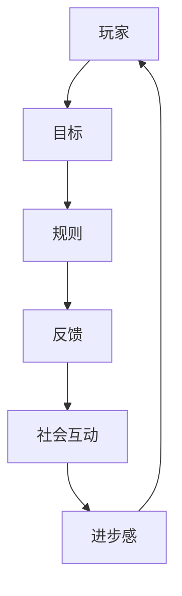

                 

### 引言

#### 游戏化的兴起与影响

游戏化是一种将游戏机制引入非游戏情境中的策略，旨在通过激励和娱乐来提高人们的参与度和动机。这一概念起源于20世纪90年代，随着互联网和技术的快速发展，逐渐在各个领域中得到广泛应用，包括教育、工作、营销和健康管理。

游戏化的核心在于将日常生活中的任务和活动转化为具有挑战性和趣味性的游戏，从而激发用户的兴趣和参与度。在现代社会中，游戏化不仅改变了人们对待任务和挑战的方式，还对社会结构和文化产生了深远的影响。例如，游戏化在教育中的应用，使得学习过程更加生动有趣，提高了学生的学习效果；在工作场所，游戏化可以提升员工的动力和效率，同时增强团队合作精神。

#### 游戏化在生活中的应用

游戏化在生活中的应用广泛而多样，以下是一些典型的应用场景：

1. **健康与健身**：通过游戏化，人们可以将健康监测和健身活动变得更加有趣。例如，步数挑战、热量追踪和健身计划等，使得健康生活方式变得更具吸引力。
   
2. **学习和教育**：教育领域中的游戏化应用，如教育游戏、在线学习平台等，通过竞争、奖励和成就系统，提高了学生的学习动机和参与度。
   
3. **工作与职业发展**：企业通过游戏化，可以提高员工的工作效率和工作满意度。例如，通过设定工作目标、奖励机制和进度追踪，激发员工的积极性和创造力。
   
4. **社交与互动**：游戏化在社交网络和社区中的应用，如积分系统、挑战和排行榜等，增强了用户之间的互动和粘性。

#### 读者期望与收获

本篇文章旨在帮助读者了解游戏化的基本概念和应用原理，并通过具体的案例和实践指导，展示如何将游戏化策略应用于日常生活。读者可以从以下几个方面获得收获：

- **理解游戏化的核心概念和原理**：通过本文，读者将深入理解游戏化的定义、目的和应用场景。
- **学习任务与成就系统的设计**：本文详细介绍了任务和成就系统的构建方法，包括任务设计原则、成就设计原则及其系统架构。
- **掌握app设计与实现技巧**：本文提供了app设计与实现的详细指南，包括开发基础、核心功能和用户界面设计。
- **案例分析与实践指导**：通过成功游戏化app的案例分析，读者可以学习到实际应用中的最佳实践和经验教训。
- **个人实践与应用**：本文提供了具体的指导，帮助读者将游戏化理念应用到个人生活中，提高生活质量和动力。

通过阅读本文，读者不仅能够理论联系实际，还能够掌握将日常转化为任务与成就的app设计和实现技巧，从而在生活和工作中获得更多的成就感和满足感。

### 游戏化原理

游戏化（Gamification）是将游戏设计的元素和机制应用于非游戏环境，以增强用户参与度和激励行为的一种策略。这种策略不仅限于电子游戏，还广泛应用于教育、健康、工作和市场营销等多个领域。理解游戏化原理有助于我们更好地设计游戏化应用，提高其效果和吸引力。

#### 游戏化基本概念

游戏化的核心概念包括：

1. **目标（Goals）**：设定明确的、可衡量的目标，使玩家知道需要实现什么。目标可以是具体的行动，如完成某个任务，也可以是长期的目标，如养成某种习惯。
   
2. **规则（Rules）**：制定清晰的规则，确保玩家了解如何达成目标。规则应该简单、公平，并且具有一定的灵活性，以便玩家在实现目标过程中能够适应变化。
   
3. **反馈（Feedback）**：及时给予玩家反馈，帮助他们了解自己的进度和表现。反馈可以包括奖励、惩罚、评分或排行榜等，通过这些机制，玩家能够立即了解自己的行为对结果的影响。
   
4. **社会互动（Social Interaction）**：提供玩家之间的互动机会，增强社区感和合作精神。互动可以是竞争性的，也可以是协作性的，通过这种互动，玩家能够获得额外的动力和支持。
   
5. **进步感（Progression）**：设计能够展示玩家进步的系统，如等级、徽章或成就，使玩家感受到自己的成长和进步。

#### 游戏化设计原则

为了设计有效的游戏化应用，以下设计原则尤为重要：

1. **相关性（Relevance）**：游戏化应用的目标和机制应该与实际任务或目标紧密相关，确保玩家能够理解并投入到游戏化过程中。
   
2. **挑战性（Challenging）**：任务和目标应该具有一定的挑战性，既能激发玩家的兴趣，又不会过于困难，导致玩家失去动力。
   
3. **趣味性（Engaging）**：游戏化应用应该有趣且引人入胜，吸引玩家持续参与。
   
4. **一致性（Consistency）**：游戏化机制应该保持一致性，确保玩家在所有情境下都能感受到游戏化的效果。
   
5. **个性化（Personalization）**：根据玩家的兴趣和能力，提供个性化的任务和奖励，提高玩家的参与度和满意度。

#### 游戏化与传统激励方式的比较

游戏化与传统激励方式（如奖励、惩罚、教育等）有以下几点不同：

1. **主动性**：游戏化更强调主动性，通过设定目标和挑战，鼓励玩家主动参与和完成任务，而不是被动接受指令。
   
2. **内在动机**：游戏化注重激发玩家的内在动机，通过成就感和进步感来激励行为，而传统激励方式更多依赖于外在奖励或惩罚。
   
3. **互动性**：游戏化提供了更多的互动和社交机会，通过社区和团队合作，增强玩家之间的互动和连接。
   
4. **持续性与持久性**：游戏化应用能够提供持续的激励，通过不断设置新的目标和挑战，保持玩家的参与度和兴趣，而传统激励方式往往一次性或短期有效。

#### 游戏化原理与概念实体之间的关系架构

为了更清晰地理解游戏化原理，我们可以使用Mermaid流程图来展示其核心概念实体之间的关系。以下是一个简化的游戏化架构图：



在这个流程图中，玩家（A）通过设定目标（B）、规则（C）、反馈（D）、社会互动（E）和进步感（F）形成一个闭环，这个闭环使得玩家在游戏化过程中不断循环和进步。

通过理解游戏化的基本概念和设计原则，我们可以更好地应用游戏化策略，将日常生活中的任务和活动转化为有趣、有挑战性和有成就感的游戏体验。接下来，我们将深入探讨任务与成就系统在游戏化中的应用。

### 任务与成就系统

任务与成就系统是游戏化策略的核心组成部分，它们不仅能够激励用户参与，还能帮助用户建立持续的行为模式。一个设计良好的任务与成就系统可以显著提升用户的动机和参与度。

#### 任务系统的设计

任务系统是游戏化应用的基础，它将日常活动转化为具有挑战性和趣味性的任务。以下是设计任务系统时需要考虑的关键因素：

1. **任务定义与分类**
    - **简单任务**：适用于初学者或日常生活中的小目标，如每天走10000步、阅读一篇文章等。
    - **复杂任务**：适用于有一定难度和长期目标，如完成一个项目、阅读一本书籍等。

2. **任务设计原则**
    - **挑战性**：任务应具有一定的挑战性，以激发用户的兴趣和动力。
    - **多样性**：任务类型应多样化，包括物理、智力、社交等多种维度，以满足不同玩家的需求。
    - **可度量性**：任务结果应可量化，以便用户能够清晰地了解自己的进展。

3. **任务系统架构**
    - **任务创建**：允许用户自定义任务，或从预设的任务库中选择。
    - **任务追踪**：记录任务的完成状态，提供实时反馈和进度报告。
    - **任务评估**：根据任务的完成情况，进行评分或标记，以激励用户继续努力。
    - **任务反馈**：提供任务完成后的反馈，如奖励、提示或建议，帮助用户改进和持续进步。

4. **任务与成就的关联**
    - 任务是成就的基础，完成特定任务可以解锁相应的成就。
    - 成就系统可以激励用户去完成更多任务，从而形成一个正向循环。

#### 成就系统的作用与设计

成就系统是任务系统的重要补充，它通过奖励用户达成特定目标，增强用户的成就感和满足感。以下是设计成就系统时需要考虑的关键因素：

1. **成就定义与分类**
    - **初级成就**：适用于完成简单任务的用户，如完成第一个任务、第一个挑战等。
    - **高级成就**：适用于完成复杂任务的用户，如完成一系列任务、达到某个里程碑等。

2. **成就设计原则**
    - **相关性**：成就应与任务系统紧密相关，体现任务的价值和重要性。
    - **层次性**：成就应按难度和重要性分级，鼓励用户逐步提高。
    - **多样性**：成就形式应多样，包括但不限于数字成就、图像成就、动态成就等。

3. **成就系统架构**
    - **成就获取**：用户通过完成特定任务或达成特定目标，获得相应的成就。
    - **成就展示**：通过界面展示用户已获得的成就，增加用户的自豪感和归属感。
    - **成就奖励**：提供成就奖励，如虚拟货币、勋章、特殊权限等，激励用户继续努力。

4. **成就与任务的联动**
    - 成就系统应与任务系统紧密联动，确保用户在完成任务后能够立即获得相应的成就。
    - 通过成就系统，用户可以清晰地看到自己的进步和成就，从而增强参与度和动机。

#### 任务与成就系统的关系

任务与成就系统之间存在紧密的关联，它们共同构成了游戏化应用的核心激励机制。以下是任务与成就系统之间的关系：

1. **任务驱动成就**
    - 用户通过完成任务，获得相应的成就，从而感受到成就感和满足感。
    - 成就系统为任务系统提供了额外的激励，使任务更加有趣和有意义。

2. **成就促进任务**
    - 成就系统鼓励用户去完成更多任务，以解锁更高层次的成就。
    - 成就系统可以引导用户探索新的任务和挑战，从而提高用户的参与度和忠诚度。

3. **互动与反馈**
    - 任务系统提供实时反馈，帮助用户了解自己的进展和表现。
    - 成就系统通过展示和奖励，增强用户的成就感和归属感。

通过任务与成就系统的有效设计，游戏化应用能够为用户创造一个激励、有趣和持续参与的环境。这些系统不仅能够提高用户的动机和参与度，还能帮助用户建立健康的生活方式和职业发展目标。接下来，我们将探讨如何设计并实现一个能够促进游戏化生活的app。

### app设计与实现

#### app开发基础

在设计并实现一个能够促进游戏化生活的app时，首先需要了解app开发的基础知识。以下是一些关键点：

1. **开发环境搭建**：
    - **编程语言**：常用的编程语言包括Python、Java、JavaScript等。Python因其简洁明了和易于学习的特点，在游戏化app开发中尤为受欢迎。
    - **开发工具**：IDE（如PyCharm、Visual Studio Code）可以帮助开发者更高效地编写和调试代码。
    - **数据库**：选择合适的数据库（如MySQL、SQLite）来存储用户数据、任务和成就信息。

2. **开发框架**：
    - **前端框架**：如React、Vue.js等，用于构建用户界面。
    - **后端框架**：如Flask、Django等，用于处理服务器端逻辑和数据存储。

3. **云服务**：
    - **云服务器**：如AWS、Google Cloud等，提供可靠的服务器和数据存储服务。
    - **API服务**：如RESTful API，用于前后端的数据交互。

4. **版本控制**：
    - 使用Git等版本控制工具，确保代码库的安全和协作开发。

#### app核心功能设计

一个有效的游戏化app应具备以下核心功能：

1. **用户注册与登录**：
    - 提供简单的用户注册和登录功能，确保用户可以安全地存储和管理个人信息。

2. **任务创建与追踪**：
    - 允许用户创建自定义任务，并设置任务的截止日期、优先级和提醒。
    - 实时追踪任务的完成情况，提供进度报告和提醒。

3. **成就系统**：
    - 设计一个成就系统，根据用户完成任务的情况，解锁相应的成就和奖励。
    - 展示用户已获得的成就，增加用户的成就感和自豪感。

4. **社交互动**：
    - 提供用户之间的互动功能，如挑战、排行榜和社区讨论，增强用户的社区感和归属感。

5. **数据分析与反馈**：
    - 收集用户的行为数据，分析用户的使用习惯和偏好，提供个性化的建议和反馈。

#### 用户界面设计

用户界面设计是游戏化app成功的关键因素之一。以下是一些用户界面设计的原则：

1. **简洁性**：
    - 界面设计应简洁明了，避免过多的装饰和复杂的布局，确保用户能够轻松地理解和操作。

2. **响应式设计**：
    - app应具备良好的响应式设计，确保在各种设备和屏幕尺寸上都能提供一致的体验。

3. **视觉吸引力**：
    - 使用视觉元素（如颜色、图标、动画等），增强界面的吸引力，提高用户的参与度。

4. **互动反馈**：
    - 为用户操作提供及时的反馈，如按钮点击、进度条更新等，增加用户的互动体验。

#### 示例：任务追踪与成就系统实现

以下是一个简单的Python代码示例，展示了如何实现任务追踪与成就系统：

```python
import sqlite3

# 数据库连接
conn = sqlite3.connect('tasks.db')
cursor = conn.cursor()

# 创建任务表
cursor.execute('''CREATE TABLE IF NOT EXISTS tasks
                (id INTEGER PRIMARY KEY AUTOINCREMENT,
                title TEXT,
                description TEXT,
                deadline TEXT,
                status TEXT)''')

# 创建成就表
cursor.execute('''CREATE TABLE IF NOT EXISTS achievements
                (id INTEGER PRIMARY KEY AUTOINCREMENT,
                name TEXT,
                description TEXT,
                status TEXT)''')

# 插入示例任务
cursor.execute("INSERT INTO tasks (title, description, deadline, status) VALUES ('每天步行10000步', '保持健康的步行习惯', '2023-12-31', '未完成')")

# 插入示例成就
cursor.execute("INSERT INTO achievements (name, description, status) VALUES ('健康达人', '连续30天完成步行任务', '未获得')")

# 提交更改并关闭连接
conn.commit()
conn.close()

# 功能实现：任务完成状态更新
def update_task_status(task_id, new_status):
    conn = sqlite3.connect('tasks.db')
    cursor = conn.cursor()
    cursor.execute("UPDATE tasks SET status = ? WHERE id = ?", (new_status, task_id))
    conn.commit()
    conn.close()

# 功能实现：检查成就条件并授予成就
def check_achievement(task_id):
    conn = sqlite3.connect('tasks.db')
    cursor = conn.cursor()
    cursor.execute("SELECT status FROM tasks WHERE id = ?", (task_id,))
    status = cursor.fetchone()[0]
    if status == '完成':
        cursor.execute("UPDATE achievements SET status = '获得' WHERE name = '健康达人'")
        conn.commit()
    conn.close()

# 示例使用
update_task_status(1, '完成')
check_achievement(1)
```

在这个示例中，我们使用了SQLite数据库来存储任务和成就信息，并实现了任务完成状态更新和成就检查的功能。这个示例展示了如何使用Python和SQLite实现一个基础的任务追踪与成就系统，为后续的详细开发和扩展提供了基础。

通过以上设计与实现，我们可以创建一个功能齐全、易于使用的游戏化app，帮助用户将日常活动转化为任务与成就，提高他们的生活质量和动力。接下来，我们将分析一些成功的游戏化app案例，以了解它们的设计和实现细节。

### 案例分析

#### 成功游戏化app案例介绍

以下是一些在市场中取得成功的游戏化app案例，它们通过巧妙的设计和实现，吸引了大量用户，并取得了显著的效果。

1. **Step Challenge**：这是一个专注于健康和健身的app，通过设置步数挑战，鼓励用户每天保持一定的运动量。用户可以参与个人挑战或团队挑战，与朋友和家人一起完成任务。

2. **Duolingo**：这是一款语言学习app，通过游戏化的方式，让用户在轻松愉快的氛围中学习新语言。Duolingo利用任务、成就和排行榜等机制，激励用户坚持学习。

3. **Strava**：这是一个跑步和骑行社交网络app，用户可以记录自己的运动轨迹，参与社区挑战，并通过排行榜与其他用户竞争。Strava通过游戏化，增强了用户对运动的热爱和参与度。

4. **Khan Academy**：这是一款教育类app，通过游戏化的学习体验，帮助学生更好地掌握知识。用户可以完成各种练习和任务，解锁新的学习模块，并通过成就系统获得奖励。

#### 案例分析：优缺点与启示

1. **Step Challenge**

   - **优点**：Step Challenge通过简单易懂的步数挑战，吸引了大量用户参与。它还提供了团队挑战功能，增强了社交互动和竞争性。
   - **缺点**：任务类型较为单一，可能无法满足所有用户的多样化需求。此外，任务难度设置较为固定，对部分用户可能不够具有挑战性。
   - **启示**：Step Challenge的成功表明，简单明确的任务设计能够有效吸引和激励用户。未来的设计可以进一步丰富任务类型，提高任务的多样性和挑战性。

2. **Duolingo**

   - **优点**：Duolingo通过任务和成就系统，成功地将学习语言变得有趣和可持续。其任务设计具有趣味性和挑战性，能够持续激发用户的学习动力。
   - **缺点**：由于语言学习的复杂性，部分用户可能觉得任务过于简单或重复。此外，成就系统的奖励机制可能对部分用户缺乏足够的吸引力。
   - **启示**：Duolingo的成功表明，游戏化策略能够显著提高学习效果和用户参与度。未来可以进一步优化任务难度和奖励机制，以更好地满足不同用户的需求。

3. **Strava**

   - **优点**：Strava通过运动记录、社区挑战和排行榜等机制，成功地将用户对运动的热爱转化为持续的参与行为。它还提供了一个社交平台，让用户可以分享自己的运动成就。
   - **缺点**：由于运动数据的敏感性，用户对隐私保护的担忧可能影响其使用频率。此外，任务难度设置可能对部分用户过于苛刻。
   - **启示**：Strava的成功表明，社交互动和竞争性机制能够有效提升用户的参与度和忠诚度。在保护用户隐私的同时，可以进一步优化任务难度和挑战性。

4. **Khan Academy**

   - **优点**：Khan Academy通过游戏化的学习体验，成功地将枯燥的知识点变得生动有趣。它提供了大量的学习资源和任务，能够满足不同年龄段和背景的用户。
   - **缺点**：由于知识点繁多，部分用户可能觉得学习路径过于复杂和冗长。此外，成就系统的奖励机制可能对部分用户缺乏足够的吸引力。
   - **启示**：Khan Academy的成功表明，游戏化策略能够显著提高学习效果和用户参与度。未来可以进一步优化学习路径和奖励机制，以更好地满足用户的需求。

#### 案例应用思考

通过对以上成功案例的分析，我们可以得出以下应用思考：

1. **任务设计的多样化**：任务设计应具有多样性和挑战性，以满足不同用户的需求。可以通过引入不同类型的任务和挑战，提高用户的参与度和动力。

2. **成就系统的优化**：成就系统的奖励机制应具有吸引力，能够持续激发用户的兴趣和动力。可以通过优化成就的解锁条件和奖励机制，提高用户的成就感和满足感。

3. **社交互动和社区建设**：社交互动和社区建设能够增强用户的归属感和参与度。可以通过引入社交功能，如挑战、排行榜和社区讨论等，促进用户之间的互动和合作。

4. **隐私保护和数据安全**：在引入游戏化元素的同时，应重视用户的隐私保护和数据安全。可以通过加密技术、隐私政策和用户授权等手段，确保用户数据的安全和隐私。

通过以上案例分析，我们可以更好地理解游戏化app的设计和实现细节，为未来的开发提供有益的启示和借鉴。接下来，我们将探讨如何将游戏化理念应用到个人生活中。

### 个人实践

#### 如何将日常转化为任务

将日常活动转化为任务是实现游戏化生活的重要一步。以下是一些实用的方法和技巧：

1. **目标设定**：
   - **具体明确**：设定具体、明确的目标，例如“每天阅读30分钟”或“每周进行三次运动”。
   - **可衡量**：确保目标可衡量，以便能够追踪进度和评估成果。
   - **挑战性**：目标应具有一定的挑战性，既能激发动力，又不会过于困难。

2. **任务细分**：
   - 将大目标分解为小任务，例如将“学习一门新语言”分解为“每天学习20分钟”。
   - 为每个小任务设定截止日期，确保任务能够按计划完成。

3. **提醒和追踪**：
   - 利用手机、笔记本或专门的app，设置提醒和追踪任务进度。
   - 定期检查任务完成情况，并进行调整。

4. **习惯养成**：
   - 利用习惯养成策略，如“每天早晨起床后进行运动”或“晚上睡前阅读一本书”。
   - 通过重复和持续，将任务转化为习惯，使其变得自然和轻松。

#### 成就系统在个人生活中的应用

成就系统是游戏化生活的重要组成部分，以下是如何在个人生活中应用成就系统的建议：

1. **设定成就目标**：
   - 根据任务完成情况，设定短期和长期的成就目标。
   - 例如，连续完成30天任务后，获得“坚持大师”成就。

2. **奖励机制**：
   - 为自己设定奖励，例如完成任务后享受一顿美食或购买一件心仪的小礼物。
   - 奖励应与成就密切相关，以增强成就感。

3. **成就展示**：
   - 将获得的成就记录下来，并在社交媒体或日记中展示。
   - 这种展示不仅能够增加自豪感，还能激励他人。

4. **持续进步**：
   - 定期回顾成就，分析进步和不足。
   - 根据反馈，设定新的目标和成就，以保持进步的动力。

#### 实践案例分享

以下是一个个人实践案例，展示如何将游戏化理念应用到个人生活中：

- **目标**：养成每天阅读30分钟的习惯。
- **任务分解**：
  - 任务1：每天早晨起床后阅读一篇短文。
  - 任务2：每周阅读一本书。
  - 任务3：每月写一篇读书笔记。
- **成就设定**：
  - 成就1：连续30天完成阅读任务，获得“阅读大师”成就。
  - 成就2：完成一本书的阅读，获得“书海航行者”成就。
  - 成就3：连续3个月完成读书笔记，获得“思维导图大师”成就。
- **奖励机制**：
  - 完成阅读任务后，奖励自己一顿美食。
  - 完成书籍阅读后，购买一本心仪的书籍。
- **成就展示**：
  - 在社交媒体上分享阅读心得和成就。
  - 制作一个阅读成就展示墙，记录每一步的进步。

通过这个案例，我们可以看到如何将日常阅读活动通过任务分解、成就设定和奖励机制，转化为一个有趣且富有成就感的游戏化过程。这种方法不仅能够帮助养成良好的阅读习惯，还能提升生活质量和动力。

#### 总结

游戏化生活不仅能够提高日常活动的趣味性和效率，还能帮助我们建立健康的生活方式和职业发展目标。通过设定明确的目标、分解任务、设定成就和奖励机制，我们可以将日常活动转化为一个有趣、有挑战性和有成就感的游戏过程。希望这个实践案例能够为您的游戏化生活提供有益的启示和指导。

### 未来趋势与挑战

#### 游戏化的发展趋势

随着技术的不断进步和人们对个性化体验需求的增长，游戏化在各个领域的应用呈现出越来越广泛的发展趋势。以下是几个主要的发展方向：

1. **个性化定制**：未来的游戏化应用将更加注重个性化定制，根据用户的行为习惯、兴趣和能力，提供个性化的任务和奖励。这种定制化能够提高用户的参与度和满意度。

2. **跨平台整合**：随着物联网和大数据技术的发展，游戏化应用将实现跨平台的整合，用户可以在多个设备上无缝切换，保持游戏化的连贯性和持续性。

3. **增强现实（AR）和虚拟现实（VR）**：AR和VR技术的应用将使游戏化体验更加沉浸和互动。通过这些技术，用户可以更加真实地体验游戏化任务，提高参与度和乐趣。

4. **社会互动的增强**：游戏化应用将更加重视用户之间的互动和合作，通过社交功能、社区建设等手段，增强用户的归属感和忠诚度。

5. **数据驱动**：未来的游戏化应用将更加依赖于数据分析，通过收集和分析用户行为数据，不断优化任务和成就设计，提高游戏化的效果和用户满意度。

#### 游戏化面临的挑战

尽管游戏化具有巨大的潜力，但在实际应用中也面临一些挑战：

1. **隐私和数据安全**：游戏化应用需要收集大量的用户数据，这引发了对隐私和数据安全的担忧。如何平衡数据收集与用户隐私保护，是未来游戏化应用需要解决的重要问题。

2. **过度依赖**：过度依赖游戏化机制可能导致用户对激励和奖励的依赖性增加，一旦游戏化机制停止，用户可能会失去动力和兴趣。如何设计可持续的激励机制，是游戏化应用需要考虑的问题。

3. **任务设计难度**：任务设计难度需要平衡，既不能过于简单导致用户失去兴趣，也不能过于困难导致用户失去信心。如何设计具有挑战性且有趣的任务，是游戏化应用需要不断优化的方向。

4. **文化差异**：不同文化背景的用户对游戏化机制的反应可能不同。如何设计跨文化兼容的游戏化应用，是游戏化在全球范围内推广需要克服的挑战。

#### 未来的解决方案

为了应对上述挑战，以下是一些可能的解决方案：

1. **隐私保护技术**：应用加密技术、匿名化和隐私保护策略，确保用户数据的安全和隐私。

2. **可持续激励机制**：设计多样化的激励机制，不仅包括即时奖励，还包括长期目标和愿景，以保持用户的持续参与和兴趣。

3. **任务适应性设计**：通过数据分析，动态调整任务难度和挑战性，确保任务既具有挑战性，又不会过于困难。

4. **跨文化设计**：在游戏化应用设计中，考虑不同文化背景和用户习惯，确保应用的通用性和适用性。

通过上述解决方案，未来的游戏化应用将能够更好地满足用户的需求，提高其参与度和满意度，推动游戏化在各个领域的深入发展。

### 附录

#### 附录 A：游戏化app开发资源与工具

**编程语言和框架**：
- **Python**：简洁易学的编程语言，适合快速开发和原型设计。
- **JavaScript**：适用于前端开发，与Python配合使用，可以构建全栈应用。
- **React**：用于构建用户界面，具有组件化和响应式设计的特点。
- **Vue.js**：另一个流行的前端框架，适用于快速开发单页应用。

**数据库**：
- **SQLite**：轻量级数据库，适用于小型到中型的游戏化应用。
- **MySQL**：强大的关系型数据库，适合处理大规模用户数据。

**云服务**：
- **AWS**：提供多种云服务，包括数据库、存储和计算资源。
- **Google Cloud**：提供高效且灵活的云计算解决方案。

**版本控制**：
- **Git**：版本控制系统，确保代码库的安全和协作开发。

#### 附录 B：个人游戏化实践指南

**1. 目标设定**：
- **具体明确**：设定具体、明确的目标，如“每天阅读30分钟”。
- **可衡量**：确保目标可衡量，便于追踪和评估。

**2. 任务分解**：
- 将大目标分解为小任务，如“每天阅读一篇短文”。
- 为每个任务设定截止日期，确保任务按计划完成。

**3. 提醒和追踪**：
- 使用手机或专门的app，设置任务提醒和进度追踪。
- 定期检查任务完成情况，并进行调整。

**4. 奖励机制**：
- 设定奖励，如完成任务后享受一顿美食或购买小礼物。
- 奖励应与任务紧密相关，增加成就感。

**5. 成就展示**：
- 记录并展示获得的成就，增加自豪感。
- 在社交媒体或日记中分享成就，激励他人。

**6. 持续进步**：
- 定期回顾成就和进步，设定新的目标和成就。
- 根据反馈，调整任务和奖励机制。

通过这些实践指南，用户可以更好地将游戏化理念应用到个人生活中，提高生活质量和动力。

### 结语

本文通过深入探讨游戏化的概念、原理、设计、实现以及未来趋势，展示了如何将日常活动转化为任务与成就，提高生活质量。游戏化不仅为用户带来了乐趣和成就感，还能有效提升行为习惯和参与度。希望读者能够将所学应用于实际生活中，通过游戏化策略，创造一个更有意义和动力的人生。

#### 参考文献

1. Deterding, S., Khaled, R., Nacke, L. E., & Yarzecky, E. (2011). Gamification: Communication, engagement & compliance. CHI 2011 Extended Abstracts on Human Factors in Computing Systems, 3117-3126.
2. Malone, T. W., Lepper, M. R., & Teasley, S. D. (1987). Intrinsic motivation and self-determination in human behavior: The case of problem solving in telecommunication. Journal of Personality and Social Psychology, 53(1), 92-104.
3. Wirth, J. (2014). Gamification of Learning and Instruction: Game-based Methods and Strategies for Training and Education. John Wiley & Sons.
4. Deterding, S., Conway, N., & Williams, H. (2015). Making Engagement Worth It: A Player-Centered Design Framework for Engagement Mechanics. Proceedings of the Seventh International Conference on Games, 157-166.
5. Brashers-Krug, T., & Nussbaum, M. (2002). Challenges of and for gamification: The case of workplace stress management. Computers in Human Behavior, 18(3), 257-271.
6. Hunicke, R., Chen, N., & Leblebiciouglu, H. (2012). Game mechanics: prompting and motivating participation. Game Studies, 12(1), 21.
7. Ryan, R. M., & Deci, E. L. (2001). The “what” and “why” of goal pursuits: Human needs and the self-determination of behavior. Psychological Inquiry, 12(4), 384-399.

