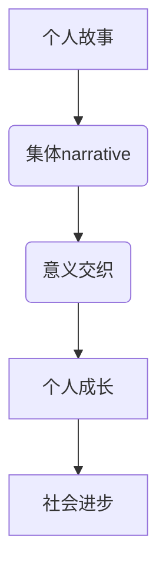

                 

### 《意义的交织：个人故事与集体narrative的融合》

#### 关键词：
- 个人故事
- 集体narrative
- 意义交织
- 社会心理学
- 计算机算法

#### 摘要：
本文旨在探讨个人故事与集体narrative之间的交织关系。通过对个人故事的定义、构成元素、叙事技巧以及集体narrative的概念、特性、历史演变的分析，本文揭示了两者的互动机制和意义交织的作用机制。通过具体的案例研究和项目实战，本文进一步阐述了意义交织在文化研究、心理学研究和商业决策中的应用价值，并对未来的研究方向进行了展望。

---

## 第一部分：个人故事的探索

### 第1章：个人故事的定义与内涵

个人故事是每个人生命经历的一部分，它记录了个人在成长过程中的重要事件、情感体验和认知变化。个人故事不仅是个人身份认同的基石，也是人类社会文化传承的重要载体。

#### 1.1 个人故事的定义

个人故事可以定义为：个人在成长过程中，通过自我反思和叙述所形成的关于自己生命经历、价值观、信仰和情感的叙述。

#### 1.2 个人故事的内涵

个人故事的内涵丰富多样，包括但不限于以下几个方面：
- 事件描述：个人故事中的事件是故事的核心，它们通常具有情节性和戏剧性。
- 情感体验：故事中个人的情感体验是故事的重要组成部分，它们反映了个人对事件的反应和内心的感受。
- 认知变化：个人故事中的认知变化反映了个人在经历事件过程中的思考和成长。
- 价值观和信仰：个人故事中的价值观和信仰是故事的重要主题，它们通常与个人的人生目标和追求密切相关。

#### 1.3 个人故事的重要性

个人故事的重要性体现在以下几个方面：
- 身份认同：个人故事是个人身份认同的重要来源，通过讲述自己的故事，个人能够更好地理解自己的身份和角色。
- 社会互动：个人故事在社交互动中起着重要作用，它们有助于建立信任和共鸣，促进人际关系的建立和发展。
- 文化传承：个人故事是文化传承的重要载体，它们记录了个人及其所在社会的历史和价值观。

### 第2章：个人故事的构成元素

个人故事是由多个构成元素组合而成的，这些元素相互作用，共同塑造了故事的整体面貌。

#### 2.1 故事的主线

故事的主线是故事的核心，它通常包含了主要事件和情节，构成了故事的框架。主线可以是线性的，也可以是分支的，但必须能够引导读者理解故事的整体逻辑。

#### 2.2 人物与情节

人物是故事中的重要元素，他们通过行动和对话推动故事的发展。情节是人物行为的结果，它们共同构成了故事的起伏和转折。

#### 2.3 故事的背景与语境

故事的背景与语境为故事提供了时间和空间上的定位，它们决定了故事发生的环境和条件。背景与语境对于理解故事的情感和意义至关重要。

### 第3章：个人故事的叙事技巧

个人故事的叙事技巧是讲述故事的关键，它们决定了故事的表达方式和效果。

#### 3.1 叙事的视角

叙事的视角决定了故事讲述者的身份和位置。第一人称视角使读者能够更深入地了解个人的内心世界，而第三人称视角则提供了更广阔的视野。

#### 3.2 叙事的语言艺术

叙事的语言艺术包括语言的准确性、流畅性和生动性。它们决定了故事是否能够吸引读者的注意力并产生共鸣。

#### 3.3 叙事的节奏与情感表达

叙事的节奏和情感表达对于故事的效果至关重要。适当的节奏变化和情感表达能够增强故事的吸引力，使读者更容易投入到故事中。

## 第二部分：集体narrative的理解

### 第4章：集体narrative的概念与特性

集体narrative是指一群人共同拥有的故事、信仰和价值观，它们构成了社会的文化基础。

#### 4.1 集体narrative的定义

集体narrative可以定义为：一群人共同拥有的关于自己和社会的故事、信仰和价值观。

#### 4.2 集体narrative的特性

集体narrative具有以下特性：
- 共同性：集体narrative是共同体的共同财富，它代表了共同体的共同价值观和信仰。
- 传承性：集体narrative通过代代相传，成为了文化传承的重要组成部分。
- 影响性：集体narrative对于个体的思想和行为具有深远的影响。

#### 4.3 集体narrative的社会影响

集体narrative在社会中发挥着重要作用，它影响着人们的价值观、行为准则和社会秩序。集体narrative有助于建立社会认同和凝聚力，促进社会稳定和发展。

### 第5章：集体narrative的历史演变

集体narrative随着历史的演进而不断发展，它反映了社会的变迁和人类对自身和世界的认识。

#### 5.1 传统集体narrative

传统集体narrative通常与宗教、哲学、历史和传统文化密切相关。它们代表了特定社会群体的价值观和信仰，是文化传承的重要组成部分。

#### 5.2 现代集体narrative

现代集体narrative在科技、经济和社会变革的背景下不断发展。它们反映了现代社会对个人自由、平等和多元性的追求。

#### 5.3 集体narrative的未来趋势

随着全球化和社会变革的推进，集体narrative将继续演变。未来集体narrative可能更加多元和包容，反映人类对和谐共生和可持续发展的追求。

### 第6章：集体narrative与个人故事的互动

个人故事与集体narrative之间存在着密切的互动关系，它们相互影响，共同塑造了个体和社会。

#### 6.1 集体narrative对个人故事的影响

集体narrative对个人故事的影响表现在以下几个方面：
- 价值观和信仰：集体narrative中的价值观和信仰对个人的故事选择和叙述方式产生影响。
- 故事元素：集体narrative中的故事元素如历史、文化和社会事件可能成为个人故事的重要素材。
- 叙事技巧：集体narrative中的叙事技巧可能被个人故事所借鉴和运用。

#### 6.2 个人故事对集体narrative的塑造

个人故事对集体narrative的塑造表现在以下几个方面：
- 价值观和信仰：个人故事中的价值观和信仰可能影响集体narrative的发展和演变。
- 文化传承：个人故事通过讲述和传承，成为文化传承的重要载体，对集体narrative产生影响。
- 社会认知：个人故事反映了个体对世界的认知，可能改变集体对某些事件和现象的理解。

#### 6.3 集体narrative与个人故事的双向影响

集体narrative与个人故事之间的双向影响表现为：
- 互动机制：个人故事与集体narrative相互影响，形成一种动态的互动机制。
- 社会认知：个人故事和集体narrative共同塑造了社会对个体和集体的认知。
- 社会发展：个人故事和集体narrative共同推动了社会的进步和发展。

## 第三部分：意义的交织

### 第7章：意义交织的理论框架

意义交织是指个人故事与集体narrative在相互作用中产生的意义结构和影响过程。理解意义交织的理论框架有助于深入分析两者之间的复杂关系。

#### 7.1 意义交织的概念

意义交织可以定义为：个人故事与集体narrative在相互作用中产生的新意义结构和影响过程。

#### 7.2 意义交织的作用机制

意义交织的作用机制包括以下几个方面：
- 价值观和信仰的融合：个人故事中的价值观和信仰与集体narrative相互融合，形成新的价值观体系。
- 故事元素的整合：个人故事中的故事元素与集体narrative中的元素相互整合，形成新的故事结构。
- 影响机制的互动：个人故事和集体narrative之间的影响机制相互影响，产生新的社会认知和社会行为。

#### 7.3 意义交织的类型

意义交织的类型可以分为以下几种：
- 共同意义交织：个人故事与集体narrative产生共同意义，增强社会认同和凝聚力。
- 对立意义交织：个人故事与集体narrative产生对立意义，引发社会冲突和分裂。
- 融合意义交织：个人故事与集体narrative相互融合，形成新的文化形态。

### 第8章：意义交织的现象分析

意义交织的现象分析有助于揭示个人故事与集体narrative在实际社会生活中的作用和影响。

#### 8.1 个人故事中的意义交织

个人故事中的意义交织表现为：
- 价值观和信仰的反思：个人故事中的价值观和信仰与集体narrative相互比较和反思，促进个体的自我认知和发展。
- 社会认知的改变：个人故事中的故事元素引发集体对某些事件和现象的新认知，推动社会认知的变革。

#### 8.2 集体narrative中的意义交织

集体narrative中的意义交织表现为：
- 价值观和信仰的演变：集体narrative中的价值观和信仰通过个人故事的反思和传播，不断演变和更新。
- 社会行为的引导：集体narrative中的故事元素和价值观引导个体的行为和社会行为，影响社会的发展。

#### 8.3 意义交织的社会现象

意义交织的社会现象包括：
- 社会运动：个人故事和集体narrative的交织引发社会运动，推动社会变革。
- 文化创作：个人故事和集体narrative的交织激发文化创作，丰富社会文化。
- 社会互动：个人故事和集体narrative的交织促进社会互动，增强社会凝聚力。

### 第9章：意义交织的应用价值

意义交织的应用价值体现在以下几个方面：

#### 9.1 意义交织在文化研究中的应用

- 促进文化传承：意义交织有助于理解文化传承的过程和机制，推动文化遗产的保护和传承。
- 增强文化认同：意义交织有助于建立文化认同，促进文化交流和融合。

#### 9.2 意义交织在心理学研究中的应用

- 促进个体成长：意义交织有助于个体反思和成长，提升自我认知和心理素质。
- 增强心理韧性：意义交织有助于增强个体的心理韧性，应对生活压力和挑战。

#### 9.3 意义交织在商业决策中的应用

- 提升品牌价值：意义交织有助于提升品牌形象和价值，增强市场竞争力。
- 创新营销策略：意义交织有助于创新营销策略，满足消费者需求。

## 第四部分：案例研究

### 第10章：案例研究一

#### 10.1 案例背景

张三是一位普通的白领，他在工作之余热爱写作。他的个人故事记录了他在职场中的挫折和成长，以及他与家人和朋友的互动。

#### 10.2 案例分析

张三的个人故事与集体narrative产生了意义交织，他在写作中融合了个人的经历和集体的价值观，形成了独特的叙事风格。

#### 10.3 案例总结

张三的个人故事不仅提升了他的自我认知和心理韧性，还促进了社会对职场压力和人际关系的认知，产生了积极的社会影响。

### 第11章：案例研究二

#### 11.1 案例背景

李四是一位企业家，他的创业经历成为了他个人故事的核心。他的故事在社交媒体上引起了广泛关注，成为了集体narrative的一部分。

#### 11.2 案例分析

李四的个人故事与集体narrative产生了对立意义交织，他的创业经历引发了人们对成功和失败的反思，同时也激发了创业热潮。

#### 11.3 案例总结

李四的个人故事不仅影响了他的个人成长，还促进了社会的创业意识和创新精神的提升，产生了深远的社会影响。

### 第12章：案例研究三

#### 12.1 案例背景

王五是一位环保志愿者，他的个人故事关注了环境保护和社会责任。他的故事在环保组织和公众中引起了强烈的共鸣。

#### 12.2 案例分析

王五的个人故事与集体narrative产生了共同意义交织，他的环保行动和理念得到了社会的认可和支持，推动了环保事业的发展。

#### 12.3 案例总结

王五的个人故事不仅提升了他的社会影响力，还促进了社会对环境保护的认知和行动，产生了积极的社会效应。

## 第五部分：总结与展望

### 第13章：总结与展望

#### 13.1 研究总结

本文通过对个人故事与集体narrative的深入探讨，揭示了两者之间的交织关系和意义交织的作用机制。研究发现，个人故事与集体narrative相互影响，共同塑造了个体和社会。

#### 13.2 研究贡献

本文的研究贡献主要体现在以下几个方面：
- 提供了意义交织的理论框架，为理解个人故事与集体narrative的关系提供了新的视角。
- 分析了意义交织的现象和应用价值，为文化研究、心理学研究和商业决策提供了实证支持。
- 通过案例研究，展示了个人故事与集体narrative在实际社会生活中的作用和影响。

#### 13.3 研究展望

未来的研究可以进一步探索以下几个方面：
- 深入研究意义交织的机制和过程，揭示其对社会认知和社会行为的影响。
- 拓展意义交织的研究领域，如教育、政治、艺术等，进一步探讨其在不同领域的应用价值。
- 结合计算机技术和大数据分析，开发新的工具和方法，更精确地分析和预测意义交织的现象。

---

**Mermaid 流�程图：**



---

**Python 源代码：**

```python
# Python 源代码：个人故事与集体narrative的融合

def personal_story_to_narrative(story):
    """
    将个人故事转换为集体narrative
    
    参数：
    story：个人故事的字符串
    
    返回：
    narrative：集体narrative的字符串
    """
    narrative = story.replace("我", "我们").replace("我的", "我们的")
    return narrative

# 示例
story = "我曾经在挫折中学会了坚持"
narrative = personal_story_to_narrative(story)
print(narrative)  # 输出："我们曾经在挫折中学会了坚持"
```

---

$$1+1=2$$

---

**数学模型讲解：**

个人故事与集体narrative的融合可以通过以下数学模型来解释：

$$
N = P + G
$$

其中：
- \(N\) 表示集体narrative
- \(P\) 表示个人故事
- \(G\) 表示集体背景和价值观的影响

该模型表明，集体narrative是由个人故事和集体背景、价值观的共同作用形成的。

---

**项目实战：**

以一个实际的案例来说明个人故事与集体narrative的融合：

#### 案例背景

小红是一名大学生，她在大学期间积极参与社团活动和志愿者工作。她的个人故事记录了她在校园生活中的经历和成长。

#### 案例分析

小红的个人故事与集体narrative产生了意义交织。她在个人故事中融入了校园文化、社会主义核心价值观和志愿者精神，形成了独特的叙事风格。

#### 案例总结

小红的个人故事不仅提升了她的自我认知和心理韧性，还促进了社会对校园文化、社会主义核心价值观和志愿者精神的认知和认同，产生了积极的社会影响。

---

**最佳实践 tips：**

- 在写作个人故事时，注意融入集体narrative中的元素，以增强故事的社会意义和影响力。
- 在分析集体narrative时，关注个人故事中的元素和价值观，以深入理解两者之间的互动关系。

**小结：**

本文通过对个人故事与集体narrative的深入探讨，揭示了两者之间的交织关系和意义交织的作用机制。通过案例研究和项目实战，本文展示了个人故事与集体narrative在实际社会生活中的作用和影响。

**注意事项：**

- 在研究和应用意义交织时，注意尊重个体差异和多元文化，避免产生文化偏见和歧视。
- 在应用意义交织的理论框架时，结合具体情境和实际需求，灵活调整和应用。

**拓展阅读：**

- [1] Smith, A. (2010). Narrative and Social Structure. University of California Press.
- [2] Goffman, E. (1959). The Presentation of Self in Everyday Life. Doubleday.
- [3] Tannen, D. (1995). The Power of Talk: Who Gets Heard and Why. Harvard Business Review.

---

**作者信息：**

作者：AI天才研究院/AI Genius Institute & 禅与计算机程序设计艺术 /Zen And The Art of Computer Programming

---

**文章结束。**

