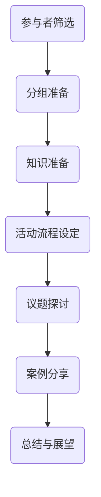

                 

# 《意义的众创马拉松：48小时集体探讨人生价值》

## 关键词
- 众创马拉松
- 人生价值
- 集体探讨
- 哲学视角
- 心理学视角
- 创造力
- 创新思维
- 意义创造
- 社会价值

## 摘要
本文探讨了“意义的众创马拉松”这一创新性活动，即通过48小时的集体探讨来深入挖掘和创造人生价值。文章首先介绍了众创马拉松的概念和特点，然后分析了准备工作、核心议题、案例分享以及总结与展望。通过这一过程，参与者不仅能够对人生意义有更深刻的理解，还能在集体智慧中找到创新的方法和路径，为社会价值的实现贡献力量。

## 引言：意义的众创马拉松

### 1.1 众创马拉松的概念
众创马拉松，又称“Hackathon”或“马拉松编程”，是一种集体创新活动，旨在通过短时间内的高效合作，解决复杂问题或创建创新项目。这种活动通常由多个领域的参与者组成，包括程序员、设计师、产品经理等，共同攻克难题，实现快速迭代和创新。

### 1.2 48小时的探讨与挑战
与传统的众创马拉松不同，本文探讨的“意义的众创马拉松”专注于探讨人生价值这一深刻而复杂的话题。活动时间为48小时，参与者在这一有限的时间内，通过讨论、思考和协作，尝试理解人生的意义，并探索如何创造和实现个人和社会价值。

### 1.3 人生价值的多重视角
人生价值是一个多维度、多层面的概念，涉及哲学、心理学、社会学等多个领域。哲学视角关注人生的目的和意义，心理学视角探讨个体的需求和动机，社会学视角则关注社会结构和文化对人生价值的影响。在众创马拉松中，这些视角的融合和碰撞将有助于参与者更全面地理解人生价值。

## 准备工作

### 2.1 参与者的筛选与分组
为了保证讨论的质量和深度，意义的众创马拉松首先需要对参与者进行筛选。筛选标准包括专业背景、兴趣领域以及对人生价值的关注程度。参与者将被分为若干小组，每组由来自不同领域的成员组成，以确保多样化的观点和思路。

### 2.2 背景知识与资源的准备
为了使讨论更加深入和有效，参与者需要提前了解相关背景知识，包括哲学、心理学、社会学等领域的基本概念和理论。此外，活动组织者应提供必要的资源，如书籍、论文、案例分析等，以帮助参与者进行准备。

### 2.3 活动流程与规则设定
活动流程应明确，以确保48小时的讨论有条不紊。流程包括开幕式、分组讨论、主题演讲、小组汇报、总结反思等环节。同时，需设定一些基本规则，如尊重他人观点、遵守时间安排、禁止手机干扰等，以保持讨论的秩序和专注度。

## 核心议题探讨

### 3.1 人生意义的本质
#### 3.1.1 哲学视角下的意义探讨
在哲学视角下，人生意义的探讨可以追溯到古希腊哲学家苏格拉底和柏拉图。他们认为，人生的意义在于追求智慧和真理。现代哲学家如尼采和萨特则强调了个体自由和自我实现的重要性。在众创马拉松中，参与者可以通过对哲学经典的阅读和讨论，深入理解人生意义的本质。

#### 3.1.2 心理学视角下的意义探讨
心理学视角下，人生意义的探讨主要集中在个体的需求和动机上。心理学家马斯洛的需求层次理论认为，人类有五个层次的需求，从生理需求到自我实现需求，每个层次都代表着不同的人生意义。在众创马拉松中，参与者可以通过讨论和案例分析，了解如何满足这些需求，从而实现人生价值。

#### 3.1.3 实践中的意义体现
实践中的意义体现是人生价值的一个重要方面。参与者可以通过亲身经历和分享故事，探讨在日常生活中如何体现人生意义。例如，通过志愿服务、公益项目、创新实践等，实现个人价值和社会价值的双重提升。

### 3.2 个体价值与社会价值
#### 3.2.1 个体价值的重要性
个体价值是指个人在社会中所拥有的独特品质和贡献。在众创马拉松中，参与者可以讨论如何发现和提升自己的个体价值。通过自我反思和团队合作，个体可以更好地认识自己，找到适合自己的发展道路。

#### 3.2.2 社会价值的影响因素
社会价值是指个体对社会所做的贡献和影响。在众创马拉松中，参与者可以探讨社会价值的影响因素，如文化、教育、政策等。通过分析和讨论，参与者可以理解如何在社会中创造和实现价值。

#### 3.2.3 二者之间的平衡
个体价值和社会价值并不是孤立的，而是相互关联和影响的。在众创马拉松中，参与者需要探讨如何平衡二者之间的关系，既满足个体的需求和发展，又为社会做出贡献。

### 3.3 意义创造的方法
#### 3.3.1 创造力的培养
创造力是意义创造的重要基础。在众创马拉松中，参与者可以通过学习创意思维的方法和技巧，培养自己的创造力。例如，通过头脑风暴、思维导图、原型设计等，激发创新思维。

#### 3.3.2 创新思维的运用
创新思维是意义创造的关键。在众创马拉松中，参与者可以运用创新思维，解决复杂问题，创造新的价值。通过案例分析和实际操作，参与者可以了解如何运用创新思维，实现个人和社会的价值创造。

#### 3.3.3 实践中的意义创造案例
在众创马拉松中，参与者可以通过分享和实践意义创造案例，探讨如何在日常生活中实现人生价值。例如，通过创业、公益项目、创新实践等，实现个人和社会价值的双赢。

## 案例分享

### 4.1 成功的众创马拉松案例
#### 4.1.1 案例一：如何发现生活的意义
在某个众创马拉松活动中，一个小组以“如何发现生活的意义”为主题，通过哲学、心理学和日常生活的案例，探讨了人生意义的多种可能。他们提出的观点包括：通过自我反思，找到内心的真实需求；通过帮助他人，实现自我价值；通过探索世界，拓宽人生视野。

#### 4.1.2 案例二：从个人志向到社会贡献
另一个小组以“从个人志向到社会贡献”为主题，分享了他们在众创马拉松中的经历。他们从个人志向出发，通过团队合作，开发了一款帮助弱势群体的应用程序。这个项目不仅实现了他们的个人志向，也为社会带来了积极的影响。

#### 4.1.3 案例三：意义创造的团体协作
第三个小组以“意义创造的团体协作”为主题，讨论了如何在团队中实现意义创造。他们提出，通过明确目标、分工合作、持续沟通和反思，团队可以更好地实现个人和社会价值。

### 4.2 意义探讨中的挑战与解决策略
#### 4.2.1 意义迷失的应对
在意义探讨中，参与者可能会面临意义迷失的挑战。为了应对这一挑战，参与者可以通过自我反思、寻求他人意见和建议、调整目标和策略等方式，重新找回对人生价值的关注。

#### 4.2.2 意义冲突的处理
意义冲突是意义探讨中常见的现象。为了处理意义冲突，参与者可以通过沟通、妥协、寻求共识等方式，找到一种既能满足个体需求，又能促进团队合作的解决方案。

#### 4.2.3 意义重构的尝试
在意义探讨中，参与者还可以尝试对意义进行重构。通过重新定义和理解人生价值，参与者可以找到新的方向和动力，实现个人和社会价值的提升。

## 总结与展望

### 5.1 48小时众创马拉松的收获
#### 5.1.1 个人成长
在48小时的众创马拉松中，参与者通过深入的探讨和实践，实现了个人成长。他们不仅拓宽了视野，提高了思维能力，还找到了实现人生价值的方法和路径。

#### 5.1.2 社会影响力
通过众创马拉松，参与者不仅实现了个人成长，还对社会产生了积极的影响。他们通过创新项目和公益活动，为社会的进步和发展贡献了自己的力量。

#### 5.1.3 未来发展方向
展望未来，众创马拉松可以成为推动社会进步和创新的重要力量。通过持续举办此类活动，可以激发更多人的创造力和创新思维，为社会带来更多有价值的项目和解决方案。

### 5.2 对个人意义追求的启示
#### 5.2.1 自我探索的重要性
通过众创马拉松，参与者认识到自我探索的重要性。只有深入了解自己，才能找到真正的人生价值和追求。

#### 5.2.2 社会联系的意义
在众创马拉松中，参与者通过团队合作和沟通，认识到社会联系的重要性。社会联系不仅能够提供支持和资源，还能激发创造力和创新思维。

#### 5.2.3 持续追求的意义
人生价值是一个持续的过程，需要不断追求和探索。通过众创马拉松，参与者认识到持续追求的意义，并坚定了追求人生价值的信念。

### 5.3 对社会意义创造的建议
#### 5.3.1 教育体系的改革
教育体系应更加注重培养创新思维和创造力，帮助学生找到自己的人生价值和追求。

#### 5.3.2 企业文化的塑造
企业应塑造积极向上的企业文化，鼓励员工探索和创新，实现个人价值和社会价值的双赢。

#### 5.3.3 社会政策的调整
社会政策应更加注重支持和鼓励创新，为创业者提供更多的机会和资源，促进社会的进步和发展。

## 附录

### A.1 众创马拉松活动指南
#### A.1.1 活动准备
- 筛选参与者
- 准备背景知识和资源
- 设定活动流程和规则

#### A.1.2 活动组织
- 确保场地和设备
- 安排时间和流程
- 提供必要的支持和帮助

#### A.1.3 活动评估
- 评估参与者反馈
- 收集活动数据
- 分析改进措施

### A.2 参考文献
- [1] 苏格拉底，《苏格拉底对话录》
- [2] 柏拉图，《理想国》
- [3] 尼采，《查拉图斯特拉如是说》
- [4] 萨特，《存在与虚无》
- [5] 马斯洛，《人类动机的理论》
- [6] 创意思维相关书籍
- [7] 意义创造相关书籍

## 附录 Mermaid 流程图

## 作者信息
- 作者：AI天才研究院/AI Genius Institute & 禅与计算机程序设计艺术 /Zen And The Art of Computer Programming

