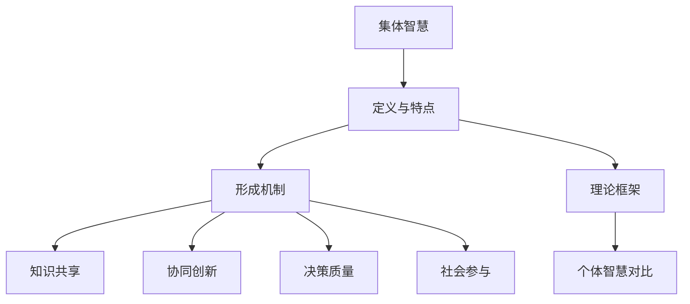
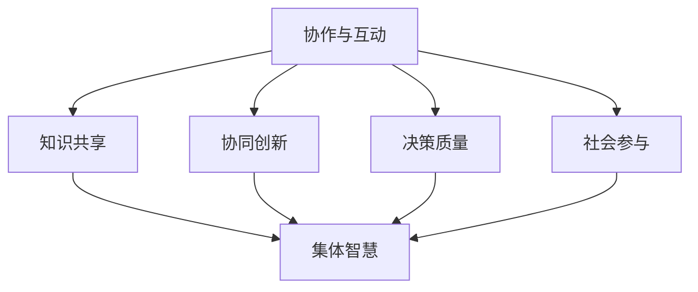

                 

### 1.1 书籍背景与目标

《意义的众筹：集体智慧时代的价值共创》是在集体智慧与众筹领域不断演变和发展的背景下应运而生的一部力作。随着互联网技术的飞速发展，信息传播的速度和范围大大扩展，人们开始意识到集体智慧的力量。众筹作为一种新兴的融资模式，不仅改变了传统的商业模式，也为个体和创业团队提供了新的机会。因此，这本书旨在探讨集体智慧在众筹中的重要性，以及如何通过众筹实现价值共创。

#### 1.1.1 《意义的众筹：集体智慧时代的价值共创》的出版背景

本书的出版背景可以从以下几个方面来理解：

1. **科技发展**：随着大数据、人工智能、区块链等技术的广泛应用，个体之间的连接和互动变得更加紧密。这些技术不仅改变了人们的日常生活，也为集体智慧的形成提供了强有力的支持。
2. **经济变革**：经济全球化和互联网经济的兴起，使得传统商业模式受到了巨大冲击。众筹作为一种新型的商业模式，不仅为创业者提供了融资渠道，也为消费者带来了全新的参与方式。
3. **社会需求**：在现代社会中，人们越来越重视个性化、参与感和价值共创。众筹平台为用户提供了表达自己需求、参与项目开发和分享成果的机会，满足了人们对参与感和价值共创的需求。

#### 1.1.2 书籍的目标与期望成果

本书的主要目标有以下几点：

1. **普及知识**：通过深入浅出的讲解，让读者了解集体智慧的概念、特点和理论基础，以及众筹平台的基本运作机制。
2. **案例分享**：通过案例分析，展示集体智慧和众筹在实际项目中的应用，让读者能够直观地感受到它们的价值。
3. **启发思考**：通过探讨集体智慧与创业创新、企业发展、可持续发展等领域的结合，启发读者对未来的思考。
4. **指导实践**：为创业者、企业管理者和其他有兴趣的读者提供实际操作指南，帮助他们利用集体智慧和众筹平台实现价值共创。

期望成果包括：

1. **提升认知**：让读者对集体智慧和众筹有更深入的理解，认识到它们在现代社会中的重要性。
2. **激发创新**：通过案例分析，激发读者的创新思维，鼓励他们尝试利用集体智慧和众筹平台解决实际问题。
3. **推动实践**：为读者提供实际操作指南，帮助他们将理论付诸实践，实现个人价值和社会价值的共同提升。

### 1.2 集体智慧的概念与价值

#### 1.2.1 集体智慧的定义

集体智慧（Collective Intelligence）是指由多个个体通过协作和互动，共同产生、共享和利用知识、技能和信息的过程。它强调个体之间的协作、信息共享和协同创新，以实现共同的目标和价值。集体智慧不仅仅是简单的个体能力的叠加，更是一种通过协作和互动实现整体性能提升的现象。

#### 1.2.2 集体智慧的核心价值

集体智慧具有以下几个核心价值：

1. **知识共享**：集体智慧通过个体之间的信息共享，实现知识的积累和传播。这种共享机制能够加快知识的更新速度，提高整体知识的深度和广度。
2. **协同创新**：集体智慧鼓励个体之间的互动和协作，通过集体讨论、合作和创意碰撞，激发创新思维，产生突破性的解决方案。
3. **提高决策质量**：集体智慧能够通过多方面的信息和观点，帮助个体做出更全面、更准确的决策。这种多元化的视角有助于减少偏见和错误，提高决策的科学性和可靠性。
4. **社会参与**：集体智慧为人们提供了参与社会事务和解决问题的平台，增强了人们的参与感和责任感，促进了社会的和谐发展。

#### 1.2.3 集体智慧与传统智慧的对比

传统智慧通常是指个体智慧，即个体通过自身的知识、经验和能力来解决问题。传统智慧具有以下特点：

1. **独立性**：个体智慧强调个体的独立思考和判断，个体通常自主决策，不受其他个体的影响。
2. **局限性**：个体智慧受到个体知识、经验和能力的限制，难以全面、准确地把握问题的各个方面。
3. **效率问题**：在复杂问题面前，个体智慧往往需要较长时间来分析和决策，效率较低。

相比之下，集体智慧具有以下优势：

1. **合作性**：集体智慧强调个体之间的协作和互动，通过集体的力量来解决复杂问题。
2. **全面性**：集体智慧能够整合多个个体的知识和经验，更全面地了解问题的各个方面。
3. **效率提升**：通过集体智慧和协作，问题解决的过程可以大大缩短，效率显著提高。

然而，集体智慧并非没有局限性。它需要个体之间的有效沟通和协调，否则可能会导致信息过载和协调困难。此外，集体智慧的成功也依赖于个体之间的信任和共同目标。

### 1.3 众筹的历史与演变

#### 1.3.1 众筹的起源与发展

众筹（Crowdfunding）是指通过互联网平台，向公众筹集资金以支持某个项目或创业理念。众筹的起源可以追溯到18世纪末19世纪初的英国，当时一些艺术家和作家通过向社会公众发行债券或股票来筹集资金。这种模式被称为“公众筹资”（Public Funding）。

随着互联网的普及，众筹逐渐从线下转移到线上。2000年代初期，Kickstarter等众筹平台的诞生标志着现代众筹时代的到来。Kickstarter为创业者提供了一个展示项目、吸引投资者的平台，极大地简化了筹资过程。

#### 1.3.2 众筹的几种形式

众筹可以分为以下几种形式：

1. **奖励众筹**：投资者通过购买项目相关的产品或服务来支持项目，众筹成功后，项目方会按照约定向投资者回报相应的奖励。
2. **股权众筹**：投资者通过购买项目方的股权来支持项目，众筹成功后，投资者成为项目方的股东，共享项目的收益。
3. **债务众筹**：投资者通过购买项目方的债务工具（如债券或票据）来支持项目，众筹成功后，项目方会按照约定向投资者支付利息和本金。
4. **慈善众筹**：投资者通过捐款来支持慈善项目，众筹成功后，项目方会将捐款用于指定的慈善事业。

#### 1.3.3 众筹对经济和社会的影响

众筹对经济和社会的影响主要体现在以下几个方面：

1. **融资渠道**：众筹为创业者提供了新的融资渠道，降低了创业门槛，促进了创新和创业活动。
2. **消费者参与**：消费者通过众筹平台可以直接参与项目，购买产品或服务，提高了消费体验和参与感。
3. **市场反馈**：众筹平台为项目方提供了一个获取市场反馈的渠道，项目方可以通过众筹结果来评估市场对项目的接受程度，调整项目策略。
4. **社会效应**：众筹平台促进了公众对社会事务的关注和参与，增强了社会的凝聚力和责任感。

总的来说，众筹不仅改变了传统的融资模式，也为个体和创业团队提供了新的机会。随着技术的不断进步和社会的持续发展，众筹在未来将发挥更加重要的作用。

### Mermaid 流程图

以下是集体智慧的概念与特点架构 Mermaid 流程图：

通过这个流程图，我们可以更直观地了解集体智慧的概念、特点以及与其相关的各个方面。

### 核心概念与联系

集体智慧的概念与特点可以通过以下核心概念之间的联系进行阐述：

1. **协作与互动**：协作与互动是集体智慧的核心特征之一。个体之间的协作和互动有助于知识的共享和信息的流动，从而促进集体智慧的形成。
2. **知识共享**：知识共享是集体智慧的重要组成部分。通过个体之间的知识共享，集体智慧得以积累和发展。
3. **协同创新**：协同创新是集体智慧的重要表现形式。个体之间的协作和知识共享激发了创新思维，推动了新的解决方案的产生。
4. **决策质量**：集体智慧通过多元化的视角和信息，提高了决策的科学性和可靠性。
5. **社会参与**：社会参与是集体智慧的重要价值体现。通过参与众筹和其他集体活动，个体能够感受到自身的价值和社会责任感。

以下是这些核心概念之间的联系架构 Mermaid 流程图：

通过这个流程图，我们可以更清晰地理解集体智慧的核心概念和它们之间的联系。

### 众筹的历史与演变

众筹作为一种融资方式，其历史可以追溯到几个世纪以前。最早的众筹形式可以追溯到18世纪和19世纪的英国，当时一些大型项目和艺术作品的创作者开始向社会公众发行债券或股票来筹集资金。这种模式被称为“公众筹资”（Public Funding）。

然而，现代众筹的起源通常被认为是在21世纪初。2000年代初期，随着互联网的普及和社交媒体的发展，一些创业者和艺术家开始利用互联网平台来向公众筹集资金。最早的众筹平台之一是Kickstarter，它于2009年上线，为创业者提供了一个展示项目、吸引投资者的平台。

Kickstarter的成功引发了其他众筹平台的涌现。例如，Indiegogo、GoFundMe等平台也在这一时期相继成立。这些平台不仅提供了众筹服务，还为投资者提供了一个安全、可靠的筹资环境。

随着时间的推移，众筹的形式也在不断演变。除了传统的奖励众筹、股权众筹和债务众筹，还出现了慈善众筹、社区众筹等多种形式。每种众筹形式都有其独特的特点和应用场景。

众筹对经济和社会的影响也是巨大的。首先，众筹为创业者提供了一个新的融资渠道，降低了创业门槛。创业者不再完全依赖传统的风险投资和银行贷款，而是可以通过众筹平台直接向公众筹集资金。这种融资方式不仅降低了融资成本，还增加了创业项目的透明度和公众参与度。

其次，众筹平台也为消费者提供了一个新的参与方式。消费者不仅可以通过购买项目相关的产品或服务来支持项目，还可以参与到项目的开发过程中，提出建议和反馈。这种方式提高了消费者的参与感和满意度，也促进了企业与消费者之间的互动。

此外，众筹平台还对社会产生了积极的影响。通过众筹，一些慈善项目和社会公益项目得到了公众的关注和支持。公众的捐款不仅为这些项目提供了资金，也传递了社会的关爱和正能量。

总的来说，众筹不仅改变了传统的融资模式，也为个体和创业团队提供了新的机会。随着技术的不断进步和社会的持续发展，众筹在未来将继续发挥重要的作用，为社会经济带来更多活力和创新。

### 集体智慧的理论基础

#### 2.1 集体智慧的定义与特点

集体智慧（Collective Intelligence）是指由多个个体通过协作和互动，共同产生、共享和利用知识、技能和信息的过程。它强调个体之间的协作、信息共享和协同创新，以实现共同的目标和价值。集体智慧不仅仅是简单的个体能力的叠加，更是一种通过协作和互动实现整体性能提升的现象。

集体智慧具有以下几个主要特点：

1. **多样性**：集体智慧依赖于个体之间的多样性，包括知识、技能、经验和文化背景等。多样性的存在使得集体能够从不同角度和层面思考问题，从而提高问题解决的全面性和创造性。
2. **协作性**：协作是集体智慧的核心特征。个体之间的协作和互动有助于知识的共享和信息的流动，从而促进集体智慧的形成。
3. **自组织性**：集体智慧具有一定的自组织性，即个体在集体活动中自发地组织、协调和合作，以实现共同的目标。
4. **适应性**：集体智慧能够适应不断变化的环境和挑战。通过个体之间的互动和协作，集体智慧能够不断调整和优化，以应对新的问题和需求。
5. **透明性**：集体智慧的运作过程是透明的，个体之间的信息和知识是共享的，这有助于提高决策的公正性和科学性。

#### 2.2 集体智慧的形成机制

集体智慧的形成机制可以从以下几个方面来理解：

1. **信息共享**：信息共享是集体智慧形成的基础。个体通过协作和互动，共享各自的知识、经验和信息，从而形成更加丰富的信息资源。这种信息共享机制不仅有助于提高个体的认知水平，也为集体智慧的形成提供了丰富的知识基础。
2. **协同创新**：协同创新是集体智慧形成的关键。个体之间的协作和创意碰撞，激发了创新思维，推动了新的解决方案的产生。协同创新不仅能够提高问题解决的效率和质量，也能够增强个体的归属感和成就感。
3. **反馈机制**：反馈机制是集体智慧持续发展的重要保障。个体通过反馈机制，对集体智慧的表现进行评价和调整，从而不断优化集体智慧的过程和结果。有效的反馈机制能够促进个体之间的互动和协作，提高集体智慧的整体性能。
4. **自组织性**：自组织性是集体智慧形成的重要特征。个体在集体活动中自发地组织、协调和合作，形成一种有机的整体。自组织性不仅能够提高集体智慧的形成速度，也能够增强集体的适应性和灵活性。
5. **文化氛围**：文化氛围是集体智慧形成的重要环境。一个开放、包容、鼓励创新和协作的文化氛围，能够激发个体的积极性和创造力，促进集体智慧的形成和发展。

#### 2.3 集体智慧的理论框架

集体智慧的理论框架可以从以下几个核心部分来构建：

1. **个体智慧**：个体智慧是集体智慧的基础。个体智慧包括个体的知识、经验、技能和思维方式等。个体智慧的多样性和丰富性决定了集体智慧的整体水平和质量。
2. **互动与协作**：互动与协作是集体智慧形成的关键机制。个体之间的互动和协作，通过知识共享和协同创新，实现了个体智慧的整合和提升。
3. **信息共享**：信息共享是集体智慧形成的基础。个体通过协作和互动，共享各自的知识、经验和信息，从而形成更加丰富的信息资源。
4. **协同创新**：协同创新是集体智慧形成的关键。个体之间的协作和创意碰撞，激发了创新思维，推动了新的解决方案的产生。
5. **反馈机制**：反馈机制是集体智慧持续发展的重要保障。个体通过反馈机制，对集体智慧的表现进行评价和调整，从而不断优化集体智慧的过程和结果。
6. **文化氛围**：文化氛围是集体智慧形成的重要环境。一个开放、包容、鼓励创新和协作的文化氛围，能够激发个体的积极性和创造力，促进集体智慧的形成和发展。

#### 2.4 集体智慧与个体智慧的对比

集体智慧与个体智慧之间存在显著差异，同时也存在着紧密的联系和互动。

**个体智慧**：

1. **独立性**：个体智慧通常具有独立性，个体通过自身的知识、经验和能力来解决问题。
2. **局限性**：个体智慧受到个体知识、经验和能力的限制，难以全面、准确地把握问题的各个方面。
3. **决策效率**：个体智慧在复杂问题面前，往往需要较长时间来分析和决策，效率较低。

**集体智慧**：

1. **多样性**：集体智慧依赖于个体之间的多样性，个体之间的差异和多样性是集体智慧的重要来源。
2. **协作性**：集体智慧强调个体之间的协作和互动，通过集体的力量来解决复杂问题。
3. **全面性**：集体智慧能够整合多个个体的知识和经验，更全面地了解问题的各个方面。
4. **效率提升**：通过集体智慧和协作，问题解决的过程可以大大缩短，效率显著提高。

**对比**：

1. **独立性与协作性**：个体智慧强调独立性，而集体智慧强调协作性。个体智慧通常独立思考，而集体智慧通过协作和互动来实现整体性能的提升。
2. **局限性**：个体智慧受到个体知识、经验和能力的限制，而集体智慧通过整合多个个体的智慧和资源，能够更全面、准确地把握问题。
3. **效率**：个体智慧在复杂问题面前效率较低，而集体智慧通过协作和互动，可以大大提高问题解决的效率。

**联系**：

1. **个体智慧的整合**：集体智慧是通过整合多个个体智慧而形成的。个体智慧是集体智慧的基础，集体智慧的发展离不开个体智慧的贡献。
2. **个体智慧的转化**：个体智慧可以通过协作和互动转化为集体智慧。个体在集体活动中通过互动和共享，能够提升自身的智慧水平，同时也为集体智慧的发展贡献力量。

通过对比和联系，我们可以更深入地理解集体智慧与个体智慧的关系，以及如何在个体智慧的基础上实现集体智慧的发展。

### 众筹平台与机制

#### 3.1 众筹平台的分类与特点

众筹平台按照运作模式和目标的不同，可以分为多种类型。以下是几种常见的众筹平台类型及其特点：

1. **奖励众筹平台**：
   - **定义**：奖励众筹平台是一种向投资者提供实物或虚拟奖励的众筹模式。投资者通过购买项目的支持包，可以获得项目方提供的特定奖励。
   - **特点**：
     - **多样性**：平台上的项目种类繁多，包括科技产品、艺术作品、音乐电影等。
     - **灵活性**：项目方可以根据需求设置不同的支持等级和奖励内容。
     - **投资者动机**：投资者通常出于对项目本身的兴趣和喜爱，而非纯粹的投资目的。

2. **股权众筹平台**：
   - **定义**：股权众筹平台允许投资者通过购买项目方的股权来支持项目，众筹成功后，投资者成为项目方的股东，共享项目收益。
   - **特点**：
     - **高风险高回报**：股权众筹通常涉及较高的风险，但潜在收益也较大。
     - **投资者资格**：通常要求投资者具备一定的投资经验和风险承受能力。
     - **法律要求**：股权众筹需要遵守相关法律法规，如证券法等。

3. **债务众筹平台**：
   - **定义**：债务众筹平台是一种通过向投资者发行债务工具（如债券或票据）来筹集资金的众筹模式。投资者购买债务工具后，项目方会按照约定支付利息和本金。
   - **特点**：
     - **固定回报**：投资者通常可以获得固定的利息收入。
     - **风险较低**：相较于股权众筹，债务众筹的风险较低，因为投资者是债权人，而非股东。
     - **期限灵活**：债务众筹的期限可以根据项目需求设置，从短期到长期不等。

4. **慈善众筹平台**：
   - **定义**：慈善众筹平台是一种用于筹集慈善资金的平台，投资者通过捐款来支持慈善项目，众筹成功后，项目方会将捐款用于指定的慈善事业。
   - **特点**：
     - **社会责任**：慈善众筹强调社会责任和公益价值，投资者通常出于慈善目的进行捐赠。
     - **透明度**：慈善众筹平台需要确保捐款的使用透明，项目进展和资金使用情况需要公开。
     - **法律监管**：慈善众筹通常受到更严格的法律法规监管。

5. **混合众筹平台**：
   - **定义**：混合众筹平台结合了多种众筹模式的特点，如同时提供奖励众筹、股权众筹和债务众筹等服务。
   - **特点**：
     - **多样性**：平台提供多样化的众筹服务，满足不同类型投资者的需求。
     - **灵活性**：项目方可以根据具体需求选择合适的众筹模式。
     - **复杂度**：混合众筹平台的管理和运营相对复杂，需要协调不同类型众筹的规则和流程。

#### 3.2 众筹机制的核心要素

众筹机制的核心要素包括筹资目标、回报设置、投资者选择与激励机制、项目评估等。以下是这些核心要素的详细解释：

1. **筹资目标**：
   - **定义**：筹资目标是项目方设定的筹集资金的目标金额。
   - **作用**：筹资目标是项目成功的关键指标，也是投资者决定是否支持项目的重要依据。
   - **设置**：筹资目标应合理，既要确保项目能够获得足够的资金，也要避免设定过于乐观的目标，以免影响投资者的信心。

2. **回报设置**：
   - **定义**：回报设置是指项目方为投资者提供的回报，如产品、服务、股权等。
   - **作用**：回报设置是吸引投资者支持项目的重要手段，合理的回报设置可以提高筹资的成功率。
   - **类型**：回报设置可以分为实物回报、虚拟回报、权益回报等，应根据项目的性质和投资者的需求进行设计。

3. **投资者选择与激励机制**：
   - **定义**：投资者选择是指项目方在选择投资者时的标准和策略，而激励机制则是指平台和项目方为吸引投资者支持项目所采取的措施。
   - **作用**：投资者选择和激励机制对于提高筹资效率和质量至关重要。
   - **策略**：投资者选择应考虑投资者的背景、经验和风险承受能力，激励机制可以包括限时优惠、额外奖励、优先权等。

4. **项目评估**：
   - **定义**：项目评估是指对众筹项目的可行性、市场前景、团队实力等因素进行评估的过程。
   - **作用**：项目评估有助于提高众筹项目的成功率和投资者的信心。
   - **方法**：项目评估可以采用定量和定性相结合的方法，如财务分析、市场调研、专家评审等。

#### 3.3 众筹平台的运营模式

众筹平台的运营模式主要包括项目发布、项目审核、筹资、资金管理、回报发放等环节。

1. **项目发布**：
   - **定义**：项目发布是指项目方在众筹平台上传项目信息，包括项目介绍、筹资目标、回报设置等。
   - **流程**：项目方需按照平台要求准备项目资料，并通过平台审核后发布。

2. **项目审核**：
   - **定义**：项目审核是指平台对项目方的资质、项目内容等进行审核，以确保项目的真实性和可行性。
   - **流程**：平台通常会设立审核团队，对项目资料进行审查，审核通过的项目方可进入筹资阶段。

3. **筹资**：
   - **定义**：筹资是指项目方通过平台向投资者筹集资金的过程。
   - **流程**：项目发布后，投资者可以通过浏览项目详情，决定是否支持项目。筹资期间，项目方可以随时更新项目进度，与投资者互动。

4. **资金管理**：
   - **定义**：资金管理是指平台对筹集到的资金进行管理，包括资金冻结、解冻和支付等。
   - **流程**：筹资成功后，平台会冻结资金，确保资金安全。项目达到筹资目标后，平台会将资金解冻并支付给项目方。

5. **回报发放**：
   - **定义**：回报发放是指项目方根据约定，向投资者提供回报的过程。
   - **流程**：项目完成后，项目方需按照约定时间和方式向投资者发放回报。

#### 3.4 众筹平台的风险管理

众筹平台在运营过程中面临多种风险，主要包括项目风险、资金风险和信用风险等。以下是如何管理这些风险的方法：

1. **项目风险**：
   - **定义**：项目风险是指项目可能无法按期完成或实现预期目标的风险。
   - **管理方法**：
     - **项目审核**：平台应对项目进行严格审核，确保项目具有可行性和真实性。
     - **项目监控**：平台应建立项目监控机制，定期跟踪项目进度，及时发现问题并采取措施。

2. **资金风险**：
   - **定义**：资金风险是指资金可能面临损失或不当使用的风险。
   - **管理方法**：
     - **资金隔离**：平台应确保资金安全隔离，防止资金被挪用。
     - **风险提示**：平台应在项目筹资过程中，向投资者提供风险提示，帮助投资者做出明智的投资决策。

3. **信用风险**：
   - **定义**：信用风险是指项目方可能无法履行承诺的风险。
   - **管理方法**：
     - **信用评估**：平台应对项目方进行信用评估，了解其履约能力。
     - **信用保障**：平台可以提供信用保障措施，如退款保障、担保等，以降低投资者的信用风险。

通过以上方法，众筹平台可以有效管理运营过程中的各种风险，确保众筹活动的顺利进行，保护投资者和项目方的合法权益。

### 集体智慧在众筹中的应用

#### 4.1 产品设计与开发

在众筹过程中，集体智慧在产品设计与开发中的应用至关重要。众筹平台为项目方提供了一个与潜在用户互动的渠道，通过这种互动，项目方能够更好地了解用户的需求和期望，从而优化产品设计和开发过程。

1. **需求调研**：
   - **定义**：需求调研是通过调查和分析，了解用户对产品的需求、期望和偏好。
   - **方法**：
     - **问卷调查**：项目方可以在众筹平台上发布问卷调查，收集用户的反馈和建议。
     - **在线访谈**：通过在线访谈，项目方可以与用户进行深入的交流，获取更详细的需求信息。

2. **用户反馈**：
   - **定义**：用户反馈是指用户对产品设计和功能的评价和建议。
   - **作用**：
     - **优化设计**：用户反馈可以帮助项目方发现产品设计中的问题，从而进行优化。
     - **提高满意度**：通过吸收用户反馈，项目方可以更好地满足用户的需求，提高用户满意度。

3. **迭代开发**：
   - **定义**：迭代开发是一种持续改进的方法，通过不断迭代，项目方可以根据用户反馈和市场需求，不断优化产品。
   - **过程**：
     - **初步设计**：项目方根据已有信息和用户需求，进行初步设计。
     - **用户反馈**：发布初步设计，收集用户反馈。
     - **优化设计**：根据用户反馈，对设计进行修改和优化。
     - **再次反馈**：发布优化后的设计，再次收集用户反馈。

#### 4.2 创意筹资与项目评估

创意筹资是众筹的核心环节，而项目评估则是确保众筹项目成功的关键。集体智慧在创意筹资与项目评估中发挥着重要作用。

1. **创意筹资**：
   - **定义**：创意筹资是通过创意和创新的筹资方式，吸引投资者支持项目。
   - **方法**：
     - **故事化筹资**：项目方通过讲述项目的故事，激发投资者的兴趣和情感。
     - **互动式筹资**：通过众筹平台，项目方可以与投资者进行实时互动，增强投资者的参与感。

2. **项目评估**：
   - **定义**：项目评估是对众筹项目的可行性、市场前景、团队实力等因素进行评估的过程。
   - **方法**：
     - **数据分析**：通过数据分析，评估项目的市场潜力、用户需求等。
     - **专家评审**：邀请行业专家对项目进行评审，提供专业意见和建议。

3. **风险评估**：
   - **定义**：风险评估是评估项目可能面临的风险，并制定相应的应对措施。
   - **方法**：
     - **风险识别**：识别项目可能面临的各种风险，如市场风险、技术风险、法律风险等。
     - **风险分析**：对识别出的风险进行分析，评估其可能性和影响。
     - **风险应对**：制定风险应对策略，降低风险的影响。

#### 4.3 社区管理与用户互动

社区管理是众筹平台的重要组成部分，它有助于维护良好的用户环境，增强用户参与度和项目成功的可能性。集体智慧在社区管理中发挥着关键作用。

1. **社区建设**：
   - **定义**：社区建设是指通过建立和维护一个积极的用户社区，促进用户之间的互动和合作。
   - **方法**：
     - **内容分享**：鼓励用户在社区中分享经验、知识和创意，促进知识的共享和传播。
     - **互动激励**：通过积分、奖励等机制，激励用户积极参与社区活动。

2. **用户互动**：
   - **定义**：用户互动是指用户之间以及用户与项目方之间的交流和互动。
   - **作用**：
     - **增强用户参与感**：用户互动可以增强用户的参与感和归属感，提高用户满意度。
     - **促进项目成功**：用户反馈和互动可以帮助项目方及时调整项目方向，提高项目成功的可能性。

3. **社区管理**：
   - **定义**：社区管理是指通过制定规则、维护秩序，确保社区健康发展的过程。
   - **方法**：
     - **规则制定**：制定社区规则，明确用户行为规范。
     - **监控与处罚**：实时监控社区动态，对违规行为进行及时处理。

#### 4.4 众筹项目的成功要素

众筹项目的成功不仅取决于项目的本身质量，还受到多种外部和内部因素的影响。以下是影响众筹项目成功的几个关键要素：

1. **创意与需求**：
   - **定义**：创意与需求是指项目的创新性和市场需求的匹配程度。
   - **作用**：一个具有创意和市场需求的项目更容易吸引投资者的关注和支持。

2. **团队实力**：
   - **定义**：团队实力是指项目团队的背景、经验和能力。
   - **作用**：强大的团队实力可以增强投资者的信心，提高项目的成功率。

3. **宣传推广**：
   - **定义**：宣传推广是指通过多种渠道和方式，提高项目知名度和吸引力。
   - **作用**：有效的宣传推广可以扩大项目的受众范围，吸引更多投资者。

4. **社区互动**：
   - **定义**：社区互动是指项目方与投资者、用户之间的互动和交流。
   - **作用**：良好的社区互动可以增强用户的参与感和忠诚度，提高项目的成功率。

5. **风险管理**：
   - **定义**：风险管理是指识别、评估和应对项目可能面临的各种风险。
   - **作用**：有效的风险管理可以降低项目风险，提高项目的稳定性和成功率。

通过综合考虑以上要素，项目方可以更好地规划和管理众筹项目，提高项目的成功率和投资回报。

### 集体智慧与创业创新

#### 5.1 集体智慧在创业创新中的作用

集体智慧在创业创新中扮演着至关重要的角色。它不仅为创业者提供了丰富的资源和支持，还改变了传统创业模式，促进了创新和变革。

1. **知识共享**：
   - **定义**：知识共享是指创业者通过平台或社区，与其他创业者、投资者和专家分享知识和经验。
   - **作用**：
     - **加速学习**：知识共享有助于创业者快速学习和成长，缩短创业周期。
     - **减少试错**：通过共享经验，创业者可以避免重复他人的错误，提高创新的成功率。

2. **协同创新**：
   - **定义**：协同创新是指创业者通过团队合作和协作，共同开发新产品、新服务或新商业模式。
   - **作用**：
     - **提高创新效率**：协同创新可以集中多个创业者的智慧和资源，提高创新的速度和质量。
     - **拓宽视野**：通过协同创新，创业者可以借鉴不同领域和背景的创意，拓宽思维，产生更多创新想法。

3. **资源整合**：
   - **定义**：资源整合是指创业者通过集体智慧，整合资金、人才、技术等资源，实现资源的最大化利用。
   - **作用**：
     - **降低成本**：资源整合有助于降低创业成本，提高创业的可持续性。
     - **提高竞争力**：通过整合优质资源，创业者可以提升企业的竞争力，抢占市场先机。

#### 5.2 创业者如何利用众筹平台

众筹平台为创业者提供了融资和资源整合的渠道，有效地支持了创业创新。以下是如何利用众筹平台的一些建议：

1. **项目定位**：
   - **定义**：项目定位是指明确项目的目标市场、用户需求和独特卖点。
   - **方法**：
     - **市场调研**：通过市场调研，了解目标用户的需求和偏好。
     - **竞品分析**：分析竞争对手的产品和市场表现，找出自身的优势和差异化点。

2. **宣传推广**：
   - **定义**：宣传推广是指通过各种渠道和方式，提高项目的知名度和吸引力。
   - **方法**：
     - **社交媒体**：利用微博、微信、抖音等社交媒体平台，发布项目信息，吸引潜在投资者的关注。
     - **内容营销**：通过撰写高质量的项目介绍、使用案例、用户评价等，增强项目的可信度和吸引力。

3. **互动与反馈**：
   - **定义**：互动与反馈是指项目方与投资者、用户之间的互动和反馈机制。
   - **方法**：
     - **实时互动**：在众筹平台上，及时回复投资者的提问和反馈，增强互动感。
     - **定期更新**：定期更新项目进度和成果，保持投资者的持续关注。

4. **风险管理**：
   - **定义**：风险管理是指评估和应对项目可能面临的各种风险。
   - **方法**：
     - **风险评估**：对项目进行全面的风险评估，包括市场风险、技术风险、法律风险等。
     - **应对策略**：制定相应的应对策略，如风险规避、风险转移、风险接受等。

#### 5.3 集体智慧对创业创新的挑战与机遇

集体智慧在推动创业创新的同时，也带来了一系列的挑战和机遇。

1. **挑战**：
   - **信息过载**：在集体智慧的环境中，信息量巨大，创业者需要筛选和整合有价值的信息，以避免信息过载。
   - **协调困难**：集体智慧涉及多方参与，协调和沟通的难度增加，可能导致项目进展缓慢。
   - **信任问题**：在集体智慧环境中，信任的建立和维护是一个重要问题，创业者需要建立有效的信任机制。

2. **机遇**：
   - **资源整合**：集体智慧为创业者提供了丰富的资源，如资金、人才、技术等，有助于资源的整合和优化。
   - **市场洞察**：通过集体智慧，创业者可以更准确地了解市场需求和用户行为，提高市场洞察力。
   - **创新合作**：集体智慧促进了不同领域和背景的创业者之间的合作，激发了更多的创新想法。

#### 5.4 创业创新中的法律与伦理问题

在集体智慧和众筹环境下，创业创新也面临着一系列法律和伦理问题。

1. **知识产权保护**：
   - **定义**：知识产权保护是指保护创业者及其合作伙伴的创意和成果，防止他人未经授权的使用和复制。
   - **措施**：
     - **版权保护**：通过版权登记，保护项目的文本、图片、视频等资料。
     - **专利申请**：对具有创新性的技术或产品，申请专利保护，防止他人侵权。

2. **数据隐私与安全**：
   - **定义**：数据隐私与安全是指保护用户和项目相关的数据，防止数据泄露和滥用。
   - **措施**：
     - **数据加密**：使用加密技术保护数据传输和存储过程中的安全。
     - **用户协议**：制定明确的用户协议，告知用户数据使用的范围和目的，并获得用户的同意。

3. **公平竞争**：
   - **定义**：公平竞争是指确保市场竞争的公平性和透明性，防止垄断和不正当竞争行为。
   - **措施**：
     - **合规审查**：对项目的合规性进行审查，确保其符合相关法律法规。
     - **监管机制**：建立监管机制，对违规行为进行处罚，维护市场秩序。

通过解决这些法律和伦理问题，创业者可以更好地利用集体智慧和众筹平台，推动创业创新的发展。

### 集体智慧与企业发展

#### 6.1 集体智慧在企业战略规划中的应用

集体智慧在企业战略规划中的应用日益显著，它为企业提供了丰富的资源、创新视角和高效的决策支持。以下是如何将集体智慧融入企业战略规划的一些具体方法：

1. **市场调研与需求分析**：
   - **定义**：市场调研与需求分析是指通过收集和分析市场信息，了解用户需求和市场趋势。
   - **应用**：
     - **用户反馈**：通过众筹平台或其他渠道收集用户的反馈和建议，了解用户的需求和期望。
     - **数据分析**：运用大数据和人工智能技术，对用户行为和市场趋势进行深入分析，发现潜在的市场机会。

2. **创新思维与方法**：
   - **定义**：创新思维与方法是指企业通过多种方式激发创意和创新，推动产品和服务的改进。
   - **应用**：
     - **头脑风暴**：组织跨部门的头脑风暴会议，鼓励员工提出创新的想法。
     - **设计思考**：采用设计思考方法，从用户的角度出发，开发更符合市场需求的产品和服务。

3. **决策支持系统**：
   - **定义**：决策支持系统是指利用信息技术和数据分析工具，帮助企业在复杂的决策环境中做出科学、合理的决策。
   - **应用**：
     - **数据可视化**：通过数据可视化工具，将复杂的数据和分析结果以直观的形式呈现，辅助决策者进行判断。
     - **机器学习与预测**：运用机器学习算法，对市场趋势、用户行为等数据进行预测，为企业的战略规划提供依据。

#### 6.2 集体智慧在企业运营管理中的作用

集体智慧不仅在企业战略规划中发挥作用，还在企业运营管理中发挥着重要作用，提高了运营效率和管理水平。

1. **知识管理**：
   - **定义**：知识管理是指通过系统的方法，将知识从个体转移到组织，实现知识的共享和利用。
   - **应用**：
     - **内部知识库**：建立企业内部的知识库，收集和整理员工的经验和知识，方便员工查询和学习。
     - **知识共享平台**：搭建知识共享平台，鼓励员工分享工作经验和专业知识，促进知识的传播和更新。

2. **协作与沟通**：
   - **定义**：协作与沟通是指员工之间通过有效的协作和沟通，共同完成任务和项目。
   - **应用**：
     - **协作工具**：利用项目管理工具、即时通讯工具等，提高团队协作效率。
     - **跨部门协作**：推动跨部门合作，打破部门壁垒，实现资源的共享和优化。

3. **员工参与**：
   - **定义**：员工参与是指通过激发员工的积极性和创造力，提高员工的参与度和满意度。
   - **应用**：
     - **员工提案制度**：鼓励员工提出改进建议和创新方案，激发员工的创造力和参与感。
     - **员工评价与反馈**：建立科学合理的员工评价体系，及时给予员工反馈，促进员工成长和团队发展。

#### 6.3 集体智慧在产品开发与创新中的应用

集体智慧在产品开发和创新中具有巨大的潜力，通过集思广益和资源整合，可以推动产品创新和提升竞争力。

1. **用户参与**：
   - **定义**：用户参与是指将用户纳入产品开发和创新过程中，通过用户的反馈和建议，优化产品设计和功能。
   - **应用**：
     - **用户调研**：通过用户调研，了解用户的需求和偏好，为产品开发提供指导。
     - **用户测试**：在产品开发的不同阶段，邀请用户进行测试，收集反馈意见，不断改进产品。

2. **协同创新**：
   - **定义**：协同创新是指通过团队合作和跨部门协作，共同推动产品和服务的创新。
   - **应用**：
     - **创新实验室**：建立创新实验室，为员工提供创新资源和实验环境，鼓励创新尝试。
     - **跨学科团队**：组建跨学科团队，结合不同领域的知识和技能，推动产品创新。

3. **技术整合**：
   - **定义**：技术整合是指将多种先进技术相结合，提升产品和服务的功能性和用户体验。
   - **应用**：
     - **人工智能与大数据**：运用人工智能和大数据技术，提高产品的智能化水平和用户体验。
     - **物联网与云计算**：通过物联网和云计算技术，实现产品之间的互联互通和资源优化。

#### 6.4 企业如何构建有效的集体智慧体系

构建有效的集体智慧体系是企业实现持续创新和发展的关键。以下是一些构建集体智慧体系的方法和建议：

1. **组织架构调整**：
   - **定义**：组织架构调整是指通过调整企业的组织结构和部门职责，促进知识共享和协作。
   - **方法**：
     - **扁平化管理**：减少管理层级，推动扁平化管理，提高信息传递速度和决策效率。
     - **跨部门协作**：建立跨部门协作机制，促进不同部门之间的知识共享和资源整合。

2. **激励机制设计**：
   - **定义**：激励机制设计是指通过设计合理的激励机制，激发员工的积极性和创造力。
   - **方法**：
     - **绩效奖励**：设立绩效奖励制度，对在创新和知识共享中表现优秀的员工给予奖励。
     - **股权激励**：通过股权激励，将员工的利益与企业的发展紧密结合起来，提高员工的归属感和责任感。

3. **信息技术支持**：
   - **定义**：信息技术支持是指利用信息技术工具和平台，促进知识的共享和协作。
   - **方法**：
     - **知识管理平台**：建立企业内部的知识管理平台，提供便捷的知识查询和共享功能。
     - **在线协作工具**：利用在线协作工具，如项目管理工具、即时通讯工具等，提高团队协作效率。

4. **文化建设**：
   - **定义**：文化建设是指通过培养企业价值观和文化氛围，促进员工的协作和创新。
   - **方法**：
     - **开放沟通**：倡导开放沟通的文化，鼓励员工表达意见和分享经验，建立信任和尊重。
     - **鼓励创新**：建立鼓励创新的文化氛围，为员工提供创新尝试的机会和空间，容忍失败并从中学习。

通过以上方法，企业可以构建一个有效的集体智慧体系，提高整体创新能力，实现可持续发展。

### 集体智慧与可持续发展

#### 7.1 集体智慧对可持续发展的意义

集体智慧在推动可持续发展方面具有独特的价值和潜力。它不仅能够促进资源的有效利用，还能够提高社会的适应性和创新能力，从而实现经济、社会和环境的协调发展。

1. **资源优化**：
   - **定义**：资源优化是指通过整合和利用各种资源，提高资源利用效率，减少浪费。
   - **作用**：
     - **提高生产效率**：集体智慧通过信息的共享和协同工作，可以提高生产效率，减少资源浪费。
     - **优化资源配置**：通过集体智慧，企业和组织可以更好地了解资源的需求和供应情况，优化资源配置，实现资源的最大化利用。

2. **环境保护**：
   - **定义**：环境保护是指通过采取各种措施，保护自然环境，防止污染和生态破坏。
   - **作用**：
     - **减少环境污染**：集体智慧可以帮助企业和组织制定和实施环保措施，减少污染物排放，保护环境。
     - **促进绿色创新**：通过集体智慧，可以推动绿色技术和产品的研发和应用，促进环境保护和可持续发展。

3. **社会公平**：
   - **定义**：社会公平是指通过消除不平等，实现社会资源和机会的公平分配。
   - **作用**：
     - **促进社会和谐**：集体智慧可以帮助政府和企业更好地了解社会需求，制定更公平的政策和措施，促进社会和谐稳定。
     - **减少贫困**：通过集体智慧，可以开发和推广适合贫困地区和贫困人群的技术和项目，提高他们的生活水平和生产能力。

#### 7.2 集体智慧在可持续发展项目中的应用

集体智慧在可持续发展项目中发挥着关键作用，通过多种方式推动项目的成功实施和可持续发展。

1. **生态农业**：
   - **定义**：生态农业是一种遵循生态学原理，利用自然资源进行农业生产的模式。
   - **应用**：
     - **知识共享**：通过集体智慧，农民可以共享生态农业的最佳实践和技术，提高农业生产效率和产品质量。
     - **协同创新**：农民和专家通过协作，共同研发和推广适应不同地区的生态农业技术。

2. **绿色能源**：
   - **定义**：绿色能源是指对环境友好、可再生和清洁的能源。
   - **应用**：
     - **技术创新**：通过集体智慧，科研人员和企业可以共同研发和推广绿色能源技术，提高能源利用效率。
     - **市场推广**：通过集体智慧，绿色能源项目的宣传和推广可以更有效，吸引更多的投资者和消费者。

3. **环保教育**：
   - **定义**：环保教育是指通过教育手段，提高人们的环保意识和行为。
   - **应用**：
     - **教育资源**：通过集体智慧，可以开发和分享各种环保教育资源，提高公众的环保知识水平。
     - **社区参与**：通过集体智慧，可以组织社区参与环保活动，增强公众的环保意识和行动。

#### 7.3 集体智慧与生态系统的互动

集体智慧与生态系统的互动是推动可持续发展的重要途径。通过有效的互动，可以增强生态系统的稳定性和可持续性。

1. **生态监测**：
   - **定义**：生态监测是指通过技术手段，对生态环境进行监测和评估。
   - **应用**：
     - **数据共享**：通过集体智慧，生态监测数据可以共享，提高监测的准确性和及时性。
     - **决策支持**：基于生态监测数据，政府和企业可以做出更科学的决策，保护生态环境。

2. **生态修复**：
   - **定义**：生态修复是指通过人工措施，恢复和改善受损的生态系统。
   - **应用**：
     - **协同修复**：通过集体智慧，可以动员多方力量，共同参与生态修复工作。
     - **技术创新**：通过集体智慧，可以研发和推广更有效的生态修复技术和方法。

3. **生态保护**：
   - **定义**：生态保护是指通过采取措施，保护生态系统的多样性和稳定性。
   - **应用**：
     - **公众参与**：通过集体智慧，可以鼓励公众参与生态保护活动，提高生态保护的社会参与度。
     - **政策制定**：通过集体智慧，可以制定更科学、合理的生态保护政策，推动生态保护工作的开展。

#### 7.4 集体智慧在解决全球性问题中的作用

集体智慧在全球性问题解决中具有重要作用，通过集体智慧和协作，可以推动全球性问题的解决，实现全球可持续发展。

1. **气候变化**：
   - **定义**：气候变化是指由于自然和人为因素，地球气候系统发生的变化。
   - **应用**：
     - **数据共享**：通过集体智慧，可以共享全球气候变化的数据，提高气候变化研究的准确性。
     - **技术创新**：通过集体智慧，可以共同研发和推广应对气候变化的绿色技术和解决方案。

2. **环境保护**：
   - **定义**：环境保护是指通过采取措施，保护地球的环境和生态系统。
   - **应用**：
     - **全球合作**：通过集体智慧，可以促进全球环境保护的合作，共同应对环境问题。
     - **技术创新**：通过集体智慧，可以共同研发和推广环保技术，提高环境保护的效率。

3. **可持续发展**：
   - **定义**：可持续发展是指在不损害未来世代利益的前提下，满足当前世代需求的发展。
   - **应用**：
     - **全球规划**：通过集体智慧，可以制定全球性的可持续发展规划和战略，推动全球可持续发展。
     - **技术创新**：通过集体智慧，可以共同研发和推广可持续发展的技术和解决方案。

通过集体智慧和全球协作，我们可以更有效地解决全球性问题，推动全球可持续发展，实现人类与自然的和谐共生。

### 8.1 集体智慧与价值共创的总结

集体智慧与价值共创在现代社会中具有深远的影响。集体智慧通过知识共享、协同创新和资源整合，实现了个体智慧和整体效能的提升。而价值共创则是集体智慧的最终目标，通过将个体的智慧和资源转化为实际的社会和经济价值，推动社会的进步和发展。

1. **核心概念回顾**：
   - **集体智慧**：是指由多个个体通过协作和互动，共同产生、共享和利用知识、技能和信息的过程。
   - **价值共创**：是指通过集体的智慧和资源，共同创造实际的社会和经济价值。

2. **关键作用**：
   - **促进创新**：集体智慧通过协同创新，激发了个体和集体的创新思维，推动了新技术、新产品和新服务的诞生。
   - **提高效率**：集体智慧通过信息的共享和资源的整合，提高了整体效率和决策质量，减少了冗余和浪费。
   - **促进公平**：集体智慧通过共享知识和资源，减少了信息不对称和资源分配不均，提高了社会的公平性和包容性。

3. **未来发展**：
   - **技术融合**：随着大数据、人工智能、区块链等技术的不断进步，集体智慧将更加智能化和高效化。
   - **全球化协作**：集体智慧在全球范围内的协作将更加紧密，推动全球性问题的解决和可持续发展。
   - **社会变革**：集体智慧与价值共创将进一步推动社会的变革，实现更加公平、高效和可持续的发展模式。

### 8.2 未来展望与趋势

在未来，集体智慧和众筹将呈现出以下几个发展趋势：

1. **智能化**：随着人工智能和大数据技术的发展，众筹平台和集体智慧的运作将更加智能化和高效化。通过机器学习、数据分析等技术的应用，平台可以更准确地评估项目风险，匹配投资者和项目，提高项目的成功率和投资回报。

2. **全球化**：全球化的趋势将进一步加强，集体智慧和众筹将跨越地域和国界的限制，实现全球范围内的协作和资源共享。跨国项目和全球化合作将成为主流，推动全球经济的深度融合和可持续发展。

3. **多元化**：众筹形式和领域将越来越多元化，除了传统的科技产品、艺术项目，还将涵盖更多领域，如社会公益、生态农业、健康医疗等。多元化的众筹将满足不同群体的需求，促进社会的全面进步。

4. **规范化**：随着众筹市场的快速发展，规范化将成为必然趋势。政府、行业协会和平台将加强监管，制定更加完善的法律和规范，保障投资者的权益，推动众筹市场的健康发展。

### 8.3 对读者的建议与启示

对于读者来说，以下是一些建议和启示，以更好地理解和应用集体智慧和众筹：

1. **积极学习**：了解集体智慧和众筹的基本概念、原理和应用，通过阅读书籍、参加培训和关注行业动态，不断更新知识。

2. **实践探索**：尝试参与众筹项目，或作为创业者发起自己的项目。通过实践，深入了解众筹的运作机制和挑战，积累实际经验。

3. **互动合作**：积极参与社区和平台上的互动，与他人分享知识和经验，建立合作关系。通过协作和合作，实现资源共享和共同进步。

4. **风险管理**：在参与众筹项目时，要重视风险管理，充分评估项目的风险和收益，做出明智的投资决策。

5. **持续创新**：保持开放和创新的心态，不断探索新的合作模式和众筹方式，推动个人和社会的进步。

通过以上建议，读者可以更好地理解和应用集体智慧和众筹，实现个人价值和社会价值的共同提升。

### 附录

#### 附录 A：众筹平台案例分析

以下是一些具有代表性的众筹平台案例分析：

1. **Kickstarter**：
   - **案例背景**：Kickstarter成立于2009年，是全球最著名的众筹平台之一，专注于创意项目的筹资。
   - **成功项目**：许多知名项目如《冰与火之歌》的卡牌游戏《Firefall》、智能音响Echo等都是在Kickstarter上成功筹款的。
   - **案例分析**：Kickstarter的成功得益于其严格的项目审核机制、多样化的筹资模式和高效的资金管理。

2. **Indiegogo**：
   - **案例背景**：Indiegogo成立于2008年，与Kickstarter类似，是一个全球性的众筹平台。
   - **成功项目**：Indiegogo上成功筹资的项目包括健康监测设备Oura Ring、智能家居门锁Nest等。
   - **案例分析**：Indiegogo注重项目的多样性和全球市场的覆盖，通过灵活的筹资模式和全球化的合作，吸引了广泛的投资者。

3. **GoFundMe**：
   - **案例背景**：GoFundMe成立于2010年，是一个专注于慈善众筹的平台。
   - **成功项目**：许多慈善项目如医疗救助、教育基金等在GoFundMe上获得了大量支持。
   - **案例分析**：GoFundMe通过透明、高效的资金管理和社会影响力，成为慈善众筹的领军平台。

#### 附录 B：集体智慧研究的最新进展

以下是一些集体智慧研究的最新进展：

1. **人工智能与集体智慧**：
   - **研究背景**：人工智能（AI）技术的发展为集体智慧的研究提供了新的契机。
   - **最新进展**：研究人员通过机器学习和深度学习算法，开发出多种集体智慧模型，如基于神经网络的集体智慧模型、基于区块链的集体智慧系统等。

2. **社会网络与集体智慧**：
   - **研究背景**：社会网络理论为集体智慧的研究提供了新的视角。
   - **最新进展**：研究者通过分析社会网络的拓扑结构、信息传播路径等，揭示了社会网络在集体智慧形成中的关键作用。

3. **多智能体系统与集体智慧**：
   - **研究背景**：多智能体系统理论为集体智慧的研究提供了新的框架。
   - **最新进展**：研究人员通过设计多智能体系统，模拟和研究了集体智慧的形成机制、协同创新过程等，为实际应用提供了理论支持。

#### 附录 C：相关术语与概念解释

以下是一些与集体智慧和众筹相关的术语和概念解释：

1. **众筹**：指通过互联网平台，向公众筹集资金以支持某个项目或创业理念的一种融资模式。

2. **集体智慧**：指由多个个体通过协作和互动，共同产生、共享和利用知识、技能和信息的过程。

3. **知识共享**：指个体之间通过协作和互动，共享各自的知识、经验和信息。

4. **协同创新**：指个体之间的协作和创意碰撞，推动新的解决方案的产生。

5. **项目评估**：指对项目的可行性、市场前景、团队实力等因素进行评估的过程。

6. **投资者选择**：指项目方在选择投资者时的标准和策略。

7. **回报设置**：指项目方为投资者提供的回报，如产品、服务、股权等。

8. **风险管理**：指评估和应对项目可能面临的各种风险。

9. **社区管理**：指通过制定规则、维护秩序，确保社区健康发展的过程。

10. **可持续发展**：指在不损害未来世代利益的前提下，满足当前世代需求的发展。

### 图表与公式

#### 图1：集体智慧的概念与特点架构 Mermaid 流�程图

#### 公式1：众筹成功率与投资额的关系

$$ 成功率 = \frac{投资额}{筹资目标} $$

#### 公式2：众筹项目的风险评估

$$ 风险评估 = 风险因子 \times 概率分布 $$

#### 公式3：集体智慧的价值共创模型

$$ 价值共创 = 个体贡献 \times 共享机制 $$

## 作者信息

作者：AI天才研究院/AI Genius Institute & 禅与计算机程序设计艺术 /Zen And The Art of Computer Programming

---

通过这篇文章，我们深入探讨了集体智慧与众筹之间的关系及其在现代社会中的重要性。从众筹平台的基本运作机制到集体智慧的形成机制，再到它们在创业创新、企业发展、可持续发展中的应用，我们进行了全面的分析和探讨。

首先，我们介绍了《意义的众筹：集体智慧时代的价值共创》的背景和目标，并详细阐述了集体智慧的概念、定义、核心价值和特点。接着，我们回顾了众筹的历史与演变，分析了不同类型的众筹平台及其核心要素。

在文章的核心部分，我们探讨了集体智慧在众筹中的应用，包括产品设计与开发、创意筹资与项目评估、社区管理与用户互动，以及众筹项目的成功要素。同时，我们也讨论了集体智慧在创业创新和企业发展中的作用，以及它们在全球性问题解决中的潜力。

最后，我们总结了集体智慧与价值共创的核心理念，展望了未来的发展趋势，并给读者提供了一些实际操作的建议和启示。

通过这篇文章，我们希望读者能够更深入地理解集体智慧和众筹的内涵，认识到它们在现代社会中的重要性，并学会如何利用集体智慧和众筹平台实现个人和社会的价值共创。

在未来的发展中，随着科技的不断进步和社会的持续发展，集体智慧和众筹将发挥越来越重要的作用。我们期待读者能够积极参与到这一过程中，共同推动社会的进步和发展。

感谢您的阅读，祝您在探索集体智慧和众筹的道路上取得更大的成就。作者：AI天才研究院/AI Genius Institute & 禅与计算机程序设计艺术 /Zen And The Art of Computer Programming。

