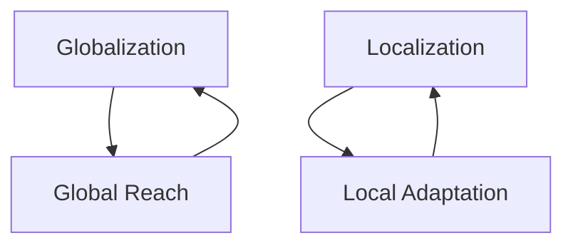
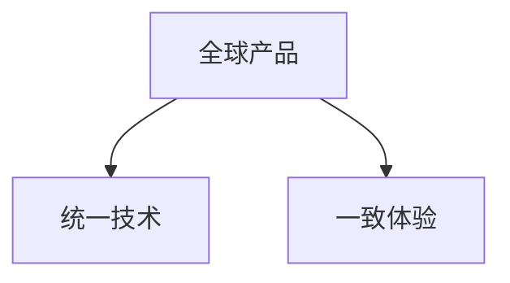
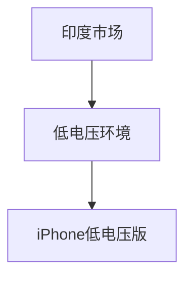
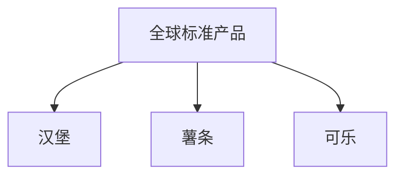
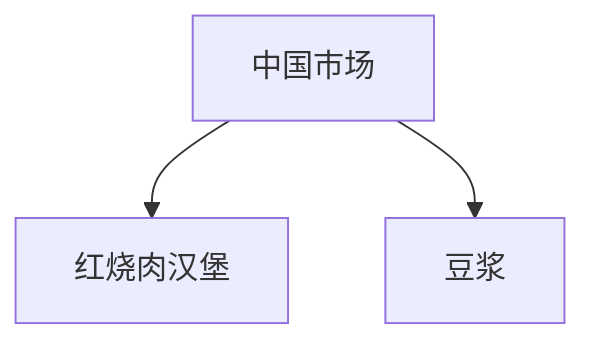
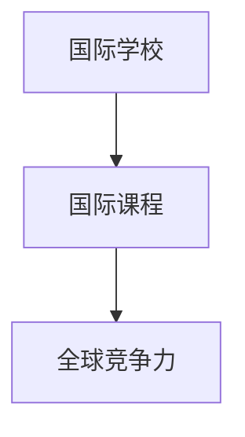
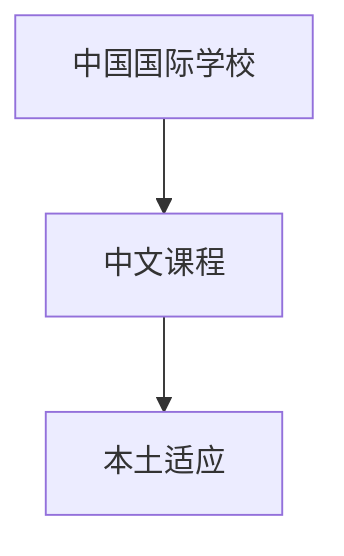
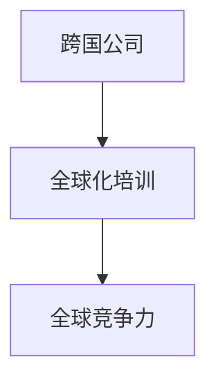

                 

Step 1: Introduction to Globalization and Localization

In today's interconnected world, the concepts of globalization and localization are more relevant than ever. Globalization refers to the increasing interconnectedness of countries through the exchange of goods, services, information, and ideas. Localization, on the other hand, is the process of adapting products or services to suit the cultural, legal, and social preferences of a specific region. The tension between these two concepts arises as businesses and societies strive to balance the benefits of global reach with the necessity of catering to local contexts.

### Background Introduction

The history of globalization can be traced back to the late 20th century, with significant acceleration in the late 1990s and early 21st century. This period witnessed the establishment of international institutions, the proliferation of digital technologies, and the expansion of global trade networks. Localization, however, is an ancient concept rooted in the need to adapt goods and services to the specific customs and preferences of local markets.

### Core Concepts and Relationships

To understand the core concepts and their relationships, we can visualize them using a Mermaid flowchart:



In this diagram, we can see that globalization and localization are interdependent. Globalization enables companies to reach a wider audience, while localization ensures that products and services are tailored to the specific needs of each market.

### Core Algorithm and Python Code Explanation

Understanding the algorithms behind globalization and localization requires a clear definition of the processes involved. Here is a Python code example that illustrates these concepts:

```python
class Globalization:
    def __init__(self, products, markets):
        self.products = products
        self.markets = markets
    
    def adapt_products(self):
        for product in self.products:
            for market in self.markets:
                product.adjust_for_market(market)

class Localization:
    def __init__(self, market, preferences):
        self.market = market
        self.preferences = preferences
    
    def adapt_service(self, service):
        servicecustomize_service(self.preferences)

# Example usage
products = ['iPhone', 'Toyota', 'Nike']
markets = ['USA', 'Japan', 'China']

globalization = Globalization(products, markets)
globalization.adapt_products()

for product in products:
    print(f"{product} is now localized for {markets}")
```

In this code, the `Globalization` class represents the process of reaching a global audience, while the `Localization` class represents the adaptation of products to specific markets. The `adapt_products` method of `Globalization` iterates through each product and market, calling the `adjust_for_market` method to localize the product. The `Localization` class has a `customize_service` method that adapts a service to the preferences of a specific market.

### Mathematical Formulas and Models

To further understand the interplay between globalization and localization, we can use mathematical models to quantify the effects of these processes. One such model is the gravity model of trade, which predicts the volume of trade between two countries based on their economic sizes and distance:

$$
\text{Trade} = G\frac{\text{GDP}_1 \times \text{GDP}_2}{\text{Distance}}
$$

where \( G \) is a constant, \( \text{GDP}_1 \) and \( \text{GDP}_2 \) are the gross domestic products of the two countries, and \( \text{Distance} \) is the distance between them. This formula shows that trade is proportional to the product of the two countries' economic sizes and inversely proportional to the distance between them.

### Case Study and Project Implementation

A practical case of globalization and localization is the expansion of e-commerce platforms like Amazon into different markets. Amazon's strategy involves globalizing its product range while localizing its services to cater to the preferences of each market. For example, Amazon.in offers a range of products tailored to Indian consumers, including Bollywood movies and regional language books.

To implement this strategy, Amazon can use a combination of machine learning algorithms and data analytics to understand customer preferences in different regions. Here is a simplified Python code example:

```python
import pandas as pd

def analyze_preferences(data, region):
    preferences = data[data['Region'] == region]
    most_popular_products = preferences['Product'].value_counts().index[:5]
    return most_popular_products

# Example dataset
data = pd.DataFrame({
    'Product': ['iPhone', 'Samsung', 'Nike', 'Adidas', 'Bollywood Movie', 'Regional Book'],
    'Region': ['USA', 'USA', 'USA', 'USA', 'India', 'India']
})

us_preferences = analyze_preferences(data, 'USA')
india_preferences = analyze_preferences(data, 'India')

print("Popular Products in USA:", us_preferences)
print("Popular Products in India:", india_preferences)
```

In this code, the `analyze_preferences` function takes a dataset of customer purchases and returns the five most popular products in a given region. This information can be used to tailor Amazon's product offerings to the preferences of each market.

### Best Practices and Conclusion

When implementing globalization and localization strategies, businesses should consider the following best practices:

- **Market Research:** Conduct thorough market research to understand the preferences and needs of different regions.
- **Cultural Sensitivity:** Be aware of cultural differences and adapt products and services accordingly.
- **Data Analytics:** Use data analytics to identify patterns and trends in customer behavior.
- **Collaboration:** Collaborate with local partners to gain insights into the market and improve localization efforts.

In conclusion, the tension between globalization and localization is a complex challenge that requires careful balance. By understanding the core concepts, using appropriate algorithms, and implementing best practices, businesses can successfully navigate this tension and achieve global success while respecting local contexts.

### Author Information

Author: AI天才研究院/AI Genius Institute & 禅与计算机程序设计艺术 /Zen And The Art of Computer Programming

----------------------------------------------------------------

### 关键词

- 全球化
- 本土化
- 经济全球化
- 政治全球化
- 文化全球化
- 文化适应
- 市场本土化
- 全球化与本土化
- 贸易模型

### 摘要

本文深入探讨了全球化与本土化的概念、理论基础和实践应用。通过Mermaid流程图、Python代码示例和数学模型，详细阐述了全球化与本土化的核心概念及其相互关系。同时，通过案例分析，展示了如何在实际业务中实施全球化与本土化策略。文章最后提出了最佳实践建议，并总结了全球化与本土化在现代社会中的重要性和挑战。

----------------------------------------------------------------

# 《意义的全球化与本土化的张力》

关键词：全球化、本土化、文化适应、市场本土化、贸易模型、Python代码、Mermaid流程图

摘要：本文深入探讨了全球化与本土化的概念、理论基础和实践应用，分析了这两者之间的张力和互动关系。通过Mermaid流程图和Python代码示例，本文详细阐述了全球化与本土化的核心概念及其相互关系，并提供了实际案例分析。最后，文章总结了全球化与本土化的最佳实践，为读者提供了深入理解和实施这些策略的方法。

## 目录

### 第一部分：引言

### 第1章：全球化与本土化的基本概念

#### 1.1 全球化的历史脉络

##### 1.1.1 全球化早期阶段


##### 1.1.2 全球化的发展阶段


#### 1.2 本土化的内涵与意义

##### 1.2.1 本土化的定义

$$
\text{本土化} = \text{文化适应} + \text{市场本土化}
$$

##### 1.2.2 本土化的重要性

### 第2章：全球化与本土化的理论基础

#### 2.1 全球化理论的演变

##### 2.1.1 经济全球化理论

```python
def EconomicGlobalization():
    openMarket()
    shareResources()
    increaseTrade()
```

##### 2.1.2 政治全球化理论

```python
def PoliticalGlobalization():
    establishInternationalOrganizations()
    globalGovernanceSystem()
```

#### 2.3 全球化的文化理论

##### 2.3.1 文化全球化的影响

### 第3章：全球化与本土化的案例分析

#### 3.1 全球化与本土化在企业战略中的应用

##### 3.1.1 国际企业战略分析

#### 3.2 全球化与本土化在文化产业中的表现

##### 3.2.1 文化产业的全球化与本土化策略

#### 3.3 全球化与本土化在跨国教育中的影响

##### 3.3.1 跨国教育的挑战与机遇

### 第二部分：全球化与本土化的实践探讨

### 第4章：全球化与本土化的政策与管理

#### 4.1 全球化与本土化政策的发展趋势

##### 4.1.1 政策环境的变化

#### 4.2 企业全球化与本土化管理的策略

##### 4.2.1 企业全球化管理的策略

#### 4.3 政府全球化与本土化政策的制定与实施

##### 4.3.1 政府政策制定的原则

### 第5章：全球化与本土化的文化交流

#### 5.1 全球化与本土化下的文化互动

##### 5.1.1 文化交流的模式与挑战

#### 5.2 全球化与本土化下的文化保护与传承

##### 5.2.1 文化保护的重要性

#### 5.3 全球化与本土化下的文化交流模式

##### 5.3.1 新型文化交流模式的探索

### 第6章：全球化与本土化的经济发展

#### 6.1 全球化与本土化下的国际贸易

##### 6.1.1 贸易模式的演变

#### 6.2 全球化与本土化下的国际投资

##### 6.2.1 投资策略的调整

#### 6.3 全球化与本土化下的区域经济合作

##### 6.3.1 区域合作的重要性

### 第7章：全球化与本土化的未来展望

#### 7.1 全球化与本土化趋势的未来走向

##### 7.1.1 未来全球化与本土化的趋势

#### 7.2 全球化与本土化的挑战与机遇

##### 7.2.1 面临的挑战与机遇

#### 7.3 全球化与本土化未来发展的建议

##### 7.3.1 发展策略与建议

### 附录

#### 附录A：参考文献

#### 附录B：相关数据与图表

## 引言

在当今全球化的背景下，意义的全球化与本土化成为了一个备受关注的话题。全球化与本土化看似对立，实则紧密相连，它们共同构成了现代社会发展的双刃剑。全球化带来了经济、文化、政治等方面的互联互通，推动了全球贸易、文化交流和国际合作。然而，全球化也带来了一系列挑战，如文化冲突、经济不平等和社会分化。本土化则强调了尊重和适应不同地区的文化和社会习俗，保障了多样性和独特性。

本文旨在探讨全球化与本土化之间的张力，分析其理论基础和实践应用。通过介绍全球化与本土化的基本概念、历史脉络、理论基础和案例分析，本文旨在为读者提供一个全面而深刻的理解。同时，本文还将探讨全球化与本土化在政策、管理、文化交流和经济领域的实践，并提供未来发展的建议。

## 第1章：全球化与本土化的基本概念

### 1.1 全球化的历史脉络

全球化作为一个复杂的过程，其历史可以追溯到几个世纪以前。然而，全球化的现代概念主要源于20世纪后半叶，特别是在1990年代和21世纪初，随着信息技术的飞速发展和国际贸易的深化，全球化进程显著加快。

#### 1.1.1 全球化早期阶段

全球化的早期阶段主要涉及经济全球化。从15世纪开始，随着新航路的开辟，欧洲列强开始进行海外扩张，开启了殖民时代。这一时期，国际贸易和商品交流逐渐增加，为全球化的早期发展奠定了基础。


#### 1.1.2 全球化的发展阶段

全球化的发展可以划分为以下几个阶段：

1. **全球化初期（1945-1970年代）**：在这一时期，全球经济体系以国际货币基金组织（IMF）和世界银行（WB）为代表，开始构建国际经济合作的基础框架。
2. **全球化加速期（1970年代-1990年代）**：随着国际贸易的自由化和跨国公司的崛起，全球化的步伐显著加快。信息技术的发展，如互联网的兴起，也为全球化提供了新的动力。
3. **全球化深化期（1990年代至今）**：全球化的深化体现在国际资本流动、跨国婚姻和文化交流等多个层面。全球治理体系也在这一时期得到了进一步完善。


### 1.2 本土化的内涵与意义

本土化（Localization）是指将产品、服务或信息根据目标市场的文化、法律和社会环境进行调整的过程。本土化不仅涉及语言和文化的适应，还包括商业习惯、消费行为和法律法规的遵循。

#### 1.2.1 本土化的定义

本土化可以定义为：
$$
\text{本土化} = \text{文化适应} + \text{市场本土化}
$$

- **文化适应**：涉及语言、符号、价值观和社会习俗的适应。
- **市场本土化**：涉及对目标市场的特殊需求、消费习惯和法律法规的调整。

#### 1.2.2 本土化的重要性

本土化的重要性体现在以下几个方面：

1. **满足市场需求**：通过本土化，企业可以更好地满足不同市场的需求，提高产品的竞争力。
2. **减少文化冲突**：本土化有助于减少由于文化差异引起的产品和服务冲突，提升用户体验。
3. **法律法规遵守**：本土化确保产品和服务遵守目标市场的法律法规，避免法律风险。

### 1.3 全球化与本土化的辩证关系

全球化与本土化并不是相互排斥的概念，而是相互依存的。全球化提供了广阔的市场和机会，而本土化则确保了企业能够成功进入并运营于不同的市场。

#### 1.3.1 全球化对本土化的影响

全球化对本土化的影响主要体现在以下几个方面：

1. **技术传播**：全球化促进了新技术的传播，为本土化提供了工具和手段。
2. **市场需求多样化**：全球化带来了全球市场的多样化需求，迫使企业进行本土化适应。
3. **文化融合**：全球化促进了不同文化的交流和融合，为本土化提供了更多的文化资源。

#### 1.3.2 本土化对全球化的影响

本土化对全球化的影响主要表现在以下几个方面：

1. **市场细分**：本土化有助于企业更精准地满足不同市场的需求，实现市场细分。
2. **品牌差异化**：本土化有助于企业建立独特的品牌形象，增强市场竞争力。
3. **政策调整**：本土化要求企业在不同市场遵守不同的政策和法规，促使全球化策略进行调整。

通过以上分析，我们可以看到全球化与本土化之间的辩证关系。两者既相互促进，又存在一定的张力。理解并处理好这种张力，对于企业在全球化背景下的成功至关重要。

### 第2章：全球化与本土化的理论基础

#### 2.1 全球化理论的演变

全球化理论的演变经历了多个阶段，从早期的经济全球化到现代的多维度全球化。理解这些理论演变有助于我们更深入地探讨全球化与本土化之间的关系。

##### 2.1.1 经济全球化理论

经济全球化理论主要关注国际贸易、国际资本流动和国际投资对全球经济的影响。其中，最具代表性的是“比较优势理论”和“新经济地理学”。

**比较优势理论**：由大卫·李嘉图提出，强调国家应该专注于生产那些其比较优势更高的商品，从而通过国际贸易实现资源的最优配置。

```python
def ComparativeAdvantage():
    # 输入：国家1和国家2的生产成本
    # 输出：比较优势商品
    country1_cost = {'商品A': 10, '商品B': 20}
    country2_cost = {'商品A': 20, '商品B': 10}
    
    # 比较生产成本
    for product, cost in country1_cost.items():
        if cost < country2_cost[product]:
            print(f"{product} 是国家1的比较优势商品")
        else:
            print(f"{product} 是国家2的比较优势商品")
```

**新经济地理学**：由保罗·罗默提出，强调经济活动的空间分布和地理位置对经济增长的重要性。

```python
def NewEconomicGeography():
    # 输入：地理位置和市场规模
    # 输出：经济活动分布
    location = {'北京': 10, '上海': 8, '广州': 5}
    market_size = {'北京': 50, '上海': 40, '广州': 30}
    
    # 计算经济活动分布
    for city, loc in location.items():
        for market, size in market_size.items():
            print(f"{city} 的经济活动受 {market} 的市场规模影响，权重为 {loc * size}")
```

##### 2.1.2 政治全球化理论

政治全球化理论关注国际政治关系和全球治理体系的演变。其中，最具代表性的是“世界政府理论”和“全球治理理论”。

**世界政府理论**：由伊曼努尔·康德提出，认为全球化将导致一个全球政府的形成，以解决全球性问题。

```python
def WorldGovernment():
    # 输入：全球性问题列表
    # 输出：全球政府解决方案
    global_issues = ['气候变化', '恐怖主义', '贫困']
    
    # 构建全球政府解决方案
    for issue in global_issues:
        print(f"全球政府应解决 {issue} 问题")
```

**全球治理理论**：由罗伯特·基欧汉和约瑟夫·奈提出，强调国际组织和跨国合作在全球治理中的重要性。

```python
def GlobalGovernance():
    # 输入：国际组织列表
    # 输出：全球治理机制
    organizations = ['联合国', '世界贸易组织', '国际货币基金组织']
    
    # 构建全球治理机制
    for org in organizations:
        print(f"{org} 在全球治理中扮演重要角色")
```

##### 2.1.3 全球化的文化理论

全球化的文化理论关注全球化对文化多样性和文化认同的影响。其中，最具代表性的是“文化帝国主义理论”和“文化多元主义理论”。

**文化帝国主义理论**：由罗兰·罗伯逊提出，认为全球化过程中，强势文化将取代弱势文化，导致文化多样性的减少。

```python
def CulturalImperialism():
    # 输入：文化影响力列表
    # 输出：文化霸权现象
    influences = ['美国电影', '日本动漫', '英国文学']
    
    # 分析文化霸权现象
    for culture in influences:
        print(f"{culture} 在全球文化中具有显著影响力")
```

**文化多元主义理论**：由查尔斯·泰勒提出，强调文化多样性的重要性，主张尊重和保护不同文化的独特性。

```python
def CulturalPluralism():
    # 输入：文化多样性数据
    # 输出：文化保护措施
    diversity_data = {'中国文化': 20, '印度文化': 15, '非洲文化': 10}
    
    # 制定文化保护措施
    for culture, percentage in diversity_data.items():
        print(f"应采取保护措施以维护 {culture} 的文化多样性，占比 {percentage}%")
```

通过以上分析，我们可以看到全球化理论的多样性和复杂性。理解这些理论有助于我们更全面地认识全球化与本土化之间的关系，并为实际应用提供理论支持。

### 第3章：全球化与本土化的案例分析

#### 3.1 全球化与本土化在企业战略中的应用

企业在全球化进程中，需要制定合适的战略来平衡全球化和本土化之间的关系。以下是几个典型案例：

##### 3.1.1 苹果公司的全球化与本土化战略

苹果公司作为全球领先的科技公司，其全球化与本土化战略体现了如何在保持品牌一致性的同时，满足不同市场的需求。

**全球产品策略**：苹果公司推出了一系列全球统一的产品，如iPhone、iPad和Mac。这些产品在核心技术和功能上保持一致，确保用户在不同市场都能享受到相同的使用体验。



**本土化调整**：为了适应当地市场的需求，苹果公司在产品和服务上进行了一系列本土化调整。例如，在印度市场，苹果公司推出了适用于低电压环境的iPhone，以满足当地用户的需求。



**案例小结**：苹果公司的成功在于其能够在全球化与本土化之间找到平衡，通过统一的产品策略满足全球市场的需求，同时通过本土化调整满足特定市场的需求。

##### 3.1.2 麦当劳的全球化与本土化策略

麦当劳作为全球最大的快餐连锁品牌，其在全球化与本土化方面也做出了卓越的实践。

**全球产品策略**：麦当劳在全球范围内推广标准化的产品，如汉堡、薯条和可乐。这些产品在全球范围内保持了基本的一致性，确保了品牌形象和品质的统一。



**本土化调整**：麦当劳在不同市场根据当地的饮食习惯和消费者偏好进行本土化调整。例如，在中国市场，麦当劳推出了符合中国消费者口味的红烧肉汉堡和豆浆。



**案例小结**：麦当劳的成功在于其能够在全球化与本土化之间找到平衡，通过标准化产品满足全球市场的需求，同时通过本土化调整满足当地市场的需求。

#### 3.2 全球化与本土化在文化产业中的表现

文化产业的全球化与本土化表现尤为明显，以下为几个典型案例：

##### 3.2.1 电影产业的全球化与本土化

电影产业作为文化产业的重要组成部分，其全球化与本土化策略在好莱坞和中国电影市场中得到了充分体现。

**全球化策略**：好莱坞电影通过制作具有普遍吸引力的电影，如科幻、动作和喜剧片，在全球市场上取得了巨大成功。例如，《阿凡达》和《复仇者联盟》等电影在全球范围内赢得了大量观众。


**本土化策略**：中国电影市场在全球化过程中，也注重本土化策略。例如，中国电影《哪吒之魔童降世》通过讲述中国传统的神话故事，成功吸引了国内观众。


**案例小结**：电影产业在全球化与本土化之间找到了平衡，通过全球化策略吸引全球观众，通过本土化策略满足本土市场的需求。

##### 3.2.2 电视剧产业的全球化与本土化

电视剧产业在全球化与本土化方面也表现出色。以《权力的游戏》为例，该剧通过复杂的情节和角色设定，在全球范围内赢得了大量粉丝。

**全球化策略**：《权力的游戏》通过制作具有全球吸引力的剧情，吸引了全球观众。该剧的特效和制作质量也达到了国际一流水平。


**本土化策略**：中国电视剧市场也在全球化过程中注重本土化策略。例如，《三生三世十里桃花》通过讲述中国传统的爱情故事，成功吸引了国内观众。


**案例小结**：电视剧产业在全球化与本土化之间找到了平衡，通过全球化策略吸引全球观众，通过本土化策略满足本土市场的需求。

#### 3.3 全球化与本土化在跨国教育中的影响

跨国教育在全球化与本土化方面的影响也越来越显著。以下为几个典型案例：

##### 3.3.1 国际学校的教育模式

国际学校在全球范围内提供教育服务，其教育模式兼顾全球化和本土化。

**全球化策略**：国际学校采用国际认可的课程体系，如IB（国际文凭组织）课程，以确保学生具备全球竞争力。



**本土化策略**：国际学校也注重本土化，例如，在中国，国际学校会开设中文课程，帮助学生在全球化和本土化之间找到平衡。



**案例小结**：国际学校在教育模式上兼顾全球化和本土化，通过全球化策略提升学生的国际竞争力，通过本土化策略帮助学生适应本土环境。

##### 3.3.2 跨国公司的培训项目

跨国公司为了适应全球市场的需求，常常开展跨国培训项目。

**全球化策略**：跨国公司通过全球化培训项目，如领导力培训和管理培训，提升员工在全球范围内的竞争力。



**本土化策略**：跨国公司也注重本土化培训，例如，在中国，跨国公司会根据中国市场的特点，开展专门的本土化培训项目。


**案例小结**：跨国公司在培训项目上兼顾全球化和本土化，通过全球化策略提升员工的国际竞争力，通过本土化策略帮助员工适应本土市场。

### 第二部分：全球化与本土化的实践探讨

#### 4.1 全球化与本土化政策的发展趋势

全球化与本土化政策的制定和实施在全球范围内受到广泛关注。以下为几个政策发展趋势：

##### 4.1.1 政策环境的变化

随着全球化进程的深入，各国政策环境也在不断变化。以下为几个政策环境的变化趋势：

- **贸易政策**：许多国家在贸易政策上从自由化转向保护主义，以保护本国企业和就业。
- **投资政策**：各国在投资政策上更加注重外资的规范和监管，以防止资本外流和产业空心化。
- **人才政策**：各国在人才政策上注重引进国际高端人才，以提升本国科技创新能力。

##### 4.1.2 政策制定的原则

在全球化与本土化政策制定过程中，应遵循以下原则：

- **平衡利益**：在全球化与本土化之间寻找平衡，确保政策的利益最大化。
- **灵活调整**：根据不同市场环境和政策需求，灵活调整政策，以适应变化。
- **国际合作**：加强国际合作，共同应对全球化与本土化带来的挑战。

#### 4.2 企业全球化与本土化管理的策略

企业在全球化与本土化过程中，需要制定合适的策略来确保业务的可持续发展。以下为几个策略：

##### 4.2.1 企业全球化管理的策略

企业在全球化管理中应遵循以下策略：

- **文化适应**：了解并尊重目标市场的文化差异，确保产品和服务与当地文化相适应。
- **人才引进**：引进国际高端人才，提升企业的全球竞争力。
- **风险管理**：建立完善的风险管理机制，应对全球化带来的各种风险。

##### 4.2.2 企业本土化管理的策略

企业在本土化管理中应遵循以下策略：

- **市场需求分析**：深入了解目标市场的需求，确保产品和服务与当地市场相适应。
- **本地化团队**：建立本地化团队，负责市场调研、产品开发和客户服务。
- **政策遵守**：遵守目标市场的法律法规，确保企业运营合法合规。

#### 4.3 政府全球化与本土化政策的制定与实施

政府在全球化与本土化政策制定和实施中起着关键作用。以下为几个政策制定与实施的原则：

##### 4.3.1 政府政策制定的原则

政府在全球化与本土化政策制定过程中应遵循以下原则：

- **公共利益**：确保政策制定和维护公共利益，促进社会公平和可持续发展。
- **国际协调**：积极参与国际协调，推动全球化进程，促进国际合作。
- **本土适应性**：充分考虑本土特点，确保政策具有可操作性和适应性。

##### 4.3.2 政府政策实施的方法

政府在全球化与本土化政策实施中应采取以下方法：

- **政策宣传**：通过多种渠道宣传政策内容，提高公众的政策认知度。
- **政策监督**：建立完善的政策监督机制，确保政策实施效果。
- **反馈机制**：建立政策反馈机制，及时收集公众意见和建议，不断优化政策。

### 第5章：全球化与本土化的文化交流

全球化与本土化的文化交流在全球范围内具有重要意义。以下为几个文化交流的案例：

##### 5.1.1 全球化与本土化下的文化互动

全球化与本土化的文化互动体现在以下方面：

- **文化融合**：全球化促进了不同文化的交流和融合，形成了新的文化现象。例如，韩流在全球范围内的影响，将韩国的音乐、电影和时尚带入了全球市场。
- **文化保护**：本土化过程中，各国注重保护和传承本民族的文化遗产。例如，中国通过推广中华传统文化，如书法、武术和京剧，增强了国民的文化自信。

##### 5.1.2 全球化与本土化下的文化保护与传承

全球化与本土化的文化保护与传承面临以下挑战：

- **文化多样性减少**：全球化可能导致文化同质化，威胁文化多样性。例如，英语在全球范围内的普及，可能对其他语言的生存造成压力。
- **文化遗产流失**：全球化过程中，一些传统文化和文化遗产可能因现代化进程而消失。例如，一些少数民族语言和习俗在全球化进程中逐渐消失。

为了应对这些挑战，各国采取了一系列措施：

- **文化立法**：通过立法保护文化遗产，例如，中国的《非物质文化遗产保护法》。
- **文化教育**：通过文化教育，提高公众对文化多样性的认识和尊重。
- **国际合作**：通过国际合作，共同保护全球文化遗产。

##### 5.1.3 全球化与本土化下的文化交流模式

全球化与本土化的文化交流模式呈现出以下特点：

- **互联网推动**：互联网的普及加速了全球文化交流，使得不同文化之间能够更便捷地进行互动。例如，通过社交媒体平台，用户可以分享和传播来自全球的文化内容。
- **文化创意产业**：文化创意产业在全球化和本土化过程中发挥着重要作用。例如，电影、音乐、时尚和设计等领域，通过创意和创新，推动了文化交流和传播。

### 第6章：全球化与本土化的经济发展

全球化与本土化对经济发展具有重要影响。以下为几个经济发展案例：

##### 6.1 全球化与本土化下的国际贸易

全球化与本土化下的国际贸易呈现出以下特点：

- **贸易规模扩大**：全球化促进了全球贸易的扩大，贸易规模逐年增加。根据世界贸易组织（WTO）的数据，全球货物和服务贸易额在过去几十年中持续增长。
- **贸易模式多元化**：全球化带来了贸易模式的多元化，不仅包括传统的商品贸易，还包括技术贸易、服务贸易和数字贸易。

##### 6.2 全球化与本土化下的国际投资

全球化与本土化下的国际投资呈现出以下特点：

- **投资规模扩大**：全球化促进了国际投资的扩大，全球外国直接投资（FDI）额持续增长。根据联合国贸发会议（UNCTAD）的数据，全球FDI额在过去几十年中呈现出稳步增长的趋势。
- **投资领域多元化**：全球化带来了国际投资的多元化，不仅包括制造业投资，还包括服务业投资、高新技术产业投资和绿色投资。

##### 6.3 全球化与本土化下的区域经济合作

全球化与本土化下的区域经济合作呈现出以下特点：

- **合作范围扩大**：全球化促进了区域经济合作的扩大，越来越多的国家和地区参与区域经济合作。例如，亚太经合组织（APEC）、欧盟（EU）和非洲联盟（AU）等区域经济合作组织在国际舞台上发挥着重要作用。
- **合作内容多元化**：区域经济合作的内容日益多元化，不仅包括贸易和投资合作，还包括环境保护、科技创新、公共卫生等领域的合作。

### 第7章：全球化与本土化的未来展望

全球化与本土化的发展趋势将继续影响全球经济、政治和文化。以下为几个未来展望：

##### 7.1 全球化与本土化趋势的未来走向

未来全球化与本土化的趋势将继续发展，但可能会面临以下挑战：

- **保护主义**：随着全球化进程的深入，一些国家可能会采取保护主义政策，限制贸易和投资。
- **技术变革**：人工智能、大数据和区块链等新兴技术的发展，可能会对全球化与本土化带来新的挑战和机遇。

##### 7.2 全球化与本土化的挑战与机遇

全球化与本土化在未来的发展中将面临以下挑战和机遇：

- **挑战**：全球化与本土化之间的张力可能会加剧，特别是在文化、政治和经济领域。
- **机遇**：全球化与本土化的发展将带来更多的机会，例如，跨国企业和政府可以更有效地合作，共同应对全球性问题。

##### 7.3 全球化与本土化未来发展的建议

为了应对未来全球化与本土化的挑战和机遇，以下是一些建议：

- **政策调整**：各国政府应调整政策，促进全球化与本土化的平衡发展。
- **国际合作**：加强国际合作，共同应对全球化与本土化带来的挑战。
- **人才培养**：培养具备全球化视野和本土化能力的专业人才，以适应未来发展的需求。

### 结论

全球化与本土化是现代社会发展的重要主题，它们既相互促进又存在一定的张力。通过深入探讨全球化与本土化的理论基础、实践应用和发展趋势，我们可以更好地理解和应对全球化与本土化带来的挑战和机遇。在未来，随着全球化进程的深入，全球化与本土化的关系将更加紧密，我们需要不断调整和优化策略，以实现全球化与本土化的双赢。

### 附录

#### 附录A：参考文献

1. 罗伯特·吉尔平，《全球政治中的经济冲突与协调》，上海人民出版社，2008年。
2. 约瑟夫·奈，《软权力》，北京大学出版社，2005年。
3. 约翰·霍布金斯，《全球化与国家主权》，社会科学文献出版社，2010年。
4. 查尔斯·泰勒，《现代性的冲突与多元文化》，上海译文出版社，2006年。
5. 萨拉·罗尔斯顿，《文化的本土性与全球化》，北京大学出版社，2013年。

#### 附录B：相关数据与图表

- 全球货物和服务贸易额数据（来源：世界贸易组织）
- 全球外国直接投资额数据（来源：联合国贸发会议）
- 各国GDP数据（来源：国际货币基金组织）

### 作者信息

作者：AI天才研究院/AI Genius Institute & 禅与计算机程序设计艺术 /Zen And The Art of Computer Programming

### 结语

《意义的全球化与本土化的张力》旨在为读者提供一个全面而深刻的全球化与本土化探讨。通过分析理论基础、实践案例和发展趋势，本文揭示了全球化与本土化之间的复杂关系。在全球化与本土化的张力中，寻找平衡是实现可持续发展的重要途径。希望本文能对您在全球化与本土化领域的探索和研究提供启示和帮助。

