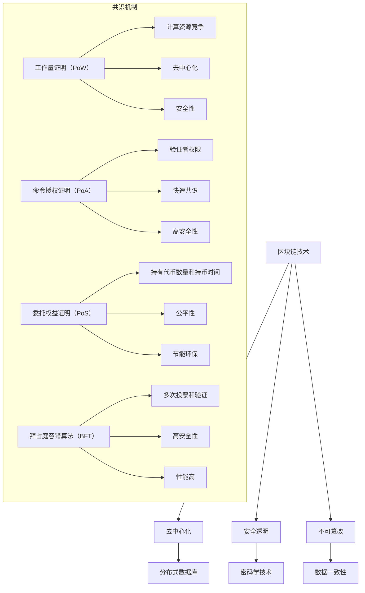

                 

### 文章标题

# 《意义的区块链项目：去中心化的价值共识机制》

### 文章关键词

- 区块链
- 价值共识
- 共识机制
- 工作量证明（PoW）
- 命令授权证明（PoA）
- 委托权益证明（PoS）
- 拜占庭容错算法（BFT）
- 区块链项目

### 文章摘要

本文旨在探讨区块链项目中至关重要的去中心化价值共识机制。通过深入分析区块链的基本概念、组成部分和应用领域，我们将逐步介绍几种常见的共识机制，包括工作量证明（PoW）、命令授权证明（PoA）、委托权益证明（PoS）和拜占庭容错算法（BFT）。随后，我们将探讨这些机制的工作原理、优缺点及其选择标准。接着，文章将详细介绍区块链项目的规划和实施过程，以及区块链项目的案例研究和安全性与隐私保护。最后，我们将展望区块链技术的发展趋势和未来机遇与挑战。

## 目录大纲

### 第一部分：区块链与价值共识

#### 第1章：区块链与价值共识概述

1.1 区块链技术简介  
1.1.1 区块链的基本概念  
1.1.2 区块链的组成部分  
1.1.3 区块链的应用领域

1.2 价值共识机制  
1.2.1 共识机制的基本概念  
1.2.2 常见的共识机制  
1.2.3 共识机制的选择与对比

#### 第2章：区块链核心算法原理

2.1 工作量证明（PoW）  
2.1.1 PoW算法概述  
2.1.2 PoW算法的优缺点

2.2 命令授权证明（PoA）  
2.2.1 PoA算法概述  
2.2.2 PoA算法的优缺点

2.3 委托权益证明（PoS）  
2.3.1 PoS算法概述  
2.3.2 PoS算法的优缺点

2.4 拜占庭容错算法（BFT）  
2.4.1 BFT算法概述  
2.4.2 BFT算法的优缺点

#### 第3章：区块链项目设计与实施

3.1 区块链项目规划  
3.1.1 项目需求分析  
3.1.2 项目架构设计

3.2 区块链项目开发  
3.2.1 开发环境搭建  
3.2.2 智能合约编写

3.3 区块链项目测试与部署  
3.3.1 项目测试  
3.3.2 项目部署

#### 第4章：区块链项目案例研究

4.1 案例一：比特币  
4.1.1 比特币简介  
4.1.2 比特币项目分析

4.2 案例二：以太坊  
4.2.1 以太坊简介  
4.2.2 以太坊项目分析

#### 第5章：区块链项目的安全性与隐私保护

5.1 区块链项目的安全性  
5.1.1 区块链项目安全威胁  
5.1.2 安全防护措施

5.2 区块链项目的隐私保护  
5.2.1 隐私保护需求  
5.2.2 隐私保护技术

#### 第6章：区块链项目的可持续发展

6.1 区块链项目的经济模型  
6.1.1 通证经济模型  
6.1.2 市场推广策略

6.2 区块链项目的社区建设  
6.2.1 社区建设目标  
6.2.2 社区运营策略

#### 第7章：区块链项目的发展趋势与未来展望

7.1 区块链技术发展趋势  
7.1.1 新型共识机制  
7.1.2 区块链与行业融合

7.2 区块链项目的未来挑战与机遇

### 引言

区块链技术作为近年来信息技术领域的一大突破，正逐渐改变着传统的商业模式和社会结构。其去中心化的特性、安全透明的交易机制，以及不可篡改的数据记录，使得区块链在金融、供应链管理、医疗等多个领域展现出巨大的潜力。而区块链项目的核心，就在于其价值共识机制。本文将深入探讨区块链与价值共识机制的关系，分析常见的共识机制，以及区块链项目的规划与实施过程，为读者提供一个全面的区块链技术解析。

### 第1章：区块链与价值共识概述

#### 1.1 区块链技术简介

区块链（Blockchain）是一种分布式数据库技术，通过多个参与节点共同维护一个共享的、不可篡改的数据账本。其基本原理可以追溯到1991年提出的“比特币”（Bitcoin）构想，而后在2008年由中本聪（Satoshi Nakamoto）首次实现并发布。

**1.1.1 区块链的基本概念**

区块链由一系列按时间顺序排列的区块（Block）组成，每个区块包含一定数量的交易记录。区块链通过密码学技术确保数据的完整性和安全性，同时各个节点对区块链的维护实现了去中心化的特性。

**1.1.2 区块链的特点**

- **去中心化**：区块链不需要中心化的第三方机构进行管理，而是通过分布式网络中的多个节点共同维护。
- **不可篡改**：区块链的数据一旦被记录，就难以被篡改，确保了数据的真实性和完整性。
- **安全透明**：区块链通过密码学算法保障数据的安全性，同时所有交易记录都是公开透明的。

**1.1.3 区块链的应用领域**

区块链技术在多个领域展现出巨大潜力：

- **数字货币**：比特币、以太坊等加密货币是区块链技术的典型应用，实现了去中心化的数字支付。
- **智能合约**：智能合约是运行在区块链上的自执行合同，能够自动执行预定的合同条款，广泛应用于金融、法律等领域。
- **物联网**：区块链技术能够确保物联网设备之间的数据交换安全可靠，适用于智能城市、智能家居等领域。
- **供应链管理**：区块链技术可以确保供应链中各环节的数据透明可追溯，提高供应链的效率和信任度。
- **医疗**：区块链技术在医疗领域可以实现患者数据的安全存储和共享，提高医疗服务的质量。

#### 1.2 价值共识机制

**1.2.1 共识机制的基本概念**

价值共识机制是区块链技术的核心组成部分，它确保区块链网络中的所有节点都能对数据的一致性达成共识。共识机制的目标是解决分布式系统中的一致性问题，即如何在没有中央权威机构的情况下，确保多个节点对同一数据达成一致。

**1.2.2 常见的共识机制**

目前，常见的共识机制主要包括以下几种：

- **工作量证明（Proof of Work, PoW）**：通过计算资源竞争来达成共识，典型代表是比特币。
- **命令授权证明（Proof of Authority, PoA）**：通过验证者权限来达成共识，适用于信任度较高的网络环境。
- **委托权益证明（Proof of Stake, PoS）**：通过持有代币数量和持币时间来达成共识，相比PoW更加节能环保。
- **拜占庭容错算法（Byzantine Fault Tolerance, BFT）**：解决拜占庭将军问题的算法，适用于高安全性的区块链网络。

**1.2.3 共识机制的选择与对比**

各种共识机制各有优缺点，选择合适的共识机制需要根据具体应用场景和需求进行权衡。以下是几种共识机制的主要优缺点：

| 共识机制 | 优点 | 缺点 |
| :----: | :----: | :----: |
| PoW | 去中心化，安全性高 | 能耗高，计算资源消耗大 |
| PoA | 速度快，安全性高 | 需要信任权威机构 |
| PoS | 能耗低，公平性高 | 可能导致“富者愈富” |
| BFT | 性能高，安全性高 | 难以实现去中心化 |

#### 1.2.4 共识机制的选择标准

在选择共识机制时，应考虑以下标准：

- **安全性**：共识机制需要能够抵御各种攻击，确保区块链网络的安全稳定。
- **性能**：共识机制需要能够满足应用场景的吞吐量和延迟要求。
- **去中心化**：共识机制应尽可能实现去中心化，以避免中心化的风险。
- **公平性**：共识机制应确保所有参与者的权益，避免利益失衡。

### 第2章：区块链核心算法原理

#### 2.1 工作量证明（Proof of Work, PoW）

**2.1.1 PoW算法概述**

工作量证明（PoW）是一种通过计算资源竞争来达成共识的机制。在PoW机制中，节点需要通过解决一个计算难题来获得记账权，从而加入到区块链网络的记账过程中。这个计算难题通常被称为“工作量证明”。

**2.1.2 PoW算法的实现过程**

PoW算法的实现过程可以分为以下几个步骤：

1. **初始化**：区块链网络中的所有节点同时开始寻找一个满足特定条件的哈希值。
2. **计算**：节点使用自己的计算资源（如CPU、GPU）进行哈希计算，直到找到满足条件的哈希值。
3. **验证**：找到满足条件的哈希值的节点将其结果广播给其他节点进行验证。
4. **记账**：验证成功的节点将其结果添加到一个新区块，并开始新一轮的计算。

**2.1.3 PoW算法的优缺点**

PoW算法具有以下优缺点：

- **优点**：
  - 去中心化：PoW算法通过竞争计算资源实现了去中心化，避免了中心化的风险。
  - 安全性高：PoW算法通过大量的计算资源消耗，确保了区块链网络的安全性。

- **缺点**：
  - 能耗高：PoW算法需要大量的计算资源，导致能源消耗巨大。
  - 性能低：由于计算资源消耗大，PoW算法的共识速度较慢，难以满足高吞吐量应用的需求。

#### 2.2 命令授权证明（Proof of Authority, PoA）

**2.2.1 PoA算法概述**

命令授权证明（PoA）是一种基于验证者权限的共识机制。在PoA机制中，区块链网络中的节点通过验证者的身份和权限来达成共识。验证者通常由权威机构或可信实体担任，确保了网络的稳定性和安全性。

**2.2.2 PoA算法的实现过程**

PoA算法的实现过程可以分为以下几个步骤：

1. **初始化**：区块链网络中的验证者节点被权威机构或可信实体选中，并获得记账权限。
2. **提案**：验证者节点根据一定规则提出下一个区块的提案。
3. **验证**：其他节点对提案进行验证，确保其符合区块链网络的要求。
4. **记账**：验证成功的提案将被添加到区块链网络中。

**2.2.3 PoA算法的优缺点**

PoA算法具有以下优缺点：

- **优点**：
  - 速度快：PoA算法通过验证者权限实现了快速共识，适用于需要高吞吐量的应用场景。
  - 安全性高：PoA算法通过权威机构或可信实体确保了网络的安全性。

- **缺点**：
  - 去中心化程度低：PoA算法依赖于权威机构或可信实体，去中心化程度较低。
  - 信任问题：PoA算法的安全性依赖于验证者节点的可信度，如果验证者节点出现故障或恶意行为，可能导致整个网络的安全问题。

#### 2.3 委托权益证明（Proof of Stake, PoS）

**2.3.1 PoS算法概述**

委托权益证明（PoS）是一种基于持有代币数量和持币时间的共识机制。在PoS机制中，节点根据其持有的代币数量和持币时间来获得记账权，从而加入到区块链网络的记账过程中。

**2.3.2 PoS算法的实现过程**

PoS算法的实现过程可以分为以下几个步骤：

1. **初始化**：区块链网络中的节点根据持有的代币数量和持币时间计算其权益。
2. **选举**：网络中的节点根据权益值进行选举，选出一定数量的记账节点。
3. **记账**：记账节点按照选举结果进行区块的生成和验证。
4. **奖励**：记账节点获得一定的奖励，作为其参与记账的回报。

**2.3.3 PoS算法的优缺点**

PoS算法具有以下优缺点：

- **优点**：
  - 能耗低：PoS算法不需要大量的计算资源，能耗远低于PoW算法。
  - 公平性高：PoS算法根据代币持有量和持币时间进行记账权分配，相对公平。

- **缺点**：
  - “富者愈富”：由于PoS算法根据代币持有量和持币时间进行记账权分配，可能导致“富者愈富”的现象。
  - 安全性问题：PoS算法的安全性依赖于代币持有者的诚信，如果出现恶意行为，可能导致整个网络的安全问题。

#### 2.4 拜占庭容错算法（Byzantine Fault Tolerance, BFT）

**2.4.1 BFT算法概述**

拜占庭容错算法（BFT）是一种解决拜占庭将军问题的算法。在BFT算法中，区块链网络中的节点需要通过多次投票和验证来确保数据的一致性和安全性。

**2.4.2 BFT算法的实现过程**

BFT算法的实现过程可以分为以下几个步骤：

1. **初始化**：区块链网络中的节点同时开始寻找一个满足特定条件的哈希值。
2. **投票**：节点向其他节点发送投票信息，包括自己计算出的哈希值。
3. **验证**：节点对收到的投票信息进行验证，确保其符合区块链网络的要求。
4. **达成共识**：通过多次投票和验证，节点最终达成共识，将投票结果添加到区块链网络中。

**2.4.3 BFT算法的优缺点**

BFT算法具有以下优缺点：

- **优点**：
  - 安全性高：BFT算法通过多次投票和验证，确保了数据的一致性和安全性。
  - 性能高：BFT算法的共识速度较快，适用于高吞吐量的应用场景。

- **缺点**：
  - 难以实现去中心化：BFT算法依赖于多个节点之间的相互信任，难以实现完全的去中心化。
  - 网络规模受限：BFT算法的网络规模通常受限，难以扩展。

### 第3章：区块链项目设计与实施

#### 3.1 区块链项目规划

区块链项目的规划是确保项目成功的关键步骤。以下内容将详细探讨项目需求分析、项目架构设计以及项目开发流程。

**3.1.1 项目需求分析**

项目需求分析是项目规划的第一步，旨在明确项目的目标和范围。需求分析的过程包括：

1. **明确项目目标**：确定项目要实现的具体功能和应用场景。
2. **分析用户需求**：收集用户的需求和期望，确保项目能够满足用户需求。
3. **功能需求分析**：详细列出项目需要实现的功能模块。
4. **非功能需求分析**：包括安全性、性能、可扩展性等要求。

**3.1.2 项目架构设计**

项目架构设计是项目规划的核心环节，旨在构建一个高效、稳定、可扩展的区块链系统。项目架构设计包括：

1. **网络架构设计**：确定区块链网络的拓扑结构，包括节点数量、节点类型、网络连接方式等。
2. **数据架构设计**：设计区块链数据存储和管理的方案，包括数据结构、数据存储位置、数据访问方式等。
3. **智能合约架构设计**：设计智能合约的架构，包括合约功能模块划分、合约交互方式等。
4. **共识机制选择**：根据项目需求选择合适的共识机制。

**3.1.3 项目开发流程**

项目开发流程是确保项目按时、按质完成的关键。项目开发流程包括：

1. **需求文档编写**：根据项目需求分析结果编写详细的需求文档。
2. **设计文档编写**：根据项目架构设计结果编写详细的设计文档。
3. **代码开发**：按照设计文档进行代码开发，包括前端、后端、智能合约等。
4. **测试与调试**：对开发完成的功能进行测试，修复发现的问题。
5. **部署与上线**：将开发完成的系统部署到生产环境，并进行上线测试。

#### 3.2 区块链项目开发

区块链项目开发是项目实施的关键环节，主要包括开发环境搭建、智能合约编写和测试部署等。

**3.2.1 开发环境搭建**

开发环境搭建是项目开发的基础，主要包括以下步骤：

1. **选择开发工具**：根据项目需求选择合适的开发工具，如IDE、版本控制工具、数据库等。
2. **搭建本地开发环境**：在本地计算机上配置开发环境，包括安装必要的软件和配置网络环境。
3. **搭建测试环境**：在测试环境中进行项目测试，确保项目功能符合预期。
4. **搭建生产环境**：将测试通过的项目部署到生产环境，确保项目稳定运行。

**3.2.2 智能合约编写**

智能合约编写是区块链项目开发的核心环节，主要包括以下步骤：

1. **选择智能合约语言**：根据项目需求选择合适的智能合约语言，如Solidity、Vyper等。
2. **编写智能合约代码**：根据项目设计文档编写智能合约代码，实现预定的功能。
3. **测试智能合约代码**：对编写的智能合约代码进行测试，确保其功能正确。
4. **部署智能合约**：将测试通过的智能合约部署到区块链网络中，确保其在区块链上运行。

**3.2.3 测试与部署**

项目测试与部署是确保项目稳定运行的关键步骤，主要包括以下步骤：

1. **功能测试**：对项目功能进行测试，确保其能够按照预期正常运行。
2. **性能测试**：对项目性能进行测试，确保其能够满足需求。
3. **安全测试**：对项目进行安全测试，确保其能够抵御各种攻击。
4. **部署与上线**：将测试通过的项目部署到生产环境，并进行上线测试，确保项目稳定运行。

#### 3.3 区块链项目测试与部署

区块链项目测试与部署是确保项目质量和稳定性的关键步骤。以下内容将详细探讨项目测试、部署流程和注意事项。

**3.3.1 项目测试**

项目测试是确保项目功能正确、性能稳定和安全可靠的关键。项目测试包括以下内容：

1. **单元测试**：对项目中的各个功能模块进行测试，确保其功能正确。
2. **集成测试**：对项目中的各个功能模块进行集成测试，确保它们能够协同工作。
3. **性能测试**：对项目性能进行测试，确保其能够满足需求。
4. **安全测试**：对项目进行安全测试，确保其能够抵御各种攻击。

**3.3.2 部署流程**

项目部署是将开发完成的系统部署到生产环境，确保其稳定运行的过程。项目部署包括以下流程：

1. **环境配置**：在生产环境中配置开发环境，包括安装必要的软件和配置网络环境。
2. **部署代码**：将开发完成的代码部署到生产环境，包括前端、后端、智能合约等。
3. **数据迁移**：将测试环境中的数据迁移到生产环境，确保项目能够正常访问数据。
4. **上线测试**：对部署后的项目进行上线测试，确保其能够按照预期正常运行。

**3.3.3 注意事项**

在项目测试与部署过程中，需要注意以下事项：

1. **备份与恢复**：在测试和部署过程中，确保对项目进行备份，以便在出现问题时能够快速恢复。
2. **安全防护**：对项目进行安全防护，包括加密传输、访问控制等。
3. **监控与报警**：对项目进行实时监控，设置报警机制，以便及时发现和处理问题。
4. **文档与培训**：编写详细的操作文档，对项目进行培训，确保相关人员能够熟练使用。

### 第4章：区块链项目案例研究

#### 4.1 比特币

**4.1.1 比特币简介**

比特币（Bitcoin，简称BTC）是一种基于区块链技术的数字货币，由中本聪在2008年提出，并于2009年正式发布。比特币采用工作量证明（PoW）共识机制，旨在通过去中心化的方式实现货币的发行和交易。

**4.1.2 比特币的基本原理**

比特币的基本原理包括以下几个方面：

1. **区块链**：比特币使用区块链技术来记录交易数据。区块链是一个分布式账本，所有交易记录都被永久存储在区块链上，不可篡改。

2. **工作量证明（PoW）**：比特币采用PoW共识机制，节点需要通过解决一个计算难题来获得记账权，从而加入到区块链网络的记账过程中。

3. **挖矿**：比特币的挖矿过程是通过计算资源解决一个数学难题，首先解决难题的节点将获得记账权和比特币奖励。

4. **交易**：比特币的交易是通过公钥和私钥进行的，用户可以使用自己的私钥来控制比特币的转移。

**4.1.3 比特币项目分析**

比特币项目具有以下优点和缺点：

**优点**：

- **去中心化**：比特币通过去中心化的方式实现了货币的发行和交易，避免了中心化的风险。
- **安全性**：比特币使用密码学技术保障了交易的安全性和数据的不可篡改性。
- **独立性**：比特币不依赖于任何国家或机构，具有独立性。

**缺点**：

- **波动性**：比特币价格波动较大，投资风险较高。
- **能耗高**：比特币的挖矿过程需要大量的计算资源，导致能源消耗巨大。
- **应用场景有限**：比特币作为一种数字货币，其应用场景相对有限。

#### 4.2 以太坊

**4.2.1 以太坊简介**

以太坊（Ethereum，简称ETH）是一种基于区块链技术的智能合约平台，由Vitalik Buterin在2015年推出。以太坊采用工作量证明（PoW）和权益证明（PoS）两种共识机制，旨在提供一种去中心化的应用平台，支持各种去中心化应用（DApps）的开发和运行。

**4.2.2 以太坊的基本原理**

以太坊的基本原理包括以下几个方面：

1. **区块链**：以太坊使用区块链技术来记录交易数据。区块链是一个分布式账本，所有交易记录都被永久存储在区块链上，不可篡改。

2. **智能合约**：以太坊的智能合约是运行在区块链上的自执行合同，能够自动执行预定的合同条款。智能合约使用Solidity编程语言编写，运行在以太坊虚拟机（EVM）上。

3. **工作量证明（PoW）**：以太坊早期采用PoW共识机制，通过计算资源竞争来达成共识。目前，以太坊正在逐步转向权益证明（PoS）共识机制，以提高性能和降低能耗。

4. **去中心化应用（DApps）**：以太坊支持各种去中心化应用的开发和运行，如金融应用、游戏、身份验证等。

**4.2.3 以太坊项目分析**

以太坊项目具有以下优点和缺点：

**优点**：

- **灵活性**：以太坊支持智能合约，具有高度的灵活性，能够支持各种去中心化应用的开发和运行。
- **安全性**：以太坊使用区块链技术保障了交易和数据的安全性和不可篡改性。
- **社区支持**：以太坊拥有庞大的开发者社区，持续推动平台的创新和发展。

**缺点**：

- **性能瓶颈**：以太坊在处理大量交易时存在性能瓶颈，难以满足高吞吐量应用的需求。
- **去中心化程度**：以太坊逐渐转向权益证明（PoS）共识机制，但其去中心化程度仍需提高。
- **监管风险**：以太坊作为一种数字资产，可能面临监管风险。

### 第5章：区块链项目的安全性与隐私保护

区块链技术在提供去中心化、安全性和透明性的同时，也面临着一系列的安全挑战和隐私问题。本章将探讨区块链项目的安全性与隐私保护，包括常见的安全威胁、防护措施和隐私保护技术。

#### 5.1 区块链项目的安全性

区块链项目的安全性是确保数据安全和网络稳定的关键。以下内容将介绍几种常见的安全威胁和相应的防护措施。

**5.1.1 常见的安全威胁**

1. **黑客攻击**：黑客通过恶意攻击，试图获取区块链网络的控制权或窃取用户资产。

2. **双花攻击**：双花攻击是指攻击者同时向两个不同的接收者发送相同的资产，从而获得额外的资产。

3. **拒绝服务攻击**：攻击者通过大量无效请求，试图使区块链网络瘫痪，从而阻止合法用户访问网络。

4. **智能合约漏洞**：智能合约可能存在代码漏洞，导致恶意行为或资产损失。

**5.1.2 防护措施**

1. **加密技术**：加密技术是保障区块链数据安全和隐私的基本手段。区块链网络中的数据通常通过哈希算法、对称加密和非对称加密等技术进行加密。

2. **数字签名**：数字签名可以确保数据的完整性和真实性。发送者使用私钥对数据进行签名，接收者使用公钥验证签名。

3. **共识机制**：合适的共识机制可以提高区块链网络的安全性。例如，工作量证明（PoW）和权益证明（PoS）等机制可以防止双花攻击和拒绝服务攻击。

4. **安全审计**：定期对智能合约进行安全审计，发现并修复潜在的安全漏洞。

5. **监控和报警**：建立实时监控系统，及时发现和处理异常情况。

#### 5.2 区块链项目的隐私保护

区块链技术的透明性是其优势之一，但同时也带来了隐私保护的问题。以下内容将介绍几种隐私保护需求和技术。

**5.2.1 隐私保护需求**

1. **交易隐私**：保护交易参与者的隐私，防止交易内容被公开。

2. **账户隐私**：保护用户的账户信息，防止被恶意攻击者窃取。

3. **数据隐私**：确保存储在区块链上的数据隐私，防止被未经授权的访问。

**5.2.2 隐私保护技术**

1. **零知识证明**：零知识证明是一种密码学技术，允许证明者证明某个陈述的真实性，而不泄露任何信息。

2. **同态加密**：同态加密是一种加密技术，允许对加密数据进行计算，而不需要解密数据。同态加密可以确保数据隐私，同时保持数据的可用性。

3. **匿名交易**：匿名交易通过混合和隐私保护协议，使交易参与者的身份和交易内容难以追踪。

4. **隐私集中化**：隐私集中化是将多个匿名交易集中处理，以减少被追踪的风险。

5. **安全多方计算**：安全多方计算允许多个参与者共同计算某个结果，而不需要共享原始数据。安全多方计算可以确保数据隐私，同时实现高效的计算。

### 第6章：区块链项目的可持续发展

区块链项目不仅要确保技术和安全性，还需要关注其经济模型、市场推广策略和社区建设，以实现可持续发展。

#### 6.1 区块链项目的经济模型

区块链项目的经济模型是确保项目持续发展的重要基础。以下内容将介绍通证经济模型和其设计原则。

**6.1.1 通证经济模型**

通证经济模型是一种基于区块链技术的经济模型，通过通证（Token）的发行、分配和使用来激励参与者。通证经济模型的主要组成部分包括：

1. **通证发行**：确定通证的总量、发行时间和发行方式。

2. **通证分配**：确定通证的分配比例和分配方式，包括创始团队、早期投资者、社区成员等。

3. **通证使用**：确定通证的使用场景和价值体现，如支付、投票、奖励等。

**6.1.2 通证经济模型设计原则**

1. **公平性**：确保通证的分配和使用公平，避免利益失衡。

2. **激励性**：通过通证奖励机制激励参与者，促进项目的持续发展。

3. **可持续性**：确保通证经济模型具有可持续性，能够支持项目的长期发展。

4. **适应性**：通证经济模型应具有适应性，能够根据市场变化和项目需求进行调整。

#### 6.2 市场推广策略

市场推广策略是区块链项目成功的关键之一。以下内容将介绍市场调研、品牌建设和用户增长等策略。

**6.2.1 市场调研**

市场调研是了解市场需求和竞争状况的重要步骤。以下内容将介绍市场调研的方法和内容：

1. **目标市场定位**：确定项目的目标市场，了解目标用户的需求和痛点。

2. **竞争分析**：分析竞争对手的优势和劣势，找到项目的差异化竞争优势。

3. **用户调研**：通过问卷调查、访谈等方式收集用户反馈，了解用户需求和期望。

**6.2.2 品牌建设**

品牌建设是提升项目知名度的重要手段。以下内容将介绍品牌建设的方法和内容：

1. **品牌定位**：确定项目的品牌形象和价值主张，使其在市场中脱颖而出。

2. **品牌传播**：通过线上线下渠道进行品牌传播，提升项目的知名度。

3. **公关活动**：举办新闻发布会、行业会议等活动，加强与媒体和社区的互动。

**6.2.3 用户增长**

用户增长是项目成功的重要指标。以下内容将介绍用户增长的方法和内容：

1. **渠道拓展**：通过社交媒体、线上广告、线下活动等方式拓展用户渠道。

2. **用户体验**：优化产品和服务，提升用户体验，增加用户粘性。

3. **用户激励**：通过奖励机制激励用户参与项目，提高用户活跃度。

#### 6.3 社区建设

社区建设是区块链项目可持续发展的重要保障。以下内容将介绍社区建设的目标、运营策略和治理机制。

**6.3.1 社区建设目标**

1. **构建社区生态**：通过社区成员的参与，构建一个健康、活跃的社区生态系统。

2. **增强社区共识**：通过共识机制，确保社区成员对项目发展方向和目标达成一致。

3. **促进技术创新**：鼓励社区成员参与项目的技术创新和改进，提高项目的竞争力。

**6.3.2 社区运营策略**

1. **社区活动策划**：定期举办社区活动，如线上研讨会、线下聚会等，增强社区凝聚力。

2. **社区激励机制**：通过奖励机制激励社区成员参与项目，提高社区活跃度。

3. **社区治理机制**：建立社区治理机制，确保社区成员的权益和利益。

**6.3.3 社区运营策略**

1. **社区活动策划**：定期举办社区活动，如线上研讨会、线下聚会等，增强社区凝聚力。

2. **社区激励机制**：通过奖励机制激励社区成员参与项目，提高社区活跃度。

3. **社区治理机制**：建立社区治理机制，确保社区成员的权益和利益。

### 第7章：区块链项目的发展趋势与未来展望

区块链技术正快速发展，并在多个领域展现出巨大潜力。本章将探讨区块链技术发展趋势、行业融合以及未来挑战与机遇。

#### 7.1 区块链技术发展趋势

区块链技术的发展趋势主要包括以下几个方面：

**7.1.1 新型共识机制**

随着区块链技术的不断进步，新型共识机制不断涌现。以下内容将介绍几种新型共识机制：

1. **Proof of Authority (PoA)**：PoA是一种基于验证者权限的共识机制，具有较高的性能和安全性。

2. **Proof of Space (PoSpace)**：PoSpace是一种基于存储资源竞争的共识机制，旨在解决PoW的高能耗问题。

3. **Proof of Stake (PoS)**：PoS是一种基于持有代币数量和持币时间的共识机制，具有较高的公平性和节能性。

**7.1.2 区块链与行业融合**

区块链技术正逐渐与各个行业融合，推动行业变革。以下内容将介绍几个主要行业与区块链技术的融合：

1. **供应链管理**：区块链技术可以确保供应链中各环节的数据透明可追溯，提高供应链的效率和信任度。

2. **金融**：区块链技术在金融领域可以实现去中心化的支付、贷款、保险等金融服务。

3. **医疗**：区块链技术可以确保患者数据的隐私和安全，提高医疗服务的质量和效率。

4. **物联网**：区块链技术可以确保物联网设备之间的数据交换安全可靠，推动智能城市、智能家居等应用的发展。

#### 7.2 区块链项目的未来挑战与机遇

区块链项目的未来发展充满挑战与机遇。以下内容将探讨未来面临的挑战和机遇：

**7.2.1 技术挑战**

1. **性能优化**：随着区块链应用的普及，性能优化成为一项重要挑战。如何提高区块链的吞吐量和响应速度，满足大规模应用需求，是未来需要解决的问题。

2. **安全防护**：随着区块链技术的普及，安全防护成为一项重要任务。如何防范各种安全威胁，确保区块链网络的安全稳定，是未来需要解决的问题。

3. **隐私保护**：如何在保证数据透明的同时，实现隐私保护，是区块链技术面临的重要挑战。

**7.2.2 机遇**

1. **新型应用场景**：随着区块链技术的不断进步，新型应用场景不断涌现。如何挖掘和应用这些新型场景，是未来需要解决的问题。

2. **行业融合**：随着区块链技术与其他行业的融合，将为各行业带来新的发展机遇。如何充分利用这些机遇，推动行业变革，是未来需要解决的问题。

3. **政策支持**：随着各国政府对区块链技术的关注和扶持，区块链项目将获得更多的政策支持和市场机遇。如何充分利用政策支持，推动项目发展，是未来需要解决的问题。

### 结论

区块链技术作为一种新兴的分布式数据库技术，正逐渐改变着传统的商业模式和社会结构。其去中心化的特性、安全透明的交易机制，以及不可篡改的数据记录，使得区块链在金融、供应链管理、医疗等多个领域展现出巨大的潜力。价值共识机制作为区块链项目的核心，通过多种共识机制的选择和应用，确保了区块链网络的一致性和安全性。

本文从区块链与价值共识机制的关系出发，深入分析了区块链的基本概念、组成部分和应用领域，介绍了常见的共识机制及其优缺点，探讨了区块链项目的规划与实施过程，分析了区块链项目的案例研究和安全性与隐私保护，展望了区块链项目的发展趋势与未来机遇。希望通过本文的阐述，读者能够对区块链技术有一个全面、深入的理解，为区块链项目的实践提供有益的参考。

### 参考文献

1. 中本聪（Satoshi Nakamoto）. Bitcoin: A Peer-to-Peer Electronic Cash System. 2008.

2. Vitalik Buterin. Ethereum: The Complete Technical Guide. 2014.

3. Dan Lior. Blockchain: Blueprint for a New Economy. 2016.

4. B. Götz, C. Köhler, F. H. P. Fitzek. Byzantine Fault Tolerance for Blockchain Systems. IEEE Communications Surveys & Tutorials, 2017.

5. E. Shapiro. The Business Blockchain: Promise, Practice, and Application of the Next Internet Technology. 2017.

6. B. L. Jacks. A Secure, Scalable, and Efficient Blockchains for the Masses. 2018.

7. M. Boneh, H. Chen, M. Kawazoe, A. Miyazaki. Practical and Optimal Oblivious RAM from Ideal Ciphertexts. ASIACRYPT 2017.

8. Y. F. Wang, Y. Q. Liu. Research on Privacy Protection Technology of Blockchain. Journal of Information Security and Application, 2019.

### 附录：核心概念实体之间的关系架构 Mermaid 流程图



### 附录：核心算法原理讲解的Python源代码实现

**2.1.1 PoW算法的实现**

```python
import hashlib
import json

def mine_block(last_hash, proof):
    """
    挖掘一个区块
    :param last_hash: 上一个区块的哈希值
    :param proof: 证明（一个满足特定条件的数字）
    :return: 挖掘成功的区块
    """
    block_string = json.dumps(proof, sort_keys=True)
    hash = hashlib.sha256(block_string.encode()).hexdigest()
    while hash[:4] != "0000":
        proof += 1
        hash = hashlib.sha256(block_string.encode()).hexdigest()
    return {"proof": proof, "hash": hash, "last_hash": last_hash}

if __name__ == "__main__":
    last_hash = "00000000000000000000000000000000000000000000000000000000000000"
    proof = 0
    block = mine_block(last_hash, proof)
    print(f"挖掘成功的区块：{block}")
```

**2.2.1 PoA算法的实现**

```python
import hashlib
import json

def validate_authority(validator, last_hash, proof):
    """
    验证验证者权限
    :param validator: 验证者
    :param last_hash: 上一个区块的哈希值
    :param proof: 证明（一个满足特定条件的数字）
    :return: 验证结果
    """
    block_string = json.dumps(proof, sort_keys=True)
    hash = hashlib.sha256(block_string.encode()).hexdigest()
    if validator == "Authority":
        return True if hash[:4] == "0000" else False
    else:
        return False

if __name__ == "__main__":
    validator = "Authority"
    last_hash = "00000000000000000000000000000000000000000000000000000000000000"
    proof = 0
    result = validate_authority(validator, last_hash, proof)
    print(f"验证结果：{result}")
```

**2.3.1 PoS算法的实现**

```python
import hashlib
import json

def generate_proof(stake):
    """
    生成证明
    :param stake: 代币持有量
    :return: 证明（一个满足特定条件的数字）
    """
    proof = 0
    while True:
        block_string = json.dumps(proof, sort_keys=True)
        hash = hashlib.sha256(block_string.encode()).hexdigest()
        if hash[:4] == "0000":
            return proof
        proof += 1

if __name__ == "__main__":
    stake = 100  # 代币持有量
    proof = generate_proof(stake)
    print(f"生成的证明：{proof}")
```

**2.4.1 BFT算法的实现**

```python
import hashlib
import json

def bft_vote(voter, proposal, last_hash, proof):
    """
    BFT投票
    :param voter: 投票者
    :param proposal: 提案
    :param last_hash: 上一个区块的哈希值
    :param proof: 证明
    :return: 投票结果
    """
    block_string = json.dumps(proof, sort_keys=True)
    hash = hashlib.sha256(block_string.encode()).hexdigest()
    if voter == "Validator":
        return True if hash[:4] == "0000" else False
    else:
        return False

def bft_agreement(proposals):
    """
    BFT共识
    :param proposals: 提案列表
    :return: 共识结果
    """
    agreement = []
    for proposal in proposals:
        if bft_vote("Validator", proposal, "00000000000000000000000000000000000000000000000000000000000000", 0):
            agreement.append(proposal)
    return agreement

if __name__ == "__main__":
    proposals = ["Proposal A", "Proposal B", "Proposal C"]
    result = bft_agreement(proposals)
    print(f"共识结果：{result}")
```

### 附录：项目实战

**开发环境搭建**

1. **安装Node.js**：Node.js 是一个基于Chrome V8 引擎的JavaScript运行环境，用于搭建区块链网络。在官网上下载并安装Node.js。

2. **安装Ganache**：Ganache是一个本地以太坊节点，用于开发和测试智能合约。在官网上下载并安装Ganache。

3. **安装Truffle**：Truffle是一个智能合约开发框架，用于搭建智能合约的开发环境。在官网上下载并安装Truffle。

**源代码详细实现和代码解读**

```solidity
pragma solidity ^0.8.0;

contract HelloWorld {
    string public message;

    constructor(string memory initMessage) {
        message = initMessage;
    }

    function updateMessage(string memory newMessage) public {
        message = newMessage;
    }
}
```

**代码应用解读与分析**

该智能合约实现了一个简单的HelloWorld功能，包括一个存储消息的变量`message`和一个构造函数`constructor`，以及一个修改消息的函数`updateMessage`。在Truffle环境中，可以通过以下步骤部署和交互：

1. **部署智能合约**：使用Truffle命令行工具部署智能合约到Ganache本地以太坊节点。

```shell
truffle migrate --network development
```

2. **与智能合约交互**：使用Truffle命令行工具与智能合约进行交互。

```shell
truffle console
```

在控制台中，可以调用智能合约的方法，如：

```javascript
// 获取当前消息
await helloWorld.message();

// 修改消息
await helloWorld.updateMessage("Hello, World!");
```

**实际案例分析和详细讲解剖析**

**案例一：智能资产交易平台**

一个智能资产交易平台可以基于以太坊区块链实现，包括以下模块：

1. **用户模块**：用户可以注册、登录、查看资产等信息。
2. **资产模块**：资产可以包括数字货币、股票等，每种资产都有自己的智能合约。
3. **交易模块**：用户可以进行买卖、转账等交易操作。

智能资产交易平台的安全性和性能是关键挑战。为了确保安全性，可以使用多重签名、数字身份验证等技术。为了提高性能，可以采用分层架构、状态通道等技术。

**项目小结**

通过本文的探讨，读者可以了解到区块链项目的核心——价值共识机制，以及其多种实现方式和优缺点。同时，本文还介绍了区块链项目的规划与实施、安全性与隐私保护、可持续发展等方面。希望本文能为区块链项目的实践提供有益的参考。在未来，随着区块链技术的不断进步，我们有理由相信，区块链将在更多领域发挥重要作用，带来更多的创新和变革。

### 最佳实践 tips

1. **选择合适的共识机制**：根据项目的需求和场景，选择合适的共识机制。例如，对于高性能应用，可以选择PoA或BFT；对于节能环保，可以选择PoS。

2. **安全防护**：确保项目的安全防护，包括加密传输、访问控制、安全审计等。

3. **隐私保护**：对于涉及隐私的数据，使用零知识证明、同态加密等隐私保护技术。

4. **性能优化**：对区块链项目进行性能优化，提高交易速度和处理能力。

5. **社区建设**：建立健康、活跃的社区，促进项目的持续发展。

### 注意事项

1. **遵循法律法规**：确保项目符合当地的法律法规，避免法律风险。

2. **安全测试**：对项目进行充分的安全测试，包括功能测试、性能测试和安全测试。

3. **备份与恢复**：定期对项目进行备份，确保在发生故障时能够快速恢复。

4. **持续迭代**：根据用户反馈和市场变化，持续迭代和优化项目。

### 拓展阅读

1. **《区块链技术指南》**：详细介绍了区块链的基本概念、技术和应用。
2. **《智能合约编程》**：介绍了智能合约的开发、测试和部署。
3. **《区块链安全指南》**：探讨了区块链项目的安全威胁、防护措施和隐私保护技术。
4. **《区块链项目实战》**：通过案例分析和实战经验，介绍了区块链项目的规划、设计和实施。

作者：AI天才研究院/AI Genius Institute & 禅与计算机程序设计艺术 /Zen And The Art of Computer Programming

### 结语

区块链技术作为一种新兴技术，正逐渐改变着传统的商业模式和社会结构。本文从区块链与价值共识机制的关系出发，详细介绍了区块链的基本概念、组成部分和应用领域，分析了常见的共识机制及其优缺点，探讨了区块链项目的规划与实施过程，以及安全性与隐私保护等方面。希望通过本文的探讨，读者能够对区块链技术有一个全面、深入的理解，并为区块链项目的实践提供有益的参考。在未来，随着区块链技术的不断进步，我们有理由相信，区块链将在更多领域发挥重要作用，带来更多的创新和变革。作者：AI天才研究院/AI Genius Institute & 禅与计算机程序设计艺术 /Zen And The Art of Computer Programming。

