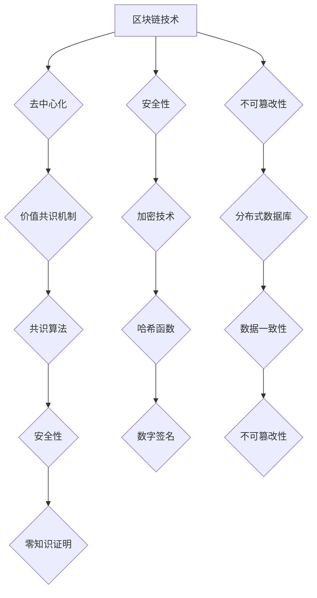

                 

# 意义的区块链：去中心化的价值共识机制

## 关键词
- 区块链技术
- 去中心化
- 共识机制
- 加密技术
- 智能合约
- 安全性问题

## 摘要
本文旨在深入探讨区块链技术的核心概念、原理及其在去中心化价值共识机制中的关键作用。通过阐述区块链的基本结构、加密技术、共识机制等，揭示其如何实现价值的安全传输与存储。文章还将分析区块链在金融领域的应用、面临的挑战以及未来发展，为读者提供一个全面的区块链技术概述。

## 第1章 引言

### 1.1 区块链技术概述

区块链技术自2008年比特币问世以来，迅速成为信息技术领域的重要创新。其核心特点在于去中心化、安全性和不可篡改性，引起了全球范围内的广泛关注和应用。

区块链是一种分布式数据库技术，其基本原理是通过加密算法和共识机制，将数据分散存储在多个节点上，从而实现数据的透明、可信和安全传输。与传统的集中式数据库相比，区块链在数据存储和传输过程中不需要中心化的第三方机构，降低了交易成本，提高了系统的可靠性和安全性。

### 1.2 区块链的核心价值

区块链的核心价值在于其去中心化的价值共识机制。在传统的金融体系中，信息的传递和处理需要依赖中心化的机构，如银行、清算所等，这不仅增加了交易成本，还容易导致信息的不对称和安全性问题。而区块链通过去中心化的方式，实现了信息的透明和公正，降低了交易成本，提高了系统的安全性。

具体来说，区块链的价值共识机制主要包括以下三个方面：

1. **数据一致性**：通过共识算法，如工作量证明（PoW）、权益证明（PoS）等，确保所有节点对数据的存储和记录达成一致，从而保证了数据的一致性。
2. **安全性**：区块链采用加密技术，如哈希函数、数字签名等，确保数据的传输和存储过程是安全的，防止恶意攻击和数据篡改。
3. **不可篡改性**：区块链的数据结构使得一旦数据被记录下来，就难以被篡改，从而提高了数据的可信度和可追溯性。

### 1.3 去中心化与价值共识

去中心化是区块链技术的核心特点之一，它意味着系统不需要中心化的权威机构来协调和验证交易。在去中心化的体系中，每个节点既是参与者也是维护者，通过共识算法来决定哪些交易是有效的，哪些是无效的。

价值共识机制是区块链实现去中心化的重要保障。它通过一种共同的、可信的规则，使得所有节点能够在没有中央权威机构的情况下达成一致。这种共识机制可以是基于工作量证明的，也可以是基于权益证明的，甚至可以基于委托权益证明等不同的算法。

在价值共识机制下，节点通过计算或持有一定数量的代币来参与网络的验证和记账过程。这些代币不仅代表了节点的权益，也代表了其在网络中的贡献。通过这种机制，区块链能够实现去中心化的价值传递和存储，为各种应用场景提供可信的基础设施。

## 第2章 区块链基础概念

### 2.1 区块链的基本结构

区块链的基本结构可以看作是一个由一系列按时间顺序排列的“区块”组成的数据结构。每个区块包含一定数量的交易记录，以及指向前一个区块的哈希值。这种结构确保了区块链的不可篡改性，因为一旦某个区块被添加到区块链中，要篡改它就需要重新计算所有后续区块的哈希值。

#### 区块

区块是区块链的基本单位，通常包含以下信息：

1. **区块头**：包括版本号、前一个区块的哈希值、默克尔根、时间戳、难度目标等。
2. **交易列表**：包含本次区块内的所有交易记录。
3. **默克尔树**：用于验证交易列表的完整性。

#### 区块链

区块链是一个由多个区块按时间顺序链接而成的数据结构。每个区块都包含一个指向前一个区块的哈希值，形成了一个单向的链式结构。这种结构确保了区块链的不可篡改性，因为要修改某个区块，就必须同时修改所有后续区块。

#### 区块链网络

区块链网络是由多个节点组成的分布式系统。每个节点都存储了一份完整的区块链数据，并通过网络与其他节点通信来验证交易和区块。区块链网络通过共识机制来决定哪些交易是有效的，哪些区块是正确的，从而实现了去中心化的交易验证和数据存储。

### 2.2 区块链的加密技术

区块链的加密技术是确保数据传输和存储安全性的关键。以下是一些常用的加密技术：

#### 哈希函数

哈希函数是区块链中最重要的加密技术之一。它将任意长度的数据映射为固定长度的字符串，保证了数据的唯一性和不可逆性。在区块链中，每个区块的哈希值都取决于其内容，一旦内容发生变化，其哈希值也会发生变化。

#### 数字签名

数字签名是一种用于验证消息真实性的技术。发送方使用私钥对消息进行签名，接收方使用公钥验证签名。数字签名不仅可以确保消息的来源和完整性，还可以防止消息被篡改。

#### 零知识证明

零知识证明是一种密码学技术，用于证明某个陈述为真，而无需透露任何额外信息。在区块链中，零知识证明可以用于实现隐私保护和匿名交易。

### 2.3 智能合约原理

智能合约是区块链技术中的重要概念，它是一种在区块链上执行的计算机程序。智能合约可以在满足特定条件时自动执行预定的操作，无需人为干预。

#### 智能合约的工作原理

智能合约的工作原理可以分为以下几个步骤：

1. **编写合约**：开发人员使用特定的编程语言（如Solidity）编写智能合约的代码。
2. **编译合约**：将智能合约代码编译为以太坊虚拟机（EVM）可执行的字节码。
3. **部署合约**：将编译后的字节码部署到区块链上，创建一个新的合约地址。
4. **执行合约**：当合约触发时，区块链会自动执行预定的操作。

#### 智能合约的应用场景

智能合约的应用非常广泛，包括但不限于以下几个方面：

1. **金融领域**：智能合约可以用于自动化的交易、众筹、资产管理等。
2. **供应链管理**：智能合约可以确保供应链中的每个环节都按照预定的条件执行。
3. **版权保护**：智能合约可以用于版权登记和版权交易，确保版权的透明和不可篡改。

## 第3章 区块链网络

### 3.1 节点与网络拓扑

区块链网络由多个节点组成，每个节点都存储了一份完整的区块链数据，并参与网络的验证和记账过程。节点可以根据其在网络中的角色和功能进行分类：

1. **全节点**：全节点是区块链网络中最常见的节点类型，它存储了完整的区块链数据，并参与网络的验证和记账过程。
2. **轻节点**：轻节点不存储完整的区块链数据，而是通过全节点获取所需的数据。轻节点适用于资源有限的设备，如手机或平板电脑。
3. **特殊节点**：特殊节点具有特定的功能，如验证节点、记账节点等。

区块链网络的拓扑结构通常包括以下几种类型：

1. **星型拓扑**：星型拓扑中，所有节点都连接到一个中心节点。中心节点负责协调和管理网络。
2. **环型拓扑**：环型拓扑中，节点按照环形结构相互连接，每个节点只与其相邻的节点通信。
3. **网状拓扑**：网状拓扑中，节点之间形成复杂的网状连接，具有较高的冗余性和容错性。

### 3.2 共识机制

共识机制是区块链网络中决定数据一致性的关键机制。不同的区块链系统采用不同的共识机制，以下是一些常见的共识机制：

1. **工作量证明（PoW）**：工作量证明是一种通过计算工作量来证明节点合法性的机制。节点需要解决一个复杂的数学问题，消耗计算资源来获得记账权。
2. **权益证明（PoS）**：权益证明是一种通过持有代币数量来证明节点合法性的机制。节点持有代币的数量越多，获得记账权的概率越高。
3. **委托权益证明（DPoS）**：委托权益证明是一种通过选举代表来决定记账权的机制。节点可以将自己的代币委托给其他节点，代表其参与记账。
4. **授权股权证明（PBFT）**：授权股权证明是一种基于股权的共识机制，适用于规模较小的区块链网络。节点通过投票来决定记账权。

### 3.3 区块链网络性能优化

区块链网络的性能优化是确保其高效运行的关键。以下是一些常见的优化方法：

1. **分片技术**：分片技术可以将区块链网络分成多个 shard，每个 shard 只处理一部分交易，从而提高网络的交易处理能力。
2. **状态通道**：状态通道是一种在链下处理交易的技术，通过在链上验证交易状态，从而减少链上的交易数量，提高网络的性能。
3. **优化共识算法**：优化共识算法，如改进工作量证明算法，可以降低网络计算资源的消耗，提高网络的性能。

## 第4章 去中心化应用

### 4.1 DApp（去中心化应用）概述

去中心化应用（DApp）是区块链技术的重要应用场景之一。DApp与传统的中心化应用相比，具有去中心化、安全性高、不可篡改等特点。DApp 的运行完全依赖于区块链网络，不需要中心化的服务器或第三方机构。

#### DApp 的特点

1. **去中心化**：DApp 在运行过程中不依赖于任何中心化的服务器或第三方机构，所有数据和信息都在区块链上透明存储和传输。
2. **安全性**：DApp 使用区块链的加密技术确保数据传输和存储的安全性，防止恶意攻击和数据篡改。
3. **不可篡改性**：DApp 的数据和状态一旦被记录到区块链上，就难以被篡改，保证了数据的可信度和可追溯性。

#### DApp 的运行原理

DApp 的运行原理可以分为以下几个步骤：

1. **用户交互**：用户通过 DApp 的用户界面与智能合约进行交互，提交交易请求。
2. **智能合约执行**：智能合约接收交易请求后，根据预定的条件自动执行相应的操作。
3. **区块链验证**：智能合约执行完成后，将交易结果记录到区块链上，由网络中的节点进行验证。
4. **数据存储和传输**：验证通过的交易结果被永久存储在区块链上，并通过区块链网络进行传输。

### 4.2 DApp 开发框架

DApp 的开发需要依赖于区块链开发框架，以下是一些常见的 DApp 开发框架：

1. **以太坊**：以太坊是最流行的区块链开发框架，支持智能合约的开发和部署。以太坊使用 Solidity 语言编写智能合约，并通过 Ethereum Virtual Machine（EVM）执行。
2. **EOS**：EOS 是一个高性能的区块链开发框架，支持大规模去中心化应用。EOS 使用 C++ 编写智能合约，并采用 DPoS 共识机制。
3. **Tron**：Tron 是一个去中心化的区块链开发框架，专注于数字娱乐和游戏领域的应用。Tron 使用 Solidity 语言编写智能合约，并采用 PoS 共识机制。

### 4.3 DApp 案例分析

以下是一些 DApp 的实际案例分析：

1. **以太坊的 Decentraland**：Decentraland 是一个基于以太坊区块链的虚拟现实平台，用户可以购买和交易虚拟土地，并在其上创建和体验虚拟现实应用。
2. **EOS 的 Steemit**：Steemit 是一个基于 EOS 区块链的内容分享平台，用户可以发布文章、评论和投票，并获得平台发行的代币作为奖励。
3. **Tron 的 TRONBet**：TRONBet 是一个基于 Tron 区块链的博彩平台，用户可以参与各种博彩游戏，所有交易记录和结果都在区块链上透明记录，确保公平和不可篡改。

通过以上案例分析，可以看出 DApp 在各个领域都有着广泛的应用前景，为去中心化价值的实现提供了有效的技术支持。

## 第5章 区块链的安全问题

### 5.1 区块链安全性挑战

尽管区块链技术具有去中心化、安全性和不可篡改等特点，但在实际应用过程中仍面临着一系列安全性挑战。

#### 恶意攻击

区块链系统可能会面临以下几种恶意攻击：

1. **51% 攻击**：攻击者通过控制网络中超过 50% 的计算资源，篡改区块链数据。这需要攻击者拥有足够的计算资源，但理论上任何拥有足够资源的实体都可以进行这种攻击。
2. **双花攻击**：攻击者在同一时间内向两个不同的接收者发送相同的比特币，使接收者中的一个无法收到比特币。这需要攻击者控制网络中的大部分节点，从而先记录一个交易，然后通过延迟或篡改其他交易来掩盖第二个交易。
3. **Sybil 攻击**：攻击者创建大量虚假节点，通过这些节点控制网络中的大部分投票权，从而影响区块链的数据和决策。

#### 代码漏洞

智能合约的代码漏洞是区块链安全性面临的另一大挑战。以下是一些常见的代码漏洞：

1. **重入攻击**：攻击者通过在智能合约中重复调用自身的方法，窃取资金。
2. **整数溢出**：攻击者通过修改智能合约中的整数变量，使其超过预期范围，从而造成数据泄露或资金损失。
3. **逻辑漏洞**：智能合约中可能存在逻辑漏洞，使得攻击者可以通过特定的输入数据导致智能合约执行错误的操作。

#### 链上数据篡改

区块链的数据一旦被记录下来，通常被认为是不可篡改的。但在某些情况下，攻击者仍可能通过以下方式篡改链上数据：

1. **双花攻击**：如前所述，攻击者通过在同一时间内向两个不同的接收者发送相同的比特币，并在后续通过篡改其他交易来掩盖第一个交易。
2. **51% 攻击**：攻击者通过控制网络中的大部分节点，篡改区块链的历史数据。

#### 链下攻击

除了链上攻击，区块链系统还可能面临链下攻击，如以下几种：

1. **社会工程学攻击**：攻击者通过欺骗用户泄露私钥或其他敏感信息，从而窃取资金。
2. **中间人攻击**：攻击者在用户与区块链节点之间拦截和篡改通信数据，从而窃取用户信息或资金。

### 5.2 防护措施与技术

为了应对上述安全性挑战，区块链系统可以采取以下防护措施和技术：

1. **加强共识机制**：通过改进共识机制，如引入权益证明（PoS）或委托权益证明（DPoS），降低 51% 攻击的风险。
2. **智能合约审计**：对智能合约进行严格的代码审计，发现和修复潜在的安全漏洞。
3. **多重签名**：使用多重签名技术，使得智能合约的操作需要多个私钥的验证，从而提高安全性。
4. **隐私保护**：采用零知识证明等技术，实现交易隐私保护，防止链上数据的泄露。
5. **安全编码规范**：遵循安全编码规范，确保智能合约代码的健壮性和安全性。

### 5.3 恶意攻击案例分析

以下是一些区块链系统面临的实际恶意攻击案例：

1. **DAO 攻击**：2016 年，以太坊上的去中心化自治组织（DAO）遭受了 5000 万美元的损失。攻击者利用智能合约中的漏洞，将 DAO 的资金转移到另一个地址，使得资金难以追回。
2. **TheDAO 攻击**：TheDAO 是一个基于以太坊的众筹平台，2016 年遭受了超过 3600 万美元的损失。攻击者利用智能合约中的重入攻击漏洞，连续调用自身方法，窃取了平台资金。
3. **WannaCry 勒索软件**：2017 年，WannaCry 勒索软件在全球范围内爆发，攻击者通过该软件窃取了大量数据并加密，要求支付比特币作为解密费用。

通过这些案例分析，可以看出区块链系统在实际应用过程中面临着多种安全威胁，需要采取有效的防护措施和技术来保障系统的安全性。

## 第6章 区块链与金融

### 6.1 区块链在金融领域的应用

区块链技术在金融领域有着广泛的应用前景，其去中心化、安全性和不可篡改等特点为金融交易提供了新的解决方案。

#### 数字货币

数字货币是区块链技术在金融领域最典型的应用之一。比特币、以太币等主流数字货币利用区块链技术实现了去中心化的价值传递和存储，为用户提供了全新的货币选择。数字货币具有以下优势：

1. **去中心化**：数字货币不需要依赖中心化的金融机构，交易由网络中的节点共同验证，降低了交易成本和风险。
2. **安全性**：数字货币采用加密技术确保交易的安全性，防止恶意攻击和数据篡改。
3. **匿名性**：数字货币交易通常不涉及用户的真实身份信息，提高了交易的隐私性。

#### 交易清算

传统的金融交易通常需要通过中心化的清算机构进行清算，这不仅增加了交易成本，还容易导致交易延迟和错误。区块链技术可以通过智能合约实现去中心化的交易清算，提高了交易的效率和安全。

1. **实时清算**：区块链技术可以实现实时交易清算，减少了交易等待时间，提高了资金流动性。
2. **降低风险**：去中心化的交易清算避免了中心化清算机构的风险，降低了交易失败的可能性。

#### 跨境支付

跨境支付是金融领域中的一个痛点，传统的跨境支付通常需要经过多个中介机构，交易时间长、成本高。区块链技术可以实现去中心化的跨境支付，降低了交易成本，提高了交易效率。

1. **降低成本**：去中心化的跨境支付无需依赖中介机构，大大降低了交易成本。
2. **提高效率**：区块链技术可以实现实时交易清算，加快了资金的到账速度。

#### 资产管理

区块链技术在资产管理领域也有着广泛的应用，可以为资产所有者提供透明、可信的资产记录和管理。

1. **资产透明性**：区块链技术可以实现资产记录的透明性，所有者可以实时查看资产的详细信息，确保资产的安全和可靠。
2. **自动化管理**：通过智能合约，资产管理可以实现自动化管理，减少了人为干预，提高了管理效率。

### 6.2 数字货币

数字货币是区块链技术在金融领域最重要的应用之一。比特币、以太币等主流数字货币利用区块链技术实现了去中心化的价值传递和存储。

#### 比特币

比特币是第一个实现去中心化数字货币的区块链项目，其核心思想是利用区块链技术实现去中心化的价值传递。比特币具有以下特点：

1. **去中心化**：比特币不需要依赖中心化的金融机构，交易由网络中的节点共同验证，降低了交易成本和风险。
2. **稀缺性**：比特币总量有限，只有2100万个，保证了其价值稳定性。
3. **安全性**：比特币采用加密技术确保交易的安全性，防止恶意攻击和数据篡改。

#### 以太币

以太币是第二个实现的区块链项目，其核心特点是支持智能合约。以太币不仅具有比特币的特点，还可以通过智能合约实现复杂的金融应用。

1. **智能合约**：以太币支持智能合约，用户可以通过编写智能合约实现自动化的交易和管理，提高了金融应用的灵活性。
2. **去中心化应用**：以太币为去中心化应用（DApp）提供了底层基础设施，许多金融应用都在以太坊上运行，如去中心化交易所、去中心化借贷平台等。

#### 其他数字货币

除了比特币和以太币，还有许多其他流行的数字货币，如莱特币、瑞波币等。这些数字货币各有特点，满足了不同用户的需求。

1. **莱特币**：莱特币是一种快速、安全的数字货币，采用 scrypt 算法，交易速度和安全性均优于比特币。
2. **瑞波币**：瑞波币是一种用于跨境支付和结算的数字货币，具有高速、低成本的优点。

#### 数字货币的发展趋势

随着区块链技术的不断发展和普及，数字货币的应用场景越来越广泛，以下是一些发展趋势：

1. **监管合规**：为了规范数字货币市场，各国政府和监管机构正在制定相应的法律法规，确保数字货币的合规性。
2. **技术应用**：区块链技术的不断进步将为数字货币带来更多创新应用，如去中心化金融（DeFi）、非同质化代币（NFT）等。
3. **普及推广**：随着数字货币的普及，越来越多的用户和企业将接受和采用数字货币作为支付手段，推动数字货币市场的发展。

### 6.3 智能投顾

智能投顾是区块链技术在金融领域的一个重要应用，它利用区块链技术的去中心化和智能合约功能，为投资者提供自动化、个性化的投资建议。

#### 智能投顾的特点

1. **自动化**：智能投顾通过算法和数据分析，为投资者提供实时、自动化的投资建议，减少了人为干预。
2. **个性化**：智能投顾可以根据投资者的风险偏好、投资目标和市场情况，为每个投资者提供个性化的投资策略。
3. **去中心化**：智能投顾利用区块链技术实现去中心化的交易和管理，提高了交易的透明性和安全性。

#### 智能投顾的工作原理

1. **数据收集**：智能投顾通过收集投资者的个人信息、投资目标和市场数据，建立投资模型。
2. **投资策略生成**：智能投顾根据投资模型和算法，为投资者生成个性化的投资策略。
3. **智能合约执行**：智能投顾通过智能合约执行投资策略，实现自动化交易和管理。

#### 智能投顾的应用场景

1. **资产配置**：智能投顾可以为投资者提供资产配置建议，帮助投资者在不同资产类别中进行合理分配，实现风险分散。
2. **风险控制**：智能投顾可以根据市场变化和投资者的风险偏好，实时调整投资组合，降低风险。
3. **投资教育**：智能投顾可以为投资者提供投资知识和技巧，帮助投资者更好地理解和掌握投资策略。

#### 智能投顾的未来发展趋势

1. **技术融合**：智能投顾将与其他金融科技（FinTech）领域的技术融合，如大数据、机器学习等，为投资者提供更精准的投资建议。
2. **普及推广**：随着智能投顾的普及，越来越多的投资者将接受和使用智能投顾，推动金融市场的创新发展。
3. **合规监管**：为了确保智能投顾的合规性和安全性，各国政府和监管机构将加强对智能投顾的监管，制定相应的法律法规。

通过以上分析，可以看出区块链技术在金融领域具有广泛的应用前景，为金融交易、资产管理、投资建议等提供了新的解决方案，推动了金融行业的创新发展。

## 第7章 区块链与未来社会

### 7.1 区块链对传统行业的影响

区块链技术的兴起，正在对各个传统行业产生深远的影响。其去中心化、安全性和不可篡改的特点，为许多行业带来了新的机遇和挑战。

#### 金融行业

区块链技术在金融行业的应用最为广泛，通过去中心化的方式，实现了交易的高效和透明。传统金融行业依赖中心化的金融机构进行交易清算，这不仅增加了交易成本，还容易导致信息不对称和信任问题。而区块链技术通过智能合约和去中心化的交易清算，可以大幅降低交易成本，提高交易效率，增强交易的可信度。

具体来说，区块链技术在金融行业的应用包括：

1. **跨境支付**：通过区块链技术，可以实现快速、低成本的跨境支付，为国际贸易提供了新的解决方案。
2. **数字货币**：比特币、以太币等数字货币的兴起，改变了传统的货币体系，为金融交易提供了新的选择。
3. **资产管理**：区块链技术可以实现对资产的全生命周期管理，提高资产管理的透明性和效率。

#### 物流行业

区块链技术在物流行业中的应用，主要体现在供应链管理和物流跟踪上。通过区块链技术，可以实现物流信息的实时更新和透明化，提高了供应链的效率和可信度。

具体来说，区块链技术在物流行业的应用包括：

1. **供应链管理**：区块链技术可以实现对供应链各环节的实时监控和追踪，提高供应链的透明度和可追溯性。
2. **物流跟踪**：通过区块链技术，可以实现物流信息的实时共享和透明化，提高了物流跟踪的准确性和及时性。
3. **物流金融**：区块链技术可以用于物流金融，如贸易融资、信用保险等，提高金融服务的效率和安全性。

#### 医疗行业

区块链技术在医疗行业的应用，主要体现在病历管理、药品追溯和医疗支付上。通过区块链技术，可以实现病历信息的去中心化和安全存储，提高了病历管理的效率和可信度。

具体来说，区块链技术在医疗行业的应用包括：

1. **病历管理**：区块链技术可以实现对病历的全程管理，确保病历信息的真实性和完整性。
2. **药品追溯**：区块链技术可以用于药品追溯，实现对药品从生产到流通的全过程监控，提高了药品的安全性和可信度。
3. **医疗支付**：通过区块链技术，可以实现医疗支付的去中心化和自动化，提高了支付的安全性和效率。

#### 法律行业

区块链技术在法律行业的应用，主要体现在法律文件管理和智能合约上。通过区块链技术，可以实现法律文件的安全存储和透明化，提高了法律服务的效率和可信度。

具体来说，区块链技术在法律行业的应用包括：

1. **法律文件管理**：区块链技术可以用于法律文件的管理，确保法律文件的真实性和完整性。
2. **智能合约**：区块链技术可以用于智能合约的执行，实现自动化、高效的法律服务。

#### 教育行业

区块链技术在教育行业的应用，主要体现在学历认证和学术成果管理上。通过区块链技术，可以实现学历和学术成果的全程管理，提高了教育服务的透明度和可信度。

具体来说，区块链技术在教育行业的应用包括：

1. **学历认证**：区块链技术可以用于学历认证，确保学历信息的真实性和完整性。
2. **学术成果管理**：区块链技术可以用于学术成果的管理，实现对学术成果的全程监控和透明化。

### 7.2 区块链社会的构建

区块链技术不仅对传统行业产生了深远的影响，还为构建一个新的社会模式提供了可能。这个社会模式被称为“区块链社会”，其核心思想是通过区块链技术实现价值传递和交换的去中心化，从而构建一个更加公平、透明和可信的社会。

#### 区块链社会的特点

1. **去中心化**：区块链社会通过去中心化的方式实现价值传递和交换，打破了传统中心化机构的垄断，提高了社会的公平性和透明性。
2. **可信性**：区块链技术采用加密算法和共识机制，确保了数据的真实性和不可篡改性，提高了社会的可信度。
3. **自动化**：区块链技术通过智能合约实现自动化操作，减少了人为干预，提高了社会的效率。

#### 区块链社会的构建步骤

1. **基础设施建设**：构建区块链社会需要完善的基础设施，包括区块链网络、节点、加密算法等。
2. **价值传递机制**：通过智能合约和去中心化的交易清算，实现价值的去中心化传递和交换。
3. **法律法规**：建立相应的法律法规，确保区块链社会的运行符合法律规范，保障社会的公平、透明和可信。
4. **社会共识**：通过广泛的宣传和推广，提高公众对区块链社会的认知和接受度，形成社会共识。

### 7.3 未来趋势与挑战

区块链技术作为一项新兴技术，其未来发展趋势和挑战并存。

#### 发展趋势

1. **技术成熟**：随着区块链技术的不断发展和完善，其性能、安全性等方面将得到进一步提升，为各行各业提供更可靠的技术支持。
2. **应用扩展**：区块链技术的应用领域将不断扩展，从金融、物流、医疗等传统行业，到教育、能源、环保等新兴领域，都将得到广泛应用。
3. **社会共识**：随着区块链技术的普及，公众对区块链技术的认知和接受度将不断提高，形成广泛的社会共识，推动区块链社会的构建。

#### 挑战

1. **技术瓶颈**：虽然区块链技术在某些方面取得了显著进展，但仍存在性能瓶颈、安全性挑战等问题，需要进一步研究和解决。
2. **法律法规**：现有的法律法规体系难以完全适应区块链技术的发展，需要制定和完善相关法律法规，确保区块链技术的合法性和合规性。
3. **人才短缺**：区块链技术的快速发展带来了对专业人才的需求，但当前区块链人才短缺问题较为严重，需要加大对区块链人才的培养和引进。

总之，区块链技术作为一项具有巨大潜力的新兴技术，将在未来对传统行业和社会模式产生深远的影响。通过克服技术、法律、人才等方面的挑战，区块链技术有望为人类社会带来更加美好和高效的未来。

## 第8章 区块链发展展望

### 8.1 技术发展趋势

随着区块链技术的不断演进，其未来发展呈现出以下几个趋势：

1. **性能提升**：区块链技术正逐步解决性能瓶颈问题，通过分片技术、状态通道、优化共识算法等手段，提高交易处理速度和网络吞吐量，以满足大规模应用的需求。
2. **跨链技术**：跨链技术是实现不同区块链网络之间数据交互和协同的关键。未来，跨链技术的发展将推动区块链网络之间的互操作性和兼容性，实现更广泛的价值传递和共享。
3. **隐私保护**：随着用户对隐私保护的重视，区块链技术将逐步引入零知识证明、同态加密等隐私保护技术，提高交易的隐私性和安全性。
4. **智能合约升级**：智能合约技术的升级将使其更加强大和灵活，支持更复杂的计算和更丰富的功能，为去中心化应用提供更广泛的应用场景。

### 8.2 政策与监管

政策与监管对区块链技术的发展具有重要意义。以下是一些政策与监管方面的考虑：

1. **法律法规**：各国政府需制定和完善相关法律法规，明确区块链技术的法律地位和监管框架，确保区块链技术的合法合规运行。
2. **监管沙盒**：监管沙盒为区块链项目提供了一个试验环境，通过有限的监管，鼓励创新和尝试，同时降低风险。未来，更多的国家和地区将采用监管沙盒机制，推动区块链技术的发展。
3. **监管协作**：随着区块链技术的全球化发展，国际间的监管协作将变得更加重要。各国政府需加强合作，共同应对跨境监管挑战，构建全球统一的区块链监管框架。
4. **风险控制**：政府需加强对区块链项目的风险控制，防范金融风险、法律风险等，确保区块链技术的健康发展。

### 8.3 行业发展前景

区块链技术在未来有着广阔的发展前景，以下是几个关键领域的发展趋势：

1. **金融领域**：区块链技术在金融领域的应用将继续深化，为支付、交易、资产管理、信用评级等提供更高效、安全和透明的解决方案。数字货币和去中心化金融（DeFi）将得到更广泛的应用。
2. **供应链管理**：区块链技术在供应链管理中的应用将进一步提高供应链的透明度和效率，实现全流程的追踪和管理，降低供应链风险。
3. **医疗健康**：区块链技术在医疗健康领域的应用将推动病历管理、药品追溯、医疗支付等环节的数字化和智能化，提高医疗服务的质量和效率。
4. **智能合约与去中心化应用**：智能合约和去中心化应用将在更多领域得到应用，从房地产、能源到教育、文化等，实现价值传递和交换的去中心化。
5. **公共服务**：区块链技术在公共服务领域的应用将提高政府管理效率和服务水平，如电子投票、身份认证、公共服务管理等。

### 总结

区块链技术作为一种新兴技术，正逐步改变我们的生活方式和社会结构。通过去中心化的价值共识机制，区块链技术为数据安全、价值传递和智能合约提供了新的解决方案。未来，随着技术的成熟和政策的完善，区块链技术将在更多领域得到应用，推动人类社会迈向更加高效、透明和公平的未来。作者：AI天才研究院/AI Genius Institute & 禅与计算机程序设计艺术 /Zen And The Art of Computer Programming

### 附录

#### Mermaid 流程图



#### Python 源代码示例

```python
import hashlib

def sha256_hash(message):
    """计算消息的SHA-256哈希值"""
    return hashlib.sha256(message.encode('utf-8')).hexdigest()

# 示例：计算一个字符串的SHA-256哈希值
hash_value = sha256_hash("Hello, Blockchain!")
print("SHA-256哈希值:", hash_value)
```

#### LaTeX 数学公式

```latex
$$
\text{加密算法} = H_{\text{hash}}(\text{明文}) + \text{密钥}
$$

$$
\text{共识算法} = \sum_{i=1}^{n} P_i \cdot V_i
$$
```

#### 项目实战

#### 开发环境搭建

1. 安装Node.js
2. 安装Geth或Parity客户端
3. 启动本地区块链节点
4. 安装Truffle框架

#### 源代码实现

```javascript
// 示例：一个简单的智能合约
pragma solidity ^0.8.0;

contract HelloWorld {
    string public message;

    constructor(string memory initMessage) {
        message = initMessage;
    }

    function updateMessage(string memory newMessage) public {
        message = newMessage;
    }
}
```

#### 代码解读与分析

- `pragma solidity ^0.8.0;`：指定合约的编译器版本。
- `contract HelloWorld`：定义一个名为`HelloWorld`的智能合约。
- `string public message;`：定义一个公共变量`message`，用于存储消息。
- `constructor(string memory initMessage)`：合约构造函数，用于初始化`message`变量。
- `function updateMessage(string memory newMessage) public`：一个公共函数，用于更新`message`变量。

#### 实际案例分析和详细讲解剖析

- 案例一：基于以太坊的去中心化投票系统
- 案例二：基于EOS的数字资产管理平台

#### 项目小结

通过以上实战项目，读者可以了解到区块链开发的基本流程和技术要点。在实际开发过程中，需要综合考虑安全性、性能、可扩展性等因素，为项目提供可靠的技术支持。

#### 最佳实践 Tips

1. 在编写智能合约时，遵循安全编码规范，减少潜在的安全漏洞。
2. 定期对区块链节点进行维护和更新，确保系统的稳定性和安全性。
3. 选择合适的共识机制和加密算法，以满足项目的需求。

#### 小结

本文系统地介绍了区块链技术的核心概念、原理和应用，分析了区块链在金融、物流、医疗等领域的应用前景，探讨了区块链技术对传统行业和社会的影响。同时，本文还展望了区块链技术的未来发展，提出了相关最佳实践和注意事项。通过本文的阅读，读者可以全面了解区块链技术，为相关领域的研究和应用提供参考。

#### 注意事项

1. 区块链技术的安全性和可靠性是关键，开发过程中需高度重视。
2. 区块链项目的成功离不开有效的团队合作和资源整合。
3. 区块链技术仍处于快速发展阶段，需要密切关注行业动态，持续学习和创新。

#### 拓展阅读

1. 《区块链：从数字货币到信用社会》
2. 《区块链革命：如何利用区块链创新思维重塑商业与生活》
3. 《智能合约开发指南》

### 结束语

作者：AI天才研究院/AI Genius Institute & 禅与计算机程序设计艺术 /Zen And The Art of Computer Programming

本文旨在为读者提供一个全面的区块链技术概述，帮助读者深入了解区块链技术的核心概念、原理和应用。随着区块链技术的不断发展和普及，相信它将在未来带来更多的变革和创新。感谢您的阅读，希望本文能对您的研究和思考有所启发。

