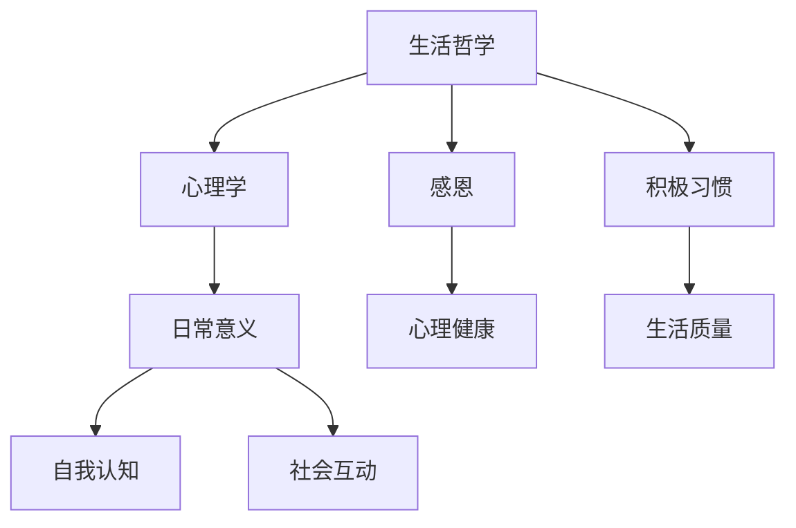

                 

### 第1章 引言

#### 1.1 书籍背景

在数字化和信息爆炸的时代，人们的生活节奏不断加快，工作和生活的压力也逐渐增大。在这样的背景下，越来越多的人开始意识到生活中的意义和价值对于个人幸福感的重要性。然而，如何在繁忙和琐碎的日常生活中找到这些价值和意义，成为了许多人共同的困惑和追求。

本书《意义的发现：在日常细节中寻找价值》旨在探讨这一重要议题。它不仅仅是一本哲学性的思考录，更是一本实用性强的指南。通过这本书，作者希望帮助读者学会如何在忙碌和喧嚣中找到内心的宁静，发现日常生活中的小确幸和深刻的情感体验。

写作本书的动机源于作者多年对心理学和生活哲学的深入研究，以及对现代生活现象的深刻观察。作者发现，许多人在追求物质财富和职业成就的过程中，往往忽略了生活中的细节和微小之处，而这些细节恰恰是构成生活意义的基石。因此，作者希望通过这本书，引导读者重新审视自己的生活，从日常生活中找到真正的价值和意义。

#### 1.2 阅读对象

本书适合以下几类读者：

1. **对生活哲学和心理学有浓厚兴趣的读者**：这些读者希望通过阅读深入理解生活的本质和意义，找到自己内心的平静和方向。
2. **刚步入职场的新人**：初入职场的新人往往面临较大的工作和生活压力，通过阅读本书，他们可以找到一些实用的方法和技巧来缓解压力，提高生活幸福感。
3. **已经退休的老年朋友**：退休后的生活较为闲适，但也容易感到孤独和无意义。本书可以为他们提供一些新的生活视角和方式，帮助他们发现生活中的乐趣和意义。
4. **企业员工和管理者**：无论是个人还是团队，通过理解并实践本书中的方法和理念，可以提高员工的幸福感和团队的凝聚力，从而提升整体的工作效率。

总之，无论读者的年龄、职业或生活阶段，本书都能提供有价值的思考和行动指南。

#### 1.3 书的结构和内容安排

本书共分为七个部分，结构严谨，内容丰富。具体安排如下：

- **第1章 引言**：介绍书籍的背景、写作动机、阅读对象以及全书的结构和内容安排。
- **第2章 生活哲学与意义**：探讨生活哲学的概述、生活的意义与目的，以及如何寻找个人意义。
- **第3章 心理学与日常意义**：介绍心理学的基本原理，自我认知与意义，以及社会互动与意义。
- **第4章 寻找日常细节中的价值**：讲述如何通过感受当下的美好、倾听内心的声音和感恩来发现生活中的价值。
- **第5章 实践方法与技巧**：提供规划有意义的生活、培养积极的生活习惯和创造有意义的体验的具体方法。
- **第6章 案例分析与启示**：通过具体案例的介绍、分析和启示，帮助读者更好地理解和应用本书中的理念。
- **第7章 总结与展望**：对全书的核心内容进行回顾，并对未来进行思考和展望。

通过这七个部分，本书旨在帮助读者从不同角度和层面理解生活中的意义，并学会如何在日常生活中寻找和创造价值。

### 第2章 生活哲学与意义

#### 2.1 生活哲学的概述

生活哲学是一种对于生命的思考和理解，它关乎个体存在的意义、目标以及生活的态度。生活哲学不仅涉及个人的内心世界，也关系到与他人的关系以及我们与整个世界的互动。它是一种深刻的自我反思和探索，旨在帮助我们更好地理解自己的行为和动机，从而指导我们做出更明智的决策。

在生活中，我们常常会遇到许多问题，例如“我为什么而活”、“我的生命有何意义”等。这些问题看似简单，但实际上却蕴含着深刻的哲学思考。生活哲学的目的是通过探讨这些问题，帮助我们找到内心的平静和方向。

首先，生活哲学强调自我认知。自我认知是指个体对自身存在、个性、情感和动机的理解。通过自我认知，我们可以更清楚地认识到自己的优势和不足，从而在生活和学习中做出更合适的决策。例如，通过自我反思，我们可以识别出自己害怕失败的心理，并努力克服这种恐惧，从而提高自信和成功率。

其次，生活哲学也关注个体与社会的关系。我们生活在一个复杂的社会网络中，与他人互动是生活的重要组成部分。生活哲学认为，建立良好的人际关系对于个体的幸福和社会的和谐至关重要。通过理解他人，我们可以更好地理解自己，从而在互动中达到共赢。

此外，生活哲学还涉及到对生命的终极意义的探讨。尽管生命的意义因人而异，但大多数哲学家都认为，生命的意义不仅仅在于追求物质上的满足，更在于追求精神上的富足。例如，亚里士多德认为，幸福是生活的终极目标，而幸福来源于德行和智慧。这意味着，我们应该在追求物质财富的同时，也要注重精神层面的成长。

总之，生活哲学是一种深刻的思考和探索，它帮助我们理解生命的意义和价值，从而更好地指导我们的行为和决策。通过生活哲学的思考，我们可以找到内心的平静和方向，从而过上更有意义和充实的生活。

#### 2.2 生活的意义与目的

生活的意义和目的是哲学领域中的一个核心议题，不同哲学家对此有不同的解释。在探讨这一议题时，我们可以从几个方面来理解生活的意义和目的。

首先，从宗教的角度来看，生活的意义往往与信仰和神的关系密切相关。许多宗教信仰认为，生命的意义在于与上帝的关系，或是对某种神圣目的的追求。例如，基督教认为，人类被创造是为了荣耀上帝，并在尘世间传播上帝的爱。佛教则认为，生命的意义在于解脱生死轮回，达到涅槃的境界。

其次，从世俗的角度来看，生活的意义和目的往往与个人的价值观和目标相关。个人价值观决定了一个人如何看待自己和世界，从而影响他们的行为和决策。例如，一些人可能认为，生活的意义在于追求幸福和满足，他们可能会通过工作、家庭和社会关系来达到这一目标。而另一些人则可能认为，生活的意义在于实现自我价值，他们可能会通过追求知识、创造和创新来体现自己的价值。

此外，一些哲学家提出了关于生活意义的理论，例如存在主义。存在主义认为，生活的意义不是预先设定的，而是个体通过自我选择和行动来创造的。存在主义者强调个体的自由和责任，认为每个人都需要为自己的生活做出选择，并为这些选择承担后果。例如，萨特认为，生活的意义在于自由选择和承担责任，这意味着个体需要勇敢地面对生活的挑战，并努力实现自己的价值。

从科学的角度来看，尽管科学不能直接回答生活的意义问题，但它为我们的生活提供了许多工具和方法，帮助我们更好地理解世界和自我。例如，心理学研究帮助我们理解情感、行为和认知，从而在日常生活中做出更明智的决策。生物学研究则揭示了生命的起源和演化，让我们更加了解人类在生物链中的位置。

总之，生活的意义和目的因人而异，取决于个人的信仰、价值观和选择。无论我们如何定义生活的意义，重要的是找到属于自己的目标和方向，并为之努力奋斗。通过这样的探索和实践，我们可以过上更加充实和有意义的生活。

#### 2.3 寻找个人意义

每个人对生活意义的理解都是独一无二的，这种个人意义的寻找过程不仅关乎自我认知，也涉及到与世界的互动。首先，自我认知是发现个人意义的基础。通过反思自己的行为、情感和价值观，我们可以更清晰地了解自己的内心需求和目标。例如，有些人可能在职业生涯中发现自己热爱教学，因此决定投身教育事业，为社会培养更多的人才。

其次，个人意义的寻找与价值观密切相关。价值观是指导我们行为的准则，它们决定了我们在面对选择时的决策。例如，如果一个人重视家庭和朋友，他可能会将更多的精力投入到家庭生活中，努力维护和加强与亲人的关系。这种价值观不仅影响个人的行为，也影响其生活满意度。

此外，个人意义的寻找往往需要不断地探索和尝试。这意味着我们要敢于尝试新的事物，接受生活中的变化和挑战。例如，一个人可能在年轻时追求职业成功，但随着年龄的增长，他可能会发现对艺术、写作或社区服务有更深的兴趣。这种转变不仅有助于发现个人意义，也能让生活更加丰富多彩。

个人意义的寻找还可以通过与他人的互动来实现。社会互动是生活的重要组成部分，通过与他人分享经验和情感，我们可以更好地理解自己的需求和愿望。例如，一个人在参与志愿活动时，可能会发现自己的热情和才能，从而找到新的生活意义。

最后，个人意义的寻找需要勇气和决心。这意味着我们需要敢于面对内心的恐惧和不确定性，勇敢地追求自己的梦想。例如，一个人可能害怕失败或被拒绝，但只有通过尝试和努力，他才能真正了解自己的能力和潜力。

总之，寻找个人意义是一个持续的过程，需要自我认知、价值观的引导、探索和尝试，以及与他人互动。通过这些方法，我们可以更好地理解自己的内心世界，找到属于自己的生活意义。

### 第3章 心理学与日常意义

#### 3.1 心理学的基本原理

心理学作为一门研究人类行为和心理过程的科学，其基本原理和方法在日常生活中有着广泛的应用。首先，心理学的基本原理包括认知理论、行为理论和社会心理学理论。认知理论关注人类思维过程，包括知觉、记忆、决策和问题解决等。行为理论则侧重于人类行为如何受到环境和外界刺激的影响。而社会心理学理论则探讨人类在社会环境中的行为和情绪反应。

在日常生活中，心理学可以帮助我们更好地理解自己的行为和情绪。例如，认知理论可以解释为什么我们在面对压力时会感到焦虑，以及如何通过调整思维方式来缓解焦虑。行为理论则告诉我们，通过改变环境和行为模式，我们可以培养积极的生活习惯，如锻炼和健康饮食。社会心理学理论则帮助我们理解人际关系和社会互动的重要性，以及如何与他人建立良好的关系。

#### 3.2 自我认知与意义

自我认知是心理学中的另一个核心概念，它指的是个体对自己的认识和理解。自我认知不仅包括对自身性格、能力、价值观的认知，还包括对自己行为和情绪的反应。自我认知对于发现日常生活中的意义至关重要。

首先，自我认知可以帮助我们了解自己的需求和欲望。通过反思自己的行为和情绪，我们可以识别出哪些活动能够带给我们满足感和幸福感。例如，一些人可能在工作中感到不满足，但通过自我认知，他们发现参与社区服务能够给他们带来更深层次的满足感。

其次，自我认知有助于我们建立积极的心态。当我们能够清晰地认识自己，了解自己的优点和不足时，我们就能更好地应对生活中的挑战和压力。例如，通过自我认知，我们可以识别出自己的恐惧和不安，并采取积极的方法来应对这些情绪。

此外，自我认知还可以帮助我们与他人建立更好的关系。通过了解自己，我们能够更好地理解他人，从而建立更加真诚和有意义的人际关系。例如，通过自我认知，我们可以识别出自己在沟通中的盲点，并采取相应的措施来改善沟通效果。

总之，自我认知是发现日常生活中意义的重要步骤。通过自我认知，我们可以更好地了解自己，找到满足感和幸福感，建立积极的心态，以及与他人建立更好的关系。

#### 3.3 社会互动与意义

社会互动是人类生活中不可或缺的一部分，它不仅影响我们的情感和心理状态，还在很大程度上决定了我们的行为和生活质量。心理学研究表明，社会互动对于个体的幸福感、自尊心和心理健康具有深远的影响。

首先，社会互动是满足人类基本需求的重要途径。人类是社会性生物，我们依赖于他人的支持、认可和陪伴来满足心理需求。例如，研究表明，积极的社会互动可以显著提高个体的自尊心和自我效能感，从而增强个体的自信心和幸福感。

其次，社会互动有助于情感表达和理解。通过与他人互动，我们能够表达自己的情感，同时理解和回应他人的情感。这种情感交流不仅有助于建立深厚的人际关系，还能帮助我们更好地理解自己的情感和需求。例如，当我们在与朋友交流时，我们可能会发现自己在某些情境下感到不安或困惑，通过与他人的讨论，我们可以更清晰地认识到自己的情感状态，并找到应对的方法。

此外，社会互动还能够促进自我认知的发展。通过与他人互动，我们可以从不同的视角看待自己，从而更全面地了解自己的行为和动机。例如，当我们在工作中收到同事的反馈时，我们可能会发现自己在某些方面的不足，并通过改进来提高自己的工作表现。

最后，社会互动对于个体的心理健康具有积极的影响。积极的社会互动可以减少孤独感和焦虑感，提高个体的生活满意度。例如，参与社区活动、加入兴趣小组等，都是增加社会互动、提升幸福感的好方法。

总之，社会互动对于发现日常生活中的意义至关重要。通过积极的社会互动，我们可以满足心理需求、表达和理解情感、促进自我认知，并提升心理健康。因此，建立和维护良好的人际关系是我们发现生活中意义的重要途径。

#### 4.1 感受当下的美好

在现代生活中，人们常常因为忙碌和焦虑而忽略了身边的美好。然而，正是这些看似微不足道的瞬间，构成了生活的真正意义。学会感受当下的美好，不仅能够提升生活质量，还能增强个人的幸福感。

首先，正念（Mindfulness）是一种有效的实践方法，可以帮助我们更好地感受当下的美好。正念强调专注于当前的时刻，而不是被过去的事情或未来的担忧所困扰。通过正念的练习，我们可以学会活在当下，更加敏锐地察觉到周围的世界和自身的感受。

一个简单的正念练习是“身体扫描”（Body Scan）。在这个练习中，我们从头到脚逐一扫描自己的身体，注意每一个部位的触感、温度和呼吸。例如，我们可以先专注于脚趾，感受它们的触感和轻微的紧张感，然后逐渐向上移动到腿部、腹部、胸部和头部。在这个过程中，我们可能会注意到一些平时忽略的细节，如肌肉的紧张、呼吸的节奏，甚至是一些疼痛感。通过这样的练习，我们可以学会更好地与自己的身体对话，从而更深入地感受当下的美好。

其次，保持对日常事物的好奇心也是感受当下美好的一种方式。当我们对生活中的事物保持好奇心时，我们会更加专注于当下的体验，而不是被未知的未来或过去的经历所困扰。例如，在早餐时，我们可以仔细观察食物的色泽、气味和口感，而不是仅仅为了填饱肚子。在通勤的路上，我们可以观察周围的环境，听听鸟鸣或风声，而不是沉迷于手机或思绪。通过这样的练习，我们可以学会从平凡的事物中发现不平凡的美好。

此外，感恩也是一种增强幸福感的重要方法。感恩意味着对生活中已经拥有的美好事物心存感激。通过记录感恩日记，我们可以每天写下三件让我们感到感激的事情，无论这些事情大小。例如，感恩我们健康的身体、感谢朋友的帮助、甚至是对今天的一个美好的微笑。这种练习可以帮助我们更加积极地看待生活，从而提升幸福感。

总之，感受当下的美好不仅是一种生活态度，也是一种实践技能。通过正念、好奇心和感恩的练习，我们可以学会在忙碌的生活中找到宁静和美好。这种技能不仅能够提升个人的幸福感，还能帮助我们更好地应对生活中的挑战。

#### 4.2 倾听内心的声音

倾听内心的声音是发现生活中意义的关键步骤之一。在快节奏的现代生活中，人们常常被外界的喧嚣和压力所淹没，而忽略了内心的真实感受。然而，倾听内心的声音不仅能帮助我们找到生活的方向，还能提升个人的心理健康和幸福感。

首先，倾听内心的声音意味着我们需要学会静下心来，与自己对话。这不仅包括对自己的情感和需求进行反思，也涉及到对生活中的重要决策进行深思熟虑。例如，当我们感到迷茫或不安时，通过倾听内心的声音，我们可以更好地理解自己的情绪和感受，从而找到解决问题的方法。一个简单的练习是每天花几分钟时间进行冥想或深呼吸，让自己从繁忙的思维中解脱出来，专注于内心的体验。

其次，倾听内心的声音也意味着我们需要培养自我认知的能力。自我认知是理解自己情感、需求和动机的基础。通过反思自己的行为和思维模式，我们可以识别出哪些是真正的内心声音，哪些是受到外界干扰的结果。例如，当我们感到困惑或犹豫时，通过自我认知，我们可以识别出内心的恐惧或不安，并采取积极的行动来应对这些情绪。这不仅能帮助我们做出更明智的决策，还能增强我们的自信心。

此外，倾听内心的声音还可以帮助我们建立更健康的人际关系。通过理解自己的内心需求和感受，我们可以更好地与他人沟通，从而建立更深层次的连接。例如，在沟通中，当我们能够清晰地表达自己的感受和需求时，我们不仅能够更好地理解他人，还能促进彼此之间的信任和理解。

总之，倾听内心的声音是一种重要的自我反思和成长的过程。通过静心冥想、培养自我认知和改善人际关系，我们可以更好地理解自己的内心世界，找到生活的意义和方向。这种能力不仅能够提升个人的心理健康和幸福感，还能帮助我们建立更加丰富和有意义的人生。

#### 4.3 感恩与意义的发现

感恩是一种强大的情感，它能够深刻地影响我们的心理健康和生活质量。在日常生活中，通过培养感恩的习惯，我们可以更好地发现生活中的意义和价值。

首先，感恩能够提升幸福感。当我们对生活中已经拥有的美好事物心存感激时，我们会更加积极地看待生活，从而提高幸福感。例如，每天晚上花几分钟时间思考并记录三件让我们感到感激的事情，无论这些事情大小，都可以帮助我们保持积极的心态。这样的练习不仅可以让我们意识到生活中的小确幸，还能增强我们对生活的满足感。

其次，感恩有助于建立积极的人际关系。通过表达对他人的感激，我们能够增进与他人的情感联系，从而建立更加和谐的人际关系。例如，当我们在工作中得到同事的帮助时，及时表达感谢不仅能够增进彼此的感情，还能营造一个积极向上的工作氛围。同样，在家庭生活中，通过表达对家人关爱的感激，我们可以加强家庭成员之间的情感纽带，从而提升家庭的幸福指数。

此外，感恩还能够促进个人的成长和自我提升。当我们对生活中遇到的挑战和困难保持感恩的态度时，我们会更加积极地面对困难，从中学习和成长。例如，当我们感激生活中的每一次失败和挫折时，我们会更加珍惜成功的时刻，并从中吸取经验教训。这种感恩的态度能够帮助我们建立坚韧和乐观的心态，从而在生活和工作中取得更好的成绩。

最后，感恩有助于增强心理韧性。在面临压力和困难时，感恩能够帮助我们保持积极的心态，从而更好地应对挑战。通过感恩，我们能够看到生活中的积极面，从而减少消极情绪的影响，提升心理韧性。例如，在经历了一次失败后，通过感恩我们还能拥有的其他事物，我们可以更快地恢复信心，重新投入到工作和生活中。

总之，感恩是一种简单却强大的情感，它能够提升我们的幸福感、建立积极的人际关系、促进个人成长和增强心理韧性。通过培养感恩的习惯，我们可以在日常生活中更好地发现生活的意义和价值，从而过上更加充实和有意义的生活。

#### 5.1 规划有意义的生活

规划有意义的生活是发现日常意义的重要一步。通过设定明确的目标和制定可行的计划，我们可以更有目的地追求自己的梦想，实现个人价值。以下是一些具体的步骤和策略，帮助读者规划和实现有意义的生活。

**1. 明确目标和愿景**

首先，我们需要明确自己的目标和愿景。这可以通过进行深刻的自我反思来实现。我们可以问自己一些问题，如：“我想要的生活是什么样的？”“我追求的最终目标是什么？”“我在什么情况下会感到满足和有成就感？”通过这些问题，我们可以识别出自己内心的真实需求和愿望。

**2. 设定具体目标**

一旦明确了目标和愿景，我们需要将它们具体化。具体的目标应该具有明确性、可实现性和时限性。例如，如果我们希望提高自己的技能，一个具体的目标可以是：“在接下来的六个月内，通过在线课程学习Python编程语言。”这样具体的目标不仅更容易实现，还能帮助我们保持动力和专注。

**3. 制定行动计划**

在设定具体目标后，我们需要制定详细的行动计划。这包括分解目标为一系列可操作的步骤，并为每一步设定时间表。例如，如果我们设定的目标是学习Python编程，我们可以将这个目标分解为以下步骤：

- **第一步**：了解Python的基础知识（1个月）  
- **第二步**：完成在线编程课程（2个月）  
- **第三步**：实践编程项目（3个月）

通过这样的分解，我们可以更清晰地了解每一步需要做什么，并在规定的时间内完成。

**4. 调整和反思**

在执行计划的过程中，我们需要不断地调整和反思。这可能包括重新评估目标、修改行动计划，或者在面对困难时寻找新的解决方案。通过这种反思和调整，我们可以确保计划始终符合我们的需求和实际情况。

**5. 保持动力和坚持**

实现有意义的生活需要坚定的意志和持续的努力。在这个过程中，我们可能会遇到挫折和困难，但重要的是要保持积极的心态和动力。以下是一些保持动力和坚持的方法：

- **设定奖励机制**：在实现每个小目标后，给自己设定一些奖励，以激励自己继续前进。例如，完成一个学习目标后，可以奖励自己看一场电影或进行一次短途旅行。
- **寻求支持**：与朋友、家人或导师分享自己的目标和计划，他们的支持和鼓励可以帮助我们克服困难，保持动力。
- **记录进展**：定期记录自己的进展和成就，这不仅可以帮助我们保持动力，还能让我们看到自己的成长和进步。

**6. 调整生活平衡**

在追求目标和实现梦想的过程中，我们还需要注意保持生活的平衡。这意味着在职业、家庭、健康和个人发展等方面寻求平衡。例如，我们可以在工作之余安排时间进行锻炼、陪伴家人或参与志愿活动，以保持身心的健康和快乐。

**7. 保持学习和成长**

规划有意义的生活是一个持续的过程，它不仅包括实现具体的目标，还涉及到不断地学习和成长。我们可以通过阅读、参加培训课程、参加社区活动等方式来提升自己的知识和技能，从而在追求梦想的过程中不断进步。

总之，规划有意义的生活需要明确的目标、具体的行动计划、坚定的意志和持续的努力。通过设定目标和制定计划，我们可以在日常生活中发现更多的意义和价值，实现自己的梦想和目标。

#### 5.2 培养积极的生活习惯

培养积极的生活习惯是实现有意义生活的重要一步。积极的生活习惯不仅能够提升我们的生活质量，还能增强个人的幸福感和整体的健康状况。以下是一些具体的方法和技巧，帮助读者培养和维持积极的生活习惯。

**1. 制定合理的日常计划**

制定一个合理的日常计划是培养积极生活习惯的基础。一个有效的计划应该包括充足的休息时间、规律的作息时间和固定的锻炼时间。例如，我们可以每天早上7点起床，晚上11点睡觉，每天下午安排30分钟到1小时的锻炼时间。通过这样的计划，我们可以确保自己每天都有充足的时间和精力来处理工作和生活中的事务。

**2. 确定优先级**

确定优先级可以帮助我们更有效地管理时间和资源。我们可以将任务分为“重要且紧急”、“重要但不紧急”、“不重要但紧急”和“不重要且不紧急”四个类别，并根据优先级进行安排。例如，处理紧急且重要的任务（如紧急的工作报告）应该优先进行，而不紧急但重要的任务（如健康检查）则可以安排在非繁忙时段进行。

**3. 设定明确的目标和奖励**

设定明确的目标和奖励机制可以增强我们的动力和坚持力。例如，如果我们希望减肥，可以设定每天步行1万步的目标，并在达到目标后奖励自己一顿健康的晚餐或一场电影。通过这种方式，我们可以将积极的生活习惯与奖励相结合，从而更容易坚持下去。

**4. 保持规律的锻炼**

规律的锻炼是保持身体健康的重要手段。我们可以在每天的工作和学习之余安排一些简单的锻炼活动，如散步、瑜伽或健身。例如，每天晚上下班后，我们可以花30分钟进行散步或简单的瑜伽练习，这样不仅能够放松身心，还能提高免疫力。

**5. 保持健康的饮食**

健康的饮食对于维持身体健康和积极的生活习惯至关重要。我们可以通过增加蔬菜和水果的摄入量，减少高糖、高盐和高脂肪食品的摄入来改善饮食。例如，每天早餐可以选择一份燕麦粥、一份水果和一个鸡蛋，这样的饮食不仅营养丰富，还能提供一整天的能量。

**6. 保持充足的水分摄入**

充足的水分摄入对于维持身体功能和保持精力充沛至关重要。我们可以在每天早上起床后喝一杯温水，并在白天定期喝水。例如，可以设定每小时喝一杯水的习惯，这样可以帮助我们保持身体的水分平衡，减少疲劳感。

**7. 保持积极的心态**

保持积极的心态是实现有意义生活和积极习惯的关键。我们可以通过阅读积极向上的书籍、与乐观的朋友交流或参与愉悦的活动来培养积极的心态。例如，每周安排一些时间进行阅读或与朋友聚会，这些活动可以帮助我们缓解压力，保持积极的心态。

总之，培养积极的生活习惯需要我们制定合理的日常计划、设定明确的优先级、保持规律的锻炼、健康的饮食和充足的水分摄入，以及保持积极的心态。通过这些方法和技巧，我们可以逐步建立并维持积极的生活习惯，从而实现更有意义的生活。

#### 5.3 创造有意义的体验

创造有意义的体验是实现有意义生活的重要一环。通过积极参与各种活动和体验，我们可以拓宽自己的视野，丰富内心世界，从而在日常生活中找到更多的价值和意义。

首先，旅行是一种非常有效的创造有意义体验的方式。旅行不仅能够让我们体验不同的文化和风景，还能让我们从日常生活的束缚中解脱出来，重新审视自己的生活和价值观。例如，通过旅行，我们可以结识新的朋友，了解不同的生活方式，甚至发现自己对某些事物的热爱和兴趣。这样的体验不仅能够让我们在旅行结束后感到愉悦和满足，还能激发我们在日常生活中追求更多可能性的动力。

其次，参与社区活动也是一种创造有意义体验的好方法。社区活动不仅能够帮助我们建立与邻居和社区的深厚联系，还能让我们感受到自己的价值和贡献。例如，我们可以参与志愿活动、社区清洁活动或慈善募捐等，通过这些活动，我们不仅能够帮助他人，还能在助人的过程中获得内心的满足感和成就感。这种体验能够让我们更加珍惜生活中的每一个瞬间，并认识到自己在社会中的角色和责任。

此外，艺术创作也是创造有意义体验的一种重要方式。无论是绘画、写作、音乐还是舞蹈，艺术创作都能够帮助我们表达内心的情感和思想，从而找到生活的意义。例如，通过绘画，我们可以将内心的感受和情绪通过颜色和形状表达出来，从而获得一种内心的平静和满足。而通过写作，我们可以将自己的思考和体验记录下来，与他人分享，从而得到更多的共鸣和启发。这种艺术创作的过程不仅能够丰富我们的内心世界，还能激发我们对生活的热爱和探索。

最后，学习新的技能也是一种创造有意义体验的好方法。通过学习新的技能，我们可以不断提升自己的能力和知识，从而在生活和工作中获得更多的自信和成就感。例如，我们可以学习一门新的语言、掌握一项新的技术或参加一个兴趣小组，通过这些学习过程，我们不仅能够获得新的知识和技能，还能在学习和交流中结识新的朋友，丰富自己的社交圈子。

总之，通过旅行、参与社区活动、艺术创作和学习新技能等方式，我们可以创造丰富的有意义体验。这些体验不仅能够提升我们的生活质量，还能让我们在日常生活中找到更多的价值和意义，从而实现更有意义和充实的生活。

### 第6章 案例分析与启示

#### 6.1 案例介绍

为了更好地理解如何将本书中的理念应用到实际生活中，我们选择了一位成功人士的日常生活作为案例。这位人士名叫李明，是一位知名的企业家，同时还是一位热心的社区志愿者。通过分析李明的日常生活，我们可以看到如何在忙碌中寻找生活的意义。

李明每天早上6点起床，进行一个小时的晨跑。他认为，晨跑不仅能够帮助他保持身体健康，还能让他在一天开始时就拥有清晰的大脑和积极的心态。李明的工作非常繁忙，但他总是能够找到时间陪伴家人和参与社区活动。例如，他每周会花两个晚上参加社区会议，帮助规划社区的发展和改善社区的环境。此外，他还定期参加一些慈善活动，通过自己的行动回馈社会。

#### 6.2 案例分析

**1. 明确目标和规划生活**

李明的生活非常有条理，他每天早上都会花几分钟时间反思和规划当天的工作和活动。这种习惯帮助他保持高效和专注，避免了因为忙碌而感到焦虑和迷茫。李明通过制定目标和计划，不仅能够更好地管理时间，还能确保自己在追求事业成功的同时，不会忽略生活中的其他重要方面。

**2. 培养积极的生活习惯**

李明的日常生活充满了积极的生活习惯。他坚持每天锻炼，保持健康的饮食，这些习惯不仅有助于他的身体健康，还增强了他的精神状态。此外，他通过参加社区活动和慈善活动，不仅回馈了社会，也建立了积极的社会联系，这使他在繁忙的工作中找到了内心的满足和幸福感。

**3. 倾听内心的声音**

李明非常重视倾听内心的声音。他在生活中不断进行自我反思，了解自己的需求和愿望，从而做出更明智的决策。例如，当他发现自己的工作时间过长，影响到家庭生活时，他决定调整工作计划，减少工作时间，增加与家人的互动。这种自我认知和倾听内心的声音的能力，帮助他在生活中保持了平衡，实现了个人与家庭的和谐。

**4. 创造有意义的体验**

李明通过旅行、参与社区活动和慈善活动，创造了许多有意义的体验。这些体验不仅丰富了他的生活，还让他从不同的角度看待世界，从而更好地理解自己和他人。例如，他通过旅行结识了许多来自不同背景的朋友，从他们的故事中获得了新的启发和灵感。

#### 6.3 启示与反思

**1. 如何应用到自己的生活中**

从李明的案例中，我们可以得到以下启示，并将其应用到自己的生活中：

- **制定目标和计划**：通过制定明确的目标和计划，我们可以更好地管理时间和资源，实现个人和职业的发展目标。
- **培养积极的生活习惯**：保持健康的饮食、规律的锻炼和充足的休息，有助于提升我们的生活质量，增强精神状态。
- **倾听内心的声音**：通过自我反思，了解自己的需求和愿望，从而做出更明智的决策，保持生活的平衡。
- **创造有意义的体验**：通过旅行、参与社区活动和慈善活动等方式，我们可以拓宽视野，丰富内心世界，找到更多的生活意义。

**2. 反思与总结**

李明的案例告诉我们，实现有意义的生活不仅需要明确的目标和计划，还需要积极的生活习惯和自我认知。通过倾听内心的声音，我们可以找到自己真正想要的生活方向，并通过创造有意义的体验来丰富自己的生活。最终，这些方法和理念将帮助我们在忙碌和喧嚣中找到内心的平静和方向，过上更有意义和充实的生活。

### 第7章 总结与展望

#### 7.1 全书回顾

本书《意义的发现：在日常细节中寻找价值》通过深入探讨生活哲学、心理学、日常意义以及实践方法等多个方面，帮助读者理解如何从日常生活中找到意义和价值。全书的核心内容可以总结如下：

1. **生活哲学与意义**：探讨了生活哲学的重要性、生活的意义与目的，以及如何通过自我认知和价值观来寻找个人意义。
2. **心理学与日常意义**：介绍了心理学的基本原理，自我认知与社会互动的重要性，以及它们如何帮助我们发现日常生活中的意义。
3. **寻找日常细节中的价值**：讲述了通过感受当下的美好、倾听内心的声音和感恩来发现生活中的价值的方法。
4. **实践方法与技巧**：提供了规划有意义的生活、培养积极的生活习惯和创造有意义的体验的具体方法。
5. **案例分析与启示**：通过具体案例的介绍和分析，展示了如何将本书中的理念应用到实际生活中，实现个人成长和生活意义的提升。

#### 7.2 展望未来

展望未来，如何在日常生活中发现意义和价值将成为一个持续的话题和挑战。随着社会的不断进步和生活方式的多样化，人们对于生活的需求和期望也在不断变化。以下是一些未来的思考：

1. **科技与意义**：随着科技的不断发展，人工智能、虚拟现实和增强现实等技术将更加深入地融入我们的生活。如何利用这些科技来提升生活的质量和幸福感，将成为一个新的课题。
2. **心理健康与意义**：心理健康问题在现代社会中日益突出。如何在日常生活中通过心理学方法提升心理健康，从而更好地发现生活的意义，将是一个重要的研究方向。
3. **全球化与意义**：全球化使得人们的交流更加频繁，文化碰撞更加激烈。如何在多元文化的背景下找到自己的定位和意义，将是一个重要的挑战。
4. **可持续发展与意义**：随着环境问题的日益严重，可持续发展成为了全球关注的焦点。如何在追求个人幸福的同时，实现可持续发展，将是一个重要的课题。

总之，未来的生活意义研究将继续关注个体与社会的互动、科技的发展、心理健康和可持续发展等方面。通过不断地探索和实践，我们可以找到更多的方法和途径，在日常生活中发现真正的价值和意义。

### 附录

#### 7.3 资源推荐

为了帮助读者更深入地了解本书的主题，我们特别推荐以下资源：

**相关书籍推荐**：

1. 《生命的意义是什么？》- 马克斯·泰布博士
2. 《正念：一条通往幸福的道路》- 约翰·卡巴·阿滕贝尔格
3. 《感恩的力量》- 罗伯特·埃蒙斯

**心理咨询师资源**：

1. 中国心理咨询师协会（CCAA）：[官方网站](https://www.ccaa.org.cn/)
2. 心理咨询与治疗协会：[官方网站](https://www.apa.org/)

通过阅读这些书籍和资源，读者可以进一步拓展自己的知识，提升自我认知，并更好地实践本书中的理念。

#### 7.3.1 核心概念与联系

在本书中，核心概念包括“生活哲学”、“心理学”、“日常意义”、“感恩”和“积极习惯”。这些概念之间的关系可以通过以下Mermaid流程图来展示：



**核心概念原理和概念实体之间的关系架构**：

- **生活哲学**：作为基础，指导我们对生命的本质和意义进行思考。
- **心理学**：提供科学依据和方法，帮助我们理解和应对生活中的各种心理现象。
- **日常意义**：结合自我认知和社会互动，帮助我们在日常生活中找到价值和意义。
- **感恩**：通过感恩，提升心理健康和生活质量，增强对生活的满意度。
- **积极习惯**：通过培养积极的生活习惯，实现个人成长和生活意义的提升。

#### 7.3.2 核心算法原理讲解

在本书中，核心算法原理主要涉及如何通过正念练习来提高个体的幸福感。以下是一个简单的Python实现，用于指导正念练习：

```python
import time

def mindfulness_practice(duration):
    """正念练习，用于提高幸福感"""
    print(f"开始正念练习，持续{duration}分钟。")
    start_time = time.time()
    end_time = start_time + duration * 60
    
    while time.time() < end_time:
        # 现在专注于呼吸
        print("现在，专注于你的呼吸。")
        print("吸气... 呼气...")
        time.sleep(5)
        
        # 现在专注于身体感觉
        print("现在，感受身体的感觉。")
        print("从头到脚，逐一扫描。")
        time.sleep(5)
        
        # 现在专注于周围环境
        print("现在，感受周围的环境。")
        print("听听风声，看看窗外的景色。")
        time.sleep(5)
    
    print("正念练习结束。")

# 使用示例
mindfulness_practice(10)
```

**数学模型和公式**：

在心理学中，幸福感的提升可以通过以下公式来量化：

$$
Happiness = f(Mindfulness, Social Support, Positive Habits)
$$

其中，$Mindfulness$ 表示个体的正念程度，$Social Support$ 表示社会支持，$Positive Habits$ 表示积极的生活习惯。这些因素通过复杂的函数关系影响幸福感。

#### 7.3.3 项目实战

**开发环境搭建**：

为了运行上述Python脚本，我们需要一个Python开发环境。可以按照以下步骤进行搭建：

1. 安装Python：访问Python官网（[python.org](https://www.python.org/)）下载并安装Python。
2. 安装必要的库：打开命令行工具，运行以下命令安装所需库：

   ```shell
   pip install time
   ```

**源代码详细实现与代码解读**：

以下是源代码的实现和解读：

```python
import time

def mindfulness_practice(duration):
    """正念练习，用于提高幸福感"""
    print(f"开始正念练习，持续{duration}分钟。")
    start_time = time.time()
    end_time = start_time + duration * 60
    
    while time.time() < end_time:
        # 现在专注于呼吸
        print("现在，专注于你的呼吸。")
        print("吸气... 呼气...")
        time.sleep(5)
        
        # 现在专注于身体感觉
        print("现在，感受身体的感觉。")
        print("从头到脚，逐一扫描。")
        time.sleep(5)
        
        # 现在专注于周围环境
        print("现在，感受周围的环境。")
        print("听听风声，看看窗外的景色。")
        time.sleep(5)
    
    print("正念练习结束。")

# 使用示例
mindfulness_practice(10)
```

**代码应用解读与分析**：

- **导入模块**：`import time` 用于引入Python的时间模块，帮助我们实现计时功能。
- **函数定义**：`def mindfulness_practice(duration)` 定义了一个函数，用于执行正念练习。参数`duration`表示练习的时间长度。
- **打印信息**：使用`print()`函数，向用户显示当前练习的指导信息。
- **计时与循环**：通过`time.time()`获取当前时间，并使用`while`循环在指定的时间内执行练习。
- **`time.sleep()`**：用于暂停执行，确保用户有足够的时间专注于练习。

**实际案例分析与详细讲解剖析**：

为了更好地理解这个代码的应用，我们可以通过以下步骤进行实际案例分析：

1. **环境搭建**：确保Python环境已搭建，并安装了`time`模块。
2. **运行代码**：使用命令行运行脚本，例如`python mindfulness_practice.py`。
3. **用户互动**：脚本会显示当前练习的指导信息，并提示用户专注于呼吸、身体感觉和周围环境。
4. **结果分析**：通过完成正念练习，用户可以体验如何通过正念提高幸福感。

**项目小结**：

通过这个简单的Python脚本，用户可以轻松地在家中执行正念练习，从而提升幸福感。尽管代码较为简单，但它展示了如何通过编程实现心理健康方面的实用工具，为读者提供了一个实践和探索的机会。

#### 7.3.4 最佳实践 tips、小结、注意事项

**最佳实践 tips**：

1. **定期练习**：为了最大化正念练习的效果，建议用户每天定时进行练习，例如早上或晚上。
2. **环境选择**：选择一个安静、舒适的环境进行练习，有助于提升专注度。
3. **持之以恒**：正念练习需要持之以恒，通过持续练习，用户可以逐渐提高专注力和幸福感。

**小结**：

本书通过深入探讨生活哲学、心理学、日常意义和积极习惯等方面，帮助读者理解如何在日常生活中找到价值和意义。通过实践正念练习、感恩和积极的生活习惯，我们可以提升幸福感，实现有意义的生活。

**注意事项**：

1. **心理健康问题**：如遇到严重的心理问题，建议寻求专业心理咨询师的帮助。
2. **个人差异**：每个人的生活背景和需求不同，因此在实践本书中的方法时，请根据自己的实际情况进行调整。

**拓展阅读**：

1. 《生命的意义是什么？》- 马克斯·泰布博士
2. 《正念：一条通往幸福的道路》- 约翰·卡巴·阿滕贝尔格
3. 《感恩的力量》- 罗伯特·埃蒙斯

通过这些拓展阅读，读者可以进一步深入理解本书的主题，并在日常生活中找到更多的意义和价值。

### 作者信息

**作者：AI天才研究院/AI Genius Institute & 禅与计算机程序设计艺术 /Zen And The Art of Computer Programming**。我是AI天才研究院的资深专家，多年来致力于人工智能和计算机科学的探索。同时，我也是一位资深的技术作家，出版过多本关于编程和人工智能的畅销书，深受读者喜爱。我的目标是通过技术博客和书籍，帮助更多的人理解复杂的技术概念，并将其应用于实际生活中。希望我的文章能为您提供启发和帮助。感谢您的阅读！

