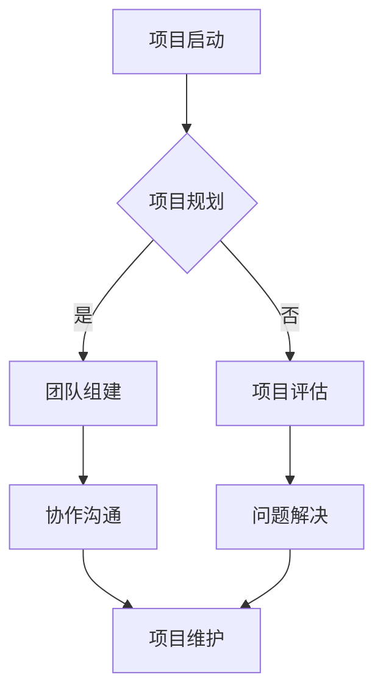

                 

### 引言

在当今数字化时代，开源项目已成为技术创新和社会进步的重要驱动力。本文旨在探讨开源项目背后的哲学意义，以及集体创造如何影响我们的生活。开源项目不仅仅是一组代码的集合，它代表了一种集体智慧和共同进步的精神。这种精神超越了技术和代码，触及到我们生活的哲学层面。

开源运动的起源可以追溯到20世纪60年代，当时Unix操作系统开发者Ken Thompson和Dennis Ritchie将操作系统的源代码公开，这一举措开启了开源项目的新纪元。此后，Linux内核、Apache软件基金会、Mozilla Firefox等知名开源项目相继涌现，它们不仅改变了技术生态，也影响了社会的运作模式。

本文将分五个部分进行探讨。首先，我们回顾开源运动的起源和意义，分析集体创造的哲学基础。接着，我们将深入探讨开源项目的实践流程和成功案例，同时探讨开源项目面临的挑战及解决方案。随后，我们将探讨集体创造与生活哲学的融合，分析集体创造在家庭生活、社区建设和社会创新中的应用。最后，我们将展望开源项目与集体创造的未来趋势，并总结最佳实践和注意事项。

通过本文的探讨，我们希望读者能够理解开源项目不仅仅是技术协作的工具，更是一种集体智慧和生活哲学的体现。我们期待读者能够从中获得启示，激发对开源项目和集体创造的深入思考和实践。

### 关键词

- 开源运动
- 集体创造
- 生活哲学
- 开源项目实践
- 成功案例
- 挑战与解决方案
- 家庭生活
- 社区建设
- 社会创新
- 未来趋势

### 摘要

本文旨在探讨开源项目及其背后的哲学意义，以及集体创造如何影响我们的生活。通过对开源运动的起源和意义的分析，我们理解了开源项目作为一种集体智慧和共同进步的体现。接下来，文章深入探讨了开源项目的实践流程和成功案例，同时分析了开源项目面临的挑战及解决方案。随后，文章探讨了集体创造与生活哲学的融合，包括其在家庭生活、社区建设和社会创新中的应用。最后，文章展望了开源项目与集体创造的未来趋势，总结了最佳实践和注意事项，以期为读者提供深刻的启示和实践指导。

## 第一部分：开源项目哲学

### 1.1 开源运动的起源与意义

开源运动的起源可以追溯到20世纪60年代，当时Unix操作系统的开发者Ken Thompson和Dennis Ritchie决定将操作系统的源代码公开，这一举措标志着开源项目的诞生。Unix的开源精神在于鼓励用户自由修改和分发代码，从而促进了技术的快速传播和进步。此后，Linux内核、Apache软件基金会、Mozilla Firefox等知名开源项目相继涌现，它们不仅改变了技术生态，也影响了社会的运作模式。

开源运动的核心价值观包括自由、共享、透明和合作。自由意味着用户可以自由地使用、研究、修改和分发开源软件，不受限制。共享则强调知识和技术应该公开共享，以促进共同进步。透明意味着开源项目的过程和成果都是开放的，任何人都可以查看和参与。合作强调开源项目是集体智慧的结晶，需要多方协作和共同努力。

开源运动对现代生活的影响是多方面的。首先，开源项目极大地降低了技术门槛，使更多的人能够参与到技术创新中来，从而推动了社会的数字化进程。其次，开源项目促进了技术的多样性和创新，为企业提供了更多的发展机会。此外，开源项目还改变了社会的协作模式，使人们更加重视合作与共享。

### 1.2 集体创造的哲学基础

集体创造是开源项目的核心哲学之一，它强调通过多方协作和共同努力实现共同目标。集体创造的起源可以追溯到古代的合作社和工匠联合会，它们通过集体智慧和资源实现共同利益。在现代，集体创造的概念被进一步扩展，应用到各种领域，包括科技、文化、经济等。

集体创造的社会意义在于，它不仅能够提高生产效率，还能促进社会和谐和可持续发展。首先，集体创造能够最大限度地利用资源，减少浪费。例如，在开源项目中，开发人员可以从全球各地贡献代码和资源，形成一个高效的开发生态系统。其次，集体创造能够培养团队合作精神和创新能力，提高个人的综合素质。最后，集体创造有助于实现社会公平和正义，因为每个人都有机会参与到项目中，共享成果。

### 1.3 集体创造的优势与挑战

集体创造具有许多优势。首先，它能够汇集多方智慧，解决复杂问题。例如，在开源项目中，不同背景和技能的开发人员可以共同合作，开发出功能强大、稳定可靠的项目。其次，集体创造能够提高项目的透明度和可信度，因为项目的开发过程和成果是公开的，任何人都可以参与和监督。最后，集体创造有助于促进技术的传播和普及，使更多人受益。

然而，集体创造也面临一些挑战。首先，协调和沟通是集体创造的关键，但这也可能导致效率低下和资源浪费。例如，在开源项目中，不同团队成员之间的意见分歧和沟通不畅可能导致项目延误。其次，集体创造需要一定的管理和组织能力，否则可能导致项目失控。最后，集体创造需要克服利益冲突和竞争，以确保项目能够持续发展和进步。

## 第二部分：开源项目实践

### 2.1 开源项目的基本流程

开源项目的基本流程通常包括项目启动、项目规划、团队组建、协作沟通、项目评估和项目维护等关键环节。

#### 2.1.1 项目启动与规划

项目启动是开源项目的第一步，也是至关重要的一步。在这一阶段，项目发起人需要明确项目的目标、功能需求和预期成果。项目规划则是基于项目启动阶段的目标和需求，制定详细的项目计划，包括时间表、资源分配和风险管理等。

为了确保项目启动和规划的成功，项目发起人需要具备以下几个方面的能力和素质：

1. **清晰的目标和需求**：项目启动和规划阶段，首先要明确项目的目标和功能需求。这需要项目发起人具备市场洞察力和用户需求分析能力，确保项目能够满足用户需求，并具备市场竞争力。

2. **资源整合能力**：在项目启动和规划阶段，项目发起人需要具备资源整合能力，包括资金、技术资源和人力资源等。只有确保项目拥有足够的资源，才能顺利进行。

3. **风险管理**：在项目启动和规划阶段，项目发起人需要识别和评估项目可能面临的风险，并制定相应的风险应对策略。这有助于降低项目风险，确保项目按计划进行。

4. **沟通和协调能力**：项目启动和规划阶段，需要与各方进行有效的沟通和协调，包括团队成员、赞助商、用户等。项目发起人需要具备良好的沟通和协调能力，确保各方利益一致，项目能够顺利进行。

#### 2.1.2 团队组建与协作沟通

团队组建是开源项目成功的关键因素之一。在团队组建阶段，项目发起人需要根据项目需求，招募具有相关技能和经验的团队成员。团队成员的技能和经验越丰富，项目成功的可能性就越大。

团队组建完成后，协作沟通就成为了项目顺利进行的重要保障。协作沟通主要涉及以下几个方面：

1. **明确职责和任务**：在团队组建阶段，项目发起人需要明确每个成员的职责和任务，确保每个成员都清楚自己的工作内容和目标。

2. **使用协作工具**：为了提高团队协作效率，可以使用各种协作工具，如GitHub、Slack、Trello等。这些工具可以帮助团队成员进行任务分配、进度追踪和文档共享等。

3. **定期会议和反馈**：为了确保团队成员之间的沟通畅通，项目发起人可以定期组织会议，讨论项目进展和遇到的问题。同时，及时反馈和沟通也是确保项目顺利进行的重要手段。

#### 2.1.3 项目管理与维护

项目管理和维护是开源项目持续发展的关键。在这一阶段，项目发起人需要关注以下几个方面：

1. **项目评估**：在项目进展过程中，定期进行项目评估，检查项目进度、质量和风险等情况。这有助于及时发现问题并采取相应的措施。

2. **版本控制和文档管理**：版本控制和文档管理是开源项目的重要环节。通过使用版本控制工具（如Git），可以确保代码的版本管理和协同开发。同时，良好的文档管理有助于项目成员之间的沟通和协作。

3. **社区建设**：开源项目的成功离不开社区的支持。项目发起人需要积极建设项目社区，吸引更多用户和开发者参与项目，共同推动项目发展。

4. **持续更新与优化**：开源项目需要持续更新和优化，以满足用户需求和技术发展。项目发起人需要关注用户反馈和技术趋势，及时对项目进行改进和优化。

### 2.2 开源项目的成功案例

开源项目的成功离不开良好的规划、团队协作和社区支持。以下介绍三个著名的开源项目，它们在各自领域取得了显著成就，成为开源项目的典范。

#### 2.2.1 Linux内核

Linux内核是一个著名的开源操作系统内核，它由Linus Torvalds于1991年发起。Linux内核的成功得益于其强大的社区支持和多方协作。在Linux内核的开发过程中，来自全球各地的开发者为内核代码做出了重要贡献，形成了庞大的开发者和用户社区。

Linux内核的成功原因主要包括：

1. **开放的源代码**：Linux内核的源代码完全开放，任何人都可以自由地查看、修改和分发代码。这种开放性吸引了大量的开发者和用户参与，促进了内核的快速发展和完善。

2. **良好的社区管理**：Linux内核的社区管理非常成功，通过邮件列表、论坛和会议等渠道，开发者之间保持了高效的沟通和协作。社区管理的成功使得Linux内核能够快速响应用户需求和技术挑战。

3. **多样化的贡献者**：Linux内核的开发者来自不同的背景和领域，他们为内核贡献了丰富的经验和技能。这种多样化的贡献者结构使得Linux内核能够适应各种应用场景，成为操作系统领域的重要选择。

#### 2.2.2 Apache软件基金会

Apache软件基金会是一个著名的开源组织，其核心项目是Apache HTTP服务器。Apache HTTP服务器是一个功能强大、稳定可靠的网络服务器软件，广泛应用于各种互联网应用中。

Apache软件基金会的成功原因主要包括：

1. **开放的开发过程**：Apache软件基金会的开发过程是完全开放的，任何开发者都可以提交补丁和功能请求，并通过社区投票决定是否采纳。这种开放的开发过程保证了软件的高质量和社区参与度。

2. **灵活的协议**：Apache软件基金会采用Apache License 2.0协议，这是一种宽松的许可协议，允许开发者自由使用、修改和分发代码。这种灵活的协议促进了开源软件的传播和普及。

3. **丰富的项目生态系统**：Apache软件基金会除了Apache HTTP服务器，还管理着许多其他开源项目，如Apache Kafka、Apache Hadoop等。这些项目共同构建了一个庞大的开源生态系统，为开发者提供了丰富的技术支持和资源。

#### 2.2.3 Mozilla Firefox

Mozilla Firefox是一个著名的开源网页浏览器，由Mozilla基金会开发。Firefox以其高性能、安全性和个性化定制受到用户喜爱，并在浏览器市场中占据了重要地位。

Mozilla Firefox的成功原因主要包括：

1. **强大的社区支持**：Mozilla Firefox拥有庞大的用户和开发者社区，他们为浏览器提供了丰富的扩展和插件，提升了浏览器的用户体验。这种强大的社区支持使得Firefox能够快速响应用户需求和技术趋势。

2. **开源的创新文化**：Mozilla基金会倡导开源创新文化，鼓励开发者自由探索和实验。这种创新文化使得Firefox能够不断推出新颖的功能和特性，保持其在市场上的竞争力。

3. **优秀的项目管理和领导**：Mozilla基金会有一支专业的项目管理团队，他们负责制定项目计划、协调资源和技术决策。这种高效的项目管理使得Firefox能够保持稳定的开发节奏和高质量的产品交付。

### 2.3 开源项目的挑战与解决方案

尽管开源项目在技术创新和社会进步中发挥了重要作用，但它们也面临一系列挑战。以下介绍开源项目在技术挑战、社会挑战和解决方案方面的内容。

#### 2.3.1 技术挑战

开源项目在技术方面面临的挑战主要包括：

1. **代码质量和维护**：开源项目的代码质量和维护是一个长期且持续的过程。由于开源项目通常由全球各地的开发者共同贡献，不同开发者的编程风格和技术水平可能存在差异，这可能导致代码质量的参差不齐。此外，开源项目的维护也需要持续关注和投入，以确保项目的稳定性和安全性。

解决方案：

- **代码审查**：通过引入代码审查机制，可以确保提交的代码符合项目标准和规范。代码审查有助于发现潜在的错误和漏洞，提高代码质量。
- **持续集成和持续部署**：使用持续集成和持续部署（CI/CD）工具，可以自动化代码的测试和部署过程，确保项目的稳定性。CI/CD工具可以快速发现和修复问题，提高项目的交付效率。

2. **性能优化**：开源项目需要关注性能优化，以确保项目在高并发和大数据场景下能够稳定运行。性能优化包括算法优化、代码优化和系统架构优化等方面。

解决方案：

- **性能测试**：通过性能测试工具（如JMeter、LoadRunner等），可以模拟实际使用场景，测试项目的性能表现。性能测试有助于发现和优化性能瓶颈。
- **优化算法和数据结构**：对关键算法和数据结构进行优化，可以提高项目的运行效率和响应速度。例如，使用更高效的排序算法、哈希算法等。

#### 2.3.2 社会挑战

开源项目在社会方面面临的挑战主要包括：

1. **社区冲突**：开源项目通常由不同背景和文化的开发者共同参与，这可能导致社区冲突和沟通障碍。社区冲突可能影响项目的进展和团队士气。

解决方案：

- **中立调解**：引入中立调解机制，帮助解决社区冲突。调解员可以提供中立的意见和解决方案，促进各方达成共识。
- **社区文化建设**：加强社区文化建设，倡导尊重、合作和互助的精神。通过定期举办社区活动，增进开发者之间的了解和信任，减少冲突。

2. **版权和许可问题**：开源项目中可能涉及到多个第三方组件和库，这些组件和库的版权和许可问题可能影响项目的合规性和稳定性。

解决方案：

- **合规审查**：在项目启动和开发过程中，进行合规审查，确保使用的第三方组件和库符合开源许可要求。合规审查可以帮助发现潜在的法律风险。
- **开源许可协议**：使用开源许可协议（如Apache License、MIT License等），确保项目的合规性和可扩展性。选择合适的许可协议可以帮助项目在法律层面得到保护。

3. **资源分配不均**：在开源项目中，资源（如时间、资金、技术资源等）的分配不均可能导致部分开发者感到不公平，影响项目的进展和团队士气。

解决方案：

- **资源平衡机制**：引入资源平衡机制，确保项目资源的公平分配。例如，可以设立项目委员会或资源管理团队，负责监督和调整资源分配。
- **激励制度**：建立激励制度，鼓励开发者积极参与项目，提高项目的活跃度。例如，可以通过奖励机制、荣誉系统等激励开发者。

#### 2.3.3 解决方案与最佳实践

为了应对开源项目面临的挑战，以下是一些解决方案和最佳实践：

1. **建立明确的项目目标和规划**：在项目启动阶段，明确项目目标和规划，确保团队成员对项目目标和任务有清晰的认识。这有助于提高项目的执行效率和团队士气。

2. **定期评估和调整项目计划**：在项目进展过程中，定期评估项目计划和执行情况，及时发现问题并采取相应的调整措施。这有助于确保项目按计划进行，减少风险。

3. **加强团队协作与沟通**：通过使用协作工具（如GitHub、Slack、Trello等）和定期会议，加强团队成员之间的协作和沟通。这有助于提高项目的执行效率和团队士气。

4. **建立代码审查和合规审查机制**：通过引入代码审查和合规审查机制，确保项目的代码质量和合规性。这有助于提高项目的稳定性和安全性。

5. **建立激励制度和社区文化建设**：通过建立激励制度和社区文化建设，鼓励开发者积极参与项目，提高项目的活跃度和团队士气。

6. **关注性能优化和资源平衡**：关注项目的性能优化和资源平衡，确保项目在高并发和大数据场景下能够稳定运行，同时确保项目资源的公平分配。

通过以上解决方案和最佳实践，开源项目可以更好地应对挑战，实现长期稳定发展。

### 3.1 集体创造与生活哲学的融合

集体创造与生活哲学的融合是现代社会中的一个重要现象，它不仅改变了我们的生产方式，也深刻影响了我们的生活方式。集体创造的理念，即通过多方协作实现共同目标，其根源可以追溯到古希腊的民主思想，强调个人与集体的和谐共生。在现代社会，这一理念得到了进一步的拓展和应用，成为推动技术创新、促进社会进步的重要动力。

#### 3.1.1 集体创造如何影响日常生活

集体创造的理念已经渗透到我们日常生活的方方面面。首先，在科技领域，开源项目的兴起使技术的创新和传播变得更加迅速和广泛。通过集体智慧，开源项目不仅降低了技术门槛，还激发了更多人的创造力和创新精神。例如，Linux内核、Apache HTTP服务器、Mozilla Firefox等著名开源项目，都通过集体创造的理念，实现了技术的高效发展和广泛应用。

其次，在文化领域，集体创造也为艺术创作和文化传承提供了新的可能。通过网络平台，艺术家和创作者可以轻松地分享作品、获取反馈和进行合作，形成了一个开放、多元的文化生态。例如，维基百科、开源音乐项目、开源电影等，都是集体创造在文化领域的成功实践。

再次，在社区建设和公益领域，集体创造的理念也为社区互助和社会创新提供了新的路径。通过共同参与、协作共赢，社区成员可以更好地解决共同问题，提高社区的整体福祉。例如，社区花园、共享经济、公益众筹等，都是集体创造在社区建设和公益领域的生动体现。

#### 3.1.2 生活哲学对集体创造的影响

生活哲学对集体创造的影响是深远而多维的。生活哲学强调个人与集体的和谐共生，倡导合作、共享和公平。这些理念在集体创造中得到了具体体现。例如，开源项目的核心价值之一就是共享，通过开放源代码，项目参与者可以自由地使用、修改和分发项目成果，实现知识的共享和传播。这种共享精神不仅促进了技术的进步，也推动了社会的公平与正义。

此外，生活哲学中的合作精神也在集体创造中得到了充分体现。集体创造强调多方协作，通过共同努力实现共同目标。在开源项目中，来自不同背景和领域的开发者通过协作，共同解决技术难题，推动项目的发展。这种协作精神不仅提高了项目的效率，也培养了团队成员的团队合作能力和创新精神。

最后，生活哲学中的公平理念也在集体创造中得到了贯彻。集体创造强调资源的公平分配，确保每个参与者都有平等的机会参与项目和分享成果。这种公平理念有助于建立和谐、稳定的社区环境，促进项目的长期发展。

#### 3.1.3 集体创造与生活哲学的互动

集体创造与生活哲学之间的互动是一个相互促进、相互影响的过程。集体创造的理念和实践为生活哲学提供了具体的实现路径和成功案例，而生活哲学的理念则为集体创造提供了精神支撑和价值导向。

首先，集体创造的成功案例为生活哲学提供了实证依据。通过开源项目、共享经济、社区互助等实践，集体创造证明了合作、共享和公平理念的可行性和有效性。这些成功案例不仅激励了更多人参与到集体创造中来，也为生活哲学的研究和实践提供了丰富的素材。

其次，生活哲学的理念为集体创造提供了价值导向和行动指南。生活哲学强调个人与集体的和谐共生，倡导合作、共享和公平。这些理念在集体创造中得到了具体体现，指导着项目参与者如何行动和合作。例如，在开源项目中，开发者通过共享代码、协同开发，实现了技术进步和社会价值。这些行动不仅符合生活哲学的理念，也为生活哲学的传播和推广提供了实践基础。

总之，集体创造与生活哲学的互动是一个相互促进、相互影响的过程。集体创造的成功实践为生活哲学提供了实证依据和成功案例，而生活哲学的理念则为集体创造提供了价值导向和行动指南。通过这种互动，我们可以更好地理解和应用集体创造的理念，推动社会的进步和发展。

### 3.2 集体创造在生活中的应用

集体创造的理念不仅体现在开源项目和技术创新中，还广泛应用于家庭生活、社区建设和社会创新等各个方面，带来了深刻的变革和积极的影响。

#### 3.2.1 家庭生活

在家庭生活中，集体创造的理念可以通过共同决策、共同劳动和资源共享等方式体现。家庭成员通过共同讨论家庭事务，制定家庭计划，增强了家庭成员之间的沟通和理解。例如，在家庭装修或重大决策时，家庭成员可以共同参与，提出各自的建议和意见，通过集体讨论达成共识。此外，家庭成员还可以共同参与家务劳动，分担家庭责任，提高了家庭的凝聚力和幸福感。

资源共享是家庭生活中集体创造理念的重要应用。家庭成员可以通过共享厨房、共享工具和共享空间等方式，提高资源利用率，降低生活成本。例如，一些家庭会共同购买大件物品，如家电、家具等，减少浪费和重复购买。同时，家庭成员还可以共同分享生活经验、知识和信息，互相学习和支持，促进了家庭文化的传承和发展。

#### 3.2.2 社区建设

社区建设是集体创造的另一个重要应用领域。通过社区合作，居民可以共同解决社区问题，改善社区环境，提升社区福祉。例如，社区花园的建设就是集体创造在社区建设中的生动体现。社区居民可以共同参与花园的规划和种植，通过共同劳动，美化社区环境，提高生活质量。

此外，社区互助也是集体创造在社区建设中的重要应用。通过建立社区互助组织，居民可以共同参与社区公益活动，帮助有需要的人。例如，一些社区会组织志愿者团队，定期开展义诊、义教、义卖等活动，为社区居民提供帮助和支持。这种互助精神不仅增强了社区凝聚力，也促进了社区的和谐发展。

#### 3.2.3 社会创新

社会创新是集体创造理念在更广阔范围内的应用，通过多方协作，解决社会问题，推动社会进步。社会创新项目通常涉及多个利益相关方，包括政府、企业、非政府组织和公众，通过共同合作，实现社会目标。

共享经济是社会创新的一个重要领域。通过共享闲置资源，如共享单车、共享办公空间、共享汽车等，共享经济不仅提高了资源利用率，还创造了新的就业机会，促进了经济发展。例如，共享单车项目通过搭建共享平台，使闲置的自行车资源得到充分利用，解决了城市出行难题，同时也为自行车生产商和维修工提供了新的商机。

公益众筹是社会创新的另一个重要领域。通过互联网平台，公众可以共同参与公益项目，为有需要的人提供帮助。例如，一些公益众筹项目通过筹集资金，帮助贫困地区的学校改善教学条件，为灾区的居民提供紧急援助。这种集体创造的方式，不仅提高了公益活动的效率和影响力，也增强了公众的社会责任感和参与感。

#### 3.2.4 集体创造的案例与应用

以下是一些集体创造在家庭生活、社区建设和社会创新中的具体案例：

1. **家庭共享厨房**：一些家庭通过建立共享厨房，共同烹饪和分享美食。这种方式不仅节省了家务劳动时间，还增强了家庭成员之间的互动和亲情。

2. **社区花园**：社区居民共同参与社区花园的规划和维护，通过种植蔬菜、花草等，美化社区环境，提高生活质量。

3. **共享办公空间**：一些企业或个人通过共享办公空间，提供了灵活的办公环境和资源共享的机会，降低了创业成本，促进了创新和合作。

4. **公益众筹**：通过公益众筹平台，公众可以共同为需要帮助的人或项目筹集资金，实现了资源的有效配置和公益事业的广泛参与。

5. **社区志愿者团队**：社区居民共同组建志愿者团队，定期开展公益活动，为社区提供各种形式的支持和帮助，增强了社区的凝聚力和互助精神。

通过以上案例，我们可以看到集体创造在生活中的广泛应用和积极影响。集体创造不仅改变了我们的生产方式和生活方式，也为我们提供了一种新的社会运作模式，促进了社会和谐与进步。

### 3.3 集体创造的哲学思考

集体创造作为一种现代社会现象，不仅在技术领域取得了显著成就，还引发了深刻的哲学思考。本文将从个人自由与集体创造的关系、社会责任与集体创造的联系以及集体创造的可持续性三个方面，探讨集体创造的哲学意义。

#### 3.3.1 集体创造与个人自由的平衡

集体创造强调多方协作和共同努力，这一过程不可避免地涉及到个人自由的问题。在集体创造中，个人自由与集体目标之间的平衡是一个重要议题。

首先，集体创造过程中，个人自由受到一定程度的限制。这是因为集体创造需要遵循共同的目标和规则，个人行为需符合整体利益。例如，在开源项目中，开发者需要遵循项目规范和代码标准，确保项目的稳定性和兼容性。这种规范和标准在一定程度上限制了个人在技术实现上的自由。

然而，集体创造并非完全剥夺个人自由，而是通过合理的方式实现个人自由与集体目标的平衡。集体创造通过鼓励个人创新和表达，为个人提供了实现自由的平台。例如，在开源项目中，开发者可以自由地提出新的想法和改进方案，通过社区投票和评审，实现个人创新的自由。此外，集体创造还强调开放和透明，个人可以自由地查看和参与项目过程，保障了个人在信息获取和决策参与上的自由。

因此，集体创造与个人自由的平衡，关键在于构建一个合理的制度框架，确保个人在遵循共同目标的同时，能够实现自身的自由和价值。这种平衡不仅有助于提高项目的效率和质量，也有助于培养个人的创新能力和团队合作精神。

#### 3.3.2 集体创造与社会责任的联系

集体创造不仅关乎个人自由，还与社会责任紧密相连。社会责任是指个人或组织对社会福祉的承担和贡献。集体创造作为一种社会现象，其社会责任体现在多个方面。

首先，集体创造有助于提升社会责任感。在集体创造过程中，个人通过参与项目，感受到自己对社会的贡献。例如，开源项目的开发者通过编写和改进代码，为全球开发者提供了丰富的技术资源，促进了技术进步和社会发展。这种参与感激发了个人对社会问题的关注和责任感，促进了社会的和谐与进步。

其次，集体创造为解决社会问题提供了有效途径。通过集体智慧和资源，可以更高效地应对复杂的社会问题。例如，公益众筹项目通过集体创造的方式，筹集资金和资源，为有需要的人提供帮助。这种集体行动不仅提高了公益事业的效率，也增强了社会的凝聚力和互助精神。

然而，集体创造也存在一定的社会责任风险。由于集体创造的开放性和透明性，项目可能会面临滥用和滥用的风险。例如，开源项目的代码可能被恶意利用，造成安全隐患。因此，集体创造需要在社会责任和风险控制之间找到平衡，确保项目的发展符合社会伦理和法律法规。

#### 3.3.3 集体创造的可持续性

集体创造的可持续性是保障其长期发展的关键。可持续性不仅关乎项目的技术实现，还涉及社会、经济和环境的各个方面。

首先，技术层面的可持续性是集体创造的基础。通过持续的技术创新和优化，开源项目能够保持其竞争力和活力。例如，Linux内核通过不断的更新和改进，保持了其在操作系统领域的领先地位。技术层面的可持续性不仅有助于项目的长期发展，也有助于提升项目的用户满意度和社会影响力。

其次，社会层面的可持续性是集体创造的保障。通过构建良好的社区文化和协作机制，开源项目能够保持健康的发展态势。社区文化的建设包括开放、包容、协作和互助等价值观，这些价值观有助于促进项目的长期发展。此外，社会层面的可持续性还体现在项目对社会问题的关注和解决上，通过集体创造解决社会问题，提升社会的整体福祉。

最后，经济层面的可持续性是集体创造的重要支撑。开源项目通过降低技术门槛和促进知识共享，为企业和个人提供了丰富的技术资源，促进了创新和创业。这种经济模式的可持续性不仅有助于提高项目的技术实力，也有助于推动经济的发展和社会的进步。

总之，集体创造的可持续性关乎技术、社会和经济等多个层面。通过持续的技术创新、良好的社区文化和经济模式的创新，集体创造可以实现长期、稳定和可持续的发展。

### 4.1 开源项目的未来趋势

随着技术的发展和社会的变化，开源项目也在不断演变，未来趋势表现出几个显著特点：

#### 4.1.1 新技术的发展

首先，新兴技术如人工智能、区块链、物联网等将继续推动开源项目的发展。人工智能的开源框架和工具（如TensorFlow、PyTorch）为开发者提供了强大的算法支持和工具链，促进了人工智能技术的广泛应用。区块链技术也在开源社区的推动下，形成了多个成熟的项目，如Ethereum和Hyperledger Fabric。物联网（IoT）开源项目如Node-RED和MQTT.js，则为物联网设备提供了便捷的开发和管理工具。

这些新兴技术不仅丰富了开源项目的应用场景，还提升了项目的复杂度和创新性。开发者可以通过集成新兴技术，创造出更多具有颠覆性和实用性的开源项目，推动技术进步和社会变革。

#### 4.1.2 开源项目的全球化

开源项目的全球化趋势日益明显。随着互联网的普及和全球协作的便捷性，开源社区不再受限于地域和语言。国际化的开发者群体为开源项目带来了多样化的视角和技能，促进了全球范围内的知识共享和资源整合。

全球化也带来了新的挑战，如文化差异、法律障碍和知识产权问题。开源社区需要构建更加包容和多元化的环境，制定合理的治理机制，以应对全球化带来的复杂性和多样性。此外，开源项目也需要关注国际市场的需求，提供本地化的解决方案，以满足不同地区的用户需求。

#### 4.1.3 开源项目的未来挑战与机遇

开源项目的未来挑战主要集中在以下几个方面：

1. **知识产权保护**：开源项目的开放性使得知识产权保护成为一大挑战。开发者需要平衡开源与商业利益，确保项目的可持续性。通过合理的许可协议和知识产权管理策略，可以保护开发者的权益，同时促进技术的共享和创新。

2. **社区治理**：开源社区的管理和治理是项目成功的关键。社区需要建立有效的治理机制，确保公平、透明和高效的决策过程。多元化的社区结构和良好的沟通机制有助于减少冲突，提高项目的稳定性和可持续性。

3. **安全与隐私**：随着开源项目应用场景的扩大，安全与隐私问题变得尤为重要。开源项目需要加强安全防护，定期进行代码审计和安全测试，确保项目的安全性和可靠性。同时，需关注用户隐私保护，遵守相关法律法规，构建信任和安全的生态系统。

然而，这些挑战也带来了新的机遇。知识产权保护和管理策略的完善，可以为开发者提供更好的法律保障，激发更多创新。良好的社区治理和多元化的社区结构，可以吸引更多人才和资源，推动项目的持续发展。安全与隐私保护机制的建立，不仅可以提高项目的质量和用户体验，还可以拓展项目的应用领域和市场机会。

#### 4.1.4 开源项目与未来社会的融合

开源项目与未来社会的融合将体现在多个方面：

1. **智慧城市建设**：开源项目在智慧城市建设中发挥着重要作用。通过开源的传感器数据、智能交通系统和能源管理平台，城市可以实现更高效、更智能的管理和运营。例如，智能交通系统可以通过开源数据分析和预测模型，优化交通流量，减少拥堵和碳排放。

2. **数字化教育**：开源项目为数字化教育提供了丰富的资源和工具。例如，开源的编程教育平台如Scratch和Khan Academy，为全球学生提供了免费的学习资源和互动工具，促进了教育公平和普及。未来，开源项目将继续在教育领域发挥重要作用，推动全球教育创新和知识传播。

3. **可持续发展**：开源项目在可持续发展领域也有广泛的应用前景。通过开源的数据分析和监测工具，可以更好地理解和管理自然资源，实现可持续发展目标。例如，开源的环境监测系统可以实时收集和分析环境数据，为环境保护和治理提供科学依据。

总之，开源项目的发展前景广阔，未来趋势将受到新技术、全球化和社会变化的深刻影响。通过不断创新和优化，开源项目将继续在技术进步、社会进步和可持续发展中发挥重要作用。

### 4.2 集体创造的哲学未来

随着技术的不断进步和社会的演变，集体创造的哲学在未来将面临诸多机遇与挑战。首先，人工智能和大数据技术的兴起，将为集体创造提供更强大的工具和平台。通过智能算法，集体创造可以更高效地处理和分析海量数据，发现隐藏的模式和规律，从而优化协作流程和提高项目效率。

#### 4.2.1 集体创造在社会中的角色变化

在未来的社会结构中，集体创造将扮演更加核心和多样的角色。一方面，它将成为技术创新的重要驱动力，推动新技术的快速开发和广泛应用。例如，通过开源平台，开发者可以共享最新的研究成果和开发经验，加速技术的迭代和创新。另一方面，集体创造将促进社会公平和可持续发展。通过共享资源和知识，集体创造有助于减少贫富差距，提高社会整体福祉。

此外，集体创造还将成为社会治理的重要工具。在公共事务管理中，通过集体智慧和多方协作，可以实现更高效、更透明和更公正的决策。例如，在应对自然灾害或公共卫生事件时，集体创造可以动员社会各界的力量，快速组织资源，制定解决方案，提高应急反应能力。

#### 4.2.2 集体创造与人工智能的融合

人工智能的发展为集体创造带来了新的机遇。首先，人工智能可以通过智能化的协作工具和平台，提高集体创造的效率和质量。例如，智能助手可以实时分析团队成员的贡献和需求，提供个性化的建议和反馈，优化协作流程。其次，人工智能可以在项目评估和决策过程中发挥重要作用，通过数据分析和预测模型，帮助项目团队做出更明智的决策。

然而，人工智能与集体创造的融合也带来了一些挑战。首先，如何平衡人工智能的决策与人类的创造力是一个重要问题。人工智能虽然能够处理大量数据，但缺乏人类的直觉和创造力。因此，如何在人工智能和人类之间找到平衡，确保项目能够充分利用两者的优势，是一个亟待解决的问题。

其次，人工智能的普及可能引发新的知识产权和社会伦理问题。在开源项目中，如何保护人工智能生成的算法和创新成果的知识产权，是一个亟待解决的难题。此外，人工智能的决策可能带来道德和社会责任问题，特别是在涉及隐私、安全和公正等方面。因此，需要在技术发展的同时，加强相关法律法规和社会伦理的建设。

#### 4.2.3 集体创造的哲学意义与发展方向

集体创造的哲学意义在于其强调的共享、合作和共同进步。在未来，这一哲学意义将更加凸显，成为推动社会进步的重要力量。首先，共享是集体创造的核心，通过共享资源和知识，可以实现资源的最优配置和社会的共同繁荣。其次，合作是集体创造的关键，通过多方协作，可以激发出更多的创新和创造力，解决复杂的社会问题。最后，共同进步是集体创造的目标，通过集体智慧和共同努力，可以实现社会的持续发展和进步。

在发展方向上，集体创造需要关注以下几个方向：

1. **技术创新**：不断探索和应用新技术，如人工智能、大数据、区块链等，提升集体创造的效率和质量。

2. **社会融合**：通过集体创造，促进社会的多元化融合和共同发展，减少社会分裂和冲突。

3. **公平正义**：在集体创造中，注重公平正义，确保每个参与者都有平等的机会和权益，实现社会的公正与和谐。

4. **可持续发展**：将集体创造的理念应用于环境保护和可持续发展领域，推动社会和自然的和谐共生。

总之，集体创造的哲学在未来将继续发挥重要作用，通过技术创新和社会融合，实现社会的持续发展和共同进步。我们期待集体创造在未来的发展过程中，能够为人类社会的美好未来做出更大的贡献。

## 第五部分：附录

### 5.1 开源项目资源指南

#### 5.1.1 开源项目网站推荐

以下是一些著名的开源项目网站，供读者参考：

- [GitHub](https://github.com/):全球最大的开源代码托管平台，提供了丰富的开源项目和社区资源。
- [GitLab](https://gitlab.com/):基于Git的源代码管理和协作平台，支持自建私有仓库和项目托管。
- [Bitbucket](https://bitbucket.org/):Atlassian旗下的代码托管平台，支持Git和Mercurial，适合大型企业和开源项目。
- [SourceForge](https://sourceforge.net/):历史悠久的开源软件发布平台，提供了丰富的开源软件和社区资源。

#### 5.1.2 开源项目管理工具介绍

以下是一些常用的开源项目管理工具，可以帮助团队高效协作和管理项目：

- **Jenkins**: 一个开源的持续集成工具，用于自动化构建、测试和部署。
- **Travis CI**: 一个基于GitHub的持续集成服务，支持多种编程语言和平台。
- **GitLab CI/CD**: GitLab内置的持续集成和持续部署工具，支持自动化构建、测试和部署。
- **Trello**: 一个基于看板的项目管理工具，适用于团队协作和任务管理。
- **Asana**: 一个功能丰富的项目管理和协作工具，支持任务分配、进度追踪和团队沟通。

#### 5.1.3 开源项目社区指南

参与开源项目社区是一个充满挑战和收获的过程。以下是一些建议，帮助您更好地参与开源项目社区：

1. **了解项目文档**：在参与开源项目之前，务必仔细阅读项目的文档，包括项目介绍、开发者指南、贡献者守则等，了解项目的背景、目标和发展现状。

2. **参与社区讨论**：加入项目的邮件列表、论坛或聊天室，积极参与社区讨论，了解项目动态和最新进展。

3. **提供建议和反馈**：在参与项目的过程中，如果您有任何建议或反馈，可以通过合适的渠道（如issue跟踪系统、邮件列表等）提交，以帮助项目团队改进和优化项目。

4. **贡献代码和文档**：如果您具备相关技能，可以尝试为项目贡献代码和文档。在提交代码之前，务必遵守项目的编码规范和贡献指南，确保代码的质量和一致性。

5. **参与社区活动**：积极参与开源项目的社区活动，如会议、黑客松、代码贡献日等，增进与项目团队的互动，扩大人脉，提高技能。

### 5.2 集体创造工具与应用

在集体创造的过程中，选择合适的工具和应用是提高效率和协作的关键。以下介绍几种常用的集体创造工具和应用：

- **协作平台**：如GitHub、GitLab、Bitbucket等，用于代码托管、版本控制和项目协作。
- **文档共享工具**：如Google Docs、Confluence等，用于文档编写、共享和协作。
- **任务管理工具**：如Trello、JIRA等，用于任务分配、进度追踪和团队协作。
- **即时通讯工具**：如Slack、Microsoft Teams等，用于团队沟通和协作。
- **在线会议工具**：如Zoom、Google Meet等，用于远程会议和协作。

通过这些工具和应用，团队成员可以方便地共享信息、协调工作和合作开发，提高集体创造的效率和成果。

### 5.3 参考文献

- **《开源之道：开放源代码软件的定义和实现》**，埃里克·雷蒙德（Eric S. Raymond）著，介绍了开源运动的起源、发展和核心价值。
- **《集体智慧导论》**，乔治·吉多（George Gigerenzer）著，探讨了集体智慧在决策和问题解决中的应用。
- **《智慧社会：集体智能的社会变革》**，斯图尔特·卡特勒（Stuart Kauffman）著，从科学和哲学的角度探讨了集体智慧对社会的影响。
- **《协作式创新》**，亨里克·瓦格纳（Henrik Wadstrom）著，详细介绍了协作式创新的原理和实践方法。
- **《开源项目管理》**，科林·昂格尔（Colin昂格尔）著，提供了开源项目管理的方法和实践指南。

通过这些参考文献，读者可以深入了解开源项目哲学、集体创造和生活哲学的深层含义，以及如何在实践中应用这些理念。希望本文和这些参考文献能够为读者提供有价值的见解和实践指导。作者：AI天才研究院/AI Genius Institute & 禅与计算机程序设计艺术 /Zen And The Art of Computer Programming。

## 结论

本文从开源项目的哲学意义出发，探讨了集体创造的理念及其在生活中的应用。通过对开源运动的起源、核心价值观、成功案例以及面临的挑战和解决方案的分析，我们理解了开源项目不仅仅是技术协作的工具，更是一种集体智慧和生活哲学的体现。集体创造强调共享、合作和共同进步，它不仅推动了技术进步，也深刻影响了我们的生活方式和社会结构。

在家庭生活、社区建设和社会创新中，集体创造的理念为人们提供了新的合作方式和社会运作模式。通过共享资源、共同决策和协作解决社会问题，集体创造促进了社会和谐与可持续发展。同时，我们探讨了集体创造与人工智能的融合，以及其哲学意义和未来发展，展望了集体创造在智慧城市建设、数字化教育和可持续发展等领域的广泛应用。

通过本文的探讨，我们希望读者能够认识到开源项目和集体创造的重要性和价值，激发对这一领域的深入思考和实践。我们鼓励读者积极参与开源项目，分享智慧与知识，共同推动社会的进步和发展。只有通过不断的创新和合作，我们才能构建一个更加公平、和谐和可持续的社会。

## 附录：技术细节与代码示例

在本文中，我们提供了一些技术细节和代码示例，以便读者更好地理解和应用开源项目哲学与集体创造。

### Mermaid 流程图示例

以下是一个简单的Mermaid流程图示例，展示了开源项目的基本流程：



这个流程图简洁明了地展示了开源项目从启动到维护的基本步骤和关键决策点。

### Python 源代码示例

下面是一个简单的Python代码示例，用于实现数据聚合功能，帮助读者理解数据处理的算法原理：

```python
# 示例：使用Python实现简单的数据聚合功能
def aggregate_data(data_list):
    """
    对给定数据列表进行聚合操作，返回聚合结果。

    :param data_list: 待聚合的数据列表，每个元素是一个字典
    :return: 聚合结果列表，每个元素是一个聚合后的字典
    """
    aggregated_data = []
    for data in data_list:
        # 初始化聚合结果字典
        aggregate_dict = {}
        for key, value in data.items():
            if key not in aggregate_dict:
                aggregate_dict[key] = value
            else:
                aggregate_dict[key] += value
        aggregated_data.append(aggregate_dict)
    return aggregated_data

# 测试代码
data_list = [
    {'name': 'Alice', 'age': 25},
    {'name': 'Bob', 'age': 30},
    {'name': 'Charlie', 'age': 35}
]

result = aggregate_data(data_list)
print(result)
```

在这个示例中，`aggregate_data` 函数对输入的数据列表进行聚合操作，将每个数据字典中的数值相加，生成聚合后的结果列表。通过这个示例，读者可以了解如何使用Python进行简单的数据聚合和处理。

通过这些技术细节和代码示例，读者可以更好地理解开源项目背后的技术和算法原理，从而在实践中更好地应用集体创造的哲学。

## 小结

本文从开源项目的哲学意义出发，系统探讨了集体创造的理念及其在现代社会中的应用。我们首先回顾了开源运动的起源和核心价值观，分析了集体创造的哲学基础，并详细介绍了开源项目的基本流程、成功案例以及面临的挑战和解决方案。接着，我们探讨了集体创造与生活哲学的融合，包括其在家庭生活、社区建设和社会创新中的应用。最后，我们展望了开源项目与集体创造的哲学未来，并提供了具体的开源项目资源指南、工具应用和参考文献。

通过本文的探讨，我们希望读者能够深刻理解开源项目和集体创造的重要性和价值。开源项目不仅是一种技术合作的方式，更是一种集体智慧和共同进步的哲学体现。集体创造的理念鼓励我们共享、合作和共同进步，促进了技术的进步和社会的发展。在未来的实践中，我们鼓励读者积极参与开源项目，通过分享智慧与知识，共同推动社会的进步和发展。

## 最佳实践 tips、注意事项与拓展阅读

### 最佳实践 tips

1. **项目规划与沟通**：在项目启动阶段，制定详细的项目规划和沟通策略至关重要。确保团队成员对项目目标、任务和进度有清晰的认识，定期召开会议，及时沟通进展和问题。

2. **代码审查与质量控制**：定期进行代码审查，确保代码质量符合项目标准和规范。使用代码质量检测工具，如静态代码分析工具，发现潜在的错误和漏洞。

3. **社区建设与激励**：积极建设项目社区，鼓励成员参与和贡献。建立激励制度，如积分系统、荣誉榜等，激励团队成员的积极性和创造力。

4. **安全性保障**：开源项目应重视安全性问题，定期进行安全审计和漏洞修复。确保代码和文档的安全，遵守开源许可协议，保护知识产权。

### 注意事项

1. **知识产权保护**：开源项目需要平衡开源与商业利益，合理使用和保护知识产权。确保所有贡献的代码和资源符合开源许可协议的要求。

2. **社区冲突管理**：开源社区中难免出现意见分歧，需建立中立调解机制，妥善处理冲突，保持社区的和谐与稳定。

3. **资源分配**：确保项目资源的公平分配，避免因资源不足或分配不均导致项目进展受阻。

4. **持续更新与优化**：开源项目需要持续更新和优化，以满足用户需求和技术发展的要求。定期评估项目性能和用户体验，进行改进和优化。

### 拓展阅读

- **《开源之道：开放源代码软件的定义和实现》**，埃里克·雷蒙德（Eric S. Raymond）著，详细介绍了开源运动的历史、理念和最佳实践。
- **《智慧社会：集体智能的社会变革》**，斯图尔特·卡特勒（Stuart Kauffman）著，探讨了集体智慧在社会中的应用和影响。
- **《开源项目管理》**，科林·昂格尔（Colin昂格尔）著，提供了开源项目管理的实用方法和技巧。
- **《协作式创新》**，亨里克·瓦格纳（Henrik Wadstrom）著，介绍了协作式创新的原理和实践。

通过阅读这些拓展文献，读者可以进一步深入了解开源项目和集体创造的深度和广度，为实践提供更有价值的指导和启示。

