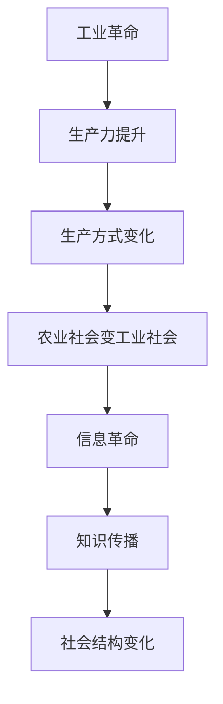
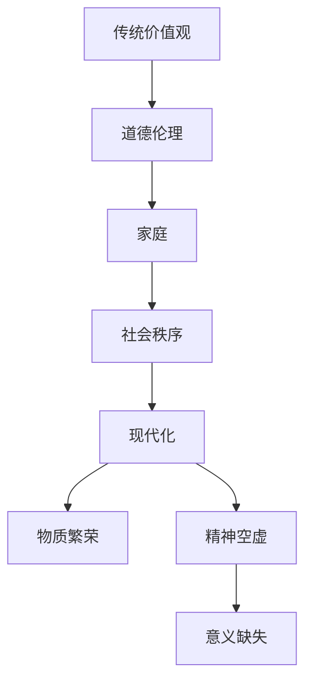
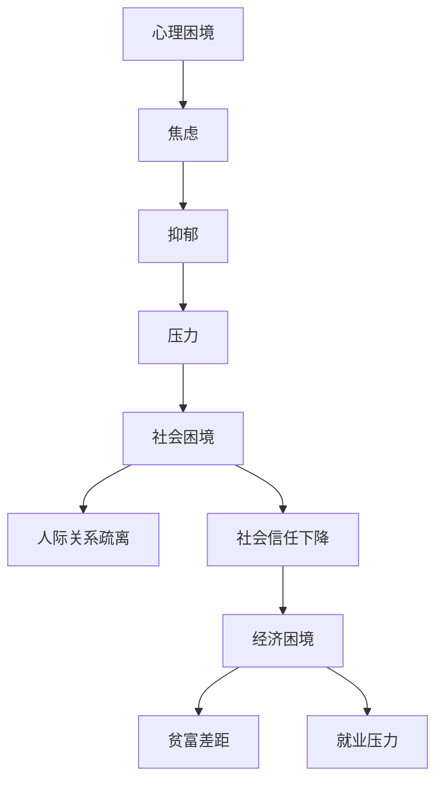
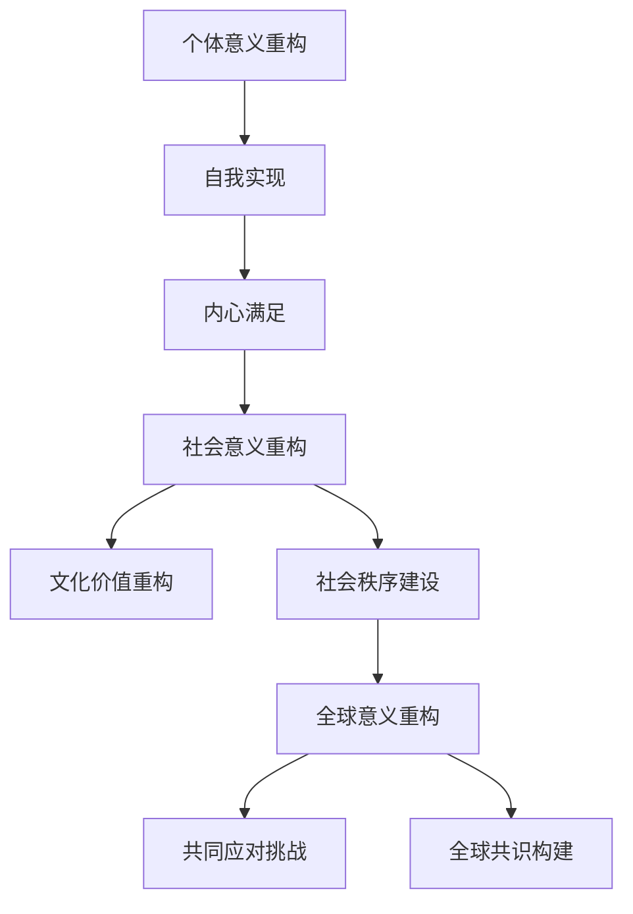
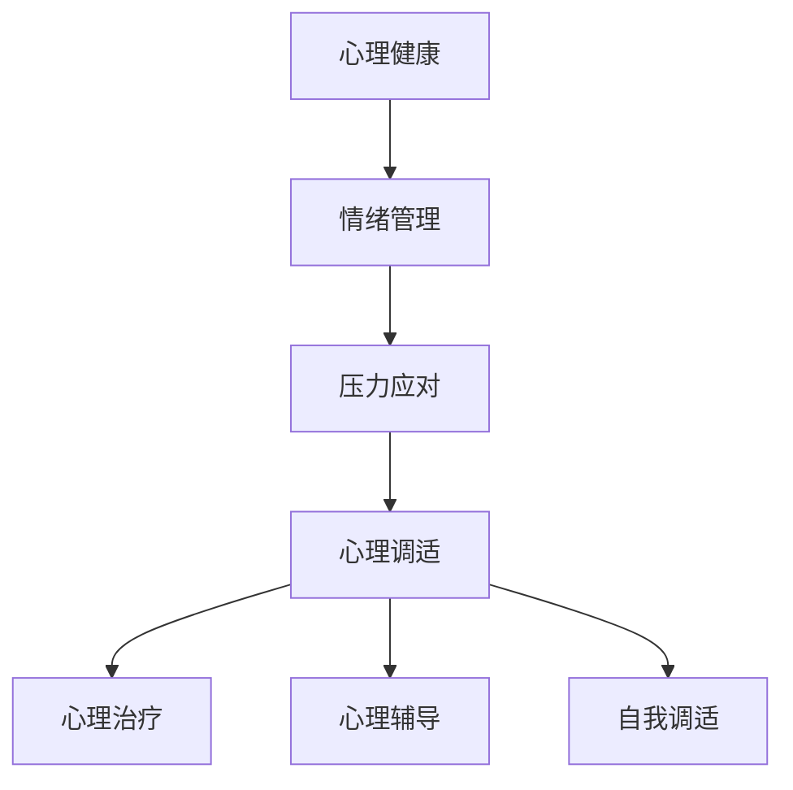
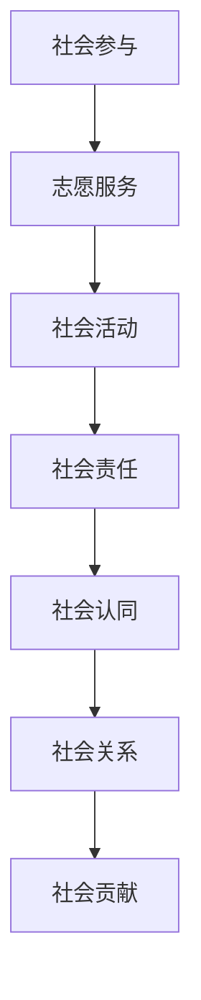
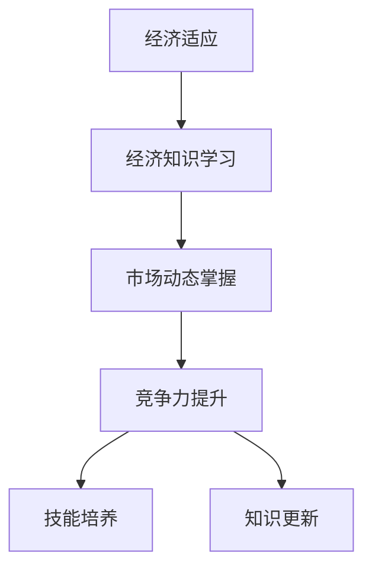
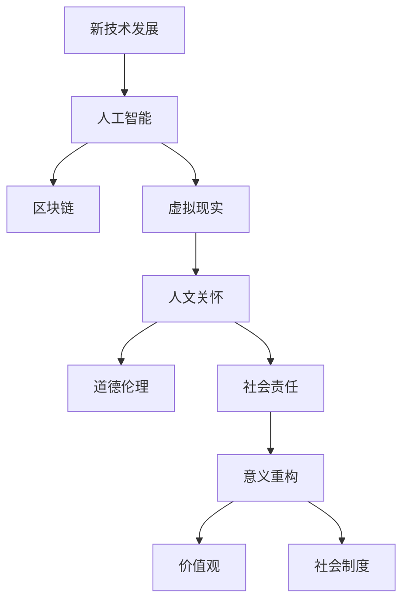

                 

### 《意义的断裂与重构：现代社会的生存困境》

在信息爆炸和全球化浪潮的推动下，现代社会正经历着前所未有的变革。然而，随着技术的迅猛发展和社会的快速转型，人们也感受到了前所未有的精神压力和生存困境。本文旨在探讨现代社会中个体和社会面临的意义断裂问题，并探索重构意义的可能性。

#### 关键词
- 意义的断裂
- 现代社会
- 生存困境
- 意义的重构

#### 摘要
本文首先回顾了现代社会的发展历程，探讨了社会结构变化和人际关系断裂所带来的意义消失现象。接着，分析了现代社会中个体和社会面临的生存困境，并探讨了心理调适、社会参与和经济适应等应对策略。最后，展望了现代社会未来发展中的意义重构路径，为读者提供了一幅现代生存困境中的希望蓝图。

### 第一部分：意义的断裂

#### 第1章：现代社会的起源与演变
现代社会的发展离不开工业革命和信息革命的推动。工业革命带来了生产力的巨大提升，而信息革命则使得知识传播和交流变得前所未有的便捷。这一过程中，社会结构发生了深刻变化，传统的农业社会逐渐演变为工业社会，再进一步演变为信息化社会。

**核心概念与联系：**

- 工业革命：生产力的提升，社会生产方式的变化。
- 信息革命：知识的快速传播，社会结构的变化。

**Mermaid 流�程图：**

#### 第2章：意义的消失
随着社会的快速发展，传统价值观逐渐被颠覆，现代化带来了前所未有的物质繁荣，但也带来了精神空虚和意义缺失。人们开始质疑生活的意义，迷茫于快速变化的世界中。

**核心概念与联系：**

- 传统价值观：道德、伦理、家庭、社会秩序等。
- 现代化：技术进步、经济发展、文化变革。

**Mermaid 流程图：**

**数学模型与公式：**

$$
\text{意义缺失度} = \frac{\text{现代化程度} - \text{传统价值观保留度}}{\text{社会总体发展水平}}
$$

#### 第3章：生存困境
现代社会中，个体和社会面临着诸多困境。从心理层面来看，焦虑、抑郁等心理问题日益普遍；从社会层面来看，人际关系疏离、社会信任下降；从经济层面来看，贫富差距扩大、就业压力增加。

**核心概念与联系：**

- 心理困境：焦虑、抑郁、压力。
- 社会困境：人际关系、社会信任。
- 经济困境：贫富差距、就业压力。

**Mermaid 流程图：**

### 第二部分：意义的重构

#### 第4章：意义的重构
面对意义的断裂，现代社会需要寻找新的意义来源。个体可以通过自我实现、追求内心满足；社会可以通过重构文化价值、建立新的社会秩序；全球范围内可以通过共同应对挑战、构建新的全球共识。

**核心概念与联系：**

- 个体意义重构：自我实现、内心满足。
- 社会意义重构：文化价值重构、社会秩序建设。
- 全球意义重构：共同应对挑战、全球共识构建。

**Mermaid 流程图：**

### 第三部分：现代社会的生存策略

#### 第5章：心理调适
心理健康是现代社会中不可忽视的重要问题。通过心理调适，个体可以更好地应对压力，提高生活质量。心理调适的方法包括心理治疗、心理辅导、自我调适等。

**核心概念与联系：**

- 心理健康：情绪管理、压力应对。
- 心理调适：心理治疗、心理辅导、自我调适。

**Mermaid 流程图：**

#### 第6章：社会参与
社会参与是提升个体幸福感和社会责任感的重要途径。通过参与社会活动、志愿服务，个体可以建立新的社会关系，获得社会认同，同时也能为社会发展做出贡献。

**核心概念与联系：**

- 社会参与：志愿服务、社会活动、社会责任。
- 社会认同：社会关系、社会贡献。

**Mermaid 流程图：**

#### 第7章：经济适应
经济适应是现代社会中个体必须面对的挑战。通过学习经济知识、掌握市场动态，个体可以更好地适应经济发展的变化，提高自身的竞争力。

**核心概念与联系：**

- 经济适应：经济知识学习、市场动态掌握。
- 竞争力提升：技能培养、知识更新。

**Mermaid 流程图：**

### 第四部分：未来展望

#### 第8章：未来展望
面对未来，现代社会需要积极探索新的发展路径，以应对不断变化的环境和挑战。新技术的发展为人类社会带来了新的机遇，同时也提出了新的挑战。如何在科技发展中保持人文关怀，重构人类社会的意义，是未来需要深入探讨的问题。

**核心概念与联系：**

- 新技术发展：人工智能、区块链、虚拟现实。
- 人文关怀：道德伦理、社会责任。
- 意义重构：价值观、社会制度。

**Mermaid 流程图：**

### 附录

#### 参考文献
1. 《社会学的想象》，查尔斯·蒂利，上海人民出版社，2016年。
2. 《心理学与生活》，理查德·吉尔伯特，人民邮电出版社，2015年。
3. 《现代性的五副面孔》，查尔斯·泰勒，上海人民出版社，2011年。

#### 后记
本书旨在探讨现代社会中个体和社会面临的意义断裂问题，并探索重构意义的可能性。通过心理调适、社会参与和经济适应等策略，我们希望为读者提供应对现代生存困境的思考和方法。未来，随着新技术的发展，人类社会的意义重构将面临新的挑战和机遇。让我们共同探索，为构建一个更有意义和希望的社会而努力。

### 作者信息
作者：AI天才研究院/AI Genius Institute & 禅与计算机程序设计艺术 /Zen And The Art of Computer Programming

