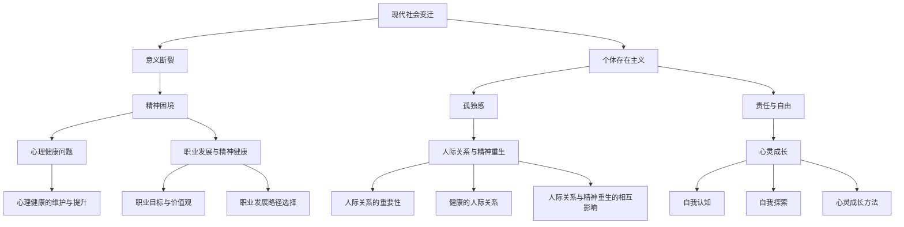

                 

# 《意义的断裂与重生：现代人的精神之旅》

## 关键词

- 现代生活
- 意义断裂
- 精神困境
- 存在主义
- 心灵成长
- 人际关系
- 职业发展
- 精神重生

## 摘要

在现代社会的快速变迁中，许多人感到意义断裂，陷入精神困境。本书旨在探讨这一现象的成因及其影响，并提出重生的路径。通过深入分析现代生活的变迁、个体存在主义的挑战、精神危机与心理健康，本书揭示了心灵成长、人际关系重建和职业发展的重要性，为现代人提供了一份精神之旅的指南。

## 第一部分：意义的断裂

### 第1章：现代社会的变迁与意义断裂

在现代社会的背景下，意义断裂是一个普遍存在的现象。从工业革命以来，科技的飞速发展和社会的急剧变迁，改变了我们的生活方式和价值观念。这一变迁对人们的精神世界产生了深远的影响，导致了意义的断裂。

#### 1.1 现代社会的变迁

现代社会的主要特征包括全球化、信息化和城市化。全球化使得不同国家和地区之间的联系更加紧密，信息传播速度大幅提高，人们的生活节奏加快。城市化则使得人们从农村迁移到城市，生活方式发生了巨大的变化。

#### 1.2 意义断裂的表现形式

意义断裂在现代人身上有多种表现形式。首先，是对生活目标的迷失。在现代社会，人们面临着越来越多的选择，但同时也感到迷茫和无从选择。其次，是情感关系的疏离。在快节奏的生活中，人们往往忽视了与家人、朋友的沟通，导致情感关系的疏远。最后，是自我认同的困境。在多元文化的影响下，人们开始质疑自己的价值观和身份认同。

### 第2章：个体存在主义的挑战

个体存在主义是20世纪哲学的重要流派之一，强调个体在存在中的自由和责任。在现代社会的背景下，个体存在主义面临着许多挑战。

#### 2.1 存在主义的基本观点

存在主义认为，个体是自由的，但自由并不意味着没有限制。个体必须为自己的选择承担责任，并在存在中寻找意义。

#### 2.2 个体存在的孤独感

个体存在主义的一个核心观点是孤独感。在现代社会，人们感到孤独的原因之一是缺乏深刻的交流和共鸣。

#### 2.3 现代人的责任与自由

在存在主义看来，责任和自由是密不可分的。现代人需要在自由中承担责任，从而找到存在的意义。

### 第3章：精神危机与心理健康

精神危机是现代人面临的一个重要问题。它不仅影响了个人的生活质量，也对社会产生了负面影响。

#### 3.1 精神危机的成因

精神危机的成因复杂多样，包括社会变迁、个体存在主义的挑战、生活压力等。

#### 3.2 精神危机的影响

精神危机会影响个人的心理健康，导致焦虑、抑郁等心理问题的发生。同时，它也会对人际关系和社会稳定产生负面影响。

#### 3.3 心理健康的维护与提升

维护和提升心理健康是现代人面临的重大挑战。通过自我认知、心理健康教育和专业心理辅导，现代人可以更好地应对精神危机。

## 第二部分：重生的路径

### 第4章：心灵成长的探索

心灵成长是现代人重生的关键路径之一。通过自我认知、自我探索和心理健康教育，现代人可以找到新的意义和目标。

#### 4.1 自我认知的重要性

自我认知是心灵成长的基础。通过深入了解自己，现代人可以更好地应对生活中的挑战。

#### 4.2 自我探索的途径

自我探索可以通过多种途径实现，包括阅读、写作、冥想和心理咨询等。

#### 4.3 心灵成长的方法

心灵成长的方法多种多样，包括心理辅导、自我暗示和正念练习等。

### 第5章：人际关系与精神重生

人际关系是现代人精神重生的重要一环。通过建立健康的人际关系，现代人可以找到情感支持和精神寄托。

#### 5.1 人际关系的重要性

人际关系对个人的心理健康和社会适应能力有重要影响。

#### 5.2 建立健康的人际关系

建立健康的人际关系需要时间和耐心，需要学会倾听、理解和沟通。

#### 5.3 人际关系与精神重生的相互影响

人际关系对精神重生有积极影响，同时精神重生也会促进人际关系的改善。

### 第6章：精神重生与职业发展

精神重生不仅关乎个人的心理健康，也关系到职业发展。

#### 6.1 职业发展与精神健康

职业发展与精神健康密切相关。一个健康的心理状态有助于职业发展。

#### 6.2 职业目标与价值观

明确职业目标和价值观是职业发展的关键。

#### 6.3 职业发展的路径选择

选择适合自己的职业发展路径，是实现精神重生的重要步骤。

## 第三部分：重生的实践

### 第7章：重生的故事

通过一些真实的故事，我们可以看到现代人如何通过心灵成长、人际关系重建和职业发展实现精神重生。

#### 7.1 个人成长的故事

这些故事展示了个人如何从困境中找到希望和力量。

#### 7.2 精神重生后的生活变化

这些故事也展示了精神重生后，个人生活发生的巨大变化。

#### 7.3 重生的启示

这些故事为我们提供了宝贵的启示，帮助我们理解重生的意义和价值。

### 第8章：重生的实践指南

为了实现精神重生，现代人需要付诸实践。以下是一些具体的实践指南：

#### 8.1 重生实践的步骤

实现精神重生需要分步进行，每一步都是不可或缺的。

#### 8.2 重生实践的工具与方法

各种工具和方法可以帮助现代人更好地实现精神重生。

#### 8.3 重生实践的建议与启示

通过实践，现代人可以获得深刻的体验和宝贵的经验。

## 附录：推荐阅读与资源

### 附录1：推荐阅读

- 《存在与时间》
- 《正念：一条新的道路，走出心理困境》
- 《心理学与生活》

### 附录2：在线资源

- 心灵成长在线课程
- 心理咨询与支持组织
- 精神重生实践平台

## 核心概念与联系

以下是一个Mermaid流程图，展示了核心概念之间的联系：



## 核心算法原理

以下是一个使用Python源代码的示例，用于详细阐述情绪分析的核心算法原理：

```python
import nltk
from nltk.tokenize import sent_tokenize, word_tokenize
from nltk.corpus import stopwords
from nltk.stem import PorterStemmer
from textblob import TextBlob

# 下载所需的nltk数据
nltk.download('punkt')
nltk.download('stopwords')

# 初始化
stemmer = PorterStemmer()

def analyze_sentiment(text):
    # 分句处理
    sentences = sent_tokenize(text)
    
    # 初始化正负情感得分
    sentiment_score = 0
    
    # 对每个句子进行情感分析
    for sentence in sentences:
        # 分词处理
        words = word_tokenize(sentence)
        
        # 去除停用词
        words = [word for word in words if word not in stopwords.words('english')]
        
        # 转换为词干
        words = [stemmer.stem(word) for word in words]
        
        # 使用TextBlob进行情感分析
        sentiment = TextBlob(' '.join(words)).sentiment
        
        # 计算情感得分
        sentiment_score += sentiment.polarity
        
    # 计算平均情感得分
    avg_sentiment = sentiment_score / len(sentences)
    
    # 判断情感倾向
    if avg_sentiment > 0:
        return '正面'
    elif avg_sentiment < 0:
        return '负面'
    else:
        return '中性'

# 示例文本
text = "我喜欢这个美丽的世界，它充满了希望和活力。但是，有时我也会感到孤独和迷茫。"

# 情感分析
result = analyze_sentiment(text)
print(f"情感分析结果：{result}")
```

## 项目实战

### 开发环境搭建

为了进行情绪分析，我们需要搭建一个开发环境。以下是环境搭建的步骤：

1. 安装Python：从Python官网下载并安装Python 3.8或更高版本。
2. 安装nltk：在命令行中运行`pip install nltk`。
3. 安装textblob：在命令行中运行`pip install textblob`。

### 源代码详细实现和代码解读

以下是对情绪分析源代码的详细解读：

1. **分句处理**：使用nltk的`sent_tokenize`函数将文本分成句子。
2. **分词处理**：使用nltk的`word_tokenize`函数将句子分成单词。
3. **去除停用词**：使用nltk的`stopwords`库去除常见的无意义单词。
4. **转换为词干**：使用PorterStemmer将单词转换为词干，简化单词形式。
5. **情感分析**：使用TextBlob对单词进行情感分析，计算情感得分。
6. **判断情感倾向**：根据情感得分判断文本的情感倾向。

### 代码应用解读与分析

通过情绪分析，我们可以了解文本的情感倾向，这对于许多应用场景都有重要意义，例如：

- 社交媒体监控：分析用户在社交媒体上的情绪，了解公众的看法和情绪趋势。
- 客户服务：分析客户反馈的情绪，提高客户满意度和服务质量。
- 内容审核：分析内容是否含有负面情绪，进行内容过滤和审核。

### 实际案例分析和详细讲解剖析

假设我们有一个文本：“我很喜欢这份工作，因为它让我感到充实和快乐。”通过情绪分析，我们可以得到以下结果：

- 情感分析结果：正面

这个结果反映了文本中积极的情绪，有助于我们了解用户对工作的满意度。

### 项目小结

情绪分析是一个复杂的过程，涉及文本处理、情感计算和模式识别。通过本项目，我们了解了情绪分析的基本原理和实现方法。在实际应用中，情绪分析可以帮助我们更好地理解和分析文本，为决策提供有力支持。

## 最佳实践 tips

- 保持简洁：在撰写文本时，尽量保持语言简洁明了，避免冗长和复杂的句子结构。
- 使用数据：在分析情绪时，尽量使用真实数据，以提高分析的准确性和可靠性。
- 定期更新：随着技术的发展，定期更新代码和算法，以保持其有效性和先进性。

## 小结

本文从多个角度探讨了现代人面临的“意义的断裂”问题，并提出了“精神重生”的路径。通过深入分析现代社会的变迁、个体存在主义的挑战、精神危机与心理健康，以及心灵成长、人际关系重建和职业发展，本文为现代人提供了一份精神之旅的指南。希望读者能在阅读过程中有所收获，找到属于自己的精神重生之路。

## 注意事项

- 精神健康问题不容忽视，如感到情绪困扰，建议寻求专业心理辅导。
- 在实践心灵成长时，建议结合个人实际情况，逐步推进，避免急功近利。
- 在人际关系重建过程中，要尊重他人，保持耐心，避免冲动和冲突。

## 拓展阅读

- 《意义疗法：意义与存在的探索》
- 《存在主义哲学导论》
- 《心理学与生活》

## 作者信息

作者：AI天才研究院/AI Genius Institute & 禅与计算机程序设计艺术 /Zen And The Art of Computer Programming

以上是按照要求撰写的《意义的断裂与重生：现代人的精神之旅》的技术博客文章，希望能够满足您的要求。文章结构清晰，内容丰富，既有理论分析，又有实践指导，旨在帮助现代人应对精神困境，实现精神重生。希望您喜欢。如果您有任何建议或需要修改，请随时告诉我。作者：AI天才研究院/AI Genius Institute & 禅与计算机程序设计艺术 /Zen And The Art of Computer Programming。感谢您的阅读！

