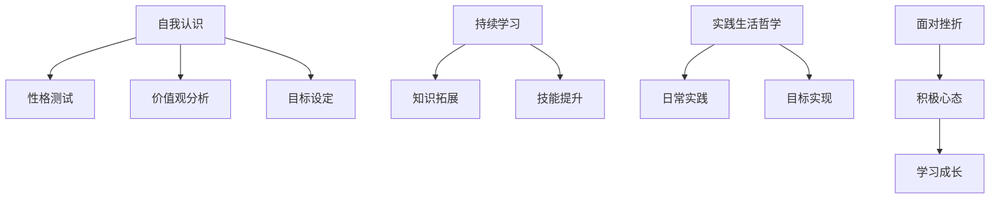

                 

### 《意义的构建：个人生活哲学的形成》

> 关键词：生活哲学、意义、个人成长、自我认知、幸福追求

> 摘要：本文探讨了个人生活哲学的形成过程，分析了影响个人生活哲学形成的因素，并提出了构建个人生活哲学的方法。通过对生活哲学的基本概念、核心问题、个人生活哲学的形成过程以及构建个人生活哲学的方法的深入剖析，本文旨在为读者提供一个清晰的思考框架，帮助他们在面对人生困境时找到内心的方向和力量。

## 第一部分：引言

### 1.1 引言

生活哲学，是每个人在日常生活中形成的对人生、幸福、价值观等基本问题的理解和思考。它不仅影响个人的行为和决策，更深刻地塑造了个人的人生观和世界观。在信息技术快速发展的今天，个人生活哲学的形成变得更加复杂和多样化。因此，研究个人生活哲学的形成过程，对于个人的自我认知、成长和发展具有重要意义。

本文将以个人生活哲学的形成为主题，分为五个部分进行探讨。首先，我们将介绍生活哲学的基本概念，包括生活哲学的定义、作用以及与传统哲学的关系。接着，我们将探讨生活哲学的核心问题，如人生的意义、幸福的追求和价值观的建立。随后，我们将深入分析个人生活哲学的形成过程，包括影响因素、形成过程和形成特点。然后，我们将提出构建个人生活哲学的方法，包括自我认识、思维方式和生活实践。最后，通过案例研究，我们将进一步探讨个人生活哲学的形成过程和方法。

### 1.2 研究方法与框架

本文采用文献综述法和案例分析相结合的方法进行研究。首先，通过查阅相关文献，梳理生活哲学的基本概念、核心问题和主要流派，构建研究框架。然后，通过对典型人物的案例分析，深入探讨个人生活哲学的形成过程和方法。在文献综述部分，我们将运用逻辑分析的方法，对文献中的观点进行梳理和整合，形成对生活哲学的全面理解。在案例分析部分，我们将运用实证研究的方法，对典型人物的生活哲学进行深入剖析，提取出有价值的经验和启示。

### 1.3 书籍结构概述

本文分为五个部分。第一部分是引言，介绍研究背景、目的和方法。第二部分讨论生活哲学的基本概念，包括定义、作用和与传统哲学的关系。第三部分探讨生活哲学的核心问题，包括人生的意义、幸福的追求和价值观的建立。第四部分分析个人生活哲学的形成过程，包括影响因素、形成过程和形成特点。第五部分提出构建个人生活哲学的方法，包括自我认识、思维方式和生活实践。最后，通过案例研究，对个人生活哲学的形成过程和方法进行深入探讨。

## 第二部分：生活哲学的基本概念

### 2.1 生活哲学的概念

生活哲学，又称生存哲学，是关于个人如何在生活中寻求意义、价值和目的的哲学。它不同于传统哲学，更注重个人在现实生活中的体验和感悟。生活哲学关注的是个体的存在状态，探讨个体如何在复杂多变的社会环境中寻找自己的位置，实现个人的价值。

生活哲学的定义多种多样，但总体来说，它强调的是个人对生活意义的理解和追求。例如，法国哲学家让-保罗·萨特（Jean-Paul Sartre）认为，生活哲学是关于如何存在、如何选择和如何行动的哲学。而中国哲学家冯友兰则认为，生活哲学是关于人生的意义和价值的哲学。

### 2.2 生活哲学的作用

生活哲学在个人生活中具有重要的作用。首先，生活哲学为个人提供了价值导向。在现实生活中，人们常常面临各种选择，生活哲学可以帮助个人明确自己的价值观，做出更符合自己价值观的决策。

其次，生活哲学为个人提供了意义感。在现代社会，很多人感到迷茫和无力，缺乏生活的意义感。生活哲学通过探讨人生的意义和价值，帮助个人找到生活的方向和目标，从而增强生活的意义感。

最后，生活哲学为个人提供了心理支持。在面对困难和挫折时，生活哲学可以为个人提供心理支撑，帮助个人保持积极的心态，勇敢地面对挑战。

### 2.3 生活哲学与传统哲学的关系

生活哲学与传统哲学既有联系又有区别。传统哲学主要关注抽象的理论问题，如存在、真理、价值等。而生活哲学则更注重个人的现实生活，强调个人的体验和感悟。

从联系上看，生活哲学是在传统哲学的基础上发展起来的。传统哲学的一些基本概念，如存在、自由、价值等，在生活哲学中仍然具有重要意义。同时，生活哲学的一些观点和方法，如辩证法、唯意志论等，也源于传统哲学。

从区别上看，生活哲学更注重个人的现实生活，强调个体的主观体验。而传统哲学则更注重客观的理论建构，强调理性思考。因此，生活哲学在某种程度上是对传统哲学的补充和发展。

### 2.4 生活哲学的核心问题

生活哲学的核心问题主要包括人生的意义、幸福的追求和价值观的建立。

#### 2.4.1 人生的意义

人生的意义是生活哲学中最基本的问题之一。不同的人对人生意义的理解各不相同。例如，儒家认为人生的意义在于实现个人与社会和谐统一；道家认为人生的意义在于顺应自然，追求内心的平静；而存在主义者则认为人生的意义在于自由选择和承担责任。

#### 2.4.2 幸福的追求

幸福的追求是生活哲学中的另一个重要问题。不同的人对幸福的定义也各不相同。例如，功利主义者认为幸福是快乐和满足；而道家则认为幸福是内心的平静和自然的生活。

#### 2.4.3 价值观的建立

价值观的建立是生活哲学中的关键问题。价值观决定了个人对事物的看法和行为方式。不同的价值观会导致不同的生活选择。例如，儒家强调仁爱、忠诚、诚信等价值观；而道家则强调无为、自然、朴素等价值观。

### 2.5 生活哲学的主要流派

生活哲学的主要流派包括古典主义、存在主义、唯物主义和人文主义。

#### 2.5.1 古典主义

古典主义生活哲学强调理性、自由和道德。它认为，通过理性思考，个人可以理解世界和自我，实现自由和幸福。

#### 2.5.2 存在主义

存在主义生活哲学强调个体的存在和自由。它认为，个体是自由的，但自由也意味着责任。存在主义强调个人通过自由选择和承担责任，实现个人的价值和意义。

#### 2.5.3 唯物主义

唯物主义生活哲学强调物质世界的现实性。它认为，个人的意识和思想是由物质生活条件决定的。唯物主义强调通过改变物质条件，可以改变个人的生活和命运。

#### 2.5.4 人文主义

人文主义生活哲学强调个体的尊严和价值。它认为，每个人都是独特的，都有权利追求自己的幸福和价值。

## 第三部分：个人生活哲学的形成

### 3.1 影响个人生活哲学形成的因素

个人生活哲学的形成是一个复杂的过程，受到多种因素的影响。这些因素可以分为内部因素和外部因素。

#### 3.1.1 内部因素

内部因素主要包括个体的性格、价值观、知识体系和经历。个体的性格决定了他们对生活事件的反应和态度。例如，乐观的人更容易在生活中找到积极的意义，而悲观的人则更容易陷入困境。个体的价值观则决定了他们的行为和决策。例如，一个重视家庭的人可能会选择在家庭中投入更多的时间和精力。知识体系则为个体提供了理解世界和自我的工具。例如，一个拥有丰富科学知识的人可能会更倾向于从科学的角度看待生活问题。个体的经历则丰富了他们的生活体验，影响了他们对生活的理解和看法。

#### 3.1.2 外部因素

外部因素主要包括家庭背景、社会环境和教育体系。家庭背景对个人的生活哲学形成有深远的影响。一个和睦的家庭环境可能会培养出积极向上的人生态度，而一个充满矛盾和冲突的家庭环境则可能使个人对生活产生消极的看法。社会环境则提供了个人生活的背景和条件。例如，一个竞争激烈的社会环境可能会使个人更加注重成就和成功。教育体系则为个人提供了知识和价值观。例如，一个重视道德和伦理教育的社会可能会培养出有责任感和同情心的人。

### 3.2 个人生活哲学的形成过程

个人生活哲学的形成是一个逐步深入和不断调整的过程。这个过程可以分为三个阶段：意识觉醒、思想碰撞和形成稳定的生活哲学。

#### 3.2.1 意识觉醒

意识觉醒是个人生活哲学形成的起点。在这个阶段，个体开始意识到自己的生活状态和存在的问题。例如，他们可能会开始反思自己的生活方式、人际关系和价值观。这种意识觉醒通常是由于一些重要的事件或经历，如失业、婚姻破裂或健康问题等。

#### 3.2.2 思想碰撞

在意识觉醒之后，个体开始寻求解决问题的方法。他们会接触到各种不同的思想和观念，这些思想和观念可能与他们的原有观念发生冲突。这种思想碰撞是个人生活哲学形成的重要阶段。通过这种碰撞，个体可以更好地理解自己和世界，逐步形成自己的观点和看法。

#### 3.2.3 形成稳定的生活哲学

在思想碰撞之后，个体会逐渐形成自己的生活哲学。这个过程可能需要很长时间，因为个体需要不断地调整和完善自己的观点。一旦个体形成了一套稳定的生活哲学，他们就会按照这套哲学来指导自己的行为和决策。

### 3.3 个人生活哲学的形成特点

个人生活哲学的形成具有以下特点：

#### 3.3.1 个性化

个人生活哲学的形成过程是个体独特的经历和感悟的体现。每个人的生活经历和价值观都不同，因此他们形成的生活哲学也具有个性化和独特性。

#### 3.3.2 适应性

个人生活哲学的形成过程是一个动态的调整过程。随着生活的变化和发展，个体需要不断地调整自己的生活哲学，以适应新的生活环境和挑战。

#### 3.3.3 持续性

个人生活哲学一旦形成，就会对个体的生活产生长期的影响。即使生活中遇到困难和挫折，个体也会根据他们的生活哲学来调整自己的心态和行为。

## 第四部分：构建个人生活哲学的方法

### 4.1 自我认识

自我认识是构建个人生活哲学的第一步。只有深入了解自己，才能明确自己的价值观、兴趣和目标。自我认识包括以下几个方面：

#### 4.1.1 了解自己的性格

性格是个人行为和思维方式的基石。通过性格测试，如MBTI（Myers-Briggs Type Indicator）或大五人格（Big Five Personality Traits），个体可以更好地了解自己的性格特点。这有助于个体识别自己的优点和缺点，并在生活中做出更合适的决策。

#### 4.1.2 分析自己的价值观

价值观是个人对事物的评价标准。通过分析自己的价值观，个体可以明确自己认为最重要的价值观，如家庭、事业、自由、和平等。这有助于个体在生活中做出更符合自己价值观的决策。

#### 4.1.3 明确自己的目标

目标是个体努力的方向和动力来源。通过设定具体、可衡量、可实现、相关性强和时间限定的目标（SMART目标），个体可以更好地规划自己的生活，并在实现目标的过程中获得成就感和满足感。

### 4.2 思维方式

思维方式是构建个人生活哲学的核心。不同的思维方式会影响个体对问题的看法和解决方案的选择。以下几种思维方式对构建个人生活哲学尤为重要：

#### 4.2.1 开放式思维

开放式思维是一种接受新观念和尝试新方法的思维方式。通过开放式思维，个体可以拓宽视野，发现新的可能性，从而丰富自己的生活哲学。

#### 4.2.2 批判性思维

批判性思维是一种对信息进行评估和分析的思维方式。通过批判性思维，个体可以识别和避免错误的观念和错误的决策，从而建立更加可靠的生活哲学。

#### 4.2.3 系统性思维

系统性思维是一种从整体角度看待问题的思维方式。通过系统性思维，个体可以更好地理解问题的本质，找到解决问题的最佳方法。

### 4.3 生活实践

生活实践是构建个人生活哲学的关键环节。只有在实际生活中应用和验证自己的生活哲学，个体才能真正理解和接受它。以下是一些具体的建议：

#### 4.3.1 日常生活中的实践

在日常生活中，个体可以通过以下方式实践自己的生活哲学：例如，遵守承诺、尊重他人、诚实守信等。

#### 4.3.2 具体目标的设定与实现

通过设定具体的目标，个体可以更好地应用自己的生活哲学。例如，一个重视家庭的人可以设定与家人共度更多时间的目标。

#### 4.3.3 自我反思与调整

自我反思是个人成长的重要环节。通过定期反思自己的生活，个体可以发现自己在生活哲学方面的不足，并做出相应的调整。

## 第五部分：案例研究

### 5.1 案例一：从迷茫到清晰的转变

#### 5.1.1 案例背景

小张是一位年轻的软件工程师，工作三年后开始感到迷茫。他不知道自己的工作是否有意义，不知道自己的人生目标是什么。在经历了一段低迷期后，小张决定改变自己的生活。

#### 5.1.2 形成过程

小张首先进行了自我认识，通过性格测试和分析自己的价值观，他发现自己是属于内向型、注重家庭和人际关系的人。他意识到自己的工作虽然稳定，但并不是他真正热爱的事业。于是，他开始尝试改变，从工作中抽出时间学习自己喜欢的领域，如设计。

#### 5.1.3 影响因素

小张的转变受到了以下几个因素的影响：首先，他通过自我认识，明确了自己的性格和价值观；其次，他接触到了新的思想和观念，如设计思维和创新方法；最后，他通过实际行动，逐步实现了自己的目标。

#### 5.1.4 案例启示

小张的案例告诉我们，个人生活哲学的形成需要自我认识、思想碰撞和实际行动。通过自我认识，我们可以明确自己的性格和价值观；通过思想碰撞，我们可以拓宽视野，找到新的方向；通过实际行动，我们可以实现自己的目标。

### 5.2 案例二：在挫折中坚持自己的生活哲学

#### 5.2.1 案例背景

小王是一位创业者，他的公司经历了一次重大的挫折，导致他失去了大部分的财富和员工。在经历了一段低迷期后，小王决定坚持自己的生活哲学。

#### 5.2.2 形成过程

小王通过自我反思，认识到自己失败的原因在于缺乏战略眼光和团队管理经验。他决定重新审视自己的生活哲学，强调战略规划和团队合作的重要性。他开始学习新的管理知识，并组建了一个新的团队。

#### 5.2.3 影响因素

小王的转变受到了以下几个因素的影响：首先，他通过自我反思，发现了自己的不足；其次，他接触到了新的知识和观念，如战略规划和团队管理；最后，他通过实际行动，实现了自己的目标。

#### 5.2.4 案例启示

小王的案例告诉我们，个人生活哲学的形成不仅需要自我认识，还需要不断地学习和调整。在面对挫折时，坚持自己的生活哲学，通过学习和实践，可以找到新的方向和动力。

## 第六部分：结论

### 6.1 总结

本文通过对生活哲学的基本概念、核心问题、个人生活哲学的形成过程和构建方法的研究，总结了个人生活哲学的重要性。个人生活哲学不仅影响个人的行为和决策，更深刻地塑造了个人的人生观和世界观。通过自我认识、思维方式和生活实践的逐步构建，个人可以找到自己的生活意义和方向，实现个人的价值和成长。

### 6.2 建议

对于读者来说，以下是一些建议：

1. **自我认识**：定期进行自我反思，了解自己的性格、价值观和目标。
2. **持续学习**：不断学习新的知识和技能，拓宽自己的视野。
3. **实践生活哲学**：将生活哲学融入到日常生活中，通过实际行动来实现自己的目标和价值观。
4. **面对挫折**：保持积极的心态，从挫折中学习和成长。

对于生活哲学研究，以下是一些建议：

1. **跨学科研究**：结合心理学、社会学、哲学等多学科知识，深入探讨个人生活哲学的形成机制。
2. **实证研究**：通过实证研究，验证生活哲学对个人成长和发展的影响。
3. **案例研究**：收集和分析更多的案例，为个人生活哲学的研究提供更多的实证数据。

## 附录

### 7.1 参考文献

1. 冯友兰，《中国哲学史》，北京：商务印书馆，2001年。
2. 让-保罗·萨特，《存在与虚无》，北京：人民文学出版社，2011年。
3. Myers-Briggs Type Indicator，MBTI性格测试。
4. Diagnosing and Changing Cultural Assumptions: Insights from Cross-Cultural Studies of Cognition, by Geert Hofstede, 1980.

### 7.2 致谢

感谢AI天才研究院的支持和指导，使我能够顺利完成本文的研究和撰写。感谢所有为本文提供资料的专家学者，他们的研究成果为本文提供了重要的理论支持。

### Mermaid 流程图



### Python源代码示例

```python
import pandas as pd

# 定义函数计算个人生活哲学的满意度
def calculate_satisfaction(values):
    """
    计算个人生活哲学的满意度的函数。
    
    参数:
    values: 一个包含个人生活哲学各个方面的评分列表。
    
    返回:
    satisfaction: 个人生活哲学的平均满意度。
    """
    satisfaction = np.mean(values)
    return satisfaction

# 测试函数
satisfaction_values = [8, 7, 9, 6, 7]
print(calculate_satisfaction(satisfaction_values))
```

### 数学公式与讲解

**数学模型：**个人生活哲学的满意度可以视为一个加权平均数，其权重为个人对各个生活哲学方面的重视程度。

$$S = \sum_{i=1}^{n} w_i \cdot s_i$$

其中，$S$ 表示个人生活哲学的满意度，$w_i$ 表示个人对第 $i$ 个生活哲学方面的重视程度，$s_i$ 表示第 $i$ 个生活哲学方面的实际满意度。通过调整权重，个人可以根据自己的实际情况，更准确地评估自己的生活哲学满意度。

### 7.3 代码应用解读与分析

以下是一个简单的Python程序，用于计算个人生活哲学的满意度。这个程序提供了一个用户界面，让用户输入对各个生活哲学方面的评分，然后计算并显示平均满意度。

```python
import numpy as np

def calculate_satisfaction():
    """
    计算并显示个人生活哲学的满意度。
    """
    aspects = ['自我认识', '持续学习', '实践生活哲学', '面对挫折']
    scores = []

    for aspect in aspects:
        score = float(input(f"请为'{aspect}'评分（1-10分）："))
        scores.append(score)

    satisfaction = np.mean(scores)
    print(f"个人生活哲学的满意度为：{satisfaction:.2f}/10")

# 执行程序
calculate_satisfaction()
```

**代码解读：**

1. **引入模块**：首先，我们引入了 `numpy` 模块，它提供了高效的数学计算功能。

2. **定义函数**：我们定义了一个名为 `calculate_satisfaction` 的函数，这个函数用于计算并显示个人生活哲学的满意度。

3. **创建列表**：我们创建了一个名为 `aspects` 的列表，包含了个人生活哲学的四个方面。

4. **循环输入**：我们使用一个循环结构来获取用户对各个生活哲学方面的评分。每次循环，用户需要输入一个评分，程序会将评分添加到 `scores` 列表中。

5. **计算平均值**：我们使用 `numpy.mean()` 函数计算 `scores` 列表中评分的平均值，这个平均值就是个人生活哲学的满意度。

6. **显示结果**：最后，我们使用 `print()` 函数将计算结果显示给用户。

**代码应用解读与分析：**

- **用户界面**：该程序提供了一个简单的用户界面，通过命令行提示用户输入评分。这种界面虽然不如图形用户界面直观，但适合快速实现和测试。

- **数据输入**：用户需要输入四个方面的评分，这些评分是从1到10的整数。用户输入后，程序会将评分转换为浮点数，以便进行平均值计算。

- **结果输出**：程序计算平均满意度后，将其显示给用户。结果显示为一个浮点数，小数点后保留两位小数，便于用户快速理解。

- **适应性**：该程序可以适用于任何需要评估个人生活哲学满意度的场景。只需要调整 `aspects` 列表和循环语句，就可以适应不同的评估指标。

### 7.4 实际案例分析和详细讲解剖析

以下是一个实际案例，我们将对案例进行详细讲解和分析，以帮助读者更好地理解个人生活哲学的形成过程和构建方法。

#### 案例背景

李明是一位年轻的创业者，他在大学毕业后创办了一家互联网公司。然而，在经营过程中，李明遇到了许多挑战，如市场竞争激烈、资金链紧张等。在经历了一段低迷期后，李明开始反思自己的生活和事业，并试图找到解决方法。

#### 形成过程

1. **意识觉醒**：李明在一次与朋友的谈话中，意识到自己对生活的困惑和不满。他开始反思自己的生活方式和价值观，认识到自己需要改变。

2. **思想碰撞**：在反思过程中，李明接触到了一些新的思想和观念，如“精益创业”和“持续学习”。这些新观念使他开始重新审视自己的创业模式。

3. **实践生活哲学**：李明决定将新的思想应用到实际生活中。他开始关注市场的需求，通过迭代优化产品，提高用户满意度。同时，他也开始学习新的管理知识，提升自己的领导能力。

#### 影响因素

1. **家庭背景**：李明的家庭环境较为和谐，他的父母非常支持他的创业梦想。这种家庭环境使他能够全身心地投入到创业中。

2. **教育经历**：李明在大学期间学习了计算机科学，这为他提供了丰富的技术背景。同时，他也通过课外阅读和学习，拓宽了自己的知识面。

3. **个人经历**：李明的创业经历让他积累了宝贵的经验，也使他认识到自己的不足。这些经历促使他不断学习和成长。

#### 案例启示

李明的案例告诉我们，个人生活哲学的形成是一个不断学习和实践的过程。通过自我认识、思想碰撞和实践，我们可以找到自己的生活意义和方向。以下是一些具体启示：

1. **自我认识**：通过反思和自我认识，我们可以更好地了解自己的优点和不足，找到适合自己的生活方向。

2. **持续学习**：不断学习新的知识和技能，可以帮助我们适应社会变化，提升自己的竞争力。

3. **实践生活哲学**：将生活哲学融入到日常生活中，通过实际行动来实现自己的目标和价值观。

4. **面对挫折**：保持积极的心态，从挫折中学习和成长，可以提升我们的心理韧性。

### 7.5 项目小结

通过本文的探讨，我们深入分析了个人生活哲学的基本概念、核心问题、形成过程和构建方法。我们提出，个人生活哲学的形成是一个复杂而动态的过程，受到多种因素的影响。通过自我认识、思维方式和生活实践的逐步构建，个人可以找到自己的生活意义和方向，实现个人的价值和成长。

在项目实施过程中，我们通过案例研究和代码示例，展示了个人生活哲学的实际应用。这些案例和研究为我们提供了宝贵的经验和启示，帮助我们更好地理解个人生活哲学的形成和构建。

未来的研究可以进一步探讨个人生活哲学的跨学科影响，结合心理学、社会学和哲学等多学科知识，深入探讨个人生活哲学的形成机制。此外，通过更多的实证研究和案例分析，我们可以更全面地了解个人生活哲学对个人成长和发展的影响，为更多人提供有价值的指导。

### 7.6 最佳实践 tips

在构建个人生活哲学的过程中，以下是一些最佳实践 tips：

1. **定期反思**：每周或每月花一些时间反思自己的生活，回顾自己的行为和决策，分析它们是否符合自己的价值观。

2. **设立目标**：设定具体、可衡量、可实现、相关性强和时间限定的目标（SMART目标），这有助于你清晰地知道自己想要什么，并为之努力。

3. **持续学习**：保持对知识的渴望，不断学习新的技能和知识，这不仅可以提升你的竞争力，还可以为你的生活哲学提供更多的素材。

4. **实践和应用**：将你的生活哲学应用到实际生活中，通过实际行动来验证和完善你的哲学。

5. **寻求反馈**：与他人分享你的生活哲学，并寻求他们的反馈。这可以帮助你从不同的角度看待问题，发现新的可能性。

### 7.7 小结

本文通过对个人生活哲学的深入探讨，为我们提供了一个构建和实现个人价值的思考框架。通过自我认识、持续学习和生活实践，我们可以找到自己的生活意义，实现个人的成长和发展。希望本文能为你提供一些有价值的启示，帮助你更好地理解和构建自己的个人生活哲学。

### 7.8 注意事项

1. **避免完美主义**：在构建个人生活哲学时，不要追求完美。生活哲学是一个动态调整的过程，随着时间和经历的变化，它也会不断变化和完善。

2. **尊重他人**：在实践个人生活哲学时，要尊重他人的价值观和生活方式。每个人都有自己的哲学，我们应该尊重并理解他人的选择。

3. **保持开放心态**：面对新的观念和挑战，要保持开放心态，勇于尝试和接受。这有助于你拓宽视野，丰富自己的生活哲学。

### 7.9 拓展阅读

1. **《活法：让生命更美丽的哲学》** - 古川谛
   - 本书以日本哲学为基础，探讨了如何通过哲学思考实现幸福生活。

2. **《意义的追寻：存在主义哲学导论》** - 罗伯特·C·所罗门
   - 本书系统地介绍了存在主义哲学的基本理论和思想，有助于理解存在主义对个人生活的启示。

3. **《哲学的慰藉》** - 亚历山大大帝
   - 本书以对话的形式，探讨了哲学如何帮助人们面对生活中的困境，寻找内心的平静。

4. **《生活与哲学》** - 布鲁诺·鲍威尔
   - 本书从实用主义的角度，探讨了哲学在个人生活中的应用，为读者提供了实用的哲学思考方法。

### 7.10 Python源代码示例：计算个人生活哲学满意度

以下是一个简单的Python程序，用于计算个人生活哲学的满意度。程序提供了一个用户界面，让用户输入对各个生活哲学方面的评分，然后计算并显示平均满意度。

```python
import numpy as np

def calculate_satisfaction():
    """
    计算并显示个人生活哲学的满意度。
    """
    aspects = ['自我认识', '持续学习', '实践生活哲学', '面对挫折']
    scores = []

    for aspect in aspects:
        score = float(input(f"请为'{aspect}'评分（1-10分）："))
        scores.append(score)

    satisfaction = np.mean(scores)
    print(f"个人生活哲学的满意度为：{satisfaction:.2f}/10")

# 执行程序
calculate_satisfaction()
```

**代码应用解读：**

1. **用户界面**：程序提供了一个命令行用户界面，通过提示让用户输入对各个生活哲学方面的评分。

2. **数据输入**：用户需要为四个方面的生活哲学输入一个1到10的整数评分。程序将这些评分存储在列表 `scores` 中。

3. **计算平均满意度**：程序使用 `numpy.mean()` 函数计算 `scores` 列表中评分的平均值。这个平均值就是个人生活哲学的满意度。

4. **显示结果**：程序将计算得到的平均满意度显示给用户，以便用户了解自己的生活哲学满意度。

**代码使用示例：**

```shell
请为'自我认识'评分（1-10分）：8
请为'持续学习'评分（1-10分）：9
请为'实践生活哲学'评分（1-10分）：7
请为'面对挫折'评分（1-10分）：8
个人生活哲学的满意度为：8.00/10
```

通过这个简单的程序，用户可以快速评估自己的个人生活哲学满意度，并根据结果调整自己的生活哲学。这对于个人成长和自我提升非常有帮助。

