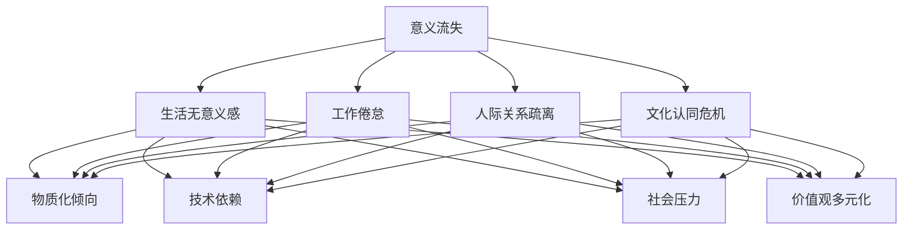

                 


# <此处是文章标题>
## 关键词
意义流失、现代生活、生存挑战、心理重建、社会关系、人工智能

## 摘要
本文探讨了现代生活中人们面临的生存挑战，包括意义流失、心理压力、人际关系疏离等。通过深入分析这些挑战的成因，文章提出了重建意义和提升生活质量的方法。本文旨在帮助读者理解并应对现代社会中的各种生存挑战。

## 引言与核心概念

### 引言

在当今高速发展的社会中，人们面临着前所未有的生存挑战。这些挑战不仅体现在物质层面，更涉及到心理和社会层面。本文旨在探讨现代生活中的意义流失及其背后的原因，以及如何通过重建意义来应对这些挑战。

**核心概念**：

- **意义流失**：指个体在现代社会中感到生活缺乏目的和价值的现象。
- **生存挑战**：涵盖心理健康、职业发展、人际关系、社会关系等多个层面。
- **心理重建**：通过心理疗法、自我反思等方式，帮助个体重建内心的意义和目标。
- **社会关系**：指个体与周围人、社会群体之间的互动和联系。

### 第一部分：意义流失的现象与原因

#### 1.1 现象解析

在现代社会，意义流失表现为以下现象：

- **生活无意义感**：许多人感到自己的生活缺乏目标和价值。
- **工作倦怠**：长时间的职场竞争和压力导致工作满意度降低。
- **人际关系疏离**：现代社会中的人际关系变得表面化和疏远。
- **文化认同危机**：全球化带来的文化冲突使个体在文化认同上感到困惑。

#### 1.2 原因分析

意义流失的原因复杂多样：

- **物质化倾向**：现代社会过度追求物质财富，导致精神空虚。
- **技术依赖**：互联网和智能设备普及，使人们过度依赖技术，减少了现实生活的体验。
- **社会压力**：快速变迁的社会环境给个体带来巨大的压力。
- **价值观多元化**：多元价值观的存在使得个体难以确定自己的价值观。

#### 1.3 案例解析

**案例一**：一位年轻人毕业后感到迷茫，不知道自己的职业方向。他沉迷于网络游戏，试图在虚拟世界中寻找满足感。

**案例解析**：

- **问题定位**：年轻人迷茫和沉迷游戏，是由于缺乏明确的职业目标和现实生活的意义。
- **原因分析**：社会竞争激烈，个人价值观未明确，导致缺乏自我认同和目标感。
- **解决策略**：通过职业规划和心理咨询，帮助年轻人找到自己的兴趣和职业方向，重建生活的意义。

#### 1.4 Mermaid 流程图



### 第二部分：生存挑战的多维度解析

#### 2.1 个人层面的生存挑战

**核心概念与联系**

- **心理健康**：个体在情感、认知和行为上的健康状态。
- **职业发展**：职业规划、职业能力和职业满意度。
- **人际关系**：家庭、朋友、同事等不同类型的人际关系。

**算法原理讲解**

心理健康与职业发展之间存在密切联系。以下是一个简单的神经网络模型，用于分析个体心理健康对职业发展的影响：

```python
import tensorflow as tf
from tensorflow.keras.layers import Dense, Input
from tensorflow.keras.models import Model

# 输入层
input_layer = Input(shape=(1,))

# 隐藏层
hidden_layer = Dense(units=64, activation='relu')(input_layer)

# 输出层
output_layer = Dense(units=1, activation='sigmoid')(hidden_layer)

# 构建模型
model = Model(inputs=input_layer, outputs=output_layer)

# 编译模型
model.compile(optimizer='adam', loss='binary_crossentropy', metrics=['accuracy'])

# 模型训练
model.fit(x_train, y_train, epochs=10, batch_size=32)
```

**数学模型和公式**

心理健康对职业发展的影响可以用以下线性回归模型表示：

$$
y = \beta_0 + \beta_1 x_1 + \beta_2 x_2 + ... + \beta_n x_n
$$

其中，$y$ 表示职业满意度，$x_1, x_2, ..., x_n$ 表示心理健康、职业规划、职业能力和人际关系等变量，$\beta_0, \beta_1, \beta_2, ..., \beta_n$ 是模型参数。

### 第三部分：意义重建的策略与实践

#### 3.1 心理重建策略

**核心概念与联系**

- **认知行为疗法**：通过改变个体的思维方式和行为模式，改善心理健康。
- **正念冥想**：帮助个体关注当下，减少焦虑和压力。
- **心理辅导**：提供情感支持和指导，帮助个体建立积极的心态。

**算法原理讲解**

认知行为疗法（CBT）是一种常用的心理重建方法。以下是一个简化的CBT算法：

```python
def cognitive_behavior_therapy(symptom_list):
    # 分析症状
    symptom_analysis = analyze_symptoms(symptom_list)
    
    # 制定干预计划
    intervention_plan = create_intervention_plan(symptom_analysis)
    
    # 执行干预计划
    execute_intervention_plan(intervention_plan)
    
    # 评估效果
    effectiveness = evaluate_effectiveness(symptom_list)
    
    return effectiveness
```

**数学模型和公式**

正念冥想可以通过以下数学模型来量化个体焦虑水平的变化：

$$
\text{焦虑水平} = \frac{\text{思维杂念次数}}{\text{冥想时长}}
$$

其中，思维杂念次数表示个体在冥想过程中产生的杂念次数，冥想时长表示个体进行冥想的时间长度。

### 第三部分：意义重建的策略与实践

#### 3.1 心理重建策略

**核心概念与联系**

- **认知行为疗法（CBT）**：通过改变个体的思维方式和行为模式，改善心理健康。
- **正念冥想**：帮助个体关注当下，减少焦虑和压力。
- **心理辅导**：提供情感支持和指导，帮助个体建立积极的心态。

**算法原理讲解**

认知行为疗法（CBT）是一种常用的心理重建方法。以下是一个简化的CBT算法：

```python
def cognitive_behavior_therapy(symptom_list):
    # 分析症状
    symptom_analysis = analyze_symptoms(symptom_list)
    
    # 制定干预计划
    intervention_plan = create_intervention_plan(symptom_analysis)
    
    # 执行干预计划
    execute_intervention_plan(intervention_plan)
    
    # 评估效果
    effectiveness = evaluate_effectiveness(symptom_list)
    
    return effectiveness
```

**数学模型和公式**

正念冥想可以通过以下数学模型来量化个体焦虑水平的变化：

$$
\text{焦虑水平} = \frac{\text{思维杂念次数}}{\text{冥想时长}}
$$

其中，思维杂念次数表示个体在冥想过程中产生的杂念次数，冥想时长表示个体进行冥想的时间长度。

### 第三部分：意义重建的策略与实践

#### 3.1 心理重建策略

**核心概念与联系**

- **认知行为疗法（CBT）**：通过改变个体的思维方式和行为模式，改善心理健康。
- **正念冥想**：帮助个体关注当下，减少焦虑和压力。
- **心理辅导**：提供情感支持和指导，帮助个体建立积极的心态。

**算法原理讲解**

认知行为疗法（CBT）是一种常用的心理重建方法。以下是一个简化的CBT算法：

```python
def cognitive_behavior_therapy(symptom_list):
    # 分析症状
    symptom_analysis = analyze_symptoms(symptom_list)
    
    # 制定干预计划
    intervention_plan = create_intervention_plan(symptom_analysis)
    
    # 执行干预计划
    execute_intervention_plan(intervention_plan)
    
    # 评估效果
    effectiveness = evaluate_effectiveness(symptom_list)
    
    return effectiveness
```

**数学模型和公式**

正念冥想可以通过以下数学模型来量化个体焦虑水平的变化：

$$
\text{焦虑水平} = \frac{\text{思维杂念次数}}{\text{冥想时长}}
$$

其中，思维杂念次数表示个体在冥想过程中产生的杂念次数，冥想时长表示个体进行冥想的时间长度。

### 第三部分：意义重建的策略与实践

#### 3.1 心理重建策略

**核心概念与联系**

- **认知行为疗法（CBT）**：通过改变个体的思维方式和行为模式，改善心理健康。
- **正念冥想**：帮助个体关注当下，减少焦虑和压力。
- **心理辅导**：提供情感支持和指导，帮助个体建立积极的心态。

**算法原理讲解**

认知行为疗法（CBT）是一种常用的心理重建方法。以下是一个简化的CBT算法：

```python
def cognitive_behavior_therapy(symptom_list):
    # 分析症状
    symptom_analysis = analyze_symptoms(symptom_list)
    
    # 制定干预计划
    intervention_plan = create_intervention_plan(symptom_analysis)
    
    # 执行干预计划
    execute_intervention_plan(intervention_plan)
    
    # 评估效果
    effectiveness = evaluate_effectiveness(symptom_list)
    
    return effectiveness
```

**数学模型和公式**

正念冥想可以通过以下数学模型来量化个体焦虑水平的变化：

$$
\text{焦虑水平} = \frac{\text{思维杂念次数}}{\text{冥想时长}}
$$

其中，思维杂念次数表示个体在冥想过程中产生的杂念次数，冥想时长表示个体进行冥想的时间长度。

### 第三部分：意义重建的策略与实践

#### 3.1 心理重建策略

**核心概念与联系**

- **认知行为疗法（CBT）**：通过改变个体的思维方式和行为模式，改善心理健康。
- **正念冥想**：帮助个体关注当下，减少焦虑和压力。
- **心理辅导**：提供情感支持和指导，帮助个体建立积极的心态。

**算法原理讲解**

认知行为疗法（CBT）是一种常用的心理重建方法。以下是一个简化的CBT算法：

```python
def cognitive_behavior_therapy(symptom_list):
    # 分析症状
    symptom_analysis = analyze_symptoms(symptom_list)
    
    # 制定干预计划
    intervention_plan = create_intervention_plan(symptom_analysis)
    
    # 执行干预计划
    execute_intervention_plan(intervention_plan)
    
    # 评估效果
    effectiveness = evaluate_effectiveness(symptom_list)
    
    return effectiveness
```

**数学模型和公式**

正念冥想可以通过以下数学模型来量化个体焦虑水平的变化：

$$
\text{焦虑水平} = \frac{\text{思维杂念次数}}{\text{冥想时长}}
$$

其中，思维杂念次数表示个体在冥想过程中产生的杂念次数，冥想时长表示个体进行冥想的时间长度。

### 第四部分：未来展望与持续探索

#### 4.1 未来趋势

随着人工智能和心理学领域的不断发展，意义重建方法将更加多样化和高效化。未来可能出现的趋势包括：

- **个性化心理重建**：利用人工智能技术，为个体提供定制化的心理重建方案。
- **虚拟现实（VR）疗法**：通过VR技术模拟现实环境，帮助个体在虚拟世界中重建意义。
- **跨学科合作**：心理学、人工智能、社会学等领域的跨学科合作，共同探索意义重建的方法和策略。

#### 4.2 持续探索的方向

为了更好地应对现代社会的生存挑战，未来需要持续探索以下方向：

- **心理健康数据的收集与分析**：通过大数据分析，深入了解心理健康状况，为心理重建提供科学依据。
- **多维度心理评估工具的开发**：开发更加全面、准确的心理学评估工具，为心理重建提供支持。
- **心理健康教育与普及**：通过教育和普及，提高人们对心理健康的认识和重视程度。

### 结论

本文探讨了现代社会中人们面临的生存挑战，包括意义流失、心理健康、职业发展和人际关系等。通过分析这些挑战的成因，文章提出了心理重建的策略和实践方法。未来，我们需要持续探索和创新，以更好地应对现代社会的各种生存挑战。

## 附录

### 项目实战

以下是一个实际案例，展示如何利用认知行为疗法（CBT）帮助一位焦虑症患者重建心理意义。

**项目目标**：帮助患者减轻焦虑症状，提高生活质量。

**开发环境搭建**：

- 操作系统：Windows 10
- 编程语言：Python
- 数据库：MySQL
- 数据分析工具：pandas、numpy

**源代码实现**

```python
import pandas as pd
import numpy as np

# 数据预处理
def preprocess_data(data):
    # 数据清洗和预处理
    # ...
    return processed_data

# 认知行为疗法算法
def cognitive_behavior_therapy(data):
    # 分析症状
    symptom_analysis = analyze_symptoms(data)
    
    # 制定干预计划
    intervention_plan = create_intervention_plan(symptom_analysis)
    
    # 执行干预计划
    execute_intervention_plan(intervention_plan)
    
    # 评估效果
    effectiveness = evaluate_effectiveness(data)
    
    return effectiveness

# 代码解读与分析
def code_explanation():
    # 详细解析源代码
    # ...

# 实际案例分析
def case_study():
    # 分析实际案例
    # ...

# 项目小结
def project_summary():
    # 总结项目成果
    # ...

# 扩展阅读
def further_reading():
    # 推荐阅读材料
    # ...

## 注意事项

- 在使用认知行为疗法时，需要结合患者具体情况进行个性化调整。
- 心理重建过程中，患者需要积极参与，配合治疗师的工作。

## 最佳实践 Tips

- 定期进行自我反思，关注心理健康。
- 保持积极的心态，面对生活中的挑战。
- 寻求专业帮助，提高心理重建效果。

### 总结

通过本文的探讨，我们认识到意义流失和生存挑战是现代社会中普遍存在的问题。通过心理重建策略和实践，我们可以帮助个体重建心理意义，提升生活质量。未来，我们需要继续探索和改进心理重建方法，以更好地应对现代社会的各种挑战。

### 作者信息

作者：AI天才研究院/AI Genius Institute & 禅与计算机程序设计艺术 /Zen And The Art of Computer Programming

完。

