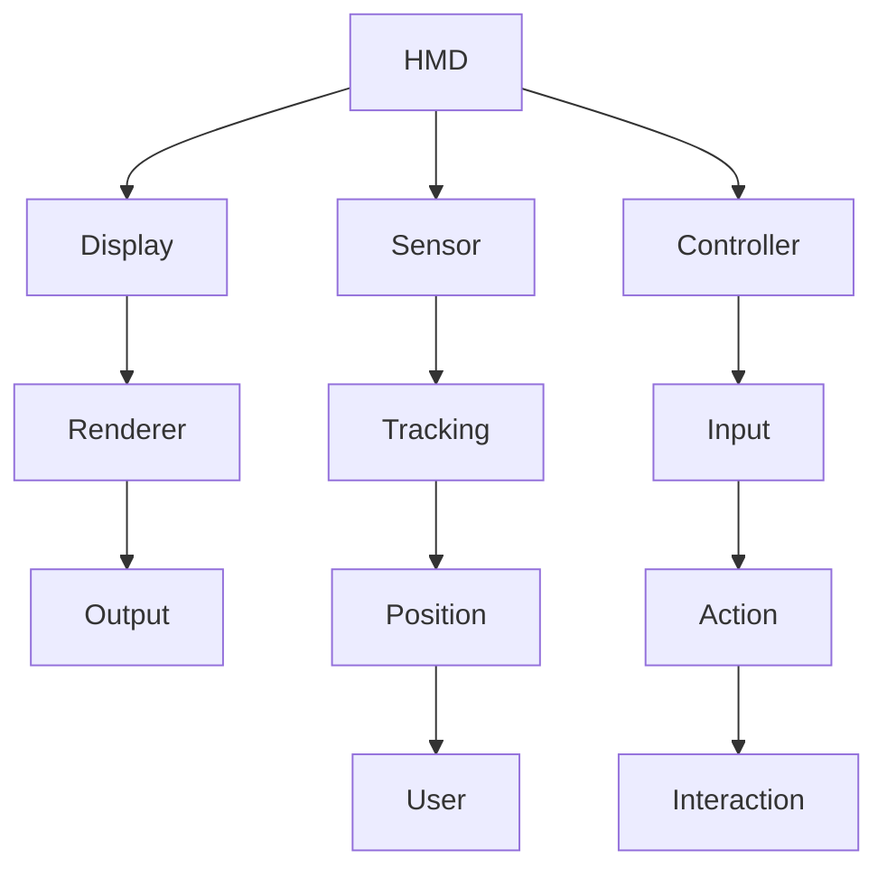
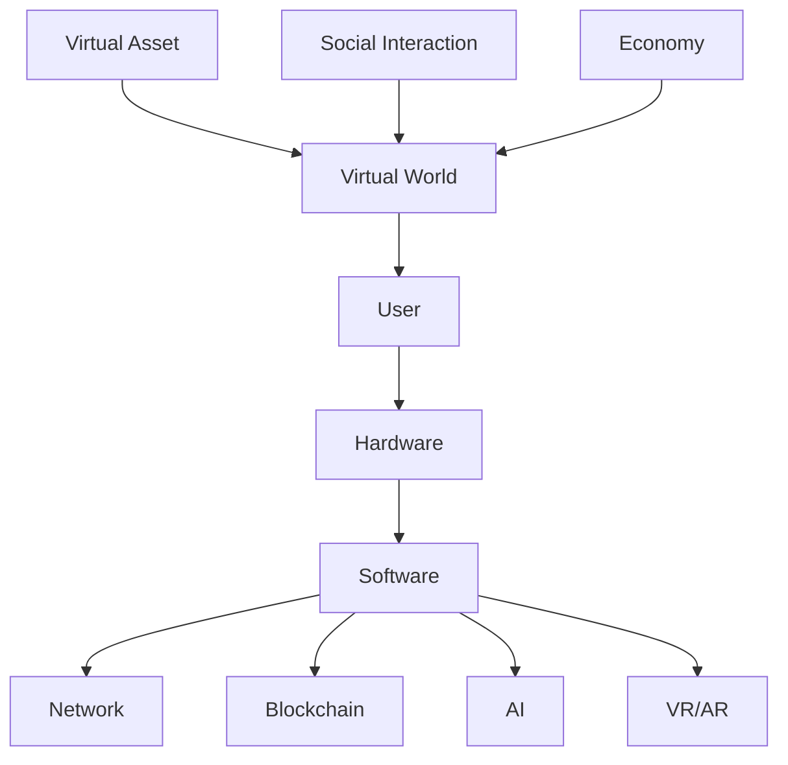
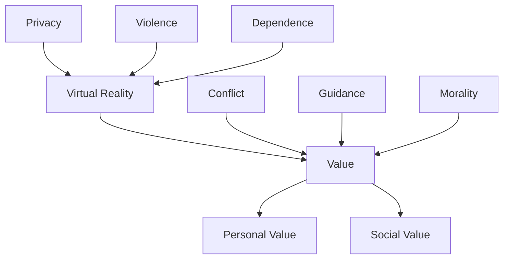
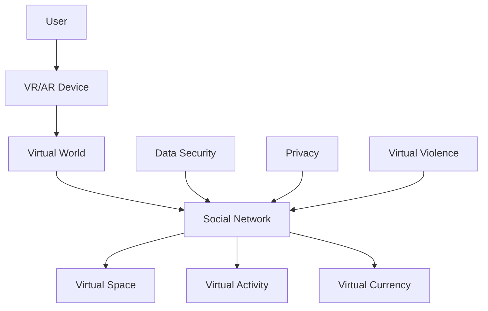
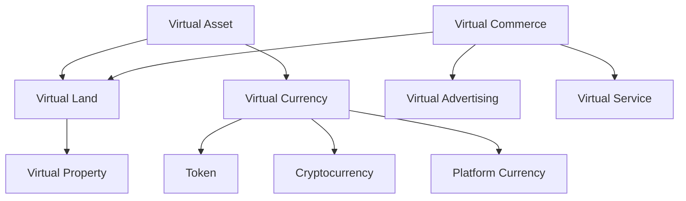
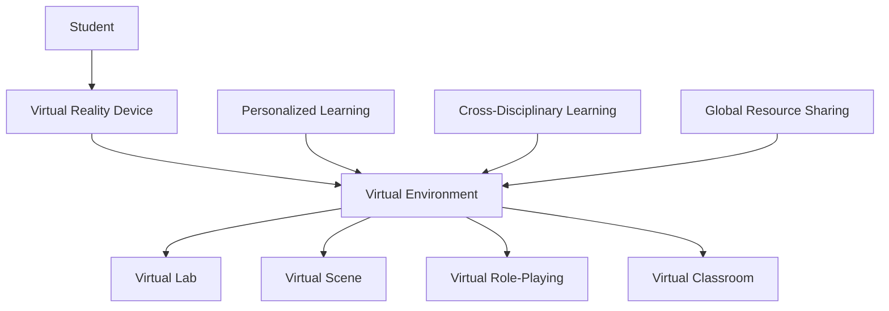

                 

# 《意义的虚拟现实体验：在元宇宙中探索价值观》

> 关键词：虚拟现实、元宇宙、价值观、技术基础、社交互动、商业模式、教育、未来趋势

> 摘要：本文从虚拟现实技术的发展背景出发，探讨了元宇宙的概念与架构，分析了虚拟现实与价值观的关系，以及元宇宙中的社交互动、经济和教育的现状与未来趋势。通过对实际案例的剖析，提出了元宇宙面临的挑战与机遇，并展望了其未来发展。

## 第1章 引言

### 1.1 虚拟现实与元宇宙的兴起

虚拟现实（Virtual Reality，VR）技术自20世纪90年代兴起以来，经历了多年的发展。随着计算能力、显示技术和网络技术的进步，VR技术逐渐从实验室走向了大众市场。近年来，元宇宙（Metaverse）概念的提出，更是将虚拟现实技术推向了新的高度。元宇宙被描述为一个虚拟的三维空间，用户可以在其中以数字化形式存在，进行各种社交、娱乐、工作和学习等活动。

元宇宙的兴起离不开虚拟现实技术的支持。虚拟现实技术为元宇宙提供了一个沉浸式的体验平台，使得用户可以更加真实地感受到虚拟世界中的环境和交互。同时，随着5G、人工智能和区块链等新兴技术的发展，元宇宙的构建变得更加可行和普及。

### 1.2 研究目的与意义

本文旨在探讨虚拟现实体验在元宇宙中如何影响和探索价值观。随着虚拟现实技术的发展，元宇宙已经成为一个重要的研究热点。在这个虚拟世界中，用户不仅需要技术和硬件的支持，还需要关注其价值观的构建和引导。

研究虚拟现实体验在元宇宙中的价值观探索，不仅有助于我们更好地理解虚拟现实技术的应用价值，还可以为我们提供关于价值观构建和引导的启示。通过本文的研究，我们希望能够为元宇宙的发展提供一些有益的思考和建议。

### 1.3 本书结构安排

本文将分为八个章节进行阐述。第1章是引言，介绍了虚拟现实与元宇宙的兴起和研究目的。第2章将详细讨论虚拟现实技术的基础。第3章介绍元宇宙的概念与架构。第4章探讨虚拟现实与价值观的关系。第5章分析元宇宙中的社交互动。第6章讨论元宇宙经济与商业模式。第7章探讨元宇宙在教育领域的应用。第8章总结元宇宙的未来挑战与前景。最后，附录A提供了几个元宇宙项目案例的详细分析。

## 第2章 虚拟现实技术基础

### 2.1 虚拟现实技术概述

虚拟现实技术是一种通过计算机模拟出的三维环境，使用户可以与之进行互动的体验。虚拟现实技术通常包括三个主要组成部分：硬件设备、软件工具和交互技术。

硬件设备包括头戴显示器（HMD）、手柄控制器、数据手套等，它们负责将用户沉浸于虚拟环境中。软件工具则包括虚拟现实内容创建软件和引擎，如Unity和Unreal Engine，它们用于创建和运行虚拟现实应用。交互技术则包括语音识别、手势识别和体感识别等，它们使得用户能够更加自然地与虚拟环境进行交互。

### 2.2 虚拟现实硬件设备

虚拟现实硬件设备的发展是虚拟现实技术的重要组成部分。目前，常见的虚拟现实硬件设备包括以下几种：

1. **头戴显示器（HMD）**：HMD是虚拟现实体验的核心设备，它通过两个显示屏将虚拟环境呈现给用户，同时使用传感器跟踪用户的头部运动，以实现沉浸式体验。

2. **手柄控制器**：手柄控制器通常与HMD配合使用，用于在虚拟环境中进行交互。常见的控制器包括Oculus Touch、HTC Vive控制器和Windows Mixed Reality控制器。

3. **数据手套**：数据手套是一种佩戴在用户手上的设备，它通过传感器捕捉手部的运动和姿态，使得用户可以在虚拟环境中进行精细的操作。

4. **全身追踪器**：全身追踪器可以捕捉用户全身的运动，使得用户可以在虚拟环境中进行更加自由的行动。

### 2.3 虚拟现实软件与开发工具

虚拟现实软件与开发工具是虚拟现实内容创建的关键。目前，市场上存在多种虚拟现实内容创建软件和引擎，如Unity、Unreal Engine、Blender等。

1. **Unity**：Unity是一款功能强大的游戏引擎，它支持2D和3D游戏的开发，同时也广泛应用于虚拟现实应用的开发。

2. **Unreal Engine**：Unreal Engine是由Epic Games开发的一款高端游戏引擎，它以其强大的图形渲染能力和丰富的开发工具而闻名。

3. **Blender**：Blender是一款开源的3D创作套件，它支持3D建模、动画、渲染和虚拟现实内容的创建。

### 2.4 虚拟现实技术发展趋势

虚拟现实技术正在快速发展，未来几年可能会有以下几个趋势：

1. **更高质量的显示技术**：随着显示技术的进步，虚拟现实设备的分辨率和刷新率将进一步提高，为用户带来更加沉浸的体验。

2. **更先进的交互技术**：语音识别、手势识别和体感识别等技术将不断发展，使得用户可以更加自然地与虚拟环境进行交互。

3. **更广泛的硬件设备**：除了头戴显示器，其他虚拟现实硬件设备，如AR眼镜、智能手表等，也将逐渐普及。

4. **更多的应用场景**：虚拟现实技术将在教育、医疗、旅游、娱乐等领域得到更广泛的应用。

### 2.5 虚拟现实技术基础架构图

为了更好地理解虚拟现实技术的基础架构，我们可以使用Mermaid流程图来表示：

在上面的流程图中，HMD（头戴显示器）通过Display（显示）、Sensor（传感器）和Controller（控制器）与Renderer（渲染器）和Output（输出）进行交互。Sensor（传感器）用于捕捉User（用户）的Position（位置），Controller（控制器）用于捕捉User（用户）的Action（动作）。Renderer（渲染器）根据Input（输入）生成Output（输出），为用户呈现虚拟环境。

## 第3章 元宇宙的概念与架构

### 3.1 元宇宙的定义

元宇宙（Metaverse）是一个由多个虚拟世界组成的网络，用户可以在其中以数字化形式存在，进行各种社交、娱乐、工作和学习等活动。元宇宙不是单一的应用或平台，而是一个由多种技术和服务组成的生态系统。在这个生态系统中，用户可以自由地创建、共享和体验虚拟内容。

### 3.2 元宇宙的组成部分

元宇宙由多个组成部分构成，包括硬件设备、软件平台、网络基础设施、虚拟资产和用户等。以下是元宇宙的主要组成部分：

1. **硬件设备**：包括头戴显示器、智能手表、AR眼镜等，它们为用户提供了进入元宇宙的入口。

2. **软件平台**：包括虚拟现实内容创建软件、操作系统、浏览器等，它们为用户提供了在元宇宙中交互和体验的环境。

3. **网络基础设施**：包括云计算、5G网络、区块链等，它们为元宇宙提供了稳定的运行环境和数据传输保障。

4. **虚拟资产**：包括虚拟货币、虚拟土地、虚拟商品等，它们是元宇宙中重要的经济组成部分。

5. **用户**：用户是元宇宙的核心，他们通过硬件设备和软件平台进入元宇宙，进行各种活动。

### 3.3 元宇宙的技术基础

元宇宙的技术基础包括虚拟现实、增强现实、区块链、云计算和人工智能等。以下是这些技术在元宇宙中的应用：

1. **虚拟现实**：虚拟现实技术为用户提供了沉浸式的体验，使得用户可以更加真实地感受到元宇宙中的环境和交互。

2. **增强现实**：增强现实技术将虚拟元素叠加在现实世界中，为用户提供了一种混合现实体验。

3. **区块链**：区块链技术为元宇宙提供了去中心化的数据存储和交易机制，确保了虚拟资产的安全性和透明性。

4. **云计算**：云计算为元宇宙提供了强大的计算和存储能力，使得虚拟世界可以大规模、高效率地运行。

5. **人工智能**：人工智能技术为元宇宙提供了智能化的交互和服务，使得用户可以在元宇宙中获得更加个性化的体验。

### 3.4 元宇宙的发展历程

元宇宙的概念最早可以追溯到1992年，由科幻作家尼尔·斯蒂芬森在小说《雪崩》中提出。自那时以来，随着技术的不断进步，元宇宙的发展经历了多个阶段：

1. **第一阶段（1992-2005年）**：这一阶段主要是虚拟现实技术的初步探索，代表性的项目包括《VRChat》和《Second Life》。

2. **第二阶段（2006-2010年）**：这一阶段是虚拟现实技术的快速发展期，代表性的项目包括《Oculus Rift》和《HTC Vive》。

3. **第三阶段（2011年至今）**：这一阶段是元宇宙概念的提出和快速发展期，代表性的项目包括《Decentraland》和《The Sandbox》。

### 3.5 元宇宙架构图

为了更好地理解元宇宙的架构，我们可以使用Mermaid流程图来表示：

在上面的流程图中，User（用户）通过Hardware（硬件）进入Software（软件）平台，Software（软件）平台连接到Network（网络基础设施）、Blockchain（区块链）、AI（人工智能）和VR/AR（虚拟现实/增强现实）技术。Virtual World（虚拟世界）是元宇宙的核心，包括Virtual Asset（虚拟资产）、Social Interaction（社交互动）和Economy（经济）等组成部分。

## 第4章 虚拟现实与价值观

### 4.1 价值观的概念

价值观是指个体或社会对事物的看法、评价和行为准则。它反映了人们对世界的基本认识和理解，是行为决策的重要依据。价值观可以分为个人价值观和社会价值观，个人价值观是个体对事物的主观评价，而社会价值观则是社会共同认同的价值观。

### 4.2 虚拟现实对价值观的影响

虚拟现实技术为用户提供了一个全新的体验世界，这个世界的构建和用户的行为都会对价值观产生影响。以下是虚拟现实对价值观的几个影响：

1. **个人价值观的变化**：在虚拟世界中，用户可以尝试不同的角色和生活方式，这可能会导致个人价值观的变化。例如，一些用户可能会在虚拟世界中体验到一种新的社交方式，从而改变他们对社交的看法。

2. **社会价值观的传播**：虚拟世界中的社交互动和内容传播，可能会影响社会价值观的传播和变化。例如，一些虚拟现实游戏可能会通过情节和角色塑造来传递特定的价值观。

3. **价值观的模糊性**：在虚拟世界中，现实与虚拟的界限变得模糊，这可能会导致价值观的模糊性。例如，一些用户可能会在虚拟世界中体验一些不符合现实价值观的行为，从而对价值观产生困惑。

### 4.3 元宇宙中的价值观挑战与机遇

元宇宙的发展为价值观的构建和传播带来了新的挑战和机遇：

1. **挑战**：

   - **价值观的冲突**：在元宇宙中，不同背景和文化的用户可能会带来不同的价值观，这可能会导致价值观的冲突。
   - **价值观的引导**：元宇宙中的虚拟世界可能会传递错误的价值观，这需要开发者和社会进行引导和纠正。
   - **现实与虚拟的混淆**：虚拟现实技术使得现实与虚拟的界限变得模糊，这可能会导致价值观的混淆。

2. **机遇**：

   - **价值观的多样性和包容性**：元宇宙为用户提供了多样化的体验和价值观，这有助于促进价值观的多样性和包容性。
   - **价值观的传播和影响**：元宇宙中的社交互动和内容传播，可以为价值观的传播和影响提供新的渠道和手段。

### 4.4 虚拟现实与道德伦理问题

虚拟现实技术的发展也带来了道德伦理问题，例如：

1. **隐私问题**：虚拟世界中的数据收集和处理可能会侵犯用户的隐私。
2. **虚拟暴力**：虚拟世界中的暴力行为可能会对用户的心理和道德产生负面影响。
3. **虚拟依赖**：用户可能会对虚拟世界产生依赖，从而影响现实生活中的价值观和行为。

### 4.5 虚拟现实与价值观关系架构图

为了更好地理解虚拟现实与价值观之间的关系，我们可以使用Mermaid流程图来表示：

在上面的流程图中，Virtual Reality（虚拟现实）通过Value（价值观）影响Personal Value（个人价值观）和Social Value（社会价值观），同时可能会引发Conflict（冲突）、Guidance（引导）和Morality（道德伦理）等问题。

### 4.6 虚拟现实与价值观案例分析

以下是一些虚拟现实与价值观的案例分析：

1. **《虚拟现实游戏《半衰期：爱莉克斯》**：这款游戏通过讲述主角爱莉克斯的故事，传达了关于家庭、责任和勇气等价值观。

2. **《虚拟现实社交平台《VRChat》**：这个平台允许用户创建和共享虚拟空间，用户的行为和互动可能影响他们的价值观。

3. **《虚拟现实电影《黑镜：珍贵回忆》**：这部电影通过虚拟现实技术，探讨了记忆、身份和现实等价值观问题。

## 第5章 元宇宙中的社交互动

### 5.1 元宇宙社交互动的特点

元宇宙中的社交互动具有以下几个特点：

1. **沉浸式体验**：元宇宙为用户提供了沉浸式的社交环境，用户可以感受到虚拟世界中的物理空间、温度和声音等。

2. **多样性和包容性**：元宇宙中的社交互动不受现实世界的限制，用户可以尝试不同的角色和身份，这有助于促进社交的多样性和包容性。

3. **互动性和参与性**：元宇宙中的社交互动更加互动和参与性，用户可以通过虚拟现实设备进行语音、手势和体感交互。

4. **虚拟社交网络**：元宇宙中的社交网络不仅仅局限于虚拟空间，还扩展到了现实世界，用户可以在虚拟世界和现实世界之间自由切换。

### 5.2 虚拟社交网络

虚拟社交网络是元宇宙中重要的组成部分，它为用户提供了在线交流和互动的平台。以下是虚拟社交网络的一些特点：

1. **虚拟身份**：用户在虚拟社交网络中可以使用虚拟身份，这使得用户可以自由地表达自己的个性和想法。

2. **虚拟空间**：虚拟社交网络提供了各种虚拟空间，如房间、花园、城市等，用户可以在这些虚拟空间中交流和互动。

3. **虚拟活动**：虚拟社交网络中经常举办各种虚拟活动，如虚拟聚会、虚拟音乐会、虚拟比赛等，这些活动增加了用户的互动和参与感。

4. **虚拟货币**：虚拟社交网络中通常使用虚拟货币作为交易和支付手段，这为虚拟社交互动提供了经济支持。

### 5.3 元宇宙社交互动的优势与挑战

元宇宙社交互动的优势包括：

1. **沉浸式体验**：虚拟现实技术为用户提供了沉浸式的社交体验，用户可以感受到虚拟世界中的真实感。

2. **多样性和包容性**：元宇宙中的社交互动不受现实世界的限制，用户可以尝试不同的角色和身份，这有助于促进社交的多样性和包容性。

3. **互动性和参与性**：元宇宙中的社交互动更加互动和参与性，用户可以通过虚拟现实设备进行语音、手势和体感交互。

元宇宙社交互动的挑战包括：

1. **技术挑战**：虚拟现实技术的成熟度和普及程度尚需提高，这可能会影响用户的体验和参与度。

2. **安全性和隐私问题**：虚拟社交网络中的数据和用户隐私保护问题是一个重要挑战。

3. **虚拟暴力**：元宇宙中的虚拟暴力行为可能会对用户的心理和道德产生负面影响。

### 5.4 虚拟社交的未来发展

虚拟社交的未来发展可能会呈现以下几个趋势：

1. **更高质量的沉浸式体验**：随着虚拟现实技术的进步，用户可以享受到更高质量的沉浸式社交体验。

2. **更丰富的社交内容和活动**：虚拟社交网络将提供更多样化的社交内容和活动，满足用户的多元化需求。

3. **更安全的隐私保护**：虚拟社交网络将加强数据安全和用户隐私保护，提高用户的信任和参与度。

4. **虚拟与现实的融合**：虚拟社交网络将更加紧密地与现实世界融合，为用户提供更加无缝的社交体验。

### 5.5 虚拟社交互动架构图

为了更好地理解虚拟社交互动的架构，我们可以使用Mermaid流程图来表示：

在上面的流程图中，User（用户）通过VR/AR Device（虚拟现实/增强现实设备）进入Virtual World（虚拟世界），在Social Network（虚拟社交网络）中进行交流，Virtual Space（虚拟空间）、Virtual Activity（虚拟活动）和Virtual Currency（虚拟货币）是虚拟社交网络的重要组成部分，Data Security（数据安全）、Privacy（隐私）和Virtual Violence（虚拟暴力）是元宇宙社交互动面临的挑战。

## 第6章 元宇宙经济与商业模式

### 6.1 元宇宙经济的概念

元宇宙经济是指在元宇宙中进行的各种经济活动，包括商品交易、货币交换、虚拟资产的创造和分配等。元宇宙经济与传统的现实世界经济有所不同，它更加虚拟和数字化。

### 6.2 元宇宙中的商业模式

元宇宙中的商业模式多种多样，以下是一些常见的商业模式：

1. **虚拟商品销售**：用户可以在元宇宙中购买各种虚拟商品，如虚拟服饰、虚拟家居等。

2. **虚拟土地开发**：用户可以在元宇宙中购买和开发虚拟土地，从而进行房地产交易。

3. **虚拟资产交易**：用户可以在元宇宙中交易各种虚拟资产，如虚拟货币、虚拟艺术品等。

4. **虚拟广告**：元宇宙中的广告可以以更加沉浸和互动的形式呈现，从而提高广告效果。

5. **虚拟服务**：用户可以在元宇宙中享受各种虚拟服务，如虚拟医疗、虚拟教育等。

### 6.3 虚拟资产与虚拟货币

虚拟资产是元宇宙中重要的经济组成部分，包括虚拟土地、虚拟商品和虚拟货币等。虚拟货币是元宇宙中的交易媒介，用户可以使用虚拟货币进行商品购买、土地交易和其他经济活动。

虚拟货币的类型包括：

1. **代币**：代币是元宇宙中的一种数字货币，用于奖励用户或支付交易费用。

2. **加密货币**：加密货币是基于区块链技术的一种数字货币，如比特币、以太坊等。

3. **平台币**：平台币是特定平台发行的数字货币，用于在平台内进行交易和支付。

### 6.4 元宇宙经济的未来趋势

元宇宙经济的未来趋势可能包括：

1. **虚拟资产的多样化和普及化**：随着虚拟现实技术的发展，虚拟资产的种类将更加多样化，并且更加普及。

2. **虚拟货币的规范化**：虚拟货币的规范化将是元宇宙经济发展的重要趋势，以确保虚拟货币的稳定性和安全性。

3. **元宇宙经济的全球化**：随着元宇宙的普及，元宇宙经济将逐渐走向全球化，为全球用户带来新的经济机会。

4. **虚拟与现实的融合**：元宇宙经济将更加紧密地与现实世界融合，为用户提供更加无缝的经济体验。

### 6.5 元宇宙经济架构图

为了更好地理解元宇宙经济的架构，我们可以使用Mermaid流程图来表示：

在上面的流程图中，Virtual Asset（虚拟资产）包括Virtual Land（虚拟土地）和Virtual Property（虚拟商品），Virtual Currency（虚拟货币）包括Token（代币）、Cryptocurrency（加密货币）和Platform Currency（平台币），Virtual Commerce（虚拟商品交易）、Virtual Advertising（虚拟广告）和Virtual Service（虚拟服务）是元宇宙经济的重要组成部分。

## 第7章 元宇宙教育与培训

### 7.1 元宇宙教育的特点

元宇宙教育是指利用虚拟现实技术为教育提供沉浸式、互动性和个性化的学习体验。元宇宙教育的特点包括：

1. **沉浸式学习**：元宇宙教育通过虚拟现实技术，将学生沉浸在一个虚拟的学习环境中，使得学习过程更加生动和有趣。

2. **互动性学习**：元宇宙教育提供了丰富的互动性学习工具，如虚拟实验、虚拟角色扮演和虚拟讨论等，使得学生可以更加积极地参与学习过程。

3. **个性化学习**：元宇宙教育可以根据学生的学习习惯、兴趣和能力，提供个性化的学习资源和课程，使得每个学生都可以获得适合自己的学习体验。

### 7.2 元宇宙教育的发展趋势

元宇宙教育的发展趋势可能包括：

1. **虚拟实验室**：随着虚拟现实技术的进步，越来越多的虚拟实验室将应用于教育领域，为学生提供真实的实验体验。

2. **虚拟角色扮演**：虚拟角色扮演教学将帮助学生更好地理解历史事件、文化差异和社会问题。

3. **虚拟课堂**：元宇宙教育将使虚拟课堂成为现实课堂的有力补充，为学生提供更多的学习资源和机会。

4. **虚拟导师**：虚拟导师将为学生提供个性化的辅导和指导，帮助他们更好地理解和掌握知识。

### 7.3 虚拟现实在教育培训中的应用

虚拟现实技术在教育培训中的应用包括：

1. **虚拟实验室**：虚拟实验室可以模拟各种实验场景，使学生能够在虚拟环境中进行实验，从而提高实验的安全性和效率。

2. **虚拟场景教学**：虚拟场景教学可以模拟各种真实场景，如医院、工厂和商场等，使学生能够更好地理解所学知识。

3. **虚拟角色扮演**：虚拟角色扮演教学可以模拟各种社会情境，使学生能够更好地理解人际关系和社会规则。

4. **虚拟课堂**：虚拟课堂可以为学生提供更多的学习资源和机会，如实时直播、录播视频和互动讨论等。

### 7.4 元宇宙教育的挑战与机遇

元宇宙教育面临的挑战包括：

1. **技术成熟度**：虚拟现实技术还需要进一步成熟，以提高教育的质量和用户体验。

2. **成本问题**：虚拟现实设备的成本较高，可能会限制元宇宙教育的普及。

3. **安全性和隐私问题**：虚拟现实技术可能涉及学生的隐私和数据安全，这需要采取有效的保护措施。

元宇宙教育面临的机遇包括：

1. **个性化教育**：元宇宙教育可以提供个性化的学习体验，满足学生的个性化需求。

2. **跨学科学习**：元宇宙教育可以打破学科界限，实现跨学科学习，提高学生的综合素质。

3. **全球教育资源共享**：元宇宙教育可以使全球教育资源共享成为可能，为偏远地区和学生提供优质的教育资源。

### 7.5 元宇宙教育架构图

为了更好地理解元宇宙教育的架构，我们可以使用Mermaid流程图来表示：

在上面的流程图中，Student（学生）通过Virtual Reality Device（虚拟现实设备）进入Virtual Environment（虚拟环境），在Virtual Lab（虚拟实验室）、Virtual Scene（虚拟场景）、Virtual Role-Playing（虚拟角色扮演）和Virtual Classroom（虚拟课堂）中进行学习，Personalized Learning（个性化学习）、Cross-Disciplinary Learning（跨学科学习）和Global Resource Sharing（全球教育资源

