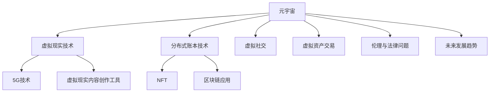

                 

# 意义的虚拟现实：在元宇宙中探索价值观

## 摘要

本文旨在探讨元宇宙中的价值观问题，通过分析元宇宙的概念、技术基础、经济模式、社会文化现象以及伦理与法律问题，深入探讨元宇宙对现实价值观的挑战与机遇。元宇宙，作为一个融合了虚拟现实、区块链、5G等先进技术的虚拟世界，正逐步成为人们生活、工作、娱乐的重要场所。本文将结合具体案例，解析元宇宙对现实世界的影响，并提出塑造健康元宇宙价值观的建议。

## 关键词

- 元宇宙
- 虚拟现实
- 区块链
- 经济模式
- 社会文化
- 伦理与法律

## 第一部分：元宇宙概述

### 第1章：元宇宙的概念与演变

#### 1.1 元宇宙的定义

元宇宙（Metaverse）是指通过互联网连接的虚拟世界，它是一个由多个虚拟空间组成的网络，用户可以通过虚拟角色在其中进行交互、工作、娱乐和社交。元宇宙不仅是虚拟现实技术的应用场景，也是分布式账本技术（如区块链）的创新应用领域。

#### 1.2 元宇宙的起源与发展

元宇宙的概念最早可以追溯到1984年的科幻小说《雪崩》（Snow Crash），其中描述了一个由虚拟现实和增强现实技术构成的全球性网络。随着技术的进步，特别是虚拟现实技术和区块链技术的发展，元宇宙开始从概念走向现实。2018年，Facebook宣布将公司名称更改为Meta Platforms，以表明其对元宇宙的长期愿景。

#### 1.3 元宇宙的核心特征

元宇宙具有以下几个核心特征：

1. **沉浸式体验**：通过虚拟现实（VR）和增强现实（AR）技术，用户可以在虚拟世界中获得强烈的沉浸感。
2. **实时交互**：用户可以在元宇宙中与其他用户实时互动，包括语音、文字和视频等多种方式。
3. **经济系统**：元宇宙内部通常具有自己的经济系统，用户可以通过虚拟货币进行交易和获取收益。
4. **自主性**：用户在元宇宙中拥有自主性，可以创建、分享和交易虚拟资产。

#### 1.4 元宇宙与虚拟现实的关系

虚拟现实是元宇宙的核心组成部分，为用户提供沉浸式的体验。虚拟现实技术通过头戴式显示器、手柄等设备，将用户感官引导至虚拟世界。而元宇宙则为虚拟现实提供了一个更大的平台，使得用户可以在这个平台上进行多种活动，而不仅仅是游戏。

### 第2章：元宇宙的技术基础

#### 2.1 虚拟现实技术

##### 2.1.1 虚拟现实硬件

虚拟现实硬件包括头戴式显示器（HMD）、定位传感器、手柄等。头戴式显示器是用户进入虚拟世界的主要设备，通过高分辨率屏幕提供沉浸式视觉体验。定位传感器用于检测用户在现实世界中的位置和动作，使得虚拟世界中的动作能够与现实世界中的动作同步。

##### 2.1.2 虚拟现实软件

虚拟现实软件包括虚拟现实内容创作工具、引擎和平台。内容创作工具帮助开发者创建虚拟环境、角色和交互逻辑。虚拟现实引擎如Unity和Unreal Engine提供了强大的图形渲染和物理模拟功能，使得虚拟世界更加真实。虚拟现实平台如Facebook的Horizon Workrooms和AltspaceVR等，为用户提供了一个在线互动的虚拟空间。

##### 2.1.3 虚拟现实内容创作工具

虚拟现实内容创作工具如Blender、Unity和Unreal Engine等，为开发者提供了丰富的工具和功能，使得他们可以轻松创建高质量的虚拟现实内容。这些工具通常包括建模、动画、渲染和交互设计等功能。

#### 2.2 分布式账本技术

##### 2.2.1 区块链的基本原理

区块链是一种分布式数据库，通过加密算法和数据验证机制，确保数据的不可篡改性和安全性。区块链通过去中心化的方式，使得数据存储和传输可以在不需要第三方中介的情况下进行。

##### 2.2.2 区块链在元宇宙中的应用

区块链在元宇宙中的应用主要体现在虚拟资产的管理和交易。通过区块链，虚拟地产、虚拟商品和虚拟货币等虚拟资产可以确保其所有权和交易记录的透明性和安全性。

#### 2.3 虚拟现实与区块链的融合

##### 2.3.1 NFT与元宇宙

非同质化代币（NFT）是区块链技术的一种应用，用于表示虚拟世界中的独特资产。NFT使得虚拟资产具有稀缺性和可验证的所有权，这在元宇宙中具有重要意义。

##### 2.3.2 跨平台互操作性与元宇宙

跨平台互操作性是元宇宙的重要特征之一。通过区块链技术，不同的元宇宙平台可以实现虚拟资产和身份的互操作，使得用户可以在不同平台之间无缝切换。

## 第二部分：元宇宙中的经济模式

### 第3章：元宇宙中的经济模式

#### 3.1 代币经济体系

元宇宙中的代币经济体系是其经济模式的核心。代币通常是某种数字货币，如比特币或以太币，用于在元宇宙中购买虚拟商品和服务。代币经济体系的设计需要考虑以下几个方面：

1. **代币的发行与分配**：代币的发行应确保其供应量的稳定，以维持价格的稳定。
2. **代币的流通**：代币应在元宇宙内广泛流通，以便用户能够用它进行交易。
3. **激励机制**：通过奖励机制，鼓励用户参与元宇宙的经济活动，如挖矿、交易和内容创作。

#### 3.2 虚拟资产的交易

元宇宙中的虚拟资产包括虚拟地产、虚拟商品和虚拟货币等。这些资产的交易需要确保其安全性、透明性和便捷性。以下是一些实现虚拟资产交易的关键技术：

1. **智能合约**：智能合约是自动执行合约条款的计算机程序。在元宇宙中，智能合约可用于确保虚拟资产交易的自动执行和不可篡改。
2. **去中心化交易平台**：去中心化交易平台（DEX）允许用户在不通过第三方中介的情况下进行虚拟资产交易，提高了交易的安全性和透明性。
3. **虚拟交易所**：虚拟交易所是元宇宙中的交易市场，用户可以在这些市场上买卖虚拟资产。

#### 3.3 元宇宙中的商业模式

元宇宙中的商业模式与传统商业模式有所不同。以下是一些常见的元宇宙商业模式：

1. **虚拟地产开发与销售**：用户可以在元宇宙中购买虚拟地产，并进行开发、装修和销售。
2. **虚拟商品与服务的交易**：用户可以在元宇宙中购买虚拟商品和服务，如虚拟服装、虚拟食品和虚拟医疗服务。
3. **内容创作与分发**：用户可以在元宇宙中创作虚拟内容，如游戏、音乐和视频，并通过平台进行分发和销售。
4. **广告与推广**：元宇宙为广告商提供了一个新的宣传平台，他们可以通过虚拟广告牌、虚拟活动等方式吸引目标用户。

### 第4章：元宇宙中的社会文化现象

#### 4.1 虚拟社交与人际关系

元宇宙为用户提供了一个全新的社交平台，使得用户可以在虚拟世界中建立和维持人际关系。以下是一些关于虚拟社交和人际关系的现象：

1. **虚拟社交平台的兴起**：随着元宇宙的发展，各种虚拟社交平台如雨后春笋般涌现，为用户提供了一个在线互动的空间。
2. **虚拟社交的影响**：虚拟社交对现实人际关系产生了影响，既带来了便利，也带来了一定的挑战，如虚拟社交成瘾、网络欺凌等。
3. **虚拟社交的未来趋势**：随着技术的进步，虚拟社交将继续发展，可能会对现实社交产生更深远的影响。

#### 4.2 虚拟身份与现实身份的边界

在元宇宙中，用户通常通过虚拟角色（Avatar）进行交互。虚拟身份与现实身份的边界变得模糊，以下是一些相关现象：

1. **虚拟身份的构成与特点**：虚拟身份通常由虚拟形象、虚拟声音、虚拟动作等构成，具有独特性和个性化。
2. **虚拟身份与隐私保护**：虚拟身份的使用需要考虑隐私保护，如何确保用户在虚拟世界中的隐私安全是一个重要问题。
3. **虚拟身份的未来趋势**：随着虚拟现实技术的发展，虚拟身份可能会变得更加真实和多样化。

#### 4.3 虚拟现实对现实世界的影响

元宇宙作为虚拟世界，对现实世界产生了深远的影响。以下是一些相关现象：

1. **虚拟现实对经济的影响**：元宇宙的兴起为虚拟经济提供了新的增长点，如虚拟地产、虚拟商品和虚拟服务等。
2. **虚拟现实对文化的影响**：虚拟现实改变了人们的文化消费方式，如虚拟旅游、虚拟艺术等。
3. **虚拟现实对社会结构的影响**：虚拟现实可能改变社会结构，如远程工作、虚拟社区等。

### 第5章：元宇宙中的伦理与法律问题

#### 5.1 数据隐私与信息安全

元宇宙中涉及大量用户数据和交易数据，因此数据隐私和信息安全至关重要。以下是一些相关问题和解决方案：

1. **数据隐私的重要性**：用户数据包含敏感信息，如身份信息、交易记录等，一旦泄露将导致严重后果。
2. **数据隐私的法律框架**：各国政府正在制定相关法律法规，以保护用户数据隐私。
3. **数据隐私保护技术**：区块链技术、加密算法等可以用于保护用户数据隐私。

#### 5.2 虚拟现实与劳动力市场

虚拟现实技术的发展可能对劳动力市场产生影响。以下是一些相关问题和解决方案：

1. **虚拟现实对就业的影响**：虚拟现实技术可能会改变某些行业的工作方式，如远程工作、虚拟培训等。
2. **虚拟现实与劳动法规**：现有的劳动法规可能需要更新，以适应虚拟现实技术带来的变化。
3. **虚拟现实职业培训**：政府和企业应提供相关培训，帮助劳动力适应虚拟现实技术。

#### 5.3 虚拟现实与法律管辖

元宇宙是一个跨国家的虚拟世界，因此法律管辖问题变得复杂。以下是一些相关问题和解决方案：

1. **跨境法律问题**：元宇宙中的法律纠纷可能涉及不同国家的法律，需要跨国合作解决。
2. **法律监管的挑战与对策**：政府需要建立有效的监管机制，确保元宇宙的健康发展。
3. **国际法律合作**：各国政府应加强合作，共同制定元宇宙相关的国际法律标准。

### 第6章：元宇宙的未来发展趋势

#### 6.1 技术创新与元宇宙

元宇宙的发展离不开技术创新，以下是一些相关技术和趋势：

1. **5G技术**：5G技术提供了更高的网络速度和更低的延迟，为元宇宙中的实时交互提供了支持。
2. **高性能计算**：高性能计算技术使得元宇宙中的计算需求得到满足，为更复杂的虚拟环境和更真实的交互体验提供了可能。
3. **人工智能**：人工智能技术在元宇宙中有着广泛的应用，如智能客服、智能导览等。

#### 6.2 商业模式与元宇宙

元宇宙为商业创新提供了新的机会，以下是一些相关商业模式：

1. **虚拟地产开发与销售**：虚拟地产成为元宇宙中的重要资产，开发者可以通过虚拟地产开发获得收益。
2. **虚拟商品与服务交易**：用户可以在元宇宙中购买和销售虚拟商品和服务，如虚拟服装、虚拟食品等。
3. **内容创作与分发**：元宇宙中的内容创作者可以通过创作和分发虚拟内容获得收益。

#### 6.3 社会文化对元宇宙的塑造

元宇宙的发展不仅受到技术的影响，也受到社会文化的塑造。以下是一些相关现象和趋势：

1. **文化多样性**：元宇宙吸引了来自不同文化背景的用户，为元宇宙带来了丰富的文化元素。
2. **文化交流与冲突**：元宇宙中的文化交流可能会引发文化冲突，需要建立有效的文化融合机制。
3. **虚拟社区建设**：元宇宙中的虚拟社区成为用户交流和文化传播的重要场所。

### 第7章：元宇宙与价值观

#### 7.1 元宇宙中的价值观念

元宇宙作为一个虚拟世界，其价值观念与现实世界有所不同。以下是一些元宇宙中的价值观念：

1. **平等与包容**：元宇宙为用户提供了一个平等和包容的虚拟环境，用户可以在其中自由表达自己的观点。
2. **创新与探索**：元宇宙鼓励用户创新和探索，为用户提供了一个实现自我价值的平台。
3. **共享与协作**：元宇宙中的用户通过共享和协作实现共同目标，促进了社会的发展和进步。

#### 7.2 元宇宙对现实价值观的挑战

元宇宙的发展对现实价值观带来了一定的挑战。以下是一些相关问题和挑战：

1. **虚拟现实对现实生活的冲击**：元宇宙的沉浸式体验可能使用户过度沉迷于虚拟世界，影响现实生活。
2. **价值观的多元与冲突**：元宇宙中的多元价值观可能导致冲突和矛盾，需要建立有效的价值观念引导机制。
3. **虚拟经济的膨胀**：元宇宙中的虚拟经济可能引发通货膨胀，影响现实经济。

#### 7.3 塑造健康的元宇宙价值观

为了确保元宇宙的健康发展，需要采取一系列措施塑造健康的元宇宙价值观。以下是一些建议：

1. **教育**：通过教育引导用户树立正确的价值观，提高用户对元宇宙的认识和理解。
2. **法律**：制定相关法律法规，规范元宇宙中的行为和交易，保护用户的权益。
3. **技术**：运用技术手段，如加密算法和智能合约，确保元宇宙中的交易和行为的安全和透明。

### 第8章：元宇宙实践案例解析

#### 8.1 虚拟现实游戏案例

虚拟现实游戏是元宇宙中的一种重要应用，以下是一些虚拟现实游戏的案例分析：

1. **《堡垒之夜》**：通过其独特的游戏模式和创新的游戏体验，成为虚拟现实游戏的代表之一。
2. **《万智牌》**：将虚拟现实与集换式卡牌游戏相结合，为用户提供了一个全新的游戏体验。

#### 8.2 虚拟房地产案例

虚拟房地产是元宇宙中的另一种重要资产，以下是一些虚拟房地产案例的分析：

1. **虚拟地产市场现状**：虚拟地产市场的规模不断扩大，吸引了大量投资者和开发商。
2. **虚拟地产开发案例分析**：通过分析虚拟地产的开发过程和盈利模式，为其他开发者提供参考。

#### 8.3 跨界合作案例

跨界合作是元宇宙发展的重要趋势，以下是一些跨界合作案例的分析：

1. **元宇宙与电影产业**：通过虚拟现实技术，电影产业可以创造出全新的观影体验。
2. **元宇宙与零售业**：虚拟零售体验为用户提供了更便捷和个性化的购物方式。

## 附录：元宇宙资源指南

### 附录1：元宇宙技术资源

#### 1.1 虚拟现实开发工具

- Unity：一款功能强大的游戏开发引擎，支持虚拟现实应用开发。
- Unreal Engine：一款专业的游戏开发引擎，提供高质量的图形渲染和物理模拟功能。
- Blender：一款开源的三维建模和动画软件，适用于虚拟现实内容创作。

#### 1.2 区块链开发工具

- Truffle：一个以太坊开发框架，提供智能合约开发、测试和部署工具。
- Remix：一个在线智能合约编辑器，支持以太坊和ERC20代币开发。
- MetaMask：一个以太坊钱包，可用于部署和管理智能合约。

#### 1.3 跨平台开发工具

- React VR：一个用于创建虚拟现实应用的React框架。
- WebXR：一个基于WebGL和WebGL2的虚拟现实开发标准。

### 附录2：元宇宙案例研究

#### 2.1 虚拟现实游戏案例

- **《堡垒之夜》**：分析其游戏模式、用户互动和商业模式。
- **《万智牌》**：探讨其虚拟现实与集换式卡牌游戏的融合方式。

#### 2.2 虚拟房地产案例

- **虚拟地产市场现状**：分析虚拟地产市场的规模和趋势。
- **虚拟地产开发案例分析**：通过具体案例，了解虚拟地产的开发过程和盈利模式。

#### 2.3 跨界合作案例

- **元宇宙与电影产业**：分析虚拟现实技术在电影制作和观影中的应用。
- **元宇宙与零售业**：探讨虚拟零售体验的发展趋势和商业模式。

## Mermaid 流程图：元宇宙核心概念关系架构

## 作者信息

作者：AI天才研究院/AI Genius Institute & 禅与计算机程序设计艺术 /Zen And The Art of Computer Programming

**全文完**

本文通过详细的章节结构和丰富的内容，探讨了元宇宙的概念、技术基础、经济模式、社会文化现象、伦理与法律问题以及未来发展趋势。元宇宙作为虚拟世界的重要组成部分，对现实价值观带来了新的挑战和机遇。通过本文的探讨，我们希望能够为读者提供对元宇宙的全面了解，并激发读者对元宇宙的深入思考和探索。**全文完**。**[END]**

