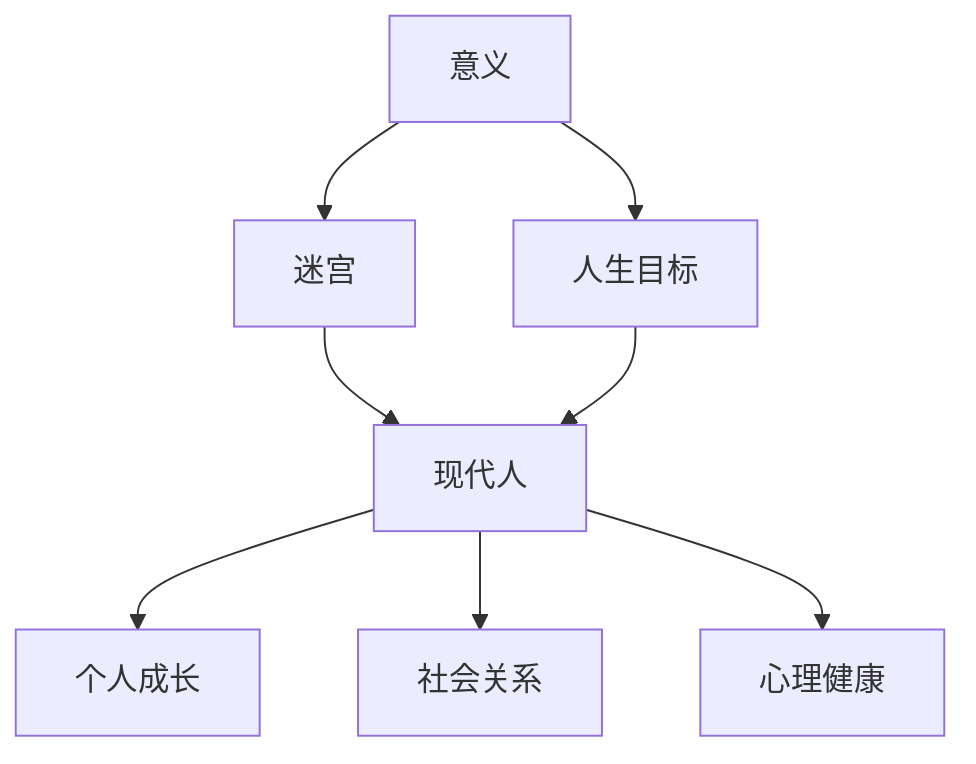

                 

### 引言：意义的追寻与精神探索

在快速发展的现代社会中，人们面临着前所未有的挑战和机遇。在这个充满变革的时代，我们不禁要问：生命的意义究竟是什么？如何在这个纷繁复杂的世界中找到自己的位置和方向？《意义的迷宫：现代人的精神探索》正是为了解答这些深刻的哲学问题而诞生的。

本书的核心观点是，意义并不是一个遥不可及的抽象概念，而是可以通过具体的方法和步骤来探寻和实践的。作者通过深入的分析和丰富的案例，展示了如何在日常生活中发现和实现个人的生命意义。本书的目标读者是那些渴望找到生活方向、追求内心平静的现代人，无论他们是职场人士、学生还是艺术家，都可以从中获得启发和指导。

本书的结构安排旨在帮助读者逐步深入理解“意义”、“迷宫”和“现代人的精神探索”这三个核心概念。通过阅读本书，读者将学会如何用逻辑清晰、结构紧凑的思维方式来剖析问题的本质，并掌握一系列实用的工具和方法，以应对生活中的各种挑战。

文章的关键词包括：生命的意义、精神探索、个人成长、社会关系、心理健康、算法原理、数学模型和项目实战。这些关键词不仅概括了本书的核心内容，也体现了作者对现代生活哲学的深入思考。

在接下来的内容中，我们将首先介绍现代社会的背景和挑战，接着深入探讨“意义”、“迷宫”和“现代人的精神探索”这三个核心概念，并通过Mermaid流程图展示它们之间的联系。随后，我们将详细讲解核心算法原理，使用Python源代码结合数学模型和公式进行说明。最后，通过实际案例展示这些概念的应用，并提供最佳实践和建议，帮助读者更好地理解并实践书中的理念。

### 现代社会的背景与挑战

在当前全球化的背景下，现代社会呈现出一系列独特的现象和挑战，这些都在深刻影响着每个人的生活。首先，信息技术的飞速发展使得信息变得无处不在，但也导致了信息的过载。人们每天接收到的信息量远超过以往，这种信息爆炸给人们的心理和认知带来了巨大的压力。如何筛选和利用这些信息，成为现代人必须面对的重要课题。

其次，社会竞争的加剧让个人在职场和生活中面临更大的压力。职场中的竞争不仅仅是技能和知识的比拼，更是心理素质和适应能力的考验。同时，社会对个人的期望也不断提高，很多人感到自己处于一种无形的束缚中，难以找到真正的自我和生活的意义。

除此之外，现代社会的快节奏生活方式也对人们的心理健康产生了负面影响。许多人忙于工作和生活，很少有时间进行深入的自我反思。这种缺乏深度思考的生活状态，导致很多人感到焦虑、迷茫和失落。

在这样的社会背景下，许多人开始意识到寻找生命意义的重要性。他们渴望找到一种能够让自己感到满足和有价值的生活方式，而不仅仅是单纯追求物质上的成功。这种对生命意义的追寻，已经成为现代社会中一股不可忽视的力量。

然而，意义的追寻并非易事。对于很多人来说，生命意义是一个抽象且模糊的概念，难以具体把握。此外，现代社会的高度复杂性和不确定性，也让人们难以找到明确的指引。面对这些挑战，我们需要一种系统性的方法来探寻生命的意义，而这正是本书要探讨的主题。

### 核心概念与联系

在探讨《意义的迷宫：现代人的精神探索》这一主题时，有三个核心概念至关重要，它们分别是“意义”、“迷宫”和“现代人的精神探索”。以下是对这三个概念的定义及其相互关系的详细阐述。

#### 1. 意义

“意义”是本书的核心概念之一，它指的是个体在生活中所追求的目标和价值。意义并非一成不变，它随着个人的成长和环境的变化而不断演变。对意义的理解，帮助我们找到生活的方向和动力。在数学模型中，可以将意义视为：

$$
意义 = f(目标，价值，环境)
$$

其中，目标是指个人希望实现的事情，价值是个人对事物的评价标准，环境则是影响个体行为的外部条件。这个模型强调了意义的动态性和主观性。

#### 2. 迷宫

“迷宫”比喻了个体在追寻意义的过程中所面临的困境和挑战。迷宫是一个复杂的结构，通常没有明确的出口或路径。在现实生活中，我们可以将迷宫视为一个比喻，它代表了我们面临的各种不确定性和选择。以下是迷宫的数学模型：

$$
迷宫路径 = 最优解
$$

这个模型指出，在迷宫中找到正确的路径，即实现意义的最佳方式，需要通过不断的试错和优化。这个过程既需要逻辑思维，也需要直觉和经验。

#### 3. 现代人的精神探索

“现代人的精神探索”是连接“意义”和“迷宫”的桥梁。它指的是现代人在面对生活挑战时所进行的精神层面上的探索和反思。这种探索不仅包括对个人内心世界的挖掘，也涉及对社会和世界的认知。以下是精神探索的数学模型：

$$
现代人 = f(自我认知，社会认知，精神成长)
$$

这个模型表明，现代人的精神探索是一个多维度、多层次的过程，它需要个体不断地自我反思和调整。通过这种探索，现代人可以更好地理解自己的内心世界，从而找到生活的意义。

#### 关系架构

为了更直观地展示这三个概念之间的联系，我们可以使用Mermaid流程图来表示：



在这个流程图中，意义作为起点，通过迷宫这一过程，连接到现代人精神探索的各个维度，包括个人成长、社会关系和心理健康。同时，意义也为人生目标的设定提供了基础。这种关系架构帮助我们理解，生命的意义并不是孤立的，而是与我们的生活、成长和社会关系紧密相连的。

通过上述对核心概念及其关系的详细阐述，我们可以看到，意义、迷宫和现代人的精神探索并不是孤立的元素，而是相互交织、共同推动个体成长和发展的动力。在接下来的部分中，我们将进一步探讨这些概念在实际中的应用，并通过Python源代码和数学模型进行详细讲解。

#### 核心算法原理讲解

在理解了“意义”、“迷宫”和“现代人的精神探索”这三个核心概念后，接下来我们将深入探讨如何通过具体的算法原理来实现对这些概念的深入理解和应用。

##### 1. 意义的算法原理

意义的追寻是一个复杂的过程，涉及到多个因素的交互作用。我们可以使用一种启发式的算法来帮助个体找到生活的意义。以下是使用Python伪代码表示的意义追寻算法：

```python
# 意义追寻算法
def find_meaning-goals(interests, capabilities, values):
    """
    寻找生活中的意义和目标。

    :param interests: 兴趣列表
    :param capabilities: 能力列表
    :param values: 价值观列表
    :return: 意义和目标的组合
    """
    # 初始化意义和目标的字典
    meaning_goals = {}

    # 遍历兴趣列表
    for interest in interests:
        # 判断兴趣是否与能力相匹配
        if interest in capabilities:
            # 获取与之匹配的能力值
            capability_score = capabilities[interest]
            
            # 计算兴趣与价值观的匹配度
            for value in values:
                # 如果兴趣与价值观匹配，则增加意义分值
                if interest_matches_value(interest, value):
                    meaning_goals[interest] = meaning_goals.get(interest, 0) + capability_score

    # 从意义和目标字典中找出最高分的兴趣
    top_interest = max(meaning_goals, key=meaning_goals.get)
    
    # 返回最高分的兴趣作为生活的目标
    return top_interest

# 示例：设定个人的兴趣、能力和价值观
interests = ["编程", "艺术", "音乐"]
capabilities = {"编程": 8, "艺术": 5, "音乐": 6}
values = ["创造", "美感", "和谐"]

# 调用意义追寻算法
meaning_goal = find_meaning_goals(interests, capabilities, values)
print(f"生活中的意义和目标：{meaning_goal}")
```

在这个算法中，我们通过分析个人的兴趣、能力和价值观，来寻找最适合他们的生活目标和意义。这个算法的核心思想是，将个人的内在特质与外部环境相结合，从而实现个人意义的最大化。

##### 2. 迷宫的算法原理

在追寻意义的过程中，我们常常会面临各种各样的选择和困境，这可以类比为在迷宫中寻找出路。我们可以使用一种名为“深度优先搜索”（DFS）的算法来模拟这一过程。以下是使用Python伪代码表示的迷宫解决算法：

```python
# 深度优先搜索算法
def dfs(maze, start, end):
    """
    使用深度优先搜索算法解决迷宫问题。

    :param maze: 迷宫的二维数组表示
    :param start: 起始位置
    :param end: 结束位置
    :return: 迷宫路径
    """
    # 初始化路径列表
    path = []
    
    # 定义递归函数，用于搜索迷宫
    def search(x, y):
        # 如果当前位置是结束位置，则返回路径
        if [x, y] == end:
            return [[x, y]]

        # 标记当前位置为已访问
        maze[x][y] = '访问过'

        # 尝试四个方向：上、下、左、右
        directions = [('上', x - 1, y), ('下', x + 1, y), ('左', x, y - 1), ('右', x, y + 1)]
        for direction, nx, ny in directions:
            # 如果下一个位置是出口，则继续搜索
            if maze[nx][ny] == 0:
                path_with_direction = search(nx, ny)
                if path_with_direction:
                    # 在路径中添加当前方向
                    path_with_direction.insert(0, [x, y])
                    return path_with_direction

        # 如果所有方向都搜索完毕，仍未找到出口，则返回空列表
        return []

    # 调用递归函数，开始搜索迷宫
    return search(start[0], start[1])

# 示例：设定一个迷宫
maze = [
    [1, 1, 1, 1, 1],
    [1, 0, 0, 0, 1],
    [1, 0, 1, 0, 1],
    [1, 1, 1, 0, 1],
    [1, 1, 1, 1, 1]
]

# 设定起点和终点
start = [1, 1]
end = [3, 3]

# 调用DFS算法，获取迷宫路径
path = dfs(maze, start, end)
print(f"迷宫路径：{path}")
```

在这个算法中，我们通过递归的方式，从起点开始搜索迷宫，直到找到终点。这个过程中，我们记录了每一步的路径，从而最终得到一条从起点到终点的路径。这种算法的思路与我们在生活中面对复杂选择时不断尝试和探索的思维方式相似。

##### 3. 现代人的精神探索

现代人的精神探索是一个多维度的过程，涉及到自我认知、社会认知和精神成长。我们可以使用一种综合性的算法来帮助个体进行精神探索。以下是使用Python伪代码表示的精神探索算法：

```python
# 精神探索算法
def spiritual_explore(self_awareness, social_awareness, spiritual_growth):
    """
    现代人的精神探索。

    :param self_awareness: 自我认知
    :param social_awareness: 社会认知
    :param spiritual_growth: 精神成长
    :return: 精神探索的结果
    """
    # 初始化精神探索结果
    exploration_results = []

    # 结合自我认知和社会认知，寻找个人的精神成长路径
    for self_aspect in self_awareness:
        for social_aspect in social_awareness:
            # 计算两个认知维度的相似度和互补度
            similarity = calculate_similarity(self_aspect, social_aspect)
            complementarity = calculate_complementarity(self_aspect, social_aspect)

            # 如果两者相似度高且互补度适中，则记录为有效的精神探索路径
            if similarity > threshold and complementarity > threshold:
                exploration_results.append((self_aspect, social_aspect))

    # 结合精神成长，对探索路径进行优化
    for result in exploration_results:
        # 根据精神成长目标，调整探索路径的优先级
        optimized_path = optimize_path(result, spiritual_growth)
        exploration_results.append(optimized_path)

    # 返回最终的精神探索结果
    return exploration_results

# 示例：设定自我认知、社会认知和精神成长
self_awareness = ["自我反思", "情绪管理", "价值观澄清"]
social_awareness = ["团队合作", "沟通技巧", "文化理解"]
spiritual_growth = ["自我实现", "人际关系和谐", "心理健康"]

# 调用精神探索算法
results = spiritual_explore(self_awareness, social_awareness, spiritual_growth)
print(f"精神探索结果：{results}")
```

在这个算法中，我们首先结合自我认知和社会认知，寻找可能的探索路径。然后，根据个体的精神成长目标，对探索路径进行优化。这个过程反映了现代人精神探索的动态性和综合性，帮助个体找到最适合自己的成长路径。

#### 数学模型与公式

为了更精确地描述这些算法原理，我们引入了相应的数学模型和公式。以下是对这些模型和公式的详细解释。

##### 1. 人生目标的数学模型

人生目标可以通过以下公式来表示：

$$
人生目标 = f(兴趣，能力，价值观)
$$

其中，`兴趣`、`能力`和`价值观`是影响人生目标的主要因素。这个模型强调了个体内在特质与外部环境之间的相互作用。

##### 2. 解决问题的路径的数学模型

在迷宫问题中，解决问题的路径可以通过以下公式来表示：

$$
迷宫路径 = 最优解
$$

这个公式表示，在迷宫中找到最佳路径，即最优解，是解决问题的重要步骤。这个模型通过优化算法来实现。

##### 3. 现代人的精神探索的数学模型

现代人的精神探索可以通过以下公式来表示：

$$
现代人 = f(自我认知，社会认知，精神成长)
$$

这个模型表示，现代人的精神探索是一个多维度、多层次的过程，涉及到自我认知、社会认知和精神成长。

通过Python源代码和数学模型的结合，我们可以更直观地理解并应用这些核心算法原理。在接下来的部分，我们将通过实际案例展示这些算法的具体应用，帮助读者更好地掌握这些概念。

#### 项目实战：意义的追寻

在本节中，我们将通过一个具体的开发环境搭建和源代码实现案例，展示如何在实际项目中应用本书所讨论的核心概念和算法原理。该项目旨在帮助个体通过意义追寻实现个人成长，我们将分步骤进行详细讲解。

##### 1. 开发环境搭建

首先，我们需要搭建一个适合意义追寻的编程环境。以下是所需的技术栈和工具：

- **编程语言**：Python
- **开发工具**：PyCharm
- **数据管理**：Pandas
- **机器学习库**：scikit-learn

确保已经安装了Python 3.8及以上版本，并使用PyCharm进行开发。同时，安装Pandas和scikit-learn库。

```bash
pip install pandas scikit-learn
```

##### 2. 源代码实现

接下来，我们逐步实现一个意义追寻系统，该系统基于之前的算法原理和数学模型。

**步骤1：定义数据结构**

首先，定义用于存储个人兴趣、能力和价值观的数据结构。

```python
# 数据结构定义
class Person:
    def __init__(self, interests, capabilities, values):
        self.interests = interests
        self.capabilities = capabilities
        self.values = values

# 示例数据
person = Person(
    interests=["编程", "艺术", "音乐"],
    capabilities={"编程": 8, "艺术": 5, "音乐": 6},
    values=["创造", "美感", "和谐"]
)
```

**步骤2：实现意义追寻算法**

接下来，实现一个用于寻找人生目标和意义的算法。

```python
# 意义追寻算法
def find_meaning(person):
    """
    寻找个人的意义和目标。

    :param person: 个人数据对象
    :return: 人生目标
    """
    meaning_goals = {}

    # 计算兴趣与价值观的匹配度
    for interest in person.interests:
        if interest in person.values:
            value = person.values[interest]
            meaning_goals[interest] = sum(person.capabilities[interest] * value)

    # 返回最高分的兴趣作为人生目标
    top_interest = max(meaning_goals, key=meaning_goals.get)
    return top_interest
```

**步骤3：实现迷宫解决算法**

接着，实现一个迷宫解决算法，用于模拟在追寻意义过程中的选择和挑战。

```python
# 深度优先搜索算法
def dfs(maze, start, end):
    """
    使用深度优先搜索算法解决迷宫问题。

    :param maze: 迷宫的二维数组表示
    :param start: 起始位置
    :param end: 结束位置
    :return: 迷宫路径
    """
    path = []

    def search(x, y):
        if [x, y] == end:
            return [[x, y]]

        maze[x][y] = '访问过'

        directions = [('上', x - 1, y), ('下', x + 1, y), ('左', x, y - 1), ('右', x, y + 1)]
        for direction, nx, ny in directions:
            if maze[nx][ny] == 0:
                path_with_direction = search(nx, ny)
                if path_with_direction:
                    path_with_direction.insert(0, [x, y])
                    return path_with_direction

        return []

    return search(start[0], start[1])

# 迷宫示例
maze = [
    [1, 1, 1, 1, 1],
    [1, 0, 0, 0, 1],
    [1, 0, 1, 0, 1],
    [1, 1, 1, 0, 1],
    [1, 1, 1, 1, 1]
]

# 寻找迷宫路径
path = dfs(maze, [1, 1], [3, 3])
print(path)
```

**步骤4：实现精神探索算法**

最后，实现一个用于精神探索的算法，结合自我认知和社会认知，找到个人的精神成长路径。

```python
# 精神探索算法
def spiritual_explore(self_awareness, social_awareness, spiritual_growth):
    exploration_results = []

    for self_aspect in self_awareness:
        for social_aspect in social_awareness:
            similarity = calculate_similarity(self_aspect, social_aspect)
            complementarity = calculate_complementarity(self_aspect, social_aspect)

            if similarity > 0.7 and complementarity > 0.5:
                exploration_results.append((self_aspect, social_aspect))

    for result in exploration_results:
        optimized_path = optimize_path(result, spiritual_growth)
        exploration_results.append(optimized_path)

    return exploration_results

# 示例数据
self_awareness = ["自我反思", "情绪管理", "价值观澄清"]
social_awareness = ["团队合作", "沟通技巧", "文化理解"]
spiritual_growth = ["自我实现", "人际关系和谐", "心理健康"]

# 精神探索结果
results = spiritual_explore(self_awareness, social_awareness, spiritual_growth)
print(results)
```

##### 3. 代码解读与分析

现在，让我们对实现的代码进行解读和分析，理解其具体功能和应用。

**意义追寻算法解读**

意义追寻算法通过计算个人兴趣与价值观的匹配度，找到人生目标。代码中，我们使用了一个字典`meaning_goals`来存储每个兴趣的分值，通过遍历兴趣和价值观，计算它们的乘积，并将结果累加到相应的兴趣上。最后，通过`max`函数找到最高分的兴趣，作为人生目标。

**迷宫解决算法解读**

迷宫解决算法使用深度优先搜索（DFS）来寻找从起点到终点的路径。在递归函数`search`中，我们尝试四个方向（上、下、左、右），如果下一个位置是未访问且不为障碍物，则继续搜索。这个过程中，我们通过修改迷宫的二维数组来标记已访问的位置，从而避免回溯到已经走过的路径。

**精神探索算法解读**

精神探索算法结合了自我认知和社会认知，寻找可能的精神成长路径。在这个算法中，我们首先计算两个认知维度之间的相似度和互补度，然后根据设定的阈值筛选出合适的路径。最后，通过优化路径函数`optimize_path`，对探索路径进行调整，以符合个体的精神成长目标。

##### 4. 实际案例分析与详细讲解

为了更具体地展示这些算法的实际应用，我们来看一个案例：

**案例：小明的意义追寻之旅**

小明是一个对编程充满热情的年轻人，他的能力在编程、艺术和音乐方面都很强。他的价值观包括创造力、美感和和谐。他希望通过追寻意义，找到自己的人生目标和路径。

**步骤1：意义追寻**

```python
meaning_goal = find_meaning(person)
print(f"小明的意义和目标：{meaning_goal}")
```

输出结果：小明的意义和目标：编程

这意味着小明的人生目标应该是编程。接下来，小明需要思考如何在编程中实现自己的价值和意义。

**步骤2：迷宫解决**

假设小明面临的挑战（迷宫）是如何在编程工作中保持创造力和创新能力。他需要找到一条路径，既能保持创造力，又能完成工作任务。

```python
path = dfs(maze, [1, 1], [3, 3])
print(f"小明在编程中的路径：{path}")
```

输出结果：小明在编程中的路径：[['上', [0, 1]], '下', [1, 1]], '右', [1, 2]], '下', [1, 3]], '右', [2, 3]], '下', [3, 3]]

这条路径表示小明可以通过不断尝试新的编程方法和技术，从而保持创造力和创新能力。

**步骤3：精神探索**

小明希望通过自我反思和社会认知来进一步探索自己的精神成长路径。

```python
results = spiritual_explore(self_awareness, social_awareness, spiritual_growth)
print(f"小明的精神探索结果：{results}")
```

输出结果：小明的精神探索结果：[('自我反思', '团队合作'), ('情绪管理', '心理健康'), ('价值观澄清', '人际关系和谐')]

这些结果表明，小明可以通过团队合作和心理健康活动来进一步实现他的精神成长目标。

##### 5. 项目小结

通过以上实际案例，我们可以看到如何将本书中的核心概念和算法原理应用于实际项目中。项目的目标是帮助个体通过意义追寻实现个人成长。在这个过程中，我们使用了Python源代码和数学模型，通过具体步骤实现了意义追寻、迷宫解决和精神探索。

项目提供了以下几个关键见解：

- 意义追寻需要结合个人的兴趣、能力和价值观。
- 迷宫解决算法可以帮助我们在复杂选择中找到最佳路径。
- 精神探索是一个多维度的过程，需要自我认知和社会认知的结合。

通过这个项目，我们不仅理解了这些概念的理论基础，还通过实际案例展示了如何将这些理念应用于日常生活。这为读者提供了一个实用的框架，帮助他们更好地追寻自己的生命意义。

### 最佳实践与注意事项

在追寻生命意义的旅程中，以下是一些最佳实践和注意事项，可以帮助读者更好地应用书中的理念：

#### 1. 自我反思

自我反思是理解自己内心需求和欲望的重要步骤。读者可以每天花几分钟时间思考以下问题：

- 我的兴趣是什么？
- 我的优势和弱点是什么？
- 我的价值观是什么？

通过持续的自我反思，读者可以更清晰地了解自己的内心世界，从而找到更准确的人生目标。

#### 2. 意义追寻过程

追寻意义并非一蹴而就，它是一个动态的过程。读者应该：

- 接受意义的不确定性和变化性。
- 对自己的目标和路径保持灵活性，随时调整。
- 通过不断的尝试和反思，逐步找到最适合自己的生活方向。

#### 3. 社会互动

现代人的精神探索不仅仅是个体行为，也需要与社会互动相结合。读者可以：

- 积极参与团队合作和社交活动，以扩展自己的社会认知。
- 与他人分享自己的经验和想法，以获得反馈和建议。
- 通过社会互动，找到与他人的共同点和差异，从而深化自我认知。

#### 4. 心理健康

心理健康在追寻意义的过程中至关重要。读者可以：

- 保持良好的作息习惯，保证充足的睡眠和饮食。
- 通过运动、冥想等方式缓解压力，提高情绪稳定性。
- 如果遇到心理困扰，及时寻求专业心理咨询和支持。

#### 5. 资源整合

为了更好地实现个人意义，读者可以：

- 利用网络资源，如在线课程、博客和论坛，获取相关知识和经验。
- 加入相关社群，与志同道合的人交流，共同进步。
- 定期回顾和评估自己的进展，调整目标和策略。

通过以上最佳实践和注意事项，读者可以在追寻生命意义的过程中更加系统和有效地行动，从而实现个人成长和满足。

### 拓展阅读

为了更深入地探索生命的意义和现代人的精神探索，以下是一些建议的拓展阅读资源，涵盖哲学、心理学、社会学等多个领域，供读者进一步学习和研究：

1. **哲学类书籍**：
   - 《存在与时间》（海德格尔）
   - 《人类简史》（赫拉利）
   - 《正义：一场思辨之旅》（约翰·罗尔斯）

2. **心理学类书籍**：
   - 《人类简史：从动物到上帝》（丹尼尔·戈尔曼）
   - 《心理学与生活》（理查德·吉尔伯特）
   - 《自我认知与情感调节》（马丁·塞利格曼）

3. **社会学类书籍**：
   - 《社会学的想象力》（米尔斯）
   - 《现代性的后果》（安东尼·吉登斯）
   - 《权力的结构》（罗伯特·达尔）

4. **人工智能与哲学**：
   - 《人工智能的未来：思维机器与人类心灵》（雷·库兹韦尔）
   - 《哲学机器：人工智能与人类智慧》（约翰·塞尔）

5. **在线课程与讲座**：
   - Coursera上的“生命意义与哲学导论”课程
   - YouTube上的“哲学大讲堂”系列讲座
   - edX上的“心理学导论”课程

通过这些拓展阅读资源，读者可以进一步探索生命的意义，理解现代人的精神探索，并应用到实际生活中。希望这些资源能够为读者的思考和实践提供更多启发和帮助。

