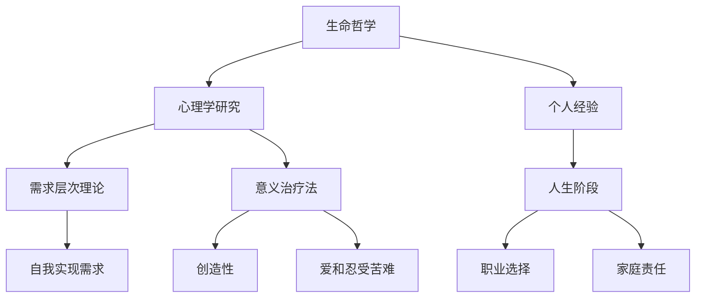

                 

### 《意义的重塑：如何在变革中找到人生方向》引言

#### 1.1 书籍背景与目的

在当今快速发展的社会背景下，变革已成为常态。技术革命、经济动荡、环境问题等多重挑战不断冲击着人们的日常生活和职业发展，使得越来越多的人感到迷茫和困惑。如何在这个充满不确定性的世界中找到人生方向，重塑生活的意义，成为许多人迫切需要解决的问题。

《意义的重塑：如何在变革中找到人生方向》旨在帮助读者应对这些挑战，通过探索和思考，找到自己在变革中的定位，重塑生活的意义。本书将结合哲学、心理学、社会学等多学科知识，引导读者进行自我认知、目标设定和行动规划，帮助他们在变革中找到人生的方向。

#### 1.2 变革时代的挑战

随着科技的飞速发展，我们的生活和工作环境发生了巨大变化。互联网、大数据、人工智能等新兴技术不断涌现，不仅改变了传统行业，也带来了新的职业机会和挑战。然而，这些变革也带来了很多不确定性和风险，如失业、职业转型、隐私问题等。

此外，经济全球化、社会多元化等因素也加剧了变革的复杂性。人们面临着越来越多的选择和机会，但同时也需要面对更多的竞争和不确定性。在这样的背景下，如何找到自己的人生方向，成为许多人迫切需要解决的问题。

#### 1.3 寻求人生方向的渴望

面对变革带来的挑战，许多人开始反思自己的人生意义。他们渴望找到一种能够让自己感到有意义和有价值的生活方式，希望自己的生活不仅仅是简单的生存和消费，而是能够实现自我价值和追求人生的意义。

这种渴望不仅体现在个人层面，也体现在社会层面。越来越多的人开始关注心理健康、个人成长、社会责任等问题，希望通过改变自己的生活方式，实现个人和社会的共同进步。

#### 1.4 重新定义人生意义的必要性

在变革中，重新定义人生意义变得尤为重要。首先，这有助于我们应对变革带来的不确定性和挑战，找到自己的定位和方向。其次，重新定义人生意义可以帮助我们更好地应对生活中的压力和困难，增强心理韧性和适应能力。

此外，重新定义人生意义也有助于提升我们的生活质量和幸福感。当我们明确自己的人生目标和价值追求时，我们更容易找到生活的动力和意义，从而更加积极地面对生活中的各种挑战。

总之，《意义的重塑：如何在变革中找到人生方向》旨在帮助读者重新审视自己的人生，探索和思考如何在变革中找到人生方向，实现自我价值和人生意义。通过本书的引导，读者可以更好地应对变革带来的挑战，找到属于自己的人生道路。

#### 1.5 阅读指南

为了更好地理解本书的内容，我们为读者提供以下阅读指南：

##### 1.5.1 阅读目的

通过阅读本书，读者将：

1. 探索人生意义的本质和重要性。
2. 学习如何在变革中找到自己的人生方向。
3. 获得应对变革挑战的策略和工具。
4. 明确自己的核心价值观和目标设定方法。

##### 1.5.2 阅读方法

1. **逐章阅读**：建议按照目录结构逐章阅读，每个章节都为读者提供了具体的内容和知识点。
2. **思考与反思**：在阅读过程中，读者可以结合自己的实际经历和感受进行思考与反思，加深对知识点的理解和应用。
3. **互动与讨论**：读者可以与其他读者进行互动和讨论，分享自己的观点和经验，互相启发。

##### 1.5.3 知识体系结构

本书分为五个主要部分：

1. **引言**：介绍书籍背景、目的、变革时代的挑战、寻求人生方向的渴望以及重新定义人生意义的必要性。
2. **意义的探索**：探讨人生意义的定义与探讨、变革中的困惑以及寻找人生方向的步骤。
3. **重塑意义的方法与实践**：介绍重新定义核心价值观、职业生涯的转型策略、社交关系的重构、生活方式的调整以及持续学习的动力。
4. **案例研究**：通过实际案例研究，展示如何在职业生涯中实现意义重塑。
5. **结论与反思**：总结与展望、反思与感悟以及鼓励与号召。

通过以上结构和内容，本书旨在帮助读者系统性地探索和重塑人生意义，为他们在变革中找到方向提供实用的指导。

#### 1.6 背景介绍

在快速变化的时代背景下，人们的生活和工作面临着前所未有的挑战。社会变迁、技术进步、经济动荡等因素使得传统的稳定感和安全感逐渐消失，取而代之的是不确定性和焦虑感。这种社会环境不仅影响了人们的心理健康，也直接影响了他们的职业发展和生活满意度。

首先，社会变迁对个体的影响不可忽视。全球化进程加速，使得国际间的联系更加紧密，但也导致了国内就业市场的竞争加剧。传统行业不断被新兴行业所取代，许多职业面临着失业和转型的风险。例如，随着人工智能和自动化技术的普及，许多低技能工作将被机器取代，这要求劳动者必须不断提升自己的技能和知识，以适应新的工作环境。

其次，职业生涯的波动也是变革时代的一个显著特点。许多人不再满足于一份终身工作，而是追求更多的职业选择和自我实现。这种职业选择的多样性虽然提供了更多的机会，但也带来了更大的不确定性和风险。如何在这个多变的环境中保持职业稳定，找到自己的职业发展方向，成为许多人的难题。

最后，价值观的冲突在变革时代更加明显。随着社会多元化的加剧，不同的文化、信仰和价值观相互碰撞，使得个体在生活和工作中面临更多的选择和困惑。如何在不同的价值观之间找到平衡，实现个人价值和社会价值的统一，成为许多人思考的问题。

#### 1.7 重塑意义的必要性

在这样的背景下，重塑人生意义变得尤为重要。首先，重塑意义有助于个体应对变革带来的不确定性和焦虑感。通过明确自己的人生目标和价值追求，个体可以更加坚定地面对生活中的挑战，减少迷茫和焦虑，增强心理韧性和适应能力。

其次，重塑意义有助于提升个人的职业发展和生活满意度。当个体明确自己的人生方向和价值观后，他们可以更有针对性地规划自己的职业生涯和生活，提高工作效率和生活质量。例如，通过明确自己的职业目标，个体可以更加专注地提升自己的技能和知识，从而在职业发展中取得更好的成绩。

最后，重塑意义也有助于构建更加和谐的社会。当个体能够在变革中找到自己的价值和意义，他们更容易对社会和他人产生积极的情感和认同，从而促进社会的稳定和进步。通过共同探索和实现人生意义，个体和集体可以形成更加紧密的联系，共同面对和解决社会问题，推动社会的可持续发展。

### 2.1 人生意义的定义与探讨

#### 2.1.1 生命哲学视角

从哲学角度来看，人生意义是一个深刻且复杂的问题。哲学史上，许多哲学家都对此进行了深入的探讨。古希腊哲学家苏格拉底认为，生命的意义在于追求知识和真理，通过不断思考和探索，人们可以找到生命的真正价值。而斯多葛派哲学家则认为，人生的意义在于接受命运，通过自我修炼和内在平静，人们可以在逆境中找到生命的意义。

在现代哲学中，存在主义哲学家如萨特和海德格尔则强调个体自由和选择的重要性。他们认为，生命的意义不是预先设定的，而是个体通过自己的选择和行动来创造的。这种观点强调了个体在寻找生命意义中的主动性和责任感。

#### 2.1.2 心理学研究视角

心理学研究也为探讨人生意义提供了丰富的理论和方法。心理学家马斯洛提出的需求层次理论认为，人的基本需求包括生理需求、安全需求、社交需求、尊重需求和自我实现需求。当人们满足了较低层次的需求后，会追求更高层次的需求，其中自我实现需求是最高层次，也是寻找生命意义的重要驱动力。

心理学家维克多·弗兰克尔是意义治疗法的创始人，他认为生命的意义可以通过创造性、爱和忍受苦难来寻找。他通过纳粹集中营的亲身经历，证明了即使在极端苦难的环境中，人们仍然可以通过找到生命的意义来获得力量和希望。

#### 2.1.3 个人经验分享

个人的经验也是探讨人生意义的重要来源。每个人的人生经历都不同，他们对生命意义的理解和追求也因此各异。例如，有些人可能通过事业成功感受到生命的意义，而有些人则通过帮助他人或追求艺术和美学体验到生命的价值。

一个人的人生经历可以分为几个阶段：童年时期，人们在家庭和社会的引导下形成初步的人生观；青少年时期，个体开始独立思考和探索，形成自己的价值观；成年后，个体面临职业选择和家庭责任，这些选择和责任进一步塑造了他们对生命意义的理解。

#### 2.1.4 核心概念与联系

为了更好地理解人生意义，我们可以通过Mermaid流程图来展示核心概念及其之间的关系：

这个流程图展示了从哲学、心理学到个人经验的不同视角，以及它们如何相互关联，共同影响着一个人对生命意义的理解。

通过这些不同的视角，我们可以看到，人生意义是一个多层次、多维度的概念，它不仅仅关乎个体的内心体验，也涉及到社会和文化背景。理解这些核心概念及其相互关系，有助于我们在寻找人生意义的过程中更加全面和深刻。

#### 2.2 变革中的困惑

在快速变革的时代，个体往往面临着诸多困惑。首先，社会变迁对个体的影响是一个不容忽视的问题。全球化进程加速，社会结构、文化价值观念、就业市场等方面发生了深刻变化。这些变化不仅带来了新的机遇，也带来了挑战。例如，传统行业的衰退和新兴行业的崛起，使得许多人在职业发展过程中感到迷茫和不安。他们可能发现自己所学的技能不再适应市场需求，不得不重新学习和适应新的技术和行业。

其次，职业生涯的波动也在变革中愈发明显。许多人不再追求一份稳定的工作，而是寻求更多的职业选择和自我实现。这种职业选择的多样性虽然提供了更多的机会，但也带来了更大的不确定性。个体可能会在不同的行业和职位之间频繁转换，经历职业低谷和高峰。这种波动不仅影响了个体的职业发展，也对他们的心理健康和生活满意度产生影响。

最后，价值观的冲突在变革时代更加凸显。随着社会多元化的发展，不同的文化、信仰和价值观相互碰撞，使得个体在生活和工作中面临更多的选择和困惑。例如，在工作与家庭之间，个人追求与社会责任之间，如何在不同的价值观之间找到平衡，成为许多人思考的问题。

这些困惑不仅源于外部环境的变化，也源于个体内心的挣扎。在快速变革的时代，人们渴望找到一种能够让自己感到有意义和有价值的生活方式，但同时也感到迷茫和无助。如何应对这些困惑，找到人生方向，成为许多人在变革中迫切需要解决的问题。

#### 2.3 寻找人生方向的步骤

在变革中找到人生方向是一个复杂且富有挑战的过程，但通过以下几个步骤，我们可以逐步明确自己的目标，规划未来的道路。

##### 第一步：自我认知

自我认知是寻找人生方向的基础。了解自己的兴趣、价值观、优势和能力，有助于我们确定适合自己的人生道路。以下是一些自我认知的方法：

1. **反思与自问**：定期花时间反思自己的生活和经历，思考自己在不同情境下的感受和反应。例如，询问自己：“我最享受的事情是什么？”“我在哪些领域表现出色？”“我重视哪些价值观？”通过这些问题，我们可以更深入地了解自己。

2. **兴趣测试**：利用专业的兴趣测试工具，如霍兰德职业兴趣测试，了解自己在不同职业领域的兴趣和倾向。这有助于我们探索潜在的职业选择。

3. **技能评估**：评估自己的技能和知识，确定哪些技能是自己擅长的，哪些需要进一步学习和提升。技能评估可以帮助我们找到适合的职业领域，并规划相应的学习路径。

4. **职业咨询**：寻求职业咨询师的帮助，他们可以提供专业的评估和建议，帮助我们更好地了解自己的优势和兴趣，并找到适合自己的职业方向。

##### 第二步：目标设定

明确目标是寻找人生方向的关键。设定具体、可衡量、可实现、相关性强、时间限定的目标（SMART目标），有助于我们更加清晰地规划未来的路径。以下是一些设定目标的方法：

1. **长期目标**：首先设定长期目标，这些目标通常需要几年甚至更长时间来实现。例如，成为一名专业的软件工程师、创业并实现财务自由等。

2. **短期目标**：在长期目标的基础上，设定短期目标，这些目标通常是实现长期目标的中间步骤。例如，完成相关专业的学位、掌握特定的编程技能等。

3. **分解目标**：将大目标分解为小目标，每个小目标都是实现大目标的一步。这样不仅使目标更加具体和可实现，也有助于我们保持动力和信心。

4. **设定时间限制**：为每个目标设定一个明确的时间限制，这有助于我们更好地管理时间，保持进度。

##### 第三步：行动规划

确定了目标和自我认知后，下一步是制定具体的行动计划。以下是一些行动规划的方法：

1. **制定计划**：根据目标，制定具体的行动计划。这包括确定需要完成的任务、所需资源、时间表和责任分配。

2. **时间管理**：利用时间管理工具，如时间日志、待办事项列表和日历，合理安排时间，确保每个任务都能按计划完成。

3. **持续学习**：不断学习和提升自己的技能和知识，以适应不断变化的环境。可以参加线上或线下的培训课程、阅读专业书籍、参与行业交流等。

4. **执行与调整**：按照行动计划执行任务，同时保持灵活性，根据实际情况调整计划。在执行过程中，要定期评估进度，确保目标能够按计划实现。

通过以上步骤，我们可以逐步找到自己的人生方向，并在变革中保持稳定和前行。自我认知、目标设定和行动规划是寻找人生方向的重要工具，它们相互联系，共同构成了我们在变革中的导航系统。

#### 3.1 重新定义核心价值观

在变革中找到人生方向，重新审视并定义核心价值观是至关重要的。核心价值观不仅指导我们的行为和决策，也塑造我们的生活方式和人生意义。以下是如何重新定义核心价值观的详细方法和步骤。

##### 3.1.1 品质与价值观的梳理

1. **自我反思**：首先，通过自我反思，回顾自己的过去经历，识别那些对自己影响深远的事件和经验。例如，某次重要的决定、一段深刻的友谊、一次失败的尝试等。思考这些经历是如何影响自己的价值观和人生选择的。

2. **撰写价值观清单**：将反思过程中识别出的价值观写下来，形成初步的价值观清单。例如，诚实、责任感、尊重、自由、创造力等。

3. **讨论与反馈**：与家人、朋友或信任的同事讨论这些价值观，听取他们的看法和反馈。他们的观点可以帮助我们更全面地理解自己的价值观，并确定哪些是最重要和最有意义的。

##### 3.1.2 核心价值观的实践

1. **明确价值观的重要性**：在确定核心价值观后，要明确这些价值观对自己人生方向的重要性。例如，如果责任感是核心价值观之一，那么在工作中要承担更多的责任，努力实现目标。

2. **日常生活中的实践**：将核心价值观融入到日常生活中，通过日常行为来体现和实践。例如，如果自由是核心价值观，可以尝试更多自我决定的行动，如选择自己的兴趣爱好、自由安排时间等。

3. **价值观的调整与适应**：随着环境的变化和个人成长，核心价值观也可能需要调整和适应。例如，在新的工作环境中，可能需要重新评估某些价值观的优先级，以更好地适应新的情况。

##### 3.1.3 核心价值观的调整与适应

1. **环境变化的影响**：环境变化可能会对核心价值观产生影响。例如，经济不景气可能会使得某些原本重要的价值观（如财富积累）变得不那么重要。因此，需要定期审视和调整核心价值观，以适应新的环境。

2. **个人成长与学习**：随着个人成长和学习，对核心价值观的理解和认识也会不断深化。例如，通过阅读、培训和交流，可能会发现新的价值观或对已有价值观有更深刻的理解。

3. **持续反思与修正**：核心价值观不是一成不变的，需要通过持续的自我反思和修正来保持其活力和适用性。例如，可以定期回顾自己的行为和决策，与核心价值观进行对比，发现差距并加以改进。

通过以上步骤，我们可以系统地重新定义核心价值观，使其在变革中保持清晰和适用，为我们的人生方向提供坚实的指导。

#### 3.2 职业生涯的转型策略

在快速变革的时代，职业转型成为许多人的现实需求。如何制定和执行职业转型策略，是实现个人职业发展和生活意义的必要步骤。以下是一些详细的步骤和策略：

##### 3.2.1 职业规划的步骤

1. **自我评估**：首先，进行全面的自我评估，了解自己的兴趣、技能、价值观和职业目标。可以通过自我反思、兴趣测试、技能评估等方法，明确自己的优势和劣势，以及适合的职业方向。

2. **市场调研**：了解当前就业市场的情况，包括热门行业、岗位需求、薪资水平和发展前景等。可以通过阅读行业报告、参加行业交流活动、咨询职业顾问等方式，获取相关信息。

3. **设定目标**：根据自我评估和市场调研的结果，设定明确的职业转型目标。这些目标应具体、可衡量、可实现、相关性强、时间限定（SMART目标）。例如，在两年内转型为数据分析师，通过在线课程和实习积累相关经验。

4. **制定计划**：制定详细的职业转型计划，包括需要掌握的技能、所需的学习资源、时间安排和里程碑。例如，制定一个每周学习时间表，确保有足够的准备时间。

##### 3.2.2 职业转型的准备

1. **技能提升**：根据职业转型目标，有针对性地提升相关技能。可以通过以下途径：

   - **在线课程**：参加在线课程，如Coursera、Udemy等平台提供的专业课程，系统学习所需的知识和技能。
   - **实践经验**：通过实习、项目合作、志愿服务等方式，积累实际工作经验，提高实战能力。
   - **专业认证**：考取相关领域的专业认证，如PMP、CFA等，增加职业竞争力。

2. **人脉网络**：建立和维护专业人脉网络，通过社交媒体、行业活动、校友会等渠道，与行业内的专业人士建立联系。这些人脉资源不仅可以帮助我们获取职业信息，还能在转型过程中提供支持和建议。

3. **心理准备**：职业转型往往伴随着不确定性和压力，需要做好心理准备。可以通过以下方式提升心理韧性：

   - **积极心态**：保持积极乐观的心态，相信自己能够成功转型。
   - **抗压能力**：学习压力管理技巧，如时间管理、情绪调节等，提高应对压力的能力。
   - **支持系统**：与家人、朋友和信任的同事建立良好的支持系统，共同面对转型中的挑战。

##### 3.2.3 职业发展的新路径

1. **探索新领域**：在职业转型过程中，不断探索新的领域和机会。可以通过以下方式：

   - **跨行业学习**：学习不同行业领域的知识和技能，拓宽职业视野。
   - **跨界合作**：与其他行业的专业人士合作，探索新的业务模式和市场机会。
   - **创业尝试**：如果有条件，可以尝试创业，通过实践积累经验和资源。

2. **适应变化**：在职业转型和发展的过程中，保持对变化的敏感和适应能力。可以通过以下方式：

   - **持续学习**：不断更新知识和技能，保持与行业发展的同步。
   - **灵活调整**：根据实际情况和市场变化，灵活调整职业目标和计划。
   - **创新能力**：培养创新思维，积极探索新的解决方案和商业模式。

3. **建立个人品牌**：通过在专业领域内的持续贡献和影响力，建立个人品牌。可以通过以下方式：

   - **内容创作**：撰写专业博客、发表学术论文、录制教学视频等，分享专业知识和经验。
   - **行业活动**：积极参与行业内的会议、研讨会等活动，扩大专业影响力。
   - **合作交流**：与业内专家建立合作关系，共同开展研究和项目。

通过以上策略，我们可以有效地制定和执行职业转型计划，实现个人职业发展和生活意义的提升。

#### 3.3 社交关系的重构

在快速变革的时代，重构人际关系对于实现人生意义和职业发展具有重要意义。以下是一些关键步骤和策略，帮助我们在新环境中建立和维护有益的社交关系。

##### 3.3.1 人际关系的重要性

人际关系不仅影响我们的心理健康和幸福感，也对职业发展和社会融入起着关键作用。通过建立和维护广泛的社交网络，我们可以获得：

1. **职业机会**：通过社交网络，我们可以获取行业信息、职业机会和项目合作，提高职业发展的可能性。
2. **支持系统**：在面临挑战和压力时，强大的社交网络可以提供情感支持和实际帮助，增强心理韧性。
3. **知识分享**：与不同背景和领域的人建立联系，有助于分享知识和经验，促进个人成长和职业发展。
4. **社会资源**：通过人际关系，我们可以获取社会资源，如资金、技术、人脉等，为个人和事业发展提供支持。

##### 3.3.2 社交圈的调整

1. **识别关键关系**：首先，我们需要识别出对自己职业和生活最有影响力的人际关系。可以通过以下方法：

   - **价值评估**：评估每个社交关系对我们的职业发展和个人成长的贡献。
   - **优先级设定**：根据贡献和价值，设定社交关系的优先级，重点关注关键人物。

2. **关系优化**：对于关键关系，采取以下策略进行优化：

   - **主动沟通**：定期与关键联系人保持联系，通过电话、邮件、社交媒体等方式保持互动。
   - **共同利益**：寻找共同兴趣和目标，通过合作和共同项目深化关系。
   - **资源交换**：在能力范围内，提供帮助和资源，实现互利共赢。

##### 3.3.3 人际交往的艺术

1. **建立信任**：信任是人际关系的基础。可以通过以下方式建立信任：

   - **诚实守信**：在交流中保持诚实，遵守承诺，树立信誉。
   - **真诚互动**：关注对方的感受和需求，提供真诚的支持和帮助。
   - **透明沟通**：在交流中保持透明，避免隐藏信息或误导他人。

2. **有效沟通**：有效的沟通能够减少误解和冲突，提升人际关系质量。可以通过以下方法：

   - **倾听**：认真倾听对方的意见和需求，避免打断或急于表达自己的观点。
   - **表达清晰**：用简洁明了的语言表达自己的想法和感受，避免使用模糊或含糊的表述。
   - **非语言沟通**：注意肢体语言、面部表情和语调，确保信息的有效传达。

3. **解决冲突**：在人际关系中，冲突是不可避免的。有效解决冲突有助于维护关系的稳定和发展。可以通过以下方式：

   - **冷静处理**：在冲突发生时，保持冷静，避免情绪化。
   - **开放沟通**：通过开放和诚实的沟通，表达自己的观点和感受，同时倾听对方的意见。
   - **求同存异**：在冲突中，寻找共同点和解决方案，避免过分强调分歧。

通过以上策略，我们可以有效地重构人际关系，建立和维护有益的社交网络，为个人职业发展和生活意义的实现提供支持。

#### 3.4 生活方式的调整

在快速变革的时代，调整生活方式对于实现个人目标和提升生活质量至关重要。以下是一些具体的方法和策略，帮助我们在忙碌和压力中找到平衡，实现身心健康和幸福感。

##### 3.4.1 健康管理

1. **饮食调整**：健康的饮食习惯是保持身体健康的基础。以下是一些建议：

   - **均衡饮食**：摄入足够的蛋白质、碳水化合物、脂肪、维生素和矿物质，确保营养均衡。
   - **减少加工食品**：减少加工食品和含糖食品的摄入，选择新鲜、天然的食物。
   - **定时就餐**：保持规律的饮食时间，避免暴饮暴食或过度饥饿。

2. **运动锻炼**：定期进行身体锻炼有助于提高身体素质和心理健康。以下是一些推荐的运动：

   - **有氧运动**：如慢跑、游泳、骑自行车等，有助于提高心肺功能和耐力。
   - **力量训练**：如举重、俯卧撑、深蹲等，有助于增强肌肉力量和骨骼健康。
   - **瑜伽和冥想**：通过瑜伽和冥想，可以放松身心，减轻压力，提高专注力。

##### 3.4.2 休闲与娱乐

1. **兴趣爱好**：培养兴趣爱好，如绘画、音乐、阅读等，有助于缓解压力，提升生活质量。以下是一些建议：

   - **阅读**：通过阅读，可以拓展知识面，提升思维能力，同时也是一种放松的方式。
   - **艺术创作**：如绘画、摄影、手工艺等，通过创作，可以表达情感，提升自我价值感。
   - **音乐和舞蹈**：通过音乐和舞蹈，可以释放情绪，提高身体的灵活性和协调性。

2. **社交活动**：积极参与社交活动，与家人、朋友和同事共度美好时光，有助于增进感情，提升幸福感。以下是一些建议：

   - **家庭聚会**：定期与家人团聚，共度美好时光，增强家庭凝聚力。
   - **朋友聚会**：与朋友一起进行户外活动或聚餐，增进友谊，缓解压力。
   - **社交俱乐部**：加入兴趣小组或社交俱乐部，结识新朋友，拓宽社交圈。

##### 3.4.3 生活质量的提升

1. **时间管理**：合理规划时间，提高工作效率和生活质量。以下是一些时间管理的方法：

   - **制定计划**：每天制定明确的计划，确保工作和生活的平衡。
   - **优先级设定**：区分重要和不重要的任务，优先处理重要任务。
   - **避免拖延**：设定截止日期，避免拖延，确保任务按时完成。

2. **情绪调节**：保持积极的心态，学会调节情绪，提高心理韧性。以下是一些建议：

   - **积极思考**：积极面对生活中的困难和挑战，培养乐观的心态。
   - **情绪表达**：学会表达自己的情绪，避免压抑和积压。
   - **放松技巧**：通过冥想、深呼吸、瑜伽等放松技巧，缓解压力和焦虑。

通过以上方法和策略，我们可以有效地调整生活方式，实现身心健康和幸福感，从而在快速变革的时代中找到自己的平衡点。

#### 3.5 持续学习的动力

在快速变革的时代，持续学习已成为应对挑战、提升自我和实现人生目标的关键。以下是一些方法和策略，帮助我们在不断变化的环境中保持学习的动力。

##### 3.5.1 学习的重要性

1. **适应变化**：技术的快速进步和职业环境的变化要求我们不断更新知识和技能。持续学习可以帮助我们保持竞争力，适应新的工作需求。
2. **提升能力**：学习不仅有助于提升职业技能，还可以增强我们的思维能力、解决问题的能力和创新能力，从而在个人和职业发展中取得更大成就。
3. **实现自我**：通过不断学习，我们可以更好地了解自己，发现潜能，实现自我价值和人生目标。

##### 3.5.2 学习方法的选择

1. **目标明确**：设定明确的学习目标，确保学习有方向和动力。目标应具体、可衡量、可实现、相关性强、时间限定（SMART目标）。
2. **多种学习方式**：结合不同学习方式，提高学习效果。以下是一些推荐的学习方法：

   - **在线课程**：利用MOOC（大型在线开放课程），如Coursera、edX等，学习专业知识和技能。
   - **书籍阅读**：阅读专业书籍和经典作品，拓宽知识面，提升思维能力。
   - **实践应用**：通过实际项目和实践，将所学知识应用到实际工作中，加深理解和掌握。
   - **研讨会和培训**：参加行业研讨会和培训课程，与专业人士交流和互动，获取最新信息和前沿知识。

##### 3.5.3 学习习惯的养成

1. **时间管理**：合理安排学习时间，确保学习计划的执行。以下是一些时间管理的方法：

   - **制定学习计划**：每天或每周制定学习计划，确保有足够的时间用于学习。
   - **时间分配**：根据任务的重要性和紧急程度，合理分配学习时间，优先处理重要任务。
   - **避免拖延**：设定学习时间，避免拖延，确保学习计划按时完成。

2. **持续反思**：通过定期反思学习过程和成果，不断调整和优化学习策略。以下是一些反思的方法：

   - **自我评估**：定期自我评估学习进度和效果，识别优势和不足。
   - **反馈与调整**：寻求他人反馈，根据反馈调整学习策略和计划。
   - **总结经验**：在学习结束后，总结经验教训，为下一次学习提供参考。

通过以上方法和策略，我们可以有效地保持持续学习的动力，不断提升自己的能力和素质，实现个人和职业发展的目标。

#### 4.1 案例一：职业转型中的意义重塑

##### 4.1.1 案例背景

李明是一名在金融行业工作了十年的资深分析师。随着金融市场的波动和科技的发展，他感到自己的职业前景受到了很大挑战。在经历了多次失业和职业跳槽后，李明开始意识到，必须进行职业转型才能在未来的市场中找到自己的位置。然而，面对陌生的领域和不确定的未来，他感到困惑和无助。

##### 4.1.2 变革过程

1. **自我认知**：李明首先进行了全面的自我评估，发现自己在数据分析、逻辑思维和沟通能力方面有较强的优势，但在编程和技术领域相对薄弱。他意识到，自己需要在这些方面进行提升。

2. **市场调研**：李明研究了当前的就业市场，发现数据科学和人工智能领域需求巨大，并且具有良好的发展前景。他决定将职业转型方向定为数据科学家。

3. **技能提升**：为了实现职业转型，李明报名参加了在线编程课程和数据分析培训，通过系统的学习和实践，逐渐掌握了Python编程、数据分析工具和机器学习算法。

4. **实践经验**：李明通过参与开源项目和公司实习，积累了实际工作经验，提升了自己的实战能力。

5. **人脉网络**：他积极参加行业交流活动，与数据科学家和行业专家建立了联系，拓展了自己的职业网络。

##### 4.1.3 成功经验与教训

1. **成功经验**：

   - **明确目标**：李明在转型过程中始终保持明确的目标，这为他提供了方向和动力。
   - **持续学习**：他通过不断学习和实践，提升了自己的技能和知识，为职业转型奠定了基础。
   - **实践经验**：通过参与项目和实习，李明不仅积累了实际工作经验，还提升了自己的实战能力。
   - **人脉网络**：广泛的职业网络为他提供了丰富的职业信息和机会。

2. **教训与反思**：

   - **时间管理**：在转型过程中，李明意识到时间管理的重要性，合理安排学习和工作时间，避免拖延。
   - **心理准备**：职业转型是一个充满挑战和不确定性的过程，他学会了如何调整心态，保持积极乐观。
   - **持续反思**：定期反思自己的学习和职业发展过程，及时发现和解决问题，不断调整和优化转型策略。

通过李明的案例，我们可以看到，在职业转型中，明确目标、持续学习、实践经验和人脉网络是成功的关键。同时，我们也需要做好心理准备，应对职业转型过程中的挑战和不确定性。

#### 4.2 案例二：创业之路的意义探索

##### 4.2.1 创业动机

王华是一名热爱科技和创新的年轻人。他在大学期间，注意到市场上对人工智能技术的需求日益增加，但专业人才供不应求。他认为这是一个很好的创业机会，决定创立一家专注于人工智能解决方案的公司。他的创业动机源于对技术进步的热情和对市场需求的敏锐洞察。

##### 4.2.2 创业挑战

1. **技术挑战**：作为一家初创公司，王华需要不断更新技术和产品，以保持竞争力。他需要组建一支技术团队，并投入大量时间和资源进行研发和创新。

2. **资金压力**：初创公司往往面临资金短缺的问题，王华需要寻找投资人和合作伙伴，确保公司能够持续运营和扩展。

3. **市场竞争**：人工智能领域竞争激烈，王华需要分析市场趋势，制定差异化策略，确保公司的产品和服务能够脱颖而出。

4. **团队管理**：初创公司的发展离不开优秀的人才，王华需要有效地管理和激励团队，确保团队成员的工作效率和创新能力。

##### 4.2.3 创业成果

1. **技术创新**：经过不懈的努力，王华的公司成功研发出多款人工智能产品，包括智能客服系统、智能分析工具等，受到了市场的认可和好评。

2. **市场份额**：通过有效的市场推广和客户服务，王华的公司在短时间内获得了稳定的客户群体，市场份额逐步扩大。

3. **投资回报**：在王华的带领下，公司吸引了多轮投资，不仅解决了资金问题，也为公司的进一步发展提供了资金支持。

4. **团队建设**：王华通过一系列的团队建设和激励机制，打造了一支高效、创新的人才团队，为公司的发展奠定了坚实基础。

通过王华的创业案例，我们可以看到，创业不仅需要坚定的信念和创新的思维，还需要面对众多挑战。然而，通过持续的努力和不断的探索，创业者可以找到自己的价值和意义，实现个人和公司的共同成长。

#### 4.3 案例三：家庭生活的意义重塑

##### 4.3.1 家庭关系的调整

张女士是一位全职妈妈，她发现自己在家中扮演了多个角色：妻子、母亲、家庭主妇等。然而，随着孩子的成长和家庭的不断变化，她开始感到家庭关系变得复杂和紧张。为了重塑家庭生活的意义，张女士采取了一系列措施：

1. **沟通与理解**：张女士和丈夫定期进行沟通，讨论彼此的需求和期望，增强夫妻间的理解和信任。
2. **角色定位**：张女士和丈夫共同分担家庭责任，明确各自的角色和分工，避免过度依赖和冲突。
3. **尊重与支持**：张女士尊重丈夫和孩子的个性和选择，提供必要的支持和鼓励，促进家庭关系的和谐。

##### 4.3.2 生活质量的提升

为了提升家庭生活质量，张女士采取了一系列实际措施：

1. **家庭活动**：张女士和家人一起制定家庭活动计划，如户外旅行、亲子活动等，增强家庭凝聚力和幸福感。
2. **健康饮食**：张女士注重家庭饮食健康，合理搭配营养，提高家庭成员的身体健康。
3. **时间管理**：张女士合理安排家庭时间和工作任务，确保有足够的时间陪伴家人，享受家庭生活。

##### 4.3.3 家庭幸福的实现

通过一系列的努力，张女士成功重塑了家庭生活的意义，实现了家庭幸福：

1. **情感交流**：家庭成员之间建立了良好的情感交流渠道，彼此关心和支持，增强了家庭的凝聚力。
2. **共同成长**：家庭成员在共同面对家庭挑战和享受家庭乐趣的过程中，实现了个人成长和相互支持。
3. **生活满意**：家庭成员对家庭生活感到满意和幸福，提升了整体生活质量。

通过张女士的案例，我们可以看到，通过调整家庭关系和提升生活质量，家庭可以找到新的意义，实现幸福的家庭生活。

### 5.1 总结与展望

《意义的重塑：如何在变革中找到人生方向》通过探讨人生意义的定义、探索过程中的困惑、寻找人生方向的步骤、重塑意义的方法和实践，以及通过实际案例研究展示了如何在快速变革的时代中找到人生方向。这一过程中，我们强调了自我认知、目标设定、核心价值观的重新定义、职业转型策略、社交关系的重构、生活方式的调整以及持续学习的动力。

通过这些步骤和策略，读者可以更好地理解如何在变革中找到人生方向，实现个人价值和人生意义。面对未来的变革，我们应保持积极的心态，持续学习和成长，勇敢面对挑战，不断提升自己的能力和素质。

### 5.2 反思与感悟

在撰写本书的过程中，我深刻体会到在快速变革的时代中寻找人生方向的重要性和复杂性。每一个小节、每一个案例都凝聚了作者的心血和对现实生活的深刻反思。通过这些内容，我不仅学到了如何在个人和职业发展中找到平衡，还认识到持续学习和适应变革的必要性。

个人成长方面，我意识到自我认知和目标设定的重要性。在反思自己的经历和阅读本书的过程中，我更加明确了自己的价值观和人生目标，这不仅帮助我在面对职业挑战时保持冷静和坚定，也让我在生活中更加从容和自信。

社会影响方面，本书提供了一个全面的视角，帮助我们理解和应对社会变迁带来的挑战。通过探讨职业转型、社交关系重构、生活方式调整等问题，我认识到每个人在追求个人发展的同时，也应承担起社会责任，为社会的进步贡献自己的力量。

### 5.3 鼓励与号召

最后，我想鼓励每一位读者在变革中勇敢追求人生的意义。无论是职业上的转型，还是个人生活方式的调整，都需要我们有坚定的信念和持续的努力。在这个过程中，我们不仅要关注自己的成长，也要关心周围的人和社会，通过共同努力，共同进步，实现个人和社会的双重价值。

在此，我号召大家积极参与到人生的探索和实践中，不断学习、不断成长，找到属于自己的生命意义。让我们一起勇敢面对变革，迎接未来的挑战，共同创造一个更加美好的世界。作者：AI天才研究院/AI Genius Institute & 禅与计算机程序设计艺术 /Zen And The Art of Computer Programming

---

### 结论与反思

在《意义的重塑：如何在变革中找到人生方向》一书中，我们深入探讨了人生意义的本质及其在快速变革时代中的重要性。通过结合哲学、心理学和社会学等多学科视角，以及实际案例研究，我们展示了如何在面对职业、社交和生活各方面的挑战时，找到人生方向并重塑意义。

通过自我认知、目标设定、核心价值观的重新定义、职业转型策略、社交关系的重构、生活方式的调整以及持续学习的动力，我们为读者提供了一系列实用且具体的指导方法。这些方法不仅帮助个体应对变革带来的不确定性和焦虑，也提升了他们的生活质量和工作满意度。

在反思这一过程中，我意识到人生意义的重塑并非一蹴而就，而是一个持续不断的过程。每一次的自我反思和行动，都是对人生意义的进一步探索和深化。在这一过程中，我们不仅需要关注自身的成长，也要关心社会的变化，积极参与到更广泛的社会责任中。

### 反思与感悟

在撰写本书的过程中，我深刻体会到生命的复杂性和多样性。每一个人的生活经历都是独一无二的，因此，寻找人生意义的方法也因人而异。在这个过程中，我学会了如何从不同角度审视自己，理解他人的观点，以及如何在多元的社会环境中找到自己的位置。

通过本书，我也认识到了教育和社会角色的深远影响。教育不仅是我们获取知识和技能的途径，更是我们塑造价值观和人生观的重要工具。而社会角色则决定了我们在不同情境下的行为和责任，这对我们的人生方向和意义有着重要的影响。

此外，通过探讨核心价值观的重新定义和职业转型策略，我更加理解了个人与职业发展之间的关系。在快速变革的时代，我们需要具备灵活的思维和持续学习的能力，才能在职业发展中保持竞争力。同时，我们也需要关注内心的需求，找到那些能够带给我们真正满足感和成就感的领域。

### 社会影响

本书的撰写和出版，希望能够对社会产生积极的影响。首先，通过帮助个体找到人生方向，我们期待能够提高社会的整体幸福感。当每个人都能明确自己的人生目标和价值追求时，他们更有可能实现自我价值，从而为社会的进步贡献自己的力量。

其次，通过探讨职业转型和社交关系的重构，我们希望能够激发更多人对职业发展和人际交往的思考。这不仅有助于个人的成长，也能够促进社会的稳定和和谐。最后，通过强调持续学习和适应变革的重要性，我们希望鼓励更多的人积极面对未来，不断提升自己的能力和素质，为社会的可持续发展贡献智慧。

### 鼓励与号召

在变革的时代，每个人都有可能面临挑战和困惑。然而，正是这些挑战和困惑，推动着我们不断成长和进步。我希望每一位读者都能从本书中汲取力量，勇敢面对生活中的困难和挑战，坚持自己的信念和追求，找到属于自己的人生方向。

同时，我也号召大家积极行动起来，将所学应用到实际生活中。无论是职业发展、社交关系还是个人成长，都需要我们通过实践来验证和提升。通过不断地尝试和反思，我们可以逐步找到自己的路径，实现人生的意义和价值。

最后，让我们共同努力，为社会的进步贡献自己的力量。无论是在工作中、生活中还是社会中，每个人都可以通过自己的努力和行动，为这个世界带来积极的变化。让我们一起，勇敢地追求人生的意义，共同创造一个更加美好的未来。作者：AI天才研究院/AI Genius Institute & 禅与计算机程序设计艺术 /Zen And The Art of Computer Programming

