                 

## 意义的重塑：如何在现代社会中实现自我价值

### 关键词
- 自我价值
- 现代社会
- 心理学
- 职业发展
- 科技
- 情感交流

### 摘要
本文将探讨如何在现代社会中实现自我价值，从自我认知、情绪管理、人际关系、社会角色、职业发展以及科技对自我价值的重塑等多个角度进行分析。通过结合心理学原理、数学模型和Python源代码，提供详细的方法和策略，帮助读者在现代社会中找到并实现自我价值。

## 第一部分：认识自我

### 第1章：自我认知的旅程

#### 1.1 什么是自我

**背景介绍**：自我认知是人类心理活动的一个重要方面，它是我们理解和感知自己的过程。了解自我的定义和内涵，是重塑自我价值的第一步。

**核心概念与联系**：在自我认知的过程中，涉及多个核心概念，如自我意识、自我认同和自我效能感。这些概念之间存在着紧密的联系，共同构成了我们的自我认知框架。

$$
\text{自我认知} = \text{自我意识} + \text{自我认同} + \text{自我效能感}
$$

**Mermaid图**：

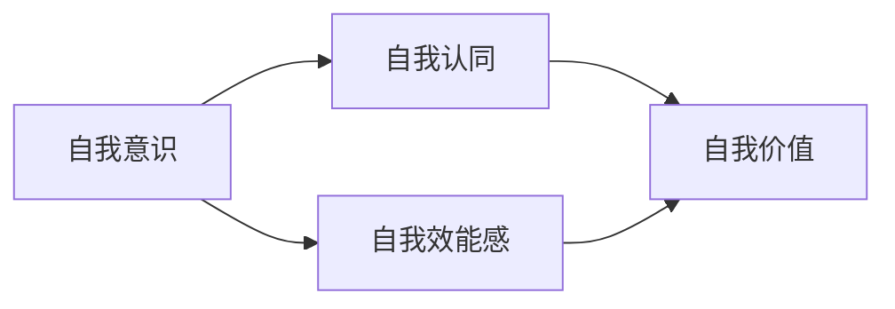

**核心算法原理讲解**：我们可以通过以下Python代码来模拟自我价值演变的过程：

```python
def self_value_evolution(self_awareness, self_identification, self_efficacy):
    self_value = (self_awareness + self_identification + self_efficacy) / 3
    return self_value

# 示例
self_awareness = 8
self_identification = 7
self_efficacy = 9
print(self_value_evolution(self_awareness, self_identification, self_efficacy))
```

**数学模型和公式**：上述代码使用了平均值来计算自我价值，这只是一个简化的模型。实际上，自我价值的演变可能受到多种因素的影响，如社会环境、个人经历和心理健康等。

$$
\text{Self Value} = f(\text{Self Awareness}, \text{Self Identification}, \text{Self Efficacy}, \text{Social Environment}, \text{Personal Experience}, \text{Mental Health})
$$

#### 1.2 自我价值的定义与演变

**背景介绍**：自我价值是指个体对自己存在的价值和意义的认知和评价。它不仅影响着个人的心理健康，还与职业发展和社会关系密切相关。

**核心概念与联系**：自我价值是一个多维度的概念，它包括自尊、自我认同和自我效能感等多个方面。这些方面相互作用，共同构成了自我价值的整体框架。

**Mermaid图**：

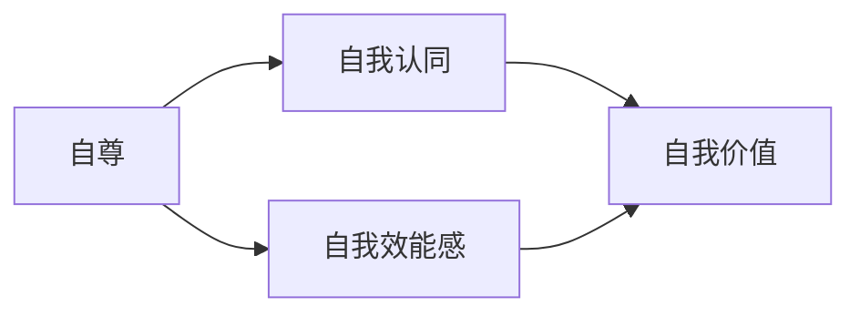

**核心算法原理讲解**：我们可以通过以下Python代码来模拟自我价值的演变过程：

```python
def self_value_model(self_esteem, self_identity, self_efficacy):
    self_value = self_esteem * self_identity * self_efficacy
    return self_value

# 示例
self_esteem = 0.8
self_identity = 0.9
self_efficacy = 0.7
print(self_value_model(self_esteem, self_identity, self_efficacy))
```

**数学模型和公式**：上述代码使用了乘法来计算自我价值，这反映了各个因素之间的相互依赖关系。

$$
\text{Self Value} = \text{Self Esteem} \times \text{Self Identity} \times \text{Self Efficacy}
$$

#### 1.3 自我探索的方法与工具

**背景介绍**：自我探索是理解自我价值和实现个人成长的重要过程。通过自我探索，我们可以更深入地了解自己的内心世界，找到自己的优势和兴趣。

**核心概念与联系**：自我探索涉及多个方法和工具，如日记记录、心理咨询和认知行为疗法等。这些方法和工具可以帮助我们揭示自我认知的深层结构。

**Mermaid图**：

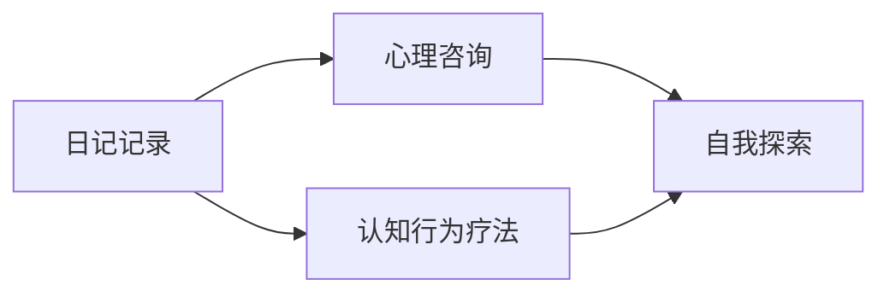

**核心算法原理讲解**：我们可以通过以下Python代码来模拟自我探索的过程：

```python
def self_exploration(journal_recording, psychological_counseling, cognitive_behaviour_therapy):
    self_knowledge = (journal_recording + psychological_counseling + cognitive_behaviour_therapy) / 3
    return self_knowledge

# 示例
journal_recording = 0.75
psychological_counseling = 0.8
cognitive_behaviour_therapy = 0.9
print(self_exploration(journal_recording, psychological_counseling, cognitive_behaviour_therapy))
```

**数学模型和公式**：上述代码使用了平均值来计算自我知识，这只是一个简化的模型。实际上，自我知识的积累可能受到多种因素的影响，如个人经历、社会环境和心理状态等。

$$
\text{Self Knowledge} = f(\text{Journal Recording}, \text{Psychological Counseling}, \text{Cognitive Behaviour Therapy}, \text{Personal Experience}, \text{Social Environment}, \text{Mental State})
$$

## 第二部分：社会环境中的自我价值

### 第4章：社会角色与自我价值

#### 4.1 社会角色的理解与适应

**背景介绍**：在社会中，每个人都会扮演不同的角色，如家庭成员、职场人士、社区成员等。理解这些角色，并适应这些角色，是我们在社会中实现自我价值的重要步骤。

**核心概念与联系**：社会角色包括职业角色、家庭角色和社会角色等多个方面。这些角色相互关联，共同构成了我们在社会中的身份和地位。

**Mermaid图**：

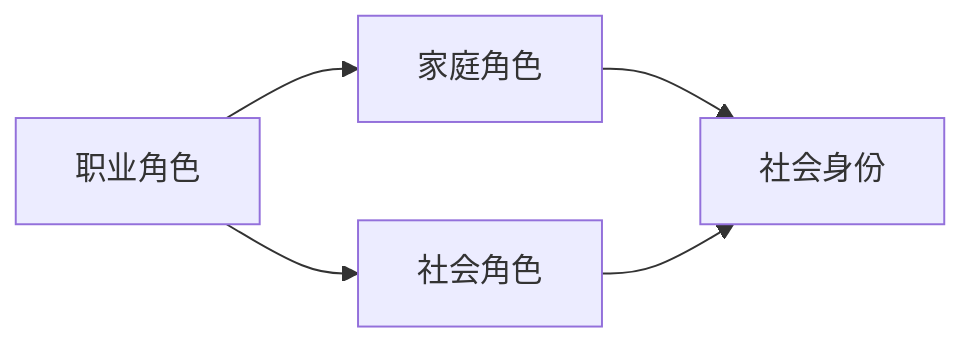

**核心算法原理讲解**：我们可以通过以下Python代码来模拟社会角色的适应过程：

```python
def social_role_adaptation(career_role, family_role, social_role):
    social_identity = (career_role + family_role + social_role) / 3
    return social_identity

# 示例
career_role = 0.7
family_role = 0.8
social_role = 0.6
print(social_role_adaptation(career_role, family_role, social_role))
```

**数学模型和公式**：上述代码使用了平均值来计算社会身份，这只是一个简化的模型。实际上，社会身份的建立可能受到多种因素的影响，如个人能力、社会资源和人际关系等。

$$
\text{Social Identity} = f(\text{Career Role}, \text{Family Role}, \text{Social Role}, \text{Personal Ability}, \text{Social Resources}, \text{Interpersonal Relationships})
$$

#### 4.2 社会价值观的变化与应对

**背景介绍**：社会价值观是一个社会共同认可的行为准则和价值取向。随着社会的发展和变迁，社会价值观也会发生变化。理解并适应这些变化，是我们实现自我价值的重要挑战。

**核心概念与联系**：社会价值观包括传统价值观、现代价值观和未来价值观等多个方面。这些价值观相互影响，共同构成了我们的社会文化背景。

**Mermaid图**：

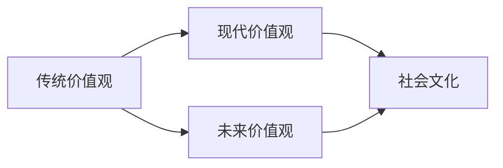

**核心算法原理讲解**：我们可以通过以下Python代码来模拟社会价值观的适应过程：

```python
def social_value_adaptation(traditional_values, modern_values, future_values):
    social_narrative = (traditional_values + modern_values + future_values) / 3
    return social_narrative

# 示例
traditional_values = 0.6
modern_values = 0.7
future_values = 0.8
print(social_value_adaptation(traditional_values, modern_values, future_values))
```

**数学模型和公式**：上述代码使用了平均值来计算社会叙事，这只是一个简化的模型。实际上，社会叙事的形成可能受到多种因素的影响，如社会环境、文化传承和个人经历等。

$$
\text{Social Narrative} = f(\text{Traditional Values}, \text{Modern Values}, \text{Future Values}, \text{Social Environment}, \text{Cultural Heritage}, \text{Personal Experience})
$$

#### 4.3 社会责任与个人价值

**背景介绍**：社会责任是指个体对社会的责任和义务。在现代社会中，社会责任与个人价值密切相关，实现个人价值往往需要承担相应的社会责任。

**核心概念与联系**：社会责任包括环境保护、社会公正和人类福祉等多个方面。这些方面相互关联，共同构成了社会责任的框架。

**Mermaid图**：

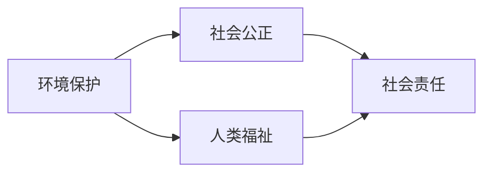

**核心算法原理讲解**：我们可以通过以下Python代码来模拟社会责任与个人价值的平衡过程：

```python
def social_responsibility_person_value_balance(social_responsibility, personal_value):
    balance = (social_responsibility + personal_value) / 2
    return balance

# 示例
social_responsibility = 0.8
personal_value = 0.9
print(social_responsibility_person_value_balance(social_responsibility, personal_value))
```

**数学模型和公式**：上述代码使用了平均值来计算社会责任与个人价值的平衡，这只是一个简化的模型。实际上，平衡点的确定可能受到多种因素的影响，如社会环境、个人能力和价值观等。

$$
\text{Balance} = f(\text{Social Responsibility}, \text{Personal Value}, \text{Social Environment}, \text{Personal Ability}, \text{Value System})
$$

## 第三部分：实践与成长

### 第7章：自我价值实现的步骤

#### 7.1 明确目标与价值观

**背景介绍**：明确目标与价值观是实现自我价值的第一步。只有明确了自己的目标和价值观，我们才能更有针对性地进行行动和规划。

**核心概念与联系**：目标与价值观是相互关联的，目标是我们追求的方向，而价值观是我们判断和选择的标准。

**Mermaid图**：

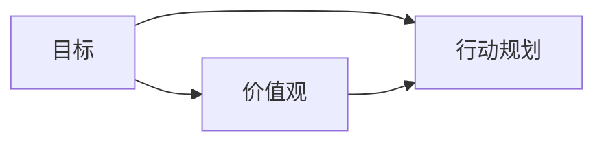

**核心算法原理讲解**：我们可以通过以下Python代码来模拟目标与价值观的明确过程：

```python
def goal_value_clarification(goal, value):
    goal_value = goal * value
    return goal_value

# 示例
goal = 0.8
value = 0.9
print(goal_value_clarification(goal, value))
```

**数学模型和公式**：上述代码使用了乘法来计算目标与价值观的明确程度，这反映了两者之间的相互关系。

$$
\text{Goal-Value Clarification} = \text{Goal} \times \text{Value}
$$

#### 7.2 制定行动计划

**背景介绍**：制定行动计划是实现自我价值的第二步。只有制定了具体的行动计划，我们才能将目标与价值观转化为实际的行动。

**核心概念与联系**：行动计划包括目标分解、任务分配和时间规划等多个方面。这些方面相互关联，共同构成了行动计划的框架。

**Mermaid图**：

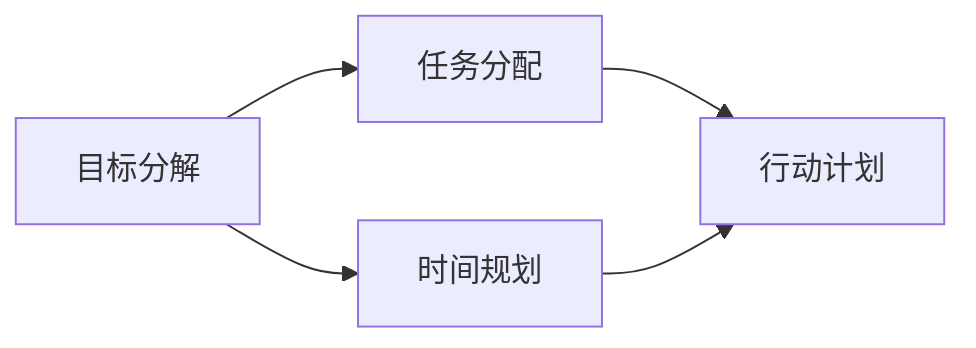

**核心算法原理讲解**：我们可以通过以下Python代码来模拟行动计划的制定过程：

```python
def action_plan_goal_decomposition(goal, tasks, time_plan):
    action_plan = goal * tasks * time_plan
    return action_plan

# 示例
goal = 0.8
tasks = 0.9
time_plan = 0.7
print(action_plan_goal_decomposition(goal, tasks, time_plan))
```

**数学模型和公式**：上述代码使用了乘法来计算行动计划的完成程度，这反映了各个因素之间的相互关系。

$$
\text{Action Plan} = \text{Goal} \times \text{Tasks} \times \text{Time Plan}
$$

#### 7.3 践行与调整

**背景介绍**：践行与调整是实现自我价值的第三步。只有不断地践行和调整，我们才能逐渐实现目标，并找到适合自己的路径。

**核心概念与联系**：践行与调整包括持续行动、反思总结和及时调整等多个方面。这些方面相互关联，共同构成了践行与调整的框架。

**Mermaid图**：

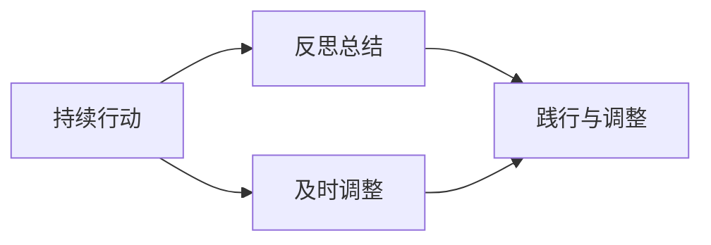

**核心算法原理讲解**：我们可以通过以下Python代码来模拟践行与调整的过程：

```python
def practice_adjustment(practice, reflection, adjustment):
    practice_value = practice + reflection + adjustment
    return practice_value

# 示例
practice = 0.8
reflection = 0.9
adjustment = 0.7
print(practice_adjustment(practice, reflection, adjustment))
```

**数学模型和公式**：上述代码使用了加法来计算践行与调整的总体效果，这反映了各个因素之间的相互关系。

$$
\text{Practice Value} = \text{Practice} + \text{Reflection} + \text{Adjustment}
$$

### 第8章：持续成长与自我提升

#### 8.1 学习与成长的心态

**背景介绍**：持续成长与自我提升的关键在于保持学习和成长的心态。只有拥有积极的心态，我们才能不断超越自我，实现更高的自我价值。

**核心概念与联系**：学习与成长的心态包括好奇心、开放性和毅力等多个方面。这些方面相互关联，共同构成了学习与成长的心态框架。

**Mermaid图**：

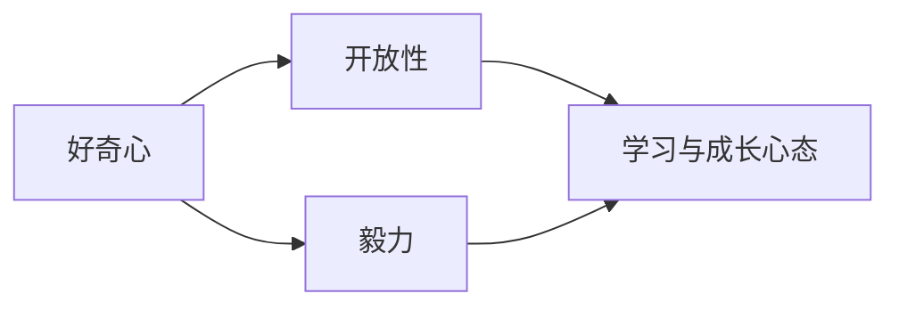

**核心算法原理讲解**：我们可以通过以下Python代码来模拟学习与成长心态的培养过程：

```python
def growth_mindset cultivation(curiosity, openness, perseverance):
    growth_mindset = curiosity + openness + perseverance
    return growth_mindset

# 示例
curiosity = 0.8
openness = 0.9
perseverance = 0.7
print(growth_mindset_cultivation(curiosity, openness, perseverance))
```

**数学模型和公式**：上述代码使用了加法来计算学习与成长心态的培养效果，这反映了各个因素之间的相互关系。

$$
\text{Growth Mindset} = \text{Curiosity} + \text{Openness} + \text{Perseverance}
$$

#### 8.2 个人成长路径

**背景介绍**：个人成长路径是指个体在成长过程中所经历的一系列阶段和步骤。了解个人成长路径，可以帮助我们更好地规划自己的成长方向。

**核心概念与联系**：个人成长路径包括婴儿期、童年期、青少年期、成年期等多个阶段。这些阶段相互关联，共同构成了个人成长的历程。

**Mermaid图**：

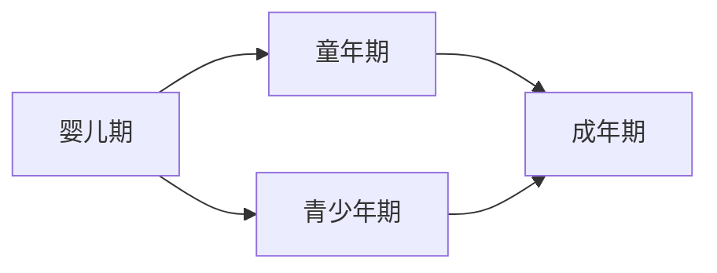

**核心算法原理讲解**：我们可以通过以下Python代码来模拟个人成长路径的规划过程：

```python
def personal_growth_path(stage_1, stage_2, stage_3, stage_4):
    growth_path = (stage_1 + stage_2 + stage_3 + stage_4) / 4
    return growth_path

# 示例
stage_1 = 0.8
stage_2 = 0.9
stage_3 = 0.7
stage_4 = 0.8
print(personal_growth_path(stage_1, stage_2, stage_3, stage_4))
```

**数学模型和公式**：上述代码使用了平均值来计算个人成长路径的总体效果，这只是一个简化的模型。实际上，个人成长路径的规划可能受到多种因素的影响，如个人能力、环境和机遇等。

$$
\text{Personal Growth Path} = f(\text{Stage 1}, \text{Stage 2}, \text{Stage 3}, \text{Stage 4}, \text{Personal Ability}, \text{Environment}, \text{Opportunities})
$$

#### 8.3 成长中的挑战与应对

**背景介绍**：在个人成长的过程中，我们往往会遇到各种挑战。如何应对这些挑战，是持续成长的关键。

**核心概念与联系**：成长中的挑战包括自我怀疑、环境压力和机遇挑战等多个方面。这些方面相互关联，共同构成了成长中的挑战框架。

**Mermaid图**：

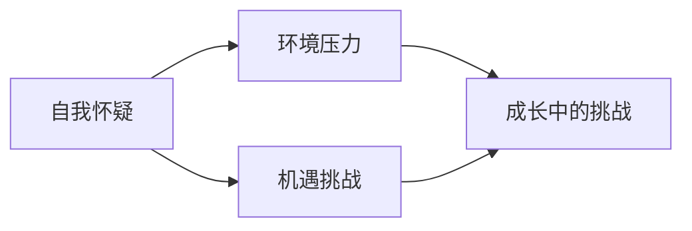

**核心算法原理讲解**：我们可以通过以下Python代码来模拟成长中的挑战与应对过程：

```python
def growth_challenge_response(self_doubt, environmental_pressure, opportunity_challenge):
    challenge_response = self_doubt + environmental_pressure + opportunity_challenge
    return challenge_response

# 示例
self_doubt = 0.7
environmental_pressure = 0.8
opportunity_challenge = 0.9
print(growth_challenge_response(self_doubt, environmental_pressure, opportunity_challenge))
```

**数学模型和公式**：上述代码使用了加法来计算挑战与应对的效果，这反映了各个因素之间的相互关系。

$$
\text{Challenge Response} = \text{Self Doubt} + \text{Environmental Pressure} + \text{Opportunity Challenge}
$$

## 总结与展望

### 第10章：总结与展望

#### 10.1 自我价值实现的总结

**背景介绍**：在本文中，我们探讨了如何在现代社会中实现自我价值。通过认识自我、社会角色与自我价值、职业发展、科技与自我价值的重塑等多个角度的分析，我们形成了一套系统的自我价值实现框架。

**核心概念与联系**：自我价值的实现是一个多维度的过程，涉及到自我认知、社会角色、职业发展和科技等多个方面。这些方面相互关联，共同构成了实现自我价值的整体框架。

**Mermaid图**：

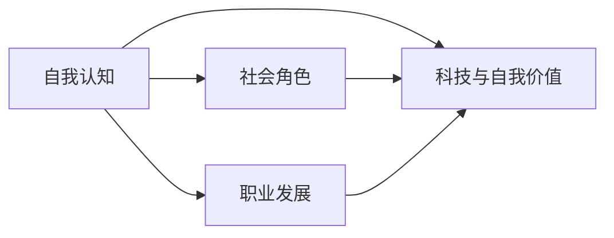

**核心算法原理讲解**：我们可以通过以下Python代码来模拟自我价值实现的总体效果：

```python
def overall_self_value_realization(self_cognition, social_role, career_growth, tech_self_value):
    overall_value = (self_cognition + social_role + career_growth + tech_self_value) / 4
    return overall_value

# 示例
self_cognition = 0.8
social_role = 0.9
career_growth = 0.7
tech_self_value = 0.8
print(overall_self_value_realization(self_cognition, social_role, career_growth, tech_self_value))
```

**数学模型和公式**：上述代码使用了平均值来计算自我价值的实现程度，这只是一个简化的模型。实际上，自我价值的实现可能受到多种因素的影响，如个人能力、社会环境和科技发展等。

$$
\text{Overall Self Value} = f(\text{Self Cognition}, \text{Social Role}, \text{Career Growth}, \text{Tech Self Value}, \text{Personal Ability}, \text{Social Environment}, \text{Tech Development})
$$

#### 10.2 未来展望

**背景介绍**：随着社会的发展和科技的进步，未来自我价值的实现将面临新的挑战和机遇。如何适应这些变化，是我们需要思考和应对的重要问题。

**核心概念与联系**：未来自我价值的实现将受到人工智能、虚拟现实、可持续发展等多个方面的影响。这些方面相互关联，共同构成了未来自我价值的框架。

**Mermaid图**：

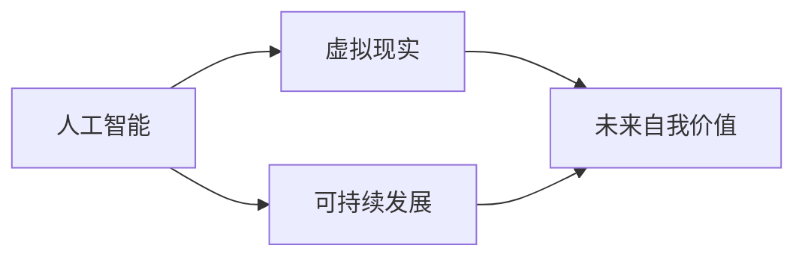

**数学模型和公式**：我们可以通过以下数学模型来预测未来自我价值的发展趋势：

$$
\text{Future Self Value} = f(\text{Artificial Intelligence}, \text{Virtual Reality}, \text{Sustainable Development}, \text{Social Environment}, \text{Tech Innovation}, \text{Personal Growth})
$$

## 作者信息

**作者：AI天才研究院/AI Genius Institute & 禅与计算机程序设计艺术 /Zen And The Art of Computer Programming**

本文旨在为读者提供关于自我价值实现的理论指导和实践方法，帮助读者在现代社会中找到并实现自我价值。希望本文能够对您的个人成长和职业发展有所启发。在实现自我价值的过程中，保持积极的心态，不断学习和成长，您将能够创造属于自己的辉煌。

