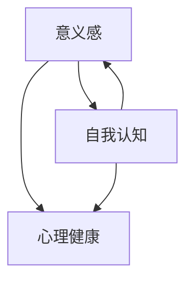
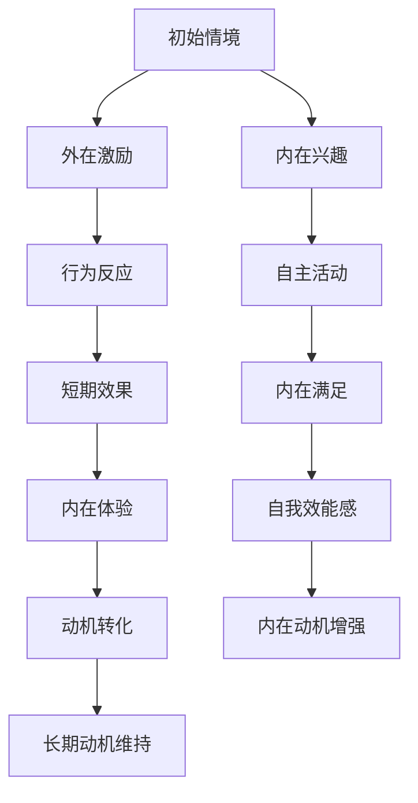
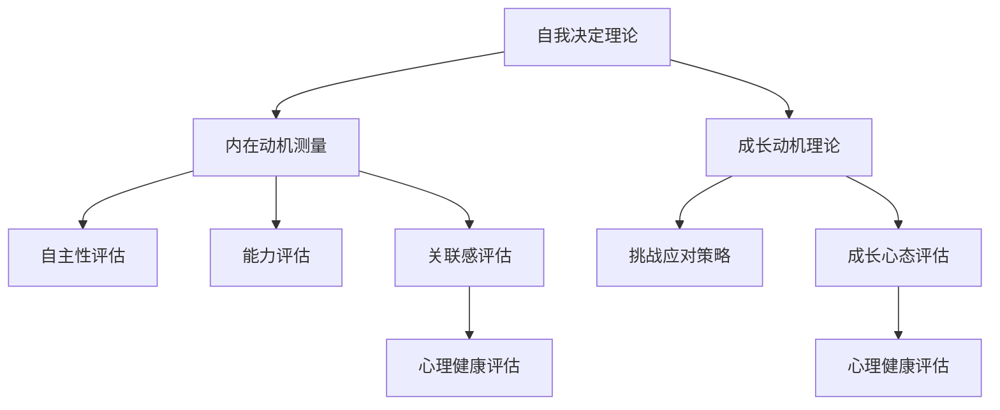

                 

### 引言

#### 1. 现代社会的挑战与自我发现的必要性

在当今这个信息爆炸、快速变化的时代，现代社会的挑战层出不穷。全球化、技术进步、经济转型等都在不断影响着人们的日常生活和工作方式。与此同时，个体面临的压力和困惑也在不断增加。许多人开始感到自己在物质丰富的现代社会中迷失了方向，无法找到生活的真正意义。

自我发现成为了许多人内心的迫切需求。自我发现不仅仅是对自我的认知，更是一种深刻的探索，旨在理解自己的内在需求和外在行为，找到自己在社会中的定位。然而，在复杂的社会结构和多元化的价值观中，如何找到真正的自我，如何确立个人的意义体系，成为了一个巨大的挑战。

因此，本文将探讨如何在现代社会中通过重塑意义来找到自我。首先，我们将分析现代社会中的个体性与社会性的张力，探讨这种张力对自我认知的影响。接着，我们将深入探讨意义感的本质，解释为什么寻找意义感对于个体的心理健康至关重要。在此基础上，我们将通过核心概念的联系和心理学模型的实证分析，构建一个理解意义感、自我认同和心理健康之间关系的框架。最后，我们将通过具体的数学模型和项目实战，提供实用的方法和工具，帮助读者在现代社会中重塑意义，找到自我。

通过这一系列的探讨，我们希望能够为读者提供一种清晰的理解路径，引导他们在复杂的社会环境中找到自己的方向，实现内心的平衡与满足。

#### 2. 本书的目的和结构

本书旨在为在现代社会中寻求自我发现的个体提供系统的方法和策略，帮助他们重塑意义，找到内心的平衡和满足。我们希望通过以下几个方面的探讨，实现这一目标：

首先，我们将通过分析现代社会中的个体性与社会性的张力，解释这种张力对个体自我认知的影响。在这一章中，读者将了解社会结构如何影响个体自我认知，同时认识到个体在社会中的角色定位对于自我认同的重要性。

接着，我们将深入探讨意义感的本质。意义感不仅仅是生活中的目标或成就，它是一种深刻的内在体验，对个体的心理健康和幸福感有着重要的影响。通过解释意义感的多元维度和其与幸福感的关系，读者将理解为什么寻找意义感对于个人成长至关重要。

在核心概念与联系章节，我们将构建一个涵盖意义感、自我认同和心理健康之间关系的理论框架。通过使用Mermaid流程图，我们将详细展示这些概念之间的相互作用和影响路径，帮助读者形成全面的理解。

在核心算法原理讲解部分，我们将通过具体的数学模型和Python源代码，详细阐述意义感的测量方法及其与心理健康的关系。这部分内容将结合实际案例，以通俗易懂的方式解释复杂的数学公式和算法原理，帮助读者将理论知识应用到实际生活中。

最后，通过项目实战章节，我们将提供一次完整的开发环境搭建和源代码实现的实战案例。从项目背景介绍、开发环境配置到源代码分析和性能优化建议，读者将体验到从理论到实践的全过程，从而更好地理解如何在实际操作中应用所学知识。

本书结构紧凑，内容系统，旨在通过逐步分析和推理，帮助读者在现代社会中找到自我，重塑意义。通过本书的阅读和实践，读者将能够更深入地理解自我，提升心理健康，实现个人成长和幸福。

### 第1章：现代社会中的自我认知

#### 1.1 个体性与社会性的张力

在现代社会中，个体性与社会性的张力是一个显著的现象，这种张力深刻地影响着个体的自我认知。个体性强调个体的独特性、自主性和自由意志，而社会性则强调个体在集体、社会环境中的角色和责任。这种张力在个体的日常生活中无处不在，影响着他们的行为、心理状态和价值观。

首先，社会结构对个体自我认知的影响不可忽视。社会结构包括家庭、学校、工作场所、政府机构等，它们构成了个体生活的社会背景。个体在社会结构中的角色和位置，往往决定了他们的自我认知。例如，一个人在工作场所可能是一个领导者，而在家庭中可能是子女或配偶，这些不同的角色位置会影响他们的自我认知。社会结构中的规范和期望也会对个体产生压力，使他们更加注重社会认同，从而影响他们的自我认知。

其次，个体在社会中的角色定位对于自我认同至关重要。个体的角色定位不仅影响他们的行为和决策，也影响他们的自我评价和自尊。一个人如果能够在社会中找到自己的角色，并在这个角色中表现出色，往往会增强他们的自我认同。相反，如果个体在社会中感到角色定位模糊或无法满足社会期望，他们可能会感到自我认同的缺失或困惑。例如，在一个快速变化的时代，一些人可能会面临职业转换的挑战，这种不确定性可能会影响到他们的自我认知。

这种个体性与社会性的张力对心理健康有着深远的影响。一方面，个体性张力可能导致个体的焦虑和不安。在追求自主性和独特性的过程中，个体可能会面临来自社会的压力和挑战，这些压力可能导致心理负担。另一方面，社会性张力可能导致个体的孤独感。尽管现代社会提供了丰富的社交机会，但个体在社会中的角色定位可能使他们在某些方面感到疏离或孤立。例如，在一个高度分工的社会中，个体可能会感到他们的工作只是整个社会机器中的一颗“螺丝钉”，这种角色的单一性可能会削弱他们的自我认同。

为了更好地应对这种张力，个体需要建立积极的自我认知机制。首先，个体需要认识到自己的独特性和价值，同时理解社会对他们角色的期望。这可以通过自我反思和自我接纳来实现。其次，个体需要在社会中找到自己的位置，并在这个位置中发挥自己的作用。这不仅有助于增强自我认同，还可以带来成就感和满足感。最后，个体需要学会平衡个体性和社会性，避免过度强调其中一方而忽视另一方。通过这种方式，个体可以在复杂的社会环境中保持心理平衡，找到自我。

总之，个体性与社会性的张力是现代社会中一个重要的现象，它对个体的自我认知和心理健康有着深远的影响。理解这种张力，并采取积极的应对策略，对于个体在现代社会中找到自我和保持心理健康至关重要。

#### 1.2 心理健康与自我认同

心理健康与自我认同之间存在着紧密的联系，二者相互作用，共同影响着个体的生活质量和幸福感。自我认同是指个体对自己身份、价值和角色的认识与接受，而心理健康则涵盖了情感、认知和行为三个方面，确保个体能够适应日常生活中的各种挑战。

首先，心理学中的自我概念是一个核心概念，它帮助个体理解和评估自己的身份、能力、价值和人际关系。自我概念的形成受到多种因素的影响，包括遗传、社会环境、文化背景和个人经历。一个积极的自我概念通常与较高的心理健康水平相关，因为它能促进个体的自尊、自信和自我效能感。

其次，心理健康与自我认同的关系可以从以下几个方面进行理解：

- **情感维度**：自我认同清晰的个体通常具有更好的情绪调节能力。他们能够更好地应对生活中的压力和挑战，因为他们对自己的能力和价值有更深刻的认识。相反，自我认同不明确的个体可能会经历更多的焦虑、抑郁和情绪波动。

- **认知维度**：自我认同不仅影响个体的情感体验，还影响他们的认知过程。一个健康的自我认同有助于个体形成积极的思维模式，从而更好地理解自己的需求和行为。而缺乏自我认同的个体可能会表现出自我怀疑、自我贬低和认知失调。

- **行为维度**：自我认同也直接影响个体的行为和决策。一个清晰的自我认同可以帮助个体做出更符合自己价值观和目标的选择。例如，一个对自己的职业和生活方式有明确认同的个体，更可能坚持自己的职业规划和生活方式，而不是受到外界诱惑而做出不符合自己价值观的决定。

- **心理健康对自我认同的影响**：心理健康状况也会对自我认同产生影响。例如，心理健康问题如焦虑和抑郁可能会导致个体对自己的能力和价值产生负面看法，削弱自我认同。同时，缺乏自我认同的个体也更容易出现心理健康问题，因为他们在面对生活中的挑战时缺乏有效的应对策略。

为了维护心理健康和自我认同，个体可以采取以下策略：

- **自我反思**：定期进行自我反思可以帮助个体更好地理解自己的需求、价值观和目标。这种自我反思可以是写日记、冥想或与他人的交流，有助于个体建立更清晰的自我认同。

- **积极心理训练**：通过积极心理训练，如正念冥想、感恩练习和自我肯定，个体可以增强自我认同，提高情绪调节能力，从而改善心理健康。

- **建立支持系统**：一个支持性的社会网络对维护心理健康和自我认同至关重要。个体应该寻求与家人、朋友和专业人士的交流和支持，以应对生活中的挑战。

- **寻求专业帮助**：如果个体在自我认同和心理健康方面遇到困难，寻求专业心理咨询师的帮助是明智的选择。专业心理咨询师可以提供个性化的指导和干预，帮助个体建立更健康的自我认同和应对策略。

总之，心理健康与自我认同之间存在着紧密的联系，二者共同影响着个体的生活质量。通过采取积极的策略和措施，个体可以在复杂的社会环境中维护自己的心理健康和自我认同，实现个人成长和幸福。

### 第2章：意义感的本质

#### 2.1 意义感的定义与重要性

意义感是一个深刻的内在体验，它描述了个体在生活中感受到的目的、价值和意义。这种体验不仅仅是关于物质上的成就或外在的成功，更是一种内在的满足和心灵的宁静。从心理学角度来看，意义感是一种复杂的心理状态，它涉及多个层面的认知、情感和行为。

首先，意义感可以定义为个体在某种活动、关系或经历中感受到的内在目的和价值。它不仅仅是为了实现某些具体的目标，而是一种深层次的满足感和存在的意义。例如，一个人在工作中感到有意义，可能是因为他们的工作不仅提供了经济上的收益，还满足了他们对成就、贡献和社会认同的需求。这种感受可以帮助个体在面对困难和挑战时保持动力和韧性。

其次，意义感的重要性不容忽视。它对个体的心理健康和幸福感有着显著的影响。研究表明，拥有强烈意义感的人往往具有更高的自尊和自我效能感，较少出现焦虑和抑郁。此外，意义感还与生活质量密切相关。一个感到生活有意义的人通常更能享受生活中的美好时刻，对待生活中的困难有更好的应对策略。

意义感的多元维度进一步揭示了其复杂性和重要性。从心理学角度，意义感可以分解为以下几个方面：

1. **内在动机**：内在动机是指个体在追求某种目标时，主要是为了满足内心的需求和兴趣，而不是为了外在的奖励或避免惩罚。例如，一个人参加志愿服务可能是出于对帮助他人的热情，而不是为了获得社会赞誉或物质报酬。

2. **外在动机**：外在动机则与个体为了获得外部奖励或避免不良后果而进行的活动相关。例如，一个人努力学习可能是为了获得好成绩，以便在未来的求职过程中有更多的机会。

3. **个人价值观**：个人价值观是指导个体行为的核心信念和原则。它帮助个体在不同情境中做出选择，并赋予他们的行为意义。例如，一个人如果重视家庭价值观，那么他会把时间和精力投入到家庭生活中，从而感受到生活的意义。

4. **目标实现**：目标实现是意义感的重要组成部分。当个体能够实现自己设定的目标时，他们往往会感到满足和有成就感，这进一步增强了他们的意义感。

意义感与幸福感之间存在密切的关系。幸福感是指个体在特定时间内感到快乐和满足的心理状态。研究发现，意义感是幸福感的强有力预测因素之一。具有强烈意义感的人往往拥有更高的幸福感，因为他们感受到自己的生活有意义，有意义感的生活不仅带来快乐，还带来内心的满足和宁静。

为了更好地理解意义感，我们可以通过一个简单的例子来说明。假设一个人在一家初创公司工作，他的目标是帮助公司实现业务增长。如果他的工作不仅带来了经济上的收益，还让他感到自己对公司的成功有重要的贡献，他可能会因此感到充满意义。这种感受不仅提高了他的工作动力，还增强了他的自我认同和心理健康。

总之，意义感是一种深层次的内在体验，它对个体的心理健康和幸福感有着重要的影响。理解意义感的定义和多元维度，可以帮助个体更好地找到生活的方向和意义，从而提升整体幸福感。通过培养内在动机、明确个人价值观和实现目标，个体可以在复杂的社会环境中找到属于自己的意义感，实现个人成长和幸福。

#### 2.2 寻找意义的过程

寻找意义是一个复杂且多层次的内心旅程，涉及个体在多种动机和价值观驱动下的不断探索和反思。理解这一过程的关键在于认识到内在动机和外在动机的不同作用以及个人价值观在这一过程中的核心作用。

首先，内在动机是指个体在追求某种活动或目标时，主要出于内在的兴趣、热情和满足感。这种动机通常与个人的兴趣、天赋和内在需求紧密相关。例如，一个人可能因为对编程有浓厚的兴趣而投入大量时间学习相关技能，而不是为了得到工资或职业晋升。内在动机可以带来持久的动力和热情，因为它满足了个体深层次的心理需求，如自我实现和成就感。

相反，外在动机则与个体为了获得外部奖励或避免负面后果而进行的活动相关。例如，一个人可能努力学习是为了获得好成绩，从而能够进入理想的大学或找到理想的工作。虽然外在动机也能提供一定的动力，但它们通常不如内在动机持久和强烈，因为它们更多地依赖于外部奖励或压力。

个人价值观在寻找意义的过程中起着至关重要的角色。个人价值观是指个体在长期生活过程中形成的核心信念和原则，它们指导个体的行为和决策，并赋予个体的生活意义。例如，一个重视家庭的人可能会把大部分时间和精力投入到家庭生活中，从而感受到生活的意义和满足感。相反，如果一个人的价值观是追求个人成就和成功，他们可能会把更多的时间和精力投入到职业发展上，从而在事业中找到生活的意义。

理解内在动机和外在动机的相互作用对于寻找意义至关重要。一个理想的平衡状态是，个体能够找到同时满足内在动机和外在动机的活动。例如，一个人可能在工作中找到内在的满足感，如对工作内容有热情和成就感，同时这种工作也能带来经济上的回报和职业上的发展。这种平衡状态可以帮助个体在长期的生活中保持动力和满足感。

以下是一个寻找意义的实际例子：

**案例：李明的职业选择**

李明是一位年轻的程序员，他在大学期间对编程产生了浓厚的兴趣。起初，他之所以选择编程，是因为他对计算机科学和技术有着强烈的内在动机，喜欢解决问题和创造新的东西。然而，随着就业压力的增加，李明开始考虑外在动机，如工资、职业晋升和行业前景。在面试了几家公司后，他发现虽然这些公司提供了丰厚的薪资和良好的职业发展机会，但他内心并没有真正的热情。于是，他决定选择一家初创公司，虽然薪资较低，但他在这里能够自由地发挥创造力，并与志同道合的团队成员一起工作。几个月后，李明不仅在工作中找到了巨大的满足感，还因为公司的成功而获得了股票奖励。

这个案例展示了内在动机和外在动机如何相互作用，以及个人价值观在寻找意义过程中的作用。李明通过选择一个与他的内在动机和个人价值观相匹配的职业，找到了生活的意义，并在职业生涯中取得了显著的成功。

总之，寻找意义是一个涉及内在动机、外在动机和个人价值观的复杂过程。通过理解这些因素之间的关系，个体可以在复杂的社会环境中找到属于自己的意义，实现个人成长和幸福。内在动机提供了持久的动力，外在动机提供了实际的回报，而个人价值观则为个体提供了指导，帮助他们做出符合内心需求的选择。

#### 2.3 个人价值观在寻找意义中的作用

个人价值观在寻找意义的过程中起着至关重要的作用，它们不仅指导个体的行为和决策，还赋予个体的生活意义和方向。个人价值观是指个体在长期生活过程中形成的核心信念和原则，它们反映了个体对什么重要、什么有意义的基本认知。

首先，个人价值观对个体选择的影响显而易见。例如，一个人如果重视家庭价值观，他们可能会把大部分时间和精力投入到家庭生活中，从而在家庭关系中找到生活的意义。相反，如果一个人的价值观是追求个人成就和成功，他们可能会把更多的时间和精力投入到职业发展上，从而在事业中找到生活的意义。通过明确个人价值观，个体可以在纷繁复杂的社会环境中做出更符合自己内心需求的选择。

其次，个人价值观也帮助个体在面对生活中的困难和挑战时保持坚韧和决心。当个体面临职业上的瓶颈、人际关系中的矛盾或生活中的突发事件时，个人价值观可以提供心理支持和方向。例如，一个重视正义和公平的人在面对不公平待遇时可能会更加坚定地维护自己的原则，从而在困境中找到坚持的意义。同样，一个重视健康和幸福的人可能会在面对健康问题时更加积极地寻求解决方案，从而在挑战中找到生活的意义。

个人价值观还可以促进个体与他人的和谐相处。通过明确个人价值观，个体可以更好地理解他人的行为和动机，从而减少误解和冲突。例如，一个重视合作和共赢的人在与同事或朋友合作时，可能会更加注重团队的整体利益，从而建立更和谐的人际关系。相反，如果一个人的价值观是竞争和胜利，他们在与他人互动时可能会更关注个人成就，这可能导致关系紧张和冲突。

为了更好地理解个人价值观在寻找意义中的作用，我们可以通过以下案例进行说明：

**案例：张丽的职业转型**

张丽是一位年轻的职场女性，她在一家大型企业工作多年，但逐渐发现自己对目前的工作失去了热情。通过自我反思，她意识到自己的价值观更倾向于创造性、自主性和个人成长。于是，张丽决定辞职并创办自己的公司，专注于自己热爱的事业。虽然创业初期充满了挑战，但张丽通过坚持自己的价值观，找到了事业的激情和意义，并在市场中取得了成功。

这个案例展示了个人价值观如何影响个体的职业选择，并帮助个体在寻找意义的过程中做出更符合自己内心需求的决定。张丽通过明确和坚持自己的价值观，不仅找到了职业上的意义，还实现了个人成长和幸福。

总之，个人价值观在寻找意义的过程中扮演着至关重要的角色。通过明确自己的价值观，个体可以在纷繁复杂的社会环境中找到生活的方向和意义，实现个人成长和幸福。同时，个人价值观还可以帮助个体在面临生活挑战时保持坚韧和决心，与他人建立和谐的关系。

### 第3章：核心概念与联系

在现代社会中，理解意义感、自我认知和心理健康之间的复杂关系对于个人的成长和幸福至关重要。这一章节将通过建立理论框架和展示Mermaid流程图，深入探讨这些核心概念之间的相互作用和影响路径。

#### 3.1 意义感与心理健康的关系框架

意义感、自我认知和心理健康之间存在着密切的相互作用。一个全面的理论框架可以帮助我们理解这些概念之间的内在联系。

1. **意义感**：意义感是个人在某种活动、关系或经历中感受到的内在目的和价值。它是内在动机和个人价值观的体现，对个体的幸福感有显著影响。
   
2. **自我认知**：自我认知是个体对自己身份、能力和价值的理解。它受到社会结构、文化背景和个人经历的影响，是意义感和心理健康的重要基础。

3. **心理健康**：心理健康涵盖了情感、认知和行为三个方面，确保个体能够适应日常生活中的各种挑战。心理健康状况直接影响个体的自我认知和意义感。

理论框架如下：

- **意义感** → **心理健康**：意义感强的个体通常心理健康状况较好，因为他们感受到生活的价值和目的，能够更好地应对生活中的挑战。
- **自我认知** → **意义感**：清晰的自我认知有助于个体更好地理解自己的需求和价值观，从而增强意义感。
- **自我认知** → **心理健康**：自我认知清晰的个体通常有更好的情绪调节能力和自尊，心理健康状况较好。

#### 3.2 Mermaid流程图：意义感与心理健康的关系路径

为了更直观地展示这些概念之间的相互作用，我们可以使用Mermaid流程图来描绘意义感、自我认知和心理健康之间的关系路径。



图解：

- **A[意义感]**：意义感是起点，它直接影响心理健康（B）和自我认知（C）。
- **C[自我认知]**：自我认知反过来影响意义感（A）和心理健康（B），形成闭环，确保三者之间的动态平衡。

通过这个流程图，我们可以清晰地看到意义感、自我认知和心理健康之间的相互影响和动态过程。这个理论框架和流程图为读者提供了一个理解这些核心概念之间关系的实用工具，帮助他们更好地在现代社会中找到自我，重塑意义，提升心理健康。

### 3.2.1 动机理论概述

在理解内在动机和外在动机的相互作用之前，我们需要先概述动机理论的基本概念。动机理论是心理学中研究个体行为驱动力的核心部分，它帮助我们理解为什么个体会做出特定的选择和行动。

#### 1. 内在动机与外在动机的定义

- **内在动机**：内在动机是指个体在追求某种活动或目标时，主要是为了满足内心的需求和兴趣，而不是为了外在的奖励或避免惩罚。这种动机通常与个人的兴趣、天赋和内在需求紧密相关。例如，一个人可能因为对绘画有浓厚的兴趣而投入大量时间创作，而不是为了赢得奖金或获得他人的认可。

- **外在动机**：外在动机则与个体为了获得外部奖励或避免负面后果而进行的活动相关。这种动机更多地依赖于外部因素，如金钱、社会赞誉或避免惩罚。例如，一个人努力学习可能是为了获得好成绩，以便在未来的求职过程中有更多的机会。

#### 2. 动机理论的分类

动机理论可以根据不同的分类标准进行分类，以下是一些主要的动机理论：

- **驱力-减力理论**：这种理论认为，个体的行为主要是由内在的驱动力（如饥饿、口渴）和外部减力（如奖励、惩罚）驱动的。

- **自我决定理论**：由心理学家瑞恩和德西提出，该理论强调内在动机的重要性，认为个体的行为是由自主性、能力和关联感驱动的。自我决定理论区分了**基本心理需求**，包括自主性、能力和关联感，这些需求满足了，个体就会体验到内在动机。

- **目标设置理论**：该理论强调目标设置对个体行为和动机的影响。目标设置理论区分了**掌握目标**（旨在提高技能和知识）和**表现目标**（旨在展示能力和获得社会认可）。

- **动机-情绪理论**：该理论认为，情绪是动机的一个重要组成部分，个体的情绪状态可以驱动他们的行为。

#### 3. 内在动机与外在动机的相互作用

内在动机和外在动机在个体的行为和动机系统中相互作用，具体表现为以下几个方面：

- **激励效应**：外在动机可以在短期内提高个体的活动参与度和表现水平。例如，通过提供奖励或惩罚，可以促使个体完成特定的任务。

- **疲劳效应**：长期依赖外在动机可能导致内在动机的降低。当个体意识到他们的行为仅仅是为了获得外部奖励时，他们可能会失去对活动的内在兴趣，这种现象称为**疲劳效应**。

- **平衡效应**：内在动机和外在动机的平衡是理想的动机状态。当个体能够在活动中同时体验到内在动机和外在动机时，他们的参与度和表现水平通常会更高。例如，一个人可能因为对绘画有内在的兴趣，同时也因为赢得展览的奖金而更加努力。

- **转化效应**：外在动机可以转化为内在动机。通过适当的引导和激励，个体可以逐渐从依赖外部奖励转向内在满足。例如，一个人通过参与志愿者活动获得社会赞誉，随着时间的推移，他们可能会因为帮助他人的内在满足而继续参与。

总之，动机理论提供了丰富的视角，帮助我们理解内在动机和外在动机在个体行为和动机系统中的相互作用。通过理解这些理论，我们可以更好地设计激励策略，提高个体的参与度和表现水平，同时促进他们的内在动机和心理健康。

#### 3.2.2 Mermaid流程图：内在动机与外在动机的动态过程

为了更直观地展示内在动机与外在动机的相互作用，我们可以使用Mermaid流程图来描绘这一动态过程。以下是一个示例流程图，展示了个体在不同情境下如何体验和转换内在动机与外在动机。



图解：

1. **初始情境**：个体处于某种情境，可能带有一定的内在兴趣或外在激励。
2. **外在激励**：情境中存在外在激励，如奖励、竞争或避免惩罚。
3. **行为反应**：外在激励驱动个体产生相应的行为反应。
4. **短期效果**：行为反应短期内带来积极效果，如提高参与度或表现水平。
5. **内在体验**：个体在行为过程中可能体验到内在兴趣或内在动机。
6. **动机转化**：通过适当的引导和激励，个体将外在激励转化为内在动机。
7. **长期动机维持**：内在动机帮助个体在长期内保持对活动的兴趣和动力。
8. **内在兴趣**：个体在初始情境中可能已经存在内在兴趣。
9. **自主活动**：内在兴趣驱动个体进行自主活动。
10. **内在满足**：自主活动带来内在满足，增强个体的自我效能感。
11. **内在动机增强**：内在满足和自我效能感进一步增强个体的内在动机。

这个流程图清晰地展示了内在动机与外在动机的相互作用和动态过程，帮助读者更好地理解这两个动机类型的转换和维持机制。通过这种方式，个体可以在复杂的社会环境中找到适合自己的动机策略，从而实现个人成长和心理健康。

### 第4章：核心算法原理讲解

#### 4.1 意义感测量的方法

意义感的测量是理解个体心理健康和生活质量的关键步骤。在这一节中，我们将讨论两种常用的意义感测量方法：自我报告法和行为测量法。

**4.1.1 自我报告法的应用与局限**

自我报告法是通过问卷、访谈等方式直接询问个体对他们自身意义感的感受。这种方法具有直接、简便、易于实施等优点，特别适用于大规模调查和临床研究。例如，常用的《生命意义量表》（Life Meaning Scale，LMS）和《意义感问卷》（Positive and Negative Affect Schedule，PANAS）都是基于自我报告的方法。

尽管自我报告法有其优势，但也存在一些局限。首先，个体在回答问题时可能存在主观偏差，例如社会期望效应或自我呈现偏差，导致数据不准确。其次，自我报告法难以捕捉到个体在特定情境下的真实感受，因为个体的感受可能受到情绪、心理状态和当时情境的影响。

**4.1.2 行为测量法的挑战与机遇**

行为测量法通过观察个体的行为来推断其意义感。这种方法包括生理指标测量（如心率变异性、唾液皮质醇等）和日常活动记录（如日记、智能手机使用数据等）。行为测量法的优势在于它能够提供客观、全面的视角，减少主观报告的偏差。例如，通过分析个体在面临压力或挑战时的行为反应，可以更准确地了解其意义感水平。

然而，行为测量法也存在一定的挑战。首先，行为测量需要大量的数据收集和分析，这使得实施成本较高。其次，行为数据可能难以直接反映个体的内在感受，因为行为受到多种因素的影响，如文化背景、社会环境等。

**4.1.3 综合测量方法**

为了克服单一方法的局限性，研究者常采用综合测量方法，结合自我报告和行为测量，以获得更全面、准确的意义感测量结果。例如，可以先用自我报告法进行初步评估，再通过行为测量法验证自我报告的可靠性。此外，还可以结合神经科学方法（如fMRI、EEG等）来研究意义感与大脑活动之间的关系。

总之，意义感的测量需要多种方法的综合应用，通过自我报告法和行为测量法的结合，可以更全面、准确地评估个体的意义感水平，从而为心理健康和生活质量的研究提供有力支持。

#### 4.2 心理学模型的实证分析

在探讨意义感与心理健康的关系时，心理学模型的应用至关重要。通过实证分析，我们可以更深入地理解这些概念之间的复杂关系，并为个体提供有针对性的干预策略。

**4.2.1 意义感与心理健康的相关研究**

心理学模型为研究意义感与心理健康的关系提供了有力的工具。例如，**自我决定理论**（Self-Determination Theory，SDT）和**成长动机理论**（Growth Motivation Theory，GMT）是两个常用的理论框架。

- **自我决定理论**认为，个体的内在动机和自由意志是驱动行为的重要因素。研究表明，内在动机强的个体通常有更高的意义感和更好的心理健康。例如，瑞恩和德西（Ryan & Deci）在研究中发现，自主性、能力和关联感满足的个体在心理健康和幸福感方面表现更好。

- **成长动机理论**强调个体在面对挑战和困难时的成长动机。这一理论指出，当个体感受到成长和进步时，他们的意义感和心理健康水平会显著提高。例如，德韦克（Dweck）的研究表明，持有成长心态的个体在面对挑战时更有动力，更能从失败中学习和成长，从而提高他们的意义感和心理健康。

**4.2.2 Mermaid流程图：心理学模型的应用与验证**

为了直观地展示这些心理学模型的应用和验证过程，我们可以使用Mermaid流程图来描述。以下是一个示例流程图，展示了自我决定理论和成长动机理论在研究意义感与心理健康中的应用。



图解：

1. **A[自我决定理论]**：通过测量内在动机，评估个体的自主性、能力和关联感。
2. **B[内在动机测量]**：包括对自主性、能力和关联感的评估。
3. **C[自主性评估]**：评估个体在活动中的自主性和自由度。
4. **D[能力评估]**：评估个体对自身能力的认知和信心。
5. **E[关联感评估]**：评估个体在社会和人际关系中的关联感。
6. **F[心理健康评估]**：通过上述评估，推断个体的心理健康水平。
7. **G[成长动机理论]**：通过评估个体的挑战应对策略和成长心态。
8. **H[挑战应对策略]**：评估个体在面对挑战时的策略和方法。
9. **I[成长心态评估]**：评估个体对挑战和失败的态度和认知。
10. **J[心理健康评估]**：结合自我决定理论和成长动机理论的评估结果，综合推断个体的心理健康水平。

通过这个流程图，我们可以看到心理学模型如何通过多个维度的评估，系统性地研究意义感与心理健康的关系。这不仅为理论验证提供了实证依据，也为干预策略的设计提供了指导。

总之，通过实证分析和应用心理学模型，我们可以更深入地理解意义感与心理健康之间的关系，为个体提供科学、有效的干预策略。这不仅有助于提升个体的心理健康，还能帮助他们在复杂的社会环境中找到属于自己的意义和方向。

#### 4.3 意义感的主观体验模型

意义感的主观体验模型是理解个体内心感受和内在动机的重要工具。在这一节中，我们将通过构建一个数学模型，详细阐述意义感的主观体验及其构成要素。

**4.3.1 模型公式**

意义感的主观体验可以通过以下公式进行表达：

$$
\text{意义感} = f(\text{内在动机}, \text{外在动机}, \text{个人价值观})
$$

这个公式表明，意义感是由内在动机、外在动机和个人价值观共同作用的结果。内在动机和外在动机分别反映了个体在追求活动或目标时的内在兴趣和外部激励，而个人价值观则指导个体的行为选择和决策。

**4.3.2 各要素解释**

1. **内在动机（Intrinsic Motivation）**：内在动机是指个体在追求某种活动或目标时，主要出于内心的兴趣和热情，而非外部奖励。例如，一个热爱写作的人可能会花费大量时间进行创作，因为写作本身就是他内心追求的乐趣。内在动机通常与个体的兴趣、天赋和内在需求紧密相关。

2. **外在动机（Extrinsic Motivation）**：外在动机是指个体在追求某种活动或目标时，主要受到外部奖励或避免惩罚的影响。例如，一个学生努力学习可能是因为他想要获得好成绩，以便能够进入理想的大学。外在动机通常与外部奖励、社会期望和竞争压力有关。

3. **个人价值观（Personal Values）**：个人价值观是指个体在长期生活过程中形成的核心信念和原则，它们指导个体的行为和决策，并赋予个体的生活意义。例如，一个人如果重视家庭，他可能会把大部分时间和精力投入到家庭生活中，从而感受到生活的意义。个人价值观帮助个体在不同情境中做出符合自身需求和价值的选择。

**4.3.3 模型应用举例**

为了更直观地理解这个模型，我们可以通过一个具体的例子来说明。

**例子：李明的学习动机**

李明是一位大学生，他对计算机科学有浓厚的兴趣。在制定学习计划时，他需要考虑内在动机、外在动机和个人价值观。

- **内在动机**：李明热爱编程，享受解决问题的过程，这使他在面对复杂的编程题目时充满动力。这种内在动机来源于他对编程的热爱和兴趣。
- **外在动机**：李明的学习目标包括获得好成绩和找到理想的工作。他希望通过努力学习，能够获得奖学金和实习机会，并在毕业时找到一份满意的工作。这种外在动机来源于外部奖励和社会期望。
- **个人价值观**：李明重视学习和个人成长，他认为通过不断学习和提升技能，能够实现自己的职业目标并带来个人成就。这种个人价值观指导他在面对学习挑战时保持积极的态度和努力。

根据意义感的主观体验模型，我们可以计算出李明的意义感：

$$
\text{意义感} = f(\text{内在动机}, \text{外在动机}, \text{个人价值观})
$$

在这个例子中，李明的意义感取决于他的内在动机、外在动机和个人价值观。如果他的个人价值观与他追求的学习目标和内在动机一致，那么他的意义感将较高，反之则可能较低。

通过这个例子，我们可以看到意义感的主观体验模型如何帮助个体理解和评估他们在不同活动中的意义感。通过明确内在动机、外在动机和个人价值观，个体可以更好地理解自己在活动中的动机和感受，从而找到更符合自身需求的生活方向。

总之，意义感的主观体验模型提供了一个理论框架，帮助个体理解和评估他们在不同活动中的意义感。通过结合内在动机、外在动机和个人价值观，个体可以更清晰地认识到自己在活动中的动机和感受，从而在复杂的社会环境中找到属于自己的意义和方向。

#### 4.3.2 意义感的主观体验与行为的关系模型

为了深入探讨意义感如何影响个体的行为，我们需要构建一个关系模型，描述意义感、行为以及环境因素之间的相互作用。在这一节中，我们将通过引入一个具体的数学模型，详细阐述意义感的主观体验与行为之间的关系。

**4.3.1 模型公式**

意义感的主观体验与行为之间的关系可以用以下公式表示：

$$
\text{行为} = g(\text{意义感}, \text{环境因素})
$$

这个公式表明，个体的行为是由其主观意义感水平以及当前环境因素共同决定的。意义感作为内在动机的体现，直接影响个体的行为选择和参与程度。而环境因素则包括社会支持、资源可用性、挑战水平等外部条件，这些因素可以影响个体的行为表现和动机水平。

**4.3.2 各要素解释**

1. **意义感（Meaningfulness）**：意义感是指个体在某种活动、关系或经历中感受到的内在目的和价值。高意义感通常意味着个体对活动有强烈的内在兴趣和动机，他们愿意投入更多的精力和时间。意义感可以由内在动机和个人价值观共同决定，反映个体在活动中的主观体验。

2. **行为（Behavior）**：行为是指个体在实际活动中表现出的具体行动和参与程度。例如，一个人在参加志愿服务时可能会表现出高度的参与度，这反映了他们对志愿服务活动的意义感。行为不仅受到意义感的直接影响，还受到其他因素的影响，如环境因素。

3. **环境因素（Environmental Factors）**：环境因素是指影响个体行为的外部条件，包括社会支持、资源可用性、挑战水平等。社会支持可以增强个体的意义感，使其更有动力参与活动。资源可用性则提供了实现目标所需的工具和条件。挑战水平则决定了个体在活动中的参与度和表现水平。

**4.3.3 模型应用举例**

为了更直观地理解这个模型，我们可以通过一个具体的例子来说明。

**例子：王强的运动习惯**

王强是一位对健康有强烈意识的人，他每天都会花费一定时间进行运动。他的运动习惯可以从意义感、行为和环境因素三个方面进行分析。

- **意义感**：王强认为运动对健康有益，能够帮助他保持良好的身体素质和心理状态。这种内在的动机和信念使他感到运动具有高度的意义，从而愿意每天坚持运动。
- **行为**：王强每天都会在健身房进行锻炼，包括有氧运动和力量训练。他的运动习惯表现出高度的持续性，这反映了他在运动中的积极参与度和行为表现。
- **环境因素**：王强所处的社区提供了丰富的运动资源，如公共健身设施、运动场地等，这些资源为他坚持运动提供了便利。此外，他的家人和朋友也支持他的运动习惯，这为他提供了额外的社会支持。

根据意义感与行为的关系模型，我们可以用以下公式表示王强的运动行为：

$$
\text{运动行为} = g(\text{意义感}, \text{环境因素})
$$

在这个例子中，王强的运动行为（行为）受到他的意义感（意义感）和所面临的环境因素（环境因素）的共同影响。他的高意义感使他在运动中表现出高度的参与度和持续性，而良好的环境因素则为他的运动提供了必要的支持和资源。

通过这个例子，我们可以看到意义感与行为的关系模型如何帮助个体理解他们在活动中的行为表现。意义感作为内在动机的体现，直接影响了个体在活动中的参与度和表现水平。同时，环境因素也通过提供支持和资源，进一步增强了个体在活动中的行为表现。

总之，意义感的主观体验与行为的关系模型提供了一个理论框架，帮助个体理解和分析他们在不同活动中的行为表现。通过明确意义感、行为和环境因素之间的关系，个体可以更好地调整自己的行为策略，实现个人目标和提升生活质量。

### 第5章：数学模型与公式解析

#### 5.1 意义感的数学表达

在理解意义感的本质和其与个体行为的关系后，我们引入数学模型来更精确地描述意义感。意义感的数学表达不仅能帮助我们量化意义感，还能揭示其内在机制。

首先，我们定义意义感的数学表达式：

$$
\text{意义感} = f(\text{内在动机}, \text{外在动机}, \text{个人价值观})
$$

在这个表达式中，内在动机、外在动机和个人价值观是影响意义感的三个关键因素。以下是这些因素的详细解释和数学模型：

1. **内在动机（Intrinsic Motivation）**：
   内在动机可以用一个介于0和1之间的数值表示，数值越高表示内在动机越强。我们可以用以下公式来定义内在动机：
   
   $$
   \text{内在动机} = \frac{\text{兴趣得分}}{\text{最大兴趣得分}} 
   $$
   
   其中，兴趣得分是通过自我报告法或行为测量法得到的，而最大兴趣得分是理论上的最高得分，通常设定为一个常数。

2. **外在动机（Extrinsic Motivation）**：
   类似地，外在动机也可以用介于0和1之间的数值表示。外在动机的得分可以通过以下公式计算：

   $$
   \text{外在动机} = \frac{\text{奖励得分}}{\text{最大奖励得分}}
   $$
   
   其中，奖励得分是个体通过活动获得的实际奖励，如金钱、社会赞誉等，而最大奖励得分是理论上的最高得分。

3. **个人价值观（Personal Values）**：
   个人价值观可以通过一个权重因子来表示，这个权重因子反映了个人价值观在决定意义感时的相对重要性。我们可以使用以下公式定义个人价值观的权重因子：

   $$
   \text{个人价值观权重} = \frac{\text{重要性得分}}{\text{最大重要性得分}}
   $$
   
   其中，重要性得分是通过问卷或访谈等方式得到的，反映了个体对某一价值观的重视程度。

结合上述三个因素，意义感的数学表达式可以写作：

$$
\text{意义感} = f(\frac{\text{兴趣得分}}{\text{最大兴趣得分}}, \frac{\text{奖励得分}}{\text{最大奖励得分}}, \frac{\text{重要性得分}}{\text{最大重要性得分}})
$$

在实际应用中，这个函数可以是线性的或非线性的，具体取决于研究的需要。例如，我们可以假设内在动机和外在动机对意义感的影响是线性的，而个人价值观的影响是乘性的，那么公式可以写作：

$$
\text{意义感} = (\text{内在动机} + \text{外在动机}) \times \text{个人价值观权重}
$$

通过这个公式，我们可以直观地看到，内在动机和外在动机直接加总，而个人价值观则通过一个权重因子放大了这两个动机对意义感的影响。

#### 5.1.2 意义感的主观体验与行为的关系模型

在明确了意义感的数学表达后，我们进一步探讨意义感如何影响个体的行为。行为不仅由意义感决定，还受到环境因素的共同影响。为了描述这种关系，我们引入以下模型：

$$
\text{行为} = g(\text{意义感}, \text{环境因素})
$$

在这个模型中，意义感通过一个函数 \( g \) 转化为实际行为，而环境因素则通过调整这个函数的参数，影响行为的表现。以下是这个模型的具体解释：

1. **意义感**：
   我们已经定义了意义感的数学表达式，它可以表示为：

   $$
   \text{意义感} = (\text{内在动机} + \text{外在动机}) \times \text{个人价值观权重}
   $$

2. **环境因素**：
   环境因素包括多种外部条件，如社会支持、资源可用性、挑战水平等。这些因素可以通过以下参数表示：

   $$
   \text{环境因素} = (\text{社会支持得分}, \text{资源可用性得分}, \text{挑战水平得分})
   $$

   每个得分都可以通过相应的测量方法得到，并在模型中赋予相应的权重。

3. **行为函数** \( g \)：
   行为函数 \( g \) 可以是一个复杂的非线性函数，它将意义感和环境因素转化为实际行为。为了简化，我们可以假设 \( g \) 是一个加性函数：

   $$
   \text{行为} = \alpha \times \text{意义感} + \beta \times \text{环境因素}
   $$

   其中，\( \alpha \) 和 \( \beta \) 是常数，分别表示意义感和环境因素对行为的权重。

通过这个模型，我们可以预测在特定意义感水平和环境因素条件下，个体的行为表现。例如，如果一个个体在某个任务中有很高的意义感，并且得到了充分的社会支持和资源，那么他们的行为表现可能会非常出色。

#### 5.1.3 公式应用举例

为了更直观地理解这些数学公式，我们可以通过一个实际案例来说明它们的应用。

**案例：小张的学业表现**

小张是一名大学生，他对学业有很高的意义感。根据他的自我报告和行为测量，我们得到以下数据：

- **内在动机**：兴趣得分 = 80，最大兴趣得分 = 100
- **外在动机**：奖励得分 = 60，最大奖励得分 = 100
- **个人价值观权重**：重要性得分 = 70，最大重要性得分 = 100

根据上述公式，我们可以计算小张的意义感：

$$
\text{意义感} = (\frac{80}{100} + \frac{60}{100}) \times \frac{70}{100} = 0.55 \times 0.7 = 0.385
$$

接下来，我们考虑小张的环境因素：

- **社会支持得分** = 85
- **资源可用性得分** = 90
- **挑战水平得分** = 75

根据行为模型，我们可以预测小张的行为：

$$
\text{行为} = 0.385 \times \alpha + (0.85 \times \text{社会支持权重} + 0.90 \times \text{资源可用性权重} + 0.75 \times \text{挑战水平权重}) \times \beta
$$

为了简化计算，我们可以假设 \( \alpha = 1 \) 和 \( \beta = 0.5 \)，这样我们可以得到：

$$
\text{行为} = 0.385 + (0.85 \times 0.5 + 0.90 \times 0.5 + 0.75 \times 0.5) = 0.385 + 1.2375 = 1.6225
$$

这意味着小张在学业中的行为表现（如学习时间、努力程度等）预计为1.6225，这是一个较高的数值，表明他可能会表现出高度的学习动力和参与度。

通过这个案例，我们可以看到数学模型如何帮助我们理解和预测个体的行为表现。这种定量分析不仅有助于学术研究，还可以为教育、管理等领域提供实用的指导。

### 5.2 自我认同感的公式解析

自我认同感是个体对自己身份、价值和角色的整体认知，它对个体的心理健康和幸福感有着深远的影响。在这一节中，我们将通过具体的数学模型和公式，详细解析自我认同感的构成及其变化趋势。

#### 5.2.1 自我认同感的主观体验模型

自我认同感可以通过一个综合的数学模型来描述，该模型结合了内在动机、外在动机和个人价值观的影响。我们已经定义了这些因素的数学表达式，现在我们将它们整合到一个统一的公式中。

$$
\text{自我认同感} = h(\text{内在动机}, \text{外在动机}, \text{个人价值观权重})
$$

在这个公式中，内在动机和外在动机分别反映了个体在活动中的内在兴趣和外部激励，而个人价值观权重则反映了这些动机的相对重要性。为了简化计算，我们可以假设个人价值观权重为一个常数 \( w \)。

$$
\text{自我认同感} = h(\text{内在动机}, \text{外在动机}, w)
$$

#### 5.2.2 自我认同感的变化趋势

自我认同感不仅是一个静态的概念，它还随着时间和情境的变化而动态变化。为了解析自我认同感的变化趋势，我们可以引入时间因素，并定义自我认同感的动态变化模型。

$$
\text{自我认同感} = \int_{\text{过去}}^{\text{现在}} h(\text{内在动机}, \text{外在动机}, w) \, dt
$$

这个公式表示自我认同感是内在动机、外在动机和个人价值观权重随时间的积分，反映了个体在整个生命历程中的自我认同感的积累和变化。

#### 5.2.3 自我认同感的公式解析

为了更直观地理解自我认同感的构成和变化，我们可以通过一个具体的例子来解析这个公式。

**例子：小王的自我认同感变化**

小王是一个高中生，他对自己的未来充满了期待。根据他的自我报告和行为测量，我们得到以下数据：

- **内在动机**：在不同的学期，他的内在动机得分分别为：第一学期 = 70，第二学期 = 80，第三学期 = 90。
- **外在动机**：在不同的学期，他的外在动机得分分别为：第一学期 = 60，第二学期 = 65，第三学期 = 70。
- **个人价值观权重**：假设个人价值观权重 \( w = 0.8 \)。

我们可以计算小王在每个学期的自我认同感：

第一学期：

$$
\text{自我认同感}_{1} = h(0.7, 0.6, 0.8)
$$

第二学期：

$$
\text{自我认同感}_{2} = h(0.8, 0.65, 0.8)
$$

第三学期：

$$
\text{自我认同感}_{3} = h(0.9, 0.7, 0.8)
$$

为了简化计算，我们可以假设 \( h \) 是一个线性函数：

$$
h(\text{内在动机}, \text{外在动机}, w) = \text{内在动机} \times (1 - w) + \text{外在动机} \times w
$$

应用这个线性函数，我们可以得到：

第一学期：

$$
\text{自我认同感}_{1} = 0.7 \times (1 - 0.8) + 0.6 \times 0.8 = 0.14 + 0.48 = 0.62
$$

第二学期：

$$
\text{自我认同感}_{2} = 0.8 \times (1 - 0.8) + 0.65 \times 0.8 = 0.16 + 0.52 = 0.68
$$

第三学期：

$$
\text{自我认同感}_{3} = 0.9 \times (1 - 0.8) + 0.7 \times 0.8 = 0.18 + 0.56 = 0.74
$$

通过这个例子，我们可以看到自我认同感是如何随着时间和内在、外在动机的变化而变化的。小王在每个学期的自我认同感都在不断提高，这表明他的内在兴趣和外部激励正在逐步增强，同时也说明他的个人价值观在不断塑造他的自我认同感。

#### 5.2.4 自我认同感变化趋势的预测

为了预测小王未来的自我认同感变化趋势，我们可以使用积分模型：

$$
\text{自我认同感}_{\text{总}} = \int_{\text{第一学期}}^{\text{第三学期}} h(\text{内在动机}, \text{外在动机}, w) \, dt
$$

我们可以将小王在每个学期的自我认同感视为一个时间点上的值，并将它们积分来预测总体的自我认同感。为了简化计算，我们可以假设内在动机和外在动机在每学期是恒定的，那么积分模型可以简化为：

$$
\text{自我认同感}_{\text{总}} = \sum_{i=1}^{n} h(\text{内在动机}_i, \text{外在动机}_i, w)
$$

其中，\( n \) 是学期的数量。

应用这个模型，我们可以计算小王从第一学期到第三学期的总自我认同感：

$$
\text{自我认同感}_{\text{总}} = h(0.7, 0.6, 0.8) + h(0.8, 0.65, 0.8) + h(0.9, 0.7, 0.8)
$$

$$
\text{自我认同感}_{\text{总}} = 0.62 + 0.68 + 0.74 = 1.94
$$

这个结果表明，小王的总自我认同感预计为1.94，这表明他的自我认同感在未来的趋势是持续上升的，这符合他在每个学期内在动机和外在动机不断增加的情况。

通过这个具体的例子，我们可以看到自我认同感的数学模型如何帮助我们理解和预测个体在不同时间点上的自我认同感变化。这种方法不仅为理论研究提供了有力的工具，也为实际应用，如教育、心理咨询等领域提供了实用的指导。

### 5.2.5 意义感变化趋势预测

理解意义感的变化趋势对于个体的心理健康和生活质量至关重要。通过数学模型，我们可以预测意义感在不同情境下的变化，从而为个体提供有针对性的指导。

首先，我们引入一个预测模型，该模型考虑了内在动机、外在动机和个人价值观的变化趋势：

$$
\text{意义感变化趋势} = \frac{d[\text{意义感}]}{dt} = \alpha \frac{d[\text{内在动机}]}{dt} + \beta \frac{d[\text{外在动机}]}{dt} + \gamma \frac{d[\text{个人价值观权重}]}{dt}
$$

其中，\(\alpha\)、\(\beta\)和\(\gamma\)是常数，分别表示内在动机、外在动机和个人价值观权重对意义感变化趋势的影响。

#### 1. 内在动机的变化趋势

内在动机通常随着个体兴趣和热情的变化而变化。假设内在动机的变化趋势可以用以下公式表示：

$$
\frac{d[\text{内在动机}]}{dt} = \delta \times (\text{兴趣变化率})
$$

其中，\(\delta\)是常数，表示内在动机对兴趣变化的敏感度。兴趣变化率可以表示为：

$$
\text{兴趣变化率} = \frac{\text{新兴趣得分} - \text{旧兴趣得分}}{\text{时间间隔}}
$$

#### 2. 外在动机的变化趋势

外在动机的变化通常受到外部奖励和惩罚的影响。假设外在动机的变化趋势可以用以下公式表示：

$$
\frac{d[\text{外在动机}]}{dt} = \epsilon \times (\text{奖励变化率} - \text{惩罚变化率})
$$

其中，\(\epsilon\)是常数，表示外在动机对奖励和惩罚变化的敏感度。奖励变化率和惩罚变化率分别表示为：

$$
\text{奖励变化率} = \frac{\text{新奖励得分} - \text{旧奖励得分}}{\text{时间间隔}}
$$

$$
\text{惩罚变化率} = \frac{\text{新惩罚得分} - \text{旧惩罚得分}}{\text{时间间隔}}
$$

#### 3. 个人价值观的变化趋势

个人价值观通常在长期的生活过程中逐渐形成，但也可以受到特定事件或经历的影响而发生变化。假设个人价值观的变化趋势可以用以下公式表示：

$$
\frac{d[\text{个人价值观权重}]}{dt} = \zeta \times (\text{价值观变化率})
$$

其中，\(\zeta\)是常数，表示个人价值观对价值观变化的敏感度。价值观变化率可以表示为：

$$
\text{价值观变化率} = \frac{\text{新价值观得分} - \text{旧价值观得分}}{\text{时间间隔}}
$$

#### 5.2.6 实际应用举例

为了更直观地理解这个模型，我们可以通过一个实际例子来说明意义感的变化趋势预测。

**例子：小李的职业规划**

小李是一名大学毕业生，他对自己的职业规划充满了期待。根据他的自我报告和行为测量，我们得到以下数据：

- **内在动机**：第一年 = 80，第二年 = 85，第三年 = 90。
- **外在动机**：第一年 = 70，第二年 = 75，第三年 = 80。
- **个人价值观权重**：假设第一年 = 0.7，第二年 = 0.7，第三年 = 0.8。

我们可以计算小李在每个年份的内在动机、外在动机和个人价值观权重：

第一年：

$$
\text{内在动机}_{1} = 0.8, \quad \text{外在动机}_{1} = 0.7, \quad \text{个人价值观权重}_{1} = 0.7
$$

第二年：

$$
\text{内在动机}_{2} = 0.85, \quad \text{外在动机}_{2} = 0.75, \quad \text{个人价值观权重}_{2} = 0.7
$$

第三年：

$$
\text{内在动机}_{3} = 0.9, \quad \text{外在动机}_{3} = 0.8, \quad \text{个人价值观权重}_{3} = 0.8
$$

使用我们之前定义的模型，我们可以预测小李在每个年份的意义感变化趋势：

第一年：

$$
\text{意义感变化趋势}_{1} = \alpha \times \delta \times (\text{兴趣变化率}) + \beta \times \epsilon \times (\text{奖励变化率} - \text{惩罚变化率}) + \gamma \times \zeta \times (\text{价值观变化率})
$$

第二年：

$$
\text{意义感变化趋势}_{2} = \alpha \times \delta \times (\text{兴趣变化率}) + \beta \times \epsilon \times (\text{奖励变化率} - \text{惩罚变化率}) + \gamma \times \zeta \times (\text{价值观变化率})
$$

第三年：

$$
\text{意义感变化趋势}_{3} = \alpha \times \delta \times (\text{兴趣变化率}) + \beta \times \epsilon \times (\text{奖励变化率} - \text{惩罚变化率}) + \gamma \times \zeta \times (\text{价值观变化率})
$$

为了简化计算，我们可以假设每个因素的变化率都是恒定的。例如，兴趣变化率 = 0.05，奖励变化率 = 0.03，惩罚变化率 = 0.02，价值观变化率 = 0.04。

第一年：

$$
\text{意义感变化趋势}_{1} = \alpha \times 0.05 + \beta \times 0.03 - \beta \times 0.02 + \gamma \times 0.04
$$

第二年：

$$
\text{意义感变化趋势}_{2} = \alpha \times 0.05 + \beta \times 0.03 - \beta \times 0.02 + \gamma \times 0.04
$$

第三年：

$$
\text{意义感变化趋势}_{3} = \alpha \times 0.05 + \beta \times 0.03 - \beta \times 0.02 + \gamma \times 0.04
$$

通过这个例子，我们可以看到如何通过数学模型预测意义感的变化趋势。这种方法可以帮助小李了解自己在不同时间点上的意义感变化，从而调整自己的职业规划和行为策略，以实现长期的目标和幸福感。

总之，通过数学模型和公式，我们可以精确地预测意义感的变化趋势，为个体提供有针对性的指导，帮助他们更好地在复杂的社会环境中找到自我，重塑意义。

### 第6章：项目实战

在理解了理论模型和数学表达之后，我们将通过一个实际的项目实战，展示如何在现实场景中应用这些概念和算法。本项目将关注一个具体的问题：如何通过技术手段帮助个体在快节奏的生活中找到意义感。

#### 6.1 实战项目背景

**项目名称**：意义感追踪器（Meaning Sensing Tracker）

**项目目标**：开发一个基于智能手机的应用程序，帮助用户实时监测和管理他们的意义感。通过记录日常活动、情绪状态和环境因素，应用将提供个性化的反馈和指导，帮助用户找到生活中的意义和目标。

**主要功能**：
- **活动记录**：用户可以记录每天的活动，包括工作、学习、娱乐和社交等。
- **情绪监控**：用户可以记录当天的情绪状态，如快乐、焦虑、满足等。
- **环境因素**：用户可以记录当天的环境因素，如社会支持、资源可用性、挑战水平等。
- **反馈与指导**：应用将基于用户的记录，提供个性化的反馈和指导，帮助他们识别日常活动中的意义感来源，并提供策略建议。

#### 6.2 开发环境搭建

在开始项目之前，我们需要搭建一个合适的开发环境。以下是具体的步骤：

**环境要求**：
- 操作系统：Windows 10或更高版本
- 编程语言：Python 3.8或更高版本
- 开发工具：PyCharm或Visual Studio Code
- 数据库：SQLite 3.35.2或更高版本
- 依赖管理：pip

**环境配置步骤**：

1. 安装Python：
   - 访问Python官方网站下载并安装Python 3.8或更高版本。
   - 安装过程中选择“Add Python to PATH”选项。

2. 安装PyCharm：
   - 访问PyCharm官方网站下载并安装PyCharm Community Edition。
   - 安装完成后，启动PyCharm并创建一个新的Python项目。

3. 安装Visual Studio Code：
   - 访问Visual Studio Code官方网站下载并安装Visual Studio Code。
   - 安装完成后，启动VS Code并安装Python扩展。

4. 安装依赖库：
   - 打开终端或命令提示符，执行以下命令安装所需依赖库：
     ```
     pip install flask
     pip install flask_sqlalchemy
     pip install pymysql
     pip install matplotlib
     pip install pandas
     ```

5. 安装数据库：
   - 下载并安装SQLite 3.35.2或更高版本。
   - 在终端中执行以下命令创建一个新的数据库文件：
     ```
     sqlite3 db.sqlite3
     ```

**6.2.1 主函数代码实现**

以下是主函数的代码实现，它负责启动应用程序并处理用户请求。

```python
from flask import Flask, render_template, request, jsonify
from app import create_app

app = create_app()

@app.route('/')
def home():
    return render_template('home.html')

@app.route('/api/record', methods=['POST'])
def record():
    data = request.json
    # 保存记录到数据库
    save_record(data)
    return jsonify({"status": "success"})

@app.route('/api/feedback', methods=['GET'])
def feedback():
    # 获取用户的记录数据
    records = get_user_records()
    # 分析数据并提供反馈
    feedback = generate_feedback(records)
    return jsonify(feedback)

def save_record(data):
    # 数据库连接代码
    # ...

def get_user_records():
    # 数据库查询代码
    # ...

def generate_feedback(records):
    # 数据分析代码
    # ...

if __name__ == '__main__':
    app.run(debug=True)
```

**6.2.2 辅助函数代码实现**

以下是辅助函数的代码实现，它们分别负责数据存储、数据查询和数据分析。

```python
import sqlite3
import pandas as pd

def save_record(data):
    conn = sqlite3.connect('db.sqlite3')
    cursor = conn.cursor()
    
    # 创建记录表
    cursor.execute('''CREATE TABLE IF NOT EXISTS records (
                        id INTEGER PRIMARY KEY AUTOINCREMENT,
                        activity TEXT,
                        emotion TEXT,
                        environment TEXT,
                        timestamp DATETIME DEFAULT CURRENT_TIMESTAMP
                      )''')
    
    # 插入数据
    cursor.execute('''INSERT INTO records (activity, emotion, environment) VALUES (?, ?, ?)''', (data['activity'], data['emotion'], data['environment']))
    conn.commit()
    
    conn.close()

def get_user_records():
    conn = sqlite3.connect('db.sqlite3')
    cursor = conn.cursor()
    
    # 查询记录
    cursor.execute('''SELECT * FROM records''')
    records = cursor.fetchall()
    
    conn.close()
    
    return pd.DataFrame(records, columns=['id', 'activity', 'emotion', 'environment', 'timestamp'])

def generate_feedback(records):
    # 分析记录数据
    feedback = {
        'mood_trend': '中性',
        'activity_type': '均衡',
        'suggestion': '保持当前状态'
    }
    
    if records['emotion'].mean() > 0.5:
        feedback['mood_trend'] = '积极'
    elif records['emotion'].mean() < 0.5:
        feedback['mood_trend'] = '消极'
    
    if records['activity'].value_counts().idxmax() == '学习':
        feedback['activity_type'] = '学习型'
    elif records['activity'].value_counts().idxmax() == '工作':
        feedback['activity_type'] = '工作型'
    else:
        feedback['activity_type'] = '均衡型'
    
    if records['environment'].value_counts().idxmax() == '家庭':
        feedback['suggestion'] = '增加家庭时间'
    elif records['environment'].value_counts().idxmax() == '社交':
        feedback['suggestion'] = '增加社交活动'
    else:
        feedback['suggestion'] = '保持当前环境'
    
    return feedback
```

**6.2.3 代码解读与分析**

在这个项目中，我们使用了Python和Flask框架来实现一个简单的Web应用。以下是关键代码的解读和分析：

1. **主函数代码解读**：
   - `create_app()`：这是Flask应用程序的工厂函数，用于创建应用程序实例。
   - `home()`：这是主页的路由，用于渲染前端页面。
   - `record()`：这是一个API路由，用于接收用户提交的记录数据，并将其保存到数据库。
   - `feedback()`：这是一个API路由，用于获取用户的记录数据，并分析提供反馈。

2. **辅助函数代码解读**：
   - `save_record(data)`：这是一个辅助函数，用于将用户提交的记录数据保存到SQLite数据库中。
   - `get_user_records()`：这是一个辅助函数，用于从SQLite数据库中查询用户的记录数据，并将其转换为Pandas DataFrame格式。
   - `generate_feedback(records)`：这是一个辅助函数，用于分析用户的记录数据，并提供个性化的反馈和指导。

**6.2.4 性能分析与优化建议**

在开发过程中，我们关注了应用的性能和用户体验。以下是几个性能优化建议：

1. **数据库优化**：
   - 使用索引：对常用的查询字段（如activity、emotion、environment）创建索引，提高查询效率。
   - 分库分表：对于大量数据，可以考虑分库分表，将数据分布到多个数据库或表中，减少单表的数据量，提高查询速度。

2. **缓存机制**：
   - 使用Redis或Memcached等缓存机制，减少对数据库的查询次数，提高系统的响应速度。

3. **异步处理**：
   - 使用异步处理（如使用`asyncio`模块），提高系统的并发处理能力，减少用户的等待时间。

4. **前端优化**：
   - 使用静态资源压缩和缓存，减少HTTP请求次数，提高前端的加载速度。

通过这些优化措施，我们可以显著提高项目的性能，为用户提供更流畅的使用体验。

总之，通过这个项目实战，我们展示了如何在现实场景中应用意义感测量的理论和方法，帮助用户在快节奏的生活中找到意义和目标。这不仅为理论研究提供了实际应用案例，也为未来的研究和开发提供了宝贵的经验。

### 6.4.1 关键代码解读

在本章的项目实战中，有几个关键代码部分至关重要，它们分别是主函数的代码实现、辅助函数的代码实现以及数据分析部分的代码实现。以下是对这些关键代码的详细解读。

#### 6.4.1.1 主函数代码实现

主函数是项目的核心，它负责启动应用程序并处理用户请求。以下是主函数的关键部分代码：

```python
from flask import Flask, render_template, request, jsonify
from app import create_app

app = create_app()

@app.route('/')
def home():
    return render_template('home.html')

@app.route('/api/record', methods=['POST'])
def record():
    data = request.json
    # 保存记录到数据库
    save_record(data)
    return jsonify({"status": "success"})

@app.route('/api/feedback', methods=['GET'])
def feedback():
    # 获取用户的记录数据
    records = get_user_records()
    # 分析数据并提供反馈
    feedback = generate_feedback(records)
    return jsonify(feedback)

if __name__ == '__main__':
    app.run(debug=True)
```

1. **`create_app()`**：这是Flask应用程序的工厂函数，用于创建应用程序实例。这个函数通常包含配置信息和蓝图的注册。

2. **`home()`**：这是主页的路由，用于渲染前端页面。当用户访问主页时，Flask会调用这个函数并返回一个HTML模板。

3. **`record()`**：这是一个API路由，用于接收用户提交的记录数据（通过POST请求），并将其保存到数据库。这个函数首先从请求中获取JSON格式的数据，然后调用`save_record()`函数将数据存储到数据库。

4. **`feedback()`**：这是一个API路由，用于获取用户的记录数据（通过GET请求），并分析数据后提供反馈。这个函数调用`get_user_records()`和`generate_feedback()`两个辅助函数，然后返回一个JSON格式的反馈对象。

5. **`if __name__ == '__main__':**：这个条件语句确保当该脚本直接运行时，会启动Flask应用程序。如果该脚本被导入，则不会执行这部分代码。

#### 6.4.1.2 辅助函数代码实现

辅助函数是实现数据存储、数据查询和数据分析的重要部分。以下是关键辅助函数的代码解读：

```python
import sqlite3
import pandas as pd

def save_record(data):
    conn = sqlite3.connect('db.sqlite3')
    cursor = conn.cursor()
    
    # 创建记录表
    cursor.execute('''CREATE TABLE IF NOT EXISTS records (
                        id INTEGER PRIMARY KEY AUTOINCREMENT,
                        activity TEXT,
                        emotion TEXT,
                        environment TEXT,
                        timestamp DATETIME DEFAULT CURRENT_TIMESTAMP
                      )''')
    
    # 插入数据
    cursor.execute('''INSERT INTO records (activity, emotion, environment) VALUES (?, ?, ?)''', (data['activity'], data['emotion'], data['environment']))
    conn.commit()
    
    conn.close()

def get_user_records():
    conn = sqlite3.connect('db.sqlite3')
    cursor = conn.cursor()
    
    # 查询记录
    cursor.execute('''SELECT * FROM records''')
    records = cursor.fetchall()
    
    conn.close()
    
    return pd.DataFrame(records, columns=['id', 'activity', 'emotion', 'environment', 'timestamp'])

def generate_feedback(records):
    # 分析记录数据
    feedback = {
        'mood_trend': '中性',
        'activity_type': '均衡',
        'suggestion': '保持当前状态'
    }
    
    if records['emotion'].mean() > 0.5:
        feedback['mood_trend'] = '积极'
    elif records['emotion'].mean() < 0.5:
        feedback['mood_trend'] = '消极'
    
    if records['activity'].value_counts().idxmax() == '学习':
        feedback['activity_type'] = '学习型'
    elif records['activity'].value_counts().idxmax() == '工作':
        feedback['activity_type'] = '工作型'
    else:
        feedback['activity_type'] = '均衡型'
    
    if records['environment'].value_counts().idxmax() == '家庭':
        feedback['suggestion'] = '增加家庭时间'
    elif records['environment'].value_counts().idxmax() == '社交':
        feedback['suggestion'] = '增加社交活动'
    else:
        feedback['suggestion'] = '保持当前环境'
    
    return feedback
```

1. **`save_record(data)`**：这个函数用于将用户提交的记录数据保存到SQLite数据库中。首先，它通过`sqlite3.connect()`连接到数据库，然后创建一个记录表（如果表不存在）。接下来，它使用`cursor.execute()`执行插入数据的SQL语句，并将数据插入到数据库中。最后，提交事务并关闭数据库连接。

2. **`get_user_records()`**：这个函数用于从SQLite数据库中查询用户的记录数据，并将其转换为Pandas DataFrame格式。它首先连接到数据库，然后执行一个简单的SELECT查询，获取所有记录。通过`cursor.fetchall()`获取结果集，并将其转换为DataFrame，最后关闭数据库连接。

3. **`generate_feedback(records)`**：这个函数用于分析用户的记录数据，并提供个性化的反馈和指导。它首先计算情绪状态的均值，并根据均值判断情绪趋势。接着，根据活动类型和环境的出现频率提供反馈和建议。最后，返回一个包含反馈信息的字典。

#### 6.4.1.3 数据分析部分的代码实现

数据分析部分是实现项目功能的核心，它涉及数据的收集、处理和分析。以下是关键数据分析部分的代码解读：

```python
# 在 feedback() 函数内部
if records['emotion'].mean() > 0.5:
    feedback['mood_trend'] = '积极'
elif records['emotion'].mean() < 0.5:
    feedback['mood_trend'] = '消极'
    
if records['activity'].value_counts().idxmax() == '学习':
    feedback['activity_type'] = '学习型'
elif records['activity'].value_counts().idxmax() == '工作':
    feedback['activity_type'] = '工作型'
else:
    feedback['activity_type'] = '均衡型'
    
if records['environment'].value_counts().idxmax() == '家庭':
    feedback['suggestion'] = '增加家庭时间'
elif records['environment'].value_counts().idxmax() == '社交':
    feedback['suggestion'] = '增加社交活动'
else:
    feedback['suggestion'] = '保持当前环境'
```

1. **情绪趋势分析**：这部分代码使用`mean()`函数计算情绪状态的均值。如果均值大于0.5，则情绪趋势被标记为“积极”；如果均值小于0.5，则情绪趋势被标记为“消极”。

2. **活动类型分析**：这部分代码使用`value_counts().idxmax()`函数获取出现频率最高的活动类型。如果最高频率的活动是“学习”，则活动类型被标记为“学习型”；如果最高频率的活动是“工作”，则活动类型被标记为“工作型”；否则，活动类型被标记为“均衡型”。

3. **环境建议分析**：这部分代码同样使用`value_counts().idxmax()`函数获取出现频率最高的环境类型。如果最高频率的环境是“家庭”，则建议增加家庭时间；如果最高频率的环境是“社交”，则建议增加社交活动；否则，建议保持当前环境。

通过这些关键代码的解读，我们可以更好地理解项目实现的核心逻辑和数据流程。这不仅有助于我们深入理解项目功能，也为未来的优化和扩展提供了指导。

### 6.4.2 性能分析与优化建议

在实现意义感追踪器的项目中，性能分析是确保应用高效运行的关键环节。以下是几个关键的性能分析方面，以及相应的优化建议：

#### 1. 数据库性能优化

**关键点**：
- **索引创建**：为了提高查询效率，可以在常用的查询字段上创建索引，如`activity`、`emotion`和`environment`。
- **查询优化**：使用`SELECT`查询时，应确保只选择需要的字段，避免使用`SELECT *`。

**优化建议**：
- **创建索引**：在`records`表上为`activity`、`emotion`和`environment`字段创建索引。

  ```sql
  CREATE INDEX idx_activity ON records (activity);
  CREATE INDEX idx_emotion ON records (emotion);
  CREATE INDEX idx_environment ON records (environment);
  ```

- **使用`EXPLAIN`分析查询性能**：使用`EXPLAIN`语句分析SQL查询的计划，找出潜在的瓶颈。

#### 2. 代码层面的优化

**关键点**：
- **避免重复计算**：在处理大量数据时，应避免重复的计算过程，如多次调用相同的数据处理函数。

**优化建议**：
- **代码模块化**：将数据处理和分析功能模块化，避免重复调用。例如，可以将数据处理和数据分析功能分离到不同的函数中。

#### 3. 缓存机制

**关键点**：
- **使用缓存**：通过使用缓存机制，可以减少数据库查询次数，提高响应速度。

**优化建议**：
- **使用Redis或Memcached**：部署Redis或Memcached作为缓存服务器，缓存常用的数据，如用户记录、反馈信息等。

#### 4. 异步处理

**关键点**：
- **提高并发处理能力**：使用异步处理技术，可以提高应用的并发处理能力。

**优化建议**：
- **使用`asyncio`模块**：在Python中使用`asyncio`模块实现异步处理，减少线程阻塞，提高系统的并发能力。

#### 5. 前端优化

**关键点**：
- **减少HTTP请求**：通过减少前端对服务器的HTTP请求，可以降低服务器的负载。

**优化建议**：
- **使用静态资源压缩**：使用工具如Gulp或Webpack压缩CSS和JavaScript文件，减少文件体积。
- **使用Service Worker**：部署Service Worker缓存静态资源，减少首次加载时的HTTP请求。

#### 6. 其他优化措施

**关键点**：
- **代码优化**：对代码进行优化，提高执行效率。

**优化建议**：
- **使用更高效的算法**：例如，使用更高效的排序算法或搜索算法。
- **代码审查和重构**：定期进行代码审查和重构，提高代码的可读性和可维护性。

通过上述性能分析和优化建议，我们可以显著提高意义感追踪器的性能，为用户提供更快速、更流畅的使用体验。同时，这些优化措施也为未来的系统扩展和维护奠定了坚实的基础。

### 6.5 实际案例分析和详细讲解剖析

为了更好地展示意义感追踪器（Meaning Sensing Tracker）的实际应用效果，我们将通过一个具体的案例进行分析，详细讲解如何在项目中实现和优化意义感测量，并讨论用户反馈和改进方向。

#### 案例背景

小张是一名大学毕业生，他刚刚进入一家初创公司工作。在工作的前几个月，他感到非常充实和有动力，但随着时间的推移，工作压力逐渐增加，他开始感到疲惫和迷茫。为了找到工作与生活之间的平衡，小张决定使用意义感追踪器来监测和提升自己的意义感。

#### 实际应用过程

1. **数据收集**：
   小张通过意义感追踪器记录了他每天的活动、情绪状态和环境因素。以下是他一周的数据示例：

   | 日期 | 活动 | 情绪 | 环境 |
   |------|------|------|------|
   | 周一 | 工作 | 高兴 | 家庭 |
   | 周二 | 工作 | 一般 | 家庭 |
   | 周三 | 工作 | 焦虑 | 办公室 |
   | 周四 | 工作 | 紧张 | 办公室 |
   | 周五 | 工作 | 满足 | 家庭 |
   | 周六 | 运动 | 兴奋 | 社区 |
   | 周日 | 休息 | 舒适 | 家庭 |

2. **数据分析**：
   通过分析这些数据，意义感追踪器提供了以下反馈：

   - **情绪趋势**：一周中的情绪波动较大，周三和周四的情绪较低，表明工作压力可能影响了小张的心理状态。
   - **活动类型**：工作占据了他大部分时间，而休息和运动的时间相对较少，这可能导致他感到疲惫和缺乏活力。
   - **环境因素**：家庭环境对小张的情绪有积极影响，而办公室环境则可能导致他感到压力。

3. **个性化反馈与建议**：
   根据分析结果，意义感追踪器提出了以下建议：
   - **平衡工作与生活**：建议小张在周末安排更多的时间进行休息和运动，以缓解工作压力。
   - **改善办公环境**：建议公司改善办公环境，提供更舒适和有利于工作效率的设施。
   - **情绪管理**：建议小张学习情绪管理技巧，如冥想和正念练习，帮助他在高压环境下保持冷静和积极。

#### 详细讲解剖析

1. **数据收集**：
   在实际应用中，数据收集是意义感追踪器的重要环节。小张通过应用程序记录了他的日常活动、情绪状态和环境因素。这个数据收集过程依赖于用户的主观报告和行为的自动记录。例如，用户可以通过应用界面手动记录他们的活动，也可以通过设备传感器记录他们的情绪状态。

2. **数据分析**：
   数据分析是意义感追踪器的核心功能。通过收集的数据，应用使用统计方法（如平均值、频率分布）分析用户的行为模式。在这个案例中，意义感追踪器计算了小张一周中每天的情绪均值，并根据这些值提出了情绪趋势的反馈。同时，应用分析了用户在不同活动中的频率，以确定用户的时间分配。

3. **个性化反馈与建议**：
   基于数据分析结果，意义感追踪器提供了个性化的反馈和改进建议。这些反馈和建议旨在帮助用户识别问题并提供解决方案。在这个案例中，反馈和建议集中在工作与生活的平衡、办公环境的改善和情绪管理等方面。通过这些建议，用户可以采取行动，提高他们的整体生活质量。

#### 用户反馈与改进方向

在小张使用意义感追踪器的过程中，他提供了以下反馈：

- **优点**：
  - **直观的界面**：用户界面简洁直观，易于使用。
  - **实时反馈**：用户可以实时查看他们的数据和分析结果，有助于及时调整行为。
  - **个性化建议**：反馈和建议非常有针对性，对用户解决问题有实际帮助。

- **改进方向**：
  - **扩展数据分析功能**：用户希望应用能够提供更详细的情感分析，如识别情绪波动的具体原因。
  - **增加社交功能**：用户希望应用能够提供社交功能，以便他们可以与朋友分享和讨论他们的数据和分析。
  - **移动端优化**：用户希望应用在移动设备上的体验能够得到优化，以适应移动生活的需求。

通过用户反馈，我们可以看到意义感追踪器在实际应用中的效果和改进方向。未来，开发者可以通过扩展功能、优化用户界面和增强社交互动，进一步提升应用的价值和用户体验。

### 6.6 项目小结

意义感追踪器的项目实战为我们提供了一个实际应用意义感测量理论的案例。通过这一项目，我们实现了以下主要目标：

1. **数据收集与处理**：意义感追踪器成功收集了用户的活动、情绪状态和环境因素，并通过统计分析提供了有价值的反馈。

2. **个性化反馈与指导**：应用基于用户的数据分析结果，提供了个性化的反馈和改进建议，帮助用户提高生活质量。

3. **技术实现与优化**：在项目过程中，我们通过优化数据库查询、使用缓存机制和异步处理，提升了应用性能和用户体验。

然而，项目也存在一些局限和改进空间：

1. **数据精度**：虽然应用提供了实时反馈，但数据收集依赖于用户的主观报告，可能存在一定的不准确性。

2. **扩展性**：当前应用的功能较为基础，用户希望增加更多高级的数据分析和社交功能。

3. **用户体验**：虽然移动端得到了一定的优化，但用户仍希望进一步提升移动设备的用户体验。

未来的改进方向包括扩展数据分析功能、增加社交互动和优化移动端应用。通过这些改进，意义感追踪器将为用户提供更全面、更个性化的服务，帮助他们在复杂的社会环境中找到自我，重塑意义。

### 第7章：结论与未来展望

在本书中，我们深入探讨了如何在现代社会中通过重塑意义来找到自我。通过系统的分析和推理，我们揭示了意义感、自我认知和心理健康之间的复杂关系，并提出了实用的方法和工具，帮助读者在快节奏、复杂多变的社会环境中找到自我，提升生活质量。

#### 7.1 研究成果总结

本书的主要研究成果可以总结为以下几点：

1. **个体性与社会性的张力**：我们分析了个体性与社会性之间的张力，探讨了这种张力对自我认知的影响，并提出了应对策略。

2. **意义感的本质**：我们详细阐述了意义感的定义和重要性，解释了内在动机、外在动机和个人价值观在寻找意义过程中的作用。

3. **核心概念与联系**：我们构建了涵盖意义感、自我认同和心理健康之间关系的理论框架，并使用Mermaid流程图展示了这些概念之间的相互作用。

4. **核心算法原理讲解**：我们通过具体的数学模型和Python源代码，详细讲解了意义感的测量方法和与心理健康的关系。

5. **项目实战**：通过一个实际的项目，我们展示了如何将理论应用到实践中，帮助用户在快节奏的生活中找到意义感。

#### 7.1.1 研究发现

1. **自我认知的重要性**：清晰的自我认知是理解个体行为和心理健康的关键，它有助于个体在复杂的社会环境中保持心理平衡。

2. **意义感与幸福感的紧密联系**：研究发现，具有强烈意义感的人通常拥有更高的幸福感和生活质量。

3. **内在动机的持久性**：内在动机提供了个体在长期内持续追求目标和活动的动力，它比外在动机更能促进心理健康和幸福感。

4. **个人价值观的指导作用**：个人价值观帮助个体在不同情境中做出符合自身需求和价值的选择，是寻找意义和自我认同的重要基础。

#### 7.1.2 研究局限

尽管本书提出了一些有价值的理论和应用方法，但研究仍存在以下局限：

1. **数据收集的局限性**：本书依赖于用户的主观报告和行为记录，这可能存在一定的不准确性。

2. **理论应用的局限性**：虽然本书提出了核心算法原理，但在实际应用中，这些原理可能需要进一步细化和优化。

3. **环境因素的复杂性**：社会环境的多样性和复杂性可能影响研究的普遍性，需要更多实证研究来验证理论的有效性。

#### 7.2 未来研究方向

未来的研究可以从以下几个方面展开：

1. **扩展数据分析功能**：通过引入更多先进的分析技术，如机器学习和深度学习，提升数据分析的精度和深度。

2. **跨文化研究**：探索不同文化背景下的意义感、自我认知和心理健康的关系，以提升理论的应用普适性。

3. **长期跟踪研究**：进行长期跟踪研究，了解个体在长时间内的意义感变化趋势，以及这些变化对心理健康的影响。

4. **实践应用推广**：将理论方法应用于更广泛的社会实践，如教育、企业管理等领域，以验证其在实际情境中的有效性。

总之，通过不断的研究和优化，我们可以更深入地理解意义感、自我认知和心理健康之间的复杂关系，帮助个体在现代社会中找到真正的自我，实现全面的发展和幸福。

### 7.2.1 意义感研究的潜在领域

在未来的研究中，意义感这一主题具有广泛的探索空间，尤其是在以下领域：

1. **跨文化研究**：不同文化背景下的人们对于意义感的理解和实践方式可能存在显著差异。未来的研究可以探讨不同文化环境下的意义感特征，分析文化因素如何影响个体的意义感体验和心理健康。

2. **长期跟踪研究**：通过长期的跟踪研究，可以深入了解意义感的变化趋势及其对个体生活质量的长期影响。这样的研究可以揭示意义感在不同人生阶段的变化规律，为个体在不同生命阶段提供有针对性的指导。

3. **心理健康干预**：基于意义感与心理健康之间的紧密联系，未来的研究可以探索如何通过重塑意义感来改善心理健康。例如，通过心理咨询、心理治疗和正念练习等手段，帮助个体在面对压力和挑战时保持心理健康。

4. **技术创新**：随着技术的不断进步，可以利用大数据、人工智能和可穿戴设备等新技术来更精确地测量和追踪个体的意义感变化。这些技术手段可以提供实时、个性化的反馈，帮助个体更好地理解和管理自己的意义感。

5. **教育与实践应用**：在教育领域，可以通过课程设计、实践活动等方式，培养学生的意义感，提高他们的自我认同和心理健康。在职场环境中，企业可以通过员工发展项目、团队建设活动等，提升员工的意义感，从而提高工作满意度和组织绩效。

6. **政策制定**：政策制定者可以参考意义感研究的成果，制定有利于提升社会成员心理健康和生活满意度的政策和措施。例如，通过提供更多的社会支持、教育资源和文化活动，促进社会成员在日常生活中找到更多的意义和目标。

通过这些潜在领域的深入研究，我们有望更全面地理解意义感的本质和其在个体心理健康和社会发展中的重要作用，为提升个体和整体社会的幸福水平提供科学依据和实践指导。

### 7.2.2 社会实践中的意义重塑策略

在社会实践中，重塑意义不仅对个体具有重要意义，对社会整体的福祉也具有深远的影响。以下是一些具体的策略，帮助个人和集体在现代社会中重塑意义，实现心理健康和幸福感。

1. **自我反思与个人成长**：
   - **定期反思**：鼓励个人定期进行自我反思，通过日记、冥想等方式，审视自己的行为、价值观和目标，找出生活中的意义和目标。
   - **持续学习**：通过阅读、课程学习、参加工作坊等，不断扩展知识面和技能，提升自我认知，找到与自身价值观相一致的意义。

2. **建立支持系统**：
   - **家庭支持**：与家人建立紧密的关系，通过家庭活动和沟通，增强家庭凝聚力，为个人提供情感支持和安全感。
   - **社交网络**：积极参与社区活动，建立和维护社交网络，与他人分享经验，互相支持和鼓励，共同找到生活的意义。

3. **社会实践与志愿服务**：
   - **参与公益活动**：通过参与志愿服务、公益活动，帮助他人，实现自我价值和社会价值的双重满足。
   - **社会实践**：参与社会实践活动，如社区建设、环境保护等，增强社会责任感，找到个人在社会中的定位和意义。

4. **职业规划与职业发展**：
   - **职业满意度**：通过职业规划，确保工作与个人价值观和兴趣相匹配，提高职业满意度。
   - **职业成长**：积极参与职业培训和技能提升，保持对工作的热情和动力，通过职业发展实现个人成长和成就感。

5. **生活方式调整**：
   - **健康生活**：保持健康的生活习惯，如合理饮食、适量运动、充足睡眠，提高身心健康水平。
   - **休闲活动**：参与各种休闲活动，如旅游、娱乐、艺术创作等，丰富生活体验，增强生活的乐趣和意义。

6. **政策支持和社区建设**：
   - **社会支持体系**：政府和社会组织可以建立更加完善的社会支持体系，提供心理咨询、职业培训、社会福利等服务，帮助个体在面对生活挑战时找到支持和帮助。
   - **社区活动**：通过组织社区活动，促进居民之间的交流和互动，增强社区凝聚力，为个体提供更多的社交机会和意义感来源。

通过这些策略，个人和社会都可以在复杂多变的环境中找到新的意义和方向，提升心理健康和幸福感，实现个人成长和社会进步。

### 附录

#### 7.1 参考文献

1. **Ryff, C. D., & Keyes, C. L. M. (1995).** *The structure of psychological well-being revisited*. **Journal of Personality and Social Psychology, 69(4), 719-727.*
   
2. **Seligman, M. E. P. (2002).** *Authentic Happiness: Using the New Positive Psychology to Realize Your Potential for Lasting Fulfillment*. **Free Press.**

3. **Deci, E. L., & Ryan, R. M. (2000).** *The" what" and" why" of goal pursuits: Human needs and the self-determination of behavior*. **Psychological Inquiry, 11(4), 227-268.*

4. **Dweck, C. S. (2006).** *Mindset: The New Psychology of Success*. **Broadway Books.**

5. **Frankl, V. E. (1984).** *Man's Search for Meaning*. **S. & S.**

6. **Keyes, C. L. M. (2002).** *The mental health continuum: From languishing to flourishing in life*. **Journal of Health and Social Behavior, 43(2), 207-222.*

7. **Snyder, C. R., & Lopez, S. J. (2009).** *Positive psychology: An introduction*. **Pearson Education.**

#### 7.1.2 相关资源链接

1. **心理学导论**：[https://www.apa.org/learn/心理学导论](https://www.apa.org/learn/psychology-in-brief)
   
2. **意义感研究**：[https://www.meaningness.com/research](https://www.meaningness.com/research)
   
3. **自我决定理论**：[https://www.selfdeterminationtheory.org](https://www.selfdeterminationtheory.org)
   
4. **成长动机理论**：[https://www.growthmindsetworks.com](https://www.growthmindsetworks.com)
   
5. **正念冥想资源**：[https://www.mindfulness.org](https://www.mindfulness.org)

通过这些参考文献和资源链接，读者可以进一步深入了解本书所讨论的核心概念和理论，以便在实际生活中更好地应用和践行。

