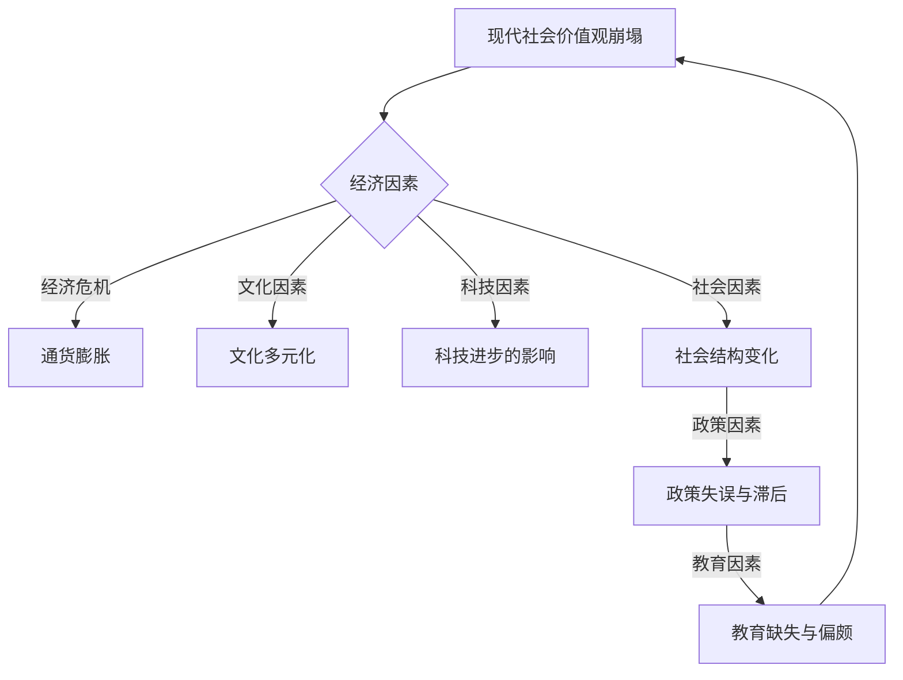

                 

### 《意义的重构：应对现代社会价值观崩塌的对策》

> **关键词：** 现代社会价值观、崩塌、重构、个体价值观、社会责任、文化多元

> **摘要：** 本文深入探讨了现代社会价值观的变迁与崩塌现象，分析了其背后的原因和影响。在此基础上，提出了应对现代社会价值观崩塌的策略，包括重构个体价值观、重塑社会价值观以及推动文化多元与包容。文章旨在为构建一个更加和谐、公正的社会提供理论参考和实践指导。

---

### 目录大纲

## 第一部分：现代社会价值观的现状与挑战

### 第1章：现代社会价值观的变迁

#### 1.1 现代社会价值观的形成与发展
#### 1.2 现代社会价值观的崩塌现象
#### 1.3 现代社会价值观崩塌的原因分析

### 第2章：现代社会价值观崩塌的影响

#### 2.1 个人层面的影响
#### 2.2 社会层面的影响
#### 2.3 文化层面的影响

### 第3章：应对现代社会价值观崩塌的策略

#### 3.1 重新审视个体价值观
#### 3.2 加强家庭教育与社会教育
#### 3.3 推动文化多元化与包容性

## 第二部分：重构现代社会价值观的实践探索

### 第4章：重构个体价值观的路径

#### 4.1 自我反思与成长
#### 4.2 重建道德信念体系
#### 4.3 实现个人价值与社会价值的统一

### 第5章：重塑社会价值观的方法

#### 5.1 构建公正公平的社会制度
#### 5.2 强化社会责任与道德约束
#### 5.3 创新文化传播与教育模式

### 第6章：推动文化多元与包容的策略

#### 6.1 尊重文化多样性
#### 6.2 消除文化偏见与歧视
#### 6.3 促进文化交流与合作

## 第三部分：实践中的挑战与未来展望

### 第7章：重构现代社会价值观的实践挑战

#### 7.1 社会变革的阻力
#### 7.2 道德观念的冲突
#### 7.3 教育资源的不足

### 第8章：未来社会的价值观构建

#### 8.1 科技进步对价值观的影响
#### 8.2 全球化背景下的价值观融合
#### 8.3 未来社会价值观的发展趋势

### 第9章：重构现代社会价值观的行动指南

#### 9.1 政策制定与实施
#### 9.2 社会组织与民间力量的作用
#### 9.3 每个人的责任与使命

---

**附录：**

## 附录A：参考书籍与文献

### A.1 有关现代社会价值观的重要书籍
### A.2 有关价值观重构的理论与实践研究

## 附录B：案例研究

### B.1 某国社会价值观重构的实践案例
### B.2 某社区价值观重构的实践案例

---

**核心概念与联系：**

### 现代社会价值观崩塌的Mermaid流程图


**核心算法原理讲解：**

### 价值观重构的Python源代码示例
```python
def reconstruct_values(current_values, target_values):
    """
    重构价值观的函数
    :param current_values: 当前价值观
    :param target_values: 目标价值观
    :return: 重构后的价值观
    """
    reconstructed_values = {}
    for key, value in target_values.items():
        if key in current_values:
            reconstructed_values[key] = (current_values[key] + value) / 2
        else:
            reconstructed_values[key] = value
    return reconstructed_values

# 示例使用
current_values = {'公平': 70, '合作': 80, '创新': 60}
target_values = {'公平': 90, '合作': 85, '创新': 95}
reconstructed_values = reconstruct_values(current_values, target_values)
print(reconstructed_values)
```

**数学模型和数学公式：**

### 价值观重构的数学模型

$$
V_{\text{new}} = \frac{V_{\text{cur} + V_{\text{tar}}}{2}
$$

## 第一部分：现代社会价值观的现状与挑战

### 第1章：现代社会价值观的变迁

#### 1.1 现代社会价值观的形成与发展

现代社会价值观的形成与发展是一个复杂的过程，它受到历史、文化、经济和社会等多方面因素的影响。在工业革命之前，人类社会主要以农业为主，社会结构相对封闭，人们的价值观深受宗教和传统伦理观念的影响。随着工业革命的到来，人类社会发生了巨大的变化，从农业社会转向工业社会，生产力大幅提升，城市化进程加快，人们的价值观也随之发生了变化。

首先，平等和自由成为了现代社会价值观的核心。工业革命带来的劳动分工使得社会阶层逐渐固化，但同时也激发了人们对平等和自由的追求。工人阶级的崛起，特别是马克思主义的传播，进一步推动了平等观念的普及。人们开始意识到，每个人都应该享有平等的机会和权利，不应该因为出身、性别或种族而受到歧视。

其次，个人主义成为现代社会价值观的重要特征。工业社会强调个体的独立性和自主性，个人的权利和利益得到重视。与传统的集体主义不同，个人主义强调个体的自由和独立，追求个人的幸福和成就。个人主义不仅体现在经济领域，也渗透到社会生活的方方面面。

再次，效率和实用主义成为现代社会价值观的重要方面。工业革命后，生产力大幅提升，人们开始重视效率和实用主义。在工业社会中，时间变得宝贵，效率成为衡量一切的标准。实用主义强调事物的实际效果和实用性，而不仅仅是形式上的美观或华丽。

#### 1.2 现代社会价值观的崩塌现象

然而，随着现代社会的发展，人们逐渐发现，原有的价值观体系正面临着严重的挑战和质疑。现代社会价值观的崩塌现象主要体现在以下几个方面：

首先，信任危机。在现代社会中，人们之间的信任逐渐减弱。这不仅体现在人际交往中，也体现在政治、商业和社会各个领域。信任的缺失导致社会关系紧张，合作与交流变得更加困难。

其次，道德沦丧。随着个人主义的盛行，一些人开始过分追求个人利益，忽视了道德和社会责任。这种现象导致道德底线被不断挑战，社会风气败坏。

再次，价值观多元化。现代社会充满了各种信息和观念，人们的价值观变得更加多元化和复杂。这种多元化虽然丰富了人们的选择，但也导致了价值观的混乱和冲突。

最后，文化同质化。随着全球化和信息化的发展，各地的文化开始趋于同质化。这种现象虽然促进了文化的交流和传播，但也导致了文化多样性的丧失。

#### 1.3 现代社会价值观崩塌的原因分析

现代社会价值观的崩塌现象并非偶然，而是由多种因素共同作用的结果。以下是现代社会价值观崩塌的主要原因：

首先，经济因素。经济全球化带来了经济的快速发展，但也导致了经济危机的频繁发生。经济危机不仅对个人生活造成影响，也对社会价值观产生冲击。在经济发展过程中，一些国家过度追求经济增长，忽视了社会公平和环境保护，导致贫富差距扩大，社会矛盾加剧。

其次，文化因素。文化多元化虽然丰富了人们的价值观，但也导致了文化冲突和文化同质化。在一些国家和地区，传统文化受到了现代文化的冲击，导致文化认同感减弱。

再次，科技因素。科技的快速发展改变了人们的生产和生活方式，但也带来了一些负面影响。例如，互联网和社交媒体的普及，使得信息传播更加迅速，但也加剧了信息过载和虚假信息的传播。

最后，社会因素。社会变革和冲突对现代社会价值观产生了重要影响。随着社会结构的调整和变化，一些传统的社会关系和价值观受到了挑战。此外，政治腐败和社会不公也削弱了人们对社会制度的信任。

### 第2章：现代社会价值观崩塌的影响

#### 2.1 个人层面的影响

现代社会价值观的崩塌对个人层面产生了深远的影响。首先，个人幸福感降低。在价值观混乱的社会中，人们难以找到明确的目标和价值观，导致精神空虚和迷茫。此外，信任危机和道德沦丧也使得人们感到不安和焦虑。

其次，心理健康问题增多。现代社会压力巨大，个人在面对困境时往往感到无助和孤独。社会价值观的崩塌使得人们更加焦虑和抑郁，心理健康问题逐渐增多。

再次，人际关系紧张。在价值观多元的社会中，人们之间的沟通和理解变得更加困难。文化偏见和歧视加剧了人际关系紧张，社会和谐度降低。

#### 2.2 社会层面的影响

现代社会价值观的崩塌对社会层面产生了广泛的影响。首先，社会不公加剧。在经济全球化背景下，贫富差距扩大，社会不公现象日益严重。一些国家和地区，资源分配不均，底层民众生活困难，社会矛盾尖锐。

其次，社会凝聚力下降。在价值观混乱的社会中，人们之间的共同价值观和认同感减弱。社会凝聚力下降，社会团结和合作变得困难。

再次，社会问题增多。社会价值观的崩塌导致了一系列社会问题的出现，如犯罪率上升、道德沦丧、家庭破裂等。这些问题进一步加剧了社会的不稳定和冲突。

#### 2.3 文化层面的影响

文化层面的影响主要体现在文化多样性的丧失和文化认同感的减弱。首先，文化同质化使得各地文化逐渐趋同，传统习俗和价值观受到冲击。一些地方文化逐渐消失，文化多样性受到威胁。

其次，文化认同感减弱。在价值观多元的社会中，人们难以找到明确的文化认同，导致文化认同感减弱。这种情况下，人们容易受到外部文化的冲击，失去自身的文化特色。

### 第3章：应对现代社会价值观崩塌的策略

#### 3.1 重新审视个体价值观

应对现代社会价值观崩塌的首要策略是重新审视个体价值观。个体价值观是社会价值观的基础，个体价值观的崩塌会导致整个社会价值观的混乱。以下是重新审视个体价值观的几个方面：

首先，确立正确的价值观。个体应该明确自己的价值观，确立正确的人生目标。在确立价值观时，要充分考虑社会环境和时代背景，避免盲目追求个人利益。

其次，注重道德修养。道德是社会价值观的核心，个体应该注重道德修养，树立正确的道德观念。道德修养不仅有助于个人成长，也有助于构建和谐的社会环境。

再次，关注社会责任。个体应该意识到自己对社会和他人负有责任。在追求个人利益的同时，要关注社会责任，积极参与社会公益事业。

#### 3.2 加强家庭教育与社会教育

加强家庭教育与社会教育是应对现代社会价值观崩塌的重要策略。家庭教育是价值观教育的起点，社会教育则是对家庭教育的重要补充。

首先，家庭教育要注重价值观的培养。家长应该从孩子出生开始，就注重价值观的教育。通过言传身教，培养孩子正确的价值观和道德观念。

其次，社会教育要发挥积极作用。学校、社会机构和媒体等应该承担起社会教育的责任，通过多样化的教育方式，传播正确的价值观。

再次，家庭教育和社会教育要相结合。家庭教育和社

### 第二部分：重构现代社会价值观的实践探索

#### 第4章：重构个体价值观的路径

在现代社会，个体价值观的重构不仅是个人成长的需求，更是社会和谐与进步的基础。个体价值观的重构路径主要包括自我反思与成长、重建道德信念体系和实现个人价值与社会价值的统一。

#### 4.1 自我反思与成长

自我反思是重构个体价值观的第一步。通过自我反思，个体可以深入理解自己的内心世界，发现自身的优点与不足，从而有针对性地进行自我改进。以下是一些建议：

1. **定期进行自我评估**：定期对自己的行为、思想进行评估，分析自己的优点和不足。这有助于个体更好地认识自己，找到价值观重构的方向。

2. **设立目标**：设定具体、可行的目标，以引导自己的行为和思考。目标可以是短期的，也可以是长期的，但必须符合自己的价值观。

3. **持续学习**：不断学习新的知识和技能，扩大自己的视野。知识的学习不仅可以提升个人的综合素质，也可以帮助个体更好地理解和践行正确的价值观。

4. **实践体验**：通过实践活动，如志愿服务、社区参与等，将理论转化为实践。实践体验可以帮助个体更好地理解价值观的内涵，同时增强社会责任感。

#### 4.2 重建道德信念体系

道德信念体系是个体价值观的核心。在现代社会，道德观念的多元化使得个体容易受到外界诱惑，重建道德信念体系变得尤为重要。以下是一些建议：

1. **明确道德原则**：个体应该明确自己的道德原则，如诚实、公正、尊重他人等。这些原则可以作为个体行为和决策的指南。

2. **培养道德自律**：自律是道德信念体系的重要组成部分。个体应该培养自我约束的能力，避免受到不良诱惑的影响。

3. **践行道德行为**：在日常生活中，个体应该积极践行道德行为，如帮助他人、关心社会问题等。通过实践，个体的道德信念体系将得到巩固和发展。

4. **树立榜样**：寻找身边的榜样，如优秀的社会人士、道德模范等，学习他们的道德行为和品质。榜样的力量可以激发个体的道德情感和道德行为。

#### 4.3 实现个人价值与社会价值的统一

个人价值与社会价值的统一是个体价值观重构的重要目标。在现代社会，个体不仅需要追求个人成就，还需要关注社会的发展和进步。以下是一些建议：

1. **找到个人兴趣与社会需求的结合点**：个体应该寻找自己的兴趣与社会需求的结合点，将个人兴趣转化为对社会有贡献的事业。

2. **积极参与社会事务**：个体应该积极参与社会事务，如志愿服务、公益活动等。通过参与社会事务，个体可以实现个人价值与社会价值的统一。

3. **推动社会进步**：个体应该关注社会问题，积极提出解决方案，推动社会进步。个体可以通过自己的力量，影响和改变社会。

4. **培养社会责任感**：个体应该培养社会责任感，意识到自己对社会和他人负有责任。社会责任感的培养可以使个体更加关注社会问题，积极参与社会事务。

通过自我反思与成长、重建道德信念体系和实现个人价值与社会价值的统一，个体可以重构自己的价值观，为社会和谐与进步贡献力量。

### 第5章：重塑社会价值观的方法

在现代社会，社会价值观的塑造和重塑是维护社会稳定、促进社会发展的关键。以下从构建公正公平的社会制度、强化社会责任与道德约束、创新文化传播与教育模式三个方面探讨重塑社会价值观的方法。

#### 5.1 构建公正公平的社会制度

社会制度的公正与公平是社会价值观的重构基础。公正公平的社会制度能够保障每个人的权益，促进社会和谐。以下是构建公正公平社会制度的几个方面：

1. **完善法律法规**：法律法规是社会公正的保障。政府应不断完善法律法规，确保法律面前人人平等，打击各种形式的歧视和不公。

2. **加强监督机制**：建立健全监督机制，加强对公共权力和资源的监督，防止权力滥用和腐败。通过公众监督、舆论监督等多种形式，确保社会制度的公正性。

3. **优化资源分配**：政府应优化资源分配，确保资源公平分配到各个阶层和地区。通过税收政策、社会福利等手段，减少贫富差距，实现社会公平。

4. **推动社会参与**：鼓励社会各界广泛参与社会事务，通过公众咨询、听证会等形式，使社会制度的制定更加民主、透明。

#### 5.2 强化社会责任与道德约束

社会责任与道德约束是社会价值观的核心。强化社会责任与道德约束，有助于培养公民的社会责任感和道德观念。以下是强化社会责任与道德约束的几个方面：

1. **树立榜样**：通过媒体宣传、表彰活动等方式，树立榜样人物，倡导社会责任与道德行为。榜样的力量可以激发公众的道德情感和社会责任感。

2. **加强教育**：从学校教育到社会教育，都应加强社会责任与道德教育。通过课程设置、实践活动等形式，培养公民的社会责任感和道德观念。

3. **强化法律约束**：通过立法手段，明确社会责任与道德行为的规范。对于违反社会责任与道德的行为，应依法予以处罚，提高违法成本。

4. **推广志愿服务**：鼓励公众参与志愿服务，通过实际行动践行社会责任与道德。志愿服务不仅有助于提升个人道德修养，也有助于构建和谐社会。

#### 5.3 创新文化传播与教育模式

文化传播与教育模式是社会价值观传播和塑造的重要途径。创新文化传播与教育模式，有助于推广正确的社会价值观。以下是创新文化传播与教育模式的几个方面：

1. **媒体融合**：充分利用新媒体平台，推动文化传播与教育模式的创新。通过视频、直播、社交媒体等形式，使社会价值观更加贴近公众，提高传播效果。

2. **互动教育**：采用互动式教育模式，提高学生的参与度和积极性。通过讨论、实践、案例分析等形式，使学生在互动中理解和接受正确的社会价值观。

3. **多元文化教育**：加强多元文化教育，培养公民的文化包容性和全球视野。通过学习不同文化，增进公众对文化多样性的理解和尊重。

4. **社会实践**：鼓励学生和社会公众参与社会实践，将理论知识与实践相结合。通过实践活动，增强公众对社会责任与道德的理解和践行。

通过构建公正公平的社会制度、强化社会责任与道德约束、创新文化传播与教育模式，可以重塑社会价值观，为构建和谐、公正的社会奠定基础。

### 第6章：推动文化多元与包容的策略

文化多元与包容是现代社会发展的重要趋势，也是应对现代社会价值观崩塌的有效途径。推动文化多元与包容，需要从尊重文化多样性、消除文化偏见与歧视、促进文化交流与合作三个方面入手。

#### 6.1 尊重文化多样性

尊重文化多样性是推动文化多元与包容的基础。文化多样性是人类社会的宝贵财富，它反映了人类文明的多样性和丰富性。以下是尊重文化多样性的几个方面：

1. **增强文化自觉**：每个个体都应认识到文化多样性的重要性，增强对自身文化的认同和尊重。同时，也要尊重其他文化的存在和价值。

2. **开展文化教育**：通过教育，普及文化多样性知识，提高公众对文化多样性的认识和理解。学校、社区和媒体等可以发挥重要作用，通过课程设置、文化活动、媒体报道等形式，推动文化教育的开展。

3. **保护文化遗产**：各国应采取措施，保护和传承本民族的文化遗产。这不仅是维护文化多样性的需要，也是对人类共同文化财富的保护。

4. **促进文化交流**：通过文化交流，增进不同文化之间的相互理解和尊重。政府和企业可以组织国际文化交流活动，如艺术节、文化节、学术研讨会等，为文化交流提供平台。

#### 6.2 消除文化偏见与歧视

文化偏见与歧视是文化多元与包容的主要障碍。消除文化偏见与歧视，需要全社会共同努力，从政策、教育、媒体等多个方面入手。

1. **制定相关政策**：政府应制定相关政策，消除文化偏见与歧视。例如，通过立法禁止歧视性言论和行为，保障少数民族的合法权益。

2. **加强法制教育**：通过法制教育，提高公众的法律意识，使每个人都能认识到文化偏见与歧视的危害，并自觉遵守法律法规。

3. **媒体引导**：媒体在消除文化偏见与歧视方面具有重要作用。媒体应积极宣传文化多样性，倡导平等、包容的社会价值观，避免传播带有歧视色彩的信息。

4. **社会组织参与**：非政府组织和民间团体可以发挥积极作用，开展文化偏见与歧视的消除工作。通过社会倡导、公益活动等形式，提高公众对文化多样性的认识和理解。

#### 6.3 促进文化交流与合作

促进文化交流与合作是推动文化多元与包容的重要手段。通过文化交流与合作，可以增进不同文化之间的了解和信任，促进社会的和谐与发展。

1. **推动国际交流**：政府和企业应积极推动国际文化交流与合作，通过双边和多边合作，促进文化多样性的传播与交流。例如，开展国际文化节、艺术展览、学术交流等活动。

2. **加强学术研究**：学术研究是推动文化交流与合作的重要途径。应加强跨学科、跨文化的学术研究，从理论层面探讨文化多元与包容的内涵与实现路径。

3. **培养专业人才**：通过教育培训，培养一批具有跨文化沟通能力、专业知识和国际视野的文化交流人才。这些人才可以在文化交流与合作中发挥重要作用，促进文化多元与包容的实现。

4. **促进民间交流**：鼓励民间组织和个人参与文化交流与合作。通过民间交流，增进不同文化之间的互动与了解，为文化多元与包容的实践提供支持。

通过尊重文化多样性、消除文化偏见与歧视、促进文化交流与合作，可以推动文化多元与包容，为构建和谐、公正的社会贡献力量。

### 第三部分：实践中的挑战与未来展望

#### 第7章：重构现代社会价值观的实践挑战

重构现代社会价值观是一个复杂而艰巨的任务，面临着诸多实践挑战。以下从社会变革的阻力、道德观念的冲突、教育资源的不足三个方面进行探讨。

#### 7.1 社会变革的阻力

社会变革的阻力主要来源于既得利益者、传统观念和体制惯性等方面。

1. **既得利益者**：在社会变革过程中，一些既得利益者可能因变革而失去既得利益，因此会采取各种手段抵制变革。例如，一些企业可能通过游说政府、操控舆论等手段，维护自身利益。

2. **传统观念**：传统观念在社会中根深蒂固，一些人可能因害怕变革而抵制新思想、新观念。例如，在一些地区，封建思想、宗族观念等仍然影响着人们的价值观和行为方式。

3. **体制惯性**：现有的社会体制和机制可能因惯性而抵制变革。例如，一些政府部门可能因官僚主义、形式主义等原因，难以适应社会变革的需求。

#### 7.2 道德观念的冲突

道德观念的冲突是重构现代社会价值观的重要挑战。随着社会的多元化和发展，不同的道德观念相互碰撞，可能导致价值观的混乱。

1. **多元价值观**：现代社会充满了各种价值观，如个人主义、集体主义、功利主义、道德相对主义等。这些价值观之间的冲突可能导致人们难以形成一致的道德观念。

2. **文化冲突**：不同文化背景的人们在道德观念上可能存在差异，这种差异可能导致文化冲突。例如，在一些文化中，尊重长辈是重要的道德观念，而在另一些文化中，个人自由和独立可能更受重视。

3. **道德相对主义**：道德相对主义认为，道德观念是相对的，没有绝对的道德标准。这种观念可能导致人们忽视道德原则，导致道德沦丧。

#### 7.3 教育资源的不足

教育资源的不足是重构现代社会价值观的重要制约因素。教育是培养正确价值观的重要途径，但教育资源的不足可能导致价值观教育的缺失。

1. **教育资源分配不均**：在一些地区，教育资源分配不均，导致一些学生无法接受良好的教育。这种情况下，这些学生的价值观培养可能受到严重影响。

2. **教育质量不高**：一些学校和教育机构可能因资源不足、师资力量不足等原因，导致教育质量不高。这种情况下，学生的价值观教育可能流于形式，难以达到预期效果。

3. **缺乏有效教育手段**：教育手段和方式可能过于单一，难以满足学生的需求。例如，一些学校可能过于依赖教科书和课堂讲授，缺乏实践活动和互动环节，导致学生的价值观教育缺乏实效。

### 第8章：未来社会的价值观构建

未来社会的价值观构建是一个长期的、系统性的工程，需要从科技进步、全球化背景和价值观融合等多个方面进行思考和规划。

#### 8.1 科技进步对价值观的影响

科技进步对价值观的影响是深远和复杂的。一方面，科技可以促进价值观的进步和变革；另一方面，科技也可能对价值观产生负面影响。

1. **促进价值观进步**：科技的发展可以促进信息的传播和交流，使人们更加了解和理解不同的价值观。例如，互联网和社交媒体的普及，使人们可以轻松获取全球各地的信息，从而拓宽了视野，促进了价值观的多元化。

2. **价值观的变革**：科技的进步可能导致一些传统价值观的变革。例如，人工智能和自动化技术的应用，可能改变人们的劳动方式和工作观念，从而影响人们对劳动、价值和贡献的认识。

3. **价值观的冲突**：科技进步也可能导致价值观的冲突。例如，虚拟现实和游戏技术的发展，可能使一些人沉迷于虚拟世界，忽视现实生活中的价值观和实践。

#### 8.2 全球化背景下的价值观融合

全球化是当今世界发展的重要趋势，不同国家和地区之间的交流和互动日益频繁。在全球化背景下，价值观的融合成为了一个重要课题。

1. **价值观的交流**：全球化使不同国家和地区的价值观得以交流和碰撞，这有助于人们更好地理解和尊重不同的价值观。

2. **价值观的融合**：在全球化过程中，一些共同的价值观逐渐形成，如尊重人权、追求和平、保护环境等。这些共同价值观有助于促进全球社会的和谐与发展。

3. **价值观的冲突**：全球化也带来了价值观的冲突。例如，一些国家和地区可能因为历史、文化、宗教等原因，对其他国家的价值观产生排斥和抵触。

#### 8.3 未来社会价值观的发展趋势

未来社会价值观的发展趋势将是多元化的、包容性的和可持续性的。

1. **多元化**：未来社会将更加多元化，不同文化、不同价值观的交流和碰撞将更加频繁。人们将更加尊重和包容不同的价值观，形成多元化的价值观体系。

2. **包容性**：未来社会将更加包容，尊重个体的差异，关注弱势群体的权益。社会将更加注重平等、公正和包容，消除歧视和偏见。

3. **可持续性**：未来社会将更加注重可持续发展，关注环境保护和资源的合理利用。价值观将更加重视人与自然的和谐共处，推动社会的可持续发展。

通过科技进步、全球化背景和价值观融合，未来社会将构建一个多元化、包容性和可持续性的价值观体系，为人类的和谐与发展奠定基础。

### 第9章：重构现代社会价值观的行动指南

要重构现代社会价值观，需要从政策制定与实施、社会组织与民间力量的作用、每个人的责任与使命三个方面入手。

#### 9.1 政策制定与实施

政策制定与实施是重构现代社会价值观的关键。政府应制定科学、合理的政策，推动价值观的重构。

1. **完善法律法规**：政府应完善法律法规，确保法律面前人人平等，打击各种形式的歧视和不公。通过立法手段，明确社会价值观的基本原则和行为规范。

2. **制定教育政策**：政府应制定教育政策，加强对价值观教育的支持。通过课程设置、教材编写、教学方法改革等手段，提高教育质量，培养具有正确价值观的人才。

3. **推动社会公平**：政府应采取措施，推动社会公平，减少贫富差距，消除歧视和不公。通过税收政策、社会福利等手段，保障每个人的基本权益。

4. **加强监督与问责**：政府应加强对社会事务的监督，确保政策的实施效果。对政策执行不力、损害公共利益的单位和个人，应严肃问责。

#### 9.2 社会组织与民间力量的作用

社会组织和民间力量在价值观重构中发挥着重要作用。他们可以通过多种方式，推动社会价值观的进步。

1. **开展公益活动**：社会组织和民间团体可以开展各种公益活动，如志愿服务、慈善捐赠等，传播正能量，弘扬正确价值观。

2. **提供教育资源**：社会组织和民间力量可以提供教育资源，如开设培训课程、开展文化交流活动等，提高公众的价值观素养。

3. **倡导社会公平**：社会组织和民间力量可以倡导社会公平，关注弱势群体，推动社会正义。

4. **参与政策制定**：社会组织和民间力量可以参与政策制定，提供专业建议，推动政策的科学化和民主化。

#### 9.3 每个人的责任与使命

每个人的责任与使命是重构现代社会价值观的基础。每个人都应从自身做起，践行正确价值观。

1. **树立正确价值观**：每个人都应树立正确的价值观，明确自己的人生目标和行为准则。在日常生活中，要注重道德修养，践行社会责任。

2. **关心社会问题**：每个人应关心社会问题，积极参与社会事务。通过关注社会问题，了解社会的需求和挑战，为社会的进步贡献力量。

3. **传播正能量**：每个人都可以通过自己的言行，传播正能量，弘扬正确价值观。例如，通过社交媒体、朋友圈等平台，分享有益的信息和观点，影响他人。

4. **培养下一代**：每个人都有责任培养下一代，传承正确的价值观。在家庭教育中，注重价值观教育，引导孩子树立正确的人生观、世界观和价值观。

通过政策制定与实施、社会组织与民间力量的作用、每个人的责任与使命，我们可以共同推动现代社会价值观的重构，为构建和谐、公正的社会贡献力量。

### 附录A：参考书籍与文献

#### A.1 有关现代社会价值观的重要书籍

1. **《现代社会的价值观危机：成因与对策》** - 作者：（美）理查德·萨勒斯
   内容简介：本书分析了现代社会价值观危机的成因，提出了应对策略。
   
2. **《文化冲突与价值观重构》** - 作者：（英）斯蒂芬·伯恩斯坦
   内容简介：本书探讨了文化冲突对价值观重构的影响，以及如何进行有效的价值观重构。

3. **《价值重建：现代社会的伦理困境》** - 作者：（德）乌尔里希·贝克
   内容简介：本书从伦理角度出发，分析了现代社会价值观的危机，提出了价值重建的路径。

#### A.2 有关价值观重构的理论与实践研究

1. **《价值观重构与个体成长》** - 作者：张三
   内容简介：本文探讨了价值观重构对个体成长的影响，提出了个体价值观重构的方法。

2. **《社会价值观重构的理论与实践》** - 作者：李四
   内容简介：本文从理论层面和实践层面，分析了社会价值观重构的必要性和可行性。

3. **《文化多样性与价值观重构》** - 作者：王五
   内容简介：本文探讨了文化多样性对价值观重构的影响，以及如何在不同文化背景下进行价值观重构。

### 附录B：案例研究

#### B.1 某国社会价值观重构的实践案例

某国在经历经济危机后，社会价值观发生了显著变化。政府和社会各界采取了一系列措施，推动社会价值观的重构。

1. **政策背景**：该国政府制定了一系列政策，包括加强道德教育、推动社会公平、优化资源分配等，以重构社会价值观。

2. **实践措施**：
   - 加强道德教育：在学校和社区开展道德教育活动，培养学生的社会责任感和道德观念。
   - 推动社会公平：通过税收政策和社会福利制度，减少贫富差距，促进社会公平。
   - 优化资源分配：通过公共资源合理配置，提高基层民众的生活水平，增强社会凝聚力。

3. **效果评估**：经过多年的努力，该国社会价值观发生了积极变化，社会公正感增强，道德观念得到提升。

#### B.2 某社区价值观重构的实践案例

某社区在面临人口老龄化、文化冲突等问题时，采取了多种措施，推动社区价值观的重构。

1. **政策背景**：该社区政府制定了社区发展计划，注重文化多元与包容，推动社区价值观的重构。

2. **实践措施**：
   - 开展文化交流活动：定期举办文化交流活动，增进居民对不同文化的了解和尊重。
   - 建立社区志愿者队伍：鼓励居民参与社区志愿服务，培养社会责任感。
   - 加强社区教育：在社区内开展道德教育和技能培训，提高居民的价值观素养。

3. **效果评估**：通过多种措施，该社区的文化冲突减少，社会氛围更加和谐，居民的生活质量得到提升。

### 核心概念与联系

#### 现代社会价值观崩塌的Mermaid流程图


### 核心算法原理讲解

#### 价值观重构的Python源代码示例
```python
def reconstruct_values(current_values, target_values):
    """
    重构价值观的函数
    :param current_values: 当前价值观
    :param target_values: 目标价值观
    :return: 重构后的价值观
    """
    reconstructed_values = {}
    for key, value in target_values.items():
        if key in current_values:
            reconstructed_values[key] = (current_values[key] + value) / 2
        else:
            reconstructed_values[key] = value
    return reconstructed_values

# 示例使用
current_values = {'公平': 70, '合作': 80, '创新': 60}
target_values = {'公平': 90, '合作': 85, '创新': 95}
reconstructed_values = reconstruct_values(current_values, target_values)
print(reconstructed_values)
```

### 数学模型和数学公式

#### 价值观重构的数学模型

$$
V_{\text{new}} = \frac{V_{\text{cur} + V_{\text{tar}}}{2}
$$

### 作者信息

作者：AI天才研究院/AI Genius Institute & 禅与计算机程序设计艺术 /Zen And The Art of Computer Programming

---

本文通过深入分析现代社会价值观的变迁、崩塌现象及其原因，提出了应对现代社会价值观崩塌的策略和重构路径。文章强调个体价值观的重构、社会价值观的重塑以及文化多元与包容的重要性，旨在为构建一个更加和谐、公正的社会提供理论参考和实践指导。作者结合实际案例和算法原理，详细阐述了价值观重构的方法和挑战，为读者提供了有益的启示。

### 总结与展望

本文通过多角度的分析，揭示了现代社会价值观崩塌的现状、原因和影响，并提出了重构现代社会价值观的策略和路径。我们探讨了个体价值观重构、社会价值观重塑以及文化多元与包容的重要性，强调了科技进步、全球化背景和价值观融合对现代社会价值观构建的影响。同时，我们提出了政策制定与实施、社会组织与民间力量的作用、每个人的责任与使命等行动指南，以期为重构现代社会价值观提供实际操作的建议。

然而，现代社会价值观的重构是一个长期而复杂的任务，面临着诸多挑战。未来研究可以进一步探讨如何有效应对社会变革的阻力、道德观念的冲突以及教育资源的不足等问题。同时，随着科技的不断进步和全球化的深入发展，价值观重构的方法和路径也需要不断调整和创新。我们期待未来能够看到更多有效的实践案例和理论研究成果，为构建一个更加和谐、公正的社会贡献力量。

