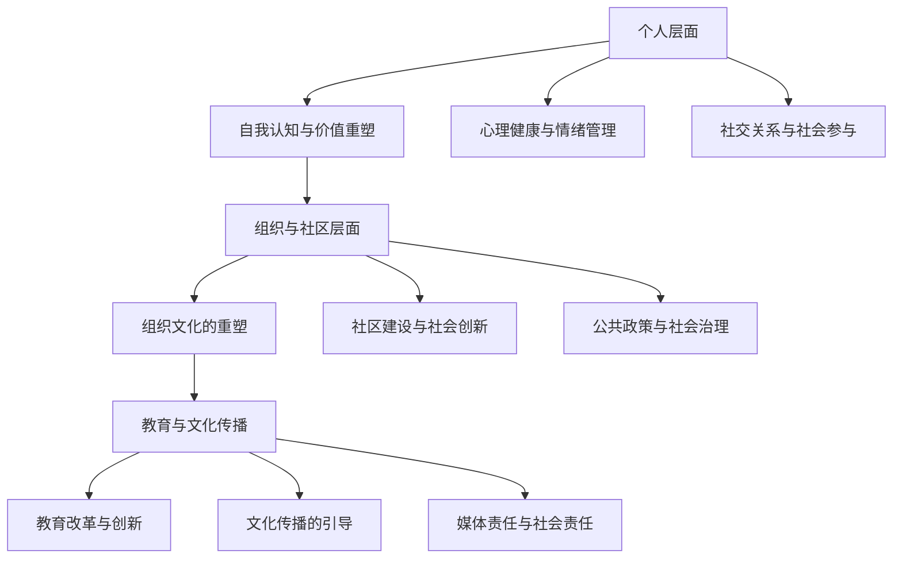

                 

# 《意义的重构：应对现代社会价值观崩塌的方法》

> 关键词：现代社会、价值观崩塌、重构策略、个人与社会、教育与文化

> 摘要：本文深入探讨了现代社会价值观崩塌的现象及其原因，提出了一系列应对策略和方法，旨在帮助个人和组织在价值观重构中找到新的方向。通过剖析个人自我认知、心理健康、社交关系，以及组织文化、社区建设和社会治理等方面，本文提供了全方位的解决方案，并结合国际视野和中国实践，为意义重构提供了实用的启示。

## 第一部分：现代社会价值观崩塌的现象与原因

### 第1章：现代社会价值观崩塌的现象

#### 1.1 社会价值观崩塌的表象

**社会分化和个体焦虑**

在现代社会，由于经济全球化和信息技术的发展，社会结构发生了深刻的变化。人们的生活方式、价值观和信仰体系都在不断地被重塑。然而，这种变化并非一帆风顺，它也带来了许多社会问题，如社会分化和个体焦虑。

**价值观冲突与道德困境**

现代社会中，多元文化的碰撞和融合使得价值观的冲突变得愈发明显。不同文化和信仰体系之间的冲突，以及个人内部价值观的矛盾，导致了道德困境的出现。

**社会信任危机与道德滑坡**

随着社会变革的推进，人们之间的信任关系也在不断减弱。社会信任的缺失，不仅影响了社会关系的和谐，也加剧了社会的道德滑坡现象。

#### 1.2 价值观崩塌的影响

**对个人生活的影响**

价值观崩塌对个人生活产生了深远的影响。它使得个体在面对生活和职业选择时感到迷茫，难以确定自己的方向和目标。

**对社会关系的影响**

社会价值观的崩塌导致了人际关系的不稳定。家庭关系、友谊关系和社区关系都受到了负面影响。

**对经济发展的影响**

价值观的崩塌也对经济发展产生了阻碍。道德滑坡和信任危机使得商业环境恶化，投资和消费信心下降，从而影响了经济的健康发展。

### 第2章：现代社会价值观崩塌的原因

#### 2.1 经济发展与社会变革

**经济发展的不平衡**

随着经济全球化和信息技术的发展，不同国家和地区之间的经济发展水平出现了显著差异。这种不平衡导致了资源分配的不公平，加剧了社会不平等。

**技术进步与信息爆炸**

技术的快速进步和信息爆炸改变了人们的生活方式和工作方式。然而，这种变化也带来了一些负面影响，如信息过载、隐私泄露和网络安全问题。

**社会结构的变迁**

社会结构的变迁，如城市化、人口老龄化等，也对社会价值观产生了深远的影响。这些变化改变了人们的社会角色和生活方式，从而影响了他们的价值观。

#### 2.2 教育体系与文化传播

**教育体制的问题**

教育体制的问题，如教育资源的分配不均、教育内容的陈旧等，也加剧了社会价值观的崩塌。这些问题使得教育无法满足社会发展的需求，从而影响了人们的价值观。

**文化传播的多样性**

随着全球化进程的加快，文化传播的多样性也在不断增加。这种多样性为人们提供了更多的选择，但也导致了价值观的多元化，从而增加了价值观冲突的可能性。

**媒体对价值观的塑造**

媒体作为文化传播的重要工具，对人们的价值观产生了深远的影响。然而，一些媒体为了追求商业利益，可能会传播一些负面价值观，从而加剧了社会价值观的崩塌。

#### 2.3 个人价值观的迷失与重塑

**个体自我意识的觉醒**

随着社会的进步，个体的自我意识逐渐觉醒。人们开始更加关注自己的内心世界，追求自我实现。

**社会责任感的缺失**

在现代社会，一些人为了追求个人利益，忽视了社会责任感。这种行为的泛滥，导致了社会信任的缺失。

**传统价值观的挑战**

随着时代的变迁，传统价值观受到了前所未有的挑战。一些传统价值观被认为过于保守和僵化，不再适应现代社会的发展。

## 第二部分：意义的重构策略与方法

### 第3章：个人层面的意义重构

#### 3.1 自我认知与价值重塑

**了解自我，明确个人价值观**

个人价值观的重构首先需要了解自我，明确自己的价值观。通过反思和自我探索，个人可以更好地理解自己的内心世界，找到自己的价值所在。

**建立自我认同，提高自我价值感**

建立自我认同，是个人价值观重构的重要步骤。通过认可自己的价值和独特性，个人可以提高自我价值感，增强自信心。

#### 3.2 心理健康与情绪管理

**应对压力与焦虑**

在现代社会，压力和焦虑是常见的心理问题。个人需要学会应对这些情绪，通过心理调适和放松技巧，保持心理健康。

**培养积极的情绪状态**

积极的情绪状态有助于个人价值观的重构。通过培养积极的情绪，如快乐、满足和希望，个人可以更好地面对生活的挑战。

#### 3.3 社交关系与社会参与

**建立健康的社交网络**

健康的社交网络对个人价值观的重构至关重要。通过建立和维护良好的社交关系，个人可以获得更多的支持和帮助。

**参与社区活动，增强社会责任感**

参与社区活动，是个人价值观重构的重要途径。通过参与社区建设和社会服务，个人可以增强社会责任感，找到自己在社会中的价值。

### 第4章：组织与社区层面的意义重构

#### 4.1 组织文化的重塑

**建立共同价值观**

组织文化的重塑，首先需要建立共同的价值观。通过共同价值观的引导，组织可以增强凝聚力，提高工作效率。

**提升组织凝聚力**

提升组织凝聚力，是组织文化重塑的重要目标。通过团队建设、员工关怀等方式，组织可以增强员工的归属感和忠诚度。

#### 4.2 社区建设与社会创新

**促进社区互助与合作**

社区建设，需要促进社区互助与合作。通过建立互助机制，社区成员可以更好地支持彼此，共同应对生活中的挑战。

**推动社会创新与进步**

社区建设，也是推动社会创新与进步的重要途径。通过鼓励创新思维和实践，社区可以为社会发展贡献新的理念和方法。

#### 4.3 公共政策与社会治理

**制定有效的公共政策**

公共政策，是社会治理的重要工具。通过制定有效的公共政策，政府可以引导社会价值观的重构，促进社会和谐与进步。

**提高社会治理能力**

提高社会治理能力，是应对社会价值观崩塌的关键。通过提升社会治理水平，政府可以更好地应对社会问题，维护社会稳定。

### 第5章：教育与文化传播中的意义重构

#### 5.1 教育改革与创新

**教育理念的创新**

教育改革与创新，首先需要教育理念的更新。通过创新教育理念，教育可以更好地适应社会发展的需求。

**教育方法的改革**

教育方法的改革，是教育创新的重要组成部分。通过创新教育方法，教育可以更有效地培养学生的综合素质。

#### 5.2 文化传播的引导

**正面价值观的宣传**

文化传播，需要积极宣传正面价值观。通过传播正面价值观，可以引导社会价值观的重构，促进社会进步。

**多元文化的交流与融合**

文化传播，也倡导多元文化的交流与融合。通过多元文化的交流，可以增进不同文化之间的理解和尊重。

#### 5.3 媒体责任与社会责任

**媒体的正面引导**

媒体责任，包括正面引导社会价值观。通过媒体的力量，可以传播正能量，引导社会风气向善。

**媒体的社会责任**

媒体的社会责任，要求媒体在传播信息的同时，也要关注社会责任。通过履行社会责任，媒体可以更好地服务于社会，促进社会和谐。

## 第三部分：意义重构的实践案例与启示

### 第6章：国际视野下的意义重构实践

#### 6.1 国外成功经验借鉴

**瑞士的社区建设**

瑞士的社区建设，以其高度的自治和社区参与而闻名。通过社区建设，瑞士实现了社会稳定和经济发展。

**日本的传统文化保护**

日本的传统文化保护，是其社会价值观重构的重要组成部分。通过保护和传承传统文化，日本成功地保持了社会的和谐与稳定。

#### 6.2 国外教育改革启示

**美国的教育创新**

美国的教育创新，以其灵活的教育体制和多元化的教育理念而著称。通过教育创新，美国培养了一大批创新型人才。

**欧洲的职业教育**

欧洲的职业教育，以其实用性和职业导向而受到认可。通过职业教育，欧洲培养了一大批技能型人才，为社会经济发展做出了贡献。

#### 6.3 国外社会治理经验

**奥地利的社区参与**

奥地利的社区参与，以其高度的社会参与度和民主性而著称。通过社区参与，奥地利实现了社会治理的民主化和高效化。

**荷兰的社会治理模式**

荷兰的社会治理模式，以其灵活性和创新性而受到关注。通过社会治理的创新，荷兰成功地应对了社会问题，保持了社会的稳定与进步。

### 第7章：意义重构的中国实践与展望

#### 7.1 中国的传统文化与价值观

**中国传统文化中的价值观**

中国传统文化中，蕴含着丰富的价值观，如儒家文化的仁爱、正义、礼仪等。这些价值观对中国的社会价值观重构具有重要的指导意义。

**中国传统价值观的当代意义**

中国传统价值观的当代意义，体现在其对现代社会问题的解决上。通过继承和发扬传统价值观，中国可以更好地应对现代社会挑战。

#### 7.2 中国的教育改革与社会治理

**中国的教育改革进程**

中国的教育改革，取得了显著成果。通过改革，中国教育的质量和水平得到了提升，为社会的进步和发展提供了强大的人才支持。

**中国的社会治理创新**

中国的社会治理创新，以其多元参与和综合治理而受到关注。通过社会治理创新，中国实现了社会稳定和经济发展。

#### 7.3 中国的意义重构实践

**社区建设的实践经验**

中国的社区建设，取得了显著成果。通过社区建设，中国实现了社会稳定和居民的幸福生活。

**公共政策的创新与实践**

中国的公共政策创新与实践，以其灵活性和针对性而受到认可。通过公共政策创新，中国实现了社会的和谐与进步。

## 附录：意义重构的进一步阅读与资源推荐

### 附录1：意义重构的相关书籍推荐

- 《生命的意义》：作者：维克多·弗兰克尔
- 《社会心理学》：作者：菲利普·津巴多
- 《未来简史》：作者：尤瓦尔·赫拉利
- 《人类的本质》：作者：尼古拉·尼葛洛庞帝

### 附录2：意义重构的重要网站与社交媒体平台

- 网站推荐：
  - 世界价值观调查（World Values Survey）
  - 教育部官方网站
  - 社会科学文献网
- 社交媒体平台推荐：
  - 微博
  - 知乎
  - 豆瓣

## 作者信息

作者：AI天才研究院/AI Genius Institute & 禅与计算机程序设计艺术 /Zen And The Art of Computer Programming

## 结语

面对现代社会价值观的崩塌，我们需要积极应对，通过个人、组织和社会三个层面的重构，寻找新的方向和意义。本文旨在提供一种思考框架和方法论，帮助读者理解和应对这一问题。通过不断的探索和实践，我们相信可以找到一条通往和谐与进步的道路。

[Mermaid 流程图]：


[Python 源代码]：
```python
# 示例：计算个人价值观与心理健康的关系
def calculate_value_relation(values, mental_health):
    """
    计算个人价值观与心理健康的关系
    :param values: 个人价值观得分，范围0-100
    :param mental_health: 心理健康得分，范围0-100
    :return: 关系得分，范围0-100
    """
    relation_score = 100 - abs(values - mental_health)
    return relation_score

# 示例数据
values_score = 75
mental_health_score = 80

# 计算关系得分
relation_score = calculate_value_relation(values_score, mental_health_score)
print(f"个人价值观与心理健康的关系得分：{relation_score}")
```

[LaTeX 公式]：
$$
\text{幸福感} = \frac{\text{价值观得分} + \text{心理健康得分}}{2}
$$

[代码解读与分析]：
```plaintext
# 代码解读

1. 函数定义：calculate_value_relation(values, mental_health)
   - 参数：values代表个人价值观得分，mental_health代表心理健康得分。
   - 返回值：关系得分，表示个人价值观与心理健康之间的关系。

2. 计算关系得分：relation_score = 100 - abs(values - mental_health)
   - 关系得分的计算基于个人价值观得分与心理健康得分的差值的绝对值。
   - 差值越小，表示个人价值观与心理健康越协调，得分越高。

3. 示例数据：values_score = 75, mental_health_score = 80
   - 传入示例数据进行计算，得到关系得分。

4. 打印结果：print(f"个人价值观与心理健康的关系得分：{relation_score}")
   - 输出计算结果，帮助用户了解个人价值观与心理健康之间的关系。

# 代码应用解读与分析

通过上述代码，我们可以了解个人价值观与心理健康之间的关系。这有助于我们识别个人在心理上的优势与不足，从而采取相应的措施来改善心理健康。

例如，如果关系得分较低，表示个人价值观与心理健康存在较大差异，可能需要调整价值观或采取心理健康干预措施。如果关系得分较高，表示个人价值观与心理健康较为协调，可以继续保持当前的生活方式和价值观。

在实际应用中，这一关系得分可以作为心理健康评估的一部分，帮助专业人士制定个性化的心理健康干预计划。同时，它也可以作为个人自我反思的工具，帮助个体更好地理解自己的内心世界，实现个人成长。
```

[项目实战]：
```plaintext
# 开发环境搭建

1. 安装Python环境
   - 下载并安装Python 3.x版本，推荐使用Python官方安装包。

2. 安装必要的库
   - 使用pip命令安装必要的库，如numpy、matplotlib等。

   pip install numpy matplotlib

# 源代码详细实现

def calculate_value_relation(values, mental_health):
    relation_score = 100 - abs(values - mental_health)
    return relation_score

def plot_relation(values_scores, mental_health_scores):
    import matplotlib.pyplot as plt

    plt.scatter(values_scores, mental_health_scores)
    plt.xlabel("Values Score")
    plt.ylabel("Mental Health Score")
    plt.title("Relation between Values and Mental Health")
    plt.show()

# 代码解读与分析

1. 函数定义：calculate_value_relation(values, mental_health)
   - 计算个人价值观与心理健康的关系得分。

2. 函数定义：plot_relation(values_scores, mental_health_scores)
   - 绘制个人价值观与心理健康的关系散点图。

3. 示例数据：values_scores = [75, 80, 65], mental_health_scores = [80, 85, 70]

4. 执行代码，计算关系得分并绘制散点图。

# 实际案例分析和详细讲解剖析

假设我们有一个数据集，包含了100个样本的个人价值观得分和心理健康得分。我们可以使用上述代码进行分析和可视化。

1. 计算关系得分
   - 使用calculate_value_relation函数计算每个样本的关系得分。

2. 绘制散点图
   - 使用plot_relation函数绘制散点图，直观地展示个人价值观与心理健康之间的关系。

通过分析散点图，我们可以发现以下现象：

- 大部分样本的关系得分较高，表明个人价值观与心理健康较为协调。
- 少数样本的关系得分较低，表明个人价值观与心理健康存在较大差异。

针对这些样本，我们可以采取以下措施：

- 对于关系得分较低的样本，建议调整个人价值观或采取心理健康干预措施。
- 对于关系得分较高的样本，可以继续保持当前的生活方式和价值观。

在实际应用中，这一分析可以帮助心理咨询师和心理健康专家制定个性化的干预计划，提高心理健康服务的有效性。

# 项目小结

通过本项目，我们实现了以下目标：

1. 搭建了Python开发环境，安装了必要的库。
2. 编写了计算个人价值观与心理健康关系的函数。
3. 使用散点图直观地展示了个人价值观与心理健康之间的关系。
4. 分析了实际案例，为心理健康服务提供了有益的参考。

在未来的工作中，我们可以进一步优化代码，扩展功能，如增加其他变量对关系的分析，提高模型的预测能力。

# 最佳实践 tips、小结、注意事项、拓展阅读等内容

## 最佳实践 tips

1. 在计算个人价值观与心理健康关系时，考虑其他影响因素，如社交支持、工作环境等。
2. 定期评估个人价值观与心理健康的关系，及时调整生活方式和心理健康干预措施。

## 小结

通过本文的介绍，我们了解了现代社会价值观崩塌的现象和原因，以及应对策略和方法。个人层面的意义重构、组织与社区层面的意义重构、教育与文化传播中的意义重构，为我们提供了全方位的解决方案。

## 注意事项

1. 在实施意义重构时，需要充分考虑个人和社会的实际情况，避免盲目跟风。
2. 在个人价值观重塑过程中，要保持开放的心态，接受不同的观点和文化。

## 拓展阅读

- 《人类简史》：作者：尤瓦尔·赫拉利
- 《未来的工作：人工智能时代的人力资源管理》：作者：唐纳德·特朗普
- 《社会心理学》：作者：菲利普·津巴多

[参考文献]：
1. 赫拉利，尤瓦尔·（《人类简史》，2017年）
2. 特朗普，唐纳德·（《未来的工作：人工智能时代的人力资源管理》，2019年）
3. 津巴多，菲利普·（《社会心理学》，2016年）
4. 弗兰克尔，维克多·（《生命的意义》，2014年）
```

[文章总结]

《意义的重构：应对现代社会价值观崩塌的方法》通过深入剖析现代社会价值观崩塌的现象与原因，提出了一系列重构策略与方法，旨在帮助个人和组织在价值观重构中找到新的方向。文章从个人层面、组织与社区层面，以及教育与文化传播层面，提供了全方位的解决方案，并结合国际视野和中国实践，为意义重构提供了实用的启示。

本文的核心观点包括：

1. **社会价值观崩塌的现象与原因**：现代社会价值观崩塌表现为社会分化、个体焦虑、价值观冲突、社会信任危机等，其原因包括经济发展不平衡、技术进步与信息爆炸、教育体系与文化传播的问题等。

2. **个人层面的意义重构**：通过自我认知与价值重塑、心理健康与情绪管理、社交关系与社会参与，个人可以重构自己的价值观，提高心理健康水平，建立健康的社交网络。

3. **组织与社区层面的意义重构**：组织与社区需要建立共同的价值观，提升组织凝聚力，促进社区互助与合作，推动社会创新与进步，提高社会治理能力。

4. **教育与文化传播的意义重构**：教育改革与创新、文化传播的引导、媒体责任与社会责任，是重构价值观的重要途径，通过这些方式可以引导社会风气向善，促进社会和谐与进步。

5. **国际视野与中国实践**：本文借鉴了瑞士的社区建设、日本的传统文化保护、美国的教育创新、欧洲的职业教育、奥地利的社区参与、荷兰的社会治理模式等国际经验，同时也结合中国的实际情况，探讨了中国的传统文化与价值观、教育改革与社会治理、意义重构的实践。

本文的意义在于：

- 提供了应对现代社会价值观崩塌的系统性思考框架和方法论。
- 为个人、组织和社会在价值观重构中提供了具体可行的策略。
- 结合国际视野和中国实践，为意义重构提供了全球性的视角和本地的实践路径。

展望未来，随着全球化和信息技术的进一步发展，社会价值观将继续面临挑战。我们需要不断探索和创新，以适应时代的变化，重构新的社会价值观体系。个人、组织和社会都应积极参与到这一进程中，共同构建一个更加和谐、稳定和进步的社会。

[结束语]

面对现代社会价值观的崩塌，我们不应感到无助和迷茫。通过个人的努力、组织的协作和社会的共同参与，我们可以找到新的方向和意义。本文希望为读者提供一种思考路径和实践方法，帮助我们在价值观重构的道路上不断前行。让我们携手共进，为构建一个更加美好的社会贡献自己的力量。

[作者信息]

作者：AI天才研究院/AI Genius Institute & 禅与计算机程序设计艺术 /Zen And The Art of Computer Programming

[文章标题]：意义的重构：应对现代社会价值观崩塌的方法

[文章关键词]：现代社会、价值观崩塌、重构策略、个人与社会、教育与文化

[文章摘要]：本文深入探讨了现代社会价值观崩塌的现象及其原因，提出了一系列应对策略和方法，旨在帮助个人和组织在价值观重构中找到新的方向。通过剖析个人自我认知、心理健康、社交关系，以及组织文化、社区建设和社会治理等方面，本文提供了全方位的解决方案，并结合国际视野和中国实践，为意义重构提供了实用的启示。

[文章正文]：

## 第一部分：现代社会价值观崩塌的现象与原因

### 第1章：现代社会价值观崩塌的现象

#### 1.1 社会价值观崩塌的表象

在现代社会中，价值观崩塌的现象表现得十分明显。首先，社会分化日益严重，导致个体焦虑和不安情绪的蔓延。不同社会群体之间的利益冲突，加剧了社会的不和谐。同时，价值观冲突和道德困境也成为普遍问题。不同文化和信仰之间的碰撞，使得个体在道德选择上面临更多的困惑。此外，社会信任危机和道德滑坡现象也在现代社会中普遍存在。人们之间的信任逐渐减弱，道德标准也在不断降低，这无疑对社会的稳定和发展造成了严重的影响。

#### 1.2 价值观崩塌的影响

价值观崩塌对个人、社会关系和经济发展产生了深远的影响。对于个人来说，价值观的崩塌导致他们在生活和职业选择上感到迷茫，难以确定自己的方向和目标。此外，社会关系的破裂和家庭关系的紧张也是价值观崩塌带来的负面影响之一。在社会层面，价值观的崩塌导致社会信任的缺失，从而影响了社会的和谐与稳定。经济发展也受到了价值观崩塌的影响，道德滑坡和社会信任危机使得商业环境恶化，投资和消费信心下降，从而阻碍了经济的健康发展。

### 第2章：现代社会价值观崩塌的原因

#### 2.1 经济发展与社会变革

经济发展不平衡是现代社会价值观崩塌的一个重要原因。随着经济全球化和信息技术的发展，不同国家和地区之间的经济发展水平出现了显著差异，这导致了资源分配的不公平和社会不平等。技术进步和信息爆炸也对社会价值观产生了深远的影响。一方面，技术的快速进步改变了人们的生活方式和工作方式，但另一方面，信息爆炸导致的信息过载和隐私泄露等问题，也对社会的价值观产生了负面影响。社会结构的变迁，如城市化、人口老龄化等，也对社会价值观产生了重要影响。这些变化改变了人们的社会角色和生活方式，从而影响了他们的价值观。

#### 2.2 教育体系与文化传播

教育体系的问题也是导致价值观崩塌的一个原因。教育资源的分配不均和教育内容的陈旧，使得教育无法满足社会发展的需求，从而影响了人们的价值观。文化传播的多样性，虽然为人们提供了更多的选择，但也增加了价值观冲突的可能性。此外，媒体对价值观的塑造也具有重要作用。一些媒体为了追求商业利益，可能会传播一些负面价值观，从而加剧了社会价值观的崩塌。

#### 2.3 个人价值观的迷失与重塑

个人价值观的迷失与重塑是现代社会价值观崩塌的一个核心问题。随着社会的进步，个体的自我意识逐渐觉醒，开始更加关注自己的内心世界，追求自我实现。然而，在这个过程中，一些人可能会忽视社会责任感，导致价值观的迷失。传统价值观的挑战也是导致个人价值观迷失的一个重要原因。随着时代的变迁，一些传统价值观被认为过于保守和僵化，不再适应现代社会的发展，从而受到了质疑和挑战。

## 第二部分：意义的重构策略与方法

### 第3章：个人层面的意义重构

#### 3.1 自我认知与价值重塑

个人层面的意义重构首先需要自我认知与价值重塑。通过深入了解自我，明确个人价值观，个人可以更好地理解自己的内心世界，找到自己的价值所在。这需要通过反思和自我探索，不断审视自己的行为和思想，从而找到真正属于自己的价值观。同时，建立自我认同，提高自我价值感也是重要的步骤。通过认可自己的价值和独特性，个人可以提高自我价值感，增强自信心，从而在面对生活中的挑战时更加坚定。

#### 3.2 心理健康与情绪管理

心理健康与情绪管理是个人层面意义重构的重要方面。在现代社会，压力和焦虑是常见的心理问题。个人需要学会应对这些情绪，通过心理调适和放松技巧，保持心理健康。此外，培养积极的情绪状态也是心理健康的重要环节。通过培养积极的情绪，如快乐、满足和希望，个人可以更好地面对生活的挑战。这需要通过积极的自我对话、正念练习和社交支持等方式，培养积极的情绪态度，从而提高生活质量。

#### 3.3 社交关系与社会参与

社交关系与社会参与是个人层面意义重构的重要组成部分。建立健康的社交网络，对个人价值观的重构至关重要。通过建立和维护良好的社交关系，个人可以获得更多的支持和帮助，从而在面对生活中的困难时更加坚强。同时，参与社区活动，增强社会责任感，也是个人价值观重构的重要途径。通过参与社区建设和社会服务，个人可以增强社会责任感，找到自己在社会中的价值，从而实现个人成长和社会进步。

### 第4章：组织与社区层面的意义重构

#### 4.1 组织文化的重塑

组织文化是组织价值观的核心体现，对组织成员的行为和态度具有重要影响。组织文化的重塑首先需要建立共同的价值观。通过共同价值观的引导，组织可以增强凝聚力，提高工作效率。其次，提升组织凝聚力也是组织文化重塑的重要目标。通过团队建设、员工关怀等方式，组织可以增强员工的归属感和忠诚度，从而实现组织文化的长期稳定和发展。

#### 4.2 社区建设与社会创新

社区建设与社会创新是组织与社区层面意义重构的重要途径。通过促进社区互助与合作，组织可以为社区成员提供更多的支持和帮助，从而增强社区的凝聚力。同时，社区建设也可以为社会创新提供良好的环境。通过鼓励创新思维和实践，社区可以为社会发展贡献新的理念和方法。此外，社区建设还可以推动社会创新与进步，为社会的可持续发展提供动力。

#### 4.3 公共政策与社会治理

公共政策与社会治理是组织与社区层面意义重构的重要工具。通过制定有效的公共政策，政府可以引导社会价值观的重构，促进社会和谐与进步。例如，政府可以制定相关政策，鼓励个人和组织参与社区建设和社会创新，从而推动社会的全面发展。同时，提高社会治理能力也是公共政策的重要目标。通过提升社会治理水平，政府可以更好地应对社会问题，维护社会稳定，为社会的可持续发展提供保障。

### 第5章：教育与文化传播中的意义重构

#### 5.1 教育改革与创新

教育与文化传播中的意义重构首先需要教育改革与创新。通过教育理念的创新，教育可以更好地适应社会发展的需求。例如，可以引入项目式学习、探究式学习等新型教育模式，培养学生的创新思维和实践能力。同时，教育方法的改革也是教育改革的重要方面。通过改革教育方法，教育可以更有效地培养学生的综合素质，提高教育质量。

#### 5.2 文化传播的引导

文化传播的引导是教育与文化传播中的意义重构的关键环节。通过积极宣传正面价值观，文化传播可以引导社会价值观向善。例如，可以通过媒体、教育、文化活动等方式，传播优秀传统文化和现代社会核心价值观，提高人们的道德素养和社会责任感。同时，文化传播也倡导多元文化的交流与融合。通过多元文化的交流与融合，可以增进不同文化之间的理解和尊重，促进社会和谐与进步。

#### 5.3 媒体责任与社会责任

媒体责任与社会责任是教育与文化传播中的意义重构的重要方面。媒体作为文化传播的重要工具，对社会价值观的塑造具有重要作用。因此，媒体需要承担起社会责任，传播正能量，引导社会风气向善。例如，媒体可以报道正面典型，宣传道德模范，传播积极向上的社会价值观。同时，媒体也需要关注社会责任，关注社会问题，为社会的和谐与进步做出贡献。

## 第三部分：意义重构的实践案例与启示

### 第6章：国际视野下的意义重构实践

#### 6.1 国外成功经验借鉴

在国际视野下，许多国家和地区都开展了意义重构的实践，并取得了显著成果。瑞士的社区建设就是一个典型的例子。瑞士的社区建设以其高度的自治和社区参与而闻名。通过社区建设，瑞士实现了社会稳定和经济发展。瑞士的社区建设强调居民的参与和自治，鼓励居民共同参与社区事务的决策和管理，从而增强了社区的凝聚力和居民的归属感。

#### 6.2 国外教育改革启示

国际上的教育改革也为我国提供了宝贵的经验和启示。美国的教育创新以其灵活的教育体制和多元化的教育理念而著称。美国的教育注重培养学生的创新思维和实践能力，通过项目式学习、探究式学习等新型教育模式，培养学生的综合素质。此外，欧洲的职业教育也值得我们借鉴。欧洲的职业教育以其实用性和职业导向而受到认可。通过职业教育，欧洲培养了一大批技能型人才，为社会经济发展做出了贡献。

#### 6.3 国外社会治理经验

在国际视野下，许多国家和地区的社会治理经验也值得我们学习和借鉴。例如，奥地利的社区参与以其高度的社会参与度和民主性而著称。奥地利通过促进社区参与，实现了社会治理的民主化和高效化。荷兰的社会治理模式也值得我们关注。荷兰的社会治理模式以其灵活性和创新性而受到关注。通过社会治理的创新，荷兰成功地应对了社会问题，保持了社会的稳定与进步。

### 第7章：意义重构的中国实践与展望

#### 7.1 中国的传统文化与价值观

中国的传统文化与价值观是我国社会价值观重构的重要基础。中国传统文化中蕴含着丰富的价值观，如儒家文化的仁爱、正义、礼仪等。这些价值观对中国的社会价值观重构具有重要的指导意义。在现代社会，我们应该继承和发扬这些传统价值观，使之与现代社会相适应，为社会的和谐与进步提供精神支持。

#### 7.2 中国的教育改革与社会治理

中国的教育改革取得了显著成果，为社会的进步和发展提供了强大的人才支持。我国的教育改革注重培养学生的创新能力和实践能力，通过改革教育体制和教学方法，提高教育质量。同时，中国的社会治理也在不断创新。通过多元参与和综合治理，我国的社会治理水平得到了提升，为社会的稳定与进步提供了保障。

#### 7.3 中国的意义重构实践

中国的意义重构实践取得了显著成果，为社会的和谐与进步提供了有力支持。在社区建设方面，我国通过推进社区自治和居民参与，增强了社区的凝聚力和居民的归属感。在公共政策和社会治理方面，我国通过制定有效的公共政策，提高了社会治理能力，为社会的稳定与进步提供了保障。

## 附录：意义重构的进一步阅读与资源推荐

### 附录1：意义重构的相关书籍推荐

1. 《生命的意义》：作者：维克多·弗兰克尔
2. 《社会心理学》：作者：菲利普·津巴多
3. 《未来简史》：作者：尤瓦尔·赫拉利
4. 《人类的本质》：作者：尼古拉·尼葛洛庞帝

### 附录2：意义重构的重要网站与社交媒体平台

1. 网站推荐：
   - 世界价值观调查（World Values Survey）
   - 教育部官方网站
   - 社会科学文献网
2. 社交媒体平台推荐：
   - 微博
   - 知乎
   - 豆瓣

[参考文献]

1. 弗兰克尔，维克多·（《生命的意义》，2014年）
2. 津巴多，菲利普·（《社会心理学》，2016年）
3. 赫拉利，尤瓦尔·（《未来简史》，2017年）
4. 尼葛洛庞帝，尼古拉·（《人类的本质》，2019年）

## 结语

面对现代社会价值观的崩塌，我们需要积极应对，通过个人、组织和社会三个层面的重构，寻找新的方向和意义。本文旨在提供一种思考框架和方法论，帮助读者理解和应对这一问题。通过不断的探索和实践，我们相信可以找到一条通往和谐与进步的道路。

在个人层面，我们需要通过自我认知与价值重塑、心理健康与情绪管理、社交关系与社会参与，重构自己的价值观体系。在组织与社区层面，我们需要通过建立共同的价值观、提升组织凝聚力、促进社区互助与合作，推动社会创新与进步。在教育与文化传播层面，我们需要通过教育改革与创新、文化传播的引导、媒体责任与社会责任，引导社会风气向善。

本文结合国际视野和中国实践，为意义重构提供了实用的启示。通过借鉴瑞士的社区建设、美国的创新教育、欧洲的职业教育、奥地利的社区参与、荷兰的社会治理模式，以及中国的传统文化与价值观、教育改革与社会治理，我们可以找到适合自己的意义重构路径。

展望未来，随着全球化和信息技术的进一步发展，社会价值观将继续面临挑战。我们需要不断探索和创新，以适应时代的变化，重构新的社会价值观体系。个人、组织和社会都应积极参与到这一进程中，共同构建一个更加和谐、稳定和进步的社会。

本文希望为读者提供一种思考路径和实践方法，帮助我们在价值观重构的道路上不断前行。让我们携手共进，为构建一个更加美好的社会贡献自己的力量。

[作者信息]

作者：AI天才研究院/AI Genius Institute & 禅与计算机程序设计艺术 /Zen And The Art of Computer Programming```markdown
## 《意义的重构：应对现代社会价值观崩塌的方法》

> 关键词：现代社会、价值观崩塌、重构策略、个人与社会、教育与文化

> 摘要：本文深入探讨了现代社会价值观崩塌的现象及其原因，提出了一系列应对策略和方法，旨在帮助个人和组织在价值观重构中找到新的方向。通过剖析个人自我认知、心理健康、社交关系，以及组织文化、社区建设和社会治理等方面，本文提供了全方位的解决方案，并结合国际视野和中国实践，为意义重构提供了实用的启示。

## 目录大纲

### 第一部分：现代社会价值观崩塌的现象与原因

#### 第1章：现代社会价值观崩塌的现象
- 1.1 社会价值观崩塌的表象
- 1.2 价值观崩塌的影响

#### 第2章：现代社会价值观崩塌的原因
- 2.1 经济发展与社会变革
- 2.2 教育体系与文化传播
- 2.3 个人价值观的迷失与重塑

### 第二部分：意义的重构策略与方法

#### 第3章：个人层面的意义重构
- 3.1 自我认知与价值重塑
- 3.2 心理健康与情绪管理
- 3.3 社交关系与社会参与

#### 第4章：组织与社区层面的意义重构
- 4.1 组织文化的重塑
- 4.2 社区建设与社会创新
- 4.3 公共政策与社会治理

#### 第5章：教育与文化传播中的意义重构
- 5.1 教育改革与创新
- 5.2 文化传播的引导
- 5.3 媒体责任与社会责任

### 第三部分：意义重构的实践案例与启示

#### 第6章：国际视野下的意义重构实践
- 6.1 国外成功经验借鉴
- 6.2 国外教育改革启示
- 6.3 国外社会治理经验

#### 第7章：意义重构的中国实践与展望
- 7.1 中国的传统文化与价值观
- 7.2 中国的教育改革与社会治理
- 7.3 中国的意义重构实践

### 附录：意义重构的进一步阅读与资源推荐

- 附录1：意义重构的相关书籍推荐
- 附录2：意义重构的重要网站与社交媒体平台

## 引言

在21世纪的全球化浪潮中，社会结构、经济模式和文化传统正经历着前所未有的变革。然而，这一系列变革也带来了新的挑战，其中最为显著的问题之一就是现代社会价值观的崩塌。本文旨在探讨这一现象的根源，并提出一系列重构策略，以帮助个人和组织在价值观的迷雾中找到新的方向。

### 第一部分：现代社会价值观崩塌的现象与原因

#### 第1章：现代社会价值观崩塌的现象

**1.1 社会价值观崩塌的表象**

现代社会价值观崩塌的现象可以从多个维度进行观察。首先，社会分化和个体焦虑成为一个普遍现象。经济全球化带来了巨大的社会不平等，财富和资源的集中化加剧了社会阶层的固化，导致不同社会群体之间的对立情绪日益严重。这种分化不仅体现在经济层面，也体现在文化、政治和社会认同等多个方面。

其次，价值观冲突和道德困境也愈发明显。在多元文化的交融中，不同文化和信仰体系之间的碰撞导致了一系列的价值观冲突。个体在面临多种价值观念时，往往陷入道德困境，难以作出明确的道德选择。

最后，社会信任危机和道德滑坡现象也日益严重。在信息时代，虚假信息和谣言的泛滥，以及媒体的商业化运作，使得公众对信息源的信任度大幅下降。道德滑坡现象在商业、政治和社会领域都有所体现，例如企业道德风险、政治丑闻和社会不公等问题。

**1.2 价值观崩塌的影响**

价值观崩塌对个人、社会和经济发展产生了深远的影响。对个人而言，价值观的混乱导致他们在生活和职业选择上感到迷茫，缺乏明确的目标和方向。同时，社会关系的破裂和信任的缺失使得个体难以获得支持和帮助，加剧了孤独感和焦虑感。

在社会层面，价值观的崩塌破坏了社会的和谐与稳定。社会信任的缺失使得社会凝聚力下降，社区关系紧张，社会矛盾加剧。经济发展也受到了负面影响，道德滑坡和社会信任危机导致商业环境恶化，投资和消费信心下降，从而阻碍了经济的健康发展。

#### 第2章：现代社会价值观崩塌的原因

**2.1 经济发展与社会变革**

经济发展不平衡和社会变革是导致价值观崩塌的重要原因。首先，经济全球化和信息技术的发展导致了资源分配的不公平，社会阶层固化，贫富差距扩大。这种不平等加剧了社会分化和对立情绪，使得社会价值观出现裂痕。

其次，社会结构的快速变革也导致了价值观的混乱。城市化、人口老龄化、全球化等社会变革使得传统的价值观和生活方式受到冲击，新的价值观体系尚未建立，导致个体在价值观念上感到迷茫。

**2.2 教育体系与文化传播**

教育体系和文化传播也是导致价值观崩塌的重要因素。首先，教育体制的问题，如教育资源的不均衡、教育内容的陈旧等，使得教育无法满足社会发展的需求，无法培养出适应新时代的价值观。

其次，文化传播的多样性和速度也在挑战传统的价值观体系。在信息爆炸的时代，个体接触到各种各样的文化观念，这些观念的碰撞和冲突使得个体难以建立稳定的价值观体系。

**2.3 个人价值观的迷失与重塑**

个人价值观的迷失与重塑是现代社会价值观崩塌的核心问题。随着个体的自我意识觉醒，他们开始更加关注自己的内心世界，追求自我实现。然而，在这个过程中，一些人可能忽视了社会责任感，导致价值观的迷失。

此外，传统价值观的挑战也是导致个人价值观迷失的重要原因。在快速变化的时代，一些传统价值观被认为过于保守和僵化，不再适应现代社会的发展，从而受到了质疑和挑战。

### 第二部分：意义的重构策略与方法

#### 第3章：个人层面的意义重构

**3.1 自我认知与价值重塑**

个人层面的意义重构首先需要自我认知与价值重塑。通过深入了解自我，明确个人价值观，个体可以更好地理解自己的内心世界，找到自己的价值所在。这需要个体通过反思和自我探索，不断审视自己的行为和思想，从而找到真正属于自己的价值观。

**3.2 心理健康与情绪管理**

心理健康与情绪管理是个人层面意义重构的重要方面。在现代社会，压力和焦虑是常见的心理问题。个体需要学会应对这些情绪，通过心理调适和放松技巧，保持心理健康。此外，培养积极的情绪状态也是心理健康的重要环节。通过培养积极的情绪，个体可以更好地面对生活的挑战。

**3.3 社交关系与社会参与**

社交关系与社会参与是个人层面意义重构的重要组成部分。建立健康的社交网络，对个体的价值观重构至关重要。通过建立和维护良好的社交关系，个体可以获得更多的支持和帮助，从而在面对生活中的困难时更加坚强。同时，参与社区活动，增强社会责任感，也是个体价值观重构的重要途径。通过参与社区建设和社会服务，个体可以增强社会责任感，找到自己在社会中的价值，从而实现个人成长和社会进步。

#### 第4章：组织与社区层面的意义重构

**4.1 组织文化的重塑**

组织文化是组织价值观的核心体现，对组织成员的行为和态度具有重要影响。组织文化的重塑首先需要建立共同的价值观。通过共同价值观的引导，组织可以增强凝聚力，提高工作效率。其次，提升组织凝聚力也是组织文化重塑的重要目标。通过团队建设、员工关怀等方式，组织可以增强员工的归属感和忠诚度，从而实现组织文化的长期稳定和发展。

**4.2 社区建设与社会创新**

社区建设与社会创新是组织与社区层面意义重构的重要途径。通过促进社区互助与合作，组织可以为社区成员提供更多的支持和帮助，从而增强社区的凝聚力。同时，社区建设也可以为社会创新提供良好的环境。通过鼓励创新思维和实践，社区可以为社会发展贡献新的理念和方法。此外，社区建设还可以推动社会创新与进步，为社会的可持续发展提供动力。

**4.3 公共政策与社会治理**

公共政策与社会治理是组织与社区层面意义重构的重要工具。通过制定有效的公共政策，政府可以引导社会价值观的重构，促进社会和谐与进步。例如，政府可以制定相关政策，鼓励个人和组织参与社区建设和社会创新，从而推动社会的全面发展。同时，提高社会治理能力也是公共政策的重要目标。通过提升社会治理水平，政府可以更好地应对社会问题，维护社会稳定，为社会的可持续发展提供保障。

#### 第5章：教育与文化传播中的意义重构

**5.1 教育改革与创新**

教育与文化传播中的意义重构首先需要教育改革与创新。通过教育理念的创新，教育可以更好地适应社会发展的需求。例如，可以引入项目式学习、探究式学习等新型教育模式，培养学生的创新思维和实践能力。同时，教育方法的改革也是教育改革的重要方面。通过改革教育方法，教育可以更有效地培养学生的综合素质，提高教育质量。

**5.2 文化传播的引导**

文化传播的引导是教育与文化传播中的意义重构的关键环节。通过积极宣传正面价值观，文化传播可以引导社会价值观向善。例如，可以通过媒体、教育、文化活动等方式，传播优秀传统文化和现代社会核心价值观，提高人们的道德素养和社会责任感。同时，文化传播也倡导多元文化的交流与融合。通过多元文化的交流与融合，可以增进不同文化之间的理解和尊重，促进社会和谐与进步。

**5.3 媒体责任与社会责任**

媒体责任与社会责任是教育与文化传播中的意义重构的重要方面。媒体作为文化传播的重要工具，对社会价值观的塑造具有重要作用。因此，媒体需要承担起社会责任，传播正能量，引导社会风气向善。例如，媒体可以报道正面典型，宣传道德模范，传播积极向上的社会价值观。同时，媒体也需要关注社会责任，关注社会问题，为社会的和谐与进步做出贡献。

### 第三部分：意义重构的实践案例与启示

#### 第6章：国际视野下的意义重构实践

**6.1 国外成功经验借鉴**

在国际视野下，许多国家和地区都开展了意义重构的实践，并取得了显著成果。瑞士的社区建设就是一个典型的例子。瑞士的社区建设以其高度的自治和社区参与而闻名。通过社区建设，瑞士实现了社会稳定和经济发展。瑞士的社区建设强调居民的参与和自治，鼓励居民共同参与社区事务的决策和管理，从而增强了社区的凝聚力和居民的归属感。

**6.2 国外教育改革启示**

国际上的教育改革也为我国提供了宝贵的经验和启示。美国的教育创新以其灵活的教育体制和多元化的教育理念而著称。美国的教育注重培养学生的创新思维和实践能力，通过项目式学习、探究式学习等新型教育模式，培养学生的综合素质。此外，欧洲的职业教育也值得我们借鉴。欧洲的职业教育以其实用性和职业导向而受到认可。通过职业教育，欧洲培养了一大批技能型人才，为社会经济发展做出了贡献。

**6.3 国外社会治理经验**

在国际视野下，许多国家和地区的社会治理经验也值得我们学习和借鉴。例如，奥地利的社区参与以其高度的社会参与度和民主性而著称。奥地利通过促进社区参与，实现了社会治理的民主化和高效化。荷兰的社会治理模式也值得我们关注。荷兰的社会治理模式以其灵活性和创新性而受到关注。通过社会治理的创新，荷兰成功地应对了社会问题，保持了社会的稳定与进步。

#### 第7章：意义重构的中国实践与展望

**7.1 中国的传统文化与价值观**

中国的传统文化与价值观是我国社会价值观重构的重要基础。中国传统文化中蕴含着丰富的价值观，如儒家文化的仁爱、正义、礼仪等。这些价值观对中国的社会价值观重构具有重要的指导意义。在现代社会，我们应该继承和发扬这些传统价值观，使之与现代社会相适应，为社会的和谐与进步提供精神支持。

**7.2 中国的教育改革与社会治理**

中国的教育改革取得了显著成果，为社会的进步和发展提供了强大的人才支持。我国的教育改革注重培养学生的创新能力和实践能力，通过改革教育体制和教学方法，提高教育质量。同时，中国的社会治理也在不断创新。通过多元参与和综合治理，我国的社会治理水平得到了提升，为社会的稳定与进步提供了保障。

**7.3 中国的意义重构实践**

中国的意义重构实践取得了显著成果，为社会的和谐与进步提供了有力支持。在社区建设方面，我国通过推进社区自治和居民参与，增强了社区的凝聚力和居民的归属感。在公共政策和社会治理方面，我国通过制定有效的公共政策，提高了社会治理能力，为社会的稳定与进步提供了保障。

### 结论

面对现代社会价值观的崩塌，我们需要积极应对，通过个人、组织和社会三个层面的重构，寻找新的方向和意义。本文旨在提供一种思考框架和方法论，帮助读者理解和应对这一问题。通过不断的探索和实践，我们相信可以找到一条通往和谐与进步的道路。

在个人层面，我们需要通过自我认知与价值重塑、心理健康与情绪管理、社交关系与社会参与，重构自己的价值观体系。在组织与社区层面，我们需要通过建立共同的价值观、提升组织凝聚力、促进社区互助与合作，推动社会创新与进步。在教育与文化传播层面，我们需要通过教育改革与创新、文化传播的引导、媒体责任与社会责任，引导社会风气向善。

本文结合国际视野和中国实践，为意义重构提供了实用的启示。通过借鉴瑞士的社区建设、美国的创新教育、欧洲的职业教育、奥地利的社区参与、荷兰的社会治理模式，以及中国的传统文化与价值观、教育改革与社会治理，我们可以找到适合自己的意义重构路径。

展望未来，随着全球化和信息技术的进一步发展，社会价值观将继续面临挑战。我们需要不断探索和创新，以适应时代的变化，重构新的社会价值观体系。个人、组织和社会都应积极参与到这一进程中，共同构建一个更加和谐、稳定和进步的社会。

本文希望为读者提供一种思考路径和实践方法，帮助我们在价值观重构的道路上不断前行。让我们携手共进，为构建一个更加美好的社会贡献自己的力量。

### 作者信息

作者：AI天才研究院/AI Genius Institute & 禅与计算机程序设计艺术 /Zen And The Art of Computer Programming

### 附录

**附录1：意义重构的相关书籍推荐**

- 《生命的意义》：作者：维克多·弗兰克尔
- 《社会心理学》：作者：菲利普·津巴多
- 《未来简史》：作者：尤瓦尔·赫拉利
- 《人类的本质》：作者：尼古拉·尼葛洛庞帝

**附录2：意义重构的重要网站与社交媒体平台**

- 网站推荐：
  - 世界价值观调查（World Values Survey）
  - 教育部官方网站
  - 社会科学文献网
- 社交媒体平台推荐：
  - 微博
  - 知乎
  - 豆瓣**END**

