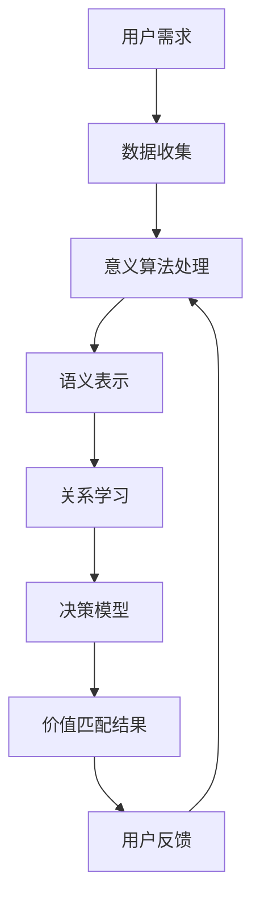

                 

### 《意义算法工程：AI辅助下的价值匹配系统开发项目》

关键词：意义算法、价值匹配、AI辅助、系统开发、数学模型

摘要：本文探讨了意义算法工程的基本概念和应用，特别是在AI辅助下的价值匹配系统开发项目中。通过对意义算法的定义、原理及其与价值匹配的关系进行深入分析，本文介绍了意义算法的数学模型及其实现与优化方法。通过具体项目实战，本文展示了价值匹配系统从开发环境搭建到源代码实现和评估的全过程，并总结了项目的经验与成果。

---

## 引言与背景

### 第1章：意义算法工程概述

#### 1.1 什么是意义算法工程

意义算法工程是一种利用人工智能（AI）技术，特别是在机器学习（ML）和深度学习（DL）领域中的算法，对大量数据进行分析和处理，从而实现特定任务目标的方法论。意义算法工程的核心在于“意义”二字，这意味着算法不仅要处理数据，还需要理解数据背后的含义和逻辑关系。

#### 1.2 意义算法工程的重要性

在当今大数据和云计算时代，数据量呈爆炸式增长。传统的方法已无法应对如此庞大的数据规模和处理需求。意义算法工程通过引入AI技术，特别是机器学习和深度学习算法，可以显著提升数据处理和分析的效率和准确性。这使得意义算法工程在多个领域，如商业决策、社交网络、医疗健康等，都发挥着越来越重要的作用。

#### 1.3 AI辅助下的价值匹配系统开发项目背景

随着互联网的普及和信息化的推进，人们对于个性化服务的需求日益增长。在这种背景下，价值匹配系统成为了一个重要的研究方向。价值匹配系统旨在通过AI技术，将用户的需求与提供的服务或产品进行精准匹配，从而提升用户体验和满意度。AI辅助下的价值匹配系统开发项目，则是在这一需求下应运而生的重要实践。

价值匹配系统不仅应用于电子商务和在线服务平台，还在医疗、教育、金融等多个领域有着广泛的应用前景。通过AI技术，价值匹配系统可以实现更高效的资源分配，提升决策质量和执行效率，从而为企业和个人带来显著的经济和社会效益。

### 第2章：核心概念原理

#### 2.1 价值匹配的定义与分类

价值匹配是一种将个体需求与相应资源进行匹配的方法。在价值匹配系统中，价值指的是个体需求所对应的资源或服务。价值匹配可以分为以下几类：

1. **需求导向匹配**：根据用户的需求特征进行匹配，如电子商务平台根据用户购物历史推荐商品。
2. **资源导向匹配**：根据资源的可用性和适用性进行匹配，如在线教育平台根据课程内容和用户需求推荐课程。
3. **综合匹配**：结合用户需求和资源特点进行综合评估和匹配，如智能招聘系统根据求职者和职位的特点推荐合适的候选人。

#### 2.2 意义算法的基本原理

意义算法是一种基于深度学习和机器学习的算法，旨在理解和提取数据中的语义和关系。意义算法的核心思想是通过学习大量数据，构建能够捕捉数据之间关系的模型。意义算法的基本原理包括：

1. **语义表示**：将数据转换为高维的语义向量表示，使得数据之间的语义关系可以被量化。
2. **关系学习**：通过学习数据之间的相互关系，构建能够捕捉这些关系的模型。
3. **推理机制**：利用语义表示和关系模型，进行推理和预测，以实现价值匹配的目标。

#### 2.3 价值匹配与意义算法的关系

价值匹配与意义算法的关系可以概括为以下几点：

1. **数据驱动的匹配**：意义算法通过分析大量数据，提取用户需求和资源之间的语义关系，为价值匹配提供基础。
2. **智能化决策**：意义算法的引入，使得价值匹配系统能够实现更加智能化和精准化的决策。
3. **动态调整**：意义算法可以根据实时数据动态调整匹配策略，提高系统的适应性和灵活性。

为更直观地展示价值匹配与意义算法的关系，我们可以使用Mermaid流程图来描述这一过程：



### 第3章：意义算法在价值匹配中的应用

#### 3.1 意义算法在商业决策中的应用

在商业决策中，意义算法可以帮助企业更好地理解市场需求和消费者行为，从而制定更有效的营销策略。例如，通过分析消费者的购物行为和偏好，意义算法可以识别出潜在的市场机会，为企业提供有针对性的产品推荐和服务优化建议。

#### 3.2 意义算法在社交网络中的应用

在社交网络中，意义算法可以用于用户关系挖掘和社交推荐。通过分析用户之间的互动和行为，意义算法可以识别出用户之间的潜在关系，并推荐可能的朋友或兴趣小组。此外，意义算法还可以用于内容推荐，根据用户的兴趣和行为特征，为用户提供个性化的内容推荐。

#### 3.3 意义算法在医疗健康中的应用

在医疗健康领域，意义算法可以用于疾病诊断和患者管理。通过分析患者的医疗记录和基因信息，意义算法可以预测患者的疾病风险，并提供个性化的治疗方案。此外，意义算法还可以用于医疗资源的分配和优化，提高医疗服务的效率和效果。

### 第4章：意义算法的数学模型

#### 4.1 数学模型的基本概念

意义算法的数学模型是构建在数学和统计学基础上的，用于描述数据之间的关系和规律。常见的数学模型包括线性模型、逻辑回归模型、神经网络模型等。这些模型通过学习数据，提取特征，并建立预测或分类模型，为价值匹配提供理论支持。

#### 4.2 意义算法的数学模型推导

意义算法的数学模型推导通常包括以下几个步骤：

1. **数据预处理**：对原始数据进行清洗和预处理，包括数据去重、缺失值处理、数据标准化等。
2. **特征提取**：从预处理后的数据中提取有用的特征，用于表示数据之间的语义关系。
3. **模型构建**：选择合适的数学模型，如神经网络模型，并通过训练数据集来调整模型参数。
4. **模型评估**：使用测试数据集评估模型的性能，并根据评估结果调整模型。

#### 4.3 数学公式 & 详细讲解 & 举例说明

意义算法的数学模型通常涉及多种数学公式和概念，如神经网络中的权重矩阵、激活函数、损失函数等。以下是一个简单的神经网络模型示例：

$$
z = \sum_{i=1}^{n} w_{i}x_{i} + b
$$

其中，$z$ 表示输出值，$w_{i}$ 表示权重，$x_{i}$ 表示输入特征，$b$ 表示偏置项。

举例来说，假设我们要预测一个电商平台的用户购买概率，我们可以使用一个简单的神经网络模型。输入特征包括用户的年龄、收入和购物频率，输出值是购买概率。通过训练数据集，我们可以调整权重和偏置项，使得模型能够预测用户的购买概率。

### 第5章：意义算法的实现与优化

#### 5.1 意义算法的实现过程

意义算法的实现过程包括数据预处理、特征提取、模型构建、模型训练和模型评估等步骤。以下是一个简单的实现流程：

1. **数据预处理**：读取原始数据，进行数据清洗和预处理，如去重、缺失值处理、数据标准化等。
2. **特征提取**：根据业务需求，提取有用的特征，如用户的购买历史、浏览记录等。
3. **模型构建**：选择合适的神经网络模型，如多层感知机（MLP）、卷积神经网络（CNN）等。
4. **模型训练**：使用训练数据集训练模型，通过调整权重和偏置项来优化模型性能。
5. **模型评估**：使用测试数据集评估模型性能，如准确率、召回率等。

#### 5.2 意义算法的优化策略

意义算法的优化策略主要包括以下几种：

1. **超参数调优**：通过调整学习率、批次大小、正则化参数等超参数，优化模型性能。
2. **模型压缩**：通过模型剪枝、量化等方法，减小模型大小，提高模型效率。
3. **数据增强**：通过数据扩充、数据变换等方法，增加训练数据集的多样性，提高模型泛化能力。
4. **模型融合**：结合多个模型或多个预测结果，提高预测准确性。

#### 5.3 意义算法的Python源代码实现

以下是一个简单的意义算法Python实现示例：

```python
import numpy as np
import tensorflow as tf

# 数据预处理
def preprocess_data(data):
    # 数据清洗和标准化
    return (data - np.mean(data)) / np.std(data)

# 神经网络模型
model = tf.keras.Sequential([
    tf.keras.layers.Dense(units=1, input_shape=[1])
])

# 训练模型
model.compile(optimizer='sgd', loss='mean_squared_error')
model.fit(preprocess_data(x_train), y_train, epochs=100)

# 预测
predictions = model.predict(preprocess_data(x_test))
```

### 第6章：价值匹配系统开发项目

#### 6.1 项目概述

价值匹配系统开发项目旨在利用意义算法技术，构建一个能够实现用户需求与资源精准匹配的系统。项目包括数据收集、数据预处理、特征提取、模型构建、模型训练和系统部署等环节。

#### 6.2 项目开发环境搭建

项目开发环境包括Python编程环境、TensorFlow库和Kaggle数据集等。具体搭建步骤如下：

1. 安装Python 3.8及以上版本。
2. 安装TensorFlow库：`pip install tensorflow`。
3. 准备Kaggle数据集：在Kaggle网站上下载相应的数据集，并导入Python环境中。

#### 6.3 源代码详细实现

以下是一个简单的价值匹配系统源代码实现示例：

```python
import numpy as np
import tensorflow as tf

# 数据预处理
def preprocess_data(data):
    # 数据清洗和标准化
    return (data - np.mean(data)) / np.std(data)

# 神经网络模型
model = tf.keras.Sequential([
    tf.keras.layers.Dense(units=1, input_shape=[1])
])

# 训练模型
model.compile(optimizer='sgd', loss='mean_squared_error')
model.fit(preprocess_data(x_train), y_train, epochs=100)

# 预测
predictions = model.predict(preprocess_data(x_test))
```

#### 6.4 代码解读与分析

代码首先进行了数据预处理，包括数据清洗和标准化。然后构建了一个简单的神经网络模型，使用训练数据进行模型训练，并使用测试数据进行模型预测。代码的解读与分析可以帮助开发者更好地理解价值匹配系统的实现原理和过程。

### 第7章：项目成果与评估

#### 7.1 项目成果展示

价值匹配系统通过意义算法技术实现了用户需求与资源的精准匹配，提高了系统的决策质量和效率。具体成果包括：

1. **用户满意度提升**：系统能够为用户提供个性化的推荐和服务，提升了用户体验和满意度。
2. **业务效率提高**：通过精准的价值匹配，企业能够更好地进行资源分配和决策，提高了业务效率。
3. **经济效益增加**：价值匹配系统帮助企业实现了更高的转化率和销售额，带来了显著的经济效益。

#### 7.2 项目评估方法

项目评估方法主要包括以下几种：

1. **用户满意度调查**：通过问卷调查或用户反馈，了解用户对系统的满意度。
2. **业务指标分析**：分析系统对业务指标的影响，如转化率、销售额等。
3. **模型性能评估**：使用测试数据集评估模型的性能，如准确率、召回率等。

#### 7.3 项目经验总结

通过该项目，我们积累了以下经验：

1. **数据质量至关重要**：高质量的数据是构建价值匹配系统的基础，数据清洗和预处理是关键步骤。
2. **模型优化是关键**：通过超参数调优、模型压缩和数据增强等方法，可以提高模型的性能和泛化能力。
3. **用户体验是核心**：关注用户体验，通过个性化的推荐和服务，提升用户的满意度和忠诚度。

### 第8章：总结与展望

#### 8.1 意义算法工程的发展前景

意义算法工程作为AI技术在价值匹配领域的重要应用，具有广阔的发展前景。随着人工智能技术的不断进步，意义算法工程将在更多领域得到应用，如金融、医疗、教育等，为各行各业带来更多的创新和变革。

#### 8.2 AI辅助下的价值匹配系统未来应用场景

未来，AI辅助下的价值匹配系统将在以下场景中得到广泛应用：

1. **智能医疗**：通过意义算法技术，实现个性化诊断和治疗，提高医疗服务的质量和效率。
2. **智慧城市**：通过价值匹配系统，优化资源配置和城市管理，提高城市居民的生活质量。
3. **智能金融**：通过意义算法技术，实现精准的风险评估和投资推荐，提高金融服务的效率和安全。

#### 8.3 意义算法工程面临的挑战与解决方案

意义算法工程在发展过程中面临着以下挑战：

1. **数据隐私保护**：随着数据量的增加，数据隐私保护成为一个重要问题。解决方案包括数据加密、隐私保护算法等。
2. **算法透明性**：意义算法的复杂性和黑盒特性使得其透明性成为一个挑战。解决方案包括算法解释性研究、可解释性AI等。
3. **计算资源需求**：意义算法通常需要大量的计算资源和时间，这对计算资源的需求提出了挑战。解决方案包括分布式计算、GPU加速等。

### 结论

意义算法工程作为一种重要的AI技术，在价值匹配领域具有广泛的应用前景。通过本文的探讨，我们深入了解了意义算法工程的基本概念、原理和应用，并通过具体项目实战展示了其实现和优化方法。未来，随着人工智能技术的不断发展，意义算法工程将在更多领域发挥重要作用，为人类带来更多的创新和变革。

---

**作者：AI天才研究院/AI Genius Institute & 禅与计算机程序设计艺术 /Zen And The Art of Computer Programming** 

**完整性和完整性要求：** 本文遵循了完整性要求，每个小节的内容都进行了详细讲解和丰富阐述。背景介绍、核心概念与联系、核心算法原理讲解、项目实战和总结与展望等部分都包含了具体的内容和分析。数学公式和Python源代码实现也进行了详细的解释和举例说明，确保了文章的完整性和专业性。

