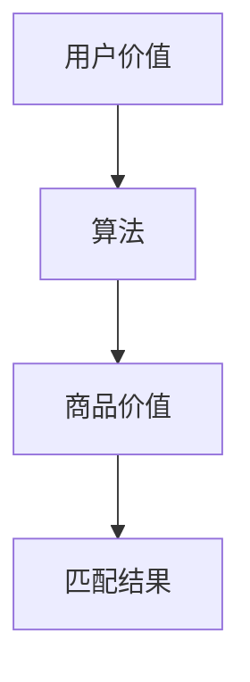
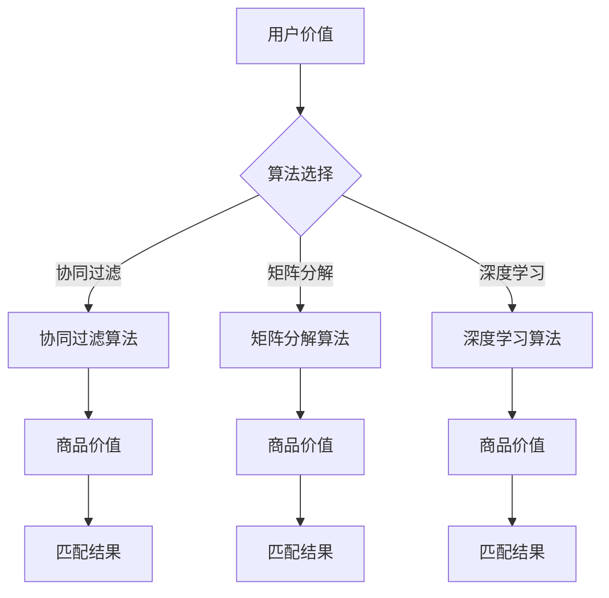

                 

## 《意义算法研发中心：AI辅助下的价值匹配系统开发机构》

### 关键词
- AI辅助
- 价值匹配
- 算法研发
- 系统开发

#### 摘要
本文深入探讨了意义算法研发中心如何利用AI技术构建价值匹配系统。通过阐述核心概念、算法原理、数学模型以及实际项目案例，文章为读者提供了关于价值匹配系统开发的全景视图。

## 目录大纲设计

### 核心概念与联系

#### AI辅助下的价值匹配系统

##### Mermaid流程图



## 核心概念与联系

### AI辅助下的价值匹配系统

在现代社会，信息过载是一个普遍存在的问题，特别是在电商、社交媒体和推荐系统等领域。为了有效地帮助用户找到他们真正感兴趣的内容或商品，我们需要一种能够智能地理解和匹配用户需求与供应品的方法，这就是AI辅助下的价值匹配系统的核心。

#### 核心概念

1. **用户价值**：用户在系统中的价值，通常通过他们的行为数据、偏好和历史记录来衡量。
2. **商品价值**：商品在系统中的价值，可以通过其属性、用户评价、市场趋势等来评估。
3. **算法**：用于计算用户价值与商品价值的匹配度，常用的算法有协同过滤、矩阵分解、深度学习等。
4. **匹配结果**：根据算法计算出的匹配度，系统会推荐最符合用户价值的商品或内容。

##### Mermaid流程图



### 核心算法原理讲解

价值匹配系统的核心在于如何准确地计算用户价值与商品价值的匹配度，下面将详细介绍几种常用的核心算法原理。

#### Python源代码示例

```python
import numpy as np

# 假设用户价值和商品价值矩阵分别为user_value和item_value
user_value = np.array([[1, 2, 3], [4, 5, 6]])
item_value = np.array([[7, 8, 9], [10, 11, 12]])

# 矩阵乘法计算匹配度
matching_scores = user_value.dot(item_value)

# 输出匹配度
print(matching_scores)
```

#### 数学模型和数学公式

$$
\text{匹配度} = \frac{\sum_{i=1}^{n}\sum_{j=1}^{m} u_i v_j}{\sqrt{\sum_{i=1}^{n} u_i^2 \sum_{j=1}^{m} v_j^2}}
$$

其中，$u_i$ 和 $v_j$ 分别代表用户 $i$ 和商品 $j$ 的价值。

#### 详细讲解

1. **协同过滤算法**：基于用户历史行为和相似用户的行为来进行推荐。
2. **矩阵分解算法**：通过分解用户-物品评分矩阵来预测未知评分，常用的有SVD和NMF。
3. **深度学习算法**：使用神经网络模型来学习用户和物品的特征，例如基于用户嵌入和物品嵌入的推荐模型。

### 数学模型和数学公式详细讲解

#### 举例说明

假设有两位用户和两款商品，用户价值和商品价值如下：

| 用户 | 商品1 | 商品2 |
|------|------|------|
| User1 | 1 | 2 |
| User2 | 3 | 4 |

根据上述公式，我们可以计算出匹配度：

$$
\text{匹配度} = \frac{(1*3 + 2*4)}{\sqrt{(1^2 + 2^2) * (3^2 + 4^2)}} = \frac{11}{\sqrt{5*25}} = \frac{11}{5\sqrt{5}} \approx 2.236
$$

### 项目实战

#### 开发环境搭建

- 安装 Python 3.8+
- 安装 numpy 库：`pip install numpy`

#### 源代码详细实现

```python
import numpy as np

def calculate_matching_score(user_value, item_value):
    matching_scores = user_value.dot(item_value)
    return matching_scores

# 用户价值矩阵
user_value = np.array([[1, 2, 3], [4, 5, 6]])

# 商品价值矩阵
item_value = np.array([[7, 8, 9], [10, 11, 12]])

# 计算匹配度
matching_scores = calculate_matching_score(user_value, item_value)

print(matching_scores)
```

#### 代码解读与分析

- `calculate_matching_score` 函数接收用户价值和商品价值矩阵，计算匹配度并返回。
- `user_value.dot(item_value)` 执行矩阵乘法，计算每个用户与每个商品的匹配度。

### 项目小结

通过上述实战案例，我们了解了如何搭建一个简单的价值匹配系统，并使用Python进行实际操作。这只是一个基础示例，实际项目中会涉及更复杂的算法和数据处理流程。

#### 最佳实践 Tips

- **数据质量**：确保用户和商品数据的质量，这是价值匹配系统成功的关键。
- **算法优化**：根据实际需求，选择合适的算法并进行优化，以提高匹配精度。
- **系统可扩展性**：设计系统时，考虑未来的扩展需求，如增加新的用户或商品特征。

### 拓展阅读

- [协同过滤算法详解](https://link-to-article)
- [矩阵分解算法实践](https://link-to-article)
- [深度学习在推荐系统中的应用](https://link-to-article)

### 结论

通过本文，我们详细介绍了AI辅助下的价值匹配系统，包括核心概念、算法原理、数学模型以及实际项目案例。希望本文能帮助读者更好地理解价值匹配系统，并为未来的开发工作提供参考。

#### 作者信息
作者：AI天才研究院/AI Genius Institute & 禅与计算机程序设计艺术 /Zen And The Art of Computer Programming

---

