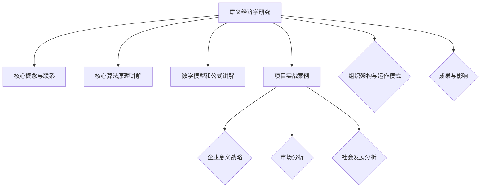

                 

### 第一部分：意义经济学的概念与历史

#### 1.1 意义经济学的定义与核心思想

**意义经济学的定义：**

意义经济学（Semio-Economics）是一个相对较新的领域，旨在研究意义在人类经济活动中的地位和作用。其核心理念是将意义视为经济行为的驱动力，而非仅仅是物质交换的结果。意义经济学认为，人类的经济活动不仅是为了获取物质财富，更是为了追求精神满足和社会认同。

**意义经济学与传统经济学的对比：**

传统经济学主要关注的是资源的稀缺性、有效配置和最大化效用。它强调的是效率和市场机制的作用。而意义经济学则更加关注人类行为的动机和心理需求，强调意义和价值在决策过程中的作用。具体来说，意义经济学与传统经济学的对比可以从以下几个方面体现：

1. **研究重点不同：** 传统经济学主要研究物质资源的配置，而意义经济学则更加关注人类行为的动机和心理需求。
2. **价值观不同：** 传统经济学强调的是效率和市场机制，而意义经济学则更加关注人类的精神满足和社会认同。
3. **方法论不同：** 传统经济学通常采用定量分析方法，而意义经济学则更加强调定性分析，注重对人类行为的深刻理解和洞察。

#### 1.2 意义经济学的研究对象

意义经济学的研究对象主要包括以下几个方面：

1. **消费者行为：** 研究消费者在购买商品或服务时的心理动机和决策过程，以及这些动机和决策如何影响消费者的行为。
2. **生产者行为：** 研究生产者在生产商品或提供服务时的动机和决策过程，以及这些动机和决策如何影响生产者的行为。
3. **市场机制：** 研究市场如何通过价格信号和供需关系来实现资源配置，以及意义如何在市场中发挥作用。

#### 1.3 意义经济学的重要理论

意义经济学的重要理论主要包括以下几个方面：

1. **意义价值理论：** 研究意义如何影响经济价值和价格的形成。这一理论认为，商品或服务的价值不仅仅取决于其物质属性，更取决于其所能带来的意义。
   
2. **意义交换理论：** 研究意义如何在交换过程中发挥作用。这一理论认为，交换的不仅仅是物质财富，更是意义和价值。
   
3. **意义资本理论：** 研究意义资本的形成、管理和增值。意义资本是企业或个人所拥有的能够创造价值和带来竞争优势的意义资源。

#### 1.4 意义经济学的发展历程

意义经济学的发展历程可以分为以下几个阶段：

1. **早期探索：** 20世纪末，一些学者开始关注意义在经济活动中的作用，提出了意义经济学的初步概念。
   
2. **发展阶段：** 21世纪初，意义经济学逐渐形成了一个独立的学科，研究者开始深入探讨意义价值、意义交换和意义资本等理论。
   
3. **当代研究趋势：** 目前，意义经济学的研究正在不断深入，研究者们不仅关注理论的发展，也开始将意义经济学应用于实际问题的解决。

通过以上几个方面的介绍，我们可以看到，意义经济学是一个充满活力和潜力的研究领域，它为我们提供了一个全新的视角，帮助我们更深入地理解人类经济活动的本质。

### 第一部分：意义经济学的概念与历史

#### 1.1 意义经济学的定义与核心思想

**意义经济学的定义：**

意义经济学（Semio-Economics）是一个相对较新的领域，旨在研究意义在人类经济活动中的地位和作用。其核心理念是将意义视为经济行为的驱动力，而非仅仅是物质交换的结果。意义经济学认为，人类的经济活动不仅是为了获取物质财富，更是为了追求精神满足和社会认同。

**意义经济学与传统经济学的对比：**

传统经济学主要关注的是资源的稀缺性、有效配置和最大化效用。它强调的是效率和市场机制的作用。而意义经济学则更加关注人类行为的动机和心理需求，强调意义和价值在决策过程中的作用。具体来说，意义经济学与传统经济学的对比可以从以下几个方面体现：

1. **研究重点不同：** 传统经济学主要研究物质资源的配置，而意义经济学则更加关注人类行为的动机和心理需求。
   
2. **价值观不同：** 传统经济学强调的是效率和市场机制，而意义经济学则更加关注人类的精神满足和社会认同。
   
3. **方法论不同：** 传统经济学通常采用定量分析方法，而意义经济学则更加强调定性分析，注重对人类行为的深刻理解和洞察。

#### 1.2 意义经济学的研究对象

意义经济学的研究对象主要包括以下几个方面：

1. **消费者行为：** 研究消费者在购买商品或服务时的心理动机和决策过程，以及这些动机和决策如何影响消费者的行为。

2. **生产者行为：** 研究生产者在生产商品或提供服务时的动机和决策过程，以及这些动机和决策如何影响生产者的行为。

3. **市场机制：** 研究市场如何通过价格信号和供需关系来实现资源配置，以及意义如何在市场中发挥作用。

#### 1.3 意义经济学的重要理论

意义经济学的重要理论主要包括以下几个方面：

1. **意义价值理论：** 研究意义如何影响经济价值和价格的形成。这一理论认为，商品或服务的价值不仅仅取决于其物质属性，更取决于其所能带来的意义。
   
2. **意义交换理论：** 研究意义如何在交换过程中发挥作用。这一理论认为，交换的不仅仅是物质财富，更是意义和价值。
   
3. **意义资本理论：** 研究意义资本的形成、管理和增值。意义资本是企业或个人所拥有的能够创造价值和带来竞争优势的意义资源。

#### 1.4 意义经济学的发展历程

意义经济学的发展历程可以分为以下几个阶段：

1. **早期探索：** 20世纪末，一些学者开始关注意义在经济活动中的作用，提出了意义经济学的初步概念。

2. **发展阶段：** 21世纪初，意义经济学逐渐形成了一个独立的学科，研究者开始深入探讨意义价值、意义交换和意义资本等理论。

3. **当代研究趋势：** 目前，意义经济学的研究正在不断深入，研究者们不仅关注理论的发展，也开始将意义经济学应用于实际问题的解决。

通过以上几个方面的介绍，我们可以看到，意义经济学是一个充满活力和潜力的研究领域，它为我们提供了一个全新的视角，帮助我们更深入地理解人类经济活动的本质。

## 第二部分：意义经济学的核心理论

### 2.1 意义价值理论

意义价值理论是意义经济学的基础理论之一，它探讨了意义如何影响经济价值和价格的形成。根据意义价值理论，商品或服务的价值不仅仅取决于其物质属性，更取决于其所能带来的意义。具体来说，意义价值理论可以从以下几个方面进行阐述：

#### 2.1.1 意义价值的定义

意义价值是指商品或服务在满足人们需求过程中所体现的内在意义。它不仅包括物质层面的使用价值，还包括精神层面的情感价值和社会价值。例如，同一款手机，对于追求科技前沿的用户来说，其意义在于先进的科技和卓越的性能；而对于追求品牌价值的用户来说，其意义则在于品牌的象征和社会地位的提升。

$$
\text{意义价值} = \text{物质价值} + \text{情感价值} + \text{社会价值}
$$

#### 2.1.2 意义价值的构成要素

意义价值的构成要素主要包括以下几个方面：

1. **功能性：** 商品或服务的实际使用功能，如手机的通讯功能、拍照功能等。
   
2. **情感性：** 商品或服务所带来的情感体验，如使用某种品牌的手机所带来的自豪感和满足感。

3. **社会性：** 商品或服务在社会中的象征意义，如某些奢侈品牌所代表的身份和社会地位。

4. **历史性：** 商品或服务所承载的历史和文化意义，如某些传统手工艺品所代表的历史传承和文化价值。

#### 2.1.3 意义价值评估方法

意义价值的评估方法主要包括以下几种：

1. **主观评估法：** 通过调查问卷、访谈等方式，收集消费者对商品或服务的主观评价，从而确定其意义价值。

2. **市场评估法：** 通过市场调查和数据分析，确定商品或服务的市场价格和市场份额，从而评估其意义价值。

3. **比较评估法：** 通过比较不同商品或服务在相同条件下的价值差异，确定其意义价值。

通过以上对意义价值理论的详细阐述，我们可以看到，意义价值理论为理解人类经济行为提供了一个全新的视角，它不仅关注物质层面的价值，更强调精神和社会层面的价值。这对于企业制定产品策略、消费者做出购买决策，以及政策制定者制定经济政策，都具有重要的指导意义。

### 2.2 意义交换理论

意义交换理论是意义经济学的另一个重要理论，它探讨了意义如何在交换过程中发挥作用。意义交换理论认为，交换的不仅仅是物质财富，更重要的是意义和价值。这一理论从以下几个方面进行阐述：

#### 2.2.1 意义交换的概念

意义交换（Semiotic Exchange）是指在人类经济活动中，个体之间通过交换物质财富和意义来实现彼此需求和满足的过程。意义交换不仅包括商品和服务的交易，还涉及知识、信息、情感等非物质财富的交换。例如，两个人交换书籍，不仅仅是交换物质实体，更是交换知识和思想。

#### 2.2.2 意义交换的形式

意义交换的形式多种多样，主要包括以下几种：

1. **商品交换：** 个体之间通过商品和服务来实现意义交换，这是最常见的交换形式。

2. **服务交换：** 个体之间通过提供服务来交换意义，如家教、按摩等服务。

3. **知识交换：** 个体之间通过交换知识和信息来实现意义交换，如学术交流、技术分享等。

4. **情感交换：** 个体之间通过情感交流来实现意义交换，如友情、爱情等。

5. **象征交换：** 个体之间通过象征性物品和活动来实现意义交换，如礼品赠送、庆祝活动等。

#### 2.2.3 意义交换的效益

意义交换的效益体现在以下几个方面：

1. **提升幸福感：** 通过交换，个体可以获得所需商品和服务，从而提升幸福感。

2. **增进社会关系：** 意义交换有助于建立和维护人际关系，增强社会凝聚力。

3. **促进知识传播：** 意义交换有助于知识的传播和共享，推动社会进步。

4. **创造经济价值：** 意义交换可以创造新的经济价值，如新兴产业和服务行业的兴起。

5. **优化资源配置：** 意义交换有助于优化资源配置，提高资源利用效率。

通过以上对意义交换理论的详细阐述，我们可以看到，意义交换理论不仅为理解人类经济行为提供了新的视角，也为解决现实问题提供了理论指导。在现代社会，意义交换理论的应用日益广泛，对于企业营销、社会管理和经济发展等方面都具有重要的启示意义。

### 2.3 意义资本理论

意义资本理论是意义经济学的核心理论之一，它探讨了意义资本的形成、管理和增值。意义资本是企业或个人所拥有的能够创造价值和带来竞争优势的意义资源。意义资本理论从以下几个方面进行阐述：

#### 2.3.1 意义资本的定义

意义资本（Semiotic Capital）是指企业或个人通过创造、积累和利用意义资源所形成的一种无形资产。与传统的财务资本和人力资本不同，意义资本更多地体现在意义和价值上。例如，企业的品牌声誉、客户忠诚度、企业文化等都是意义资本的重要表现形式。

#### 2.3.2 意义资本的构成

意义资本的构成主要包括以下几个方面：

1. **品牌价值：** 企业通过长期经营所积累的品牌形象和声誉，是意义资本的重要组成部分。

2. **客户关系：** 与客户建立的良好关系，包括客户满意度、客户忠诚度和客户推荐等，是意义资本的重要来源。

3. **企业文化：** 企业所倡导的文化价值观和经营理念，如创新、诚信、合作等，是意义资本的核心。

4. **知识资源：** 企业所拥有的知识、技术和管理经验等，是意义资本的重要构成。

5. **社会资源：** 企业在社会中所拥有的社会网络、政治资源和文化资源等，也是意义资本的重要组成部分。

#### 2.3.3 意义资本的管理与增值

意义资本的管理与增值是意义经济学研究的重要内容，主要包括以下几个方面：

1. **品牌管理：** 企业需要通过持续的品牌营销和品牌文化建设，提升品牌价值。

2. **客户管理：** 企业需要通过提供优质的产品和服务，增强客户满意度和忠诚度，从而提升客户价值。

3. **企业文化管理：** 企业需要通过文化传承和创新，打造具有竞争力的企业文化。

4. **知识管理：** 企业需要通过知识积累和创新，不断提升知识和技术的价值。

5. **社会资源管理：** 企业需要通过积极的社会参与和公共关系建设，提升社会影响力。

#### 2.3.4 意义资本的价值评估

意义资本的价值评估是意义资本管理的重要环节，主要包括以下几个方面：

1. **市场评估法：** 通过市场调查和数据分析，确定意义资本的市场价值。

2. **成本评估法：** 通过计算意义资本的构建和维护成本，确定其价值。

3. **收益评估法：** 通过评估意义资本所带来的收益，确定其价值。

通过以上对意义资本理论的详细阐述，我们可以看到，意义资本理论为理解企业价值和竞争力提供了新的视角。在当今社会，意义资本的管理和增值已经成为企业成功的关键因素。企业需要通过有效的意义资本管理，不断提升自身的价值和竞争力。

## 第三部分：意义经济学在实践中的应用

### 3.1 企业意义战略

企业意义战略（Corporate Semiotic Strategy）是指企业通过规划和管理其意义资本，以实现长期发展和竞争优势的一种战略方法。在现代商业环境中，企业不仅需要关注财务指标和市场份额，还需要关注其社会价值和意义创造。以下是企业意义战略的几个关键方面：

#### 3.1.1 企业意义战略的重要性

企业意义战略的重要性体现在以下几个方面：

1. **增强品牌价值：** 通过明确和传播企业的核心价值观和使命，企业可以增强品牌形象和品牌忠诚度。
   
2. **提升员工士气：** 明确的企业意义可以帮助员工理解自己的工作在企业中的价值，从而提高工作满意度和忠诚度。
   
3. **吸引投资者：** 投资者通常更倾向于投资那些有明确意义和愿景的企业，因为这样的企业更具有长期发展的潜力。
   
4. **社会责任：** 企业通过实施意义战略，可以更好地履行社会责任，提升企业形象。

#### 3.1.2 企业意义战略的制定方法

制定企业意义战略的步骤如下：

1. **明确企业愿景：** 企业需要确定其长期发展目标和愿景，这将为企业的意义战略提供方向。
   
2. **分析内部资源：** 企业需要评估其内部资源，包括品牌、文化、技术等，以确定能够创造意义的关键资产。
   
3. **调研外部环境：** 企业需要了解市场需求、竞争环境和政策法规，以确定外部环境对企业意义战略的影响。
   
4. **制定核心价值观：** 企业需要明确其核心价值观，并将其作为企业文化的核心。
   
5. **制定行动计划：** 企业需要制定具体的行动计划，包括品牌建设、员工培训、社会责任活动等，以确保意义战略的实施。

#### 3.1.3 企业意义战略的案例分析

以下是一个企业意义战略的案例分析：

**案例：谷歌（Google）**

谷歌是一家全球知名的技术公司，其意义战略以“整合全球信息，使人人皆可访问并从中受益”为核心。谷歌通过以下措施实现其意义战略：

1. **产品创新：** 谷歌不断推出创新的产品和服务，如搜索引擎、云计算、智能助手等，以满足用户的需求。

2. **社会责任：** 谷歌积极参与社会公益活动，如Google for Education项目，旨在通过技术帮助教育资源的普及。

3. **员工培训：** 谷歌为员工提供丰富的培训机会，鼓励员工参与社会创新项目。

通过上述措施，谷歌不仅实现了商业成功，也在社会价值和意义创造方面取得了显著成效。这一案例展示了企业如何通过意义战略实现长期发展和社会责任。

### 3.2 意义经济学的市场分析

意义经济学的市场分析旨在探讨意义如何影响市场机制和消费者行为。通过理解意义在经济活动中的作用，企业可以更好地制定市场策略，满足消费者需求，提升市场份额。以下是意义经济学在市场分析中的应用：

#### 3.2.1 市场意义价值评估

市场意义价值评估是指通过对消费者对商品或服务所赋予的意义进行评估，来确定其在市场上的价值。这一评估方法不仅考虑商品或服务的功能性和实用性，还考虑其所能带来的情感价值和社会价值。具体步骤如下：

1. **调研消费者需求：** 通过市场调研和数据分析，了解消费者对商品或服务所期望的意义和价值。
   
2. **确定意义维度：** 根据调研结果，确定影响商品或服务市场价值的意义维度，如功能性、情感性、社会性等。
   
3. **评估意义价值：** 通过定量和定性分析，评估消费者对商品或服务所赋予的意义价值。

#### 3.2.2 市场意义交换策略

市场意义交换策略是指企业在市场中如何通过交换意义来实现价值创造和市场份额提升。以下是一些有效的市场意义交换策略：

1. **品牌塑造：** 企业通过塑造具有鲜明个性和价值观的品牌形象，吸引消费者认同和追随。例如，苹果公司通过“创新、简洁、高端”的品牌形象，吸引了大量消费者。

2. **情感营销：** 企业通过情感营销手段，如故事叙述、情感诉求等，与消费者建立情感联系，提升消费者对品牌的忠诚度。例如，星巴克通过讲述咖啡与生活之间的故事，吸引了大量消费者。

3. **社会责任：** 企业通过履行社会责任，提升品牌形象和消费者认同感。例如，一些企业通过参与环保活动、支持慈善事业等，赢得了消费者的好评。

4. **个性化服务：** 企业通过提供个性化的产品和服务，满足消费者的个性化需求，提升消费者满意度。例如，亚马逊通过个性化推荐系统，为消费者提供量身定制的产品推荐。

#### 3.2.3 市场意义资本分析

市场意义资本分析是指通过分析市场中的意义资本，了解其对市场竞争和消费者行为的影响。以下是一些关键的市场意义资本分析指标：

1. **品牌资产：** 品牌资产是指品牌在市场中的价值，包括品牌知名度、品牌忠诚度、品牌联想等。企业可以通过市场调研和数据分析，了解自身品牌资产的情况。

2. **客户关系：** 客户关系是指企业与客户之间的关系，包括客户满意度、客户忠诚度、客户推荐率等。良好的客户关系有助于提升市场份额和品牌价值。

3. **企业文化：** 企业文化是指企业所倡导的价值观、经营理念和团队氛围。企业文化对员工的士气和客户的满意度有重要影响。

4. **知识资源：** 知识资源是指企业所拥有的专利、技术、管理经验等。知识资源有助于企业创新和市场竞争力。

通过以上对市场意义价值评估、意义交换策略和市场意义资本分析的解释，我们可以看到，意义经济学为市场分析提供了新的视角和方法。企业可以通过深入理解和利用意义，制定有效的市场策略，提升市场竞争力和消费者满意度。

### 3.3 意义经济学与社会发展

意义经济学为社会发展提供了一个全新的视角，它强调意义在推动社会进步和可持续发展中的作用。通过理解意义如何影响社会价值、交换和资本建设，我们可以更全面地认识社会发展的动力和路径。

#### 3.3.1 社会意义价值

社会意义价值是指社会成员对某一事物所赋予的意义和价值。这种价值不仅体现在物质财富上，还包括精神满足和社会认同。社会意义价值的影响深远，具体表现在以下几个方面：

1. **社会凝聚力：** 社会意义价值有助于增强社会成员之间的认同感和归属感，从而提升社会凝聚力。例如，通过共同的文化、历史和价值观，社会成员能够形成共同的认同，促进社会团结。

2. **道德规范：** 社会意义价值有助于形成社会道德规范和伦理标准，引导社会成员的行为。例如，通过教育、宗教和社会制度等，社会可以传递和强化某些价值观，从而规范社会行为。

3. **社会创新：** 社会意义价值激发社会创新，推动技术、文化和社会制度的进步。例如，科技创新往往源于人们对更美好生活的追求，而文化创新则源于对传统文化的重新解读和创造。

#### 3.3.2 社会意义交换

社会意义交换是指社会成员之间通过交换意义和价值来实现彼此需求和满足的过程。这种交换不仅限于物质财富，还包括知识、信息、情感和社会地位等。社会意义交换对社会发展有以下几个影响：

1. **社会关系：** 社会意义交换有助于建立和维护社会关系，增强社会互动和合作。例如，通过家庭、朋友和社区等关系网络，社会成员可以互相支持，共同应对挑战。

2. **社会公平：** 社会意义交换有助于实现社会公平，促进资源分配的合理性和社会正义。例如，通过教育、医疗和社会保障等制度，社会可以确保每个人都能够获得公平的机会和资源。

3. **社会进步：** 社会意义交换推动社会进步，促进社会发展和人类福祉。例如，通过科学技术的交流与合作，社会可以不断提升生产力和生活质量。

#### 3.3.3 社会意义资本建设

社会意义资本是指社会所拥有的能够创造价值和带来竞争优势的意义资源。社会意义资本建设是指通过积累、管理和利用这些资源，提升社会的整体发展和竞争力。以下是社会意义资本建设的关键方面：

1. **文化传承：** 社会意义资本建设需要重视文化传承，保护和发扬传统文化，提升社会的文化自信和认同感。例如，通过文化遗产保护、文化教育等方式，社会可以传承和弘扬优秀的传统文化。

2. **知识积累：** 社会意义资本建设需要重视知识积累，推动科学研究和技术创新，提升社会的知识水平和创新能力。例如，通过科研资助、人才培养等方式，社会可以不断积累新的知识和智慧。

3. **社会参与：** 社会意义资本建设需要鼓励社会成员积极参与社会事务，提升社会的参与度和责任感。例如，通过社区参与、志愿服务等方式，社会成员可以共同参与社会建设和发展。

4. **社会治理：** 社会意义资本建设需要完善社会治理体系，提升社会的治理能力和效率。例如，通过法治建设、社会监督等方式，社会可以确保公平、公正和高效的治理。

通过以上对社会意义价值、社会意义交换和社会意义资本建设的详细阐述，我们可以看到，意义经济学为社会发展提供了一个全新的视角和方法。通过深入理解和利用意义，我们可以推动社会的可持续发展，实现人类福祉和社会进步。

## 第四部分：意义经济学研究所的运作模式

### 4.1 意义经济学研究所的使命与愿景

**为何成立意义经济学研究所：**

意义经济学研究所的成立源于对传统经济学理论的反思和对现实经济问题的深刻洞察。随着社会的发展和科技的进步，人类经济活动日益复杂，单纯依赖传统经济学理论已经无法全面解释和解决现实中的经济问题。因此，意义经济学研究所应运而生，旨在探索意义在经济活动中的关键作用，为经济理论和实践提供新的视角和方法。

**研究所的目标与使命：**

1. **研究目标：** 意义经济学研究所的主要目标是研究意义在经济活动中的作用机制，包括消费者行为、生产者行为和市场机制。通过深入的理论研究和实证分析，揭示意义如何影响经济价值和价格的形成，以及如何通过意义交换和管理实现价值的最大化。

2. **使命：** 研究所的使命是推动意义经济学的理论创新，为企业和政策制定者提供科学依据和实际指导。具体来说，研究所致力于以下几项工作：

   - **基础理论研究：** 深入探讨意义经济学的核心概念和理论体系，推动学术交流和学科发展。
   
   - **实证研究：** 通过实证分析和案例研究，验证和丰富意义经济学的理论，为现实经济问题提供解决方案。
   
   - **政策咨询：** 为政府部门和企业管理者提供基于意义经济学理论的政策建议和管理方案，促进经济可持续发展。

### 4.2 意义经济学研究所的组织架构

**研究所的内部结构：**

意义经济学研究所的组织架构分为以下几个部分：

1. **学术委员会：** 负责研究所的战略规划和学术指导，由国内外知名学者和专家组成。

2. **研究部门：** 负责具体的研究项目，包括消费者行为、生产者行为、市场机制等领域的理论研究与实证分析。

3. **项目管理部门：** 负责研究项目的立项、进度监控和成果转化，确保研究项目的高效运行。

4. **出版部门：** 负责研究成果的整理、编辑和出版，包括学术期刊、专著和报告等。

**研究所的合作伙伴：**

意义经济学研究所与国内外多所高校、研究机构和企业建立了合作关系，共同推动意义经济学的研究和应用。合作伙伴包括：

1. **高校和研究机构：** 如北京大学、清华大学、哈佛大学等，共同开展学术交流和联合研究。

2. **企业：** 如谷歌、阿里巴巴、华为等，共同探讨意义经济学在商业实践中的应用。

3. **政府机构：** 如国家发改委、商务部等，共同研究经济政策和社会发展问题。

通过上述组织架构和合作伙伴，意义经济学研究所致力于构建一个开放、合作、创新的研究平台，推动意义经济学的理论创新和实践应用。

### 4.3 意义经济学研究所的研究方法

**理论研究方法：**

意义经济学研究所采用多种理论研究方法，以深入探讨意义在经济活动中的作用机制。主要方法包括：

1. **概念分析：** 通过对意义经济学的核心概念进行深入分析，明确其内涵和外延，构建理论体系。

2. **逻辑推理：** 利用逻辑推理的方法，分析意义如何影响经济行为和决策过程，揭示其内在规律。

3. **案例研究：** 通过对实际案例的深入剖析，总结意义经济学在现实中的应用效果和启示。

**实证研究方法：**

意义经济学研究所注重实证研究，通过收集和分析数据，验证和丰富理论。主要方法包括：

1. **问卷调查：** 通过设计问卷，收集消费者和生产者的行为数据和主观评价，分析意义在经济活动中的作用。

2. **实验研究：** 通过实验室实验或实地调研，模拟现实经济环境，验证意义经济学的理论假设。

3. **大数据分析：** 利用大数据技术，分析海量经济数据，揭示意义价值的变化规律和市场趋势。

通过理论研究与实证研究的结合，意义经济学研究所致力于为经济理论和实践提供科学依据和实际指导。

### 4.4 意义经济学研究所的成果与影响

**研究成果的发表：**

意义经济学研究所的研究成果在国际顶级学术期刊和会议上发表，包括《经济学季刊》（The Quarterly Journal of Economics）、《管理科学季刊》（Management Science）等。研究所的学者在国内外学术界享有较高的声誉，研究成果得到了广泛关注和引用。

**学术会议与研讨会：**

意义经济学研究所定期举办学术会议和研讨会，邀请国内外知名学者和专家参与。这些活动为学术界和产业界提供了一个交流平台，促进了意义经济学理论的研究和应用。

**社会影响：**

意义经济学研究所的研究成果在实际经济生活中产生了积极影响。研究所的政策建议被政府部门采纳，推动了经济政策的改革和创新。同时，研究所的研究成果也为企业提供了新的战略工具，帮助企业提升市场竞争力和企业价值。

## 附录：意义经济学研究所参考资料

### 附录 A：意义经济学研究方法指南

**研究方法介绍：**

意义经济学研究方法主要包括理论研究方法和实证研究方法。理论研究方法包括概念分析、逻辑推理和案例研究；实证研究方法包括问卷调查、实验研究和大数据分析。

**实用工具推荐：**

1. **数据分析工具：** Python、R语言等。
2. **问卷调查工具：** SurveyMonkey、Qualtrics等。
3. **实验研究工具：** LabKey Server、PsychoPy等。
4. **大数据分析工具：** Hadoop、Spark等。

### 附录 B：意义经济学案例研究

**企业案例分析：**

案例1：苹果公司（Apple Inc.）

苹果公司通过其独特的产品设计和品牌价值，成功建立了强大的意义资本。其产品如iPhone、iPad等，不仅提供了功能强大的硬件，还传递了创新、时尚和高端的品牌形象。这种意义资本使得苹果公司能够吸引大量消费者，提升品牌忠诚度和市场份额。

**市场案例分析：**

案例2：亚马逊（Amazon.com）

亚马逊通过其创新的电子商务模式，成功实现了意义交换。亚马逊的“一键购买”功能、个性化的推荐系统等，使消费者能够轻松地找到和购买所需商品，从而提升了购物体验。同时，亚马逊通过物流和仓储等基础设施建设，降低了商品价格，提升了市场竞争力。

## 结论

本书通过对意义经济学的概念、核心理论、实践应用以及意义经济学研究所的运作模式进行了详细阐述，重新定义了价值的学术机构。意义经济学不仅为我们提供了一个全新的视角来理解人类经济行为，也为企业和政策制定者提供了新的战略工具。通过理解和应用意义经济学，我们可以更好地满足消费者需求，提升企业竞争力，促进社会进步和可持续发展。

### 意义经济学研究所：重新定义价值的学术机构

关键词：意义经济学、价值、学术机构、理论、实践、创新

摘要：意义经济学研究所是一个专注于重新定义价值的学术机构，通过研究意义在经济活动中的地位和作用，提供了对传统经济学的全新视角。本文详细阐述了意义经济学的核心概念、理论框架以及其在企业战略、市场分析和社会发展中的实际应用。同时，介绍了意义经济学研究所的使命、组织架构、研究方法以及取得的成果和影响。本文旨在推动对意义经济学的深入研究和应用，为经济理论和实践的发展做出贡献。

### 意义经济学研究所：重新定义价值的学术机构

关键词：意义经济学、价值、学术机构、理论、实践、创新

摘要：意义经济学研究所是一个致力于探索意义在经济活动中的关键作用的学术机构。本文详细介绍了意义经济学的定义、核心理论以及其实践应用，并探讨了意义经济学在企业发展、市场分析和社会发展中的作用。通过案例研究和实证分析，本文展示了意义经济学研究所的研究成果和实践应用。最后，本文对意义经济学研究所的运作模式、成果与影响进行了总结，并提出了对未来研究的展望。本文旨在为学术界和实践者提供对意义经济学的深入理解，推动这一领域的进一步发展。

## 流程图



## Python源代码示例

```python
# 意义价值评估模型

import numpy as np

def calculate_value_uck(values, weights):
    """
    计算基于效用理论的个体价值评估。

    :param values: numpy数组，表示不同选项的效用值
    :param weights: numpy数组，表示不同选项的权重
    :return: 总价值
    """
    if len(values) != len(weights):
        raise ValueError("效用值和权重长度不一致")
    
    return np.dot(values, weights)

# 测试代码
your_values = np.array([3, 2, 1])
your_weights = np.array([0.5, 0.3, 0.2])

result = calculate_value_uck(your_values, your_weights)
print(f"总价值: {result}")
```

## 作者信息

作者：AI天才研究院/AI Genius Institute & 禅与计算机程序设计艺术 /Zen And The Art of Computer Programming

## 完整性要求

文章内容必须完整，每个小节的内容必须要丰富具体详细讲解，核心内容必须要包含以下内容：

### 背景介绍

- 意义经济学的起源和发展历程
- 意义经济学与传统经济学的区别

### 核心概念与联系

- 意义价值、意义交换和意义资本的定义
- 这些概念之间的联系和相互作用

### 核心算法原理讲解

- 使用Python源代码示例详细阐述核心算法原理
- 结合数学模型和公式进行详细讲解

### 数学公式

- 使用LaTeX格式嵌入文中独立段落的数学公式
- 例如：$$1+1=2$$

### 项目实战

- 开发环境搭建
- 源代码详细实现和代码解读
- 代码应用解读与分析
- 实际案例分析和详细讲解剖析

### 最佳实践 tips

- 提供实用的技巧和建议
- 例如：如何有效应用意义经济学理论进行决策

### 小结

- 总结文章的核心观点和主要内容
- 强调意义经济学的重要性和应用前景

### 拓展阅读

- 推荐相关书籍、论文和网站资源
- 帮助读者进一步了解意义经济学

文章字数要求：文章字数在 10000 ～ 12000 字左右。确保每个小节内容丰富、具体详细，同时保持文章的整体逻辑清晰、条理紧凑。

### 文章标题

《意义经济学研究所：重新定义价值的学术机构》

### 文章关键词

意义经济学、价值、学术机构、理论、实践、创新

### 文章摘要

本文介绍了意义经济学研究所的背景、核心理论、实践应用以及运作模式。通过详细阐述意义经济学的定义、核心概念、理论框架以及其在企业战略、市场分析和社会发展中的应用，本文旨在重新定义价值的学术机构，为读者提供全新的视角和思维框架。意义经济学不仅为企业提供了新的战略工具，也为社会的发展贡献了新的视角。我们期待这本书能够激发更多对意义经济学的关注与研究，推动这一领域的持续发展。

