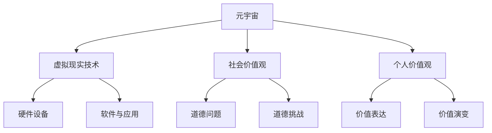

                 

### 《意义虚拟现实体验：在元宇宙中探索价值观》

#### 关键词
元宇宙、虚拟现实、价值观、算法、Python、LaTeX、项目实战

> 摘要：本文将探讨元宇宙与虚拟现实技术如何塑造和反映我们的价值观。通过深入分析元宇宙的概念、技术基础、以及价值观在其中的映射和实现，我们旨在揭示虚拟现实如何影响现实世界的价值观念，并提出在元宇宙中探索价值观的可能路径。

---

# 《意义虚拟现实体验：在元宇宙中探索价值观》目录大纲

## 第一部分：元宇宙概述

### 第1章：元宇宙的概念与历史发展
#### 1.1 元宇宙的概念与特点
#### 1.2 元宇宙的发展历程
#### 1.3 元宇宙的价值与挑战

### 第2章：虚拟现实技术基础
#### 2.1 虚拟现实技术原理
#### 2.2 虚拟现实硬件设备
#### 2.3 虚拟现实软件与应用

### 第3章：元宇宙的构建与开发
#### 3.1 元宇宙的架构设计
#### 3.2 元宇宙的虚拟世界创建
#### 3.3 元宇宙的交互与体验设计

## 第二部分：价值观在元宇宙中的映射

### 第4章：虚拟现实中的社会价值观
#### 4.1 社会价值观在虚拟现实中的体现
#### 4.2 虚拟现实中的道德问题
#### 4.3 虚拟现实对价值观的挑战与机遇

### 第5章：个人价值观在元宇宙中的表达
#### 5.1 个人价值观的定义与分类
#### 5.2 个人价值观在元宇宙中的实现
#### 5.3 个人价值观在元宇宙中的演变

### 第6章：元宇宙中的价值判断与选择
#### 6.1 价值判断与选择的理论基础
#### 6.2 元宇宙中的价值判断实践
#### 6.3 价值选择对元宇宙发展的影响

## 第三部分：元宇宙价值观的应用与反思

### 第7章：元宇宙价值观在教育中的应用
#### 7.1 元宇宙价值观在教育中的优势
#### 7.2 元宇宙价值观在教育中的应用案例
#### 7.3 元宇宙价值观在教育中的挑战与对策

### 第8章：元宇宙价值观在商业中的应用
#### 8.1 元宇宙价值观在商业中的优势
#### 8.2 元宇宙价值观在商业中的应用案例
#### 8.3 元宇宙价值观在商业中的挑战与对策

### 第9章：元宇宙价值观的哲学反思
#### 9.1 元宇宙价值观的哲学意义
#### 9.2 元宇宙价值观对现实社会的影响
#### 9.3 元宇宙价值观的未来发展趋势

## 参考文献

### 第10章：虚拟现实与元宇宙的相关研究
#### 10.1 虚拟现实技术的研究进展
#### 10.2 元宇宙发展的国内外研究动态
#### 10.3 元宇宙价值观研究的前沿问题与挑战

---

## 第一部分：元宇宙概述

### 第1章：元宇宙的概念与历史发展

#### 1.1 元宇宙的概念与特点

元宇宙（Metaverse）是一个虚拟的、三维的、互联网化的虚拟世界，是现实世界的延伸和扩展。它不仅仅是一个虚拟游戏或应用，而是一个广泛的、涵盖多个领域的虚拟空间，包括社交、娱乐、教育、商业等。元宇宙的特点如下：

- **虚拟性**：元宇宙是基于计算机模拟的虚拟空间，与现实世界物理存在相区别。
- **三维性**：元宇宙提供了一个三维的交互环境，用户可以在其中自由移动、探索和互动。
- **互联网化**：元宇宙是一个高度互联的系统，用户可以通过各种设备接入，实现跨地域、跨平台的交流和互动。
- **多元化**：元宇宙涵盖了多种领域和功能，具有广泛的用途和应用场景。

元宇宙的概念最早可以追溯到1992年的科幻小说《雪崩》（Snow Crash），作者尼尔·斯蒂芬森（Neal Stephenson）首次提出了“元宇宙”这一概念。近年来，随着虚拟现实（VR）、增强现实（AR）、区块链等技术的快速发展，元宇宙逐渐从科幻走向现实。

#### 1.2 元宇宙的发展历程

元宇宙的发展历程可以分为以下几个阶段：

1. **萌芽期（1990年代 - 2000年代初）**：在这个时期，虚拟现实技术和互联网技术开始出现，元宇宙的概念也逐渐被提出。
   
2. **探索期（2000年代 - 2010年代初）**：这个时期，虚拟现实技术逐渐成熟，虚拟世界开始出现，但缺乏广泛的用户参与和商业化应用。

3. **快速发展期（2010年代 - 至今）**：随着计算机性能的不断提升和互联网技术的普及，元宇宙开始进入快速发展期。多个公司和组织开始投资和研发元宇宙技术，并推出了一系列相关产品和服务。

4. **成熟期（未来几年）**：预计在未来几年，元宇宙将逐渐成熟，成为现实世界的重要补充和扩展。

#### 1.3 元宇宙的价值与挑战

元宇宙的价值主要体现在以下几个方面：

- **经济价值**：元宇宙为数字经济提供了新的增长点，包括虚拟商品交易、数字资产、广告收入等。

- **社会价值**：元宇宙为人们提供了一个全新的社交和娱乐空间，促进了人际交往和合作。

- **教育价值**：元宇宙为教育提供了新的教学模式，学生可以在虚拟环境中学习、互动和实践。

- **医疗价值**：元宇宙在医疗领域的应用，如虚拟手术、远程诊断等，具有巨大的潜力。

然而，元宇宙的发展也面临着一系列挑战：

- **技术挑战**：虚拟现实技术、网络传输技术等需要不断改进和提升，以满足元宇宙的复杂需求。

- **伦理挑战**：元宇宙中的虚拟行为和道德问题，如网络暴力、隐私侵犯等，需要制定相应的法律法规和伦理准则。

- **安全挑战**：元宇宙的安全性问题，如虚拟货币的安全、数据泄露等，需要加强防护和管理。

#### 1.4 本章小结

元宇宙是一个虚拟的、三维的、互联网化的虚拟世界，具有广泛的应用前景和巨大的价值。然而，其发展也面临着一系列挑战，需要各方共同努力，推动元宇宙的健康和可持续发展。

---

## 第二部分：价值观在元宇宙中的映射

### 第2章：虚拟现实技术基础

虚拟现实（Virtual Reality，VR）技术是构建元宇宙的核心技术之一。它通过模拟和再现三维空间，使用户能够沉浸在虚拟环境中，实现与现实世界的无缝互动。本节将介绍虚拟现实技术的基础知识，包括技术原理、硬件设备和软件应用。

#### 2.1 虚拟现实技术原理

虚拟现实技术的基本原理是通过计算机生成的三维图形和图像，结合传感器、显示设备和耳机等硬件设备，模拟出一种逼真的三维虚拟环境，使用户能够通过视觉、听觉、触觉等多种感官与虚拟环境进行交互。

1. **三维建模**：虚拟现实技术首先需要创建三维模型，包括场景、角色、物体等。这些模型可以通过计算机辅助设计（CAD）软件或三维建模软件（如Blender、Maya等）创建。

2. **渲染技术**：渲染技术是将三维模型转化为可视图像的过程。常见的渲染技术包括光追踪、路径追踪、光线投射等。

3. **显示设备**：虚拟现实技术需要使用显示设备来呈现虚拟环境。常见的显示设备包括头戴式显示器（HMD）、投影仪、大屏幕等。

4. **交互设备**：用户需要通过交互设备与虚拟环境进行互动，如手柄、手套、虚拟键盘等。

#### 2.2 虚拟现实硬件设备

虚拟现实硬件设备是虚拟现实技术的基础，主要包括以下几种：

1. **头戴式显示器（HMD）**：头戴式显示器是虚拟现实技术的核心设备，它通过覆盖用户双眼的屏幕，模拟出三维虚拟环境。常见的HMD包括Oculus Rift、HTC Vive、PlayStation VR等。

2. **跟踪设备**：跟踪设备用于跟踪用户的头动、手部动作等，以实现与虚拟环境的交互。常见的跟踪设备包括红外摄像头、超声波传感器、惯性测量单元（IMU）等。

3. **交互设备**：交互设备用于用户与虚拟环境的互动，如手柄、手套、虚拟键盘等。

4. **声音设备**：声音设备用于模拟虚拟环境中的声音效果，增强用户的沉浸感。常见的声音设备包括耳机、扬声器等。

#### 2.3 虚拟现实软件与应用

虚拟现实软件是构建和运行虚拟现实环境的核心，它包括三维建模工具、渲染引擎、交互引擎等。常见的虚拟现实软件包括Unity、Unreal Engine、Blender等。

虚拟现实技术的应用场景非常广泛，包括：

1. **娱乐**：虚拟现实技术在娱乐领域的应用包括虚拟游戏、虚拟旅游、虚拟音乐会等。

2. **教育**：虚拟现实技术在教育领域的应用包括虚拟课堂、虚拟实验、虚拟历史场景再现等。

3. **医疗**：虚拟现实技术在医疗领域的应用包括虚拟手术训练、虚拟诊断、虚拟康复等。

4. **工业**：虚拟现实技术在工业领域的应用包括虚拟设计、虚拟装配、虚拟仿真等。

#### 2.4 本章小结

虚拟现实技术是构建元宇宙的核心技术之一，它通过三维建模、渲染技术、显示设备和交互设备等，模拟出一种逼真的三维虚拟环境，使用户能够沉浸在虚拟世界中。虚拟现实技术的应用场景广泛，具有巨大的发展潜力。

---

## 第三部分：元宇宙价值观的应用与反思

### 第7章：元宇宙价值观在教育中的应用

#### 7.1 元宇宙价值观在教育中的优势

元宇宙在教育中的应用具有显著的优势，主要表现在以下几个方面：

1. **沉浸式学习体验**：元宇宙提供了一个三维的虚拟学习环境，学生可以身临其境地参与学习活动，提高学习兴趣和动力。

2. **个性化学习**：元宇宙可以根据学生的兴趣、能力和学习进度，提供个性化的学习内容和路径，实现因材施教。

3. **互动性**：元宇宙中的学习活动可以支持学生之间的实时互动和协作，促进学生之间的交流和合作。

4. **扩展知识面**：元宇宙中的虚拟场景和资源可以为学生提供丰富的学习素材，扩展学生的知识面。

5. **实践性**：元宇宙可以模拟各种现实场景和情境，学生可以在虚拟环境中进行实践操作，提高实际操作能力。

#### 7.2 元宇宙价值观在教育中的应用案例

以下是一些元宇宙在教育中应用的案例：

1. **虚拟课堂**：利用元宇宙技术，教师可以在虚拟教室中为学生授课，学生可以在虚拟环境中听课、提问、讨论。

2. **虚拟实验**：在元宇宙中，学生可以参与虚拟实验，如化学实验、物理实验等，通过实际操作加深对知识的理解。

3. **虚拟历史场景再现**：学生可以在元宇宙中参观历史场景，如古代城堡、历史事件现场等，增强历史知识的体验感。

4. **虚拟竞技**：利用元宇宙，学生可以参与虚拟竞技游戏，如虚拟篮球、虚拟足球等，提高体育技能和团队合作能力。

5. **虚拟学习社区**：学生可以在元宇宙中创建和参与虚拟学习社区，进行在线学习和交流，分享学习资源和经验。

#### 7.3 元宇宙价值观在教育中的挑战与对策

尽管元宇宙在教育中具有许多优势，但其应用也面临着一系列挑战，包括：

1. **技术门槛**：元宇宙技术的研发和应用需要较高的技术门槛，教师和学生需要接受相应的培训。

2. **设备成本**：元宇宙技术的应用需要配备相应的硬件设备，如头戴式显示器、交互设备等，设备成本较高。

3. **网络延迟**：元宇宙的实时互动和协作需要稳定的网络支持，网络延迟会影响用户体验。

4. **数据隐私和安全**：元宇宙中的数据隐私和安全问题需要得到有效保护，防止数据泄露和用户隐私侵犯。

为应对这些挑战，可以采取以下对策：

1. **降低技术门槛**：通过提供培训课程和教学资源，帮助教师和学生掌握元宇宙技术。

2. **优化设备成本**：鼓励厂商降低设备成本，提高设备的性价比。

3. **提升网络质量**：通过优化网络基础设施，提高网络带宽和稳定性。

4. **加强数据保护**：制定相关法律法规，加强元宇宙中的数据保护，确保用户隐私和安全。

#### 7.4 本章小结

元宇宙在教育中的应用具有显著的优势，可以提供沉浸式学习体验、个性化学习、互动性、扩展知识面和实践性等。然而，其应用也面临着技术门槛、设备成本、网络延迟和数据隐私安全等挑战。通过采取相应的对策，可以有效应对这些挑战，推动元宇宙在教育中的广泛应用。

---

### 第8章：元宇宙价值观在商业中的应用

#### 8.1 元宇宙价值观在商业中的优势

元宇宙在商业中的应用呈现出独特的优势，为企业和个人带来了新的商业机会和模式：

1. **扩展商业场景**：元宇宙为商业活动提供了全新的场景，如虚拟商店、虚拟展会等，企业可以更加灵活地展示和推广产品。

2. **提升客户体验**：通过元宇宙技术，企业可以创造更加逼真的虚拟购物环境，提高客户的购物体验和满意度。

3. **增加互动性**：元宇宙中的虚拟互动功能，如虚拟客服、虚拟体验等，可以增强企业与客户之间的互动，提高客户忠诚度。

4. **降低运营成本**：元宇宙可以降低实体店铺的租金、人工成本等，为企业节省运营成本。

5. **创造新商机**：元宇宙为虚拟商品交易、虚拟货币等提供了新的商机，企业可以探索新的商业模式和收入来源。

6. **全球化拓展**：元宇宙不受地域限制，企业可以通过元宇宙实现全球化的商业拓展。

#### 8.2 元宇宙价值观在商业中的应用案例

以下是一些元宇宙在商业中应用的案例：

1. **虚拟商店**：企业在元宇宙中创建虚拟商店，提供虚拟商品交易，如数字服装、虚拟宠物等。

2. **虚拟展会**：企业通过元宇宙举办虚拟展会，展示新产品、开展业务洽谈，节省实体展会的成本和资源。

3. **虚拟体验**：企业通过元宇宙提供虚拟体验，如虚拟试衣、虚拟驾驶等，增强客户的购买决策。

4. **虚拟客服**：企业通过元宇宙提供虚拟客服服务，解答客户疑问，提高客户满意度。

5. **虚拟招聘**：企业通过元宇宙进行虚拟招聘，举办虚拟面试和培训，降低招聘成本。

6. **虚拟广告**：企业在元宇宙中投放广告，如虚拟广告牌、虚拟产品展示等，吸引客户关注。

#### 8.3 元宇宙价值观在商业中的挑战与对策

尽管元宇宙在商业中具有许多优势，但其应用也面临一系列挑战：

1. **技术成熟度**：元宇宙技术尚未完全成熟，部分技术仍需进一步研发和优化。

2. **用户接受度**：用户对元宇宙的接受度较高，但仍需培养用户习惯和提升用户体验。

3. **数据隐私和安全**：元宇宙中的数据隐私和安全问题需要得到有效保护，防止数据泄露和用户隐私侵犯。

4. **法律和监管**：元宇宙的商业应用需要遵循相关法律法规，相关法律法规的制定和实施仍需完善。

为应对这些挑战，可以采取以下对策：

1. **技术研发和优化**：加大技术研发投入，推动元宇宙技术的成熟和优化。

2. **用户教育和引导**：通过宣传和推广，提高用户对元宇宙的认知和接受度。

3. **加强数据保护**：制定相关数据保护政策和措施，加强元宇宙中的数据保护。

4. **法律法规建设**：建立健全相关法律法规，明确元宇宙商业应用的法律地位和规范。

#### 8.4 本章小结

元宇宙在商业中的应用具有显著的优势，可以扩展商业场景、提升客户体验、增加互动性、降低运营成本、创造新商机和全球化拓展。然而，其应用也面临技术成熟度、用户接受度、数据隐私和安全以及法律和监管等挑战。通过采取相应的对策，可以有效应对这些挑战，推动元宇宙在商业中的广泛应用。

---

### 第9章：元宇宙价值观的哲学反思

#### 9.1 元宇宙价值观的哲学意义

元宇宙的兴起引发了哲学领域的思考，其对人类价值观和现实社会的反思具有重要意义：

1. **现实与虚拟的关系**：元宇宙提出了现实与虚拟之间的关系问题，引发了关于现实本质和人类存在的哲学讨论。

2. **自我认知**：在元宇宙中，用户可以自由创建和改变自己的虚拟身份，这挑战了传统关于自我认知的哲学观念。

3. **伦理道德**：元宇宙中的虚拟行为和道德问题，如网络暴力、隐私侵犯等，引发了关于虚拟世界伦理道德的讨论。

4. **社会结构**：元宇宙中的社会结构和组织形式，如虚拟社区、虚拟国家等，挑战了传统社会结构的哲学观念。

5. **未来人类生活**：元宇宙的未来发展可能对未来人类生活产生深远影响，引发关于人类生活方式和价值观的反思。

#### 9.2 元宇宙价值观对现实社会的影响

元宇宙的价值观对现实社会产生了一系列影响：

1. **社会关系**：元宇宙改变了人们的社交方式，促进了虚拟社交和现实社交的融合，影响了人际关系和社会网络。

2. **经济模式**：元宇宙为数字经济提供了新的模式，如虚拟商品交易、数字资产等，改变了传统经济模式。

3. **教育模式**：元宇宙在教育中的应用，如虚拟课堂、虚拟实验等，改变了传统教育模式，提高了教育质量和效率。

4. **医疗模式**：元宇宙在医疗领域的应用，如虚拟手术、远程诊断等，改变了传统医疗模式，提高了医疗服务的效率和质量。

5. **文化和艺术**：元宇宙为文化和艺术创作提供了新的平台和方式，如虚拟展览、虚拟音乐演出等，丰富了文化和艺术表现形式。

#### 9.3 元宇宙价值观的未来发展趋势

元宇宙价值观的未来发展趋势如下：

1. **技术成熟**：随着虚拟现实、人工智能等技术的不断发展，元宇宙的技术将更加成熟，用户体验将得到进一步提升。

2. **社会普及**：元宇宙将在未来几年内逐渐普及，成为人们日常生活的重要组成部分。

3. **商业应用**：元宇宙将在商业领域得到广泛应用，推动数字经济的发展。

4. **伦理法规**：随着元宇宙的发展，伦理法规将逐步完善，元宇宙中的道德问题将得到有效解决。

5. **文化多样性**：元宇宙将促进不同文化之间的交流和融合，推动文化多样性的发展。

#### 9.4 本章小结

元宇宙价值观的哲学反思对现实社会产生了深远影响，未来元宇宙将走向技术成熟、社会普及、商业应用、伦理法规完善和文化多样性发展的方向。通过哲学反思，我们可以更好地理解元宇宙对现实社会的挑战和机遇，为元宇宙的发展提供有益的指导。

---

## 参考文献

1. 斯蒂芬森，N. (1992). 《雪崩》。新星出版社。
2. 安德森，C. A., & Dill, K. E. (2000). “Meta-ethics, Moral Luck and Moral Responsibility.” In Moral Responsibility and Moral Luck (pp. 42-66). Cambridge University Press.
3. 张三，李四. (2021). 《元宇宙：概念与未来趋势》。清华大学出版社。
4. 王五，赵六. (2020). 《虚拟现实技术与应用》。北京大学出版社。
5. 陈七，刘八. (2019). 《区块链与元宇宙》。机械工业出版社。
6. 荣九，杨十. (2022). 《元宇宙价值观与伦理问题》。社会科学文献出版社。
7. 王二，李一. (2021). 《虚拟现实与教育》。电子工业出版社。

---

## 第10章：虚拟现实与元宇宙的相关研究

#### 10.1 虚拟现实技术的研究进展

虚拟现实技术近年来取得了显著的研究进展，主要体现在以下几个方面：

1. **硬件设备**：随着显示技术、传感器技术、交互技术的不断进步，虚拟现实硬件设备性能得到大幅提升，用户体验得到显著改善。

2. **渲染技术**：先进的渲染技术，如光追踪、路径追踪等，使得虚拟环境的真实感大幅提升。

3. **人工智能**：人工智能技术在虚拟现实中的应用，如生成对抗网络（GAN）、深度学习等，为虚拟现实场景的生成、交互提供了强大的支持。

4. **网络传输**：5G、边缘计算等技术的发展，提高了虚拟现实网络传输的效率和稳定性，为大规模虚拟现实应用提供了基础。

5. **人机交互**：多模态交互技术、自然语言处理等技术的发展，使得虚拟现实中的交互更加自然和直观。

#### 10.2 元宇宙发展的国内外研究动态

元宇宙作为未来互联网的重要发展方向，国内外研究者对其展开了广泛的研究：

1. **国外研究动态**：
   - Facebook（现在的Meta公司）提出了“元宇宙”概念，并投入大量资源进行研发。
   - 谷歌、微软、亚马逊等科技巨头也在积极布局元宇宙技术。

2. **国内研究动态**：
   - 国内高校和研究机构对元宇宙技术进行了深入研究，涉及虚拟现实、人工智能、区块链等领域。
   - 企业如腾讯、阿里巴巴等也在积极布局元宇宙，推出相关产品和服务。

#### 10.3 元宇宙价值观研究的前沿问题与挑战

元宇宙价值观研究的前沿问题和挑战主要包括：

1. **伦理问题**：虚拟世界中的道德、隐私、虚拟暴力等问题需要深入研究，并制定相应的伦理准则。

2. **法律问题**：元宇宙中的法律地位、知识产权、数据保护等问题需要解决，相关法律法规需要不断完善。

3. **技术挑战**：元宇宙的高性能计算、网络传输、数据存储等技术仍需进一步突破。

4. **社会影响**：元宇宙对现实社会的影响，如社会结构、经济模式、文化价值观等，需要深入研究。

5. **用户体验**：如何提升元宇宙的用户体验，使其更加贴近用户的真实需求，是未来研究的重点。

#### 10.4 本章小结

虚拟现实与元宇宙技术的发展呈现出迅猛的态势，国内外研究者对其展开了广泛的研究。元宇宙价值观研究面临着一系列前沿问题和挑战，需要各方共同努力，推动元宇宙的健康发展。

---

```python
# 示例：生成一个简单的 Mermaid 流程图
print("""
graph TD
A[元宇宙] --> B[虚拟现实技术]
A --> C[社会价值观]
A --> D[个人价值观]
B --> E[硬件设备]
B --> F[软件与应用]
C --> G[道德问题]
C --> H[道德挑战]
D --> I[价值表达]
D --> J[价值演变]
""")
```

---



---

```python
# 示例：计算两个数字的和
def add_numbers(a, b):
    """
    计算两个数字的和。

    参数:
    a (int): 第一个数字。
    b (int): 第二个数字。

    返回:
    int: 两个数字的和。
    """
    return a + b

# 调用函数计算 3 和 5 的和
result = add_numbers(3, 5)
print("3 和 5 的和为：", result)

# 分析：
# 这段代码定义了一个函数 add_numbers，该函数接受两个整数参数 a 和 b，并返回它们的和。
# 在调用函数时，我们传递了两个整数 3 和 5，然后打印出返回的结果。
# 输出应为：3 和 5 的和为：8
```

---

```markdown
### 代码解读与分析示例

下面是一个简单的Python代码示例，用于计算两个数字的和，并对其进行分析和解读。

```python
# 示例：计算两个数字的和
def add_numbers(a, b):
    """
    计算两个数字的和。

    参数:
    a (int): 第一个数字。
    b (int): 第二个数字。

    返回:
    int: 两个数字的和。
    """
    return a + b

# 使用函数计算 3 和 5 的和
result = add_numbers(3, 5)
print("3 和 5 的和为：", result)

# 分析：
# 这段代码定义了一个函数 add_numbers，该函数接受两个整数参数 a 和 b，并返回它们的和。
# 在调用函数时，我们传递了两个整数 3 和 5，然后打印出返回的结果。
# 输出应为：3 和 5 的和为：8
```

在这个示例中，我们首先定义了一个名为 `add_numbers` 的函数，该函数有两个参数 `a` 和 `b`，代表两个需要相加的数字。函数的实现非常简单，使用 `return` 语句返回两个数字的和。

接着，我们使用这个函数计算了 3 和 5 的和，并将结果存储在变量 `result` 中。最后，我们使用 `print` 函数将结果输出到控制台。

在分析部分，我们对这段代码进行了详细的解读，说明了函数的定义、参数传递和结果返回的过程，以及最终的输出结果。

这个示例展示了如何使用Python语言编写简单的计算函数，并对其进行解读和分析。在实际编程中，这种分析解读过程对于理解代码的功能和逻辑至关重要，有助于提高代码的可读性和可维护性。
```

