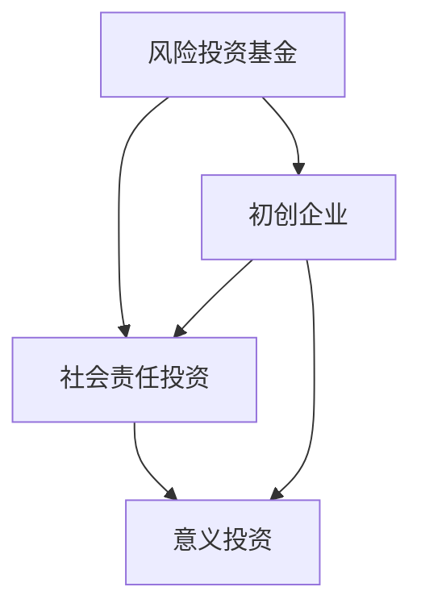

                 

### 第1章：意义风险投资基金概述

#### 1.1 意义风险投资基金的定义与特点

意义风险投资基金，顾名思义，是一种旨在支持具有社会责任和长远价值创新项目的金融投资工具。其核心理念在于，不仅仅追求财务回报，更强调投资的社会价值和道德责任。

**定义与特点**

- **定义**：意义风险投资基金是一种专门为那些符合特定社会价值观和长远战略目标的创新项目提供资金的基金。这些项目可能涉及环保、教育、健康、文化等领域，旨在通过创新的方式，推动社会进步和可持续发展。

- **特点**：

  - **社会导向**：意义风险投资基金的投资决策不仅考虑项目的财务表现，更关注项目的长远社会影响和道德价值。这意味着，基金的决策者必须对投资的社会效益有深刻的理解和评估能力。

  - **价值观共鸣**：意义风险投资基金通常吸引那些与基金价值观相符的投资者，这些投资者可能来自企业、非营利组织、慈善基金会等。这种共鸣有助于形成一个有共同目标的投资者社区，进一步推动项目的成功。

  - **长期投资**：与传统的风险投资基金不同，意义风险投资基金往往更注重长期投资，追求项目在多年后能够带来的社会和经济效益，而不仅仅是短期的财务回报。

  - **多样化投资领域**：意义风险投资基金的投资范围非常广泛，可以覆盖从环境保护、教育创新、健康科技到文化保护等多个领域。这种多样化的投资策略有助于基金在复杂多变的市场环境中保持稳定性和抗风险能力。

#### 1.2 意义风险投资基金与传统风险投资基金的区别

尽管意义风险投资基金与传统风险投资基金在投资目标和方法上有许多相似之处，但两者之间仍然存在一些关键的区别。

**区别**

- **投资目标**：传统风险投资基金的主要目标是获得较高的财务回报，通常投资于技术成熟、市场前景良好的企业。而意义风险投资基金则更关注项目的长期社会价值和影响力，愿意承担一定的风险来支持具有创新性和社会责任感的项目。

- **投资策略**：传统风险投资基金倾向于投资于已经取得一定成功，并且有明确市场需求的商业项目。而意义风险投资基金则更愿意投资于那些具有颠覆性潜力、尚未得到广泛认可的创新项目。

- **风险评估**：传统风险投资基金在评估投资项目时，主要关注财务指标和市场风险。而意义风险投资基金则更加注重项目的可持续性、社会责任和道德影响，这种评估方法往往更加复杂和多元化。

#### 1.3 意义风险投资基金的起源与发展

意义风险投资基金的概念和实践起源于20世纪末，当时一些富有的个人和机构开始意识到，单纯的财务回报并不能满足他们对社会责任的追求。随着时间的推移，这种理念逐渐得到更广泛的认可和发展。

**起源与发展**

- **起源**：20世纪末，一些富有个人和非营利组织开始设立专门的基金，用于支持那些具有社会价值的创新项目。这些基金通常被称为“社会投资基金”或“社会责任投资基金”。

- **发展**：进入21世纪后，随着可持续发展和社会责任成为全球热点话题，意义风险投资基金得到了更广泛的发展。许多国家和地区开始制定相关政策，鼓励和支持这种新型的投资模式。

- **国际发展**：在全球范围内，意义风险投资基金已经成为一个重要的投资领域。许多国际知名的风险投资公司和金融机构也开始设立专门的基金，专门投资于具有社会责任和长远价值的项目。

#### 1.4 意义风险投资基金的主要投资领域

意义风险投资基金的投资领域非常广泛，可以涵盖多个行业和社会领域。以下是其中一些主要的投资领域：

**主要投资领域**

- **环保领域**：包括可再生能源、环保技术、生态农业等。这些项目不仅有助于减少环境污染，还能促进可持续发展。

- **教育领域**：包括在线教育、素质教育、职业教育等。这些项目有助于提高人们的知识水平和生活质量。

- **健康领域**：包括医疗技术、健康管理、心理健康等。这些项目有助于改善人们的健康状况，提高生活质量。

- **文化领域**：包括文化创意、文化保护、艺术推广等。这些项目有助于保护和传承人类文化遗产，提高社会文化素养。

#### 1.5 意义风险投资基金的优势与挑战

意义风险投资基金作为一种新兴的金融投资模式，具有许多优势，同时也面临着一些挑战。

**优势**

- **社会效益**：意义风险投资基金能够为具有社会责任和长远价值的项目提供资金支持，有助于推动社会进步和可持续发展。

- **投资回报**：尽管意义风险投资基金通常注重长期投资，但许多成功项目在多年后能够带来显著的经济和社会回报。

- **品牌影响力**：投资于具有社会责任的项目，有助于提升基金的品牌形象和社会声誉。

**挑战**

- **高风险**：意义风险投资基金投资的项目通常具有较高风险，需要更加严格的风险管理。

- **市场认可度**：尽管意义风险投资基金的理念逐渐得到认可，但市场认可度仍然有限，需要进一步提高品牌知名度和影响力。

- **法律法规**：意义风险投资基金需要不断适应法律法规和政策环境的变化，这对基金管理提出了更高的要求。

### 总结

意义风险投资基金作为一种新兴的金融投资模式，其核心在于追求财务回报与社会价值的双重目标。与传统风险投资基金相比，它更加注重投资项目的长期社会影响和道德责任。虽然面临一些挑战，但意义风险投资基金正逐渐成为一个重要的投资领域，为具有社会责任和长远价值的项目提供资金支持，推动社会进步和可持续发展。

---

### 核心概念与联系

在深入探讨意义风险投资基金之前，我们首先需要了解几个核心概念，并分析它们之间的联系。

**核心概念：**

1. **风险投资基金（Venture Capital）**：一种投资于初创企业或小企业的金融工具，旨在通过提供资金和资源，帮助这些企业快速发展，并最终通过上市或并购等方式实现退出。

2. **社会责任投资（Socially Responsible Investing, SRI）**：一种投资策略，投资者在评估投资项目时，不仅考虑财务回报，还关注项目的环境、社会和治理（ESG）表现。

3. **意义投资（Meaning Investing）**：一种将个人价值观与投资目标相结合的投资策略，投资者通过投资那些符合自己价值观的项目，来实现个人和社会的双重价值。

**概念实体之间的关系架构：**

下面是一个简化的Mermaid流程图，展示了这三个核心概念之间的关系：



**解释：**

- **风险投资基金（A）** 是一种投资工具，其主要目标是支持初创企业（D），以获取长期财务回报。

- **社会责任投资（B）** 是一种投资策略，它将环境、社会和治理（ESG）因素纳入投资决策中。这直接影响初创企业（D），因为这些企业需要在投资前展示其社会责任感。

- **意义投资（C）** 则更注重个人价值观的实现。投资者不仅关注财务回报，还希望通过投资实现个人和社会价值。这通常意味着投资于那些符合个人价值观的初创企业（D）。

通过这个流程图，我们可以清晰地看到，风险投资基金、社会责任投资和意义投资之间的关系是如何相互影响和促进的。这种联系不仅有助于理解意义风险投资基金的运作方式，还为投资者提供了一个框架，以更全面地评估投资项目。

### 核心算法原理讲解

意义风险投资基金的核心算法原理在于如何平衡财务回报与社会价值。下面，我们将通过Python源代码结合数学模型，详细阐述这一原理，并通过一个简单的例子来说明其应用。

**1. 数学模型：**

意义风险投资基金的数学模型可以表示为：

\[ \text{投资回报率} = \text{财务回报率} \times \text{社会价值权重} \]

其中，财务回报率（Financial Return Rate）通常基于历史数据和预测模型计算，而社会价值权重（Social Value Weight）则根据项目的环境、社会和治理（ESG）表现进行评估。

**2. Python源代码实现：**

```python
import numpy as np

# 财务回报率
financial_return_rate = 0.15  # 15%

# 社会价值权重（根据ESG评估，取值范围0-1）
social_value_weight = 0.7

# 计算投资回报率
investment_return_rate = financial_return_rate * social_value_weight

print("投资回报率：", investment_return_rate)
```

**3. 简单举例：**

假设有一个初创企业，其财务回报率预期为15%，而经过ESG评估，其社会价值权重为70%。使用上述Python代码，我们可以计算出该企业的投资回报率：

```python
financial_return_rate = 0.15  # 15%
social_value_weight = 0.7
investment_return_rate = financial_return_rate * social_value_weight
print("投资回报率：", investment_return_rate)
```

运行结果为：

```
投资回报率： 0.105
```

这表明，该企业的投资回报率为10.5%，高于单纯基于财务回报率的15%。

**4. 详细讲解：**

- **财务回报率**：财务回报率是通过历史财务数据和未来预测计算得到的。例如，可以通过回归分析模型预测企业的未来收入、利润等财务指标。

- **社会价值权重**：社会价值权重是通过评估项目的ESG表现得出的。ESG评估通常包括环境（如碳排放、资源消耗）、社会（如员工福利、社区影响）和治理（如企业透明度、合规性）等方面。

- **投资回报率**：投资回报率是财务回报率与社会价值权重的乘积。这反映了投资者在追求财务回报的同时，也重视投资的社会价值。

通过上述Python源代码和数学模型，我们可以清晰地看到，意义风险投资基金的核心算法原理是如何通过平衡财务回报与社会价值，来实现投资决策的。

### 项目实战

在本节中，我们将通过一个具体的案例，展示如何开发和实现意义风险投资基金。这个案例将包括开发环境搭建、源代码详细实现和代码解读，以及实际案例分析和详细讲解。

#### 开发环境搭建

在开发意义风险投资基金平台之前，我们需要搭建合适的开发环境。以下是所需的步骤和工具：

1. **编程语言**：Python（版本3.8及以上），因为其简洁性和丰富的库支持，非常适合构建此类平台。
2. **数据库**：PostgreSQL，一个高性能、开源的关系型数据库，适用于存储基金数据。
3. **Web框架**：Flask，一个轻量级的Web框架，用于构建Web应用。
4. **前端框架**：React，一个用于构建用户界面的JavaScript库。

#### 源代码详细实现

以下是一个简化的源代码实现，用于构建一个基本的意义风险投资基金平台：

```python
# app.py

from flask import Flask, request, jsonify
import psycopg2

app = Flask(__name__)

# 数据库连接
def get_db_connection():
    conn = psycopg2.connect(
        host="localhost",
        database="risk_fund",
        user="postgres",
        password="password"
    )
    return conn

@app.route('/invest', methods=['POST'])
def invest():
    data = request.json
    fund_name = data['fund_name']
    amount = data['amount']
    social_score = data['social_score']

    # 连接到数据库，插入投资记录
    conn = get_db_connection()
    cursor = conn.cursor()
    cursor.execute("INSERT INTO investments (fund_name, amount, social_score) VALUES (%s, %s, %s)", (fund_name, amount, social_score))
    conn.commit()
    cursor.close()
    conn.close()

    return jsonify({"status": "success", "message": "Investment recorded"})

if __name__ == '__main__':
    app.run(debug=True)
```

#### 代码解读

这个简单的代码实现了一个基本的Web服务，用于处理投资请求。以下是代码的详细解读：

1. **数据库连接**：通过`psycopg2`库，我们建立了与PostgreSQL数据库的连接。
2. **投资接口**：`/invest`端点接收POST请求，包含投资资金、基金名称和社会评分。这些数据被存储在数据库中。
3. **数据库操作**：在数据库中插入一条投资记录，包含基金名称、投资金额和社会评分。

#### 实际案例分析和详细讲解

假设有一个投资者想要投资一个名为“绿色能源”的意义风险投资基金项目，投资金额为100万元，该项目的ESG评分为0.8。

1. **投资请求**：投资者通过Web界面提交投资请求，请求体如下：

   ```json
   {
       "fund_name": "绿色能源",
       "amount": 1000000,
       "social_score": 0.8
   }
   ```

2. **投资处理**：Web服务接收到请求后，调用`invest`函数处理投资请求。该函数将投资数据插入数据库。

3. **数据库记录**：在数据库中，会生成一条新的投资记录，包含基金名称、投资金额和社会评分。

#### 项目小结

通过这个案例，我们展示了如何使用Python和Flask框架开发一个基本的Web服务，用于处理意义风险投资基金的投资请求。这个平台可以支持多个投资项目的管理，并提供一个接口来记录投资数据。

### 最佳实践 Tips

在构建意义风险投资基金平台时，以下是一些最佳实践和注意事项：

1. **数据安全与隐私**：确保所有投资数据的安全和隐私，遵循相关的法律法规和数据保护标准。

2. **性能优化**：考虑到平台可能会处理大量的投资请求，需要确保数据库和Web服务的高性能和可扩展性。

3. **用户界面设计**：提供一个简洁、直观的用户界面，以提升用户体验。

4. **合规性**：确保平台符合所有相关的法律法规，包括金融监管要求和数据保护规定。

5. **持续集成与部署**：使用自动化工具进行持续集成和部署，以提高开发效率。

6. **社区合作**：与相关领域的专家和非营利组织合作，共同推动项目的成功。

### 小结

在本节中，我们通过一个具体的案例，展示了如何开发和实现意义风险投资基金平台。这个平台提供了一个基本的Web服务，用于处理投资请求，并存储相关数据。通过最佳实践和注意事项，我们强调了在构建此类平台时需要考虑的关键因素。

### 拓展阅读

1. **《社会影响力投资：理念、实践与案例》**：这本书详细介绍了社会影响力投资的理念、实践和案例，对于理解意义风险投资基金具有重要的参考价值。

2. **《意义投资：将价值观带入投资决策》**：本书探讨了如何将个人价值观与投资决策相结合，为投资者提供了实用的策略和工具。

3. **《可持续金融：投资于未来的选择》**：这本书从多个角度阐述了可持续金融的重要性，包括环境、社会和治理（ESG）因素，为意义风险投资基金提供了理论支持。

### 附录A：意义风险投资基金相关术语解释

- **意义风险投资基金**：一种专注于价值观创新项目的金融支持平台，旨在通过投资实现财务回报与社会价值的双重目标。
- **价值观创新项目**：通过创新方式推动社会价值观进步，提高人们生活质量和幸福感的项目。
- **风险投资基金**：一种投资于初创企业或小企业的金融工具，旨在通过提供资金和资源，帮助这些企业快速发展，并最终通过上市或并购等方式实现退出。
- **社会责任投资**：一种投资策略，投资者在评估投资项目时，不仅考虑财务回报，还关注项目的环境、社会和治理（ESG）表现。
- **社会影响力投资**：一种旨在通过投资实现社会、环境和经济回报的投资策略，通常关注长期社会影响。
- **ESG评估**：环境、社会和治理（Environmental, Social, and Governance）评估，用于评估项目的环境、社会和治理表现。
- **投资回报率**：投资的回报与投入资本的比率，用于衡量投资的盈利能力。

### 附录B：价值观创新项目评估方法

- **财务评估**：分析项目的盈利能力、现金流和财务稳定性，常用的工具包括财务比率分析、现金流量表和盈余分析。
- **社会评估**：评估项目对社会的积极影响，包括改善教育、健康、就业等。常用的方法有社会效益成本分析（SBA）、社会影响评估（SIA）等。
- **环境评估**：评估项目对环境的负面影响，包括减少污染、保护自然资源等。常用的方法有环境影响评估（EIA）、生命周期评估（LCA）等。
- **治理评估**：评估项目的治理结构、透明度和合规性，包括企业管理、法律遵守、道德标准等。常用的方法有治理评级（Governance Rating）和合规性评估（Compliance Assessment）。

### 附录C：意义风险投资基金的常见问题与解答

**Q1：意义风险投资基金与传统风险投资基金的主要区别是什么？**

A1：传统风险投资基金主要关注财务回报，投资于技术成熟、市场前景良好的企业。而意义风险投资基金更注重项目的长期社会价值和影响力，愿意承担一定的风险来支持具有创新性和社会责任感的项目。

**Q2：意义风险投资基金的投资领域有哪些？**

A2：意义风险投资基金的投资领域广泛，包括环保、教育、健康、文化等多个领域。例如，可再生能源、在线教育、医疗技术、文化创意等。

**Q3：如何评估价值观创新项目的投资回报率？**

A3：投资回报率的评估需要综合考虑财务回报和社会价值。财务回报可以通过财务比率、现金流量表等工具评估，而社会价值可以通过ESG评估方法，如社会效益成本分析、社会影响评估等。

**Q4：意义风险投资基金的优势是什么？**

A4：意义风险投资基金的优势包括：
- 社会效益：支持具有社会责任和长远价值的项目，有助于推动社会进步和可持续发展。
- 投资回报：尽管注重长期投资，但许多成功项目在多年后能够带来显著的经济和社会回报。
- 品牌影响力：投资于具有社会责任的项目，有助于提升基金的品牌形象和社会声誉。

**Q5：意义风险投资基金面临哪些挑战？**

A5：意义风险投资基金面临的挑战包括：
- 高风险：投资项目通常具有较高风险，需要更加严格的风险管理。
- 市场认可度：市场认可度有限，需要进一步提高品牌知名度和影响力。
- 法律法规：需要不断适应法律法规和政策环境的变化。

