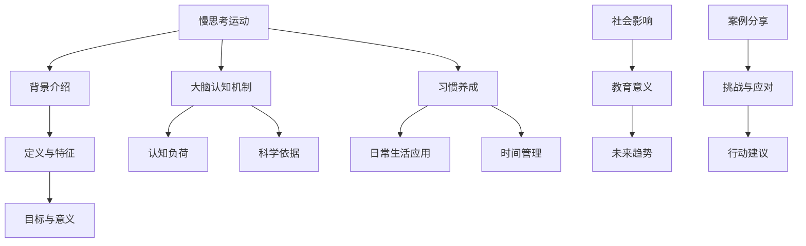

                 

### 《慢思考运动：对抗快餐式信息消费》

#### 关键词
- 慢思考
- 快餐式信息消费
- 注意力管理
- 大脑认知机制
- 时间管理

#### 摘要
随着信息时代的到来，快餐式信息消费成为了日常生活的常态。然而，这种快速消费信息的方式不仅降低了我们的思考质量，还可能对心理健康产生负面影响。慢思考运动应运而生，旨在引导人们放慢节奏，提高思考的深度与质量。本文将详细探讨慢思考运动的背景、原理、实践方法和其社会影响，并通过案例分析，展示如何在现代社会中有效实践慢思考，以提升个人和社会的思考水平。

## 第一部分：引言

### 1.1 慢思考运动的背景

在当今数字化时代，信息爆炸已经成为不可逆转的趋势。社交媒体、新闻推送和即时通讯等平台不断向用户推送大量信息，使得人们面临前所未有的信息过载问题。这种快餐式信息消费模式，虽然提高了信息的获取速度，但也在一定程度上降低了我们的思考质量和注意力集中度。因此，慢思考运动应运而生，旨在对抗快餐式信息消费，倡导人们在快节奏的生活中保持冷静，深入思考，提升自身的认知能力和思考质量。

### 1.2 慢思考的定义与特征

慢思考（Slow Thinking）是指在面对复杂问题和决策时，采取深入、细致和耐心的思考方式。与快思考（Fast Thinking）相比，慢思考更注重逻辑推理、深入分析和综合考虑，而非依赖直觉和习惯性反应。慢思考的特征包括：

1. **深度分析**：在做出决策之前，对问题进行深入的剖析和分析，确保理解问题的本质和关键因素。
2. **耐心推理**：不急于得出结论，而是通过逐步推理和验证，确保决策的合理性和准确性。
3. **综合考量**：考虑问题的各个方面，而不是仅仅关注单一因素。

### 1.3 慢思考运动的目标

慢思考运动的主要目标是提升思考质量、增强注意力和改善心理健康。通过放慢思考速度，人们能够更好地处理复杂问题，提高决策质量。同时，慢思考有助于提高注意力集中度，减少多任务处理带来的认知负荷。此外，慢思考还有助于减轻心理压力，提升个体的幸福感和心理健康水平。

## 第二部分：慢思考的原理

### 2.1 大脑的认知机制

要理解慢思考的原理，首先需要了解大脑的认知机制。大脑是人类思考的源泉，其信息处理能力、注意力的形成与调节、记忆与认知过程都是慢思考的基础。

#### 大脑的信息处理能力

大脑是人体中最复杂、最强大的器官之一，具有卓越的信息处理能力。大脑由数十亿个神经元组成，通过复杂的神经网络进行信息传递和处理。信息处理能力取决于神经网络的连接强度和复杂度，以及大脑的学习和适应能力。

#### 注意力的形成与调节

注意力是指大脑对特定信息或任务的集中关注能力。注意力的形成与调节受多种因素影响，包括大脑的生理结构、心理状态和环境刺激等。大脑中的前额叶皮质和顶叶皮质是注意力调节的关键区域，它们通过神经信号调控其他大脑区域的活动，实现注意力的分配和集中。

#### 记忆与认知过程

记忆和认知是大脑的核心功能之一。记忆包括短期记忆和长期记忆，分别对应信息的临时存储和持久保存。短期记忆主要依赖于大脑的海马区和前额叶皮质，而长期记忆则涉及更为复杂的神经网络和突触连接。

### 2.2 慢思考与认知负荷

认知负荷是指大脑在处理信息时所需的认知资源。快思考往往会导致认知负荷过高，使得大脑难以有效处理复杂信息，从而降低思考质量。慢思考则通过减少认知负荷，帮助大脑更好地处理复杂问题。

#### 认知负荷的概念

认知负荷是指大脑在处理信息时所需的认知资源，包括注意力、记忆、推理和判断等。认知负荷过高会导致大脑疲劳，降低思考质量和效率。

#### 快思考带来的认知负荷

快思考依赖于直觉和习惯性反应，往往不涉及深入的逻辑推理和分析。这种方式虽然能快速处理简单问题，但在面对复杂问题时，容易导致认知负荷过高，使得大脑难以有效处理信息。

#### 减轻认知负荷的方法

1. **分解任务**：将复杂任务分解为更小的子任务，有助于降低每个子任务的认知负荷。
2. **提前规划**：在任务开始之前，制定详细的计划和策略，有助于减少任务过程中的认知负荷。
3. **优化环境**：创造一个有利于集中注意力的环境，如减少噪音和干扰，有助于降低认知负荷。

### 2.3 慢思考的科学依据

慢思考不仅是一种实践方法，也有坚实的科学依据。以下从大脑研究、神经科学研究和心理学研究三个方面，探讨慢思考的科学基础。

#### 大脑研究的最新进展

大脑研究的最新进展为我们理解慢思考提供了新的视角。例如，功能性磁共振成像（fMRI）技术可以实时监测大脑的活动，揭示不同思考模式对大脑的影响。研究表明，慢思考可以激活大脑的前额叶皮质，提高认知控制和逻辑推理能力。

#### 神经科学研究对慢思考的支持

神经科学研究证实，慢思考与大脑中的多种神经回路有关。例如，前额叶皮质和前扣带回是慢思考的重要区域，它们通过调节其他大脑区域的活动，实现慢思考的功能。此外，神经可塑性研究也表明，通过持续的慢思考训练，可以改变大脑的结构和功能，提高认知能力。

#### 心理学研究对慢思考的解释

心理学研究为慢思考提供了理论支持。例如，认知心理学研究指出，慢思考有助于提高决策质量，减少决策偏差。此外，心理学研究还发现，慢思考可以改善情绪调节，降低焦虑和压力水平。

## 第三部分：实践慢思考

### 3.1 慢思考的习惯养成

养成慢思考的习惯是提升思考质量的关键。以下是一些建议，帮助您在日常生活中实践慢思考：

1. **设定明确的目标**：在开始思考之前，明确思考的目标和问题，有助于集中注意力，提高思考的深度。
2. **限制信息摄入**：减少不必要的社交媒体和新闻推送，降低信息过载，为慢思考创造空间。
3. **专注练习**：通过冥想、阅读和写作等练习，提高专注力和思考深度。
4. **反思与总结**：在思考结束后，进行反思和总结，巩固思考成果，提高思考质量。

### 3.2 慢思考在日常生活中的应用

慢思考不仅适用于工作场合，还可以在日常生活的各个方面发挥作用。以下是一些应用场景：

1. **决策制定**：在面对重要决策时，采用慢思考的方法，深入分析各种因素，确保决策的合理性和准确性。
2. **学习与教育**：在学习和教育过程中，采用慢思考的方法，深入理解和掌握知识点，提高学习效果。
3. **沟通与交流**：在沟通和交流中，采用慢思考的方法，仔细倾听和理解对方观点，提高沟通质量。

### 3.3 慢思考与时间管理

时间管理是提高工作效率和生活质量的重要手段。慢思考在时间管理中也有重要的应用：

1. **任务分解**：将复杂任务分解为更小的子任务，有助于降低每个子任务的认知负荷，提高任务完成的效率。
2. **提前规划**：在任务开始之前，制定详细的计划和策略，有助于减少任务过程中的认知负荷，提高任务完成的质量。
3. **优先级排序**：根据任务的紧急程度和重要性，合理分配时间和精力，确保关键任务的优先处理。

## 第四部分：慢思考运动的社会影响

### 4.1 慢思考运动的社会意义

慢思考运动具有重要的社会意义。首先，它有助于对抗信息过载，提高人们的思考质量和注意力集中度。其次，慢思考可以提升社会的思考水平，促进创新和进步。此外，慢思考还有助于改善心理健康，提升个体的幸福感和生活质量。

### 4.2 慢思考运动的教育意义

在教育领域，慢思考运动具有深远的影响。首先，它有助于培养学生的深度思考能力，提高学习效果。其次，慢思考可以改善师生关系，促进教学相长。此外，慢思考还可以帮助学生更好地应对考试压力，提高综合素质。

### 4.3 慢思考运动的未来趋势

随着社会对慢思考的认识逐渐加深，慢思考运动有望在未来得到更广泛的应用。未来，慢思考可能会成为教育、工作和社会生活的重要组成部分。同时，慢思考研究也将不断深入，为慢思考的实践提供更多科学依据和方法指导。

## 第五部分：案例分析

### 5.1 成功的慢思考实践案例

以下是一些成功的慢思考实践案例，展示了慢思考在不同领域的应用：

1. **企业中的慢思考应用**：某科技公司在项目决策中采用慢思考方法，通过深入分析市场趋势和用户需求，确保项目方向的正确性和可行性，从而取得了显著的成功。
2. **个人生活中的慢思考实践**：某创业者通过慢思考方法，在创业过程中不断反思和调整，最终成功实现了创业目标。
3. **教育领域的慢思考案例**：某学校在教学中引入慢思考理念，通过培养学生的深度思考能力，显著提高了学生的学习成绩和综合素质。

### 5.2 慢思考运动的挑战与应对

虽然慢思考运动具有许多优势，但在实际应用中也面临着一些挑战。以下是一些常见的挑战及应对策略：

1. **文化适应**：不同文化背景下，人们对慢思考的接受程度不同。为了推广慢思考，需要充分考虑文化差异，制定合适的推广策略。
2. **技术支持**：慢思考需要一定的技术和工具支持，如冥想应用、时间管理工具等。未来，随着技术的发展，这些工具将更加丰富和便捷，有助于慢思考的实践。
3. **个人习惯**：改变快节奏的生活方式，养成慢思考的习惯需要时间和毅力。为了克服这一挑战，可以通过逐步调整生活方式，逐步养成慢思考的习惯。

## 第六部分：结论

### 6.1 慢思考运动的总结

慢思考运动是一种对抗快餐式信息消费的有效策略。通过放慢思考速度，提高思考深度和质量，慢思考有助于提升个人的认知能力和生活质量。同时，慢思考运动也具有广泛的社会意义，可以促进社会的创新和进步。在未来，随着对慢思考认识的不断加深，慢思考有望成为社会生活的重要组成部分。

### 6.2 鼓励读者行动

参与慢思考运动，不仅可以帮助个人提升思考能力，还能为社会带来积极影响。以下是一些建议，帮助您在日常生活中实践慢思考：

1. **设定思考目标**：明确思考的目标和问题，有助于集中注意力，提高思考的深度。
2. **减少信息摄入**：限制不必要的社交媒体和新闻推送，为思考创造空间。
3. **培养专注力**：通过冥想、阅读和写作等练习，提高专注力和思考深度。
4. **反思与总结**：在思考结束后，进行反思和总结，巩固思考成果，提高思考质量。
5. **分享经验**：与他人分享慢思考的经验和感悟，促进慢思考的传播和应用。

### Mermaid 流程图

[作者：AI天才研究院/AI Genius Institute & 禅与计算机程序设计艺术 /Zen And The Art of Computer Programming]

