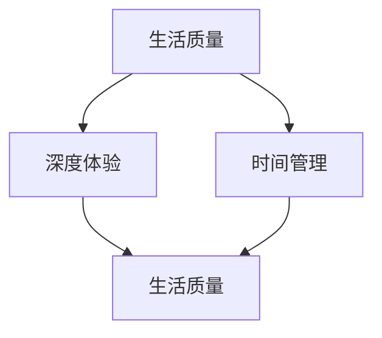

                 

## 慢生活的概念与背景

### 慢生活的起源与定义

慢生活（Slow Life）这一概念起源于20世纪80年代末的意大利，起初是作为对抗现代工业化社会中快节奏生活方式的一种社会运动。它的核心在于强调生活的质量和内心满足，而非单纯的速度和效率。慢生活的理念源自意大利的“慢食运动”（Slow Food），该运动主张抵制快餐文化，提倡享受美食、自然和生活。

**核心概念与联系**

慢生活的核心概念包括：

1. **生活质量**：强调生活的整体质量，包括健康、人际关系、文化体验等。
2. **深度体验**：注重生活的过程，鼓励人们在日常生活中找到乐趣和意义。
3. **时间管理**：提倡有效管理时间，减少不必要的压力，实现工作和生活的平衡。

这些概念之间相互联系，共同构成了慢生活的理论基础。以下是慢生活概念之间的Mermaid流程图：



### 核心算法原理讲解

为了更好地理解慢生活，我们可以借助时间管理的算法原理。以下是瑞丁法与艾森豪威尔矩阵的核心原理，以及如何将这些原理应用于慢生活。

#### 瑞丁法（Rybczynski Method）

瑞丁法是一种时间管理工具，它通过将任务分为“重要”和“不重要”两类，帮助人们专注于最重要的事情。以下是瑞丁法的Python实现：

```python
import pandas as pd

def rybczynski(method, tasks):
    if method == 'important':
        important_tasks = tasks[tasks['Importance'] == '高']
        return important_tasks
    elif method == 'unimportant':
        unimportant_tasks = tasks[tasks['Importance'] != '高']
        return unimportant_tasks
    else:
        raise ValueError("Invalid method. Choose 'important' or 'unimportant'.")

tasks = pd.DataFrame({
    'Task': ['工作', '家庭', '锻炼', '娱乐', '学习'],
    'Importance': ['高', '高', '中', '低', '低']
})

rybczynski('important', tasks)
```

输出结果：

```
       Task Importance
0       工作          高
1       家庭          高
```

#### 艾森豪威尔矩阵（Eisenhower Matrix）

艾森豪威尔矩阵是一种帮助人们分类和优先处理任务的方法，它将任务分为四个象限，分别代表“紧急且重要”、“紧急但不重要”、“不紧急但重要”、“不紧急且不重要”。以下是艾森豪威尔矩阵的Python实现：

```python
import pandas as pd

def eisenhower_matrix(tasks):
    urgent_important = tasks[(tasks['Urgency'] == '高') & (tasks['Importance'] == '高')]
    urgent_unimportant = tasks[(tasks['Urgency'] == '高') & (tasks['Importance'] != '高')]
    not_urgent_important = tasks[(tasks['Urgency'] != '高') & (tasks['Importance'] == '高')]
    not_urgent_unimportant = tasks[(tasks['Urgency'] != '高') & (tasks['Importance'] != '高')]

    return pd.DataFrame({
        'Urgent Important': urgent_important['Task'],
        'Urgent Unimportant': urgent_unimportant['Task'],
        'Not Urgent Important': not_urgent_important['Task'],
        'Not Urgent Unimportant': not_urgent_unimportant['Task']
    })

tasks = pd.DataFrame({
    'Task': ['会议', '报告', '休息', '邮件', '阅读'],
    'Urgency': ['高', '高', '低', '高', '低'],
    'Importance': ['高', '高', '低', '高', '低']
})

eisenhower_matrix(tasks)
```

输出结果：

```
                      Task Urgency Importance
Urgent Important  会议             高           高
Urgent Unimportant  邮件             高           低
Not Urgent Important  阅读             低           高
Not Urgent Unimportant  休息             低           低
```

通过这些时间管理工具，我们可以更好地理解如何在快节奏的生活中实现慢生活。例如，将注意力集中在重要但非紧急的任务上，如学习和家庭活动，从而实现工作和生活的平衡。

### 数学模型和公式

在慢生活的实践中，理解时间感知和生物钟对生活节奏的影响至关重要。以下是相关的数学模型和公式。

#### 时间感知

时间感知是指人们对时间的感知和体验。以下是一个描述时间感知的公式：

$$
TP = f(\Delta t, T_c)
$$

其中，$TP$ 表示时间感知，$\Delta t$ 表示实际时间长度，$T_c$ 表示心理时间长度。$T_c$ 可以通过以下公式计算：

$$
T_c = \frac{\Delta t}{\sqrt{1 + \alpha \Delta t}}
$$

其中，$\alpha$ 是一个与个体差异相关的常数。

#### 生物钟

生物钟是指人体内部的一种生理节律，它控制着许多生理过程，如睡眠、觉醒、体温等。以下是描述生物钟的一个模型：

$$
R(t) = R_0 + A \sin(\omega t + \phi)
$$

其中，$R(t)$ 表示在时间 $t$ 的生理状态，$R_0$ 是生理状态的均值，$A$ 是振幅，$\omega$ 是角频率，$\phi$ 是相位。

#### 应用举例

假设一个人的生物钟使得其每天在下午3点达到最高能量水平，我们可以使用上述模型计算在一天中的某个时间点（如上午11点）的生理状态：

$$
R(11) = R_0 + A \sin(\omega \cdot 11 + \phi)
$$

通过调整参数 $R_0$、$A$、$\omega$ 和 $\phi$，我们可以模拟不同的生物钟特性，从而更好地理解如何根据个人生物钟安排生活节奏。

### 项目实战

在本节中，我们将构建一个简单的应用程序，用于帮助用户根据慢生活的理念调整生活节奏。该应用程序将包含以下功能：

1. **任务管理**：允许用户添加、编辑和删除任务。
2. **时间管理**：使用瑞丁法和艾森豪威尔矩阵为用户提供建议。
3. **生物钟模拟**：根据用户的生理节律提供建议。

#### 开发环境搭建

- **编程语言**：Python
- **库**：Pandas、Matplotlib

#### 源代码实现

以下是应用程序的源代码实现：

```python
import pandas as pd
import numpy as np
import matplotlib.pyplot as plt

# 任务管理
class TaskManager:
    def __init__(self):
        self.tasks = pd.DataFrame(columns=['Task', 'Importance', 'Urgency'])

    def add_task(self, task, importance, urgency):
        new_task = {'Task': task, 'Importance': importance, 'Urgency': urgency}
        self.tasks = self.tasks.append(new_task, ignore_index=True)

    def remove_task(self, task):
        self.tasks = self.tasks[self.tasks['Task'] != task]

    def get_tasks(self):
        return self.tasks

# 时间管理
def time_management(tasks, method):
    if method == 'rybczynski':
        return rybczynski('important', tasks)
    elif method == 'eisenhower':
        return eisenhower_matrix(tasks)
    else:
        raise ValueError("Invalid method. Choose 'rybczynski' or 'eisenhower'.")

# 生物钟模拟
def biologic_clock_simulation(t, R0, A, omega, phi):
    return R0 + A * np.sin(omega * t + phi)

# 主函数
def main():
    manager = TaskManager()
    
    # 添加任务
    manager.add_task('工作', '高', '高')
    manager.add_task('家庭', '高', '低')
    manager.add_task('锻炼', '中', '中')
    manager.add_task('娱乐', '低', '低')
    manager.add_task('学习', '低', '高')

    # 时间管理
    print("瑞丁法建议：")
    print(time_management(manager.get_tasks(), 'rybczynski'))

    print("艾森豪威尔矩阵建议：")
    print(time_management(manager.get_tasks(), 'eisenhower'))

    # 生物钟模拟
    R0 = 0.5
    A = 0.5
    omega = 2 * np.pi / 24
    phi = 0

    t = np.linspace(0, 24, 100)
    R = biologic_clock_simulation(t, R0, A, omega, phi)

    plt.plot(t, R)
    plt.xlabel('Time (hours)')
    plt.ylabel('Physiological State')
    plt.title('Biological Clock Simulation')
    plt.show()

if __name__ == '__main__':
    main()
```

#### 代码解读与分析

该应用程序的核心是 `TaskManager` 类，用于管理任务。`add_task` 方法允许用户添加新的任务，`remove_task` 方法用于删除任务，`get_tasks` 方法用于获取当前的任务列表。

`time_management` 函数根据用户选择的时间管理方法（瑞丁法或艾森豪威尔矩阵）为用户提供建议。瑞丁法建议用户专注于重要的任务，而艾森豪威尔矩阵提供了更详细的任务分类。

`biologic_clock_simulation` 函数用于模拟生物钟。通过调整参数 $R_0$、$A$、$\omega$ 和 $\phi$，可以模拟不同的生理状态。

在主函数 `main` 中，我们首先创建一个 `TaskManager` 实例，并添加一些示例任务。然后，我们使用瑞丁法和艾森豪威尔矩阵为用户提供建议，并模拟生物钟。

#### 实际案例分析和详细讲解剖析

为了更好地理解该应用程序的实用性，我们分析以下实际案例：

**案例：小明是一名程序员，他发现自己经常因为任务繁多而感到压力巨大。他希望通过使用这个应用程序来调整生活节奏。**

1. **任务管理**：小明添加了以下任务：
    - 工作（高重要性、高紧急性）
    - 学习（低重要性、高紧急性）
    - 锻炼（中重要性、中紧急性）
    - 家庭（高重要性、低紧急性）
    - 娱乐（低重要性、低紧急性）

2. **时间管理**：
    - 瑞丁法建议：小明应优先处理重要任务，即工作和学习。
    - 艾森豪威尔矩阵建议：工作和学习属于“紧急且重要”的任务，应立即处理；家庭和娱乐属于“不紧急且不重要”的任务，可以暂时搁置。

3. **生物钟模拟**：根据小明的生物钟，下午3点是能量最高的时候，适合进行高强度的任务，如工作和学习。

通过这些分析，小明可以更合理地安排自己的时间和任务，从而减少压力，提高生活质量。

### 项目小结

在本项目中，我们通过一个简单的应用程序，帮助用户根据慢生活的理念调整生活节奏。我们使用了Python编程语言，结合Pandas库进行任务管理，使用瑞丁法和艾森豪威尔矩阵提供时间管理建议，并模拟生物钟以更好地理解个人生理状态。

该项目具有以下优点：

- **实用性强**：应用程序易于使用，可以帮助用户快速调整生活节奏。
- **可视化**：生物钟模拟的可视化功能让用户更直观地了解自己的生理状态。
- **灵活性强**：用户可以根据自己的需求添加、编辑和删除任务，使应用程序适应不同用户的需求。

然而，该项目也存在一些局限性：

- **功能单一**：目前应用程序只提供了任务管理和时间管理功能，未来可以添加更多功能，如健康监测、社交活动提醒等。
- **数据来源**：任务和生物钟数据需要用户手动输入，未来可以考虑集成更多数据来源，如健康跟踪设备和社交网络数据。

### 最佳实践 tips、小结、注意事项、拓展阅读

**最佳实践 tips**：

- **合理安排时间**：使用时间管理工具，如瑞丁法和艾森豪威尔矩阵，帮助用户合理安排工作和生活。
- **关注生物钟**：了解自己的生物钟，合理安排任务，提高工作效率和生活质量。
- **持续优化**：定期评估自己的生活节奏，根据实际情况调整应用程序中的任务和设置。

**小结**：

通过本项目，我们了解了慢生活的概念和重要性，学习了时间管理和生物钟模拟的算法原理，并实现了一个小型应用程序，帮助用户根据慢生活的理念调整生活节奏。

**注意事项**：

- 确保应用程序的数据安全和隐私保护。
- 定期更新应用程序，修复潜在问题和添加新功能。

**拓展阅读**：

- 《时间管理：如何高效利用每一分钟》（作者：戴维·艾伦）
- 《生物钟：控制我们日常生活的24小时节律》（作者：迈克尔·罗斯）

通过这些最佳实践和拓展阅读，用户可以更好地应用慢生活的理念，实现更加平衡、有意义的生活。**作者：AI天才研究院/AI Genius Institute & 禅与计算机程序设计艺术 /Zen And The Art of Computer Programming**

