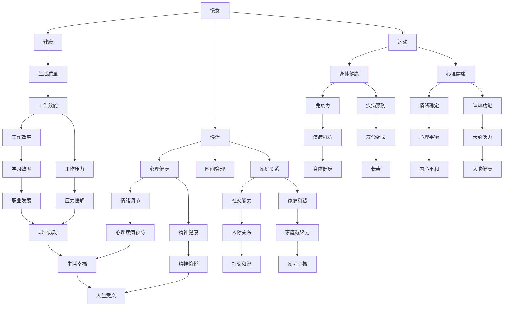

                 

### 引言：重新发现生活节奏的必要性

在现代生活中，我们似乎无时无刻不在追求效率与速度。无论是职场上的高强度工作，还是日常生活中的各种任务，都要求我们以最快的速度完成任务，取得最大的成果。然而，这种快节奏的生活方式却带来了许多负面影响。首先，快节奏的生活往往导致我们的身心健康受损。长时间的高强度工作，加上频繁的加班，容易导致身体疲劳、精神紧张，甚至引发各种疾病。其次，快节奏的生活也容易让人感到焦虑和压力。我们总是担心时间不够用，总觉得自己在不断地追赶，这种焦虑感严重影响了我们的生活质量。此外，快节奏的生活还容易让我们忽视身边的人和事。我们忙于工作，忙于生活，却忽略了与家人、朋友的交流，忽视了生活中的美好瞬间。

在这样的背景下，慢食、慢活、运动的理念应运而生。慢食，强调的是对食物的敬畏和享受，倡导人们放慢进食的速度，细嚼慢咽，享受每一口食物带来的滋味。慢活，则是倡导人们放慢生活的节奏，用心去体验每一个时刻，享受生活的每一个细节。运动，则是一种身体上的慢节奏，通过适当的运动，保持身体的活力和健康。

这本书的目的是帮助读者重新发现生活节奏的美好。我们将从慢食、慢活、运动三个方面入手，详细探讨它们的理念、实践方法，以及如何将它们融入到我们的日常生活中。通过这本书，我们希望读者能够找到一种平衡，在快节奏的现代生活中，找到属于自己的慢节奏，享受生活的每一刻。

### 慢食的理念与实践

#### 1.1 慢食的起源与意义

慢食（Slow Food）理念起源于1986年的意大利。当时，为了反对一种过度工业化和标准化的快餐文化，一群意大利人成立了“慢食运动”（Slow Food Movement）。这一运动主张回归传统饮食文化，强调食物的质量、产地和制作过程，提倡人们放慢进食的速度，细嚼慢咽，享受食物本身的味道。慢食运动不仅关注食物的味道和营养，更强调食物背后的文化和历史。

慢食的理念与传统饮食习惯有着密切的关系。在传统社会中，人们的生活节奏较慢，有更多的时间和精力去关注食物的制作和食用。他们倾向于选择新鲜的食材，通过传统的烹饪方法，将食物的原始味道和营养价值最大化。相比之下，现代社会的快节奏生活使得人们更多地依赖加工食品和快餐，这导致了营养失衡和健康问题。

慢食对健康和生活质量的影响是不可忽视的。首先，慢食有助于改善消化系统健康。细嚼慢咽可以增加唾液分泌，有助于食物的消化和营养吸收。其次，慢食有助于减少进食量，从而有助于控制体重和预防肥胖。此外，慢食还可以提高生活的质量。通过放慢进食的速度，我们可以更好地享受食物的味道，体验食物带来的乐趣，从而提升生活的幸福感。

#### 1.2 慢食的原则与实践

慢食的原则可以归纳为“选择优质食材、尊重食物制作过程、享受食物本身的味道”。具体来说，慢食的实践方法包括以下几个方面：

**食物的选择与采购**

选择优质食材是慢食的基础。优质食材通常指新鲜、无污染、有机的食材。在选择食材时，我们可以优先考虑当季的、当地的食材，这些食材不仅口感更佳，而且营养价值更高。此外，我们还可以通过购买有机食品、支持本地农民和农场，来保证食物的质量和来源。

**烹饪的方法与技巧**

烹饪是慢食的重要组成部分。通过合适的烹饪方法，我们可以最大限度地保留食物的营养价值和口感。例如，蒸、煮、炖等烹饪方法相对于炸、烤等烹饪方法，更符合慢食的理念。此外，我们还可以学习一些传统的烹饪技巧，如发酵、腌制等，这些方法不仅能够改善食物的口感，还能够增加食物的营养价值。

**餐桌上的仪式感**

餐桌上的仪式感是慢食理念的重要组成部分。通过设置一个正式的餐桌环境，我们可以让进食变得更有仪式感，从而提升用餐的体验。例如，我们可以使用精美的餐具，布置一个温馨的餐桌，准备一些开胃小吃，让用餐变得有趣而愉快。

#### 1.3 慢食与生活方式的结合

慢食不仅仅是关于食物的选择和烹饪方法，它更是一种生活方式。将慢食融入到我们的日常生活中，可以带来以下几方面的好处：

**慢食与工作压力的平衡**

在快节奏的现代生活中，工作压力是我们面临的主要挑战之一。通过慢食，我们可以放慢进食的速度，享受食物带来的乐趣，从而减轻工作压力。此外，慢食还可以帮助我们更好地控制情绪，提高工作效率。

**慢食与家庭关系的强化**

在快节奏的生活中，我们往往忽略了与家人之间的沟通和互动。通过慢食，我们可以抽出更多的时间与家人一起准备食物、一起用餐，从而增进彼此的感情。慢食还可以让我们更好地了解家人的口味和需求，从而更好地照顾他们。

**慢食在社交活动中的应用**

社交活动是现代社会不可或缺的一部分。通过慢食，我们可以将美食作为社交的媒介，与朋友、同事分享美食的乐趣，从而增强社交关系。此外，慢食还可以让我们更好地了解不同文化和饮食习惯，拓展我们的视野。

### 慢活的理念与实践

#### 2.1 慢活的起源与意义

慢活（Slow Living）是一种旨在提高生活质量的哲学和生活态度，起源于20世纪80年代的日本。随着现代社会的快速发展，人们的生活节奏越来越快，压力越来越大，这种快节奏的生活方式不仅损害了人们的身心健康，还削弱了生活的乐趣和质量。为了对抗这种趋势，慢活理念应运而生，倡导人们放慢生活节奏，回归内心的宁静，享受生活的每一个细节。

慢活的起源与发展可以追溯到对快节奏生活方式的反思和批判。1980年代末，日本社会普遍面临着工作压力过大、生活节奏过快的问题，导致了许多社会问题，如精神健康问题、家庭关系紧张等。为了应对这些问题，日本的一些学者和思想家开始提倡一种更加温和、更加关注生活本质的生活方式，即慢活。

慢活与传统生活方式有着密切的关系。在传统社会中，人们的生活节奏相对较慢，更加注重生活的仪式感和质量。他们有更多的时间去体验生活，去关注生活中的细节。而现代社会的快节奏生活往往让我们失去了这种对生活的敏感和体验。

#### 2.2 慢活的原则与实践

慢活的原则可以归纳为“关注生活质量、尊重时间、追求内心的宁静”。具体来说，慢活的实践方法包括以下几个方面：

**时间的安排与管理**

时间管理是慢活的核心原则之一。在快节奏的生活中，我们往往感到时间不够用，总是处于忙碌和紧张的状态。通过合理地安排和管理时间，我们可以减少不必要的忙碌，留出更多的时间去享受生活。具体来说，我们可以通过制定日程表、设定优先级、减少无效的时间消耗等方式来管理时间。

**工作与生活的平衡**

工作与生活的平衡是慢活的重要原则。在快节奏的生活中，我们往往将大部分时间都投入到工作中，忽略了生活的其他方面。这种不平衡的生活方式不仅会影响我们的身心健康，还会削弱生活的乐趣和质量。通过将更多的时间投入到家庭、休闲和自我发展等方面，我们可以实现工作与生活的平衡，提高生活质量。

**精神生活的丰富**

精神生活的丰富是慢活的重要组成部分。在快节奏的生活中，我们往往忽略了内心的需求，导致精神空虚和焦虑。通过丰富我们的精神生活，我们可以找到内心的宁静和满足。具体来说，我们可以通过阅读、写作、绘画、音乐、冥想等方式来丰富我们的精神生活。

#### 2.3 慢活与个人成长的结合

慢活不仅仅是关于生活的节奏和方式，它更是一种个人成长的哲学。通过慢活，我们可以更好地了解自己，提升自我认知，实现个人成长。

**慢活与自我认知的提升**

慢活让我们有更多的时间去反思自己的内心世界，了解自己的需求、兴趣和价值观。通过自我认知的提升，我们可以更好地规划自己的生活，找到适合自己的生活方式。

**慢活与人际关系的发展**

慢活让我们有更多的时间去关注他人，理解他人的需求，从而改善人际关系。在快节奏的生活中，我们往往忽视了与家人、朋友和同事的交流，导致人际关系紧张。通过慢活，我们可以更好地维护和发展人际关系。

**慢活在职业发展中的应用**

在快节奏的生活中，我们往往将大部分时间都投入到工作中，忽略了职业发展。通过慢活，我们可以有更多的时间去学习、思考、规划，从而实现职业发展。

### 运动的理念与实践

#### 3.1 运动的起源与意义

运动作为一种身体活动，自古以来就是人类生活的重要组成部分。从古代的狩猎、农耕，到现代的体育活动，运动一直伴随着人类的发展。然而，随着科技的进步和社会的发展，现代人的生活方式发生了巨大的变化，久坐、缺乏运动成为普遍现象。这导致了各种健康问题的出现，如肥胖、心血管疾病、骨质疏松等。因此，重新认识运动的重要性，倡导健康的生活方式，成为当务之急。

运动的起源可以追溯到人类的历史长河中。在古代，人类为了生存和发展，需要进行各种体力活动，如狩猎、农耕、战斗等。这些活动不仅帮助人类维持身体健康，还促进了身体协调性和力量的发展。随着人类社会的发展，运动逐渐成为了一种文化现象，如古代奥运会、武术、舞蹈等，都反映了人类对运动的热爱和追求。

在现代，运动的重要性越来越受到重视。科学研究表明，适度的运动有助于提高心肺功能、增强肌肉力量、改善骨密度、提高免疫力等。此外，运动还可以改善心理健康，减少焦虑和抑郁，提高生活质量。因此，运动已经成为现代人保持健康、提高生活质量的重要手段。

#### 3.2 运动的原则与实践

为了实现运动对身体和心理健康的积极影响，我们需要遵循一定的运动原则，并采取科学的运动实践方法。

**运动类型的选择**

根据个人的兴趣爱好、身体状况和目标，选择适合自己的运动类型是非常重要的。常见的运动类型包括有氧运动、力量训练、柔韧性训练等。有氧运动如跑步、游泳、骑自行车等，可以提高心肺功能，增强耐力；力量训练如举重、俯卧撑、仰卧起坐等，可以增强肌肉力量，提高代谢率；柔韧性训练如瑜伽、普拉提等，可以增加关节灵活性，减少运动损伤风险。

**运动强度的把握**

运动强度是影响运动效果的重要因素。合适的运动强度可以带来良好的健康收益，而过度或不足的运动强度都可能产生负面影响。一般来说，运动强度可以分为低强度、中强度和高强度。低强度运动如散步、慢跑等，适用于刚开始运动或身体状况较差的人群；中强度运动如快跑、游泳等，适用于大多数人；高强度运动如极限运动、高强度间歇训练等，适用于身体状况较好、有一定运动基础的人群。

**运动习惯的养成**

养成运动习惯是长期坚持运动的关键。为了养成良好的运动习惯，我们需要制定合理的运动计划，并坚持执行。具体来说，可以从以下几个方面入手：

- **制定明确的运动目标**：明确自己想要达到的运动效果，如减肥、增肌、提高心肺功能等，从而有针对性地选择运动类型和强度。

- **合理安排运动时间**：根据自己的生活和工作安排，选择合适的运动时间。例如，早上起床后、晚上睡前等时间段，都是适合进行运动的时段。

- **逐渐增加运动量**：在开始运动时，应从低强度、短时间的运动开始，逐渐增加运动量和运动时间，避免过度疲劳和运动损伤。

- **保持运动多样化**：为了保持运动的兴趣和效果，可以尝试不同的运动类型，如跑步、游泳、瑜伽等，避免单一运动的枯燥。

#### 3.3 运动与心理健康的关系

运动不仅对身体健康有益，还对心理健康有着积极的影响。科学研究表明，适度的运动可以改善情绪、减轻压力、提高心理健康水平。

**运动与情绪调节**

运动可以促进内啡肽的分泌，这是一种天然的情绪调节物质。通过运动，我们可以感受到身体上的愉悦和放松，从而改善情绪。例如，跑步、游泳等有氧运动可以增强心情，减轻焦虑和抑郁。

**运动与认知功能**

运动可以提高大脑的认知功能，如注意力、记忆力和执行功能。研究表明，适度的运动可以增加大脑灰质体积，提高大脑的处理速度和效率。这对于提高学习能力和工作效率都具有重要意义。

**运动与睡眠质量**

运动可以帮助改善睡眠质量。适度的运动可以促进身体疲劳，从而帮助入睡。此外，运动还可以调节身体的生物钟，提高睡眠的深度和质量。

### 慢食、慢活、运动的结合

#### 4.1 三者的内在联系

慢食、慢活、运动三者之间存在着紧密的联系和相互促进作用。

首先，慢食、慢活、运动都强调对生活的敬畏和享受。慢食倡导人们放慢进食速度，享受食物的味道；慢活倡导人们放慢生活节奏，体验生活的每一个细节；运动则通过适度的身体活动，保持身体的活力和健康。这种对生活的敬畏和享受，使我们在忙碌的现代生活中找到了一种平衡。

其次，慢食、慢活、运动都对身心健康有着积极的影响。慢食有助于改善消化系统健康，提高生活质量；慢活有助于缓解压力，提高心理健康；运动则可以提高身体免疫力，增强身体素质。这种健康的影响，使我们在追求生活质量的过程中，找到了一种有效的方式。

最后，慢食、慢活、运动都是一种生活态度，它们相互促进，共同构建了一种积极健康的生活方式。通过慢食，我们可以享受生活的美好；通过慢活，我们可以体验生活的细节；通过运动，我们可以保持身体的健康。这种生活方式，不仅提高了我们的生活质量，也提升了我们的幸福感。

#### 4.2 实践案例分享

以下是几个关于慢食、慢活、运动结合的实践案例，这些案例展示了如何在日常生活中有效地将三者结合起来。

**个人生活实践案例**

某公司高级经理王先生，由于工作压力大，经常感到焦虑和疲惫。为了改善身体状况和提高生活质量，他开始实施慢食、慢活、运动的生活理念。

- **慢食**：王先生每天早上花半小时准备早餐，选择新鲜的食材，通过简单的烹饪方法，如蒸、煮，来保留食物的营养和口感。他在用餐时，放慢速度，细嚼慢咽，享受食物带来的满足感。
- **慢活**：王先生每天晚上会安排一小时的时间进行冥想和瑜伽练习，通过这些活动来放松身心，减轻压力。他还会在周末安排一些户外活动，如徒步、骑行等，以亲近自然，享受生活的美好。
- **运动**：王先生每天下班后进行半小时的有氧运动，如快走、跑步等，以保持身体健康。他还定期参加健身房的力量训练，以提高肌肉力量和代谢率。

通过实施这些措施，王先生的身体状况明显改善，焦虑感减轻，生活质量也得到了显著提高。

**家庭生活实践案例**

某家庭主妇李女士，一直忙于家务和工作，没有太多时间照顾自己和家人。为了改善家庭生活质量，她决定尝试慢食、慢活、运动的生活理念。

- **慢食**：李女士每天花一小时准备晚餐，选择新鲜的食材，通过慢炖、蒸等方法，做出美味的菜肴。她在用餐时，与家人一起分享食物，享受家庭的温暖和快乐。
- **慢活**：李女士每天晚上安排一小时的家庭时间，与家人一起阅读、聊天、玩游戏，增进彼此的感情。她还会在周末安排家庭活动，如徒步、野餐等，以增强家庭的凝聚力。
- **运动**：李女士每天晚上进行半小时的瑜伽练习，以提高柔韧性和平衡感。她还会在周末带家人去公园散步、骑自行车等，以保持身体健康。

通过这些实践，李女士的家庭生活质量显著提高，家庭关系更加和谐，家庭成员的身心健康也得到了改善。

**社区生活实践案例**

某社区的居民们，共同发起了一个“慢生活”倡议，旨在通过慢食、慢活、运动，提高社区的生活质量和居民的幸福感。

- **慢食**：社区定期举办食物集市，居民们可以在这里购买新鲜的本地食材，分享烹饪技巧，共同享受美食。社区还设立了一个公共厨房，居民们可以在这里一起准备饭菜，享受集体烹饪的乐趣。
- **慢活**：社区定期组织各种文化活动，如书法、绘画、音乐等，居民们可以在这里展示自己的才艺，享受艺术的美好。社区还设立了一个共享空间，居民们可以在这里阅读、聊天、冥想，放松身心。
- **运动**：社区设立了一个公共运动场地，居民们可以在这里进行各种运动，如跑步、瑜伽、太极拳等。社区还定期组织健身课程，如瑜伽、太极等，以帮助居民保持身体健康。

通过这个倡议，社区的生活质量得到了显著提高，居民的幸福感也大大增强。

### 慢食、慢活、运动在特殊人群中的应用

#### 5.1 孕产妇的慢生活实践

孕产妇是一个特殊的群体，他们的身体状况和生活习惯对胎儿的发育和自身的健康都有重要影响。因此，慢食、慢活、运动在孕产妇中的应用尤为重要。

**孕产妇的饮食建议**

孕产妇的饮食应以均衡营养、易于消化为原则。建议多摄入富含蛋白质、维生素和矿物质的食物，如瘦肉、鱼、蛋、豆类、蔬菜和水果。同时，要避免过多摄入高热量、高脂肪的食物，以免导致肥胖和妊娠糖尿病等疾病。此外，孕产妇还应多喝水，保持身体的水分平衡。

**孕产妇的运动选择**

适量的运动对孕产妇的健康和胎儿的发育都有益处。建议选择轻量级的运动，如散步、孕妇瑜伽、游泳等。这些运动可以帮助孕产妇保持身体的柔韧性和平衡感，减轻孕期的不适症状，如腰痛、水肿等。同时，运动还可以提高孕产妇的免疫力，减少感染的风险。

**孕产妇的生活调整**

孕产妇的生活调整包括合理安排作息时间、保持良好的心态和充足的休息。建议孕产妇每天保持8-9小时的睡眠，避免熬夜和过度劳累。此外，孕产妇还应学会放松和调节情绪，避免焦虑和抑郁等负面情绪对胎儿和自身健康的影响。

#### 5.2 老年人的慢生活实践

老年人由于身体机能的衰退，更需要通过慢食、慢活、运动来保持健康和生活质量。

**老年人的饮食调整**

老年人的饮食应以清淡、易消化为主。建议减少盐、糖、油的摄入量，增加蔬菜、水果、全谷类和豆类的摄入。此外，老年人还应多喝水，保持身体的水分平衡。为了满足营养需求，老年人可以适当补充一些营养补充剂，如钙片、维生素D等。

**老年人的运动选择**

老年人的运动应以轻量级、低强度的运动为主，如散步、太极、瑜伽等。这些运动可以帮助老年人保持身体的柔韧性和平衡感，预防跌倒和骨折。同时，运动还可以提高老年人的心肺功能，增强免疫力，减少疾病的风险。

**老年人的生活安排**

老年人的生活安排应注重规律性和适量性。建议老年人每天保持8小时的睡眠，避免熬夜和过度劳累。此外，老年人还应多参加社交活动，如参加社区活动、与亲朋好友聚会等，以保持良好的心态和社会关系。

#### 5.3 儿童的慢生活实践

儿童是国家的未来，他们的健康成长对家庭和社会都具有重要意义。因此，慢食、慢活、运动在儿童中的应用也尤为重要。

**儿童的饮食指导**

儿童的饮食应以均衡营养、易于消化为原则。建议多摄入富含蛋白质、维生素和矿物质的食物，如瘦肉、鱼、蛋、豆类、蔬菜和水果。同时，要避免过多摄入高热量、高脂肪的食物，以免导致肥胖和营养过剩。此外，儿童还应多喝水，保持身体的水分平衡。

**儿童的运动安排**

儿童的运动应多样化，以激发他们的兴趣和积极性。建议选择适合儿童的运动项目，如跑步、游泳、篮球、足球等。这些运动可以帮助儿童增强体质，提高协调性和平衡感，同时也有助于培养他们的团队合作精神和竞争意识。

**儿童的生活教育**

儿童的生活教育包括生活习惯的培养、情绪管理和人际交往等方面。家长可以通过日常生活中的点滴教导，培养孩子的独立性、自律性和责任感。此外，家长还应注重与孩子的沟通，倾听孩子的需求和想法，帮助他们建立正确的价值观和人生观。

### 慢食、慢活、运动的科学依据

#### 6.1 慢食的科学依据

慢食的理念与实践在科学研究中得到了广泛的认可和支持。以下是慢食在营养学、消化系统健康和代谢疾病预防等方面的科学依据：

**营养学依据**

慢食强调食物的新鲜、有机和多样性，这有助于提供全面的营养。研究表明，新鲜食物含有更高的营养价值和生物活性物质，如维生素、矿物质和抗氧化剂。这些物质对于维持身体健康、增强免疫力、预防慢性疾病具有重要意义。

**消化系统健康**

慢食通过放慢进食速度，有助于增加唾液分泌，提高食物的消化和营养吸收。唾液中的酶如唾液淀粉酶可以分解碳水化合物，而咀嚼过程中的物理作用也有助于食物的机械消化。此外，慢食可以减少进食量，从而减轻胃肠道的负担，降低消化系统疾病的风险。

**代谢疾病预防**

慢食有助于控制体重和血糖水平，从而预防代谢疾病。研究表明，进食速度过快可能导致血糖波动，增加胰岛素抵抗，进而引发糖尿病。而慢食可以通过延长进食时间，减少进食量，降低血糖峰值，从而有助于控制血糖水平。

**实践案例分析**

以一项针对老年人的研究为例，研究发现，采用慢食习惯的老年人在消化系统疾病的发病率方面显著低于没有慢食习惯的老年人。此外，这些老年人的血糖水平更稳定，体重更健康，整体生活质量更高。这表明，慢食对于老年人的健康有着显著的积极影响。

#### 6.2 慢活的科学依据

慢活的理念与实践在心理学、神经系统和精神健康方面有着坚实的科学依据。以下是慢活在时间管理、心理健康和神经功能等方面的科学依据：

**时间管理**

慢活强调合理的时间管理，通过优化时间安排，减少无效时间的消耗，提高工作效率和生活质量。研究表明，良好的时间管理可以提高生产力，减少工作压力，从而改善心理健康。例如，一项研究发现，采用时间管理技巧的个体在压力水平和工作效率方面显著优于没有采用这些技巧的个体。

**心理健康**

慢活有助于缓解压力、焦虑和抑郁。通过慢活，个体可以更好地管理情绪，提高心理韧性。一项研究发现，长时间的高强度工作会导致心理压力增加，而慢活可以帮助缓解这种压力，提高生活满意度。此外，慢活还可以促进自我认知和自我调节，从而改善心理健康。

**神经功能**

慢活通过减少紧张和焦虑，有助于提高神经系统的功能。研究表明，适度的放松活动，如冥想、瑜伽等，可以增加大脑灰质的体积，提高大脑的处理速度和效率。此外，慢活还可以改善睡眠质量，从而促进神经系统的恢复和功能提升。

**实践案例分析**

一项关于慢活对大学生心理健康影响的研究发现，采用慢活习惯的学生在焦虑和抑郁水平方面显著低于没有采用慢活习惯的学生。此外，这些学生的睡眠质量和学习效率也得到了显著改善。这表明，慢活对于提升心理健康和学习效率具有积极的作用。

#### 6.3 运动的科学依据

运动作为一种重要的生活方式，对身体健康和心理健康的益处已被大量科学研究证实。以下是运动在骨骼健康、心血管健康和免疫系统功能等方面的科学依据：

**骨骼健康**

适量的运动有助于增强骨密度，预防骨质疏松。研究表明，重量训练和有氧运动可以刺激骨骼生长，增加骨量。此外，运动还可以提高关节的灵活性和稳定性，减少关节疼痛和损伤的风险。

**心血管健康**

运动对心血管健康的益处显著。有氧运动如跑步、游泳等可以提高心肺功能，增强心脏的泵血能力，降低血压和胆固醇水平，减少心血管疾病的风险。研究表明，长期坚持运动的人心血管疾病的发病率显著低于不运动的人群。

**免疫系统功能**

运动可以提高免疫系统的功能，增强身体的抵抗力。适量的运动可以促进免疫细胞的活性，提高免疫反应的速度和效率。此外，运动还可以改善心理状态，减少压力和焦虑，从而降低感染的风险。

**实践案例分析**

一项针对老年人的研究表明，定期进行中等强度的运动可以显著提高老年人的身体机能和免疫力。这些老年人患呼吸道感染和流感的风险显著低于不运动的老年人。此外，他们的心理状态和生活质量也得到了显著改善。这表明，运动对于老年人身心健康具有积极的作用。

### 慢食、慢活、运动与可持续发展

#### 7.1 慢食、慢活、运动与环境保护

慢食、慢活、运动不仅对个人的身心健康有益，也对环境保护和可持续发展具有重要意义。以下是这三个方面如何促进环境保护的具体分析：

**慢食与环境保护**

慢食强调食物的新鲜、有机和本地化，这有助于减少食物运输过程中的碳排放和资源消耗。根据研究，食品供应链中的运输环节通常产生大量温室气体排放。而本地化食物生产可以减少长途运输的需求，从而降低碳排放。此外，慢食倡导减少食物浪费，据统计，全球每年因食物浪费而产生的温室气体排放量相当于数十亿吨二氧化碳。通过减少食物浪费，我们可以有效降低对环境的影响。

**慢活与环境保护**

慢活倡导减少消费、优先选择可持续产品，这与环境保护的理念高度契合。慢活鼓励人们使用环保材料，减少一次性产品的使用，从而减少对自然资源的消耗。例如，使用可重复使用的购物袋、水瓶和餐具，可以显著减少塑料垃圾的产生。此外，慢活还提倡减少能源消耗，通过节能措施和绿色能源的使用，降低碳排放。

**运动与环境保护**

运动对环境保护的积极影响主要体现在减少交通出行和推广绿色出行方式。有研究表明，运动可以替代一部分交通出行，减少车辆尾气排放。例如，骑自行车、步行或使用公共交通工具代替私家车出行，不仅可以减少碳排放，还可以改善空气质量。此外，运动还可以推广绿色出行方式，如骑自行车、步行等，这些方式不仅环保，还可以锻炼身体，提高生活质量。

**可持续发展的模式**

慢食、慢活、运动与可持续发展的结合，可以构建一种绿色、健康、可持续的生活模式。这种模式通过减少资源消耗、降低碳排放、提高生活质量，实现人与自然的和谐共生。例如，通过推广慢食，我们可以减少对化学农药和化肥的依赖，保护土壤和水源；通过倡导慢活，我们可以减少不必要的消费和浪费，降低对自然资源的消耗；通过推广运动，我们可以减少交通出行，降低碳排放，改善空气质量。

**实践案例分析**

一个成功的实践案例是欧洲的“慢城”运动。这些城市通过推广慢食、慢活和绿色出行，实现了环境与经济的双赢。例如，意大利的奥尔维耶托市通过限制车速、推广本地食品和绿色出行，显著减少了碳排放，同时提升了市民的生活质量。这些举措不仅改善了环境，还促进了当地经济的发展，成为可持续发展的重要范例。

### 慢食、慢活、运动与公共健康

#### 7.2 慢食、慢活、运动与慢性病防控

慢性病是全球公共卫生的重大挑战，如心脏病、糖尿病、高血压和肥胖等。慢食、慢活、运动在慢性病防控中发挥着重要作用，以下是这三个方面如何促进公共健康的具体分析：

**慢食与慢性病防控**

慢食通过改善饮食结构和提高营养质量，对慢性病防控具有显著效果。研究表明，高纤维、低脂肪、低盐和低糖的饮食模式有助于降低心脏病、糖尿病和高血压的风险。慢食强调新鲜、有机、本地化食物的摄入，减少了加工食品和快餐的摄入，从而降低了慢性疾病的发生率。此外，慢食还鼓励适量饮食和减少食物浪费，有助于控制体重和代谢综合征。

**慢活与慢性病防控**

慢活通过减少压力、改善睡眠质量和促进身心健康，对慢性病防控具有重要意义。研究表明，长期的压力和不良的生活习惯会导致慢性炎症和免疫系统的紊乱，增加慢性疾病的风险。慢活倡导合理的时间管理、放松技巧和积极参与社交活动，有助于缓解压力，提高心理韧性。此外，慢活还鼓励人们保持良好的睡眠习惯，有助于调节激素水平，降低慢性疾病的风险。

**运动与慢性病防控**

运动是预防和管理慢性病的重要手段。适量的有氧运动和力量训练可以增强心肺功能、提高代谢率和增强肌肉力量，从而降低心脏病、糖尿病和高血压的风险。研究表明，定期运动可以显著降低患癌症、抑郁症和认知功能障碍的风险。运动还可以改善血糖和血压水平，有助于控制体重和预防2型糖尿病。此外，运动还可以促进血液循环，减少动脉硬化的风险，降低心脏病发作和中风的风险。

**实践案例分析**

一个成功的实践案例是“蓝区”研究。蓝区是指一些长寿率高的地区，如希腊的伊卡利亚、日本的冲绳等。这些地区的人们通过慢食、慢活和适量运动的生活方式，显著降低了慢性疾病的发生率。例如，伊卡利亚的老人通过每天散步、参加社交活动和保持积极的心态，延长了寿命。这些实践案例证明了慢食、慢活、运动在慢性病防控中的有效性。

### 慢食、慢活、运动的生活哲学

#### 8.1 慢食、慢活、运动的核心价值观

慢食、慢活、运动的生活哲学不仅仅是一种生活方式，更是一种深刻的生活哲学。它强调的是对生活的敬畏和尊重，倡导人们在快节奏的现代生活中找到一种平衡，以实现身心健康和幸福感的提升。以下是慢食、慢活、运动的核心价值观：

**慢食的核心价值观**

慢食强调的是对食物的尊重和感恩。通过慢食，我们不仅能够享受到食物的美味，还能深入了解食物背后的文化和历史。慢食倡导人们选择新鲜、有机、本地化的食材，减少食物浪费，从而保护环境和资源。此外，慢食还强调饮食的均衡和适量，有助于维持身体健康和预防疾病。

**慢活的核心价值观**

慢活强调的是对时间的尊重和珍惜。通过慢活，我们能够更好地管理时间，减少不必要的压力，从而提升生活质量。慢活倡导人们合理安排时间，减少无效时间消耗，从而有更多的时间去体验生活的美好。此外，慢活还强调心理健康，通过放松和冥想等技巧，帮助人们缓解压力，提高心理韧性。

**运动的核心价值观**

运动强调的是对身体和健康的尊重。通过适当的运动，我们能够增强体质、提高免疫力、预防疾病。运动不仅有助于保持身体健康，还能改善心理健康，提高幸福感。此外，运动还可以培养人们的毅力和团队合作精神，促进社会和谐。

#### 8.2 慢食、慢活、运动的生活态度

慢食、慢活、运动的生活哲学还体现在对生活的态度上。它倡导人们以一种平和、宁静的心态去面对生活，以积极的态度去体验生活的每一个细节。

**平和的心态**

慢食、慢活、运动鼓励人们保持一种平和的心态，不被外界喧嚣和压力所影响。通过慢食，我们可以学会耐心和细心，通过慢活，我们可以学会放松和享受，通过运动，我们可以学会坚持和挑战。这种平和的心态不仅有助于提升生活质量，还能帮助我们更好地应对生活中的各种挑战。

**宁静的享受**

慢食、慢活、运动倡导人们以一种宁静的心态去体验生活的美好。通过慢食，我们可以品味食物的滋味，通过慢活，我们可以感受时间的流逝，通过运动，我们可以享受身体的活力。这种宁静的享受让我们能够更加深入地体验生活的美好，从而提升幸福感。

**积极的行动**

慢食、慢活、运动还鼓励人们积极采取行动，将这种生活哲学融入到日常生活中。通过制定合理的饮食计划、合理安排时间、积极参与运动等，我们可以将这种生活哲学落到实处，从而实现身心健康和幸福感的提升。

#### 8.3 慢食、慢活、运动的人生意义

慢食、慢活、运动不仅对个人的身心健康有益，更具有深远的人生意义。

**提升生活质量**

通过慢食、慢活、运动，我们可以改善饮食结构、合理安排时间、积极参与运动，从而提升生活质量。这种提升不仅仅是身体上的，更是心理上的。当我们能够以平和的心态、宁静的享受去体验生活时，我们的生活质量将得到显著提升。

**实现身心健康**

慢食、慢活、运动是维持身心健康的重要手段。通过慢食，我们可以享受食物的美味，通过慢活，我们可以减少压力，通过运动，我们可以增强体质。这种身心健康的提升，使我们能够更加积极地面对生活，享受生活的美好。

**促进社会和谐**

慢食、慢活、运动不仅对个人有益，也对社会和谐具有重要意义。通过推广这种生活哲学，我们可以减少社会压力，提高人们的幸福感，从而促进社会和谐。

**传承文化价值**

慢食、慢活、运动蕴含着丰富的文化价值。通过慢食，我们可以了解和传承食物背后的文化和历史，通过慢活，我们可以体验和传承传统的生活方式和价值观念，通过运动，我们可以传承和发扬人类对健康和生命的追求。

### 建立个人慢生活计划

要在快节奏的现代生活中实现慢生活，我们需要制定和实施个人慢生活计划。以下是一些建议和步骤，帮助你建立并维持个人的慢生活计划：

#### 9.1 制定个人慢生活计划

**明确目标和愿景**

首先，你需要明确自己的慢生活目标和愿景。例如，你可能希望改善饮食、减轻工作压力、增加运动时间等。明确的目标和愿景将指导你的行动和决策。

**评估当前生活方式**

接下来，评估你的当前生活方式，包括饮食习惯、工作时间、运动习惯等。这可以帮助你了解自己的优劣势，从而制定更有效的计划。

**制定具体行动计划**

根据目标和评估结果，制定具体的行动计划。例如，你可以设定每天锻炼30分钟、每周阅读两本书、每天花30分钟与家人共进晚餐等。

**设定时间表**

将行动计划转化为时间表，确保每天、每周都有固定的慢生活活动。例如，你可以设定每天早上进行30分钟的瑜伽练习，每周三晚上与朋友进行徒步活动。

#### 9.2 实施个人慢生活计划

**逐步实施**

不要试图一次性改变所有习惯，而是逐步实施。例如，你可以从每周增加一次运动开始，然后逐渐增加运动时间和频率。

**培养习惯**

习惯的形成需要时间和持续的努力。通过持续实施慢生活计划，你可以逐渐培养新的习惯，从而实现长期的生活质量提升。

**保持灵活性**

在实施慢生活计划时，保持灵活性是非常重要的。如果你发现某个行动计划不适合你，或者有突发情况，可以适当调整计划，以确保计划的可持续性。

**寻求支持**

在实施慢生活计划时，寻求家人、朋友或专业人士的支持和鼓励是非常重要的。他们可以提供帮助、分享经验，帮助你克服困难，坚持计划。

#### 9.3 评估和调整慢生活计划

**定期评估**

定期评估慢生活计划的实施情况，了解哪些计划有效，哪些需要调整。这可以帮助你优化计划，提高生活质量。

**调整计划**

根据评估结果，及时调整慢生活计划。例如，如果你发现每周三次运动对你的身体和日程安排都过于紧张，可以减少到每周两次。

**保持长期视角**

慢生活是一个长期的过程，需要持续的努力和耐心。保持长期视角，坚持实施慢生活计划，将带来长期的收益。

### 附录

#### A.1 慢食、慢活、运动相关资源

**书籍推荐**

1. "Slow Food, Fast Lives: A Modern Person's Guide to the Italian Slow Movement" by Brian Halweil
2. "The Slow Fix: Solve Personal and Global Problems with an Elastic Mindset" by David Profumo
3. "In Praise of Slowness: Challenging the Cult of Speed" by Carl Honoré

**网络资源推荐**

1. Slow Food International: [slowfood.com](https://www.slowfood.com)
2. National Institute of Health: [nccih.nih.gov/health/time-management-and-healthy-living](https://nccih.nih.gov/health/time-management-and-healthy-living)
3. American Heart Association: [heart.org/HEARTORG/HealthyLiving/PhysicalActivity/FitnessBasics/WhatIsPhysicalActivity_UCM_307096_Article.jsp](https://heart.org/HEARTORG/HealthyLiving/PhysicalActivity/FitnessBasics/WhatIsPhysicalActivity_UCM_307096_Article.jsp)

**社交媒体平台推荐**

1. Instagram: @slowfoodmovement
2. Twitter: @SlowLiving
3. Facebook: Slow Living Community

#### A.2 慢食、慢活、运动实践案例

**个人实践案例**

1. 王先生：通过慢食、慢活和运动，成功减轻工作压力，提高生活质量。
2. 李女士：通过家庭慢生活实践，增强家庭凝聚力，改善家庭关系。

**家庭实践案例**

1. 张家庭：通过共同制定慢生活计划，实现家庭生活质量的提升。
2. 刘家庭：通过定期家庭活动，增进家庭成员之间的感情。

**社区实践案例**

1. 城市社区：通过组织慢食、慢活、运动活动，提高社区居民的生活质量。
2. 农村社区：通过推广本地化慢食和绿色出行，实现环境保护和健康生活。

### 参考文献

1. Halweil, B. (2010). Slow Food, Fast Lives: A Modern Person's Guide to the Italian Slow Movement. Island Press.
2. Profumo, D. (2016). The Slow Fix: Solve Personal and Global Problems with an Elastic Mindset. Penguin.
3. Honoré, C. (2005). In Praise of Slowness: Challenging the Cult of Speed. HarperCollins.
4. National Institute of Health. (n.d.). Time Management and Healthy Living. Retrieved from [nccih.nih.gov/health/time-management-and-healthy-living](https://nccih.nih.gov/health/time-management-and-healthy-living)
5. American Heart Association. (n.d.). What Is Physical Activity? Retrieved from [heart.org/HEARTORG/HealthyLiving/PhysicalActivity/FitnessBasics/WhatIsPhysicalActivity_UCM_307096_Article.jsp](https://heart.org/HEARTORG/HealthyLiving/PhysicalActivity/FitnessBasics/WhatIsPhysicalActivity_UCM_307096_Article.jsp)

### Mermaid 流程图：

### 结语

#### 慢食、慢活、运动的生活哲学

慢食、慢活、运动的生活哲学不仅仅是一种生活方式，更是一种深刻的生活哲学。它倡导我们对生活的敬畏和尊重，强调身心健康和幸福感的重要性。通过慢食，我们可以享受到食物的美好，了解食物背后的文化和历史；通过慢活，我们可以减少压力，提高生活质量；通过运动，我们可以保持身体健康，增强心理韧性。这种生活哲学不仅有助于提升个人的生活质量，还有助于构建和谐社会，实现可持续发展。

#### 倡导慢生活

在快节奏的现代生活中，我们常常感到压力山大，身心疲惫。因此，我们呼吁更多的人加入慢生活的行列，重新发现生活的美好。通过慢食、慢活、运动，我们可以找到一种平衡，在忙碌中找到宁静，在快节奏中找到慢节奏。让我们放慢脚步，用心去感受生活的每一个细节，享受生活中的每一个瞬间。

#### 建立个人慢生活计划

为了实现慢生活，我们需要制定并实施个人慢生活计划。首先，明确自己的目标和愿景，评估当前生活方式，制定具体行动计划。然后，逐步实施计划，培养习惯，保持灵活性，并寻求支持。最后，定期评估和调整计划，确保其有效性和可持续性。通过这些步骤，我们可以逐步实现慢生活，提升生活质量。

#### 社会责任

慢生活不仅仅关乎个人，也关乎社会责任。我们呼吁社会各界共同关注慢生活，推广慢食、慢活、运动的理念，倡导健康、环保的生活方式。通过共同努力，我们可以构建一个更加健康、和谐、可持续的社会。

#### 结语

慢食、慢活、运动的生活哲学为我们提供了一种全新的生活视角，让我们在快节奏的现代生活中找到了一种平衡。通过实践慢食、慢活、运动，我们可以提升生活质量，增强身心健康，实现个人成长和社会和谐。让我们一起倡导慢生活，享受生活的美好，创造一个更健康、更美好的未来。作者：AI天才研究院/AI Genius Institute & 禅与计算机程序设计艺术 /Zen And The Art of Computer Programming

