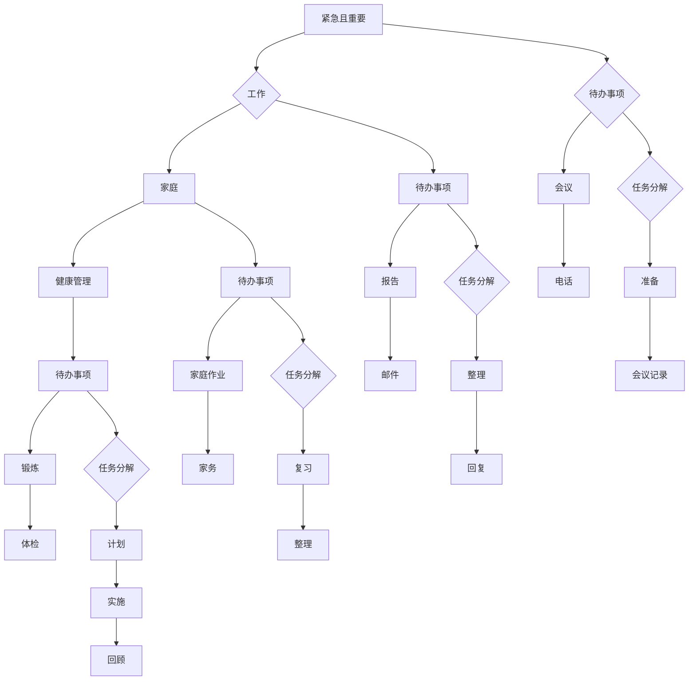
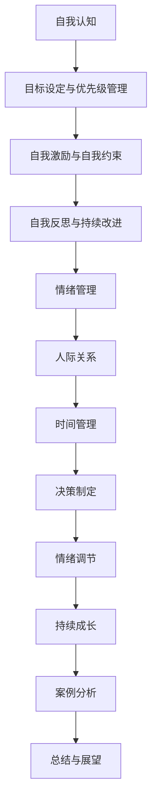

                 

```markdown
# 成为人生的主导者：自我引导的艺术

> 关键词：自我认知，自我引导，目标设定，情绪管理，人际关系，时间管理，决策制定，持续成长

> 摘要：本文旨在探讨如何通过自我认知和自我引导，成为人生的主导者。文章首先介绍了自我认知的重要性以及自我认知的方法，然后阐述了自我引导的核心要素，包括目标设定与优先级管理、自我激励与自我约束、自我反思与持续改进、情绪管理、人际关系、时间管理、决策制定、情绪调节和持续成长。通过案例分析，文章总结了成功和失败的教训，并提出了实践建议。

----------------------------------------------------------------

## 第1章：自我认知的重要性

### 1.1 自我认知的定义

自我认知是指个体对自己心理状态、能力、动机、性格等方面的认识和了解。它是自我引导的基石，没有对自我的深刻理解，我们很难有效地引导自己。

### 1.2 自我认知的重要性

自我认知在个人成长和成功中扮演着关键角色。首先，它帮助我们识别自己的优势和劣势，从而能够有针对性地提升自我。其次，自我认知使我们能够设定合理的目标，并为之努力。最后，自我认知有助于我们建立自信，更好地应对生活中的挑战。

### 1.3 自我认知的方法

#### 1.3.1 自我观察

自我观察是一种通过观察自己的言行举止、情绪反应和环境适应行为来认识自己的方法。例如，我们可以记录下自己在不同情境下的行为和反应，分析这些行为背后的动机和影响。

```python
# 示例：记录一天中的情绪变化
import datetime

def log_emotions():
    current_time = datetime.datetime.now()
    emotion = input("现在你感觉如何？（开心、焦虑、平静等）")
    with open('emotions_log.txt', 'a') as file:
        file.write(f"{current_time}: {emotion}\n")

log_emotions()
```

#### 1.3.2 自我反思

自我反思是通过回顾过去的经历，深入分析自己的行为、决策和情感反应来理解自己的方法。例如，我们可以定期回顾自己的日记，思考自己在过去一段时间内的成就和不足。

```python
# 示例：自我反思日记
def reflect():
    action = input("你想反思哪一天的经历？（输入日期，例如：2023-04-01）")
    try:
        with open(f'diary_{action}.txt', 'r') as file:
            content = file.read()
            print(content)
    except FileNotFoundError:
        print("没有找到该日期的日记。")

reflect()
```

#### 1.3.3 他人反馈

他人反馈是通过听取他人的意见和建议来认识自己的方法。我们可以寻求家人、朋友或同事的反馈，了解自己在他们眼中的形象和表现。

```python
# 示例：收集他人反馈
def collect_feedback():
    feedback = input("请写下你想要收集反馈的问题，例如：你在工作中表现如何？")
    with open('feedback.txt', 'a') as file:
        file.write(f"{feedback}\n")

collect_feedback()
```

#### 1.3.4 自我测试

自我测试是通过完成各种心理测试和性格评估来了解自己的方法。这些测试可以帮助我们识别自己的性格特质、能力水平和行为倾向。

```python
# 示例：简单性格测试
def take_test():
    print("欢迎参加简单性格测试！")
    questions = [
        "你更喜欢待在人群中心，还是一个人独处？",
        "你更容易因为什么事情而焦虑？",
        "你如何看待团队合作？"
    ]
    
    answers = []
    for question in questions:
        answer = input(question)
        answers.append(answer)
    
    with open('test_results.txt', 'w') as file:
        for answer in answers:
            file.write(f"{answer}\n")

take_test()
```

## 第2章：自我引导的核心要素

### 2.1 目标设定与优先级管理

目标设定是自我引导的关键步骤。一个明确、可行的目标可以为我们提供前进的方向和动力。而优先级管理则帮助我们集中精力和资源，专注于最重要的目标。

#### 2.1.1 目标设定的原则

目标设定应遵循SMART原则：

- **Specific**（具体）：目标应明确、具体，而非模糊。
- **Measurable**（可衡量）：目标应有具体的衡量标准，以便了解进度。
- **Achievable**（可实现）：目标应是可实现的，避免设定过高的期望。
- **Relevant**（相关）：目标应与个人价值观和长远规划相关。
- **Time-bound**（时限）：目标应有明确的时间限制，以便督促自己。

#### 2.1.2 优先级管理的方法

优先级管理的方法主要包括时间管理四象限法和任务分解法：

- **时间管理四象限法**：将任务分为四个象限，分别是紧急且重要、紧急但不重要、不紧急但重要、不紧急且不重要。这种方法帮助我们识别哪些任务最为重要和紧急。
- **任务分解法**：将大任务分解为小任务，逐步完成。这种方法帮助我们更好地掌控任务进度，并减少拖延。



### 2.2 自我激励与自我约束

自我激励是指通过内部动机激发自己的行为和动力，而自我约束则是指通过自我控制来保持行为的一致性和持续性。两者相辅相成，共同促进我们的成长。

#### 2.2.1 自我激励的方法

- **设定奖励机制**：为自己设定达成目标的奖励，以提高动力。
- **找到激励源**：了解自己的兴趣和激情，将其作为自我激励的源泉。
- **正面思考**：用积极的态度看待挑战和困难，转化为成长的机会。

#### 2.2.2 自我约束的方法

- **制定规则和纪律**：为自己制定明确的行为准则，约束自己的行为。
- **保持透明度**：将目标和计划公之于众，增加自我约束的力量。
- **寻求外部监督**：寻找家人、朋友或导师来监督自己的行为。

### 2.3 自我反思与持续改进

自我反思是自我引导的重要环节。通过反思自己的行为和结果，我们可以识别错误和不足，并采取相应的改进措施。

#### 2.3.1 自我反思的方法

- **定期回顾**：定期回顾自己的行为、决策和结果，思考成功和失败的原因。
- **分析反馈**：分析他人和自己的反馈，识别问题所在。
- **制定改进计划**：根据反思结果，制定具体的改进计划，并付诸实践。

#### 2.3.2 持续改进的方法

- **持续学习**：不断学习新知识和技能，提升自我。
- **接受挑战**：勇于接受新的挑战，提升自己的能力。
- **调整心态**：保持积极的心态，面对失败和挫折。

## 第3章：情绪管理

情绪管理是自我引导的重要组成部分。情绪的波动会影响我们的决策和行为，因此，学会管理情绪对于自我引导至关重要。

### 3.1 情绪的类型与影响

情绪可以分为积极情绪和消极情绪。积极情绪如喜悦、满足、乐观等，有助于提高个人的幸福感和积极性；消极情绪如焦虑、沮丧、愤怒等，会影响个人的判断力和行为。

#### 3.1.1 积极情绪的影响

- **提高创造力**：积极情绪可以激发个人的创造力，帮助发现新的解决方案。
- **增强团队合作**：积极情绪可以促进团队合作，提高团队效率。
- **提升幸福感**：积极情绪可以提升个人的幸福感，增强生活的满意度。

#### 3.1.2 消极情绪的影响

- **降低判断力**：消极情绪会降低个人的判断力，容易做出错误的决定。
- **阻碍创造力**：消极情绪会阻碍个人的创造力，影响问题的解决。
- **影响人际关系**：消极情绪会影响人际关系，导致沟通障碍和冲突。

### 3.2 情绪管理的方法

#### 3.2.1 情绪调节的理论基础

情绪调节的理论基础包括情绪的生理基础、心理基础和社会基础。生理基础包括情绪的生理反应和调节机制；心理基础包括情绪的认知加工和情绪调节策略；社会基础包括情绪的社会表达和情绪的社会调节。

#### 3.2.2 情绪管理的方法

- **认知重构**：通过改变对事物的认知评价来调节情绪。例如，将失败视为学习的机会，而不是失败的标志。
- **放松训练**：通过深呼吸、冥想、瑜伽等方法来放松身心，减轻消极情绪。
- **情绪宣泄**：通过哭泣、倾诉、运动等方式来宣泄情绪，减轻内心的压力。
- **积极心态**：培养积极的心态，关注生活中的美好事物，减少消极情绪的影响。

```python
# 示例：情绪调节程序
import random

def mood_alteration():
    emotions = ["喜悦", "焦虑", "平静", "沮丧"]
    current_mood = random.choice(emotions)
    
    if current_mood == "喜悦":
        print("现在你感到喜悦，今天是个美好的日子！")
    elif current_mood == "焦虑":
        print("你现在感到焦虑，但我们可以通过深呼吸来放松。")
        print("深呼吸...（3秒）")
    elif current_mood == "平静":
        print("你现在感到平静，享受这一刻。")
    else:
        print("你现在感到沮丧，但我们可以通过运动来提振情绪。")
        print("去跑步吧！")

mood_alteration()
```

### 3.3 情绪管理的实践

情绪管理需要实践，通过不断地练习和调整，我们可以更好地掌握情绪。以下是一些情绪管理的实践方法：

- **日记记录**：记录每天的所思所感，分析情绪变化的原因和影响。
- **倾诉交流**：与家人、朋友或专业人士交流，分享自己的情绪和困扰。
- **运动锻炼**：通过运动来释放压力，调节情绪。
- **学习冥想**：通过冥想来放松身心，提高情绪调节能力。

```markdown
## 第4章：人际关系

### 4.1 人际关系的重要性

人际关系是人类社会的重要组成部分。良好的人际关系有助于提高个人的幸福感、增强团队协作能力，甚至对职业发展产生积极影响。相反，不良的人际关系会导致压力、焦虑和孤独感，影响个人的身心健康。

### 4.2 人际关系的类型

人际关系可以分为多种类型，包括家庭关系、友谊关系、职业关系和社交关系。每种关系都有其独特的特点和挑战。

#### 4.2.1 家庭关系

家庭关系是我们最早建立的人际关系，包括父母、兄弟姐妹、配偶和子女。家庭关系的和谐与否直接影响我们的成长和生活质量。

#### 4.2.2 友谊关系

友谊关系是基于共同兴趣、价值观和信任建立的人际关系。友谊可以给我们带来情感支持和快乐，是人际关系中的重要组成部分。

#### 4.2.3 职业关系

职业关系是我们与同事、上级和下属之间的关系。良好的职业关系有助于提升工作效率和职业发展，反之则会造成困扰和挫折。

#### 4.2.4 社交关系

社交关系是我们在社交场合中建立的人际关系，包括朋友、邻居、社区成员等。社交关系可以扩大我们的社交圈，丰富我们的生活。

### 4.3 人际关系的处理策略

处理人际关系需要技巧和策略。以下是一些处理人际关系的建议：

#### 4.3.1 建立信任

信任是人际关系的基石。建立信任需要诚实、可靠和一致性。通过言行一致、遵守承诺和保持隐私，我们可以赢得他人的信任。

#### 4.3.2 沟通技巧

沟通是人际关系的关键。有效的沟通需要倾听、表达和反馈。通过积极倾听、清晰表达和及时反馈，我们可以更好地理解他人，解决冲突。

#### 4.3.3 解决冲突

冲突是人际关系中的常见问题。解决冲突需要冷静、理性和合作。通过分析冲突原因、寻找共同点和制定解决方案，我们可以化解冲突，维护人际关系。

#### 4.3.4 保持边界

保持边界是保护自己和他人的重要手段。设定合理的边界可以防止过度依赖和侵犯，维护个人尊严和自主权。

```markdown
## 第5章：时间管理

### 5.1 时间管理的原则

时间管理是一项重要的技能，它帮助我们在有限的时间内实现更多的目标。以下是一些时间管理的基本原则：

#### 5.1.1 目标导向

将时间用于实现重要目标，而非琐碎事务。明确目标和优先级，将时间和精力投入到最有价值的事情上。

#### 5.1.2 计划性

提前规划时间，制定详细的日程表。通过计划性，我们可以更好地掌控时间，避免拖延和浪费。

#### 5.1.3 专注力

保持专注，减少干扰。将注意力集中在当前任务上，避免多任务处理，以提高效率和效果。

#### 5.1.4 自律

自律是时间管理的关键。通过自我约束，我们可以避免拖延和浪费时间，保持高效率和持续性。

### 5.2 时间管理的工具与方法

有许多工具和方法可以帮助我们更好地管理时间，以下是一些常见的方法：

#### 5.2.1 优先级列表

创建一个优先级列表，将任务按照重要性和紧急性排序。优先完成最重要的任务，以提高效率和成果。

#### 5.2.2 时间块

将时间分为不同的块，每个块专注于一个任务。这种方法有助于提高专注力和效率。

#### 5.2.3 托马斯·莱利的“番茄工作法”

将工作时间分为25分钟的工作周期，每个周期后休息5分钟。这种方法有助于保持专注和提高生产力。

```python
# 示例：使用Python实现“番茄工作法”
import time

def tomato_timer(duration):
    while duration > 0:
        print(f"开始工作，剩余时间：{duration}分钟")
        time.sleep(duration * 60)  # 将分钟转换为秒
        print("休息时间，休息5分钟")
        duration -= 25
        time.sleep(5 * 60)  # 休息5分钟

tomato_timer(150)  # 设置总时长为150分钟（2.5小时）
```

#### 5.2.4 时间跟踪工具

使用时间跟踪工具，如Toggl、 RescueTime等，记录和评估时间使用情况，以便进行优化和改进。

### 5.3 时间管理的实践案例

以下是一个时间管理的实践案例：

**案例：小明的日常时间管理**

小明是一名软件工程师，他通过以下方法来管理自己的时间：

- **早晨计划**：每天早晨，他都会花10分钟回顾昨天的工作，规划今天的工作任务。
- **优先级列表**：他将每天的任务按照重要性和紧急性排序，优先完成最重要的任务。
- **时间块**：他将工作日分为4个时间块，每个时间块专注于一个任务，例如编码、测试、会议和文档编写。
- **番茄工作法**：他使用“番茄工作法”来提高专注力，每个工作周期为25分钟，每个周期后休息5分钟。
- **时间跟踪**：他使用Toggl记录自己的时间使用情况，每月评估并优化自己的时间管理策略。

通过这些方法，小明能够更好地管理自己的时间，提高了工作效率和生产力。

```markdown
## 第6章：决策制定

### 6.1 决策制定的原则

决策制定是自我引导的核心要素之一。一个明智的决策可以带来成功，而一个错误的决策可能导致失败。以下是一些决策制定的基本原则：

#### 6.1.1 信息收集

在做出决策之前，我们需要收集尽可能多的相关信息。这包括数据、事实、意见和专家建议等。信息收集的全面性和准确性直接影响决策的质量。

#### 6.1.2 目标明确

明确决策的目标是制定有效决策的关键。我们需要明确决策的目标和期望结果，以便在决策过程中保持方向和目标。

#### 6.1.3 评估选项

在收集到足够的信息后，我们需要评估所有可行的选项。评估选项时，需要考虑每个选项的优缺点、可能的结果和风险。

#### 6.1.4 权衡利弊

在评估选项后，我们需要权衡每个选项的利弊，选择最符合目标和价值的选项。这通常需要我们在多个考虑因素之间做出权衡。

#### 6.1.5 执行计划

一旦做出决策，我们需要制定详细的执行计划，以确保决策的有效实施。执行计划应包括具体的步骤、时间表和责任人。

### 6.2 决策制定的工具与方法

以下是一些常见的决策制定工具和方法：

#### 6.2.1 SWOT分析

SWOT分析是一种用于评估选项的工具，它包括以下四个方面：

- **优势（Strengths）**：选项的优势和优势。
- **劣势（Weaknesses）**：选项的劣势和不足。
- **机会（Opportunities）**：外部环境中的机会。
- **威胁（Threats）**：外部环境中的威胁。

通过SWOT分析，我们可以全面评估每个选项的优劣势，为决策提供依据。

```python
# 示例：SWOT分析
import pandas as pd

def swot_analysis(strengths, weaknesses, opportunities, threats):
    swot = pd.DataFrame({
        'Aspect': ['Strengths', 'Weaknesses', 'Opportunities', 'Threats'],
        'Description': [strengths, weaknesses, opportunities, threats]
    })
    print(swot)

strengths = "技术熟练，有丰富的项目经验"
weaknesses = "沟通能力有待提高，需要加强团队合作"
opportunities = "市场上有新的技术需求，可以开发新的产品"
threats = "竞争激烈，需要不断创新以保持竞争力"

swot_analysis(strengths, weaknesses, opportunities, threats)
```

#### 6.2.2 成本效益分析

成本效益分析是一种用于评估选项的方法，它比较每个选项的成本和预期收益。通过成本效益分析，我们可以确定哪个选项最符合成本效益原则。

```python
# 示例：成本效益分析
def cost_benefit_analysis(costs, benefits):
    cba = pd.DataFrame({
        'Item': ['Cost', 'Benefit'],
        'Value': [costs, benefits]
    })
    print(cba)

costs = 10000  # 成本
benefits = 15000  # 收益

cost_benefit_analysis(costs, benefits)
```

#### 6.2.3 多属性决策

多属性决策是一种用于评估具有多个属性的选项的方法。通过多属性决策，我们可以综合考虑多个因素，选择最优的选项。

```python
# 示例：多属性决策
import numpy as np

def multi_attribute_decision(options, attributes, weights):
    scores = np.dot(options, weights)
    best_option = np.argmax(scores)
    return best_option

options = np.array([[4, 3, 5], [3, 4, 2], [5, 2, 4]])  # 选项
attributes = np.array([0.5, 0.3, 0.2])  # 属性权重
weights = np.array([1, 1, 1])  # 选项权重

best_option = multi_attribute_decision(options, attributes, weights)
print(f"最佳选项：{best_option}")
```

### 6.3 决策制定的实践案例

以下是一个决策制定的实践案例：

**案例：小李的职业规划**

小李是一名软件工程师，他面临职业发展的关键决策。通过以下步骤，他制定了职业规划：

1. **信息收集**：小李收集了关于软件工程师职业发展的信息，包括市场需求、职业前景、薪资水平和晋升路径。
2. **目标明确**：小李明确了自己的目标，即成为一名技术专家，并在5年内成为团队领导。
3. **评估选项**：小李评估了以下几个选项：
   - 继续在当前公司发展，争取晋升。
   - 转换工作，寻找更有发展前景的公司。
   - 学习新技能，如人工智能和机器学习，提升自己的竞争力。
4. **权衡利弊**：小李权衡了每个选项的利弊，考虑了薪资、职业发展、工作环境和个人兴趣等因素。
5. **执行计划**：小李制定了详细的执行计划，包括学习新技能、参加行业会议、拓展人脉等。

通过以上步骤，小李成功制定了职业规划，并开始为实现目标而努力。

```markdown
## 第7章：情绪调节

### 7.1 情绪调节的理论基础

情绪调节是自我引导的重要组成部分，它涉及到对情绪的认知、表达和调节。情绪调节的理论基础包括情绪的生理机制、心理过程和社会影响。

#### 7.1.1 情绪的生理机制

情绪的生理机制涉及到大脑中的神经递质和荷尔蒙的变化。例如，焦虑时，大脑会释放肾上腺素和皮质醇等激素，导致心跳加速、呼吸急促等生理反应。

#### 7.1.2 情绪的心理过程

情绪的心理过程包括情绪的认知加工、情感体验和情绪表达。认知加工涉及情绪信息的接收、处理和解释；情感体验是情绪的主观感受；情绪表达则是情绪通过言语、行为和面部表情等方式外显。

#### 7.1.3 情绪的社会影响

情绪的社会影响涉及情绪对他人的影响和情绪在社会情境中的表现。情绪可以影响人际关系、社会认同和心理健康。

### 7.2 情绪调节的技巧

情绪调节的技巧包括认知重构、情绪宣泄、放松训练和积极心态等。

#### 7.2.1 认知重构

认知重构是通过改变对事件的认知评价来调节情绪。例如，将失败视为学习机会，而非失败本身。

```python
# 示例：认知重构
def cognitive_restructuring(event, new_perception):
    print(f"原始认知：{event}")
    print(f"重构认知：{new_perception}")

event = "考试不及格"
new_perception = "这次考试让我发现了自己的不足，有机会进行改进。"
cognitive_restructuring(event, new_perception)
```

#### 7.2.2 情绪宣泄

情绪宣泄是通过哭泣、倾诉、运动等方式来释放情绪。情绪宣泄有助于减轻内心的压力，恢复情绪平衡。

```python
# 示例：情绪宣泄
def emotional_release(emotion):
    print(f"你现在感到{emotion}，现在可以哭泣或大声宣泄。")

emotion = "沮丧"
emotional_release(emotion)
```

#### 7.2.3 放松训练

放松训练是通过深呼吸、冥想、瑜伽等方式来放松身心，减轻情绪压力。放松训练有助于提高情绪调节能力，改善心理健康。

```python
# 示例：深呼吸放松
def deep_breathing():
    print("现在开始深呼吸，每次呼吸保持3-5秒。")
    for i in range(1, 5):
        print(f"深呼吸第{i}次。")
        time.sleep(5)  # 每次深呼吸保持5秒
    print("深呼吸结束，现在感觉如何？")

deep_breathing()
```

#### 7.2.4 积极心态

积极心态是通过积极思考、感恩和乐观来调节情绪。积极心态有助于提高幸福感和生活质量。

```python
# 示例：积极心态
def positive_mindset():
    print("每天都是一个新的开始，相信自己可以克服困难。")
    print("感恩生活中的美好事物，珍惜当下。")

positive_mindset()
```

### 7.3 情绪调节的实际应用

情绪调节在实际生活中有着广泛的应用，以下是一些实际案例：

#### 7.3.1 工作压力调节

小王是一名软件工程师，他经常因为工作压力而感到焦虑。通过以下方法，他成功调节了情绪：

- **认知重构**：将工作视为成长和学习的机会，而非负担。
- **情绪宣泄**：每周安排一次运动时间，通过跑步和健身释放压力。
- **放松训练**：每天进行深呼吸和冥想，缓解身心压力。
- **积极心态**：保持乐观，感恩工作中的每一个成就。

#### 7.3.2 人际关系调节

小张经常因为人际关系问题而感到沮丧。通过以下方法，他成功调节了情绪：

- **认知重构**：认识到每个人都有不同的观点和需求，学会尊重和理解他人。
- **情绪宣泄**：找到信任的朋友或家人，倾诉自己的感受和困扰。
- **放松训练**：通过瑜伽和冥想，提高情绪调节能力。
- **积极心态**：保持乐观，相信人际关系可以随着时间的推移得到改善。

通过情绪调节，小王和小张成功应对了生活中的压力和挑战，提高了生活质量和工作效率。

```markdown
## 第8章：持续成长

### 8.1 成长的心态

持续成长首先需要拥有正确的心态。成长心态（Growth Mindset）是一种相信自己的能力和智慧可以通过努力和学习不断进步的信念。与固定心态（Fixed Mindset）相反，成长心态认为挑战和失败是成长的机会，而非失败的原因。

#### 8.1.1 成长心态的好处

- **提高学习能力**：成长心态鼓励面对挑战，通过学习克服困难，从而提高学习能力。
- **增强自信心**：相信自己的能力可以通过努力提升，有助于增强自信心。
- **激发创造力**：成长心态鼓励创新和尝试新事物，有助于激发创造力。
- **促进人际关系**：成长心态有助于建立积极的人际关系，因为他鼓励理解和尊重他人的成长需求。

#### 8.1.2 如何培养成长心态

- **积极反馈**：给自己和他人积极的反馈，强调努力和进步，而不是结果。
- **庆祝失败**：将失败视为学习的机会，从中吸取教训，而不是放弃。
- **设定挑战**：为自己设定有挑战性的目标，通过努力实现，从而增强成长心态。

### 8.2 学习与自我提升

持续成长的关键在于不断地学习和自我提升。以下是一些有效的方法：

#### 8.2.1 终身学习

终身学习是指不断地学习新知识和技能，以适应不断变化的世界。以下是一些终身学习的建议：

- **阅读**：阅读是获取知识和见解的重要途径。定期阅读书籍、文章和报告，可以拓宽视野。
- **在线课程**：参加在线课程，学习新技能和知识。例如，Coursera、edX等平台提供了丰富的课程。
- **研讨会和讲座**：参加相关的研讨会和讲座，了解行业最新动态和趋势。

#### 8.2.2 实践和应用

理论知识的掌握是基础，但实践和应用是检验知识的重要手段。以下是一些实践和应用的策略：

- **项目实践**：通过实际项目，将理论知识应用到实践中，提升技能。
- **与他人合作**：与他人合作，学习不同的观点和方法，促进个人成长。
- **反馈和迭代**：不断寻求反馈，根据反馈进行改进和迭代，提高实践能力。

### 8.3 持续成长的实践案例

以下是一些持续成长的实践案例：

#### 8.3.1 案例一：技术工程师的进阶之路

小张是一名技术工程师，他通过以下方法实现了持续成长：

- **终身学习**：定期阅读技术书籍，参加在线课程，了解新技术。
- **项目实践**：参与多个项目，从实践中学习并提升技能。
- **反馈和迭代**：与同事和领导交流，寻求反馈，根据反馈进行改进。
- **参与社区**：加入技术社区，分享知识和经验，与他人交流学习。

通过持续的学习和实践，小张逐渐成为了一名技术专家，提升了职业价值。

#### 8.3.2 案例二：企业领导的转型之路

小李是一名企业领导，他通过以下方法实现了持续成长：

- **终身学习**：学习领导力、管理技巧和战略规划等知识，提升自身素质。
- **实践应用**：在实际工作中应用所学知识，不断优化管理策略。
- **团队建设**：注重团队建设和员工发展，促进团队整体成长。
- **反思和调整**：定期反思自己的管理行为，根据反馈进行调整。

通过持续学习和实践，小李成功实现了从普通员工到企业领导的转型，提升了企业的整体业绩。

通过这些实践案例，我们可以看到持续成长的重要性和方法。只有不断地学习和实践，我们才能不断提升自己，实现人生的持续成长。

```markdown
## 第9章：案例分析

### 9.1 成功案例分享

在自我引导和持续成长的路上，有许多成功案例值得我们学习。以下是两个具有代表性的成功案例。

#### 案例一：李华的职场逆袭

李华是一名普通的程序员，他在大学毕业后进入了一家小型互联网公司。在初入职场时，李华面临着许多挑战，包括技术水平的不足和职场竞争的压力。但他并没有放弃，而是采取了以下策略：

1. **终身学习**：李华利用业余时间学习编程语言和技术框架，通过在线课程和书籍不断提升自己的技能。
2. **项目实践**：他主动参与公司的项目，从实践中学习并积累经验。
3. **积极反馈**：他定期向领导请教问题，寻求反馈，并根据反馈调整自己的工作方法。
4. **团队合作**：他积极参与团队合作，学习他人的优点，提升自己的沟通和协作能力。

通过这些努力，李华逐渐在团队中脱颖而出，成为了公司的技术骨干。最终，他成功跳槽到一家知名互联网公司，实现了职场的逆袭。

#### 案例二：王强的创业之路

王强是一名连续创业者，他拥有强烈的自我引导和持续成长意识。在创业初期，王强面临着资金短缺、市场竞争和团队管理等多重挑战。但他通过以下策略克服了这些困难：

1. **市场调研**：在创业前，王强进行了详细的市场调研，确定了市场需求和竞争态势。
2. **目标设定**：他为自己设定了明确的创业目标，并制定了详细的计划。
3. **持续学习**：王强不断学习创业相关的知识和技能，参加创业培训和研讨会。
4. **情绪管理**：他学会了情绪调节，保持积极的心态，面对挑战和失败。

通过不懈努力，王强的创业项目获得了成功，不仅获得了市场认可，还吸引了风险投资。他的创业故事成为了一个典型的成功案例，激励着更多的人投身创业。

### 9.2 失败案例反思

虽然失败是成功之母，但了解失败的原因同样重要。以下是两个具有代表性的失败案例。

#### 案例一：张丽的职场瓶颈

张丽是一名在职场中工作了多年的高管，但她逐渐遇到了职业瓶颈。她没有取得更高的职位，反而感到工作压力越来越大。经过反思，张丽发现以下几个原因：

1. **缺乏自我反思**：张丽没有定期反思自己的工作方法和态度，导致缺乏改进的方向。
2. **缺乏目标设定**：她没有为自己设定明确的职业目标，导致工作缺乏方向和动力。
3. **缺乏持续学习**：她没有持续学习新知识和技能，导致在职场竞争中逐渐落后。
4. **人际关系问题**：她与同事和上级的关系紧张，导致工作配合不畅。

通过反思，张丽认识到了自己的不足，并开始采取行动，包括学习新技能、改善人际关系和设定职业目标。

#### 案例二：赵明的创业失败

赵明是一名年轻的创业者，他的创业项目在初期取得了不错的成绩，但最终因资金短缺而失败。赵明反思失败的原因，主要包括：

1. **市场调研不足**：赵明在创业前没有进行充分的市场调研，导致产品不符合市场需求。
2. **资金管理不善**：他缺乏财务知识，导致资金使用不当，最终耗尽创业资金。
3. **团队管理问题**：赵明在团队管理方面存在不足，导致团队成员缺乏动力和凝聚力。
4. **情绪管理不足**：面对创业的挑战和压力，赵明没有学会情绪调节，影响了决策和执行。

通过反思，赵明认识到了自己的不足，并在后续的创业项目中进行了改进。

### 9.3 案例总结与启示

通过以上成功和失败的案例，我们可以得出以下几点启示：

1. **自我认知**：了解自己的优势和不足，是成功的前提。
2. **持续学习**：不断学习新知识和技能，保持竞争力。
3. **目标设定**：明确的目标和计划是前进的动力。
4. **情绪管理**：学会调节情绪，保持积极的心态。
5. **积极反馈**：积极寻求反馈，并根据反馈进行改进。
6. **团队合作**：良好的团队关系有助于事业的成功。

只有通过不断地自我引导和持续成长，我们才能在人生的道路上取得成功。

```markdown
## 第10章：总结与展望

### 10.1 自我引导的总结

自我引导是一种重要的生活和工作技能，它帮助我们认识自我、设定目标、管理时间和情绪，从而实现个人成长和成功。通过自我认知、目标设定、情绪管理、人际关系处理、时间管理和决策制定，我们可以更好地掌控自己的生活，成为人生的主导者。

### 10.2 未来展望

在未来的发展中，自我引导将继续发挥重要作用。随着人工智能和大数据技术的发展，我们将有更多的工具和资源来帮助我们进行自我认知和引导。同时，社会对自我引导和持续成长的需求也将日益增长，个人和组织都将更加重视自我提升和自我管理。

### 10.3 实践建议

为了更好地实践自我引导，以下是一些建议：

1. **定期自我反思**：定期回顾自己的行为和结果，识别问题并采取改进措施。
2. **设定明确目标**：设定具体、可衡量、可实现的目标，并制定详细的实施计划。
3. **管理时间**：使用时间管理工具和方法，合理安排时间和任务，提高效率。
4. **情绪调节**：学会情绪调节技巧，保持积极的心态，应对生活中的挑战。
5. **持续学习**：不断学习新知识和技能，提升自己的竞争力。
6. **建立良好人际关系**：注重人际关系的建立和维护，扩大自己的社交圈。
7. **积极寻求反馈**：主动寻求他人的意见和建议，不断完善自我。

通过以上实践，我们可以更好地实现自我引导，成为人生的主导者。

### 附录

#### 附录A：参考资料

1. Dweck, C. S. (2006). Mindset: The New Psychology of Success. Ballantine Books.
2. Heiftz, G. (2019). Emotional Intelligence 2.0. Barchester Books.
3. Covey, S. R. (1989). The 7 Habits of Highly Effective People: Restoring the Character Ethic. Free Press.

#### 附录B：实用工具推荐

1. Trello：时间管理和任务跟踪工具。
2. Asana：团队协作和项目管理工具。
3. Google Calendar：日程管理和提醒工具。
4. Evernote：笔记记录和管理工具。
5. RescueTime：时间跟踪和生产力分析工具。

#### 附录C：进一步阅读推荐

1. Gates, B. (2017). Life Habits: Reflections on the Long Road to Success. Flatiron Books.
2. Angelou, M. (2012). I Know Why the Caged Bird Sings. Random House.
3. Tim Ferriss (2011). The 4-Hour Work Week: Escape 9-5, Live Anywhere, and Join the New Rich. Crown Publishing Group.

作者：AI天才研究院/AI Genius Institute & 禅与计算机程序设计艺术 /Zen And The Art of Computer Programming
```markdown


