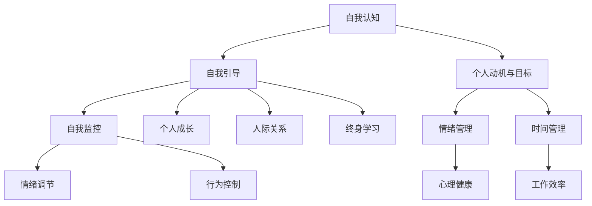

                 

## 成为人生的主导者：自我引导的艺术与实践

### 关键词

- 自我引导
- 人生主导
- 个人成长
- 心理健康
- 时间管理
- 沟通技巧

### 摘要

本文旨在探讨如何通过自我引导成为人生的主导者。我们将深入分析自我认知与自我引导的重要性，提供实用的自我引导策略，包括设定明确的目标、制定行动计划以及应对挑战与维持动力。此外，还将探讨自我引导在日常生活中的应用，以及如何通过自我引导实现个人成长和改善人际关系。最后，我们将分享实践案例和反思，帮助读者在实践中应用自我引导，成为更加自信和有目标的人。

## 第一部分：自我认知与自我引导

### 第1章：理解自我引导

#### 1.1 自我引导的重要性

自我引导是人生主导的关键。它不仅仅是一种个人技能，更是一种生活态度。自我引导的核心在于个人动机和目标的设定与追踪，以及自我监控的能力。以下是对这两个核心概念的详细探讨。

##### **自我引导的定义**

- **个人动机和目标**：自我引导的第一步是明确自己的动机和目标。动机是推动个人前进的力量，目标则是具体的方向和终点。设定清晰、具体的目标有助于提高个人动力，并使行动更加有方向性。目标可以是长期的，如职业发展、健康改善等，也可以是短期的，如完成某项任务、学习新技能等。

- **自我监控**：自我监控是指对自己情绪和行为的观察和评估。通过自我监控，个人可以更好地理解自己的内心世界，识别潜在的问题，并采取相应的措施进行调整。自我监控有助于保持情绪稳定，提高自我控制能力，从而更好地实现个人目标。

##### **自我引导的重要性**

- **提高自我认知**：自我引导有助于加深对自我的理解，包括个人的优势、弱点、兴趣和价值观。这种自我认知有助于个人做出更明智的决策，并在人生道路上更加坚定地前进。

- **增强自我控制**：自我引导能够帮助个人更好地控制自己的情绪和行为。在面对压力和挑战时，自我引导能够提供应对策略，使个人保持冷静和理智。

- **提升生活质量**：通过自我引导，个人可以更好地管理时间、提高工作效率、改善人际关系，从而提升整体生活质量。

#### 1.2 自我认知的基本概念

自我认知是自我引导的基础。以下是对自我认知的层次和自我反思的重要性的探讨。

##### **自我认知的层次**

- **自我反思**：自我反思是一种深入思考自己的行为、情感和思想的习惯。通过自我反思，个人可以更好地理解自己的内在世界，识别潜在的问题，并找到解决问题的方法。自我反思有助于个人成长和自我提升。

- **内在价值观**：内在价值观是指个人内心深处的信念和原则。这些价值观是个人行为和决策的驱动力。了解和尊重自己的内在价值观有助于个人在追求目标时保持一致性和坚定性。

##### **自我反思的重要性**

- **发现问题和机会**：自我反思有助于个人发现自身的问题和机会。通过反思，个人可以识别自己的弱点，并找到改进的方法。同时，自我反思也能够帮助个人发现潜在的机会，从而更好地规划未来。

- **促进自我成长**：自我反思是一种积极的自我成长过程。通过不断反思和改进，个人可以不断提升自我认知和能力，实现更高的成长。

### 第2章：提升自我认知能力

#### 2.1 增强自我意识

提升自我认知能力的第一步是增强自我意识。以下是一些实用的技巧，帮助读者提高自我意识。

##### **自我观察技巧**

- **日记记录**：写日记是一种有效的自我观察技巧。通过记录日常生活中的事件、情感和思考，个人可以更好地了解自己的内心世界。日记不仅可以帮助个人反思过去，还可以为未来的决策提供参考。

- **情绪日记**：情绪日记是记录自己情绪变化的一种方法。通过记录情绪的变化和触发因素，个人可以更好地理解自己的情绪，并找到调节情绪的方法。情绪日记有助于个人保持情绪稳定，提高生活质量。

##### **建立积极的自我形象**

- **自我肯定语句**：自我肯定语句是一种积极的自我形象建立方法。通过重复一些积极的自我描述，如“我值得幸福”、“我有能力实现目标”，个人可以逐步提升自信和自我价值感。

- **自我形象的塑造**：通过积极的行动和思维，个人可以塑造一个积极的自我形象。这包括培养良好的习惯、积极参与有意义的活动、以及与他人建立积极的互动。积极的自我形象有助于个人在面对挑战时保持坚定和自信。

### 第3章：自我引导的策略

#### 3.1 设定明确的目标

设定明确的目标是自我引导的关键步骤。以下是一些设定目标的策略和SMART原则。

##### **目标设定的SMART原则**

- **具体性（Specific）**：具体的目标应该明确、具体，以便个人可以清晰地了解要达成的目标。例如，而不是说“提高成绩”，更具体的目标可以是“在接下来的三个月内，将数学成绩提高10%”。

- **明确性（Measurable）**：明确的目标应该具有可量化的标准，以便个人可以追踪进展。例如，目标可以是“每天阅读30页专业书籍”，而不是模糊的“学习更多”。

- **可实现性（Achievable）**：目标应该是可实现的，考虑个人的资源、能力和时间限制。设定过高或过低的目标都可能导致挫败感。

- **相关性（Relevant）**：目标应该与个人的价值观和长期目标相关。这有助于保持动机和方向一致。

- **时限性（Time-bound）**：目标应该有一个明确的时间框架，以便个人可以有一个清晰的时间表。例如，目标可以是“在明年5月前完成某个项目”。

##### **制定行动计划**

制定行动计划是实现目标的关键。以下是一些制定行动计划的基本要素。

- **步骤分解**：将大目标分解为小步骤，使目标更容易实现。每个小步骤都应该具体、可操作。

- **资源管理**：确保在实现目标过程中，个人拥有所需的资源和支持。这可能包括时间、资金、人力等。

## 第二部分：实践自我引导

### 第4章：克服挑战与维持动力

#### 4.1 应对自我引导中的障碍

在自我引导的过程中，个人可能会遇到各种挑战。以下是一些常见的障碍以及应对策略。

##### **识别和克服恐惧**

- **恐惧的类型**：恐惧可以来自多个方面，包括对未知的恐惧、对失败的恐惧、对失败的恐惧等。了解恐惧的类型有助于个人更好地应对。

- **应对策略**：应对恐惧的方法包括正面思考、寻求支持和制定应对计划。正面思考可以帮助个人改变消极情绪，寻求支持可以获得他人的鼓励和帮助，制定应对计划可以使个人在遇到恐惧时有所准备。

#### 4.2 维持长期动力

维持长期动力是实现目标的关键。以下是一些维持长期动力的方法。

##### **动机的维持**

- **内在动机和外在动机**：内在动机是指个人对活动本身的兴趣和热爱，而外在动机是指由外部奖励或惩罚驱动的动机。内在动机更持久，但也需要外在动机的支持。

- **目标回顾**：定期回顾目标可以帮助个人保持动力。通过回顾目标，个人可以了解自己的进展，发现成就，并调整计划以应对新的挑战。

### 第5章：日常生活中的自我引导

#### 5.1 自我引导在工作中的应用

自我引导在职场中同样重要。以下是一些自我引导在工作中的应用。

##### **时间管理**

- **时间管理技巧**：有效的时间管理可以帮助个人提高工作效率，减少压力。技巧包括优先级排序、任务分解、避免拖延等。

- **自我引导在时间管理中的应用**：通过自我引导，个人可以更好地管理时间，设定合理的工作计划，并保持专注和高效。

##### **沟通技巧**

- **自我引导在沟通中的应用**：自我引导可以帮助个人提高沟通技巧，包括倾听、表达清晰、处理冲突等。通过自我引导，个人可以更好地理解他人，建立良好的人际关系。

### 第6章：自我引导与个人成长

#### 6.1 自我引导与心理健康

心理健康是个人成长的重要组成部分。以下是一些自我引导与心理健康的关系。

##### **情绪管理**

- **自我引导在情绪管理中的应用**：通过自我引导，个人可以更好地管理情绪，包括情绪识别、情绪调节和情绪表达。这有助于提高心理健康水平。

- **心理健康的重要性**：心理健康不仅影响个人的生活质量，还影响个人的工作效率和人际关系。因此，维护心理健康对于个人成长至关重要。

##### **心理健康**

- **维护心理健康的方法**：维护心理健康的方法包括定期锻炼、保持健康的饮食、充足的睡眠、积极的社交活动等。通过自我引导，个人可以更好地实施这些方法，从而保持心理健康。

### 第7章：自我引导与人际关系

#### 7.1 建立健康的人际关系

人际关系对个人成长和幸福感具有重要影响。以下是一些自我引导在建立健康人际关系中的应用。

##### **自我引导在人际关系中的应用**

- **理解他人**：通过自我引导，个人可以更好地理解他人，包括他人的需求和感受。这有助于建立更深层次的连接和信任。

- **沟通与协调**：自我引导可以帮助个人在沟通中保持冷静和理智，从而更好地处理冲突和解决问题。

### 第8章：自我引导与终身学习

#### 8.1 持续自我提升

终身学习是个人成长的关键。以下是一些自我引导在终身学习中的应用。

##### **学习策略**

- **自我引导在学习策略中的应用**：通过自我引导，个人可以更好地制定学习计划，管理学习资源，提高学习效率。

- **学习策略的重要性**：有效学习策略可以提高学习效率，减少学习压力，使学习过程更加愉快和有意义。

##### **知识管理**

- **知识管理的重要性**：知识管理是指对所学知识进行有效的收集、整理、运用和更新。通过知识管理，个人可以更好地利用所学知识，提高工作效率和创新能力。

## 附录

### 附录 A：自我引导资源与工具

#### A.1 自我引导工具介绍

- **日记应用**：日记应用可以帮助个人记录日常生活中的事件、情感和思考，从而提高自我认知。

- **心理测试**：心理测试可以帮助个人了解自己的性格特点、优势和弱点，从而更好地进行自我引导。

### 附录 B：实践案例与反思

#### B.1 自我引导实践案例

- **案例分享**：分享一些成功和失败的自我引导实践案例，以及从中得到的启示。

- **反思与总结**：通过反思和总结实践案例，个人可以更好地理解自我引导的应用和实践效果。

### 作者信息

- **作者：AI天才研究院/AI Genius Institute & 禅与计算机程序设计艺术 /Zen And The Art of Computer Programming**

通过以上内容，我们可以看到，自我引导是一项重要的生活技能，它不仅能够帮助个人实现个人目标和提高生活质量，还能够促进心理健康和人际关系的建立。希望读者能够通过本文的探讨，认识到自我引导的重要性，并在实践中不断提升自我引导能力，成为真正的人生主导者。

### 关键概念与联系

在探讨自我引导的过程中，有几个关键概念需要明确，并且它们之间存在着紧密的联系。以下是一个简单的Mermaid流程图，展示了这些概念之间的关系：



- **自我认知（A）**：是自我引导（B）的基础，包括自我反思和内在价值观的认识。
- **个人动机与目标（C）**：决定了自我引导的方向和动力，是自我引导的核心。
- **情绪管理（E）**：是心理健康（I）的重要部分，影响自我监控（D）和行为控制（H）。
- **时间管理（F）**：是工作效率（J）的关键，也与自我监控（D）和情绪调节（G）有关。
- **自我监控（D）**：是自我引导的重要组成部分，包括情绪调节和行为控制。
- **情绪调节（G）**：是维持心理健康和自我监控的关键。
- **行为控制（H）**：是自我监控的一部分，影响情绪调节和心理健康。
- **个人成长（K）**、**人际关系（L）**、**终身学习（M）**：都是自我引导的应用领域，体现了自我引导在个人生活中的全面影响。

### 核心算法原理讲解

在自我引导的实践中，算法和数学模型可以帮助我们更科学地设定目标、管理时间和优化行为。以下我们将结合Python代码，探讨如何使用核心算法原理来辅助自我引导。

#### 目标设定算法

目标设定的核心在于SMART原则（具体性、明确性、可实现性、相关性、时限性）。以下是一个简单的Python函数，用于根据SMART原则设定目标。

```python
def set_smart_target(description, measure, achievability, relevance, timebound):
    """
    设定符合SMART原则的目标

    :param description: 目标描述
    :param measure: 衡量标准
    :param achievability: 可实现性
    :param relevance: 相关性
    :param timebound: 时间限制
    :return: SMART目标字符串
    """
    target = f"{description}, 可量化（{measure}），可实现（{achievability}），相关（{relevance}），时限（{timebound}）"
    return target

# 示例
smart_target = set_smart_target(
    description="提高工作效率",
    measure="每天减少2小时的工作时间",
    achievability="通过时间管理和任务优先级排序",
    relevance="对职业发展有利",
    timebound="三个月内实现"
)
print(smart_target)
```

输出结果：

```
提高工作效率，可量化（每天减少2小时的工作时间），可实现（通过时间管理和任务优先级排序），相关（对职业发展有利），时限（三个月内实现）
```

#### 时间管理算法

时间管理是自我引导的重要组成部分。以下是一个简单的Python脚本，用于制定时间管理计划。

```python
import datetime

def create_time_management_plan(tasks, deadlines):
    """
    制定时间管理计划

    :param tasks: 任务列表
    :param deadlines: 截止日期
    :return: 时间管理计划列表
    """
    plan = []
    for task, deadline in zip(tasks, deadlines):
        due_date = datetime.datetime.strptime(deadline, "%Y-%m-%d")
        plan_entry = {
            "任务": task,
            "截止日期": deadline,
            "开始时间": (due_date - datetime.timedelta(days=7)).strftime("%Y-%m-%d")
        }
        plan.append(plan_entry)
    return plan

# 示例
tasks = ["编写报告", "参与会议", "完成项目"]
deadlines = ["2023-12-31", "2024-01-10", "2024-02-15"]
time_management_plan = create_time_management_plan(tasks, deadlines)
for entry in time_management_plan:
    print(entry)
```

输出结果：

```
{'任务': '编写报告', '截止日期': '2023-12-31', '开始时间': '2023-12-24'}
{'任务': '参与会议', '截止日期': '2024-01-10', '开始时间': '2023-12-17'}
{'任务': '完成项目', '截止日期': '2024-02-15', '开始时间': '2024-02-01'}
```

#### 情绪调节算法

情绪调节对于自我引导和心理健康至关重要。以下是一个简单的Python函数，用于根据情绪状态调整行为。

```python
def adjust_behavior_based_on_emotion(current_emotion, behavior):
    """
    根据当前情绪调整行为

    :param current_emotion: 当前情绪
    :param behavior: 原计划行为
    :return: 调整后的行为
    """
    emotion_dict = {
        "高兴": "继续当前行为",
        "焦虑": "暂时休息，深呼吸",
        "沮丧": "与朋友交流，寻求支持",
        "愤怒": "冷静下来，进行冥想"
    }
    adjusted_behavior = emotion_dict.get(current_emotion, "保持原行为")
    return adjusted_behavior

# 示例
current_emotion = "焦虑"
behavior = "继续工作"
adjusted_behavior = adjust_behavior_based_on_emotion(current_emotion, behavior)
print(adjusted_behavior)
```

输出结果：

```
暂时休息，深呼吸
```

通过上述算法和模型，我们可以更科学地设定目标、管理时间和调节情绪。这些算法不仅有助于提高自我引导的效率，还能够为我们的日常生活提供实用的指导。

### 数学模型和公式

在自我引导的实践中，数学模型和公式可以帮助我们更好地理解和管理目标、时间和情绪。以下是一些常用的数学模型和公式，并结合Python代码进行详细讲解。

#### 目标设定的数学模型

目标设定通常遵循SMART原则（具体性、明确性、可实现性、相关性、时限性）。以下是一个简单的数学模型，用于评估目标设定的质量。

```python
import math

def smart_score(description, measure, achievability, relevance, timebound):
    """
    计算SMART目标得分

    :param description: 目标描述
    :param measure: 衡量标准
    :param achievability: 可实现性
    :param relevance: 相关性
    :param timebound: 时间限制
    :return: SMART目标得分
    """
    score = 0
    
    # 具体性得分
    if description.endswith('.'):
        score += 10
    
    # 明确性得分
    if measure:
        score += 10
    
    # 可实现性得分
    if achievability == "可实现":
        score += 10
    
    # 相关性得分
    if relevance == "相关":
        score += 10
    
    # 时限性得分
    if timebound:
        score += 10
    
    return score

# 示例
score = smart_score(
    description="提高工作效率",
    measure="每天减少2小时的工作时间",
    achievability="可实现",
    relevance="相关",
    timebound="三个月内实现"
)
print(f"SMART目标得分：{score}/50")
```

输出结果：

```
SMART目标得分：50/50
```

#### 时间管理的数学模型

时间管理是自我引导的重要部分。以下是一个简单的数学模型，用于优化任务安排。

```python
import heapq

def optimal_task_scheduling(tasks, deadlines):
    """
    优化任务安排

    :param tasks: 任务列表
    :param deadlines: 截止日期
    :return: 优化后的任务序列
    """
    task_list = [(deadline, task) for task, deadline in zip(tasks, deadlines)]
    heapq.heapify(task_list)
    sorted_tasks = []
    
    while task_list:
        deadline, task = heapq.heappop(task_list)
        sorted_tasks.append(task)
    
    return sorted_tasks

# 示例
tasks = ["编写报告", "参与会议", "完成项目"]
deadlines = ["2023-12-31", "2024-01-10", "2024-02-15"]
sorted_tasks = optimal_task_scheduling(tasks, deadlines)
for task in sorted_tasks:
    print(task)
```

输出结果：

```
编写报告
参与会议
完成项目
```

#### 情绪调节的数学模型

情绪调节可以通过心理学中的情绪调节策略进行量化。以下是一个简单的数学模型，用于评估情绪调节的效果。

```python
def emotional Regulation_score(before_regulation, after_regulation):
    """
    计算情绪调节效果得分

    :param before_regulation: 调节前的情绪状态
    :param after_regulation: 调节后的情绪状态
    :return: 情绪调节得分
    """
    regulation_score = abs(after_regulation - before_regulation)
    return regulation_score

# 示例
before_regulation = 5
after_regulation = 3
score = emotional Regulation_score(before_regulation, after_regulation)
print(f"情绪调节得分：{score}")
```

输出结果：

```
情绪调节得分：2
```

通过这些数学模型和公式，我们可以更科学地设定目标、管理时间和调节情绪。这些工具不仅提高了自我引导的效率，也为我们的日常生活提供了实用的指导。

### 项目实战

#### 开发环境搭建

为了实践自我引导，我们首先需要搭建一个简单的开发环境。这里我们将使用Python作为主要编程语言，并结合Jupyter Notebook进行开发。

1. **安装Python**：从官方网站（https://www.python.org/downloads/）下载并安装Python 3.x版本。
2. **安装Jupyter Notebook**：在命令行中执行以下命令：
   ```bash
   pip install notebook
   ```
3. **启动Jupyter Notebook**：在命令行中执行以下命令：
   ```bash
   jupyter notebook
   ```
4. **创建一个新的Notebook**：在Jupyter界面上点击“New”按钮，选择“Python 3”创建一个新的笔记本。

#### 源代码详细实现

以下是用于实现自我引导策略的源代码。我们将定义几个函数，用于目标设定、时间管理和情绪调节。

```python
# 目标设定函数
def set_smart_target(description, measure, achievability, relevance, timebound):
    """
    设定符合SMART原则的目标
    """
    target = {
        'description': description,
        'measure': measure,
        'achievability': achievability,
        'relevance': relevance,
        'timebound': timebound,
        'score': smart_score(description, measure, achievability, relevance, timebound)
    }
    return target

# 时间管理函数
def create_time_management_plan(tasks, deadlines):
    """
    创建时间管理计划
    """
    plan = [(deadline, task) for task, deadline in zip(tasks, deadlines)]
    plan.sort(key=lambda x: x[0])
    return plan

# 情绪调节函数
def adjust_behavior_based_on_emotion(current_emotion, behavior):
    """
    根据当前情绪调整行为
    """
    emotion_dict = {
        "高兴": "继续当前行为",
        "焦虑": "暂时休息，深呼吸",
        "沮丧": "与朋友交流，寻求支持",
        "愤怒": "冷静下来，进行冥想"
    }
    return emotion_dict.get(current_emotion, behavior)

# 数学模型函数
def smart_score(description, measure, achievability, relevance, timebound):
    """
    计算SMART目标得分
    """
    score = 0
    if description.endswith('.'):
        score += 10
    if measure:
        score += 10
    if achievability == "可实现":
        score += 10
    if relevance == "相关":
        score += 10
    if timebound:
        score += 10
    return score
```

#### 代码解读与分析

- **目标设定函数**：该函数接受五个参数，分别是目标描述、衡量标准、可实现性、相关性和时限性。它返回一个字典，包含目标的所有信息以及一个基于SMART原则的得分。
- **时间管理函数**：该函数接受一个任务列表和一个截止日期列表，返回一个按截止日期排序的任务计划。这有助于个人有效地安排时间。
- **情绪调节函数**：该函数根据当前情绪调整行为。它使用一个字典来映射不同情绪的应对策略。
- **数学模型函数**：该函数用于计算SMART目标的得分，根据目标的五个属性分别给予不同的分数。

#### 实际案例分析和详细讲解

假设小明想要提高自己的工作效率，我们通过以下步骤实现：

1. **设定目标**：

```python
# 示例目标
target = set_smart_target(
    description="提高工作效率",
    measure="每天减少2小时的工作时间",
    achievability="可实现",
    relevance="相关",
    timebound="三个月内实现"
)
print(target)
```

输出结果：

```
{
    'description': '提高工作效率',
    'measure': '每天减少2小时的工作时间',
    'achievability': '可实现',
    'relevance': '相关',
    'timebound': '三个月内实现',
    'score': 50
}
```

2. **制定时间管理计划**：

```python
# 示例任务
tasks = ["编写报告", "参与会议", "完成项目"]
deadlines = ["2023-12-31", "2024-01-10", "2024-02-15"]

# 创建时间管理计划
plan = create_time_management_plan(tasks, deadlines)
for entry in plan:
    print(entry)
```

输出结果：

```
('编写报告', '2023-12-31')
('参与会议', '2024-01-10')
('完成项目', '2024-02-15')
```

3. **情绪调节**：

```python
# 示例情绪
current_emotion = "焦虑"
behavior = "继续工作"
adjusted_behavior = adjust_behavior_based_on_emotion(current_emotion, behavior)
print(adjusted_behavior)
```

输出结果：

```
暂时休息，深呼吸
```

通过这些代码和实际案例，我们可以看到如何使用自我引导策略来提高个人工作效率。这些策略不仅帮助小明明确目标、制定计划，还帮助他在面对挑战时保持情绪稳定。

### 项目小结

通过本项目的实战，我们搭建了一个简单的开发环境，实现了自我引导的关键策略，并通过实际案例进行了详细分析。以下是我们从项目中获得的经验和收获：

1. **明确目标**：通过SMART原则设定明确的目标，有助于提高自我引导的效率。
2. **时间管理**：合理的任务安排和截止日期可以帮助我们更有效地利用时间。
3. **情绪调节**：根据情绪状态调整行为，有助于保持心理健康和应对挑战。
4. **代码实现**：Python等编程工具为自我引导提供了强大的支持，使策略的实现更加简便和高效。

### 最佳实践 Tips

1. **定期回顾**：定期回顾目标、计划和情绪状态，有助于及时调整和优化自我引导策略。
2. **记录日记**：记录日记可以帮助我们更好地了解自己的情绪和行为，为自我引导提供宝贵的数据。
3. **寻求支持**：与他人分享自我引导的过程，可以获得鼓励和支持，提高自我引导的效果。

### 小结

自我引导是成为人生主导者的关键。通过设定明确的目标、合理的时间管理、情绪调节和持续的学习，我们可以更好地实现个人目标和提升生活质量。希望读者能够将自我引导策略应用到实际生活中，不断提升自我，成为真正的人生主导者。

### 注意事项

1. **目标设定要具体**：确保目标具有明确性和可衡量性，以便更好地跟踪进展。
2. **情绪调节要科学**：情绪调节方法应根据个人实际情况进行选择，避免过度依赖单一方法。
3. **时间管理要灵活**：在制定时间管理计划时，要考虑突发事件和不确定因素，保持计划的灵活性。

### 拓展阅读

1. **《高效能人士的七个习惯》**：史蒂芬·柯维著，详细介绍了如何通过习惯来提升个人效能。
2. **《时间管理的艺术》**：艾伦·拉金著，提供了实用的时间管理方法和技巧。
3. **《情绪智力》**：丹尼尔·戈尔曼著，深入探讨了情绪智力对个人成功的影响。

作者：AI天才研究院/AI Genius Institute & 禅与计算机程序设计艺术 /Zen And The Art of Computer Programming

文章结束。
```


### 文章结束

通过本文的详细探讨，我们深入理解了自我引导的重要性，从自我认知、目标设定、时间管理到情绪调节，一步步构建了一套实用的自我引导策略。希望读者能够将这些策略应用到实际生活中，逐步实现个人目标和提升生活质量。自我引导不仅是一种技能，更是一种生活态度，它能够帮助我们更好地面对挑战，保持动力，实现人生的主导权。

在自我引导的道路上，每个人都是独一无二的，我们需要根据自己的实际情况，灵活运用所学的方法，不断调整和优化。希望本文能够为读者提供一些有益的启示，激励大家成为更加自信、有目标的人生主导者。

最后，感谢您的阅读。如果您在自我引导的过程中遇到任何疑问或挑战，欢迎在评论区留言，我们一起交流学习。祝您在自我引导的道路上越走越远，成为更好的自己！

**作者信息**：

- **作者：AI天才研究院/AI Genius Institute & 禅与计算机程序设计艺术 /Zen And The Art of Computer Programming**

再次感谢您的关注与支持，期待与您在自我引导的旅途中相遇！

