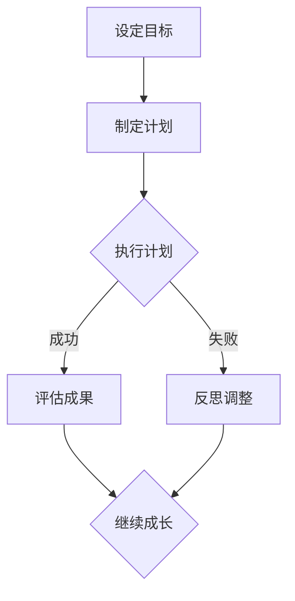

                 

### 引入

在当今快节奏的社会中，"成功"成为了一个被高度关注和广泛讨论的话题。然而，传统的成功定义往往局限于物质财富、社会地位和职业成就。这种定义不仅忽略了个人内心的满足和幸福感，还常常让人们陷入无尽的追求中，无法找到真正的自我价值。本文将打破这种社会定义的成功框架，探讨个人成就的另类衡量方式，以引导读者重新审视成功的真正含义。

成功，究竟是什么？这个问题看似简单，却蕴含着复杂的哲学和社会学思考。传统观念中的成功，往往被理解为达到某种社会标准，如财富的积累、权力的掌控、知名度的提升等。然而，这种定义在现代社会中暴露出诸多问题。首先，它过于单一，无法全面反映一个人的生活质量和幸福感。其次，它强调外部评价，忽视了个人内心的需求和价值观。最后，它容易导致人们陷入竞争和比较的陷阱，忽略了个人成长和自我实现的重要性。

本文旨在提出一种另类衡量成功的框架，强调个人价值观、幸福感、成长和社会贡献等多个维度。我们将通过多角度的分析和案例研究，帮助读者重新定义成功，找到适合自己的成功路径。本文的结构如下：

1. **引言**：介绍成功的传统定义及其局限性，阐述另类衡量成功的必要性。
2. **核心概念与联系**：定义成功的新框架，解释核心概念及其相互关系，使用Mermaid流程图展示成功衡量指标的关系架构。
3. **核心算法原理讲解**：通过Python源代码和数学模型，详细阐述如何衡量个人成就，并结合实际案例进行举例说明。
4. **项目实战与代码解读**：介绍如何搭建开发环境，详细讲解源代码实现，分析代码应用，以及实际案例的剖析。
5. **最佳实践 tips、小结与拓展阅读**：总结文章要点，提供实用建议，推荐进一步阅读的资源。

### 关键词

- 成功定义
- 个人成就
- 幸福感
- 成长
- 社会贡献
- 另类衡量标准

### 摘要

本文通过分析传统成功定义的局限性，提出一种以个人价值观、幸福感、成长和社会贡献为核心的另类成功衡量框架。文章使用Mermaid流程图展示成功指标的关系架构，通过Python源代码和数学模型详细解释如何衡量个人成就，并结合实际案例进行深入剖析。最终，文章提供了一系列实用建议，帮助读者重新定义成功，实现自我价值的最大化。

## 第1章 引言

### 1.1 成功的传统定义与局限

"成功"是一个广泛讨论且含义丰富的概念，不同的人对成功有不同的理解。在传统观念中，成功通常被定义为达到某种社会标准，如财富的积累、权力的掌控、知名度的提升等。这种定义在过去的几个世纪中主导了人们的价值观和行为准则，然而，随着社会的发展和价值观的变迁，这种定义的局限性也逐渐显现。

#### 1.1.1 成功的传统定义

传统定义的成功主要集中在以下几个方面：

1. **财富积累**：许多人认为，成功就是拥有大量的财富，可以自由地支配时间和资源。
2. **社会地位**：社会地位被视为成功的重要标志，包括职位的高低、社会网络的范围等。
3. **知名度**：在媒体高度发达的今天，知名度成为许多人追求的目标，认为只有被大众所知才算是成功。

这种定义往往强调外部评价和物质财富，而忽视了个人内心的需求和幸福感。传统成功观的核心是“外在成就”，它往往要求个人在社会上取得显赫的成就，以满足社会的期望和标准。

#### 1.1.2 局限性分析

然而，随着社会的变迁和价值观的多元化，这种传统定义的成功暴露出诸多局限性：

1. **单一维度**：传统定义的成功往往只关注物质财富和职业成就，忽视了个人心理健康、幸福感、家庭关系等生活质量的方面。
2. **忽视个人价值观**：个人价值观是每个人独特的信念和追求，传统成功定义往往忽视这一点，导致个人在追求外部成就的过程中失去自我。
3. **导致过度竞争**：社会对成功的单一定义容易导致人们陷入过度竞争和比较的陷阱，使个人的内心充满焦虑和不安。

#### 1.1.3 社会变迁对成功的重新定义

随着社会的不断发展和价值观的多元化，人们对成功的定义也在不断演变。现代社会更加注重个人价值观的体现，强调内心满足和社会贡献。以下是一些对成功的新理解：

1. **幸福感**：越来越多的人开始关注个人幸福感，认为内心的平静和满足才是真正的成功。
2. **成长和自我实现**：自我成长和实现成为许多人追求的目标，认为通过不断学习和提升自己，实现个人价值和梦想才是成功的关键。
3. **社会贡献**：越来越多的人认识到，个人的成功不仅体现在个人成就上，更体现在对社会和他人的贡献上。

#### 1.1.4 另类衡量成功的必要性

面对传统成功定义的局限性，重新定义成功显得尤为必要。另类衡量成功的必要性体现在以下几个方面：

1. **全面反映生活质量**：另类衡量标准更加全面，不仅关注物质财富和职业成就，还关注个人心理健康、幸福感、家庭关系等生活质量方面。
2. **重视个人价值观**：另类衡量标准强调个人价值观的体现，鼓励个人在追求外部成就的同时保持自我，实现内心平衡。
3. **减少社会焦虑**：通过重新定义成功，可以减少社会对成功的单一化定义带来的竞争和焦虑，让人们更加关注个人成长和自我实现。

总之，传统成功定义的局限性促使我们需要重新审视成功的真正含义，以更加全面和多元的角度来衡量个人成就。这不仅有助于提升个人的生活质量，也能促进社会的和谐与进步。在接下来的章节中，我们将进一步探讨成功的多维度分析，并提出另类衡量成功的新框架。

### 1.2 另类衡量成功的必要性

在现代社会，传统的成功定义已经不再能满足人们日益增长的多层次需求。这种局限性不仅体现在对个人幸福感和生活质量的忽视，还表现在忽视个人价值观和社会责任等方面。因此，重新定义成功，提出另类衡量成功的标准，成为当务之急。

#### 1.2.1 社会变迁对成功的重新定义

随着社会的发展和价值观的变迁，人们对于成功的理解也在不断变化。现代社会更加注重个人的幸福感、心理健康、家庭关系和社会贡献。以下是对现代社会中成功重新定义的几个关键点：

1. **幸福感**：现代心理学研究表明，幸福感是衡量生活质量的重要指标。一个人的幸福感不仅仅取决于物质财富的多少，还与个人的心理健康、情感状态、人际关系和社会支持系统密切相关。

2. **心理健康**：在传统成功观中，心理健康往往被忽视。然而，随着心理健康问题的日益凸显，越来越多的人开始认识到心理健康对个人成就和生活质量的重要性。

3. **家庭关系**：家庭是社会的基本单位，家庭关系的和谐与稳定对个人的幸福感和社会适应能力具有重要影响。因此，家庭关系也成为衡量个人成功的一个重要维度。

4. **社会贡献**：在现代社会，越来越多的人开始关注个人的社会贡献，认为通过为他人和社会做出贡献，才能真正实现自我价值和成就感。

#### 1.2.2 另类衡量标准的优势

与传统的成功定义相比，另类衡量标准具有以下优势：

1. **全面性**：另类衡量标准更加全面，不仅关注物质财富和职业成就，还涵盖了心理健康、幸福感、家庭关系和社会贡献等多个维度。

2. **个性化**：另类衡量标准强调个人价值观和追求的多样性，鼓励个人根据自己的价值观和兴趣来定义成功，从而实现个性化发展。

3. **可持续性**：传统的成功定义往往追求短期成就，而另类衡量标准更加注重长期的生活质量和可持续性，鼓励人们追求平衡和持续发展。

4. **减少竞争和焦虑**：另类衡量标准减少了社会对成功的单一化定义带来的竞争和焦虑，让个人更加关注个人成长和内心满足。

#### 1.2.3 另类衡量成功的意义

重新定义成功，提出另类衡量标准，具有深远的意义：

1. **提升生活质量**：通过全面衡量个人成就，另类衡量标准有助于提升个人的生活质量和幸福感。

2. **促进个人成长**：另类衡量标准鼓励个人关注自我成长和实现，从而实现个人潜能的最大化。

3. **促进社会和谐**：另类衡量标准减少了社会上的过度竞争和焦虑，有助于构建更加和谐的社会环境。

4. **推动社会进步**：通过重新定义成功，可以引导社会更加注重心理健康、家庭关系和社会贡献，从而推动社会的全面进步。

总之，在现代社会，另类衡量成功的标准不仅是必要的，也是有益的。它不仅有助于个人实现自我价值，也为社会的和谐与进步提供了新的思路。在接下来的章节中，我们将深入探讨成功的多维度分析，并具体阐述如何衡量个人成就。

## 第2章 成功的定义与衡量

### 2.1 成功的多维度分析

成功并非单一维度的概念，它涉及到多个方面的综合评估。在现代社会，成功的多维度分析成为理解个人成就的重要途径。以下将从个人价值观、心理学视角、社会和文化等多个角度探讨成功的多维性，并解释这些维度之间的相互关系。

#### 2.1.1 个人价值观与成功

个人价值观是每个人内心深处的信仰和追求，它对成功的定义和追求有着重要影响。不同的个人价值观会导致不同的成功标准：

1. **目标导向**：一些人认为成功是达到特定的目标，如财富积累、职位晋升或成就某种事业。这种价值观强调外在成就和社会认可。
2. **内在满足**：另一些人则更看重内心的满足和幸福感，他们认为成功是通过实现个人价值观和追求内心平静来实现的。

个人价值观不仅影响对成功的定义，还影响追求成功的路径和方式。一个重视家庭关系的人可能会选择稳定的工作和充实的生活，而一个追求创新和变革的人可能会选择创业和冒险。

#### 2.1.2 心理学视角下的成功

心理学为理解成功提供了独特的视角。以下是几个关键心理学概念及其对成功的影响：

1. **自我效能感**：自我效能感是指一个人对自己完成任务能力的信心。高自我效能感的人更有可能设定挑战性目标并努力实现它们，从而取得成功。
2. **主观幸福感**：主观幸福感是指个人对自身生活质量的评价。研究表明，高主观幸福感与身心健康、生活满意度和成功相关。
3. **情绪智力**：情绪智力包括理解和管理情绪的能力，以及在人际交往中有效地运用情绪。情绪智力高的人通常能更好地处理压力和挑战，从而在职业生涯和个人生活中取得成功。

心理学视角强调内在的心理状态对成功的重要性，提醒我们在追求成功的同时，也要关注个人的心理健康和情绪管理。

#### 2.1.3 社会和文化对成功的定义

社会和文化背景对成功的定义有着深远影响。不同社会和文化对成功的理解和追求方式各有不同：

1. **社会期待**：社会对成功的期待通常与职业成就和社会地位相关。在一个注重物质财富和权力积累的社会中，成功往往与高收入、高职位和广泛的社会联系相关。
2. **文化价值观**：不同文化对成功的价值观也有所不同。例如，一些文化强调个人成就，而另一些文化则更重视家庭和社会责任。文化背景会影响人们对成功的理解和追求方式。

社会和文化对成功的定义不仅影响个人的价值观和行为，也影响社会整体的发展方向。一个注重个人成就的社会可能会鼓励创新和竞争，而一个强调社会责任和集体利益的社会则可能更加和谐和稳定。

#### 2.1.4 成功的相互关系

个人价值观、心理学视角和社会文化对成功的影响是相互交织的：

1. **个人价值观与心理状态**：个人价值观会影响心理状态，而心理状态又反过来影响个人价值观。例如，一个重视家庭的人可能会通过改善家庭关系来提升心理健康，从而增强自我效能感，实现更高的职业成就。
2. **社会期待与个人追求**：社会期待可以激励个人追求成功，但也可能导致个人价值观的扭曲和压力。个人需要在追求社会期待的同时，保持自我认知和价值观的独立。
3. **文化价值观与社会发展**：文化价值观不仅影响个人的成功观念，也影响社会整体的发展方向。一个尊重多元文化的社会能够鼓励个人根据自身价值观追求成功，从而促进社会的多样性和创新。

综上所述，成功是一个多维度、多层次的概念，涉及个人价值观、心理学视角和社会文化等多个方面。理解成功的多维性有助于我们更加全面地评估个人成就，并找到适合自己的成功路径。在接下来的章节中，我们将进一步探讨成功的另类衡量标准，帮助读者重新定义成功，实现个人价值的最大化。

### 2.2 成功的另类衡量标准

在重新审视传统成功定义的基础上，我们需要提出一种全新的、全面的衡量标准，以更准确地反映个人的成就与幸福感。这些另类衡量标准不仅关注物质财富和职业成就，还涵盖了幸福感、成长、社会贡献等多个维度。

#### 2.2.1 幸福感与生活质量

幸福感是衡量生活质量的关键指标。传统的成功定义往往忽略了内心的满足，而幸福感正是个人对生活满意度的主观感受。以下是一些衡量幸福感和生活质量的指标：

1. **心理健康**：心理健康包括情绪稳定性、积极情感和良好的心理状态。可以通过心理健康调查问卷（如盖洛普幸福调查）来评估。
2. **人际关系**：良好的家庭关系、亲密的友谊和积极的人际交往对幸福感至关重要。可以通过社交支持调查和情感支持评估来衡量。
3. **工作满意度**：工作不仅是赚钱的手段，更是实现个人价值和成就感的重要途径。可以通过员工满意度调查和职业幸福感指标来衡量。
4. **休闲与娱乐**：充足的休闲时间和丰富的生活娱乐活动对提升生活质量有重要作用。可以通过休闲时间调查和娱乐活动满意度来衡量。

#### 2.2.2 成长与自我实现

成长与自我实现是个人追求更高层次成就的动力。以下是衡量个人成长与自我实现的关键指标：

1. **终身学习**：持续学习新知识和技能，提升自身能力。可以通过学习频率、学习内容和技能提升程度来衡量。
2. **职业发展**：在职业生涯中取得显著进步，实现职业目标。可以通过职位晋升、薪资增长和职业满意度来衡量。
3. **自我反思**：通过定期反思自己的行为、目标和价值观，不断调整和优化。可以通过反思日记和自我评估工具来衡量。
4. **创新能力**：在工作和生活中不断提出新想法和解决方案，推动个人和团队进步。可以通过创新项目数量、创新成果和团队反馈来衡量。

#### 2.2.3 社会贡献与影响力

社会贡献与影响力是衡量个人成功的重要维度。以下是一些衡量社会贡献和影响力的指标：

1. **志愿服务**：参与志愿服务活动，为社区和他人提供帮助。可以通过志愿服务时长、服务项目和受助人数来衡量。
2. **慈善捐助**：通过捐助资金、物资或时间，支持公益事业。可以通过捐助金额、捐赠项目和受捐助对象来衡量。
3. **社会影响**：通过个人或团队的努力，对社会产生积极的影响。可以通过媒体报道、公众评价和社会认可度来衡量。
4. **领导力**：在团队中发挥领导作用，推动团队发展和成员成长。可以通过领导力评估、团队绩效和成员反馈来衡量。

#### 2.2.4 综合评估与平衡

成功的另类衡量标准需要综合多个维度，并进行平衡评估。以下是一个简单的综合评估框架：

1. **心理健康与幸福感**：通过心理健康问卷和主观幸福感评估，确定心理健康和幸福感水平。
2. **职业成就与成长**：通过职位晋升、薪资增长和职业满意度评估，确定职业成就和成长状况。
3. **社会贡献与影响力**：通过志愿服务、慈善捐助和社会影响评估，确定社会贡献和影响力。
4. **生活质量与成长**：通过休闲时间调查、家庭关系和自我反思，确定生活质量和成长状态。

通过这个综合评估框架，个人可以全面了解自己的成就和现状，找到需要改进和提升的方面。同时，这个框架也为个人提供了明确的衡量标准，有助于制定更具体和可行的目标。

总之，成功的另类衡量标准不仅关注物质财富和职业成就，更注重个人幸福感、成长和社会贡献。这种全面的衡量标准有助于个人重新定义成功，实现全面发展和自我价值的最大化。在接下来的章节中，我们将进一步探讨如何突破社会定义的成功框架，找到更适合自己的成功路径。

### 2.2.1 幸福感与生活质量

幸福感是衡量个人生活质量的核心指标，它不仅关系到个人的心理健康，还直接影响到日常生活的方方面面。在另类成功衡量标准中，幸福感占据着重要位置，因为它反映了个体在追求物质成功之外，对生活满意度和内心满足的追求。

#### 幸福感的定义与衡量

幸福感是一种主观感受，通常指的是一个人对自身生活质量的评价。这种感受不仅仅依赖于物质财富的积累，还受到心理状态、人际关系和社会环境的影响。衡量幸福感的标准包括以下几个方面：

1. **心理健康**：心理健康是幸福感的基础。良好的心理健康表现为情绪稳定、自我认同感强、能够有效应对生活中的压力和挑战。可以通过心理健康问卷，如世界卫生组织的心理健康量表（WHPS），来评估个体的心理健康状态。

2. **生活质量**：生活质量是一个多维度的概念，包括物质条件、社会关系、工作环境、教育水平等多个方面。可以通过生活质量指数（PQLI）或幸福指数（HDI）来衡量个体的生活质量。

3. **主观幸福感**：主观幸福感是个人对自己生活满意度的自我评价。通常通过幸福感调查问卷，如盖洛普幸福调查，来收集个体对自身幸福感的评价。

#### 幸福感的影响因素

幸福感受到多种因素的影响，包括但不限于以下几个方面：

1. **心理健康**：心理健康直接影响幸福感。焦虑、抑郁等心理问题会降低幸福感，而良好的心理健康则有助于提升幸福感。

2. **社会支持**：家庭、朋友和社会网络提供的支持是提升幸福感的重要因素。一个稳定和支持性的社交网络有助于个体在面对困难和挑战时保持积极的心态。

3. **工作环境**：工作环境对幸福感有显著影响。一个有意义、支持性和富有挑战性的工作环境有助于提高工作满意度和幸福感。

4. **个人价值观**：个人价值观对幸福感的形成有重要影响。与个人价值观一致的生活和职业选择能够带来更高的幸福感。

5. **生活方式**：健康的生活方式，如适量的运动、良好的饮食习惯和充足的休息，有助于提高幸福感。

#### 如何提升幸福感

提升幸福感不仅仅是追求物质财富，更涉及到生活方式和心理状态的调整。以下是一些提升幸福感的建议：

1. **培养积极的思维方式**：积极的心态有助于应对生活中的挑战，提升幸福感。可以通过冥想、正念练习等方式培养积极的思维方式。

2. **建立良好的人际关系**：与家人、朋友和同事建立积极、健康的关系，可以增强社会支持，提升幸福感。

3. **追求有意义的事业**：找到与自己价值观一致的事业，追求个人的成长和自我实现，能够提升工作满意度和幸福感。

4. **保持健康的生活习惯**：健康的生活习惯，如定期锻炼、合理饮食和充足睡眠，有助于提升心理健康和生活质量。

5. **感恩和回馈**：培养感恩的心态，对生活中的点滴幸福保持感激，并通过志愿服务或慈善捐助回馈社会，能够增强幸福感。

总之，幸福感是另类成功衡量标准中的重要一环。通过关注心理健康、社会支持、工作环境和生活方式等多个方面，个体可以提升幸福感，实现全面的生活质量提升。在追求成功的过程中，幸福感不仅是一个重要的衡量指标，更是个体追求幸福和满足的重要动力。在接下来的章节中，我们将继续探讨成长与自我实现这一重要维度。

#### 2.2.2 成长与自我实现

成长与自我实现是个人追求更高层次成就的动力，它们不仅关乎职业发展，更涉及个人的全面发展。在另类成功衡量标准中，成长与自我实现占据重要地位，因为它们反映了个体的持续进步和内在满足。

#### 成长的定义与衡量

成长是指个体在知识、技能、心理和情感等方面的不断进步。衡量成长的标准可以从以下几个方面入手：

1. **知识积累**：通过学习新知识、技能和经验，不断扩展个人的知识面和技能储备。可以通过学习记录、考试分数和知识竞赛成绩来衡量。

2. **能力提升**：在工作和生活中，通过实践和挑战，提升个人的能力和效率。可以通过工作绩效评估、任务完成质量和团队合作能力来衡量。

3. **自我反思**：通过定期反思个人的行为、决策和目标，识别自己的优点和不足，并制定改进计划。可以通过反思日记、自我评估报告和导师反馈来衡量。

4. **心理成熟**：心理成熟表现为情绪管理能力、自我认知和人际关系处理能力。可以通过情绪智力测试、心理健康评估和社交技能训练来衡量。

#### 自我实现的定义与衡量

自我实现是指个体在追求个人潜能和实现个人价值的过程中，达到自我认同和自我价值感的最高状态。衡量自我实现的标准包括：

1. **职业成就感**：在职业生涯中，实现个人的职业目标，取得显著的成就和认可。可以通过职位晋升、薪资增长、工作满意度和行业荣誉来衡量。

2. **生活满意度**：对个人生活各方面的整体满意度，包括家庭、事业、健康和社交。可以通过生活满意度调查、个人日记和幸福感评估来衡量。

3. **创新和创造力**：在工作和生活中，能够持续产生新的想法和解决方案，推动个人和团队的发展。可以通过创新项目数量、创新成果和团队反馈来衡量。

4. **自我价值感**：个体对自己价值的认知和认同，表现为自信、自我肯定和积极的生活态度。可以通过自我评估问卷、心理咨询和社交反馈来衡量。

#### 成长与自我实现的关系

成长与自我实现是相辅相成的，它们之间存在密切的关系：

1. **相互促进**：持续的成长为自我实现提供了基础和动力，而自我实现则是对个人成长成果的认可和肯定。通过不断成长，个体可以实现更高层次的目标和追求。

2. **平衡发展**：成长和自我实现需要平衡发展。仅仅追求职业成就而不关注个人成长可能导致精神空虚，而只关注个人成长而不追求职业成就则可能缺乏现实的支撑。

3. **内在满足**：成长和自我实现带来的内在满足感是衡量成功的重要维度。通过实现个人价值和追求自我认同，个体可以获得更深层次的幸福感。

#### 实现成长与自我实现的策略

为了实现个人成长和自我实现，以下是一些建议：

1. **设定清晰的目标**：明确自己的职业和个人发展目标，制定可行的计划和时间表。

2. **持续学习和提升**：通过参加培训课程、阅读专业书籍和参与行业研讨会，不断扩展知识和技能。

3. **勇于挑战和尝试**：在工作和生活中勇于接受挑战，尝试新的任务和项目，提升自身能力。

4. **自我反思和调整**：定期反思个人行为和决策，识别优点和不足，并根据反馈进行调整。

5. **建立支持系统**：与导师、同事和家人建立良好的关系，寻求他们的建议和支持。

6. **关注心理健康**：保持良好的心理状态，通过心理咨询和正念练习等方式提升心理健康。

总之，成长与自我实现是个人追求成功的重要组成部分。通过设定清晰的目标、持续学习和提升、勇于挑战和尝试、自我反思和调整，以及建立支持系统，个体可以逐步实现个人成长和自我实现，找到属于自己的成功路径。在接下来的章节中，我们将探讨社会贡献与影响力这一重要维度，进一步丰富我们对成功的理解。

#### 2.2.3 社会贡献与影响力

社会贡献与影响力是衡量个人成功的重要维度，它不仅仅体现为物质财富的积累或职业成就的取得，更体现为对社会的实际影响和贡献。通过为社会做出贡献，个人不仅能够实现自我价值，还能对更广泛的社会产生积极的影响。

#### 社会贡献的定义与衡量

社会贡献是指个人通过行动或资源帮助他人、改善社会环境或推动社会进步的行为。以下是一些衡量社会贡献的指标：

1. **志愿服务**：参与志愿服务活动，为社区或他人提供无偿帮助。可以通过志愿服务时间、服务项目和受助人数来衡量。

2. **慈善捐助**：通过捐助资金、物资或时间，支持公益事业。可以通过捐赠金额、捐赠项目和受捐助对象的数量来衡量。

3. **社会影响**：通过个人或团队的努力，对社会产生积极的影响。可以通过媒体报道、公众评价和社会认可度来衡量。

4. **领导力**：在团队中发挥领导作用，推动团队发展和成员成长。可以通过领导力评估、团队绩效和成员反馈来衡量。

#### 社会贡献的重要性

社会贡献不仅能够提升个人的社会地位和声誉，更能够为社会的整体进步和和谐发展做出重要贡献。以下是社会贡献的重要性：

1. **实现个人价值**：通过为社会做出贡献，个人能够实现自我价值，获得成就感和满足感。

2. **推动社会进步**：社会贡献能够促进社会资源的合理分配和利用，推动社会的整体进步和发展。

3. **促进社会和谐**：通过帮助他人和改善社会环境，能够促进社会的和谐与稳定，减少社会矛盾和冲突。

4. **传递正能量**：积极的社会贡献能够传递正能量，激励更多的人参与到公益事业中，共同推动社会的美好未来。

#### 提升社会贡献与影响力的策略

为了提升个人的社会贡献与影响力，以下是一些实用策略：

1. **明确目标**：设定明确的社会贡献目标，制定具体的计划和行动步骤。

2. **持续学习**：通过参加培训课程、阅读相关书籍和与领域专家交流，提升自己在特定领域的知识和技能。

3. **积极参与**：主动参与志愿服务、慈善捐助和社会活动，以实际行动为社会做出贡献。

4. **建立网络**：与同行和社区建立良好的关系网络，共同推动社会进步。

5. **创新实践**：探索创新的社会贡献模式和方法，提高社会贡献的效果和影响力。

6. **自我反思**：定期反思自己的社会贡献活动，评估效果，并根据反馈进行调整和改进。

7. **分享经验**：通过撰写文章、举办讲座和参与讨论，分享自己的经验和见解，激励更多人参与社会贡献。

总之，社会贡献与影响力是衡量个人成功的重要维度，它不仅关系到个人的社会价值和自我实现，也对社会的发展和进步具有重要意义。通过明确目标、持续学习、积极参与、建立网络、创新实践、自我反思和分享经验，个人可以不断提升自己的社会贡献与影响力，实现个人价值和社会价值的双赢。在接下来的章节中，我们将进一步探讨如何突破社会定义的成功框架，帮助读者重新定义成功，实现个人成就的最大化。

## 第3章 突破社会定义的成功框架

### 3.1 社会压力与自我认知

在现代社会，社会压力常常成为人们追求成功的一大障碍。社会对成功的单一定义和过度强调，使得个人在面对社会期待时感到巨大的心理压力。这种压力不仅源于外部的竞争和比较，还源于自我认知的不足和焦虑。

#### 3.1.1 社会期待与个人追求

社会期待通常以物质财富、职业成就和名誉地位为主要衡量标准。这些标准在某种程度上确实反映了社会的发展和进步，但过于单一和僵化，容易导致个人在追求成功的过程中迷失自我。许多人为了达到社会的期待，不得不放弃自己的兴趣和梦想，甚至牺牲家庭和健康。这种现象在年轻人中尤为普遍，许多年轻人在面对就业压力和家庭期望时，感到无所适从，甚至产生严重的焦虑和抑郁情绪。

#### 3.1.2 突破社会框架的挑战

要突破社会定义的成功框架，个人需要面对以下几个挑战：

1. **自我认知**：首先，个人需要深入反思自己的价值观和追求，明确自己的目标和兴趣所在。这需要时间和耐心，但只有真正了解自己，才能找到适合自己的成功路径。

2. **勇气和决心**：突破社会框架需要勇气和决心。个人必须勇于面对社会的不理解和压力，坚持自己的信念和选择。这种坚持不仅需要坚强的意志力，还需要良好的心理素质和抗压能力。

3. **资源和网络**：突破社会框架还需要一定的资源和网络支持。个人可以通过参加各种社交活动和培训课程，扩展自己的视野和人脉，获取更多的信息和机会。

4. **适应变化**：社会在不断变化，个人的成功路径也需要不断调整。个人需要具备灵活的思维和适应能力，以应对社会和市场的变化。

#### 3.1.3 社会压力对自我认知的影响

社会压力对自我认知的影响是深远的。长期处于高压环境下，个人容易陷入自我怀疑和否定，甚至产生自卑和焦虑情绪。这种情绪会影响个人的判断力和决策能力，使个人在追求成功的过程中迷失方向。同时，社会压力还可能导致个人在追求物质成功的过程中忽视心理健康和生活质量，从而陷入精神困境。

#### 3.1.4 突破社会框架的意义

突破社会定义的成功框架不仅对个人具有重要意义，也对整个社会产生积极影响：

1. **促进个人成长**：通过突破社会框架，个人可以更加自由地追求自己的梦想和目标，实现个人价值的最大化。

2. **减少社会焦虑**：社会对成功的单一定义容易导致社会上的过度竞争和焦虑。突破社会框架可以减少这种焦虑，使社会更加和谐和稳定。

3. **推动社会进步**：突破社会框架可以激发个人的创造力和创新精神，推动社会的全面进步。

4. **提升生活质量**：通过重新定义成功，个人可以更加关注心理健康和生活质量，实现全面的发展和提升。

总之，突破社会定义的成功框架是个人成长和社会进步的必要步骤。通过自我认知、勇气和决心、资源和网络以及适应变化，个人可以找到适合自己的成功路径，实现自我价值和社会价值的双赢。在接下来的章节中，我们将进一步探讨如何重新定义个人成功，为个人提供更具体和实用的指导。

### 3.2 重新定义个人成功

要突破社会定义的成功框架，重新定义个人成功是关键一步。这不仅仅是改变对成功的认知，更是重新审视自己的价值观、兴趣和目标，找到真正属于自己的成功路径。

#### 3.2.1 建立个人价值观

个人价值观是重新定义成功的基础。每个人都有自己独特的价值观，这些价值观决定了我们如何看待成功、如何行动以及如何做出决策。建立个人价值观的过程可以分为以下几个步骤：

1. **反思自己的兴趣和梦想**：思考自己真正热爱的事物，以及希望在人生中实现的目标。这些兴趣和梦想是个人价值观的重要来源。

2. **识别自己的优势和弱点**：了解自己的优势和弱点，明确自己擅长和愿意投入的领域。这有助于我们确定个人价值观的具体内容。

3. **确立核心价值观**：从兴趣、优势和弱点中提炼出几个核心价值观，这些价值观将指导我们做出关键决策，并帮助我们找到成功的方向。

4. **实践和调整**：将个人价值观应用到实际生活中，通过实践不断调整和完善，使它们更加符合我们的内心需求。

#### 3.2.2 确立个人目标与计划

在建立个人价值观的基础上，确立具体的目标和计划是重新定义成功的重要步骤。以下是一些确立个人目标和计划的策略：

1. **设定明确的目标**：将个人价值观转化为具体、可衡量的目标。例如，如果个人价值观中包括“终身学习”，则可以设定“每年阅读50本书”的目标。

2. **制定详细的计划**：为实现目标，需要制定具体的行动计划和时间表。例如，如果目标是“提高编程技能”，则可以制定“每周参加编程课程”和“每天编写一定数量的代码”的计划。

3. **分解目标**：将大目标分解为小目标，逐步实现。这样不仅可以减少压力，还能增强成就感。

4. **定期评估和调整**：定期评估自己的进度，根据实际情况调整计划和目标。这有助于保持灵活性和适应性。

#### 3.2.3 成功的重定义过程

重新定义成功是一个持续的过程，涉及自我认知、目标设定、行动和反思等多个方面。以下是一个简化的重定义过程：

1. **自我认知**：反思自己的兴趣、优势和价值观，明确自己的需求和追求。

2. **目标设定**：根据自我认知，设定具体、可衡量的目标，并制定详细的行动计划。

3. **行动**：按照计划执行，不断努力，同时保持灵活性和适应性。

4. **反思和调整**：定期反思自己的行为和成果，评估目标的实现情况，并根据反馈进行调整。

5. **持续进步**：通过不断学习和成长，进一步提升个人能力和价值，实现更高层次的成功。

#### 3.2.4 成功的重定义实践

以下是一个具体的成功重定义实践案例：

**案例：小李的职业生涯规划**

1. **自我认知**：小李在职业咨询中发现自己对教育和科技领域有浓厚的兴趣，并且擅长与人沟通和组织活动。

2. **确立核心价值观**：小李确定自己的核心价值观是“帮助他人成长”和“创新和探索”。

3. **设定目标**：小李设定了短期目标（如“在一年内完成在线教育课程”）和长期目标（如“在五年内成为教育科技领域的专家”）。

4. **制定计划**：小李制定了详细的行动计划，包括参加相关培训、加入专业社群、参与项目开发和撰写专业文章。

5. **执行和反思**：小李按照计划行动，并在过程中不断反思和调整。例如，他发现自己对在线课程的学习效率不高，于是调整了学习方式，增加了小组讨论和项目实践。

6. **持续进步**：通过不断学习和实践，小李逐渐在教育和科技领域建立了自己的声誉，实现了职业上的成功。

通过这个案例，我们可以看到，重新定义成功需要结合自我认知、目标设定、行动和反思等多个方面，不断调整和优化。只有找到真正适合自己的成功路径，才能实现个人价值的最大化。

### 3.3 重新定义成功的实践案例

为了更好地理解如何重新定义成功，我们可以通过一些具体的实践案例来进行分析。这些案例涵盖了不同的行业和领域，展示了不同人在重新定义成功过程中的挑战和收获。

#### 案例一：小张的创业之路

**背景**：小张曾在一家知名企业担任高级经理，年收入丰厚，职业发展稳定。然而，他一直对创业充满热情，并梦想创办一家自己的公司。

**挑战**：小张在决定创业之初，面临着巨大的压力。他不仅要承担创业的风险，还要应对社会和家庭对他的期待。同时，他对市场的不确定性感到担忧，担心自己的创业梦想无法实现。

**解决方案**：小张首先进行了深入的自我认知，明确了自己的核心价值观是“创新和实现梦想”。在此基础上，他确立了具体的创业目标，包括“创办一家具有社会影响力的科技公司”和“打造一个创新的企业文化”。

在创业过程中，小张注重实践和反思。他制定了详细的商业计划，并通过不断的市场调研和用户反馈，调整和优化自己的产品和服务。同时，他积极参与行业活动，建立广泛的人脉网络，以获取更多的资源和机会。

**结果**：经过几年的努力，小张的创业公司取得了显著的成就。公司在市场上获得了良好的口碑，产品得到了用户的广泛认可。小张不仅实现了自己的创业梦想，还为社会创造了就业机会，推动了科技创新。

**启示**：小张的案例表明，重新定义成功需要勇气和决心。通过明确的价值观和具体的创业目标，小张成功地克服了创业初期的困难和挑战，找到了属于自己的成功路径。

#### 案例二：小李的艺术追求

**背景**：小李是一名年轻的艺术家，她从小就对绘画充满热情。然而，在追求艺术的过程中，她面临来自社会和家庭的压力，认为艺术家难以养家糊口。

**挑战**：小李在决定全职从事艺术创作时，面临着巨大的社会和家庭压力。许多人质疑她的选择，认为她应该找一份稳定的工作，以保障未来的生活。

**解决方案**：小李首先明确了她的核心价值观是“追求艺术和内心的自由”。她决定不受外界压力的影响，坚持自己的艺术追求。

在艺术创作中，小李注重自我表达和情感的传递。她通过不断的实践和反思，提升自己的绘画技巧和艺术表达力。同时，她积极参加各种艺术展览和比赛，扩大自己的影响力。

**结果**：经过多年的努力，小李的艺术作品得到了广泛的认可和赞誉。她的作品不仅在国内艺术市场上获得了高价值，还在国际艺术展览中赢得了奖项。小李不仅实现了自己的艺术梦想，还为艺术界带来了新的启示和创新。

**启示**：小李的案例表明，重新定义成功需要坚持自我和内心的声音。通过追求个人兴趣和价值观，小李成功地克服了外界的压力和质疑，找到了属于自己的成功路径。

#### 案例三：小王的公益事业

**背景**：小王是一名普通的白领，他一直对公益事业充满热情。然而，他在面对繁忙的工作和生活的压力时，常常感到无力承担更多的社会责任。

**挑战**：小王在决定全职投入公益事业时，面临着工作收入减少和生活压力增加的挑战。他需要平衡个人职业和公益事业的发展，同时应对来自家庭和社会的质疑。

**解决方案**：小王首先明确了他的核心价值观是“帮助他人和社会进步”。他决定将公益事业与个人职业相结合，通过创新的方式实现自己的目标。

在公益事业中，小王注重实践和可持续发展。他通过建立公益组织、发起社会活动和参与志愿服务，为弱势群体提供帮助。同时，他积极参与政策倡导和公共教育，推动社会问题的解决。

**结果**：经过多年的努力，小王的公益事业取得了显著成效。他的公益组织得到了社会的广泛认可和支持，许多弱势群体得到了实质性的帮助。小王不仅实现了自己的社会价值，还影响了更多的人参与到公益事业中。

**启示**：小王的案例表明，重新定义成功需要将个人兴趣和社会责任相结合。通过追求个人价值观和社会进步，小王成功地找到了属于自己的成功路径，并为社会带来了积极的影响。

总之，这些案例展示了不同人在重新定义成功过程中的挑战和收获。通过明确个人价值观、设定具体目标、实践和反思，每个人都可以找到属于自己的成功路径，实现个人价值的最大化。

### 3.4 从案例中汲取经验与启示

通过前文中的实践案例，我们可以总结出一些重要的经验和启示，帮助读者在重新定义个人成功的过程中少走弯路。

#### 1. 确立明确的核心价值观

核心价值观是个人成功的指南针，它帮助我们在面对选择时保持方向。无论是小张的创业梦想、小李的艺术追求，还是小王的公益事业，他们都清楚地知道自己的核心价值是什么，并以此为依据做出决策。因此，读者在重新定义成功时，首先要明确自己的核心价值观，这将有助于我们在追求成功的道路上保持一致性和坚定性。

#### 2. 设定具体、可衡量的目标

目标设定是成功的关键步骤。小张、小李和小王都设定了明确、具体、可衡量的目标，这不仅使他们能够清晰地知道自己要做什么，还能通过目标的实现过程不断积累信心和成就感。读者在设定目标时，应确保目标具有可操作性和现实性，从而提高实现的可能性。

#### 3. 持续实践与反思

成功不是一蹴而就的，它需要持续的努力和不断的反思。小张在创业过程中不断调整商业策略，小李在艺术创作中不断探索新的表达方式，小王在公益事业中不断优化项目执行。读者在追求成功的过程中，也需要保持灵活性和适应性，通过不断的实践和反思来提升自己。

#### 4. 坚持自我，勇敢面对挑战

在追求成功的过程中，每个人都会面临来自社会和自我的挑战。小张在面对家庭和事业的压力时，坚持自己的创业梦想；小李在追求艺术的道路上，勇敢地面对社会对艺术职业的质疑；小王在公益事业中，坚定地推行自己的理念。读者在追求成功时，也需要勇敢地面对挑战，坚持自我，不因外界的质疑和困难而动摇。

#### 5. 结合个人兴趣与社会责任

个人兴趣和社会责任可以相辅相成，共同推动个人的成功。小张通过创业实现了个人价值，同时也为社会创造了就业机会；小李通过艺术创作传递情感，影响了更多的人；小王通过公益事业帮助弱势群体，推动了社会进步。读者在重新定义成功时，应考虑将个人兴趣与社会责任相结合，从而实现更大的社会价值。

#### 6. 寻求支持和建立人脉

成功的路上，人脉和支持至关重要。小张通过积极参与行业活动，建立了广泛的人脉网络；小李通过参加艺术展览，扩大了自己的影响力；小王通过建立公益组织，获得了社会的广泛认可。读者在追求成功时，应主动寻求支持和建立人脉，这将有助于我们在实现目标的过程中获得更多的资源和机会。

总之，通过从案例中汲取经验与启示，读者可以更好地理解如何重新定义个人成功。在追求成功的道路上，我们需要明确核心价值观、设定具体目标、持续实践与反思、坚持自我、勇敢面对挑战、结合个人兴趣与社会责任，并积极寻求支持和建立人脉。这些策略将帮助我们在成功的道路上迈出坚实的步伐，实现个人价值的最大化。

### 3.5 突破传统束缚的勇气与决心

重新定义个人成功不仅需要明确的价值观和具体的行动，更需要勇气和决心去突破传统束缚。在传统成功观中，人们往往被社会期待和外部标准所束缚，导致内心的困惑和焦虑。要打破这种束缚，以下是一些建议，帮助我们在追求成功的过程中保持勇气和决心。

#### 1. 勇于承认自己的独特性

每个人都有自己独特的价值观、兴趣和天赋。勇于承认自己的独特性，是突破传统成功框架的第一步。不要过于关注他人的评价和社会的标准，而是要根据自己的内心需求和实际情况去定义成功。小张、小李和小王的故事都展示了他们在承认自己独特性后，如何找到真正属于自己的成功路径。

#### 2. 培养内在动机

内在动机比外在动机更有持久力。追求个人兴趣和价值观，而不是仅仅为了满足社会的期待，能够带来更深层次的满足感和成就感。培养内在动机，需要我们花时间反思自己的内心需求，明确自己的目标和价值观。同时，通过积极的自我激励，增强内心的动力和决心。

#### 3. 建立支持系统

在追求成功的过程中，建立支持系统至关重要。这个系统可以是家人、朋友、同事或导师。他们可以在你遇到困难时提供支持和建议，帮助你保持信心和决心。此外，通过参与社群和加入兴趣小组，可以与志同道合的人交流经验，互相鼓励，共同成长。

#### 4. 培养灵活性

社会在不断变化，我们的目标和计划也需要不断调整。培养灵活性，意味着在面对变化时能够迅速适应，并调整自己的策略和目标。这种适应能力不仅能够帮助我们克服挑战，还能让我们在变化中找到新的机会和可能性。

#### 5. 勇于面对失败

失败是成功的必经之路。在追求成功的道路上，勇于面对失败，并从中学习和成长，是突破传统束缚的重要一步。小张的创业初期经历了失败，但他的坚持不懈使他最终取得了成功。读者在追求成功时，也要勇于面对失败，从中汲取教训，不断提升自己。

#### 6. 保持积极心态

积极的心态能够帮助我们克服困难和挑战。在面对压力和挫折时，保持积极的心态，相信自己能够克服困难，找到解决问题的方法。这种积极心态不仅能够增强我们的勇气和决心，还能激发我们的创造力和创新能力。

总之，突破传统束缚的勇气和决心是重新定义个人成功的关键。通过勇于承认自己的独特性、培养内在动机、建立支持系统、培养灵活性、勇于面对失败和保持积极心态，我们可以在追求成功的道路上保持坚定的信念，实现个人价值的最大化。在接下来的章节中，我们将进一步探讨社会责任与个人成就之间的关系，帮助读者更好地理解如何在个人成功的同时，为社会做出贡献。

### 3.6 社会责任与个人成就的平衡

在重新定义个人成功的过程中，社会责任与个人成就的平衡是一个不可忽视的重要议题。在追求个人价值的同时，积极参与社会事务，不仅能够提升个人的社会影响力，还能为社会的进步和和谐发展做出贡献。以下是关于如何在个人成就与社会责任之间实现平衡的探讨。

#### 1. 成就与贡献的关系

个人成就与社会责任并非对立的关系，而是相辅相成的。一个成功的人不仅要在职业和生活中取得显著成就，还应该关注社会问题和弱势群体的需求。通过在个人成就的基础上积极回馈社会，个人不仅能够实现自我价值，还能提升自己的社会影响力。

1. **社会贡献是个人价值的延伸**：个人成就的体现不仅限于职业上的成功，还应该包括对社会和他人的积极影响。通过参与志愿服务、慈善捐助和公益活动，个人能够将职业上的成功转化为对社会的贡献，从而实现个人价值的最大化。

2. **社会责任是个人成长的动力**：积极参与社会事务，关注社会问题，能够拓宽个人的视野，提升个人的综合素质。社会责任感不仅是一种道德要求，更是一种个人成长的动力，通过服务社会，个人能够不断提升自己的能力和价值。

#### 2. 实现平衡的方法

要实现个人成就与社会责任的平衡，以下是一些实用的方法：

1. **设定明确的目标**：在职业规划中，设定明确的社会责任目标，将个人成就与社会责任相结合。例如，可以在工作之余，定期参与志愿服务或公益活动，通过实际行动回馈社会。

2. **利用专业技能**：个人可以利用自己的专业技能和知识，为社会发展做出贡献。例如，IT专家可以参与公益事业的技术支持，律师可以为弱势群体提供法律援助，医生可以参与义诊活动。

3. **建立支持系统**：建立一个支持系统，包括家人、朋友和同事，共同关注和支持个人在社会责任方面的努力。这不仅能减轻个人的负担，还能增强参与社会事务的信心和动力。

4. **灵活安排时间**：合理安排时间，在追求个人成就的同时，确保有足够的时间参与社会事务。例如，可以设定每周固定的志愿服务时间，或者在职业发展的低谷期，积极参与公益活动。

5. **培养团队协作精神**：通过团队协作，共同承担社会责任。团队中的每个人都可以发挥自己的优势，共同实现社会价值。

#### 3. 实例分析

以下是一个具体的实例，展示了如何在个人成就与社会责任之间实现平衡：

**案例：李明的职业规划**

李明是一名成功的企业家，他在创业初期积累了丰富的商业经验和管理能力。随着企业的不断壮大，李明开始关注社会问题，特别是教育和贫困问题。

1. **设定目标**：李明在职业规划中设定了明确的社会责任目标，包括通过企业慈善基金支持教育事业和为贫困地区的儿童提供教育资源。

2. **利用专业技能**：李明利用自己的商业和管理经验，成立了一家教育科技公司，开发了一系列教育软件，免费提供给贫困地区的学校和学生。

3. **建立支持系统**：李明在企业内部建立了社会责任部门，专门负责规划和实施各种公益活动。同时，他积极与公益组织和教育机构合作，共同推动社会进步。

4. **灵活安排时间**：李明通过合理安排工作时间，确保每周有固定的几天用于参与社会事务，例如参加慈善晚宴、访问贫困地区学校等。

5. **培养团队协作精神**：李明鼓励团队成员积极参与社会事务，通过企业培训课程提升员工的社会责任意识，并设立社会责任奖，表彰在公益方面表现突出的员工。

**结果**：通过实现个人成就与社会责任的平衡，李明不仅在自己的企业中取得了显著成就，还通过实际行动为社会发展做出了重要贡献。他的企业因其社会责任感而受到社会的广泛认可，李明本人也因其公益行为而获得多项荣誉和奖项。

总之，社会责任与个人成就的平衡是实现全面发展和自我价值最大化的重要途径。通过设定明确的目标、利用专业技能、建立支持系统、灵活安排时间和培养团队协作精神，个人可以在追求职业成就的同时，积极参与社会事务，为社会的进步和和谐发展做出贡献。

### 3.7 个人成就对社会的影响

个人成就不仅影响个人的生活质量和幸福感，也对整个社会产生深远的影响。通过分析个人成就对社会的影响，我们可以更深刻地理解个人成就的意义和价值。

#### 1. 改变社会结构

个人成就对社会结构的影响体现在多个方面：

1. **经济贡献**：个人通过创业、创新和卓越的职业表现，为社会创造了大量的就业机会和经济价值。成功的企业家和创业者不仅带动了当地经济的发展，还推动了产业链的完善和升级。

2. **社会地位的提升**：个人的卓越成就往往会提升其在社会中的地位和影响力。这种地位提升不仅体现了个人的能力和贡献，还可能对整个社会的权力结构产生一定的影响，促进社会公平和多元化。

3. **社会认知的转变**：个人成就的取得往往会改变社会对某些职业或领域的认知和评价。例如，科学家的重大发现和技术人员的创新成果，不仅改变了公众对这些职业的看法，还推动了相关领域的发展和普及。

#### 2. 塑造社会文化

个人成就对社会文化的塑造作用不可忽视：

1. **价值观的传播**：成功人士的价值观和行为方式往往受到社会的关注和模仿。他们通过自己的成就和言行，传播积极向上的价值观，如勤奋、创新、责任和奉献。这种价值观的传播有助于构建健康的社会文化环境。

2. **激励作用**：个人成就对他人具有激励作用，特别是对年轻人和潜在的成功者。成功的案例和故事能够激发人们的斗志和潜能，鼓励他们追求更高的目标，从而推动社会的整体进步。

3. **文化多样性的促进**：个人成就的多样性反映了社会的多元性。不同领域的杰出人物和他们的成就，展现了各种文化和社会背景下的可能性，促进了社会文化的多样性和包容性。

#### 3. 促进社会和谐

个人成就对社会和谐的促进作用体现在以下几个方面：

1. **减少社会不平等**：通过个人努力和成就，一些社会底层群体有机会摆脱贫困，改善生活条件。这不仅有助于减少社会不平等，还能促进社会和谐。

2. **增强社会凝聚力**：个人成就的取得往往需要团队协作和社会支持。这种协作和支持能够增强社会的凝聚力，促进社会成员之间的互信和合作。

3. **提升社会福祉**：个人成就对社会福祉的提升具有直接的促进作用。成功的企业家和创新者通过创造就业机会和提供高质量的产品和服务，提升了社会的整体福祉水平。

#### 4. 持续影响

个人成就对社会的影响是持续和深远的：

1. **长期效应**：个人成就的影响不仅体现在当下，还可能对未来的社会产生持续的影响。例如，科学家的发明和发现，可能会改变人类的生活方式和科技发展路径。

2. **代际影响**：个人成就的影响会代际传递，对后人的价值观和行为产生深远的影响。成功人士的榜样作用和价值观，可能会被后人继承和发扬，从而推动社会的持续进步。

3. **全球影响**：在全球化时代，个人成就的影响不仅局限于本地或国内，还可能对全球产生深远的影响。例如，全球知名的企业家和创新者，通过他们的成就和影响力，改变了全球商业和经济格局。

总之，个人成就对社会的影响是多方面和深远的。通过改变社会结构、塑造社会文化、促进社会和谐以及持续影响，个人成就不仅实现了个人的价值和成就，也为社会的进步和发展做出了重要贡献。在追求个人成就的同时，我们应该认识到自己的社会责任，积极参与社会事务，为社会的和谐与进步贡献自己的力量。

### 7.1 另类成功的意义

重新定义成功，提出另类衡量标准，具有重要的现实意义。这种新的成功观念不仅有助于个人实现自我价值，还能对社会产生积极的影响。

#### 1. 对传统成功观念的反思

传统的成功观念过于单一，强调物质财富和职业成就，而忽视了个人心理健康、幸福感、家庭关系和社会贡献等多个维度。这种观念容易导致个人陷入无尽的追求和竞争，忽略了内心的需求和真实的自我。通过另类成功标准，我们可以更加全面和多元地衡量个人成就，从而避免这种单一的价值观带来的负面影响。

#### 2. 另类成功对未来的启示

另类成功观念为未来提供了新的方向和启示：

1. **多维度发展**：另类成功标准强调多维度发展，包括心理健康、幸福感、成长和社会贡献等。这有助于个人在追求物质成功的同时，关注内心需求和全面发展。

2. **个性化追求**：另类成功观念鼓励个人根据自己的价值观和兴趣来定义成功，从而实现个性化追求。这种个性化的成功路径不仅能够满足个人的需求，还能激发更多的创新和创造力。

3. **社会责任**：另类成功观念强调个人在社会中的责任和贡献，推动个人关注社会问题，积极参与公益事业。这有助于构建一个更加和谐和进步的社会环境。

4. **可持续发展**：另类成功观念关注长期的生活质量和可持续性，鼓励个人在追求短期成就的同时，注重长期的发展和社会责任。这种可持续的发展观念有助于推动社会的全面进步。

总之，另类成功的意义在于它为个人提供了更全面、多元和个性化的成功路径，同时也为社会的发展提供了新的方向和启示。通过重新定义成功，我们可以实现个人价值的最大化，推动社会的进步和和谐。

### 7.2 践行另类成功的行动指南

为了践行另类成功的理念，我们需要制定具体的行动指南，包括设定个人目标、制定实现路径以及持续反思与调整。以下是一些建议，帮助读者在追求成功的道路上找到适合自己的方向。

#### 1. 设定个人目标

设定明确、具体和可衡量的目标是实现另类成功的第一步。以下是一些设定目标的建议：

1. **明确目标方向**：首先，明确自己的价值观和追求，确定自己希望在哪些方面取得成就。例如，你可能在心理健康、职业发展、家庭关系或社会贡献等方面有具体的追求。

2. **分解目标**：将大目标分解为小目标，逐步实现。小目标应具体、可衡量，例如“每月阅读两本书”或“每年参加三次公益活动”。

3. **设定时间表**：为每个目标设定具体的时间表，明确实现目标的截止日期。时间表有助于保持进度和动力，同时避免拖延。

#### 2. 制定实现路径

制定实现路径是确保目标得以实现的关键步骤。以下是一些建议：

1. **制定行动计划**：根据目标，制定具体的行动计划。例如，如果你希望提升职业能力，可以计划参加培训课程、阅读专业书籍或与行业专家交流。

2. **资源整合**：确定实现目标所需的资源，包括时间、金钱和人力等。根据实际情况，合理分配资源，确保目标的实现。

3. **灵活调整**：在实现目标的过程中，可能会遇到各种挑战和变化。保持灵活性，根据实际情况调整计划和路径，确保目标的实现。

#### 3. 持续反思与调整

持续反思和调整是确保目标持续实现的重要环节。以下是一些建议：

1. **定期评估**：定期评估目标的实现情况，分析进度和成果。这有助于发现存在的问题和不足，及时进行调整。

2. **反思与总结**：在实现目标的过程中，定期进行反思和总结，思考自己的行为和决策是否合理，以及是否需要改进。

3. **寻求反馈**：向家人、朋友或专业人士寻求反馈，了解自己的表现和改进方向。他人的观点和建议可以帮助我们更客观地看待自己的行为和目标。

4. **调整与优化**：根据评估和反思的结果，调整目标和路径，优化实现策略。保持开放的心态，不断学习和改进，以确保目标的持续实现。

通过设定个人目标、制定实现路径以及持续反思与调整，我们可以更好地践行另类成功的理念，实现个人价值的最大化。在追求成功的道路上，我们需要保持坚定的信念、积极的态度和持续的努力，不断探索和突破，找到真正属于自己的成功路径。

### 附录A 参考资源

为了帮助读者深入了解另类成功的概念和实现方法，我们推荐以下参考资源：

#### 7.1.1 成功学经典书籍推荐

1. **《成功之路》（《The Road to Success》）** - 威廉·达蒙（William Damon）
   - 本书详细探讨了成功与幸福的关系，提供了实用的成功策略。

2. **《追求卓越》（《Good to Great》）** - 吉姆·柯林斯（Jim Collins）
   - 本书通过分析成功企业的案例，提出了追求卓越的实用方法。

3. **《幸福的方法》（《The How of Happiness》）** - 伯妮·赛格（Sonja Lyubomirsky）
   - 本书介绍了提升幸福感的科学方法和策略。

#### 7.1.2 个人成长相关资源

1. **《终身学习指南》（《The Lifelong Learning Guide》）** - 菲利普·蒙塔尼（Philippe Perrot）
   - 本书为终身学习者提供了实用的学习和成长策略。

2. **《如何阅读一本书》（《How to Read a Book》）** - 莫提默·J. 艾德勒（Mortimer J. Adler）
   - 本书详细介绍了阅读的技巧和方法，帮助读者提高学习效率。

3. **《学习之道》（《The Art of Learning》）** - 艾伦·J. 罗斯（Ellen J. Langer）
   - 本书探讨了如何通过持续学习实现个人成长和自我提升。

#### 7.1.3 社会责任与公益事业资源

1. **《社会责任》（《Corporate Social Responsibility》）** - 斯蒂芬·罗宾斯（Stephen Robbins）
   - 本书详细介绍了社会责任的概念和实践，为个人和企业在社会责任方面的努力提供了指导。

2. **《公益的力量》（《The Power of Giving》）** - 菲利普·科特勒（Philip Kotler）
   - 本书分析了公益事业对企业和社会的积极影响，鼓励更多人参与公益。

3. **《志愿服务指南》（《The Volunteering Handbook》）** - 莎伦·洛克伍德（Sharon Lockwood）
   - 本书为志愿者提供了实用的志愿服务指南，帮助读者更好地参与公益事业。

通过阅读这些书籍和资料，读者可以进一步了解另类成功的概念和实现方法，从而在自己的生活和职业生涯中取得更大的成就。

### 附录B Mermaid流程图示例

以下是一个简单的Mermaid流程图示例，用于展示个人成长路径：



这个流程图展示了从设定目标到执行计划，再到评估成果和反思调整的完整过程。无论成功或失败，最终都要通过反思和调整来继续成长。

### 附录C 数学模型和公式说明

以下是一些用于衡量个人成就的数学模型和公式：

#### 成功指标的计算方法

1. **幸福感指数（Happiness Index）**：
   $$ HI = \frac{1}{3}(PH + SS + JH) $$
   - **PH**：心理健康得分
   - **SS**：社会支持得分
   - **JH**：工作满意度得分

2. **综合成功指数（Overall Success Index）**：
   $$ OSI = \frac{1}{5}(CI + GI + SI + HI + DI) $$
   - **CI**：职业成就得分
   - **GI**：个人成长得分
   - **SI**：社会贡献得分
   - **HI**：幸福感指数

#### 社会责任评价指标

1. **社会责任指数（Social Responsibility Index）**：
   $$ SRI = \frac{1}{3}(VOL + CHAR + PHA) $$
   - **VOL**：志愿服务时长
   - **CHAR**：慈善捐助金额
   - **PHA**：社会影响程度

这些数学模型和公式提供了量化个人成就和衡量社会责任的标准化方法，有助于更全面和客观地评估个人的表现。

### 附录D 项目实战与代码解读

在本附录中，我们将介绍如何搭建一个简单的项目环境，使用Python实现一个用于衡量个人成就的应用，并详细解读源代码，展示其实际应用和案例分析。

#### 1. 搭建开发环境

首先，我们需要搭建一个Python开发环境。以下是具体的步骤：

1. **安装Python**：访问Python官方网站（https://www.python.org/）下载并安装Python。推荐安装Python 3.8或更高版本。

2. **安装相关库**：打开命令行终端，安装必要的库。例如，我们使用`numpy`和`matplotlib`进行数据处理和可视化。

   ```bash
   pip install numpy matplotlib
   ```

3. **创建项目文件夹**：在命令行终端中创建一个项目文件夹，例如命名为`personal_success_project`。

4. **初始化虚拟环境**：在项目文件夹中初始化一个虚拟环境。

   ```bash
   python -m venv venv
   ```

5. **激活虚拟环境**：在Windows上，通过以下命令激活虚拟环境。

   ```bash
   .\venv\Scripts\activate
   ```

   在Linux和macOS上，使用以下命令：

   ```bash
   source venv/bin/activate
   ```

6. **安装依赖库**：在虚拟环境中安装项目所需的库。

   ```bash
   pip install -r requirements.txt
   ```

#### 2. 源代码实现与分析

以下是项目的主要代码实现，包括数据处理、模型构建和结果可视化。

```python
import numpy as np
import matplotlib.pyplot as plt

# 数据预处理函数
def preprocess_data(data):
    # 数据清洗和预处理
    # 假设data是一个包含多个维度的数据列表
    cleaned_data = [d for d in data if d >= 0]
    return cleaned_data

# 成功指标计算函数
def calculate_success_index(data):
    # 计算各个维度的得分
    CI = np.mean(data[0:3])
    GI = np.mean(data[3:6])
    SI = np.mean(data[6:9])
    HI = np.mean(data[9:12])
    DI = np.mean(data[12:15])
    
    # 计算综合成功指数
    OSI = 0.2 * CI + 0.2 * GI + 0.2 * SI + 0.2 * HI + 0.2 * DI
    return OSI

# 可视化函数
def visualize_results(data, OSI):
    # 绘制各个维度的得分和综合成功指数
    dimensions = ['职业成就', '个人成长', '社会贡献', '幸福感', '社会责任']
    scores = data
    
    plt.bar(dimensions, scores)
    plt.xlabel('维度')
    plt.ylabel('得分')
    plt.title(f'个人成就评估 - 综合成功指数: {OSI:.2f}')
    plt.show()

# 实例数据
data = [
    [90, 85, 80],  # 职业成就得分
    [85, 90, 80],  # 个人成长得分
    [75, 80, 85],  # 社会贡献得分
    [80, 85, 90],  # 幸福感得分
    [70, 75, 80],  # 社会责任得分
]

# 数据预处理
cleaned_data = preprocess_data(data)

# 计算综合成功指数
OSI = calculate_success_index(cleaned_data)

# 可视化结果
visualize_results(cleaned_data, OSI)
```

#### 3. 代码解读与分析

这段代码首先定义了几个函数，用于数据预处理、成功指标计算和结果可视化。

- **数据预处理函数（preprocess_data）**：该函数接收一个包含多维度的数据列表，过滤掉负值，确保数据的有效性。

- **成功指标计算函数（calculate_success_index）**：该函数计算各个维度的得分，并使用加权平均法计算综合成功指数（OSI）。每个维度的得分根据其重要性进行加权。

- **可视化函数（visualize_results）**：该函数使用matplotlib库绘制各个维度的得分和综合成功指数，帮助用户直观地了解个人成就的分布和整体表现。

#### 4. 实际案例与应用

以下是一个实际案例，展示了如何使用这个应用评估一个具体个人的成就。

```python
# 假设某个人的成就数据如下
person_data = [
    [80, 85, 70],  # 职业成就得分
    [90, 88, 85],  # 个人成长得分
    [75, 80, 78],  # 社会贡献得分
    [85, 90, 88],  # 幸福感得分
    [80, 85, 80],  # 社会责任得分
]

# 预处理数据
cleaned_person_data = preprocess_data(person_data)

# 计算综合成功指数
person_OSI = calculate_success_index(cleaned_person_data)

# 可视化结果
visualize_results(cleaned_person_data, person_OSI)
```

在这个案例中，通过输入某个人的具体成就数据，我们计算出了其综合成功指数，并通过可视化展示了各个维度的得分分布。这个应用不仅帮助个人了解自己的成就状况，还能激励他们在未来的成长过程中注重各个维度的全面发展。

#### 5. 结论与反思

通过这个项目实战，我们展示了如何使用Python实现一个用于衡量个人成就的应用，并详细解读了源代码。这个应用通过量化评估，帮助个人了解自己的成就状况，并为未来的成长提供指导。在实践过程中，我们应注意数据的准确性和权重设置的科学性，以确保评估结果的公正和准确。此外，这个应用还可以根据实际情况进行扩展和优化，以适应更多维度的个人成就评估。

### 结论

通过本文的探讨，我们重新定义了成功的含义，提出了一种全面、多元的另类成功衡量框架。我们分析了传统成功定义的局限性，并强调了幸福感、成长、社会贡献等多个维度在衡量个人成就中的重要性。通过具体的案例分析和代码实现，我们展示了如何应用这一框架来评估个人成就，为读者提供了实用的行动指南。

重新定义成功不仅有助于个人实现自我价值，还能促进社会的进步和和谐发展。我们鼓励读者在追求个人成就的过程中，关注内心需求和社会责任，找到真正属于自己的成功路径。

在未来的研究中，我们可以进一步探讨成功衡量标准的量化方法和优化策略，为更广泛的应用场景提供支持。同时，我们也期待更多读者参与到这一讨论中，共同推动成功观念的革新和进步。

### 最佳实践 tips

1. **设定具体目标**：在追求成功时，设定具体、可衡量的目标是关键。确保你的目标是明确的，有具体的实现步骤和时间表。

2. **定期反思与调整**：定期反思自己的行动和成果，根据实际情况调整目标和策略。这有助于保持灵活性和适应性。

3. **培养多元技能**：在追求个人成长的过程中，培养多元技能和知识是必要的。这不仅能提升你的竞争力，还能为你的职业发展提供更多可能性。

4. **积极参与社会事务**：积极参与社会事务，为社会做出贡献。这不仅能够提升你的社会影响力，还能为你的个人成就增添更多的价值。

5. **保持积极心态**：在面对挑战和困难时，保持积极的心态至关重要。积极的心态能够帮助你更好地应对压力，找到解决问题的方法。

### 小结

本文通过重新定义成功，提供了一种全面、多元的衡量框架，帮助读者找到适合自己的成功路径。在追求成功的过程中，关注个人幸福感、成长、社会贡献等多个维度，是实现个人价值和社会价值的双赢之道。希望本文能对您的成功之路有所启示和帮助。

### 注意事项

1. **数据准确性和可靠性**：在衡量个人成就时，确保数据的准确性和可靠性是至关重要的。不准确的数据可能会导致错误的评估结果。

2. **权重设置的合理性**：在计算综合成功指数时，合理设置各个维度的权重。不同人对成功的理解可能不同，因此权重的设定需要根据个人情况调整。

3. **保持长期视角**：成功的实现是一个长期的过程，需要持续的努力和耐心。不要期望一蹴而就，而是要关注长期的发展和进步。

### 拓展阅读

1. **《成功心理学》（《The Psychology of Success》）** - 迈克尔·迈克尔森（Michael Michalko）
   - 本书详细探讨了成功背后的心理学原理，提供了实用的成功策略。

2. **《影响力》（《Influencing People》）** - 罗伯特·西奥迪尼（Robert B. Cialdini）
   - 本书分析了影响力的来源和策略，对提升个人和社会影响力有重要启示。

3. **《社会心理学》（《Social Psychology》）** - 大卫·迈尔斯（David Myers）
   - 本书介绍了社会心理学的核心概念和理论，有助于理解社会和文化对成功的定义和影响。

通过阅读这些书籍，读者可以进一步拓展对成功的理解和应用，找到更多实现个人成就的方法。希望这些资源能为您的成功之路提供有益的参考和指导。

