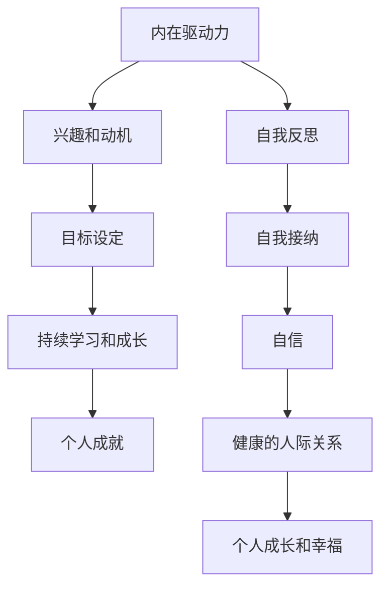

                 

# 打破社会比较的束缚：建立个人成就标准

关键词：社会比较、个人成就、内在驱动力、自我接纳、自信、健康人际关系

摘要：在当今社会，人们常常陷入社会比较的陷阱，这种比较带来的压力和焦虑对个人的幸福感产生了负面影响。本文旨在探讨如何打破社会比较的束缚，通过建立个人成就标准、培养内在驱动力和自我接纳与自信，实现个人成长和幸福。本文首先介绍了社会比较的概念及其对个人幸福的影响，然后探讨了内在驱动力的重要性以及如何建立和维护个人成就标准，接着提出了克服社会比较陷阱的技巧，最后讨论了培养自我接纳和自信的重要性以及如何建立健康的人际关系。通过这些方法，我们可以在现代社会中找到自己的定位，追求真正的个人成就和幸福。

## 引言

### 1. 社会比较与个人压力

社会比较是指个体在心理上将自己的行为、态度、观点或某些特征与他人进行比较，以评估自己的相对位置。在社会比较中，个体往往将他人作为参照物，以此来判断自己的价值和地位。社会比较是一种普遍存在的心理现象，它不仅存在于日常生活中，也存在于职场、教育、社交等各个领域。

然而，社会比较往往带来一系列负面影响，其中最显著的就是个人压力。个人压力是指个体在面临外部环境和内部需求时所感受到的紧张和焦虑。社会比较会引发个人压力，原因主要有以下几点：

首先，社会比较往往导致个体对自己的不满。在比较过程中，个体可能会发现自己在某些方面不如他人，这会导致自我评价降低，进而引发自我怀疑和不满情绪。

其次，社会比较会导致个体产生竞争心理。在比较中，个体可能会将他人视为竞争对手，这种竞争心理会增加个人的压力和焦虑。

最后，社会比较会干扰个体的自我认知。在比较中，个体可能会过度关注他人的行为和成就，而忽视自己的价值和潜力，这会干扰个体的自我认知和自我发展。

### 2. 本书的目的和结构

本书的目的是帮助读者打破社会比较的束缚，建立个人成就标准，从而实现个人成长和幸福。为了达到这个目的，本书将分为以下几个部分：

首先，我们将深入探讨社会比较的概念及其对个人幸福的影响，帮助读者了解社会比较的普遍性和负面影响。

接着，我们将探讨内在驱动力的概念及其在个人成就中的重要性，帮助读者理解如何通过内在驱动力来设定目标和激励自己。

然后，我们将讨论如何建立和维护个人成就标准，帮助读者找到适合自己的成功标准，从而减少社会比较带来的负面影响。

接下来，我们将提出一些克服社会比较陷阱的技巧，帮助读者学会如何调整自己的心态和行为，以减少社会比较带来的压力和焦虑。

此外，我们将探讨自我接纳和自信的重要性，并介绍一些培养自我接纳和自信的方法，帮助读者建立积极的自我形象。

最后，我们将讨论如何建立健康的人际关系，以支持个人成长和幸福。

通过这些内容，我们希望读者能够理解社会比较的影响，学会通过内在驱动力和自我接纳来建立个人成就标准，从而实现个人成长和幸福。

## 第1章 社会比较与个人幸福

### 1.1 社会比较的普遍性

社会比较是一种普遍存在的心理现象，无论是在个体层面还是社会层面，都可以观察到这种现象。在个体层面，人们在社会交往中不断进行自我评价和他人评价，以确定自己的社会地位和角色。这种比较不仅体现在物质财富、职业地位、教育水平等方面，还包括生活品质、人际关系、个人成就等多个维度。

在社会层面，社会比较表现为社会阶层和群体之间的比较。社会阶层比较是指不同社会阶层之间的经济、教育、权力等方面的差异和竞争。群体比较则是指不同民族、文化、宗教、性别等群体之间的比较。这种比较往往导致社会不平等和冲突，同时也影响社会的整体稳定和发展。

社会比较的普遍性源于人类社会的本质特征。人类是社会性动物，个体需要在社会中生存和发展，因此，比较和竞争是不可避免的。然而，过度和不当的社会比较会对个人和社会产生负面影响。为了更好地理解社会比较的普遍性和影响，我们需要进一步探讨社会比较的概念和形式。

#### 1.1.1 社会比较的概念

社会比较是指个体通过将自己的行为、态度、观点或某些特征与他人进行比较，以评估自己的相对位置和价值的过程。这种比较可以是直接的，也可以是间接的。直接比较通常发生在面对面的交往中，个体可以直接观察到他人的行为和表现，并进行比较。例如，在工作场合中，员工可能会将自己的工作绩效与同事进行比较。间接比较则通常发生在媒体、社交网络等虚拟环境中，个体通过观察他人的行为和表现，间接地评估自己的相对位置。

社会比较的目的是为了确定自己的社会地位和角色，了解自己在社会中的位置和贡献。然而，社会比较往往带来一系列负面影响，包括个人压力、焦虑和不满等。这些负面影响源于个体在比较过程中产生的自我怀疑和自我否定情绪。

#### 1.1.2 社会比较的形式

社会比较的形式多种多样，可以根据不同的维度进行分类。以下是一些常见的比较形式：

1. **横向比较**：横向比较是指个体将自己的行为、态度或特征与同一社会群体中的其他个体进行比较。例如，大学生可能会将自己的学业成绩与同学进行比较，以评估自己的学习表现。

2. **纵向比较**：纵向比较是指个体将自己的当前状态与过去的状态进行比较。例如，个体可能会回顾自己的过去，比较现在的成就和进步。

3. **自我提升比较**：自我提升比较是指个体将自己的表现与他人进行对比，以激发自己的竞争意识和进取心。例如，职场人士可能会将自己的业绩与同事进行比较，以激励自己更加努力工作。

4. **社会阶层比较**：社会阶层比较是指个体将自己与社会中的其他阶层进行比较，以评估自己的社会地位和财富水平。例如，个体可能会将自己在城市中的住房条件与农村的住房条件进行比较。

5. **理想自我与现实自我的比较**：理想自我是指个体希望成为的理想形象，而现实自我是指个体当前的状态。理想自我与现实自我的比较往往导致个体的自我不满和焦虑。例如，个体可能会将自己的生活方式与心目中的理想生活进行比较，从而感到不满。

不同形式的比较对个体的心理和行为产生不同的影响。横向比较和纵向比较可能导致个体产生竞争意识和进取心，但也可能引发焦虑和不满。自我提升比较可以激励个体追求更高的目标，但也可能导致个体过分关注他人的评价。社会阶层比较和理想自我与现实自我的比较可能导致个体产生社会不平等感和自我否定情绪。

#### 1.1.3 社会比较的影响

社会比较对个体幸福的影响是复杂的，它既有积极的一面，也有消极的一面。以下是一些社会比较的影响：

1. **积极影响**：适度的社会比较可以激发个体的进取心和动力，促进个体的自我提升和成长。例如，通过横向比较，个体可以看到自己在某个方面的优势和劣势，从而激励自己更加努力。通过纵向比较，个体可以回顾自己的进步和成就，增强自信心。

2. **消极影响**：过度和不当的社会比较会导致个体产生压力和焦虑，影响个体的心理健康和幸福感。例如，通过横向比较，个体可能会发现自己在某些方面不如他人，从而产生自我怀疑和自我否定情绪。通过纵向比较，个体可能会过分关注自己的不足，忽视自己的成就和进步。

3. **社会不平等**：社会比较可能导致社会不平等和竞争加剧。个体在比较中可能会产生嫉妒和不满情绪，这种情绪可能进一步加剧社会不平等和冲突。

4. **心理健康问题**：过度和不当的社会比较可能导致心理健康问题，如焦虑、抑郁和自尊心下降。这些心理健康问题可能进一步影响个体的生活质量和幸福感。

为了减少社会比较带来的负面影响，个体需要学会调整自己的心态和行为。以下是一些应对策略：

1. **建立内在驱动力**：个体可以通过设定个人目标和培养内在驱动力来减少对他人评价的依赖，从而减少社会比较带来的压力。

2. **培养自我接纳**：个体需要接受自己的优点和不足，学会欣赏自己的成就和进步，而不是过分关注自己的不足。

3. **改变比较对象**：个体可以选择与自己水平相当或更具挑战性的人作为比较对象，避免与他人进行不必要的比较。

4. **关注过程而非结果**：个体应该关注自己的成长过程和努力，而不是过分关注结果和成就。

总之，社会比较是现代社会中不可避免的现象，它对个体幸福具有双重影响。个体需要学会调整自己的心态和行为，以减少社会比较带来的负面影响，实现个人成长和幸福。

### 1.2 社会比较与个人压力

社会比较不仅影响个体的幸福，还直接影响个人的心理健康，尤其是产生压力。压力是一种生理和心理的反应，当个体感受到超出自己承受能力的挑战时，就会产生压力。社会比较与压力之间的关系可以通过以下几个方面来探讨。

#### 1.2.1 压力的定义

压力是指个体在生理、心理或情感上对某种外部或内部刺激的适应性反应。压力源可以包括工作、家庭、财务、健康等多个方面。压力可以是积极的，也可以是消极的。积极的压力可以激发个体的潜能，促使个体实现目标和成长；而消极的压力则会导致个体的焦虑、抑郁和其他心理健康问题。

#### 1.2.2 社会比较与压力的关系

社会比较与压力之间的关系是复杂的。一方面，社会比较可以激发个体的动力和竞争意识，促使个体更加努力地工作和学习。这种情况下，社会比较可以被视为一种积极压力。然而，另一方面，过度和不适当的社会比较往往会导致消极压力。

1. **自我提升压力**：当个体通过社会比较发现自己在某些方面不如他人时，可能会产生一种自我提升的压力。例如，如果一个人发现自己的收入低于他的同事，他可能会感到压力，努力增加收入以缩小差距。然而，这种压力如果过于强烈，可能会导致个体的焦虑和不安。

2. **社会排斥压力**：社会比较还可能导致个体感受到社会排斥的压力。例如，当个体在某个群体中发现自己无法达到群体的标准时，他可能会感到被排斥，从而产生压力。这种压力可能进一步加剧个体的自我怀疑和自我否定情绪。

3. **不公平感压力**：社会比较还可能导致个体感受到不公平感。当个体发现他人的成就和财富比自己高，而自己付出了同样的努力时，可能会感到不公平，从而产生压力。不公平感不仅影响个体的心理健康，还可能加剧社会不平等和冲突。

#### 1.2.3 社会比较引发的压力类型

社会比较引发的压力可以分为以下几种类型：

1. **短期压力**：这种压力通常在短期内产生，当个体面临具体的社会比较时，例如在同事中比较工资或职位晋升机会时，个体可能会感受到短期压力。

2. **长期压力**：长期压力通常是由于持续的、频繁的社会比较导致的。例如，一个年轻人可能在职业生涯的早期不断与同龄人比较，这种比较可能会持续多年，导致长期的压力。

3. **内在压力**：内在压力是指个体自我施加的压力。当个体过于关注社会比较的结果，例如担心自己在他人眼中的形象时，可能会产生内在压力。

4. **外在压力**：外在压力是指社会环境和社会标准对个体施加的压力。例如，社会对高收入和高地位的追求可能导致个体感受到外在压力。

为了减轻社会比较带来的压力，个体可以采取以下策略：

1. **设定个人目标**：个体可以设定个人目标，而不是过分关注他人的目标。通过设定符合自己价值观和兴趣的目标，个体可以减少因比较而产生的压力。

2. **关注过程**：个体应该关注自己的成长过程和努力，而不是过分关注结果和成就。通过专注于过程，个体可以减少因比较而产生的焦虑。

3. **培养自我接纳**：个体需要接受自己的优点和不足，学会欣赏自己的成就和进步，而不是过分关注自己的不足。

4. **建立支持系统**：建立健康的人际关系和社会支持系统可以帮助个体减轻压力。与家人、朋友和同事建立良好的关系，可以获得情感上的支持和理解。

总之，社会比较是导致个人压力的一个重要因素。通过理解和应对社会比较带来的压力，个体可以更好地管理自己的情绪和心理健康，从而实现个人的成长和幸福。

### 1.3 社会比较与个人幸福

#### 1.3.1 幸福的定义

幸福是一个多维度的概念，它不仅仅指物质上的满足，还包括心理上的满足和精神上的满足。根据心理学家马丁·塞利格曼的定义，幸福（又称为主观幸福感）包括三个核心要素：积极的情感体验、良好的情感平衡和生活的意义。积极的情感体验指的是人们在日常生活中感受到的快乐、满足和愉悦感；良好的情感平衡则是指人们在情感上的稳定性，能够应对生活中的起伏和挑战；而生活的意义则是指个体在人生中所追求的目标和价值。

#### 1.3.2 社会比较对幸福的影响

社会比较对个人幸福的影响是复杂且多方面的。一方面，适度的社会比较可以激发个人的积极性和动力，促使个体追求更高的目标，从而提高幸福水平。例如，通过与同事的比较，个体可能会激发自己的工作热情，努力提升自己的技能和业绩。另一方面，过度和不当的社会比较则会对个人的幸福感产生负面影响。

1. **积极影响**：

- **激发动力**：适度的社会比较可以激发个体的竞争意识和进取心，促使个体更加努力地工作，追求更高的成就。这种积极的压力可以转化为动力，推动个体不断进步。
  
- **提高自我认知**：通过社会比较，个体可以更好地了解自己的优点和不足，从而调整自己的行为和态度，提高自我认知水平。

- **增加生活目标**：社会比较可以帮助个体设定更具体、更有挑战性的生活目标，从而提升生活的目标和意义。

2. **消极影响**：

- **自我怀疑和自我否定**：过度和不当的社会比较可能导致个体产生自我怀疑和自我否定的情绪。例如，当个体发现自己在某些方面不如他人时，可能会感到自卑和无助。

- **焦虑和压力**：社会比较往往会增加个人的焦虑和压力水平。当个体将自己与他人进行比较时，往往会感受到压力，特别是在竞争激烈的领域。

- **影响生活质量**：持续的、过度的社会比较会干扰个体的生活质量。个体可能会因为担心自己在他人眼中的形象而过分关注外在因素，从而忽视自己的内心需求和幸福感。

- **减少幸福感知**：研究表明，过度社会比较与较低的幸福感之间存在显著关联。个体在比较中往往会过分关注自己的不足，忽视自己的优点和成就，从而减少对生活的整体满意度。

#### 1.3.3 社会比较与个人成就

个人成就是指个体在特定领域或任务上所取得的显著成就和进步。社会比较与个人成就之间的关系是复杂的，既可能促进个人成就，也可能阻碍个人成就。

1. **促进个人成就**：

- **激励效应**：社会比较可以激发个体的竞争意识和动力，促使个体更加努力地工作，以取得更好的成绩。例如，通过与他人比较，个体可能会发现自己在某些方面有不足，从而激励自己改进。

- **目标设定**：社会比较可以帮助个体设定更具体、更有挑战性的目标。当个体看到他人的成就时，可能会激发自己设定更高的目标，并努力去实现。

- **角色模型**：通过社会比较，个体可以看到他人的成功路径和经验，从而为自己提供参考和指导，有助于提高个人成就。

2. **阻碍个人成就**：

- **自我怀疑和自我否定**：当个体发现自己在某些方面不如他人时，可能会产生自我怀疑和自我否定的情绪，从而降低自信心和动力。

- **竞争压力**：过度和激烈的社会比较可能会导致个体感受到巨大的竞争压力，这种压力可能会阻碍个人的创造力和创新精神。

- **分散注意力**：社会比较可能会使个体分散注意力，过多关注他人的成就和生活方式，从而忽视自己的内心需求和长期目标。

- **影响决策**：社会比较可能会影响个体的决策过程。当个体过于关注他人的意见和评价时，可能会做出不符合自己兴趣和价值观的决定。

综上所述，社会比较对个人幸福和个人成就既有积极影响也有消极影响。个体需要学会合理地运用社会比较，将其作为一种激励和参考，而不是将其作为衡量自己价值的唯一标准。通过调整心态和行为，个体可以减少社会比较带来的负面影响，提高个人幸福感和成就水平。

## 第2章 内在驱动力与个人成就

### 2.1 内在驱动力概述

内在驱动力是指个体内部的动机和动力，驱动个体追求个人目标和成长。与外在驱动力（如奖励、惩罚、他人期望等）不同，内在驱动力源于个体内心的需求和兴趣，具有更强的持久性和自主性。内在驱动力是个人成就的关键因素之一，它不仅影响个体在学习和工作中的表现，还影响个体的心理健康和生活满意度。

#### 2.1.1 内在驱动力的概念

内在驱动力，又称内在动机，是指个体基于自身兴趣、价值观和需求而产生的行为动力。这种动力不是由外部的奖励或惩罚所驱动，而是源于个体内心的需求和欲望。例如，一个人对编程充满热情，他会自发地花大量时间学习和实践编程技术，而不是为了获得奖金或晋升。这种热情和动力就是内在驱动力。

#### 2.1.2 内在驱动力的来源

内在驱动力主要来源于以下几个方面：

1. **兴趣和爱好**：兴趣和爱好是内在驱动力的重要来源。当个体对某件事情感兴趣时，他们会自然地投入时间和精力去追求。例如，一个人对摄影感兴趣，他会主动学习摄影技术，参加摄影活动，从而不断提升自己的摄影水平。

2. **价值观和使命感**：个体的价值观和使命感也是内在驱动力的重要来源。当个体的行为与自己的价值观和使命感相符合时，他们会感到内心的满足和动力。例如，一个有社会责任感的工程师可能会自愿参与社区服务项目，因为他认为这符合自己的价值观。

3. **自我实现需求**：自我实现需求是指个体追求自我发展和实现个人潜能的需求。当个体感到自己在某个领域有潜力，并通过努力实现这些潜力时，会产生强烈的内在驱动力。例如，一个有音乐天赋的年轻人可能会自发地练习乐器，创作音乐，因为这是他实现自我价值的方式。

4. **好奇心和探索精神**：好奇心和探索精神也是内在驱动力的重要来源。人类天生对未知事物充满好奇心，这种好奇心驱使个体去探索和学习新知识、新技能。例如，一个对科学充满好奇的人可能会自发地阅读科学书籍、参与实验，以追求科学真理。

#### 2.1.3 内在驱动力的类型

内在驱动力可以分为几种类型，每种类型都有其独特的特征和表现形式：

1. **兴趣驱动**：兴趣驱动是指个体因对某件事物感兴趣而产生的内在驱动力。例如，一个对绘画感兴趣的人会自发地花费大量时间练习绘画，提高自己的绘画技能。

2. **价值驱动**：价值驱动是指个体因认为某件事物符合自己的价值观而产生的内在驱动力。例如，一个重视环境保护的人可能会积极参与环保活动，推动环境保护政策的实施。

3. **目标驱动**：目标驱动是指个体因设定了具体目标而产生的内在驱动力。例如，一个设定了减肥目标的人会自觉地进行饮食控制和锻炼，以达到目标。

4. **成就驱动**：成就驱动是指个体因追求成就和认可而产生的内在驱动力。例如，一个渴望成为顶尖工程师的人会努力学习新技术，提高自己的技术水平。

5. **成长驱动**：成长驱动是指个体因追求个人成长和自我实现而产生的内在驱动力。例如，一个有志于在职业生涯中不断进步的人会持续学习和实践，以提高自己的专业能力。

总之，内在驱动力是个人成就的关键因素，它源于个体内心的需求和兴趣，具有持久的动力和自主性。通过激发和培养内在驱动力，个体可以更好地实现个人目标和成长，提高生活满意度和幸福感。

### 2.2 内在驱动力与个人成就

内在驱动力在个人成就中起着至关重要的作用。它不仅影响个体在学习和工作中的表现，还决定着个体能否持续进步和实现长期目标。以下将详细探讨内在驱动力如何促进个人成就，以及如何通过设定目标和培养动机来实现这一目标。

#### 2.2.1 内在驱动力与目标设定

目标设定是内在驱动力的重要组成部分。一个明确的目标可以引导个体朝着某个方向努力，并提供方向和动力。设定目标的过程可以帮助个体明确自己的愿望和期望，从而激发内在驱动力。

1. **具体性**：一个具体的目标应该明确、具体，并具有可实现性。例如，一个希望提高编程技能的程序员可以设定每天学习两小时编程的目标，而不是一个模糊的“提高编程技能”的目标。具体目标能够提供明确的行动指南，使个体更有动力去实现它。

2. **挑战性**：目标应该具有一定挑战性，以激发个体的内在驱动力。挑战性目标可以帮助个体突破舒适区，从而实现个人成长和进步。然而，目标也不应过于难以实现，否则可能会打击个体的自信心和动力。

3. **可衡量性**：目标应该能够被衡量，以便个体能够了解自己的进度和成果。例如，一个目标可以是“在接下来的三个月内，完成五个编程项目”。通过设定可衡量目标，个体可以更好地跟踪自己的进步，并根据实际情况调整目标。

4. **灵活性**：目标设定时应考虑灵活性，以应对可能的变化和挑战。当个体面临意外情况时，可以适当调整目标，以确保目标的可实现性。灵活性有助于个体保持内在驱动力，并避免因目标无法实现而导致的挫败感。

#### 2.2.2 内在驱动力与动机

动机是推动个体采取行动以达到目标的心理过程。内在驱动力可以增强个体的动机，使其更加积极地追求个人目标。

1. **内在动机**：内在动机是指个体因对某项活动本身感兴趣而产生的动机。例如，一个对学习新语言感兴趣的人会自发地花时间学习和练习，而不是为了通过考试或获得奖励。内在动机可以增强个体的内在驱动力，使其更愿意付出努力去实现目标。

2. **外部动机**：外部动机是指个体因外部奖励或惩罚而产生的动机。虽然外部动机可以在短期内激发个体行动，但它往往缺乏持久性。例如，一个程序员为了获得奖金而加班工作，但在奖金消失后，他可能不再有动力继续努力。因此，培养内在动机是提升内在驱动力和实现个人成就的关键。

3. **平衡内外动机**：个体可以通过平衡内在动机和外部动机来提升内在驱动力。例如，一个程序员可以通过设定具有挑战性的内部目标（如提高编程技能）并适当接受外部奖励（如奖金或晋升机会），从而保持内在驱动力。

#### 2.2.3 内在驱动力与成长

内在驱动力不仅影响个体在当前目标上的表现，还影响个体的长期成长和发展。以下是一些方法，可以帮助个体通过内在驱动力实现个人成长：

1. **持续学习**：内在驱动力可以促使个体持续学习新知识和技能。通过不断学习，个体可以提升自己的能力，实现职业和个人发展的目标。

2. **自我反思**：自我反思是内在驱动力的重要组成部分。通过反思自己的行为和决策，个体可以了解自己的优点和不足，从而调整自己的行为和策略，实现个人成长。

3. **设定长期目标**：设定长期目标可以帮助个体保持内在驱动力。例如，一个年轻的程序员可以设定成为一名技术专家或创业家的长期目标，并通过持续学习和实践，逐步实现这一目标。

4. **实践自我提升**：通过实践自我提升，个体可以不断挑战自己，突破舒适区，实现个人成长。例如，一个程序员可以通过参加技术大会、编写开源代码或参与开源项目，提升自己的技术能力和影响力。

总之，内在驱动力是个人成就的重要推动力。通过设定明确的目标、培养内在动机和持续学习，个体可以提升内在驱动力，实现个人成长和成功。内在驱动力不仅帮助个体在当前目标上取得进步，还为其长期的职业和个人发展奠定基础。

### 2.3 建立内在驱动力

建立内在驱动力是个人成长和成功的关键。通过自我反思、设定个人目标和培养内在驱动力，个体可以更好地理解自己的需求和兴趣，从而在追求个人成就的过程中保持动力和热情。以下将详细探讨这些方法。

#### 2.3.1 自我反思

自我反思是一种重要的自我认识和自我提升的方法。通过反思自己的行为、想法和情感，个体可以了解自己的内在需求和兴趣，从而更好地理解自己的动机和行为。

1. **定期反思**：个体可以定期花时间进行自我反思。例如，每周或每月花几分钟时间回顾自己的行为和成就，思考自己在哪些方面感到满足和有成就感，哪些方面需要改进。

2. **记录反思**：通过记录反思，个体可以更加清晰地了解自己的内心世界。例如，可以使用日记或日志记录自己的反思过程，记录自己在特定情境下的感受和思考。

3. **与他人交流**：与他人交流可以帮助个体从不同的角度看待自己。个体可以与家人、朋友或导师交流，分享自己的反思和困惑，获得反馈和建议。

4. **反思与行动**：自我反思不应仅停留在思考层面，还应转化为行动。个体应根据反思结果，调整自己的行为和策略，以实现个人成长和目标。

#### 2.3.2 设定个人目标

设定个人目标是建立内在驱动力的重要步骤。明确的目标可以帮助个体明确方向，并提供动力和激励。

1. **明确目标**：个人目标应明确、具体和可衡量。例如，一个想要提高编程技能的程序员可以设定在六个月内完成三个有挑战性的项目。

2. **长期与短期目标**：个体可以设定长期目标和短期目标。长期目标可以帮助个体保持长远视角，短期目标则提供具体行动和里程碑，使个体能够逐步实现长期目标。

3. **调整目标**：在设定目标的过程中，个体应考虑目标的灵活性和适应性。当情况发生变化时，个体可以适当调整目标，以确保目标的可实现性。

#### 2.3.3 培养内在驱动力

培养内在驱动力需要个体关注自己的兴趣、价值观和需求，从而找到真正驱动自己的因素。

1. **发现兴趣**：个体可以通过尝试不同的事情，发现自己的兴趣和爱好。例如，通过参加各种活动和课程，个体可以了解自己喜欢做什么，擅长做什么。

2. **建立价值观**：个体应根据自己的价值观来设定目标和行动。当个体的行为与自己的价值观相一致时，会产生强烈的内在驱动力。

3. **自我激励**：个体可以通过自我激励来增强内在驱动力。例如，可以通过设定奖励机制，鼓励自己在实现目标的过程中保持动力。

4. **学习与成长**：通过持续学习和成长，个体可以不断提升自己的能力和技能，从而增强内在驱动力。

总之，建立内在驱动力是个人成长和成功的关键。通过自我反思、设定个人目标和培养内在驱动力，个体可以更好地理解自己的需求和兴趣，从而在追求个人成就的过程中保持动力和热情。这些方法不仅有助于个体实现目标，还能提升个体的生活质量和幸福感。

### 3.1 个人成就标准的定义

个人成就标准是指个体在特定领域或生活中追求的成就目标和评价标准。这些标准反映了个体对自己能力和成就的期望，同时也是个体在实现目标过程中自我评价和自我激励的重要依据。个人成就标准不仅是个体自我实现的工具，也是社会比较和个人成长的重要参考。

#### 3.1.1 个人成就标准的意义

个人成就标准对个体和社会具有深远的意义：

1. **个体成长和自我实现**：个人成就标准帮助个体明确自己的目标和期望，从而有针对性地进行自我提升和成长。通过设定和实现个人成就标准，个体可以不断突破自己的局限，实现自我价值和自我实现。

2. **社会比较的替代**：个人成就标准可以替代社会比较，帮助个体避免因与他人比较而产生的压力和焦虑。通过设定符合自己价值观和兴趣的个人成就标准，个体可以更专注于自己的成长和进步。

3. **提高生活质量**：个人成就标准有助于个体提升生活质量。当个体专注于实现自己的目标时，他们会感到更有成就感和满足感，从而提高生活的整体幸福感。

4. **激励和动力**：个人成就标准为个体提供明确的行动方向和目标，从而激发个体的内在驱动力和动机。通过设定和实现个人成就标准，个体可以保持持续的动力和热情，实现更高的成就。

#### 3.1.2 个人成就标准的构成

个人成就标准通常包括以下几个方面：

1. **具体目标**：具体目标是个人成就标准的核心，它明确了个体的追求和期望。具体目标应具有可衡量性和可实现性，例如“在接下来的一年里，完成一本编程书籍”或“提升编程技能到高级水平”。

2. **价值观和原则**：个人成就标准应与个体的价值观和原则相一致。这些价值观和原则指导个体的行为和决策，确保个人成就的过程和结果符合个体的核心价值观。

3. **自我评价标准**：个人成就标准应包括自我评价的标准，以便个体在实现目标的过程中进行自我监控和反思。这些标准可以是定量的，如“每个月至少提交一篇技术博客文章”，也可以是定性的，如“提升自己的演讲技巧”。

4. **长期和短期目标**：个人成就标准应包括长期和短期目标。长期目标为个体提供了长远的发展方向，而短期目标则为个体提供了具体的行动步骤和里程碑。例如，“在未来五年内，成为一名技术专家”和“每个月阅读两本技术书籍”。

5. **反馈和调整机制**：个人成就标准应包括反馈和调整机制，以便个体在实现目标的过程中能够及时调整自己的策略和行动。例如，定期评估自己的进度，并根据评估结果进行调整。

总之，个人成就标准是帮助个体实现自我成长和幸福的重要工具。通过明确目标、价值观和自我评价标准，并建立长期和短期目标，个体可以更好地理解自己的需求和兴趣，从而在追求个人成就的过程中保持动力和方向。

### 3.2 确定个人成就标准

确定个人成就标准是追求个人成长和实现目标的重要步骤。通过自我评估、外部因素影响以及科学的方法和工具，个体可以设定符合自身实际情况和个人目标的成就标准。

#### 3.2.1 自我评估

自我评估是确定个人成就标准的第一步。通过深入反思自己的能力、兴趣、价值观和目标，个体可以更好地了解自己的优势和劣势，从而设定合理的成就标准。

1. **反思个人能力**：个体应反思自己在各个方面的能力，包括专业技能、人际交往能力、领导能力等。通过评估自己的能力，个体可以了解自己在哪些领域有优势，哪些领域需要提升。

2. **评估兴趣和价值观**：兴趣和价值观是设定个人成就标准的重要依据。个体应思考自己真正感兴趣的事情是什么，以及这些事情是否符合自己的价值观。通过明确自己的兴趣和价值观，个体可以确保自己的成就标准与内心一致。

3. **设定短期和长期目标**：个体应根据自我评估的结果，设定短期和长期目标。短期目标应具体、可实现，例如在短时间内完成一个项目或掌握一项技能；长期目标则应更具挑战性，如在未来五年内达到某个职业水平或实现某个重大目标。

4. **定期反思和调整**：自我评估不是一次性的过程，而是一个持续的过程。个体应定期反思自己的目标和进展，并根据实际情况进行调整。例如，如果发现设定的目标过于困难或过于容易，可以适当调整目标，以确保其符合自己的能力和兴趣。

#### 3.2.2 外部因素影响

外部因素也是确定个人成就标准时需要考虑的重要方面。外部因素包括社会环境、家庭背景、职业要求等，它们对个体的目标和成就标准产生直接影响。

1. **社会环境**：社会环境包括社会价值观、文化背景和行业趋势等。个体应根据社会环境的变化，调整自己的目标和成就标准。例如，如果某个行业需求发生变化，个体可能需要重新评估自己的职业目标和技能要求。

2. **家庭背景**：家庭背景对个体的价值观和生活方式有深远影响。个体应考虑自己的家庭背景，确保个人成就标准与家庭价值观和期望相一致。例如，一个来自农村的家庭可能更注重实际成就，如职业收入和住房条件，而一个来自学术背景较强的家庭可能更注重学术成就和知识积累。

3. **职业要求**：职业要求是影响个人成就标准的重要因素。个体应根据职业要求，设定符合自己职业发展的目标和成就标准。例如，一个软件工程师可能需要不断提升自己的编程技能和项目管理能力，以适应快速变化的行业需求。

#### 3.2.3 制定个人成就标准

在自我评估和外部因素分析的基础上，个体可以制定个人成就标准。以下是一些方法和工具，可以帮助个体制定有效的个人成就标准：

1. **SMART原则**：SMART原则是一种常用的目标设定方法，它要求目标具有具体性（Specific）、可衡量性（Measurable）、可实现性（Achievable）、相关性（Relevant）和时限性（Time-bound）。例如，一个具体的目标可以是“在接下来的三个月内，提高编程技能到高级水平”，这个目标具有明确的时间限制和可实现性。

2. **SMARTER原则**：在SMART原则的基础上，可以进一步考虑目标的兴奋性（Exciting）和调整性（Adjustable）。兴奋性可以激发个体的内在驱动力，调整性则确保目标在实施过程中具有灵活性，可以适应实际情况的变化。

3. **目标矩阵**：目标矩阵是一种用于设定和评估个人目标的工具。通过目标矩阵，个体可以明确自己在不同领域（如职业、健康、财务等）的目标，并确定实现这些目标的优先级和资源分配。

4. **个人规划工具**：个人规划工具，如时间管理软件、目标管理应用程序等，可以帮助个体设定和跟踪个人目标。这些工具提供可视化的目标设定和评估功能，使个体能够更好地了解自己的进展和成果。

总之，通过自我评估、外部因素分析和科学的方法和工具，个体可以制定符合自己实际情况和个人目标的个人成就标准。这些标准不仅帮助个体明确自己的追求和期望，还为个体提供了实现这些目标的明确方向和行动指南。

### 3.3 维护个人成就标准

维护个人成就标准是实现长期目标和持续成长的关键。为了保持目标的稳定性和适应性，个体需要通过监测进步、调整目标和保持积极心态来持续优化个人成就标准。

#### 3.3.1 监测进步

监测进步是确保个人成就标准有效性的重要步骤。通过定期评估自己的进展，个体可以及时发现并解决存在的问题，从而确保目标的实现。

1. **设定定期评估时间**：个体应定期（如每周或每月）对自己的进展进行评估。这样，个体可以及时发现目标实现过程中的障碍和挑战，并采取相应的措施。

2. **量化进展**：使用量化的方法来评估进展，可以帮助个体更客观地了解自己的目标实现情况。例如，一个学习新编程技术的程序员可以使用完成的项目数量、代码质量评分等来评估自己的进步。

3. **记录成果**：记录自己的成果和进展，可以帮助个体更好地了解自己的成就和努力。这些记录不仅为未来的评估提供依据，还可以增强个体的自信心和动力。

#### 3.3.2 调整目标

在实现目标的过程中，个体可能会遇到各种挑战和变化。为了保持目标的实现性和可行性，个体需要根据实际情况及时调整目标。

1. **灵活性调整**：设定目标时，应考虑灵活性，以便在面临变化时能够迅速调整。例如，一个设定了“六个月内完成一本编程书籍”的人，如果在第三个月发现时间不够，可以调整目标为“九个月内完成”。

2. **重新设定优先级**：当外部环境或个人情况发生变化时，个体可能需要重新评估目标的优先级。例如，如果一个新的职业机会出现，个体可能需要调整现有的目标，以便更有效地利用时间和资源。

3. **寻求反馈**：通过寻求他人的反馈，个体可以获得不同的视角和建议，从而更好地调整目标。家人、朋友或同事的反馈可以帮助个体发现潜在的问题和机会。

#### 3.3.3 保持积极心态

积极心态是实现个人成就的重要因素。通过保持乐观和积极的心态，个体可以更好地应对挑战和压力，从而持续追求目标。

1. **设定积极目标**：设定积极的目标可以帮助个体保持乐观和积极的心态。例如，将“避免失败”改为“追求成功”，可以激发个体的内在驱动力。

2. **庆祝小成就**：在实现目标的过程中，个体应庆祝每一个小成就。这些小成就不仅可以增强自信心，还可以激励个体继续前进。

3. **应对挫折**：在追求目标的过程中，个体可能会遇到挫折和失败。通过积极应对挫折，个体可以学会从失败中吸取教训，并继续前进。例如，一个编程新手在项目失败后，可以通过分析问题、寻求帮助和不断学习来提高自己的技能。

4. **培养自我接纳**：自我接纳是保持积极心态的重要因素。个体应接受自己的优点和不足，并学会欣赏自己的成就和进步。

总之，维护个人成就标准需要个体通过监测进步、调整目标和保持积极心态来持续优化目标。这些方法不仅有助于实现个人成就，还可以提升个体的生活质量和幸福感。

### 4.1 社会比较的陷阱

社会比较是一种普遍存在的心理现象，但如果不加以控制，它可能会对个体的心理健康产生负面影响。这些负面影响主要体现在以下几个方面：

#### 4.1.1 过度关注他人

过度关注他人是社会比较的一个重要陷阱。当个体将自己的时间和精力过多地投入到观察和比较他人的行为和成就时，他们可能会忽视自己的生活和需求。这种行为可能导致以下问题：

1. **资源分散**：过度关注他人会消耗个体的时间和精力，使个体无法专注于自己的成长和目标。例如，一个人可能会花费大量时间在社交媒体上浏览他人的生活，而忽视了提升自己的专业技能。

2. **自我价值下降**：通过过度关注他人的成就，个体可能会产生自我怀疑和自我否定情绪。当发现自己在某些方面不如他人时，他们可能会感到自卑和无助，从而影响自我价值感。

3. **心理压力增加**：过度关注他人往往会导致个体产生心理压力。例如，当一个人发现他人的收入、职业地位或生活质量比自己高时，可能会感到压力，甚至焦虑。

#### 4.1.2 社会比较的负面影响

社会比较的负面影响不仅体现在过度关注他人，还表现在以下几个方面：

1. **焦虑和抑郁**：社会比较可能导致个体产生焦虑和抑郁情绪。当个体将自己的生活与他人进行比较，并发现自己在某些方面落后时，可能会感到焦虑和沮丧。例如，一个人可能会因为自己的朋友都取得了显著的职业成就，而自己还在原地踏步，从而感到焦虑。

2. **嫉妒和不满**：社会比较还可能导致个体产生嫉妒和不满情绪。当个体发现他人的生活或成就比自己好时，可能会感到嫉妒和不满，这种情绪可能会进一步加剧社会不平等和冲突。

3. **影响人际关系**：社会比较可能会影响个体的人际关系。当个体过于关注他人的生活，并产生嫉妒或不满情绪时，他们可能会与朋友和家人产生矛盾和冲突。

#### 4.1.3 克服社会比较陷阱的必要性

克服社会比较的陷阱对于维护个体的心理健康和幸福感至关重要。以下是一些克服社会比较陷阱的策略：

1. **培养自我接纳**：自我接纳是克服社会比较陷阱的关键。个体需要接受自己的优点和不足，并学会欣赏自己的成就和进步。通过培养自我接纳，个体可以减少因社会比较而产生的焦虑和不满情绪。

2. **关注个人成长**：个体应将注意力集中在自己的成长和进步上，而不是与他人进行比较。通过设定个人目标和努力实现这些目标，个体可以提升自我价值感，减少社会比较带来的负面影响。

3. **改变比较对象**：个体可以选择与自己水平相当或更具挑战性的人作为比较对象，而不是盲目与他人比较。通过改变比较对象，个体可以减少因比较而产生的焦虑和压力。

4. **培养感恩心态**：培养感恩心态可以帮助个体看到自己的优势和成就，从而减少社会比较带来的负面影响。通过感恩，个体可以更加珍惜自己所拥有的，并减少对他人的过度关注。

5. **寻求专业帮助**：当个体发现自己难以克服社会比较的陷阱时，可以寻求心理咨询师或专业人士的帮助。通过专业指导，个体可以更好地应对社会比较带来的负面影响，提高心理健康水平。

总之，社会比较是一种普遍存在的心理现象，但它可能会对个体的心理健康产生负面影响。通过培养自我接纳、关注个人成长、改变比较对象和培养感恩心态，个体可以克服社会比较的陷阱，维护自己的心理健康和幸福感。

### 4.2 克服社会比较的技巧

克服社会比较的负面影响需要个体采取一系列具体的策略和技巧。以下介绍几种有效的方法，帮助个体减少社会比较带来的负面影响，提升心理健康和幸福感。

#### 4.2.1 增强自我意识

增强自我意识是克服社会比较陷阱的第一步。通过深入了解自己的价值观、兴趣和需求，个体可以减少对他人的过度关注，将注意力转移到自己的成长和进步上。

1. **反思自己的价值观**：个体可以通过反思自己的价值观，了解自己在生活中真正重视的东西。例如，一个重视家庭的人可能会将更多时间用于陪伴家人，而不是关注他人的生活。

2. **识别自己的兴趣和需求**：个体应识别自己的兴趣和需求，确保自己的行为和决策符合自己的内心期望。例如，一个对音乐充满热情的人可能会选择参加音乐课程，而不是将时间浪费在社交媒体上比较他人的成就。

3. **培养自我认知**：通过培养自我认知，个体可以更好地了解自己的优点和不足。这种自我认知可以帮助个体减少因社会比较而产生的焦虑和不满情绪。例如，一个认识到自己需要更多时间休息和放松的人可能会减少加班，从而提高生活质量。

#### 4.2.2 改变比较对象

改变比较对象是克服社会比较陷阱的有效策略。通过选择合适的比较对象，个体可以减少不必要的压力和焦虑。

1. **与自己水平相当的人比较**：选择与自己水平相当的人作为比较对象，可以减少因比较而产生的负面情绪。例如，一个普通的白领可以选择与自己职位相当的人进行比较，而不是与高管或明星比较。

2. **与过去的自己比较**：与过去的自己进行比较，可以帮助个体看到自己的成长和进步。例如，一个健身爱好者可以选择与一年前的自己进行比较，而不是与健身房里最健壮的人比较。

3. **设定适合自己的目标**：设定符合自己能力和兴趣的目标，可以减少因社会比较而产生的压力。例如，一个有志于成为作家的人可以设定每周写一篇文章的目标，而不是追求成为下一个贾平凹。

#### 4.2.3 实践自我提升

通过实践自我提升，个体可以减少对他人成就的过度关注，将注意力转移到自己的成长和进步上。

1. **专注于过程而非结果**：个体应将注意力集中在成长过程上，而不是过分关注结果和成就。例如，一个学生可以选择专注于课堂学习和作业完成情况，而不是关注他人考试的成绩。

2. **设定个人目标和计划**：通过设定个人目标和计划，个体可以明确自己的努力方向，从而减少因社会比较而产生的焦虑。例如，一个程序员可以设定每天学习两小时编程技术的目标，而不是担心自己的技术是否比他人更好。

3. **持续学习和成长**：通过持续学习和成长，个体可以不断提升自己的能力和技能，从而减少因社会比较而产生的压力。例如，一个设计师可以选择参加在线课程和研讨会，提升自己的设计能力。

#### 4.2.4 培养感恩心态

培养感恩心态可以帮助个体看到自己的优势和成就，从而减少社会比较带来的负面影响。

1. **记录感恩日记**：个体可以每天记录感恩日记，写下自己感到感激的事情。例如，一个程序员可以写下自己今天学到了新技能、收到了同事的表扬等。

2. **表达感谢**：个体应学会表达感谢，无论是通过口头表达还是书面形式。例如，一个同事可以在完成项目后向团队成员表示感谢，从而增强团队的凝聚力和合作精神。

3. **关注生活中的美好**：个体应学会关注生活中的美好事物，而不是过分关注他人的成就和生活方式。例如，一个旅行爱好者可以专注于享受旅途中的美景和体验，而不是与他人进行比较。

#### 4.2.5 寻求专业帮助

当个体发现自己难以克服社会比较的陷阱时，可以寻求心理咨询师或专业人士的帮助。通过专业指导，个体可以更好地应对社会比较带来的负面影响，提高心理健康水平。

1. **心理咨询**：个体可以通过心理咨询了解社会比较的影响，并学习如何调整自己的心态和行为。心理咨询师可以提供个性化的建议和策略，帮助个体克服社会比较带来的负面影响。

2. **支持小组**：加入支持小组可以帮助个体与他人分享经验和感受，从而获得情感上的支持和理解。通过与其他人交流，个体可以学习如何克服社会比较的陷阱，提高心理健康水平。

3. **心理健康课程**：参加心理健康课程可以帮助个体学习如何管理情绪和压力，提高心理健康水平。这些课程通常包括冥想、正念和情绪调节等技巧。

总之，克服社会比较的陷阱需要个体采取一系列具体的策略和技巧。通过增强自我意识、改变比较对象、实践自我提升、培养感恩心态和寻求专业帮助，个体可以减少社会比较带来的负面影响，提升心理健康和幸福感。

### 5.1 自我接纳的重要性

自我接纳是心理健康和幸福感的基础。它意味着个体能够接受自己的优点和不足，欣赏自己的成就和进步，而不是过分关注自己的缺点和失败。以下将详细探讨自我接纳的定义、影响及其与自我价值的关系。

#### 5.1.1 自我接纳的定义

自我接纳是指个体对自己的全面接受，包括优点和不足、成功和失败。这种接受不是无条件的，而是基于对现实的认知和理解。自我接纳意味着个体能够正视自己的优点，同时也能接受自己的缺点，并在此基础上进行个人成长和改善。

1. **全面接受**：自我接纳要求个体能够全面接受自己的所有方面，包括性格、外貌、能力、情感等。这种接受不意味着个体对自己的缺点和失败视而不见，而是意味着个体能够理解和接受这些方面，并在此基础上寻求改进。

2. **真实自我**：自我接纳基于对真实自我的认知和理解。个体需要了解自己的优点和不足，并在此基础上建立真实的自我形象。这种真实自我不仅包括个体的外在特征，还包括内在情感和需求。

3. **内在平静**：自我接纳带来内心的平静和安宁。当个体能够接受自己时，他们不再受外界评价和比较的困扰，从而减少内心的焦虑和不安。

#### 5.1.2 自我接纳的影响

自我接纳对个体的心理健康和幸福感具有深远的影响。以下是一些自我接纳对个体影响的例子：

1. **减少焦虑和抑郁**：自我接纳可以帮助个体减少因社会比较和外界评价而产生的焦虑和抑郁情绪。当个体接受自己的不足时，他们不再将注意力集中在自己的缺点上，而是更加关注自己的优点和成长。

2. **增强自尊和自信**：自我接纳能够增强个体的自尊和自信。当个体接受自己的优点和不足时，他们会更加自信地面对挑战和失败，并从中学习和成长。

3. **促进心理健康**：自我接纳有助于促进心理健康。接受自己不仅包括接受自己的情感和需求，还包括接受自己的过去和现实。这种接受可以帮助个体更好地处理情绪和心理问题，减少心理压力。

4. **提高生活满意度**：自我接纳能够提高个体的生活满意度。当个体接受自己的现状时，他们更加珍惜和享受生活中的每一个瞬间，从而提高整体的生活质量。

#### 5.1.3 自我接纳与自我价值

自我接纳与自我价值密切相关。自我价值是指个体对自己的评价和认可，它反映了个体对自己的重要性和价值的认知。

1. **自我价值的来源**：自我价值主要来源于个体对自己的接受和认可。当个体能够接受自己的优点和不足时，他们会对自己的价值和重要性有更深刻的理解。这种内在的认可和接受是自我价值的重要来源。

2. **自我接纳与自尊**：自我接纳与自尊紧密相连。自尊是指个体对自己的价值和能力的认可。当个体接受自己的不足时，他们不仅不会失去自尊，反而会因为这种接受而更加自信和自尊。

3. **自我接纳与自我成长**：自我接纳是自我成长的前提。当个体接受自己的不足时，他们更有动力去改进自己，实现个人成长。自我接纳不仅帮助个体认识到自己的不足，还鼓励他们积极面对挑战，寻求改进。

总之，自我接纳是心理健康和幸福感的重要基石。通过接受自己的优点和不足，个体可以减少焦虑和抑郁情绪，增强自尊和自信，促进心理健康，提高生活满意度。自我接纳不仅有助于个体实现自我价值，还为他们提供了持续成长和发展的动力。

### 5.2 培养自信

自信是个人成长和成功的重要品质，它不仅影响个体的行为和决策，还直接影响个体的心理健康和幸福感。以下将详细探讨自信的定义、重要性以及培养自信的方法。

#### 5.2.1 自信的定义

自信是指个体对自己的能力和价值的信任和信心。它不仅包括对自身能力的认可，还涉及到对自身价值和未来前景的积极预期。自信的个体相信自己能够应对挑战、克服困难，并在各种情况下取得成功。

1. **能力信心**：自信首先表现为对自身能力的信心。当个体相信自己具备完成某项任务或达成某个目标的能力时，他们会更有动力去尝试和努力。

2. **价值认知**：自信还涉及到对自身价值的认知。一个自信的个体不仅认可自己的能力，还认识到自己的独特性和价值，从而更加自信地面对生活中的各种挑战。

3. **积极预期**：自信的个体对未来持有积极预期。他们相信自己能够克服困难、实现目标，并因此对未来充满希望和期待。

#### 5.2.2 自信的重要性

自信对个体的心理健康和幸福感具有深远的影响。以下是一些自信对个体重要性的例子：

1. **增强心理韧性**：自信的个体在面对挑战和逆境时更有韧性。他们相信自己能够克服困难，从而减少因挫折而导致的情绪波动和心理压力。

2. **提高生活质量**：自信有助于提高个体的生活质量。当个体对自己有信心时，他们会更加积极地参与各种活动，享受生活，从而提高整体的生活满意度。

3. **促进个人成长**：自信是个人成长的重要动力。一个自信的个体更有可能设定挑战性的目标、接受新的挑战，并在实践中不断学习和进步。

4. **改善人际关系**：自信的个体在人际关系中表现更佳。他们更加开放、真诚，更容易与他人建立良好的关系，从而提高社交满意度和幸福感。

#### 5.2.3 培养自信的方法

培养自信需要个体采取一系列具体的行动和策略。以下是一些有效的方法，可以帮助个体培养自信：

1. **设定可实现的目标**：通过设定可实现的目标，个体可以逐步提升自己的能力和信心。例如，一个程序员可以设定每天学习新编程语言的一小部分，逐渐提高自己的技术水平。

2. **积极自我暗示**：通过积极的自我暗示，个体可以增强对自己的信心。例如，一个演讲者可以在演讲前对自己说：“我准备充分，我可以做得很好。”

3. **克服恐惧和焦虑**：克服恐惧和焦虑是培养自信的重要步骤。个体可以通过面对恐惧和焦虑，逐步克服这些负面情绪，从而提升自信。例如，一个害怕公开演讲的人可以从小规模的演讲开始，逐步增加难度。

4. **接受失败和挫折**：接受失败和挫折是培养自信的关键。个体需要认识到失败和挫折是成长过程的一部分，从而不再因失败而自我怀疑。通过从失败中学习和成长，个体可以不断提升自己的能力和信心。

5. **积累成功经验**：通过积累成功经验，个体可以增强自己的信心。每次成功都会增强个体的自信，从而激励他们继续努力。例如，一个学生可以通过一次次的考试成功，逐步建立对学业能力的信心。

6. **培养积极心态**：培养积极心态可以帮助个体更好地应对生活中的挑战。一个积极的心态不仅能够增强个体的自信，还能提高他们的抗挫折能力和心理韧性。

总之，自信是个人成长和成功的重要品质。通过设定可实现的目标、积极自我暗示、克服恐惧和焦虑、接受失败和挫折、积累成功经验和培养积极心态，个体可以逐步培养自信，提升自身的心理健康和幸福感。

### 5.3 自我接纳与自信的关系

自我接纳与自信之间存在紧密的关联，二者相辅相成，共同促进个人的心理健康和成长。以下将详细探讨自我接纳与自信之间的互动关系，以及如何在自我接纳的基础上培养自信。

#### 5.3.1 自我接纳与自信的互动

1. **相互促进**：自我接纳和自信是相互促进的关系。当个体接受自己的不足时，他们能够减少自我批评和负面情绪，从而增强内心的平静和安全感。这种平静和安全感有助于个体建立自信。例如，一个接受自己不完美的人可能会更加自信地面对挑战，因为他们知道自己的不足并不意味着失败。

2. **内在平衡**：自我接纳和自信共同构建了一个内在平衡的状态。当个体能够自我接纳时，他们不会过分关注自己的缺点和失败，而是将注意力集中在自己的优点和成就上。这种内在平衡有助于个体保持积极的心态，从而增强自信。

3. **减少焦虑**：自我接纳可以帮助个体减少因社会比较和外界评价而产生的焦虑。当个体接受自己的不足时，他们不再将自己与他人进行比较，从而减少焦虑和压力。这种减少焦虑的状态有助于个体培养和保持自信。

#### 5.3.2 如何在自我接纳的基础上培养自信

1. **积极自我对话**：通过积极的自我对话，个体可以在自我接纳的基础上培养自信。例如，当个体面对挑战时，他们可以对自己说：“虽然我感到不确定，但我已经准备好去尝试。”这种积极的自我对话可以帮助个体保持自信，减少自我怀疑。

2. **设定小目标**：在自我接纳的基础上，个体可以通过设定小目标来逐步培养自信。例如，一个感到不自信的演讲者可以从练习在小组中演讲开始，逐步增加演讲的难度。每次成功完成一个小目标，都会增强个体的自信。

3. **接受失败**：接受失败是培养自信的重要步骤。当个体接受失败时，他们不会因失败而失去信心，而是将失败视为成长和学习的机会。这种接受失败的态度有助于个体在自我接纳的基础上培养自信。

4. **庆祝小成就**：在自我接纳的基础上，个体应学会庆祝自己的小成就。每次成功完成一个小目标或取得一个小成就，都是个体自信的来源。通过庆祝这些小成就，个体可以增强对自己的认可和信心。

5. **培养正面思维**：通过培养正面思维，个体可以在自我接纳的基础上培养自信。正面思维包括看到自己的优点和成就，以及积极面对挑战和失败。这种正面思维有助于个体建立积极的自我形象，从而增强自信。

6. **寻求支持**：在自我接纳的基础上，个体可以通过寻求支持来培养自信。支持可以来自家人、朋友或专业人士。例如，一个感到不自信的程序员可以从导师或同事那里获得技术支持和鼓励，从而增强自信。

总之，自我接纳与自信之间存在紧密的互动关系。通过自我接纳，个体可以减少自我批评和负面情绪，从而为培养自信创造有利条件。在自我接纳的基础上，个体可以通过积极自我对话、设定小目标、接受失败、庆祝小成就、培养正面思维和寻求支持来逐步培养自信。这些方法不仅有助于个体在自我接纳的基础上建立自信，还能提升个体的心理健康和幸福感。

### 5.3.3 自我接纳与自信的实践案例

为了更好地理解自我接纳与自信的关系，以下将通过一个具体的实践案例来展示如何在日常生活中培养自我接纳和自信。

#### 案例背景

小王是一名年轻的软件工程师，他在工作中一直感到缺乏自信。他经常将自己的工作表现与他人进行比较，特别是与他的同事。由于总觉得自己不如他们，小王开始对自己的能力和价值产生怀疑。这不仅影响了他的工作积极性，还给他带来了严重的心理压力。在意识到这种情况对自己的生活和工作产生了负面影响后，小王决定通过自我接纳和自信的培养来改善自己的状态。

#### 案例目标

小王的目标是通过自我接纳和自信的培养，提高自己的工作表现和心理健康水平。他希望能够在工作中更加自信，减少因比较而产生的焦虑和压力。

#### 案例方法

1. **自我反思**：小王开始每天花时间进行自我反思，记录自己的优点和成就。他发现自己在过去的工作中，也有一些值得骄傲的成就，比如成功完成了几个重要的项目。通过记录这些成就，小王开始看到自己的价值和潜力。

2. **设定小目标**：在自我反思的基础上，小王为自己设定了一些小目标。例如，他决定每天至少学习一个新的编程技能，并在每周的工作例会上分享自己的学习心得。通过设定这些小目标，小王逐渐提高了自己的技能水平，并在工作中取得了更多的成就。

3. **接受失败**：小王意识到失败是成长的一部分，他开始接受自己的失败并从中学习。当他遇到困难或项目失败时，他会反思失败的原因，并寻找改进的方法。这种接受失败的态度帮助小王逐步建立起了自信。

4. **积极自我对话**：小王开始改变自己的思维方式，用积极的自我对话来替代消极的自我批评。例如，当他在某个项目中遇到困难时，他会对自己做如下积极暗示：“我已经尽力了，这次失败只是让我更加明白如何改进。”

5. **寻求支持**：小王向他的导师和同事寻求支持和反馈。他向导师请教编程难题，并从同事那里获得了工作上的建议和鼓励。这种支持不仅提高了小王的工作效率，还增强了他的自信心。

#### 案例实施过程

1. **初步行动**：小王开始每天记录自己的优点和成就，并在日记中写下自己的反思。他还制定了学习计划，并开始每天学习新的编程技能。

2. **中期反馈**：在实施了几个月之后，小王发现自己在工作中的表现有了明显的提升。他开始更加自信地参与团队会议，并提出了一些有价值的建议。此外，他还在工作中取得了一些重要的成就，这进一步增强了他的自信心。

3. **结局和反思**：经过一段时间的努力，小王成功地培养起了自我接纳和自信。他不仅在工作上取得了显著的成绩，还在个人生活中变得更加积极和自信。小王总结道，自我接纳和自信的培养是一个持续的过程，他将继续努力，保持自我提升和自信。

通过这个案例，我们可以看到自我接纳与自信的关系是如何在实际生活中得到体现的。通过自我反思、设定小目标、接受失败、积极自我对话和寻求支持，小王成功地培养起了自我接纳和自信，从而提高了自己的生活质量和幸福感。

### 5.4 建立健康的人际关系

健康的人际关系是个人成长和幸福的重要组成部分。它不仅能够提供情感支持和社交满足，还能促进个人成长和自我实现。以下将详细探讨健康人际关系的定义、重要性以及建立健康人际关系的具体方法。

#### 5.4.1 健康人际关系的定义

健康人际关系是指个体与他人之间建立在相互尊重、信任、理解和支持基础上的关系。这种关系不仅包含情感上的连接，还包括行为上的互动和思想上的共鸣。以下是一些健康人际关系的特征：

1. **相互尊重**：相互尊重是健康人际关系的基石。它意味着个体在关系中尊重对方的观点、感受和权利。尊重他人不仅包括接受他们的不同，还包括避免对他人进行不合理的批评和指责。

2. **信任**：信任是健康人际关系的重要组成部分。它指的是个体对他人诚实和可靠性的信任。一个健康的人际关系建立在信任的基础上，个体可以放心地分享自己的感受和需求，而不必担心被误解或背叛。

3. **理解和支持**：理解和支持是健康人际关系的关键特征。当个体遇到困难或挑战时，健康的人际关系能够提供情感上的支持和实际上的帮助。这种支持和理解有助于个体应对生活中的压力和挑战，从而保持心理健康。

4. **开放和诚实**：健康人际关系中的个体能够开放和诚实地交流。他们愿意分享自己的感受和想法，同时也愿意倾听他人的意见和反馈。开放和诚实的沟通有助于建立更深层次的连接和理解。

5. **共同目标和价值观**：健康人际关系中的个体通常拥有共同的目标和价值观。这种共同的目标和价值观不仅增强了关系的稳定性，还促进了个体之间的合作和共同成长。

#### 5.4.2 健康人际关系的重要性

健康人际关系对个人的成长和幸福具有深远的影响。以下是一些健康人际关系的重要性的例子：

1. **情感支持**：健康的人际关系能够为个体提供情感上的支持，减轻心理压力和焦虑。当个体遇到困难或挫折时，健康的人际关系可以为他们提供安慰和鼓励，帮助他们度过难关。

2. **社交满足**：健康的人际关系能够为个体提供社交满足，增强个体的归属感和幸福感。通过与朋友和家人的互动，个体可以体验到亲密和友谊，从而提高生活满意度。

3. **个人成长**：健康的人际关系可以促进个人的成长和发展。通过与他人的互动和合作，个体可以学习新的技能和知识，扩展自己的视野和思维方式。

4. **自我实现**：健康的人际关系有助于个体的自我实现。通过与他人的合作和共同努力，个体可以实现自己的目标和梦想，从而实现个人价值和成就感。

5. **心理韧性**：健康的人际关系可以增强个体的心理韧性。在面对逆境和挑战时，健康的人际关系可以为个体提供支持，帮助他们更好地应对困难和挫折。

#### 5.4.3 建立健康人际关系的具体方法

建立健康人际关系需要个体采取一系列具体的行动和策略。以下是一些有效的方法，可以帮助个体建立和维护健康的人际关系：

1. **积极沟通**：积极沟通是建立健康人际关系的关键。个体应学会倾听他人的意见和感受，同时表达自己的观点和需求。通过积极沟通，个体可以建立更深层次的连接和理解。

2. **增进相互理解**：增进相互理解有助于建立健康的人际关系。个体应尝试站在他人的角度看问题，理解他人的需求和期望。通过增进相互理解，个体可以减少误解和冲突，建立更稳定的关系。

3. **建立信任**：建立信任是健康人际关系的基石。个体应通过诚实和可靠的行为来建立信任。例如，遵守承诺、尊重他人的隐私、避免欺骗和背叛。通过建立信任，个体可以建立稳固的人际关系。

4. **面对冲突**：在人际关系中，冲突是不可避免的。个体应学会面对冲突，并通过合理的方式解决。通过积极解决冲突，个体可以减少关系中的紧张和矛盾，维持健康的人际关系。

5. **持续的个人成长**：健康的人际关系需要个体持续的个人成长。个体应不断学习新的知识和技能，提高自己的能力和素质。通过持续的个人成长，个体可以更好地与他人互动，建立健康的人际关系。

总之，建立健康人际关系对个人的成长和幸福至关重要。通过积极沟通、增进相互理解、建立信任、面对冲突和持续的个人成长，个体可以建立和维护健康的人际关系，从而提高生活质量和幸福感。

### 6.2 建立健康的人际关系

建立健康的人际关系是个人成长和幸福的重要组成部分。以下将详细探讨建立健康人际关系的具体方法，包括积极沟通、增进相互理解、建立信任以及面对冲突。

#### 6.2.1 建立积极沟通

积极沟通是建立健康人际关系的关键。有效的沟通不仅能够增进理解，还能减少误解和冲突。以下是一些建立积极沟通的方法：

1. **倾听他人**：倾听是有效沟通的基础。在对话中，应专注于理解对方的观点和感受，而不是急于表达自己的意见。通过倾听，可以增进相互理解，减少误解。

2. **表达清晰**：在表达自己的观点和需求时，应确保表达清晰、简洁。使用明确的语言，避免使用含糊的表述，有助于对方理解你的意图。

3. **非语言沟通**：非语言沟通（如肢体语言、面部表情、语调等）在沟通中起着重要作用。通过适当的非语言表达，可以增强语言信息的效果，使对方更容易理解你的意图。

4. **开放性问题**：使用开放性问题可以鼓励对方分享更多的信息和感受。例如，“你对这个问题有什么看法？”比“这个很简单”更能引发深入的对话。

5. **积极反馈**：在对话中给予积极的反馈，可以增强沟通的效果。例如，当对方分享一个观点时，可以说“我理解你的观点，你的想法很有见地。”

#### 6.2.2 增进相互理解

增进相互理解有助于建立健康的人际关系。以下是一些增进相互理解的方法：

1. **换位思考**：尝试站在对方的立场上思考问题，理解他们的感受和需求。这有助于减少误解和冲突。

2. **共情**：共情是指能够感同身受地理解他人的情感。通过共情，可以增进彼此的情感联系，建立更深层次的信任。

3. **分享经历**：通过分享个人经历和感受，可以增进彼此的理解。分享可以帮助对方更好地了解你的背景和价值观。

4. **寻求共同点**：寻找共同兴趣和价值观可以帮助彼此更好地理解对方。共同点可以成为建立健康关系的基础。

5. **开放性提问**：通过开放性提问，可以鼓励对方分享更多信息，从而增进相互理解。

#### 6.2.3 建立信任

建立信任是健康人际关系的重要基石。以下是一些建立信任的方法：

1. **诚实**：诚实是建立信任的基础。在沟通中，应诚实地表达自己的观点和感受，避免隐瞒或欺骗。

2. **遵守承诺**：遵守承诺可以增强对方的信任。如果答应了某件事情，一定要尽力去实现。

3. **一致性**：在行为和态度上保持一致性，有助于建立信任。如果行为和承诺不一致，对方可能会感到困惑和不信任。

4. **透明度**：保持透明度，让对方了解你的想法和行为。这有助于减少误解和猜疑。

5. **尊重**：尊重对方的意见和感受，即使你不同意他们的观点。尊重可以增强彼此的信任。

#### 6.2.4 面对冲突

在人际关系中，冲突是不可避免的。以下是一些面对冲突的方法：

1. **保持冷静**：在冲突中，保持冷静是非常重要的。不要让情绪控制你的行为，而是尝试理性地分析问题。

2. **有效沟通**：使用积极沟通的方法来处理冲突。确保双方都有机会表达自己的观点，并尝试寻找共同的解决方案。

3. **寻求妥协**：在冲突中，寻求妥协可能是解决问题的关键。双方都可以做出一些让步，以达成共识。

4. **倾听对方**：在处理冲突时，倾听对方的观点和感受。这有助于理解对方的需求，并找到解决问题的方法。

5. **寻求第三方调解**：如果冲突无法自行解决，可以寻求第三方调解。例如，找一位共同的朋友或专业人士来帮助调解。

总之，建立健康人际关系需要个体在沟通、理解、信任和冲突处理方面付出努力。通过积极沟通、增进相互理解、建立信任和面对冲突，个体可以建立和维护健康的人际关系，从而提高生活质量和幸福感。

### 6.3 保持健康的人际关系

保持健康的人际关系是长期幸福和个人成长的关键。以下将详细探讨如何保持健康的人际关系，包括面对冲突、处理人际关系的周期以及持续的个人成长。

#### 6.3.1 面对冲突

在人际关系中，冲突是不可避免的。有效面对和解决冲突是保持健康关系的重要步骤。以下是一些面对冲突的方法：

1. **保持冷静和理性**：冲突发生时，保持冷静和理性非常重要。情绪化的行为往往会使冲突加剧，而冷静的头脑有助于理性地分析问题。

2. **有效沟通**：通过有效沟通，可以理解对方的观点和感受，并找到共同点。倾听对方的意见，并尝试用积极的方式表达自己的观点。

3. **寻求妥协**：在冲突中，寻求妥协是一种有效的方法。双方都可以做出一些让步，以达成共识。妥协并不意味着放弃原则，而是为了维护关系。

4. **设置边界**：明确个人的边界和需求，并在冲突中坚定地维护。这有助于避免不必要的误解和冲突。

5. **寻求专业帮助**：如果冲突无法自行解决，可以寻求专业人士的帮助，如心理咨询师或关系顾问。他们可以提供中立的视角和有效的解决方案。

#### 6.3.2 处理人际关系的周期

人际关系的发展是一个动态的过程，可以分为不同的周期。以下是一些关键周期和处理方法：

1. **建立期**：在建立期的关系中，个体需要展示诚意和关心。通过积极沟通、表达关心和理解对方的需求，可以建立稳定的基础。

2. **稳定期**：在稳定期，关系进入了一个相对和谐的状态。个体需要继续投入时间和精力来维护关系。定期沟通、分享生活和情感是维护稳定期关系的关键。

3. **调整期**：在调整期，关系可能会出现一些挑战和矛盾。通过有效沟通和相互理解，可以解决矛盾，并使关系更加成熟。

4. **危机期**：在危机期，关系可能会面临重大挑战，如重大变故或价值观冲突。在这个阶段，保持冷静、理性地分析问题，并寻求解决问题的方法非常重要。

5. **结束期**：在结束期，关系可能因为各种原因而结束。无论是友好分手还是不愉快的结束，个体都需要处理自己的情绪，并从中学习和成长。

#### 6.3.3 持续的个人成长

持续的个人成长是维持健康人际关系的重要基础。以下是一些持续个人成长的方法：

1. **学习新技能**：通过学习新技能，个体可以提升自己的能力和竞争力。这不仅有助于职业发展，还能在人际关系中展示自己的成长和进步。

2. **培养自我反思**：自我反思是个人成长的重要工具。通过定期反思自己的行为、想法和感受，个体可以更好地了解自己，并找到改进的方法。

3. **培养健康习惯**：健康的生活习惯有助于提升个人的身心健康。例如，定期锻炼、保持良好的作息习惯和健康的饮食习惯，都可以提高个人的幸福感和精力水平。

4. **建立支持系统**：建立支持系统可以帮助个体在遇到困难时获得帮助和支持。通过与家人、朋友和同事保持良好的关系，个体可以更容易地应对生活中的挑战。

5. **追求个人兴趣**：追求个人兴趣和爱好可以提升生活的乐趣和满足感。通过参加兴趣小组或参与相关活动，个体可以扩展社交圈，建立更多健康的人际关系。

总之，保持健康的人际关系需要个体在冲突处理、人际关系周期处理和持续个人成长方面付出努力。通过这些方法，个体可以建立和维护健康的人际关系，从而提高生活质量和幸福感。

### 7.1 实践案例：打破社会比较的束缚

#### 7.1.1 案例背景

李明是一名年轻的软件工程师，他在工作中总是感到巨大的压力。这源自于他不断地将自己与他人进行比较。每当看到同事在技术上取得新成就，或在生活中获得更多的乐趣和成功时，李明都会感到不满和焦虑。他开始怀疑自己的价值和能力，认为自己的生活远远不如他人。这种消极的心态导致他在工作中失去了动力，甚至对继续从事编程工作产生了动摇。李明意识到这种心态对他的职业和个人生活产生了严重的负面影响，他迫切需要找到方法来打破社会比较的束缚，重建内心的平静和自信。

#### 7.1.2 案例目标

李明的目标是通过一系列自我提升和心态调整的方法，打破社会比较的束缚，重建内心的平静和自信。具体目标包括：

1. **减少社会比较**：通过改变心态和比较对象，减少社会比较带来的负面影响。
2. **培养内在驱动力**：通过设定个人目标和培养兴趣，激发内在驱动力，提升工作效率和生活质量。
3. **提高自信**：通过自我接纳、正面自我对话和实际成就的积累，提高自信心。
4. **建立健康的人际关系**：通过积极沟通和相互理解，建立稳定而健康的人际关系。

#### 7.1.3 案例方法

为了实现上述目标，李明采取了以下几种具体方法：

1. **自我反思**：李明开始每天花时间进行自我反思，记录自己的优点和成就。他通过这种方式重新认识自己的价值，并逐渐减少了社会比较带来的负面影响。

2. **设定小目标**：李明为自己设定了一些短期和长期的小目标，如每天学习一个新的编程技巧，每月阅读一本技术书籍，并在团队会议上分享自己的学习心得。通过实现这些小目标，李明逐渐恢复了信心，并在工作中取得了显著的进步。

3. **接受失败**：李明认识到失败是成长的一部分，他开始接受自己的失败并从中学习。每当遇到困难或项目失败时，他都会反思失败的原因，并寻找改进的方法。这种态度帮助他逐步克服了焦虑和自卑情绪。

4. **正面自我对话**：李明开始改变自己的思维方式，用积极的自我对话来替代消极的自我批评。例如，当他在某个项目中遇到挑战时，他会对自己说：“我已经付出了努力，失败只是让我更加了解自己，我会从中学到更多。”

5. **寻求支持**：李明向家人、朋友和同事寻求支持和反馈。他与家人分享了心中的困扰，得到了他们的理解和支持。同事们在项目上的鼓励和帮助也让他感受到了团队的力量和温暖。

#### 7.1.4 案例实施过程

1. **初步行动**：李明开始每天记录自己的优点和成就，并设定了一系列小目标。他还在社交网络上减少了与他人的比较，更多地关注自己的成长。

2. **中期反馈**：在实施了几个月之后，李明发现自己在工作中的表现有了明显的提升。他不仅能够更好地应对工作挑战，还在团队中获得了更多的认可和尊重。此外，他的自信心也在逐步恢复，他开始更多地参与团队讨论和项目决策。

3. **结局和反思**：经过一段时间的努力，李明成功地打破了社会比较的束缚，重建了内心的平静和自信。他在工作中取得了显著的成绩，并在个人生活中感到更加满足和幸福。他总结道，自我接纳、内在驱动力的培养以及积极心态的建立是打破社会比较束缚的关键。

### 7.2 案例结果

#### 7.2.1 成就表现

通过李明的努力，他在工作中取得了显著的成就：

1. **技术能力提升**：李明通过每天学习新的编程技巧，成功地掌握了几项新技术，并在团队项目中发挥了重要作用。他的技术能力得到了同事和领导的高度认可。

2. **项目贡献**：李明参与的项目获得了客户的赞誉，并取得了良好的业务成果。他在项目中的贡献受到了公司领导的高度评价。

3. **团队协作**：李明通过积极沟通和相互理解，与团队成员建立了良好的合作关系。他的团队合作精神得到了同事们的赞赏。

#### 7.2.2 个人成长

在个人成长方面，李明取得了以下进展：

1. **自信心增强**：通过积极的自我对话和实际成就的积累，李明的自信心得到了显著提升。他不再将时间和精力浪费在无谓的社会比较上，而是专注于自己的成长。

2. **心态转变**：李明的态度变得更加积极，他学会了从失败中吸取教训，并将每次失败视为成长的机会。他的心态转变帮助他在工作中保持了高昂的斗志。

3. **个人兴趣发展**：李明开始追求自己的个人兴趣，如摄影和旅行。这些兴趣不仅丰富了他的生活，还为他带来了更多的乐趣和满足感。

#### 7.2.3 对他人和社会的影响

李明的改变不仅影响了他自己，也对他人和社会产生了积极的影响：

1. **家庭支持**：李明与家人的关系更加紧密，他们相互支持，共同成长。李明的积极心态和自信心也感染了家人，使整个家庭更加和谐。

2. **同事影响**：李明的积极态度和团队合作精神对同事们产生了积极的影响。他的同事开始向他学习，共同提升团队的整体能力。

3. **社会贡献**：李明通过在社区参与志愿服务和环保活动，对社会做出了贡献。他的行动鼓励了更多的人关注环境保护和社会问题，促进了社会的进步。

### 7.3 案例总结

李明的实践案例展示了通过自我接纳、内在驱动力的培养和积极心态的建立，可以成功地打破社会比较的束缚。他的经验证明，通过自我反思、设定小目标、接受失败、正面自我对话和寻求支持，个体可以重建内心的平静和自信，实现个人成长和成功。这一案例对其他面临类似困境的人具有重要的启示和借鉴意义。

## 结论

通过本文的讨论，我们深入探讨了社会比较对个人幸福和成就的影响，以及如何通过建立内在驱动力、自我接纳和自信，以及建立健康的人际关系来克服社会比较的负面影响。以下是对本文核心观点的总结和展望：

### 8.1 总结

1. **社会比较的负面影响**：社会比较可能导致个人压力、焦虑和自我否定情绪，影响个人的心理健康和幸福感。

2. **内在驱动力的重要性**：通过培养内在驱动力，个体可以设定和追求个人目标，实现个人成长和成功。

3. **自我接纳和自信的培养**：自我接纳和自信是心理健康和幸福感的基础，通过自我接纳和积极自我对话，个体可以减少社会比较的负面影响。

4. **健康人际关系的重要性**：建立健康的人际关系可以为个人提供情感支持和社交满足，促进个人成长和幸福。

### 8.2 建议和展望

1. **实践自我接纳**：个体应定期进行自我反思，认识到自己的优点和不足，并学会欣赏自己的成就和进步。

2. **培养内在驱动力**：个体应设定符合自己价值观和兴趣的目标，并通过持续学习和实践来提升自己的能力和技能。

3. **建立健康人际关系**：通过积极沟通、相互理解和信任，个体可以建立健康的人际关系，从而提高生活质量和幸福感。

4. **持续个人成长**：个体应持续关注个人成长，通过学习新技能、培养健康习惯和追求个人兴趣，不断提升自己的能力和素质。

未来研究可以进一步探讨内在驱动力、自我接纳和自信在个体成长中的具体作用机制，以及如何在不同文化和背景下实施这些策略。此外，研究还可以关注社会比较对群体行为和社会结构的影响，以提出更全面的解决方案，促进社会整体的幸福和发展。

### 参考文献

1. **Seligman, M. E. P. (2002). Authentic happiness: Using the new positive psychology to realize your potential for lasting fulfillment. Free Press.**
2. **Tangney, J. P., & Dearing, R. L. (2002). Self-acceptance as a pathway to greater well-being: Testing a model of self-compassion. **Journal of Research in Personality**, **36**(2), 217-233.
3. **Ryan, R. M., & Deci, E. L. (2001). *On the proper conduct of research on human beings*. Lawrence Erlbaum Associates.**
4. **Bandura, A. (1997). Self-efficacy: The exercise of control. **W.H. Freeman and Company.**
5. **Goleman, D. (1995). Emotional intelligence. **Bantam Books.**

这些文献为本文提供了理论基础和实践指导，有助于读者深入了解内在驱动力、自我接纳、自信以及社会比较对个人幸福和成就的影响。

## 附录

### A.1 内在驱动力与个人成就标准Mermaid流程图

此流程图展示了内在驱动力如何通过目标设定、持续学习和成长，以及自我接纳和自信，最终促进个人成就和幸福。每个环节相互关联，共同构建了一个动态的个人成长体系。通过理解和应用这个流程图，个体可以更好地激发内在驱动力，实现个人成就和幸福。

