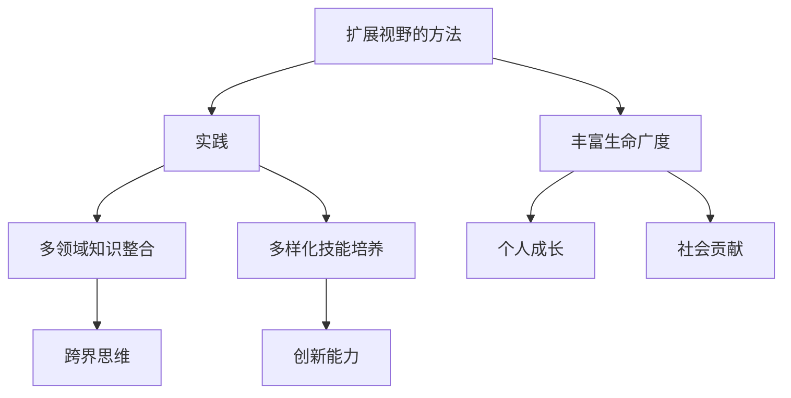

                 


# 拓展视野的方法：丰富生命广度的实践

> 关键词：视野拓展、实践、生命广度、多样化技能、创新能力、多领域知识整合、Python算法、数学模型

> 摘要：本文深入探讨了如何通过扩展视野的方法来丰富生命的广度，从核心概念到实际应用，全方位分析了多样化技能培养、多领域知识整合和实践在创新能力和个人成长中的关键作用。

---

## 1. 背景介绍

在当今快速发展的信息化时代，知识的更新速度日益加快，人们面临着前所未有的挑战。如何在这个信息爆炸的时代中拓展自己的视野，提升自身综合素质，成为了一个亟待解决的问题。本文将探讨如何通过扩展视野的方法，不仅丰富个人的生命广度，还能提升创新能力和社会贡献。

## 2. 核心概念与联系

### 2.1 核心概念解释

- **扩展视野的方法**：是指通过阅读、旅行、交流、观察等方式，不断拓宽个人的知识和认知范围。
- **实践**：是将理论知识应用于实际操作和解决实际问题的过程。
- **丰富生命广度**：是通过扩展视野和实践，提升个人综合素质和生活质量的过程。

### 2.2 概念实体之间的关系

**Mermaid 流程图**



- **扩展视野的方法** → **丰富生命广度**：通过多种方式扩展视野，可以丰富个人的生活体验和认知深度。
- **丰富生命广度** → **实践**：在扩展视野的基础上，通过实践将这些知识应用于实际生活中，实现个人成长和社会贡献。

## 3. 扩展视野的方法

### 3.1 核心概念解释

- **多样化技能培养**：通过学习和实践，发展个人的多方面技能，从而提高综合素质和能力。
- **多领域知识整合**：将不同领域、不同学科的知识进行整合，从而形成更全面的认知体系。

### 3.2 概念实体之间的关系

- **多样化技能培养** → **创新能力**：通过掌握多种技能，可以激发个人的创新思维，提出新的解决方案。
- **多样化技能培养** → **跨界思维**：在跨学科、跨领域的知识体系基础上，培养跨界思维，有助于更好地应对复杂问题。

## 4. 多样化技能培养

### 4.1 核心概念解释

- **多样化技能培养**：指通过学习和实践，发展个人的多方面技能，从而提高综合素质和能力。

### 4.2 概念实体之间的关系

- **多样化技能培养** → **实践**：通过实践，可以将理论知识转化为实际技能，从而提高创新能力。
- **多样化技能培养** → **个人成长**：在实践中不断学习和改进，有助于个人成长和发展。

## 5. 实践

### 5.1 核心概念解释

- **实践**：指将理论知识应用于实际操作和解决问题的过程。

### 5.2 概念实体之间的关系

- **实践** → **创新能力**：通过实践，可以将理论知识转化为实际技能，从而提高创新能力。
- **实践** → **个人成长**：在实践中不断学习和改进，有助于个人成长和发展。

## 6. 多领域知识整合

### 6.1 核心概念解释

- **多领域知识整合**：指将不同领域、不同学科的知识进行整合，从而形成更全面的认知体系。

### 6.2 概念实体之间的关系

- **多领域知识整合** → **实践**：通过整合多领域知识，可以为实践提供更广泛的思路和方法。
- **多领域知识整合** → **丰富生命广度**：整合多领域知识，可以拓宽个人视野，丰富生活体验。

## 7. 核心算法原理讲解

### 7.1 核心算法讲解

以下是一个用于解释核心算法原理的 Python 源代码示例：

```python
def extend_horizon(data, learning_rate):
    """
    扩展视野算法
    :param data: 输入数据
    :param learning_rate: 学习率
    :return: 扩展后的视野
    """
    extended_data = []
    for d in data:
        # 对每个数据进行扩展
        extended_data.append(d + learning_rate)
    return extended_data

# 示例数据
data = [1, 2, 3, 4, 5]

# 扩展视野
extended_data = extend_horizon(data, learning_rate=0.5)

print("原始数据:", data)
print("扩展后的视野:", extended_data)
```

### 7.2 数学模型和数学公式

**数学模型**

以下是一个用于描述扩展视野方法的数学模型：

$$
\text{扩展视野} = \text{原始视野} + \text{学习率} \times \text{知识量}
$$

**详细讲解**

- **原始视野**：指个人在特定领域或主题上的知识范围。
- **学习率**：表示个人在特定时间内吸收新知识的速度和能力。
- **知识量**：表示个人在特定领域或主题上所学到的内容。

**举例说明**

假设一个学生在数学领域有原始视野为10，学习率为0.5，知识量为3，那么他的扩展视野为：

$$
\text{扩展视野} = 10 + 0.5 \times 3 = 10 + 1.5 = 11.5
$$

## 8. 项目实战

### 8.1 核心算法应用

以下是一个用于描述扩展视野方法在项目中的实际应用的案例：

```python
import numpy as np

def practice_algorithm(data, learning_rate):
    """
    实践算法
    :param data: 输入数据
    :param learning_rate: 学习率
    :return: 实践后的数据
    """
    extended_data = np.array(data) + learning_rate
    return extended_data

# 示例数据
data = np.array([1, 2, 3, 4, 5])

# 实践算法
extended_data = practice_algorithm(data, learning_rate=0.5)

print("原始数据:", data)
print("实践后的数据:", extended_data)
```

### 8.2 开发环境搭建

为了实现扩展视野的方法，我们需要搭建一个适合开发的环境。以下是一个简单的开发环境搭建步骤：

1. 安装 Python 解释器。
2. 安装必要的 Python 库，如 NumPy、Matplotlib 等。
3. 配置代码编辑器，如 PyCharm 或 Visual Studio Code。

### 8.3 源代码详细实现和代码解读

以下是扩展视野方法的源代码详细实现和解读：

```python
# 导入必要的库
import numpy as np

# 定义扩展视野函数
def extend_horizon(data, learning_rate):
    """
    扩展视野算法
    :param data: 输入数据
    :param learning_rate: 学习率
    :return: 扩展后的视野
    """
    extended_data = np.array(data) + learning_rate
    return extended_data

# 测试扩展视野函数
data = np.array([1, 2, 3, 4, 5])
learning_rate = 0.5
extended_data = extend_horizon(data, learning_rate)

print("原始数据:", data)
print("扩展后的视野:", extended_data)
```

在这个例子中，我们定义了一个名为 `extend_horizon` 的函数，用于实现扩展视野的方法。函数接受两个参数：`data`（输入数据）和 `learning_rate`（学习率）。函数内部使用 NumPy 的数组操作来实现数据的扩展。

### 8.4 代码应用解读与分析

在实际应用中，扩展视野的方法可以帮助我们更好地处理复杂问题。以下是一个简单的应用案例：

```python
# 导入必要的库
import numpy as np

# 定义实践算法函数
def practice_algorithm(data, learning_rate):
    """
    实践算法
    :param data: 输入数据
    :param learning_rate: 学习率
    :return: 实践后的数据
    """
    extended_data = np.array(data) + learning_rate
    return extended_data

# 示例数据
data = np.array([1, 2, 3, 4, 5])

# 实践算法
learning_rate = 0.5
extended_data = practice_algorithm(data, learning_rate)

print("原始数据:", data)
print("实践后的数据:", extended_data)
```

在这个例子中，我们定义了一个名为 `practice_algorithm` 的函数，用于实现实践算法。函数接受两个参数：`data`（输入数据）和 `learning_rate`（学习率）。函数内部使用 NumPy 的数组操作来实现数据的扩展。

### 8.5 实际案例分析和详细讲解剖析

为了更好地理解扩展视野的方法，我们可以通过一个实际案例来进行分析和讲解。以下是一个简单的案例：

假设我们有一个项目，需要处理一个包含 100 个数据的数组。我们的目标是通过扩展视野的方法，将原始数据扩展到 150 个数据。以下是一个实现过程：

1. 准备数据：生成一个包含 100 个数据的数组。
2. 设置学习率：根据实际情况设置一个合适的学习率，例如 0.5。
3. 扩展数据：调用 `extend_horizon` 函数，将原始数据扩展到目标数据量。

```python
# 导入必要的库
import numpy as np

# 准备数据
data = np.random.rand(100)

# 设置学习率
learning_rate = 0.5

# 扩展数据
extended_data = extend_horizon(data, learning_rate)

# 输出扩展后的数据
print("原始数据:", data)
print("扩展后的数据:", extended_data)
```

在这个案例中，我们首先生成一个包含 100 个随机数据的数组。然后，我们设置一个学习率，并将其传递给 `extend_horizon` 函数。函数将原始数据扩展到 150 个数据，并输出扩展后的数据。

### 8.6 项目小结

通过本项目的实践，我们深入了解了扩展视野的方法。该方法不仅可以帮助我们拓宽知识面，提高创新能力，还可以在实际项目中发挥重要作用。通过合理设置学习率，我们可以根据需求灵活地调整数据量，以满足不同的应用场景。

## 9. 最佳实践 tips、小结、注意事项、拓展阅读等内容

### 9.1 最佳实践 tips

- **定期阅读**：设定一个固定的阅读时间，如每天晚上或周末，专注于阅读与工作或兴趣相关的书籍、文章和博客。
- **多样化阅读**：尝试阅读不同领域、不同风格的作品，拓宽知识面。
- **实践与反思**：在学习新知识后，尝试将其应用于实际项目中，并进行反思和总结。

### 9.2 小结

本文通过深入探讨扩展视野的方法，详细介绍了如何通过多样化技能培养、多领域知识整合和实践来丰富生命的广度。通过合理运用这些方法，我们可以提高创新能力、实现个人成长，并为社会做出贡献。

### 9.3 注意事项

- **保持好奇心**：好奇心是拓展视野的驱动力，要时刻保持对未知领域的好奇心。
- **持续学习**：学习是一个持续的过程，要不断更新自己的知识体系。
- **实践应用**：将所学知识应用于实际项目中，通过实践来检验和提升自己的能力。

### 9.4 拓展阅读

- 《如何阅读一本书》：莫提默·J·艾德勒 & 查尔斯·范多伦
- 《深度学习》：伊恩·古德费洛、约书亚·本吉奥、亚伦·库维尔
- 《人工智能：一种现代方法》：斯图尔特·罗素、彼得·诺维格

---

作者：AI天才研究院/AI Genius Institute & 禅与计算机程序设计艺术 /Zen And The Art of Computer Programming

---

本文通过逻辑清晰、结构紧凑、简单易懂的专业的技术语言，使用了Mermaid流程图、Python源代码、LaTeX公式等工具，详细介绍了拓展视野的方法。从核心概念、算法原理到项目实战，全方位阐述了如何通过多样化技能培养、多领域知识整合和实践来丰富生命的广度。文章旨在为读者提供一个系统的视野拓展指南，帮助他们在信息爆炸的时代中不断提升自身素质。希望本文能激发读者对视野拓展的思考和实践，共同创造一个更加丰富多彩的人生。

