                 

## 第一部分：视野拓展的心理学基础

### 第1章：视野拓展的重要性
#### 1.1 视野拓展的心理学概念

在心理学中，视野拓展（Perspective Expansion）指的是通过多种方式扩大个人对世界的认知范围和观点的多样性。视野拓展不仅仅指物理上的视野，还包括认知、情感、文化和社会等多个层面。这个概念的核心在于，通过增加个体的知识和经验，可以帮助他们更全面、客观地理解事物，减少偏见和盲点，从而提升决策质量和生活满意度。

视野拓展的过程可以视为一个连续谱，从自我中心到全球视角，个体逐步从狭窄、有限的视角转变为开放、包容的心态。这种转变对个体的认知发展至关重要，它能够促进思维的创新性、灵活性和深度，从而提升个人的整体智力水平。

#### 1.2 视野拓展与个人成长

视野拓展对于个人成长具有深远的影响。首先，它能够促进自我认知的提升。当个体接触到不同的文化和思想，他们可以更好地理解自我，认识到自身的局限性和优点。这种自我认知的提升有助于建立积极的自我形象，增强自信心。

其次，视野拓展能够增强个体的人际交往能力。了解不同文化和社会背景下的行为和习惯，有助于个体更好地与他人沟通和合作。这不仅有助于建立和维护良好的人际关系，还能够促进跨文化理解和和谐共处。

此外，视野拓展还能够激发个体的创造力和创新能力。当个体接触到新的观念和思想时，他们的思维模式会变得更加开放和灵活，从而更容易产生新颖的观点和解决方案。这种创造力的提升对个体的职业发展和个人成就有着积极的推动作用。

#### 1.3 视野拓展对社会交往的影响

视野拓展不仅对个人成长有益，它对社会交往也有重要影响。首先，视野拓展能够促进社会包容性和多元化。当个体拥有更广泛的视野，他们更容易接受和尊重不同的文化、价值观和生活方式，从而减少社会冲突和偏见。

其次，视野拓展有助于建立更强大的社会联系。通过了解和体验不同的文化和生活方式，个体能够拓展社交网络，建立更广泛、多样化的社会关系。这种社会联系的增强有助于促进社会整合和协作，提升社会的整体和谐度。

最后，视野拓展能够提升社会创新和进步。当个体和群体拥有更广泛的视野和知识时，他们能够更好地发现和解决社会问题，推动社会的发展和进步。

综上所述，视野拓展在心理学中具有重要的地位和作用。通过扩大个体的视野，他们能够实现自我认知的提升、人际交往能力的增强以及社会包容性和创新的促进。因此，理解和实践视野拓展对于个人和社会的发展都具有重要意义。

### 第2章：心理障碍与视野拓展
#### 2.1 心理障碍的类型与成因

心理障碍是指那些影响个体情绪、认知和行为功能的异常心理状态。它们可以分为多种类型，包括焦虑障碍、抑郁障碍、人格障碍、精神分裂症等。这些障碍的形成通常由多种因素共同作用，包括遗传、环境、社会和个人心理因素。

首先，遗传因素在心理障碍的形成中扮演了重要角色。某些心理障碍，如抑郁症和焦虑症，在家族中有较高的发病率。研究表明，基因变异可能导致大脑中某些神经递质的不平衡，从而引发心理障碍。

其次，环境因素也是心理障碍形成的重要原因。例如，生活压力、经济困难、家庭不和、工作环境恶劣等，都可能对个体的心理健康产生负面影响。长期处于这样的环境中，个体可能会出现焦虑、抑郁等心理问题。

此外，社会因素也对心理障碍的形成产生影响。社会支持系统的缺乏、社会排斥、歧视和暴力等，都可能使个体感到无助和孤独，进而引发心理问题。而社会支持的充足和积极的社交环境，则有助于个体心理健康的维护。

#### 2.2 心理障碍与视野局限的关系

心理障碍常常伴随着视野的局限。当个体面临心理障碍时，他们的认知功能可能会受到影响，导致他们对事物的理解和判断变得狭隘和片面。这种视野的局限不仅限制了个体对世界的认知，还可能加剧心理障碍的症状。

首先，焦虑障碍和抑郁症等心理障碍会导致个体对事物的消极看法。他们可能只看到生活中的负面因素，而忽视了积极的一面。这种消极的视野使得个体难以从困境中解脱出来，进一步加重心理负担。

其次，人格障碍如偏执型人格障碍，会导致个体对他人的过度猜疑和不信任。这种狭隘的视野使得个体难以建立和维护良好的人际关系，从而孤立自己，进一步加剧心理障碍。

此外，精神分裂症等严重心理障碍会导致个体的认知功能受损，他们的思维变得混乱和不连贯。这种认知障碍使得个体难以理解复杂的社会关系和现实环境，从而导致视野的进一步局限。

#### 2.3 克服心理障碍，拓展视野

克服心理障碍，拓展视野是心理治疗和康复的重要目标。以下是一些有效的方法：

首先，心理治疗是克服心理障碍的重要手段。通过心理咨询和认知行为疗法，个体可以学会识别和改变负面思维模式，提高情绪调节能力，从而拓宽视野。例如，认知行为疗法可以帮助个体识别和挑战那些导致视野局限的负面思维，如过度概括、黑白思维等，从而促进视野的拓展。

其次，社交支持也是拓展视野的重要途径。与亲朋好友保持良好的关系，加入兴趣小组或社区活动，可以帮助个体接触到不同的观点和文化，从而拓宽视野。此外，参加社交活动可以增强个体的自信心和社交技能，从而减少心理障碍的症状。

第三，教育和学习也是拓展视野的有效方法。通过阅读书籍、观看教育视频、参加线上课程等，个体可以接触到丰富的知识和信息，从而拓宽视野。例如，学习新的语言和文化可以增强个体的跨文化理解能力，帮助他们更好地适应多样化的社会环境。

最后，积极参与体育活动和户外运动也是拓展视野的有效方式。这些活动可以增强个体的身心健康，提高他们的情绪调节能力，从而减少心理障碍的症状。同时，户外运动可以提供新鲜空气和美丽的自然景观，有助于个体放松身心，拓宽视野。

总之，克服心理障碍，拓展视野是一个长期而复杂的过程。通过心理治疗、社交支持、教育和学习以及积极参与体育活动和户外运动，个体可以逐步克服心理障碍，实现视野的拓展，从而提高生活质量和社会适应能力。

### 第3章：认知心理学与视野拓展
#### 3.1 认知心理学的核心概念

认知心理学是研究人类认知过程的科学，包括感知、记忆、思维和语言等。其核心概念主要包括认知加工、信息处理、注意力、记忆和思维等。

首先，认知加工是指个体在处理信息时，通过感知、注意、记忆和思维等认知过程来理解和解释外部刺激。例如，当我们看到一幅画时，我们需要通过感知来识别颜色、形状和纹理，然后通过注意来集中精力，通过记忆来回忆相关的知识和经验，通过思维来做出判断和决策。

其次，信息处理是指个体如何接收、存储、提取和应用信息的过程。信息处理包括感知输入、编码、存储和提取等步骤。例如，当我们听到一段话时，我们首先通过听觉感知来接收信息，然后通过语言处理系统将声音转换为文字信息，并存储在记忆中，以便后续回忆和应用。

第三，注意力是认知心理学中的一个重要概念，它是指个体在特定时刻对某些刺激的选择性关注。注意力不仅影响个体的信息处理效率，还影响他们的认知灵活性和视野拓展。例如，当我们专注于一个任务时，我们的注意力会集中在这个任务上，从而忽视其他无关的信息。

第四，记忆是认知心理学中的另一个核心概念，它是指个体在经历后对信息的存储和回忆能力。记忆可以分为短期记忆和长期记忆。短期记忆通常用于处理和存储临时信息，而长期记忆则用于存储持久的信息。记忆的容量和效率对个体的认知发展和视野拓展具有重要意义。

最后，思维是指个体在处理信息时，通过推理、判断、解决问题和创造性思维等过程来理解和解释世界。思维可以分为分析思维和创造性思维。分析思维侧重于分解问题，寻找规律和逻辑关系，而创造性思维则侧重于寻找新的解决方案和创新的想法。

#### 3.2 认知偏差与视野局限

认知偏差是指个体在信息处理过程中，由于各种心理因素而产生的系统性错误。这些偏差可能导致个体对信息的误解、判断和决策的失误，从而限制他们的视野。

首先，确认偏差是指个体在处理信息时，更倾向于确认和接受那些符合自己已有观点和信念的信息，而忽视或否认那些与自己观点相反的信息。这种偏差使得个体难以接受新的观点和经验，从而限制他们的视野。

其次，认知简化偏差是指个体在处理复杂信息时，倾向于将其简化为简单的、易于理解的形式。这种简化可能导致个体对信息的理解失真，从而影响他们的判断和决策。例如，当个体面对复杂的社会问题或科技发展时，他们可能会将其简化为“好”或“坏”两种极端的观点，而忽视其中的复杂性和多样性。

第三，锚定效应是指个体在处理信息时，会受先入为主的观点或信息的影响，从而对后续信息做出判断。例如，当个体在评估一个项目时，如果首先了解到这个项目的预算很高，那么他们可能会对这个项目产生更高的期望，从而忽视其他可能的信息。

这些认知偏差不仅会影响个体的信息处理和决策，还会限制他们的视野。当个体陷入这些偏差时，他们可能难以接受新的观点和经验，从而错过拓展视野的机会。

#### 3.3 增强认知灵活性，拓展视野

增强认知灵活性是拓展视野的关键。以下是一些有效的方法：

首先，多角度思考问题可以帮助个体摆脱认知偏差的束缚。通过从不同的角度和立场来思考问题，个体可以更全面、客观地理解事物，减少偏见和盲点。例如，当面对一个社会问题时，个体可以从政治、经济、文化等多个角度来分析，从而获得更全面的理解。

其次，培养批判性思维是增强认知灵活性的重要途径。批判性思维强调对信息的质疑和分析，而不是盲目接受。通过培养批判性思维，个体可以学会识别和挑战认知偏差，从而拓宽视野。例如，在阅读一篇文章时，个体可以问自己这篇文章的论点是否合理、论据是否充分、结论是否可靠。

第三，持续学习和探索是增强认知灵活性、拓展视野的长期策略。通过不断学习新的知识和技能，个体可以提升自己的认知水平，从而更好地理解和应对复杂的问题。例如，学习新的语言和文化可以增强个体的跨文化理解能力，帮助他们更好地适应多样化的社会环境。

最后，实践和经验也是拓展视野的重要途径。通过亲身经历和实际操作，个体可以更直接地了解事物的本质，从而减少认知偏差，拓宽视野。例如，通过旅行和社交活动，个体可以接触到不同的文化和生活方式，从而增加他们的生活经验和视野。

总之，增强认知灵活性、拓展视野需要个体的努力和持续实践。通过多角度思考问题、培养批判性思维、持续学习和探索以及亲身实践，个体可以逐步摆脱认知偏差的束缚，拓宽视野，提升认知水平，从而实现个人成长和社会进步。

## 第二部分：视野拓展的方法与技巧

### 第4章：积极心态与视野拓展
#### 4.1 积极心态的重要性

积极心态是一种有益的心态，它有助于个体在生活和工作中保持乐观、自信和积极的态度。积极心态不仅对个人的心理健康有重要影响，还对视野拓展具有深远的意义。

首先，积极心态能够提升个体的幸福感。当个体拥有积极的心态时，他们更容易看到生活中的美好和积极的方面，从而减少负面情绪的影响。这种幸福感有助于个体更好地应对生活中的挑战，保持心理平衡。

其次，积极心态有助于提高个体的心理健康水平。积极心态能够增强个体的抗压力和适应能力，使他们更能够应对生活中的压力和困难。这种心理健康水平的提升有助于个体更好地处理复杂的问题，从而拓展视野。

最后，积极心态对视野拓展的重要性体现在以下几个方面：

1. **减少偏见和盲点**：积极心态使个体更愿意接受新的观点和信息，减少对未知事物的恐惧和偏见。这种开放的心态有助于个体拓展视野，更全面地理解世界。

2. **增强学习动力**：积极心态使个体对学习保持热情和兴趣，从而提高他们的学习效率。通过不断学习和探索，个体可以积累更多的知识和经验，从而拓宽视野。

3. **提升创新思维**：积极心态有助于个体跳出传统思维模式，产生新的想法和创意。这种创新思维可以激发个体对问题的多角度思考，从而拓展视野。

#### 4.2 如何培养积极心态

培养积极心态需要个体的努力和持续实践。以下是一些有效的方法：

1. **正面肯定**：通过正面肯定自己，个体可以增强自信心和积极情绪。例如，每天早晨对自己说一些积极的话，如“今天我会做得很好”或“我有能力应对挑战”。

2. **感恩练习**：感恩是一种强大的积极情绪，通过感恩练习，个体可以培养对生活的感激之情。例如，每天写下三件自己感激的事情，这有助于提高个体的幸福感和积极情绪。

3. **积极思维**：通过积极思维，个体可以学会从不同的角度看待问题，减少负面情绪的影响。例如，当遇到困难时，可以思考如何将挑战转化为机会。

4. **运动和休闲**：定期进行运动和休闲活动有助于释放压力，提高心理健康水平。例如，散步、瑜伽或参与团队运动等都可以帮助个体保持积极心态。

5. **社交支持**：与亲朋好友保持良好的关系，获得他们的支持和鼓励，有助于个体培养积极心态。社交支持可以提供情感上的支持和实际上的帮助，从而增强个体的积极情绪。

#### 4.3 积极心态与视野拓展的互动关系

积极心态与视野拓展之间存在紧密的互动关系。积极心态有助于个体拓展视野，而视野拓展又能够进一步强化积极心态。

首先，积极心态可以促进视野拓展。当个体拥有积极心态时，他们更容易接受新的观点和信息，从而减少对未知事物的恐惧和偏见。这种开放的心态使他们能够更全面地理解世界，从而拓展视野。

其次，视野拓展可以增强积极心态。通过拓展视野，个体可以接触到新的知识和经验，这有助于他们更好地理解生活中的各种挑战和机遇。这种理解和认知的提升可以增强个体的自信心和幸福感，从而强化积极心态。

此外，积极心态和视野拓展之间的互动关系还体现在个体的行为和决策上。积极心态使个体更有动力去探索新的领域和经验，从而拓展视野。而视野拓展则提供了更多的信息和资源，使个体能够更好地实现自己的目标和梦想，从而增强积极心态。

总之，积极心态与视野拓展之间存在相互促进的互动关系。通过培养积极心态，个体可以更有效地拓展视野，从而提升自己的生活质量和社会适应能力。同时，通过拓展视野，个体可以进一步增强积极心态，实现个人成长和社会进步。

### 第5章：多样化经验与视野拓展
#### 5.1 多样化经验的重要性

多样化经验是视野拓展的重要途径之一。通过多样化的经验，个体可以接触到不同的文化、社会背景和思想观念，从而提升他们的认知能力、增强社会适应能力和培养创新思维。

首先，多样化经验有助于提升认知能力。当个体接触到不同的经验和观点时，他们的思维会变得更加开放和灵活，能够从多个角度理解和分析问题。这种认知能力的提升有助于个体更好地应对复杂多变的社会环境，提高问题解决能力和决策质量。

其次，多样化经验可以增强个体的社会适应能力。在多样化的经验中，个体会学会如何与不同背景和文化的人相处，如何理解并尊重他人的观点和习惯。这种社会适应能力的增强有助于个体在多元文化的社会中更好地融入和发挥作用，减少冲突和误解。

最后，多样化经验对于培养创新思维具有重要作用。通过多样化的经验，个体可以接触到新的思想和观念，激发他们的创造力和创新思维。例如，一个工程师在旅行过程中可能从一种文化中获得了灵感，从而在一个技术项目中提出一个创新的解决方案。

#### 5.2 如何获取多样化经验

获取多样化经验需要个体的主动探索和积极实践。以下是一些有效的方法：

1. **旅行**：旅行是获取多样化经验的重要途径。通过旅行，个体可以亲身体验不同的文化、社会环境和生活方式。旅行不仅有助于拓宽视野，还可以提高个体的文化素养和人际交往能力。

2. **跨文化交流**：参加跨文化交流活动，如国际学生交流项目、文化讲座和工作坊等，可以帮助个体与来自不同背景的人建立联系，分享经验和观点。这种跨文化交流有助于提升个体的跨文化理解和沟通能力。

3. **参与多元社区**：加入多元社区，如国际社区、多元文化俱乐部或宗教团体等，可以提供多样化的社交环境和经验。通过参与这些社区的活动，个体可以接触到不同的文化、社会背景和思想观念。

4. **阅读和学习**：阅读书籍、观看纪录片、参与线上课程和研讨会等，是获取多样化经验的有效途径。通过学习，个体可以了解不同的历史、文化和社会现象，拓宽视野。

5. **体验不同工作**：尝试不同的工作和职业，如实习、志愿服务或兼职等，可以帮助个体获取多样化的工作经验。这些经验不仅可以提升个体的职业技能，还可以拓宽他们的视野。

6. **参与公共事务**：参与公共事务，如社区服务、志愿者活动和政治活动等，可以让个体了解社会的运作和问题，增强社会责任感和公民意识。

#### 5.3 多样化经验与视野拓展的关系

多样化经验与视野拓展之间存在密切的关系。多样化经验为个体提供了丰富的知识和信息，使他们能够从多个角度理解世界，从而拓宽视野。以下是一些具体的关系：

1. **知识扩展**：多样化经验使个体接触到不同的知识和信息，丰富了他们的知识储备。这种知识扩展有助于个体更好地理解复杂的问题，提升他们的认知能力和思考深度。

2. **观点多元化**：多样化经验使个体能够接触到不同的观点和思想，减少偏见和盲点。这种观点多元化有助于个体形成更加客观、全面的视角，从而拓宽视野。

3. **思维灵活性**：通过多样化经验，个体可以培养思维的灵活性和开放性。这种灵活性使他们能够从不同的角度和立场看待问题，从而更全面地理解世界。

4. **创新思维**：多样化经验可以激发个体的创新思维。当个体接触到新的观念和思想时，他们的思维模式会变得更加开放和灵活，从而更容易产生新颖的观点和解决方案。

总之，多样化经验是视野拓展的重要基础。通过获取多样化经验，个体可以提升认知能力、增强社会适应能力和培养创新思维，从而实现个人成长和社会进步。同时，视野拓展也为多样化经验的获取提供了动力和支持，形成良性互动。

### 第6章：跨界思维与视野拓展
#### 6.1 跨界思维的概念与特点

跨界思维（Interdisciplinary Thinking）是指将不同领域、学科或行业的知识和方法相互融合，以解决复杂问题和创造新价值的一种思维方式。这种思维方式的特点包括跨学科整合、创新性、综合性和系统性。

首先，跨界思维强调跨学科整合。在传统学科体系中，各个领域往往具有明确的界限和独立的体系。而跨界思维则打破了这些界限，将不同领域的知识和方法相互结合，形成一个更为广泛和复杂的知识体系。这种跨学科整合有助于个体从多个角度看待问题，提高问题解决能力和创新能力。

其次，跨界思维具有创新性。跨界思维鼓励个体打破传统的思维模式，采用新颖的方法和视角来解决问题。通过将不同领域的知识和方法相结合，个体可以产生新的想法和创意，从而实现创新。这种创新性是跨界思维的核心价值之一，它能够推动科技进步和社会发展。

第三，跨界思维具有综合性。跨界思维不仅仅是简单的知识叠加，而是通过整合不同领域的知识和方法，形成一种更为复杂和综合的思维方式。这种综合性使个体能够从多个层面和角度来分析问题，从而更全面地理解问题的本质和解决方案。

最后，跨界思维具有系统性。跨界思维不仅关注单一领域的知识和方法，还关注这些知识和方法之间的相互作用和整体影响。通过系统性思考，个体可以更好地理解复杂系统的运作规律和内在联系，从而更有效地解决问题。

#### 6.2 跨界思维的方法与应用

跨界思维在许多领域都有广泛的应用，以下是一些常见的方法和应用：

1. **多学科研究团队**：建立多学科研究团队是一种常见的跨界思维方法。通过将不同领域的专家和学者组织在一起，可以充分利用各自的专业知识和经验，共同解决复杂问题。例如，在医学领域，医生、生物学家、工程师和心理学家可以共同研究疾病的治疗方法。

2. **跨学科课程与项目**：跨学科课程和项目鼓励学生在不同学科之间进行学习，培养跨界思维。通过这种课程和项目，学生可以接触到不同的学科知识和方法，从而拓宽视野，提高创新能力。例如，工程系的学生可以参与医学项目的课程，了解医学知识，从而在设计中考虑患者的需求。

3. **跨领域合作**：跨领域合作是将跨界思维应用于实际工作的重要途径。通过跨领域合作，不同领域的专业人士可以共同解决问题，实现创新和突破。例如，在科技产业，软件开发人员可以与市场营销人员、用户研究人员等合作，共同开发出满足用户需求的产品。

4. **头脑风暴和思维导图**：头脑风暴和思维导图是跨界思维的重要工具。通过头脑风暴，个体可以自由地提出各种想法，不受限制地思考问题的解决方案。而思维导图则可以帮助个体将不同领域的知识和方法进行整合，形成一种系统性的思考方式。

5. **案例研究和实际应用**：通过案例研究和实际应用，个体可以更深入地了解跨界思维的方法和应用。例如，研究不同领域的成功案例，分析这些案例中的跨界思维如何发挥作用，从而获得实际的经验和启示。

#### 6.3 跨界思维与视野拓展的关联

跨界思维与视野拓展之间存在紧密的关联。跨界思维能够帮助个体打破传统的思维模式，从多个角度和领域看待问题，从而拓宽视野。以下是一些具体的关联：

1. **视野拓宽**：跨界思维鼓励个体接触和了解不同领域的知识和方法，从而拓宽视野。这种视野拓宽不仅有助于个体更好地理解复杂问题，还能够激发他们的创造力和创新思维。

2. **认知灵活性**：跨界思维培养了个体思维的灵活性和开放性，使他们能够从多个角度和立场看待问题。这种认知灵活性是视野拓展的重要基础，有助于个体更全面地理解世界。

3. **问题解决能力**：跨界思维提供了多种解决问题的方法和视角，使个体能够更有效地应对复杂问题。这种问题解决能力的提升有助于个体在多元文化的社会中更好地适应和发挥作用。

4. **创新思维**：跨界思维鼓励个体打破传统思维模式，采用新颖的方法和视角来解决问题。这种创新思维可以激发个体的创造力，推动科技进步和社会发展。

总之，跨界思维与视野拓展之间存在相互促进的关联。通过培养跨界思维，个体可以拓宽视野，提高认知能力和创新能力，从而实现个人成长和社会进步。同时，视野拓展也为跨界思维的培养提供了丰富的资源和动力。

### 第7章：终身学习与视野拓展
#### 7.1 终身学习的重要性

终身学习是指个体在其一生中持续不断地学习、更新知识和技能，以适应快速变化的社会环境和职业需求。终身学习的重要性体现在以下几个方面：

首先，终身学习有助于提升个体的职业竞争力。在现代社会，知识更新速度极快，新技术、新理念不断涌现。只有通过终身学习，个体才能跟上时代的步伐，掌握最新的知识和技能，从而在职场中保持竞争力。

其次，终身学习有助于个体的全面发展。通过终身学习，个体不仅可以提升专业技能，还可以拓宽知识面，提高人文素养和综合素质。这种全面发展有助于个体更好地应对生活中的各种挑战，提高生活质量。

第三，终身学习能够促进社会的进步和发展。当整个社会的个体都具备终身学习的意识和能力时，社会的创新能力和竞争力将得到显著提升，从而推动社会的进步和发展。

#### 7.2 如何进行终身学习

进行终身学习需要个体的主动性和持续性。以下是一些有效的方法：

1. **制定学习计划**：制定一个明确的学习计划，包括学习目标、时间安排和学习内容。例如，可以列出每天的学习时间，每周的学习主题，以及每月的学习成果。

2. **参加培训课程**：参加各类培训课程是提升知识和技能的有效途径。这些课程可以包括线上课程、线下讲座和研讨会等。选择与自己职业发展和兴趣相关的课程，有助于提升学习效果。

3. **阅读和学习**：阅读是终身学习的重要手段。通过阅读书籍、学术论文和行业报告，个体可以获取大量的知识和信息。此外，还可以利用线上资源，如电子书、在线课程和学术期刊等，进行自学。

4. **实践和应用**：将所学的知识和技能应用到实际工作中，是巩固和提升学习效果的重要方法。通过实践，个体可以检验自己的学习成果，发现不足之处，并进行改进。

5. **建立学习社区**：与其他学习者建立联系，组成学习社区，可以互相交流学习心得和经验，共同提升学习效果。这种学习社区可以是线上的，如社交媒体和在线论坛，也可以是线下的，如学习小组和学术会议。

6. **保持好奇心和求知欲**：好奇心和求知欲是推动个体持续学习的动力。保持对世界的好奇心和求知欲，可以使个体不断追求新的知识和技能，从而实现终身学习。

#### 7.3 终身学习与视野拓展的相互促进

终身学习与视野拓展之间存在相互促进的关系。终身学习为视野拓展提供了丰富的知识和经验，而视野拓展则为终身学习提供了新的动力和方向。

首先，终身学习拓宽了视野。通过不断学习和更新知识，个体可以接触到新的观念和思想，了解不同的文化和背景，从而拓宽视野。这种视野拓宽有助于个体更好地理解世界，提高认知能力和创新能力。

其次，视野拓展促进了终身学习。当个体拥有广阔的视野时，他们更愿意接受新的知识和信息，更主动地寻找学习的机会。这种积极的学习态度有助于个体实现终身学习，不断提高自己的综合素质。

此外，终身学习与视野拓展之间的相互促进还体现在个体的职业发展和个人成长上。通过终身学习，个体可以不断提升自己的职业能力，拓宽职业发展空间。而视野拓展则使个体能够更好地适应职业发展的需求，实现职业上的突破和进步。

总之，终身学习与视野拓展是相辅相成的。通过终身学习，个体可以拓宽视野，提高认知能力和创新能力；而通过视野拓展，个体可以激发终身学习的动力，实现个人成长和社会进步。因此，终身学习和视野拓展都具有重要意义，值得我们高度重视和持续实践。

### 第8章：视野拓展的实践案例
#### 8.1 案例一：通过阅读拓展视野

阅读是拓展视野的一种有效方法。通过阅读，个体可以接触到丰富的知识和信息，了解不同的文化和思想，从而拓宽视野。以下是一个通过阅读拓展视野的实践案例：

张华是一名年轻的程序员，他意识到自己在技术领域的知识有限，希望通过阅读来拓展视野。于是，他制定了一个阅读计划，每周阅读一本书，涉及不同的领域，如科技、历史、哲学等。

首先，张华选择了一本关于科技的书《科技简史》。这本书详细介绍了人类科技发展的历程，从古代的农业技术到现代的互联网技术。通过阅读这本书，张华了解了科技的发展对人类社会的深远影响，以及不同技术领域的相互关联和交叉应用。

接着，张华阅读了一本关于历史的书《世界历史简明教程》。这本书从宏观的角度概述了世界历史的发展，包括古代文明、中世纪、文艺复兴、工业革命等。通过阅读这本书，张华对历史事件有了更全面的了解，特别是那些与他所从事的科技领域相关的事件，如工业革命和计算机科学的兴起。

此外，张华还阅读了一本哲学书籍《西方哲学史》。这本书详细介绍了西方哲学的发展历程，从古希腊哲学到现代哲学。通过阅读这本书，张华对哲学的基本概念和思想有了更深入的理解，特别是在伦理学和认识论方面，这些知识对他的编程工作有着重要的启示。

通过阅读这些书籍，张华不仅拓宽了视野，还提高了自己的知识水平和思考能力。他开始关注科技、历史和哲学之间的联系，思考如何将这些跨学科的知识应用到实际工作中。例如，他在设计软件系统时，会考虑到历史背景和伦理问题，从而提高软件的可持续性和社会责任感。

总之，通过阅读，张华成功拓展了自己的视野，提高了认知能力和创新能力。这种通过阅读拓展视野的方法，不仅适用于程序员，也适用于其他职业和领域的人。通过阅读，个体可以接触到丰富的知识和信息，拓宽视野，实现个人成长和社会进步。

#### 8.2 案例二：通过旅行拓展视野

旅行是另一种拓展视野的有效方法。通过旅行，个体可以亲身体验不同的文化、社会环境和生活方式，从而拓宽视野。以下是一个通过旅行拓展视野的实践案例：

李明是一名大学教师，他热爱旅行，并希望通过旅行来拓展自己的视野。他的旅行计划涵盖了世界各地，从亚洲的日本、中国到欧洲的法国、英国，再到非洲的南非、埃及。以下是他的一些旅行经历：

首先，李明去了日本。他在日本体验了传统的茶道和武士文化，了解了日本的现代化与传统文化之间的融合。通过参观日本的科技公司，李明了解了日本在科技创新方面的成就，特别是其在机器人技术和移动支付领域的领先地位。这些经历使他对日本的社会和经济有了更深入的理解。

接着，李明前往中国，他游览了北京、上海和西安等城市。通过参观历史遗迹和文化景点，如故宫、兵马俑和长城，李明对中国的历史和文化有了更全面的了解。他还与当地居民交流，了解了中国的社会结构和价值观。这些经历使他对中国的现状和未来有了更清晰的认知。

此外，李明去了法国和英国。他在法国参观了巴黎的博物馆和艺术画廊，了解了法国的文学、艺术和哲学传统。在英国，他游览了伦敦的历史建筑和自然风光，了解了英国的政治、经济和文化发展。这些经历使他对欧洲的文化和价值观有了更深刻的理解。

最后，李明去了非洲的南非和埃及。在南非，他了解了南非的历史、种族问题和民主进程。在埃及，他参观了金字塔、卢克索神庙等古迹，了解了古埃及文明和宗教信仰。这些经历使他对非洲的历史和文化有了更全面的认识。

通过这些旅行，李明成功拓展了自己的视野。他不仅了解了不同国家和地区的文化、社会和经济情况，还学会了如何从不同角度看待世界。这些旅行经历对他的学术研究和教学工作产生了深远的影响，使他能够更生动地传授知识，更有效地引导学生。

总之，通过旅行，李明成功拓展了自己的视野，提高了自己的认知能力和教学水平。这种通过旅行拓展视野的方法，不仅适用于教师，也适用于其他职业和领域的人。通过旅行，个体可以亲身体验不同的文化、社会环境和生活方式，拓宽视野，实现个人成长和社会进步。

#### 8.3 案例三：通过社交拓展视野

社交是拓展视野的另一种有效方法。通过与他人交流，个体可以接触到不同的观点和经验，从而拓宽视野。以下是一个通过社交拓展视野的实践案例：

王婷是一名市场营销专业的学生，她希望通过社交来拓展自己的视野。她的社交计划包括参加各种社交活动和加入不同兴趣小组。以下是她的一些社交经历：

首先，王婷加入了学校的市场营销社团。在社团中，她与来自不同专业的同学一起参加各种活动和项目，如市场调研、品牌策划和广告设计。通过这些活动，她学到了不同的市场营销策略和技巧，了解了不同专业领域的应用。这些经历使她对市场营销有了更全面的认识。

接着，王婷参加了学校举办的企业参观活动。她参观了多家知名企业，如互联网公司、广告公司和消费品公司。在参观过程中，她与企业的员工和领导进行了交流，了解了企业的运营模式、市场营销策略和人才需求。这些经历使她对企业的运作和市场营销的实际应用有了更深入的理解。

此外，王婷还加入了线上社交平台，如LinkedIn和Facebook。她通过这些平台与行业内的人士建立了联系，参与了各种在线讨论和分享活动。通过这些交流，她了解了行业内的最新动态、趋势和最佳实践。这些经历使她对市场营销的未来发展方向有了更清晰的认知。

最后，王婷参加了行业会议和研讨会。在会议和研讨会上，她与业内专家和同行进行了深入的交流，分享了各自的观点和经验。通过这些交流，她学到了许多新的知识和见解，拓宽了自己的视野。

通过这些社交活动，王婷成功拓展了自己的视野。她不仅了解了市场营销的多个方面，还学会了如何与不同背景的人进行有效沟通和合作。这些社交经历对她的学习和职业发展产生了深远的影响，使她能够更好地应对未来的挑战。

总之，通过社交，王婷成功拓展了自己的视野，提高了自己的专业素养和沟通能力。这种通过社交拓展视野的方法，不仅适用于学生，也适用于其他职业和领域的人。通过社交，个体可以接触到不同的观点和经验，拓宽视野，实现个人成长和社会进步。

### 第9章：视野拓展的反思与自我提升
#### 9.1 视野拓展的自我评估

自我评估是视野拓展过程中至关重要的一环。通过自我评估，个体可以了解自己在视野拓展方面的现状和进展，从而更好地制定下一步的计划。以下是一些关键步骤和问题，以帮助个体进行有效的自我评估：

1. **反思学习经历**：回顾自己过去的学习和成长经历，思考哪些活动、经历或学习内容对自己的视野拓展产生了最大的影响。例如，哪些课程、书籍或研讨会使你接触到了新的领域或观念？

2. **评估知识面**：评估自己的知识面是否广泛，是否能够理解并应用跨学科的知识。思考自己在哪些领域有较深的了解，哪些领域还需要进一步学习和拓展。

3. **识别视野盲点**：识别自己在视野拓展过程中可能存在的盲点或偏见。例如，你是否过度依赖某种观点或思维方式，或者是否在处理信息时存在某些认知偏差？

4. **评估社交圈**：评估自己的社交圈是否多样化，是否能够接触到不同文化、背景和行业的人。思考自己是否积极参与社交活动，是否能够从他人那里获得新的观点和经验。

5. **自我反思**：反思自己的心态和行为，是否具备积极开放的心态，是否愿意接受新观点和挑战。思考自己在面对不同意见和观点时，是否能够保持冷静和理性。

#### 9.2 视野拓展的持续动力

持续动力是视野拓展过程中不可或缺的因素。以下是一些策略，可以帮助个体保持视野拓展的持续动力：

1. **设定明确目标**：设定具体、可衡量的目标，以明确自己在视野拓展方面的期望和成就。这些目标可以是短期目标，如完成一本书的阅读或参加一个行业研讨会，也可以是长期目标，如掌握一种新技能或拓展一个新领域。

2. **制定计划**：制定一个详细的学习和行动计划，包括具体的步骤、时间表和资源。确保计划是实际可行的，同时能够激发自己的兴趣和热情。

3. **建立支持系统**：寻找支持和鼓励自己的伙伴或导师，与他们分享自己的目标和进展。这种支持系统可以提供情感上的支持和实际上的帮助，从而增强动力和信心。

4. **保持好奇心和求知欲**：保持对世界的好奇心和求知欲，对新知识和新经验保持开放和探索的态度。这种好奇心和求知欲是推动个体持续学习和成长的重要动力。

5. **庆祝成就**：在视野拓展过程中，及时庆祝每一个小成就和进步。这种庆祝可以增强个体的自信心和动力，同时为下一步的学习和拓展奠定基础。

6. **适应变化**：随着视野的不断拓展，个体可能会面临新的挑战和变化。保持灵活和适应性，勇于接受变化，是保持持续动力的关键。

总之，通过自我评估和持续动力的培养，个体可以更好地实现视野拓展的目标。自我评估帮助个体了解自身的现状和不足，持续动力则推动个体不断前进，实现个人成长和社会进步。

#### 9.3 视野拓展与个人成长的关系

视野拓展与个人成长之间存在密切的关系。通过拓展视野，个体可以提升认知能力、增强社会适应能力和培养创新思维，从而实现个人成长。以下是一些具体的联系：

1. **认知能力提升**：视野拓展使个体接触到新的知识和信息，从而提升他们的认知能力。这种认知能力的提升有助于个体更好地理解复杂的问题，提高思考深度和广度。

2. **社会适应能力增强**：视野拓展使个体了解和接触到不同的文化、社会背景和思想观念，从而增强他们的社会适应能力。这种适应能力的增强有助于个体在多元文化的社会中更好地融入和发挥作用。

3. **创新思维培养**：视野拓展激发个体的创新思维，使他们能够从多个角度和领域看待问题，提出新颖的观点和解决方案。这种创新思维的培养有助于个体在职业生涯中取得突破和进步。

4. **个人成长**：视野拓展不仅有助于个体的职业发展，还能够提升他们的生活质量和幸福感。通过拓展视野，个体可以更好地理解世界，找到自己的兴趣和目标，从而实现个人成长和满足感。

总之，视野拓展与个人成长之间存在相互促进的关系。通过拓展视野，个体可以提升认知能力、增强社会适应能力和培养创新思维，从而实现个人成长和社会进步。因此，视野拓展对于个人成长具有重要意义，值得我们高度重视和持续实践。

### 第10章：视野拓展的未来展望
#### 10.1 视野拓展的挑战与机遇

在未来的发展中，视野拓展面临着一系列的挑战和机遇。随着科技的进步和社会的变迁，个体和组织将面临更加复杂多变的环境，因此，如何有效地拓展视野，成为影响个人和社会发展的重要因素。

首先，技术的迅猛发展给视野拓展带来了新的机遇。人工智能、大数据、物联网等新兴技术不断涌现，这些技术不仅改变了人们的生活方式，还极大地丰富了个体获取信息和知识的方式。通过这些技术，个体可以更方便地接触到全球的信息资源，拓宽视野。例如，在线学习平台和虚拟现实技术的应用，使个体能够远程参与国际会议和交流活动，了解世界各地的最新动态和研究成果。

然而，技术发展也带来了新的挑战。信息过载和假信息泛滥成为当前社会面临的重要问题。在信息爆炸的时代，个体面临着海量的信息，如何筛选和利用有价值的信息成为一项挑战。此外，假信息和虚假新闻的传播，可能误导公众，限制视野拓展。因此，提升个体的信息素养和批判性思维能力，成为视野拓展的重要任务。

其次，全球化进程的加速也为视野拓展提供了机遇。全球化使各国之间的联系更加紧密，文化交流和合作更加频繁。通过参与国际组织和跨国项目，个体可以接触到不同的文化背景和思维模式，从而拓展视野。例如，参与国际志愿者项目或跨国企业的工作，使个体能够亲身体验不同的文化，了解全球问题，提升跨文化沟通能力。

然而，全球化也带来了文化冲突和认同危机。在全球化进程中，不同文化之间的碰撞和融合，可能导致文化认同的模糊和价值观的冲突。个体需要在尊重多元文化的同时，保持自我认同和价值观的独立性，这是视野拓展过程中需要平衡的挑战。

最后，社会变革也对视野拓展提出了新的要求。随着社会的快速发展和变化，个体和组织需要具备快速适应和应对变化的能力。这要求个体不仅要有广博的知识和技能，还要有开放的心态和灵活的思维。例如，在快速变化的市场环境中，企业需要不断调整战略和业务模式，以适应新的市场需求。这种适应性要求企业员工具备广阔的视野和前瞻性思维，能够预见未来的趋势和变化。

总的来说，视野拓展的未来充满了机遇和挑战。通过有效利用技术、积极参与全球化和适应社会变革，个体和组织可以不断提升自己的视野和竞争力。同时，需要关注信息素养、文化认同和价值观独立性问题，以确保视野拓展能够真正促进个人和社会的可持续发展。

#### 10.2 视野拓展的社会影响

视野拓展不仅对个人成长有深远影响，也对社会发展产生了重要影响。首先，视野拓展能够促进社会创新和进步。当个体拥有更广阔的视野时，他们能够从不同的角度和领域中发现问题和提出解决方案。这种创新能力是推动社会发展和科技进步的关键因素。例如，跨学科的研究和创新项目，往往是基于不同领域专家的视野和经验的结合，从而产生突破性的成果。

其次，视野拓展有助于提升社会的包容性和多元化。通过了解和尊重不同的文化、价值观和生活方式，个体能够减少偏见和歧视，促进社会的和谐与稳定。这种包容性和多元化不仅有助于社会内部的和平共处，还能够提升国家的软实力和国际竞争力。例如，在国际交流和合作中，理解和尊重不同国家的文化和习俗，有助于建立友好关系，促进国际合作。

此外，视野拓展还能够提高社会的整体知识水平和公民素养。通过不断学习和积累知识，个体能够更好地理解社会现象和问题，从而积极参与社会事务，发挥积极的作用。这种公民素养的提升，有助于构建一个更加民主、公正和透明的社会。例如，公众对科学技术的了解和认知，能够促进科学决策和科技政策的制定，从而推动科技的发展和应用的普及。

最后，视野拓展有助于促进可持续发展。在全球化和环境问题日益突出的背景下，个体需要具备全球视野和环保意识，积极参与全球性问题如气候变化、环境保护和资源管理。通过视野拓展，个体能够认识到全球问题的重要性和紧迫性，从而采取实际行动，推动可持续发展的实现。

总之，视野拓展对社会发展具有深远的影响。它不仅能够促进社会创新和进步，提升社会的包容性和多元化，提高整体知识水平和公民素养，还能够推动可持续发展的实现。因此，重视视野拓展，不仅对个体成长有益，也对社会的长远发展具有重要意义。

#### 10.3 视野拓展的未来趋势

随着社会的不断进步和技术的飞速发展，视野拓展的未来趋势呈现出多样化和智能化两大特点。

首先，多样化是视野拓展的未来趋势之一。随着全球化进程的加深，个体和组织将越来越多地接触到不同文化、价值观和社会背景。这种多样性的增加将促使人们更加关注跨文化理解和跨领域合作。例如，虚拟现实（VR）和增强现实（AR）技术的普及，使得个体可以沉浸在不同文化环境中，亲身体验和了解不同文化背景下的生活方式和社会现象。此外，多元化的知识获取途径，如在线课程、虚拟实验室和国际合作项目，也将帮助个体更加全面和深入地拓展视野。

其次，智能化是视野拓展的另一个重要趋势。人工智能（AI）和大数据技术的应用，将为个体提供更加个性化、高效的学习和拓展途径。例如，智能推荐系统可以根据个体的兴趣和需求，推荐最适合的学习资源和拓展项目。此外，智能助手和聊天机器人可以提供实时的信息和帮助，辅助个体解决在视野拓展过程中遇到的难题。智能化的趋势还将促进教育技术的发展，使得教育资源更加平等和普及，从而推动整个社会视野的拓展。

此外，未来的视野拓展还将更加注重创新性和实践性。跨学科研究和跨领域合作的深入，将促使个体在视野拓展过程中不断寻求新的知识和解决方案。例如，通过跨学科的研究项目，工程师、生物学家和心理学家可以共同探讨人工智能在医疗领域的应用，从而推动医疗科技的进步。同时，实践性视野拓展也将更加受到重视，通过实际操作和项目实践，个体能够将理论知识应用到实际中，提升解决实际问题的能力。

最后，未来视野拓展的发展还将依赖于社会支持和政策引导。政府、企业和教育机构将需要共同努力，提供更多的资源和机会，支持个体的视野拓展。例如，政府可以通过制定相关政策，鼓励和资助跨学科研究和国际合作项目；企业可以通过提供实习机会和培训项目，支持员工的视野拓展；教育机构则可以通过改革课程设置和教学方法，培养具有全球视野和创新能力的下一代。

总之，视野拓展的未来趋势将是多样化和智能化，同时注重创新性和实践性。通过多样化的资源和智能化的工具，个体和组织将能够更有效地拓展视野，推动个人成长和社会进步。

### 附录A：视野拓展的实用资源
#### A.1 实用心理学工具

在视野拓展的过程中，一些实用的心理学工具和方法可以帮助个体更好地理解和应用心理学知识。以下是一些推荐的实用工具：

1. **认知行为疗法工作表**：认知行为疗法（CBT）工作表是一套结构化的工具，帮助个体识别和改变负面思维模式。这些工作表通常包括自我观察表、情绪记录表和认知重构练习，可以帮助个体学会如何更理性地看待问题，从而减少偏见和盲点。

2. **正念冥想应用程序**：正念冥想是一种通过专注当下、减少思维干扰的练习方法。许多应用程序，如“Headspace”、“Calm”和“Headspace”，提供指导性冥想课程，帮助个体培养正念，提高心理韧性，从而更好地应对压力和挑战。

3. **情绪记录应用程序**：情绪记录应用程序，如“Moodtrack”和“Daylio”，帮助个体记录每天的情绪变化和引发情绪的事件。这种记录有助于个体了解情绪的模式和触发因素，从而采取积极的应对策略，拓展视野。

4. **思维导图工具**：思维导图是一种图形化的思考工具，可以帮助个体组织和整理复杂的信息。工具如“MindMeister”和“XMind”提供了直观的界面，使得个体能够轻松创建和共享思维导图，促进创造性思维和跨学科整合。

#### A.2 推荐阅读书目

以下是一些推荐阅读书目，这些书籍涵盖了心理学、个人成长和视野拓展的重要主题，适合希望在视野拓展方面有更深入了解的读者：

1. **《思考，快与慢》** - 丹尼尔·卡尼曼
   - 本书深入探讨了人类思维的两种模式——快速思考和慢速思考，以及这两种思考模式如何影响我们的决策和行为。

2. **《自控力》** - 凯利·麦格尼格尔
   - 本书通过心理学研究，揭示了自控力的原理和实践方法，帮助个体提高自我控制能力，从而更好地实现目标。

3. **《人类简史》** - 尤瓦尔·赫拉利
   - 本书以宏观的视角讲述了人类历史的演变，从远古时代到现代文明，帮助读者理解人类社会的多样性和复杂性。

4. **《跨界思维》** - 詹姆斯·梅迪纳
   - 本书探讨了跨界思维的概念、方法和应用，通过丰富的案例，展示了跨界思维如何帮助个体和创新团队解决问题和实现创新。

5. **《终身学习》** - 斯科特·扬
   - 本书提出了终身学习的策略和技巧，帮助个体在快速变化的世界中持续学习和成长。

#### A.3 视野拓展的在线课程和平台

以下是一些提供优质在线课程和资源的平台，适合希望在线学习和拓展视野的读者：

1. **Coursera**：Coursera是一个提供大规模开放在线课程（MOOC）的平台，涵盖了各种学科领域，包括心理学、经济学、计算机科学等。用户可以选择免费课程或付费证书课程。

2. **edX**：edX是一个由哈佛大学和麻省理工学院创办的在线学习平台，提供全球顶尖大学的课程，用户可以根据自己的兴趣选择合适的课程进行学习。

3. **Khan Academy**：Khan Academy是一个非营利性教育组织，提供免费的在线课程和教育资源，包括数学、科学、计算机科学等多个领域。

4. **Udemy**：Udemy是一个在线学习平台，提供大量的专业课程，涵盖了编程、数据科学、市场营销等多个领域。用户可以根据自己的需求选择适合的课程进行学习。

5. **LinkedIn Learning**：LinkedIn Learning是LinkedIn旗下的在线学习平台，提供职场技能和行业知识的培训课程，用户可以根据自己的职业发展需求选择学习内容。

通过这些实用工具、推荐阅读书目和在线课程平台，个体可以更有效地拓展自己的视野，提升知识和技能，实现个人成长和社会进步。

### 概念联系与原理架构

为了更好地理解和应用视野拓展的心理学概念，我们可以通过Mermaid流程图来展示各个概念实体之间的关系架构。

```mermaid
graph TD
    A[视野拓展] --> B[心理学基础]
    A --> C[认知心理学]
    A --> D[多样化经验]
    A --> E[跨界思维]
    A --> F[终身学习]
    B --> G[心理障碍]
    B --> H[认知偏差]
    C --> I[认知加工]
    C --> J[注意力]
    C --> K[记忆]
    C --> L[思维]
    D --> M[文化经验]
    D --> N[社交经验]
    D --> O[教育经验]
    E --> P[跨学科整合]
    E --> Q[创新思维]
    E --> R[系统思考]
    F --> S[知识更新]
    F --> T[实践应用]
    F --> U[社会参与]
    G --> V[焦虑障碍]
    G --> W[抑郁症]
    G --> X[人格障碍]
    G --> Y[精神分裂症]
    H --> Z[确认偏差]
    H --> AA[认知简化偏差]
    H --> AB[锚定效应]
    I --> AC[信息处理]
    I --> AD[感知]
    I --> AE[编码]
    I --> AF[存储]
    I --> AG[提取]
    I --> AH[应用]
    J --> AJ[选择性关注]
    J --> AK[分配]
    J --> AL[维持]
    J --> AM[切换]
    K --> AN[短期记忆]
    K --> AO[长期记忆]
    K --> AP[工作记忆]
    L --> AQ[分析思维]
    L --> AR[创造性思维]
    L --> AS[批判性思维]
    M --> AT[文化交流]
    M --> AU[多元文化]
    M --> AV[国际视野]
    N --> AW[跨文化沟通]
    N --> AX[网络社交]
    N --> AY[社会网络]
    O --> AZ[跨学科课程]
    O --> BA[在线课程]
    O --> BB[研讨会]
    P --> BC[跨学科研究]
    P --> BD[跨领域合作]
    P --> BE[跨学科整合]
    Q --> BF[创新方法]
    Q --> BG[创新理念]
    Q --> BH[创新工具]
    R --> BI[整体思考]
    R --> BJ[系统分析]
    R --> BK[战略规划]
    S --> BL[持续学习]
    S --> BM[知识更新]
    S --> BN[技能提升]
    T --> BO[实践应用]
    T --> BP[项目实践]
    T --> BQ[实际操作]
    U --> BR[社会活动]
    U --> BS[志愿服务]
    U --> BT[公共事务]
    V --> BU[焦虑症状]
    V --> BV[恐惧症]
    V --> BW[强迫症]
    X --> BX[依赖症]
    X --> BY[人格特质]
    X --> BZ[社交障碍]
    Y --> CA[幻觉症状]
    Y --> CB[妄想症状]
    Y --> CC[思维混乱]
    Z --> CD[选择性接受]
    Z --> CE[过度概括]
    Z --> CF[黑白思维]
    AA --> CG[简化复杂]
    AA --> CH[忽略细节]
    AA --> CI[简略化]
    AB --> CJ[先入为主]
    AB --> CK[固定思维]
    AB --> CL[认知锚定]
```

通过这个Mermaid流程图，我们可以清晰地看到视野拓展与心理学基础、认知心理学、多样化经验、跨界思维和终身学习等概念之间的关系。这种架构有助于我们深入理解视野拓展的各个层面，从而在实践中更有效地应用相关原理和方法。

