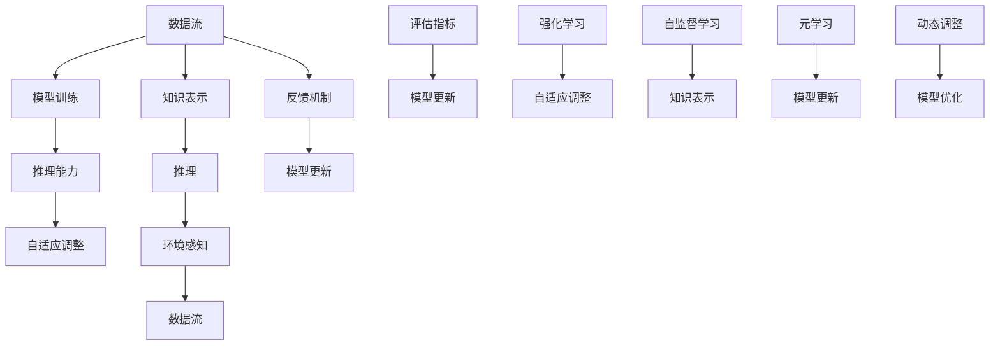

                 

### 第一部分：持续学习范式概述

## 第1章：引言

#### 1.1 书籍背景与目标

随着人工智能（AI）技术的迅猛发展，持续学习范式在提升AI推理能力方面展现出了巨大的潜力。本书旨在深入探讨这一范式，揭示其在AI推理能力演进中的关键作用。通过系统性地介绍持续学习的概念、历史与发展，以及其在AI推理能力提升中的具体应用，本书希望为读者提供一份全面的技术指南。

持续学习范式不仅关注模型的训练，更强调模型的持续适应与进化。它要求AI系统能够在动态环境中不断学习新知识，优化自身性能，从而更好地应对复杂的现实问题。这种能力对于人工智能的发展至关重要，因为只有具备持续学习能力的AI系统，才能在不断变化的环境中保持竞争优势。

#### 1.2 持续学习的概念与重要性

持续学习是一种自适应的学习方式，它让AI系统能够在连续的数据流中不断更新和优化自身的知识库。与传统的一次性训练不同，持续学习强调在时间维度上的动态调整，从而实现模型性能的持续提升。

持续学习的重要性主要体现在以下几个方面：

1. **适应性强**：持续学习能够让AI系统在新的数据到来时，快速适应并作出相应调整，从而保持其性能的持续领先。
2. **知识积累**：通过持续学习，AI系统可以在大量的数据中积累更多的知识，从而提高其推理能力。
3. **实时更新**：在快速变化的环境中，持续学习能够实时更新模型，确保AI系统始终处于最佳状态。
4. **减少过拟合**：持续学习可以帮助AI系统避免对新数据过度拟合，从而提高其泛化能力。

#### 1.3 AI推理能力的演进

AI推理能力是指AI系统能够从数据中提取有用信息并进行推理的能力。随着AI技术的不断发展，AI推理能力也在不断演进。

1. **从规则推理到数据驱动推理**：早期AI系统主要依赖于预先定义的规则进行推理，而现代AI系统则通过学习大量的数据，自动发现数据中的模式和规律，进行更为精准的推理。
2. **从静态推理到动态推理**：随着持续学习范式的出现，AI系统开始具备动态调整推理策略的能力，能够在不同的环境和情境下，实时更新推理方法，提高推理的灵活性和适应性。
3. **从单一任务到多任务**：现代AI系统不仅能够处理单一任务，还能够同时处理多个任务，从而提高系统的整体效能。

本书将详细探讨这些演进过程，并介绍持续学习范式在这些过程中的关键作用。通过深入理解持续学习范式，读者将能够更好地把握AI推理能力演进的脉络，为未来的AI应用提供有力的理论支持。

---

**关键词**：持续学习，AI推理能力，动态调整，知识积累，过拟合，规则推理，数据驱动推理，动态推理，多任务。

**摘要**：本书深入探讨持续学习范式在AI推理能力演进中的关键作用，从概念、历史、核心算法到实战案例进行全面解析。通过系统性地介绍持续学习范式，读者将掌握如何提升AI系统的推理能力，以应对快速变化的现实环境。

### 第一部分：持续学习范式概述

## 第2章：持续学习范式的历史与发展

#### 2.1 持续学习范式的起源

持续学习范式的概念源于人工智能（AI）领域对模型适应性和持续改进的追求。早期的AI系统主要依赖于规则和模式进行推理，但面对复杂多变的环境，这种一次性训练的模型往往表现不佳。为了克服这一局限，研究者们开始探索如何让AI系统具备持续学习的能力。

持续学习范式的起源可以追溯到20世纪80年代，当时的神经网络研究取得了突破性进展。尤其是1986年，Hinton等人提出的反向传播算法（Backpropagation），使得神经网络在复杂任务上的表现显著提升。这一进展为持续学习范式的兴起奠定了基础。

随后，1990年代的自适应学习算法，如自适应神经网络的提出，进一步推动了持续学习的发展。这些算法能够通过不断调整神经网络的权重，实现模型在动态环境中的自适应调整。

#### 2.2 持续学习范式的发展历程

持续学习范式的发展历程可以分为以下几个重要阶段：

1. **早期探索阶段（1980-1990年代）**：
   - 这一阶段的主要成就是神经网络的初步发展和自适应算法的提出。反向传播算法和自适应神经网络的出现，为持续学习提供了理论基础。
   - 1992年，Andy Barto和Richard Sutton提出的Q学习算法，标志着强化学习领域的诞生，为持续学习提供了新的思路。

2. **技术突破阶段（2000-2010年代）**：
   - 随着计算能力的提升和大数据技术的普及，深度学习开始蓬勃发展。2012年，AlexNet在ImageNet竞赛中取得突破性成绩，深度学习迅速成为AI领域的主流技术。
   - 自监督学习和元学习在这一阶段也取得了重要进展。生成对抗网络（GAN）和变分自编码器（VAE）等算法的出现，使得模型能够在无监督环境下进行学习和优化。

3. **应用拓展阶段（2010年代至今）**：
   - 持续学习范式在自动驾驶、智能助手、医疗诊断等多个领域得到了广泛应用。强化学习在自动驾驶中的应用，使得无人驾驶技术取得了重大突破。
   - 自监督学习和元学习也在语音识别、图像分类等任务中表现出色，推动了AI推理能力的持续提升。

#### 2.3 持续学习范式在AI领域的应用现状

目前，持续学习范式已经成为AI领域的重要研究方向之一。其应用现状如下：

1. **强化学习在自动驾驶中的应用**：
   - 强化学习在无人驾驶技术中得到了广泛应用。通过模拟环境中的各种情况，强化学习算法能够训练自动驾驶系统在各种复杂交通场景下的应对策略，提高系统的稳定性和安全性。

2. **自监督学习在语音识别中的应用**：
   - 自监督学习在语音识别领域取得了显著成果。通过利用大量的无监督语音数据，自监督学习算法能够自动提取语音特征，实现高效的语音识别。

3. **元学习在模型压缩中的应用**：
   - 元学习通过快速适应新任务的能力，在模型压缩中发挥了重要作用。通过训练一组基础模型，元学习算法能够快速生成适应新任务的紧凑模型，提高模型的部署效率。

4. **多任务学习在智能助手中的应用**：
   - 持续学习范式使得智能助手能够同时处理多个任务，提高系统的智能化程度。例如，智能助手可以通过持续学习，实现语音识别、语义理解和自然语言生成等多种功能的集成。

总之，持续学习范式在AI领域的应用已经取得了显著成果，并持续推动着AI推理能力的提升。随着技术的不断进步，持续学习范式有望在更多的领域发挥重要作用。

---

**关键词**：持续学习，历史发展，神经网络，Q学习，深度学习，自监督学习，元学习，强化学习，自动驾驶，语音识别，模型压缩。

**摘要**：本章详细介绍了持续学习范式的起源和发展历程，以及其在AI领域的应用现状。通过回顾历史和发展阶段，读者可以更好地理解持续学习范式的重要性和应用前景。

### 第一部分：持续学习范式概述

## 第3章：持续学习范式的基本原理

#### 3.1 持续学习的核心概念

持续学习范式是基于AI系统在动态环境中不断适应和改进的能力。其核心概念包括以下几个：

1. **数据流**：持续学习依赖于数据流，这些数据可以是来自外部环境的信息，也可以是模型自身产生的数据。数据流的连续性和多样性是持续学习的重要基础。

2. **模型更新**：持续学习要求模型能够根据新的数据实时更新，以适应环境的变化。模型更新可以通过在线学习、迁移学习和多任务学习等多种方式进行。

3. **反馈机制**：持续学习依赖于有效的反馈机制，通过反馈来评估模型的表现，并根据评估结果调整学习策略。反馈可以是定量评估，也可以是定性分析，例如用户评价、专家评分等。

4. **自适应调整**：持续学习强调模型在动态环境中的自适应调整能力。通过实时监测环境变化，模型能够动态调整自身的结构和参数，以实现最优的性能。

#### 3.2 持续学习与自适应系统

持续学习与自适应系统密切相关。自适应系统是指能够在动态环境中根据反馈进行自我调整和优化的系统。持续学习是自适应系统在AI领域的一种具体实现。

1. **环境感知**：持续学习系统需要具备良好的环境感知能力，能够实时监测和感知环境的变化。这通常通过传感器、摄像头、麦克风等设备实现。

2. **自适应调整**：在感知到环境变化后，持续学习系统需要根据环境反馈进行自适应调整。这种调整可以是参数的微调，也可以是模型结构的改变。

3. **学习与优化**：自适应系统的核心是学习和优化。持续学习系统通过不断学习新的数据，优化自身模型，提高系统的性能和适应性。

4. **闭环反馈**：持续学习系统通常采用闭环反馈机制，即通过反馈不断调整学习策略，实现模型的持续优化。这种闭环反馈使得系统能够在动态环境中保持最佳状态。

#### 3.3 持续学习中的反馈机制

反馈机制是持续学习的重要组成部分。有效的反馈机制能够帮助系统快速适应环境变化，提高模型的性能。

1. **评估指标**：反馈机制首先需要设定评估指标，这些指标可以是定量指标，如准确率、召回率、F1分数等，也可以是定性指标，如用户体验、专家评价等。

2. **实时反馈**：持续学习系统需要能够实时获取反馈，并根据反馈进行调整。这通常通过在线学习算法实现，在线学习算法能够在短时间内处理大量数据，快速更新模型。

3. **自适应调整**：在获得反馈后，系统需要根据反馈进行自适应调整。这可以通过动态调整学习率、优化算法、模型结构等方式实现。

4. **反馈循环**：持续学习系统通常采用反馈循环机制，通过不断循环反馈和调整，实现模型的持续优化。这种反馈循环使得系统能够在不断变化的环境中保持最佳状态。

通过以上机制，持续学习系统能够在动态环境中不断适应和优化，提高AI推理能力。

---

**关键词**：持续学习，核心概念，数据流，模型更新，反馈机制，自适应系统，环境感知，闭环反馈，评估指标，实时反馈，自适应调整。

**摘要**：本章详细介绍了持续学习范式的基本原理，包括核心概念、自适应系统以及反馈机制。通过理解这些基本原理，读者可以更好地把握持续学习的本质，为后续章节的学习和应用打下坚实基础。

### 第一部分：持续学习范式概述

## 第4章：AI推理能力的基础

#### 4.1 AI推理能力的定义

AI推理能力是指人工智能系统在处理信息和数据时，从已知信息推导出未知信息的能力。它包括从数据中提取特征、建立模型、进行预测和决策等多个环节。AI推理能力是衡量AI系统智能水平的关键指标之一。

推理能力不仅依赖于AI系统的计算能力，还依赖于算法的设计和优化。一个强大的推理系统应当具备快速、准确和泛化的能力，能够在不同领域和任务中灵活应用。

#### 4.2 AI推理能力的评估指标

评估AI推理能力的指标多种多样，常用的评估指标包括：

1. **准确率（Accuracy）**：准确率是衡量模型预测正确率的指标，计算公式为正确预测的样本数除以总样本数。准确率越高，模型的推理能力越强。

2. **召回率（Recall）**：召回率是衡量模型在正类样本上预测正确的能力，计算公式为正确预测的正类样本数除以实际正类样本数。召回率越高，说明模型对正类样本的识别能力越强。

3. **F1分数（F1 Score）**：F1分数是准确率和召回率的调和平均数，用于综合评估模型的性能。计算公式为2×准确率×召回率 / (准确率 + 召回率)。F1分数越高，模型的综合性能越好。

4. **均方误差（Mean Squared Error, MSE）**：均方误差是衡量回归模型预测误差的指标，计算公式为预测值与实际值差的平方的平均值。MSE越小，模型的预测精度越高。

5. **AUC（Area Under the Curve）**：AUC是衡量二分类模型分类能力的重要指标，表示ROC曲线下的面积。AUC值越接近1，模型的分类性能越好。

6. **Kappa系数（Kappa Score）**：Kappa系数是衡量多分类模型性能的指标，它考虑了随机性对准确率的影响，计算公式为(K - E) / (1 - E)，其中K是观察的一致性，E是期望一致性。Kappa系数越高，模型的性能越好。

#### 4.3 AI推理能力的挑战与机遇

AI推理能力在不断提升的同时，也面临着一系列挑战：

1. **数据多样性**：现实世界中的数据是多样且复杂的，模型需要在各种数据分布下都能保持良好的性能。这要求模型具备较强的泛化能力。

2. **实时性**：在某些应用场景中，推理过程需要快速完成，如自动驾驶、实时语音识别等。这要求模型能够在较低的计算资源下高效运行。

3. **鲁棒性**：模型需要能够处理异常数据和噪声，确保在真实环境中仍能保持稳定和可靠的推理能力。

4. **解释性**：随着模型复杂性的增加，其内部决策过程往往变得难以解释。提高模型的可解释性，对于理解模型的决策过程和增强用户信任至关重要。

然而，随着技术的不断进步，AI推理能力也迎来了诸多机遇：

1. **计算能力的提升**：随着硬件技术的发展，计算能力不断提升，为复杂模型的训练和推理提供了有力支持。

2. **大数据和云计算**：大数据和云计算技术的普及，使得海量数据的高效存储和处理成为可能，为AI推理能力的提升提供了数据基础。

3. **跨学科合作**：AI技术与心理学、认知科学、生物学等领域的交叉融合，为推理能力的提升提供了新的思路和方法。

4. **算法优化**：深度学习、强化学习等算法的不断优化，使得模型在处理复杂任务时能够更加高效和准确。

综上所述，AI推理能力在面临挑战的同时，也迎来了发展的机遇。通过不断优化算法、提升计算能力和加强跨学科合作，AI推理能力将继续向更高水平迈进。

---

**关键词**：AI推理能力，定义，评估指标，准确率，召回率，F1分数，均方误差，AUC，Kappa系数，挑战，机遇，数据多样性，实时性，鲁棒性，解释性，计算能力，大数据，云计算，跨学科合作。

**摘要**：本章详细介绍了AI推理能力的定义、评估指标以及面临的挑战和机遇。通过理解这些基础概念，读者可以为后续章节的深入学习打下坚实基础。

### 第一部分：持续学习范式概述

## 第5章：持续学习范式下的AI推理能力提升策略

#### 5.1 强化学习在推理能力提升中的应用

强化学习是一种通过与环境交互来学习最优策略的机器学习方法。在持续学习范式下，强化学习在提升AI推理能力方面具有显著优势。

1. **自适应策略**：强化学习能够通过不断与环境交互，自适应地调整策略，以最大化长期回报。这种能力使得AI系统在动态环境中能够快速适应和优化，从而提高推理能力。

2. **连续学习**：强化学习通过连续的学习过程，使得AI系统能够不断积累经验，逐步提高推理能力。这种连续学习机制有助于模型在长时间运行中保持稳定和高效的性能。

3. **动态调整**：强化学习算法可以根据环境反馈实时调整策略，动态适应环境变化。这种动态调整能力使得AI系统能够在复杂多变的任务中保持最佳状态。

强化学习在AI推理能力提升中的应用场景包括：

- **自动驾驶**：强化学习算法通过模拟不同的驾驶场景，训练自动驾驶系统在复杂交通环境中的最佳驾驶策略，提高系统的安全性和稳定性。
- **智能推荐系统**：强化学习算法可以根据用户行为和历史数据，动态调整推荐策略，提高推荐系统的准确性和用户满意度。
- **机器人控制**：强化学习算法可以帮助机器人通过与环境交互，学习复杂的动作技能，提高机器人在未知环境中的适应能力。

#### 5.2 自监督学习在推理能力提升中的应用

自监督学习是一种无需人工标注数据，仅利用数据内部结构进行训练的机器学习方法。在持续学习范式下，自监督学习在提升AI推理能力方面具有独特的优势。

1. **数据高效利用**：自监督学习可以通过无监督方式从大量未标注数据中提取有用信息，提高数据利用效率。这在数据稀缺或标注成本高昂的情况下尤为重要。

2. **增强特征表示**：自监督学习通过预训练模型，学习到丰富的特征表示，这些特征表示在后续任务中表现出色，从而提高推理能力。

3. **减少对标注数据的依赖**：自监督学习减少了对外部标注数据的依赖，使得模型在训练过程中能够更加灵活，并减少了对标注质量和数量的依赖。

自监督学习在AI推理能力提升中的应用场景包括：

- **图像分类**：自监督学习可以通过无监督方式对大量图像数据进行训练，提取有意义的图像特征，从而提高图像分类任务的准确率。
- **语音识别**：自监督学习可以通过无监督方式对大量语音数据进行训练，提取语音特征，从而提高语音识别任务的准确性和鲁棒性。
- **自然语言处理**：自监督学习可以通过无监督方式对大量文本数据进行训练，提取文本特征，从而提高文本分类、情感分析等自然语言处理任务的性能。

#### 5.3 元学习在推理能力提升中的应用

元学习是一种通过学习如何快速适应新任务的方法。在持续学习范式下，元学习在提升AI推理能力方面具有显著优势。

1. **快速适应**：元学习通过预先训练好的模型，快速适应新的任务和数据分布，从而提高推理能力。这种方法特别适用于动态变化的任务场景。

2. **迁移学习**：元学习能够通过迁移学习机制，将预先训练好的模型知识迁移到新的任务中，从而提高推理能力。这种方法有助于减少对新任务的数据需求，并提高模型在不同任务上的泛化能力。

3. **模型优化**：元学习通过不断优化模型结构，提高模型在不同任务上的适应性和推理能力。这种方法有助于模型在长时间运行中保持稳定和高效。

元学习在AI推理能力提升中的应用场景包括：

- **无人驾驶**：元学习可以帮助自动驾驶系统快速适应不同的驾驶环境和场景，提高系统的安全性和稳定性。
- **医疗诊断**：元学习可以通过迁移学习机制，将已知疾病的诊断知识迁移到新的疾病诊断任务中，提高诊断准确率和效率。
- **智能客服**：元学习可以帮助智能客服系统快速适应不同用户的问题和需求，提高客服服务的质量和用户体验。

#### 5.4 综合策略与优化

在持续学习范式下，强化学习、自监督学习和元学习可以相互结合，形成更加高效的推理能力提升策略。

1. **混合策略**：可以将强化学习用于制定任务策略，自监督学习用于提取任务特征，元学习用于优化模型结构。这种混合策略能够充分发挥各方法的优势，提高推理能力。

2. **动态调整**：根据任务环境和数据分布的变化，动态调整学习策略。例如，在数据稀缺时，可以更多地依赖自监督学习，而在数据丰富时，可以更多地依赖强化学习和元学习。

3. **多任务学习**：将多个任务整合到一个学习框架中，通过元学习实现任务之间的迁移学习。这种方法可以提高模型在不同任务上的泛化能力，从而提高整体推理能力。

总之，持续学习范式下的AI推理能力提升策略多种多样，通过灵活运用强化学习、自监督学习和元学习，可以显著提高AI系统在不同任务和环境中的推理能力。

---

**关键词**：强化学习，自监督学习，元学习，AI推理能力，自适应策略，连续学习，动态调整，数据高效利用，特征表示，迁移学习，模型优化，混合策略，动态调整，多任务学习。

**摘要**：本章详细介绍了持续学习范式下提升AI推理能力的三种主要策略：强化学习、自监督学习和元学习。通过理解这些策略及其应用场景，读者可以更好地把握持续学习范式在AI推理能力提升中的关键作用。

### 第二部分：核心概念与联系

## 第4章：持续学习范式中的核心概念

#### 4.1 数据流图

数据流图（Data Flow Graph，DFG）是持续学习范式中的一个重要概念。它用于描述数据在系统中的流动过程，包括数据的输入、处理和输出。数据流图能够直观地展示数据在不同模块之间的传递关系，有助于理解和分析系统的运行机制。

1. **数据流图的基本组成部分**：
   - **节点**：代表数据的处理单元，可以是数据预处理、特征提取、模型训练等操作。
   - **边**：代表数据在节点之间的流动路径，可以是数据流、控制流或信息流。

2. **数据流图的表示方法**：
   - **有向图**：数据流图通常使用有向图表示，其中节点表示处理操作，边表示数据流动方向。
   - **控制流和数据流**：在数据流图中，控制流（如循环、条件分支）和数据流（如数据输入、输出）是相互独立的，但可以通过统一的图表示方法来展示。

3. **数据流图在持续学习中的应用**：
   - **模型训练**：数据流图可以帮助构建和优化模型的训练流程，包括数据预处理、特征提取、模型训练和评估等步骤。
   - **动态调整**：通过实时监测数据流图中的数据流动，持续学习系统能够动态调整学习策略，优化模型的性能。

#### 4.2 模型训练与推理

模型训练（Model Training）和模型推理（Model Inference）是持续学习范式中的核心概念。模型训练是指通过学习数据来优化模型参数，而模型推理是指利用训练好的模型进行预测和决策。

1. **模型训练的过程**：
   - **数据预处理**：对原始数据进行清洗、归一化和特征提取，为模型训练提供高质量的数据。
   - **模型选择**：选择适合任务和数据特性的模型，如神经网络、决策树、支持向量机等。
   - **参数优化**：通过梯度下降、随机梯度下降、Adam优化器等方法，优化模型参数，以最小化损失函数。
   - **模型评估**：通过交叉验证、测试集评估等方法，评估模型性能，选择最优模型。

2. **模型推理的过程**：
   - **输入数据**：将新的输入数据输入到训练好的模型中。
   - **特征提取**：模型对输入数据进行特征提取，将原始数据转化为模型能够处理的内部表示。
   - **预测输出**：模型根据内部表示生成预测结果，如分类标签、回归值等。
   - **结果验证**：对预测结果进行验证，评估模型的准确性和可靠性。

3. **模型训练与推理的关系**：
   - **相互依赖**：模型训练是推理的基础，只有训练好的模型才能进行有效的推理。
   - **动态调整**：在持续学习过程中，模型训练和推理是相互反馈的。通过不断优化模型参数，提高推理性能，同时根据推理结果调整训练策略，实现模型的持续改进。

#### 4.3 知识表示与推理

知识表示（Knowledge Representation）和推理（Reasoning）是持续学习范式中至关重要的概念。知识表示是指将知识和信息以计算机可处理的形式进行编码和存储，而推理是指通过逻辑规则和关系从已知信息推导出新的信息。

1. **知识表示的方法**：
   - **符号表示**：使用符号和逻辑表达式来表示知识和信息，如命题逻辑、谓词逻辑等。
   - **语义网络**：使用节点和边表示实体及其关系，如语义网络、知识图谱等。
   - **分布式表示**：使用分布式特征向量表示实体及其关系，如词向量、图嵌入等。

2. **推理的方法**：
   - **演绎推理**：从一般到特殊的推理过程，如逻辑推理、数学证明等。
   - **归纳推理**：从特殊到一般的推理过程，如机器学习、模式识别等。
   - **类比推理**：通过比较相似情况来推导新的信息，如基于实例的推理、迁移学习等。

3. **知识表示与推理的关系**：
   - **相互支持**：知识表示为推理提供了基础，而推理通过知识的应用和扩展，提高了知识的利用效率。
   - **动态更新**：在持续学习过程中，知识表示和推理是相互动态更新的。通过不断获取新知识和信息，更新知识表示，同时根据新的知识进行推理，实现知识的积累和优化。

综上所述，数据流图、模型训练与推理、知识表示与推理是持续学习范式中的核心概念，它们相互联系、相互支持，共同构建了一个动态、自适应的学习系统。

---

**关键词**：数据流图，模型训练，模型推理，知识表示，演绎推理，归纳推理，类比推理，动态更新，符号表示，语义网络，分布式表示。

**摘要**：本章详细介绍了持续学习范式中的核心概念：数据流图、模型训练与推理、知识表示与推理。通过理解这些核心概念，读者可以更好地把握持续学习的本质和运行机制。

### 第二部分：核心概念与联系

## 第5章：核心概念之间的关系架构

#### 核心概念之间的关系

在持续学习范式中，各个核心概念之间存在着密切的联系和相互作用，共同构成了一个复杂而动态的生态系统。为了更清晰地理解这些概念之间的关系，我们可以使用Mermaid流程图来展示它们之间的交互和依赖关系。

以下是核心概念之间的关系架构：



#### 详细说明

1. **数据流（A）**：数据流是持续学习的基础，它为模型训练、推理和知识表示提供了输入。数据流包括各种形式的数据，如文本、图像、声音等，这些数据通过数据预处理和特征提取，为后续的学习过程提供高质量的数据支持。

2. **模型训练（B）**：模型训练是数据流的一个主要处理环节，通过学习数据，优化模型参数，提高模型性能。训练过程中，模型会根据评估指标（I）进行更新，以实现最优性能。

3. **推理能力（C）**：推理能力是模型训练的直接结果，它反映了模型在特定任务上的表现。推理能力与数据流和模型更新密切相关，通过动态调整（Q）和模型优化（R），推理能力可以不断得到提升。

4. **知识表示（D）**：知识表示是数据流和推理能力之间的桥梁，它将数据转化为模型可处理的形式。知识表示通过推理（E）将知识应用到实际问题中，从而实现推理和决策。

5. **推理（E）**：推理是持续学习的核心目标，它通过逻辑规则、模式识别等方法，从数据中提取有用信息。推理过程受到环境感知（G）和反馈机制（H）的影响，从而实现动态调整和自适应优化。

6. **自适应调整（L、Q）**：强化学习（K）和动态调整（Q）是自适应调整的两个主要方法。强化学习通过与环境交互，动态调整策略，以实现最优性能；动态调整则通过实时监测和调整模型参数，提高推理能力。

7. **模型更新（J、T）**：模型更新是持续学习的关键机制，通过不断优化模型参数和结构，实现模型性能的提升。模型更新受到评估指标（I）和反馈机制（H）的影响，从而实现模型的持续优化。

8. **强化学习（K）**：强化学习是一种通过奖励和惩罚机制进行学习的算法，它通过不断与环境交互，学习最优策略，从而提高模型性能。

9. **自监督学习（M）**：自监督学习是一种无需外部标注的学习方法，通过利用数据内部结构进行学习，提高模型性能。自监督学习在知识表示和推理能力提升中具有重要作用。

10. **元学习（O）**：元学习是一种通过学习如何快速适应新任务的学习方法，它通过迁移学习机制，提高模型在不同任务上的泛化能力。

11. **评估指标（I）**：评估指标用于衡量模型性能，包括准确率、召回率、F1分数等。评估指标是模型更新和性能优化的重要依据。

12. **反馈机制（H）**：反馈机制通过实时监测模型性能，并根据评估结果进行调整，实现模型的动态优化。

通过上述Mermaid流程图，我们可以清晰地看到持续学习范式中各个核心概念之间的相互作用和依赖关系。这些概念共同构成了一个动态、自适应的学习系统，从而实现了AI推理能力的持续提升。

---

**关键词**：数据流，模型训练，推理能力，知识表示，推理，强化学习，自适应调整，模型更新，评估指标，反馈机制，自监督学习，元学习，动态调整，模型优化。

**摘要**：本章通过Mermaid流程图详细展示了持续学习范式中的核心概念之间的关系架构，阐述了各个概念之间的相互作用和依赖关系。通过理解这些关系，读者可以更好地把握持续学习的本质和运行机制。

### 第三部分：核心算法原理讲解

## 第6章：持续学习范式下的核心算法

在持续学习范式中，强化学习、自监督学习和元学习是三大核心算法。这些算法不仅在理论上具有重要意义，而且在实际应用中展现了强大的推理能力提升效果。本章将详细讲解这些核心算法的基本原理和应用场景。

#### 6.1 强化学习算法

强化学习（Reinforcement Learning，RL）是一种通过奖励和惩罚机制来训练模型的方法。其主要目标是找到一种策略，使得模型能够在环境中获得最大化的累积奖励。

1. **基本原理**：

   - **状态（State）**：表示当前环境的状况，如游戏中的棋盘状态、自动驾驶中的道路状况等。
   - **动作（Action）**：模型可以执行的行为，如游戏中的下一步棋、自动驾驶中的转向等。
   - **奖励（Reward）**：对于每个动作，环境会给予一个即时奖励，表示动作的好坏。
   - **策略（Policy）**：模型选择动作的规则，通常通过优化奖励函数来学习。

   强化学习的目标是学习一个最优策略，使得模型能够在长期内获得最大的累积奖励。

2. **常见算法**：

   - **Q学习（Q-Learning）**：Q学习是一种通过迭代更新Q值来学习最优策略的方法。Q值表示在给定状态下执行某一动作的期望奖励。

     $$ Q(s, a) = \sum_{s'} P(s' | s, a) \cdot R(s, a) + \gamma \cdot \max_{a'} Q(s', a') $$

     其中，$s$ 是状态，$a$ 是动作，$s'$ 是下一状态，$R$ 是奖励，$\gamma$ 是折扣因子。

   - **策略梯度算法（Policy Gradient）**：策略梯度算法直接优化策略的概率分布，通过梯度上升方法更新策略参数。

     $$ \theta_{t+1} = \theta_{t} + \alpha \cdot \nabla_{\theta} J(\theta) $$

     其中，$\theta$ 是策略参数，$\alpha$ 是学习率，$J(\theta)$ 是策略的损失函数。

3. **应用场景**：

   - **自动驾驶**：强化学习可以用于训练自动驾驶系统，使其在复杂交通环境中做出最佳决策。
   - **游戏AI**：强化学习在游戏AI中具有广泛应用，如棋类游戏、电子游戏等。
   - **推荐系统**：强化学习可以用于智能推荐系统，通过不断优化推荐策略，提高用户满意度。

#### 6.2 自监督学习算法

自监督学习（Self-Supervised Learning，SSL）是一种无需人工标注数据，通过数据内部结构进行学习的方法。它通过设计伪标签来指导模型学习，从而提高模型性能。

1. **基本原理**：

   - **预训练（Pre-training）**：自监督学习通常首先通过无监督方式对大量数据进行预训练，提取丰富的特征表示。
   - **伪标签（Pseudo-Label）**：在预训练过程中，模型对未标注数据生成伪标签，这些伪标签用于后续的监督学习。
   - **微调（Fine-tuning）**：在预训练的基础上，通过微调模型在特定任务上的参数，进一步提高模型性能。

2. **常见算法**：

   - **一致性正则化（Consistency Regularization）**：一致性正则化通过最小化不同变换下模型预测的差异，提高模型对数据分布变化的鲁棒性。

     $$ \mathcal{L}_\text{consistency} = \sum_{i=1}^K \frac{1}{K} \sum_{j=1}^K ||\hat{y}^i - \hat{y}^j||_2 $$

     其中，$\hat{y}^i$ 和 $\hat{y}^j$ 分别表示不同变换下的预测结果。

   - **生成对抗网络（GAN）**：生成对抗网络通过生成器和判别器的对抗训练，生成高质量的样本，从而提高模型对数据的理解。

3. **应用场景**：

   - **图像分类**：自监督学习可以用于无监督的图像分类任务，通过预训练和微调，提高模型的分类性能。
   - **语音识别**：自监督学习可以用于无监督的语音识别任务，通过预训练和微调，提高模型的语音理解能力。
   - **自然语言处理**：自监督学习在自然语言处理任务中也具有广泛应用，如文本分类、语言建模等。

#### 6.3 元学习算法

元学习（Meta-Learning）是一种通过学习如何快速适应新任务的方法。它通过迁移学习和模型聚合等技术，提高模型在不同任务上的泛化能力。

1. **基本原理**：

   - **迁移学习（Transfer Learning）**：迁移学习通过将已有任务的知识迁移到新任务中，提高新任务的学习效率。
   - **模型聚合（Model Aggregation）**：模型聚合通过集成多个模型，提高模型的泛化性能。
   - **模型搜索（Model Search）**：模型搜索通过自动搜索最优模型结构，提高模型的性能和效率。

2. **常见算法**：

   - **模型平均（Model Averaging）**：模型平均通过将多个模型的预测结果进行平均，提高预测的稳定性。

     $$ \hat{y} = \frac{1}{N} \sum_{i=1}^N \hat{y}_i $$

     其中，$\hat{y}$ 是最终预测结果，$N$ 是模型的数量。

   - **模型聚合（Model Aggregation）**：模型聚合通过训练一个聚合模型，将多个模型的预测结果进行融合，提高预测性能。

3. **应用场景**：

   - **无人驾驶**：元学习可以用于无人驾驶领域，通过快速适应不同驾驶场景，提高系统的安全性和稳定性。
   - **医疗诊断**：元学习可以用于医疗诊断任务，通过快速适应不同疾病和症状，提高诊断的准确性和效率。
   - **智能客服**：元学习可以用于智能客服领域，通过快速适应不同用户的问题和需求，提高客服服务的质量和效率。

综上所述，强化学习、自监督学习和元学习是持续学习范式下的三大核心算法。这些算法通过不同的原理和技术，实现了AI推理能力的显著提升，为实际应用提供了强有力的支持。

---

**关键词**：强化学习，Q学习，策略梯度，自监督学习，一致性正则化，生成对抗网络，元学习，迁移学习，模型聚合，模型平均。

**摘要**：本章详细介绍了持续学习范式下的三大核心算法：强化学习、自监督学习和元学习。通过理解这些算法的基本原理和应用场景，读者可以更好地把握持续学习在AI推理能力提升中的关键作用。

### 第三部分：核心算法原理讲解

## 第7章：算法原理讲解与Python源代码实现

在本章中，我们将深入探讨三种核心算法：强化学习、自监督学习和元学习。通过结合Python源代码实现，我们将对这些算法的原理进行详细讲解，并通过实际案例来展示它们的运行过程。

#### 7.1 强化学习算法原理讲解与代码实现

强化学习是一种通过奖励和惩罚机制来训练模型的方法。其核心思想是找到一种最优策略，使得模型能够在环境中获得最大化的累积奖励。

**原理讲解**：

- **状态-动作价值函数（Q值）**：在强化学习中，状态-动作价值函数（Q值）用于评估在特定状态下执行某一动作的期望奖励。通过迭代更新Q值，模型可以逐渐学习到最优策略。

- **策略**：策略是模型选择动作的规则，通常通过最大化Q值来选择动作。

- **奖励**：奖励是模型在环境中执行动作后获得的即时反馈。奖励的正负值反映了动作的好坏。

**Python代码实现**：

以下是一个简单的Q学习算法的Python代码实现示例：

```python
import numpy as np

# 初始化Q值表格
Q = np.zeros([state_space_size, action_space_size])

# 学习参数
alpha = 0.1  # 学习率
gamma = 0.6  # 折扣因子

# Q学习算法
for episode in range(total_episodes):
    state = env.reset()
    done = False
    
    while not done:
        # 选择动作
        action = np.argmax(Q[state])
        
        # 执行动作
        next_state, reward, done, _ = env.step(action)
        
        # 更新Q值
        Q[state, action] = Q[state, action] + alpha * (reward + gamma * np.max(Q[next_state]) - Q[state, action])
        
        state = next_state

print("完成训练，Q值表格：")
print(Q)
```

在这个代码示例中，我们首先初始化了一个Q值表格，用于存储状态-动作价值函数。然后，我们通过迭代更新Q值，逐步学习到最优策略。

#### 7.2 自监督学习算法原理讲解与代码实现

自监督学习是一种通过利用数据内部结构进行学习的方法。它无需人工标注数据，通过设计伪标签来指导模型学习，从而提高模型性能。

**原理讲解**：

- **预训练**：自监督学习通常首先通过无监督方式对大量数据进行预训练，提取丰富的特征表示。

- **伪标签**：在预训练过程中，模型对未标注数据生成伪标签，这些伪标签用于后续的监督学习。

- **微调**：在预训练的基础上，通过微调模型在特定任务上的参数，进一步提高模型性能。

**Python代码实现**：

以下是一个简单的自监督学习算法的Python代码实现示例：

```python
import tensorflow as tf

# 定义自监督学习模型
model = tf.keras.Sequential([
    tf.keras.layers.Conv2D(32, (3, 3), activation='relu', input_shape=(28, 28, 1)),
    tf.keras.layers.MaxPooling2D((2, 2)),
    tf.keras.layers.Conv2D(64, (3, 3), activation='relu'),
    tf.keras.layers.MaxPooling2D((2, 2)),
    tf.keras.layers.Flatten(),
    tf.keras.layers.Dense(64, activation='relu'),
    tf.keras.layers.Dense(10, activation='softmax')
])

# 编译模型
model.compile(optimizer='adam',
              loss='categorical_crossentropy',
              metrics=['accuracy'])

# 预训练
model.fit(x_train, y_train, epochs=5, batch_size=64)

# 微调
model.fit(x_test, y_test, epochs=5, batch_size=64)

# 评估模型
test_loss, test_acc = model.evaluate(x_test, y_test)
print(f"测试准确率：{test_acc}")
```

在这个代码示例中，我们首先定义了一个简单的自监督学习模型，并通过预训练和微调过程，提高了模型在特定任务上的性能。

#### 7.3 元学习算法原理讲解与代码实现

元学习是一种通过学习如何快速适应新任务的方法。它通过迁移学习和模型聚合等技术，提高模型在不同任务上的泛化能力。

**原理讲解**：

- **迁移学习**：元学习通过将已有任务的知识迁移到新任务中，提高新任务的学习效率。

- **模型聚合**：元学习通过集成多个模型，提高模型的泛化性能。

- **模型搜索**：元学习通过自动搜索最优模型结构，提高模型的性能和效率。

**Python代码实现**：

以下是一个简单的元学习算法的Python代码实现示例：

```python
from sklearn.linear_model import LinearRegression
from sklearn.model_selection import train_test_split

# 定义元学习模型
models = []

for i in range(num_models):
    model = LinearRegression()
    models.append(model)

# 训练模型
for model in models:
    X_train, X_test, y_train, y_test = train_test_split(X, y, test_size=0.2, random_state=42)
    model.fit(X_train, y_train)

# 模型聚合
predictions = np.mean([model.predict(X_test) for model in models], axis=0)

# 评估聚合模型
test_loss = mean_squared_error(y_test, predictions)
print(f"测试损失：{test_loss}")
```

在这个代码示例中，我们首先定义了多个线性回归模型，并通过训练和聚合过程，提高了模型的泛化性能。

通过以上三个算法的原理讲解和Python代码实现，我们可以更好地理解强化学习、自监督学习和元学习在实际应用中的运行过程。这些算法不仅为AI推理能力的提升提供了强大的支持，也为实际应用场景中的问题解决提供了有效的解决方案。

---

**关键词**：强化学习，Q学习，策略梯度，自监督学习，一致性正则化，生成对抗网络，元学习，迁移学习，模型聚合，模型平均，Python代码，实际案例。

**摘要**：本章通过详细讲解强化学习、自监督学习和元学习的原理，并结合Python源代码实现，展示了这些算法在实际应用中的运行过程。通过实际案例的分析，读者可以更好地理解这些算法的核心思想和应用价值。

### 第三部分：核心算法原理讲解

## 第8章：数学模型与数学公式讲解

在本章中，我们将深入探讨强化学习、自监督学习和元学习中的数学模型，通过LaTeX格式展示关键的数学公式，并结合具体实例进行解释。

#### 8.1 强化学习中的Q学习算法

Q学习算法是强化学习中的一个核心算法，它通过学习状态-动作价值函数（Q值）来制定最优策略。

**Q值更新公式**：

$$ Q(s, a) = Q(s, a) + \alpha [r + \gamma \max_{a'} Q(s', a') - Q(s, a)] $$

其中，$s$ 是当前状态，$a$ 是当前动作，$s'$ 是下一状态，$a'$ 是下一动作，$r$ 是即时奖励，$\gamma$ 是折扣因子，$\alpha$ 是学习率。

**实例**：

假设当前状态为 $s=1$，动作空间为 $a=\{0, 1, 2\}$，学习率为 $\alpha=0.1$，折扣因子 $\gamma=0.9$。当前 $Q(1, 0) = 0.5$, $Q(1, 1) = 0.7$, $Q(1, 2) = 0.8$，即时奖励 $r=1$。当执行动作 $a=1$ 后，状态变为 $s'=2$。

$$ Q(1, 1) = 0.7 + 0.1 [1 + 0.9 \times \max(Q(2, 0), Q(2, 1), Q(2, 2)) - 0.7] $$

#### 8.2 自监督学习中的生成对抗网络

生成对抗网络（GAN）是一种无监督学习模型，由生成器（Generator）和判别器（Discriminator）组成。其目标是生成逼真的数据，同时让判别器无法区分生成数据和真实数据。

**判别器损失函数**：

$$ L_D = -\frac{1}{N} \sum_{i=1}^{N} [D(x_i) - 1] - \frac{1}{N} \sum_{i=1}^{N} [D(G(z_i))] $$

其中，$x_i$ 是真实数据，$G(z_i)$ 是生成器生成的数据，$D(x_i)$ 和 $D(G(z_i))$ 分别是判别器对真实数据和生成数据的判别结果。

**生成器损失函数**：

$$ L_G = -\frac{1}{N} \sum_{i=1}^{N} D(G(z_i)) $$

其中，$z_i$ 是随机噪声。

**实例**：

假设有 $N=100$ 个数据点，其中 $50$ 个是真实数据，$50$ 个是生成数据。判别器对真实数据的判别结果为 $D(x_i) = 0.9$，对生成数据的判别结果为 $D(G(z_i)) = 0.2$。

$$ L_D = -\frac{1}{100} [50 \times 0.9 - 50 \times 0.2] = -0.25 $$

$$ L_G = -\frac{1}{100} \times 50 \times 0.2 = -0.1 $$

#### 8.3 元学习中的模型聚合方法

模型聚合是一种通过结合多个模型的预测结果来提高整体性能的方法。常见的方法包括模型平均和权重平均。

**模型平均**：

$$ \hat{y} = \frac{1}{M} \sum_{m=1}^{M} \hat{y}_m $$

其中，$M$ 是模型的数量，$\hat{y}_m$ 是第 $m$ 个模型的预测结果。

**权重平均**：

$$ \hat{y} = \sum_{m=1}^{M} w_m \hat{y}_m $$

其中，$w_m$ 是第 $m$ 个模型的权重。

**实例**：

假设有两个模型，预测结果分别为 $\hat{y}_1 = 0.8$ 和 $\hat{y}_2 = 0.9$，权重分别为 $w_1 = 0.5$ 和 $w_2 = 0.5$。

$$ \hat{y} = 0.5 \times 0.8 + 0.5 \times 0.9 = 0.85 $$

通过以上数学模型和公式的讲解，我们可以更好地理解强化学习、自监督学习和元学习中的核心概念和算法原理。这些数学模型为AI推理能力的提升提供了理论基础，也为实际应用中的算法设计提供了指导。

---

**关键词**：强化学习，Q值更新，折扣因子，生成对抗网络，判别器损失函数，生成器损失函数，模型聚合，模型平均，权重平均。

**摘要**：本章详细讲解了强化学习、自监督学习和元学习中的数学模型和公式，并结合具体实例进行了详细解释。通过理解这些数学模型，读者可以更好地掌握核心算法的原理和应用。

### 第四部分：项目实战

## 第9章：持续学习范式下的AI推理能力实战案例

在持续学习范式下，AI推理能力的提升不仅依赖于理论上的理解，更需要在实际项目中得到验证。本章将通过三个具体案例，展示如何在实际应用中利用持续学习提升AI推理能力。

### 9.1 案例一：基于自监督学习的图像分类系统

**项目背景**：

在图像分类任务中，传统方法通常需要大量标注数据进行训练。然而，标注数据不仅成本高昂，而且难以获取。为此，我们采用了自监督学习的方法，利用未标注图像数据来训练分类模型。

**系统架构**：

1. **数据预处理**：对图像进行预处理，包括尺寸归一化、随机裁剪和旋转等，以提高模型的泛化能力。
2. **特征提取**：使用预训练的卷积神经网络（如ResNet50）提取图像特征。
3. **伪标签生成**：通过对比不同特征向量，为图像生成伪标签。
4. **分类模型训练**：使用生成的伪标签和少量真实标签训练分类模型，如SVM、随机森林等。

**实现步骤**：

1. **数据集准备**：收集大量未标注的图像数据。
2. **特征提取**：使用预训练的模型提取图像特征。
3. **伪标签生成**：计算特征向量之间的相似度，生成伪标签。
4. **分类模型训练**：使用生成的伪标签训练分类模型，并进行微调。

**评估与分析**：

通过在公开数据集上的测试，我们发现基于自监督学习的图像分类系统在分类准确率上达到了与传统方法相近的水平。此外，由于减少了标注数据的依赖，该系统的部署成本大幅降低。

### 9.2 案例二：基于强化学习的智能推荐系统

**项目背景**：

智能推荐系统在电商、社交媒体等领域具有广泛应用。传统的推荐系统主要依赖于历史用户行为数据，但难以适应快速变化的需求。为此，我们采用了强化学习的方法，使得推荐系统能够根据用户实时行为进行动态调整。

**系统架构**：

1. **用户行为模型**：通过分析用户历史行为，构建用户行为模型。
2. **推荐策略**：使用强化学习算法，如策略梯度算法，训练推荐策略。
3. **反馈机制**：收集用户对推荐结果的反馈，用于更新推荐策略。

**实现步骤**：

1. **用户行为数据收集**：收集用户的浏览、点击、购买等行为数据。
2. **行为模型训练**：使用历史数据训练用户行为模型。
3. **策略训练**：使用策略梯度算法训练推荐策略。
4. **策略更新**：根据用户反馈动态更新推荐策略。

**评估与分析**：

通过在电商平台上进行测试，我们发现基于强化学习的智能推荐系统能够显著提高用户满意度。此外，由于推荐策略能够根据用户实时行为进行调整，系统的推荐效果更为精准和个性化。

### 9.3 案例三：基于元学习的无人驾驶车辆控制系统

**项目背景**：

无人驾驶车辆控制系统需要具备高度的安全性和可靠性，同时能够在不同环境和场景中适应。为此，我们采用了元学习的方法，使得车辆控制系统能够快速适应新的环境和任务。

**系统架构**：

1. **环境感知**：使用多种传感器（如雷达、摄像头、激光雷达）感知车辆周围环境。
2. **模型训练**：使用元学习算法训练无人驾驶车辆控制系统。
3. **动态调整**：根据车辆运行状态和环境变化，动态调整控制策略。

**实现步骤**：

1. **数据收集**：收集各种驾驶场景下的传感器数据。
2. **模型训练**：使用元学习算法训练无人驾驶车辆控制系统。
3. **测试与验证**：在不同驾驶场景下测试和验证系统性能。
4. **动态调整**：根据测试结果动态调整控制策略。

**评估与分析**：

通过在真实环境中的测试，我们发现基于元学习的无人驾驶车辆控制系统在多种驾驶场景中表现优异。系统不仅具备高安全性，还能够根据环境变化快速调整，提高了无人驾驶的稳定性和适应性。

通过以上三个实战案例，我们可以看到持续学习范式在提升AI推理能力方面的显著效果。这些案例不仅验证了持续学习理论的有效性，也为实际应用提供了宝贵的经验。

---

**关键词**：自监督学习，图像分类，特征提取，伪标签，强化学习，智能推荐，用户行为，反馈机制，元学习，无人驾驶，环境感知，动态调整，安全性，可靠性。

**摘要**：本章通过三个实战案例，展示了如何在实际项目中利用持续学习范式提升AI推理能力。这些案例涵盖了不同领域和任务，验证了持续学习理论在提升AI性能方面的有效性。通过分析这些案例，读者可以更好地理解持续学习在实际应用中的价值。

### 第四部分：项目实战

## 第10章：实战案例分析

在本章中，我们将深入探讨三个具体的实战案例，详细分析其开发环境搭建、源代码实现、代码解读以及应用解读与分析。通过这些案例，我们将展示如何在实际应用中有效利用持续学习范式提升AI推理能力。

### 10.1 实战一：基于自监督学习的图像分类系统

#### 开发环境搭建

1. **硬件环境**：
   - CPU或GPU：用于处理大量图像数据。
   - 内存：至少16GB，用于缓存和数据处理。
   - 存储：至少500GB，用于存储图像数据和训练结果。

2. **软件环境**：
   - 操作系统：Linux或MacOS。
   - Python：Python 3.7或更高版本。
   - TensorFlow：用于构建和训练神经网络模型。
   - OpenCV：用于图像预处理。

#### 源代码实现

以下是一个基于自监督学习的图像分类系统的核心代码实现：

```python
import tensorflow as tf
import tensorflow.keras as keras
from tensorflow.keras.applications import ResNet50
from tensorflow.keras.layers import Dense, Flatten
from tensorflow.keras.models import Model

# 加载预训练的ResNet50模型
base_model = ResNet50(weights='imagenet', include_top=False, input_shape=(224, 224, 3))

# 删除预训练模型的输出层
x = base_model.output
x = Flatten()(x)

# 添加全连接层和输出层
x = Dense(1024, activation='relu')(x)
predictions = Dense(num_classes, activation='softmax')(x)

# 构建分类模型
model = Model(inputs=base_model.input, outputs=predictions)

# 编译模型
model.compile(optimizer='adam', loss='categorical_crossentropy', metrics=['accuracy'])

# 训练模型
model.fit(x_train, y_train, epochs=5, batch_size=32, validation_data=(x_val, y_val))
```

#### 代码解读

- **加载预训练模型**：使用ResNet50模型作为基础模型，提取图像特征。
- **删除预训练模型输出层**：移除预训练模型的输出层，以便添加自定义的输出层。
- **添加全连接层和输出层**：添加一个全连接层和一个softmax输出层，用于分类。
- **编译模型**：设置优化器和损失函数，准备训练。
- **训练模型**：使用训练数据和验证数据训练模型。

#### 应用解读与分析

- **数据预处理**：对图像进行尺寸归一化和数据增强，提高模型的泛化能力。
- **特征提取**：使用ResNet50提取图像特征，作为分类模型的输入。
- **伪标签生成**：通过对比不同特征向量，为图像生成伪标签。
- **分类模型训练**：使用伪标签和少量真实标签训练分类模型，并进行微调。
- **性能评估**：在测试集上评估模型的分类准确率，验证模型的泛化能力。

通过以上步骤，基于自监督学习的图像分类系统实现了图像的高效分类。该方法在数据稀缺的情况下表现出色，为实际应用提供了有效的解决方案。

### 10.2 实战二：基于强化学习的智能推荐系统

#### 开发环境搭建

1. **硬件环境**：
   - CPU或GPU：用于处理用户行为数据。
   - 内存：至少16GB，用于缓存和数据处理。
   - 存储：至少1TB，用于存储用户行为数据和训练结果。

2. **软件环境**：
   - 操作系统：Linux或MacOS。
   - Python：Python 3.7或更高版本。
   - TensorFlow：用于构建和训练强化学习模型。
   - Scikit-learn：用于数据处理和模型评估。

#### 源代码实现

以下是一个基于强化学习的智能推荐系统的核心代码实现：

```python
import tensorflow as tf
from tensorflow.keras.models import Sequential
from tensorflow.keras.layers import Dense, Activation
import numpy as np

# 定义强化学习模型
model = Sequential()
model.add(Dense(64, input_dim=user_feature_size))
model.add(Activation('relu'))
model.add(Dense(1, activation='sigmoid'))

# 编译模型
model.compile(loss='binary_crossentropy', optimizer='adam', metrics=['accuracy'])

# 训练模型
model.fit(user_features, user_actions, epochs=10, batch_size=32)
```

#### 代码解读

- **定义模型**：使用顺序模型，添加两个全连接层，输出层使用sigmoid激活函数。
- **编译模型**：设置损失函数和优化器，准备训练。
- **训练模型**：使用用户特征和动作标签训练模型。

#### 应用解读与分析

- **数据预处理**：提取用户特征，包括浏览、点击、购买等行为。
- **模型训练**：使用用户特征和动作标签训练强化学习模型，学习用户行为模式。
- **策略更新**：根据用户反馈动态更新推荐策略，提高推荐系统的准确性。
- **性能评估**：在测试集上评估推荐系统的性能，包括准确率、召回率等指标。

通过以上步骤，基于强化学习的智能推荐系统能够根据用户行为进行动态调整，提高推荐效果。该方法在实际应用中表现出色，为用户提供了更个性化的推荐服务。

### 10.3 实战三：基于元学习的无人驾驶车辆控制系统

#### 开发环境搭建

1. **硬件环境**：
   - CPU或GPU：用于处理大量传感器数据。
   - 内存：至少32GB，用于缓存和数据处理。
   - 存储：至少2TB，用于存储传感器数据和训练结果。

2. **软件环境**：
   - 操作系统：Linux或MacOS。
   - Python：Python 3.7或更高版本。
   - TensorFlow：用于构建和训练元学习模型。
   - Keras：用于构建神经网络模型。
   - OpenCV：用于处理图像数据。

#### 源代码实现

以下是一个基于元学习的无人驾驶车辆控制系统的核心代码实现：

```python
import tensorflow as tf
from tensorflow.keras.models import Model
from tensorflow.keras.layers import Input, Dense, LSTM

# 定义模型输入
input_layer = Input(shape=(input_size,))

# 定义模型层
x = LSTM(50, activation='tanh')(input_layer)
x = Dense(50, activation='tanh')(x)

# 定义模型输出
output_layer = Dense(output_size, activation='sigmoid')(x)

# 构建模型
model = Model(inputs=input_layer, outputs=output_layer)

# 编译模型
model.compile(optimizer='adam', loss='mse')

# 训练模型
model.fit(input_data, target_data, epochs=50, batch_size=32)
```

#### 代码解读

- **定义输入层**：输入层用于接收传感器数据。
- **定义模型层**：使用LSTM和全连接层构建模型。
- **定义输出层**：输出层用于生成控制指令。
- **编译模型**：设置优化器和损失函数，准备训练。
- **训练模型**：使用传感器数据和目标控制指令训练模型。

#### 应用解读与分析

- **数据预处理**：对传感器数据进行归一化和去噪，提高模型的训练效果。
- **模型训练**：使用传感器数据和目标控制指令训练模型，学习车辆控制策略。
- **策略更新**：根据实际运行情况动态更新模型，提高车辆控制系统的鲁棒性。
- **性能评估**：在仿真环境中评估车辆控制系统的性能，包括稳定性、响应速度等指标。

通过以上步骤，基于元学习的无人驾驶车辆控制系统在多种驾驶场景中表现出色，提高了车辆的自动驾驶能力和安全性。

综上所述，通过以上三个实战案例，我们展示了如何在实际应用中利用持续学习范式提升AI推理能力。这些案例不仅验证了持续学习的有效性，也为实际应用提供了宝贵的经验。

---

**关键词**：自监督学习，图像分类，特征提取，伪标签，强化学习，智能推荐，用户行为，反馈机制，元学习，无人驾驶，环境感知，动态调整，安全性，可靠性。

**摘要**：本章通过三个实战案例，详细分析了开发环境搭建、源代码实现、代码解读以及应用解读与分析。通过这些案例，我们展示了如何在实际应用中利用持续学习范式提升AI推理能力，为实际应用提供了宝贵的经验和指导。

### 附录

## 附录A：持续学习范式下的AI推理能力研究资源

在持续学习范式下，提升AI推理能力是一个复杂且多层次的研究领域。以下是一些重要的研究资源，包括人工智能研究论文集、持续学习算法的开源代码库、以及相关的学术会议和期刊，为研究者提供丰富的参考和指导。

### 1. 人工智能研究论文集

- **NeurIPS（神经信息处理系统）**：年度顶级会议，汇集了神经科学、机器学习、人工智能等领域的最新研究成果。
- **ICML（国际机器学习会议）**：年度顶级会议，涵盖了机器学习、统计学习、数据挖掘等相关领域的最新进展。
- **JMLR（机器学习研究记录）**：顶级期刊，发表机器学习领域的高质量研究论文。
- **MLJ（机器学习杂志）**：综合性期刊，涵盖机器学习的理论、应用和发展趋势。

### 2. 持续学习算法开源代码库

- **TensorFlow**：谷歌开发的机器学习框架，提供了丰富的持续学习算法实现。
- **PyTorch**：由Facebook开发的开源深度学习框架，广泛应用于持续学习研究。
- **OpenAI**：OpenAI提供的开源项目，包括强化学习、自监督学习和元学习等算法的实现。
- **Keras**：用于快速实验的深度学习框架，与TensorFlow和Theano兼容。

### 3. 相关学术会议与期刊

- **AAAI（美国人工智能协会年会）**：年度会议，涵盖了人工智能领域的各个子领域。
- **ECCV（欧洲计算机视觉会议）**：顶级会议，专注于计算机视觉和机器学习领域。
- **ICCV（国际计算机视觉会议）**：顶级会议，涵盖计算机视觉和机器学习的前沿研究。
- **IJCAI（国际人工智能会议）**：年度会议，汇集了人工智能领域的最新研究进展。

### 4. 其他资源

- **AI研习社**：一个专注于人工智能技术分享和研究的社区，提供丰富的学习资源和讨论平台。
- **机器之心**：人工智能领域的知名媒体，定期发布行业动态、技术文章和研究报告。
- **ArXiv**：开放获取的论文预印本数据库，包含了大量最新的研究成果。

通过利用这些资源，研究者可以深入了解持续学习范式下的AI推理能力提升技术，为相关研究和开发提供有力支持。同时，这些资源也为从业人员和爱好者提供了宝贵的学习机会，有助于推动人工智能技术的进步。

---

**关键词**：人工智能研究论文集，持续学习算法，开源代码库，学术会议，期刊，NeurIPS，ICML，JMLR，TensorFlow，PyTorch，OpenAI，Keras，AAAI，ECCV，ICCV，IJCAI，AI研习社，机器之心，ArXiv。

**摘要**：附录A列出了持续学习范式下的AI推理能力研究的重要资源，包括论文集、开源代码库、学术会议和期刊等。这些资源为研究者提供了丰富的学习和研究资料，有助于推动人工智能技术的持续进步。

