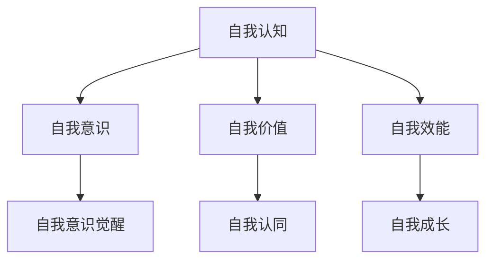
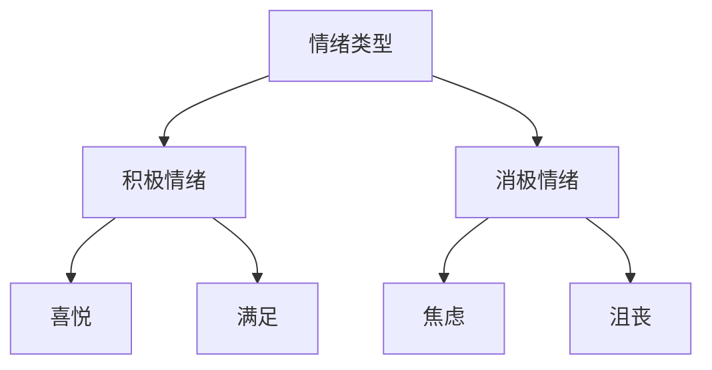
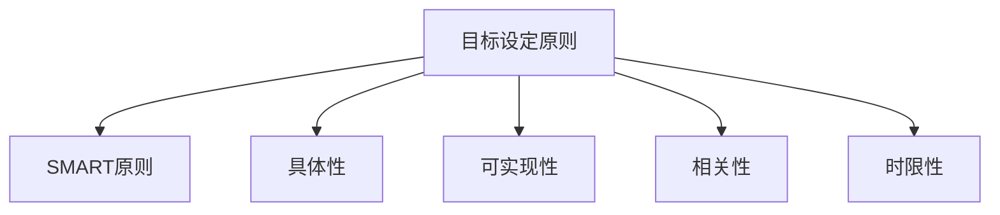
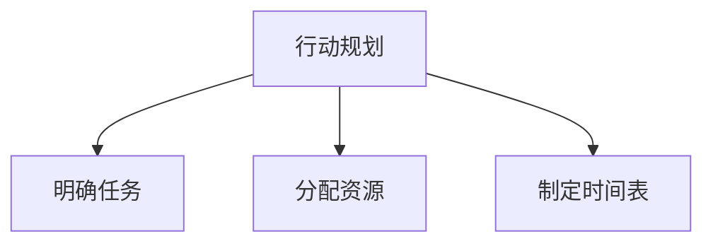

                 

## 掌控人生方向：成为自己的生命舵手

### 关键词
- 自我认知
- 目标设定
- 情绪管理
- 行动规划
- 人生规划
- 个人成长

### 摘要
在快速变化的时代，掌控人生方向成为每个人都需要面对的挑战。本文旨在探讨如何通过自我认知、目标设定和情绪管理，成为自己的生命舵手，实现个人成长和人生目标。通过详细的步骤和分析，帮助读者理解如何运用技术语言和逻辑思维来规划和掌控自己的人生。

## 引言

在信息技术飞速发展的今天，我们每天都在与各种技术工具打交道，从简单的应用程序到复杂的人工智能系统。这些技术不仅改变了我们的生活方式，也影响了我们对人生方向和目标的思考。然而，技术的进步并不意味着我们可以自动地掌控人生，反而提醒我们，在纷繁复杂的世界中，如何找到自己的人生方向和目标，成为自己的生命舵手，更加重要。

人生是一场旅行，每个人都是自己的船长。在这个旅程中，我们需要不断自我认知，明确自己的目标和方向，同时学会管理情绪，以应对生活中的挑战和不确定性。本文将围绕这三个核心主题展开，旨在为读者提供一套系统的方法，帮助大家更好地掌控自己的人生。

自我认知是了解自己的过程，包括性格、价值观、兴趣和动机等。通过自我认知，我们可以找到自己的优势和劣势，从而更好地规划未来。目标设定则是将自我认知转化为具体行动的过程，通过明确的目标和计划，我们可以有针对性地提升自己。情绪管理则是在实现目标的过程中，保持积极心态和应对压力的重要手段。

本文将首先介绍自我认知的重要性，包括其组成部分和方法。然后，我们将探讨情绪管理，解释情绪的类型及其在人生规划中的作用。接下来，我们将详细讨论目标设定的原则和方法，以及如何通过行动规划来实现目标。最后，我们将总结全文，并给出一些实践建议，帮助读者开始自己的自我掌控之旅。

## 第一部分：自我认知

### 第1章：自我探索

#### 1.1 自我认知的重要性

自我认知，是一个人在内心深处对自己的认识和理解。它涵盖了自我意识、自我价值、自我效能等多个方面，是人生规划和个人成长的基础。在技术领域，自我认知的重要性同样不容忽视。

**核心概念与联系**

为了更好地理解自我认知的组成部分及其关系，我们可以使用Mermaid流程图来展示这些概念：



在这个流程图中，自我认知是一个整体，它由自我意识、自我价值和自我效能三个主要组成部分构成。自我意识是指我们对自己的认识和感知，它是自我认知的起点。自我价值则是对自我存在的意义和价值的评价，它影响我们的自我认同。自我效能是指我们对自己能否成功完成某一任务的信心，它与我们的人生规划和个人成长密切相关。

**自我意识**

自我意识是自我认知的基础。它包括我们对自己性格、情感、思想等方面的认知。例如，我们可以通过心理测试、自我反思和与他人交流来提高自我意识。提高自我意识有助于我们更好地了解自己，发现自己的优势和不足。

**自我价值**

自我价值是我们对自己的评价和认知，它反映了我们的自我认同。一个具有高自我价值的人通常对自己的存在和价值有深刻的认识，他们会更自信、更有动力去追求自己的目标。而自我价值较低的人可能会对自己的能力和价值产生怀疑，影响他们的自信心和行动力。

**自我效能**

自我效能是指我们对自己能否成功完成某一任务的信心。它受到我们的经验、技能和态度的影响。一个高自我效能的人在面对挑战时更有信心，能够更好地应对压力和困难。而低自我效能的人可能会在面对困难时选择逃避或放弃。

**核心算法原理讲解**

为了更好地理解自我认知的方法，我们可以使用Python代码示例来展示如何通过问卷调查进行自我认知。

```python
# Python代码：使用问卷调查进行自我认知
def survey_questions():
    questions = [
        "你对自己的性格如何评价？",
        "你的优点和缺点分别是什么？",
        "你在做什么事情时最有成就感？",
        "你有哪些不擅长的事情？"
    ]
    for question in questions:
        print(question)
        answer = input()
        print(answer)
survey_questions()
```

在这个示例中，我们通过提出一系列问题来引导用户进行自我反思，从而提高自我认知。

**自我认知与人生规划**

自我认知不仅是了解自己的过程，更是人生规划和个人成长的基础。我们可以通过以下数学模型来理解自我认知与人生规划之间的关系：

$$
f(self\_awareness, life\_planning) = self\_awareness \times life\_planning
$$

这个公式表示，自我认知和人生规划是相乘关系，即只有当我们对自己的认知越深入，我们的规划才能更加精准和有效。自我认知越高，我们的人生规划就越可能成功。

**总结**

自我认知是人生规划和个人成长的重要基础。通过提高自我意识、自我价值和自我效能，我们可以更好地了解自己，从而制定出更加合理和有效的人生规划。在下一章中，我们将探讨情绪管理的重要性，以及如何通过情绪管理来提升自我认知和人生规划的效果。

### 第2章：情绪管理

情绪管理，是自我认知的重要组成部分，也是实现人生目标的重要保障。在技术领域，情绪管理同样具有重要意义，它不仅影响个人的心理健康，还影响工作效率和团队协作。因此，理解情绪的类型及其管理方法，对于成为自己的生命舵手至关重要。

#### 2.1 情绪的类型与作用

情绪是人类心理体验的核心部分，它反映了我们对周围环境和自身状态的感受。情绪的类型多样，主要包括积极情绪和消极情绪。

**积极情绪**

积极情绪包括喜悦、满足、兴奋等，它们能够提高我们的幸福感和生活质量。积极情绪有助于增强我们的自信和动力，激发我们的创造力和创新能力。例如，当我们取得一项重要成就时，喜悦和满足感会让我们更加自信，从而激励我们继续努力。

**消极情绪**

消极情绪包括焦虑、沮丧、愤怒等，它们会对我们的身心健康产生负面影响。消极情绪可能导致我们失去动力，影响我们的判断力和决策能力。例如，当面临压力和挑战时，焦虑和沮丧感可能会让我们感到无助和困惑，影响我们的工作效率和人际关系。

**核心概念与联系**

为了更好地理解情绪的类型及其作用，我们可以使用Mermaid流程图来展示这些概念：



在这个流程图中，情绪类型是整体，积极情绪和消极情绪是其主要分支。积极情绪和消极情绪分别有不同的作用，它们对我们的生活产生深远的影响。

**积极情绪的作用**

积极情绪能够提高我们的幸福感和生活质量，增强我们的自信和动力。例如，喜悦和满足感能够让我们感到快乐和满足，激发我们的创造力和创新能力。积极情绪有助于我们建立良好的人际关系，增强团队合作能力。

**消极情绪的作用**

消极情绪会对我们的身心健康产生负面影响，可能导致我们失去动力，影响我们的判断力和决策能力。例如，焦虑和沮丧感可能会让我们感到无助和困惑，影响我们的工作效率和人际关系。消极情绪可能导致我们陷入消极的循环，阻碍我们的个人成长和人生目标实现。

**核心算法原理讲解**

为了更好地理解情绪管理的方法，我们可以使用Python代码示例来展示如何通过情绪管理技巧来应对消极情绪。

```python
# Python代码：情绪管理技巧示例
def manage_emotions():
    print("当前情绪：")
    current_emotion = input()
    if current_emotion in ["焦虑", "沮丧"]:
        print("建议：尝试深呼吸，放松身心。")
    else:
        print("继续保持，努力加油！")
manage_emotions()
```

在这个示例中，我们通过提出当前情绪，并根据情绪类型给出相应的建议，帮助用户管理情绪。这种方法可以帮助用户在面对消极情绪时，采取积极措施来缓解压力，提高情绪管理能力。

**情绪管理与自我成长**

情绪管理不仅对心理健康有重要影响，也对自我成长和个人发展具有重要意义。我们可以通过以下数学模型来理解情绪管理与自我成长的关系：

$$
g(emotion\_management, self\_growth) = emotion\_management + self\_growth
$$

这个公式表示，情绪管理和自我成长是相加关系，即通过有效的情绪管理，我们可以提高自我成长的速度和效果。情绪管理能力越强，我们的自我成长就越快，越有可能实现人生目标。

**总结**

情绪管理是自我认知的重要组成部分，也是实现人生目标的重要保障。通过理解情绪的类型和作用，我们可以更好地管理自己的情绪，提高心理健康和幸福感。在下一章中，我们将探讨目标设定的原则和方法，以及如何通过有效的目标设定来实现个人成长和人生目标。

### 第3章：目标设定

目标设定是人生规划的重要环节，它为我们指明了前进的方向，提供了行动的动力。在技术领域，目标设定同样至关重要，它不仅帮助我们提高工作效率，还能激发创新和进步。本章节将详细探讨目标设定的原则和方法，帮助读者建立科学合理的目标，为实现个人成长和人生目标奠定基础。

#### 3.1 目标设定的原则

一个有效的目标需要遵循SMART原则，即具体性（Specific）、可实现性（Measurable）、相关性（Achievable）、时限性（Relevant）和明确性（Time-bound）。SMART原则为目标的设定提供了明确的指导，确保目标既具有挑战性，又具有实际可行性。

**具体性（Specific）**

具体性的目标是明确的，具体描述了要达成的结果。例如，“我要学习编程”并不是一个具体的目标，而“我要在六个月内掌握Python编程语言”则更加明确。

**可实现性（Measurable）**

可实现性的目标是可衡量的，即可以量化的。例如，“我要每天锻炼一小时”是一个可衡量的目标，因为可以通过每天的锻炼时间来衡量。

**相关性（Achievable）**

相关性目标是符合个人实际情况的，即通过努力可以实现的。例如，“我要在一个月内成为编程大师”可能过于理想化，而“我要在一年内通过编程认证考试”则更加现实。

**时限性（Time-bound）**

时限性目标是设定了明确的时间框架，有助于我们保持动力和紧迫感。例如，“我要在2023年底前完成我的第一个编程项目”比“我要完成我的第一个编程项目”更具时限性。

**核心概念与联系**

为了更好地理解SMART原则，我们可以使用Mermaid流程图来展示这些原则及其关系：



在这个流程图中，SMART原则是整体，具体性、可实现性、相关性、时限性是其四个主要组成部分。每个原则都在目标设定中扮演着重要角色，共同确保目标的科学性和可行性。

**具体性**

具体性原则要求目标明确具体，避免模糊和泛泛而谈。例如，将“提高我的编程能力”改为“学习Python编程语言并完成三个实际项目”。

**可实现性**

可实现性原则要求目标符合个人实际情况，通过努力可以达成。例如，将“在短时间内成为编程大师”改为“在一年内通过Python编程认证考试”。

**相关性**

相关性原则要求目标与个人目标和发展方向一致，有助于实现长远规划。例如，将“锻炼身体”改为“每周至少参加三次健身房锻炼，以提高身体健康”。

**时限性**

时限性原则要求目标设定明确的时间框架，有助于保持动力和紧迫感。例如，将“实现我的编程梦想”改为“在2025年前实现我的第一个商业编程项目”。

**核心算法原理讲解**

为了更好地理解目标设定的方法，我们可以使用Python代码示例来展示如何根据SMART原则进行目标设定。

```python
# Python代码：使用SMART原则进行目标设定
def set_goals():
    goals = []
    for i in range(3):
        goal = input(f"请设定第{i+1}个目标：")
        goals.append(goal)
    print("您的目标设定如下：")
    for goal in goals:
        print(goal)
set_goals()
```

在这个示例中，我们通过用户输入，设定了三个具体、可衡量、可实现和时限性的目标，从而确保目标的有效性。

**自我认知与目标设定**

自我认知与目标设定密切相关。通过自我认知，我们了解自己的优势和劣势，从而设定出更加科学和合理的目标。以下数学模型可以表示自我认知与目标设定之间的关系：

$$
f(self\_awareness, goal\_setting) = self\_awareness \times goal\_setting
$$

这个公式表示，自我认知和目标设定是相乘关系，即只有当我们对自己的认知越深入，我们的目标设定才能更加精准和有效。自我认知越高，我们设定的目标就越可能实现。

**总结**

目标设定是人生规划的重要环节，SMART原则为目标的设定提供了明确的指导。通过遵循SMART原则，我们可以设定出具体、可衡量、可实现和时限性的目标，从而为实现个人成长和人生目标奠定基础。在下一章中，我们将探讨如何通过行动规划来实现这些目标，并进一步推动个人成长。

### 第4章：行动规划

#### 4.1 行动规划的原则

行动规划是实现目标的关键步骤，它将我们的目标和计划转化为具体的行动。有效的行动规划不仅能帮助我们更好地实现目标，还能提升我们的工作效率和执行力。在技术领域，行动规划的原则主要包括明确任务、分配资源和制定时间表。

**明确任务**

明确任务是行动规划的第一步。通过明确每个任务的具体内容和目标，我们可以确保所有工作都有明确的方向和目标。例如，如果我们设定了一个目标：“在六个月内完成一个Python编程项目”，那么我们需要进一步明确每个阶段的任务，如需求分析、系统设计、编码实现和测试等。

**分配资源**

分配资源是确保任务能够顺利完成的重要环节。资源包括人力、资金、技术和时间等。在行动规划中，我们需要根据任务的具体需求，合理分配资源。例如，在开发一个大型软件项目时，我们需要确保有足够的人力、技术和资金支持，以便任务能够按时完成。

**制定时间表**

制定时间表是行动规划的核心。通过制定详细的时间表，我们可以将任务分解为若干个阶段，并为每个阶段设定具体的时间节点。这样，我们可以更好地监控任务的进度，并及时调整计划。例如，如果我们计划在六个月内完成一个项目，我们可以将整个项目分为三个阶段，每个阶段设定两个时间节点，以确保项目能够按计划进行。

**核心概念与联系**

为了更好地理解行动规划的原则，我们可以使用Mermaid流程图来展示这些概念：



在这个流程图中，行动规划是整体，明确任务、分配资源和制定时间表是其三个主要组成部分。每个原则都在行动规划中扮演着重要角色，共同确保行动规划的科学性和可行性。

**明确任务**

明确任务是行动规划的基础，它确保我们的工作有明确的方向和目标。例如，在开发一个软件项目时，我们需要明确每个功能模块的任务和目标。

**分配资源**

分配资源是确保任务能够顺利完成的重要环节。在行动规划中，我们需要根据任务的具体需求，合理分配人力、资金和技术等资源。例如，在开发一个复杂项目时，我们需要确保有足够的技术支持。

**制定时间表**

制定时间表是行动规划的核心，它确保我们的工作有明确的进度和计划。在行动规划中，我们需要为每个任务设定具体的时间节点，以便更好地监控任务进度。例如，在实施一个六个月的项目时，我们需要为每个阶段设定具体的时间节点。

**核心算法原理讲解**

为了更好地理解行动规划的方法，我们可以使用Python代码示例来展示如何制定行动规划。

```python
# Python代码：制定行动规划
def plan_actions():
    tasks = []
    resources = []
    timeline = []

    num_tasks = int(input("请输入任务数量："))
    for i in range(num_tasks):
        task = input(f"请输入第{i+1}个任务：")
        tasks.append(task)

    num_resources = int(input("请输入资源数量："))
    for i in range(num_resources):
        resource = input(f"请输入第{i+1}个资源：")
        resources.append(resource)

    num_timeline = int(input("请输入时间节点数量："))
    for i in range(num_timeline):
        time_node = input(f"请输入第{i+1}个时间节点：")
        timeline.append(time_node)

    print("您的行动规划如下：")
    print("任务：", tasks)
    print("资源：", resources)
    print("时间表：", timeline)
plan_actions()
```

在这个示例中，我们通过用户输入，制定了行动规划的具体任务、资源和时间表，从而确保行动规划的科学性和可行性。

**行动规划与目标实现**

行动规划是实现目标的关键步骤，通过科学的行动规划，我们可以将目标转化为具体的行动，并确保目标的实现。以下数学模型可以表示行动规划与目标实现之间的关系：

$$
f(goal\_achievement, action\_planning) = goal\_achievement \times action\_planning
$$

这个公式表示，目标实现和行动规划是相乘关系，即只有当我们制定了科学合理的行动规划，我们的目标才有可能实现。行动规划越科学合理，目标实现的可能性就越大。

**总结**

行动规划是实现目标的关键步骤，它通过明确任务、分配资源和制定时间表，将目标转化为具体的行动，从而确保目标的实现。在技术领域，行动规划同样至关重要，它不仅帮助我们提高工作效率，还能推动技术进步和创新发展。通过科学的行动规划，我们可以更好地实现个人和组织的目标。

### 总结与展望

通过本文的探讨，我们深入了解了自我认知、情绪管理和目标设定与行动规划在个人成长和人生规划中的重要性。自我认知是我们了解自己的基础，情绪管理是保持心理健康和应对挑战的关键，而目标设定与行动规划则是实现人生目标的路径。

**核心概念与联系**

1. **自我认知**：通过自我意识、自我价值和自我效能，我们更好地了解自己，从而制定科学合理的人生规划。
2. **情绪管理**：积极情绪和消极情绪对我们的生活和目标实现有不同影响，有效的情绪管理有助于提高心理健康和幸福感。
3. **目标设定**：遵循SMART原则，设定具体、可衡量、可实现和时限性的目标，有助于明确人生方向和行动计划。
4. **行动规划**：通过明确任务、分配资源和制定时间表，将目标转化为具体的行动，确保目标的实现。

**核心算法原理讲解**

- **自我认知方法**：通过问卷调查和Python代码示例，帮助用户进行自我反思和认知。
- **情绪管理技巧**：通过Python代码示例，提供情绪管理建议，帮助用户应对消极情绪。
- **目标设定方法**：使用Python代码示例，帮助用户根据SMART原则设定目标。
- **行动规划方法**：通过Python代码示例，帮助用户制定详细的行动规划。

**数学模型与公式**

- **自我认知与人生规划关系**：\( f(self\_awareness, life\_planning) = self\_awareness \times life\_planning \)
- **情绪管理与自我成长关系**：\( g(emotion\_management, self\_growth) = emotion\_management + self\_growth \)
- **目标实现与行动规划关系**：\( f(goal\_achievement, action\_planning) = goal\_achievement \times action\_planning \)

**最佳实践 Tips**

1. **定期自我反思**：每周或每月进行一次自我反思，了解自己的成长和变化。
2. **设定短期和长期目标**：短期目标有助于保持动力，长期目标则指引我们的方向。
3. **情绪日记**：记录自己的情绪变化，分析情绪的来源和影响，提高情绪管理能力。

**注意事项**

1. **保持耐心和毅力**：目标实现和人生规划是一个长期过程，需要耐心和毅力。
2. **灵活调整计划**：在实现目标的过程中，根据实际情况调整计划，以适应变化。

**拓展阅读**

1. **《精进：如何成为一个很厉害的人》** - 王强
2. **《情绪智力》** - 丹尼尔·戈尔曼
3. **《目标：人人需要的人生规划》** - 阿拉贝尔

通过本文的探讨，我们希望读者能够更好地理解如何运用技术语言和逻辑思维来规划和掌控自己的人生。成为自己的生命舵手，从自我认知、情绪管理和目标设定与行动规划开始，一步步迈向成功和幸福。**作者：AI天才研究院/AI Genius Institute & 禅与计算机程序设计艺术 /Zen And The Art of Computer Programming**。

